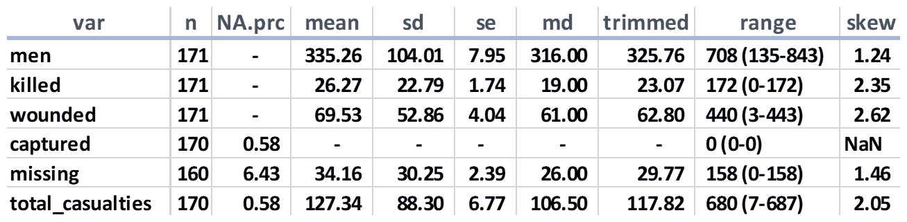
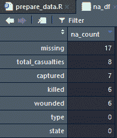
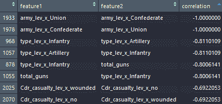

# 一、准备和理解数据

“我们必须利用每一份数据和每一条信息，希望这将有助于我们准确地评估球员。对我们来说，那是我们的命根子。”

–比利·比恩*，奥克兰运动家队总经理，《金钱球》一书的主角*

研究一致表明，机器学习和数据科学从业者将大部分时间花在操纵数据和为分析做准备上。事实上，许多人认为这是他们工作中最乏味和最不愉快的部分。许多公司都在提供解决这个问题的方法，但是在我看来，在这一点上结果是不同的。因此，在第一章中，我将努力提供一种解决问题的方法，以减轻为机器学习准备数据的负担。本章介绍的方法将作为数据准备和理解许多后续章节的基础。我建议，一旦你对这个经过验证的真实过程感到舒适，它很可能会成为你最喜欢的机器学习的一部分——对我来说也是如此。

以下是我们将在本章中涉及的主题:

*   概观
*   读取数据
*   处理重复观察
*   描述统计学
*   探索分类变量
*   处理缺失值
*   零方差和接近零方差特征
*   处理数据
*   相关性和线性


# 概观

如果你还没有接触过庞大、混乱的数据集，那么请耐心等待，因为这只是时间问题。如果您遇到过这样的数据，它是在您几乎没有专业知识的领域中吗？如果没有，那么我再次建议，这只是一个时间问题。构成这一术语*杂乱*数据的一些常见问题包括:

*   缺少或无效的值
*   算法产品中出现的分类特征中的新级别
*   邮政编码等分类要素中的高基数
*   高维度
*   重复观察

所以这就引出了一个问题:我们该怎么办？首先，我们需要了解在流程的这个阶段需要执行哪些关键任务。以下任务是构建学习算法的基础。它们来自 SPSS 的论文， *CRISP-DM 1.0* ，这是一个循序渐进的数据挖掘指南，可在[https://the-modeling-agency.com/crisp-dm.pdf](https://the-modeling-agency.com/crisp-dm.pdf)获得:

*   数据理解:
    1.  收集
    2.  形容
    3.  探索
    4.  核实
*   数据准备:
    1.  挑选
    2.  干净的
    3.  建造
    4.  合并
    5.  格式

当然，这是一个很好的列举过程，但是我们真正需要做什么呢？我建议，在实际操作中，一旦数据被连接并加载到您的机器、云或您使用的任何东西中，必须完成以下*:*

 **   理解数据结构
*   重复数据删除观察
*   根据需要消除零方差特征和低方差特征
*   处理缺失值
*   创建虚拟特征(一键编码)
*   检查并处理高度相关的要素和具有完美线性关系的要素
*   根据需要缩放
*   根据需要创建其他特征

许多人认为这是一项艰巨的任务。我不喜欢，事实上，我很喜欢。如果做得正确，并明智地应用判断，它应该减少在项目的第一阶段花费的时间，并有助于训练你的学习算法。前面的步骤都不具有挑战性，但是编写执行每项任务的代码会花费相当多的时间。

嗯，这就是本章的好处。下面的例子将带您完成任务和完成任务的 R 代码。代码足够灵活，您应该能够将它应用到您的项目中。此外，它还会帮助你了解数据，如果事实上可以的话，你可以明智地与**主题专家** ( **中小企业**)讨论这些数据。

在接下来的实践练习中，我们将使用一个小型数据集。然而，它存在前面描述的所有问题。不要让小尺寸欺骗了你，因为我们将把我们在这里学到的东西用于后续章节中更大规模的数据集。

作为背景，我们将使用的数据是我手工精心收集的。这是 1863 年 7 月 1 日^(1 日) -3 日^(3 日)美国内战期间葛底斯堡战役中双方军队的战斗顺序，以及 7 月 3 日^(3 日)当天的伤亡报告。我特意选择了这个数据，因为我相当肯定你对此知之甚少。别担心，我是这场战斗中的 SME，我会一步一步地帮你。我们在这一章中不会涉及的一件事是处理大量的文本特征，我们将在本书的后面讨论。已经说得够多了；我们开始吧！

用于创建数据集的来源是 J. David Petruzzi 和 Steven A. Stanley 于 1863 年 6 月 9 日至 7 月 14 日撰写的《葛底斯堡战役:数字和损失:概要、战斗顺序、兵力、伤亡和地图》。


# 读取数据

第一个任务将加载数据，并展示如何获得对其结构和维度的理解，以及安装必要的包。

您有两种方法来访问驻留在 GitHub 上的数据。你可以通过这个链接直接从网站下载`gettysburg.csv`:[https://github . com/packt publishing/Advanced-Machine-Learning-with-R/blob/master/Data/Gettysburg . CSV](https://github.com/PacktPublishing/Advanced-Machine-Learning-with-R/blob/master/Data/gettysburg.csv)，或者你可以使用 RCurl 包。这里有一个如何使用这个包的例子:[https://github . com/opetchey/RREEBES/wiki/Reading-data-and-code-from-an-online-github-repository](https://github.com/opetchey/RREEBES/wiki/Reading-data-and-code-from-an-online-github-repository)。

假设您的工作目录中有这个文件，那么让我们从安装必要的包开始:

```py
install.packages("caret")
install.packages("janitor")
install.packages("readr")
install.packages("sjmisc")
install.packages("skimr")
install.packages("tidyverse")
install.packages("vtreat")
```

让我快速记录一下我是如何(艰难地)学会如何正确编写代码的。安装好包后，我们现在可以明确地将库调用到 R 环境中。然而，在将代码投入生产时，指定一个不在 base R 中的函数是最佳实践，也是必要的。首先，这有助于您和其他不幸的人理解哪个库映射到特定的函数，从而阅读您的代码。它还消除了潜在的错误，因为不同的包调用同一事物的不同函数。我想到的例子是`tsoutliers()`函数。该功能在`forecast`包中可用，在早期版本中包含在`tsoutliers`包中。现在，我知道这种额外的打字看起来很笨拙，没有必要，但是一旦你训练自己去做，你会发现这种努力是值得的。

有一个库我们称之为`magrittr`，它允许使用管道操作符`%>%`将代码链接在一起:

```py
library(magrittr)
```

我们现在准备加载`.csv`文件。这样做时，让我们利用来自`readr`的`read_csv()`函数，因为它比 base R 更快，并且创建了一个可移植的数据帧。在大多数情况下，以`tidyverse`风格使用 tibbles 更容易编写和理解。如果你想了解`tidyverse`的所有好处，可以看看他们的网站:[tidyverse.org](http://tidyverse.org)。

我们唯一需要在函数中指定的是我们的文件名:

```py
gettysburg <- readr::read_csv("~/gettysburg.csv")
```

下面是列(特征)名称:

```py
colnames(gettysburg)
[1]  "type"           "state"          "regiment_or_battery" "brigade"
[5]  "division"       "corps"          "army"                "july1_Commander"
[9]  "Cdr_casualty"   "men"            "killed"              "wounded"
[13] "captured"       "missing"        "total_casualties"    "3inch_rifles"
[17] "4.5inch_rifles" "10lb_parrots"   "12lb_howitzers"      "12lb_napoleons"
[21] "6lb_howitzers"  "24lb_howitzers" "20lb_parrots"        "12lb_whitworths"
[25] "14lb_rifles"    "total_guns"
```

我们在这个数据中有 26 个特征，你们中的一些人会问自己这样的问题，*一只 20 磅重的鹦鹉到底是什么？如果你把它放入搜索引擎，你可能会找到这只鸟，而不是 20 磅重的鹦鹉膛线火炮。您可以在全球环境视图中查看 RStudio 中的数据维度，也可以自己挖掘查看其中的 590 个观察值:*

```py
dim(gettysburg)
[1] 590 26
```

在 RStudio 中，你可以点击全局环境中的 tibble 名称或者运行`View(tibblename)`代码，它将打开一个包含所有数据的电子表格。

因此，我们有对`26`特征的`590`观察，但是这些数据受到大量复杂数据中普遍存在的问题的困扰。接下来，我们将探索是否有任何重复的观察以及如何有效地处理它们。


# 处理重复观察

最简单的方法是使用 base R `duplicated()`函数创建一个与数据观察值相匹配的逻辑值向量。这些值将由`TRUE`或`FALSE`组成，其中`TRUE`表示重复。然后，我们将创建一个包含这些值及其计数的表，并确定哪些行是重复的:

```py
dupes <- duplicated(gettysburg)

table(dupes)
dupes
FALSE TRUE
  587    3

which(dupes == "TRUE")
[1] 588 589
```

如果您想看到实际的行，甚至将它们放入 tibble 数据帧中，看门人包有`get_dupes()`函数。这方面的代码很简单:`df_dupes <- janitor::get_dupes(gettysburg)`。

为了摆脱这些重复的行，我们很好地利用了`dplyr`包的`distinct()`函数，指定`.keep_all = TRUE`来确保我们将所有的特性返回到新的 tibble 中。注意`.keep_all`默认为`FALSE`:

```py
gettysburg <- dplyr::distinct(gettysburg, .keep_all = TRUE)
```

注意，在全局环境中，tibble 现在是对`26`变量/特征的`587`观察的维度。

随着重复观察的结束，是时候开始深入数据并通过探索数量特征的描述性统计来更好地理解其结构了。


# 描述统计学

传统上，我们可以使用 base R `summary()`函数来识别一些基本的统计数据。现在，最近我可能会补充，我喜欢使用包`sjmisc`和它的`descr()`功能。它产生一个可读性更强的输出，您可以将该输出分配给一个数据帧。有效的方法是创建数据框架，将其保存为`.csv`，并在闲暇时探索它。它只自动选择数字特征。它也很适合`tidyverse`，这样你就可以整合`dplyr`的功能，比如`group_by()`和`filter()`。这里有一个例子，在我们的例子中，我们检查了邦联军队步兵的描述性统计数据。输出将包括以下内容:

*   `var`:特征名称
*   `type`:整数
*   `n`:观察次数
*   `NA.prc`:缺失值的百分比
*   `mean`
*   `sd`:标准偏差
*   `se`:标准误差
*   `md`:中值
*   `trimmed`:修整平均值
*   `range`
*   `skew`

```py
gettysburg %>%
  dplyr::filter(army == "Confederate" & type == "Infantry") %>%
  sjmisc::descr() -> descr_stats

readr::write_csv(descr_stats, 'descr_stats.csv')
```

以下是保存到电子表格中的上述代码的简短输出:



在这一张表中，我们可以看出一些相当有趣的花絮。特别是每个要素缺失值的百分比。如果您修改宝贵的代码来检查联邦军队，您会发现没有丢失值。南方的篡位者缺少价值观的原因是基于几个因素；要么是粗制滥造的工作人员在 7 月 3 日编辑这些数字，要么是这些记录在几年后丢失了。请注意，对于捕获的男性人数，如果您删除缺失值，所有其他值都为零，因此我们可以用它来替换缺失值。与联邦军相反，叛军没有报告军队被俘，而是报告军队失踪。

一旦您对描述性统计感到满意，就可以在下一节继续探索分类特征。


# 探索分类变量

当谈到理解你的分类变量时，有许多不同的方法。我们可以很容易地在一个特性上使用 base R `table()`函数。如果你只是想看看一个特性中有多少不同的级别，那么`dplyr`就很好。在这个例子中，我们检查`type`，它有三个独特的级别:

```py
dplyr::count(gettysburg, dplyr::n_distinct(type))
```

上述代码的输出如下:

```py
# A tibble: 1 x 2
     `dplyr::n_distinct(type)`        n
                                            <int> <int>
                                                     3    587
```

现在让我们来看一种利用`tidyverse`原则探索所有分类特征的方法。这样做总是允许您保存 tibble 并根据需要深入检查结果。以下是将所有分类特征放入一个单独表中的方法:

```py
gettysburg_cat <-
  gettysburg[, sapply(gettysburg, class) == 'character']
```

使用`dplyr`，您现在可以总结所有的特性以及每个特性中不同级别的数量:

```py
gettysburg_cat %>%
  dplyr::summarise_all(dplyr::funs(dplyr::n_distinct(.)))
```

上述代码的输出如下:

```py
# A tibble: 1 x 9
   type  state regiment_or_battery brigade division corps  army july1_Commander  Cdr_casualty
 <int> <int>                                  <int>      <int>      <int> <int> <int>                            <int>                  <int>
          3       30                                      275           124            38        14          2                                586                           6
```

请注意，`july1_Commander`有`586`个不同的值。这意味着其中两名部队指挥官拥有相同的军衔和姓氏。我们也可以推测这个特性对任何进一步的分析都没有价值，但是我们将在前面的几节中处理这个问题。

假设我们对`Cdr_casualty`特性的每个级别的观察次数感兴趣。是的，我们可以使用`table()`，但是像前面讨论的那样以 tibble 的形式产生输出怎么样？试试这段代码:

```py
gettysburg_cat %>% 
  dplyr::group_by(Cdr_casualty) %>%
  dplyr::summarize(num_rows = n())
```

上述代码的输出如下:

```py
# A tibble: 6 x 2
 Cdr_casualty                    num_rows
    <chr>                           <int>
 1 captured                            6
 2 killed                             29
 3 mortally wounded                   24
 4 no                                405
 5 wounded                           104
 6 wounded-captured                   19
```

说到表，让我们来看一种使用两个特性生成表的友好方式。该代码采用了按军队比较指挥官伤亡的思想:

```py
gettysburg_cat %>%
  janitor::tabyl(army, Cdr_casualty)
```

上述代码的输出如下:

```py
army   captured killed mortally wounded   no  wounded  wounded-captured
Confederate  2    15               13     165    44             17
Union        4    14               11     240    60              2
```

自己探索数据，一旦你熟悉了分类变量，让我们来解决缺失值的问题。


# 处理缺失值

处理丢失的值可能有点棘手，因为有许多方法可以完成这项任务。我们已经在描述性统计一节中看到了缺失值。首先，让我们按特征全面统计缺失的数量，然后我们将讨论如何处理它们。接下来我要演示的是如何将按功能计数放入我们可以在 RStudio 中浏览的数据帧中:

```py
na_count <-
  sapply(gettysburg, function(y)
    sum(length(which(is.na(
      y
    )))))

na_df <- data.frame(na_count)

View(na_df)
```

以下是按降序对 dataframe 进行排序后，上述代码生成的屏幕截图:



您可以清楚地看到缺失最多的要素的缺失计数被讽刺地命名为缺失，总共有 17 个观测值。

那么我们在这里应该做什么，或者更恰当地说，我们在这里可以做什么？有几种选择:

*   **什么都不做**:但是，有些 R 函数会省略 NAs，有些函数会失败并产生错误。
*   **用 NAs** 省略所有观察:在大规模数据集中，它们可能有意义，但我们冒着丢失信息的风险。
*   **估算值**:它们可以简单到用中间值代替缺失值，或者创建一个算法来估算值。
*   **虚拟编码**:将缺失值转化为 0 或-999 等数值，对虚拟特征进行编码，如果某个特定观察的特征缺失，虚拟特征编码为 1，否则编码为 0。

我可以用一整章，实际上是一整本书来讨论这个问题，深入研究随机失踪和其他问题，但是我受过训练——事实上，我会坚持——后一种方法。这从来没有让我失望过，其他人可能会有点问题。虚拟编码的好处是，你不会丢失信息。事实上，缺失本身可能是一个本质特征。

关于缺失值处理的完整讨论，可以参考以下文章:[http://www.stat.columbia.edu/~gelman/arm/missing.pdf](http://www.stat.columbia.edu/~gelman/arm/missing.pdf)和[https://pdfs . semantic scholar . org/4172/f 558219 b 94 f 850 c 6567 f 93 fa 60 dee 7 e 65139 . pdf](https://pdfs.semanticscholar.org/4172/f558219b94f850c6567f93fa60dee7e65139.pdf)。

这里有一个例子，说明我如何手动编写一个虚拟特性，并将 NAs 归零:

```py
gettysburg$missing_isNA <- 
  ifelse(is.na(gettysburg$missing), 1, 0)

gettysburg$missing[is.na(gettysburg$missing)] <- 0
```

代码的第一次迭代为缺失的功能创建一个虚拟功能，第二次迭代将缺失的任何 NAs 更改为零。在接下来的部分中，数据集将被完全处理(处理),其他缺失值将被估算。


# 零方差和接近零方差特征

在继续处理数据集之前，很容易消除具有一个唯一值(零方差)或最常见值与下一个最常见值之比很高的要素，这样唯一值就很少(接近零方差)。为此，我们将依靠`caret`包和`nearZeroVar()`函数。我们首先创建一个数据帧，并使用除`saveMetrics = TRUE`之外的默认函数。我们需要制定规范来返回数据帧:

```py
feature_variance <- caret::nearZeroVar(gettysburg, saveMetrics = TRUE)
```

要了解`nearZeroVar()`功能的默认设置，并确定如何根据您的需求对其进行定制，只需在控制台中键入`?nearZeroVar`即可使用 R help 功能。

输出非常有趣，所以让我们看一下我们生成的前六行:

```py
head(feature_variance)
```

上述代码的输出如下:

```py
                       freqRatio     percentUnique    zeroVar     nzv
          type         3.186047      0.5110733        FALSE     FALSE
         state         1.094118      5.1107325        FALSE     FALSE
regiment_or_battery    1.105263     46.8483816        FALSE     FALSE
         brigade       1.111111     21.1243612        FALSE     FALSE
         division      1.423077      6.4735945        FALSE     FALSE
          corps        1.080000      2.3850085        FALSE     FALSE
```

两个关键列是`zeroVar`和`nzv`。它们充当该特征是零方差还是接近零方差的指示器；`TRUE`表示“是”,`FALSE`表示“不”。必须定义其他列:

*   `freqRatio`:这是最常见值相对于第二常见值的频率百分比。
*   `percentUnique`:唯一值的数量除以样本总数，再乘以 100。

让我用我们使用的数据来解释一下。对于`type`特性，最常见的值是`Infantry`，大约是`Artillery`的三倍。对于`percentUnique`，百分比越低，唯一值的数量越少。您可以研究该数据框架并调整函数，以确定您的相关切割点。对于本例，我们将通过运行以下代码来查看是否有零方差特性:

```py
which(feature_variance$zeroVar == 'TRUE')
```

上述代码的输出如下:

```py
[1] 17
```

唉，我们看到行`17`(特征`17`)的方差为零。让我们看看那会是什么:

```py
row.names(feature_variance[17, ])
```

上述代码的输出如下:

```py
[1] "4.5inch_rifles"
```

这对我来说很奇怪。这意味着我没有记录下把他们带到战场上的一个邦联单位的火炮数量。我在使用`caret`包中一个优雅的函数时发现了一个惊人的错误。哦，好吧，让我们创建一个新的 tibble，出于演示的目的，将它过滤掉:

```py
gettysburg_fltrd <- gettysburg[, feature_variance$zeroVar == 'FALSE']
```

这段代码消除了零方差特性。如果我们还想消除接近零的方差，只需运行代码并用`feature_variance$nzv`替换`feature_variance$zerVar`。

我们现在准备好执行这一过程的真正魔力并`treat`我们的数据。


# 处理数据

我说让我们对待数据是什么意思？我从包的作者 Nina Zumel 和 John Mount 那里学到了这个术语。你可以点击链接阅读他们关于这个主题的优秀论文:[https://arxiv.org/pdf/1611.09477.pdf](https://arxiv.org/pdf/1611.09477.pdf)。

他们提供的定义是:*以统计合理的方式为预测建模准备真实世界数据的处理器或调节器*。在处理数据时，您将摆脱前面讨论的许多数据准备难题。我们当前数据集的示例将很好地介绍这种方法的优点，以及如何根据您的需求对其进行定制。我倾向于认为处理数据是一次性编码的更聪明的版本。

该软件包提供了三个不同的函数来处理数据，但我只使用了一个，那就是`designTreatmentsZ()`，它处理特性时不考虑结果或响应。函数`designTreatmentsC()`和`designTreatmentsN()`分别基于分类和数字结果构建数据框架。这些函数提供了一种以单变量方式修剪要素的方法。我将提供进行特性选择的其他方法，所以这就是我使用那个特定函数的原因。我鼓励你自己去尝试。

我们在下面使用的函数将生成一个对象，您可以将其应用于训练、验证、测试甚至生产数据。在后面的章节中，我们将把重点放在训练和测试上，但是为了简单起见，让我们在不考虑任何分割的情况下处理整个数据。函数中有许多参数可以更改，但默认值通常就足够了。我们将指定输入数据、要包含的特性名称和`minFraction`，它由包定义为分类级别必须转换为指示列的可选最小频率。我选择了 5%和最小频率。在现实世界的数据中，我看到这个数字被修改了很多次，以找到正确的发生级别:

```py
my_treatment <- vtreat::designTreatmentsZ(
  dframe = gettysburg_fltrd,
  varlist = colnames(gettysburg_fltrd),
  minFraction = 0.05
)
```

我们现在有了一个存储了治疗计划的对象。现在我们只需使用`prepare()`函数将该处理应用于数据帧或 tibble，它将为我们提供一个经过处理的数据帧:

```py
gettysburg_treated <- vtreat::prepare(my_treatment, gettysburg_fltrd)

dim(gettysburg_treated)
```

上述代码的输出如下:

```py
[1]   587      54
```

我们现在有 54 个功能。让我们来看看他们的名字:

```py
colnames(gettysburg_treated)
```

上述代码的简短输出如下:

```py
[1]     "type_catP"       "state_catP"      "regiment_or_battery_catP"
[4]  "brigade_catP"    "division_catP"                    "corps_catP"
```

当您浏览这些名称时，您会注意到我们有以`catP`、`clean`和`isBAD`结尾的特性，以及其他以`_lev_x_`结尾的特性。让我们详细介绍一下每一项。至于`catP`特征，该函数创建了一个特征，它是该观察中分类级别的频率。那是什么意思？让我们来看看`type_catP`的表格:

```py
table(gettysburg_treated$type_catP)
```

上述代码的输出如下:

```py
0.080068143100   0.21976149914    0.70017035775
            47             129              411
```

这告诉我们，`47`行属于类别级别 *x* (在本例中是骑兵)，这是总观察值的 8%。因此，22%是炮兵，70%是步兵。这有助于进一步探索您的数据，并有助于调整您的类别级别的最低频率。我听说有人讨论过这些值可以帮助创建距离或相似性矩阵。

接下来是`clean`。如果您在`prepare()`函数中指定了参数，则这些是我们的数值特征，其缺失值为特征平均值，异常值为 winsorized 或 collared。我们没有，所以只估算缺失值。

下面是一篇来自 SAS 的关于 winsorizing 优点的有趣博文:[https://blogs . SAS . com/content/IML/2017/02/08/winsorization-good-bad-and-ugly . html](https://blogs.sas.com/content/iml/2017/02/08/winsorization-good-bad-and-ugly.html)。

说到缺失值，这就把我们带到了`isBAD`。这个特性是 1 表示缺失，0 表示没有缺失，我们讨论过我手动编码的地方。

最后，`lev_x`是特定分类级别的虚拟特征编码。如果你浏览为`states`热编码的关卡，你会发现佐治亚、纽约、北卡罗来纳、宾夕法尼亚、美国(这是美国正规军部队)和弗吉尼亚的特征。

我的偏好是去掉`catP`特性，去掉特性名称中的`clean`，将`isBAD`改为`isNA`。这是一个简单的任务，代码如下:

```py
gettysburg_treated <- 
  gettysburg_treated %>%
  dplyr::select(-dplyr::contains('_catP'))

colnames(gettysburg_treated) <-
  sub('_clean', "", colnames(gettysburg_treated))

colnames(gettysburg_treated) <-
  sub('_isBAD', "_isNA", colnames(gettysburg_treated))
```

我们准备好开始构建学习算法了吗？嗯，还没有。在下一节中，我们将处理高度相关和线性相关的特征。


# 相关性和线性

对于这个任务，我们回到我们的老朋友`caret`包。我们将首先使用 Spearman Rank 方法创建一个相关性矩阵，然后对所有高于`0.9`的相关性应用`findCorrelation()`函数:

```py
df_corr <- cor(gettysburg_treated, method = "spearman")

high_corr <- caret::findCorrelation(df_corr, cutoff = 0.9)
```

为什么斯皮尔曼和皮尔逊相关？Spearman 不受任何分布假设的约束，对于手头的任何任务都足够稳健:[http://www . statistics solutions . com/correlation-Pearson-Kendall-spearman/](http://www.statisticssolutions.com/correlation-pearson-kendall-spearman/)。

`high_corr`对象是一个与特性列号相对应的整数列表。让我们更深入地探讨一下:

```py
high_corr
```

上述代码的输出如下:

```py
[1]   9   4    22    43   3   5
```

列索引指的是以下功能名称:

```py
colnames(gettysburg_treated)[c(9, 4, 22, 43, 3, 5)]
```

上述代码的输出如下:

```py
[1]                       "total_casualties"       "wounded" "type_lev_x_Artillery"
 [4] "army_lev_x_Confederate" "killed_isNA"              "wounded_isNA"
```

我们看到了与其他特征高度相关的特征。例如，`army_lev_x_Confederate`与`army_lev_x_Union`完全负相关。毕竟，这里只能有两支军队，而英国冷流卫队的弗里曼特尔上校仅仅是一名观察员。要删除这些功能，只需根据我们创建的列表过滤您的数据框架:

```py
gettysburg_noHighCorr <- gettysburg_treated[, -high_corr]
```

给你，他们现在走了。但是等等！这似乎有点太客观了，也许我们应该将我们的判断或中小企业的判断应用到这个问题上？像以前一样，让我们创建一个表来进一步研究:

```py
df_corr <- data.frame(df_corr)

df_corr$feature1 <- row.names(df_corr)

gettysburg_corr <-
  tidyr::gather(data = df_corr,
                key = "feature2",
                value = "correlation",
                -feature1)

gettysburg_corr <- 
  gettysburg_corr %>%
  dplyr::filter(feature1 != feature2)
```

刚刚发生了什么？首先，相关矩阵被转换成数据帧。然后，行名成为第一个特性的值。使用`tidyr`，代码创建了第二个特征，并用一个观察值放置了适当的值，我们清理它以获得唯一的对。这个截图显示了结果。你可以看到邦联和联邦军队有一个完美的负相关:



您可以看到，像我们之前所做的那样，对相关性进行重复数据消除是安全的。我喜欢将此保存到电子表格中，并与中小型企业合作，了解我们可以删除或合并哪些功能等等。

处理完相关性后，我建议根据需要探索和去除线性组合。处理这些组合的方法类似于处理高相关性的方法:

```py
linear_combos <- caret::findLinearCombos(gettysburg_noHighCorr)

linear_combos
```

上述代码的输出如下:

```py
$`linearCombos`
 $`linearCombos`[[1]]
 [1] 16 7 8 9 10 11 12 13 14 15

 $remove
 [1] 16
```

输出告诉我们 feature column `16`与其他列是线性相关的，我们可以通过删除它来解决这个问题。这些功能名称是什么？让我们来看看:

```py
colnames(gettysburg_noHighCorr)[c(16, 7, 8, 9, 10, 11, 12, 13, 14, 15)]
```

上述代码的输出如下:

```py
[1]            "total_guns"         "X3inch_rifles" "X10lb_parrots"    "X12lb_howitzers" "X12lb_napoleons"
 [6] "X6lb_howitzers" "X24lb_howitzers" "X20lb_parrots" "X12lb_whitworths"          "X14lb_rifles"
```

移除数字`"total_guns"`上的特征将解决问题。这完全说得通，因为这是一个炮兵连的火炮数量。大多数炮兵连，尤其是在联邦，只有一种类型的枪。即使有多个线性组合，用这段代码去掉必要的特性也很容易:

```py
linear_remove <- colnames(gettysburg_noHighCorr[16])

df <- gettysburg_noHighCorr[, !(colnames(gettysburg_noHighCorr) %in% linear_remove)]

dim(df)
```

上述代码的输出如下:

```py
[1] 587   39
```

现在你有了它，一个漂亮干净的`587`观察和`39`特征的数据框架。现在，根据建模的不同，您可能需要缩放这些数据或执行其他转换，但是这种格式的数据使所有这些变得更容易。不管你对历史上最重要的战役之一，也是美国土地上最血腥的一场战役的先验知识或兴趣如何，你已经对战斗的顺序和团或连一级的伤亡有了一个可行的理解。开始处理你的数据，不是下周或下个月，而是现在！

如果你愿意，你可以在这里了解更多关于这场战役的信息:[https://www . battlefields . org/learn/civil-war/battles/Gettysburg](https://www.battlefields.org/learn/civil-war/battles/gettysburg)。


# 摘要

本章着眼于机器学习项目中常见的大型杂乱数据集的常见问题。这些包括但不限于以下内容:

*   缺少或无效的值
*   算法产品中出现的分类特征中的新级别
*   邮政编码等分类特征中的高基数
*   高维度
*   重复观察

本章通过展示如何探索数据、处理数据以及创建可用于开发学习算法的数据框架，提供了处理这些问题的规范方法。它也足够灵活，您可以修改代码以适应您的环境。这种方法应该使许多人觉得最艰苦、最耗时、最不愉快的工作变得容易。

这个任务完成后，我们现在可以在下一章使用线性回归开始我们的第一个建模任务。*