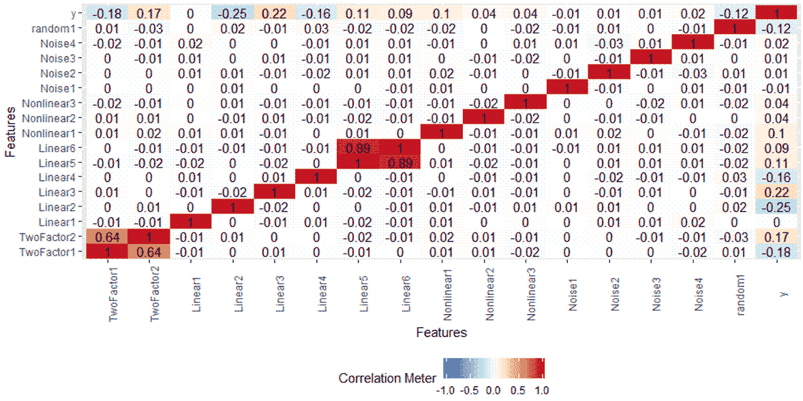
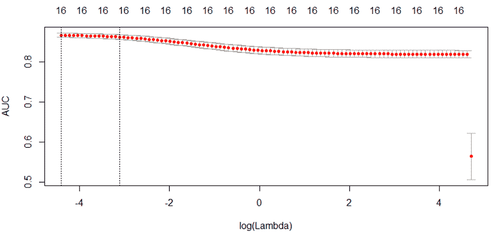
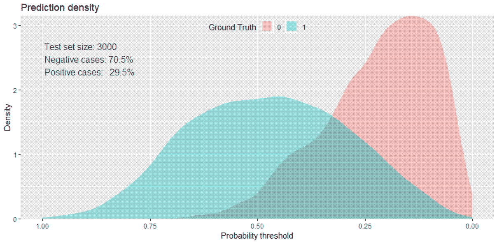
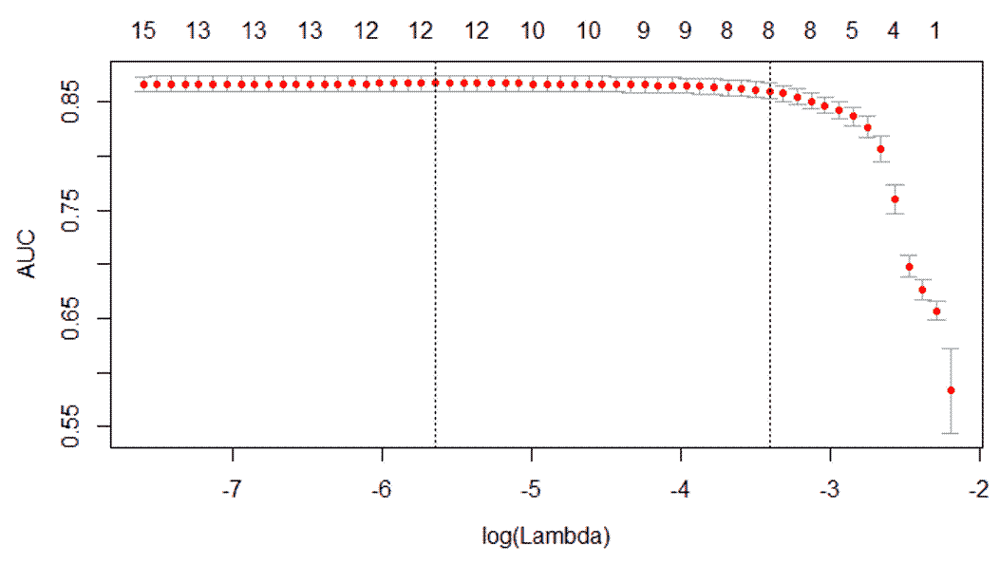
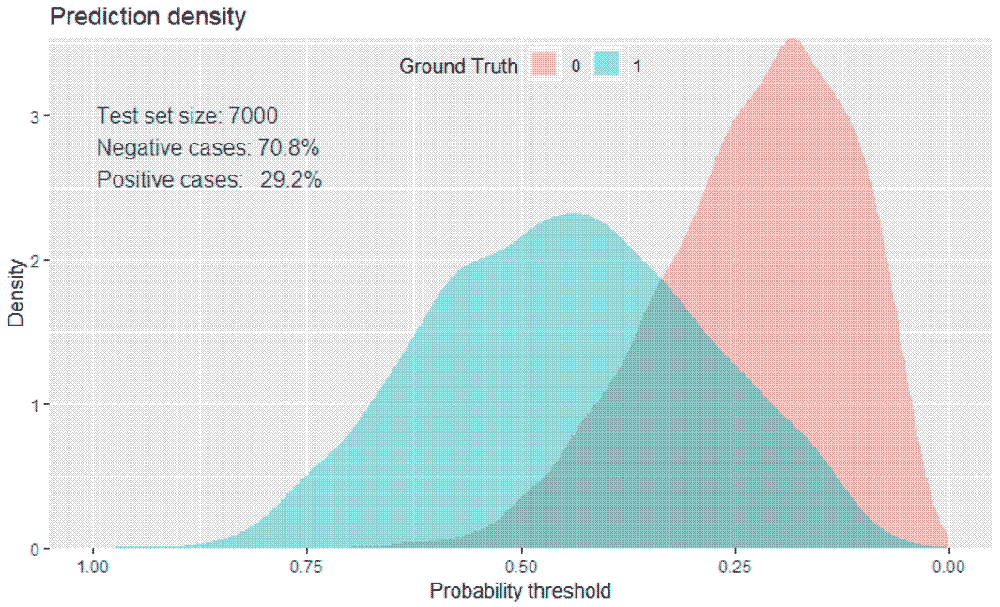
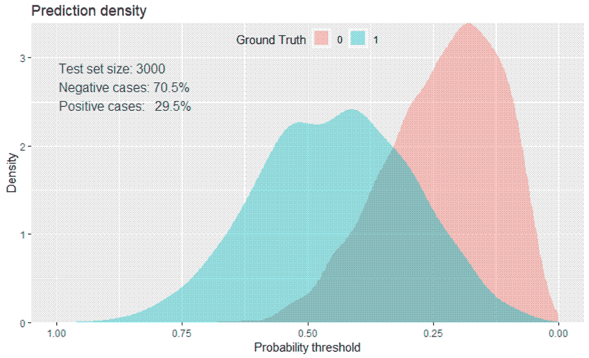
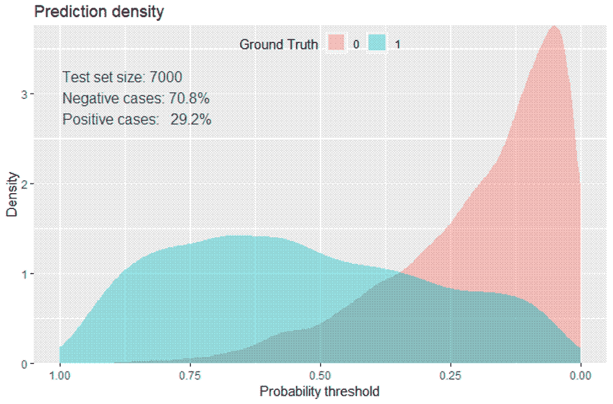
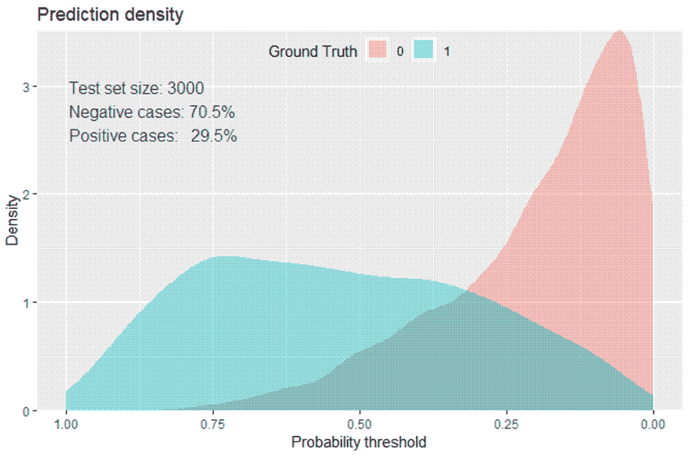
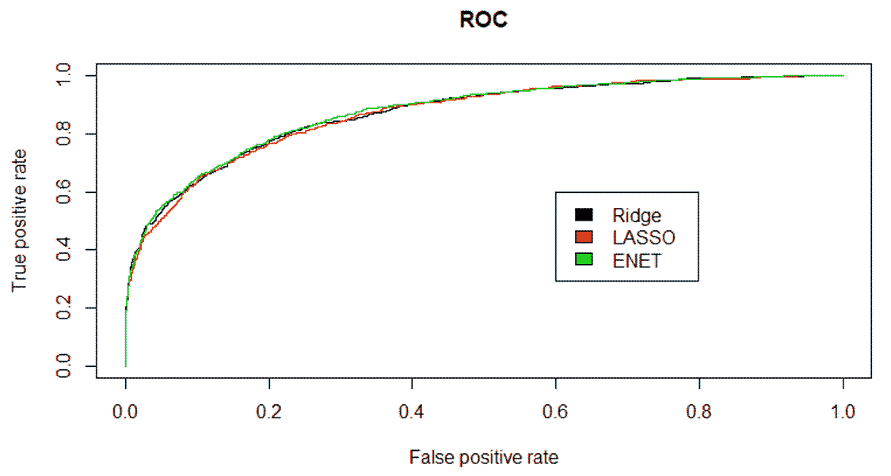

# 四、线性模型中的高级特征选择

“除了变化，没有什么是永恒的。”

赫拉克利特

到目前为止，我们已经考察了定量和定性结果的线性模型的使用，着眼于特征选择的技术，即排除无用或不需要的预测变量的方法和技术。我们看到，线性模型在机器学习问题中非常有用，分段线性模型如何将非线性关系捕捉为多元自适应回归样条。在过去的几十年里，除了我们在前面章节中讨论的线性模型之外，还开发和改进了其他技术，可以提高预测能力和可解释性。在当今时代，许多数据集，如前两章中的数据集，都有许多特征。拥有包含数千个潜在要素的数据集并非不合理。

本章中的方法可能被证明是处理特征约简和选择的更好的方法。在这一章中，我们将研究正则化的概念，其中系数被约束或收缩到零。这些正则化方法有许多方法和排列，但我们将重点关注岭回归、**最小绝对收缩和选择操作符** ( **【套索】**)，最后是弹性网，它将两种技术的优点结合为一。

以下是我们将在本章中涉及的主题:

*   正规化概述
*   数据集创建
*   里脊回归
*   套索
*   弹性网


# 正规化概述

你可能还记得，我们的线性模型遵循以下形式: *Y = B0 + B [1] x [1] +...B [n] x [n] + e* ，并且最佳拟合试图最小化 RSS，RSS 是实际减去估计的平方误差之和，或*e[1]²+e[2]²...e[n]T21 2。*

对于正则化，我们将结合 RSS 最小化应用所谓的**收缩惩罚**。该惩罚由λ(符号 *λ* )以及β系数和权重的归一化组成。就技术而言，这些权重如何被归一化是不同的，我们将相应地讨论它们。很简单，在我们的模型中，我们最小化了 *(RSS + λ(归一化系数))*。在我们的模型构建过程中，我们将选择 *λ* ，它被称为调整参数。请注意，如果λ等于 0，那么我们的模型相当于 OLS，因为它取消了归一化项。当我们学习这一章时，这些方法可以应用于分类问题。

那么，正规化对我们有什么作用，为什么会起作用呢？首先，正则化方法的计算效率非常高。在最佳特征子集中，我们正在搜索 **2 ^p 模型**，在大型数据集中，尝试这样做是不可行的。在接下来的技术中，我们只为每个 lambda 值拟合一个模型，正如你所想象的，计算量要少得多。另一个原因可以追溯到我们在前言中讨论的偏差-方差权衡。在线性模型中，响应和预测值之间的关系接近线性，最小二乘估计将具有低偏差，但可能具有高方差。这意味着训练数据的微小变化会导致最小二乘系数估计值的显著变化(James，2013)。通过适当选择λ和归一化进行正则化，可以帮助您通过优化偏差-方差权衡来提高模型拟合度。最后，正如我们将看到的，系数的正则化可以解决多重共线性问题。


# 里脊回归

让我们从探索什么是岭回归以及它能为你做什么和不能为你做什么开始。对于岭回归，归一化项是权重的平方和，称为 **L2 范数**。我们的模型试图最小化 *RSS + λ(sum Bj ² )* 。随着λ的增加，系数向零收缩，但永远不会变为零。这样做的好处可能是提高了预测的准确性，但是，由于它不会将任何要素的权重清零，因此可能会导致模型的解释和交流出现问题。为了帮助解决这个问题，我们可以求助于套索。


# 套索

LASSO 应用 **L1 范数**而不是岭回归中的 L2 范数，它是特征权重绝对值的和，因此最小化 *RSS + λ(sum |Bj|)* 。这种收缩损失确实会迫使特征权重为零。与岭回归相比，这是一个明显的优势，因为它可以提高模型的可解释性。

L1 范数允许权重/系数变为零背后的数学原因超出了本书的范围(请参考 Tibsharini，1996 了解更多详细信息)。

如果 LASSO 这么伟大，那么岭回归在机器学习中一定是过时的。没那么快！在高度共线性或高度成对相关的情况下，LASSO 可能会将预测要素强制为零，因此您可能会失去预测能力；也就是说，如果要素 A 和 B 都应该在您的模型中，LASSO 可能会将其中一个系数缩小到零。以下引文很好地总结了这个问题:

“在相对较少数量的预测器具有相当大的系数，而剩余的预测器具有非常小或等于零的系数的设置中，人们可能期望 lasso 表现得更好。当响应是许多预测因子的函数，且所有预测因子的系数大小大致相等时，岭回归的表现会更好。”

詹姆斯，2013 年

有可能两全其美，这就引出了下一个话题，弹性网络。


# 弹性网

与岭回归不同，弹性网的强大之处在于它可以执行要素提取，并且可以对 LASSO 无法完成的要素进行分组。同样，LASSO 倾向于从一组相关要素中选择一个要素，而忽略其他要素。Elastic net 通过结合 lambda 包括混合参数α来实现这一点。Alpha 会在`0`和`1`之间，和之前一样，lambda 会调节罚分的大小。请注意，α为零等于岭回归，α为`1`等于套索。本质上，我们通过将第二个调谐参数与β系数的二次项(平方)相结合，来混合 L1 和 L2 惩罚。我们最终会以最小化*(RSS+λ[(1-alpha)(sum | Bj |²)/2+alpha(sum | Bj |)])/N)*为目标。

让我们来测试一下这些技术。我们将利用我创建的数据集来演示这些方法。在下一节中，我将讨论如何创建具有一些预测特征和一些噪声特征的数据集，包括那些高度相关的特征。我建议，一旦您对本章的内容感到满意，您可以回头将它们应用于前两章中检查的数据，比较性能。


# 数据创建

在这一节中，我将讨论如何创建用于本章的数据集，并提供对我们将努力预测的特征和类标签的深入了解。该数据可在 GitHub 上获得，网址为[https://GitHub . com/packt publishing/Advanced-Machine-Learning-with-R/blob/master/Data/sim _ df . CSV](https://github.com/PacktPublishing/Advanced-Machine-Learning-with-R/blob/master/Data/sim_df.csv):

1.  让我们加载我们的库和数据:

```r
> library(magrittr)

> install.packages("glmnet")

> install.packages("caret")

> install.packages("classifierplots")

> install.packages("DataExplorer")

> install.packages("InformationValue")

> install.packages("Metrics")

> install.packages("ROCR")

> install.packages("tidyverse")

> options(scipen=999)   

> sim_df <- readr::read_csv('sim_df.csv') 
```

数据框架是 17 个变量的 10，000 个观察值，由 16 个输入特征和 1 个响应组成。我使用`caret`包中的`twoClassSim()`函数创建了这个数据集。在线代码中提供了带有种子的完整代码，允许您进行更改并创建您想要探索的任何数据。关于创建自己的集合的选项的完整说明，可在函数的帮助中找到。

2.  现在，让我检查一下列名，并告诉您这是怎么回事:

```r
> colnames(sim_df)
 [1] "TwoFactor1" "TwoFactor2" "Linear1" "Linear2" "Linear3" "Linear4" 
 [7] "Linear5" "Linear6" "Nonlinear1" "Nonlinear2" "Nonlinear3" "Noise1" 
[13] "Noise2" "Noise3" "Noise4" "Class" "random1" 
```

首先，`TwoFactor`特征是相互关联的，对反应有轻微的预测作用， *y* 。六个线性特征中的五个、三个非线性特征以及名为`random1`的特征可能具有一些预测能力。除非纯属偶然，否则这四个噪声特征绝对没有预测能力。此外，`Linear5`和`Linear6`特性高度相关。我创建这种关系是为了帮助指出不同的方法将如何处理它。

3.  `y`标签有些不平衡，大约 70/30:

```r
> table(sim_df$y)

   0    1 
7072 2928
```

4.  数据并不太宽，无法将所有数据都包含在关联图中:

```r
> DataExplorer::plot_correlation(sim_df)
```

上述代码的输出如下:



这个情节从视觉上证实了我先前的描述。线性 5 和线性 6 之间的相关性最高。我们能做的是消除一对高度相关的特征，我在第二章、*线性回归*中做了这些。在这种情况下，我们将保持两者，让算法来处理它。

这些数据已经为本章的建模做好了充分的准备，我们开始吧。


# 建模和评估

我们将开始开发分类算法来预测 *y* 的建模过程。我们将依次进行岭回归、套索和弹性网模型，使用曲线下面积和对数损失评估它们的性能。


# 里脊回归

我们使用的软件包将是`glmnet`。我喜欢它，因为它有一个内置的交叉验证功能，标准化的输入功能，并返回系数的原始规模，所以它很容易实现。如果你自己标准化你的特性，你可以在函数中指定`standardize = FALSE`。无论哪种方式，都不要运行未标准化的要素，因为正则化不会均匀地应用，结果将是不理想的。如果你确实自己标准化，我推荐使用`vtreat`包函数，就像我们在[第 2 章](11c0076c-a839-44dc-a3f6-2f88378c748f.xhtml)、*线性回归*、`prepare()`函数中的`specifying scale = TRUE`一样。这将有助于我们将您的训练数据中的居中和缩放值应用到测试/验证集。

我会让`glmnet`处理标准化，我们可以从 70/30 的训练/测试分割开始:

```r
 > set.seed(1066)

> index <- caret::createDataPartition(sim_df$y, p = 0.7, list = F)

> train <- sim_df[index, ]

> test <- sim_df[-index, ]
```

现在，`glmnet`要求你的特征作为一个矩阵输入，如果你在做一个分类问题，响应就是一个因子。此代码处理以下要求:

```r
> x <- as.matrix(train[, -17])

> y <- as.factor(train$y)
```

对于训练算法的函数，您可以指定几项内容。在这里，我将执行五重交叉验证—训练的损失函数，在分类的情况下，对于错误分类错误可以是`class`或者对于曲线下的面积可以是`auc`。我和`auc`一起去，由你来评估。因为这是岭回归，我们的 alpha 将等于 0。

相应地，我们将把`family`参数设置为`binomial`。这使得函数运行逻辑回归，而不是标准的线性回归。下面是训练岭回归算法的代码:

```r
> set.seed(1999)

> ridge <- glmnet::cv.glmnet(
    x,
    y,
    nfolds = 5,
    type.measure = "auc",
    alpha = 0,
    family = "binomial"
  )
```

首先，`glmnet`提供了许多不同的情节。默认图显示了所搜索的λ值的对数的关系及其与损失函数的关系，在我们的情况下为`auc`:

```r
> plot(ridge)
```

上述代码的输出如下:



我们看到 log(λ)在 *x* 轴上，AUC 在 *y* 轴上。在图的顶部是一系列数值 16。这跟踪对应于 log(λ)的非零系数的数量。我们将看到 LASSO 是如何改变的。两条垂直虚线分别显示左线和右线的具有最大 AUC 的 log(λ)值和在最大值的一个标准误差内具有最大 AUC 的 log(λ)值。

让我们回顾一下那些实际的λ值是什么:

```r
> ridge$lambda.min
[1] 0.01216653

> ridge$lambda.1se
[1] 0.04475312
```

回想一下，如果λ等于零，则根本没有正则化损失。

要查看系数，请运行以下代码:

```r
> coef(ridge, s = "lambda.1se")
17 x 1 sparse Matrix of class "dgCMatrix"
                       1
(Intercept) 0.535798579
TwoFactor1 -0.541881256
TwoFactor2  0.530637287
Linear1    -0.005472570
Linear2    -0.506143897
Linear3     0.454702486
Linear4    -0.316847306
Linear5     0.182733133
Linear6     0.070036471
Nonlinear1  0.354214422
Nonlinear2  0.238778841
Nonlinear3  0.322499067
Noise1     -0.028226796
Noise2      0.002973271
Noise3      0.014767631
Noise4      0.038038078
random1    -0.237527142
```

要将称为 **logits** 的逻辑回归系数转换为概率，请执行以下操作:

1.  Calculate the probability by exponential operation, for example, `exp(coef)`
2.  用公式计算概率，*概率= odds/1+odds*

请注意，与预测无关的`noise`特征和`Linear1`接近但不等于零。该算法对`Linear5`和`Linear6`赋予更大的系数。顺便说一句，那些特征是在同一尺度上的，所以直接比较是可能的。要使用`glmnet`模型预测概率，请确保指定`type = "response"`和要使用的λ值。我建议从使用`lambda.1se`值开始，以防止过拟合。但是你可以做相应的实验:

```r
> ridge_pred <-
    data.frame(predict(ridge, newx = x, type = "response", s = "lambda.1se"))
```

与上一章的逻辑回归一样，按类别绘制的概率分布图是有序的:

```r
> classifierplots::density_plot(y, ridge_pred$X1)
```

上述代码的输出如下:


50%以上的概率似乎有很好的分离。

让我们看看 AUC:

```r
> Metrics::auc(y, ridge_pred$X1)
[1] 0.8632982
```

AUC 高于`0.86`。这给我们带来了一个问题，这是否会在测试数据上保持一致:

```r
> ridge_test <-
    data.frame(predict(ridge, newx = as.matrix(test[, -17]),
    type = 'response'), s = "lambda.1se")

> Metrics::auc(test$y, ridge_test$X1)
[1] 0.8706708

> Metrics::logLoss(test$y, ridge_test$X1)
[1] 0.4307592

> classifierplots::density_plot(test$y, ridge_test$X1)
```

上述代码的输出如下:



在训练和测试数据之间有非常一致的性能。AUC 现在高于 0.87，我们的基准对数损失为 0.4307592。你可以尝试不同的 k 倍，不同的损失函数，甚至不同的随机种子，看看模型是如何变化的。现在，我们需要进入下一个算法，套索。


# 套索

更新我们用于岭回归的代码以适应 LASSO 是一件简单的事情。我将只改变两件事:随机的`seed`，我将把`alpha`设置为`1`:

```r
> set.seed(1876)

> lasso <- glmnet::cv.glmnet(
    x,
    y,
    nfolds = 5,
    type.measure = "auc",
    alpha = 1,
    family = "binomial"
 )
```

模型的情节相当有趣:

```r
> plot(lasso)
```

上述代码的输出如下:



现在，随着 Lambda 的变化，您可以看到非零特征的数量。一个标准误差包含的特征数量只有八个！

让我们看看这些系数:

```r
> coef(lasso, s = "lambda.1se")
17 x 1 sparse Matrix of class "dgCMatrix"
                      1
(Intercept) -0.30046007
TwoFactor1  -0.53307368
TwoFactor2   0.52110703
Linear1       . 
Linear2     -0.42669146
Linear3      0.35514853
Linear4     -0.20726177
Linear5      0.10381320
Linear6       . 
Nonlinear1   0.10478862
Nonlinear2    . 
Nonlinear3    . 
Noise1        . 
Noise2        . 
Noise3        . 
Noise4        . 
random1     -0.06581589
```

现在，这个看起来好多了。拉索抛出了那些毫无意义的噪音特性和`Linear1`。然而，在我们开始庆幸自己之前，先看看`Linear6`是如何被约束为零的。它是否需要出现在模型中？毫无疑问，我们可以调整λ值，看看它从哪里进入，会产生什么影响。

是时候检查它在训练数据上的表现了:

```r
> lasso_pred <-
    data.frame(predict(
    lasso,
    newx = x,
    type = "response",
    s = "lambda.1se"
  ))

> Metrics::auc(y, lasso_pred$X1)
[1] 0.8621664

> classifierplots::density_plot(y, lasso_pred$X1)
```

上述代码的输出如下:



这些结果与岭回归的结果非常相似。然而，正确的评估是在测试数据上完成的:

```r
> lasso_test <-
    data.frame(predict(lasso, newx = as.matrix(test[, -17]), type = 'response'), 
    s = "lambda.1se")

> Metrics::auc(test$y, lasso_test$X1)
[1] 0.8684276

> Metrics::logLoss(test$y, lasso_test$X1)
[1] 0.4512764

> classifierplots::density_plot(test$y, lasso_test$X1)
```

上述代码的输出如下:



LASSO 模型的 AUC 略低，log-loss 略高(0.45 比 0.43)。在现实世界中，我不确定这是否有意义，因为我们有一个更简洁的 LASSO 模型。我想这是除偏差-方差之外的另一个维度，*预测能力对复杂性*。

说到复杂性，让我们继续讨论弹性网。


# 弹性网

对于我们这里的目的，我们想要集中于寻找λ和我们的弹性净混合参数`alpha`的最佳混合。这是通过以下简单的三步流程完成的:

1.  使用 base R 中的`expand.grid()`函数来创建我们想要研究的`alpha`和`lambda`的所有可能组合的向量。
2.  使用`caret`包中的`trainControl()`函数确定重采样方法；我们将再次使用五重交叉验证。
3.  使用 caret 的`train()`函数中的`glmnet()`训练一个模型来选择我们的`alpha`和`lambda`参数。

一旦我们选择了我们的参数，我们将把它们应用到`test`数据中，就像我们对岭回归和套索所做的一样。

我们的组合网格应该足够大，以捕捉最佳模型，但也不能大到计算上不可行。对于这么大的数据集来说，这不成问题，但请记住这一点以供将来参考。

以下是我们将尝试的超参数值:

*   从`0`到`1`的α，以`0.2`为增量；记住这是由`0`和`1`绑定的
*   以`0.002`的步长从`0.01`到`0.03`

您可以通过使用`expand.grid()`函数并构建一个`caret`包将自动使用的数字序列来创建这个矩阵。`caret`包将采用以下代码获取`alpha`和`lambda`的值:

```r
> grid <-
    expand.grid(.alpha = seq(0, 1, by = .2),
    .lambda = seq(0.01, 0.03, by = 0.002))

> head(grid)
  .alpha .lambda
1    0.0    0.01
2    0.2    0.01
3    0.4    0.01
4    0.6    0.01
5    0.8    0.01
6    1.0    0.01
```

有 66 种不同的模型需要构建、比较和选择。前面的列表显示了 lambda 为 0.01 时所有可能的 alpha 参数的各种组合。现在，我们设置一个对象来指定我们想要进行 5 重交叉验证:

```r
> control <- caret::trainControl(method = 'cv', number = 5)
```

在这种情况下，用`caret`训练模型需要 *y* 作为一个因子，这一点我们已经做到了。它还需要列车控制或通过物体的规范，就像我们刚才做的那样。对于分类问题，有几个不同的选择标准可供选择:准确性或 Kappa。嗯，我们在上一章，在一个阶级不平衡的情况下讨论过这个问题；我认为 Kappa 是首选。如果需要刷新对 Kappa 的理解，请参考上一章。以下是相关代码:

```r
> set.seed(2222)
> enet <- caret::train(x,
                     y,
                     method = "glmnet",
                     trControl = control,
                     tuneGrid = grid,
                     metric = "Kappa")
```

根据 Kappa，为了找到最佳的整体模型，我们称之为最佳调整版本:

```r
> enet$bestTune
   alpha lambda
23   0.4   0.01
```

最好的模型是α`0.4`和λ`0.01`。为了了解它如何影响系数(对数)，我们将在没有交叉验证的情况下通过`glmnet`运行它们:

```r
> best_enet <- glmnet::glmnet(x,
    y,
    alpha = 0.4,
    lambda = 0.01,
    family = "binomial")

> coef(best_enet)
17 x 1 sparse Matrix of class "dgCMatrix"
                      s0
(Intercept)  1.310419410
TwoFactor1  -0.933300729
TwoFactor2   0.917877320
Linear1       . 
Linear2     -0.689547039
Linear3      0.619432149
Linear4     -0.416603510
Linear5      0.315207408
Linear6      0.002005802
Nonlinear1   0.454620511
Nonlinear2   0.224564104
Nonlinear3   0.343687158
Noise1      -0.009290811
Noise2        . 
Noise3        . 
Noise4       0.014674805
random1     -0.261039240
```

当α在`0.4`时，三个特征被强制归零。接下来检查训练数据的指标:

```r
> enet_pred <- predict(enet, train, type = "prob")

> Metrics::auc(y, enet_pred$`1`)
[1] 0.8684076

> classifierplots::density_plot(y, enet_pred$`1`)
```

上述代码的输出如下:



标签为 1 的概率偏差似乎高于之前的模型以及标签为 0 的模型。AUC 也与其他模型一致。证据在于预测测试数据:

```r
> enet_test <-
    predict(enet, test, type = "prob")

> Metrics::auc(test$y, enet_test$`1`)
[1] 0.8748963

> Metrics::logLoss(test$y, enet_test$`1`)
[1] 0.3977438

> classifierplots::density_plot(test$y, enet_test$`1`)
```

上述代码的输出如下:



与其他两个模型相比，分布有一致的偏斜，AUC 和对数损失更高，因此我们的弹性网络版本似乎是最好的。我们可以通过查看所有三个模型的 ROC 图来确认这一点，使用类似的技术来直观地评估分类器，如前一章所述:

```r
pred.ridge <- ROCR::prediction(ridge_test$X1, test$y)

perf.ridge <- ROCR::performance(pred.ridge, "tpr", "fpr") 

ROCR::plot(perf.ridge, main = "ROC", col = 1) 

pred.lasso <- ROCR::prediction(lasso_test$X1, test$y)

perf.lasso <- ROCR::performance(pred.lasso, "tpr", "fpr") 

ROCR::plot(perf.lasso, col = 2, add = TRUE) 

pred.enet <- ROCR::prediction(enet_test$'1', test$y)

perf.enet <- ROCR::performance(pred.enet, "tpr", "fpr") 

ROCR::plot(perf.enet, col = 3, add = TRUE) 

legend(0.6, 0.6, c("Ridge", "LASSO", "ENET"), 1:3)
```

上述代码的输出如下:



我认为，正如我们所料，弹性网比其他两个稍微好一点。在权衡复杂性和性能时，您和您的业务合作伙伴需要决定将哪种模型投入生产。


# 摘要

在本章中，我们的目标是使用模拟数据集来介绍如何在线性和广义线性模型中应用高级要素选择。我们使用了`glmnet`包来预测使用逻辑回归的二元分类问题的分类概率。这些方法可以适用于线性回归和多项式分类。提供了正则化的介绍和包含正则化的三种技术，并用于建立和比较模型。与其他建模技术相比，正则化是一种强大的技术，可以提高计算效率，并可能提取更有意义的特征。我们看到了如何使用各种性能指标来比较和选择最合适的模型。

到目前为止，我们一直在纯粹地谈论线性和广义线性模型。在接下来的几章中，我们将开始使用更复杂的非线性模型来解决我们将在后续章节中遇到的分类和回归问题。