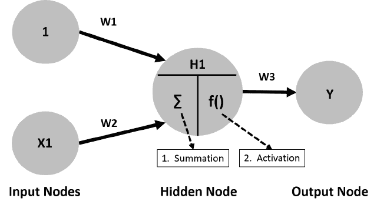
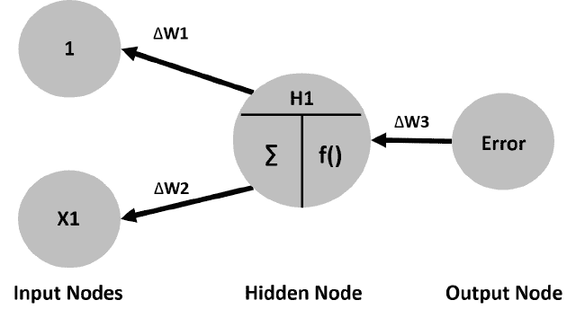
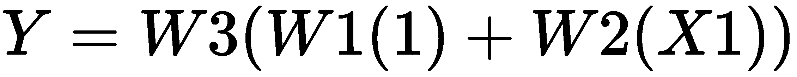
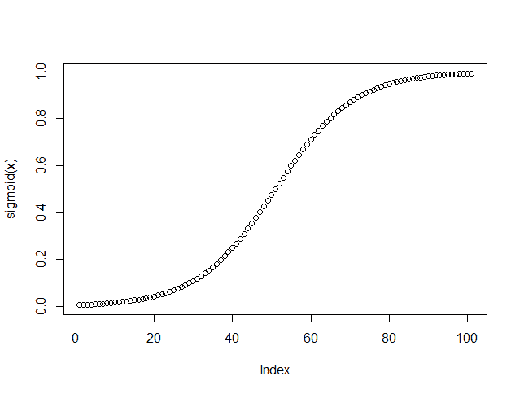
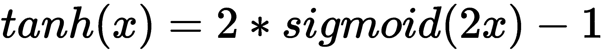
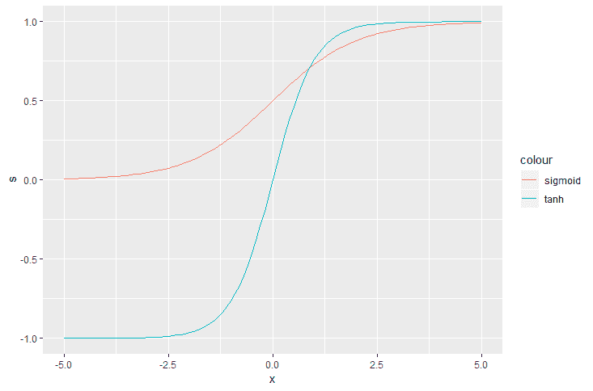
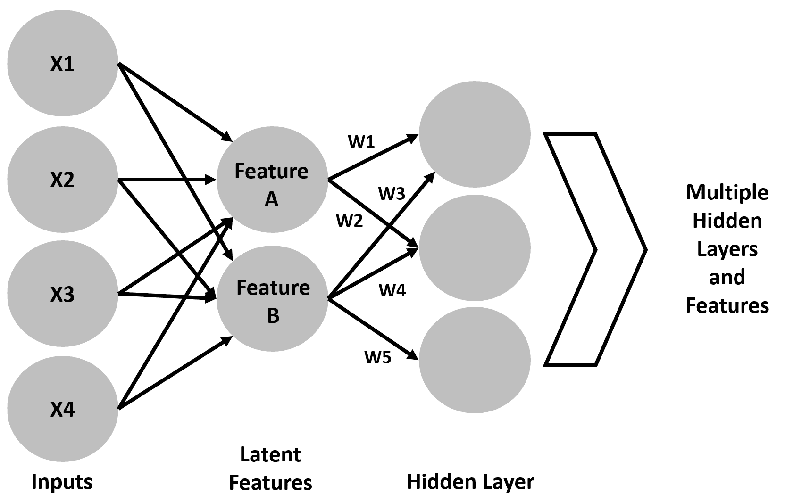
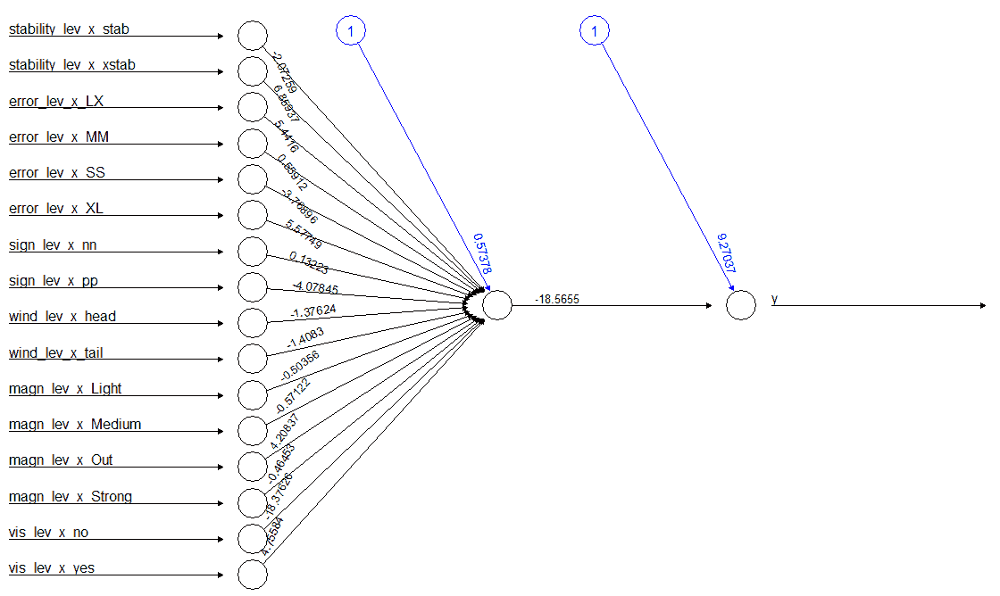
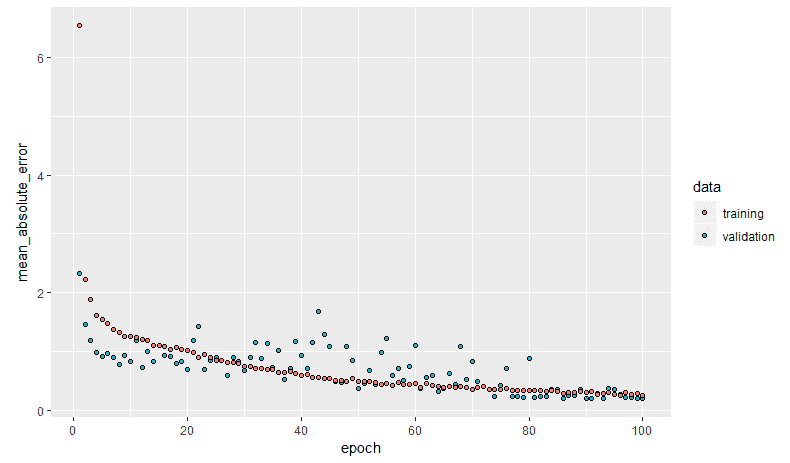
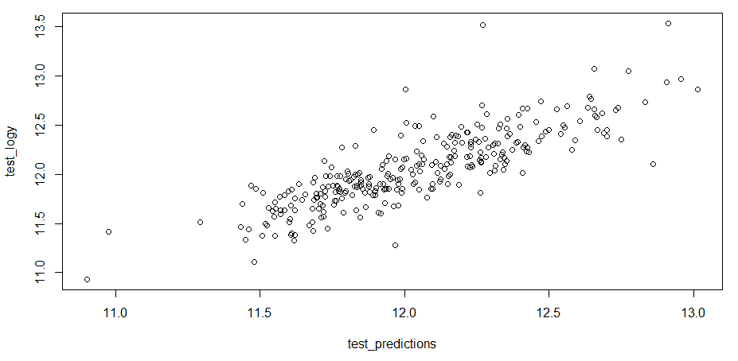

# 七、神经网络和深度学习

“忘掉人工智能吧——在大数据这个勇敢的新世界里，我们应该提防的是人工白痴。”

汤姆·查特菲尔德

我记得大约在 2012 年年中的一次会议上，我是一个小组的成员，讨论一些分析或其他的结果，当时桌子周围的一个人带着一丝恼怒混合着一丝恐惧地说道:*这个* *不是* *一个***那些* *神经* *网络，* *是* *吗？我知道他过去与神经网络的争吵，以及对神经网络根深蒂固的焦虑，所以我减轻了他的恐惧，发表了一些讽刺的评论，说神经网络基本上已经走上了恐龙的道路。没有人不同意！几个月后，当我参加一个当地的会议时，我大吃一惊，会议上的讨论集中在所有事情上，神经网络和这种神秘的深度学习。机器学习的先驱，如 ng、Hinton、Salakhutdinov 和 Bengio 已经复兴了神经网络并提高了它们的性能。**

 *许多媒体围绕这些方法大肆宣传，脸书、谷歌和网飞等高科技公司投资了数千万美元，如果不是数亿美元的话。这些方法已经在语音识别、图像识别、自动化和任何实际的数据科学项目中产生了有希望的结果。如果自动驾驶汽车不再驶离道路并相互碰撞，那肯定是因为我们在这里讨论的方法。

在这一章中，我们将讨论这些方法是如何工作的，它们的好处，以及它们固有的缺点，这样你就可以熟练地谈论它们了。我们将从一个简单的神经网络应用开始，让你对正在发生的事情有一个感觉。然后，我们将使用 Keras 作为前端，追求过去几年中突然出现的深度学习方法论 TensorFlow。

本章将涵盖以下主题:

*   神经网络导论
*   深度学习，一个不太深刻的概述
*   创建一个简单的神经网络
*   深度学习的一个例子


# 神经网络导论

*神经网络*是一个相当宽泛的术语，涵盖了许多相关的方法，但是在我们的例子中，我们将关注一个用**反向传播**训练的**前馈**网络。我不会浪费我们的时间来讨论机器学习方法与生物大脑的工作方式有何相似或不同。我们只需要从什么是神经网络的工作定义开始。

要了解更多关于人工神经网络的知识，我认为维基百科的条目是一个很好的开始:[https://en.wikipedia.org/wiki/Artificial_neural_network](https://en.wikipedia.org/wiki/Artificial_neural_network)。

综上所述，在机器学习和认知科学中，**人工神经网络** ( **ANNs** )是一系列受生物神经网络(动物的中枢神经系统，大脑)启发的统计学习模型，用于估计或近似可能依赖于大量输入且通常未知的函数。

人工神经网络的动机或好处在于，它们允许对输入/特征和响应变量之间的高度复杂的关系进行建模，尤其是在这些关系高度非线性的情况下。创建和评估模型不需要任何基础假设，它可以用于定性和定量响应。如果这是阴，那么阳就是通常批评的结果是一个黑箱，这意味着没有一个带有系数的等式来检查和与业务伙伴共享。事实上，结果*几乎*无法解释。其他的批评围绕着仅仅改变初始随机输入的结果如何不同，以及训练人工神经网络在计算上是昂贵和耗时的。

以任何标准衡量，人工神经网络背后的数学都不是微不足道的。然而，至少对正在发生的事情有一个工作上的理解是至关重要的。直观地发展这种理解的一个好方法是从一个简单的神经网络图开始。

在这个简单的网络中，输入或协变量由两个节点或神经元组成。标记为 **1** 的神经元代表一个常数，或者更恰当地说，代表截距。 **X1** 代表一个数量变量。 **W** 表示与输入节点值相乘的权重。这些值成为**到**隐藏节点**的输入节点**。您可以有多个隐藏节点，但是在这个节点中发生的事情的原理是相同的。在隐藏节点中， **H1** ，对*权重*值*计算求和。由于截距表示为 **1** ，那么输入值就是重量 **W1** 。现在奇迹发生了。求和值随后通过**激活**功能进行转换，将输入信号转换为输出信号。在这个例子中，由于它是唯一的**隐藏节点**，它被乘以 **W3** 并成为 **Y** 的估计值，我们的响应。这是算法的前馈部分:



但是等等，还有呢！众所周知，为了完成循环或时期，会发生反向传播，并根据所学知识训练模型。为了启动反向传播，基于损失函数确定误差，例如误差平方和或**交叉熵**等。由于权重 **W1** 和 **W2** 被设置为 *[-1，1]* 之间的一些初始随机值，初始误差可能较高。反向工作，改变权重以最小化损失函数中的误差。下图描绘了反向传播部分:



这完成了一个时代。这个过程继续进行，使用梯度下降(在第 5 章、*、K-最近邻和支持向量机*中讨论)直到算法收敛到最小误差或预先指定的次数。如果我们假设我们的激活函数是简单线性的，在这个例子中，我们将得到如下结果:



如果你增加许多输入神经元，在一个隐藏节点中增加多个神经元，甚至增加多个隐藏节点，网络会变得复杂。值得注意的是，一个神经元的输出连接到所有后续的神经元，并且对所有这些连接分配了权重。这大大增加了模型的复杂性。添加隐藏节点和增加隐藏节点中的神经元数量并没有如我们所希望的那样改善人工神经网络的性能。因此，深度学习的发展出现了，这在一定程度上放松了对所有这些神经元连接的要求。

您可以使用/尝试许多激活函数，包括一个简单的线性函数，或者针对分类问题的`sigmoid`函数，它是逻辑函数的一个特例([第三章](ce9ab446-e94c-44f2-a5dc-1ff2ff0e8d50.xhtml)、*逻辑回归*)。其他常见的激活函数有`Rectifier`、`Maxout`和`tanh`(双曲正切)。

我们可以在 R 中绘制一个`sigmoid`函数，首先创建一个`R`函数来计算`sigmoid`函数值:

```r
    > sigmoid = function(x) {
     1 / ( 1 + exp(-x) )
     }
```

然后，这是一个简单的问题，在一个值的范围内绘制函数，比如从`-5`到`5`:

```r
    > x <- seq(-5, 5, .1)
    > plot(sigmoid(x))
```

上述命令的输出如下:



`tanh`函数(双曲正切)是逻辑`sigmoid`的重新标度，输出在 **-1** 和 **1** 之间。`tanh`函数与`sigmoid`的关系如下，其中 *x* 是`sigmoid`函数:



让我们画出`tanh`和`sigmoid`函数来进行比较。让我们也使用`ggplot`:

```r
> install.packages("ggplot2")

> s <- sigmoid(x)

> t <- tanh(x)

> z <- data.frame(cbind(x, s, t))

> ggplot2::ggplot(z, ggplot2::aes(x)) +
    ggplot2::geom_line(ggplot2::aes(y = s, color = "sigmoid")) +
    ggplot2::geom_line(ggplot2::aes(y = t, color = "tanh"))

```

上述命令的输出如下:



那么，为什么使用`tanh`函数而不是`sigmoid`函数呢？在这个问题上似乎有许多观点。简而言之，假设您已经缩放了均值为 0、方差为 1 的数据，`tanh`函数允许权重平均接近于零(以零为中心)。这有助于避免偏差并提高收敛性。想想像在`sigmoid`函数激活中一样，从输出神经元到输入神经元的权重总是为正意味着什么。在反向传播过程中，层之间的权重要么全部为正，要么全部为负。这可能会导致性能问题。此外，由于 T4(0 和 1)尾部的梯度几乎为零，在反向传播过程中，可能会发生不同层的神经元之间几乎没有信号流动的情况。LeCun (1998 年)对这一问题进行了全面讨论。请记住，`tanh`总是更好并不是必然的结论。

这一切听起来很吸引人，但人工神经网络几乎走上了迪斯科的道路，因为它的表现不如宣传的那样好，特别是当试图使用具有许多隐藏层和神经元的深层网络时。Hinton 和 Salakhutdinov (2006 年)在《深度学习》中发表的开创性论文似乎缓慢而逐渐地复兴了。


# 深度学习——不太深入的概述

那么，这种正在吸引我们的注意力和头条新闻的深度学习是什么？让我们再次转向维基百科，以形成一个工作定义:*深度学习是基于一组算法的机器学习的一个分支，这些算法试图通过使用模型架构对数据中的高级抽象进行建模，这些架构具有复杂的结构或其他，由多个非线性转换组成*。听起来好像是律师写的。深度学习的特点是它基于人工神经网络，其中机器学习技术，主要是无监督学习，用于从输入变量中创建新的特征。我们将在接下来的几章中深入探讨一些无监督学习技术，但是你可以把它看作是在没有响应变量的数据中寻找结构。

一个简单的方式来考虑它是元素周期表，这是一个经典的例子，可以找到一个没有响应的结构。在网上调出这个表，你会发现它是根据原子结构组织的，一边是金属，另一边是非金属。它是基于潜在的分类/结构创建的。这种对潜在结构/层次的识别是深度学习与普通人工神经网络的区别。深度学习在某种程度上解决了这样一个问题，即是否有一种算法可以更好地代表结果，而不仅仅是原始输入。换句话说，除了将原始像素作为唯一的输入，我们的模型还能学会对图片进行分类吗？当您有一小组已标记的响应，但有大量未标记的输入数据时，这将非常有帮助。你可以使用无监督学习来训练你的深度学习模型，然后以有监督的方式将其应用于标记的数据，来回迭代。

这些潜在结构的识别在数学上并不简单，但一个例子是我们在第四章、*线性模型中的高级特征选择*中看到的正则化概念。在深度学习中，你可以用**正则化**方法来惩罚权重，比如 *L1* (惩罚非零权重) *L2* (惩罚大权重)**丢弃**(随机忽略某些输入，将其权重清零)。在标准人工神经网络中，这些正则化方法都不发生。

另一种方法是降低数据的维度。一种这样的方法是`autoencoder`。这是一个神经网络，其中输入被转换成一组降维权重。在下图中，请注意**特征 A** 没有连接到隐藏节点之一:



这可以递归地应用，并且可以在许多隐藏层上进行学习。在这种情况下，您所看到的情况是，当要素相互叠加时，网络正在开发要素。深度学习将首先依次学习两层之间的权重，然后使用反向传播来微调这些权重。其他特征选择方法包括**受限玻尔兹曼机**和**稀疏编码模型**。

受限玻尔兹曼机和稀疏编码模型的细节超出了我们的范围，许多资源可用于了解细节。这里有几个起点:[http://www.cs.toronto.edu/~hinton/
T2](http://www.cs.toronto.edu/~hinton/)[http://deeplearning.net/](http://deeplearning.net/)。

深度学习在许多分类问题上表现出色，包括赢得了一两次 Kaggle 比赛。它仍然受到人工神经网络问题的困扰，尤其是黑箱问题。尝试向不知情的人解释神经网络内部正在发生什么，不管使用各种流行的方法。然而，它适用于解释*如何*不成问题，而重要问题是*什么*的问题。毕竟，我们真的关心自动驾驶汽车为什么避免撞上行人，或者我们关心它没有撞上行人的事实吗？此外，Python 社区在深度学习的使用和包方面比 R 社区领先一点。正如我们将在实际练习中看到的，差距正在缩小。

虽然深度学习是一项令人兴奋的事业，但请注意，要实现其功能的全部优势，您需要高度的计算能力，并花时间通过微调超参数来训练最佳模型。以下是你需要考虑的一些事情:

*   激活功能
*   隐藏层的大小和数量
*   降维，即受限玻尔兹曼与自编码器
*   纪元的数量
*   梯度下降学习率
*   损失函数
*   正规化


# 深度学习资源和先进方法

你可以用来学习和解释的一个更有趣的可视化工具是 TensorFlow 提供的交互式小部件:[http://playground.tensorflow.org/](http://playground.tensorflow.org/)。这个工具允许你探索，或者像网站所说的*修补*，各种参数以及它们如何影响反应，无论是分类问题还是回归问题。我可以花——嗯，我已经花了——几个小时修补它。

这里有一个有趣的任务:创建你自己的实验设计，看看各种参数如何影响你的预测。

在这一点上，发展最快的深度学习开源工具是 TensorFlow。可以用 R 访问 TensorFlow，但是需要先安装 Python。我们将在实践练习中经历的是 Keras，这是一个可以在 TensorFlow 或其他后端神经网络(如 Theano)上运行的 API。Keras 的创造者设计它是为了简化深度神经网络的开发和测试。在实现问题之前，我们将更深入地讨论 TensorFlow 和 Keras。

我也非常喜欢使用 MXNet，它不需要安装 Python，并且相对容易安装和运行。它还提供了许多训练有素的模型，让您可以快速开始做出预测。几个 R 教程可以在[http://mxnet.io/](http://mxnet.io/)获得。

我现在想花时间列举一些深度神经网络的变体，以及它们表现良好的学习任务。

**卷积神经网络**(**CNN**)假设输入是图像，并从数据的切片或小部分创建特征，这些数据被组合起来创建特征图。将这些小片段视为过滤器，或者更恰当地说，网络在训练期间学习的内核。CNN 的激活函数是整流线性单元(ReLU)。简单来说就是 f(x) = max(0，x)，其中 x 是神经元的输入。CNN 在图像分类和目标检测方面表现良好。

**循环神经网络** ( **RNNs** )是为了利用序列信息而创建的。在传统的神经网络中，输入和输出是相互独立的。使用 RNNs，输出依赖于前几层的计算，允许信息跨层保存。所以，取一个神经元的输出(*y*)；不仅对其输入(t)进行计算，而且对所有先前的层(t-1，t-n...).这是有效的笔迹和语音检测。

**长短期记忆** ( **LSTM** )是 RNN 的一个特例。RNN 的问题在于，它在处理长信号数据时表现不佳。因此，LSTMs 被创建来捕获数据中的复杂模式。rnn 以同样的方式在训练期间组合来自先前步骤的信息，而不管一个步骤中的信息比其他步骤更有价值或更无价值的事实。LSTMs 试图通过决定在训练的每一步要记住什么来克服这个限制。权重矩阵与数据向量的相乘被称为门，其充当信息过滤器。LSTM 中的神经元有两个输入和两个输出。来自先前输出的输入和来自先前门的记忆向量。然后，它产生输出值和输出内存，作为下一层的输入。LSTMs 具有需要健康剂量的训练数据的限制，并且是计算密集型的。LSTMs 在语音识别问题和复杂的时间序列分析中表现良好。

说到这里，我们来看一些实际应用。


# 创建一个简单的神经网络

对于这项任务，我们将开发一个神经网络来回答现在已经报废的航天飞机何时应该使用其自动着陆系统的问题。默认的决定是让船员着陆。然而，自动着陆能力可能需要在乘员丧失能力或延长轨道运行后重返大气层时受到重力不利影响的情况下使用。这个数据是基于计算机模拟，而不是实际飞行。事实上，自动着陆系统经历了一些考验和磨难，在大多数情况下，航天飞机的宇航员在着陆过程中负责。以下是几个链接，可获取更多背景信息:

*   [http://www.spaceref.com/news/viewsr.html?pid=10518](http://www.spaceref.com/news/viewsr.html?pid=10518)
*   [https://Wayne hale . WordPress . com/2011/03/11/breaking-through/](https://waynehale.wordpress.com/2011/03/11/breaking-through/)


# 数据理解和准备

首先，我们将加载必要的包，并将所需的包放到环境中。数据在`MASS`包中:

```r
> library(magrittr)

> install.packages(caret)

> install.packages(MASS)

> library(MASS)

> install.packages("neuralnet")

> install.packages("vtreat")
```

`neuralnet`包将用于建立模型，`caret`用于数据准备。让我们加载数据并检查其结构:

```r
> data(shuttle)

> str(shuttle)
```

数据由 256 个观察值和 7 个特征组成。请注意，所有特征都是分类的，响应是具有两个级别的`use`、`auto`和`noauto`，如下所示:

*   `stability`:这是定位是否稳定(`stab` / `xstab`)
*   `error`:这是误差的大小(`MM` / `SS` / `LX`)
*   `sign`:这是误差的符号，正或负(`pp` / `nn`)
*   `wind`:这是`wind`标志(`head` / `tail`)
*   `magn`:这是`wind`实力(`Light` / `Medium` / `Strong` / `Out of Range`)
*   `vis`:这就是能见度(`yes` / `no`)

在这里，我们将看一个反应/结果表:

```r
> table(shuttle$use)
 auto noauto 
 145     111
```

几乎 57%的情况下，决定使用自动着陆器。现在，我们将为建模设置培训和测试数据:

```r
> set.seed(1942)

> trainIndex <-
    caret::createDataPartition(shuttle$use, p = .6, list = FALSE)

> shuttleTrain <- shuttle[trainIndex, -7]

> shuttleTest <- shuttle[-trainIndex, -7]
```

我们将处理数据以创建数字特征，并删除函数创建的`cat_P`特征。我们在[第 1 章](6287207d-92ba-41c4-9b25-dd393a436284.xhtml)、*准备和理解数据*中介绍了处理数据帧的概念:

```r
> treatShuttle <- vtreat::designTreatmentsZ(shuttleTrain, colnames(shuttleTrain))

> train_treated <- vtreat::prepare(treatShuttle, shuttleTrain)

> train_treated <- train_treated[, c(-1,-2)]

> test_treated <- vtreat::prepare(treatShuttle, shuttleTest)

> test_treated <- test_treated[, c(-1, -2)]
```

接下来的几段代码我觉得很别扭。因为`neuralnet()`需要一个公式和数据帧中的数据，我们必须将响应转换成一个数字列表，然后将其添加到我们处理过的训练和测试数据中:

```r
> shuttle_trainY <- shuttle[trainIndex, 7]

> train_treated$y <- ifelse(shuttle_trainY == "auto", 1, 0)

> shuttle_testY <- shuttle[-trainIndex, 7]

> test_treated$y <- ifelse(shuttle_testY == "auto", 1, 0)
```

`neuralnet`中的函数将调用我们在别处使用的公式，例如 *y~x1+x2+x3+x4* ， *data = df* 。过去，我们使用 *y~* 来指定数据中的所有其他变量作为输入。然而，在撰写本文时，`neuralnet`并不支持这一点。绕过这个限制的方法是使用`as.formula()`函数。首先创建一个变量名对象后，我们将使用它作为输入，将变量正确地粘贴到等式的右边:

```r
> n <- names(train_treated)

> form <- as.formula(paste("y ~", paste(n[!n %in% "y"], collapse = " + ")))
```

对象`form`给了我们构建模型所需要的东西。


# 建模和评估

在`neuralnet`包中，我们将使用的函数被恰当地命名为`neuralnet()`。除了公式之外，我们还需要检查其他四个关键论点:

*   `hidden`:这是每层隐藏神经元的数量，最多可以有三层；默认值为 1
*   `act.fct`:默认逻辑和`tanh`可用的激活功能
*   `err.fct`:该函数用于计算误差，默认为`sse`；当我们处理二元结果时，我们将使用`ce`来表示交叉熵
*   `linear.output`:这是一个关于是否忽略默认`TRUE`的`act.fct`的逻辑论证，因此对于我们的数据，这将需要是`FALSE`

您还可以指定算法。默认值对反向传播具有弹性，为简单起见，我们将它与一个隐藏神经元的默认值一起使用:

```r
> nnfit <- neuralnet::neuralnet(form, data = train_treated, err.fct = "ce", linear.output = FALSE)
```

以下是总体结果的权重输出简写:

```r
> head(nnfit$result.matrix)                                                1
error                                0.024293436369
reached.threshold                    0.009929147409
steps                              181.000000000000
Intercept.to.1layhid1                0.573783967352
stability_lev_x_stab.to.1layhid1    -2.072585716776
stability_lev_x_xstab.to.1layhid1    6.859369770672
```

我们可以看到在`0.024`误差极低。算法达到阈值所需的步骤数，即误差函数的绝对偏导数变得小于此误差(默认值= 0.1)。

你也可以看看所谓的广义权重。根据`neuralnet`包的作者，广义权重被定义为第 *i* 个协变量对对数优势的贡献:

*广义权重表示每个协变量 x [i] 的影响，因此具有与回归模型中第 I 个回归参数类似的解释。然而，广义权重取决于所有其他协变量* (Gunther 和 Fritsch，2010)。

可以调用和检查砝码。我将输出简化为前四个变量和六个观察值。请注意，如果您对每一行求和，您将得到相同的数字，这意味着每个协变量组合的权重是相等的。请注意，由于随机重量初始化，您的结果可能略有不同。

结果如下:

```r
> head(fit$generalized.weights[[1]])
            [,1]             [,2]             [,3]              [,4]
1 0.0004057906237 -0.001342992917 -0.0010654093452 -0.00010947079069
2 0.0003792401307 -0.001255122173 -0.0009957006291 -0.00010230822138
3 0.0003929874040 -0.001300619751 -0.0010317943007 -0.00010601684547
4 0.0003672745975 -0.001215521390 -0.0009642849428 -0.00009908026019
5 0.0273129186450 -0.090394045943 -0.0717104759663 -0.00736825009054
6 0.0255281981170 -0.084487386479 -0.0670246655557 -0.00688678315678
```

要可视化神经网络，只需使用`plot()`功能:

```r
> plot(fit)
```

以下是前面命令的输出:



该图显示了特征和截距的权重。

我们现在想看看模型的表现如何。这是通过`compute()`函数和指定拟合模型和协变量来完成的:

```r
> test_pred <- neuralnet::compute(nnfit, test_treated[, 1:16])

> test_prob <- test_pred$net.result
```

这些结果是概率，所以让我们把它们变成`0`或`1`，然后用混淆矩阵和对数损失来跟进:

```r
> pred <- ifelse(test_prob >= 0.5, 1, 0) 

> table(pred, test_treated$y)

pred  0  1
   0 41  0
   1  3 58
> MLmetrics::LogLoss(test_prob, test_treated$y)
[1] 0.2002453861
```

该模型在测试集上取得了近乎完美的准确性，但有三个假阴性。我就交给你了，看你能不能建立一个达到 100%准确率的神经网络！


# 深度学习的一个例子

让我们从航天飞机上转移话题，来看看如何建立、训练和评估深度学习模型。你可以看到这些在图像分类，自然语言处理等方面使用了很多。然而，让我们看看用它进行回归。在我看来，你找不到太多这样的例子。因此，让我们回到我们在第二章 *中使用的埃姆斯房价数据，线性回归*。在此之前，我们先简单讨论一下什么是张量，张量流，Keras。


# Keras 和 TensorFlow 背景

我之前提到过，Keras 是一个 API，如果你愿意的话，是一个前端，用于几个深度学习后端。它最初只适用于 Python，但从 2017 年年中开始在 R 中可用。花些时间在文档来源:[https://keras.io/why-use-keras/](https://keras.io/why-use-keras/)回顾它的能力是很重要的。

我必须承认，我的同事带我到 Keras 和使用 TensorFlow 踢和尖叫。如果我能让它工作，我会说你当然能。我必须感谢他们，因为它非常强大，尽管我对 MXNet 略有偏见。俗话说，教老狗新把戏很难！

当然，选择的后端是 TensorFlow。我们现在必须用几句简单的英语来解释什么是张量，什么是张量流。张量是一个 n 维数组。因此，向量是一维张量，矩阵是二维张量，依此类推。假设您有一个多元时间序列，它由一个三维张量组成:一个维度是数据的观测值或长度，另一个维度是特征，另一个是时间步长，或者更具体地说，是滞后值。TensorFlow 作为后端是一个开源平台，由 Google 创建，使用 tensors，当然是为了高性能和可扩展的计算。TensorFlow 的基础前端是 Python。因此，要使用 Keras 和 R 作为前端，必须安装 Python，特别是 Python 平台 Anaconda:【https://www.anaconda.com/】T2。

因此，如果安装 Anaconda 成为一个问题，那么下面的练习将要求您使用不同的后端，这超出了本文的讨论范围。让我们看看如何让它运行起来。请记住，我使用的是基于 Windows 的计算机:

作为一个警告，重要的是要告诉你，我不能保证下面的代码将为你工作，因为我正是把它。我已经在几台电脑上安装了这个，每次我遇到不同的问题，都需要我在互联网上搜索特定的解决方案。一个共同的因素是，您已经在您的计算机上安装了 Anaconda，并且它功能齐全。

```r
# Install reticulate package as it allows R to call python
> install.packages("reticulate")

> install.packages("keras")

> keras::install_keras() # loads the necessary python packages and may take some time to complete

> library(keras)

> library(reticulate)
```

这就是我在这台笔记本电脑上使用的代码。同样，您的结果可能会有所不同。另外，请注意，我遇到了一些问题，需要我再次运行`install_keras()`才能让它正常工作。

假设一切顺利，让我们加载数据。


# 加载数据

至于这个数据，和我们在[第二章](11c0076c-a839-44dc-a3f6-2f88378c748f.xhtml) *，线性回归*中用的一样。不同的是，我和以前一样准备了数据，但是将特性和响应保存为 RData 文件。你可以从 GitHub:[https://GitHub . com/packt publishing/Advanced-Machine-Learning-with-R/blob/master/Data/amesDL 下载。RData](https://github.com/PacktPublishing/Advanced-Machine-Learning-with-R/blob/master/Data/amesDL.RData) 。

一旦在工作目录中有了它，就将其加载到环境中:

```r
> load("amesDL.RData")
```

请注意，您现在有四个新对象:

*   `trained`:训练数据特征
*   `tested`:测试数据特征
*   `train_logy`:房屋销售日志
*   `test_logy`:房屋销售日志

对于神经网络来说，数据必须居中并按比例缩放(在前面的练习中，所有特征要么为零，要么为一，这是可以接受的)。为了执行该任务，`caret`包中提供了一个函数。让我们使用训练数据来创建将应用于训练和测试数据的平均值和标准偏差值:

```r
> prep <- caret::preProcess(trained, method = c("center", "scale"))

> trainT <- predict(prep, trained)
```

这给了我们转换后的训练数据。但是，Keras 不接受数据帧作为输入。它需要一个数组来存储特性和响应。使用`data.matrix()`函数很容易解决这个问题:

```r
> train_logy <- data.matrix(train_logy)

> trainT <- data.matrix(trainT)
```

现在，您可以对测试数据特性重复这些步骤:

```r
> testT <- predict(prep, tested)

> testT <- data.matrix(testT)
```

会变得有趣的。


# 创建模型函数

好，我们将创建一个模型函数，但不是模型。关键功能是`keras_model_sequential()`。你可以指定很多东西。我要展示的是两个隐藏层，每个层有 64 个神经元。在这两个层中，激活函数都是`relu`，我在前面已经介绍过了，它们对于回归问题非常有效。在第一层之后，我演示了如何加入 30%的漏失层。然后，在第二个隐藏层之后，我加入 L1 正则化或套索，我们在[第四章](f6a629ec-4e0d-43d2-a3db-89bd29bc955b.xhtml)、*线性模型中的高级特征选择*中讨论过。我认为展示如何使用这两种正则化方法是很重要的，这样你就可以使用和调整它们。

该函数中的下一个函数是`compile()`，其中我将损失指定为**均方误差** ( **MSE** )并将验证数据度量指定为平均绝对误差:

```r
> model <- keras_model_sequential() %>%
    layer_dense(units = 64, activation = "relu",
                input_shape = dim(trainT)[2]
    ) %>%
    layer_dropout(0.3) %>%
    layer_dense(units = 64, activation = "relu",
                kernel_regularizer = regularizer_l1(l = 0.001)) %>%
    #layer_dropout(0.5) %>%
    layer_dense(units = 1)

  model %>% compile(
    loss = "mse",
    optimizer = optimizer_rmsprop(),
    metrics = list("mean_absolute_error")
  )

  model
}
```

现在，您可以构建模型并检查它。值得注意的一点，也是我在很多小短文中没有看到的一点，是指定种子，否则你的结果*将*变化很大:

```r
> use_session_with_seed(1800)

> model <- build_model()

> model %>% summary()
```

上述代码的输出如下:

```r
_________________________________________________________________
Layer (type)                             Output Shape                    Param #     
=================================================================================
dense_1 (Dense)                      (None, 64)                      7360        
_________________________________________________________________
dropout_1 (Dropout)             (None, 64)                            0           
_________________________________________________________________
dense_2 (Dense)                     (None, 64)                      4160        
_________________________________________________________________
dense_3 (Dense)                     (None, 1)                              65          
=================================================================================
Total params: 11,585
Trainable params: 11,585
Non-trainable params: 0
```

输出应该是不言自明的，这意味着我们最终可以训练模型。


# 模特培训

我相信训练模型是很有趣的。我们将把模型传递给`fit()`函数，已经指定了特性、响应、时期数和每个时期的验证百分比。在这里，我用了 100 个纪元和 20%的训练数据进行验证:

```r
> epochs <- 100

> # Fit the model and store training stats

> history <- model %>% fit(
    trainT,
    train_logy,
    epochs = epochs,
    validation_split = 0.2,
    verbose = 0
)
```

您可以自己检查历史对象，但最强大的功能是绘制每个时期的训练和验证误差:

```r
> plot(history, metrics = "mean_absolute_error", smooth = FALSE) 
```

上述代码的输出如下:



注意训练和验证之间的误差有多大，直到我们得到 80 个以上的历元。这让我相信我们应该在测试数据上做得很好。让我们得到我们的训练基线！

```r
> min(history$metrics$mean_absolute_error)
[1] 0.248
```

要获得测试数据的预测值，只需将模型传输到`predict()`函数:

```r
> test_predictions <- model %>% predict(testT)
```

我们现在像在其他章节中一样调用我们的指标。显然，我们应该考虑 MAE，但也要考虑%误差和 R 平方:

```r
> MLmetrics::MAE(test_predictions, test_logy)
[1] 0.162

> MLmetrics::MAPE(test_predictions, test_logy)
[1] 0.0133

> MLmetrics::R2_Score(test_predictions, test_logy)
[1] 0.6765795 
```

干得好，我必须说。为了结束评估，让我们检查一下预测值与实际值(对数值)的基数 R 图:

```r
> plot(test_predictions, test_logy)
```

上述代码的输出如下:



这与我们在[第 2 章](11c0076c-a839-44dc-a3f6-2f88378c748f.xhtml)、*线性回归*中所做的比较类似，在价格较低和较高的房屋上有一些异常值和一些不稳定的表现——所有这些几乎没有任何努力来调整参数，如隐藏神经元的数量、层数、正则化，也许在某处添加一个线性激活单元。

总之，将 Keras 与 TensorFlow 一起使用会挑战您的理智，使您能够正确地对其进行编码以产生您想要的结果，但我们在这里所做的是建立一个管道以使回归成为可能，并且通过一些更改，它将用于分类。所有这一切，在优化参数方面几乎没有什么努力，我认为这表明了这项技术的威力。去做同样的事。


# 摘要

在这一章中，我们的目标是让你进入令人兴奋的神经网络和深度学习的世界。我们通过对两个不同数据集的应用，研究了这些方法是如何工作的，它们的优点和它们固有的缺点。当数据中存在复杂的非线性关系时，这些技术非常有效。第一个例子是一个简单数据集上的简单神经网络。第二个例子展示了在一个具有挑战性的数据集上使用 Keras 和 TensorFlow backend 的强大功能，其性能堪称典范。我希望你可以单独应用这些方法，或者以整体建模的方式补充其他方法。祝你好运，祝你好运！

在下一章中，我们将了解、集合、理解数据，并更深入地进行建模和评估。*