# 十、主成分分析

"唯一轻松的一天是昨天。"

-特种部队的励志名言

这一章是我们将关注无监督学习技术的第二章。在前一章中，我们介绍了聚类分析，它为我们提供了相似观察值的分组。在这一章中，我们将看到如何通过使用**主成分分析** ( **PCA** )对相关变量进行分组来降低维度并提高对我们数据的理解。然后，我们将在监督学习中使用主成分。

在许多数据集中，特别是在社会科学中，你会看到许多变量彼此高度相关。他们可能还会遭遇高维度，或者更广为人知的,**维数灾难**。这是一个问题，因为估计函数所需的样本数随着输入要素的数量呈指数增长。在这样的数据集中，有些变量可能是多余的，因为它们最终测量的是相同的结构，例如，收入和贫困或抑郁和焦虑。接下来的目标是使用 PCA 来创建一个更小的变量集，该变量集从原始变量集中捕获大部分信息，从而简化数据集并经常导致隐藏的见解。这些新变量(主成分)彼此高度不相关。除了监督学习，使用这些成分来执行数据可视化也是非常常见的。

根据我十多年来使用 PCA 进行或支持分析的经验，它被广泛使用，但很少被理解，特别是在那些不做分析但使用结果的人中间。直观地理解，您正在从其他相关变量中创建一个新变量。然而，这项技术本身隐藏在可能被误解的术语和数学概念中，这些术语和概念经常让外行人迷惑不解。这里的目的是通过涵盖以下内容，为它是什么以及如何使用它提供一个良好的基础:

*   为 PCA 准备数据集
*   传导 PCA
*   选择我们的主成分
*   使用主成分建立预测模型
*   使用预测模型进行样本外预测


# 主成分概述

PCA 是寻找主成分的过程。这些到底是什么？

我们可以认为一个成分是这些特征的归一化线性组合(James，2012)。数据集中的第一个主成分是捕捉数据中最大方差的线性组合。通过选择另一个线性组合来创建第二个分量，该线性组合使方差最大化，并限制其方向垂直于第一个分量。随后的分量(等于变量的数量)将遵循相同的规则。

这里有几件事。这个定义描述了**线性组合**，这是 PCA 中的关键假设之一。如果你试图将 PCA 应用于一个低相关性的变量数据集，你可能会以一个无意义的分析而告终。另一个关键假设是变量的均值和方差是充分的统计量。这告诉我们，数据应该符合正态分布，以便协方差矩阵完全描述我们的数据集，即**多元正态性**。PCA 对非正态分布的数据相当稳健，甚至与二元变量结合使用，因此结果仍然是可解释的。

现在，这里描述的这个方向是什么，线性组合是如何确定的？理解这个主题的最好方法是想象。让我们拿一个有两个变量的小数据集，并把它画出来。PCA 对比例敏感，因此数据的比例平均值为 0，标准偏差为 1。您可以在下图中看到，这些数据恰好形成一个椭圆形，菱形代表每个观察值:

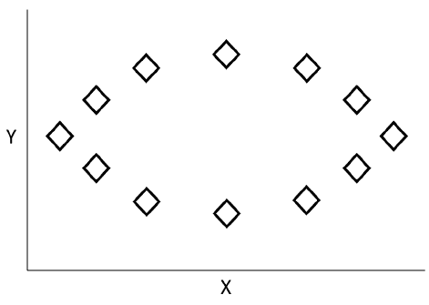

看这个图，数据沿着 *x* 轴的方差最大，所以我们可以画一条水平虚线来表示我们的**第一主成分**，如下图所示。这个分量是我们两个变量或者说*PC1 =α[11]X[1]+α[12]X[2]*的线性组合，其中系数权重是主分量上的变量载荷。它们构成了数据变化最大的方向的基础。该等式受 *1* 约束，以防止选择任意高的值。另一种看待这一点的方式是，虚线使其自身和数据点之间的距离最小化。对于几个点，该距离显示为箭头，如下所示:

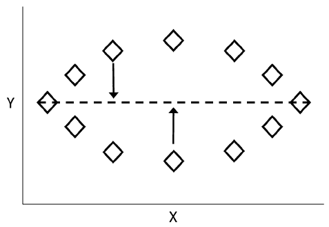

然后以同样的方式计算第二主成分，但是它与第一主成分不相关，即它的方向与第一主成分成直角或正交。下图显示了添加为虚线的第二个主成分:


利用为每个变量计算的主成分负荷，该算法然后将为我们提供主成分分数。为每个观察的每个主成分计算分数。对于 **PC1** 和第一次观察，这将等同于公式*Z[11]=α[11]*(X[11]-X[1]的平均值)+α[12]*(X[12]-X[2]的平均值*。对于 **PC2** 和第一次观察，等式将是*Z[12]=α[21]*(X[11]-X[2]的平均值+α[22]*(X[12]-X[2]的平均值)*。这些主成分分数现在是新的特征空间，用于您将要进行的任何分析。

回想一下，该算法将创建与变量一样多的主成分，解释 100%的可能方差。那么，我们如何首先缩小成分范围以实现最初的目标呢？有一些可以使用的试探法，在接下来的建模过程中，我们将关注细节；但是选择主分量的一种常见方法是如果它的**特征值**大于 1。虽然估计特征值和**特征向量**背后的代数超出了本书的范围，但讨论它们是什么以及如何在 PCA 中使用它们是很重要的。

使用线性代数来确定优化的线性权重，以便创建所谓的特征向量。它们是最优的，因为没有其他可能的权重组合能比它们更好地解释变化。主成分的特征值就是它在整个数据集中解释的变异总量。

回想一下，第一主成分的等式是*PC1 =α[11]X[1]+α[12]X[2]*。

由于第一主成分占最大的变化量，它将具有最大的特征值。第二分量将具有第二高的特征值，依此类推。因此，大于 1 的特征值表明主成分比任何原始变量本身占有更多的方差。如果你将所有特征值的总和标准化为一，你将得到每个分量解释的总方差的百分比。这也有助于你确定一个合适的截止点。

特征值标准当然不是一个一成不变的规则，必须与您手头的数据和业务问题的知识相平衡。一旦您选择了主成分的数量，您可以旋转它们以简化它们的解释。


# 旋转

该不该轮换？如前所述，旋转有助于通过修改每个变量的加载来解释主成分，但使结果在技术上不再是主成分。由旋转分量数解释的总体变化不会改变，但每个分量对总体变化的贡献会改变。通过旋转，你会发现载荷值将会移动得更远或更接近于零，理论上有助于识别那些对每个主成分都很重要的变量。这是试图将一个变量仅与一个主成分相关联。请记住，这是无监督学习，所以你是在试图理解你的数据，而不是测试一些假设。简而言之，轮换有助于你的努力。我已经看到了用于计算载荷的非旋转和旋转成分。我喜欢使用旋转成分。

主分量旋转最常见的形式被称为 **varimax** 。还有其他形式，比如 **quartimax** 和 **equimax** ，但我们将重点放在 varimax 旋转上。根据我的经验，我从未见过其他方法提供更好的解决方案。对你来说，试错可能是解决问题的最好方法。

使用 varimax，我们可以最大化平方负载的方差之和。varimax 过程旋转特征空间的轴及其坐标，而不改变数据点的位置。

也许证明这一点的最好方法是通过另一个简单的例子。让我们假设我们有一个由变量 **A** 到 **G** 组成的数据集，我们有两个主成分。绘制这些数据，我们将得到下图:

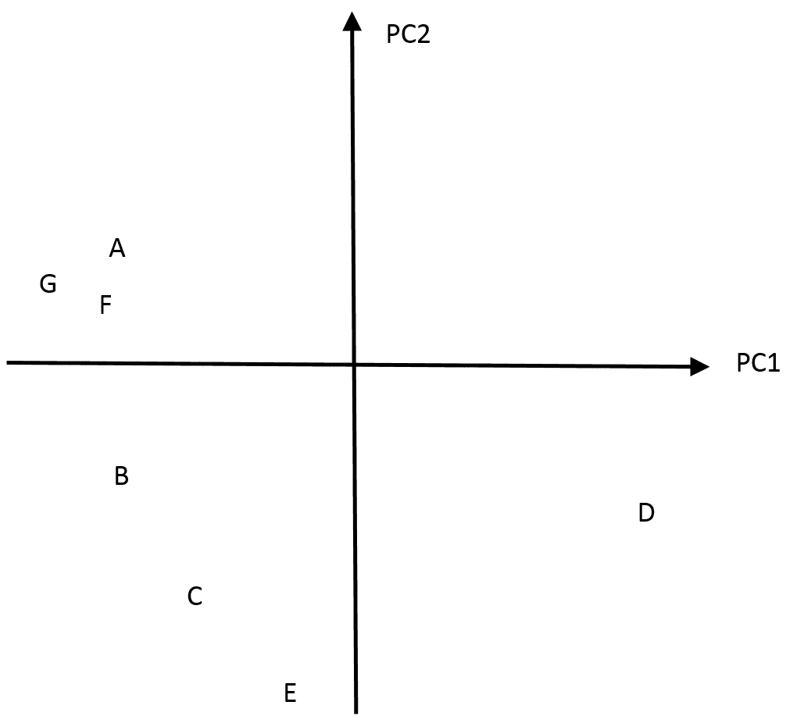

为了便于讨论，假设变量 A 在 **PC1** 上的加载为-0.4，在 **PC2** 上的加载为 0.1。现在，假设变量 D 在 PC1 上的负载为 0.4，在 **PC2** 上的负载为-0.3。对于 E 点，载荷分别为-0.05 和-0.7。注意，载荷将沿着主分量的方向。运行 varimax 程序后，旋转后的成分将如下所示:

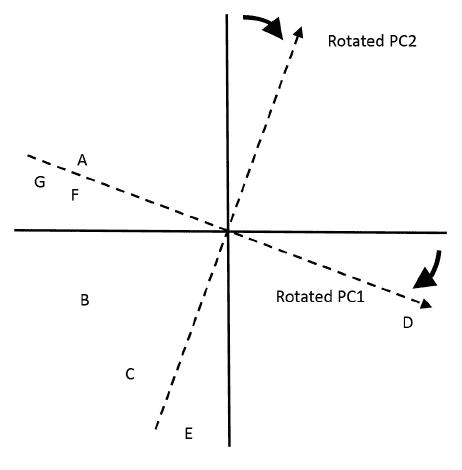

以下是 **PC1** 和 **PC2** 旋转后的新加载:

*   **变量**T2 一 : -0.5 和 0.02
*   **变量 D** : 0.5 和-0.3
*   **变量 E** : 0.15 和-0.75

负载已经改变，但是数据点没有改变。通过这个简单的说明，我们不能说我们简化了解释，但这应该有助于您理解主分量旋转期间发生的情况。


# 数据

我们将使用所谓的 ANSUR 数据集，代表美国陆军人体测量调查。它由两个单独的档案组成:一个是女兵档案，一个是男兵档案。我已经把结果合并成一个数据集。可以在这里下载数据:[https://github . com/packt publishing/Advanced-Machine-Learning-with-R/tree/master/Data/army _ ansur。RData](https://github.com/PacktPublishing/Advanced-Machine-Learning-with-R/tree/master/Data/army_ansur.RData) 。

我在一个名为`data.world`的数据存储网站上发现了这些数据，该网站允许成员共享他们感兴趣的任何数据集。例如，我在网站上有一个版本的葛底斯堡数据，我们在第一章、*准备和理解数据*中使用过。ANSUR 的数据由纳蒂克士兵研究、发展和工程中心对美国陆军 6000 多名现役、预备役和国民警卫队士兵进行的研究组成。这些特征包括 93 种不同的身体尺寸以及各种人口统计数据。美国陆军和承包商使用这些信息来订购适当数量和尺寸的设备，设计新设备，等等。可以想象，这些特征中有许多是高度相关的，这使得这些数据非常适合 PCA。

我们将把这些身体测量值放入 PCA 过程，然后用它来预测体重(以磅为单位),使用我们在前面章节中学到的 MARS 模型。为什么是士兵体重？为什么不呢？我们将把男性和女性放在一起。我们可以将该数据用作输入特征，但我不会。在接受审查的银行业模型中使用年龄、种族、性别等，并准备至少回答一些棘手的问题。好了，介绍够了，让我们开始吧。


# 数据加载和检查

首先，加载必要的包:

```r
> library(magrittr)

> install.packages("caret")

> install.packages("DataExplorer")

> install.packages("earth")

> install.packages("ggthemes")

> install.packages("psych")

> install.packages("tidyverse")

> options(scipen = 999)
```

现在，将数据读入您的环境:

```r
> army_ansur <- readRDS("army_ansur.RData")
```

功能名称相当简单。这里，我只输入最后几个特性作为输出:

```r
> colnames(army_ansur)
 [93] "wristcircumference"     "wristheight" 
 [95] "Gender"                 "Date" 
 [97] "Installation"           "Component" 
 [99] "Branch"                 "PrimaryMOS" 
[101] "SubjectsBirthLocation"  "SubjectNumericRace" 
[103] "Ethnicity"              "DODRace" 
[105] "Age"                    "Heightin" 
[107] "Weightlbs"              "WritingPreference" 
[109] "SubjectId"
```

我对查看`"Component"`和`"Gender"`列的细分很感兴趣:

```r
> table(army_ansur$Component)

Army National Guard   Army Reserve   Regular Army 
               2708            220           3140 

> table(army_ansur$Gender)

Female   Male 
  1986   4082 
```

如果我们查看丢失的值，我们可以看到一些有趣的东西。以下是简短的输出:

```r
> sapply(army_ansur, function(x) sum(is.na(x)))
        PrimaryMOS   SubjectsBirthLocation   SubjectNumericRace 
                 0                       0                    0 
         Ethnicity                 DODRace                  Age 
              4647                       0                    0 
          Heightin               Weightlbs    WritingPreference 
                 0                       0                    0 
         SubjectId 
              4082 
```

我们有一堆丢失的主题 id。好吧，我们现在就来解决这个问题:

```r
> army_ansur$subjectid <- seq(1:6068)
```

因为重量是我们在建立无监督模型后将预测的，所以让我们来看看它:

```r
> sjmisc::descr(army_ansur$Weightlbs)

## Basic descriptive statistics
 var    type label    n NA.prc  mean   sd    se  md trimmed       range skew
  dd integer    dd 6068      0 174.8 33.69 0.43 173   173.4 321 (0-321) 0.39
```

看范围！我们有一个体重为零的人。我认为，这些数据的图表是合理的:

```r
> ggplot2::ggplot(army_ansur, ggplot2::aes(x = Weightlbs)) + 
    ggplot2::geom_density() +
    ggthemes::theme_wsj()
```

上述代码的输出如下:

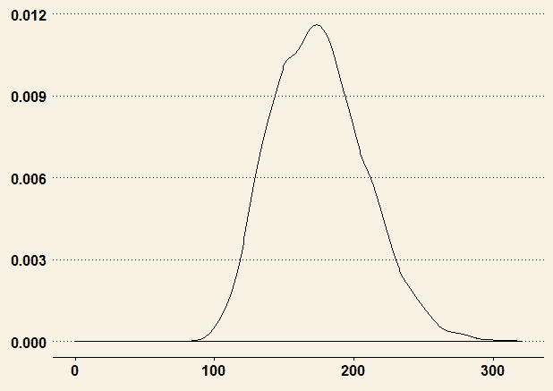

所以，我估计我们只有一两个不可信的重量值的观察结果。事实上，这段代码将证实这一假设:

```r
> dplyr::select(army_ansur, Weightlbs) %>%
    dplyr::arrange(Weightlbs)
# A tibble: 6,068 x 1
   Weightlbs
       <int>
 1         0
 2        86
 3        88
 4        90
 5        95
 6        95
 7        95
 8        96
 9        98
10       100
# ... with 6,058 more rows
```

消除这种观察很重要:

```r
> armyClean <- dplyr::filter(army_ansur, Weightlbs > 0)
```

我们现在可以过渡到为 PCA 捆绑我们的功能，并创建训练和测试数据框架。


# 训练和测试数据集

在这里，我们将把数字特征与定量反应一起放入数据框架中。然后，我们将把它分成 80/20 的训练集和测试集。作为结束语，我们将对 PCA 所需的数据进行缩放。

在这里，我获取了这些输入特征，包括以英寸为单位的身高，以及以千克为单位的体重。我还包括了`subjectid`:

```r
> army_subset <- armyClean[, c(1:91, 93, 94, 106, 107)]
```

我们已经使用了`dplyr`和`caret`包来创建训练和测试集，这里我将演示`dplyr`方法:

```r
> set.seed(1812)

> army_subset %>%
    dplyr::sample_frac(.8) -> train

> army_subset %>%
    dplyr::anti_join(train, by = "subjectid") -> test
```

我之前提到过这个数据有很多高度的相关性。即使你只看了前五个特征，也很清楚:

```r
> DataExplorer::plot_correlation(train[, 2:6])
```

上述代码的输出如下:

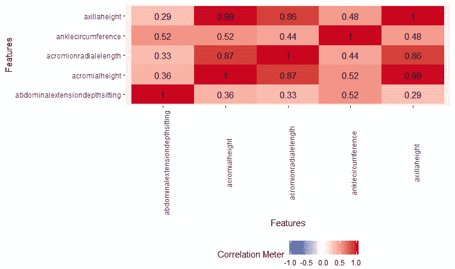

腋窝高度和肩峰高度有 99%的相关性。这些分别指的是腋窝和肩膀的点。

我们需要保留训练数据的 y 值。此外，我们必须缩放数据，即仅缩放输入要素，因此删除`subjectid`和 y 值:

```r
> trainY <- train$Weightlbs

> train_scale <- data.frame(scale(train[, c(-1, -95)]))
```

完成后，我们可以继续创建主成分，并在监督学习示例中使用它们。


# PCA 建模

对于建模过程，我们将使用以下步骤:

1.  提取成分并确定要保留的数量
2.  旋转保留的部件
3.  解释旋转的解决方案
4.  从非旋转成分创建分数
5.  使用分数作为 MARS 回归分析的输入变量，并评估测试数据的性能

有许多不同的方法和包用于在 R 中进行 PCA，包括在 base R 中似乎最常用的`prcomp()`和`princomp()`函数。然而，在我看来，`psych`包似乎是最灵活的，具有最好的选项。


# 成分提取

为了用`psych`包提取成分，您将使用`principal()`函数。语法将包括数据以及我们是否希望此时旋转成分:

```r
> pca <- principal(train_scale, rotate = "none")
```

您可以通过调用我们创建的`pca`对象来检查成分。然而，我的主要意图是确定应该保留多少成分。为此，一块碎石地就足够了。scree 图可以帮助您评估解释数据中最大差异的成分。它显示了在 *x* 轴上的`Component`数字和在 *y* 轴上的相关`Eigenvalues`。为了简化解释，我只包括前 10 个成分:

```r
> plot(pca$values[1:10], type = "b", ylab = "Eigenvalues", xlab = "Component")
```

以下是前面命令的输出:

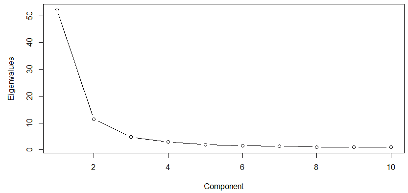

你要寻找的是碎石图中变化率减小的一点。这就是图中通常所说的肘或弯。图中的拐点捕捉到这样一个事实，即由一个成分解释的额外变化在一个成分与下一个成分之间没有很大的不同。换句话说，它是曲线变平的断点。在图中，也许四个、五个或六个成分看起来很有说服力。我认为需要更多的信息。这里，我们可以看到这 10 个成分的特征值。经验法则建议选择特征值大于 1 的所有元件:

```r
> head(pca$values, 10)
 [1] 52.2361 11.3294 4.7375 3.0193 1.9830 1.5153 1.2896 1.0655 1.0275
[10]  0.9185
```

我多年来学到的另一个规则是，你应该捕捉总方差的大约 70%，这意味着由每个选定成分解释的累积方差占所有成分解释的方差的 70%。这很容易做到。我倾向于五个部分:

```r
> sum(pca$values)
[1] 93

> sum(pca$values[1:5])
[1] 73.31
```

我们仅用`5`个成分就获得了总方差的 79%。让我们把这些放在一起:

```r
> pca_5 <- psych::principal(train_scale, nfactors = 5, rotate = "none")
```

调用对象会产生许多结果。以下是输出顶部的简要结果:

```r
> pca_5
Principal Components Analysis
Call: psych::principal(r = train_scale, nfactors = 5, rotate = "none")
Standardized loading (pattern matrix) based upon correlation matrix
                                PC1   PC2  PC3   PC4   PC5   h2    u2 com
abdominalextensiondepthsitting 0.58  0.66 0.09 -0.08 -0.26 0.85 0.146 2.4
acromialheight                 0.92 -0.27 0.13  0.19 -0.03 0.98 0.025 1.3
acromionradialelength          0.84 -0.29 0.16 -0.04 -0.11 0.83 0.167 1.4
anklecircumference             0.67  0.34 0.00  0.02  0.34 0.69 0.314 2.0
```

在这里，我们看到五个成分中的每一个都加载了特性。例如，`acromialheight`在成分 1 上具有最高的特征正负载。在这里，我粘贴了输出中显示平方和的部分:

```r
                            PC1   PC2  PC3  PC4  PC5
SS loading               52.24 11.33 4.74 3.02 1.98
Proportion Var             0.56  0.12 0.05 0.03 0.02
Cumulative Var             0.56  0.68 0.73 0.77 0.79
Proportion Explained       0.71  0.15 0.06 0.04 0.03
Cumulative Proportion      0.71  0.87 0.93 0.97 1.00
```

这里，数字是每个分量的特征值。当它们被规范化后，您将得到`Proportion Explained`行，正如您可能已经猜到的那样，它代表由每个成分解释的方差的比例。你可以看到主成分 1 解释了五个成分解释的所有方差的 56%。请记住，我们之前检查了启发式规则，即您选择的成分应该至少占总变化的 70%。如前所述,`Cumulative Var`行显示累积方差为 79%。


# 正交旋转和解释

正如我们之前所讨论的，旋转背后的要点是最大化特定成分上的变量负载，这有助于通过减少/消除这些成分之间的相关性来简化解释。进行正交旋转的方法称为 **varimax** 。还有其他非正交旋转方法允许因子/成分之间的相关性。你将在你的职业中使用的轮换方法的选择应该基于相关的文献，这超出了本章的范围。请随意试验这个数据集。我认为，当有疑问时，任何 PCA 的起点都应该是正交旋转。

对于这个过程，我们将简单地返回到`principal()`函数，稍微改变语法以考虑五个分量和正交旋转，如下所示:

```r
> pca_rotate <- psych::principal(train_scale, nfactors = 5, rotate = "varimax")
```

考虑到特性的数量，我通常只是将它保存到一个 CSV 文件中，并在电子表格中检查它，特别是与主题专家一起检查。在这里，我们保存它，我会回来与什么是高层次的总结。当我在肿瘤学市场研究部门工作时，我们总是以围绕药物疗效的部分结束，一个围绕药物的副作用，然后可能是一个或两个关于剂量、成本或诸如此类的部分。这里的代码只是从对象中移除了疯狂的`loading`类，因此我们可以将它保存为 dataframe:

```r
> pca_loading <- unclass(pca_rotate$loading)

> pca_loading <- data.frame(pca_loading)

> pca_loading$features <- row.names(pca_loading)

> readr::write_csv(pca_loading, "pca_loading.csv")
```

欢迎回来！没有正确的答案，但是我猜想如何总结这些成分应该是这样的:

*   **PC1** :一个通吃成分；44 个特征的负载高于 0.5
*   **PC2** :臀部、大腿和臀部...腰身和胸部略显丰满
*   PC3:脖子、肩膀、手臂
*   **PC4** :一些高度测量
*   奇怪的是，头和脚的尺寸

命名成分可能是一个有趣的练习。我深情地回忆起那些将这些成分命名为富有同情心的保守主义者、务实的实践者等等的日子。尽管如此，我们需要从这些组成部分中创建分数，以便我们可以尝试监督学习。


# 从成分创建分数

我们现在需要捕捉成分负载，作为每个观察的分数。这些分数表明每个观察(士兵)与一个成分的关系。让我们这样做，并在数据框架中捕获分数，因为我们将需要使用它来进行分析:

```r
> pca_scores <- data.frame(round(pca_5$scores, digits = 2))

> head(pca_scores)
    PC1   PC2   PC3   PC4   PC5
1 -1.37  0.29  1.06  0.09  0.29
2 -1.19 -0.45 -0.22 -1.61  0.22
3 -0.04 -1.19 -0.45 -0.69  0.05
4  1.44 -0.96  0.43 -1.87 -0.16
5  1.37  2.07  0.26  0.15  2.05
6 -0.09  0.29 -0.96 -0.07  0.17
```

我们现在有了每个士兵每个部分的分数。这些只是每个观察值的特征乘以每个成分上的负载，然后求和。现在，我们可以将响应作为数据中的一列:

```r
> pca_scores$weight <- trainY
```

完成这些后，我认为我们不得不检查这些数据的相关性:

```r
> DataExplorer::plot_correlation(pca_scores)
```

上述代码的输出如下:

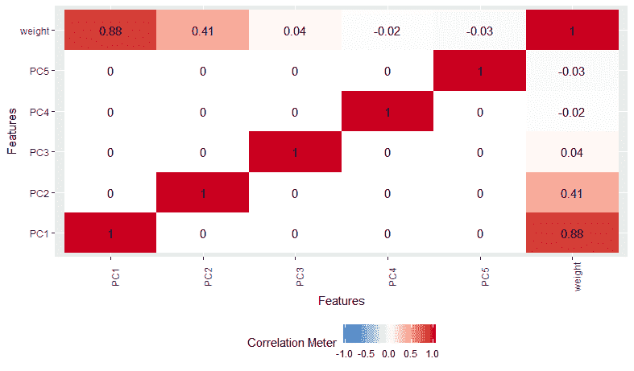

我们看到，成分 1 和 2 与体重正相关，而其他成分似乎没有意义。我们必须记住，这是单变量，我们的模型可能会证明一些不同的东西。


# 与火星的回归

为了完成这部分流程，我们将使用`earth`包构建一个模型，在训练数据上检查它，然后看看它在测试数据上的表现。我们将使用算法进行 10 重交叉验证:

```r
> set.seed(1492)

> earth_fit <-
    earth::earth(
    x = pca_scores[, 1:5],
    y = pca_scores[, 6],
    pmethod = 'cv',
    nfold = 10,
    degree = 1,
    minspan = -1
 )
```

调用模型对象的摘要，我们总共得到 7 个术语，其中有 3 个特征:

```r
> summary(earth_fit)
Call: earth(x=pca_scores[,1:5], y=pca_scores[,6], pmethod="cv", degree=1, nfold=10,
            minspan=-1)

            coefficients
(Intercept)      174.182
h(0.1-PC1)       -26.380
h(PC1-0.1)        33.806
h(0.01-PC2)      -13.181
h(PC2-0.01)       13.842
h(0.02-PC5)        1.333
h(PC5-0.02)        -0.869

Selected 7 of 7 terms, and 3 of 5 predictors using pmethod="cv"
Termination condition: RSq changed by less than 0.001 at 7 terms
Importance: PC1, PC2, PC5, PC3-unused, PC4-unused
Number of terms at each degree of interaction: 1 6 (additive model)
GRSq 0.9518 RSq 0.952 mean.oof.RSq 0.9512 (sd 0.0151)

pmethod="backward" would have selected the same model:
    7 terms 3 preds, GRSq 0.9518 RSq 0.952 mean.oof.RSq 0.9512
```

该模型使用成分 1、2 和 5 获得了巨大的 r 平方值`0.952`。使用`plotmo`可以更容易地看到铰链的功能:

```r
> plotmo::plotmo(earth_fit)
```

上述代码的输出如下:

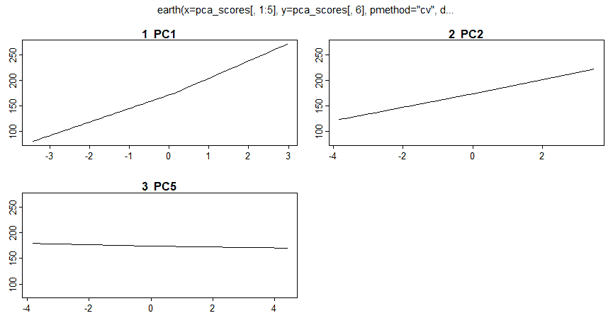

从`plotmo`中辨别这些微妙的枢纽功能是一种挑战，除了 PC1。要了解该模型的实际表现，请保存预测值并运行一些图:

```r
> ggplot2::ggplot(pca_scores, ggplot2::aes(x = earthpred, y = weight)) +
    ggplot2::geom_point() +
    ggplot2::stat_smooth(method = "lm", se = FALSE) +
    ggthemes::theme_pander()
```

上述代码的输出如下:

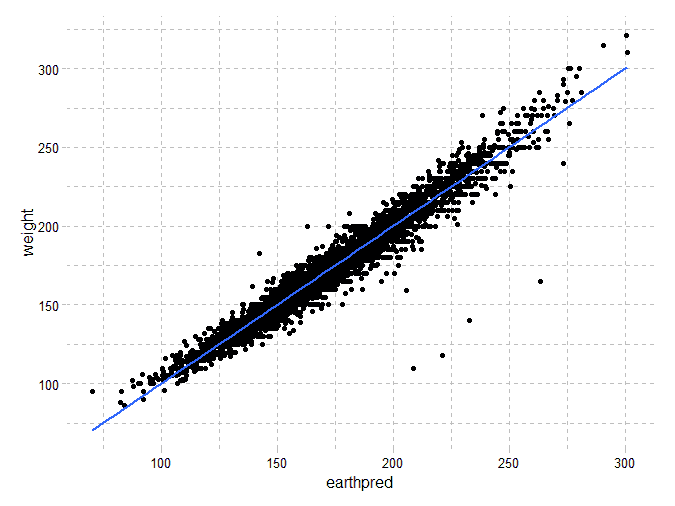

我们看到一个很好的线性关系，但我们有几个异常值，让我们抓耳挠腮。你的意思是我们的模型预测的体重几乎是 225 磅，但是士兵不到 125 磅？这些异常值预测有问题，可能是测量或数据输入错误；尽管如此，它们仍然是有趣的观察结果，值得进一步研究，*时间允许*。

残差怎么样？

```r
> ggplot2::ggplot(pca_scores, ggplot2::aes(x = earthpred, y = earthresid)) +
    ggplot2::geom_point() +
    ggplot2::stat_smooth(method = "loess", se = FALSE) +
    ggthemes::theme_few()
```

上述代码的输出如下:

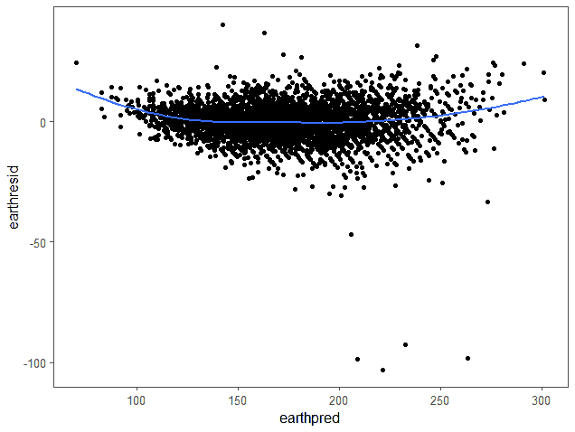

只是最轻微的曲线关系。我们看到算法低估了士兵在极端情况下的体重。我们已经有了 r 平方，但是 RMSE 和梅可以快速调用:

```r
> caret::postResample(pred = pca_scores$earthpred, 
    obs = pca_scores$weight)
     RMSE Rsquared   MAE 
    7.336    0.952 5.219 
```

平均绝对误差仅为 5%。让我们看看这是否适用于测试数据。


# 测试数据评估

您需要对样本外数据做的事情之一是根据原始(训练)数据对其进行缩放。`psych`包附带的预测功能允许您毫不费力地做到这一点。我们将这些经过调整和评分的值放入一个数据框架中，然后我们可以用它来进行样本外预测:

```r
> test_reduced <- as.matrix(test[, c(-1, -95)])

> test_scores <- data.frame(predict(pca_5, test_reduced, old.data = train[, c(-1, -95]))
```

这里，我们只是将预测值和实际值相加:

```r
> test_scores$testpred <- predict(earth_fit, test_scores)

> test_scores$weight <- test$Weightlbs
```

结果看起来不错:

```r
> caret::postResample(pred = test_scores$testpred, 
    obs = test_scores$weight)
    RMSE Rsquared    MAE 
  7.8735   0.9468 5.1937 
```

性能下降了一点点。我认为我们可以推进这一模式。对异常值的进一步探索是为了查看是否存在测量误差，从分析中删除它们，或者截断它们。最后，让我们看看实际值与预测值的对比图:

```r
> ggplot2::ggplot(test_scores, ggplot2::aes(x = testpred, y = weight)) +
    ggplot2::geom_point() +
    ggplot2::stat_smooth(method = "lm", se = FALSE) +
    ggthemes::theme_excel_new()
```

上述代码的输出如下:

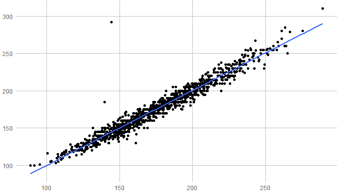

它看起来类似于训练数据图。同样，至少有一个异常。我们的模型怎么能预测一个士兵大约 140 磅，但他们实际上几乎是 300 磅？我们可以自娱自乐地继续下去，但还是继续吧。


# 摘要

在这一章中，我们通过探索 PCA，检查它是什么，并在实践中应用它，对无监督学习技术进行了第二次尝试。我们探索了当面对大量高度相关的变量时，如何使用它来降低维度并提高对数据集的理解。然后，我们将其应用于美国陆军士兵人体测量的真实数据，在与 MARS 的回归分析中使用所得的主成分来预测士兵的体重。此外，我们还探索了可视化数据和模型结果的方法。

作为一种无监督的学习技术，它需要一些判断以及尝试和错误，以达到商业伙伴可以接受的最佳解决方案。然而，它是提取潜在见解和支持监督学习的强大工具。

在下一章，我们将研究使用无监督学习来观察关联分析。