# 十二、时间序列和因果关系

“经济学家是明天就会知道为什么他昨天预测的事情今天没有发生的专家。”

劳伦斯·J·彼得

单变量时间序列是指在标准时间尺度上收集的测量值，可以是分钟、小时、天、周、月等等。与其他数据相比，时间序列的问题在于观察的顺序很重要。这种顺序依赖性会导致标准分析方法产生不必要的高偏差或方差。

看起来关于机器学习和时间序列数据的文献很少，或者是不合标准的。举个例子，我在 2018 年春天的一个数据科学会议上，一位备受推崇的机器学习专家提到，向量自回归要求数据是平稳的。我们以后再讨论这个。听到这里，我差点摔倒。假数据新闻！我告诉我的受过计量经济学训练的同事，让他们感到恐惧和沮丧。这是不幸的，因为如此多的真实世界数据都包含时间成分。此外，时间序列分析可能相当复杂和棘手。我会说，如果你没有看到一个时间序列分析做错了，你没有看得足够近。

涉及时间序列的另一个经常被忽视的方面是因果关系。是的，我们不想混淆相关性和因果关系，但是，在时间序列分析中，我们可以应用格兰杰因果关系的技术来确定因果关系，从统计上来说，是否存在。

在这一章中，我们将应用时间序列/计量经济学技术来识别单变量预测模型(包括总体)，向量自回归模型，最后是格兰杰因果关系。完成本章后，您可能不是时间序列分析的完全大师，但您将了解足够的知识来执行有效的分析，并理解在构建时间序列模型和创建预测模型(预测)时要考虑的基本问题。

以下是本章将涉及的主题:

*   单变量时间序列分析
*   时序数据
*   建模和评估


# 单变量时间序列分析

我们将重点介绍两种分析和预测单个时间序列的方法:**指数平滑**和**自回归综合移动平均** ( **ARIMA** )模型。我们先来看看指数平滑模型。

与移动平均模型一样，指数平滑模型使用过去观察值的权重。但与移动平均线模型不同的是，观察值越新，相对于后来的观察值，它的权重就越大。有三种可能的平滑参数需要估计:总体平滑参数、趋势参数和季节平滑参数。如果不存在趋势或季节性，则这些参数变得无效。

平滑参数通过以下等式生成预测:

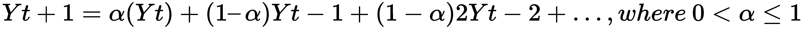

在这个方程中，*Y[T]是当时的值， *T* ，alpha ( *α* )是平滑参数。算法通过最小化误差、**误差平方和** ( **SSE** )或最大似然来优化 alpha(和其他参数)。*

预测方程以及趋势和季节性方程(如果适用)如下:

*   预测，其中 *A* 是前面的平滑方程， *h* 是预测周期数: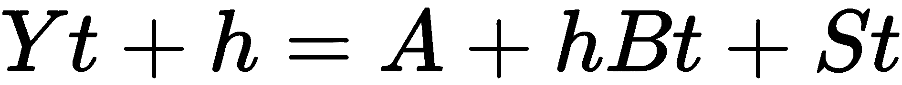
*   趋势方程式:
*   季节性，其中 *m* 是季节周期数: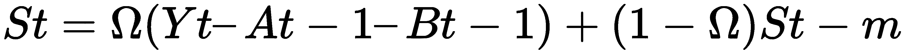

这个方程被称为**霍尔特-温特斯法**。预测方程本质上是相加的，趋势是线性的。该方法还允许包含衰减趋势和倍增季节性，其中季节性随时间成比例地增加或减少。有了这些模型，你不必像在 ARIMA 模型中那样担心平稳性的假设。平稳性是指时间序列在所有时间段之间具有恒定的均值、方差和相关性。话虽如此，理解 ARIMA 模型仍然很重要，因为在某些情况下它们会有最佳的表现。

从自回归模型开始，在时间 *T* 的 *Y* 的值是 *Y* 的先验值的线性函数。自回归 lag-1 模型 *AR(1)* 的公式为。该模型的关键假设如下:

*   *Et* 表示误差同分布且独立分布，均值为零，方差恒定
*   误差与 *Yt* 无关
*   Yt，Yt-1，Yt-n...是静止的，这意味着*φ*的绝对值小于 1

有了平稳的时间序列，就可以考察**自相关函数** ( **ACF** )。平稳序列的 ACF 给出了 *h = 1，2 时 *Yt* 和 *Yt-h* 之间的相关性...n* 。让我们使用 R 来创建一个 *AR(1)* 序列并绘制它:

```py
> install.packages("forecast")

> set.seed(1966)

> ar1 <- arima.sim(list(order = c(1, 0, 0), ar = 0.5), n = 200)

> forecast::autoplot(ar1, main = "AR1")
```

以下是前面命令的输出:

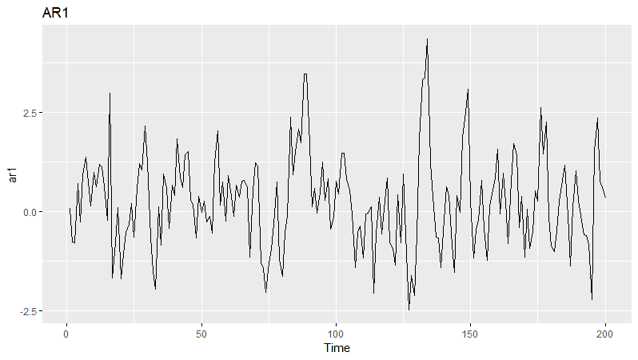

现在，让我们来检查一下`ACF`:

```py
> forecast::autoplot(acf(ar1, plot = F), main = "ACF of simulated AR1")
```

上述命令的输出如下:

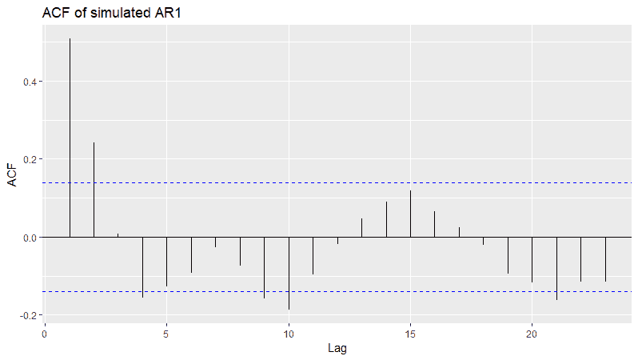

**ACF** 图显示，随着**滞后**的增加，相关性呈指数下降。蓝色虚线表示显著相关的置信带。任何高于高波段或低于低波段的线都被认为是重要的。除了 ACF，我们还要考察**偏自相关函数** ( **PACF** )。PACF 是一种条件相关性，这意味着 *Yt* 和 *Yt-h* 之间的相关性取决于两者之间的观测值。直观理解这一点的一个方法是考虑线性回归模型及其系数。我们假设你有 *Y = B0 + B1X1* 对 *Y = B0 + B1X1 + B2X2* 。第一个模型中的 *X* 到 *Y* 的关系与一个系数成线性关系，但是在第二个模型中，该系数将会不同，因为现在也考虑了 *Y* 和 *X2* 之间的关系。注意，在下面的`PACF`图中，lag-1 处的部分自相关值与 lag-1 处的自相关值相同，因为这不是条件相关:

```py
 > forecast::autoplot(pacf(ar1, plot = F), main = "PACF of simulated AR1")
```

以下是前面命令的输出:

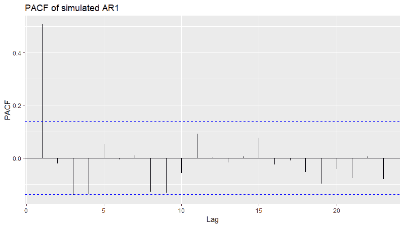

根据前面的时间序列图，我们可以有把握地假设该序列是平稳的。我们将在实际练习中查看几个统计测试，以确保数据是稳定的，但有时，眼球测试就足够了。如果数据不是静态的，那么可以通过取其差值来还原数据。这是 ARIMA 的综合(I)。差分后，新数列变成*δYt = Yt-Yt-1*。人们应该期望一阶差分实现平稳性，但在某些情况下，二阶差分可能是必要的。具有 *AR(1)* 和 *I(1)* 的 ARIMA 模型将被标注为(1，1，0)。

**MA** 代表**移动平均线**。这不是股票价格的 50 天移动平均线那样简单的移动平均线，而是一个应用于误差的系数。当然，误差是同分布和独立分布的，均值为零，方差不变。 *MA(1)* 模型的公式为 *Yt =常数+Et+θEt-1*。正如我们对 *AR(1)* 模型所做的那样，我们可以在 R 中构建一个 *MA(1)* ，如下所示:

```py
    > set.seed(123)

    > ma1 <- arima.sim(list(order = c(0, 0, 1), ma = -0.5), n = 200)

    > forecast::autoplot(ma1, main = "MA1")
```

以下是前面命令的输出:

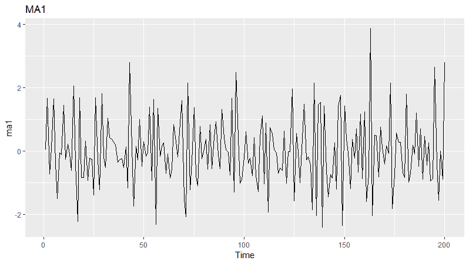

`ACF`和`PACF`图与 *AR(1)* 模型略有不同。请注意，在查看图表时，有一些经验法则可以用来确定模型是否有 AR 和/或 MA 项。它们可能有点主观，所以我将把学习这些启发法的任务留给您，但是请相信 R 能够识别正确的模型。在下面的图中，我们将看到滞后-1 处的显著相关性以及滞后-1 和滞后-2 处的两个显著偏相关:

```py
> forecast::autoplot(acf(ma1, plot = F), main = "ACF of simulated MA1")
```

上述命令的输出如下:

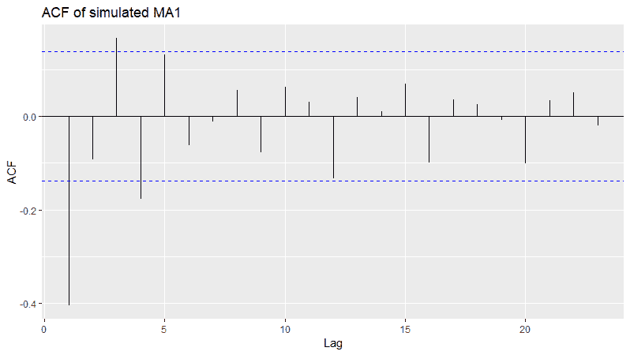

前面的图是`ACF`图，现在，我们将看到`PACF`图:

```py
> forecast::autoplot(pacf(ma1, plot = F), main = "PACF of simulated MA1")
```

上述命令的输出如下:

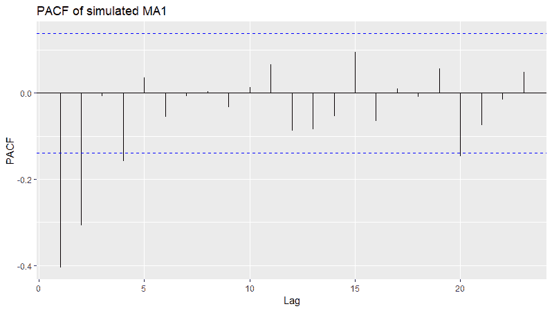

在 ARIMA 模型中，可以加入季节性因素，包括自回归、积分和移动平均项。非季节性 ARIMA 模型符号一般为 *(p，d，q)* 。对于季节性 ARIMA，假设数据是每月的，那么符号将是 *(p，D，q) x (P，D，Q)12* ，符号中的 12 考虑了每月的季节性。在我们将要使用的包中，R 可以自动识别是否应该包括季节性；如果是这样，也将包括最佳术语。


# 理解格兰杰因果关系

想象你被问到一个问题，比如，*新处方的数量和药物 X 的总处方数量之间有什么关系？*您知道这些是按月衡量的，那么考虑到人们认为新脚本会推高总脚本，您能做些什么来理解这种关系呢？或者，检验大宗商品价格——尤其是铜——是美国股市价格的领先指标这一假设如何？嗯，对于两组时间序列数据， *x* 和 *y* ，格兰杰因果关系是一种试图确定一个序列是否可能影响另一个序列的变化的方法。这是通过获取一个序列的不同滞后并使用它来模拟第二个序列的变化来实现的。为了实现这一点，我们将创建两个预测 *y* 的模型，一个模型只有 *y* ( `Ω`)的过去值，另一个模型有 *y* 和 *x* ( `π`)的过去值。模型如下，其中 *k* 为时间序列中的滞后数:

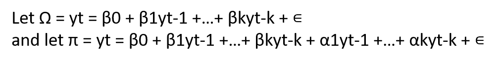

然后比较 RSS，并使用`F-test`来确定嵌套模型(`Ω`)是否足以解释 *y* 的未来值，或者完整模型(`π`)是否更好。`F-test`用于测试以下无效假设和替代假设:

*   *:`αi = 0`对于每一个 *i* `∊[1,k]`，没有格兰杰因果关系*
**   *:`αi ≠ 0`至少有一个 *i* `∊[1,k]`，格兰杰因果关系**

 **本质上，我们试图确定我们是否可以说，从统计上来说， *x* 比单独的 *y* 的过去值提供了更多关于 *y* 的未来值的信息。在这个定义中，很明显，我们并没有试图证明实际的因果关系，只是这两个值通过某种现象联系在一起。按照这些思路，我们还必须反向运行这个模型，以便验证 *y* 没有提供关于 *x* 的未来值的信息。如果我们发现是这种情况，很可能有一些外生变量，比如说 *Z* ，需要加以控制，或者可能是格兰杰因果关系的更好候选。最初，您必须将该方法应用于平稳时间序列，以避免虚假结果。这不再是我将要证明的情况。

请注意，讨论非线性模型使用的技术的研究论文是可用的，但这超出了本书的范围。我推荐阅读一篇优秀的关于格兰杰因果关系的介绍性论文，它围绕着古老的先有鸡还是先有蛋的难题(瑟曼，1988)。

有几种不同的方法来识别适当的滞后结构。自然，我们可以使用蛮力和无知来测试所有合理的滞后，一次一个。我们可能有一个基于领域专业知识的理性直觉，或者可能有一个先前的研究来指导滞后选择。如果没有，那么可以应用**向量自回归** ( **VAR** )来识别信息准则最低的滞后结构，比如**艾卡克的信息准则** ( **AIC** )或者**最终预测误差** ( **FPE** )。为简单起见，这里是两个变量的 VAR 模型的符号，每个变量只有一个滞后。这种符号可以扩展到任意多的变量和滞后:

*   *Y =常数[1]+B[11]Y[t-1]+B[12]Y[t-1]+e[1]*
*   *X =常数[1]+B2[1]Y[t-1]+B2[2]Y[t-1]+E2*

在 R 中，这个过程很容易实现，我们将在下面的实际问题中看到。


# 时序数据

这个星球不会去任何地方。我们是！我们要走了。

——哲学家和喜剧演员，乔治·卡林

气候变化正在发生。它一直都是，也将会是，但最大的问题是，至少从政治和经济的角度来看，气候变化是人为的吗？我将利用这一章来测试计量经济学时间序列模型，试图了解从统计学角度来说，碳排放是否会导致气候变化，尤其是气温上升。就我个人而言，我想在这个问题上采取中立的立场，永远记住卡林先生在他关于这个问题的教导中留给我们的明智原则。

首要任务是找到并收集数据。对于温度，我选择了 **HadCRUT4** 年中值温度时间序列，这大概是黄金标准。这些数据是由东安格利亚大学气候研究中心和英国气象局哈德利中心合作汇编的。在 http://www.metoffice.gov.uk/hadobs/index.html 的[可以获得关于数据如何编译和建模的全面讨论。](http://www.metoffice.gov.uk/hadobs/index.html)

我们将使用的数据是以年度异常值的形式提供的，它是通过给定时间段的年平均地表温度与参考年份(1961-1990 年)的平均值之间的差异来计算的。年度表面温度是全球收集的温度集合，由 **CRUTEM4** 表面空气温度和 **HadSST3** 海面数据集混合而成。怀疑论者抨击有偏见和不可靠:[http://www . telegraph . co . uk/comment/11561629/Top-scientists-start-to-examinate-fiddled-global-warming-figures . html](http://www.telegraph.co.uk/comment/11561629/Top-scientists-start-to-examine-fiddled-global-warming-figures.html)。这已经超出了我们的工作范围，所以我们必须接受和利用这些数据，但是我仍然觉得很有趣。我提取了 1919 年到 2013 年的数据来匹配我们的二氧化碳数据。

全球二氧化碳排放量估计可在美国能源部**二氧化碳信息分析中心** ( **CDIAC** )的以下网站找到:【http://cdiac.ornl.gov/】T4。

我已经将数据放在一个`.csv`文件(`climate.csv`)中，供您下载并存储在您的工作目录:[https://github . com/packt publishing/Advanced-Machine-Learning-with-R/blob/master/Data/climate . CSV](https://github.com/PacktPublishing/Advanced-Machine-Learning-with-R/blob/master/Data/climate.csv)。

让我们根据需要安装库，加载数据，并检查结构:

```py
> library(magrittr)

> install.packages("tidyverse")

> install.packages("ggplot2")

> install.packages("ggthemes")

> install.packages("tseries")

> climate <- readr::read_csv("climate.csv")

> str(climate)
Classes ‘tbl_df’, ‘tbl’ and 'data.frame': 95 obs. of 3 variables:
 $ Year: int 1919 1920 1921 1922 1923 1924 1925 1926 1927 1928 ...
 $ CO2 : int 806 932 803 845 970 963 975 983 1062 1065 ...
 $ Temp: num -0.272 -0.241 -0.187 -0.301 -0.272 -0.292 -0.214 -0.105 -0.208 -0.206 ...
```

我们将把它放在一个时间序列结构中，指定开始和结束年份:

```py
> climate_ts <- ts(climate[, 2:3],
    start = 1919,
    end = 2013)
```

随着我们的数据加载并放入时间序列结构中，我们现在可以开始理解并进一步为分析做准备。


# 数据探索

让我们从使用基数 R 的时间序列图开始:

```py
> plot(climate_ts, main = "CO2 and Temperature Deviation")
```

上述命令的输出如下:

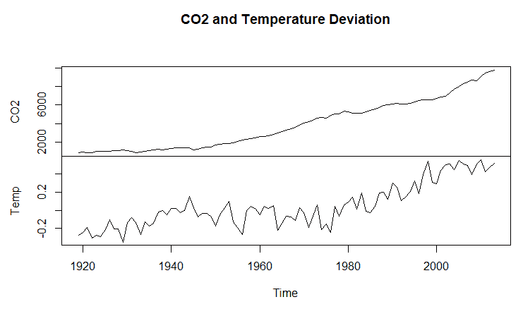

似乎二氧化碳水平在第二次世界大战后真正开始上升，在 20 世纪 70 年代中期气温异常迅速上升。似乎没有任何明显的异常值，并且随时间的变化似乎是恒定的。使用标准程序，我们可以看到这两个系列高度相关，如下所示:

```py
    > cor(climate_temp)
               CO2      Temp
    CO2  1.0000000 0.8404215
    Temp 0.8404215 1.0000000
```

如前所述，这没有什么值得高兴的，因为它证明了什么。我们将通过绘制两个系列的`ACF`和`PACF`来寻找结构:

```py
> forecast::autoplot(acf(climate_ts[, 2], plot = F), main="Temperature ACF")
```

上述代码片段的输出如下:

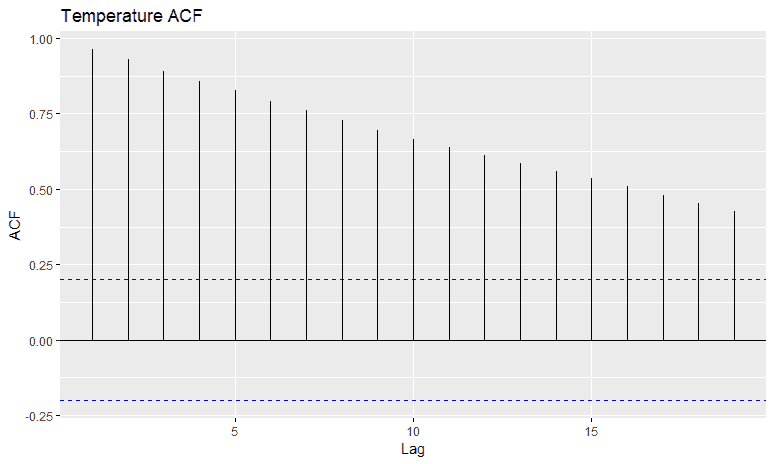

这段代码给出了温度的`PACF`图:

```py
> forecast::autoplot(pacf(climate_ts[, 2], plot = F), main = "Temperature PACF")
```

上述代码片段的输出如下:

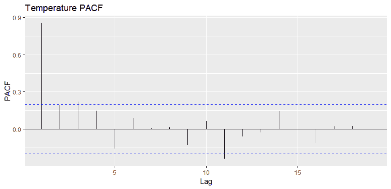

这段代码为我们提供了`CO2`的`ACF`图:

```py
> forecast::autoplot(acf(climate_ts[, 1], plot = F), main = "CO2 ACF")
```

上述代码片段的输出如下:

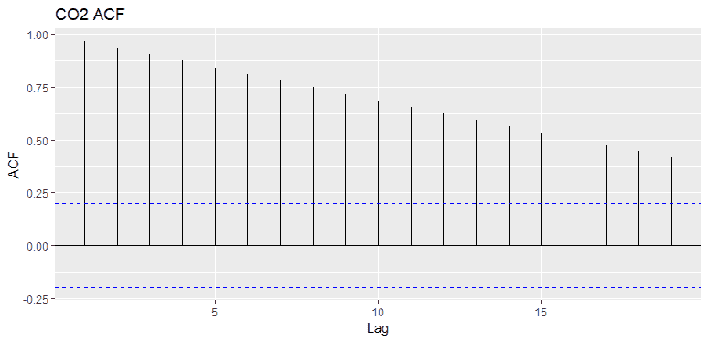

这段代码为我们提供了`CO2`的`PACF`图:

```py
> forecast::autoplot(acf(climate_ts[, 1], plot = F), main = "CO2 PACF")
```

上述代码片段的输出如下:

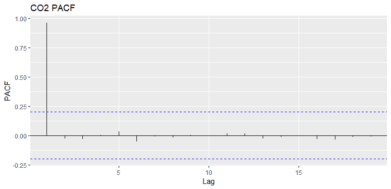

对于缓慢衰减的 ACF 模式和快速衰减的 PACF 模式，我们可以假设这些序列都是自回归的，尽管`Temp`似乎有一些重要的 MA 项。接下来，我们来看看**互相关函数** ( **CCF** )。注意，在函数中，我们将 *x* 放在 *y* 之前:

```py
> forecast::autoplot(ccf(climate_ts[, 1], climate_ts[, 2], plot = F), main = "CCF")
```

上述代码的输出如下:

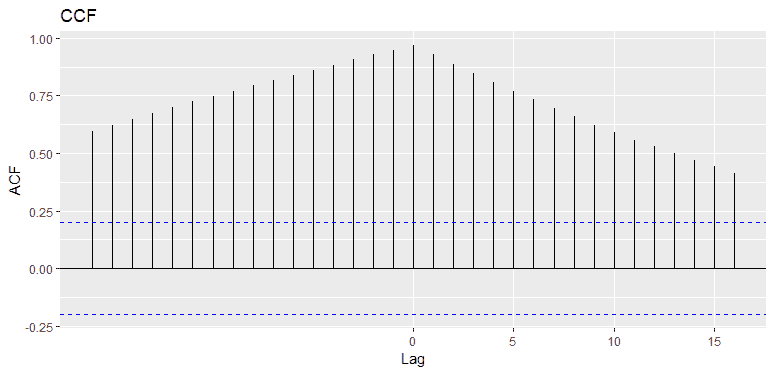

**CCF** 向我们展示了温度和 CO2 滞后之间的关系。如果 *x* 变量的负滞后具有高相关性，我们可以说 *x* 领先 *y* 。如果 *x* 的正滞后具有高相关性，我们说 *x* 滞后 *y* 。在这里，我们可以看到二氧化碳既是领先变量，也是滞后变量。对于我们的分析，令人鼓舞的是我们看到了前者，但奇怪的是我们看到了后者。我们将在 VAR 和 Granger 因果分析中看到这是否重要。

此外，我们需要测试数据是否是稳定的。我们可以用`tseries`包中的**增强 Dickey-Fuller** ( **ADF** )测试来证明这一点，使用`adf.test()`函数，如下所示:

```py
    > tseries::adf.test(climate_ts[, 1])

           Augmented Dickey-Fuller Test

    data: climate_ts[, 1]
    Dickey-Fuller = -1.1519, Lag order = 4, p-value =
    0.9101
    alternative hypothesis: stationary

    > tseries::adf.test(climate_ts[, 2])

           Augmented Dickey-Fuller Test

    data: climate_ts[, 2]
    Dickey-Fuller = -1.8106, Lag order = 4, p-value =
    0.6546
    alternative hypothesis: stationary
```

对于这两个系列，我们有无关紧要的`p-values`，所以我们不能拒绝零，并得出结论，他们不是平稳的。

研究完数据后，让我们开始建模过程，首先将单变量技术应用于温度异常。


# 建模和评估

对于建模和评估步骤，我们将关注三个任务。第一个是产生一个仅适用于地表温度的单变量预测模型。第二个是开发一个地表温度和 CO2 水平的向量自回归模型，用这个模型的结果来指导我们研究 CO2 水平是否是地表温度异常的格兰杰原因。


# 单变量时间序列预测

这项任务的目标是对地表温度进行单变量预测，重点是选择指数平滑模型、ARIMA 模型或包括神经网络在内的综合方法。我们将训练模型，并在超时测试集上确定它们的预测准确性，就像我们在其他学习工作中所做的那样。下面的代码创建定型集和测试集:

```py
> temp_ts <- ts(climate$Temp, start = 1919, frequency = 1)

> train <- window(temp_ts, end = 2007)

> test <- window(temp_ts, start = 2008)
```

为了构建我们的指数平滑模型，我们将使用`forecast`包中的`ets()`函数。该函数将找到具有最低 AIC 的最佳模型:

```py
> fit.ets <- forecast::ets(train)

> fit.ets
ETS(A,A,N) 

Call:
 forecast::ets(y = train) 

  Smoothing parameters:
    alpha = 0.3429 
    beta = 1e-04 

  Initial states:
    l = -0.2817 
    b = 0.0095 

  sigma: 0.1025

       AIC AICc BIC 
-0.1516906 0.5712010 12.2914912
```

模型对象返回许多感兴趣的参数。首先要检查的是`(A,A,N)`是什么意思。它表示所选择的模型是带有附加误差的简单指数平滑。第一个字母表示误差类型，第二个字母表示趋势，第三个字母表示季节性。可能的字母如下:

*   *A =添加剂*
*   *M =乘法*
*   *N =无*

我们还可以看到α(平滑参数)用于误差校正(电平)，β(斜率)用于参数估计。初始状态值用于启动模型选择；sigma 是残差的变化，提供了模型标准值。您可以绘制估计值随时间的变化情况:

```py
> forecast::autoplot(fit.ets)
```

上述代码的输出如下:

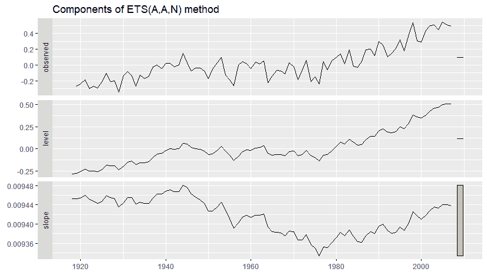

我们现在将绘制`forecast`，看看它在测试数据上的表现如何:

```py
> plot(forecast::forecast(fit.ets, h = 6))

> lines(test, type = "o")
```

上述代码的输出如下:

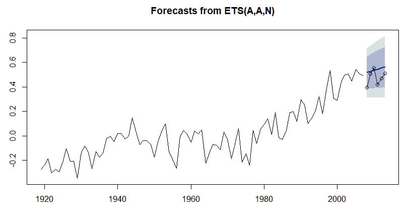

从图上看，似乎这个预测显示了一个轻微的线性上升趋势，并且高估了实际值。我们现在来看看模型的准确性度量:

```py
> fit.ets %>% forecast::forecast(h = 6) %>%
    forecast::accuracy(temp_ts)
                      ME       RMSE        MAE       MPE     MAPE      MASE
Training set -0.00160570 0.10012357 0.08052241      -Inf      Inf 0.8752436
Test set     -0.06410776 0.08303044 0.07086704 -14.90784 16.12354 0.7702939
                  ACF1  Theil's U
Training set 0.1058923         NA
Test set    -0.1743445  0.7940449
```

误差有八种度量方法。我认为我们应该关注的是 Theil 的 U(实际上 U2 作为最初的 Theil 的 U 有一些缺陷)，它只在测试数据上可用。泰尔的 U 是一个有趣的统计数据，因为它不依赖于规模，所以你可以比较多个模型。例如，如果在一个模型中使用对数标度转换时间序列，则可以将统计数据与不转换数据的模型进行比较。你可以把它想成是预测相对于一个天真的预测提高可预测性的比率，或者我们可以用模型的**均方根误差** ( **RMSE** )除以天真模型的 RMSE 来描述它。因此，大于 1 的 Theil 的 U 统计比简单预测表现差，值 1 等于简单预测，小于 1 表示模型优于简单预测。进一步的讨论以及统计数据是如何得出的可点击此链接:[http://www . forecasting principles . com/data/definitions/Theil ' s % 20u . html](http://www.forecastingprinciples.com/data/definitions/theil's%20u.html)。

平滑模型提供的统计值为 0.7940449。虽然低于 1，但这并不令人印象深刻。在我看来，我们应该努力达到或低于 0.5。

我们现在将使用`auto.arima()`开发一个`ARIMA`模型，它也来自`forecast`包。您可以在函数中指定许多选项，或者您可以只包含您的时间序列数据，它会找到最合适的`ARIMA`。我建议谨慎使用该函数，因为它通常会返回一个违反残差假设的模型，如下所示:

```py
> fit.arima <- forecast::auto.arima(train)

> summary(fit.arima)
Series: train 
ARIMA(1,1,1) with drift 

Coefficients:
         ar1     ma1  drift
      0.2089 -0.7627 0.0087
s.e.  0.1372  0.0798 0.0033

sigma^2 estimated as 0.01021: log likelihood=78.09
AIC=-148.18 AICc=-147.7 BIC=-138.28

Training set error measures:
                        ME       RMSE        MAE MPE MAPE      MASE
Training set -8.396214e-05 0.09874311 0.07917484 Inf  Inf 0.8605961
                   ACF1
Training set 0.02010508
```

简略输出显示所选模型为 AR = 1，I = 1，MA = 1，I = 1，或带漂移的`ARIMA(1,1,1)`(相当于差分数据中的截距项和无差分数据中的斜率项)。我们可以用与之前相同的方式检查其在`test`数据上的性能图:

```py
> plot(forecast::forecast(fit.arima, h = 6))

> lines(test, type = "o")
```

上述代码的输出如下:

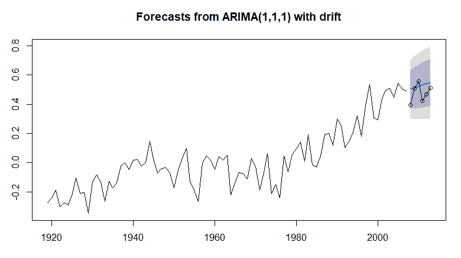

这与现有方法非常相似。让我们检查一下这些准确性统计数据，当然重点是泰尔的 U:

```py
> fit.arima %>% forecast::forecast(h = 6) %>%
    forecast::accuracy(temperature)
                        ME       RMSE        MAE       MPE     MAPE      MASE
Training set -8.396214e-05 0.09874311 0.07917484       Inf      Inf 0.8605961
Test set     -4.971043e-02 0.07242892 0.06110011 -11.84965 13.89815 0.6641316
                    ACF1 Theil's U
```

```py
Training set  0.02010508        NA
Test set     -0.18336583 0.6729521
```

ARIMA 模型的预测误差稍好一些。你应该经常用你的模型检查残差，尤其是 ARIMA，它依赖于在所述残差中没有序列相关性的假设:

```py
> forecast::checkresiduals(fit.arima)

  Ljung-Box test

data: Residuals from ARIMA(1,1,1) with drift
Q* = 18.071, df = 7, p-value = 0.01165

Model df: 3\. Total lags used: 10
```

以下代码的输出如下:

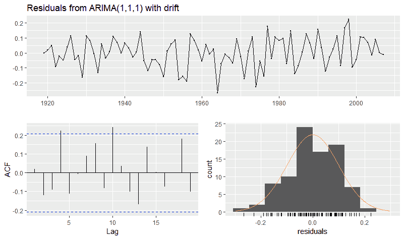

首先看一下 Ljung-Box Q 测试。零假设是残差中的相关性为零，另一种假设是残差表现出序列相关性。我们看到一个显著的 p 值，因此我们可以拒绝空值。这在残差的 ACF 图中直观地得到了证实，其中在滞后 4 和滞后 10 处存在显著的相关性。由于存在序列相关性，模型系数是无偏的，但标准误差和任何依赖于它们的统计数据都是错误的。这一事实可能需要您通过反复试验来手动选择合适的 ARIMA 模型。解释如何做到这一点需要一个单独的章节，所以它不在本书的范围内。

有了几个相对较弱的模型，我们可以尝试其他方法，但让我们看看如何创建一个类似于我们在[第 8 章](3665909b-b545-4492-928b-843756ec6588.xhtml)、*中创建的系综和多类方法*的系综。我们将把刚刚创建的两个模型放在一起，并从`forecast`包中可用的`nnetar()`函数添加一个前馈神经网络。我们不会对模型进行叠加，只是简单的在测试数据上取三个模型的平均值进行对比。

该流程的第一步是为每个模型开发预测。这很简单:

```py
> ETS <- forecast::forecast(forecast::ets(train), h = 6)

> ARIMA <- forecast::forecast(forecast::auto.arima(train), h = 6)

> NN <- forecast::forecast(forecast::nnetar(train), h = 6)
```

下一步是创建总体值，这也只是一个简单的平均值:

```py
> ensemble.fit <-
    (ETS[["mean"]] + ARIMA[["mean"]] + NN[["mean"]]) / 3
```

比较步骤是一个开放的画布，可以让您生成想要的统计数据。请注意，我只提取了测试数据和泰尔指数的准确性。您可以提取必要的统计数据，如 RMSE 或 MAPE，如果您愿意的话:

```py
> c(ets = forecast::accuracy(ETS, temperature)["Test set", c("Theil's U")],
    arima = forecast::accuracy(ARIMA, temperature)["Test set", c("Theil's U")],
    nn = forecast::accuracy(NN, temperature)["Test set", c("Theil's U")],
    ef = forecast::accuracy(ensemble.fit, temperature)["Test set", c("Theil's U")])
      ets     arima        nn        ef 
0.7940449 0.6729521 0.6794704 0.7104893 
```

我认为这很有趣，因为指数平滑正在拖累整体性能，而 ARIMA 和神经网络几乎相等。只是为了直观比较，我们来绘制一下神经网络:

```py
> plot(NN)

> lines(test, type = "o")
```

上述代码的输出如下:

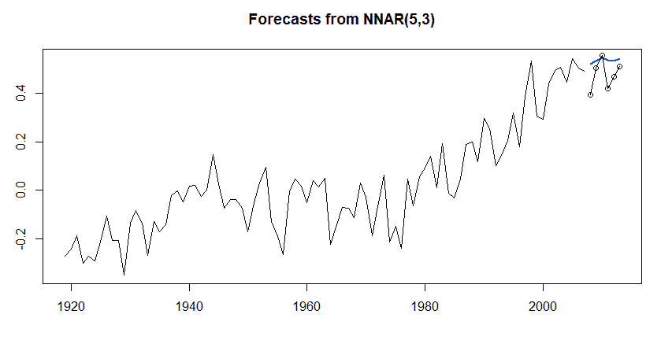

我们该拿这一切怎么办？这里有一些想法。如果你观察时间序列模式，你会注意到它经历了我们称之为不同的结构变化。有许多 R 包来检查这种结构，并确定在哪个点开始时间序列进行预测更有意义。例如，在 1960 年代中期，时间序列的斜率似乎有明显的变化。当你对你的数据这样做时，你丢掉了可能是有价值的数据点，所以判断开始起作用。这意味着，如果你想完全自动化你的时间序列模型，你需要考虑这一点。

您可以尝试用 log 值(这对于负值不太适用)或 Box-Cox 来转换整个时间序列。在`forecast`包中，您可以在您的模型函数中设置`lambda = "auto"`。我这样做了，性能没有提高。为了举例，让我们试着检测结构变化，并在选定的起点上建立一个 ARIMA 模型。我将用`strucchange`包演示结构变化，它通过计算确定线性回归关系的变化。你可以在这个链接找到完整的讨论和简介:[https://cran . r-project . org/web/packages/struc change/vignettes/struc change-intro . pdf](https://cran.r-project.org/web/packages/strucchange/vignettes/strucchange-intro.pdf)。

我发现这种方法在与利益相关者的讨论中很有用，因为它有助于他们理解潜在的数据生成过程何时甚至为什么会发生变化。这是:

```py
> temp_struc <- strucchange::breakpoints(temp_ts ~ 1)

> summary(temp_struc)

   Optimal (m+1)-segment partition: 

Call:
breakpoints.formula(formula = temp_ts ~ 1)

Breakpoints at observation number:

m = 1 68 
m = 2 60 78
m = 3 18 60 78
m = 4 18 45 60 78
m = 5 17 31 45 60 78

Corresponding to breakdates:

m = 1 1986 
m = 2 1978 1996
m = 3 1936 1978 1996
m = 4 1936 1963 1978 1996
m = 5 1935 1949 1963 1978 1996
```

该算法为我们提供了时间序列中的五个潜在断点，以观察数字和年份的形式返回信息。果不其然，1963 年预示着一场结构性变化，但它告诉我们`1978`和`1996`也符合条件。让我们以 1963 年的突破作为 ARIMA 模型时间序列的开始:

```py
> train_bp <- window(temp_ts, start = 1963, end = 2007)

> fit.arima2 <- forecast::auto.arima(train_bp)

> fit.arima2 %>% forecast::forecast(h = 6) %>%
    forecast::accuracy(temperature)
                       ME      RMSE        MAE       MPE     MAPE
Training set -0.007696066 0.1034046 0.08505900  53.68130 99.93869
Test set     -0.086625082 0.1017767 0.08676477 -19.61829 19.64341
                  MASE        ACF1 Theil's U
Training set 0.7951128  0.09310454        NA
Test set     0.8110579 -0.08291170  1.057287
```

现在你知道了:令我惊讶的是，它甚至比一个天真的预测还要糟糕，但是至少我们已经介绍了如何实现这个方法。

至此，我们已经完成了地表温度异常的单变量预测模型的构建，现在我们将继续下一项任务，看看二氧化碳水平是否会导致这些异常。


# 检验因果关系

对于这一章，这是我认为橡胶遇到道路的地方，我们将从纯粹的相关性中分离出因果关系——好吧，从统计学上来说，无论如何。这并不是这种技术第一次被应用到这个问题上。Triacca (2005 年)没有发现任何证据表明大气 CO2 格兰杰导致了地表温度异常。另一方面，Kodra (2010 年)得出结论，存在因果关系，但提出警告，即使经过二阶差分，他们的数据也不是稳定的。虽然这一努力不会解决争论，但它有望激励你在个人努力中应用这一方法。眼下的话题无疑为论证格兰杰因果关系提供了一个有效的训练场地。

我们的计划是首先证明虚假线性回归，其中残差遭受自相关，也称为序列相关。然后，我们将检验两种不同的格兰杰因果关系的方法。第一种是传统方法，两个系列都是平稳的。然后，我们将看看 Toda 和 Yamamoto (1995)演示的方法，该方法将该方法应用于原始数据，或有时被称为**水平**。


# 线性回归

让我们从伪回归开始吧，我已经看到它在现实世界中实现得太频繁了。在这里，我们简单地构建一个线性模型并检查结果:

```py
    > fit.lm <- lm(Temp ~ CO2, data = climate)

    > summary(fit.lm)

    Call:
    lm(formula = Temp ~ CO2, data = climate)

    Residuals:
         Min       1Q  Median      3Q     Max 
    -0.36411 -0.08986 0.00011 0.09475 0.28763 

    Coefficients:
                  Estimate  Std. Error  t value     Pr(>|t|) 
    (Intercept) -2.430e-01   2.357e-02   -10.31   <2e-16 ***
    CO2          7.548e-05   5.047e-06    14.96   <2e-16 ***
    ---
    Signif. codes: 
    0 '***' 0.001 '**' 0.01 '*' 0.05 '.' 0.1 ' ' 1

    Residual standard error: 0.1299 on 93 degrees of freedom
    Multiple R-squared: 0.7063, Adjusted R-squared: 0.7032 
    F-statistic: 223.7 on 1 and 93 DF, p-value: < 2.2e-16
```

请注意，一切都很重要，调整后的 R 平方为 0.7。好吧，它们是高度相关的，但是格兰杰和纽博尔德(1974)讨论的这些都是没有意义的。同样，我在与许多拥有高学历的人的会议上看到过这样的结果，我不得不做坏人，挑战这些结果。

我们可以绘制序列相关性，从残差的时间序列图开始，它产生一个清晰的模式:

```py
> forecast::checkresiduals(fit.lm)

  Breusch-Godfrey test for serial correlation of order up to 10

data: Residuals
LM test = 46.193, df = 10, p-value = 1.323e-06
```

上述代码的输出如下:

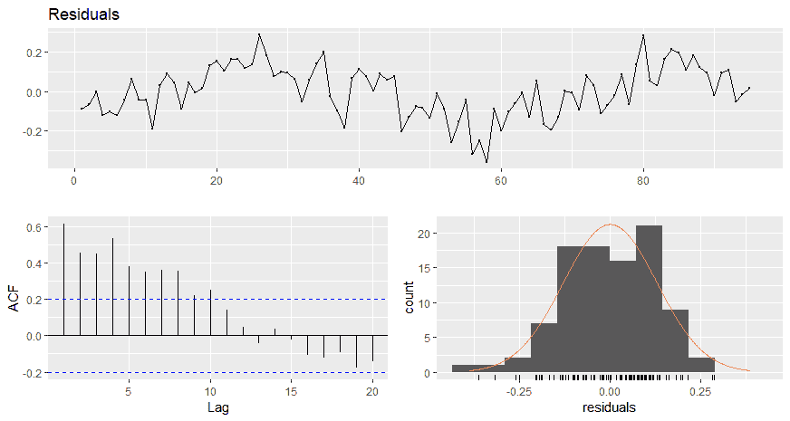

通过检查这些图和 Breusch-Godfrey 测试，我们可以安全地拒绝无自相关的零假设，这并不令人惊讶。处理自相关的简单方法是加入相关时间序列的滞后变量和/或使所有数据平稳。接下来，我们将使用向量自回归来确定适当的滞后结构，以纳入我们的因果关系研究。结构变化点之一是 1949 年，所以我们从那里开始。


# 向量自回归

我们在上一节中已经看到，温度和 CO2 需要一阶差分。展示这一点的另一个简单方法是使用`forecast`包的`ndiffs()`函数。它提供一个输出，详细说明使数据稳定所需的最小差异数。在该功能中，您可以指定您想要使用三种可用测试中的哪一种:**科维亚特科夫斯基、飞利浦、施密特&申** ( **KPSS** )、**增广迪基-富勒** ( **ADF** )或**飞利浦-庇隆** ( **PP** )。我将在下面的代码中使用 ADF，它有一个空假设，即数据不是静态的:

```py
> climate49 <- window(climate_ts, start = 1949)  

> forecast::ndiffs(climate49[, 1], test = "adf")
    [1] 1

> forecast::ndiffs(climate49[, 2], test = "adf")
    [1] 1
```

我们看到两者都需要一阶差分才能稳定。首先，我们将创造一种差异。然后，我们将完成传统方法，其中两个系列都是固定的:

```py
> climate_diff <- diff(climate49)
```

现在的问题是基于使用向量自回归的信息标准来确定最佳滞后结构。这是通过`vars`包中的`VARselect`函数完成的。您只需在函数中使用`lag.max = x`指定模型中的数据和滞后数。让我们使用最多 12 个滞后:

```py
> lag.select <- vars::VARselect(climate_diff, lag.max = 12)

> lag.select$selection
    AIC(n) HQ(n) SC(n) FPE(n) 
         5     1     1      5
```

我们使用`lag$selection`调用信息标准。提供了四种不同的准则，包括 **AIC** 、**汉南-奎因准则** ( **HQ** )、**施瓦兹-贝叶斯准则** ( **SC** )和 **FPE** 。注意 AIC 和 SC 在[第二章](11c0076c-a839-44dc-a3f6-2f88378c748f.xhtml)、*线性回归*中有所涉及，所以我在这里不再赘述判别公式或区别。如果您想查看每个延迟的实际结果，您可以使用`lag$criteria`。我们可以看到`AIC`和`FPE`选择了滞后 5 和 HQ 和 SC 滞后 1 作为`VAR`模型的最优结构。使用五年的滞后时间似乎是有道理的。我们将使用`var()`函数创建这个模型。我会让你用滞后 1:

```py
> fit1 <- vars::VAR(climate_diff, p = 5)
```

总结结果相当冗长，因为它构建了两个独立的模型，可能会占用整整两页。我提供的是一个简短的输出，显示了以温度作为预测的结果:

```py
> summary(fit1)
Residual standard error: 0.09877 on 48 degrees of freedom
Multiple R-Squared: 0.4692, Adjusted R-squared: 0.3586 
F-statistic: 4.243 on 10 and 48 DF, p-value: 0.0002996 
```

该模型具有显著性，结果调整后的 R 平方为 0.36。

正如我们在上一节中所做的那样，我们应该检查序列相关性。这里，`VAR`包为多元自相关提供了`serial.test()`函数。它提供了几种不同的测试，但是让我们把注意力集中在`Portmanteau Test`上，请注意流行的 Durbin-Watson 测试只针对单变量序列。无效假设是自相关为零，另一种假设是自相关不为零:

```py
> vars::serial.test(fit1, type = "PT.asymptotic")

  Portmanteau Test (asymptotic)

data: Residuals of VAR object fit1
Chi-squared = 33.332, df = 44, p-value = 0.8794
```

当`p-value`为 0.8794 时，我们没有证据拒绝零值，可以说残差不自相关。1 滞后测试说明了什么？

要做 R 中的格兰杰因果关系测试，你可以使用`lmtest`包和`Grangertest()`函数或者`vars`包中的`causality()`函数。我将使用`causality()`来演示这项技术。这非常简单，因为您只需要创建两个对象，一个用于引起`y`的`x`，另一个用于引起`x`的`y`，利用之前创建的`fit1`对象:

```py
> x2y <- vars::causality(fit1, cause = "CO2")

> y2x <- vars::causality(fit1, cause = "Temp")
```

现在只需要简单的调用格兰杰测试结果:

```py
> x2y$Granger

  Granger causality H0: CO2 don't Granger-cause Temp

data: VAR object fit1
F-Test = 2.7907, df1 = 5, df2 = 96, p-value = 0.02133

> y2x$Granger

  Granger causality H0: Temp don't Granger-cause CO2

data: VAR object fit1
F-Test = 0.71623, df1 = 5, df2 = 96, p-value = 0.6128
```

格兰杰原因温度 CO2 差异的`p-value`值为 0.02133，其他方向不显著。那么这一切意味着什么呢？首先我们可以说的是，Y 并不引起 X，至于 X 引起 Y，我们可以在 0.05 的显著性水平上拒绝 null，从而得出 X 确实格兰杰原因 Y 的结论，但是，这里的相关结论是这样的吗？请记住，如果零假设为真，p 值评估影响的可能性。此外，请记住，测试从来没有被设计成一些二元是或否。由于这项研究是基于观测数据，我相信我们可以说很有可能是*二氧化碳排放导致地表温度异常*。但是这个结论有很多批评的余地。我在前面提到了围绕数据质量的争议。

然而，我们仍然需要使用替代格兰杰因果关系技术来模拟原始的二氧化碳水平。找到正确滞后数的过程与之前相同，只是我们不需要让数据保持不变:

```py
> level.select <- vars::VARselect(climate49, lag.max = 12)

> level.select$selection
AIC(n) HQ(n) SC(n) FPE(n) 
    10     1     1      6
```

让我们试试 lag 6 的结构，看看我们是否能达到显著性，记住要加上一个额外的 lag 来说明综合系列。关于这项技术以及为什么需要这样做的讨论可以在 http://Dave giles . blogspot . de/2011/04/testing-for-Granger-causality . html 上找到:

```py
> fit2 <- vars::VAR(climate49, p = 7)

> vars::serial.test(fit2, type = "PT.asymptotic")

  Portmanteau Test (asymptotic)

data: Residuals of VAR object fit2
Chi-squared = 32.693, df = 36, p-value = 0.6267
```

现在，为了确定 X 导致 Y 的格兰杰因果关系，您进行了一个 Wald 测试，其中 X 的系数和方程中只有 X 的系数是 0，以预测 Y，记住不要在测试中包括额外的系数来说明积分。

R 中的 Wald 测试可以在我们已经加载的`aod`包中找到。我们需要指定完整模型的系数，它的方差-协方差矩阵，以及原因变量的系数。

我们需要在 VAR 对象中测试的`Temp`的系数由从 2 到 12 的偶数组成，而 CO2 的系数是从 1 到 11 的奇数。让我们用 base R 的 seq()函数创建一个对象，而不是在我们的函数中使用 c(2、4、6 等等)。

首先，让我们看看 CO2 是如何引起温度升高的:

```py
> CO2terms <- seq(1, 11, 2)

> Tempterms <- seq(2, 12, 2)
```

我们现在准备运行`wald`测试，在下面的代码和简短的输出中描述:

```py
> aod::wald.test(
    b = coef(fit2$varresult$Temp),
    Sigma = vcov(fit2$varresult$Temp),
    Terms = c(CO2terms)
 )

$result$`chi2`
       chi2         df          P 
13.48661591 6.00000000 0.03592734 
```

怎么样？我们有一个显著的 p 值，所以让我们用下面的代码测试另一个方向的因果关系:

```py
> aod::wald.test(
    b = coef(fit2$varresult$CO2),
    Sigma = vcov(fit2$varresult$CO2),
    Terms = c(Tempterms)
 )

$result$`chi2`
     chi2        df         P 
4.7709016 6.0000000 0.5735146
```

相反，我们可以说温度不是二氧化碳的格兰杰原因。这里最后要展示的是如何使用向量自回归来生成预测。有一个`predict`函数可用，我们将绘制 24 年的预测图:

```py
> plot(predict(fit2, n.ahead = 24, ci = 0.95))
```

上述代码的输出如下:

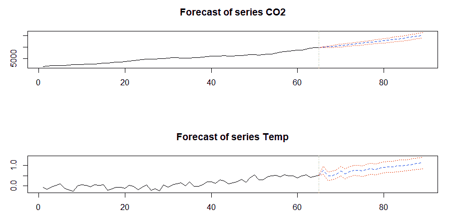

展望未来几十年，我们看到温度异常接近 1 度。如果没有别的，我希望这已经激发了你的思考，如何将这种技术应用到你自己的现实世界问题中，或者甚至更详细地检查气候变化数据。证明因果关系应该有一个很高的门槛，格兰杰因果关系是一个很好的工具。


# 摘要

在本章中，我们的目标是讨论时间元素在机器学习和分析领域的重要性，识别分析时间序列时的常见陷阱，并展示解决这些陷阱的技术和方法。我们探索了全球气温异常和人类二氧化碳排放的单变量和双变量时间序列分析。此外，我们研究了格兰杰因果关系，以确定我们是否可以说，从统计上来说，大气二氧化碳水平导致了地表温度异常。我们发现 CO2 与温度的格兰杰因果关系的 p 值大于 0.05 但小于 0.10。这表明格兰杰因果关系是研究机器学习问题中因果关系的有效工具。在下一章，我们将改变思路，看看如何将学习方法应用于文本数据。

此外，请记住，在时间序列分析中，我们只是浏览了表面。我鼓励您探索围绕变化点检测、时间序列分解、非线性预测等其他技术。虽然通常不被认为是机器学习工具箱的一部分，但我相信你会发现它是你的一个无价之宝。**