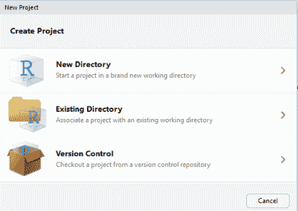
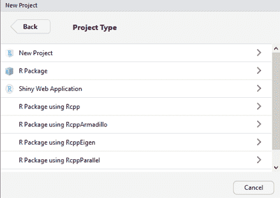
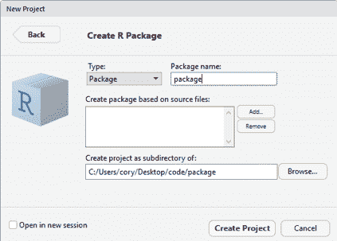
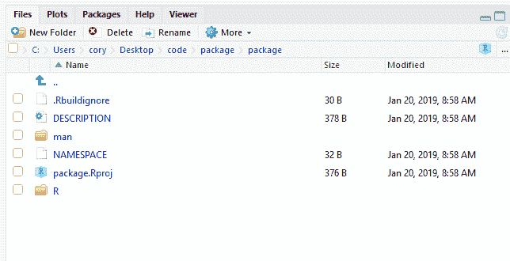
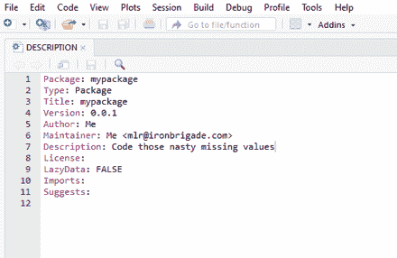
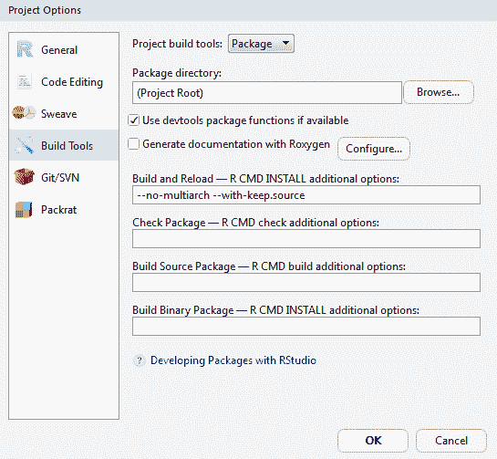
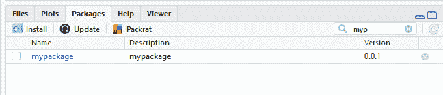
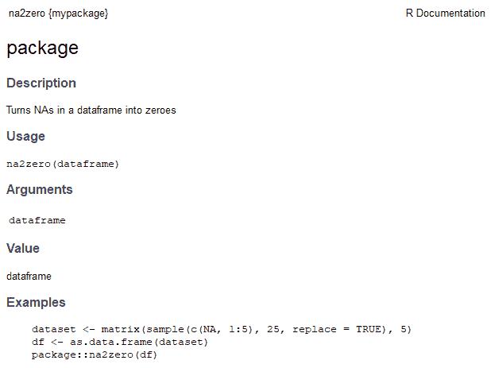

# 二十三、创建包

“如果你想要你从未拥有过的东西，你必须做你从未做过的事情。”

托马斯·杰斐逊

我们将通过创建您自己的 R 包的过程来结束这本书。如果你正在这样做，我建议你开始。我已经将第 1 章、*准备和理解数据*中的大部分数据准备功能放入我自己的包中。我不打算把它放在 CRAN 上，也不打算把它放在任何软件包上，可能除了像葛底斯堡文件这样的美国内战数据包。那么为什么要创建一个包呢？如果您要创建代码并将其投入生产，为什么不创建一个带有版本控制、示例和其他特性的包呢？另外，使用 RStudio，这很容易做到。因此，我们将使用一个简单的例子和一个小函数来展示它有多简单。


# 创建新的包

在开始之前，您需要加载两个包:

```r
> install.packages("roxygen2")

> install.packages("devtools")
```

您现在想要在 RStudio 中打开**文件**并选择**新项目**，这会将您置于这一点:



根据需要选择一个新目录，并指定 **R 包**，如下图所示:



现在，您将命名您的包——我创造性地将它命名为一个包——并选择 Create Project:



转到 RStudio 中的 Files 选项卡，您应该会看到几个文件，如下所示:



注意名为`R`的文件夹。这就是我们将为我们的包放置`R`函数的地方。但是首先，点击描述并相应地填写，然后保存。下面是我的版本，它将是一个将数据帧中所有缺失值编码为零的函数:



我已经离开进口和建议空白。这是加载其他包的地方，比如 tidyverse 或 caret。现在，打开`R`文件夹中的`hello.R`功能，全部删除。以下格式将很好地工作:

*   标题:当然是你的包装标题
*   描述:简短的描述
*   Param:该函数的参数；争论
*   返回:返回的值
*   示例:提供如何使用该功能的任何示例
*   导出:在这里，写下你想要的函数

下面是我们要使用的函数，它将所有 NAs 归零:

```r
#' @title package
#'
#' @description Turns NAs in a dataframe into zeroes
#'
#' @param dataframe
#'
#' @return dataframe
#'
#' @examples
#' dataset <- matrix(sample(c(NA, 1:5), 25, replace = TRUE), 5)
#' df <- as.data.frame(dataset)
#' package::na2zero(df)
#'
#' @export

na2zero <- function(dataframe)
{
 dataframe[is.na(dataframe)] <- 0
 return(dataframe)
}
```

您现在将转到构建-配置构建工具，您应该会在此处结束:



单击“使用 Roxygen 生成文档”的复选标记。这样做将创建这个弹出窗口，您可以关闭它并点击 OK。你可能想把你的函数从`hello.R`重命名为相关的名字。现在是构建您的包的关键时刻了。为此，请单击构建-清理并重新构建。

现在您可以搜索您的包了，它应该会出现:



点击它并浏览文档:



你有它，一个无用的包，但是想想你可以通过打包你自己的或者你喜欢的函数做什么，任何继承你代码的人都会感谢你。


# 摘要

在这最后一章，我们经历了创建 R 包的过程，它可以帮助你和你的团队将你的代码投入生产。我们为我们的包创建了一个用户定义的函数，但是您唯一的限制是您的想象力。这本书的主要章节到此结束。我希望你喜欢它，并能实现这里的方法，以及你随着时间的推移学到的其他方法。谢谢大家！