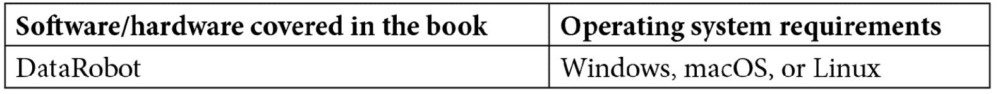

# 前言

DataRobot 使数据科学团队变得更加高效和多产。这本书帮助您利用 DataRobot 的企业平台解决**机器学习** ( **ML** )挑战，使您能够从数据中提取商业价值，并迅速为您的组织产生商业影响。

首先，您将学习如何使用 DataRobot 的特性来自动执行数据准备和清理任务。这本书涵盖了构建和部署 ML 模型的最佳实践，以及在扩展它们以处理复杂的业务问题时所面临的挑战。接下来，您将执行**探索性数据分析** ( **EDA** )任务，以准备您的数据来构建 ML 模型和解释结果的方法。您还将发现如何分析模型的预测，并将其转化为业务用户可操作的见解。之后，您将创建用于内部和遵从目的的模型文档，并学习如何将模型部署为 API。此外，您将了解如何操作和监控模型的性能。最后，您将使用高级 DataRobot 功能处理时间序列预测、NLP、图像处理、MLOps 等示例。

到本书结束时，您将学会如何使用 DataRobot 提供的一些 AutoML 和 MLOps 功能，通过避免重复任务和常见错误来扩展 ML 模型构建。

# 这本书是给谁的

这本书是为寻找使用 DataRobot 构建和部署健壮的 ML 模型的实用指南的数据科学家、数据分析师和数据爱好者而写的。有经验的数据科学家也会发现这本书有助于快速探索、构建和部署更广泛的模型。这本书假设对 ML 有一个基本的理解。

# 这本书涵盖了什么

[*第 1 章*](B17159_01_Final_NM_ePub.xhtml#_idTextAnchor014) ，*什么是 DataRobot，为什么需要它*，描述了构建和部署 ML 模型的当前实践和过程，以及扩展该方法的一些挑战。本章将描述什么是 DataRobot，以及 DataRobot 如何解决这些挑战，从而使分析师和数据科学家能够快速为他们的组织增加价值。这也有助于高管了解如何使用 DataRobot 来有效地扩展他们的数据科学实践，而无需雇用大量具有难以找到的技能的员工。本章还描述了 DataRobot 的各种组件、它的架构、它如何与其他工具集成，以及在内部或云中设置它的不同选项。它还在较高层次上描述了各种用户界面组件及其含义。

[*第二章*](B17159_02_Final_NM_ePub.xhtml#_idTextAnchor039) 、*机器学习基础知识*，涵盖了本书将会用到和引用的一些 ML 的基本概念。为了有效地使用 DataRobot，这是你需要知道的最起码的东西。本章的目的不是让你全面理解 ML，而仅仅是复习一些关键的概念。

[*第 3 章*](B17159_03_Final_NM_ePub.xhtml#_idTextAnchor073)*理解和定义业务问题*，将向您展示如何找到问题的根源，然后将其设置为 ML 项目的示例。一个业务问题需要被仔细定义，并转化为一个 ML 问题，以便用 DataRobot 来解决。这是一个经常被忽视的关键步骤，会导致下游的问题和故障。请仔细阅读这一章，以免浪费大量的努力。本章与工具和 ML 方法无关。

[*第 4 章*](B17159_04_Final_NM_ePub.xhtml#_idTextAnchor087) ，*为 DataRobot* 准备数据，涵盖了如何在高层次上将来自多个不同来源的数据拼接在一起。根据数据，DataRobot 可能会自动执行数据准备和清理任务，或者您可能需要自己执行其中的一些任务。本章介绍了一些概念和示例，以展示如何清理和准备数据，以及 DataRobot 为帮助完成这些任务而提供的功能。

[*第 5 章*](B17159_05_Final_NM_ePub.xhtml#_idTextAnchor097)*用 DataRobot* 进行探索性数据分析，将向您展示如何使用 DataRobot 执行各种数据分析，并为开始构建模型准备好数据。我们提供了应该进行的分析类型的详细示例，以及防止下游问题的注意事项。如果做得好，这种分析可以帮助发现数据问题，还可以产生有用的业务见解。

[*第 6 章*](B17159_06_Final_NM_ePub.xhtml#_idTextAnchor104) 、*用 DataRobot 建立模型*，展示了用 DataRobot 建立不同类型模型的分步示例。我们涵盖了各种细节，如在不同情况下使用什么设置，如何选择特定的模型类型，设置交叉验证，构建集合模型，以及跟踪排行榜上表现最佳的模型。

[*第 7 章*](B17159_07_Final_NM_ePub.xhtml#_idTextAnchor110) ，*模型理解和可解释性*，将向您展示 DataRobot 提供的各种功能和输出的示例，以帮助您理解模型并选择最能解决业务问题的模型。在这一章中，我们将通过例子介绍你需要注意的方面，以及在选择模型时你必须做出的权衡。

[*第 8 章*](B17159_08_Final_NM_ePub.xhtml#_idTextAnchor116) 、*模型评分和部署*，讲述如何使用模型对输入数据集评分、创建要在预期应用中使用的预测、在生产中部署模型以及监控模型。

[*第九章*](B17159_09_Final_NM_ePub.xhtml#_idTextAnchor125) 、*预测和时间序列建模*，描述了如何着手建立时间序列模型。这些类型的模型通常用于预测应用。本章举例说明了 DataRobot 如何处理不同的时间序列问题。我们涵盖了单系列和多系列问题。

[*第十章*](B17159_10_Final_NM_ePub.xhtml#_idTextAnchor139) ，*推荐系统*，涵盖了如何用 DataRobot 构建推荐系统的例子。这些类型的模型通常用于向用户推荐产品或服务。本章涵盖了如何使用 DataRobot 处理推荐问题的策略和功能差异。我们将讨论与构建不同推荐模型相关的权衡。

[*第 11 章*](B17159_11_Final_NM_ePub.xhtml#_idTextAnchor161)*处理地理空间数据、NLP 和图像处理*，涵盖了与地理空间、文本和图像特征的可视化和分析相关的各种 DataRobot 功能，以及构建包含这些特征的 ML 模型。本章描述了 DataRobot 自动将文本和图像数据合并到 ML 模型中的能力，从而提高了这些模型的性能。

[*第十二章*](B17159_12_Final_NM_ePub.xhtml#_idTextAnchor176) ， *DataRobot Python API* ，描述了何时以及如何使用 DataRobot Python API。虽然 DataRobot 自动化了模型构建的许多方面，但在许多场景中，您需要使用 Python 等编程语言来高效、可扩展地执行 ML 任务。DataRobot 提供了一个方便的 API，允许有经验的数据科学家以编程方式执行 DataRobot 函数。

[*第 13 章*](B17159_13_Final_NM_ePub.xhtml#_idTextAnchor187) 、*模型治理和 MLOps* ，涵盖了一些最近开始受到很多关注的话题。一旦开发和部署了模型，就需要对其进行治理和维护。虽然这在许多方面与 IT 系统相似，但仍有一些重要的差异需要理解和操作。本章涵盖了 DataRobot 提供的几个特性和功能，以帮助管理和维护 ML 模型。

[*第 14 章*](B17159_14_Final_NM_ePub.xhtml#_idTextAnchor199) ，*结论*，涵盖了去哪里获取额外信息和其他可能超出本书范围的主题。我们还描述了自动化 ML 和 DataRobot 的未来发展方向。

# 为了充分利用这本书

为了充分利用这本书，你需要使用 DataRobot 软件。商业版拥有所有的功能。如果您无法获得商业版，您可以获得一个评估版，它只能在有限的时间内工作，并且不具备所讨论的所有功能。为了使一些高级功能和 API 能够工作，您需要了解一些 Python，并且能够访问开源 Python 环境(例如，Anaconda 或 Jupyter Notebooks)。



尽管我们在本书中描述的大部分内容都可以在不了解 Python 的情况下完成，我们还是强烈建议您下一步学习 Python。了解 Python 之类的编程语言将为您打开更多的可能性，并使您能够更好地利用 DataRobot 之类的工具。

# 行动中的代码

这本书的动作视频中的代码可以在[https://bit.ly/3cj2qp1](https://bit.ly/3cj2qp1)查看。

# 下载彩色图片

我们还提供了一个 PDF 文件，其中有本书中使用的截图和图表的彩色图像。可以在这里下载:[https://static . packt-cdn . com/downloads/9781801076807 _ color images . pdf](_ColorImages.pdf)。

# 使用的惯例

本书通篇使用了许多文本约定。

`Code in text`:表示文本中的码字、数据库表名、文件夹名、文件名、文件扩展名、路径名、伪 URL、用户输入和 Twitter 句柄。下面是一个例子:“出于我们的目的，我们简单地创建了一个`imports-85-data.xlsx`数据集文件的副本，并将其命名为`imports-85-data-score.xlsx`

代码块设置如下:

```
deployment = dr.Deployment.create_from_learning_model(
    MODEL_ID, label='DEPLOYMENT_LABEL',
    description='DEPLOYMENT_DESCRIPTION',
    default_prediction_server_id=PREDICTION_SERVER_ID)
deployment
```

**Bold** :表示一个新术语、一个重要单词或您在屏幕上看到的单词。例如，菜单或对话框中的单词以**粗体**出现。下面是一个例子:“选择选项后，我们可以点击**计算和下载预测**按钮。”

提示或重要注意事项

像这样出现。

# 取得联系

我们随时欢迎读者的反馈。

**总体反馈**:如果您对本书的任何方面有疑问，请发邮件至 customercare@packtpub.com[给我们，并在邮件主题中提及书名。](mailto:customercare@packtpub.com)

**勘误表**:虽然我们已经尽力确保内容的准确性，但错误还是会发生。如果你在这本书里发现了一个错误，请告诉我们，我们将不胜感激。请访问 www.packtpub.com/support/errata[并填写表格。](http://www.packtpub.com/support/errata)

**盗版**:如果您在互联网上遇到我们作品的任何形式的非法拷贝，如果您能提供我们的地址或网站名称，我们将不胜感激。请通过 copyright@packt.com 的[联系我们，并提供材料链接。](mailto:copyright@packt.com)

**如果你有兴趣成为一名作家**:如果有你擅长的主题，并且你有兴趣写书或投稿，请访问 authors.packtpub.com。

# 分享你的想法

一旦你阅读了*使用 DataRobot* 的敏捷机器学习，我们很想听听你的想法！请[点击这里直接进入亚马逊对这本书的评论页面](https://packt.link/r/1801076804)，并分享你的反馈。

您的评论对我们和技术社区非常重要，将有助于我们确保提供高质量的内容。