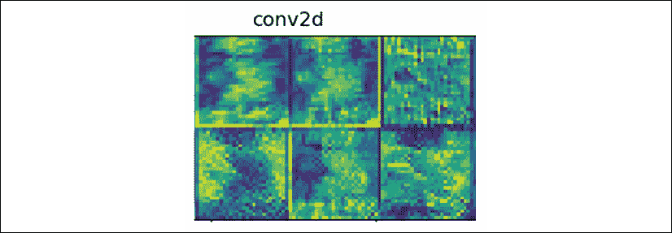
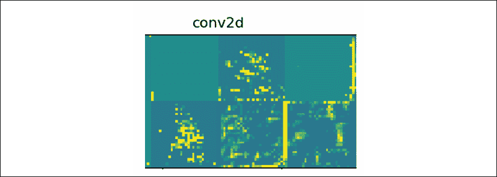
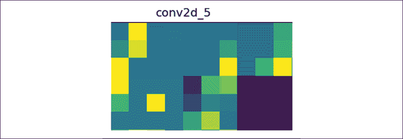
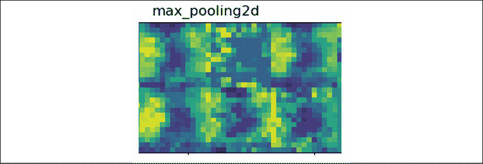
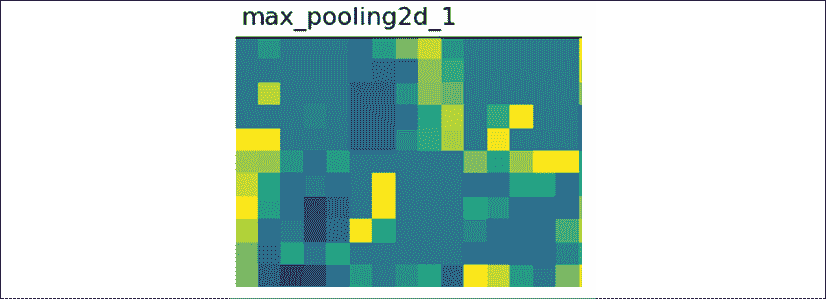
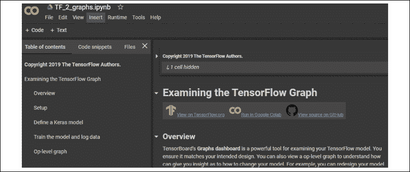
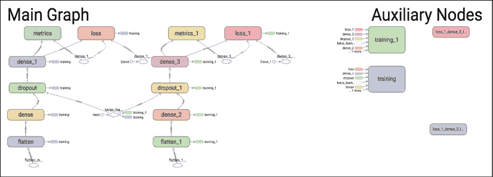
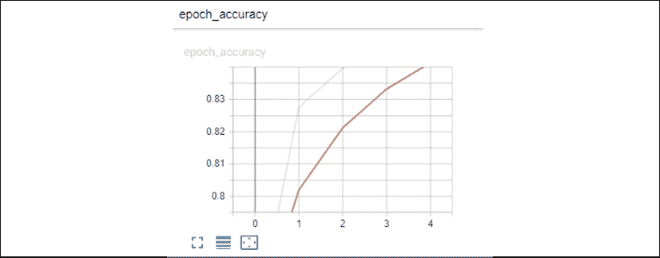
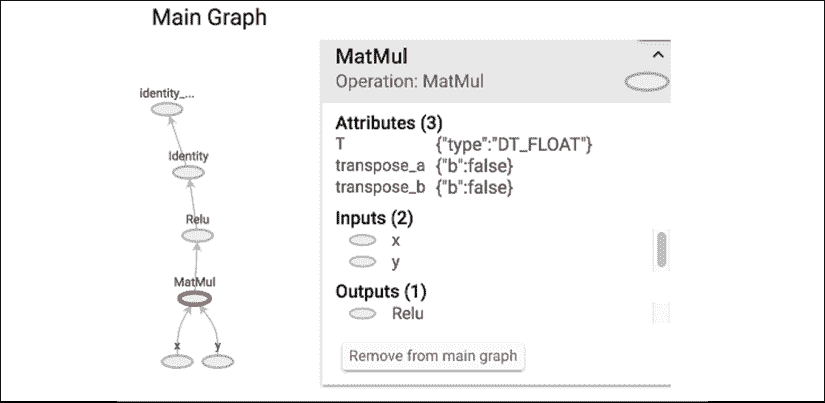

# 十三、使用 TensorFlow 2.x 和 TensorBoard 可视化网络

在这一章中，我们将通过深度学习神经网络的各层来窥视机器“思维”的内部。TensorFlow 2 大大减少了为**卷积神经网络** ( **CNN** )构建顺序分类器所需的代码行数。运行分类器只需点击一下。然而，在出现问题时理解程序是一项更困难的任务，可视化各层的输出可能非常有效率。

可视化 CNN 各层的输出可以提供对组成整个过程的每个单独步骤的深入了解。

在这一章中，和前面几章一样，我们将定义 CNN 的层次。这一次，我们将添加更多的层，并提取每个层的输出，以创建输出图像。我们将在 Python 中的 TensorFlow 2 中采用自底向上的方法从头开始构建这个过程。

定义输出后，我们将显示卷积层、汇集层、下降层、展平层和密集层的输出。

查看层的输出可以直观地了解层在做什么。能够可视化模型的全局图形使得 CNN 的架构可见。

我们将使用 TensorBoard 来探索概念模型、历元与精确度，以及数学函数运算的细节。这些图表和测量将使用谷歌联合实验室采用自上而下的方法构建。

Google Colaboratory 提供了一个免费的服务器，里面有现成的库和模块。我们将使用 Google 协作笔记本来探索 TensorBoard 的功能。这一章分为三个主要部分。前两节描述了如何使用 TensorFlow 2.2 构建顺序分类器，并使用 TensorFlow 2.2 显示各层的输出。第三部分介绍如何使用 TensorBoard 的 TensorFlow 2 版本显示图形信息和精度测量。

本章涵盖的主题将为 CNN 提供直观的见解:

*   一层一层地构建 CNN
*   显示数据集
*   显示 CNN 各层的输出
*   使用谷歌联合实验室
*   用张量板可视化神经网络的结构
*   用 TensorBoard 可视化精度测量

让我们从讨论如何探索 CNN 中层的输出开始这一章。

# 用 TensorFlow 分两步探索 CNN 各层的输出

商业领域的许多公司合同智能需要对任何做出自动和关键决策的算法进行解释。算法的编辑，不管是不是人工智能，都必须给出一个解释。我们需要为此做好准备。

此外，一旦人工智能在生产中运行，维护就变得至关重要。开发人员经常从一个部门转到另一个部门，从一个公司转到另一个公司。维护程序的人需要详细地理解它。

探索和想象 CNN 是弄脏我们的手，打开我们跑车的引擎盖，看看引擎如何工作的好方法！

*   First, we will first build the CNN layer by layer. We will be building the sequential classifier with TensorFlow 2 from the bottom to the top.

    我们不会直接使用 Keras 模型；我们将使用 TensorFlow 的集成 Keras 模块，它将标题的行数减少到只有两行:

    ```py
    import tensorflow as tf

    from tensorflow.keras import datasets, layers, models 
    ```

*   然后我们将探索这些层的视觉输出，以深入了解它“思考”的方式

就这样，让我们继续建设！

## 构建 CNN 的层次

在第 9 章、*中描述了一个 CNN，用卷积神经网络(CNN)*进行抽象图像分类。在接下来的例子中，CNN 将包含更多层来可视化神经网络一步一步提取特征的方式。

我们将使用一个数据集，该数据集使用单个图像来探索 CNN 的各层。该图像对于训练数据集重复几次，并且测试数据集足以构建和运行模型来可视化神经网络的层。

该数据集包含一幅重复多次的花的图像——虹膜。


图 13.1:我们在本章中探索的图像的图像

我们的目标不是让图像有很多变化，而是简单地看看 CNN 是如何一层一层地表现虹膜的。数据集包含重复的图像。但是，您可以更改这些图像并使用自己的数据集，然后使用相同的代码显示图像，如下所示:

```py
cv_img=[]

images = []

for img_path in glob.glob('dataset/training_set/img/*.png'):

    images.append(mpimg.imread(img_path))

plt.figure(figsize=(20,20)) #20,10

columns = 5

for i, image in enumerate(images):

    plt.subplot(len(images) / columns + 1, columns, i + 1)

    plt.imshow(image) 
```

结果将是一个带有来自数据集的行图像的图形:


图 13.2:显示数据集

我们将首先导入神经网络模块:

```py
import tensorflow as tf

from tensorflow.keras import datasets, layers, models 
```

构建 CNN 只需要几行代码。这使得它看起来很简单，因为它看起来是一个黑盒。在我们的示例中，在第 9 章、*中描述的结构，使用卷积神经网络(CNN)*的抽象图像分类，在其增强版本中，只需要几分钟就可以创建从第 30 行到第 68 行的内容:

```py
#initializing the Tensorflow 2 classifier

classifier = models.Sequential()

#adding the convolution layers to the layers

classifier.add(layers.Conv2D(32, (3, 3), padding='same', input_shape = (28, 28, 3), activation = 'relu'))

classifier.add(layers.Conv2D(32, (3, 3), activation='relu'))

...

#adding dense-dropout-dense layers

classifier.add(layers.Dense(units = 512, activation = 'relu')) 
```

我们将在下一节研究它们的输出时回到这些层。这里要关注的要点仍然是代码的简单性。在几分钟内把 CNN 建成一个黑匣子可能行得通。然而，当问题出现时，理解每一层需要对层的表示有更深的理解。

在探索这些层之前，程序打印分类器的结构(CNN):

```py
#Printing the model summary

print("Model Summary",classifier.summary()) 
```

该模型包含相当多的要探索的层:

```py
Model: "sequential"

_________________________________________________________________

Layer (type)                 Output Shape              Param #   

=================================================================

conv2d (Conv2D)              (None, 28, 28, 32)        896       

_________________________________________________________________

conv2d_1 (Conv2D)            (None, 26, 26, 32)        9248      

_________________________________________________________________

max_pooling2d (MaxPooling2D) (None, 13, 13, 32)        0         

_________________________________________________________________

dropout (Dropout)            (None, 13, 13, 32)        0         

_________________________________________________________________

conv2d_2 (Conv2D)            (None, 13, 13, 64)        18496     

_________________________________________________________________

conv2d_3 (Conv2D)            (None, 11, 11, 64)        36928     

_________________________________________________________________

max_pooling2d_1 (MaxPooling2 (None, 5, 5, 64)          0         

_________________________________________________________________

dropout_1 (Dropout)          (None, 5, 5, 64)          0         

_________________________________________________________________

conv2d_4 (Conv2D)            (None, 5, 5, 64)          36928     

_________________________________________________________________

conv2d_5 (Conv2D)            (None, 3, 3, 64)          36928     

_________________________________________________________________

max_pooling2d_2 (MaxPooling2 (None, 1, 1, 64)          0         

_________________________________________________________________

dropout_2 (Dropout)          (None, 1, 1, 64)          0         

_________________________________________________________________

flatten (Flatten)            (None, 64)                0         

_________________________________________________________________

dense (Dense)                (None, 512)               33280     

_________________________________________________________________

dropout_3 (Dropout)          (None, 512)               0         

_________________________________________________________________

dense_1 (Dense)              (None, 3)                 1539      

=============================================================== 
```

请关注这份总结。事实证明，在选择想要浏览的图层数量以可视化输出时，这将非常有用。

然后编译模型:

```py
# Compiling the convolutional neural network (CNN)

classifier.compile(optimizer = 'rmsprop',

    loss = 'categorical_crossentropy',metrics = ['accuracy']) 
```

然后处理(重新调整)和定义训练和测试数据集:

```py
train_datagen = ImageDataGenerator(rescale = 1./255)

test_datagen = ImageDataGenerator(rescale = 1./255)

training_set = train_datagen.flow_from_directory(

                                  'dataset/training_set',

                                  target_size = (28, 28),

                                  batch_size = 16,

                                  class_mode =

                                  'categorical')

test_set = test_datagen.flow_from_directory('dataset/test_set',

                                           target_size = (28, 28),

                                           batch_size = 16,

                                           class_mode =

                                           'categorical') 
```

如果我们在这里停下来，CNN 将会工作。但是我们真的理解这个模型了吗？我不这么认为。当然，在安装一个现成的数据集后，只需简单的点击就可以让 CNN 运行。这种黑盒方法是可行的，但是探索图层的可视化输出可以更好地表示网络。接下来让我们来看看。

## 处理 CNN 各层的视觉输出

这个想法是聚焦在一个图像上，实际上*看到*CNN 一层一层计算出来的“心理”视觉表现。

为了处理这些层，程序首先为激活模型选择一个要处理的图像:

```py
#Selecting an image for the activation model

img_path = 'dataset/test_set/img/img1.png'

img1 = image.load_img('dataset/test_set/img/img1.png', target_size=(28, 28))

img = image.img_to_array(img1)

img = np.expand_dims(img, axis=0)

img /= 255.

plt.imshow(img[0])

plt.show()

print("img tensor shape",img.shape) 
```

然后，可视化过程分几个步骤运行，这将带我们进入 CNN:

*   **Selecting the number of layers to visualize using the** `e` **variable**: Going back to the model summary displayed previously, you can choose the layer you want to stop at. In this example, we're stopping at `e=12`. You can choose to start with `e=4` to visualize the first convolutional and pooling layers:

    ```py
    #Selecting the number of layers to display

    e=12 #last layer displayed

    layer_outputs = [layer.output for layer in classifier.layers[0:e]] 
    ```

    如果`e=3`，程序将在`max_pooling2d`停止:

    ```py
    Displaying layer: conv2d

    Displaying layer: conv2d_1

    Displaying layer: max_pooling2d 
    ```

*   **选择将要勘探的前 n 层**:程序引用`layer_outputs`来提取可视化目标层所需的信息:

    ```py
    # Extracting the information of the top n layers  activation_model = models.Model(inputs=classifier.input,                                  outputs=layer_outputs) 
    ```

*   **应用激活模型来提取所请求的层**:激活模型迫使分类器开始工作并运行这些层。这样，我们可以窥视它的“思想”过程，看看它是如何代表输入的:

    ```py
    # Activating the model  activations = activation_model.predict(img) 
    ```

*   **检索要显示的图层名称，以及图层的可视化表示**:图层名称帮助我们理解我们正在看的东西。使用我们之前打印的模型摘要作为地图，查看当显示层名称时您的位置，以及该层的输出表示:

    ```py
    #layer names  layer_names = []  for layer in classifier.layers[:12]:      layer_names.append(layer.name) 
    ```

*   **处理图层输出并将它们组织成网格**:为了避免观看给定图层中表示变化的连续显示，我们将它们组织成一个网格图像:

    ```py
    # Processing the layer outputs  for layer_name, layer_activation in zip(layer_names,          activations):      #getting the layer_names and their activations      n_features = layer_activation.shape[-1] #features in the layer      size = layer_activation.shape[1] #shape of the feature map      n_cols = n_features // images_per_row #number of images per row      display_grid = np.zeros((size * n_cols,                               images_per_row * size)) #size of the display grid      for col in range(n_cols): #organizing the columns          for row in range(images_per_row): #...and rows to display              image = layer_activation[0,:, :,                  col * images_per_row + row] #retrieving the image...              image -= image.mean() #...and processing it in the...              if(image.std()>0): # ...following lines to display it                  image /= image.std()                  image *= 64                  image += 128                  image = np.clip(image, 0,                      255).astype('uint8')                  display_grid[col * size : (col + 1) * size,                      row * size : (row + 1) * size] = image 
    ```

*   **显示处理后的图层输出**:现在工作已经完成，我们只需要显示图层名称和相应的网格:

    ```py
     #displaying the layer names and processed grids      print("Displaying layer:",layer_name)      scale = 1\. / size      plt.figure(figsize=(scale * display_grid.shape[1],                          scale * display_grid.shape[0]))      plt.title(layer_name)      plt.grid(False)      plt.imshow(display_grid, aspect='auto', cmap='viridis')      plt.savefig("dataset/output/"+layer_name)      plt.show() 
    ```

注意数字由`plt.savefig`保存在输出目录中以备后用。

您将获得一个图形列表，其中包含您选择可视化的图层的名称。例如，您可以查看前七层的图像。您可以通过下图或运行程序来查看它们。无论如何，分析这些层的最好方法是仔细观察第一层，然后再观察最后一层。你会看到 CNN 正在仔细提取图像的抽象表示，并显示更高的维度。这些层之间的差异难以被人眼察觉的原因来自两个因素:

*   我们很难观察到需要分析的元素数量。通常我们的大脑在不需要我们思考的情况下就能做到这一点！
*   在获取图像的抽象表示的过程中，有几个卷积层而不是一个卷积层。它是一层一层地进行的，就像人脑一步一步地处理图像一样。

先看下面的第一层再看最后一层，然后回去观察各层之间的区别。


图 13.3:卷积层


图 13.4:卷积层


图 13.5:池层


图 13.6:脱落层


图 13.7:卷积层


图 13.8:卷积层


图 13.9:池层

可视化 CNN 各层的输出为理解和分析神经网络提供了一种奇妙的方式。让我们更进一步，分析各层。

### 分析 CNN 各层的视觉输出

输入图像是混乱的，直到某种形式的智能理解它。任何形式的智能都会探测到模式和结构。机器智能也是基于同样的原因，通过降维来提高抽象层次。从混沌到有组织表示的过程是当今神经网络奇妙发明的核心。

运行`cnn_layers.py`时，将显示图层输出。让我们探索一些层。您可以通过简单地改变第 107 行的`e = <number-of-layers>`变量的值来研究其中的一些或全部。

#### 卷积层激活函数

卷积层的一个关键选项是激活功能。`relu`用于以下`cnn_layers.py`:

```py
#adding more convolution layers to the layers

classifier.add(layers.Conv2D(64, (3, 3), padding='same', activation = 'relu'))

classifier.add(layers.Conv2D(64, (3, 3), activation='relu')) 
```

有关 ReLU 的更多信息，请参见*第九章*、*用卷积神经网络(CNN)进行抽象图像分类*中的解释。

`relu`为`Conv2d`层产生以下输出:


图 13.10: conv2d 输出 1

现在转到第 33 行，将`relu`替换为`softmax`，如下所示:

```py
classifier.add(layers.Conv2D(32, (3, 3), padding='same',

    input_shape = (28, 28, 3), activation = 'softmax')) 
```

输出非常不同，我们可以看到:


图 13.11: conv2d 输出 2

人眼需要一些时间来适应这种变化。看每个版本。试着闭上眼睛，然后看着另一只眼睛，记住几秒钟。我们的大脑隐含地做到了这一点，这就是为什么我们需要努力去明确地做到这一点。

你应该使用哪一个？欢迎来到深度学习！这个问题没有确定的答案。这是一个反复试验的过程。激活函数可能适合一个模型，而不适合另一个模型。即使在训练过程中网络的精度是可接受的，当新数据产生不好的结果时，您可能必须随着时间改变激活函数。

有关 softmax 的更多信息，请回到*第 2 章*、*构建奖励矩阵-设计数据集*中的解释。

让我们试试逻辑 s 形激活功能`sigmoid`，也在*第 2 章*中描述:



图 13.12: conv2d 输出 3

再次注意不同之处。观察每项激活功能的第 1 行最后一幅图像。这些差异非常有趣，因为它们提供了各种可能的表示。

尝试其他激活功能，感受人工神经网络如何通过减少它必须处理的维度，将它感知的东西转化为更高层次的抽象。

#### 卷积层通过各层的更高级表示

请注意顺序分类器通过从`conv2d`到`conv2d_5`的以下输出达到的令人难以置信的抽象层次，这实际上是`cnn_layers.py`的第六个(0 到 5)卷积层。

这个网络从一个相对具象的表现开始，在`conv2d_5`达到一个高度抽象的水平。我们真的在机器的“大脑”里，看着它思考和学习！



图 13.13:初始 conv2d 输出


图 13.14: conv2d_1 输出


图 13.15: conv2d_2 输出


图 13.16: conv2d_3 输出


图 13.17: conv2d_4 输出



图 13.18: conv2d_5 输出

这个抽象过程在很大程度上归功于其他层，比如池层。

#### 汇集图层以获得更高级别的表示

池层将减少其输入的维数，并选择它找到的最有代表性的特征:

```py
#adding a max pooling layer to the layers

classifier.add(layers.MaxPooling2D(pool_size=(2, 2))) 
```

让我们探讨一下本例中前两个池层的演变:



图 13.19: max_pooling2d 输出



图 13.20: max_pooling2d_1 输出

我们再一次看到了 CNN 所能达到的强大抽象层次。

有关池层的更多信息，请阅读*第 9 章*、*用卷积神经网络(CNN)进行抽象图像分类*中的解释。

#### 通过各层的较高级别表示

脱落层提供了一种放弃许多特征的方法，以达到简化的更高级别的表示:

```py
classifier.add(layers.Dropout(0.5)) # antes era 0.25 
```

并不总是需要添加一个 dropout 层，因为这取决于您正在探索的模型的生产力和架构。对于这个例子，前两个下降层很有启发性。辍学也是避免过度适应的一种方式。该模型学习如何提取关键的特征以获得抽象的表示，而不是字面上的表示。


图 13.21:压差输出


图 13.22: dropout_1 输出

再次观察丢弃层是如何加速抽象过程的。我们可以看到 CNN 的“头脑”在工作。

#### 建议

我建议你尝试不同的激活功能和这个例子的层的各种选项。然后运行程序，感受一下 CNN 的“机器思维”过程。即使它是一个纯粹的数学架构，它也提供了一个很好的想法，即 CNN 虽然根本不是人类，但却有自己的“机器思维”方法。

现在我们已经从下到上探索了一个 CNN，让我们看看如何使用 TensorBoard 从上到下观察一个 CNN 的准确性。

# 用张量板分析 CNN 的准确性

在此部分，我们将首先从免费的 Google 联合实验室服务器开始，然后探索 TensorBoard ANN 的一些测量功能。

## Google 协同实验室入门

只需几个步骤，您就可以访问您的免费谷歌联合实验室服务器实例:

1.  确保您有一个 Google 帐户并登录。
2.  Click on the following link, which takes leads you to Google Colaboratory: [https://colab.research.google.com/notebooks/welcome.ipynb#recent=true](https://colab.research.google.com/notebooks/welcome.ipynb#recent=true)

    您将被带到以下页面:

    

    图 13.23:协作室初始登录页面

3.  Click on the **UPLOAD** option in the top right:

    图 13.24:上传选项

    您可以选择或拖放文件，然后上传。

4.  Upload `TF_2_graphs.ipynb`.

    你可以从这个链接下载程序然后上传:[https://github . com/packt publishing/Artificial-Intelligence-By-Example-Second-Edition/blob/master/CH13/TF _ 2 _ graphs . ipynb](https://github.com/PacktPublishing/Artificial-Intelligence-By-Example-Second-Edition/blob/master/CH1)

5.  Once the program is open, you will see the following page:

    图 13.25:协作笔记本

6.  转到菜单中的**文件**，将笔记本保存到您的 Google Drive:


图 13.26:文件菜单

文件保存后，您就可以开始工作了！

你有许多运行时选项，比如在使用 CPU 或 GPU 之间做出选择，显示选项(例如，背景)，以及更多使用 Google Colaboratory 的方式。我建议阅读该文档，找到许多可用的选项。

您在您的免费协作服务器上，并准备好探索您的笔记本。

## 定义和训练模型

我们将运行笔记本，然后分析结果。这应该提供了一个关于 Google 联合实验室和一些 TensorBoard 功能的介绍。

首先，点击**运行时**菜单中的**运行全部**选项运行程序:


图 13.27:运行时选项

然后，程序将遍历其单元格，并提供有关训练过程的信息。为了获得这些信息，我们将探索 TensorBoard 的一些关键功能。

我们将首先安装 TensorFlow，然后运行 TensorBoard。

*   **安装 TensorFlow 并让 TensorBoard 运行**:正如您在上一节中看到的，您不需要一个单元一个单元地运行程序，除非一个单元包含错误。在这种情况下，单击单元格中的运行按钮:


图 13.28:运行单元

细胞会执行代码。在这种情况下，它将安装 TensorFlow 2.x:

```py
# Ensure TensorFlow 2.0 is installed.

!pip install -q tf-nightly-2.0-preview

# Load the TensorBoard notebook extension.

%load_ext tensorboard 
```

一旦安装完成并加载 TensorBoard，程序运行通过头部导入必要的模块。

小心 TensorBoard 版本！您可能安装了用于另一个项目的早期版本或不同版本。在运行此程序之前，请检查您环境中使用 TensorBoard 的任何应用程序。在做任何事情之前，请仔细检查您的配置。如果有风险，请使用另一个环境或直接阅读笔记本而不运行它。

*   **程序现在定义了一个你现在熟悉的简化模型**:以下模型已经简化。这里的目标是展示 TensorBoard 是如何工作的。当然，你可以在浏览完笔记本后添加更多的图层:

    ```py
    # Define the model.  model = keras.models.Sequential([      keras.layers.Flatten(input_shape=(28, 28)),      keras.layers.Dense(32, activation='relu'),      keras.layers.Dropout(0.2),      keras.layers.Dense(10, activation='softmax')  ]) 
    ```

*   **The model is then compiled with an optimizer and accuracy metrics**: The model now needs to be compiled and run to provide measurement output:

    ```py
    model.compile(

        optimizer='adam',

        loss='sparse_categorical_crossentropy',

        metrics=['accuracy']) 
    ```

    有关 Adam 优化器和交叉熵的更多信息，请参见*第 9 章*、*卷积神经网络(CNN)的抽象图像分类*。

模型现在已经训练好了，可以为 TensorBoard 的指标回调做准备。

当程序运行训练时，它保存主要功能的日志以供显示。模型的图形可以在 TensorBoard 中用一条线和许多其他功能一起显示。

```py
%tensorboard --logdir logs 
```

模型的下图包含许多细节:



图 13.29:TensorFlow图

如果想要简化视图，还会显示模型的概念视图:


图 13.30:TensorFlow图的局部视图

我们已经探索了使用张量板图的神经网络模型的体系结构。让我们看看如何可视化我们的模型的训练过程的测量。

## 介绍一些测量方法

在训练时，程序将关键信息保存在其日志目录中，现在可以显示这些信息。

*   **历元精度**:如果精度随着历元的增加而增加，则分类器正在进步，并且它正在正确学习。如果减少了，我们就麻烦了！我们将不得不回过头来检查数据集、激活函数以及这些层是如何设计的。



图 13.31:模型的准确性

*   **基本流程，包括一个激活功能** : TensorBoard 具有下钻功能。您可以深入了解 TensorFlow 2.x 正在计算的实际操作:


图 13.32:激活功能

*   **探索激活功能的细节**:一旦你看到了一个操作的流程，你甚至可以窥视它的内部，看看它是如何构建的:



图 13.33:激活功能

这些 TensorBoard 图和测量帮助你深入了解你的模型的机制。它们提供的见解将补充您在本章第一节中探索图层输出时获得的见解。

在本节中，我们已经通过许多可用的图表以及用于测量我们模型的训练性能的工具，探索了 TensorBoard 的架构功能。

# 摘要

在这一章中，我们从内部探索了深度学习。我们看到，现在使用 TensorFlow 2.x 构建 CNN 很容易，但是窥视它“思考”的方式可以提供关键的洞察力。

我们首先建立了一个有许多层的 CNN。CNN 的抽象层次随着每一层的增加而增加。减少每层的维数会使图案出现。神经网络可以描述为一个从混沌到有意义的过程。

在建立了 CNN 之后，我们编写了一个程序，可以读取这些层的“精神”图像。每一层的输出显示了网络是如何创建模式和结构的。由于我们人类经常使用心理图像进行思考，CNN 的输出图像有助于我们理解机器如何学习。

最后，我们使用 Google 联合实验室服务器，通过 TensorBoard 在 TensorFlow 2.x 上运行来可视化 CNN 学习过程的测量。测量 CNN 训练过程的准确性至关重要。可视化这些测量可以更容易地看到哪里出了问题。TensorBoard 提供了一个模型的图表，帮助我们从源代码到人工神经网络的心理表达。

简而言之，我们可以说人工智能通过数学将我们周围的混乱转化为可理解的结构和模式。

在下一章，我们将进一步学习如何可视化神经网络的另一个方面:权重。我们将使用受限玻尔兹曼机(RBM)的重量，通过主成分分析在张量板上创建一个可视化表示。

# 问题

1.  CNN 总是有相同的层数。(是|否)
2.  ReLU 是最好的激活函数。(是|否)
3.  没有必要编译顺序分类器。(是|否)
4.  最好不要运行预测来查看图层的输出。(是|否)
5.  查看图层输出时，图层名称没有任何意义。(是|否)
6.  TensorFlow 2.x 不包含 Keras。(是|否)
7.  Google Colaboratory 只是一个知识库，像 GitHub 一样。(是|否)
8.  谷歌实验室不能运行笔记本。(是|否)
9.  在谷歌合作实验室的笔记本上运行 TensorBoard 是可能的。(是|否)
10.  精度显示在 TensorBoard 中。(是|否)

# 进一步阅读

*   有关激活功能的更多信息，请访问[https://keras.io/activations/](https://keras.io/activations/)。
*   点击此链接了解更多关于 Google Colaboratory 的信息:[https://colab . research . Google . com/notebooks/welcome . ipynb # recent = true](https://colab.research.google.com/notebooks/welcome.ipynb#recent=true)。