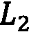

# 第三章:以数据为中心的方法

在第一章 ，*的*定义解释方法和途径*部分中，当我们查看可解释性的各个维度时，我们讨论了数据是其中一个重要的维度。事实上，所有的**机器学习** ( **ML** )算法都取决于正在使用的底层数据。*

在前一章，我们讨论了各种*模型可解释性方法*。在 [*第二章*](B18216_02_ePub.xhtml#_idTextAnchor033) 、*模型可解释性方法*中讨论的大多数方法都是以模型为中心的。讨论的概念和想法集中于使黑盒模型可解释。但是最近，ML 和 AI 社区已经意识到数据对于任何分析或建模目的的核心重要性。因此，越来越多的人工智能研究人员正在围绕以数据为中心的人工智能探索新的想法和概念。

由于数据在模型建立和预测过程中起着至关重要的作用，所以对于我们来说，解释任何 ML 和 AI 算法相对于底层数据的功能更为重要。从我在该领域的经验中观察到的情况来看，生产中任何 ML 系统的失败既不是由于 ML 算法的糟糕选择，也不是由于低效的模型训练或调整过程，而是主要由于底层数据集的不一致而发生。所以，这一章重点介绍了**以数据为中心的可解释人工智能**(**)的概念。**

 **本章的目标是向您介绍以数据为中心的 XAI 的概念。阅读完本章后，您将了解检查数据质量的各种方法，这些方法可能会影响模型的结果。对于生产级 ML 系统，推断数据可能存在与其一致性和质量相关的问题。因此，监测这些漂移是极其重要的。此外，可能存在影响数据的外部噪声或扰动，从而影响模型。所以，这些是我们将要讨论的一些以数据为中心的方法，用来解释 ML 模型。本章将涵盖以下主要主题:

*   以数据为中心的 XAI 简介
*   全面的数据分析和分析流程
*   监测和预测漂移
*   检查对抗性鲁棒性
*   测量数据可预测性

现在，让我们开始吧！

# 技术要求

类似于 [*第 2 章*](B18216_02_ePub.xhtml#_idTextAnchor033) ，*模型可解释性方法*，对于本章，已经提供了某些教程示例来实现某些技术，以在某些感兴趣的数据集上用 Python 执行以数据为中心的 XAI。在本书中，我们将使用 Python Jupyter 笔记本来运行代码并可视化输出。本章的代码和数据集资源可以从下面的 GitHub 资源库下载或克隆:[https://GitHub . com/packt publishing/Applied-Machine-Learning-explability-Techniques/tree/main/chapter 03](https://github.com/PacktPublishing/Applied-Machine-Learning-Explainability-Techniques/tree/main/Chapter03)。运行代码所需的其他重要 Python 框架将与其他相关细节一起在笔记本中提及，以理解这些概念的代码实现。运行代码所需的其他重要 Python 框架将与其他相关细节一起在笔记本中提及，以理解这些概念的代码实现。请注意，本章主要侧重于提供对所涵盖主题的概念性理解。Jupyter 笔记本将帮助您获得在实践中实施这些概念所需的补充知识。我建议你先阅读这一章，然后着手执行 Jupyter 笔记本。

# 以数据为中心的 XAI 简介

*吴恩达*，人工智能和人工智能领域有影响力的思想领袖之一，经常强调使用系统化方法建立具有高质量数据的人工智能系统的重要性。他是**以数据为中心的人工智能**理念的先驱之一，该理念专注于开发系统化的流程，以使用干净、一致和可靠的数据开发模型，而不是专注于代码和算法。如果数据是一致的、明确的、平衡的，并且有足够的数量，这将导致更快的模型构建、更高的准确性以及任何生产级系统的更快部署。

不幸的是，今天生产中存在的所有人工智能和人工智能系统都不符合以数据为中心的人工智能的原则。因此，底层数据可能会出现严重的问题，这些问题很少被发现，但最终会导致 ML 系统的失败。这就是为什么**以数据为中心的 XAI** 对于检查和评估所用数据的质量非常重要。

当我们谈论解释任何关于数据的黑盒模型的功能时，我们应该检查数据的*量*、数据的*一致性*(特别是对于监督的 ML 问题)，以及数据的*纯度和完整性*。现在，让我们讨论以数据为中心的 XAI 的这些重要方面，并理解它们为什么重要。

## 分析数据量

ML 算法的一个经典问题是由于**过拟合**导致的泛化能力不足。可以通过添加更多数据或获得适当容量的数据集来解决潜在问题，从而减少过度拟合。因此，关于解释黑盒模型的数据，我们应该问的第一个问题是“*,这个模型是在充分的数据基础上训练出来的吗？*“但是对于任何工业应用来说，由于数据非常昂贵，添加更多的数据并不总是可行的。因此，问题应该是"*我们如何发现模型是否是根据足够的数据训练的？*”

检查模型是否根据足够的数据进行了训练的一种方法是用训练数据集的 70%、80%和 90%来训练模型。如果模型精度随着数据量的增加而呈上升趋势，这意味着数据量会影响模型的性能。如果已在整个训练数据集上训练的训练模型的精度较低，则模型精度随着数据量的增加而增加的趋势表明该模型没有在足够的数据上训练。因此，需要更多的数据来使模型更加精确和通用。

对于生产系统，如果数据是连续流动的，并且对数据的可用性没有限制，那么应该对不断变化的数据量进行持续的训练和监控，以了解和分析其对整体模型性能的影响。

## 分析数据一致性

当解释与数据相关的 ML 模型时，数据一致性是另一个需要检查的重要因素。分析数据一致性的一个基本步骤是了解数据的分布。如果*数据不是均匀分布的*，如果存在*等级不平衡*，或者如果*数据偏向某个特定方向*，那么很有可能模型会偏向*数据的某个特定部分*或者效率较低。

对于生产系统，经常观察到生产应用程序中使用的推理数据可能与训练和验证期间使用的数据有一些差异。这种现象被称为**数据漂移**，它指的是数据结构或数据集统计属性的意外变化，从而使数据损坏并妨碍 ML 系统的运行。

对于大多数实时预测模型来说，数据漂移非常普遍。这仅仅是因为，在大多数情况下，数据分布在一段时间内会发生变化。这可能是由多种原因造成的，例如，如果通过其收集数据的系统(例如，传感器)开始出现故障或需要重新校准，则可能会发生数据漂移。其他外部因素，如环境温度和环境噪声，也会引起数据漂移。要素之间的关系可能会发生自然变化，从而导致数据漂移。因此，如果训练数据与推断数据显著不同，则模型在预测结果时会出错。

现在，有时，整个数据集中可能存在偏差，或者一个或多个要素中可能存在偏差。如果单个特征中存在漂移，这被称为**特征漂移**。检测特征漂移有多种方式，如**种群稳定性指数**(**PSI**)([https://www.lexjansen.com/wuss/2017/47_Final_Paper_PDF.pdf](https://www.lexjansen.com/wuss/2017/47_Final_Paper_PDF.pdf))、**库尔贝克-莱布勒散度** ( **KL 散度**)**([https://www . countbayesie . com/blog/2017/5/9/kull back-lei bler-Divergence-explain](https://www.countbayesie.com/blog/2017/5/9/kullback-leibler-divergence-explained)其中一些技术的应用已经在 https://github . com/packt publishing/Applied-Machine-Learning-explability-Techniques/tree/main/chapter 03 进行了演示。这些统计方法是测量两个数据分布之间距离的常用方法。因此，如果距离非常大，这表明存在漂移。**

 **除了特征漂移外，如果目标变量的统计属性由于未知原因在一段时间内发生变化，还会出现**标签漂移**或**概念漂移**。然而，在解释黑盒模型时，总体数据一致性是*根本原因分析检验*的一个重要参数。

## 分析数据纯度

用于实际工业问题的数据集从来都不是干净的，尽管大多数组织在数据工程和数据管理上花费了大量的时间和投资，以推动*数据驱动决策*的文化。然而，几乎所有的实际数据集都是杂乱的，需要一个系统的方法来管理和准备。

当我们训练一个模型时，通常我们会将精力放在数据预处理和准备步骤上，例如*找到重复值或唯一值*、*从数据中去除噪声或不需要的值*、*检测异常值*、*处理缺失值*、*处理混合数据类型的特征*，甚至*转换原始特征或特征工程*以获得更好的 ML 模型。在高层次上，这些方法意味着从训练数据中去除杂质。但是，如果黑盒 ML 模型在纯度较低的数据集上训练，因此表现不佳，该怎么办？

这就是为什么分析数据纯度是以数据为中心的 XAI 的重要步骤。除了前面提到的数据预处理和准备方法之外，还存在以下其他数据完整性问题:

*   **标签歧义**:对于有监督的 ML 问题，**标签歧义**可能是一个非常关键的问题。如果一个数据集的两个或更多实例非常相似，有多个标签，那么这会导致标签不明确。目标变量的模糊标记会增加领域专家正确分类样本的难度。标签模糊可能是一个非常常见的问题，因为通常，带标签的数据集是由人类主题专家准备的，他们容易出现*人为错误*。
*   **主要特征频率变化** ( **DFCC** ):在训练和推理数据集中检查 DFFC 是另一个可能导致数据完整性问题的参数。在 [*第 2 章*](B18216_02_ePub.xhtml#_idTextAnchor033) ，*模型可解释性方法*中，当我们讨论特征重要性时，我们了解到并非数据集中的所有特征都同样重要，一些特征对模型的决策过程具有更大的影响力。这些是数据集中的主要特征，如果训练和推理数据集中的主要特征的值在中的方差很高，则模型在预测结果时很可能会出错。

其他数据纯度问题，如新标签或新特征类别的引入，或推理集中特定特征的超出界限值(或异常)，可能导致生产中的 ML 系统失败。

下表显示了可以使用 **Deepchecks Python 框架**执行的某些重要的数据纯度检查:

图 3.1–使用 Deepchecks 框架进行数据纯度检查

以数据为中心的 XAI 还包括其他可以分析的参数，例如*对抗鲁棒性*([https://adversarial-ml-tutorial.org/introduction/](https://adversarial-ml-tutorial.org/introduction/))*信任分数比较*([https://arxiv.org/abs/1805.11783](https://arxiv.org/abs/1805.11783))*协变量移位*([https://arxiv.org/abs/2111.08234](https://arxiv.org/abs/2111.08234))*训练和验证数据集之间的数据泄漏*([https://machine learning mastery . com/data-leakage-machine/](https://machinelearningmastery.com/data-leakage-machine-learning/))，以及所有这些概念都适用于表格数据和非结构化数据，如图像和文本。

要探索数据纯度分析的实用方法，可以参考[https://github . com/packt publishing/Applied-Machine-Learning-explability-Techniques/blob/main/chapter 03/Data _ Centric _ XAI _ part _ 1 . ipynb](https://github.com/PacktPublishing/Applied-Machine-Learning-Explainability-Techniques/blob/main/Chapter03/Data_Centric_XAI_part_1.ipynb)的 Jupyter 笔记本。我们将在本章后面讨论这些主题。

# 全面的数据分析和分析流程

在上一节中，我们向您介绍了以数据为中心的 XAI 的概念，其中我们讨论了以数据为中心的 XAI 的三个重要方面:分析数据量、数据一致性和数据纯度。您可能已经知道我们将在本节学习的一些数据分析和数据概要分析的方法。但是我们将假设我们已经有了一个训练有素的 ML 模型，现在，我们正在通过采用以数据为中心的方法来解释模型的决策过程。

## 对数据分析和分析流程的需求

在 [*第二章*](B18216_02_ePub.xhtml#_idTextAnchor033) 、*模型解释方法*中，当我们讨论使用**探索性数据分析** ( **EDA** )进行知识提取时，我们发现这是一个预先分析的过程，在这个过程中，我们试图理解数据以形成相关假设。作为数据科学家，这些初始假设非常重要，因为它们允许我们采取必要的步骤来建立更好的模型。但是，让我们假设我们有一个基线训练的 ML 模型，并且该模型没有如预期的那样执行，因为它没有满足设定的基准准确度分数。

遵循以模型为中心的方法的原则，大多数数据科学家可能希望在超参数调整、为更多的历元进行训练、特征工程或选择更复杂的算法上花费更多的时间。在某一点之后，这些方法将变得有限，并对模型的准确性提供非常小的提升。这就是以数据为中心的方法被证明非常有效的时候。

## 数据分析作为预防措施

根据以数据为中心的可解释性方法的原则，首先，我们试图对底层数据集进行彻底的分析。我们尝试随机重组数据以创建不同的训练和验证集，并观察任何过度拟合或欠拟合的影响。如果模型过拟合或欠拟合，显然需要更多的数据来概括模型。如果可用的数据量不够大，有办法生成合成或人工数据。用于图像分类的一种流行技术是**数据增强**([https://research.aimultiple.com/data-augmentation/](https://research.aimultiple.com/data-augmentation/))。**合成少数过采样技术**(**SMOTE**)([https://machine learning mastery . com/SMOTE-over sampling-for-unbalanced-classification/](https://machinelearningmastery.com/smote-oversampling-for-imbalanced-classification/))也是一种可以用来增加数据集大小的强大方法。其中一些以数据为中心的方法通常在传统的 ML 工作流程中实施。然而，我们需要意识到这些步骤对于黑盒模型的可解释性的重要性。

一旦我们做了足够的测试来了解数据量是否足够，我们就可以尝试在分段的级别上检查数据的一致性和纯度。如果我们正在处理一个分类问题，我们可以试着理解模型性能是否对所有的类都是一致的。如果没有，我们可以隔离模型性能较差的特定类。然后，我们检查数据漂移、特征漂移、概念漂移、标签歧义、数据泄漏(例如，当看不见的测试数据流入训练数据时)，以及该特定类(或多个类)的其他数据完整性检查。通常，如果特定类(或多个类)的数据有任何异常，这些检查足以隔离问题。彻底的数据分析是检测建模过程中任何漏洞的预防措施。

## 构建强大的数据档案

另一种方法是建立数据的统计特征，然后比较训练数据和推断数据之间的特征。数据集的统计概要是由目标变量类(或者，在回归问题的情况下，值的箱)分割的其特征值的某些统计测量的集合。统计度量的选择可能会因用例而异，但是通常，我选择统计度量，例如平均值、中值、平均方差、平均标准偏差、变异系数(标准偏差/平均值)和 z 分数((值-平均值)/标准偏差)来创建数据配置文件。在时间序列数据的情况下，移动平均值和移动中值等指标也非常重要。

接下来，让我们试着理解这种方法是如何有用的。假设有一个任意数据集，它有三个类(即类 0、1 和 2)和两个要素:要素 1 和要素 2。当我们试图准备统计资料时，我们会试图计算每个特征和每个类别的某些统计测量值(例如本例中的平均值、中值和平均方差)。

因此，对于类 0，将生成一组由特征 1 的平均值、特征 1 的中值、特征 1 的平均方差、特征 2 的平均值、特征 2 的中值和特征 2 的平均方差组成的剖面值。类似地，对于类别 1 和类别 2，将为每个类别创建一组配置文件值。下表显示了我们在本例中考虑的任意数据集的统计特征:

图 3.2–一个表格，显示了任意数据集按每个类划分的统计剖面

特征值的这些统计测量可用于比较不同的类别。如果一个经过训练的模型预测了一个特定的类别，我们可以将特征值与该特定类别的统计概要值进行比较，从而对有助于模型决策过程的有影响的特征有一个合理的想法。但更重要的是，我们可以为生产系统中使用的验证集、测试集和推理数据创建单独的统计配置文件，并将它们与训练集的统计配置文件进行比较。如果值之间的绝对百分比变化明显较高(比如说> 20%)，则这表明存在数据漂移。

在我们的示例中，假设如果类 1 的特征 1 的平均方差分数的绝对百分比变化在训练数据和推断数据之间约为 25%,则特征 1 存在特征漂移，这可能导致生产系统的推断数据的模型性能较差。还可以为图像和文本等非结构化数据创建统计概要文件，尽管统计度量的选择可能会稍微复杂一些。

总的来说，这种方法非常容易实现，它帮助我们验证用于训练模型的数据和测试或推理过程中使用的数据是否一致，这是以数据为中心的模型可解释性的重要一步。在下一节中，我们将讨论监测和预测漂移对于解释 ML 系统的重要性。

# 监测和预测漂移

在上一节中，我们了解了全面的数据分析和数据剖析方法如何帮助我们识别与数量、一致性和纯度相关的数据问题。通常，在最初的数据探索过程中，大多数数据科学家会尝试从量和纯度方面检查数据集中的问题，并执行必要的预处理和特征工程步骤来处理这些问题。

但是实时系统和生产系统的数据一致性检测对于几乎所有的 ML 系统都是一个具有挑战性的问题。此外，与数据一致性相关的问题经常被忽视，并且非常不可预测，因为它们可能在生产系统中的任何时间点发生。下面列出了一些可能出现数据一致性问题的情况:

*   它们可能由于自然原因而发生，例如外部环境条件的变化，或者由于捕获推断数据的传感器或系统的自然磨损而发生。
*   它们可能由于人为原因而发生，例如对收集数据的系统造成的任何物理损坏、运行算法的软件程序中的任何错误(由于该错误，输入数据被不正确地转换)或者在升级旧版本的系统时引入系统的任何噪声。

因此，所有这些情况都会引入数据漂移和概念漂移，最终导致 ML 模型的不良性能。由于漂移在现实中非常普遍，因此在任何 ML 系统的设计过程中，都应该预先考虑与漂移相关的问题。

## 探测漂移

在将经过训练的模型部署到任何生产 ML 系统之后，基于模型性能的性能监控和反馈是一个必要的过程。当我们监控模型性能时，检查任何数据或概念漂移在这一步也是至关重要的。此时，您可能想知道两件事:

*   识别漂移的最佳方法是什么？
*   当我们检测到漂移时会发生什么？

正如在*分析数据一致性*一节中所讨论的，有两种类型的数据漂移——*特征漂移*和*概念漂移*。当特征的统计属性或独立变量由于不可预见的原因而改变时，特征漂移就会发生。相比之下，当模型试图预测的目标类变量在动态设置中改变其与输入要素的初始关系时，就会发生概念漂移。在这两种情况下，基础数据都有统计上的变化。因此，我建议使用上一节讨论的数据分析方法来检测漂移。

实时监控仪表板对于任何实时应用程序监控任何漂移总是很有帮助的。在仪表板中，尝试对每个类和每个功能进行必要的可视化，将统计概要值与流入训练模型的实际实时值进行比较。

特别是对于概念漂移，比较特征与目标结果的相关性是非常有用的。由于漂移可能在一段时间后出现，或者由于外部原因甚至在特定的时间点出现，因此建议在一个时间窗期间(例如，50 个连续数据点或 100 个连续数据点)而不是在连续累积的基础上监控推断数据的统计特性。出于反馈的目的，当在推断数据中检测到异常数据点时，可以设置必要的警报和触发器，这可能指示数据漂移的存在。

## 统计方法的选择

有时，选择统计方法会很困难。因此，我们通常采用一些流行的分布指标，使用定量方法来检测数据漂移的存在。一个这样的度量被称为**信任分数分布**(【https://arxiv.org/abs/1805.11783】T4)。

下图显示了使用 *Deepchecks Python 框架*获得的信任分数分布图:

图 3.3–训练数据集和推理数据集之间的信任分数分布示例

信任分数是一种分布度量，用于测量训练集上的 ML 分类器和推理数据集上的更新的**k-最近邻** ( **kNN** )分类器之间的一致性。前面的图显示了训练数据集和推理数据集之间的信任分数分布图。

理想情况下，训练数据集和测试数据集的分布应该几乎相同。然而，如果推理集的信任分数分布偏向最左侧，则该指示训练的模型对推理数据的置信度较低，从而暗示漂移的存在。如果推断数据上的信任分数的分布偏向最右侧，则模型可能存在一些问题，并且存在数据泄漏的高概率，因为理想情况下，与训练数据相比，训练模型在测试数据中不能更有信心。

为了检测分类特征上的特征漂移，度量的流行选择是**人口稳定性指数**(**PSI**)(【https://www.lexjansen.com/wuss/2017/47_Final_Paper_PDF.pdf】T4)。这是一种统计方法，用来衡量一个变量在一段时间内的变化。如果总漂移分数大于 0.2 或 20%，则漂移被认为是显著的，确定存在特性漂移。

为了检测数字特征中的特征漂移， **Wasserstein 度量**([https://kowshikchilamkurthy . medium . com/wasser stein-distance-contraction-mapping-and-modern-rl-theory-93ef 740 AE 867](https://kowshikchilamkurthy.medium.com/wasserstein-distance-contraction-mapping-and-modern-rl-theory-93ef740ae867))是流行的选择。这是一个距离函数，用于度量两个概率分布之间的距离。类似于 PSI，如果使用 Wasserstein 度量的漂移分数高于 20%，则认为这是显著的，并且数字特征被认为具有特征漂移。

下图说明了使用 Wasserstein(推土机)距离和**预测能力得分** ( **PPS** )以及 Deepchecks 框架的特征漂移估计:

图 3.4–使用 Wasserstein(推土机)距离和特征 PPS 进行特征漂移估计

使用这些指标也可以检测到类似的概念漂移。对于回归问题，Wasserstein 度量是有效的，而对于分类问题，PSI 更有效。在[https://github . com/packt publishing/Applied-Machine-Learning-explability-Techniques/tree/main/chapter 03](https://github.com/PacktPublishing/Applied-Machine-Learning-Explainability-Techniques/tree/main/Chapter03)可以看到这些方法在实际数据集上的应用。此外，还有其他对检测数据漂移非常有用的统计方法，如**库尔贝克-莱布勒散度** ( **KL 散度**)**巴塔查里亚距离**、**詹森-香农散度** ( **JS 散度**)等等。

在这一章中，我们的重点不是学习这些指标，但是我强烈建议您看一下*参考文献*部分，了解更多关于这些指标及其在寻找数据漂移中的应用。这些方法也适用于图像。代替结构化特征值，图像数据集的像素强度值的分布被用于检测漂移。

既然我们知道了探测漂移的某些有效方法，那么当我们发现漂移的存在时，我们该做些什么呢？第一步是提醒我们的利益相关方 ML 系统是否已经投入生产。数据漂移导致的不正确预测会影响许多最终用户，最终可能导致最终用户失去信任。下一个步骤是检查漂移本质上是*暂时的*、*季节性的*还是*永久性的*。对漂移性质的分析可能具有挑战性，但是如果导致漂移的变化能够被识别和恢复，那么这就是最佳解决方案。

如果漂移是暂时的，第一步是确定导致漂移的临时更改，然后恢复这些更改。对于季节性漂移，应在训练过程中考虑数据的季节性变化，或作为一个附加的预处理步骤，对数据的任何季节性影响进行标准化。这是为了让模型知道数据中的季节性模式。然而，如果漂移是永久性的，那么唯一的选择是根据新数据重新训练模型，并为生产系统部署新训练的模型。

在 XAI 的背景下，漂移的检测可以证明任何 ML 模型或算法的失败，并通过识别失败的根本原因来帮助改进模型。在下一节中，我们将讨论另一个以数据为中心的质量检查步骤，可以执行该步骤来确保 ML 模型的健壮性。

# 检查对抗性鲁棒性

在上一节中，我们讨论了预测和监控漂移对于任何生产级 ML 系统的重要性。通常，这种类型的监控是在模型被部署到产品中之后进行的。但是，即使在模型部署到生产中之前，检查模型的**对抗性鲁棒性**也是极其重要的。

大多数最大似然模型容易受到敌对攻击或向输入数据中注入噪声，从而导致模型因做出不正确的预测而失败。对抗性攻击的程度随着模型的复杂性而增加，因为复杂的模型对噪声数据样本非常敏感。因此，检查对抗性鲁棒性是为了评估经过训练的模型对对抗性攻击的敏感程度。

在本节中，首先，我们将尝试理解对抗性攻击对模型的影响，以及为什么这在 XAI 的环境中是重要的。然后，我们将讨论某些技术，我们可以使用这些技术来增加最大似然模型的对抗性鲁棒性。最后，我们将讨论用于评估模型的对抗性鲁棒性的方法，这可以在将 ML 模型部署到产品中之前作为练习来执行，以及这如何形成可解释 ML 系统的重要部分。

## 对抗性攻击的影响

在过去的几年里，对抗性攻击一直是人工智能社区非常关注的原因。这些攻击可以注入噪声来修改输入数据，以这种方式，人类观察者可以容易地识别正确的结果，但是 ML 模型可以容易地被愚弄并开始预测完全不正确的结果。攻击的程度取决于攻击者对模型的访问。

通常，在生产系统中，经过训练的模型(尤其是模型参数)是固定的，不能修改。但是流入模型的推理数据可能被突发噪声信号污染，从而使模型误分类。人类专家在过滤注入的噪声方面非常有效，但是如果模型在训练阶段没有暴露于这种噪声样本，ML 模型就不能将噪声从实际数据中分离出来。有时，这些攻击也可能是有针对性的攻击。

例如，如果人脸识别系统只允许特定的人访问，对抗性攻击可以通过引入一些噪声来修改任何人对特定人的图像。在这种情况下，必须使用目标样本训练对抗算法来构建噪声信号。还有其他形式的对抗性攻击，可以在训练阶段修改模型本身。然而，由于我们是在 XAI 的背景下讨论这个问题，我们将集中讨论对抗效应对训练过的 ML 模型的影响。

有不同类型的对抗性攻击会影响训练有素的 ML 模型:

*   **快速梯度符号法** ( **FGSM** ): FGSM 就是这样一种利用深度学习模型的梯度来学习对立样本的方法。对于图像分类器，这可能是一个常见的问题，因为 FGSM 通过根据模型的梯度下降的*方向增加或减少像素强度值来对图像的像素值产生扰动。这可以欺骗模型进行错误分类，并严重影响模型的性能，但对于人类观察者来说，这不会产生任何问题。即使修改看起来可以忽略不计，该方法也添加了足以导致错误分类的均匀分布的噪声。*
*   卡里尼&瓦格纳 ( **C & W** ) **攻击**:另一种常见的对抗性攻击是 C & W 攻击。这个方法使用三个基于范数的距离度量(、和)来寻找对立的例子，使得对立的例子和原始样本之间的距离最小。检测 C & W 攻击比 FGSM 攻击更难。
*   **有针对性的对抗性补丁攻击**:有时，在整个图像中注入噪声(即噪声随机像素的添加)是不必要的。仅将噪声图像片段添加到图像的一小部分对模型同样有害。有针对性的对抗性补丁攻击可以生成一个小的对抗性补丁，然后与原始样本叠加，从而遮挡数据的关键特征，使模型分类不正确。还有其他形式的对抗性攻击，在未来会发现更多新方法。然而，影响仍然是一样的。

下图显示了不同的对抗性攻击如何在图像中引入噪声，从而使模型难以给出正确的预测。尽管添加了噪声，但我们作为人类，仍然可以预测正确的结果，但训练好的模型完全被对抗性攻击所愚弄:

图 3.5-对推理数据的敌对攻击导致不正确的模型预测

对抗性攻击会迫使 ML 模型产生不正确的结果，从而严重影响最终用户。在下一节中，让我们尝试探索增加模型的对抗性鲁棒性的方法。

## 增加对抗性鲁棒性的方法

在生产系统中，对抗性攻击通常会在推理数据中引入噪声。因此，为了减少敌对攻击的影响，我们需要教会模型在训练过程中过滤噪音或暴露噪音样本的存在，或者训练模型检测敌对样本:

*   最简单的选择是过滤掉作为防御机制的噪声，以增加 ML 模型的对抗性鲁棒性。任何不利的噪声都会导致输入样本的突变。为了从任何信号中滤除任何突变，我们通常尝试应用平滑滤波器，如**空间平滑**。空间平滑相当于图像中的**模糊操作**，用于降低对抗性攻击的影响。从的经验中，我观察到*自适应中值空间平滑*([https://homepages.inf.ed.ac.uk/rbf/HIPR2/median.htm](https://homepages.inf.ed.ac.uk/rbf/HIPR2/median.htm))，它通过窗口方法在局部级别工作，比在全局级别平滑更有效。中位数的统计测量在从数据中滤除噪声或异常值方面总是更有效。
*   另一种增加对抗性鲁棒性的方法是在训练过程中引入对抗性的例子。通过使用**数据扩充**技术，我们可以从原始数据中生成对立样本，并在训练过程中包含扩充数据。如果使用增强的对立样本从零开始训练模型是不可行的，那么实际上可以使用**迁移学习**在对立样本上对训练的 ML 模型进行微调。这里，训练好的模型权重可以在新的样本上进行微调。
*   用对立样本训练模型的过程通常被称为**对立训练**。我们甚至可以使用对抗训练来训练一个单独的模型，只是为了从原始样本中检测对抗样本，并在产生对抗样本时将其与主模型一起使用来触发警报。将模型暴露于可能的敌对样本的想法类似于网络安全中的*压力测试*([https://ieeexplore.ieee.org/document/6459909](https://ieeexplore.ieee.org/document/6459909))的想法。

*图 3.6* 说明了如何将空间平滑作为一种防御机制，以最大限度地降低对抗性攻击的影响:

图 3.6–使用空间平滑作为防御机制，最大限度地降低敌对攻击的影响

使用我们到目前为止讨论的方法，我们可以在很大程度上增加训练的 ML 模型的对抗鲁棒性。在下一节中，我们将尝试探索评估 ML 模型的对抗性鲁棒性的方法。

## 评估对抗性的鲁棒性

既然我们已经了解了防御对抗性攻击的某些方法，那么可能马上想到的问题是*我们如何度量模型的对抗性健壮性？*

不幸的是，我从未遇到过任何专门的度量来定量测量 ML 模型的对抗性鲁棒性，但它是 AI 社区的一个重要研究课题。数据科学家评估 ML 模型的对抗性稳健性的最常见方法是**压力测试**和**分段压力测试**:

*   在**压力测试**中，通过 FGSM 或 C & W 方法产生对立的例子。在此之后，通过与原始数据获得的模型精确度进行比较，在对立示例和上测量模型精确度。对抗性攻击的强度也可以增加或减少，以观察模型性能随攻击强度的变化。有时，特定的类或要素比整个数据集更容易受到恶意攻击。在这些情况下，分段压力测试是有益的。
*   在**分段压力测试**中，不是在整个数据集上测量整个模型的对抗性鲁棒性，而是考虑数据集的分段(针对特定类或特定特征)来比较模型鲁棒性和对抗性攻击强度。可以用随机噪声或高斯噪声产生对立的例子。对于某些数据集，量化指标如**峰值信噪比**(**PSNR**)([https://www . ni . com/nl-be/innovations/white-papers/11/Peak-Signal-to-Noise-ratio-as-an-a-image-quality-metric . html](https://www.ni.com/nl-be/innovations/white-papers/11/peak-signal-to-noise-ratio-as-an-image-quality-metric.html))和**Erreur Relative Globale adidimensionnelle de Synthese**(**ERGAS**)(另外，ML 模型的对抗性稳健性可以通过模型对对抗性样本的预测来定量检验。

不仅仅是评估对抗性鲁棒性的方法，检查对抗性鲁棒性和监控对抗性攻击的检测是可解释的 ML 系统的必要部分。接下来，让我们讨论度量数据可预测性作为提供以数据为中心的模型可解释性的方法的重要性。

# 测量数据可预测性

到目前为止，我们已经了解了通过检查数据的一致性和纯度来分析数据的重要性，寻找监控漂移，并检查任何敌对攻击来解释 ML 模型的工作。但是一些数据集非常复杂，因此，即使使用复杂的算法来训练精确的模型也是不可行的。如果训练好的模型不准确，就容易做出不正确的预测。现在的问题是*如果我们知道经过训练的模型在做出正确预测方面并不是非常准确，我们如何获得最终用户的信任？*

我想说，获得信任的最佳方式是保持透明，清楚地传达什么是可行的。因此，测量**数据的可预测性**并将模型的效率传达给最终用户有助于设定正确的期望值。

数据可预测性是使用基础数据对模型性能的估计。例如，假设我们有一个模型来预测特定公司的股票价格。由 ML 算法建模的股票价格数据可以预测股票的价格，最高准确率为 60%。超过这一点，实际上不可能使用给定的数据集生成更准确的结果。

但是，如果考虑其他外部因素来补充当前数据，模型的准确性就可以提高。这证明了限制系统性能的不是 ML 算法，而是用于建模的数据集没有足够的信息来获得更好的模型性能。因此，这是一个数据集的限制，可以通过数据可预测性的措施进行估计。

下图显示了一些模型评估可视化，可用于使用 Deepchecks 框架分析数据可预测性:

图 3.7–使用模型评估报告和深度检查框架的数据可预测性

接下来，让我们讨论如何估计数据的可预测性。

## 估计数据可预测性

数据可预测性是使用模型评估指标来评估的。数据可预测性也可以通过进行模型误差分析来测量。度量标准的选择取决于数据集的类型和所解决问题的类型。例如，看看下面的列表:

*   对于时间序列数据，数据可预测性通过度量获得，如**平均绝对百分比误差**(**MAPE**)**对称平均绝对百分比误差**(**SMAPE**)**变异系数** ( **CoV** )等等。
*   对于分类问题，我通常会选择 **ROC-AUC 分数**、**混淆矩阵**、**精度**、**召回**、 **F1 分数**以及**精度**。
*   对于回归问题，我们可以看看**均方误差**(**MSE**)**R2 得分**、**均方根误差**(**RMSE**)**平方和** ( **上证**)等等。

您可能已经使用了这些度量中的大部分来评估经过训练的 ML 模型。数据可预测性不仅仅是根据您选择的度量标准评估训练模型，而是使用给定数据集衡量模型的可预测性。

让我们假设你正在为一个分类问题应用三种不同的 ML 算法，比如决策树、支持向量机(SVM)和随机森林，你选择的度量是 recall。这是因为你的目标是尽量减少误报的影响。经过严格的训练和对未知数据的验证，你可以用决策树得到 70%的召回率，用 SVM 得到 85%，用随机森林得到 90%。你认为你的数据可预测性如何？是 70%，90%，还是 81.67%(三个分数的平均值)？

我会说正确答案在 70%到 90%之间。将可预测性视为一个大概的估计总是更好，因为提供一个范围的值而不是一个单一的值可以给出最好情况和最坏情况的想法。关于数据可预测性的交流增加了最终利益相关者对 ML 系统的信心。如果最终用户有意识地意识到算法只有 70%的准确性，即使系统预测错误，他们也不会盲目信任模型。当最终用户意识到模型的局限性时，如果模型结果与实际结果不匹配，他们会更加体谅。

生产中的大多数 ML 系统已经开始使用预测概率或模型置信度作为数据可预测性的度量，并传达给最终用户。例如，如今，大多数天气预报应用程序显示，降雨或降雪有一定的概率。因此，数据可预测性通过对预测结果的准确性建立正确的预期，增加了人工智能算法的可解释性。它不仅仅是模型性能的度量，而是在特定数据集上训练的模型的可预测性的度量。

这就把我们带到了本章的结尾。让我们总结一下我们在下一节讨论的内容。

# 总结

现在，让我们试着总结一下你在本章中学到了什么。在本章中，我们重点介绍了 XAI 的以数据为中心的方法。我们学到了解释与底层数据相关的黑盒模型的重要性，因为数据是任何 ML 模型的中心部分。以数据为中心的 XAI 的概念对你们许多人来说可能是新的，但它是整个人工智能社区的一个重要研究领域。以数据为中心的 XAI 可以在数据量、数据一致性和数据纯度方面为黑盒模型提供可解释性。

以数据为中心的可解释性方法仍然是活跃的研究主题，并且没有一个单一的 Python 框架涵盖以数据为中心的 XAI 的所有方面。请浏览在[https://github . com/packt publishing/Applied-Machine-Learning-explability-Techniques/tree/main/chapter 03](https://github.com/PacktPublishing/Applied-Machine-Learning-Explainability-Techniques/tree/main/Chapter03)提供的补充 Jupyter 笔记本教程，以获得关于该主题的更多实用知识。

我们了解了通过彻底的数据检查和数据分析来估计训练数据和推断数据的一致性的想法。监控生产 ML 系统的数据漂移也是以数据为中心的 XAI 过程的重要组成部分。除了数据漂移之外，估计 ML 模型的对抗性鲁棒性和检测对抗性攻击也是该过程的一个重要部分。

最后，我们了解了数据可预测性的重要性，以便为最终利益相关者设定正确的预期，了解模型可以实现什么，以及这是如何增加最终用户信任的必要实践。

本章已经向你介绍了许多统计学概念。涵盖每种统计方法的所有内容超出了本章的范围。但是，我强烈建议您浏览一下共享的参考链接，以便更深入地理解这些主题。

这就把我们带到了本书第一部分的结尾，在这一部分中，你已经对 XAI 的某些关键主题有了概念性的理解。从下一章开始，我们将开始探索流行的 Python 框架，将 XAI 的概念应用于实际的现实世界问题。在下一章，我们将介绍一个重要的 XAI 框架，叫做 LIME，并考察它在实践中的应用。

# 参考文献

要获得有关本章主题的更多信息，请参考以下资源:

*   *吴恩达发起以数据为中心的人工智能运动*:[https://www . Forbes . com/sites/Gil press/2021/06/16/Andrew-ng-launchs-A-Campaign-For-Data-Centric-AI/？sh=5333db3a74f5](https://www.forbes.com/sites/gilpress/2021/06/16/andrew-ng-launches-a-campaign-for-data-centric-ai/?sh=5333db3a74f5)
*   *着陆。AI:以数据为中心的 AI*:【https://landing.ai/data-centric-ai/】T2
*   *蒋等，《信任或不信任量词》(2018)*:【https://arxiv.org/abs/1805.11783】
*   *深究*:【https://docs.deepchecks.com/en/stable/ T3
*   *统计距离*:【https://en.wikipedia.org/wiki/Statistical_distance 
*   *林等，“利用种群稳定性指数(PSI)检验分布变动对模型的验证与诊断”*:【https://www.lexjansen.com/wuss/2017/47_Final_Paper_PDF.pdf】
*   *瓦瑟斯坦公制*:【https://en.wikipedia.org/wiki/Wasserstein_metric 
*   *基于 Bhattacharyya 距离的进化数据流概念漂移检测方法*:[https://www . research gate . net/publication/352044688 _ Bhattacharyya _ Distance _ based _ Concept _ Drift _ Detection _ Method _ For _ evolving _ data _ stream](https://www.researchgate.net/publication/352044688_Bhattacharyya_Distance_based_Concept_Drift_Detection_Method_For_evolving_data_stream)****