# *第四章*:模型可解释性的石灰

在前面的章节中，我们讨论了构建可信的人工智能系统所需的各种技术概念**可解释的人工智能** ( **XAI** )。此外，我们还看了一些使用各种 Python 框架来实现实际问题解决概念的实际例子和演示，这些在本章的 GitHub 代码库中给出。XAI 一直是一个重要的研究课题，但只是在最近，所有组织才开始采用 XAI 作为使用人工智能解决业务问题的解决方案生命周期的一部分。一种流行的方法是**局部可解释的模型不可知解释** ( **LIME** )，它已经被广泛采用来提供模型不可知的局部可解释性。LIME Python 库是一个健壮的框架，它为表格、文本和图像数据提供了人类友好的解释，并有助于解释黑盒监督的机器学习算法。

在这一章中，你将被介绍到在 XAI 领域产生了重大影响的 LIME 框架。我们将讨论全局和局部模型可解释性的 LIME 算法的工作原理。此外，我将展示一个实例，在这个实例中，LIME Python 框架可以用于实践。我将介绍您应该知道的这个框架的局限性。

因此，在这一章中，我们将讨论以下主要话题:

*   对石灰的直观理解
*   什么使莱姆成为一个好的模型解释者？
*   子模块选择(SP-石灰)
*   用石灰解决分类问题的一个实例
*   潜在的陷阱

事不宜迟，我们开始吧。

# 技术要求

这一章比本书的前几章稍微技术性一些。本章的代码和数据集资源可以从 GitHub 资源库下载或克隆，该资源库位于[https://GitHub . com/packt publishing/Applied-Machine-Learning-explability-Techniques/tree/main/chapter 04](https://github.com/PacktPublishing/Applied-Machine-Learning-Explainability-Techniques/tree/main/Chapter04)。与前面的章节类似，我们将使用 Python 和 Jupyter 笔记本来运行代码并生成必要的输出。运行代码所必需的其他重要 Python 框架将在笔记本中提及，并提供进一步的相关细节来理解这些概念的代码实现。

# 对石灰的直观认识

LIME 是一种新颖的、模型不可知的局部解释技术，用于通过学习预测周围的局部模型来解释黑盒模型。LIME 提供了对模型的直观的全局理解，这对于非专家用户也是有帮助的。该技术最早是在研究论文*“我为什么要相信你？”解释任何分类器*的预测*里贝罗等人*。(https://arxiv . org/ABS/1602.04938)。Python 库可以从位于[https://github.com/marcotcr/lime](https://github.com/marcotcr/lime)的 GitHub 库安装。该算法通过使用近似的局部可解释模型，以忠实的方式很好地解释了任何分类器或回归器。它为任何黑箱模型提供了建立信任的全局视角；因此，它允许您在人类可解释的表示上识别可解释的模型，这在局部上忠实于算法。因此，它主要通过*学习可解释数据表示*、*在保真度-可解释度权衡中保持平衡*以及*搜索局部探索*来发挥作用。让我们详细看一下其中的每一个。

## 学习可解释的数据表示

LIME 在区分有影响力的特征和选择非专业用户可以理解的可解释的数据表示方面做得非常好，不管算法使用的实际复杂特征是什么。例如，当解释在图像等非结构化数据上训练的模型时，实际算法可能会使用复杂的数字特征向量来进行决策过程，但这些数字特征值对于任何非技术最终用户来说都是不可理解的。相比之下，如果可解释性是根据图像内感兴趣区域或超像素(即，连续像素片)的存在与否来提供的，则这是提供可解释性的人类可解释的方式。

类似地，对于文本数据，代替使用单词嵌入向量值来解释模型，提供人类可解释的解释的更好方式是通过使用用于描述模型的目标结果的某些单词的存在或不存在的例子。因此，从数学上讲，被解释的数据实例的原始表示由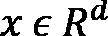表示，其中 *d* 是数据的整个维度。可解释数据表示的二进制向量在数学上由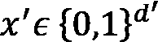表示。直观地说，该算法试图表示人类可解释的数据表示的存在或不存在，以解释任何黑盒模型。

*图 4.1* 显示了 LIME 如何试图将输入图像数据分成人类可理解的部分，这些部分随后用于以非技术用户可理解的方式解释黑盒模型:


图 4.1–LIME 如何将图像转换为人类可理解的组件

接下来，让我们讨论如何保持保真度和可解释性之间的平衡。

## 在保真度和可解释性之间保持平衡

LIME 利用固有的可解释模型，如决策树、线性模型和基于规则的启发式模型，通过视觉或文本工件向非专家用户提供解释。从数学上来说，这种解释是一种可以用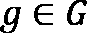表示的模型，其中是潜在可解释模型的整个集合，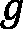的域用另一个二元向量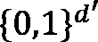来表示，它表示可解释组件的存在与否。此外，该算法试图测量一个解释的*复杂性*及其*可解释性*。例如，即使在决策树这样的可解释模型中，树的深度也是其复杂性的度量。

从数学上来说，一个可解释模型的复杂性用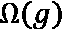来表示。当提供解释时，LIME 试图保持**本地保真度**。这意味着该算法试图复制与被预测的单个数据实例接近的模型行为。因此，在数学上，该算法的发明者使用函数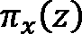来测量任何数据实例之间的接近度，从而定义原始表示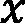周围的局部性。现在，如果概率函数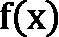定义了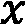属于某个类的概率，那么为了逼近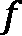，LIME 算法试图用接近函数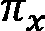来测量有多不忠实。整个操作由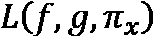功能表示。因此，该算法试图最小化位置感知损失函数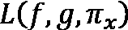，同时保持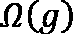为低值。这对于任何非专业用户来说都很容易解释。可解释性局部保真度权衡的度量由以下数学函数近似得出:

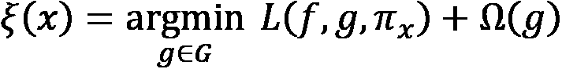

因此，这种折衷度量取决于可解释模型、保真度函数和复杂性度量。

## 寻找当地的探险

LIME 算法是*模型不可知的*。这意味着当我们试图最小化*位置感知损失函数*、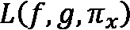时，没有任何关于 *f* 的假设。此外，LIME 通过在近似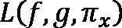时采用由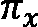加权的样本来保持局部保真度。将的非零样本均匀随机抽取到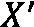周围的样本实例中。假设有一个扰动样本包含的非零元素的分数，用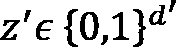表示。该算法试图从原始表示中恢复样本，以逼近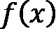。然后，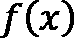被用作解释模型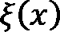的标签。

*图 4.2* 表示在 https://arxiv.org/pdf/1602.04938.pdf[的 LIME 框架的原始论文中提出的一个例子，它使用一个可视化的表示直观地解释了算法的工作:](https://arxiv.org/pdf/1602.04938.pdf)


图 4.2–直观地解释了 LIME 算法的工作原理

在*图 4.2* 中，分离浅蓝色和粉色背景的曲线被认为是黑盒模型的复杂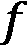决策函数。由于决策函数不是线性的，使用线性模型来近似它是没有效率的。十字和圆点代表属于两个不同类别的训练数据。粗叉表示正在解释的推理数据实例。该算法通过使用 *f* 对实例进行采样来获得预测。然后，该算法根据与被解释的数据实例的接近程度来分配权重。在上图中，根据数据实例的接近程度，红叉和蓝点的大小是不同的。因此，被采样的实例既靠近 *x* ，具有来自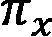的较高权重，又远离它，因此具有较低权重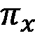。最初的黑盒模型可能过于复杂，无法提供全局解释，但是 LIME 框架可以提供适用于本地数据实例的解释。学习到的解释是由虚线示出的,其从全局角度看是局部忠实的。

*图 4.3* 展示了对 LIME 算法更直观的理解。根据原始图像，该算法生成一组扰动的数据实例:


图 4.3–用石灰解释预测

如图 4.3 中的*所示，被扰乱的实例是通过关闭一些可解释组件而创建的。就图像而言，如上图所示，这是通过将某些组件变成灰色来实现的。然后，将黑盒模型应用于生成的每个扰动实例，并计算该实例被预测为模型的最终结果的概率。然后，在数据集上学习可解释的模型(例如简单的局部加权线性模型)，最后，考虑具有最大正权重的超像素用于最终解释。*

在下一节中，让我们讨论为什么 LIME 是一个好的模型解释器。

# 是什么让 LIME 成为一个优秀的模型解释者？

LIME 使非专家用户能够理解不可信的黑盒模型的工作原理。石灰的以下特性使它成为一个很好的模型解释器:

*   **人类可解释的**:正如前面章节中的所讨论的，LIME 提供了易于理解的解释，因为它提供了一种将输入数据的组成部分与模型结果进行比较的定性方法。
*   **模型不可知**:在的前几章中，虽然你已经了解了各种特定于模型的解释方法，但是如果解释方法可以用来为任何黑盒模型提供可解释性，这总是一个优势。LIME 在提供解释时不对模型做任何假设，并且可以与任何模型一起工作。
*   **局部保真度** : LIME 试图通过探索被预测数据实例的接近度来复制整个模型的行为。因此，它为用于预测的数据实例提供了局部可解释性。这对于任何非技术用户理解模型决策过程的确切原因是很重要的。
*   **全局直觉**:虽然算法提供了局部可解释性，但它确实试图向终端用户解释一个代表性集合，从而为模型的运行提供一个全局视角。SP-LIME 通过解释一组数据实例提供了对模型的全局理解。这将在下一节更详细地介绍。

既然我们已经理解了 LIME 框架的主要优点，在下一节中，让我们讨论 LIME 的子模块选择算法，它用于提取全局可解释性。

# SP-石灰

为了使解释方法更加可信，提供对单个数据实例的解释(即本地解释)并不总是足够的，最终用户可能希望对模型有一个全局的了解，以便对模型的健壮性有更高的可靠性。因此，SP-LIME 算法试图对多种多样但经过精心挑选的实例集运行解释，并返回非冗余的解释。

现在，让我提供对 SP-LIME 算法的直观理解。该算法认为遍历所有单个局部解释所需的时间是有限的，并且是一种约束。因此，最终用户愿意检查来解释模型的解释的数量是由 *B* 表示的算法的预算。让我们假设 *X* 表示实例集；为最终用户选择 *B* 实例来分析模型可解释性的任务被定义为**选择步骤**。挑选步骤独立于解释的存在，它需要通过挑选一组不同的代表性实例来提供*非冗余的解释*，以解释模型在考虑全局视角时的表现。因此，该算法试图避免选取具有相似解释的实例。

在数学上，这种想法是用*解释矩阵* ( *W* )来表示的，其中*W**= n * d’*，这样 *n* 是样本的数量，*d’*是人类可解释的特征。该算法还使用了一个*全局重要性分量矩阵* ( *I* )，其中对于 *j* ， *I(j)* 的每个分量表示解释空间中的全局重要性。直观地说， *I* 以一种给特征分配更高分数的方式被公式化，这解释了数据的许多实例。考虑用于解释的一组重要特征由 *V* 表示。因此，结合所有这些参数，该算法试图学习一个*非冗余覆盖直觉函数*、 *c(V，W，I)* 。非冗余覆盖直觉试图计算在集合 *V* 的至少一个实例中出现的所有特征的集体重要性。然而，*选择问题*是关于*最大化加权覆盖函数*。这由以下等式表示:

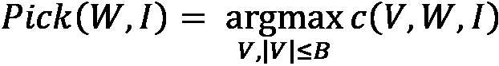

对于某些读者来说，我们刚刚在这一部分介绍的算法的细节可能有点难以理解。然而，直觉上，该算法试图覆盖以下步骤:

1.  解释模型在所有实例上运行( *x* )。
2.  计算所有单个组件的全局重要性。
3.  然后，该算法试图通过迭代地添加具有最高最大覆盖增益的实例来最大化非冗余覆盖直觉函数( *c* )。
4.  最后，算法试图获得代表性的非冗余解释集( *V* )并返回。

在下一节中，我们将通过代码示例介绍如何将 LIME Python 框架用于分类问题。

# 使用石灰解决分类问题的实例

到目前为止，我们已经涵盖了关于 LIME 算法所需的大部分深入的概念理解。在这一节中，我们将尝试探索用于解释分类问题的 LIME Python 框架。该框架在 https://github.com/marcotcr/lime的 GitHub 上是一个开源项目。使用 Jupyter 笔记本中的`pip`安装程序可以很容易地在 Python 中安装 LIME:

```
!pip install lime
```

该教程的完整笔记本版本可从 GitHub 资源库获得，网址为[https://GitHub . com/packt publishing/Applied-Machine-Learning-explability-Techniques/blob/main/chapter 04/Intro _ to _ lime . ipynb](https://github.com/PacktPublishing/Applied-Machine-Learning-Explainability-Techniques/blob/main/Chapter04/Intro_to_LIME.ipynb)。但是，现在，我将尝试向您介绍整个代码，以便您详细理解代码。一旦安装了 LIME 框架，通过导入库来快速验证安装是否成功:

```
import lime
```

如果导入成功，您可以轻松地继续下一步；否则，您需要检查在安装框架时哪里出错了。但是通常情况下，您应该不会遇到任何错误或任何依赖冲突，因为安装这个库非常简单。对于本教程，我们将使用*泰坦尼克号数据集*([https://www.openml.org/search?type=data&排序=运行& id=40945 &状态=活动](https://www.openml.org/search?type=data&sort=runs&id=40945&status=active))。这是一个经典的机器学习数据集，用于预测泰坦尼克号上乘客的存活率。所以，这是一个二元分类问题，可以用机器学习来解决。尽管这是一个不太复杂的经典数据集，但它包含所有类型的特征，如*分类*、*顺序*、*连续*，甚至某些与分类无关的*标识符*，因此这是一个有趣的数据集。为了让你更容易执行笔记本，我在[https://github . com/packt publishing/Applied-Machine-Learning-explability-Techniques/tree/main/chapter 04/dataset](https://github.com/PacktPublishing/Applied-Machine-Learning-Explainability-Techniques/tree/main/Chapter04/dataset)的代码库中下载并提供了稍作修改后的数据集。

泰坦尼克号数据集

泰坦尼克号原始数据集，描述泰坦尼克号上个别乘客的生存状态。泰坦尼克号的数据不包含船员的信息，但包含了一半乘客的实际年龄。泰坦尼克号乘客数据的主要来源是百科全书。这里使用的数据集是由不同的研究人员开始的。原始资料之一是伊顿&哈斯(1994)的《泰坦尼克号:胜利与悲剧》，帕特里克·斯蒂芬斯有限公司，其中包括由许多研究人员创建并由迈克尔·a·芬德利编辑的乘客名单。

弗吉尼亚大学的托马斯·卡森使用《泰坦尼克号百科全书》对泰坦尼克号数据框进行了大幅更新和改进，并在此创建了数据集。一些重复的乘客被删除，许多错误被纠正，许多缺失的年龄被填充，新的变量被创建。

在安装和导入所有需要的模块之后，首先，我们将从目录中加载数据集作为 pandas 数据框架:

```
data = pd.read_csv('dataset/titanic.csv')
```

当您尝试使用 pandas 的`head`方法可视化数据帧时，您将会看到数据集的一瞥，如图*图 4.4* 所示。通常，此步骤有助于您快速了解如何理解您的数据:

```
data.head()
```

下图显示了用于此示例的 pandas 数据帧:


图 4.4–将数据集显示为熊猫数据框(左侧)和数据字典(右侧)

对于这个特定的例子，我们不关心获得一个高效的机器学习模型，而是我们的重点是使用 LIME 在几行代码中产生对人类友好的解释。因此，我们将跳过严格的**探索性数据分析** ( **EDA** )或特性工程步骤。然而，我强烈建议你们所有人将这些步骤作为良好的实践。从数据集中我们可以看到，某些特征如*乘客 ID* 和*票号*是可以忽略的标识符。*舱室编号*功能是一个有趣的功能，特别是因为它可以指示船只的某个机翼、地板或侧面更容易受到攻击。但是这个特性是一个稀疏的分类特性，它本身并没有太大的帮助，可能需要一些高级的转换或特性工程。因此，为了构建一个简单的模型，我们将放弃这个特性。此外，*乘客姓名*对预测模型没有用，因此，我们可以删除它们。为了获得更好的模型结果，需要对一些分类特征进行转换。如果你想尝试更多功能工程的想法，下面的文章可能会有所帮助:[https://triangle inequality . WordPress . com/2013/09/08/basic-feature-engineering-with-the-titanic-data/](https://triangleinequality.wordpress.com/2013/09/08/basic-feature-engineering-with-the-titanic-data/)。

这里是模型训练前数据准备的代码行:

```
# Dropping all irrelevant columns
```

```
data.drop(columns=['PassengerId', 'Name', 'Cabin', 'Ticket'], inplace = True)
```

```
# Handling missing values
```

```
data.dropna(inplace=True)
```

```
# Ensuring that Age and Fare is of type float 
```

```
data['Age'] = data['Age'].astype('float')
```

```
data['Fare'] = data['Fare'].astype('float')
```

```
# Label Encoding features 
```

```
categorical_feat = ['Sex']
```

```
# Using label encoder to transform string categories to integer labels
```

```
le = LabelEncoder()
```

```
for feat in categorical_feat:
```

```
    data[feat] = le.fit_transform(data[feat]).astype('int')
```

```
# One-Hot Encoding Categorical features
```

```
data = pd.get_dummies(data, columns=['Embarked'])
```

转换后的数据帧如*图 4.5* 所示:


图 4.5-基本预处理和特征工程后的数据帧显示

现在，对于模型训练部分，我们将使用 XGBoost 分类器。这是一种集成学习算法，本身不可解释。基于估计器的数量，算法的复杂度可以变化。也可以使用`pip`安装程序轻松安装:

```
!pip install xgboost
```

分为训练和测试后，训练模型的代码如下:

```
features = data.drop(columns=['Survived'])
```

```
labels = data['Survived']
```

```
# Dividing into training-test set with 80:20 split ratio
```

```
x_train,x_test,y_train,y_test = train_test_split(
```

```
    features,labels,test_size=0.2, random_state=123)
```

```
model = XGBClassifier(n_estimators = 300, 
```

```
                      random_state = 123)
```

```
model.fit(x_train, y_train)
```

接下来，让我们将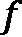定义为预测概率分数，它将在以后被 LIME 框架使用:

```
predict_fn = lambda x: model.predict_proba(x)
```

为了提供模型解释，我们可以定义 LIME 对象，并用几行代码解释所需的数据实例:

```
explainer = lime.lime_tabular.LimeTabularExplainer(
```

```
    data[features.columns].astype(int).values, 
```

```
    mode='classification', 
```

```
    training_labels=data['Survived'],
```

```
    feature_names=features.columns)
```

```
exp = explainer.explain_instance(
```

```
    data.loc[i,features.columns].astype(int).values, 
```

```
    predict_fn, num_features=5)
```

```
exp.show_in_notebook(show_table=True)
```

下图显示了 LIME 为模型可解释性提供的可视化:


图 4.6-由 LIME 框架提供的解释模型结果的可视化

从*图 4.6* 中，我们可以看到 LIME 框架提供的解释，只有几行代码。现在，让我们试着理解可视化告诉我们什么:

*   最左边的条形图向我们展示了预测概率，它可以被视为模型在进行预测时的置信度。在*图 4.6* 中，对于选定的数据实例，模型 100%确信特定乘客将*幸存*。
*   左边第二个可视化可能是最重要的可视化，提供了最大的可解释性。它告诉我们，最重要的特性是`Sex`特性，特性重要性分数为 38%，其次是`Age,`，特性重要性分数为 26%。然而，如*图 4.6* 所示，对于选定的数据实例，`Sex`、`Pclass`(乘客等级)、`Fare`和`Embarked_C`(瑟堡装载港)特征以及从整个数据集学习到的阈值分数对*生存*的模型结果有贡献。相比之下，以蓝色突出显示的`Age`功能更倾向于预测结果，因为*没有在*中幸存，因为特定乘客的年龄为 38 岁，通常情况下，38 岁以上的乘客在灾难中幸存的几率较低。LIME 模型学习到的阈值特征值也与我们自己的常识和*先验知识相一致。即使在 100 多年前发生的泰坦尼克号沉没的真实事件中，妇女和儿童也优先选择使用有限的救生艇逃离沉船。*

同样，支付较高票价的头等舱乘客更倾向于乘坐救生艇，因此生还的几率更大。所以，提供的模型解释是对人类友好的，并且与我们先前的信念一致。

*   左起第三个可视化显示了前五个特性及其各自的值。这里，以橙色高亮显示的要素对类 1 有贡献，而以蓝色高亮显示的要素对类 0 有贡献。
*   最右边的可视化几乎与第二个可视化相同，只是它以不同的格式呈现，并且它还为所选的特定数据实例提供了本地解释。

正如我们在上一节中讨论的，LIME 还提供了对模型的全局理解以及本地解释。这是使用 SP-LIME 算法提供的。这可以使用以下代码行来实现:

```
sp_exp = submodular_pick.SubmodularPick(
```

```
   explainer, data[features.columns].values, predict_fn,
```

```
   num_features=5, num_exps_desired=10)
```

```
[exp.as_pyplot_figure(label=exp.available_labels()[0]) for exp in sp_exp.sp_explanations]
```

*图 4.7* 显示了使用 SP-LIME 获得的可视化效果:


图 4.7-从 SP-LIME 获得的不同解释的可视化，以获得对模型的整体理解

*图 4.7* 显示了SP-LIME 代码的输出。SP-LIME 考虑模型的不同实例，提供了不同的代表性样本集的局部解释，以获得黑盒模型的全局视角。这些可视化向我们展示了重要的特征、特征重要性分数，甚至每个特征的值的范围，以及这些特征如何对任一类做出贡献。整个 LIME 框架的所有这些属性和特性使其成为一种强大的方法，可以为黑盒模型提供与模型无关的人类可理解的模型可解释性。此外，该框架还非常健壮，因此整个算法只需几行代码就可以实现。

虽然 LIME 有很多优点，但不幸的是，这种算法也有一些我们应该意识到的缺点。让我们在下一节讨论它们。

# 潜在陷阱

在前面的小节中，我们学习了如何轻松地使用 LIME Python 框架来解释分类问题的黑盒模型。但遗憾的是，该算法确实有一定的局限性，有几个场景该算法无效:

*   虽然提供了可解释的解释，但是对可解释的数据表示和可解释的模型的特定选择可能仍然有许多限制。虽然基础的训练模型可能仍然被认为是黑盒模型，但是在解释过程中没有关于模型的假设。但是，某些表示不够强大，不足以表示模型的一些复杂行为。例如，如果我们试图构建一个图像分类器来区分黑白图像和彩色图像，那么超像素的存在与否将无助于提供解释。
*   如前所述，LIME 学习了一个可解释的模型来提供本地解释。通常，这些可解释的模型是线性且不复杂的。然而，假设基础黑盒模型不是线性的，即使在预测的局部性，因此 LIME 算法是无效的。
*   石灰解释对输入数据的任何变化都非常敏感。即使是输入数据的微小变化也会极大地改变 LIME 提供的解释实例。
*   对于某些数据集，时间解释并不可靠，因为即使对于相似的数据实例，所提供的解释也可能完全不同。这可能会阻止最终用户完全依赖 LIME 提供的解释。
*   该算法极易产生数据漂移和标签漂移。训练数据和推断数据之间的微小偏差可能会产生完全不一致的解释。名为*LIME 框架中数据和标签转移的研究*、*拉赫纳马*和*博斯特罗姆*的论文作者(https://arxiv . org/ABS/1910.14421)提到了某些可用于评估 LIME 框架中数据漂移影响的实验。由于这种限制，石灰解释的近似度(也称为*保真度*)被认为较低。这在一个好的解释方法中是不期望的。
*   LIME 提供的解释取决于算法的超参数的选择。类似于大多数算法，甚至对于 LIME 算法，超参数的选择可以决定所提供的解释的质量。超参数调整对于 LIME 算法也是困难的，因为通常采用定性方法来评估 LIME 解释的质量。

有许多研究工作指出了 LIME 算法的其他局限性。我已经在*参考文献*部分提到了其中的一些研究工作。我强烈建议您浏览这些论文，以获得关于该算法某些限制的更多细节。

# 总结

这就把我们带到了本章的结尾。在这一章中，我们讨论了 LIME，它是 XAI 最广泛采用的框架之一。在这一章中，我们讨论了算法工作背后的直觉和算法的一些重要属性，这些属性使得生成的解释对人友好。此外，我们还看到了一个端到端的教程，讲述了如何在实际用例中使用 LIME 来为黑盒分类模型提供可解释性。尽管我们讨论了 LIME 算法的一些局限性，但由于其简单性，LIME 仍然是最流行和最广泛使用的 XAI 框架之一。因此，对我们来说，讨论这个算法并彻底理解框架的工作原理是非常重要的。

在下一章中，我们将使用不同类型的数据集，应用 LIME 框架来解决其他类型的机器学习问题。

# 参考文献

有关更多信息，请参考以下资源:

*   “我为什么要相信你？”解释任何分类器的预测由*里贝罗等人*:[https://arxiv.org/pdf/1602.04938.pdf](https://arxiv.org/pdf/1602.04938.pdf)
*   *石灰-局部可解释模型不可知的解释*:【https://homes.cs.washington.edu/~marcotcr/blog/lime/ 
*   LIME GitHub 项目:[https://github.com/marcotcr/lime](https://github.com/marcotcr/lime)
*   *https://arxiv.org/abs/1910.14421*拉赫纳马*和*博斯特伦* : [对石灰框架](https://arxiv.org/abs/1910.14421)*中数据和标签移动的研究
*   *酸橙怎么了*:[https://towards data science . com/whats-mist-with-LIME-86b 335 f 34612](https://towardsdatascience.com/whats-wrong-with-lime-86b335f34612)
*   *为什么建模为什么？评估石灰的优点和局限性*作者:*迪伯*和*基兰*(2020):[https://arxiv.org/pdf/2012.00093.pdf](https://arxiv.org/pdf/2012.00093.pdf)