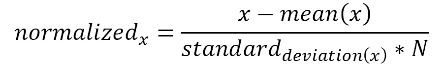

# 五、LIMEML 实战

读完上一章后，你现在应该对**局部可解释的模型不可知解释(LIME)** 有了很好的概念性理解。我们看到了 LIME Python 框架如何解释分类问题的黑盒模型。我们还讨论了 LIME 框架的一些优点和缺点。在实践中，LIME 仍然是最受欢迎的 XAI 框架之一，因为它可以很容易地应用于表格数据集以及文本和图像数据集。LIME 可以为解决回归和分类问题提供与模型无关的局部解释。

在这一章中，你将更深入地接触到在 ML 中使用 LIME。这是本章讨论的主要话题:

*   对表格数据使用 LIME
*   用 LIME 解释图像分类器
*   对文本数据使用 LIME
*   生产级系统的 LIME

# 技术要求

像前一章一样，这一章是非常技术性的，包括 Python 和 Jupyter 笔记本中的代码遍历。本章的代码和数据集资源可以从 GitHub 资源库下载或克隆:[https://GitHub . com/packt publishing/Applied-Machine-Learning-explability-Techniques/tree/main/chapter 05](https://github.com/PacktPublishing/Applied-Machine-Learning-Explainability-Techniques/tree/main/Chapter05)。像前面的章节一样，我们将使用 Python 和 Jupyter 笔记本来运行代码并生成必要的输出。笔记本中提供了所有其他相关的详细信息，我建议大家在阅读本章内容的同时运行笔记本，以便更好地理解所涵盖的主题。

# 在表格数据上使用 LIME

在第四章的*使用 LIME 解决分类问题的实例*部分，我们讨论了如何在 Python 中设置 LIME，以及如何使用 LIME 解释分类 ML 模型。 [*第四章*](B18216_04_ePub.xhtml#_idTextAnchor076) *、模型可解释性时间*([https://github . com/packt publishing/Applied-Machine-Learning-explability-Techniques/blob/main/Chapter 04/Intro _ to _ LIME . ipynb](https://github.com/PacktPublishing/Applied-Machine-Learning-Explainability-Techniques/blob/main/Chapter04/Intro_to_LIME.ipynb))中的教程使用的数据集是一个表格结构数据。在本节中，我们将讨论使用 LIME 来解释基于表格数据的回归模型。

## 设置 LIME

在开始代码演练之前，我想请你查看下面的笔记本，[https://github . com/packt publishing/Applied-Machine-Learning-explability-Techniques/blob/main/chapter 05/LIME _ with _ tabular _ data . ipynb](https://github.com/PacktPublishing/Applied-Machine-Learning-Explainability-Techniques/blob/main/Chapter05/LIME_with_tabular_data.ipynb)，其中已经包含了理解我们现在将要更深入讨论的概念所需的步骤。我假设我们将在本教程中使用的大多数 Python 库已经安装在您的系统上。如果没有，请运行以下命令来安装我们将要使用的 Python 库的升级版本:

```py
!pip install --upgrade pandas numpy matplotlib seaborn scikit-learn lime
```

## 关于数据集的讨论

对于本教程，我们将使用来自 *scikit-learn 数据集*([https://scikit-learn . org/stable/datasets/toy _ dataset . html # Diabetes-dataset](https://scikit-learn.org/stable/datasets/toy_dataset.html#diabetes-dataset))的*糖尿病数据集*。该数据集用于预测糖尿病的*疾病进展水平*。它包含大约 *442 个样本*，具有 *10 个基线特征*—*年龄*、*性别*、*体重指数(bmi)* 、*平均血压(bp)* 、*血清总胆固醇(s1)* 、*低密度脂蛋白(s2)* 、*高密度脂蛋白(s3)* 考虑到监测糖尿病进展的潜在问题是一个重要的实际问题，该数据集非常有趣且相关。

数据集中提供的特征变量已经通过以平均值为中心的特征值进行归一化，并通过标准偏差乘以样本数(N)进行缩放:



关于原始数据集的更多信息可以在[https://www4.stat.ncsu.edu/~boos/var.select/diabetes.html](https://www4.stat.ncsu.edu/~boos/var.select/diabetes.html)找到。

要加载数据集，只需执行以下代码行:

```py
from sklearn import datasets
```

```py
dataset = datasets.load_diabetes()
```

```py
features, labels = dataset.data, dataset.target
```

如果需要的话，您可以执行必要的 EDA 步骤，但是由于我们的主要重点是使用 LIME 来解释黑盒模型，因此出于本教程的目的，我们不会在 EDA 上花费太多精力。

## 关于模型的讨论

正如笔记本教程中所演示的，我们使用了一个**梯度推进回归器**(**GBR**)([https://scikit-learn . org/stable/modules/generated/sk learn . ensemble . gradientboostingregressor . html](https://scikit-learn.org/stable/modules/generated/sklearn.ensemble.GradientBoostingRegressor.html))模型来训练我们的预测模型。然而，可以使用任何回归 ML 算法来代替 GBR，因为模型本身被 LIME 算法视为任何黑盒模型。此外，当我们在看不见的数据上评估训练的模型时，我们观察到 0.37 的**平均绝对百分比误差(MAPE)** ，2538 的**均方误差(MSE)** ，以及 0.6 的 **R 平方系数**。所有这些结果表明，我们的模型不是很好，肯定有改进的空间。因此，如果这样的模型被部署在生产级系统中，最终的涉众可能会问很多问题，因为他们总是很难信任不准确的模型。此外，诸如 GBR 的算法不是固有可解释的，并且算法的复杂性取决于超参数，包括估计器的数量和树的深度。因此，像 LIME 这样的模型可解释性框架不仅仅是一个附加步骤，而是构建 ML 模型过程中的一个必要部分。接下来，我们将看到用几行代码来解释黑盒回归模型是多么容易。

## LIME 的应用

正如我们在上一章中所看到的，我们可以通过以下命令轻松支持表格数据的 LIME 框架:

```py
import lime
```

```py
import lime.lime_tabular
```

一旦 LIME 模块成功导入，我们将需要创建一个 explainer 对象:

```py
explainer = lime.lime_tabular.LimeTabularExplainer(
```

```py
    x_train, mode='regression',
```

```py
    class_names=['disease_progression'],
```

```py
    feature_names=dataset.feature_names)
```

然后，我们只需要获取数据实例并为其提供本地可解释性:

```py
exp = explainer.explain_instance(x_test[i], model.predict, 
```

```py
                                 num_features=5)
```

```py
exp.show_in_notebook(show_table=True)
```

我们将从前面的代码行中获得以下输出:


图 5.1–应用于表格数据集上训练的回归模型时，LIME 框架的输出可视化

*图 5.1* 展示了 LIME 框架提供的基于可视化的解释。

接下来，让我们试着理解*图 5.1* 中的输出可视化告诉我们什么:

*   图 5.1 最左边的可视化图显示了一系列可能的值和模型预测结果的位置。直观地说，所有模型预测应该位于最小和最大可能值内，因为这向用户指示将当前预测与最佳情况和最差情况值进行比较。
*   中间的可视化显示哪些特征有助于预测偏高或偏低。考虑到我们以前对糖尿病的了解，较高的身体质量指数，以及升高的血压和血清甘油三酯水平，确实表明该疾病的进展加快。
*   *图 5.1* 中最右边的可视化图向我们展示了已识别的最重要特征的实际本地数据值，按相关性降序排列。

LIME 框架提供的解释在很大程度上是人类可以解释的，并且确实给了我们黑盒模型用来进行预测的特征值对的指示。

因此，这就是我们如何使用 LIME 来解释黑盒回归模型，该模型是在表格数据上训练的，只需要几行代码。但是，正如我们在 [*第 4 章*](B18216_04_ePub.xhtml#_idTextAnchor076)*中讨论的，在*潜在陷阱*部分，LIME 提供的解释并不总是全面的，可能会有一些不一致。这是我们都需要注意的事情。然而，LIME 解释，加上彻底的 EDA、以数据为中心的 XAI、反事实解释和其他模型解释方法，可以为在表格数据集上训练的黑盒模型提供强大的整体解释能力。*

现在，让我们在下一节中探索如何将 LIME 用于在非结构化数据(如图像)上训练的分类器。

# 用 LIME 解释图像分类器

在上一节中，我们已经看到了如何轻松地应用 LIME 来解释基于表格数据训练的模型。然而，主要的挑战总是在解释基于图像等非结构化数据训练的复杂深度学习模型时出现。通常，深度学习模型在图像数据上比传统的 ML 模型更有效，因为这些模型具有执行*自动特征提取*的能力。他们可以提取复杂的*低层特征*如*条纹*、*边缘*、*轮廓*、*边角*、*图案*，甚至*高层特征*如*较大的形状*和*物体的某些部分*。这些更高级的特征通常被称为图像中的**感兴趣区域****【RoI】**，或者**超像素**，因为它们是覆盖图像特定区域的图像的像素集合。现在，低级特征不是人类可解释的，但是高级特征是人类可解释的，因为任何非技术终端用户都将关于高级特征来联系图像。LIME 也以类似的方式工作。该算法试图突出显示图像中对模型决策过程有积极或消极影响的超像素。那么，让我们看看如何使用 LIME 来解释图像分类器。

## 设置所需的 Python 模块

在我们开始代码演练之前，请检查代码库中提供的笔记本:[https://github . com/packt publishing/Applied-Machine-Learning-explability-Techniques/blob/main/chapter 05/LIME _ with _ image _ data . ipynb](https://github.com/PacktPublishing/Applied-Machine-Learning-Explainability-Techniques/blob/main/Chapter05/LIME_with_image_data.ipynb)。笔记本包含实际应用这些概念所需的必要细节。在这一节中，我将向您演示代码，并解释笔记本教程中涵盖的所有步骤。如果尚未安装 Python 库的升级版本，请使用以下命令进行安装:

```py
!pip install --upgrade pandas numpy matplotlib seaborn tensorflow lime scikit-image
```

接下来，我们来讨论一下这个例子中使用的模型。

## 使用预训练的 TensorFlow 模型作为我们的黑盒模型

对于本教程，我们使用了一个*预训练的 TensorFlow Keras 异常模型*作为我们的黑盒模型。该模型在 ImageNet 数据集(【https://www.image-net.org/】T2)上进行预训练，这是最流行的图像分类基准数据集之一。预训练模型可以加载以下代码行:

```py
from tensorflow.keras.applications.xception import Xception
```

```py
model = Xception(weights="imagenet")
```

为了使用任何推断数据进行图像分类，我们还需要执行必要的预处理步骤。请参考[https://github . com/packt publishing/Applied-Machine-Learning-explability-Techniques/blob/main/chapter 05/LIME _ with _ image _ data](https://github.com/PacktPublishing/Applied-Machine-Learning-Explainability-Techniques/blob/main/Chapter05/LIME_with_image_data)的笔记本。ipynb 获取必要的预处理方法。

## LIME 图像解释器的应用

在这一小节中，我们将了解如何使用 LIME 框架从模型使用的图像中识别*超像素*或区域，以预测具体结果。我们首先需要定义一个图像`explainer`对象:

```py
explainer = lime_image.LimeImageExplainer()
```

接下来，我们需要将推断数据(`normalized_img[0]`)传递给`explainer`对象，并使用 LIME 框架来突出显示对模型预测有最大积极和消极影响的超像素:

```py
exp = explainer.explain_instance(normalized_img[0], 
```

```py
                                 model.predict, 
```

```py
                                 top_labels=5, 
```

```py
                                 hide_color=0, 
```

```py
                                 num_samples=1000)
```

```py
image, mask = exp.get_image_and_mask(exp_class, 
```

```py
                                     positive_only=False,
```

```py
                                     num_features=6,
```

```py
                                     hide_rest=False,
```

```py
                                     min_weight=0.01)
```

```py
plt.imshow(mark_boundaries(image, mask))
```

```py
plt.axis('off')
```

```py
plt.show()
```

作为前面行代码的输出，我们将获得图像中某些突出显示的部分，这些部分有助于模型的预测，包括正面和负面两种方式:


图 5.2-(左)原始推理图像。(中间)最重要的图像超像素。(右)原始数据上叠加了遮罩超像素的图像以绿色突出显示

在*图 5.2* 中，最左边的图像被用作推理图像。当训练好的模型被应用于推理图像时，模型的最高预测是一条*虎鲨*。

这个预测实际上是正确的。但是，为了解释模型，LIME 算法可以突出对预测影响最大的超像素。从图 5.2 的中间和最右边的图像中，我们可以看到黑盒模型实际上是好的和可信的，因为 LIME 算法捕获的相关超像素表明虎鲨的存在。

由 LIME 算法估计的超像素可以使用以下代码行显示:

```py
plt.imshow(exp.segments)
```

```py
plt.axis('off')
```

```py
plt.show()
```

我们还可以形成一个热图，突出显示每个超像素的重要性，让我们进一步了解黑盒模型的功能:

```py
dict_heatmap = dict(exp.local_exp[exp.top_labels[0]])
```

```py
heatmap = np.vectorize(dict_heatmap.get)(exp.segments) 
```

```py
plt.imshow(heatmap, cmap = 'RdBu', vmin  = -heatmap.max(),
```

```py
           vmax = heatmap.max())
```

```py
plt.colorbar()
```

```py
plt.show()
```

得到的输出是图 5.3 中*所示的:*


图 5.3–左图显示了 LIME 算法拾取的所有超像素。(右)超级像素的热图，基于它们在模型预测方面的重要性

来自*图 5.3* 的热图让我们对重要的超像素有了一些了解，这对于任何非技术用户来说解释任何黑盒模型也是容易的。

因此，我们已经看到了 LIME 如何在短短几行代码中解释甚至复杂的基于图像数据训练的深度学习模型。我发现 LIME 是最有效的算法之一，可以直观地解释基于深度学习的图像分类器，而无需提供任何复杂的统计或数值或复杂的图形可视化。与表格数据不同，我觉得提供给图像分类器的解释更健壮、更稳定、更容易被人理解。这绝对是我最喜欢的解释图像分类器的方法之一，在将任何图像分类模型投入生产之前，我强烈建议应用 LIME 作为一个附加的评估步骤，以获得对训练模型的更多信心。

在下一节中，让我们探索一下基于文本数据训练的模型的 LIME。

# 在文本数据上使用 LIME

在上一节中，我们讨论了 LIME 如何成为解释在图像数据集上训练的复杂黑盒模型的有效方法。像图像一样，文本也是非结构化数据的一种形式，这与结构化表格数据有很大不同。解释这种在非结构化数据上训练的黑盒模型总是非常具有挑战性。但是 LIME 也可以应用于在文本数据上训练的模型。

使用 LIME 算法，我们可以分析特定单词或词组的存在是否会增加预测特定结果的概率。换句话说，LIME 有助于突出文本标记或单词的重要性，这些标记或单词可以影响模型对特定类的结果。在这一节中，我们将看到如何使用 LIME 来解释文本分类器。

## 安装所需的 Python 模块

和前面的教程一样，完整的笔记本教程可以在[https://github . com/packt publishing/Applied-Machine-Learning-explability-Techniques/blob/main/chapter 05/LIME _ with _ text _ data . ipynb](https://github.com/PacktPublishing/Applied-Machine-Learning-Explainability-Techniques/blob/main/Chapter05/LIME_with_text_data.ipynb)获得。虽然运行笔记本所需的必要说明在笔记本本身中有明确的记录，但与前面的教程类似，我将提供必要的细节来指导您完成实现。使用以下命令，您可以安装运行代码所需的模块:

```py
!pip install --upgrade pandas numpy matplotlib seaborn scikit-learn nltk lime xgboost swifter
```

对于底层数据集上与文本相关的操作，我将主要使用 NLTK Python 框架。因此，您需要通过执行以下命令来下载某些`nltk`模块:

```py
nltk.download('stopwords')
```

```py
nltk.download('wordnet')
```

```py
nltk.download('punkt')
```

```py
nltk.download('averaged_perceptron_tagger')
```

在本教程中，我们将尝试解释一个文本分类器，该分类器通过将文本数据分为肯定和否定两类来执行情感分析。

## 关于用于训练模型的数据集的讨论

对于本教程，我们使用了由*电影评论*组成的**情感极性数据集 v2.0** ，用于从文本数据进行情感分析。该数据集由大约 1000 个正面和负面的电影评论样本组成。关于数据集的更多信息可以在源网站上找到:[https://www.cs.cornell.edu/people/pabo/movie-review-data/](https://www.cs.cornell.edu/people/pabo/movie-review-data/)。本章的 GitHub 资源库中也提供了数据集:[https://GitHub . com/packt publishing/Applied-Machine-Learning-explability-Techniques/tree/main/chapter 05](https://github.com/PacktPublishing/Applied-Machine-Learning-Explainability-Techniques/tree/main/Chapter05)。

情感极性数据集 v2.0

这个数据首先被用于庞博和莉莲·李，“一个感性的教育:使用基于最小截集的主观性摘要的情感分析”，2004 年 ACL 会议录。

## 关于文本分类模型的讨论

与之前的图像分类器教程不同，我们没有使用预训练的模型。我们已经从头开始训练了一个 **XGBoost 分类器**(【https://xgboost.readthedocs.io/en/stable/】T2)，使用了必要的数据预处理、准备和特征提取步骤，如笔记本中所述。XGBoost 是一种集成学习增强算法，它本身是不可解释的。因此，我们将把它视为我们的黑盒文本分类模型。我们并不专注于通过必要的超参数调整来提高模型的准确性，因为 LIME 是完全与模型无关的。对于本教程，我们创建了一个 scikit-learn 管道，首先使用 **TFIDF 矢量器**(https://scikit-learn . org/stable/modules/generated/sk learn . feature _ extraction . text . tfi df 矢量器. html)应用特征提取，然后是训练好的模型:

```py
model_pipeline = make_pipeline(tfidf, model)
```

在下一小节中，我们将看到如何轻松地将 LIME 框架应用于文本数据。

## 应用 LIME 文本讲解器

就像前面的教程中的图像和表格数据一样，应用 LIME 很简单，只需几行代码就可以处理文本数据。我们现在将定义 LIME `explainer`对象:

```py
from lime.lime_text import LimeTextExplainer
```

```py
explainer = LimeTextExplainer(class_names=['negative', 'positive'])
```

然后，我们将使用推理数据实例为该特定数据实例提供本地可解释性:

```py
exp = explainer.explain_instance(x_test_df[idx], model_pipeline.predict_proba, num_features=5)
```

```py
exp.show_in_notebook()
```

就是这样！在短短几行代码中，我们可以解释实际上依赖于 TFIDF 数字特征的文本分类器，但这种可解释性是从人类可解释的角度提供的，因为可以对模型结果产生积极或消极影响的单词被突出显示。对于任何非技术用户来说，以这种方式理解文本模型的工作比使用数字编码的特征来提供解释更容易。

现在，让我们看看 LIME 在应用于文本数据时提供的输出可视化。


图 5.4–将 LIME 应用于文本分类器时的输出可视化

在*图 5.4* 中，我们可以看到 LIME 框架应用于文本数据时的输出可视化。

输出可视化与我们观察到的表格数据非常相似。它向我们展示了*预测概率*，它可以作为*模型置信度*的得分。该算法突出显示了决定模型结果的最有影响力的单词，以及特征重要性分数。例如，从*图 5.4* 中，我们可以看到推理数据实例被模型预测为负(如笔记本中演示的那样，预测正确)。出现*废*、*坏*、*可笑*等字眼，确实表示一个*负面评论*。这也是人类可以理解的，因为如果你让一个非技术用户解释为什么评论被归类为负面，用户可能会提到负面评论中频繁使用的词或带有负面语气的句子中使用的词。

因此，我们可以看到，LIME 也可以很容易地应用于文本分类器。即使是文本数据，算法也很简单，但在提供人类可理解的解释方面很有效。我肯定会推荐使用 LIME 来解释黑盒文本分类器，作为一个额外的模型评估或质量检查步骤。

但到目前为止，我们已经看到了 LIME Python 框架在 Jupyter 笔记本环境中的应用。你可能会有一个迫在眉睫的问题—*我们能否将 LIME 用于生产级系统？*让我们在下一节了解一下。

# 生产级系统的 LIME

在最后一部分末尾张贴的问题的简短回答是*是的*。由于以下主要原因，LIME 肯定可以扩展用于生产级系统:

*   **最小实现复杂度**:LIME Python 框架的 API 结构简洁，结构良好。这使得我们只需要几行代码就可以增加模型的可解释性。对于为推理数据实例提供本地可解释性，LIME 算法的运行时复杂性非常低，因此，这种方法也可以用于实时应用。
*   **易于与其他软件应用集成**:框架的 API 结构是模块化的。对于消费可解释性结果，我们不需要仅仅依赖框架提供的内置可视化。我们可以利用原始的可解释性结果，并创建我们自己的定制可视化仪表板或报告。此外，我们可以创建定制的 web API 方法，并将 web API 托管在远程云服务器上，从而创建我们自己的模型可解释的基于云的服务，该服务可以轻松地与其他软件应用集成。我们将在 [*第十章*](B18216_10_ePub.xhtml#_idTextAnchor209) 、 *XAI 行业最佳实践*中对此进行更详细的介绍。
*   **不需要大量的计算资源**:LIME 框架在计算资源较少的情况下工作良好。对于实时应用，所使用的算法需要非常快，并且应该具有在低计算资源上运行的能力，否则，用户体验会受到影响。
*   **易于设置和打包**:正如我们在运行教程笔记本之前已经看到的，LIME 非常易于设置，并且不依赖于难以安装的包。类似地，任何使用 LIME 的 Python 程序都很容易打包或**容器化**。大多数生产级系统都有自动化的 CI/CD 管道来创建 **Docker 容器**(https://www . Docker . com/resources/what-container)，部署在生产级系统上。使用 LIME 框架封装 Python 程序所需的工程工作量很低，因此很容易生产这样的软件应用。

这些就是为什么 LIME 是工业应用中首选的模型解释方法的关键原因，尽管它有一些众所周知的缺陷。

# 总结

在本章中，我们讨论了 LIME Python 框架在不同类型数据集上的实际应用。本章中的教程只是一个起点，我强烈建议你在其他数据集上尝试 LIME explainability。我们还讨论了为什么 LIME 非常适合生产级 ML 系统。

在下一章，我们将讨论另一个非常流行的可解释的人工智能 Python 框架，称为 **SHAP** ，它甚至考虑了影响模型结果的多个特征的集体贡献。

# 参考文献

请参考以下资源以获取更多信息:

*   “我为什么要相信你？”解释任何分类器的预测，作者*里贝罗等人*:[https://arxiv.org/pdf/1602.04938.pdf](https://arxiv.org/pdf/1602.04938.pdf)
*   *本地可解释模型不可知解释(LIME):简介*:[https://www . oreilly . com/content/Introduction-to-Local-可解释模型不可知解释-lime/](https://www.oreilly.com/content/introduction-to-local-interpretable-model-agnostic-explanations-lime/)
*   *LIME GitHub 项目*:【https://github.com/marcotcr/lime 
*   *Docker 博客*:【https://www.docker.com/blog/ 