# 六、使用 SHAP 的模型可解释性

在前两章中，我们使用 **LIME** 框架来解释黑盒模型，探索了模型不可知的局部可解释性。我们还讨论了 LIME 方法的某些局限性，尽管它仍然是最流行的**可解释 AI** ( **XAI** )算法之一。在这一章中，我们将介绍**SHapley Additive explain**(**SHAP**)，这是另一个流行的 XAI 框架，可以为表格、图像和文本数据集提供与模型无关的局部可解释性。

**SHAP** 是基于**沙普利值**的，沙普利值是**博弈论**([https://c3.ai/glossary/data-science/shapley-values/](https://c3.ai/glossary/data-science/shapley-values/))中普遍使用的概念。尽管对 Shapley 值的数学理解可能很复杂，但我将提供对 Shapley 值和 SHAP 的简单、直观的理解，并更多地关注该框架的实际方面。与LIME相似，SHAP 也有它的利与弊，这我们将在本章中讨论。本章将涵盖一个实用教程，将解释使用 SHAP 回归模型。稍后，在 [*第 7 章*](B18216_07_ePub.xhtml#_idTextAnchor128) 、*在 ML 中使用 SHAP 的实际暴露*中，我们将涵盖 SHAP 框架的其他实际应用。

因此，这是本章讨论的主要话题列表:

*   对 SHAP 和沙普利值的直观理解
*   使用 SHAP 的模型解释方法
*   优点和局限性
*   用 SHAP 解释回归模型

现在，让我们开始吧！

# 技术要求

包含必要资源的代码教程可以从本章的 GitHub 资源库下载或克隆:[https://GitHub . com/packt publishing/Applied-Machine-Learning-explability-Techniques/tree/main/chapter 06](https://github.com/PacktPublishing/Applied-Machine-Learning-Explainability-Techniques/tree/main/Chapter06)。Python 和 Jupyter 笔记本用于实现本章所涵盖的理论概念的实际应用。但是我建议你在阅读完这一章后，再运行笔记本，以便更好地理解。另外，在继续本章的实用教程部分之前，请查看 *SHAP 勘误表*部分:[https://github . com/packt publishing/Applied-Machine-Learning-explability-Techniques/blob/main/chapter 06/SHAP _ 勘误表/ReadMe.md](https://github.com/PacktPublishing/Applied-Machine-Learning-Explainability-Techniques/blob/main/Chapter06/SHAP_ERRATA/ReadMe.md) 。

# 对 SHAP 和沙普利价值观的直观理解

正如在 [*第一章*](B18216_01_ePub.xhtml#_idTextAnchor014)*可解释技术的基本概念*中所讨论的，解释黑盒模型是增加 AI 采用的必要条件。模型不可知的算法可以提供局部的可解释性和全局的观点，是机器学习中可解释性技术的理想选择。这就是LIME在 XAI 广受欢迎的原因。SHAP 是 ML 中可解释技术的另一个流行选择，在某些场景中，它比 LIME 更有效。在这一节中，我们将讨论对 SHAP 框架的直观理解，以及它是如何提供模型可解释性的。

## SHAP 和沙普利价值观简介

SHAP 框架是由*斯科特·伦德伯格*和*苏英·李*在他们的研究工作中引入的，*一种解释模型预测的统一方法*([https://arxiv.org/abs/1705.07874](https://arxiv.org/abs/1705.07874))。这是 2017 年发表的。SHAP 基于合作博弈论中的 Shapley 值概念，但与 LIME 框架不同，它考虑了*加性特征重要性*。根据定义，Shapley 值是特征空间中所有可能值的每个特征值的平均边际贡献*。对 Shapley 值的数学理解很复杂，可能会让大多数读者感到困惑。也就是说，如果你有兴趣深入了解沙普利值的数学知识，我们建议你看看名为*“n 人游戏的价值”的研究论文对博弈论的贡献 2.28 (1953)，作者罗伊德·S·沙普利*。在下一节中，我们将通过一个非常简单的例子来直观地了解 Shapley 值。*

## 什么是沙普利值？

在这一节，我将用一个非常简单易懂的例子来解释 Shapley 值。让我们假设 Alice、Bob 和 Charlie 是三个朋友，他们作为一个团队参加了一场 Kaggle 比赛，以解决给定的 ML 问题，并获得一定的现金奖励。他们的共同目标是赢得比赛，获得奖金。他们三个在 ML 的所有领域都同样不好，因此，以不同的方式做出了贡献。现在，如果他们赢得比赛并赢得奖金，*考虑到他们个人的贡献，他们将如何确保奖金的公平分配？* *他们如何衡量自己为同一个目标做出的贡献？*这些问题的答案可以用 Shapley 值来给出，Shapley 值是劳埃德·沙普利(Lloyd Shapley)在 1951 年提出的。

下图直观地展示了这种情况:


图 6.1–什么是 Shapley 值？部分

因此，在这个场景中，Alice、Bob 和 Charlie 属于同一个团队，玩同一个游戏(即 Kaggle 竞赛)。在博弈论中，这被称为联盟博弈。比赛的奖金是他们的*支出*。因此，Shapley 值告诉我们每个玩家对确保公平分配的支出的平均贡献。但是为什么不在所有玩家之间平均分配奖金呢？嗯，既然贡献不对等，那么平均分配这笔钱是不公平的。

### 决定支出

现在，我们如何决定最公平的分配方式呢？一种方法是假设 Alice、Bob 和 Charlie 按顺序加入游戏，Alice 先开始，Bob 接着，Charlie 接着。让我们假设，如果爱丽丝、鲍勃和查理单独参与，他们将分别获得 10 分、20 分和 25 分。但如果爱丽丝和鲍勃联手，他们可能会得到 40 分。爱丽丝和查理一起可以得到 30 分，鲍勃和查理一起可以得到 50 分。当他们三个一起合作时，只有这样他们才能得到 90 分，这足以让他们赢得比赛。

*图 6.2* 显示了每种情况下的分值。我们将利用这些值来计算每个玩家的平均边际贡献:


图 6.2–所有参与者的所有可能组合的贡献值

数学上，如果我们假设有 *N* 个玩家，其中 *S* 是玩家的联盟子集，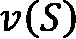是 *S* 个玩家的总价值，那么通过 Shapley 值公式，玩家 *i* 的边际贡献给出如下:

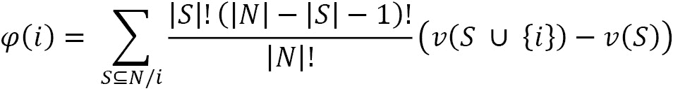

Shapley 值的方程可能看起来很复杂，但是让我们用我们的例子来简化它。请注意，每个玩家开始游戏的顺序很重要，因为 Shapley 值试图考虑每个玩家计算边际贡献的顺序。

现在，对于我们的示例，可以通过计算爱丽丝对最终得分可能造成的差异来计算爱丽丝的贡献。因此，贡献是通过计算爱丽丝在游戏中和不在游戏中得分的差异来计算的。还有，当爱丽丝在玩的时候，她既可以独自玩，也可以和别人组队玩。爱丽丝在玩的时候，她能创造的价值可以表示为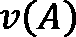。同样，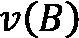和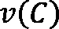表示鲍勃和查理创造的个人价值。现在，当 Alice 和 Bob 合作时，我们可以通过从总贡献中移除 Bob 的贡献来计算 Alice 的贡献。这可以表示为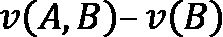。如果这三个人都一起玩，爱丽丝的贡献被给定为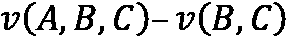。

考虑到爱丽丝、鲍勃和查理玩游戏的序列的所有可能排列，爱丽丝的边际贡献是她在所有可能场景中个人贡献的平均值。这在*图 6.3* 中进行了说明:


图 6.3-Alice 的 Shapley 值是她在考虑所有可能情况下的边际贡献

因此，Alice 的总贡献将是她在所有可能场景中的边际贡献，这也恰好是 Shapley 值。对于爱丽丝，沙普利值是 *20.83* 。同样，我们可以计算鲍勃和查理的边际贡献，如图*图 6.4* 所示:


图 6.4–爱丽丝、鲍勃和查理的边际贡献

我希望这不会太难理解！需要注意的一点是，Alice、Bob 和 Charlie 的边际贡献之和应该等于他们三个加在一起的总贡献。现在，让我们试着在 ML 的背景下理解 Shapley 值。

## 沙普利值，单位为毫升

为了理解 ML 中 Shapley 值对解释模型预测的重要性，我们将尝试修改我们用来理解 Shapley 值的关于 Alice、Bob 和 Charlie 的例子。我们可以认为爱丽丝、鲍勃和查理是用于训练模型的数据集中存在的*三个不同的特征。所以，在这种情况下，*玩家贡献*将是每个特性*的*贡献。*游戏*或 Kaggle 竞赛将是*黑盒 ML 模型*并且*支付*将是*预测*。因此，如果我们想知道*每个特征对模型预测*的贡献，我们将使用 *Shapley 值*。*

*图 6.5* 中说明了对*图 6.1* 的修改，以表示 ML 环境中的 Shapley 值:


图 6.5-在 ML 环境中理解 Shapley 值

因此，Shapley 值帮助我们理解每个特征对黑盒 ML 模型预测的结果的集体贡献。通过使用 Shapley 值，我们可以通过估计特征贡献来解释黑盒模型的工作。

### Shapley 值的性质

既然我们对 Shapley 值有了直观的了解，并且我们已经学习了如何计算 Shapley 值，我们还应该了解 Shapley 值的性质:

*   **效率**:Shapley 值的总和或者每个特征的边际贡献应该等于总联盟的价值。例如，在*图 6.4* 中，我们可以看到 Alice、Bob 和 Charlie 的 Shapley 值之和等于 Alice、Bob 和 Charlie 组队时获得的总联盟值。
*   **对称**:每个玩家都有公平的机会以任何顺序加入游戏。在*图 6.4* 中，我们可以看到考虑了所有玩家的所有序列排列。
*   **Dummy** :如果一个特定特征不改变预测值，不管联盟组如何，那么该特征的 Shapley 值为 *0* 。
*   **可加性**:对于任何有组合付款的游戏，沙普利值也会被组合。这被表示为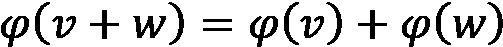，然后是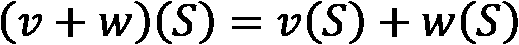。例如，对于 ML 中的随机森林算法，可以通过计算每棵树的 Shapley 值来计算特定要素的 Shapley 值，然后对其进行平均，以找到整个随机森林的附加 Shapley 值。

这些是 Shapley 值的重要性质。接下来，让我们讨论一下 SHAP 框架，理解它不仅仅是 Shapley 值的用法。

## SHAP 框架

之前，我们讨论了什么是 Shapley 值，以及如何在 ML 中使用它们。现在，让我们来看看 SHAP 框架。尽管 SHAP 被普遍用作 XAI 工具，为个体预测提供局部解释，SHAP 也可以通过聚合个体预测来提供全局解释。此外，SHAP 是*模型不可知的*，这意味着它不会对黑盒模型中使用的算法做任何假设。该框架的创建者大致提出了两种与模型无关的近似方法，如下所示:

*   **SHAP 解说**:这个是基于*沙普利采样值*。
*   **KernelSHAP 解说**:这个是基于*LIME法*。

框架还包括*模型特有的*可解释方法，如下所示:

*   **线性 SHAP** :这是具有独立特征的线性模型的。
*   **树 SHAP** :这是一种算法，比 SHAP 解释器为树算法和基于树的集成学习算法计算 SHAP 值要快。
*   **深度 SHAP** :这是一种比 SHAP 解释者计算深度学习模型的 SHAP 值更快的算法。

除了这些方法，SHAP 还使用有趣的可视化方法来解释人工智能模型。我们将在下一节更详细地介绍这些方法。但是需要注意的一点是，Shapley 值的计算在计算上是非常昂贵的，算法是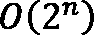的量级，其中 *n* 是特征的数量。因此，如果数据集有许多要素，计算 Shapley 值可能要花很长时间！然而，SHAP 框架使用一种近似技术来有效地计算沙普利值。与 LIME 框架相比，SHAP 提供的解释更具说服力。让我们继续下一节，我们将讨论 SHAP 在各种类型的数据上使用的各种模型可解释性方法。

# 使用 SHAP 对可解释性方法建模

读完上一节后，你已经对 SHAP 和沙普利价值观有所了解。在这一节中，我们将讨论使用 SHAP 的各种模型可解释性方法。数据可视化是解释复杂算法工作的重要方法。SHAP 利用各种有趣的数据可视化技术来表示近似的沙普利值，以解释黑盒模型。所以，让我们来讨论一下 SHAP 框架使用的一些流行的可视化方法。

## SHAP 的视觉化

如前所述,SHAP既可用于模型的的全局可解释性，也可用于推理数据实例的局部可解释性。现在，SHAP 算法产生的值很难理解，除非我们利用直观的形象化。可视化的选择取决于全局可解释性或局部可解释性的选择，我们将在本节中讨论。

### 功能重要性条形图的全局可解释性

分析数据集中存在的最有影响力的特征总是有助于我们理解算法相对于底层数据的功能。SHAP 提供了一种使用 Shapley 值寻找特征重要性的有效方法。因此，特性重要性栏图按照重要性降序显示重要特性。此外，使用**层次聚类**([https://www.displayr.com/what-is-hierarchical-clustering/](https://www.displayr.com/what-is-hierarchical-clustering/))，SHAP 提供了一种独特的方式来显示功能交互。这些特征聚类方法帮助我们可视化一组共同影响模型结果的特征。这非常有趣，因为使用 Shapley 值的核心好处之一是一起分析多个特征的附加影响。然而，对于全局可解释性来说，特征重要性图有一个缺点。由于该方法仅考虑平均绝对 Shapley 值来估计特征重要性，因此它不显示某些特征是否以负面方式影响模型。

下图显示了使用 SHAP 的特征重要性图和特征聚类图:


图 6.6–全局可解释性的特征重要性图(左侧)和全局可解释性的特征聚类图(右侧)

接下来，让我们探索 SHAP 组群图。

### 队列图的全局可解释性

有时，分析数据的子组是数据分析的重要部分。SHAP 提供了一种非常有趣的方法，将数据分组到特定的队列中，以分析特征的重要性。我发现这是 SHAP 的一个独特的选择，非常有用！这是现有特征重要性可视化的扩展，它突出了每个群组的特征重要性，以便更好地进行比较。

*图 6.7* 向我们展示了群组图，用于比较数据中定义的两个群组:


图 6.7–比较两个群组特征重要性的群组图可视化

接下来，我们将探索 SHAP 的热图。

### 热图的全球可解释性

为了在更精细的层次上理解所有特性对模型的整体影响，热图可视化非常有用。SHAP 热图可视化展示了每个特征值如何对结果产生积极或消极的影响。此外，该图还包括一个线形图，以显示模型预测如何随着特征值的积极或消极影响而变化。然而，对于非技术用户来说，这种可视化很难理解。这是这种可视化方法的缺点之一。

*图 6.8* 展示了一个 *SHAP 的热图可视化*:


图 6.8-SHAP 热图

另一个使用 SHAP 的全球可解释性可视化的流行选择是概要图。让我们在下一节讨论概要图。

### 具有汇总图的全局可解释性

概要图是SHAP 的另一种可视化方法，用于提供黑盒模型的全局可解释性。它很好地替代了要素重要性图，后者不仅包括重要的要素，还包括数据集中这些要素的影响范围。颜色条表示功能的影响。以积极方式影响模型结果的特征以特定颜色突出显示，而以另一种对比色表示对模型结果产生消极影响的特征。每个特征的水平小提琴图显示了每个数据实例的特征的 Shapley 值的分布。

下面的截图展示了一个 *SHAP 的概要情节*:


图 6.9-SHAP 小提琴概要图

在下一个部分，我们将讨论 SHAP 依赖图。

### 依赖图的全局可解释性

在某些场景中，分析特征之间的相互作用以及这种相互作用如何影响模型结果是很重要的。因此，SHAP 特征依赖图显示了特定特征的模型结果的变化。这些图类似于*部分依赖图*，在 [*第二章*](B18216_02_ePub.xhtml#_idTextAnchor033) 、*模型解释方法*中有所涉及。该图有助于获得特征值之间有趣的交互模式或趋势。基于与特定选定特征的交互，用于选择彩色地图的特征由算法自动拾取。

*图 6.10* 显示了一个 SHAP 依赖图:


图 6.10–pH 特性的 SHAP 依赖图

在这个例子中，选择的特征是 *pH* ，用于选择颜色图的特征是*酒精*。因此，该图告诉我们，随着 *pH 值*的增加，*酒精值*也会增加。这将在下一节中详细介绍。

在下一节中，让我们探索用于局部可解释性的 SHAP 可视化方法。

### 条形图的局部可解释性

到目前为止，我们已经介绍了 SHAP 提供的各种可视化技术，以提供模型的全局概览。然而，与 LIME 类似，SHAP 也是模型不可知的，即被设计成提供局部可解释性。SHAP 提供了某些可视化方法，这些方法可用于推断数据的局部可解释性。使用 SHAP 棒图的局部特征重要性是一种这样的局部可解释方法。这个图可以帮助我们分析数据中出现的特征的正面和负面影响。对模型结果有积极影响的特征以一种颜色突出显示(默认为粉红色)，对模型结果有消极影响的特征用另一种颜色表示(默认为蓝色)。此外，正如我们之前所讨论的，如果任何特征的 Shapley 值为零，这表明该特征根本不影响模型结果。此外，条形图以零为中心，显示数据中存在的要素的贡献。

下图显示了针对本地可解释性的 *SHAP 特征重要性柱状图*:


图 6.11-局部可解释性的 SHAP 特征重要性条形图

接下来，让我们看看另一个用于本地可解释性的 SHAP 可视化。

### 瀑布图的局部可解释性

条形图不是SHAP 为本地可解释性提供的唯一可视化。同样的信息可以使用瀑布图来显示，这可能看起来更有吸引力。也许，唯一的区别是瀑布图不是以零为中心，而条形图是以零为中心的。否则，基于 Shapley 值和特定特征对模型结果的正面或负面影响，我们得到相同的特征重要性。

*图 6.12* 说明了一个 *SHAP 瀑布图*的局部可解释性；


图 6.12-局部可解释性的 SHAP 瀑布图

接下来，我们将讨论 SHAP 的武力图可视化。

### 力图的局部可解释性

我们也可以用力图代替瀑布图或柱状图来解释局部推断数据。通过力图，我们可以看到模型预测，用 *f(x)* 表示，如图*图 6.13* 所示。下图中的*基值*代表模型的平均预测结果。当不考虑本地数据实例中存在的特征时，实际上使用基值。因此，使用力图，我们也可以看到预测的结果离基础值有多远。此外，我们可以看到特征影响，因为视觉突出显示了试图增加模型预测的某些特征(在*图 6.13* 中用粉红色表示)以及对模型有负面影响的其他重要特征，因为它试图降低预测值(在*图 6.13* 中用绿色表示)。

因此，*图 6.13* 显示了 SHAP 的一个力图可视化示例:


图 6.13-局部可解释性的 SHAP 力图

尽管力图可能看起来非常有趣，但如果数据集包含许多以正面或负面方式影响模型结果的特征，我们建议使用条形图或瀑布图。

### 决策图的局部可解释性

解释某件事最简单的方法是将其与参考值进行比较。到目前为止，在条形图、瀑布图、甚至力图中，我们看不到所使用的基础特征的任何参考值。然而，为了找出特征值是积极地还是消极地影响模型结果，该算法实际上是试图将推断数据的特征值与训练模型的特征值的平均值进行比较。所以，这个是我们讨论的三个局部可解释可视化图中没有显示的参考值。但是 SHAP 决策图帮助我们将本地数据实例的特征值与训练数据集的平均特征值进行比较。此外，决策图显示了特征值的偏差、模型预测以及特征与参考值的偏差方向。如果偏离的方向是向右的，这表明该特征正积极地影响模型结果；如果偏离方向向左，这表示特征对模型结果的负面影响。不同的颜色用来突出积极或消极的影响。如果没有偏差，那么特征实际上不会影响模型结果。

下图说明了如何使用决策图来比较两个不同的数据实例，以提供局部可解释性:


图 6.14-局部可解释性的 SHAP 决策图

到目前为止，你已经看到了 SHAP 为 ML 模型的全局和局部可解释性提供的各种可视化方法。现在，让我们讨论一下 SHAP 的各种类型的解释者。

## SHAP 的解释者

在前面的部分中，我们看到了在 SHAP 可用的数据可视化技术如何被用来提供可解释性。但是可视化方法的选择也可能取决于解释器算法的选择。正如我们之前讨论的，SHAP 提供了模型特定和模型不可知的可解释性。但是该框架有多种解释器算法，可以应用于不同的模型和不同类型的数据集。在这一节中，我们将介绍 SHAP 提供的各种解释器算法。

### 树解释器

TreeExplainer 是用于为树和基于树的集成学习算法计算 Shapley 值的的**树 SHAP 算法**([https://arxiv.org/pdf/1802.03888.pdf](https://arxiv.org/pdf/1802.03888.pdf))的快速实现。该算法对数据集中存在的要素的要素依赖性做出许多不同的可能假设。仅支持基于树的算法，如*随机森林*、 *XGBoost* 、 *LightGBM* 和 *CatBoost* 。该算法依赖于在本地编译 C 扩展或外部模型包内的快速 C++实现，但它比传统的基于 Shapley 值的解释器更快。通常，它用于基于结构化数据训练的基于树的模型，用于分类和回归问题。

### 深层解释者

与 LIME 类似，SHAP 也可以应用于在非结构化数据(如图像和文本)上训练的深度学习模型。SHAP 使用 DeepExplainer，它基于**深度 SHAP 算法**来解释深度学习模型。DeepExplainer 算法是为深度学习模型设计的，用于逼近 SHAP 值。该算法是**深度提升算法**([https://arxiv.org/abs/1704.02685](https://arxiv.org/abs/1704.02685))的修改版。该框架的开发者提到，深度 SHAP 算法的实现与最初的深度提升算法略有不同。它使用背景样本的分布，而不是单一的参考值。此外，深度 SHAP 算法还使用 Shapley 方程来线性化计算，如乘积、除法、最大值、softmax 等。该框架主要支持深度学习框架，如 TensorFlow、Keras 和 PyTorch。

### 梯度解释器

DeepExplainer 并不是 SHAP 唯一一个可以将用于深度学习模型的解释器。GradientExplainer 还可以处理深度学习模型。该算法使用**预期梯度**的概念来解释模型。期望梯度是**综合梯度**([https://arxiv.org/abs/1703.01365](https://arxiv.org/abs/1703.01365))、SHAP 和**平滑梯度**([https://arxiv.org/abs/1706.03825](https://arxiv.org/abs/1706.03825))的延伸，其中将这些算法的思想结合到一个单一的期望值方程中。因此，与 DeepExplainer 类似，整个数据集可以用作背景分布样本，而不是单个参考样本。这允许用数据的单个样本和要解释的当前输入数据实例之间的线性函数来近似模型。由于假设输入要素是独立的，因此预期梯度将计算近似的 SHAP 值。

对于模型的可解释性，具有较高 SHAP 值的特征值被突出显示，因为这些特征对模型的结果有积极的贡献。对于图像等非结构化数据，对模型预测贡献最大的像素位置会突出显示。通常，GradientExplainer 比 DeepExplainer 慢，因为它做出不同的近似假设。

下图显示了一个 GradientExplainer 可视化示例，该示例显示了在图像上训练的分类模型的局部可解释性:


图 6.15-SHAP 梯度解释者用于局部解释的可视化

接下来，让我们讨论 SHAP 内核解释器。

### 内核解释器

SHAP 的内核解释器使用**的内核 SHAP** 方法来提供模型不可知的可解释性。为了估计任何模型的 SHAP 值，核 SHAP 算法利用特定加权的局部线性回归方法来计算特征重要性。该方法类似于我们在第 4 章*中讨论的 LIME 算法，用于模型可解释性*。内核 SHAP 和 LIME 之间的主要区别是在回归模型中为实例分配权重所采用的方法。

在 LIME 中，基于本地数据实例与原始实例的接近程度来分配权重。而在核 SHAP 中，基于所使用的特征联盟的估计 Shapley 值来分配权重。简而言之，莱姆根据孤立的特征分配权重，而 SHAP 考虑特征的综合影响来分配权重。KernelExplainer 比特定于模型的算法慢，因为它不对模型类型做任何假设。

### 线性解释器

SHAP LinearExplainer 设计用于计算线性模型的 SHAP 值，以分析特征间的相关性。LinearExplainer 还支持联合特征重要性的特征协方差矩阵的估计。然而，寻找高维数据集的特征相关性可能是相当昂贵的。但是 LinearExplainers 是快速有效的，因为它们使用采样来估计转换。然后，这被用来解释线性模型的任何结果。

因此，我们已经讨论了理论方面的各种解释者在 SHAP。想了解更多关于这些解释者的信息，我推荐去看看 https://shap-lrjball.readthedocs.io/en/docs_update/api.html 和 T2。在下一章中，我们将使用 GitHub 上的代码教程来介绍 SHAP 解释器的实际实现，其中我们将实现 SHAP 解释器来解释在不同类型的数据集上训练的模型。在下一节中，我们将介绍一个关于如何使用 SHAP 解释回归模型的实用教程，让您了解如何将 SHAP 应用于模型的可解释性。

# 用 SHAP 解释回归模型

在上一节中，我们学习了 SHAP 用于解释 ML 模型的不同可视化和解释器。现在，我将让你实际接触使用 SHAP 来提供模型的可解释性。该框架在 GitHub 上是一个开源项目:【https://github.com/slundberg/shap。可以在[https://shap-lrjball . readthedocs . io/en/docs _ update/index . html](https://shap-lrjball.readthedocs.io/en/docs_update/index.html)获取 API 文档。完整的教程在 GitHub 资源库中提供，网址为[https://GitHub . com/packt publishing/Applied-Machine-Learning-explability-Techniques/blob/main/chapter 06/Intro _ to _ shap . ipynb](https://github.com/PacktPublishing/Applied-Machine-Learning-Explainability-Techniques/blob/main/Chapter06/Intro_to_SHAP.ipynb)。我强烈建议您阅读本节，并并排执行代码。

## 建立 SHAP

在 Python 中安装 SHAP 可以通过在控制台中使用以下命令使用 pip 安装程序轻松完成:

```
pip install shap
```

由于本教程要求您安装其他 Python 框架，如果尚未安装，您还可以尝试使用以下命令从 Jupyter 笔记本安装本教程所需的所有模块:

```
!pip install --upgrade pandas numpy matplotlib seaborn scikit-learn shap
```

现在，让我们导入 SHAP 并检查它的版本:

```
import shap
```

```
print(f"Shap version used: {shap.__version__}")
```

我在本教程中使用的版本是 *0.40.0* 。

请注意，对于不同的版本，API 可能会有不同的变化，或者您可能会面临不同的错误。因此，如果您遇到任何这样的问题，我将推荐您查看最新的框架文档。我还在资源库中添加了一个 **SHAP 勘误表**([https://github . com/packt publishing/Applied-Machine-Learning-explability-Techniques/tree/main/chapter 06/SHAP 勘误表](https://github.com/PacktPublishing/Applied-Machine-Learning-Explainability-Techniques/tree/main/Chapter06/SHAP_ERRATA))，为 SHAP 框架现有的已知问题提供解决方案。

## 检查数据集

对于本教程，我们将使用来自*ka ggle*:[https://www . ka ggle . com/UC IML/Red-Wine-Quality-cortez-et-al-2009](https://www.kaggle.com/uciml/red-wine-quality-cortez-et-al-2009)的*红酒质量数据集*。数据集已经被添加到代码库中，因此您可以轻松地访问数据。这个特殊的数据集包含了关于葡萄牙 *Vinho Verde* 葡萄酒的红色变种的信息，它是从位于[https://archive.ics.uci.edu/ml/datasets/wine+quality](https://archive.ics.uci.edu/ml/datasets/wine+quality)的原始 UCI 产地获得的。

葡萄酒质量数据集

这个数据集归功于 P. Cortez、A. Cerdeira、F. Almeida、T. Matos 和 J. Reis。通过物理化学特性的数据挖掘建立葡萄酒偏好模型。

我们将使用这个数据集来解决一个回归问题。我们将数据作为 pandas 数据框架加载，并执行初始检查:

```
data = pd.read_csv('dataset/winequality-red.csv')
```

```
data.head()
```

*图 6.16* 显示了数据的快照:


图 6.16-葡萄酒质量数据集的熊猫数据框架快照

我们可以使用以下命令快速检查数据集的一些信息:

```
data.info()
```

这将产生以下输出:

```
RangeIndex: 1599 entries, 0 to 1598
```

```
Data columns (total 12 columns):
```

```
 #   Column                Non-Null Count  Dtype  
```

```
---  ------                --------------  -----  
```

```
 0   fixed acidity         1599 non-null   float64
```

```
 1   volatile acidity      1599 non-null   float64
```

```
 2   citric acid           1599 non-null   float64
```

```
 3   residual sugar        1599 non-null   float64
```

```
 4   chlorides             1599 non-null   float64
```

```
 5   free sulfur dioxide   1599 non-null   float64
```

```
 6   total sulfur dioxide  1599 non-null   float64
```

```
 7   density               1599 non-null   float64
```

```
 8   pH                    1599 non-null   float64
```

```
 9   sulphates             1599 non-null   float64
```

```
 10  alcohol               1599 non-null   float64
```

```
 11  quality               1599 non-null   int64  
```

```
dtypes: float64(11), int64(1)
```

```
memory usage: 150.0 KB
```

如所示，我们的数据集由 *11 个数字特征*和*1599 个*记录的数据组成。回归模型将学习的目标结果是葡萄酒的*质量*，这是一个*整数特征*。尽管我们使用这个数据集来解决回归问题，但是同样的问题可以被看作是分类问题，并且可以使用相同的基础数据。

本教程的目的不是为了建立一个非常有效的模型，而是考虑任何模型，并使用 SHAP 来解释模型的工作原理。因此，我们将跳过 EDA、数据标准化、异常值检测，甚至特征工程步骤，否则，这些是构建健壮的 ML 模型的关键步骤。但是数据集中缺失的值会给 SHAP 算法带来问题。因此，我建议至少对缺失值进行快速检查:

```
sns.displot(
```

```
    data=data.isna().melt(value_name="missing"),
```

```
    y="variable",
```

```
    hue="missing",
```

```
    multiple="fill",
```

```
    aspect=1.5
```

```
)
```

```
plt.show()
```

前面的行代码将产生以下输出图:


图 6.17–数据集的缺失绘图可视化

幸运的是，数据集没有任何缺失值；否则，我们可能必须在继续下一步之前处理这个问题。但是我们可以继续进行建模步骤，因为数据没有重大问题。

## 训练模型

由于我没有这个数据集的任何预训练模型，我想到了构建一个简单的随机森林模型。我们可以使用 80:20 的拆分比例将模型分为训练集和测试集:

```
features = data.drop(columns=['quality'])
```

```
labels = data['quality']
```

```
# Dividing the data into training-test set with 80:20 split ratio
```

```
x_train,x_test,y_train,y_test = train_test_split(
```

```
    features,labels,test_size=0.2, random_state=123)
```

要使用随机森林算法，我们需要从 scikit-learn 模块导入该算法，然后根据训练数据拟合回归模型:

```
from sklearn.ensemble import RandomForestRegressor
```

```
model = RandomForestRegressor(n_estimators=2000, 
```

```
                              max_depth=30, 
```

```
                              random_state=123)
```

```
model.fit(x_train, y_train)
```

重要说明

考虑到本笔记本的目标，我们不做广泛的超参数调整过程。但是我强烈建议您执行所有必要的最佳实践，如 *EDA、特性工程、超参数调优、交叉验证*，以及针对您的用例的其他实践。

一旦训练好的模型准备就绪，我们将使用**决定系数** ( **R2 系数**)的度量对模型进行快速评估:

```
model.score(x_test, y_test)
```

得到的模型得分刚好在 0.5 左右，说明模型效率不是很高。因此，模型的可解释性对于这样的模型更加重要。现在，让我们用 SHAP 来解释这个模型。

## SHAP 的应用

应用 SHAP 非常简单，只需几行代码就可以完成。首先，我们将在测试数据集上使用基于 Shapley 值的解释器:

```
explainer = shap.Explainer(model)
```

```
shap_values = explainer(x_test)
```

然后，我们可以将 SHAP 值用于前面讨论的各种可视化技术。可视化的选择取决于我们是想要整体的可解释性还是局部的可解释性。例如，对于*图 6.9* 中所示的汇总图，我们可以使用以下代码:

```
plt.title('Feature Importance using SHAP')
```

```
shap.plots.bar(shap_values, show=True, max_display=12)
```

为了提供局部可解释性，如果我们想要使用*图 6.14* 中所示的决策图，我们可以尝试以下代码:

```
expected_value = explainer.expected_value
```

```
shap_values = explainer.shap_values(x_test)[0]
```

```
shap.decision_plot(expected_value, shap_values, x_test)
```

要使用不同的解释器算法，我们只需要选择合适的解释器。对于树解释器，我们可以尝试下面的代码:

```
explainer = shap.TreeExplainer(model)
```

```
shap_values = explainer.shap_values(x_test)
```

使用这个框架解释回归模型的同时考虑各方面的问题在笔记本教程中已经有所涉及:[https://github . com/packt publishing/Applied-Machine-Learning-explability-Techniques/blob/main/chapter 06/Intro _ to _ shap . ipynb](https://github.com/PacktPublishing/Applied-Machine-Learning-Explainability-Techniques/blob/main/Chapter06/Intro_to_SHAP.ipynb)。

在下一章，我们将讨论更多有趣的用例。接下来，我们来讨论一下这个框架的一些优缺点。

# SHAP 的优势与局限

在上一节中，我们讨论了 SHAP 的实际应用，用几行代码解释了一个回归模型。然而，既然 SHAP 不是唯一的解释框架，我们也应该意识到 SHAP 的具体优势和劣势。

## 优势

以下列举了SHAP 的一些优势:

*   **局部可解释性**:由于 SHAP 为推理数据提供了局部可解释性，它使用户能够分析对模型决策过程产生积极或消极影响的关键因素。由于 SHAP 提供了局部可解释性，它对于生产级的 ML 系统也很有用。
*   **全局可解释性**:SHAP 提供的全局可解释性有助于提取关于模型和训练数据的关键信息，尤其是从集体特征重要性图中。我认为 SHAP 比莱姆更适合这个模型的全球视角。LIME 中的 SP-LIME 有利于获得模型的示例驱动全局视角，但我认为 SHAP 提供了对训练模型的广义全局理解。
*   模型不可知和模型特定的 : SHAP 可以是模型不可知和模型特定的。因此，它可以与黑盒模型一起工作，也可以与复杂的深度学习模型一起工作，以提供可解释性。
*   **理论稳健性**:使用 Shapley 值进行模型解释的概念，基于联盟博弈论的原理，很好地捕捉了特征交互。此外，SHAP 关于*效率*、*对称性*、*哑*和*可加性*的性质是在坚实的理论基础上形成的。与 SHAP 不同，LIME 不是基于一个坚实的理论，因为它假设 ML 模型对于一些局部数据点将表现为线性。但是没有太多的理论证据证明为什么这个假设对所有情况都成立。这就是为什么我会说 SHAP 是基于理论上比LIME更健全的思想。

这些优势使 SHAP 成为 XAI 框架中最受欢迎的选择之一。不幸的是，应用 SHAP 对于高维数据集来说确实很有挑战性，因为它不能提供可操作的解释。让我们看看 SHAP 的一些局限性。

## 限制

以下是 SHAP 的一些局限性:

*   **SHAP 不是高维数据的首选**:计算高维数据的 Shapley 值在计算上更具挑战性，因为算法的时间复杂度是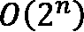，其中 *n* 是数据集中的要素总数。
*   **Shapley 值对选择性解释无效** : Shapley 值试图考虑所有特征以提供可解释性。对于稀疏解释来说，这些解释可能是不正确的，在稀疏解释中，只考虑选定的特征。但通常，人性化的解释会考虑选择性特征。所以，当你寻求一个选择性的解释时，我会说酸橙比 SHAP 好。然而，SHAP 框架的最新版本确实包含了与 LIME 相同的思想，对于稀疏解释几乎同样有效。
*   **SHAP 不能用于规范性洞察** : SHAP 计算每个特征的 Shapley 值，不像 LIME 那样建立预测模型。因此，它不能用于分析任何*假设情景*或提供任何*反事实示例*以提出可行的见解。
*   **KernelSHAP 可能会很慢**:虽然 KernelSHAP 是模型不可知的，但是它可能会非常慢，因此可能不适合生产级的 ML 系统，因为模型是在高维数据上训练的。
*   不太人性化:除了通过功能交互分析功能的重要性，SHAP 可视化对于任何非技术用户来说都很难理解。通常，非技术用户更喜欢来自 ML 模型的简单的、选择性的、可操作的见解、建议或理由。不幸的是，当用于生产系统时，SHAP 需要另一层抽象来进行人性化的解释。

正如我们在这一节中讨论的观点所看到的，SHAP 可能不是可解释性的最理想的框架，还有很大的改进空间，使它更加人性化。然而，对于解释黑盒算法来说，它确实是一个重要且非常有用的框架，尤其是对于技术用户来说。这就把我们带到了本章的结尾。让我们总结一下我们在这一章中学到的东西。

# 总结

在这一章中，我们着重于理解 SHAP 框架对于模型可解释性的重要性。至此，您已经对沙普利价值观和 SHAP 有了很好的了解。我们已经介绍了如何通过各种可视化和解释器方法将 SHAP 用于模型可解释性。此外，我们还介绍了使用 SHAP 来解释回归模型的代码演练。最后，我们讨论了该框架的一些优点和局限性。

在下一章中，我们将介绍更多有趣的实际用例，将 SHAP 应用于不同类型的数据集。

# 参考文献

有关更多信息，请参考以下资源:

*   《n 人游戏的价值》对博弈论的贡献 2.28(1953):【https://doi.org/10.1515/9781400881970-018】T2
*   来自 Kaggle 的红酒质量数据集:[https://www . ka ggle . com/UC IML/Red-Wine-Quality-cortez-et-al-2009](https://www.kaggle.com/uciml/red-wine-quality-cortez-et-al-2009)
*   https://github.com/slundberg/shap SHAP GitHub 项目:
*   https://shap.readthedocs.io/en/latest/index.html SHAP 官方文件: