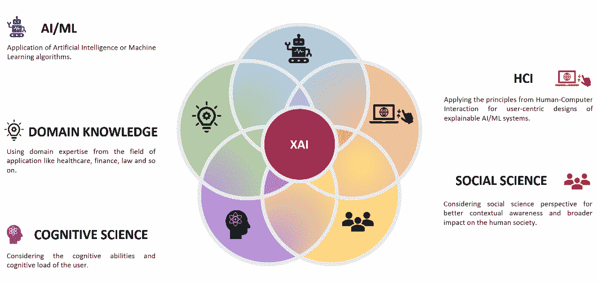
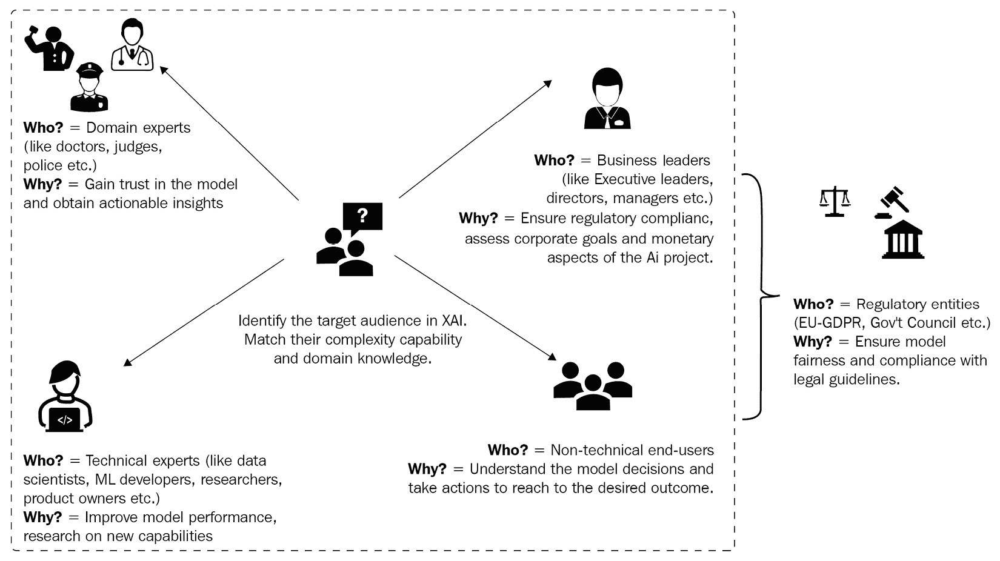

# 十、XAI 行业最佳实践

在本书的第一部分，我们讨论了与**可解释 AI**(**)相关的各种概念。这些概念是通过多年的研究，考虑到**人工智能** ( **AI** )的各个应用领域而建立起来的。然而，随着人工智能在工业用例中的采用不断增加，最近人们已经感受到了工业应用对 XAI 的需求。不幸的是，由于在如何实现人类友好的可解释方法方面的某些挑战和差距，XAI 对于工业用例的普遍认识仍然缺乏。**

 **在*第 2 节*、*实际问题解决*中，我们涵盖了许多 XAI Python 框架，这些框架普遍用于解释**机器学习** ( **ML** )模型的工作。然而，对于工业问题，仅仅理解如何在实践中应用 XAI Python 框架是不够的。工业问题需要可扩展和可持续的解决方案。因此，对于我们来说，讨论 XAI 在可扩展和可持续的人工智能解决方案用于工业问题方面的最佳实践是非常重要的。

这些年来，XAI 发生了很大的变化。从学术研究的一个话题，XAI 现在是人工智能和人工智能行业从业者工具箱中的一个强有力的工具。然而，XAI 有许多开放的挑战，研究界仍在努力使人工智能更接近最终用户。因此，我们将讨论 XAI 现有的挑战和设计一个可解释的 ML 系统的一般建议，同时考虑开放的挑战。此外，AI/ML 系统的质量与底层数据的质量一样好。因此，我们也将关注采用数据优先的方法对于模型可解释性的重要性。

XAI 研究团体认为，XAI 是一个多学科的视角，应该以最终用户为中心。因此，我们将讨论**交互式机器学习** ( **IML** )的概念，为工业人工智能系统创造高用户参与度。最后，我们将讨论使用 AI/ML 作为解读人工智能模型复杂本质的方法来提供可操作的建议和见解的重要性，从而使人工智能变得可解释并增加用户的信任。

与前几章不同，在这一章中，我们将不会把重点放在实际应用上，也不会学习新的 XAI 框架。相反，我们的目标是了解 XAI 工业用例的最佳实践。因此，在本章中，我们将讨论以下主题:

*   XAI 的公开挑战
*   设计可解释的 ML 系统的指南
*   采用数据优先的方法来解释
*   强调 IML 的可解释性
*   强调对可解释性的规定见解

那么，接下来让我们来了解一下这些话题。

# XAI 的公开挑战

如前所述，XAI 领域已经取得了一些重大进展。XAI 不再只是学术研究的话题；XAI 框架的可用性使 XAI 成为工业从业者的一个重要工具。但是这些框架足以增加人工智能的采用吗？不幸的是，答案是否定的。XAI 还有待进一步成熟，因为存在某些公开的挑战，一旦解决，可以显著弥合人工智能和最终用户之间的差距。接下来让我们来讨论这些公开挑战:

*   *在模型开发人员和最终用户之间转移焦点*:在浏览了本书中的许多 XAI 框架之后，你可能还会觉得大多数框架提供的可解释性需要 ML、数学或统计学的技术知识才能真正理解模型的工作。这是因为可解释性方法或算法主要是为 ML 专家或模型开发者设计的。

随着越来越多的终端用户开始利用人工智能模型和系统，对非技术性的人性化解释的需求也在增长。因此，对于工业应用程序来说，在模型开发人员和最终用户之间动态地转移焦点是一个挑战。

对于非技术最终用户，除非提供明确的信息，否则简单的解释方法(如特性重要性可视化)可能会变得非常复杂。为了减轻这一挑战，一般的建议是设计以用户为中心的人工智能系统。与任何软件应用程序或系统类似，用户应该尽早参与开发过程，了解他们的需求，并在设计应用程序时包括他们的专业知识，而不是应用程序的后期制作。

*   *缺乏利益相关者的参与*:从前面的观点来看，虽然推荐的行动是在 AI 系统开发过程的早期让最终用户参与进来，但是让利益相关者参与开发过程也是一个挑战。对于大多数工业用例，人工智能解决方案是孤立开发的，不涉及最终的利益相关者。遵循**人机交互** ( **HCI** )领域的设计原则，用户应该参与到开发过程的循环中。

考虑到高风险领域，如医疗保健、金融、法律和监管，获得利益相关者和领域专家可能是一个极其繁琐和昂贵的过程。利益相关者的可用性可能是一个挑战。即使有必要的激励和补偿，他们参与发展进程的兴趣或动力也可能很低。由于在开发过程中引入最终用户的困难，设计一个以用户为中心的人工智能系统是困难的。

应对这一挑战最值得推荐的行动是通过行业和学术界之间的合作。通常，学术机构，如医学院、法学院或其他大学，有更广泛的机会接触真正的参与者或属于各自领域的学生，并且可以是*伪*参与者。

下图说明了 XAI 是一个多学科的视角:

图 10.1-XAI 是一个多学科的视角

*   *特定应用的挑战*:不同的应用领域需要不同类型的的可解释性。例如，在基于人工智能的贷款审批系统中，基于影响或基于示例的特征解释非常有用。然而，对于从 X 射线图像中检测新冠肺炎感染的应用程序，突出显示或定位感染区域可能更有帮助。因此，每个应用程序都有自己的需求和可解释性的定义，因此，任何通用的 XAI 框架都可能不是很有效。
*   *缺乏定量评价指标*:解释方法的定量评价一直是一个重要的研究课题。不幸的是，仍然没有工具或框架可以定量评估解释方法的质量。这主要是因为许多不同的人工智能算法正在处理不同类型的数据。因此，模型可解释性有许多定义，XAI 也有许多方法。因此，很难归纳出适用于所有不同解释方法的量化评估指标。

目前使用的定性评估方法有*信任*、*有用性*、*可操作性*、*与先验信念的一致性*、*影响*等等。要了解有关这些指标的更多信息，请查看来自*埃森哲实验室*的*理解机器:可解释的人工智能*，该网站位于[https://www . Accenture . com/_ ACN media/pdf-85/Accenture-Understanding-Machines-explable-AI . pdf](https://www.accenture.com/_acnmedia/pdf-85/accenture-understanding-machines-explainable-ai.pdf)。此外，看看*人工智能中的解释:来自社会科学的见解*来自*https://arxiv.org/pdf/1706.07269.pdf 的*提姆·米勒*，可以在[获得。](https://arxiv.org/pdf/1706.07269.pdf)*

定性的评估方法确实是以用户为中心的，并使用 HCI 的原则来收集最终用户的反馈，但通常情况下，在比较不同的方法时，定量指标更有用。然而，我希望用于评估神经网络解释方法的工具如*Quantus*([https://github . com/understand-machine-intelligence-lab/Quantus](https://github.com/understandable-machine-intelligence-lab/Quantus))将在几年内显著成熟，评估解释方法将更加容易。

*   *缺乏可操作的解释*:大多数解释方法不能为最终用户提供可操作的见解。因此，设计可解释的 AI/ML 系统，提供可操作的解释可能具有挑战性。反事实解释、假设分析和基于交互式可视化的解释是唯一的解释方法，当输入特征改变时，允许用户观察结果的变化。我建议增加这些可操作的解释方法的使用，以开发可解释的 AI/ML 系统。
*   *缺乏上下文解释*:任何在生产中部署的 ML 算法都依赖于特定的用例以及底层数据。由于这个原因，在可解释性、模型性能、公平性和隐私性之间总是有一个折衷。因此，理解可解释性的背景是一个现存的挑战，任何一般的 XAI 框架都无法准确提供。因此，减轻这一挑战的建议是为特定的用例设计个性化的可解释的 ML 系统，而不是一般化的实现。

如果你想在这方面探索更多，你可以看看*维尔马等人的*作品，《可解释的 ML 的*陷阱:一个行业的视角*(【https://arxiv.org/abs/2106.07758】)，了解更多关于 XAI 的典型挑战。所有这些开放的挑战都是有趣的研究问题，你可以探索它们来帮助研究社区在这一领域取得进展。既然我们已经讨论了 XAI 的公开挑战，接下来，让我们讨论一下为工业用例设计可解释的 ML 系统的指导方针，考虑公开挑战。

# 设计可解释的 ML 系统的指南

在本节中，我们将从行业角度讨论设计可解释的 ML 系统的推荐指南，同时考虑 XAI 的公开挑战，如前一节所述。所有这些指南都是从 XAI、ML 和软件系统领域的各种专家的各种出版物、会议主题和小组讨论中仔细整理出来的。的确，每个人工智能和人工智能问题都有其独特的方式，因此，很难概括任何建议。但是许多人工智能组织已经采用了下面的指南列表来设计可解释的和用户友好的 ML 系统:

*   确定 XAI 的目标受众及其可用性背景:可解释性的定义取决于使用人工智能系统的用户。*阿里埃塔等人*。在他们的工作*可解释的人工智能(XAI):面向负责任的人工智能的概念、分类法、机遇和挑战*中，强调了在设计可解释的人工智能系统时识别 XAI 目标受众的重要性。

一个 AI 系统可以有不同的受众，如技术利益相关者(即数据科学家、ML 专家、产品所有者和开发人员)、业务利益相关者(即经理和执行领导)、领域专家(即医生、律师、保险代理等)、法律和监管机构以及非技术最终用户。每个听众可能对可解释性有不同的需求，因此相应地，解释方法应该努力满足听众的最佳需求。

作为第一步，确定可解释系统的目标受众以及他们将要使用该系统的情况或背景在设计过程中非常有帮助。例如，对于依赖 ML 模型预测糖尿病风险的医学专家来说，解释方法的选择取决于他们的实际需要。如果他们的需要是建议改善糖尿病患者健康状况的行动，那么反事实的例子可能真的有用。然而，如果他们的目的是找出导致糖尿病风险增加的因素，那么基于特征的解释方法更相关。

*图 10.2* 展示了可解释人工智能系统的各种目标受众:

图 10.2–确定 XAI 的目标受众

*   *根据用户需求筛选 XAI 技术*:一旦确定了目标受众和他们的可用性背景，以及关于数据集类型(例如，表格、图像或文本)和用于训练模型的 ML 算法的必要技术细节，筛选出一系列可能的解释方法是非常重要的，如 [*第 2 章*](B18216_02_ePub.xhtml#_idTextAnchor033) 、*模型可解释性方法*中所述。

这些入围的解释方法应该适合目标用户用来与人工智能模型交互的软件系统。这意味着解释技术应该与软件应用程序或界面很好地集成，甚至应该在软件的设计过程中考虑，以获得一致的用户体验。

*   以人为中心的 XAI:在涉及最终用户的特定领域翻译和评估 XAI 的迭代过程。类似于使用 HCI 的软件系统的设计生命周期，XAI 也是一个迭代过程。它应该以人为中心，并应不断进行评估，以评估影响。在第十一章 、*以最终用户为中心的人工智能*中的*使用 XAI* 部分的以用户为中心的系统设计中，我已经包括了以人为中心的 XAI 设计过程需要考虑的其他重要方面。
*   *XAI 反馈循环的重要性*:所有可解释的人工智能系统都应该有捕捉最终用户反馈的选项，以评估系统提供的解释的影响、相关性、有效性和可信度。在设计和初始开发过程中，不可能考虑所有的边缘情况和最终用户的所有偏好。但是使用反馈循环，开发者可以收集关于解释方法的具体反馈，如果需要的话可以修改它们。
*   设计过程中可伸缩性的重要性:类似于为生产系统提供 ML 模型，可解释性也应该在模块化和可伸缩的方法中提供。为模型解释服务的最佳方式是设计部署在集中式云服务器中的**可伸缩 web API**。因此，当 XAI 在实践中实现时，一定要确保解释是通过 web APIs 提供的，这样它们就可以很容易地与任何软件界面或应用程序集成。
*   *在数据、界面和可操作见解*之间切换:许多专家观察到，对于最终用户来说，他们对模型解释方法的满意度是解释与底层数据集(或他们先前的信念)的联系程度、用户如何能够与 ML 系统交互以获得更多信心，以及解释如何鼓励他们采取行动以获得期望的输出之间的权衡。**以数据为中心的 XAI** 、 **IML** 和**可操作的解释**是更广泛的研究主题，在为工业用例设计可解释的 AI 系统时应该考虑这些主题。

因此，我们了解了 XAI 面临的公开挑战，并讨论了考虑公开挑战的设计准则。我们现在对设计可解释的 ML 系统时应该考虑什么有了一个公平的想法。接下来，让我们在接下来的章节中详细阐述最后一个推荐的指南，以仔细理解它的重要性。让我们从使用以数据为中心的方法对可解释性的重要性开始讨论。

# 采用数据优先的方法来解释

在 [*第三章*](B18216_03_ePub.xhtml#_idTextAnchor053) 、*以数据为中心的方法*中，我们讨论了**以数据为中心的 XAI** 的重要性和各种技术。现在，在这一节中，我们将详细说明采用数据优先的可解释性方法如何有助于在工业用例中获得用户的信任。

以数据为中心的人工智能基于一个基本思想，即*ML 模型的质量与用于训练模型的底层数据集的质量一样好*。对于工业用例，处理低质量数据集是大多数数据科学家面临的主要挑战。不幸的是，数据质量经常被忽视，因为数据科学家和 ML 专家被期望施展他们 ML 的*魔法*来建立接近 100%准确的模型。因此，ML 专家只是试图遵循**以模型为中心的方法**，例如调整超参数或使用复杂算法来提高模型性能。即使模型性能略有提升，但随着复杂度的增加，可解释性下降。缺乏可解释性增加了业务涉众的怀疑。此外，与数据质量相关的问题，如出现*数据异常*、*数据泄漏*、*数据漂移*以及其他问题，如 [*第 3 章*](B18216_03_ePub.xhtml#_idTextAnchor053) 、*以数据为中心的方法*中所述，也会显著增加。如果是那样的话，我们该怎么办？

答案是采用以数据为中心的方法来解释 ML 过程。使用以数据为中心的可解释性方法，如**探索性数据分析** ( **EDA** )，我们可以从数据集中使用的特征中提取关于数据集的见解，如任何有趣的模式、相关性、单调性或趋势。训练数据和推断数据之间的 EDA 和数据分析也有助于您识别数据质量问题。如果数据集中存在问题，我们总是建议您告知业务涉众较差数据质量的局限性，并正确设置对模型性能的预期。因此，即使模型预测不正确，业务利益相关者也会理解其局限性，而不是怀疑 ML 系统。

但是*为什么我们不尝试一下本书涵盖的其他 XAI 框架和方法呢*？*采用数据优先的方法来解释会有什么帮助*？如果适用的话，你可以也应该尝试其他相关的 XAI 方法，但是以数据为中心的可解释性总是更容易向非技术用户解释。特别是，使用*数据剖析方法*，如 [*第 3 章*](B18216_03_ePub.xhtml#_idTextAnchor053) 、*以数据为中心的方法*中所述，我们可以为每个类别(如果有分类问题)或预测变量的每个箱(如果有回归问题)确定数据集中存在的特征值范围，并将模型预测与剖析值进行比较。与复杂的数学概念(如 *Shapley 值*或 XAI 框架中使用的其他算法)相比，与剖析值的简单比较更容易理解。

以数据为中心的方法更受欢迎的另一个原因是用户对历史数据的信任。一般来说，据观察，与人工智能模型相比，大多数利益相关者更信任历史数据。例如，在春季，如果人工智能天气预报模型预测到降雪的发生，大多数最终用户会犹豫是否相信该预测。这是因为根据多年来在世界各地的观察，春天总是与阳光和鲜花盛开联系在一起。但是如果该模型还指示在同一时间在最近几年中降雪的发生，或者甚至指示在最近几天中在附近有降雪，则用户的信任会更大。因此，建议你，首先，探索以数据为中心的可解释性，然后再看看任何工业 ML 问题的其他可解释性方法。

下面的图说明了以数据为中心的 XAI 是如何非常接近于提供可解释性的自然方式，从而提高了理解的简易性:

图 10.3——以数据为中心的方法对于可解释性的重要性

接下来，我们将讨论交互式 ML 来增强最终用户的信任。

# 强调 IML 的可解释性

IML 是设计智能用户界面的典范，在用户交互的帮助下促进人工智能和人工智能算法。在过去的几年中，使用 IML 来引导 ML 系统的使用以增加终端用户的信任已经成为 AI 和 HCI 研究社区的重要研究课题。许多研究文献推荐使用 IML 来增加人工智能系统的用户参与度。*交互式机器学习的最新研究进展*蒋等*。([https://arxiv.org/abs/1811.04548](https://arxiv.org/abs/1811.04548))讲述了 IML 领域取得的一些重大进展，以及它如何与 ML 算法日益增长的可信度和透明度密切相关。*

 *IML 是另一个有趣的方法，被 XAI 社区用来解释 ML 模型。甚至在像 *DALEX* 和 *Explainerdashboards* 这样的框架中，正如 [*第 9 章*](B18216_09_ePub.xhtml#_idTextAnchor172) ，*中所提到的，其他流行的 XAI 框架*提供了交互式仪表盘和 web 界面，最终用户可以与之交互以探索数据、模型和预测，这被认为是模型可解释性的一种方式。IML 通过以下方式帮助用户:

*   通过图形和视觉探索数据集，从而使用户更容易观察和记住来自数据的关键见解。
*   对 ML 系统更有信心，因为智能用户界面允许用户进行更改并观察结果。这使得用户在考虑输入的任何变化时，更容易理解模型的行为。
*   通常，当提供交互式界面时，假设分析和本地可解释性会得到改善。
*   IML 将探索系统的更多控制权交给了用户，而 IML 通常考虑以用户为中心的设计过程，为特定的用例提供定制的界面。

简而言之，IML 改善了用户体验，从而有助于推动人工智能模型的采用。我强烈推荐使用交互式用户界面作为可解释的 ML 系统的一部分，同时使用模块化的 web APIs 服务模型可解释性。你可以阅读下面这篇文章，了解更多关于 IML 对商业问题的用处:[https://hub . packtpub . com/what-is-interactive-machine-learning/](https://hub.packtpub.com/what-is-interactive-machine-learning/)。

下图说明了传统 ML 和 IML 之间的区别:

图 10。4–比较传统 ML 和 IML

正如您从上图中看到的，使用 IML，最终用户可以直接与智能用户界面交互，以获得预测、解释和见解。接下来，让我们讨论说明性洞察对于可解释的 ML 系统的重要性。

# 强调对可解释性的规定见解

规定性洞察力是数据分析中使用的一个流行术语。这意味着提供从数据集得出的可行建议，以实现预期结果。它通常被认为是整个数据驱动的决策过程中的催化剂。在 XAI 的背景下，诸如*反事实例子*、*以数据为中心的 XAI* 和*假设分析*的解释方法被突出地用于向用户提供可操作的建议。

除了反事实之外，ML 中的**可操作追索权的概念也用于生成规定的见解。**可操作的求助**是用户通过修改可操作的特征来改变 ML 模型的预测的能力。但是*它和反事实有什么不同？*可操作的追索权可以被认为是反事实例子的思想的扩展，其使用可操作的特征而不是数据集中存在的所有特征。**

现在，*我们所说的可操作特征是什么意思？*考虑到实际情况，我们不可能以任何方向改变数据集中存在的所有特征来达到期望的结果。例如，诸如*年龄*、*性别*和*种族*的特征不能在任何方向上改变以获得期望的输出。不幸的是，用于生成反事实例子的算法没有考虑改变特征的实际可行性。

让我们假设一个 ML 模型被用来估计糖尿病的风险。对于一个糖尿病患者，如果我们想用反事实的例子来推荐如何降低糖尿病的风险，对患者来说将年龄降低 10 岁或改变性别来降低风险实际上是不可行的。所以，这些是不可操作的特征。尽管理论上改变这些特征可以改变模型预测，但是改变这些特征是不实际的。因此，可操作追索权的概念更像是受控的反事实生成过程，其被应用于可操作的特征，并考虑特征值的实际可行的边界条件。

为了生成说明性的见解，我建议您使用可操作的追索权，因为它考虑了改变特征值以获得期望结果的实际可行性和难度。你可以从 *Ustun 等人的*作品、*线性分类中的可操作追索权*([https://arxiv.org/abs/1809.06514](https://arxiv.org/abs/1809.06514))以及他们在[https://github.com/ustunb/actionable-recourse](https://github.com/ustunb/actionable-recourse)的 GitHub 项目中找到更多关于可操作追索权的信息。

但是在 XAI，规范的见解真的有必要吗？嗯，答案是*是的*！以下原因解释了为什么规范性见解在 XAI 如此重要:

*   规范性见解是建议用户采取的行动，以获得期望的结果。在大多数工业用例中，如果用户不知道如何达到他们想要的结果，那么可解释性就是不完整的。
*   产生规定性的见解是解释 ML 模型工作的一种积极的方法。这是因为它允许用户采取必要的主动行动，而不是相信提供给他们的被动解释。
*   它通过给用户一种控制系统的感觉来增加用户对系统的信任。使用可操作的解释，用户能够改变模型预测。
*   它提高了业务涉众为组织制定数据驱动的决策的能力。

这些是为什么在为工业问题设计可解释的人工智能系统时，你应该总是考虑生成可操作的解释的主要原因。*图 10.5* 展示了使用 XAI 的规范性洞察如何为用户提供可行的建议，以获得他们想要的结果:

图 10.5——说明性洞察力的重要性

至此，我们已经到了这一章的结尾。我们来总结一下接下来讨论的话题。

# 总结

这一章集中在为工业问题设计可解释的人工智能系统的最佳实践。在这一章中，我们讨论了 XAI 的公开挑战以及考虑到公开挑战的可解释 ML 系统的必要设计指南。我们还强调了考虑以数据为中心的可解释性方法、IML 以及设计可解释的 AI/ML 系统的规定性见解的重要性。

如果你是负责使用人工智能解决工业问题的技术专家、建筑师或商业领袖，考虑到 XAI 的公开挑战，本章帮助你学习了一些设计可解释的人工智能/人工智能系统的最重要的准则。如果你是人工智能或人机交互领域的研究人员，本章中讨论的一些公开挑战可能是值得考虑的有趣研究主题。找到应对这些挑战的办法可以在 XAI 领域取得重大进展。

在下一章中，我们将涵盖**以终端用户为中心的人工智能**的原则，以弥合 AI-终端用户的差距。

# 参考文献

有关本章所涵盖主题的更多信息，请参考以下资源:

*   *可解释的 ML 陷阱:行业视角*:【https://arxiv.org/abs/2106.07758 
*   GitHub 中的 Quantus 框架:[https://GitHub . com/understand-machine-intelligence-lab/Quantus](https://github.com/understandable-machine-intelligence-lab/Quantus)
*   *人工智能的解释:来自社会科学的见解*:【https://arxiv.org/pdf/1706.07269.pdf】T2
*   *Quantus:一个可解释的 AI 工具包，用于负责任地评估神经网络解释*:【https://arxiv.org/abs/2202.06861】T2
*   *理解机器:可解释的 AI* 来自*埃森哲实验室*:[https://www . Accenture . com/_ ACN media/pdf-85/埃森哲-理解-机器-可解释-ai.pdf](https://www.accenture.com/_acnmedia/pdf-85/accenture-understanding-machines-explainable-ai.pdf)
*   *线性分类中的可诉追索权*由*乌斯顿等人*:*[https://arxiv.org/abs/1809.06514](https://arxiv.org/abs/1809.06514)*
**   洗钱可诉追索权:[https://github.com/ustunb/actionable-recourse](https://github.com/ustunb/actionable-recourse)*   *质疑人工智能:为可解释的人工智能用户体验的设计实践提供信息*作者:【廖】等:【https://dl.acm.org/doi/10.1145/3313831.3376590】*   *《可解释的人工智能》( XAI)的进展和未解决的问题:一个人机交互研究者的实践观点*作者*q . Vera Liao*:【http://qveraliao.com/aaai_panel.pdf】T4****