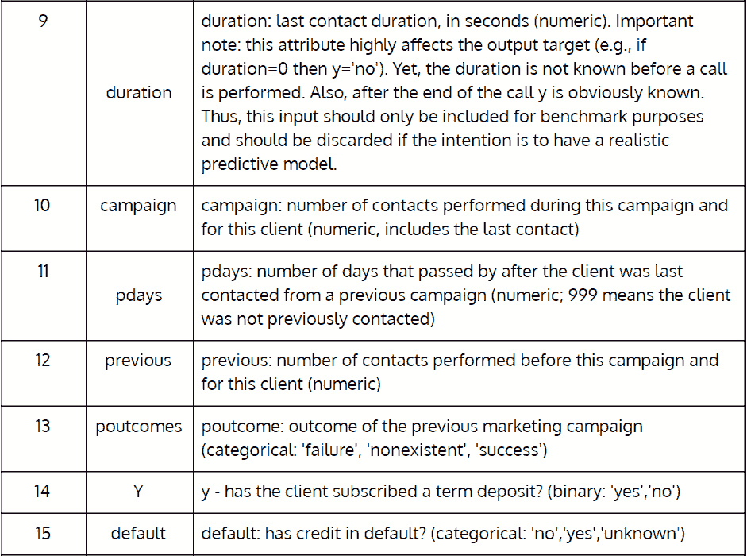
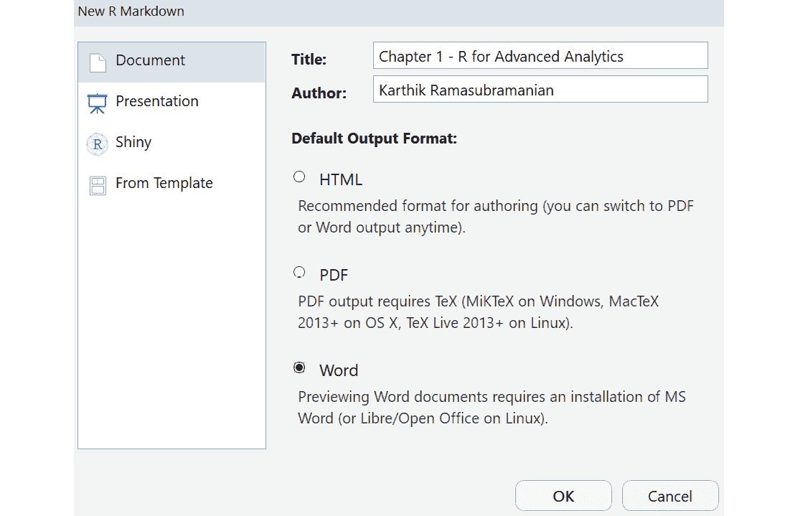
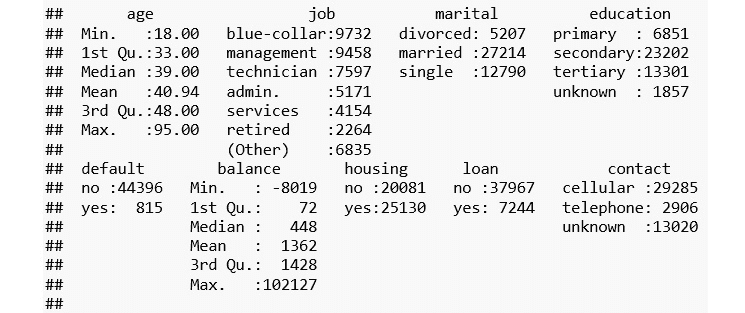

# 一、面向高级分析的 R

## 学习目标

本章结束时，您将能够:

*   解释高级 R 编程结构
*   打印真实数据集的汇总统计数据
*   从 CSV、文本和 JSON 文件中读取数据
*   为代码可复制性编写 R markdown 文件
*   解释数据结构，如数据帧、数据表、列表、数组和矩阵
*   实现 cbind、rbind、merge、shape、aggregate 和 apply 函数
*   使用诸如 dplyr、plyr、caret、tm 等包
*   使用 ggplot 创建可视化效果

在本章中，我们将为用 R 编程打下基础，并理解高级分析的各种语法和数据结构。

## 简介

r 是为统计计算和数据分析开发的早期编程语言之一，对可视化有很好的支持。随着数据科学的兴起，R 成为许多数据科学从业者毫无疑问的编程语言选择。因为 R 是开源的，并且在构建复杂的统计模型方面非常强大，所以它很快被工业界和学术界所采用。

SAS 和 SPSS 等工具和软件只有大公司才能负担得起，而 C/C++和 Java 等传统编程语言不适合执行复杂的数据分析和构建模型。因此，需要一种更加简单、全面、社区驱动、跨平台兼容和灵活的编程语言。

虽然 Python 编程语言最近因为其在行业范围内的采用和健壮的生产级实现而变得越来越流行，但 R 仍然是高级机器学习模型快速原型化的编程语言的选择。r 拥有数量最多的包集合之一(完成一个复杂过程的函数/方法的集合，否则需要花费大量的时间和精力来实现)。在写这本书的时候，**综合 R 档案网** ( **CRAN** )，一个遍布世界各地的 FTP 和 web 服务器网络，为 R 存储相同的、最新的代码和文档版本，有超过 13，000 个包。

虽然有许多书籍和在线资源介绍 R 的基础知识，但在这一章中，我们将只讨论 R 编程中的重要主题，这些主题将在许多数据科学项目中广泛使用。我们将使用来自 UCI 机器学习知识库的真实世界数据集来演示这些概念。本章的内容对初学 R 编程的人很有用。监督学习概念的后续章节将借用本章的许多实现。

## 使用真实世界的数据集

如今，网上有大量开放的数据集。以下是开放数据集的一些常见来源:

*   **Kaggle** :举办数据科学竞赛的平台。官方网站是 https://www.kaggle.com/。
*   **UCI 机器学习库**:机器学习社区用于机器学习算法实证分析的数据库、领域理论和数据生成器的集合。您可以通过导航到 https://archive.ics.uci.edu/ml/index.php 网址[访问官方页面。](https://archive.ics.uci.edu/ml/index.php)
*   **data.gov.in**:开放的印度政府数据平台，在 https://data.gov.in/[可用](https://data.gov.in/)。
*   **世界银行开放数据**:免费开放获取全球发展数据，可从 https://data.worldbank.org/[获取](https://data.worldbank.org/)。

越来越多的私人和公共组织愿意公开他们的数据。然而，它仅限于复杂的数据集，组织正在通过 Kaggle 等众包平台寻找数据科学问题的解决方案。从组织内部获得的数据中学习是无可替代的，这是处理和分析各种挑战的工作的一部分。

关于数据处理的重要学习机会和挑战也来自公共数据源，因为并非所有来自这些数据源的数据都是干净的和标准格式的。JSON、Excel 和 XML 是与 CSV 一起使用的一些其他格式，尽管 CSV 是主要格式。每种格式都需要单独的编码和解码方法，因此需要一个 r 中的 reader 包。在下一节中，我们将讨论各种数据格式以及如何详细处理可用的数据。

在本章和许多其他章节中，我们将使用来自 UCI 机器学习库的葡萄牙银行机构数据集的直接营销活动(电话)。([https://archive.ics.uci.edu/ml/datasets/bank+marketing](https://archive.ics.uci.edu/ml/datasets/bank+marketing))。下表详细描述了这些字段:


###### 图 1.1:来自 UCI 机器学习知识库的葡萄牙银行机构数据集(第 1 部分)



###### 图 1.2:来自 UCI 机器学习知识库的葡萄牙银行机构数据集(第二部分)

在下面的练习中，我们将下载作为 ZIP 文件的`bank.zip`数据集，并使用`unzip`方法解压缩它。

### 练习 1:使用 unzip 方法解压缩下载的文件

在本练习中，我们将编写一个 R 脚本，从 UCI 机器学习存储库中下载葡萄牙银行直销活动数据集，并使用`unzip`函数提取给定文件夹中 ZIP 文件的内容。

执行以下步骤来完成练习:

1.  首先，在你的系统上打开 R Studio。
2.  Now, set the working directory of your choice using the following command:

    ```
    wd <- "<WORKING DIRECTORY>"
    setwd(wd)
    ```

    #### 注意

    本书中的 R 代码是用 R 版本 3.2.2 实现的。

3.  使用`download.file()`方法下载包含数据集的 ZIP 文件:

    ```
    url <- "https://archive.ics.uci.edu/ml/machine-learning-databases/00222/bank.zip"
    destinationFileName <- "bank.zip"
    download.file(url, destinationFileName,method = "auto", quiet=FALSE)
    ```

4.  现在，在我们使用`unzip()`方法解压缩工作目录中的文件之前，我们需要选择一个文件，并将其文件路径保存在 R(对于 Windows)中，或者指定完整的路径:

    ```
    zipFile<-file.choose()
    ```

5.  定义解压 ZIP 文件的文件夹:

    ```
    outputDir <- wd
    ```

6.  Finally, unzip the ZIP file using the following command:

    ```
    unzip(zipFile, exdir=outputDir)
    ```

    输出如下所示:


###### 图 1.3:解压缩 bank.zip 文件

## 从各种数据格式中读取数据

来自数字系统的数据以各种形式生成:电子商务网站的浏览历史、点击流数据、客户的购买历史、社交媒体互动、零售店的人流、卫星和无人机的图像以及许多其他格式和类型的数据。我们生活在一个激动人心的时代，技术正在显著改变生活，企业正在利用它来创建他们的下一个数据战略，以做出更好的决策。

仅仅能够收集大量不同类型的数据是不够的；我们还需要利用其中的价值。一整天的闭路电视录像将有助于政府的法律和秩序小组改善对公共场所的实时监控。挑战在于我们如何在单个系统中处理大量异构数据格式。

**客户关系管理** ( **CRM** )应用中的交易数据大部分是表格形式，社交媒体中的信息主要是文本、音频、视频和图像。

我们可以将数据格式分类为结构化的——表格数据，如 CSV 和数据库表；非结构化—文本数据，如推文、FB 帖子和 word 文档；和半结构化。与机器很难处理和理解的文本不同，半结构化提供了关联的元数据，这使得计算机很容易处理它。它广泛用于许多 web 应用的数据交换，JSON 就是半结构化数据格式的一个例子。

在这一节中，我们将看到如何在 r 中加载、处理和转换各种数据格式。

### CSV 文件

CSV 文件是结构化数据最常见的数据存储和交换格式。r 提供了一个名为`read.csv()`的方法，用于从 CSV 文件中读取数据。它会将数据读入一个`data.frame`(下一节将详细介绍)。该方法有许多参数；两个必需的参数是到`filename`和`sep`的路径，它们指定了分隔列值的字符。`summary()`方法描述了六个汇总统计量，**最小值**、**第一四分位数**、**中值**、**平均值**、**第三四分位数**和**最大值**。

在下面的练习中，我们将读取一个 CSV 文件并总结它的列。

### 练习 2:读取一个 CSV 文件并汇总其列

在本练习中，我们将读取之前提取的 CSV 文件，并使用`summary`函数打印数值变量的最小值、最大值、平均值、中值、第一个四分位数和第三个四分位数的值，并计算分类变量的类别。

执行以下步骤读取 CSV 文件，并在以后汇总其列:

1.  首先，使用`read.csv`方法并将`bank-full.csv`加载到一个数据帧中:

    ```
    df_bank_detail <- read.csv("bank-full.csv", sep = ';')
    ```

2.  Print the summary of the DataFrame:

    ```
    summary(df_bank_detail)
    ```

    输出如下所示:

    ```
    ##       age                 job           marital          education    
    ##  Min.   :18.00   blue-collar:9732   divorced: 5207   primary  : 6851  
    ##  1st Qu.:33.00   management :9458   married :27214   secondary:23202  
    ##  Median :39.00   technician :7597   single  :12790   tertiary :13301  
    ##  Mean   :40.94   admin.     :5171                    unknown  : 1857  
    ##  3rd Qu.:48.00   services   :4154                                     
    ##  Max.   :95.00   retired    :2264                                     
    ```

### 上

JSON 是下一个最常用的共享和存储数据的数据格式。它不同于 CSV 文件，CSV 文件只处理数据的行和列，其中每一行和列都有一定数量的列。例如，在客户的电子商务数据中，每一行可以代表一个客户，他们的信息存储在单独的列中。对于客户，如果某列没有值，则该字段存储为 NULL。

JSON 提供了额外的灵活性，为每个客户提供不同数量的字段。这种灵活性减轻了开发人员在传统关系数据库中维护模式的负担，在传统关系数据库中，相同的客户数据可能分布在多个表中，以优化存储和查询时间。

JSON 更像是一种键值存储类型的存储，我们关心的只是键(比如姓名、年龄和出生日期)及其对应的值。虽然这听起来很灵活，但必须小心谨慎，否则可管理性有时会失控。幸运的是，随着最近大数据技术的出现，许多文档存储(键值存储的一个子类)，通常也被称为 **NoSQL** 数据库，可用于存储、检索和处理这种格式的数据。

在下面的练习中，JSON 文件包含 2015-16 年印度泰米尔纳德邦各地区的豆蔻(香料和调味品)种植数据。关键词包括**面积**(公顷)**产量**(五公担)**生产率**(每公顷平均产量)。

`jsonlite`包提供了一个读取 JSON 文件并将其转换成 DataFrame 的实现，这使得分析更加简单。`fromJSON`方法读取一个 JSON 文件，如果`fromJSON`函数中的`flatten`参数被设置为`TRUE`，它会给出一个 DataFrame。

### 练习 3:读取 JSON 文件并将数据存储在 DataFrame 中

在本练习中，我们将读取一个 JSON 文件并将数据存储在 DataFrame 中。

执行以下步骤来完成练习:

1.  从[https://data . gov . in/catalog/area-production-productivity-spices-conditions-district-wise-Tamil-Nadu-year-2015-16](https://data.gov.in/catalog/area-production-productivity-spices-condiments-district-wise-tamil-nadu-year-2015-16)下载数据。
2.  首先，使用下面的命令安装系统所需的软件包，读取 JSON 文件:

    ```
    install jsonlite package
    install.packages("jsonlite")
    library(jsonlite)
    ```

3.  接下来，使用`fromJSON`方法读取 JSON 文件，如下所示:

    ```
    json_file <- "crop.json"
    json_data <- jsonlite::fromJSON(json_file, flatten = TRUE)
    ```

4.  列表中的第二个元素包含带有作物产值的数据框。从`json_data`中检索并存储为名为`crop_production` :

    ```
    crop_production <- data.frame(json_data[[2]])
    ```

    的数据帧
5.  接下来，使用下面的命令重命名列:

    ```
    colnames(crop_production) <- c("S.No","District","Area","Production","PTY")
    ```

6.  Now, print the top six rows using the `head()` function:

    ```
    head(crop_production)
    ```

    输出如下所示:

    ```
    ##   S.No   District Area Production  PTY
    ## 1    1   Ariyalur   NA         NA   NA
    ## 2    2 Coimbatore  808         26 0.03
    ## 3    3  Cuddalore   NA         NA   NA
    ## 4    4 Dharmapuri   NA         NA   NA
    ## 5    5   Dindigul  231          2 0.01
    ## 6    6      Erode   NA         NA   NA
    ```

### 正文

非结构化数据是网络语言。所有的社交媒体、博客、网页和许多其他信息来源都是文本形式的，不整洁，无法提取任何有意义的信息。越来越多的研究工作来自自然语言处理领域，在这个领域，计算机不仅在理解单词的意思方面，而且在理解它在句子中的上下文方面变得越来越好。回应人类查询的电脑聊天机器人的兴起，是理解文本信息的最复杂形式。

在 R 中，我们将使用`tm`文本挖掘包来展示如何从文本数据中读取、处理和检索有意义的信息。在本节的练习中，我们将使用 ka ggle([https://www.kaggle.com/snap/amazon-fine-food-reviews](https://www.kaggle.com/snap/amazon-fine-food-reviews))中的**亚马逊食品评论**数据集的一个小样本。

在`tm`包中，文本文档的集合被称为`tm`包，是`VCorpus` ( `VCorpus`对象，我们可以使用`inspect()`方法。下面的练习使用`lapply`方法循环前两个评论，并将文本转换为字符。您将在*应用函数族*一节中了解关于`apply`函数族的更多信息。

### 练习 4:读取带有文本列的 CSV 文件并将数据存储在 VCorpus 中

在本练习中，我们将读取带有文本列的 CSV 文件，并将数据存储在 VCorpus 中。

执行以下步骤来完成练习:

1.  首先，让我们将 R 中的文本挖掘包加载到系统中读取文本文件:

    ```
    library(tm)
    ```

2.  现在，请阅读文件中的前 10 篇评论:

    ```
    review_top_10 <- read.csv("Reviews_Only_Top_10_Records.csv")
    ```

3.  要将文本列存储在`VCorpus`中，使用以下命令:

    ```
    review_corpus <- VCorpus(VectorSource(review_top_10$Text))
    ```

4.  To inspect the structure of first two reviews, execute the following command:

    ```
    inspect(review_corpus[1:2])
    ```

    输出如下所示:

    ```
    ## <<VCorpus>>
    ## Metadata:  corpus specific: 0, document level (indexed): 0
    ## Content:  documents: 2
    ## [[1]]
    ## <<PlainTextDocument>>
    ## Metadata:  7
    ## Content:  chars: 263
    ## [[2]]
    ## <<PlainTextDocument>>
    ## Metadata:  7
    ## Content:  chars: 190
    ```

5.  使用`lapply`，将第一次审查转换为字符并打印:

    ```
    lapply(review_corpus[1:2], as.character)
    ## $'1'
    ## [1] "I have bought several of the Vitality canned dog food products and have found them all to be of good quality. The product looks more like a stew than a processed meat and it smells better. My Labrador is finicky and she appreciates this product better than  most."
    ## $'2'
    ## [1] "Product arrived labeled as Jumbo Salted Peanuts...the peanuts were actually small sized unsalted. Not sure if this was an error or if the vendor intended to represent the product as \"Jumbo\".
    ```

我们将在后面的小节中再次访问`review_corpus`数据集，展示如何将非结构化的文本信息转换成结构化的表格数据。

除了 CSV、Text 和 JSON 之外，还有许多其他数据格式，具体取决于数据源及其用途。r 有丰富的库集合，可以帮助许多格式。r 不仅可以导入标准格式(除了前面三种之外),比如 HTML 表和 XML，还可以导入特定于分析工具的格式，比如 SAS 和 SPSS。这种民主化导致了早期使用专有工具(昂贵且通常只有大公司才有)的行业专家向开源分析编程语言(如 R 和 Python)的迁移。

## 为了代码的可复制性，编写 R Markdown 文件

分析的巨大成功是围绕主题的信息和知识网络开始传播的结果。更多的开源社区出现了，开发人员高兴地与外界分享他们的工作，许多数据项目变得可重复。这种变化意味着由一个人开始的工作很快会被一群人以许多不同的形式进行改编、即兴创作和修改，然后在一个与最初出现的领域完全不同的领域被采用。想象一下，在会议上发表的每一项研究工作都提交了一组代码和数据，这些代码和数据很容易与他们的研究论文一起复制。这种变化加快了想法变成现实的速度，创新将开始蓬勃发展。

现在，让我们看看如何在一个文件中创建这种可复制的作品，我们称之为 **R Markdown** 文件。在以下活动中，我们将演示如何在 RStudio 中创建新的 R Markdown 文件。R Markdown 的详细介绍可以在 https://rmarkdown.rstudio.com/lesson-1.html 的[找到。](https://rmarkdown.rstudio.com/lesson-1.html)

在下一个活动中，您将重新创建在*练习 4* 、*中显示的代码，读取带有文本列的 CSV 文件并将数据存储在 VCorpus* 中，放入 R Markdown 中。在*图 4.2* 中观察到，您刚刚在 R Markdown 中编写了解释和代码，当执行 **Knit to Word** 动作时，它将解释、代码及其输出整齐地交织成一个 Word 文档。

### 活动 1:创建一个 R Markdown 文件来读取 CSV 文件并编写数据摘要

在本活动中，我们将创建一个 R Markdown 文件来读取 CSV 文件，并在 word 文件中打印数据的一个小摘要:

执行以下步骤来完成活动:

1.  打开 RStudio 并导航至 **R Markdown** 选项:

    ###### 图 1.4:在 Rstudio 中创建新的 r 降价文件

2.  为文档提供**标题**和**作者**姓名，选择**默认输出格式**为**字** :

    ###### 图 1.5:使用 read.csv 方法读取数据

3.  使用`read.csv()`方法读取`bank-full.csv`文件。
4.  Finally, print the summary into a word file using the `summary` method.

    输出如下所示:



###### 图 1.6:使用汇总方法后的最终输出

#### 注意

这项活动的解决方案可在第 438 页找到。

## R 中的数据结构

在任何编程语言中，数据结构都是存储信息并为进一步处理做好准备的基本单位。根据数据的类型，各种形式的数据结构可用于**存储**和**处理**。下一节中解释的每种数据结构都有其特有的特性和适用性。

在这一节中，我们将探索每一种方法，以及如何在我们的数据中使用它。

### 矢量

`c()`方法，如下图所示:

```
c_names <- c("S.No","District","Area","Production","PTY")
```

我们可以通过在向量名称旁边的方括号中指定索引来提取向量中的第二个值。让我们回顾一下下面的代码，其中我们对第二个索引中的值进行了子集化:

```
c_names[2]
```

输出如下所示:

```
## [1] "District"
```

用`c()`方法连接的字符串集合是一个向量。它可以存储字符、整数或浮点值的同质集合。当试图用字符存储整数时，会发生隐式类型转换，这会将所有值转换为字符。

#### 警告

请注意，这可能不是每次都预期的行为。需要谨慎，尤其是当数据不干净时。否则，它可能会导致比通常的编程错误更难发现的错误。

### 矩阵

**矩阵**是用于存储 *n* 维数据的高维数据结构。它适用于存储表格数据。与 vector 类似，matrix 也只允许在其行和列中进行同质的数据收集。

下面的代码生成了 16 个随机数，这些随机数是从带有参数的二项式分布中抽取的，试验次数为`(size) = 100`，成功概率等于`0.4`。R 中的`rbinom()`方法对于生成这样的随机数很有用:

```
r_numbers <- rbinom(n = 16, size = 100, prob = 0.4)
```

现在，要将`r_number`存储为一个矩阵，使用以下命令:

```
matrix(r_numbers, nrow = 4, ncol = 4)
```

输出如下所示:

```
##      [,1] [,2] [,3] [,4]
## [1,]   48   39   37   39
## [2,]   34   41   32   38
## [3,]   40   34   42   46
## [4,]   37   42   36   44
```

让我们扩展我们在*练习 4* 、*中的文本挖掘示例，读取一个带有文本列的 CSV 文件并将数据存储在 VCorpus* 中，以了解矩阵在文本挖掘中的用法。

考虑以下两个评论。使用`lapply`将第一次评审键入`as.character`并打印:

```
lapply(review_corpus[1:2], as.character)
```

输出如下所示:

```
## $'1'
## [1] "I have bought several of the Vitality canned dog food products and have found them all to be of good quality. The product looks more like a stew than a processed meat, and it smells better. My Labrador is finicky, and she appreciates this product better than  most."
## $'2'
## [1] "Product arrived labeled as Jumbo Salted Peanuts...the peanuts were actually small sized unsalted. Not sure if this was an error or if the vendor intended to represent the product as \"Jumbo\".
```

现在，在下面的练习中，我们将转换数据以删除这两段中的停用词、空白和标点符号。然后我们将执行词干处理(两个*看起来*和*看起来*将减少到看起来)。此外，为了保持一致，将所有文本转换成小写。

### 练习 5:对数据执行转换，使其可用于分析

在本练习中，我们将对数据执行转换，以使其可用于进一步分析。

执行以下步骤来完成练习:

1.  First, use the following commands to convert all the characters in the data to lowercase:

    ```
    top_2_reviews <- review_corpus[1:2]
    top_2_reviews <- tm_map(top_2_reviews,content_transformer(tolower))
    lapply(top_2_reviews[1], as.character)
    ```

    输出如下所示:

    ```
    ## [1] "I have bought several of the vitality canned dog food products and have found them all to be of good quality. the product looks more like a stew than a processed meat and it smells better. my labrador is finicky, and she appreciates this product better than  most."
    ```

2.  Next, remove the stopwords from the data, such as, `a`, `the`, `an`, and many more:

    ```
    top_2_reviews <- tm_map(top_2_reviews,removeWords, stopwords("english"))
    lapply(top_2_reviews[1], as.character)
    ```

    输出如下所示:

    ```
    ## [1] "  bought several   vitality canned dog food products   found      good quality.  product looks  like  stew   processed meat   smells better.  labrador  finicky   appreciates  product better   ."
    ```

3.  Remove extra whitespaces between words using the following command:

    ```
    top_2_reviews <- tm_map(top_2_reviews,stripWhitespace)
    lapply(top_2_reviews[1], as.character)
    ```

    输出如下所示:

    ```
    ## [1] " bought several vitality canned dog food products found good quality. product looks like stew processed meat smells better. labrador finicky appreciates product better ."
    ```

4.  Perform the stemming process, which will only keep the root of the word. For example, `looking` and `looked` will become `look`:

    ```
    top_2_reviews <- tm_map(top_2_reviews,stemDocument)
    lapply(top_2_reviews[1], as.character)
    ```

    输出如下所示:

    ```
    ## [1] " bought sever vital can dog food product found good quality. product look like stew process meat smell better. labrador finicki appreci product better ."
    ```

    既然我们已经处理和清理了文本，我们可以创建一个文档矩阵，只存储两个评论中不同单词的出现频率。我们将演示如何计算评论中包含的每个单词。矩阵的每一行代表一篇评论，每一列是不同的单词。大多数值为零，因为不是所有的单词都会出现在每个评论中。在这个例子中，我们有 49%的稀疏度，这意味着只有 51%的矩阵包含非零值。

5.  再次创建`as.matrix()`方法。该矩阵包含两个文档(评论)和 37 个独特的词。通过指定矩阵中的行和列索引或名称来检索文档中特定单词的计数。
6.  现在，使用下面的命令将结果存储在一个矩阵中:

    ```
    dtm_matrix <- as.matrix(dtm)
    ```

7.  To find the dimension of the matrix, that is, 2 documents and 37 words, use the following command:

    ```
    dim(dtm_matrix)
    ```

    输出如下所示:

    ```
    ## [1]  2 37
    ```

8.  Now, print a subset of the matrix:

    ```
    dtm_matrix[1:2,1:7]
    ```

    输出如下所示:

    ```
    ##     Terms
    ## Docs "jumbo". actual appreci arriv better better. bought
    ##    1        0      0       1     0      1       1      1
    ##    2        1      1       0     1      0       0      0
    ```

9.  Finally, count the word `product` in document 1 using the following command:

    ```
    dtm_matrix[1,"product"]
    ```

    输出如下所示:

    ```
    ## [1] 3
    ```

### 列表

虽然 vector 和 matrix 都是在程序中的各种计算中使用的有用结构，但它可能不足以存储真实世界的数据集，真实世界的数据集通常包含混合类型的数据，例如 CRM 应用中的 customer 表将客户姓名和年龄放在两列中。该列表提供了一种允许将两种不同类型的数据存储在一起的结构。

在下面的练习中，除了生成 16 个随机数，我们还使用了`sample()`方法从英文字母表中生成 16 个字符。`list`方法将整数和字符存储在一起。

### 练习 6:使用列表方法存储整数和字符

在本练习中，我们将使用`list`方法存储随机生成的数字和字符。随机数将使用`rbinom`函数生成，随机字符将从英文字母 A-Z 中选择。

执行以下步骤来完成练习:

1.  首先，从参数大小等于`100`且成功概率等于`0.4` :

    ```
    r_numbers <- rbinom(n = 16, size = 100, prob = 0.4)
    ```

    的二项分布中产生 16 个随机数
2.  现在，从英语`LETTERS`中选择 16 个字母，不重复:

    ```
    #sample() will generate 16 random letters from the English alphabet without repetition
    r_characters <- sample(LETTERS, size = 16, replace = FALSE)
    ```

3.  Put `r_numbers` and `r_characters` into a single list. The `list()` function will create the data structure list with `r_numbers` and `r_characters`:

    ```
    list(r_numbers, r_characters)
    ```

    输出如下所示:

    ```
    ## [[1]]
    ##  [1] 48 53 38 31 44 43 36 47 43 38 43 41 45 40 44 50
    ## 
    ## [[2]]
    ##  [1] "V" "C" "N" "Z" "E" "L" "A" "Y" "U" "F" "H" "D" "O" "K" "T" "X"
    ```

    在接下来的步骤中，我们将会看到一个存储了整数和字符向量的列表。

4.  现在，让我们从一个列表中存储和检索整数和字符向量:

    ```
    r_list <- list(r_numbers, r_characters)
    ```

5.  Next, retrieve values in the character vector using the following command:

    ```
    r_list[[2]]
    ```

    输出如下所示:

    ```
    ##  [1] "V" "C" "N" "Z" "E" "L" "A" "Y" "U" "F" "H" "D" "O" "K" "T" "X"
    ```

6.  Finally, retrieve the first value in the character vector:

    ```
    (r_list[[2]])[1]
    ```

    输出如下所示:

    ```
    ## [1] "V" 
    ```

    虽然这解决了将异构数据类型存储在一起的需求，但它仍然没有对两个向量中的值之间的关系进行任何完整性检查。如果我们想将每个*字母*分配给一个*整数*。在前面的输出中，`V`代表`48` , `C`代表`53`，以此类推。

    列表对于处理这种一对一的映射并不健壮。考虑下面的代码，而不是`16`字符，如果我们生成 18 个随机字符，它仍然允许将它存储在一个列表中。最后两个字符现在没有与整数相关联的映射。

7.  现在，从参数大小等于`100`且成功概率等于`0.4` :

    ```
    r_numbers <- rbinom(n = 16, size = 100, prob = 0.4)
    ```

    的二项分布中产生 16 个随机数
8.  从英文`LETTERS`中选择任意 18 个字母，不重复:

    ```
    r_characters <- sample(LETTERS, 18, FALSE)
    ```

9.  Place `r_numbers` and `r_characters` into a single list:

    ```
    list(r_numbers, r_characters)
    ```

    输出如下所示:

    ```
    ## [[1]]
    ##  [1] 48 53 38 31 44 43 36 47 43 38 43 41 45 40 44 50
    ## 
    ## [[2]]
    ##  [1] "V" "C" "N" "Z" "E" "L" "A" "Y" "U" "F" "H" "D" "O" "K" "T" "X" "P"  "Q"
    ```

### 活动 2:创建一个包含两个矩阵的列表，并访问这些值

在本活动中，您将创建两个矩阵，并使用矩阵的索引检索一些值。您还将执行乘法和减法等运算。

执行以下步骤来完成活动:

1.  通过从二项式分布中随机产生的数字创建两个大小为`10 x 4`和`4 x 5`的矩阵(使用`rbinom`方法)。分别调用矩阵`mat_A`和`mat_B`。
2.  现在，将这两个矩阵存储在一个列表中。
3.  使用该列表，访问`mat_A`的第 4 行第 2 列并存储在变量`A`中，访问`mat_B`的第 2 行第 1 列并存储在变量`B`中。
4.  Multiply the `A` and `B` matrices and subtract from row 2 and column 1 of `mat_A`.

    #### 注意

    这项活动的解决方案可在第 440 页找到。

## 数据帧

由于向量、矩阵和列表的限制，适用于真实数据集的数据结构是数据科学从业者的迫切需求。数据帧是一种存储和检索表格数据的优雅方式。我们已经在*练习 3* 、*中看到 DataFrame 如何处理数据的行和列，读取 JSON 文件并将数据存储在 DataFrame* 中。数据框架将在整本书中广泛使用。

### 练习 7:使用数据帧执行完整性检查

让我们重温一下*练习 6* 、*中的*步骤 6* ，使用列表方法将整数和字符存储在一起*，在这里我们讨论了当我们试图在一个列表中存储两个不同长度的向量时的完整性检查，并将看到 DataFrame 如何不同地处理它。我们将再次生成随机数(`r_numbers`)和随机字符(`r_characters`)。

执行以下步骤来完成练习:

1.  首先，从参数大小等于`100`且成功概率等于`0.4` :

    ```
    r_numbers <- rbinom(n = 16, size = 100, prob = 0.4)
    ```

    的二项分布中产生 16 个随机数
2.  从英文`LETTERS`中选择任意 18 个字母，不重复:

    ```
    r_characters <- sample(LETTERS, 18, FALSE)
    ```

3.  Put `r_numbers` and `r_characters` into a single DataFrame:

    ```
    data.frame(r_numbers, r_characters)
    ```

    输出如下所示:

    ```
    Error in data.frame(r_numbers, r_characters) : 
      arguments imply differing number of rows: 16, 18
    ```

    如您所见，前面输出中的错误显示最后两个字母，即`P`和`Q`，没有使用二项式分布生成的相应随机`INTEGER`的映射。

访问数据帧中的任何特定行和列类似于矩阵。我们将展示许多技巧和技术来最好地利用数据帧中的索引功能，其中还包括一些过滤选项。

DataFrame 中的每一行都是紧密耦合的列集合的结果。每一列都清楚地定义了每行数据与其他每一行数据之间的关系。如果一列中没有相应的可用值，则用 n a 填充。例如，CRM 应用中的客户可能没有填写他们的婚姻状况，而其他一些客户填写了。因此，在应用设计过程中，指定哪些列是必需的，哪些是可选的就变得非常重要。

### 数据表

随着 DataFrame 的不断适应，它的局限性开始显露出来。特别是对于大型数据集，DataFrame 的性能很差。在复杂分析中，我们经常创建许多中间数据帧来存储结果。然而，R 是建立在内存计算架构上的，它严重依赖于 RAM。与磁盘空间不同，在许多标准台式机和笔记本电脑中，RAM 被限制为 4gb 或 8 GB。DataFrame 的构建效率不高，无法在计算过程中管理内存，这通常会导致`out of memory error`，尤其是在处理大型数据集时。

为了处理这个问题，`data.table`继承了`data.frame`的功能，并为其之上的以下任务提供了快速且内存高效的版本:

*   文件读取器和写入器
*   聚集
*   更新
*   相等、不相等、滚动、范围和间隔连接

高效的内存管理使得开发速度更快，并减少了操作之间的延迟。以下练习显示了`data.table`与`data.frame`相比在计算时间上的显著差异。首先，我们阅读完整的`fread()`法，这是从`data.table`开始的快速阅读法之一。

### 练习 8:探索文件读取操作

在本练习中，我们将只展示文件读取操作。鼓励您测试其他功能([https://cran . r-project . org/web/packages/data . table/vignettes/datatable-intro . html](https://cran.r-project.org/web/packages/data.table/vignettes/datatable-intro.html))并比较 DataFrame 上的数据表功能。

执行以下步骤来完成练习:

1.  首先，使用下面的命令加载数据表包:

    ```
    library(data.table)
    ```

2.  Read the dataset using the `fread()` method of the `data.table` package:

    ```
    system.time(fread("Reviews_Full.csv"))
    ```

    输出如下所示:

    ```
    Read 14.1% of 568454 rows
    Read 31.7% of 568454 rows
    Read 54.5% of 568454 rows
    Read 72.1% of 568454 rows
    Read 79.2% of 568454 rows
    Read 568454 rows and 10 (of 10) columns from 0.280 GB file in 00:00:08
    ##    user  system elapsed 
    ##    3.62    0.15    3.78
    ```

3.  Now, read the same CSV file using the `read.csv()` method of base package:

    ```
    system.time(read.csv("Reviews_Full.csv"))
    ```

    输出如下所示:

    ```
    ##    user  system elapsed 
    ##    4.84    0.05    4.91
    ```

观察到通过`fread()`方法读取它花费了`3.78`秒，而`read.csv`函数花费了`4.91`秒。执行速度几乎比*快了 30%* 。随着数据量的增加，这种差异更加显著。

在前面的输出中，`user`时间是当前 R 会话花费的时间，`system`时间是操作系统完成进程花费的时间。执行`system.time`方法后，即使使用相同的数据集，也可能得到不同的值。这在很大程度上取决于运行该方法时您的 CPU 有多忙。然而，我们应该相对于我们正在执行的比较而不是相对于绝对值来读取`system.time`方法的输出。

当数据集太大时，我们有太多的中间操作来得到最终的输出。但是，请记住，`data.table`并不是让我们在 r 中处理任何大小的数据集的魔杖，RAM 的大小仍然起着重要的作用，并且`data.table`不能替代分布式和并行处理的大数据系统。然而，即使对于较小的数据集来说，`data.table`的使用已经显示出比`data.frames`好得多的性能。

## 数据处理和转换

到目前为止，我们已经看到了读取和存储数据的不同方法。现在，让我们来关注执行数据分析和得出见解或构建模型所需的数据处理和转换。原始形式的数据几乎没有任何用处，因此有必要对其进行处理，使其适用于任何有用的目的。这一节重点介绍在数据分析过程中广泛使用的 R 中的许多方法。

### cbind

顾名思义，它将两个或多个向量、矩阵、数据帧或表格按列组合在一起。当我们有多个向量、矩阵或数据帧需要合并成一个进行分析或可视化时,`cbind`非常有用。`cbind`的输出根据输入数据而变化。下面的练习提供了几个`cbind`的例子，它结合了两个向量。

### 练习 9:探索 cbind 函数

在本练习中，我们将实现`cbind`函数来组合两个 DataFrame 对象。

执行以下步骤来完成练习:

1.  从参数大小等于`100`且成功概率等于`0.4` :

    ```
    r_numbers <- rbinom(n = 16, size = 100, prob = 0.4)
    ```

    的二项分布中产生 16 个随机数
2.  Next, print the `r_numbers` values using the following command:

    ```
    r_numbers
    ```

    输出如下所示:

    ```
    ##  [1] 38 46 40 42 45 39 37 35 44 39 46 41 31 32 34 43
    ```

3.  从英文`LETTERS`中选择任意 16 个字母，不重复:

    ```
    r_characters <- sample(LETTERS, 18, FALSE)
    ```

4.  Now, print the `r_characters` values using the following command:

    ```
    r_characters
    ```

    输出如下所示:

    ```
    ##  [1] "C" "K" "Z" "I" "E" "A" "X" "O" "H" "Y" "T" "B" "N" "F" "U" "V" "S"
    ## [18] "P"
    ```

5.  Combine `r_numbers` and `r_characters` using `cbind`:

    ```
    cbind(r_numbers, r_characters)
    ```

    输出如下所示:

    ```
    ## Warning in cbind(r_numbers, r_characters): number of rows of result is not a multiple of vector length (arg 1)
    ##       r_numbers r_characters
    ##  [1,] "38"      "C"         
    ##  [2,] "46"      "K"         
    ##  [3,] "40"      "Z"         
    ##  [4,] "42"      "I"         
    ##  [5,] "45"      "E"         
    ##  [6,] "39"      "A"         
    ##  [7,] "37"      "X"         
    ##  [8,] "35"      "O"         
    ##  [9,] "44"      "H"         
    "
    ```

6.  Print the class (type of data structure) we obtain after using `cbind`:

    ```
    class(cbind(r_numbers, r_characters))
    ```

    输出如下所示:

    ```
    ## [1] "matrix"
    ```

    在本练习的第 5 步中，观察`cbind`输出中的警告信息:

    ```
    number of rows of result is not a multiple of vector length (arg 1)
    r_numbers r_characters
    ```

该错误意味着`r_numbers`和`r_characters`的长度不同(分别为 16 和 18)。注意，`cbind()`方法与`as.data.frame()`不同，它不会抛出错误。相反，它会自动执行所谓的`r_numbers` `38`和`48`从顶部回收以填充第 17 和第 18 个索引。

考虑我们改为编写以下命令:

```
cbind(as.data.frame(r_numbers), as.data.frame(r_characters))
```

它现在将抛出一个错误，如我们在前面的 DataFrame 部分中所示:

```
Error in data.frame(..., check.names = FALSE) : 
  arguments imply differing number of rows: 16, 18
```

人们需要小心地检查数据的维度和类别。否则，可能会导致不想要的结果。当我们给定两个向量时，默认情况下，它会在执行`cbind`时创建一个矩阵。

#### 注意

因为我们没有设置任何种子值，所以每次执行代码时，sample 和`rbinom`的输出会有所不同。

### 连线

`rbind`类似于`cbind`，但它是按行而不是按列组合的。为了使`rbind`正常工作，两个数据帧中的列数应该相等。当我们想要将一组额外的观察值追加到一个现有的数据集中，而原始数据集中的所有列都是相同的并且顺序相同时，这是很有用的。让我们在下面的练习中探索一下`rbind`。

### 练习 10:探索 rbind 函数

在本练习中，我们将使用`rbind`函数合并两个数据帧。

执行以下步骤来完成练习:

1.  从参数大小等于`100`且成功概率等于 0.4 的二项式分布中产生 16 个随机数:

    ```
    r_numbers <- rbinom(n = 18, size = 100, prob = 0.4)
    ```

2.  Next, print the `r_numbers` values:

    ```
    r_numbers
    ```

    输出如下所示:

    ```
    ##  [1] 38 46 40 42 45 39 37 35 44 39 46 41 31 32 34 43
    ```

3.  从英文`LETTERS`中选择任意 16 个字母，不重复:

    ```
    r_characters <- sample(LETTERS, 18, FALSE)
    ```

4.  Now, print the `r_characters` using the following command:

    ```
    r_characters
    ```

    输出如下所示:

    ```
    ##  [1] "C" "K" "Z" "I" "E" "A" "X" "O" "H" "Y" "T" "B" "N" "F" "U" "V" "S"
    ## [18] "P"
    ```

5.  Finally, use the `rbind` method to print the combined value of `r_numbers` and `r_characters`:

    ```
    rbind(r_numbers, r_characters)
    ```

    输出如下所示:

    ```
    ##              [,1] [,2] [,3] [,4] [,5] [,6] [,7] [,8] [,9] [,10] [,11]
    ## r_numbers    "37" "44" "38" "38" "41" "35" "38" "40" "38" "45"  "37" 
    ## r_characters "Q"  "Y"  "O"  "L"  "A"  "G"  "V"  "S"  "B"  "U"   "D"  
    ##              [,12] [,13] [,14] [,15] [,16] [,17] [,18]
    ## r_numbers    "40"  "41"  "42"  "36"  "44"  "37"  "44" 
    ## r_characters "R"   "T"   "P"   "F"   "X"   "C"   "I"
    ```

在最后一步中，注意到`rbind`函数将`r_numbers`和`r_characters`连接(绑定)成两行数据，不像`cbind`那样，它被堆叠成两列。除了输出之外，`cbind`的所有其他规则也适用于`rbind`。

### 合并功能

R 中的 `merge()`函数在使用一个公共列(在数据库世界中我们称之为**主键**)连接多个数据帧时特别有用。Merge 有两种不同的数据帧和数据表实现，它们的行为方式基本相同。

### 练习 11:探索合并功能

在本练习中，我们将生成两个数据帧，即`df_one`和`df_two`，以便`r_numbers`列唯一地标识每个数据帧中的每一行。

执行以下步骤来完成练习:

**第一个数据帧**

1.  使用`set.seed()`方法确保每次运行代码时生成相同的随机数:

    ```
    set.seed(100)
    ```

2.  接下来，生成 1 到 30 之间的任意 16 个随机数，不重复:

    ```
    r_numbers <- sample(1:30,10, replace = FALSE)
    ```

3.  从英语字母表中产生任意 16 个字符，重复:

    ```
    r_characters <- sample(LETTERS, 10, TRUE)
    ```

4.  Combine `r_numbers` and `r_characters` into one DataFrame named `df_one`:

    ```
    df_one <- cbind(as.data.frame(r_numbers), as.data.frame(r_characters))
    df_one
    ```

    输出如下所示:

    ```
    ##    r_numbers r_characters
    ## 1         10            Q
    ## 2          8            W
    ## 3         16            H
    ## 4          2            K
    ## 5         13            T
    ## 6         26            R
    ## 7         20            F
    ## 8          9            J
    ## 9         25            J
    ## 10         4            R
    ```

**第二数据帧**

1.  使用`set.seed()`方法在多次运行中保留相同的随机数:

    ```
    set.seed(200)
    ```

2.  接下来，生成 1 到 30 之间的任意 16 个随机数，不重复:

    ```
    r_numbers <- sample(1:30,10, replace = FALSE)
    ```

3.  现在，从英语字母表中重复产生任意 16 个字符:

    ```
    r_characters <- sample(LETTERS, 10, TRUE)
    ```

4.  Combine `r_numbers` and `r_characters` into one DataFrame named `df_two`:

    ```
    df_two <- cbind(as.data.frame(r_numbers), as.data.frame(r_characters))
    df_two
    ```

    输出如下所示:

    ```
    ##    r_numbers r_characters
    ## 1         17            L
    ## 2         30            Q
    ## 3         29            D
    ## 4         19            Q
    ## 5         18            J
    ## 6         21            H
    ## 7         26            O
    ## 8          3            D
    ## 9         12            X
    ## 10         5            Q
    ```

一旦我们使用`cbind()`函数创建了`df_one`和`df_two`数据帧，我们就准备好执行一些合并(将使用单词 JOIN，意思与`merge()`相同)。

现在，让我们看看不同类型的连接如何产生不同的结果。

在数据库世界中，联接用于使用一个公共主键来组合两个或两个以上的表。在数据库中，我们使用结构化查询语言(SQL)来执行连接。在 R 中，`merge()`函数帮助我们实现了 SQL 在数据库中提供的相同功能。此外，这里我们有 DataFrames，而不是表，这也是一个包含数据行和列的表。

### 内部连接

在*练习 11* 、*探索合并函数*中，我们创建了两个数据帧:`df_one`和`df_ two`。我们现在将使用两个数据帧之间通用的`r_numbers`列中的`26`(行号`7`)来连接两个数据帧，其中`r_characters`列中对应的字符是`df_one`中的`R`和`df_two`中的字符`O`。在输出中，`X`对应于`df_one`数据帧，`Y`对应于`df_two`数据帧。

要使用`r_numbers`列合并`df_one`和`df_two`数据帧，使用以下命令:

```
merge(df_one, df_two, by = "r_numbers")
##   r_numbers r_characters.x r_characters.y
## 1        26              R              O
```

### 左连接

在`r_numbers`列中添加`df_one`，并在`df_two`中找不到相应值的地方添加`<NA>`作为值。例如，对于`r_number = 2`，在`df_two`中没有值，而对于`r_number = 26`，在`df_one`和`df_two`中的值，对于`r_characters`列分别是`R`和`O`。

要使用`r_numbers`列合并`df_one`和`df_two`数据帧，使用以下命令:

```
merge(df_one, df_two, by = "r_numbers", all.x = TRUE)
##    r_numbers r_characters.x r_characters.y
## 1          2              K           <NA>
## 2          4              R           <NA>
## 3          8              W           <NA>
## 4          9              J           <NA>
## 5         10              Q           <NA>
## 6         13              T           <NA>
## 7         16              H           <NA>
## 8         20              F           <NA>
## 9         25              J           <NA>
## 10        26              R              O
```

### 右加入

`df_one`的`r_character`列是没有找到匹配的`<NA>`。同样，`r_numbers = 26`是唯一匹配的。

要使用`r_numbers`列合并`df_one`和`df_two`数据帧，使用以下命令:

```
merge(df_one, df_two, by = "r_numbers", all.y = TRUE)
##    r_numbers r_characters.x r_characters.y
## 1          3           <NA>              D
## 2          5           <NA>              Q
## 3         12           <NA>              X
## 4         17           <NA>              L
## 5         18           <NA>              J
## 6         19           <NA>              Q
## 7         21           <NA>              H
## 8         26              R              O
## 9         29           <NA>              D
## 10        30           <NA>              Q
```

### 完全加入

与 Left 和 Right Join 不同，两个数据帧的`r_numbers`列和各自数据帧的`r_characters`列中的`<NA>`相加。注意只有`r_number = 26`行有来自两个数据帧的值。

要使用`r_numbers`列合并`df_one`和`df_two`数据帧，使用以下命令:

```
merge(df_one, df_two, by = "r_numbers", all = TRUE)
##    r_numbers r_characters.x r_characters.y
## 1          2              K           <NA>
## 2          3           <NA>              D
## 3          4              R           <NA>
## 4          5           <NA>              Q
## 5          8              W           <NA>
## 6          9              J           <NA>
## 7         10              Q           <NA>
## 8         12           <NA>              X
## 9         13              T           <NA>
## 10        16              H           <NA>
## 11        17           <NA>              L
## 12        18           <NA>              J
## 13        19           <NA>              Q
…
```

### 整形功能

已知数据在一个`reshape`函数中，通常用于在宽格式和长格式之间转换，以进行各种操作，使数据对计算或分析有用。在许多可视化中，我们使用`reshape()`将宽格式转换成长格式，反之亦然。

我们将使用虹膜数据集。该数据集包含名为`Sepal.Length`、`Sepal.Width`、`Petal.Length`和`Petal.Width`的变量，其测量值以厘米为单位，用于 3 种鸢尾中每种的 50 朵花，即 *setosa* 、 *versicolor* 和 *virginica* 。

### 练习 12:探索整形功能

在本练习中，我们将探索整形功能。

执行以下步骤来完成练习:

1.  First, print the top five rows of the iris dataset using the following command:

    ```
    head(iris)
    ```

    前面命令的输出如下:

    ```
    ##   Sepal.Length Sepal.Width Petal.Length Petal.Width Species
    ## 1          5.1         3.5          1.4         0.2  setosa
    ## 2          4.9         3.0          1.4         0.2  setosa
    ## 3          4.7         3.2          1.3         0.2  setosa
    ## 4          4.6         3.1          1.5         0.2  setosa
    ## 5          5.0         3.6          1.4         0.2  setosa
    ## 6          5.4         3.9          1.7         0.4  setosa
    ```

2.  现在，基于以下条件创建一个名为`Type`的变量。当`Sepal.Width > 2`和`Sepal Width <= 3`的时候，我们会分配`TYPE 1`或者`TYPE 2`。类型栏仅用于演示，没有特殊逻辑:

    ```
    iris$Type <- ifelse((iris$Sepal.Width>2 & iris$Sepal.Width <=3),"TYPE 1","TYPE 2")
    ```

3.  将`Type`、`Sepal.Width`和`Species`列存储在`df_iris`数据帧:

    ```
    df_iris <- iris[,c("Type","Sepal.Width","Species")]
    ```

    中
4.  Next, reshape `df_iris` into wide DataFrame using the following `reshape` command:

    ```
    reshape(df_iris,idvar = "Species", timevar = "Type", direction = "wide")
    ```

    输出如下所示:

    ```
    ##        Species Sepal.Width.TYPE 2 Sepal.Width.TYPE 1
    ## 1       setosa                3.5                3.0
    ## 51  versicolor                3.2                2.3
    ## 101  virginica                3.3                2.7
    ```

    运行`reshape`命令时，您会得到一个警告，如下所示:

    ```
    multiple rows match for Type=TYPE 2: first taken multiple rows match for Type=TYPE 1: first taken
    ```

该警告意味着三个物种的`Type 1`和`Type 2`有多个值，因此整形选择了每个物种的第一个出现值。在这种情况下，`1`、`51`和`101`的行号。我们现在将看到如何在`aggregate`函数中更好地处理这种转换。

### 聚合函数

聚合是一种计算统计数据(如计数、平均值、标准偏差和四分位数)的有用方法，它还允许编写自定义函数。在下面的代码中，每个鸢尾物种的公式(公式是 R 中数据结构的名称，而不是数学方程)计算数值度量萼片和花瓣宽度和长度的平均值。第一个聚合函数参数是一个公式，它采用物种和所有其他测量值来计算所有观察值的平均值。

```
aggregate(formula =. ~ Species, data = iris, FUN = mean)
```

前面命令的输出如下:

```
##      Species Sepal.Length Sepal.Width Petal.Length Petal.Width
## 1     setosa        5.006       3.428        1.462       0.246
## 2 versicolor        5.936       2.770        4.260       1.326
## 3  virginica        6.588       2.974        5.552       2.026
```

## 应用系列函数

如果人们必须讨论 R 编程的一些强大特性，那么`apply`函数家族将会被提及。它通常用于避免使用循环结构，如`for`和`while`，即使它们在 r 中可用

首先，在 R 中运行`for`循环很慢，其次，R 中`apply`函数的实现基于高效的编程语言，如 C/C++，这使得循环速度极快。

`apply`家族有很多功能。根据所需输入和输出的结构，我们选择适当的函数:

*   `apply()`
*   `lapply()`
*   `sapply()`
*   `vapply()`
*   `mapply()`
*   `rapply()`
*   `tapply()`

我们将在本节中讨论几个问题。

### 应用功能

`apply()`函数将一个数组(包括一个矩阵)作为输入，并返回一个向量、数组或通过将函数应用于数组或矩阵的边缘而获得的值列表。

### 练习 13:实现应用功能

在这个练习中，我们将计算一个 100 x 100 的英文字母表中随机字母矩阵的每一列中元音的数量。`MARGIN = 1`函数将扫描每一行，`MARGIN = 2`将指定列。相同的函数将计算每行中的元音数。

执行以下步骤来完成练习:

1.  使用以下命令创建一个 100 x 100 的随机字母矩阵(`ncol`是列数，`nrow`是行数):

    ```
    r_characters <- matrix(sample(LETTERS, 10000, replace = TRUE), ncol = 100, nrow = 100)
    ```

2.  现在，创建一个名为`c_vowel`的函数来计算给定数组

    ```
    c_vowel <- function(x_char){
      return(sum(x_char %in% c("A","I","O","U")))
    }
    ```

    中元音的数量
3.  Next, use the `apply` function to run through each column of the matrix, and use the `c_vowel` function as illustrated here:

    ```
    apply(r_characters, MARGIN = 2, c_vowel)
    ```

    输出如下所示:

    ```
    ##   [1] 17 16 10 11 12 25 16 14 14 12 20 13 16 14 14 20 10 12 11 16 10 20 15
    ##  [24] 10 14 13 17 14 14 13 15 19 18 21 15 13 19 21 24 18 13 20 15 15 15 19
    ##  [47] 13  6 18 11 16 16 11 13 20 14 12 17 11 14 14 16 13 11 23 14 17 14 22
    ##  [70] 11 18 10 18 21 19 14 18 12 13 15 16 10 15 19 14 13 16 15 12 12 14 10
    ##  [93] 16 16 20 16 13 22 15 15
    ```

### lap ply 功能

`lapply`函数看起来与`apply()`相似，不同之处在于它将输入作为一个*列表*并返回一个*列表*作为输出。在下面的练习中重写了我们之前的例子之后，class function 的输出显示输出是一个列表。

### 练习 14:实现 lapply 函数

在这个练习中，我们将使用一个向量列表并计算元音的数量。

执行以下步骤来完成练习:

1.  用两个随机字母向量创建一个列表，每个字母大小为 100:

    ```
    r_characters <- list(a=sample(LETTERS, 100, replace = TRUE),
                         b=sample(LETTERS, 100, replace = TRUE))
    ```

2.  Use the `lapply` function to run through on list `a` and `b`, and the `c_vowel` function to count the number of vowels from the list:

    ```
    lapply(r_characters, c_vowel)
    ```

    输出如下所示:

    ```
    ## $a
    ## [1] 19
    ## $b
    ## [1] 10
    ```

3.  Check the class (type) of the output. The `class()` function provides the type of data structure:

    ```
    out_list <- lapply(r_characters, c_vowel)
    class(out_list)
    ```

    输出如下所示:

    ```
    ## [1] "list"
    ```

### 苹果的功能

`sapply`函数只是`lapply`函数的一个包装器，它的输出是一个向量或矩阵，而不是一个列表。在下面的代码中，观察应用`sapply`差异后的输出类型。输出返回一个整数向量，我们可以用`class()`函数来检查:

```
sapply(r_characters, c_vowel)
##  a  b 
## 19 10
```

要打印输出的类，请使用以下命令:

```
out_vector <- sapply(r_characters, c_vowel)
class(out_vector)
```

前面命令的输出如下:

```
## [1] "integer"
```

### tap ply 功能

将函数应用于不规则数组的每个单元格，即由特定因子级别的唯一组合给定的每个(非空)值组。在处理子集级别的数据时,`tapply`函数非常有用。例如，在我们的`aggregate`函数中，如果我们要获得鸢尾物种类型的总标准差，我们可以使用`tapply`。以下代码显示了如何使用`tapply`功能:

首先，计算每种鸢尾的萼片长度的标准偏差:

```
tapply(iris$Sepal.Length, iris$Species,sd)
```

输出如下所示:

```
##     setosa versicolor  virginica 
##  0.3524897  0.5161711  0.6358796
```

接下来，计算每种鸢尾的萼片宽度的标准偏差:

```
tapply(iris$Sepal.Width, iris$Species,sd)
```

前面命令的输出如下:

```
##     setosa versicolor  virginica 
##  0.3790644  0.3137983  0.3224966
```

现在，让我们探索一些流行和有用的 R 包，它们可能在构建复杂的数据处理方法、机器学习模型或数据可视化时有价值。

## 有用的包

虽然 CRAN 库中有超过 13000 个包，但是有些包对于某些主要功能有独特的位置和用途。到目前为止，我们已经看到了很多数据操作的例子，比如连接、聚合、整形和子集化。我们接下来将讨论的 R 包将提供大量的函数，提供广泛的数据处理和转换能力。

### DP lyr 包

`dplyr`包通过五种不同的方法帮助应对最常见的数据操作挑战，即`mutate()`、`select()`、`filter()`、`summarise()`和`arrange()`。让我们重新审视一下我们的直接营销活动(电话),从 UCI 机器学习知识库获取一个葡萄牙银行机构数据集，以测试所有这些方法。

以下练习中的`%>%`符号称为**链运算符**。一个操作的输出被发送到下一个操作，而没有显式创建新的变量。这样的链接操作是存储高效的，并且使得代码的可读性变得容易。

### 练习 15:实施 dplyr 包

在这个练习中，我们感兴趣的是了解从事蓝领工作的人的平均银行存款余额。使用`dplyr`包中的函数得到答案。

执行以下步骤来完成练习:

1.  使用`read.csv()`函数将`bank-full.csv`文件导入到`df_bank_detail`对象中:

    ```
    df_bank_detail <- read.csv("bank-full.csv", sep = ';')
    ```

2.  现在，加载`dplyr`库:

    ```
    library(dplyr)
    ```

3.  Select (filter) all the observations where the `job` column contains the value `blue-collar` and then group by the martial status to generate the summary statistic, `mean`:

    ```
    df_bank_detail %>%
      filter(job == "blue-collar") %>%
      group_by(marital) %>%
      summarise(
        cnt = n(),
        average = mean(balance, na.rm = TRUE)
      )
    ```

    输出如下所示:

    ```
    ## # A tibble: 3 x 3
    ##    marital   cnt   average
    ##     <fctr> <int>     <dbl>
    ## 1 divorced   750  820.8067
    ## 2  married  6968 1113.1659
    ## 3   single  2014 1056.1053
    ```

4.  Let's find out the bank balance of customers with secondary education and default as `yes`:

    ```
    df_bank_detail %>%
      mutate(sec_edu_and_default = ifelse((education == "secondary" & default == "yes"), "yes","no")) %>%
      select(age, job, marital,balance, sec_edu_and_default) %>%
      filter(sec_edu_and_default == "yes") %>%
      group_by(marital) %>%
      summarise(
        cnt = n(),
        average = mean(balance, na.rm = TRUE)
      )
    ```

    输出如下所示:

    ```
    ## # A tibble: 3 x 3
    ##    marital   cnt    average
    ##     <fctr> <int>      <dbl>
    ## 1 divorced    64   -8.90625
    ## 2  married   243  -74.46914
    ## 3   single   151 -217.43046
    ```

许多复杂的分析都很容易完成。注意，`mutate()`方法有助于创建带有特定计算或逻辑的定制列。

### tidyr 包

`tidyr`包有三个基本功能——`gather()`、`separate()`和`spread()`——用于清理杂乱的数据。

`gather()`函数通过获取多个列并将它们聚集成键值对，将**宽的**数据帧转换成长的。

### 练习 16:实施 tidyr 计划

在本练习中，我们将探索`tidyr`包以及与其相关的功能。

执行以下步骤来完成练习:

1.  使用以下命令导入`tidyr`库:

    ```
    library(tidyr)
    ```

2.  接下来，使用以下命令将`seed`设置为 100:

    ```
    set.seed(100)
    ```

3.  创建一个`r_name`对象并在其中存储 5 个人的名字:

    ```
    r_name <- c("John", "Jenny", "Michael", "Dona", "Alex")
    ```

4.  对于`r_food_A`对象，生成 1 到 30 之间的 16 个随机数，不重复:

    ```
    r_food_A <- sample(1:150,5, replace = FALSE)
    ```

5.  同样，对于`r_food_B`对象，生成 1 到 30 之间的 16 个随机数，不重复:

    ```
    r_food_B <- sample(1:150,5, replace = FALSE)
    ```

6.  Create and print the data from the DataFrame using the following command:

    ```
    df_untidy <- data.frame(r_name, r_food_A, r_food_B)
    df_untidy
    ```

    输出如下所示:

    ```
    ##    r_name r_food_A r_food_B
    ## 1    John       47       73
    ## 2   Jenny       39      122
    ## 3 Michael       82       55
    ## 4    Dona        9       81
    ## 5    Alex       69       25
    ```

7.  Use the `gather()` method from the `tidyr` package:

    ```
    df_long <- df_untidy %>%
      gather(food, calories, r_food_A:r_food_B)
    df_long
    ```

    输出如下所示:

    ```
    ##     r_name     food calories
    ## 1     John r_food_A       47
    ## 2    Jenny r_food_A       39
    ## 3  Michael r_food_A       82
    ## 4     Dona r_food_A        9
    ## 5     Alex r_food_A       69
    ## 6     John r_food_B       73
    ## 7    Jenny r_food_B      122
    ## 8  Michael r_food_B       55
    ## 9     Dona r_food_B       81
    ## 10    Alex r_food_B       25
    ```

8.  `spread()`函数的工作方式与`gather()`相反，也就是说，它接受长格式并将其转换为宽格式:

    ```
    df_long %>%
      spread(food,calories)
    ##    r_name r_food_A r_food_B
    ## 1    Alex       69       25
    ## 2    Dona        9       81
    ## 3   Jenny       39      122
    ## 4    John       47       73
    ## 5 Michael       82       55
    ```

9.  The `separate()` function is useful in places where columns are a combination of values and is used for making it a key column for other purposes. We can separate out the key if it has a common separator character:

    ```
    key <- c("John.r_food_A", "Jenny.r_food_A", "Michael.r_food_A", "Dona.r_food_A", "Alex.r_food_A", "John.r_food_B", "Jenny.r_food_B", "Michael.r_food_B", "Dona.r_food_B", "Alex.r_food_B")
    calories <- c(74, 139, 52, 141, 102, 134, 27, 94, 146, 20)
    df_large_key <- data.frame(key,calories)  
    df_large_key
    ```

    输出如下所示:

    ```
    ##                 key calories
    ## 1     John.r_food_A       74
    ## 2    Jenny.r_food_A      139
    ## 3  Michael.r_food_A       52
    ## 4     Dona.r_food_A      141
    ## 5     Alex.r_food_A      102
    ## 6     John.r_food_B      134
    ## 7    Jenny.r_food_B       27
    ## 8  Michael.r_food_B       94
    ## 9     Dona.r_food_B      146
    ## 10    Alex.r_food_B       20
    df_large_key %>%
      separate(key, into = c("name","food"), sep = "\\.")
    ##       name     food calories
    ## 1     John r_food_A       74
    ## 2    Jenny r_food_A      139
    ## 3  Michael r_food_A       52
    ## 4     Dona r_food_A      141
    ## 5     Alex r_food_A      102
    ## 6     John r_food_B      134
    ## 7    Jenny r_food_B       27
    ## 8  Michael r_food_B       94
    ## 9     Dona r_food_B      146
    ## 10    Alex r_food_B       20
    ```

### 活动 3:使用 dplyr 和 tidyr 为银行数据中的所有数字变量创建一个包含五个汇总统计数据的数据框架

此活动将使您习惯于从银行数据中选择所有数字字段，并生成数字变量的汇总统计数据。

执行以下步骤来完成活动:

1.  使用`select()`从银行数据中提取所有数字变量。
2.  Using the `summarise_all()` method, compute min, 1st quartile, 3rd quartile, median, mean, max, and standard deviation.

    #### 注意

    你可以在[https://www . rdocumentation . org/packages/DP lyr/versions/0 . 5 . 0/topics/summary _ all](https://www.rdocumentation.org/packages/dplyr/versions/0.5.0/topics/summarise_all)了解更多关于`summarise_all`函数的信息。

3.  将结果存储在名为`df_wide`的宽格式数据帧中。
4.  现在，要将宽格式转换为深格式，请使用`tidyr`包的聚集、分离和扩散功能。
5.  The final output should have one row for each variable and one column each of min, 1st quartile, 3rd quartile, median, mean, max, and standard deviation.

    完成活动后，您应该会得到如下最终输出:

    ```
    ## # A tibble: 4 x 8
    ##        var   min   q25 median   q75    max       mean         sd
    ## *    <chr> <dbl> <dbl>  <dbl> <dbl>  <dbl>      <dbl>      <dbl>
    ## 1      age    18    33     39    48     95   40.93621   10.61876
    ## 2  balance -8019    72    448  1428 102127 1362.27206 3044.76583
    ## 3 duration     0   103    180   319   4918  258.16308  257.52781
    ## 4    pdays    -1    -1     -1    -1    871   40.19783  100.12875
    ```

    #### 注意

    这项活动的解决方案可在第 440 页找到。

### plyr 包

我们看到的`apply`函数可以通过`plyr`包在更大的规模和健壮性上完成。`plyr`包提供了将数据集分割成子集、对每个子集应用公共函数以及将结果组合成单一输出的能力。使用`plyr`相对于`apply`功能的优势在于如下特性:

*   代码执行速度
*   使用`foreach`循环进行并行处理
*   支持列表、数据框架和矩阵
*   更好的错误调试

`plyr`中所有的函数名都是根据输入输出明确定义的。例如，如果输入是 DataFrame，输出是 list，那么函数名就是`dlply`。

来自*论文的数据分析拆分-应用-合并策略的下图显示了所有不同的`plyr`功能:*

*

###### 图 1.7:plyr 包中的函数

`_`表示输出将被丢弃。

### 练习 17:探索 plyr 包

在本练习中，我们将看到拆分-应用-合并如何通过控制输入和输出的灵活性使事情变得简单。

执行以下步骤来完成练习:

1.  使用以下命令加载`plyr`包:

    ```
    library(plyr)
    ```

2.  接下来，使用我们在*练习 13* 、*探索应用函数* :

    ```
    c_vowel <- function(x_char){
      return(sum(as.character(x_char[,"b"]) %in% c("A","I","O","U")))
    }
    ```

    中创建的稍作调整的`c_vowel`函数
3.  将`seed`设置为`101` :

    ```
    set.seed(101)
    ```

4.  Store the value in the `r_characters` object:

    ```
    r_characters <- data.frame(a=rep(c("Split_1","Split_2","Split_3"),1000),
                         b= sample(LETTERS, 3000, replace = TRUE))
    ```

    #### 注意

    `Input = DataFrame to output = list`

5.  Use the `dlply()` function and print the split in the row format:

    ```
    dlply(r_characters, c_vowel)
    ```

    输出如下所示:

    ```
    ## $Split_1
    ## [1] 153
    ## 
    ## $Split_2
    ## [1] 154
    ## 
    ## $Split_3
    ## [1] 147
    ```

    #### 注意

    `Input = data.frame to output = array`

6.  We can simply replace dlply with the `daply()` function and print the split in the column format as an array:

    ```
    daply(r_characters, c_vowel)
    ```

    输出如下所示:

    ```
    ## Split_1 Split_2 Split_3 
    ##     153     154     147
    ```

    #### 注意

    `Input = DataFrame to output = DataFrame`

7.  Use the `ddply()` function and print the split:

    ```
    ddply(r_characters, c_vowel)
    ```

    输出如下所示:

    ```
    ##         a  V1
    ## 1 Split_1 153
    ## 2 Split_2 154
    ## 3 Split_3 147
    ```

在步骤 5、6 和 7 中，观察我们如何创建一个列表、数组和数据作为 DataFrame 输入的输出。我们所要做的就是使用与`plyr`不同的函数。这使得在许多可能的组合之间进行类型转换变得容易。

### 插入符号包

`caret`包对于构建预测模型特别有用，它提供了一个无缝跟踪构建预测模型的整个过程的结构。从分割数据到训练和测试数据集以及变量重要性估计，我们将在回归和分类章节中广泛使用`caret`包。总之，`caret`提供的工具有:

*   数据分割
*   预处理
*   特征选择
*   模特训练
*   使用重采样的模型调整
*   可变重要性估计

我们将用*第 4 章*、*回归*和*第 5 章*、*分类*中的例子重新审视 caret 包。

## 数据可视化

我们称之为`ggplot2`的一个重要部分，是 r 中一个强大的包。就像`dplyr`和`plyr`，`ggplot2`一样，它是建立在图形的**语法之上的，这是一个让我们能够简洁地描述图形组件的工具。**

#### 注意

好的语法会让我们洞察复杂图形的构成，揭示看似不同的图形之间意想不到的联系。

(Cox 1978) [Cox，D. R. (1978)，“关于图解法在统计学中的作用的一些意见”，应用统计学，27 (1)，4-9。[3,26].

### 散点图

散点图是一种使用笛卡尔坐标来显示一组数据的典型的两个变量的值的图或数学图表。如果这些点是彩色编码的，可以显示一个附加变量。

这是最常见的图表类型，对于发现数据中的模式非常有用，尤其是在两个变量之间。我们将再次使用我们的银行数据来做一些 EDA。让我们使用葡萄牙银行直销活动数据集进行可视化:

```
df_bank_detail <- read.csv("bank-full.csv", sep = ';')
```

作品以分层的方式堆叠不同的情节元素。在本节的以下示例中，在第一层中，我们向`ggplot()`方法提供数据，然后用美学细节对其进行映射，如 *x* 和*y*-轴，在本示例中分别为`age`和`balance`值。最后，为了能够识别与少量高银行余额相关的一些推理，我们添加了基于工作类型的颜色。

执行以下命令绘制年龄和平衡散点图:

```
ggplot(data = df_bank_detail) +
  geom_point(mapping = aes(x = age, y = balance, color = job))
```


###### 图 1.8:年龄和平衡的散点图。

从*图 1.8* 来看，银行存款余额随年龄的分布看起来很正常，中年人的银行存款余额较高，而年轻人和老年人的银行存款余额较低。

有趣的是，一些异常值似乎来自管理层和退休的专业人士。

在数据可视化中，看到一个图表并得出结论总是很诱人的。数据可视化是为了更好地消费数据，而不是为了得出因果推论。通常，分析师的解释总是要经过企业的审核。美观的图表通常会诱使你将其放入演示文稿中。所以，下次一张美丽的图表出现在你的演示文稿中时，仔细分析你要说的内容。

### 按婚姻状况划分的年龄和平衡散点图

在本节中，我们将在一个单独的图中绘制三个散点图，这些散点图位于按婚姻状况划分的年龄和平衡之间(一个散点图对应一个单身、离婚和已婚个体)。

现在，你可以根据婚姻状况来划分分布。这种模式在单身、已婚和离异人群中似乎是一致的。我们在`ggplot`中使用了一个叫做`facet_wrap()`的方法作为第三层。它以一个`marital`变量作为公式:

```
ggplot(data = df_bank_detail) +
  geom_point(mapping = aes(x = age, y = balance, color = job)) +
  facet_wrap(~ marital, nrow = 1)
```


###### 图 1.9:按婚姻状况划分的年龄和平衡散点图

## 折线图

折线图或折线图是一种将信息显示为由直线段连接的一系列数据点的图表，这些数据点被称为**标记**。

`ggplot`使用优雅的`geom()`方法，帮助在两个视觉对象之间快速切换。在前面的例子中，我们看到了散点图的`geom_point()`。在折线图中，观察值按照变量在 *x* 轴上的顺序用线连接起来。线周围的阴影区域代表 *95%* 置信区间，即实际回归线位于阴影区域内的置信度为 95%。我们将在第 4 章、*回归*中详细讨论这个想法。

在下面的图中，我们显示了单身、已婚和离婚人士的年龄和银行存款余额的折线图。不清楚是否有某种趋势，但人们可以看到三个类别之间的模式:

```
ggplot(data = df_bank_detail) +
  geom_smooth(mapping = aes(x = age, y = balance, linetype = marital))
## 'geom_smooth()' using method = 'gam'
```


###### 图 1.10:年龄和余额的折线图

## 直方图

直方图是由矩形组成的可视化图形，矩形的面积与变量的频率成比例，宽度等于类间隔。

直方图中条形的高度代表每组的观察次数。在下面的例子中，我们计算每种工作和婚姻状况的观察次数。 **y** 是一个二元变量，检查客户是否订阅了定期存款(**是**，**否**)作为对活动号召的响应。

看起来蓝领个人对竞选号召的响应最少，管理职位的个人对定期存款的响应最多:

```
ggplot(data = df_bank_detail) +
  geom_bar(mapping = aes(x=job, fill = y)) +
  theme(axis.text.x = element_text(angle=90, vjust=.8, hjust=0.8))
```


###### 图 1.11:计数和作业的直方图

## Boxplot

箱线图是一种基于五个数字汇总(最小值、第一个四分位数(Q1)、中值、第三个四分位数(Q3)和最大值)显示数据分布的标准化方法。或许，与其他图表相比，boxplot 是唯一一个以漂亮的外观展示了大量信息的图表。观察每个`job`类型的`age`变量的汇总。五个汇总统计值，即最小值、第一个四分位数、中值、平均值、第三个四分位数和最大值，用箱线图简洁地描述。

第一个和第三个四分位数中的第 25 个和第 75 个百分位数分别由下铰链和上铰链表示。从铰链延伸到最大值的上部耳语在离铰链 1.5 *的 IQR 内。这是 IQR 是两个四分位之间的四分位间距或距离。这与下铰链的情况类似。铰链之外的所有点被称为**异常值**:

```
tapply(df_bank_detail$age, df_bank_detail$job, summary)
```

输出如下所示:

```
## $admin.
##    Min. 1st Qu.  Median    Mean 3rd Qu.    Max. 
##   20.00   32.00   38.00   39.29   46.00   75.00 
## 
## $'blue-collar'
##    Min. 1st Qu.  Median    Mean 3rd Qu.    Max. 
##   20.00   33.00   39.00   40.04   47.00   75.00 
## 
## $entrepreneur
##    Min. 1st Qu.  Median    Mean 3rd Qu.    Max. 
##   21.00   35.00   41.00   42.19   49.00   84.00 
## 
## $housemaid
##    Min. 1st Qu.  Median    Mean 3rd Qu.    Max. 
##   22.00   38.00   47.00   46.42   55.00   83.00 
## 
## $management
##    Min. 1st Qu.  Median    Mean 3rd Qu.    Max. 
##   21.00   33.00   38.00   40.45   48.00   81.00 
## 
## $retired
##    Min. 1st Qu.  Median    Mean 3rd Qu.    Max. 
##   24.00   56.00   59.00   61.63   67.00   95.00 
## 
## $'self-employed'
##    Min. 1st Qu.  Median    Mean 3rd Qu.    Max. 
##   22.00   33.00   39.00   40.48   48.00   76.00 
## 
0
```

在下面的箱线图中，我们看到了每种工作类型的年龄汇总。在`geom_boxplot`中设置为`varwidth = TRUE`的框的大小显示了特定作业类型中的观察次数。方框越宽，观察次数越多:

```
ggplot(data = df_bank_detail, mapping = aes(x=job, y = age, fill = job)) +
  geom_boxplot(varwidth = TRUE) +
  theme(axis.text.x = element_text(angle=90, vjust=.8, hjust=0.8))
```


###### 图 1.12:年龄和工作的箱线图

## 总结

在这一章中，我们学习了 R 编程的一些基础知识，数据类型，数据结构，以及重要的函数和包。我们描述了向量、矩阵、列表、数据帧和数据表作为存储数据的不同形式。在数据处理和转换领域，我们探索了`cbind`、`rbind`、`merge`、`reshape`、`aggregate`和`apply`系列函数。

我们还讨论了 R 中最重要的包，比如`dplyr`、`tidyr`和`plyr`。最后，使用`ggplot2`数据可视化包来演示各种类型的可视化，以及如何从中获得洞察力。

在下一章中，我们将使用您在本章中学到的所有知识来执行探索性数据分析(EDA)。在 EDA 中，您在这里学到的数据转换和可视化将有助于从数据中进行推断。*