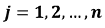
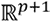
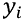
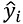
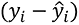
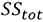

# 三、监督学习简介

## 学习目标

本章结束时，您将能够:

*   解释监督学习和机器学习工作流程
*   使用和探索北京 PM2.5 数据集
*   解释连续和分类因变量之间的区别
*   在 R 中实现基本的回归和分类算法
*   确定监督学习和其他类型的机器学习之间的主要区别
*   使用监督学习算法的评估指标
*   执行模型诊断，以避免有偏差的系数估计和较大的标准误差

在这一章中，我们将介绍监督学习，并用真实世界的例子演示建立机器学习模型的工作流程。

## 简介

在前面的章节中，我们探索了 R 的一些包，例如`dplyr`、`plyr`、`lubridate`和`ggplot2`，在这些包中，我们讨论了在 R 中存储和处理数据的基础。后来，在探索性数据分析(EDA)中使用了相同的思想，以了解将数据分成更小部分的方法，从数据中提取见解，并探索其他方法来更好地理解数据，然后再尝试高级建模技术。

在这一章中，我们将进一步介绍机器学习的思想。在为思考机器学习中的各种算法打下广泛基础的同时，我们将详细讨论监督学习。

监督学习基于被领域专家很好标记的数据。为了从图像中对猫和狗进行分类，算法首先需要看到标记为猫和狗的图像，然后根据标签学习特征。大多数拥有大量历史数据的企业是从这些数据中获取知识财富的最大受益者。如果数据是干净的，并且注释良好，监督学习可以产生高精度的预测，这与其他机器学习算法不同，其他机器学习算法通常在开始时产生较大的误差。在没有正确标签的情况下，除了能够进行探索性分析和聚类之外，很难从数据中获得任何意义。

解决现实世界问题的标准组件，如预测贷款违约(是/否)、工厂制造机器故障(是/否)、无人驾驶汽车中的物体检测(道路、汽车、信号)、预测股票市场价格(数字)是一组输入(特征)和给定输出(标签)，通常从历史数据中获得。当我们预测定量产出时，我们称之为**回归**，当我们预测定性产出时，我们称之为**分类**。

## 北京 PM2.5 数据集汇总

在许多国家的城市和农村地区，主要污染物细颗粒物是许多人类健康风险的原因，也影响气候变化。特别是 PM2.5，定义为空气动力学直径小于 2.5 米的空气传播颗粒，是大气颗粒物的主要类别。各种研究已经将 PM2.5 与严重的健康问题联系起来，如心脏病发作和肺部疾病。本节中的表格显示了大气颗粒物的类型及其尺寸分布，单位为微米。

在本章和其余章节中，我们将使用研究论文《评估北京的 PM2.5 污染:严重性、天气影响、亚太经合组织和冬季供暖》的作者发布的数据集，其中他们使用了在位于 116.47 E，39.95 N 的美国驻北京大使馆获得的每小时 PM2.5 读数，以及从 weather.nocrew.org 获得的在**北京首都国际机场**(**【BCIA】**)的每小时气象测量值。他们的研究声称首次将 PM2.5 和中国 PM2.5 污染的长期气象数据结合起来。下表描述了数据集中的属性:


###### 图 3.1:北京 PM2.5 数据集中的属性。

### 练习 40:探索数据

在本练习中，我们将学习每个属性的样本值的数据结构，并使用`summary`函数。我们将看到数字变量的五个数字摘要统计。

执行以下步骤来完成本练习:

1.  首先，使用以下命令将北京 PM2.5 数据集读入 PM25 DataFrame 对象:

    ```
    PM25 <- read.csv("https://raw.githubusercontent.com/TrainingByPackt/Applied-Supervised-Learning-with-R/master/Lesson03/PRSA_data_2010.1.1-2014.12.31.csv")
    ```

2.  Next, print the structure of data with sample values using the `str` command:

    ```
    str(PM25)
    ```

    前面命令的输出如下:

    ```
    'data.frame':	43824 obs. of  13 variables:
     $ No   : int  1 2 3 4 5 6 7 8 9 10 ...
     $ year : int  2010 2010 2010 2010 2010 2010 2010 2010 2010 2010 ...
     $ month: int  1 1 1 1 1 1 1 1 1 1 ...
     $ day  : int  1 1 1 1 1 1 1 1 1 1 ...
     $ hour : int  0 1 2 3 4 5 6 7 8 9 ...
     $ pm2.5: int  NA NA NA NA NA NA NA NA NA NA ...
     $ DEWP : int  -21 -21 -21 -21 -20 -19 -19 -19 -19 -20 ...
     $ TEMP : num  -11 -12 -11 -14 -12 -10 -9 -9 -9 -8 ...
     $ PRES : num  1021 1020 1019 1019 1018 ...
     $ cbwd : Factor w/ 4 levels "cv","NE","NW",..: 3 3 3 3 3 3 3 3 3 3 ...
     $ Iws  : num  1.79 4.92 6.71 9.84 12.97 ...
     $ Is   : int  0 0 0 0 0 0 0 0 0 0 ...
     $ Ir   : int  0 0 0 0 0 0 0 0 0 0 ...
    ```

    #### 注意

    观察数据集包含`43824`观察值和 13 个属性。注意数据集包含 2010 年到 2014 年的数据。pm2.5、温度、压力、组合风向、累积风速、累积降雪小时数和累积降雨小时数的值在一天中的每个小时进行汇总。

3.  Now, let's show the summary statistics of the dataset:

    ```
    summary(PM25)
    ```

    输出如下所示:

    ```
           No             year          month             day             hour           pm2.5       
     Min.   :    1   Min.   :2010   Min.   : 1.000   Min.   : 1.00   Min.   : 0.00   Min.   :  0.00  
     1st Qu.:10957   1st Qu.:2011   1st Qu.: 4.000   1st Qu.: 8.00   1st Qu.: 5.75   1st Qu.: 29.00  
     Median :21912   Median :2012   Median : 7.000   Median :16.00   Median :11.50   Median : 72.00  
     Mean   :21912   Mean   :2012   Mean   : 6.524   Mean   :15.73   Mean   :11.50   Mean   : 98.61  
     3rd Qu.:32868   3rd Qu.:2013   3rd Qu.:10.000   3rd Qu.:23.00   3rd Qu.:17.25   3rd Qu.:137.00  
     Max.   :43824   Max.   :2014   Max.   :12.000   Max.   :31.00   Max.   :23.00   Max.   :994.00  
                                                                                     NA's   :2067    
          DEWP              TEMP             PRES      cbwd            Iws               Is          
     Min.   :-40.000   Min.   :-19.00   Min.   : 991   cv: 9387   Min.   :  0.45   Min.   : 0.00000  
     1st Qu.:-10.000   1st Qu.:  2.00   1st Qu.:1008   NE: 4997   1st Qu.:  1.79   1st Qu.: 0.00000  
     Median :  2.000   Median : 14.00   Median :1016   NW:14150   Median :  5.37   Median : 0.00000  
     Mean   :  1.817   Mean   : 12.45   Mean   :1016   SE:15290   Mean   : 23.89   Mean   : 0.05273  
     3rd Qu.: 15.000   3rd Qu.: 23.00   3rd Qu.:1025              3rd Qu.: 21.91   3rd Qu.: 0.00000  
     Max.   : 28.000   Max.   : 42.00   Max.   :1046              Max.   :585.60   Max.   :27.00000  

           Ir         
     Min.   : 0.0000  
     1st Qu.: 0.0000  
     Median : 0.0000  
     Mean   : 0.1949  
     3rd Qu.: 0.0000  
     Max.   :36.0000
    ```

下图是大气颗粒物尺寸分布(以微米为单位)的图示:


###### 图 3.2:大气颗粒物的类型和尺寸分布(微米)。

###### 来源:https://en . Wikipedia . org/wiki/File:Airborne-particulate-size-chart . SVG

#### 注意

发表在**胸科疾病杂志** ( **JTD** )上的文章《PM2.5 对人体呼吸系统的影响》的作者讨论了空气污染与呼吸系统疾病的关联。他们提供了一个全面的数据驱动的方法来解释导致这些呼吸系统疾病的因素。北京受到了特别关注，那里的研究人员对 PM2.5 上升的不利影响进行了广泛研究，并已成为世界各地各种气候变化论坛的主流讨论点。你可以在 https://www.ncbi.nlm.nih.gov/pmc/articles/PMC4740125/.的文章中找到更多的细节

## 回归和分类问题

在我们的日常生活中，分类和回归问题随处可见。https://weather.com 下雨的可能性，我们的电子邮件被过滤到垃圾邮件邮箱和收件箱，我们的个人和家庭贷款被接受或拒绝，决定选择我们的下一个度假目的地，探索购买新房子的选择，获得短期和长期利益的投资决策，从亚马逊购买下一本书；这个清单还在继续。今天我们周围的世界越来越多地由帮助我们做出选择的算法来运行(这并不总是一件好事)。

正如在*第二章*、*对数据的探索性分析*中所讨论的，我们将使用**明托金字塔**原理，称为**情境-复杂-问题** ( **SCQ** )来定义我们的问题陈述。下表显示了 SCQ 解决北京 PM2.5 问题的方法:


###### 图 3.3:SCQ 在北京 PM2.5 问题上的应用。

现在，在上表描述的 SCQ 构造中，我们可以进行简单的相关性分析，以确定影响 PM2.5 水平的因素，或者创建一个预测问题(预测是指找到一个从输入变量映射到输出的近似函数)，使用所有因素来估计 PM2.5 水平。为术语清晰起见，我们将因子称为输入变量。然后，PM2.5 成为因变量(通常称为输出变量)。因变量可以是分类变量，也可以是连续变量。

例如，在将电子邮件分类成**垃圾邮件** / **非垃圾邮件**的问题中，因变量是分类变量。下表强调了回归和分类问题之间的一些关键差异:


###### 图 3.4:回归和分类问题的区别。

## 机器学习工作流程

为了演示建立预测模型(机器学习或监督学习)的端到端过程，我们创建了一个易于理解的工作流。第一步是设计问题，然后获取和准备数据，这导致为训练和评估编写模型代码，最后部署模型。在本章的范围内，我们将把模型解释保持在最低限度，因为它将在第 4 章和第 5 章中再次详细讨论。

下图描述了构建预测模型所需的工作流，从准备数据到部署模型:


###### 图 3.5:机器学习工作流程。

### 设计问题

一旦我们确定了工作的领域，就可以对问题的设计进行头脑风暴。其思路是首先将问题定义为回归或分类问题。一旦完成，我们就选择正确的目标变量，并识别特征。目标变量很重要，因为它决定了训练将如何进行。监督学习算法将目标变量保持在中心，同时试图从给定的特征集中找到模式。

### 来源和准备数据

数据收集和准备是一项艰苦的工作，主要是在数据来源多样和众多的情况下。对于每个数据源，挑战是不同的，因此处理它所需的时间也不同。具有表格数据的数据源最容易处理，前提是它们不包含大量垃圾信息，而文本数据由于其自由流动的特性而最难清理。

### 对模型进行编码

一旦数据准备就绪，我们就开始选择合适的模型。最常见的情况是，专家首先使用一个基线模型，使用输入特征和目标变量来衡量算法的预测能力。然后，人们可以直接尝试最先进的算法，或者决定采用试错法(尝试使用所有可能的模型)。一个人必须明白，模型没有对错之分，一切都取决于数据。编码时，数据随机分为训练和测试。编写代码是为了在训练数据集上训练模型，并对测试数据进行评估。这确保了模型在现实世界中部署时不会表现不佳。

### 训练和评估

模型评估是模型的重要组成部分，决定了模型在实践中的可用性。基于一组给定的模型评估指标，我们需要在所有的试验和错误之后，决定最佳的模型。在每次迭代中，都会计算 R 平方值、准确度、精度和 F 值等指标。通常，整个数据被分为训练和测试数据(通常还包括验证集的第三部分)。该模型根据训练数据进行训练，并根据测试数据进行测试。这种分离确保了模型不做任何机械学习。用更专业的术语来说，模型没有过度拟合(在本章的*评估指标*一节中有更多关于这一点的内容)。通常，在工作流的这个阶段，人们可以决定返回并包含更多的变量，训练模型，并重新部署。重复该过程，直到模型的准确性(或其他重要指标)达到稳定水平。

我们使用一个类似 R 中的`sample()`的随机数生成器函数将数据随机分成不同的部分，就像下一个练习 2 的步骤 2 中所做的那样。

### 练习 41:创建由北京 PM2.5 数据集随机生成的训练和测试数据集

在本练习中，我们将从北京 PM2.5 数据集创建一个随机生成的训练和测试数据集。我们将重用在前面的练习中创建的`PM25`对象。

执行以下步骤:

1.  创建一个`num_index`变量，并将其设置为与北京 PM2.5 数据集中的观测值相等的值:

    ```
    num_index <- nrow(PM25)
    ```

2.  使用`sample()`功能，随机选择 70%的`num_index`值，并存储在`train_index` :

    ```
    train_index <- sample(1:num_index, 0.7*nrow(PM25))
    ```

    中
3.  使用`train_index`从北京 PM2.5 数据集中随机选择一个行子集，并将它们存储在名为`PM25_Train` :

    ```
    PM25_Train <- PM25[train_index,]
    ```

    的数据帧中
4.  将剩余的观察值存储到名为`PM25_Test` :

    ```
    PM25_Test <- PM25[-train_index,]
    ```

    的数据帧中

本练习展示了一个创建训练和测试集的简单示例。用于训练和测试的随机选择的集合确保模型没有偏见，并且在用于真实世界的看不见的数据之前，从所有可能的例子中学习得很好。

### 部署模型

一旦选择了最佳模型，下一步就是让业务应用程序使用模型输出。该模型被托管为一个**代表性状态转移** ( **REST** ) API。这些 API 是一种将 web 应用程序作为端点来托管的方法，该端点监听任何模型调用请求，并且通常返回一个 JSON 对象作为响应。

模型的部署正在成为行业中所有机器学习项目的重要组成部分。一个不可部署的模型对一个公司来说是没有好处的，也许仅仅是为了研发的目的。越来越多的专业人员专门从事模型部署，这有时是一个冗长而复杂的过程。为了给模型部署以应有的重视，我们给了它一个专门的章节，那就是*第八章*、*模型部署*。

## 回归

现在我们已经看到了机器学习的工作流程，我们将采用两种广泛使用的机器学习算法:回归和分类；两者都采用监督学习来训练模型。这本书的整个主题都围绕着这两种类型的算法。北京 PM2.5 数据集将被广泛用于演示这两种类型。数据集将有助于理解如何将回归问题转化为分类问题，反之亦然。

### 简单和多元线性回归

回归是分析学和计量经济学中最有用和最基本的工具之一(经济学的一个分支，涉及使用数学方法，尤其是统计学，来描述经济系统)。在许多方面，现代机器学习植根于统计学，人们可以将这主要归功于弗朗西斯·高尔顿爵士的工作。高尔顿是英国维多利亚时代的统计学家和学者，对遗传学、心理学和人类学等领域有浓厚的兴趣和专业知识。他是第一个应用统计学方法研究人类行为和智力的人。值得注意的是，他的出版物《遗传地位回归平庸》中有许多基于回归的深刻发现。

在本节中，我们将使用北京数据集简要分析影响 PM2.5 水平的各种因素。特别是，露点、温度、风速和压力等变量对 PM2.5 的影响将被探究。

### 线性回归模型中的假设

由于回归从应用统计学中借用了许多概念来建模数据，因此它带有许多假设。人们不应该对任何数据集或问题应用回归算法。在建立任何模型之前，让我们检查一下线性回归的假设。

下表显示了这些假设以及我们如何统计检验线性回归模型是否符合假设。该表还显示了违反假设时的一些纠正措施。我们将对这些假设进行详细讨论，并进行诊断分析，以在第 4 章、*回归中更详细地识别违规。*


###### 图 3.6:线性回归模型中的各种假设(第一部分)。


###### 图 3.7:线性回归模型中的各种假设(第二部分)。

## 探索性数据分析(EDA)

建立回归模型需要深入分析目标变量和输入变量之间的模式和关系。北京的数据集提供了可能影响大气中 PM2.5 水平的不同环境因素的数量级。

### 练习 42:探索北京 PM2.5 数据集的 PM2.5、DEWP、温度和压力变量的时间序列视图

在本练习中，我们将把`pm2.5`、`DEWP`、`TEMP`和`PRES`变量可视化在一个时间序列图中，并观察这些变量中可能出现的任何模式。

执行以下步骤来完成练习:

1.  导入系统中所有需要的库:

    ```
    library(dplyr)
    library(lubridate)
    library(tidyr)
    library(grid)
    library(ggplot2)
    ```

2.  接下来，使用名为`ymd_h` :

    ```
    PM25$datetime <- with(PM25, ymd_h(sprintf('%04d%02d%02d%02d', year, month, day,hour)))
    ```

    的`lubridate`包函数将年、月和小时转换成日期时间
3.  使用以下命令绘制所有年份的 PM2.5、温度、DEWP 和压力:

    ```
    plot_pm25 <- PM25 %>%
      select(datetime, pm2.5) %>%
      na.omit() %>%
      ggplot() + 
      geom_point(aes(x = datetime, y = pm2.5), size = 0.5, alpha = 0.75) +
      ylab("PM2.5")
    plot_TEMP <- PM25 %>%
      select(datetime, TEMP) %>%
      na.omit() %>%
      ggplot() + 
      geom_point(aes(x = datetime, y = TEMP), size = 0.5, alpha = 0.75) +
      ylab("TEMP")
    plot_DEWP <- PM25 %>%
      select(datetime, DEWP) %>%
      na.omit() %>%
      ggplot() + 
      geom_point(aes(x = datetime, y = DEWP), size = 0.5, alpha = 0.75) +
      ylab("DEWP")
    plot_PRES <- PM25 %>%
      select(datetime, PRES) %>%
      na.omit() %>%
      ggplot() + 
      geom_point(aes(x = datetime, y = PRES), size = 0.5, alpha = 0.75) +
      ylab("PRES")
    ```

4.  Now, use the following command to plot the graphs:

    ```
    grid.newpage()
    grid.draw(rbind(ggplotGrob(plot_pm25), ggplotGrob(plot_TEMP),ggplotGrob(plot_DEWP),ggplotGrob(plot_PRES), size = "last"))
    ```

    剧情如下:


###### 图 3.8:散点图显示了从 2010 年到 2014 年底北京的温度、露点和压力等环境因素以及 PM2.5 水平的趋势和季节性。

在本练习中，我们首先展示来自数据集的`PM2.5`、`DEWP`、`TEMP`和`PRES`变量的时间序列视图，并观察其模式。如图*图 3.8* 所示，观察到明显的季节性`DEWP`、`TEMP`、`PRES`显示季节性(同一模式每 12 个月重复一次)，PM2.5 似乎具有随机模式。这是一个早期迹象，表明我们不太可能看到这三个变量对 PM2.5 的任何影响。但是，让我们使用相关图进一步探索以确定这一假设，并观察变量之间是否存在任何关系。

### 练习 43:进行相关性分析

在本练习中，我们将进行相关性分析，以研究各种因素之间的关系强度。

执行以下步骤来完成练习:

1.  使用以下命令将`corrplot`包导入系统:

    ```
    library(corrplot)
    ```

2.  现在，创建一个新对象，并将所需的值从`PM25`存储到其中:

    ```
    corr <- cor(PM25[!is.na(PM25$pm2.5),c("pm2.5","DEWP","TEMP","PRES","Iws","Is","Ir")])
    ```

3.  Use the `corrplot` package to display the graphical representation of a correlation matrix:

    ```
    corrplot(corr)
    ```

    剧情如下:


###### 图 3.9:北京数据集中所有变量对之间的相关性。

首先，我们计算所有变量之间的相关性。由此得出的相关图显示，PM2.5 和其他变量之间似乎没有很强的相关性。然而，`PM2.5`和`DEWP`、`TEMP`和`Iws`显示了一些轻微的相关性，这表明了一些关系。这不应该令人惊讶，因为我们在*图 3.8* 中看到，虽然三个变量遵循季节性趋势，但 PM2.5 似乎更随机。请注意，我们没有对数据集进行任何处理或转换；这些发现直接来自我们的第一层次分析。我们将在后面的第四章、*回归*中详细介绍。现在，让我们用散点图来形象化变量之间的关系。

### 练习 44:绘制散点图，探讨 PM2.5 水平与其他因素之间的关系

在本练习中，我们将使用散点图来探究`pm2.5`水平和其他因素之间的关系。我们想看看是否会出现任何有趣的模式或关系。散点图是对变量之间的关系进行探索性分析的一种简单而有效的可视化方法。

执行以下步骤来完成练习:

1.  将`ggplot2`包导入您的系统:

    ```
    library(ggplot2)
    ```

2.  Plot the scatterplot between `DEWP` and `PM2.5`, with the `month` variable used for color:

    ```
    ggplot(data = PM25, aes(x = DEWP, y = pm2.5, color = month)) +  geom_point() +  geom_smooth(method='auto',formula=y~x, colour = "red", size =1.5)
    ```

    散点图如下:

    

    ###### 图 3.10:显示 DEWP 和 PM2.5 水平之间关系的散点图。

3.  Plot the scatterplot between `TEMP` and `PM2.5`, with the `month` variable used for color:

    ```
    ggplot(data = PM25, aes(x = TEMP, y = pm2.5, color = month)) +  geom_point() +  geom_smooth(method='auto',formula=y~x, colour = "red", size =1.5)
    ```

    散点图如下:

    

    ###### 图 3.11:显示温度和 PM2.5 水平之间关系的散点图。

4.  Create a scatterplot between `DEWP` and `PM2.5`, with an hour of the day used for color and separate views for months of the year:

    ```
    ggplot(data = PM25, aes(x = DEWP, y = pm2.5, color = hour)) +  geom_point() +  geom_smooth(method='auto',formula=y~x, colour = "red", size =1) +  facet_wrap(~ month, nrow = 4)
    ```

    散点图如下:


###### 图 3.12:显示 DEWP 和 PM2.5 之间关系的散点图，按一年中的月份划分。

为了测量变量之间的一些关系，我们使用了一个在`PM2.5`和`DEWP`之间的散点图和一条拟合线。注意，在代码中，我们向`geom_smooth()`传递了一个参数，即`method = "auto"`，它会根据数据自动决定使用哪个模型来拟合一行。如*图 3.10* 所示，直线不是直线。`geom_smooth`法选择`TEMP`和`PM2.5`图，如图*图 3.11* 所示。然而，我们可以更进一步，按月分割散点图，如图*图 3.12* 所示。这表明存在线性关系，但它高度依赖于季节。比如四月(用整数`4`表示)`DEWP`和`PM2.5`有近乎完美的直线拟合。我们将在*第 4 章*、*回归*中进一步详述这一讨论。

因此，我们已经看到了一些违反假设的情况，以及环境因素和 PM2.5 之间缺乏强相关性。然而，似乎还有一些进一步研究的空间。在这个关于监督学习的介绍性章节中，我们将只关注基于我们的机器学习工作流程的方法。

#### 注意

想了解更多关于 GAM 的内容，可以查阅这个文档:https://www . stat . CMU . edu/~ cshalizi/uADA/12/lectures/ch13 . pdf。

### 活动 5:绘制 PRES 和 PM2.5 之间的散点图，按月份划分

在本活动中，我们将在`DWEP`和`PM2.5`之间创建一个散点图。通过这个活动，我们将学习使用`facet_wrap()`功能在`ggplot()`之上创建一个层，用于将散点图的可视化拆分为每个月，从而有助于观察任何季节性模式。

执行以下步骤来完成活动:

1.  在`ggplot`中，用`PRES`变量分配`a()`方法的组件。
2.  在`geom_smooth()`方法的下一层，设置`colour = "blue"`进行微分。
3.  Finally, in the `facet_wrap()` layer, use the `month` variable to draw a separate segregation for each month.

    剧情如下:


###### 图 3.13:显示 PRES 和 PM2.5 之间关系的散点图。

#### 注意

这项活动的解决方案可在第 445 页找到。

### 模型构建

我们已经简要地探讨了`PM2.5`和几个因素如`TEMP`和`DEWP`之间的关系。对于其他变量，如`PRES`、`Iwd`等，也可以进行同样的分析。在本节中，让我们创建一个线性模型。(即使我们知道选择的模型不是最好的，我们也会毫不犹豫地运行模型。机器学习中的试错法总是建立事实的最佳方式。)

一般来说，线性回归模拟输入变量(自变量)和目标变量(因变量或解释变量)之间的线性关系。如果我们有一个解释变量，它被称为**简单线性回归**，如果有一个以上的解释变量，它被称为**多元线性回归**。以下等式是带有 *p* 解释变量和 *n* 观测值的线性回归或线性预测函数的数学表示:


这里，每个是的列值(解释变量)的向量，是未知参数或系数。使该方程适用于简单线性回归。有许多算法可以将这个函数拟合到数据上。最流行的是**普通最小二乘** ( **OLS** )。我们将在下一章回归中详细讨论 OLS。

另一种思考的方式是，它是一个线性预测函数，尽可能地拟合—维度空间中的观察值，最小化残差平方和(目标值的实际值与预测值的差异)。

在下面的练习中，我们将跳过将数据集分为训练和测试，因为我们仍处于探索阶段，尚未决定正式进行建模练习。(我们将在下一章谈到这一点。)我们将使用 R 中的`lm()`方法来构建线性模型。同样，在下一章会有更多的细节。此时，注意到`lm()`使用一个或多个输入变量将目标变量拟合成直线就足够了。在简单的线性回归中，我们只使用一个变量来拟合直线，而在多元线性回归中，我们可以使用多个变量。

### 练习 45:探索简单和多元回归模型

在本练习中，我们将探索简单和多元回归模型。

执行以下步骤来完成练习:

1.  将所需的库和包导入 R-Studio。
2.  接下来，创建一个名为`simple_PM25_linear_model`的 DataFrame 对象，并使用`lm()`方法构建一个线性模型:

    ```
    simple_PM25_linear_model <- lm(pm2.5 ~ DEWP, data = PM25)
    ```

3.  Print the summary of the object using the summary method, as illustrated here:

    ```
    summary(simple_PM25_linear_model)
    ```

    输出如下所示:

    ```
    Call:
    lm(formula = pm2.5 ~ DEWP, data = PM25)
    Residuals:
        Min      1Q  Median      3Q     Max 
    -115.47  -61.26  -28.75   33.83  923.54 
    Coefficients:
                Estimate Std. Error t value Pr(>|t|)    
    (Intercept) 96.69984    0.44705  216.31   <2e-16 ***
    DEWP         1.09325    0.03075   35.55   <2e-16 ***
    ---
    Signif. codes:  0 '***' 0.001 '**' 0.01 '*' 0.05 '.' 0.1 ' ' 1
    Residual standard error: 90.69 on 41755 degrees of freedom
      (2067 observations deleted due to missingness)
    Multiple R-squared:  0.02939,	Adjusted R-squared:  0.02936 
    F-statistic:  1264 on 1 and 41755 DF,  p-value: < 2.2e-16
    ```

4.  接下来，创建另一个 DataFrame 对象，并使用`lm()`方法构建一个线性模型:

    ```
    multiple_PM25_linear_model <- lm(pm2.5 ~ DEWP+TEMP+Iws, data = PM25)
    ```

5.  Print the summary of the model object using the `summary` function:

    ```
    summary(multiple_PM25_linear_model)
    ```

    输出如下所示:

    ```
    A)
    ______________________________________________________________
    Call:
    lm(formula = pm2.5 ~ DEWP + TEMP + Iws, data = PM25)
    Residuals:
        Min      1Q  Median      3Q     Max 
    -149.02  -53.74  -16.61   34.14  877.82 
    ______________________________________________________________
    B)
    ______________________________________________________________
    Coefficients:
                  Estimate Std. Error t value Pr(>|t|)    
    (Intercept) 161.151207   0.768727  209.63   <2e-16 ***
    DEWP          4.384196   0.051159   85.70   <2e-16 ***
    TEMP         -5.133511   0.058646  -87.53   <2e-16 ***
    Iws          -0.274337   0.008532  -32.15   <2e-16 ***
    ---
    Signif. codes:  0 '***' 0.001 '**' 0.01 '*' 0.05 '.' 0.1 ' ' 1
    ______________________________________________________________
    C)
    ______________________________________________________________
    Residual standard error: 81.51 on 41753 degrees of freedom
      (2067 observations deleted due to missingness)
    Multiple R-squared:  0.216,	Adjusted R-squared:  0.2159 
    F-statistic:  3834 on 3 and 41753 DF,  p-value: < 2.2e-16
    ______________________________________________________________
    ```

### 模型解释

现在，基于简单和多元线性回归模型的先前输出，让我们试着理解输出的每个部分意味着什么。在这本书的这个节骨眼上，知道每一部分的意思就足够了；我们将在第四章、*回归*中讨论结果。

*   第`lm()`部分方法，包含因变量和自变量，用符号`~`表示为公式。这类似于我们的线性预测函数。在简单的回归模型中，只有一个变量——`DEWP`——而在多元模型中，有`DEWP`、`TEMP`和`Iws`。您还可以看到残差的五个汇总统计数据(最小值、第一个四分位数、中值、第三个四分位数和最大值)。这表示预测值与实际值的差距。
*   进入我们的预测方程，我们将得到预测。名为`Std`的栏目。误差是估计值的标准误差。取`Estimate`和`Std`的比值得到 t 值。误差，p 值突出了估计的统计显著性。视觉线索，也就是`*`和。符号基于 p 值。小于 0.001 的值得到一个三星，而介于 0.1 和 0.05 之间的值得到一个`.`(点)。三星表示最好的情况，对应于自变量的估计值在预测(或解释)因变量时是重要且有用的。换句话说，p 值有助于确定回归模型相对于空模型(只是因变量的平均值)的显著性。
*   Part **C**:

    这一部分是展示模型功效的部分。要观察的最重要的值是 R 平方值和调整后的 R 平方值，它们是统计测量值，表示回归模型中由自变量解释的因变量的变化百分比。

浏览本章中关于评估指标的部分，了解模型在 R 平方和调整后的 R 平方指标上的表现。

## 分类

与回归算法类似，分类也从因变量或目标变量中学习，并使用所有预测变量或自变量来找到正确的模式。主要的区别来自于这样一个想法，在分类中，目标变量是分类的，而在回归中，它是数字的。在本节中，我们将使用北京 PM2.5 数据集介绍逻辑回归来演示这一概念。

### 逻辑回归

**逻辑回归**是用于二元分类的最有利的白盒模型。白盒模型被定义为提供对为预测所做的整个推理的可视性的模型。对于所做的每一个预测，我们可以利用模型的数学方程，并解码所做预测的原因。还有一组完全是黑箱的分类模型，也就是说，我们决不能理解模型所利用的预测的推理。在我们只想关注最终结果的情况下，我们应该更喜欢黑盒模型，因为它们更强大。

### 简介

尽管名称以**回归**结尾，逻辑回归是一种用于预测二元分类结果的技术，因此是分类问题的一个好选择。正如上一节所讨论的，我们需要一种不同的方法来为分类结果建模。这可以通过将结果转换成比值比或事件发生概率的对数来实现。

让我们将这种方法提炼为更简单的结构。假设一个事件成功的概率是 0.7。那么，同一事件的故障概率将被定义为*1–0.7 = 0.3*。成功的几率被定义为成功的概率与失败的概率之比。那么成功的几率将是 *0.7/0.3 = 2.33* ，也就是说，成功的几率是 2 比 1。如果成功的概率是 0.5，也就是 50%的几率，那么成功的几率是 1 比 1。逻辑回归模型可以用数学方法表示如下:


这里，是比值比的对数，也叫 **logit** 函数。进一步解决数学问题，我们可以推导出结果的概率，如下所示:


讨论方程的数学背景和推导超出了本章的范围。但是，总而言之，logit 函数，也就是链接函数(或逻辑函数)，帮助逻辑回归将问题(预测结果)直观地重新架构为比值比的对数。这个问题解决后，有助于我们预测一个二元因变量的概率。

### 逻辑回归的机理

就像线性回归一样，使用 OLS 方法估计变量的贝塔系数，逻辑回归模型利用了**最大似然估计** ( **MLE** )方法。MLE 函数估计模型参数或β系数的最佳值集合，使得它最大化似然函数，即概率估计。也可以定义为所选模型与观测数据的*一致*。当估计出一组最佳参数值时，将这些值/β系数代入模型方程，如前所述，有助于估计给定样本的结果概率。类似于 OLS，MLE 是一个迭代过程。

### 模型构建

像在 R 中构建逻辑回归模型的线性回归一样，我们使用`glm()`广义线性模型方法来拟合数据，并使用 logit 函数对观察值进行评分。

使用 glm()函数的语法如下:

```
glm(Y ~ X1 + X2 + X3, data = <train_data>,family=binomial(link='logit'))
```

这里，Y 是我们的因变量，X1、X2 和 X3 是自变量。参数数据将采用定型数据集。family 参数设置为二项式(link='logit ')，这符合逻辑回归模型。

### 练习 46:在北京 PM2.5 数据集中存储 3 小时的滚动平均值

在本练习中，我们将创建一个新变量，用于存储北京 PM2.5 数据集中 PM2.5 变量的 3 小时滚动平均值。滚动平均值将消除 PM2.5 读数中的任何噪音。

让我们使用`zoo`包中的`rollapply`方法来完成练习:

1.  将`year`、`month`、`day`和`hour`组合成一个新变量，称为`datetime` :

    ```
    PM25$datetime <- with(PM25, ymd_h(sprintf('%04d%02d%02d%02d', year, month, day,hour)))
    ```

2.  Remove the NAs and look at the top 6 values of the `pm2.5` variable in the PM2.5 dataset:

    ```
    PM25_subset <- na.omit(PM25[,c("datetime","pm2.5")])
    head(PM25_subset$pm2.5)
    ```

    输出如下所示:

    ```
    [1] 129 148 159 181 138 109
    ```

3.  Store the `PM25_subset` into a `zoo` object of ordered observation with datetime as its index, and print the top 6 values:

    ```
    zoo(PM25_subset$pm2.5,PM25_subset$datetime)
    ```

    输出如下所示:

    ```
    2010-01-02 00:00:00 2010-01-02 01:00:00 2010-01-02 02:00:00 
                    129                 148                 159 
    2010-01-02 03:00:00 2010-01-02 04:00:00 2010-01-02 05:00:00 
                    181                 138                 109 
    ```

4.  Use the `rollapply` function to create a 3-hour rolling average of the `pm2.5` variable, and print the top 6 values:

    ```
    PM25_three_hour_pm25_avg <- rollapply(zoo(PM25_subset$pm2.5,PM25_subset$datetime), 3, mean)
    ```

    输出如下所示:

    ```
    2010-01-02 01:00:00 2010-01-02 02:00:00 2010-01-02 03:00:00 
               145.3333            162.6667            159.3333 
    2010-01-02 04:00:00 2010-01-02 05:00:00 2010-01-02 06:00:00 
               142.6667            117.3333            112.6667 
    ```

注意`145.33`值是`pm2.5`变量三个小时的平均值，如步骤 3 所示(`129`、`148`和`159`)。

### 活动 6:转换变量并导出新变量以构建模型

在此活动中，我们将在构建模型之前执行一系列转换并导出新变量。我们需要将`pm2.5`变量转换成分类变量，以应用逻辑回归模型。

在建立逻辑回归分类模型之前，需要执行以下步骤:

1.  将年、月、日和小时组合成一个名为`datetime`的新变量。
2.  使用日期时间变量，计算 3 小时窗口内`pm2.5`值的平均值。将这个新变量命名为`PM25_three_hour_pm25_avg`。
3.  创建一个名为`pollution_level`的二进制变量。如果`PM25_three_hour_pm25_avg`大于`35`，它就会得到一个值`1`，否则就是`0`。
4.  以`pollution_level`为因变量，建立逻辑回归模型。
5.  Print the summary of the model.

    最终输出如下:

    ```
    Call:
    glm(formula = pollution_level ~ DEWP + TEMP + Iws, family = binomial(link = "logit"), 
        data = PM25_for_class)
    Deviance Residuals: 
        Min       1Q   Median       3Q      Max  
    -2.4699  -0.5212   0.4569   0.6508   3.5824  
    Coefficients:
                  Estimate Std. Error z value Pr(>|z|)    
    (Intercept)  2.5240276  0.0273353   92.34   <2e-16 ***
    DEWP         0.1231959  0.0016856   73.09   <2e-16 ***
    TEMP        -0.1028211  0.0018447  -55.74   <2e-16 ***
    Iws         -0.0127037  0.0003535  -35.94   <2e-16 ***
    ---
    Signif. codes:  0 '***' 0.001 '**' 0.01 '*' 0.05 '.' 0.1 ' ' 1
    (Dispersion parameter for binomial family taken to be 1)
        Null deviance: 49475  on 41754  degrees of freedom
    Residual deviance: 37821  on 41751  degrees of freedom
    AIC: 37829
    Number of Fisher Scoring iterations: 5
    ```

    #### 注意

    这项活动的解决方案可在第 446 页找到。

### 解读模型

`glm()`输出的大部分看起来与`lm()`方法相似，但有一些新值，如下所示:

*   **零偏差**
*   **剩余偏差**
*   **赤艾克信息标准** ( **AIC** )
*   **费希尔得分**

为避免评分，以上所有措施将在*第五章*、*分类*中详细描述。

请参考本章中关于*评估指标*的下一节(基于*混淆矩阵的指标*一节)，了解该模型在 R 平方和调整后的 R 平方指标上的表现。

## 评估指标

在本节中，我们将介绍所有用于评估机器学习模型预测质量的评估方法。基于因变量，我们有几种评估方法可供选择。在我们的机器学习工作流的训练和评估步骤中，我们提到，直到我们得到期望的结果，我们通过添加新的变量或改变参数来不断迭代训练模型。在每一次迭代中，我们试图为任何一个或两个评估指标进行优化。下表总结了用于回归、分类和推荐系统的各种类型的指标。鉴于本书的范围，我们将深入研究回归和分类算法的更多细节:


###### 图 3.14:各种机器学习算法的指标。

### 平均绝对误差(MAE)

绝对误差是方向不可知的，这意味着模型对测试数据集的因变量预测值是小于还是大于实际值并不重要。因此，在北京 PM2.5 数据集的示例中，MAE 将给出 PM2.5 预测的平均绝对误差(因变量的预测值和实际值之间的差异)，与误差方向(正或负)无关:


这里，是因变量的第 I 次观测值，是预测值或期望值。

### 均方根误差(RMSE)

与 MAE 类似，均方根误差也计算平均预测误差。但是，它是基于二次评分的，计算的是平均平方误差的平方根。此外，与 MAE 不同，MAE 采用预测值和实际值之间的绝对差值，RMSE 采用平方，在取平方根之前对高误差值增加更多权重:


这里，表示第 I 次观测的因变量的实际值和估计值之差。

### R 平方

r 平方测量由线性模型解释的响应变量中方差的百分比(0 到 1 或 0%到 100%之间的值)。换句话说，它测量由输入要素解释的方差。0% R 平方意味着模型的输入特征不能解释响应变量。接近 100%意味着该模型是响应变量的良好预测器。例如，如果我们想预测某个地区的房价，可以使用卧室数量、面积等特征。靠近学校和市场决定了房产的价值。然而，R 平方不能单独用于评估模型的良好性。还需要对残差、正态性和异方差进行各种诊断检查。我们将在第四章、*回归*中详细讨论这一点。


这里，是因变量的实际值和估计值的平方差之和，而表示因变量的实际值和均值的平方差之和。


### 调整后的 R 平方

当我们在回归模型中添加新变量时，模型的 R 平方值会随着新变量对解释因变量变化的贡献增加而提高。(如果较新的变量设计得不好，并且与解释因变量无关，就会出现相反的论点。)因此，对于不知道变量数量的评估度量，我们通过在计算中结合 *n* 和 *q* (分别为观察数量和变量数量)来惩罚 R 平方值。这被称为调整的 R 平方，根据观察值和变量的数量进行调整。在处理多元线性回归时，查看调整后的 R 平方是一个很好的做法。

**均方误差** ( **均方误差**):


这里， *n* 是观测值的个数， *q* 是模型中系数的个数。

**MST** ( **均方总数**):


### 平均倒数排名(MRR)

MRR 广泛用于评估搜索引擎中的算法、推荐算法和数字空间中的许多其他信息检索算法。MRR 很容易理解。一般来说，它可以用来评估为输入生成响应列表的算法。例如，你在谷歌上看到的搜索结果和你在亚马逊上看到的产品推荐。下表显示了计算倒数排名的示例。MRR 的范围从 0 到 1；接近 1 的值表示该算法在列表顶部给出相关结果。


###### 图 3.15:计算倒数排名的例子。

### 练习 47:寻找评估指标

在本练习中，我们将找到 MAE、RMSE、R 平方、调整 R 平方和 MRR。

执行以下步骤:

1.  导入所需的库和包。
2.  创建一个名为`y_predicted`的变量，并从`multiple_PM25_linear_model` :

    ```
    y_predicted <- predict(multiple_PM25_linear_model, data = PM25)
    ```

    中赋值
3.  使用以下命令分配来自`PM25`数据集的值:

    ```
    y_actual <- PM25[!is.na(PM25$pm2.5),"pm2.5"]
    ```

4.  Find the MAE using the mean function:

    ```
    MAE <- mean(abs(y_actual - y_predicted))
    ```

    输出如下所示:

    ```
    ## [1] 59.82112
    ```

5.  Next, calculate the RMSE:

    ```
    RMSE <- sqrt(mean((y_actual - y_predicted)^2))
    ```

    输出如下所示:

    ```
    ## [1] 82.09164
    ```

6.  Now, calculate the R-squared value using the following command:

    ```
    model_summary <- summary(multiple_PM25_linear_model)
    model_summary$r.squared
    ```

    输出如下所示:

    ```
    ## [1] 0.216
    ```

7.  Next, find the adjusted R-squared using the following command:

    ```
    model_summary$adj.r.squared
    ```

    输出如下所示:

    ```
    ## [1] 0.2159
    ```

8.  Finally, use the following command to find the MRR:

    ```
    Query_RR_Vector <- c(1/3,1/4,1)
    MRR <- sum(Query_RR_Vector)/length(Query_RR_Vector)
    ```

    输出如下所示:

    ```
    ## [1] 0.5277778
    ```

注意到 MAE 给出了一个值`59.82`而 RMSE 是`82.09,`，这显示了误差中的高方差。换句话说，观测值在预测中具有高误差(这增加了误差幅度的频率分布的方差);梅没有发现错误，而 RMSE 很好地放大了它。如果 MAE 和 RMSE 几乎相等，我们可以推断误差幅度的频率分布的方差很低，并且模型对所有的观测都做得很好。

### 基于混淆矩阵的指标

在分类算法中使用基于混淆矩阵的度量。人们可以从混淆矩阵(也称为`A`和`B`)中获得一系列指标。否则，目标变量没有任何积极或消极的一面。列联表也可以是 NxN，其中 *N* 是响应变量中类或类别的数量。例如，如果我们想对给定图像中的 26 个手写英文字母进行分类，我们需要一个 26x26 的矩阵:


###### 图 3.16:混淆矩阵的元素。

如果我们将 **TP** 、 **TN** 、 **FP** 和 **FN** 排列成一个 2x2 的列联矩阵，我们得到混淆矩阵，如下表所示:


###### 图 3.17:混淆矩阵。

### 精确度

准确性衡量模型对正面和负面示例的正确总体分类。矩阵中对角元素的总和(TP 和 TN)除以正和负观察值的总数给出了精度。在现实世界中，准确性并不总是一个可靠的指标。考虑到我们想要区分癌症 CT 扫描和良性 CT 扫描。很明显，我们可能有很多阴性扫描，很少有阳性扫描。这就导致了我们所说的**不平衡数据集**。如果该模型主要准确预测良性扫描，但在预测癌症 CT 扫描时产生显著误差，则准确性可能仍然很高，但该模型并不那么有用。


### 灵敏度

为了解决我们讨论的关于*准确性*的问题，我们可以使用灵敏度(也称为回忆、命中率或**真阳性率** ( **TPR** )和特异性(在下一节讨论)的组合。灵敏度给出了模型对于阳性病例(在 ct 扫描中检测癌症)的预测能力。我们从所有**真阳性** ( **TP** )病例数与**阳性** ( **P** )病例数之比获得灵敏度。


### 特异性

特异性提供了对阴性样本正确预测的定量评估(例如，检测良性 ct 扫描)。我们从真阴性病例数与阴性病例数的比率中获得敏感性。


高灵敏度和特异性值意味着更好的模型。在大多数情况下，我们试图平衡这两个指标以获得最佳模型。

### F1 分数

F1 得分通过取两者的调和平均值(适用于取两个或更多比率的平均值)将精确度和灵敏度结合起来，如以下公式所述。**阳性预测值** ( **PPV** 或 precision)衡量真阳性和假阳性总数的真预测数，即阳性病例的所有预测中有多少是正确的。


F1 分数比准确性更稳健，但在不平衡类别的情况下仍然受到影响。

评估分类模型的好坏没有好坏之分。机器学习实践者通常会查看许多指标的组合来得出模型的好坏。这就是为什么知道如何解释上面讨论的每个指标变得很重要。

### 练习 48:使用训练数据的模型评估

在本练习中，我们将使用`caret`包中的`confusionMatrix`函数对训练数据进行模型评估。该函数打印准确性、敏感性、特异性等指标。

执行以下步骤来完成练习:

1.  将所需的库和包导入系统。
2.  创建一个变量名`predicated`并赋值，如下所示:

    ```
    predicted <- ifelse(PM25_logit_model$fitted.values>0.5, 1,0)
    ```

3.  接下来，创建另一个名为`actual`的变量，如下所示:

    ```
    actual <- PM25_for_class$pollution_level
    ```

4.  导入插入符号库:

    ```
    library(caret)
    ```

5.  Finally, use the `confusionMatrix` method to describe the performance of the classification model:

    ```
    confusionMatrix(predicted, actual)
    ```

    输出如下所示:

    ```
    ## Confusion Matrix and Statistics
    ## 
    ##           Reference
    ## Prediction     0     1
    ##          0  5437  2097
    ##          1  6232 27989
    ##                                           
    ##                Accuracy : 0.8005          
    ##                  95% CI : (0.7967, 0.8044)
    ##     No Information Rate : 0.7205          
    ##     P-Value [Acc > NIR] : < 2.2e-16       
    ##                                           
    ##                   Kappa : 0.4444          
    ##  Mcnemar's Test P-Value : < 2.2e-16       
    ##                                           
    ##             Sensitivity : 0.4659          
    ##             Specificity : 0.9303          
    ##          Pos Pred Value : 0.7217          
    ##          Neg Pred Value : 0.8179          
    ##              Prevalence : 0.2795          
    ##          Detection Rate : 0.1302          
    ##    Detection Prevalence : 0.1804          
    ##       Balanced Accuracy : 0.6981          
    ##                                           
    ##        'Positive' Class : 0               
    ```

本节描述了`confusionMatric()`输出结果中显示的许多指标。然而，在你阅读细节之前，这里有一个快速的总结。该 logistic 回归模型的准确率为 80%，符合标准。这表明，我们可以使用其他环境因素以 80%的准确度预测正常和高于正常的 PM2.5 值。但是，请注意，精确度是针对整个训练数据集的。我们没有将数据分为两部分来检查过度拟合情况，在这种情况下，模型在训练数据上测试时表现非常好，但在测试(或看不见的)数据上显示出较差的结果。

敏感性和特异性分别为 46%和 93%。这意味着该模型对负面情况(高于正常 pm 2.5 1)有好处。通常，这两个指标之间必须有一个折衷。然而，在这种情况下，模型的优先级是能够预测尽可能多的高于正常状态的**。因此，一旦我们有了混淆矩阵，高特异性是可取的；从中可以计算出所有的指标。**

### 受试者工作特性(ROC)曲线

在分类模型的上下文中，预测的输出是作为定量估计获得的，通常是概率度量。在二元逻辑回归中，将一个观察结果与另一个观察结果进行分类的阈值通常选择为 0.5(例如，垃圾邮件与非垃圾邮件)。这意味着，如果概率大于 0.5，将其分类为垃圾邮件，如果不是，则为非垃圾邮件。现在，根据阈值的不同，您将在我们之前讨论的混淆矩阵中获得不同的 TP、TN、FP 和 FN 值。虽然在给定阈值(通常为 0.5)下查看混淆矩阵是一种标准做法，但它可能不会给我们提供模型在现实世界中是否表现良好的完整视图，这就是阈值选择至关重要的原因。

ROC 曲线是一个优雅的可视化图，显示了在每个可能的阈值下，真阳性率(通常以灵敏度为参考)和真阴性率(通常以特异性为参考)之间的变化。它帮助我们确定正确的分类阈值。此外，ROC 曲线下的面积(称为 AUC)在 0 和 1 之间变化，它告诉我们模型有多好。接近 1 意味着该模型能够在大多数观察结果中成功地在正类和负类之间进行分类。

使用 R 中的 ROCR 包，我们将使用逻辑回归获得 PM2.5 预测的 ROC 曲线。此外，我们将在下一个练习中观察 AUC。

### 练习 49:创建 ROC 曲线

在这个练习中，我们将使用 ROCR 软件包来获得 ROC 曲线。

执行以下步骤:

1.  使用以下命令将 ROCR 包导入系统:

    ```
    library(ROCR)
    ```

2.  接下来，定义 pred1 和 pref1 对象:

    ```
    pred1 <- prediction(predict(PM25_logit_model), PM25_for_class$pollution_level)
    perf1 <- performance(pred1,"tpr","fpr")
    ```

3.  Next, find the AUC using the following command:

    ```
    auc <- performance(pred1,"auc")
    as.numeric(auc@y.values)
    ```

    输出如下所示:

    ```
    ## [1] 0.8077673
    ```

4.  使用绘图命令绘制图形:

    ```
    plot(perf1)
    ```

    

###### 图 3.18:真阳性率(灵敏度)和假阳性率(特异性)之间的 ROC 曲线。

## 总结

在这一章中，我们从构建机器学习工作流的过程开始，从设计问题开始，到部署模型。我们简要地讨论了简单和多重回归以及逻辑回归，以及解释和判断模型性能所需的所有评估指标。这两个算法分别演示了回归和分类问题的监督学习。

在本章中，我们使用北京 PM2.5 数据集来建立模型。在此过程中，我们还通过简单地重新设计因变量，将回归问题转换为分类问题。这种重新设计通常用于现实世界中的问题，以适应特定的用例。

在下一章中，我们将深入研究回归算法的细节，并将阐述线性回归之外的各种类型的回归算法，并讨论何时使用哪一种。