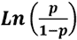
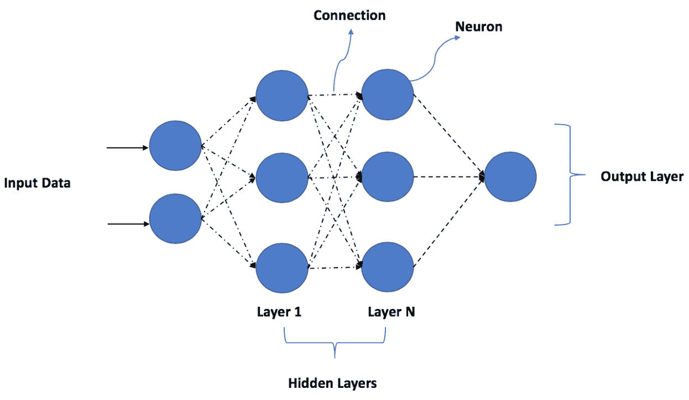

# 五、分类

## 学习目标

本章结束时，您将能够:

*   在监督机器学习中定义二进制分类
*   使用白盒模型执行二元分类:逻辑回归和决策树
*   评估监督分类模型的性能
*   使用黑盒集成模型-随机森林和 XGBoost 执行二元分类
*   设计和开发用于分类的深度神经网络
*   为给定的分类用例选择最佳模型

在这一章中，我们将关注解决监督学习的分类用例。我们将使用一个为分类用例设计的数据集，围绕它构建一个业务问题，并探索一些流行的技术来解决这个问题。

## 简介

让我们快速复习一下在*第三章*、*监督学习简介*中学习的主题。正如你现在已经知道的，监督学习是机器学习和人工智能的分支，它帮助机器在没有显式编程的情况下进行学习。描述监督学习的一种更简单的方式是开发从标记数据中学习的算法。监督学习中的主要类别是分类和回归，从根本上根据标签的类型进行区分，即**连续**或**分类**。处理连续变量的算法称为**回归算法**，处理分类变量的算法称为**分类算法**。

在分类算法中，我们的目标、因变量或标准变量是一个**分类变量**。根据班级的数量，我们可以进一步将他们分为以下几组:

*   二元分类
*   多项式分类
*   多标签分类

在本章中，我们将重点介绍**二进制分类**。讨论多项式和多类分类的细节和实例超出了本章的范围；然而，在本章结束之前，我们会列出一些高级主题的额外阅读参考资料。

二进制分类算法是机器学习中最受欢迎的一类算法，在商业、研究和学术界有许多应用。简单的模型根据学生过去的表现将他们通过未来考试的机会分类为通过或失败，预测是否会下雨，预测客户是否会拖欠贷款，预测病人是否患有癌症，等等都是分类算法解决的常见用例。

在深入研究算法之前，我们将首先从一个用例开始，它将帮助我们通过动手练习解决一个监督学习分类问题。

## 使用案例入门

在本章中，我们将参考从澳大利亚联邦气象局获得并通过 r 提供的`weather`数据集。该数据集有两个目标变量，`RainTomorrow`，一个指示明天是否下雨的标志，和`RISK_MM`，测量第二天的降雨量。

简而言之，我们可以使用这个数据集进行分类练习。有关数据集的元数据和其他详细信息可在 https://www . rdocumentation . org/packages/rattle/versions/5 . 2 . 0/topics/weather 上找到。由于数据集很容易通过 R 获得，我们不需要单独下载它；相反，我们可以直接使用`rattle`库中的 R 函数将数据加载到系统内存中。

### 使用案例的一些背景

几个天气参数，如温度、方向、压力、云量、湿度和日照，在一年中每天都被记录下来。第二天的降雨量已经在数据集中设计为目标变量`RainTomorrow`。我们可以利用这些数据来定义一个机器学习模型，该模型从当天的天气参数中学习，并预测第二天下雨的可能性。

降雨量预测对许多行业来说至关重要。乘坐火车和公共汽车的长途旅行通常会观察变化的天气模式，主要是降雨量，以估计到达时间和旅程长度。同样，大多数实体店、小餐馆和小吃店等都受到降雨的严重影响。获得第二天天气状况的可见性可以帮助企业在几个方面更好地准备，以应对业务损失，在某些情况下，可以最大限度地提高业务成果。

为了围绕问题解决练习建立良好的直觉，让我们使用数据集构建一个业务问题，并为用例开发问题陈述。由于数据是关于降雨量预测的，我们将选择当今超本地食品配送服务所面临的一个流行的业务问题。DoorDash、Skip the Dishes、FoodPanda、Swiggy、Foodora 等初创企业为不同国家的客户提供超本地化的食品配送服务。在大多数国家观察到的一个共同趋势是，随着雨季的到来，食品交付订单增加。一般来说，大多数快递公司预计某一天的快递总量会增加 30%-40%。由于配送代理数量有限，由于雨天订单增加，配送时间受到极大影响。为了保持成本最优，这些公司增加全职代理的数量是不可行的；因此，一种常见的策略是在服务需求预计会很高的日子里动态地雇用更多的代理。为了更好地制定计划，第二天降雨预测的可见性至关重要。

### 定义问题陈述

有了问题的背景，让我们试着为一家超本地食品配送服务公司定义问题陈述，以预测第二天的降雨量。为了保持事情的简单和一致，让我们使用我们之前在*第 2 章*、*数据的探索性分析*中学习的框架来构建问题陈述。这将帮助我们提炼出我们希望在业务优先的方法中解决的最终目标，同时保持机器学习的观点处于最前沿。

下图为之前定义的用例的**情况** - **复杂情况** - **问题** ( **SCQ** )框架创建了一个简单的可视化:


###### 图 5.1:分类用例的 SCQ

我们可以清楚地回答 SCQ 的问题:我们需要一个预测模型来预测第二天下雨的可能性，以此作为问题的解决方案。让我们进入下一步——收集数据以建立预测模型，帮助我们解决业务问题。

### 数据收集

`rattle.data`包为我们提供了用例的数据，可以使用 r 的内部数据集方法访问这些数据。如果您还没有安装这些包，您可以使用`install.packages("rattle.data")`命令轻松地安装它们。

### 练习 63:探索用例的数据

在本练习中，我们将对为用例收集的数据集进行初步探索。我们将探索数据的形状，即行数和列数，并研究每列中的内容。

要浏览数据的形状(行 x 列)和内容，请执行以下步骤:

1.  首先，使用下面的命令加载`rattle`包:

    ```r
    library(rattle.data)
    ```

2.  Load the data for our use case, which is available from the `rattle` package:

    ```r
    data(weatherAUS)
    ```

    #### 注意

    `weatherAUS`数据集是一个数据帧，包含来自超过 45 个澳大利亚气象站的超过 140，000 条每日观测数据。

3.  现在，将天气数据直接加载到名为`df` :

    ```r
    df <- weatherAUS
    ```

    的数据帧中
4.  Explore the DataFrame's content using the `str` command:

    ```r
    str(df)
    ```

    输出如下所示:


###### 图 5.2:最终输出

我们有将近 1，50，000 行数据和 24 个变量。我们需要删除`RISK_MM`变量，因为它将是回归用例的目标变量(即预测第二天的降雨量)。因此，对于我们的用例，我们剩下 22 个自变量和 1 个因变量`RainTomorrow`。我们还可以看到连续变量和分类变量的良好组合。`Location`、`WindDir`、`RainToday`以及更多的变量是绝对的，其余的是连续的。

#### 注意

你可以在 GitHub:http://bit.ly/2Vwgu8Q.上找到完整的代码

在下一个练习中，我们将计算每列中 null 值的总百分比。

### 练习 64:计算所有列中空值的百分比

我们在*练习 1* 、*中探索的数据集为用例*探索数据有相当多的空值。在本练习中，我们将编写一个脚本来计算每列中 null 值的百分比。

我们可以看到一些变量中存在空值。让我们检查一下`df`数据集中每一列的空值的百分比。

执行以下步骤来计算数据集中每一列的空值百分比:

1.  首先，删除名为`RISK_MM`的列，因为它应该用作回归使用的目标变量。(将此添加到我们的模型中会导致数据泄漏。):

    ```r
    df$RISK_MM <- NULL
    ```

2.  创建一个`temp_df` DataFrame 对象并将值存储在其中:

    ```r
    temp_df<-as.data.frame(
      sort(
      round(
      sapply(df, function(y) sum(length(which(is.na(y)))))/dim(df)[1],2)
      )
    )
    colnames(temp_df) <- "NullPerc"
    ```

3.  Now, use the `print` function to display the percentage null values in each column using the following command:

    ```r
    print(temp_df)
    ```

    输出如下所示:

    ```r
                  NullPerc
    Date              0.00
    Location          0.00
    MinTemp           0.01
    MaxTemp           0.01
    WindSpeed9am      0.01
    Temp9am           0.01
    Rainfall          0.02
    WindSpeed3pm      0.02
    Humidity9am       0.02
    Temp3pm           0.02
    RainToday         0.02
    RainTomorrow      0.02
    WindDir3pm        0.03
    Humidity3pm       0.03
    WindGustDir       0.07
    WindGustSpeed     0.07
    WindDir9am        0.07
    Pressure9am       0.10
    Pressure3pm       0.10
    Cloud9am          0.38
    Cloud3pm          0.41
    Evaporation       0.43
    Sunshine          0.48
    ```

我们可以看到后四个变量有超过 *30%* 的值缺失或为空。这是一个巨大的下降。最好从我们的分析中去掉这些变量。此外，我们可以看到，还有一些其他变量大约有 *1%* - *2%* ，在某些情况下，有高达 *10%* 的缺失值或空值。我们可以使用各种缺失值处理技术来处理这些变量，比如用均值或众数代替它们。在一些重要的情况下，我们还可以使用额外的技术，如基于聚类的均值和模式替换，以改善治疗。此外，在非常关键的情况下，我们可以使用回归模型来估计剩余的缺失值，方法是定义一个模型，其中包含所需缺失值的列被视为剩余变量的函数。

#### 注意

你可以在 GitHub:http://bit.ly/2ViZEp1.上找到完整的代码

在下面的练习中，我们将删除空值。如果我们没有一个好的模型，我们将重新访问数据。

### 练习 65:从数据集中删除空值

John 正在处理新创建的数据集，在进行分析时，他发现该数据集包含大量的空值。为了使数据集对进一步的分析有用，他必须从中删除空值。

执行以下步骤从`df`数据集中删除空值:

1.  首先，使用下面的命令:

    ```r
    cols_to_drop <-tail(rownames(temp_df),4)
    ```

    选择最后四个要删除的列，这些列具有超过 *30%* 的空值
2.  使用`na.omit`命令从数据帧中删除所有包含一个或多个空值列的行，这将从数据帧中删除所有空行:

    ```r
    df_new<- na.omit(df[,!names(df) %in% cols_to_drop])
    ```

3.  Now, print the newly formatted data using the following `print` commands:

    ```r
    print("Shape of data after dropping columns:")
    print(dim(df_new))
    ```

    输出如下所示:

    ```r
    Shape of data after dropping columns:
    112925     19
    ```

4.  使用以下命令，验证新创建的数据集是否包含空值:

    ```r
    temp_df<-as.data.frame(sort(round(sapply(df_new, function(y) sum(length(which(is.na(y)))))/dim(df)[1],2)))
    colnames(temp_df) <- "NullPerc"
    ```

5.  Now, print the dataset using the following `print` command:

    ```r
    print(temp_df)
    ```

    输出如下所示:

    ```r
                  NullPerc
    Date                 0
    Location             0
    MinTemp              0
    MaxTemp              0
    Rainfall             0
    WindGustDir          0
    WindGustSpeed        0
    WindDir9am           0
    WindDir3pm           0
    WindSpeed9am         0
    WindSpeed3pm         0
    Humidity9am          0
    Humidity3pm          0
    Pressure9am          0
    Pressure3pm          0
    Temp9am              0
    Temp3pm              0
    RainToday            0
    RainTomorrow         0
    ```

我们现在可以仔细检查一下，发现新数据集不再有丢失的值，数据集中的总行数也减少到了 112，000，这大约是训练数据损失的 *20%* 。我们应该使用缺失值处理技术，例如用平均值、众数或中位数替换缺失值，以应对由于遗漏缺失值而导致的高损失。一个经验法则是安全地忽略任何低于 *5%* 的损失。因为我们有超过 1，000，000 条记录(对于一个简单的用例来说，这是一个相当高的记录数)，所以我们忽略了这条经验法则。

#### 注意

你可以在 GitHub:http://bit.ly/2Q3HIgT.上找到完整的代码

此外，我们还可以使用`Date`列设计与日期和时间相关的功能。以下练习创建数字特征，如日、月、星期几和一年中的季度，作为附加的时间相关特征，并删除原始的`Date`变量。

我们将使用 R 中的`lubridate`库来处理与日期和时间相关的特性。它为我们提供了极其易用的函数来执行日期和时间操作。如果您还没有安装软件包，请使用`install.packages('lubridate')`命令安装库。

### 练习 66:根据日期变量设计基于时间的特征

时间和日期相关属性不能直接用于监督分类模型。为了从与日期和时间相关的变量中提取有意义的属性，通常的做法是根据日期创建月、年、周和季度作为特征。

执行以下步骤来使用 R 中的数据和时间函数:

1.  Import the `lubridate` library into RStudio using the following command:

    ```r
    library(lubridate)
    ```

    #### 注意

    `lubridate`库提供了方便的日期和时间相关函数。

2.  使用`lubridate`函数

    ```r
    df_new$day <- day(df_new$Date)
    df_new$month <- month(df_new$Date)
    df_new$dayofweek <- wday(df_new$Date)
    df_new$quarter <- quarter(df_new$Date)
    ```

    从`Date`变量中提取`day`、`month`、`dayofweek`和`quarter`作为新特征
3.  检查新创建的变量:

    ```r
    str(df_new[,c("day","month","dayofweek","quarter")])
    ```

4.  Now that we have created all of the date- and time-related features, we won't need the actual `Date` variable. Therefore, delete the previous `Date` column:

    ```r
    df_new$Date <- NULL
    ```

    输出如下所示:

    ```r
    'data.frame':	112925 obs. of  4 variables:
     $ day      : int  1 2 3 4 5 6 7 8 9 10 ...
     $ month    : num  12 12 12 12 12 12 12 12 12 12 ...
     $ dayofweek: num  2 3 4 5 6 7 1 2 3 4 ...
     $ quarter  : int  4 4 4 4 4 4 4 4 4 4 ...
    ```

在本练习中，我们从数据的日期和时间相关属性中提取了有意义的特征，并删除了实际的日期相关列。

#### 注意

你可以在 GitHub:http://bit.ly/2E4hOEU.上找到完整的代码

接下来，我们需要处理或清理数据帧中的另一个特征:`location`。

### 练习 67:探索位置频率

`Location`变量定义了在指定时间获取天气数据的实际位置。让我们快速检查一下在这个变量中捕获的不同值的数量，看看是否有任何重要的有趣模式。

在下面的练习中，我们将使用`Location`变量来定义在指定时间获取天气数据的实际位置。

执行以下步骤:

1.  使用`dplyr`包

    ```r
    location_dist <- df_new %>%    group_by(Location) %>%     summarise(Rain  = sum(ifelse(RainTomorrow =="Yes",1,0)), cnt=n()) %>%    mutate(pct = Rain/cnt) %>%    arrange(desc(pct))
    ```

    中的分组函数计算每个位置的降雨频率
2.  Examine the number of distinct locations for sanity:

    ```r
    print(paste("#Distinct locations:",dim(location_dist)[1]))
    ```

    输出如下所示:

    ```r
    "#Distinct locations: 44"
    ```

3.  Print `summary` to examine the aggregation performed:

    ```r
    print(summary(location_dist))
    ```

    输出如下所示:

    ```r
        Location        Rain             cnt            pct         
     Adelaide     : 1   Min.   : 102.0   Min.   : 670   Min.   :0.06687  
     Albury       : 1   1st Qu.: 427.8   1st Qu.:2330   1st Qu.:0.18380  
     AliceSprings : 1   Median : 563.5   Median :2742   Median :0.21833  
     BadgerysCreek: 1   Mean   : 568.6   Mean   :2566   Mean   :0.21896  
     Ballarat     : 1   3rd Qu.: 740.5   3rd Qu.:2884   3rd Qu.:0.26107  
     Bendigo      : 1   Max.   :1031.0   Max.   :3117   Max.   :0.36560  
     (Other)      :38  
    ```

我们可以看到数据中有 44 个不同的位置。`cnt`变量定义了每个位置的记录数(在先前转换的数据中),平均有 2，566 条记录。第一个四分位数、中间值和第三个四分位数之间类似的数字分布表示位置在数据中均匀分布。然而，如果我们调查有降雨记录的记录的百分比(`pct`)，我们会看到一个有趣的趋势。在这里，我们有大约 6% 降雨概率的地点和大约 36% 降雨概率的地点。根据不同的地点，下雨的可能性有很大的不同。

#### 注意

你可以在 GitHub:http://bit.ly/30aKUMx.上找到完整的代码

由于我们有大约 44 个不同的位置，很难直接利用这个变量作为分类特征。在 R 中，大多数监督学习算法在内部将分类列转换为模型可以解释的数字形式。然而，随着分类变量中类别数量的增加，模型的复杂性增加，但没有附加值。为了简单起见，我们可以将`Location`变量转换为一个新的变量，并减少级别数。我们将选择有可能下雨的前五个和后五个位置，并将所有其他位置标记为`Others`。这将把变量中不同级别的数量减少为 10+1，并且更适合模型。

### 练习 68:用减少的楼层设计新位置

`location`变量有太多不同的值(44 个位置)，机器学习模型通常不能很好地处理具有高频率不同类别的分类变量。因此，我们需要通过减少变量中不同类的数量来减少变量。我们将选择有可能下雨的前五个和后五个位置，并将所有其他位置标记为`Others`。这将把变量中不同级别的数量减少为 10+1，并且更适合模型。

执行以下步骤，为位置设计一个新变量，减少不同级别的数量:

1.  将`location`变量从因子转换成字符:

    ```r
    location_dist$Location <- as.character(location_dist$Location)
    ```

2.  根据下雨的可能性，列出前五名和后五名的位置。在对数据帧进行升序排序后，我们可以通过对前五个位置使用`head`命令和对后五个位置使用`tail`命令来实现这一点:

    ```r
    location_list <- c(head(location_dist$Location,5),tail(location_dist$Location,5))
    ```

3.  Print the list to double-check that we have the locations correctly stored:

    ```r
    print("Final list of locations - ")
    print(location_list)
    ```

    输出如下所示:

    ```r
    [1] "Final list of locations - "
     [1] "Portland"      "Walpole"       "Dartmoor"      "Cairns"       
     [5] "NorfolkIsland" "Moree"         "Mildura"       "AliceSprings" 
     [9] "Uluru"         "Woomera" 
    ```

4.  将主`df_new`数据框中的`Location`变量转换成`character` :

    ```r
    df_new$Location <- as.character(df_new$Location)
    ```

5.  减少变量中不同位置的数量。这可以通过将不属于`location_list`列表的所有位置标记为`Others` :

    ```r
    df_new$new_location <- factor(ifelse(df_new$Location %in% location_list,df_new$Location,"Others"))
    ```

    来实现
6.  使用以下命令删除旧的`Location`变量:

    ```r
    df_new$Location <- NULL
    ```

7.  为了确保正确执行第五步，我们可以创建一个临时数据帧，并根据我们创建的新的`location`变量:

    ```r
    temp <- df_new %>% mutate(loc = as.character(new_location)) %>%    group_by(as.character(loc)) %>%    summarise(Rain  = sum(ifelse(RainTomorrow =="Yes",1,0)), cnt=n()) %>%    mutate(pct = Rain/cnt) %>%    arrange(desc(pct))
    ```

    总结记录的频率
8.  Print the temporary test DataFrame and observe the results. We should see only 11 distinct location values:

    ```r
    print(temp)
    ```

    输出如下所示:

    ```r
    # A tibble: 11 x 4
       `as.character(loc)`  Rain   cnt    pct
       <chr>               <dbl> <int>  <dbl>
      Portland             1031  2820 0.366 
      Walpole               864  2502 0.345 
      Dartmoor              770  2294 0.336 
      Cairns                910  2899 0.314 
      NorfolkIsland         883  2864 0.308 
      Others              19380 86944 0.223 
      Moree                 336  2629 0.128 
      Mildura               315  2897 0.109 
      AliceSprings          227  2744 0.0827
      Uluru                 110  1446 0.0761
      Woomera               193  2886 0.0669
    ```

我们首先将`Location`变量从一个因子转换成一个字符，以简化字符串操作的任务。数据帧按照下雨的概率降序排列。`head`和`tail`命令用于提取列表中顶部和底部的五个位置。然后，该列表用作参考检查，以减少新特征中的级别数。最后，在设计了减少了级别的新功能后，我们做了一个简单的检查，以确保我们的功能按照我们期望的方式设计。

#### 注意

你可以在 GitHub:http://bit.ly/30fnR31.上找到完整的代码

现在让我们进入本章最有趣的话题，探索监督学习的分类技术。

## 监督学习的分类技术

要使用**监督分类算法**，我们首先需要了解算法的基本功能，以抽象的方式探索一些数学知识，然后使用 r 中现成的包开发算法。我们将介绍一些基本算法，如逻辑回归和决策树等白盒算法，然后我们将继续学习高级建模技术，如随机森林、XGBoost 和神经网络等黑盒模型。我们计划涵盖的算法列表并不详尽，但这五个算法将帮助您对该主题有一个广泛的理解。

## 逻辑回归

**逻辑回归**是用于二元分类的最有利的白盒模型。白盒模型被定义为我们可以看到用于预测的整个推理的模型。对于所做的每一个预测，我们可以利用模型的数学方程，并解码所做预测的原因。还有一组分类模型是完全黑箱化的，也就是说，我们根本无法理解模型所利用的预测推理。在我们只想关注最终结果的情况下，我们应该更喜欢黑盒模型，因为它们更强大。

尽管名称以*回归*结尾，逻辑回归是一种用于预测二元分类结果的技术。我们需要一种不同的方法来为分类结果建模。这可以通过将结果转换成比值比或事件发生概率的对数来实现。

让我们将这种方法提炼为更简单的结构。假设一个事件成功的概率是 0.8。那么，同一事件的故障概率将被定义为 *(1-0.8) = 0.2* 。成功几率被定义为成功概率与失败概率之比。

在下面的例子中，成功的几率是 *(0.8/0.2) = 4* 。也就是说，成功的几率是四比一。如果成功的概率是 0.5，也就是 50-50%的几率，那么成功的几率是 0.5 比 1。逻辑回归模型可以用数学方法表示如下:


其中，是比值比的对数。

进一步解决数学问题，我们可以推导出结果的概率如下:


讨论数学背景和方程的推导超出了本章的范围。综上所述，`logit`函数，也就是链接函数，帮助 logistic 回归将问题(预测结果)直观地重新架构为比值比的对数。求解后，它帮助我们预测一个二元因变量的概率。

## 逻辑回归是如何工作的？

就像线性回归一样，变量的β系数是使用**普通最小二乘法** ( **OLS** )来估计的，逻辑回归模型利用了**最大似然估计** ( **MLE** )。MLE 函数估计模型参数或β系数的最佳值集合，以使其最大化似然函数，即概率估计，也可定义为所选模型与观测数据的*一致性*。当估计出一组最佳参数值时，将这些值或β系数代入之前定义的模型方程，将有助于估计给定样本的结果概率。类似于 OLS，MLE 也是一个迭代过程。

让我们看看在数据集上运行的逻辑回归模型。首先，我们将只为模型使用一小部分变量。理想情况下，建议根据 EDA 练习从最重要的变量开始，然后逐渐增加剩余的变量。现在，我们将从最大值和最小值的温度相关变量、风速相关变量、下午 3 点的压力和湿度以及当天的降雨量开始。

我们将整个数据集分为训练(70%)和测试(30%)。在将数据拟合到模型时，我们将只使用训练数据集，稍后将评估模型在训练中的性能，以及看不见的测试数据。这种方法将帮助我们了解我们的模型是否过拟合，并在看不见的数据上提供更真实的模型性能。

### 练习 69:建立一个逻辑回归模型

我们将使用逻辑回归和练习 1-6 中探索的数据集构建一个二元分类模型。我们将数据分为训练和测试(分别为 70%和 30%)，并利用训练数据来拟合模型，利用测试数据来评估模型在未知数据上的性能。

执行以下步骤来完成练习:

1.  首先，使用以下命令设置`seed`的再现性:

    ```r
    set.seed(2019)
    ```

2.  接下来，为训练数据集创建一个索引列表(70%):

    ```r
    train_index <- sample(seq_len(nrow(df_new)),floor(0.7 * nrow(df_new)))
    ```

3.  现在，使用以下命令将数据分成测试和训练数据集:

    ```r
    train <- df_new[train_index,]
    test <- df_new[-train_index,]
    ```

4.  建立以`RainTomorrow`为因变量，少量自变量(我们选取了`MinTemp`、`Rainfall`、`WindGustSpeed`、`WindSpeed3pm`、`Humidity3pm`)的 logistic 回归模型。`Pressure3pm`、`RainToday`、`Temp3pm`和`Temp9am`。我们也可以在数据框架中添加所有可用的独立变量:

    ```r
    model <- glm(RainTomorrow ~ MinTemp + Rainfall + WindGustSpeed +         WindSpeed3pm +Humidity3pm + Pressure3pm +        RainToday +  Temp3pm + Temp9am,         data=train,        family=binomial(link='logit'))
    ```

5.  Print the summary of the dataset using the `summary` function:

    ```r
    summary(model)
    ```

    输出如下所示:

    ```r
    Call:
    glm(formula = RainTomorrow ~ MinTemp + Rainfall + WindGustSpeed + 
        WindSpeed3pm + Humidity3pm + Pressure3pm + RainToday + Temp3pm + 
        Temp9am, family = binomial(link = "logit"), data = train)
    Deviance Residuals: 
        Min       1Q   Median       3Q      Max  
    -2.9323  -0.5528  -0.3235  -0.1412   3.2047  
    Coefficients:
                    Estimate Std. Error z value Pr(>|z|)    
    (Intercept)    6.543e+01  1.876e+00  34.878  < 2e-16 ***
    MinTemp        9.369e-05  5.056e-03   0.019    0.985    
    Rainfall       7.496e-03  1.404e-03   5.337 9.44e-08 ***
    WindGustSpeed  5.817e-02  1.153e-03  50.434  < 2e-16 ***
    WindSpeed3pm  -4.331e-02  1.651e-03 -26.234  < 2e-16 ***
    Humidity3pm    7.363e-02  9.868e-04  74.614  < 2e-16 ***
    Pressure3pm   -7.162e-02  1.821e-03 -39.321  < 2e-16 ***
    RainTodayYes   4.243e-01  2.751e-02  15.425  < 2e-16 ***
    Temp3pm        3.930e-02  5.171e-03   7.599 2.98e-14 ***
    Temp9am       -4.605e-02  6.270e-03  -7.344 2.07e-13 ***
    ---
    Signif. codes:  0 '***' 0.001 '**' 0.01 '*' 0.05 '.' 0.1 ' ' 1
    (Dispersion parameter for binomial family taken to be 1)
        Null deviance: 83718 on 79046 degrees of freedom
    Residual deviance: 56557 on 79037 degrees of freedom
    AIC: 56577
    Number of Fisher Scoring iterations: 5
    ```

`set.seed`命令确保用于训练和测试数据分割的随机选择可以重现。我们将数据分为 70%的训练和 30%的测试。set seed 函数确保，对于相同的种子，我们每次都获得相同的分割。在 R 中使用`glm`函数来构建广义线性模型。使用设置为`binomial(link ='logit')`的`family`参数值在模型中定义逻辑回归。`glm`函数也可以用来构建其他几个模型(比如伽玛、泊松和二项式)。该公式定义了因变量以及一组自变量。它采用一般形式 *Var1 ~ Var2 + Var3 + …* ，表示`Var1`为因变量或目标变量，其余为自变量。如果我们想使用数据帧中的所有变量作为自变量，我们可以使用`formula = Var1 ~ .`，这将表明`Var1`是因变量，其余的都是自变量。

#### 注意

你可以在 GitHub:http://bit.ly/2HwwUUX.上找到完整的代码

### 解读逻辑回归的结果

我们之前在*第 2 章*、*的数据探索性分析*中对逻辑回归有所了解，但我们没有深入了解模型结果的细节。前面的输出片段中演示的结果将类似于您在线性回归中观察到的结果，但有一些不同。让我们一部分一部分地探索和解释结果。

首先，我们用`glm`函数计算两种残差，即**零偏差**和**残差偏差**。两者的区别在于，一个在仅使用截距(即没有因变量)时报告拟合优度，另一个在使用所有提供的自变量时报告拟合优度。零偏差和残差偏差之间偏差的减少有助于我们理解独立变量在定义方差或预测正确性时增加的量化值。偏差残差的分布就在公式后面报告。

接下来，我们有**贝塔系数**和相关的**标准误差**、 *z 值*和 *p 值*，这是显著性的概率。对于提供的每个变量，R 在内部计算系数，并且连同参数值一起，它还报告额外的测试结果，以帮助我们解释这些系数的有效性。系数的绝对值是了解该变量对最终预测能力有多重要的一种简单方法，也就是说，该变量对确定预测的最终结果有多大影响。我们可以看到，所有变量的系数都很低。

接下来，标准误差帮助我们量化该值的稳定性。标准误差的较低值将指示β系数的更一致或更稳定的值。在我们的练习中，所有变量的标准误差都很低。 *z 值*和显著性概率一起帮助我们判断结果是否具有统计显著性，或者只是因为随机机会而出现。这个想法与我们在*第 2 章*、*数据的探索性分析*中了解到的无效和交替假设的原理相同，类似于我们在*第 4 章*、*回归*中了解到的线性回归参数显著性。

解释显著性的最简单方法是研究除了每个独立变量之外的*星号*，即`*`。`*`的数量由实际概率值定义，如参数值下面的定义。在我们的练习中，请注意`MinTemp`变量在统计上并不显著，即 *p 值> 0.05* 。其余的都是统计意义上的变量。

**Akaike 信息标准** ( **AIC** )也是 R 报告的用于评估模型拟合度或模型质量的度量。这个数字在比较相同用例的不同模型时很方便。假设您使用自变量组合和相同的因变量来拟合多个模型，通过简单比较所有模型中的值，AIC 可用于研究最佳模型。指标的计算源自模型预测和实际标签之间的偏差，但考虑了不增加任何值的变量。因此，类似于线性回归中的 **R 的平方**和**调整后的 R 的平方**，AIC 帮助我们避免构建复杂的模型。为了从候选模型列表中选择最佳模型，我们应该选择具有最低 AIC 的模型。

在前面输出的末尾，我们可以看到来自 **Fisher 评分**算法的结果，该算法是牛顿方法的衍生，用于数值解决最大似然问题。我们看到需要五次迭代来使数据符合模型，但是除此之外，这些信息对我们没有太大的价值。这是一个简单的迹象，让我们得出结论，该模型没有收敛。

我们现在了解了逻辑回归的工作原理，并解释了 r 中模型报告的结果。但是，我们仍然需要使用我们的训练和测试数据集来评估模型结果，并确保模型在看不见的数据上表现良好。为了研究分类模型的性能，我们需要利用各种度量标准，比如准确度、精确度和召回率。尽管我们已经在第四章、*回归*中探讨过它们，现在让我们更详细地研究它们。

## 评估分类模型

与回归模型不同，分类模型需要对一系列不同的指标进行全面评估。这里，我们没有像 **R 的平方**这样直观的东西。此外，性能需求会根据具体的用例而完全改变。让我们简单看一下我们已经在*第三章*、*监督学习简介*中学习过的各种度量标准，进行分类。

### 混淆矩阵及其派生度量

研究分类算法的模型性能的第一个基础始于**混淆矩阵**。混淆矩阵是每个类别的预测在每个类别的实际值之间的分布的简单表示:


###### 图 5.3:混淆矩阵

上表是混淆矩阵的简单表示。在这里，我们假设`1`)和`0`)；当结果被正确预测时，我们将正确预测的`1`指定为`1`，以此类推。

基于混淆矩阵和从中定义的值，我们可以进一步定义一些指标，帮助我们更好地理解模型的性能。我们现在将使用缩写 **TP** 表示**真阳性**， **FP** 表示**假阳性**， **TN** 表示**真阴性**，以及 **FN** 表示**假阴性**:

*   **总体准确率**:总体准确率定义为总正确预测数与整个测试样本中预测总数的比值。因此，这将简单地是**真阳性**和**真阴性**的总和除以混淆矩阵中的所有度量:


*   **精度**或**阳性预测值** ( **PPV** ):精度定义为正确预测的阳性标签与阳性预测标签总数的比值；


*   **Recall** 或 **Sensitivity** : Recall 通过表示正确预测的阳性标签数与实际阳性标签总数的比率来衡量您的模型的敏感度:


*   **特异性**或**真阴性率** ( **TNR** ):特异性定义了正确预测的阴性标记与实际阴性标记总数的比率；


*   **F1 得分**:F1 得分是准确率和召回率的调和平均值。在大多数情况下，这是一个比整体准确性更好的衡量标准:


## 您应该选择什么指标？

另一个需要认真考虑的重要方面是，在评估一个模型时，我们应该考虑哪个度量标准。没有简单的答案，因为度量的最佳组合完全取决于我们正在处理的分类用例的类型。分类用例中经常出现的一种情况是不平衡的类。我们没有必要总是在数据中平均分配正负标签。事实上，在大多数情况下，我们将处理一个场景，其中正类将少于数据的 30%。在这种情况下，总体精度不是需要考虑的理想指标。

让我们举一个简单的例子来更好地理解这一点。考虑预测信用卡交易欺诈的例子。在现实场景中，每 100 笔交易中可能只有一两笔欺诈交易。现在，如果我们使用整体准确性作为评估一个模型的唯一度量，即使我们预测所有标签为**否**，即**不欺诈**，我们也会有大约 *99%* 准确性、 *0%* 精确度、 *0%* 召回。对于模型性能来说，99% 的精确度似乎是一个很大的数字；但是，在这种情况下，它不是评估的理想指标。

为了处理这种情况，通常需要额外的业务上下文来进行有形的呼叫，但是在大多数情况下(对于这种类型的场景)，业务部门会想要更高的召回率，同时在整体准确性和精确度上稍作妥协。使用高召回率作为模型评估的标准的基本原理是，即使交易是真实的，预测交易为欺诈仍然是可行的；然而，预测欺诈交易是真实的是错误的；商业损失将是巨大的。

通常，对模型的评估是基于业务需求的度量标准的组合。最大的决策者将是精确度和召回率之间的权衡。正如混淆矩阵所示，每当我们试图提高精确度时，就会损害回忆，反之亦然。

以下是我们优先考虑不同指标的一些业务情况:

*   **预测一个罕见的具有灾难性后果的事件**:在预测一个病人是否患有癌症，一个交易是否是欺诈行为等等的时候，预测一个没有癌症的人患有癌症是可以的，但是反过来就会导致生命的丧失。这样的场景通过牺牲*精度*和*整体精度*来要求高召回率。
*   **预测不具有如此灾难性后果的罕见事件**:当预测客户是否会流失或客户是否会积极响应营销活动时，业务结果不会因错误预测而受到损害，但会因活动而受到损害。在这种情况下，基于这种情况，在召回率上有一点妥协的高精度是有意义的。
*   **预测没有如此灾难性后果的常规(非罕见)事件**:这将处理大多数分类用例，其中正确预测类别的成本几乎等于错误预测类别的成本。在这种情况下，我们可以使用 F1 分数，它代表了精确度和召回率之间的调和平均值。将总体准确度与 F1 分数结合使用是理想的，因为准确度更容易解释。

## 评估逻辑回归

现在让我们来评估我们之前建立的逻辑回归模型。

### 练习 70:评估逻辑回归模型

不能使用相同的数据集来评估适合训练数据集的机器学习模型。我们将需要利用一个单独的测试数据集，并比较模型在列车上的性能以及测试数据集。`caret`包有一些方便的函数来计算前面讨论过的模型评估指标。

执行以下步骤来评估我们在*练习 7* 、*中建立的逻辑回归模型*:

1.  Compute the distribution of records for the `RainTomorrow` target variable in the `df_new` DataFrame:

    ```r
    print("Distribution of labels in the data-")
    print(table(df_new$RainTomorrow)/dim(df_new)[1])
    ```

    输出如下所示:

    ```r
    "Distribution of labels in the data-"
           No       Yes 
    0.7784459 0.2215541 
    ```

2.  使用`predict`函数预测列车数据上的`RainTomorrow`目标变量，并将观测值(概率> 0.5)转换为`Yes`，否则`No` :

    ```r
    print("Training data results -")
    pred_train <-factor(ifelse(predict(model,
                               newdata=train, type="response")> 0.5,"Yes","No"))
    ```

3.  Create the confusion matrix and print the results for the train data:

    ```r
    train_metrics <- confusionMatrix(pred_train,  
                                         train$RainTomorrow,positive="Yes")
    print(train_metrics)
    ```

    输出如下所示:

    ```r
    [1] "Training data results -"
    Confusion Matrix and Statistics
              Reference
    Prediction    No   Yes
           No  58233  8850
           Yes  3258  8706

                   Accuracy : 0.8468          
                     95% CI : (0.8443, 0.8493)
        No Information Rate : 0.7779          
        P-Value [Acc > NIR] : < 2.2e-16       

                      Kappa : 0.4998          
     Mcnemar's Test P-Value : < 2.2e-16       

                Sensitivity : 0.4959          
                Specificity : 0.9470          
             Pos Pred Value : 0.7277          
             Neg Pred Value : 0.8681          
                 Prevalence : 0.2221          
             Detection Rate : 0.1101          
       Detection Prevalence : 0.1514          
          Balanced Accuracy : 0.7215          

           'Positive' Class : Yes             
    ```

4.  在测试数据上预测结果，类似于第二步:

    ```r
    print("Test data results -")
    pred_test <-factor(ifelse(predict(model,newdata=test,type = "response") > 0.5,"Yes","No"))
    ```

5.  Create a confusion matrix for the test data predictions and print the results:

    ```r
    test_metrics <- confusionMatrix(pred_test, 
                                    test$RainTomorrow,positive="Yes")
    print(test_metrics)
    ```

    输出如下所示:

    ```r
    [1] "Test data results -"
    Confusion Matrix and Statistics
              Reference
    Prediction    No   Yes
           No  25066  3754
           Yes  1349  3709

                   Accuracy : 0.8494          
                     95% CI : (0.8455, 0.8532)
        No Information Rate : 0.7797          
        P-Value [Acc > NIR] : < 2.2e-16       

                      Kappa : 0.5042          
     Mcnemar's Test P-Value : < 2.2e-16       

                Sensitivity : 0.4970          
                Specificity : 0.9489          
             Pos Pred Value : 0.7333          
             Neg Pred Value : 0.8697          
                 Prevalence : 0.2203          
             Detection Rate : 0.1095          
       Detection Prevalence : 0.1493          
          Balanced Accuracy : 0.7230          

           'Positive' Class : Yes    
    ```

我们首先加载必要的`caret`库，它将提供计算期望指标的函数，如前所述。然后，我们使用 R 中的`predict`函数，使用之前在列车上拟合的模型以及测试数据(分别)来预测结果。默认情况下，逻辑回归的`predict`函数返回`link`函数的值。使用`type= 'response'`参数，我们可以覆盖函数来返回目标的概率。为了简单起见，我们使用`0.5`作为预测的阈值。因此，任何高于 0.5 的值都将是来自`caret`库的`confusionMatrix`函数，它为我们提供了一种简单的方法来构建混淆矩阵并计算一个详尽的度量列表。我们需要将实际的和预测的标签传递给函数。

#### 注意

你可以在 GitHub:http://bit.ly/2Q6mYW0.上找到完整的代码

目标标签分布不平衡: *77%* 否， *23%* 是。在这种情况下，我们不能只依赖整体准确性作为衡量标准来评估模型的性能。此外，如步骤 3 和 5 的输出所示，混淆矩阵在与上一节所示的插图*混淆矩阵及其派生指标*进行比较时是倒置的。我们将预测作为行，将实际值作为列。但是，解释和结果将保持不变。下一组输出报告了感兴趣的指标，以及一些我们没有探究的指标。我们已经涵盖了最重要的几项(灵敏度和精度，即阳性预测值)；但是，建议探索其余指标，如阴性预测值、患病率和检出率。我们可以看到，我们获得了大约 73% 和 50% 的查全率和 85%*的总体准确率。在训练和测试数据集上的结果是相似的；因此，我们可以得出结论，该模型没有过拟合。*

 *#### 注意

成绩总体还不错。看到召回率低，请不要惊讶；在数据集不平衡的情况下，用于评估模型性能的指标是业务驱动的。

我们可以得出结论，只要有下雨的可能性，我们至少有一半的时间可以正确预测，无论何时我们预测，我们都有 73%的正确率。从商业的角度来看，如果我们试图思考我们是否应该争取高召回率或精确度，我们将需要估计错误分类的成本。

在我们的用例中，每当我们预测第二天会有降雨，运营管理团队就会让团队准备更多的代理来更快地交付。因为没有预先存在的技术来解决与降雨相关的问题，所以即使我们只回忆起 50%的降雨时间，我们也有机会覆盖。在这个问题中，由于错误预测降雨的成本对企业来说更昂贵，也就是说，如果预测了降雨的机会，团队将投资于汇集更多的代理进行交付，这带来了额外的成本。因此，我们需要更高的精度，同时我们可以在召回率上妥协。

#### 注意

理想的场景是具有高精度和高召回率。然而，在实现一个目标和另一个目标之间总是有所取舍。在大多数现实生活中的机器学习用例中，业务驱动的决策最终确定了选择精度或召回的优先级。

之前在*练习 8* 、*评估逻辑回归模型*中开发的模型仅使用了`df_new`数据集中可用的几个变量。让我们用数据集中所有可用的变量构建一个改进的模型，并在测试数据集上检查性能。

模型改进的最佳迭代方式是特征选择和超参数调整。功能选择包括通过各种验证方法从可用列表中选择最佳功能集，并最终确定具有最佳性能和最少功能的模型。超参数调整处理构建不会过拟合的一般化模型，也就是说，在训练和看不见的测试数据上表现良好的模型。这些主题将在*第 6 章*、*特征选择和降维*以及*第 7 章*、*模型改进*中详细介绍。现在，本章的范围将仅限于演示模型评估。我们将在接下来的章节中讨论超参数调整和特性选择的相同用例。

### 练习 71:用我们用例中所有的独立变量开发一个逻辑回归模型

在之前的练习中，我们将独立变量的数量限制为几个。在这个例子中，我们将使用我们的`df_new`数据集中所有可用的独立变量，并创建一个改进的模型。我们将再次使用训练数据集来拟合模型，并测试以评估模型的性能。

执行以下步骤，使用用例中所有可用的独立变量构建逻辑回归模型:

1.  用所有可用的独立变量拟合逻辑回归模型:

    ```r
    model <- glm(RainTomorrow~., data=train ,family=binomial(link='logit'))
    ```

2.  在训练数据集上预测:

    ```r
    print("Training data results-")
    pred_train <-factor(ifelse(predict(model,newdata=train,type = "response") >= 0.5,"Yes","No"))
    ```

3.  Create the confusion matrix:

    ```r
    train_metrics <- confusionMatrix(pred_train, train$RainTomorrow,positive="Yes")
    print(train_metrics)
    ```

    输出如下所示:

    ```r
    "Training data results -"
    Confusion Matrix and Statistics
              Reference
    Prediction    No   Yes
           No  58189  8623
           Yes  3302  8933

                   Accuracy : 0.8491          
                     95% CI : (0.8466, 0.8516)
        No Information Rate : 0.7779          
        P-Value [Acc > NIR] : < 2.2e-16       

                      Kappa : 0.5104          
     Mcnemar's Test P-Value : < 2.2e-16       

                Sensitivity : 0.5088          
                Specificity : 0.9463          
             Pos Pred Value : 0.7301          
             Neg Pred Value : 0.8709          
                 Prevalence : 0.2221          
             Detection Rate : 0.1130          
       Detection Prevalence : 0.1548          
          Balanced Accuracy : 0.7276          

           'Positive' Class : Yes             
    ```

4.  在测试数据上预测结果:

    ```r
    print("Test data results -")
    pred_test <-factor(ifelse(predict(model,newdata=test,type = "response") > 0.5,"Yes","No"))
    ```

5.  Create the confusion matrix:

    ```r
    test_metrics <- confusionMatrix(pred_test, test$RainTomorrow,positive="Yes")
    print(test_metrics)
    ```

    输出如下所示:

    ```r
    "Test data results -"
    Confusion Matrix and Statistics
              Reference
    Prediction    No   Yes
           No  25057  3640
           Yes  1358  3823

                   Accuracy : 0.8525          
                     95% CI : (0.8486, 0.8562)
        No Information Rate : 0.7797          
        P-Value [Acc > NIR] : < 2.2e-16       

                      Kappa : 0.5176          
     Mcnemar's Test P-Value : < 2.2e-16       

                Sensitivity : 0.5123          
                Specificity : 0.9486          
             Pos Pred Value : 0.7379          
             Neg Pred Value : 0.8732          
                 Prevalence : 0.2203          
             Detection Rate : 0.1128          
       Detection Prevalence : 0.1529          
          Balanced Accuracy : 0.7304          

           'Positive' Class : Yes
    ```

我们利用数据集中的所有变量，使用`glm`函数创建一个逻辑回归模型。然后，我们使用**拟合的**模型来预测训练和测试数据集的结果；类似于前面的练习。

#### 注意

你可以在 GitHub:http://bit.ly/2HgwjaU.上找到完整的代码

请注意总体准确度、精确度和召回率有所提高(尽管幅度很小)。结果是公平的，我们可以用逻辑回归迭代来进一步改进它们。现在，让我们探索一些其他的分类技术，并研究模型的性能。

#### 注意

在本练习中，我们没有打印模型的汇总统计数据，类似于第一个模型，有几个变量。如果打印出来，结果将消耗不到两页的章节。现在，我们将忽略这一点，因为我们没有探究 R；相反，我们纯粹从训练和测试数据集的准确度、精确度和召回指标来评估模型。

获得最佳模型的理想方法是消除所有统计上不重要的变量，消除多重共线性，并处理异常值数据，等等。考虑到本章的范围，所有这些步骤都被忽略了。

### 活动 8:建立具有附加特征的逻辑回归模型

我们在*练习 8* 、*中构建了一个简单的模型，并使用几个功能评估了一个逻辑回归模型*，然后使用*练习 9* 、*中的所有功能开发了一个逻辑回归模型，其中包含了我们用例*中所有可用的独立变量。在本活动中，我们将构建一个逻辑回归模型，其中包含我们可以使用简单的数学变换生成的附加要素。使用对数变换、平方和立方幂变换、平方根变换等添加数字要素的附加变换是一种很好的做法。

执行以下步骤，开发具有额外设计功能的逻辑回归模型:

1.  为活动在`df_copy`中创建一个`df_new`数据集的副本，并选择任意三个数字特征(例如，`MaxTemp`、`Rainfall`和`Humidity3pm`)。
2.  为每个所选要素设计平方和立方幂以及平方根变换的新要素。
3.  将`df_copy`数据集分成 70:30 比例的训练和测试。
4.  Fit the model with the new train data, evaluate it on test data, and finally, compare the results.

    输出如下所示:

    ```r
    "Test data results -"
    Confusion Matrix and Statistics
              Reference
    Prediction    No   Yes
           No  25057  3640
           Yes  1358  3823

                   Accuracy : 0.8525          
                     95% CI : (0.8486, 0.8562)
        No Information Rate : 0.7797          
        P-Value [Acc > NIR] : < 2.2e-16       

                      Kappa : 0.5176          
     Mcnemar's Test P-Value : < 2.2e-16       

                Sensitivity : 0.5123          
                Specificity : 0.9486          
             Pos Pred Value : 0.7379          
             Neg Pred Value : 0.8732          
                 Prevalence : 0.2203          
             Detection Rate : 0.1128          
       Detection Prevalence : 0.1529          
          Balanced Accuracy : 0.7304          

           'Positive' Class : Yes             
    ```

    #### 注意

    你可以在第 451 页找到这项活动的解决方案。

## 决策树

像逻辑回归一样，还有另一种流行的分类技术，由于其简单性和白盒特性而非常流行。决策树是一个简单的流程图，以树的形式表示(倒置的树)。它从一个根节点开始，并分支成几个节点，这些节点可以基于一个决策来遍历，并以一个叶节点结束，在叶节点处确定了*最终结果*。决策树可以用于回归，以及分类用例。机器学习中实现的决策树有几种变体。下面列出了一些受欢迎的选择:

*   **迭代二分法 3** ( **ID3** )
*   **ID3**(**c 4.5**)的继任者
*   **分类回归树** ( **大车**)
*   **卡方自动交互检测器** ( **CHAID** )
*   **条件推理树** ( **C 树**)

前面的列表并不详尽。还有其他的选择，每一种在创建树的过程中都有细微的变化。在这一章中，我们将把我们的探索限制在使用最广泛的 **CART 决策树**上。r 提供了几个实现 CART 算法的包。在我们深入研究实现之前，让我们在下面的小节中探索决策树的几个重要方面。

### 决策树是如何工作的？

决策树的每个变体都有稍微不同的方法。总的来说，如果我们试图简化通用决策树的伪代码，它可以总结如下:

1.  选择根节点(该节点对应于一个变量)。
2.  将数据分组。
3.  For each group from the previous step:

    创建一个决策节点或叶节点(基于拆分标准)。

    重复直到节点大小< =阈值或特征=空。

不同形式的树实现之间的差异包括处理分类变量和数值变量的方式、用于选择树中的根节点和连续节点的方法、分支每个决策节点的规则等等。

下图是一个决策树示例。根节点和决策节点是我们提供给算法的独立变量。叶节点表示最终结果，而根节点和中间决策节点帮助将数据遍历到叶节点。决策树的简单性使得它如此有效和易于解释。这有助于轻松确定预测任务的规则。通常，许多研究和商业计划利用决策树为简单的分类系统设计一组规则:


###### 图 5.4:示例决策树

在一般意义上，给定因变量和几个自变量的组合，决策树算法计算一个度量，该度量表示因变量和所有自变量之间的拟合优度。对于分类用例，熵和信息增益是 CART 决策树中常用的度量。最适合该指标的变量被选为根节点，次好的被用作按适合度降序排列的决策节点。基于定义的阈值，节点被终止为叶节点。该树保持增长，直到它耗尽了决策节点的变量数量，或者当达到节点数量的预定义阈值时。

为了提高树的性能并减少过拟合，一些策略(如限制树的深度或宽度，或者为叶节点或决策节点添加规则)有助于泛化树以进行预测。

让我们使用 r 中的 CART 决策树来实现相同的用例。CART 模型可通过 r 中的`rpart`包获得。该算法由 Leo Breiman、Jerome Friedman、Richard Olshen 和 Charles Stone 于 1984 年开发，并已在行业中广泛采用。

### 练习 72:在 R 中创建一个决策树模型

在本练习中，我们将使用相同的数据和我们在*练习 9* 、*中利用的用例在 R 中创建一个决策树模型，用我们用例*中可用的所有独立变量开发一个逻辑回归模型。我们将尝试研究决策树模型与逻辑回归模型在性能上是否有任何差异。

执行以下步骤在 R 中创建决策树模型:

1.  使用下面的命令导入`rpart`和`rpart.plot`包:

    ```r
    library(rpart)
    library(rpart.plot)
    ```

2.  使用所有变量构建购物车模型:

    ```r
    tree_model <- rpart(RainTomorrow~.,data=train)
    ```

3.  Plot the cost parameter:

    ```r
    plotcp(tree_model)
    ```

    输出如下所示:

    

    ###### 图 5.5:决策树模型

4.  Plot the tree using the following command:

    ```r
    rpart.plot(tree_model,uniform=TRUE, main="Predicting RainFall")
    ```

    输出如下所示:

    

    ###### 图 5.6:预测降雨量

5.  Make predictions on the train data:

    ```r
    print("Training data results -")
    pred_train <- predict(tree_model,newdata = train,type = "class")
    confusionMatrix(pred_train, train$RainTomorrow,positive="Yes")
    ```

    输出如下所示:

    ```r
    "Training data results -"
    Confusion Matrix and Statistics
              Reference
    Prediction    No   Yes
           No  59667 11215
           Yes  1824  6341

                   Accuracy : 0.835           
                     95% CI : (0.8324, 0.8376)
        No Information Rate : 0.7779          
        P-Value [Acc > NIR] : < 2.2e-16       

                      Kappa : 0.4098          
     Mcnemar's Test P-Value : < 2.2e-16       

                Sensitivity : 0.36119         
                Specificity : 0.97034         
             Pos Pred Value : 0.77661         
             Neg Pred Value : 0.84178         
                 Prevalence : 0.22210         
             Detection Rate : 0.08022         
       Detection Prevalence : 0.10329         
          Balanced Accuracy : 0.66576         

           'Positive' Class : Yes             
    ```

6.  Make predictions on the test data:

    ```r
    print("Test data results -")
    pred_test <- predict(tree_model,newdata = test,type = "class")
    confusionMatrix(pred_test, test$RainTomorrow,positive="Yes")
    ```

    输出如下所示:

    ```r
    [1] "Test data results -"
    Confusion Matrix and Statistics
              Reference
    Prediction    No   Yes
           No  25634  4787
           Yes   781  2676

                   Accuracy : 0.8356          
                     95% CI : (0.8317, 0.8396)
        No Information Rate : 0.7797          
        P-Value [Acc > NIR] : < 2.2e-16       

                      Kappa : 0.4075          
     Mcnemar's Test P-Value : < 2.2e-16       

                Sensitivity : 0.35857         
                Specificity : 0.97043         
             Pos Pred Value : 0.77408         
             Neg Pred Value : 0.84264         
                 Prevalence : 0.22029         
             Detection Rate : 0.07899         
       Detection Prevalence : 0.10204         
          Balanced Accuracy : 0.66450         

           'Positive' Class : Yes
    ```

`rpart`库为我们提供了决策树的 CART 实现。有额外的库帮助我们在 r 中可视化决策树。如果软件包尚未安装，请使用`install.packages`命令安装。我们使用`rpart`函数创建树模型，并使用所有可用的独立变量。然后，我们使用`plotcp`函数来可视化不同迭代中复杂度参数的相应验证误差。我们还使用`plot.rpart`函数来绘制决策树。

最后，我们对训练和测试数据进行预测，构建混淆矩阵，并使用`confusionMatrix`函数分别为训练和测试数据集计算感兴趣的指标。

#### 注意

你可以在 GitHub:http://bit.ly/2WECLgZ.上找到完整的代码

在 R 中实现的 CART 决策树已经有了一些优化。默认情况下，该函数设置大量参数以获得最佳结果。在决策树中，我们可以手动设置几个参数来根据我们的需求调整性能。然而，R 实现在设置大量参数方面做得很好，默认情况下这些参数的值相对较好。这些附加设置可通过`control`参数添加到`rpart`树中。

我们可以将以下参数添加到树模型中:

```r
control = rpart.control(
    minsplit = 20, 
    minbucket = round(minsplit/3), 
    cp = 0.01, 
    maxcompete = 4, 
    maxsurrogate = 5, 
    usesurrogate = 2, xval = 10, 
    surrogatestyle = 0, 
    maxdepth = 30
)
```

一个感兴趣的参数是`0.01`。我们可以进一步把它改成一个更小的数字，这会让树变得更深，更复杂。`plotcp`函数可视化了不同`cp`值的相对验证误差，即复杂度参数。`cp`的最理想值是*图 5.4* 中虚线下方最左边的值。在这种情况下(如图所示)，最佳值为 0.017。因为这个值与默认值没有太大的不同，所以我们不进一步更改它。

*图 5.5* 中的下一个图帮助我们可视化算法构建的实际决策树。我们可以看到使用可用数据构建的简单规则集。如您所见，该树只选择了两个独立变量，即`Humidity3pm`和`WindGustSpeed`。如果我们将复杂度参数从 *0.01* 改为 *0.001* ，我们可以看到一个更深的树(可能会超过模型)将被构建。最后，我们可以看到混淆矩阵(步骤 6)的结果，以及训练和测试数据集的其他感兴趣的指标。

我们可以看到，训练和测试数据集的结果是相似的。因此，我们可以得出结论，该模型没有过拟合。但是，准确率( *83%* )和召回率( *35%* )都有明显下降，而准确率却上升到了稍高的值( *77%* )。

我们现在已经使用了一些白盒建模技术。考虑到白盒模型解释的简单和容易，它们是商业中分类用例的最优选技术，其中推理和驱动因素分析是最重要的。然而，在一些情况下，企业可能对模型的*净结果*更感兴趣，而不是对结果的完整解释。在这种情况下，最终模型的性能更令人感兴趣。在我们的用例中，我们希望实现高精度。让我们探索几个黑盒模型，它们在模型性能方面优于(在大多数情况下)白盒模型，并且可以用少得多的努力和更多的训练数据来实现。

### 活动 9:用附加控制参数创建一个决策树模型

我们在*练习 10* 、*中创建的决策树模型在 R* 中创建决策树模型，使用树的默认控制参数。在本练习中，我们将覆盖一些控制参数，并研究其对整个树拟合过程的影响。

执行以下步骤，创建带有附加控制参数的决策树模型:

1.  加载`rpart`库。
2.  用新值:`minsplit =15`和`cp = 0.00`为决策树创建控制对象。
3.  用训练数据拟合树模型，并将控制对象传递给`rpart`函数。
4.  绘制复杂度参数图，查看树在不同的`CP`值下的表现。
5.  使用拟合的模型对列车数据进行预测，并创建混淆矩阵。
6.  Use the fitted model to make predictions on the test data and create the confusion matrix.

    输出如下所示:

    ```r
    "Test data results -"
    Confusion Matrix and Statistics
              Reference
    Prediction    No   Yes
           No  25068  3926
           Yes  1347  3537

                   Accuracy : 0.8444          
                     95% CI : (0.8404, 0.8482)
        No Information Rate : 0.7797          
        P-Value [Acc > NIR] : < 2.2e-16       

                      Kappa : 0.4828          
     Mcnemar's Test P-Value : < 2.2e-16       

                Sensitivity : 0.4739          
                Specificity : 0.9490          
             Pos Pred Value : 0.7242          
             Neg Pred Value : 0.8646          
                 Prevalence : 0.2203          
             Detection Rate : 0.1044          
       Detection Prevalence : 0.1442          
          Balanced Accuracy : 0.7115          

           'Positive' Class : Yes 
    ```

    #### 注意

    你可以在第 454 页找到这项活动的解决方案。

### 整体造型

当需要使用更大的训练样本来提高性能时，集成建模是分类和回归建模技术中最常用的方法之一。简单来说，集合建模可以通过将名称分解成单独的术语来定义:**集合**和**建模**。我们已经在这本书里学习了建模；简单来说，一个组合就是一个**组合**。因此，为同一任务建立几个模型，而不是只有一个模型，然后通过任何手段，如平均或投票等，将结果组合成单一结果的过程，称为**整体建模**。

我们可以构建任何模型的集合，例如线性模型或树模型，事实上甚至可以构建集合模型的集合。然而，最流行的方法是使用树模型作为集成的基础。有两大类集合模型:

*   **Bagging** :在这里，每个模型都是并行构建的，在每个模型中引入了一些随机化，所有模型的结果都使用简单的投票机制进行组合。假设我们建立了 100 个树模型，其中 60 个模型预测结果为*是*，40 个预测结果为*否*。最终结果将是*是*。
*   **Boosting** :这里是按顺序建立模型，第一个模型的结果用来调优下一个模型。每个模型迭代地学习前一个模型所犯的错误，并试图通过连续的迭代来改进。结果通常是所有个体结果的加权平均值。

打包和升压有几种实现方式。 **Bagging** 本身是 r 中可用的集合模型，目前最流行的 Bagging 技术是 random forest。另一个类似随机森林的装袋技术是**额外的树**。类似地，增强技术的一些例子是 AdaBoost、随机梯度增强、BrownBoost 和许多其他技术。然而，最受欢迎的升压技术是 **XGBoost** ，它的名字来源于**极端梯度升压**。在大多数情况下，对于分类和回归用例，数据科学家更喜欢使用随机森林或 XGBoost 模型。Kaggle(一个在线数据科学社区)最近的一项调查显示，大多数机器学习竞赛中最受欢迎的技术总是随机森林和 XGBoost。在本章中，我们将仔细研究这两种模型。

### 随机森林

**随机森林**是机器学习中最常用的装袋技术。它是由 CART 的作者 Leo Brieman 开发的。这种简单的技术非常有效，对于给定监督用例的数据科学家来说，它几乎总是算法的首选。随机森林是分类和回归用例的好选择。这是一种非常有效的方法，可以用最少的努力来减少过拟合。让我们更深入地了解随机森林是如何工作的。

正如我们已经知道的，随机森林是一种集成建模技术，我们构建几个模型，并使用简单的投票技术将它们的结果结合起来。在随机森林中，我们使用决策树作为基本模型。该算法的内部工作原理可以从名称本身猜测出来，即 random(因为它在构建的每个模型中都引入了一层随机化)和 forest(因为我们构建了几个 *tree* 模型)。在我们进入算法的实际工作之前，我们首先需要了解它的前身 **bagging** 的故事，并研究为什么我们需要整体。

### 为什么要使用集合模型？

您首先想到的问题可能是，为什么我们首先需要为同一个任务构建几个模型？有必要吗？嗯，是的！当我们构建集成时，我们不会多次构建完全相同的模型；相反，我们构建的每个模型在某些方面都与其他模型不同。这背后的直觉可以用我们日常生活中的一个简单例子来理解。它建立在几个弱学习器联合起来建立一个更强更健壮的模型的原则上。

让我们用一个简单的例子来理解这个想法。假设你到达一个新城市，想知道该城市第二天下雨的可能性。假设技术不是一个可用的选项，你可以找到这一点的最简单的方法是问一问在这个地方已经住了一段时间的邻居。也许答案并不总是正确的；如果有人说第二天下雨的可能性非常大，并不一定意味着一定会下雨。因此，为了提高猜测的准确性，你可以询问附近的几个人。现在，如果你问的 10 个人中有 7 个人提到第二天很有可能下雨，那么几乎可以肯定第二天就会下雨。这种方法之所以有效，是因为你接触的每个人都会对降雨模式有所了解，而且每个人对这些模式的理解也会有所不同。尽管这些差异并没有相隔几英里，但是当人们的理解被集合成一个集体答案时，一定程度的随机性会产生一个更好的答案。

### 装袋——随机森林的前身

整体建模的工作原理是一样的。这里，在每个模型中，我们都引入了一定程度的随机性。bagging 算法为训练数据上的每个模型带来了这种随机性。bagging 这个名字来源于 **Bootstrap 聚合**；在这个过程中，我们用替换数据对三分之二的可用数据进行采样，用于训练，其余的用于测试和验证。这里，每个模型，也就是决策树模型，在稍微不同的数据集上训练，因此对于相同的测试样本可能有稍微不同的结果。在某种程度上，Bagging 模仿了我们讨论的真实世界的例子，因此将几个弱学习器(决策树模型)组合成一个强学习器。

### 随机森林是如何工作的？

**随机森林**基本上是装袋的继承者。这里，除了训练数据中的随机性之外，随机森林还为特征集增加了一层额外的随机性。因此，每个决策树不仅有 bootstrap 聚合，即三分之二的训练数据有替换，而且还有从可用列表中随机选择的特征子集。因此，集合中的每个单独的决策树具有稍微不同的训练数据集和稍微不同的要训练的特征集。这个额外的随机性层有效地概括了模型并减少了方差。

### 练习 73:在 R 中构建一个随机森林模型

在本练习中，我们将在练习 8、9 和 10 中使用的同一数据集上构建一个随机森林模型。我们将利用集成建模，并测试与决策树和逻辑回归相比，整体模型性能是否有所提高。

#### 注意

首先，我们可以使用之前使用的相同数据集快速构建一个随机森林模型。R 中的`randomForest`包提供了模型的实现，以及一些优化模型的附加函数。

让我们看一个基本的随机森林模型。执行以下步骤:

1.  首先，使用下面的命令导入`randomForest`库:

    ```r
    library(randomForest)
    ```

2.  用所有可用的独立特性构建一个随机森林模型:

    ```r
    rf_model <- randomForest(RainTomorrow ~ . , data = train, ntree = 100,                                             importance = TRUE, 
                                                maxnodes=60)
    ```

3.  对训练数据进行评估:

    ```r
    print("Training data results -")
    pred_train <- predict(rf_model,newdata = train,type = "class")
    confusionMatrix(pred_train, train$RainTomorrow,positive="Yes")
    ```

4.  对测试数据进行评估:

    ```r
    print("Test data results -")
    pred_test <- predict(rf_model,newdata = test,type = "class")
    confusionMatrix(pred_test, test$RainTomorrow,positive="Yes")
    ```

5.  Plot the feature importance:

    ```r
    varImpPlot(rf_model)
    ```

    输出如下所示:

    ```r
    [1] "Training data results -"
    Confusion Matrix and Statistics
              Reference
    Prediction    No   Yes
           No  59630 10133
           Yes  1861  7423

                   Accuracy : 0.8483          
                     95% CI : (0.8457, 0.8508)
        No Information Rate : 0.7779          
        P-Value [Acc > NIR] : < 2.2e-16       

                      Kappa : 0.472           
     Mcnemar's Test P-Value : < 2.2e-16       

                Sensitivity : 0.42282         
                Specificity : 0.96974         
             Pos Pred Value : 0.79955         
             Neg Pred Value : 0.85475         
                 Prevalence : 0.22210         
             Detection Rate : 0.09391         
       Detection Prevalence : 0.11745         
          Balanced Accuracy : 0.69628         

           'Positive' Class : Yes             

    [1] "Test data results -"
    Confusion Matrix and Statistics
              Reference
    Prediction    No   Yes
           No  25602  4369
           Yes   813  3094

                   Accuracy : 0.847           
                     95% CI : (0.8432, 0.8509)
        No Information Rate : 0.7797          
        P-Value [Acc > NIR] : < 2.2e-16       

                      Kappa : 0.4629          
     Mcnemar's Test P-Value : < 2.2e-16       

                Sensitivity : 0.41458         
                Specificity : 0.96922         
             Pos Pred Value : 0.79191         
             Neg Pred Value : 0.85423         
                 Prevalence : 0.22029         
             Detection Rate : 0.09133         
       Detection Prevalence : 0.11533         
          Balanced Accuracy : 0.69190         

           'Positive' Class : Yes             

    ```


###### 图 5.7:随机森林模型

#### 注意

你可以在 GitHub:http://bit.ly/2Q2xKwd.上找到完整的代码

### 活动 10:用更多的树构建一个随机森林模型

在*练习 11* ，*在 R* 中构建随机森林模型，我们创建了一个只有 100 棵树的随机森林模型；我们可以用更多的树建立一个更健壮的模型。在本活动中，我们将创建一个有 500 棵树的随机森林模型，并研究只有 100 棵树的模型的影响。总的来说，我们预计模型的性能会有所提高(至少随着树数量的增加，性能会略有提高)。这使得模型收敛需要更长的计算时间。

执行以下步骤构建一个包含 500 棵树的随机森林模型:

1.  开发一个有更多树的随机森林模型；比如说 500。鼓励读者尝试更高的数字，如 1，000、2，000 等，并研究每个版本中的增量改进。
2.  Leverage the fitted model to predict estimates on the train-and-test data and study whether there was any improvement compared to the model with 100 trees.

    #### 注意

    你可以在第 457 页找到这个练习的答案。

## XGBoost

**XGBoost** 是最近一段时间最流行的提升技术。尽管大公司已经开发了各种新版本，但是 XGBoost 仍然是无可争议的王者。我们来看一下 boosting 的简史。

### 升压过程是如何工作的？

提升的核心原理不同于装袋；事实上，学习过程是循序渐进的。集合中的每个模型都是前一个模型的理想改进版本。为了用简单的术语理解提升，想象你正在玩一个游戏，你必须记住放在桌子上的所有物体，你只需在 30 秒内看一次。游戏的主持人在桌子上排列大约 50-100 个不同的物体，如球棒、球、钟、骰子、硬币等等，并用一大块布盖住它们。当游戏开始时，他把布从桌子上拿走，给你 30 秒的时间看它们，然后把幕布拉开。你现在必须回忆起你能记起的所有物品。能回忆起最多的参与者赢得游戏。

在这个游戏中，让我们增加一个新的维度。假设你们是一个团队，队员们轮流一个接一个地宣布他们能回忆起来的所有对象，其他人听着。假设有 10 个参与者；每个参与者走向前，大声宣布他们能从桌子上回忆起的物品。当第二个玩家上前时，他们已经听到了第一个玩家喊出的所有物体。他们会提到一些第二个玩家可能不记得的东西。为了改进第一个玩家，第二个玩家从第一个玩家那里学习一些新的物品，把它们添加到他的列表中，然后大声宣布。当最后一个玩家上前时，他们已经学会了几个其他玩家记得的物品，而他们自己却没有记得。

将这些放在一起，玩家创建了最详尽的列表并赢得了比赛。每个玩家按顺序宣布名单的事实有助于下一个玩家从他们的错误中学习，并在此基础上即兴发挥。

升压也是同样的工作方式。顺序训练的每个模型被赋予额外的知识，使得第一模型的误差在第二模型中被更好地学习。比方说，第一个模型学会在特定自变量的大多数情况下很好地分类；然而，它无法准确预测某一特定类别。下一个模型被赋予不同的训练样本，使得该模型在前一个模型失败的类别中学习得更好。一个简单的例子是基于感兴趣的变量或类别的过采样。增强有效地减少了偏差，从而提高了模型的性能。

### 有哪些流行的提升技术？

早先介绍的增强技术并不十分流行，因为它们很容易过拟合，并且相对而言，通常需要在调优方面付出很大的努力才能获得很好的性能。AdaBoost、BrownBoost、梯度增强、随机梯度增强都是流行了很久的增强技术。但 2014 年 T 陈等人推出 XGBoost ( **极限梯度升压**)后，在升压性能上迎来了新的高度。

### 【XGBoost 是如何工作的？

XGBoost 本身引入了正则化，这有助于模型克服过拟合，从而提供高性能。与当时其他可用的增强技术相比，XGBoost 以最少的努力显著减少了过拟合问题。对于 R 或任何其他语言中模型的当前实现，XGBoost 几乎总是在默认参数设置下表现良好。(虽然，这并不总是正确的；在许多情况下，随机森林的性能优于 XGBoost)。XGBoost 是数据科学黑客马拉松和企业项目中最受欢迎的算法选择之一。

简而言之，XGBoost 在目标函数中引入了正则化，当模型在训练迭代中变得更加复杂时，这会对模型不利。讨论 XGBoosting 的数学结构的深度超出了本章的范围。你可以在这里(https://arxiv.org/abs/1603.02754)查阅 T . Chen 的论文以获得更多的注释。还有，这个博客会用一种简单的方式帮助你理解 GBM 和 XGBoost 在数学上的区别:https://towardsdatascience . com/boosting-algorithm-XGBoost-4d 9 EC 0207d。

### 在 R 中实现 XGBoost

我们可以利用 XGBoost 包，它提供了算法的简洁实现。在开始之前，我们需要注意实现方法中的一些差异。与 R 中算法的其他实现不同，XGBoost 不处理分类数据(其他实现负责在内部将其转换成数字数据)。R 中 XGBoost 的内部功能不处理分类列到数字列的自动转换。因此，我们手动将分类列转换成数字或一键编码形式。

一个独热编码形式基本上将一个分类列表示为二进制编码形式。假设我们有一个分类列，其值为**Yes**/**No**/**Maybe**；然后，我们转换这个单个变量，其中分类变量的每个值都有一个单独的变量，表示其值为 **0** 或 **1** 。因此，列**是**、**否**和**可能**的值将基于原始值取 **0** 和 **1** 。

下表演示了一键编码:


###### 图 5.8:一键编码

让我们将数据转换成所需的形式，并在数据集上构建一个 XGBoost 模型。

### 练习 74:在 R 中构建 XGBoost 模型

正如我们在*练习 11* 、*在 R* 中构建随机森林模型中所做的那样，我们将尝试通过为与*练习 11* 、*在 R* 中构建随机森林模型相同的用例和数据集构建 XGBoost 模型来提高分类模型的性能。

执行以下步骤在 r 中构建一个 XGBoost 模型。

1.  为目标、分类和数字变量创建列表占位符:

    ```r
    target<- "RainTomorrow"
    categorical_columns <- c("RainToday","WindGustDir","WindDir9am",
    "WindDir3pm", "new_location")
    numeric_columns <- setdiff(colnames(train),c(categorical_columns,target))
    ```

2.  将分类因子变量转换为字符。这将有助于将它们转换成一个热编码的形式:

    ```r
    df_new <- df_new %>% mutate_if(is.factor, as.character)
    ```

3.  使用`caret`包:

    ```r
    dummies <- dummyVars(~ RainToday + WindGustDir + WindDir9am + 
                         WindDir3pm + new_location, data = df_new)
    df_all_ohe <- as.data.frame(predict(dummies, newdata = df_new))
    ```

    中的`dummyVars`函数将分类变量转换成独热编码形式
4.  将数字变量和第三步中的一位热码编码变量组合成一个名为`df_final` :

    ```r
    df_final <- cbind(df_new[,numeric_columns],df_all_ohe)
    ```

    的数据帧
5.  将目标变量转换成数字形式，因为 R 中的 XGBoost 实现不接受因子或字符形式:

    ```r
    y <- ifelse(df_new[,target] == "Yes",1,0)
    ```

6.  将`df_final`数据集分成训练(70%)和测试(30%)数据集:

    ```r
    set.seed(2019)
    train_index <- sample(seq_len(nrow(df_final)),floor(0.7 * nrow(df_final)))
    xgb.train <- df_final[train_index,]
    y_train<- y[train_index]
    xgb.test <- df_final[-train_index,]
    y_test <- y[-train_index]
    ```

7.  使用`xgboost`函数构建一个 XGBoost 模型。传递训练数据和`y_train`目标变量，定义`eta = 0.01`、`max_depth = 6`、`nrounds = 200`和`colsample_bytree = 1`超参数，将评估度量定义为`logloss,`，将`objective`函数定义为`binary:logistic`，因为我们处理的是二元分类:

    ```r
    xgb <- xgboost(data = data.matrix(xgb.train), 
                   label = y_train, 
                   eta = 0.01,
                   max_depth = 6, 
                   nround=200, 
                   subsample = 1,
                   colsample_bytree = 1,
                   seed = 1,
                   eval_metric = "logloss",
                   objective = "binary:logistic",
                   nthread = 4
    )
    ```

8.  Make a prediction using the fitted model on the train dataset and create the confusion matrix to evaluate the model's performance on the train data:

    ```r
    print("Training data results -")
    pred_train <- factor(ifelse(predict(xgb,data.matrix(xgb.train),type="class")>0.5,1,0))
    confusionMatrix(pred_train,factor(y_train),positive='1')
    ```

    输出如下所示:

    ```r
    "Training data results -"
    Confusion Matrix and Statistics
              Reference
    Prediction     0     1
             0 58967  8886
             1  2524  8670

                   Accuracy : 0.8557          
                     95% CI : (0.8532, 0.8581)
        No Information Rate : 0.7779          
        P-Value [Acc > NIR] : < 2.2e-16       

                      Kappa : 0.5201          
     Mcnemar's Test P-Value : < 2.2e-16       

                Sensitivity : 0.4938          
                Specificity : 0.9590          
             Pos Pred Value : 0.7745          
             Neg Pred Value : 0.8690          
                 Prevalence : 0.2221          
             Detection Rate : 0.1097          
       Detection Prevalence : 0.1416          
          Balanced Accuracy : 0.7264          

           'Positive' Class : 1               
    ```

9.  Now, as in the previous step, make predictions using the fitted model on the test dataset and create the confusion matrix to evaluate the model's performance on the test data:

    ```r
    print("Test data results -")
    pred_test <- factor(ifelse(predict(xgb,data.matrix(xgb.test),
    type="class")>0.5,1,0))
    confusionMatrix(pred_test,factor(y_test),positive='1')
    ```

    输出如下所示:

    ```r
    [1] "Test data results -"
    Confusion Matrix and Statistics
              Reference
    Prediction     0     1
             0 25261  3884
             1  1154  3579

                   Accuracy : 0.8513          
                     95% CI : (0.8475, 0.8551)
        No Information Rate : 0.7797          
        P-Value [Acc > NIR] : < 2.2e-16       

                      Kappa : 0.5017          
     Mcnemar's Test P-Value : < 2.2e-16       

                Sensitivity : 0.4796          
                Specificity : 0.9563          
             Pos Pred Value : 0.7562          
             Neg Pred Value : 0.8667          
                 Prevalence : 0.2203          
             Detection Rate : 0.1056          
       Detection Prevalence : 0.1397          
          Balanced Accuracy : 0.7179          

           'Positive' Class : 1
    ```

如果我们仔细观察模型的结果，我们会发现与随机森林模型的结果相比，性能略有提高。用`0.54`代替`0.5`，我们可以提高精度(以匹配随机森林)，同时仍然具有比随机森林略高的召回率。XGBoost 召回率的提高明显高于准确率的下降。概率临界值不是一个定义好的硬临界值。我们可以根据我们的用例调整阈值。最佳数字可以通过经验实验或通过研究灵敏度、特异性分布来研究。

#### 注意

你可以在 GitHub:http://bit.ly/30gzSW0.上找到完整的代码

下面的练习使用 0.54 而不是 0.5 作为概率截止值，来研究以召回为代价的精度提高。

### 练习 75:提高 XGBoost 模型的性能

我们可以通过调整输出的阈值来调整二元分类模型的模型性能。默认情况下，我们选择 0.5 作为默认的概率临界值。所以，所有高于 0.5 的响应都被标记为`Yes`，否则为`No`。调整阈值可以帮助我们实现更灵敏或更精确的模型。

执行以下步骤，通过调整概率截止的阈值来提高 XGBoost 模型的性能:

1.  Increase the probability cutoff for the prediction on the train dataset from 0.5 to 0.53 and print the results:

    ```r
    print("Training data results -")
    pred_train <- factor(ifelse(predict(xgb,data.matrix(xgb.train),
    type="class")>0.53,1,0))
    confusionMatrix(pred_train,factor(y_train),positive='1')
    ```

    输出如下所示:

    ```r
    [1] "Training data results -"
    Confusion Matrix and Statistics
              Reference
    Prediction     0     1
             0 59626  9635
             1  1865  7921

                   Accuracy : 0.8545        
                     95% CI : (0.852, 0.857)
        No Information Rate : 0.7779        
        P-Value [Acc > NIR] : < 2.2e-16     

                      Kappa : 0.4999        
     Mcnemar's Test P-Value : < 2.2e-16     

                Sensitivity : 0.4512        
                Specificity : 0.9697        
             Pos Pred Value : 0.8094        
             Neg Pred Value : 0.8609        
                 Prevalence : 0.2221        
             Detection Rate : 0.1002        
       Detection Prevalence : 0.1238        
          Balanced Accuracy : 0.7104        

           'Positive' Class : 1             
    ```

2.  Increase the probability cutoff for the prediction on the test dataset from 0.5 to 0.53 and print the results:

    ```r
    print("Test data results -")
    pred_test <- factor(ifelse(predict(xgb,data.matrix(xgb.test),
    type="class")>0.53,1,0))
    confusionMatrix(pred_test,factor(y_test),positive='1')
    ```

    输出如下所示:

    ```r
    1] "Test data results -"
    Confusion Matrix and Statistics
              Reference
    Prediction     0     1
             0 25551  4210
             1   864  3253

                   Accuracy : 0.8502         
                     95% CI : (0.8464, 0.854)
        No Information Rate : 0.7797         
        P-Value [Acc > NIR] : < 2.2e-16      

                      Kappa : 0.4804         
     Mcnemar's Test P-Value : < 2.2e-16      

                Sensitivity : 0.43588        
                Specificity : 0.96729        
             Pos Pred Value : 0.79014        
             Neg Pred Value : 0.85854        
                 Prevalence : 0.22029        
             Detection Rate : 0.09602        
       Detection Prevalence : 0.12152        
          Balanced Accuracy : 0.70159        

           'Positive' Class : 1  
    ```

我们看到，在 44%的召回率下，我们在测试数据集上有 80%的精度，训练数据集和测试数据集之间的性能差异也可以忽略不计。因此，我们可以得出结论，XGBoost 的模型性能比 random forest 好一点，尽管只是一点点。

#### 注意

你可以在 GitHub:http://bit.ly/30c5DQ9.上找到完整的代码

在结束本章之前，让我们试验一下最后一种用于分类的监督技术，即深度神经网络。

## 深度神经网络

在结束本章之前，我们将讨论的最后一种技术是深度神经网络或深度学习。这是一个又长又复杂的话题，我们绝不可能在这一章的一小段中对其作出公正的评价。一本完整的书甚至可能不足以涵盖这个话题的表面！我们将从 100 英尺开始探索这个主题，并快速研究一个简单的 r 实现。

主要用于计算机视觉和自然语言处理领域的深度神经网络也在机器学习用例中发现了对表格横截面数据进行回归和分类的重要性。在大量数据的情况下，深度神经网络已被证明在学习潜在模式方面非常有效，从而训练出性能更好的模型。

### 对深层神经网络的深入研究

深度神经网络的灵感来自人脑的神经结构。深度学习领域因解决计算机视觉问题而变得流行，即人类容易解决但计算机挣扎了很长时间的问题领域。设计类似于微型和高度简化的人脑的深度神经网络的动机是解决对人类来说特别容易的问题。后来，随着深度学习在计算机视觉领域的成功，它被其他几个领域所接受，包括传统的机器学习监督用例。

神经网络由神经元的层次结构组成，就像人脑中的神经元一样。每个神经元都与其他神经元相连，这使得它们之间能够进行通信，作为信号传递给其他神经元，并形成一个可以通过反馈机制学习的大型复杂网络。

下图演示了一个简单的神经网络:



###### 图 5.9:简单的神经网络

输入数据构成网络的第 0 层。这一层然后连接到下一层内的神经元，下一层是隐藏的。它被称为**隐藏**，因为网络可以被视为一个黑盒，我们向网络提供输入，并直接看到输出。中间层是隐藏的。在神经网络中，一层可以有任意数量的神经元，每个网络可以有任意数量的层。层数越多，网络就越“深”。因此得名深度学习和深度神经网络。每个隐藏层中的每个神经元都计算一个数学函数，这个函数在深度学习中称为激活函数。这个功能有助于模拟两个神经元之间的信号。如果函数(激活)计算出的值大于阈值，它将向下一层中直接连接的神经元发送信号。这两个神经元之间的连接由一个重量来调节。权重决定了传入神经元的信号对接收神经元的重要性。深度学习模型中的学习方法更新神经元之间的权重，使得类似于机器学习模型的最终预测是最准确的。

### 深度学习模型是如何工作的？

为了理解神经网络如何工作并学会对数据进行预测，让我们考虑一个对人类来说相对非常容易的简单任务。考虑学习通过面部识别不同人的任务。我们大多数人每天都会遇到一些不同的人；比方说，在工作、学校或街上。我们遇到的每个人在某些方面都是不同的。尽管每个人都有很多相似的特征，比如两只眼睛、两只耳朵、嘴唇、两只手等等，但我们的大脑很容易区分两个人。当我们第二次见到一个人时，我们很可能会认出他们，并把他们和以前见过的人区分开来。鉴于这种情况发生的规模，以及我们的大脑有效地工作以轻松解决这个庞大问题的事实，这让我们想知道这到底是如何发生的。

为了理解这一点并欣赏我们大脑的美丽，我们需要了解大脑从根本上是如何学习的。大脑是一个由相互连接的神经元组成的庞大而复杂的结构。当每个神经元感知到一些重要的东西，并向与之相连的其他神经元传递信息或信号时，它就会被激活。神经元之间的联系通过从它们接收的反馈中不断学习而得到加强。在这里，当我们看到一张新面孔时，大脑不是学习面孔的结构来识别人，而是学习给定的面孔与普通的基线面孔有多么不同。这可以进一步简化为计算重要面部特征之间的差异，例如眼睛形状、鼻子、嘴唇、耳朵和嘴唇结构、皮肤和头发的颜色偏差以及其他属性。这些差异由不同的神经元量化，然后以系统的方式编排，让大脑区分不同的面孔，并从记忆中回忆起一张面孔。整个计算都是下意识发生的，我们几乎意识不到这一点，因为结果对我们来说是即时的，可以注意到任何特定的东西。

神经网络本质上试图以极其简化的形式模仿大脑的学习功能。神经元以分层方式相互连接，并用随机权重初始化。跨网络的数学计算将来自所有神经元的输入逐层合并，最终得到最终结果。最终结果(预测值)的偏差随后被量化为误差，并作为反馈提供给网络。基于该误差，网络尝试更新连接的权重，并尝试迭代地减少预测中的误差。通过几次迭代，网络以有序的方式更新其权重，从而学会识别模式以做出正确的预测。

### 深度学习模型我们用什么框架？

目前，我们将在分类用例中使用深度神经网络进行实验，使用 Keras for R。对于深度学习模型开发，我们需要编写大量代码，这些代码将呈现网络的构建块。为了加快我们的过程，我们可以利用 Keras，这是一个深度学习框架，为深度学习组件提供了简洁的抽象。Keras 有一个 R 接口，工作在底层深度学习框架之上。

今天的 AI 社区中可用的深度学习框架要么是低级的，要么是高级的。TensorFlow、Theano、PyTorch、PaddlePaddle、mxnet 等框架都是底层框架，为深度学习模型提供了基本的构建模块。使用底层框架为终端网络设计提供了极大的灵活性和定制性。然而，我们仍然需要编写相当多的代码来让一个相对较大的网络工作。为了进一步简化这一点，有一些高级框架可以在低级框架之上工作，并在构建深度学习模型的过程中提供第二层抽象。Keras、Gluon 和 Lasagne 是一些框架，它们利用前面提到的底层框架作为后端，并提供一个新的 API，使整个开发过程更加容易。与直接使用 TensorFlow 之类的低级框架相比，这降低了灵活性，并为大多数网络提供了稳健的解决方案。对于我们的用例，我们可以通过 R 接口直接利用 Keras。

使用`install.packages('keras')`命令会将 R 接口安装到 Keras，并且还会自动安装 TensorFlow 作为 Keras 的底层后端。

### 在 Keras 中构建深度神经网络

为了在 R 中利用 Keras，我们需要对现有的训练数据集进行额外的数据扩充。在 R 下可用的大多数机器学习函数中，我们可以传递直接编码为因子的分类列。然而，我们看到 XGBoost 有一个要求，即数据需要呈现为一个热编码的形式，因为它不在内部将数据转换为所需的格式。因此，我们使用 R 中的`dummyVars`函数将训练和测试数据集转换成一个热编码版本，这样我们在数据集中只有数字数据。在 Keras 中，我们需要输入矩阵而不是数据帧作为训练数据集。因此，除了将数据转换成独热编码形式之外，我们还需要将数据集转换成矩阵。

此外，还建议我们对所有输入维度进行标准化、规范化或缩放。规范化过程将数据值重新调整到 0 到 1 的范围内。类似地，标准化重新调整数据，使平均值( *μ* )为 0，标准差( *σ* )为 1(单位方差方差)。这种转换是机器学习中的一个很好的特征，因为一些算法往往会受益并学习得更好。然而，在深度学习中，这种转换变得至关重要，因为如果我们提供一个输入训练数据集，使得所有维度都在不同的范围或范围内，那么模型学习过程就会受到影响。这个问题背后的原因是神经元中使用的激活功能的类型。

以下代码片段在 Keras 中实现了一个基本的神经网络。这里，我们使用一个三层结构，每层 250 个神经元。寻找合适的架构是一个经验过程，没有明确的指南。网络设计得越深，就需要越多的计算来适应数据。以下代码片段中使用的数据集与 XGBoost 中使用的数据集相同，并且已经有了 one-hot 编码形式。

### 练习 76:使用 R Keras 在 R 中构建深度神经网络

在本练习中，我们将利用深度神经网络为与*练习 13* 、*改善 XGBoost 模型性能*相同的用例构建一个分类模型，并尝试改善性能。深度神经网络并不总是比集成模型表现得更好。当我们有非常多的训练样本时，比如说 1000 万，它们通常是首选。但是，我们将进行实验，并检查我们是否可以获得比我们在练习 10-13 中构建的模型更好的性能。

执行以下步骤，在 r 中构建深度神经网络。

1.  在 0 到 1 的范围内缩放输入数据集。我们首先需要在训练数据上启动一个`preProcess`对象。这将在以后用于缩放列车以及测试数据。神经网络在处理缩放数据时表现更好。列车数据单独用于创建要缩放的对象:

    ```r
    standardizer <- preProcess(x_train, method='range',rangeBounds=c(0,1))
    ```

2.  使用上一步创建的`standardizer`对象缩放训练和测试数据:

    ```r
    x_train_scaled <- predict(standardizer, newdata=x_train)
    x_test_scaled <- predict(standardizer, newdata=x_test)
    ```

3.  将预测变量的数量存储在一个名为**预测变量**的变量中。我们将使用这些信息来构建网络:

    ```r
    predictors <-  dim(x_train_scaled)[2]
    ```

4.  定义深度神经网络的结构。我们将使用`keras_model_sequential`方法。我们将创建一个有三个隐藏层的网络，每个层有 250 个神经元，激活函数为`relu`。输出层将有一个具有`sigmoid`激活函数的神经元(因为我们正在开发二进制分类模式):

    ```r
    dl_model <-  keras_model_sequential()  %>% 
      layer_dense(units = 250, activation = 'relu', 
    input_shape =c(predictors)) %>% 
      layer_dense(units = 250, activation = 'relu' ) %>% 
      layer_dense(units = 250, activation = 'relu') %>% 
      layer_dense(units = 1, activation = 'sigmoid') 
    ```

5.  Define the model optimizer as `adam`, loss function, and the metrics to capture for the model's training iteration:

    ```r
    dl_model %>% compile(
      loss = 'binary_crossentropy',
      optimizer = optimizer_adam(),
      metrics = c('accuracy')
    )
    summary(dl_model)
    ```

    输出如下所示:

    ```r
    _____________________________________________________________
    Layer (type)                 Output Shape               Param #
    =============================================================
    dense_34 (Dense)             (None, 250)                16750
    _____________________________________________________________
    dense_35 (Dense)             (None, 250)                62750
    _____________________________________________________________
    dense_36 (Dense)             (None, 250)                62750
    _____________________________________________________________
    dense_37 (Dense)             (None, 1)                  251  
    =============================================================
    Total params: 142,501
    Trainable params: 142,501
    Non-trainable params: 0
    ```

6.  Fit the model structure we created in steps 4-5 with the training and test data from steps 1-2:

    ```r
    history <- dl_model %>% fit(
      as.matrix(x_train_scaled), as.matrix(y_train), 
      epochs = 10, batch_size = 32, 
      validation_split = 0.2
    )
    ```

    输出如下所示:

    ```r
    Train on 63237 samples, validate on 15810 samples
    Epoch 1/10
    63237/63237 [==============================] - 7s 104us/step – 
    loss: 0.3723 - acc: 0.8388 - val_loss: 0.3639 - val_acc: 0.8426
    Epoch 2/10
    63237/63237 [==============================] - 6s 102us/step – 
    loss: 0.3498 - acc: 0.8492 - val_loss: 0.3695 - val_acc: 0.8380
    Epoch 3/10
    63237/63237 [==============================] - 6s 97us/step – 
    loss: 0.3434 - acc: 0.8518 - val_loss: 0.3660 - val_acc: 0.8438
    Epoch 4/10
    63237/63237 [==============================] - 6s 99us/step – 
    loss: 0.3390 - acc: 0.8527 - val_loss: 0.3628 - val_acc: 0.8395
    Epoch 5/10
    63237/63237 [==============================] - 6s 97us/step – 
    loss: 0.3340 - acc: 0.8551 - val_loss: 0.3556 - val_acc: 0.8440
    Epoch 6/10
    63237/63237 [==============================] - 7s 119us/step – 
    loss: 0.3311 - acc: 0.8574 - val_loss: 0.3612 - val_acc: 0.8414
    Epoch 7/10
    63237/63237 [==============================] - 7s 107us/step – 
    loss: 0.3266 - acc: 0.8573 - val_loss: 0.3536 - val_acc: 0.8469
    Epoch 8/10
    63237/63237 [==============================] - 7s 105us/step – 
    loss: 0.3224 - acc: 0.8593 - val_loss: 0.3575 - val_acc: 0.8471
    Epoch 9/10
    63237/63237 [==============================] - 7s 105us/step – 
    loss: 0.3181 - acc: 0.8607 - val_loss: 0.3755 - val_acc: 0.8444
    Epoch 10/10
    63237/63237 [==============================] - 7s 104us/step – 
    loss: 0.3133 - acc: 0.8631 - val_loss: 0.3601 - val_acc: 0.8468
    ```

7.  Predict the responses using the fitted model on the train dataset:

    ```r
    print("Training data results - ")
    pred_train <- factor(ifelse(predict(dl_model, 
    as.matrix(x_train_scaled))>0.5,1,0))
    confusionMatrix(pred_train,factor(y_train),positive='1')
    ```

    输出如下所示:

    ```r
    "Training data results - "
    Confusion Matrix and Statistics
              Reference
    Prediction     0     1
             0 59281  8415
             1  2351  9000

                   Accuracy : 0.8638          
                     95% CI : (0.8614, 0.8662)
        No Information Rate : 0.7797          
        P-Value [Acc > NIR] : < 2.2e-16       

                      Kappa : 0.547           
     Mcnemar's Test P-Value : < 2.2e-16       

                Sensitivity : 0.5168          
                Specificity : 0.9619          
             Pos Pred Value : 0.7929          
             Neg Pred Value : 0.8757          
                 Prevalence : 0.2203          
             Detection Rate : 0.1139          
       Detection Prevalence : 0.1436          
          Balanced Accuracy : 0.7393          

           'Positive' Class : 1               
    ```

8.  Predict the responses using the fitted model on the test dataset:

    ```r
    #Predict on Test Data
    pred_test <- factor(ifelse(predict(dl_model,   
                               as.matrix(x_test_scaled))>0.5,1,0))
    confusionMatrix(pred_test,factor(y_test),positive='1')
    ```

    输出如下所示:

    ```r
    "Test data results - "
    Confusion Matrix and Statistics
              Reference
    Prediction     0     1
             0 25028  3944
             1  1246  3660

                   Accuracy : 0.8468          
                     95% CI : (0.8429, 0.8506)
        No Information Rate : 0.7755          
        P-Value [Acc > NIR] : < 2.2e-16       

                      Kappa : 0.4965          
     Mcnemar's Test P-Value : < 2.2e-16       

                Sensitivity : 0.4813          
                Specificity : 0.9526          
             Pos Pred Value : 0.7460          
             Neg Pred Value : 0.8639          
                 Prevalence : 0.2245          
             Detection Rate : 0.1080          
       Detection Prevalence : 0.1448          
          Balanced Accuracy : 0.7170          
           'Positive' Class : 1               
    ```

    #### 注意

    你可以在 GitHub:http://bit.ly/2Vz8Omb.上找到完整的代码

预处理器功能有助于将数据转换成所需的比例或范围。这里，我们将数据缩放到 0 到 1 的范围。我们应该只考虑使用训练数据作为函数发生器的输入，并使用拟合方法来缩放测试数据。这很重要，因为我们在实时场景中无法访问测试数据。一旦`preProcess`方法合适，我们就用它来转换训练和测试数据。然后，我们定义深度神经网络模型的架构。r 提供了易于扩展的管道操作符`%>%`，这使得操作符的连接变得容易。我们设计了一个三层网络，每层 250 个神经元。输入数据将形成第 0 层，最后一层将是预测结果。网络中用于隐藏层的激活函数是`relu`，这是任何深度学习用例最推荐的激活函数。最后一层有`sigmoid`激活功能，因为我们有一个二进制分类用例。Keras 中有大量的激活函数可供选择，比如`prelu`、`tanh`、`swish`等等。一旦定义了模型架构，我们就定义损失函数`binary_crossentropy`，它类似于二进制`logloss`(类似于 XGBoost)，优化器，也就是技术，被模型用来学习和反向传播。预测中的误差被反向传播到网络，以便它可以在正确的方向上调整权重，并迭代地减小误差。

这种功能的数学直观性可以采用多种方法。基于低阶矩的自适应估计的 Adam 优化是最受欢迎的选择，对于深度学习中的大多数用例，我们几乎可以盲目地进行实验。其他一些选项有`rmsprop`、随机梯度下降和`Adagrad`。我们还定义了在每个时期之后对验证数据集进行计算的度量，也就是说，将训练样本完整地呈现给网络。`summary`函数显示了我们在上一节中使用 Keras 构造定义的结果架构。`summary`函数让我们对每层中的参数数量有了一个简单的概念，并以分层结构的形式表示网络，帮助我们可视化模型架构。最后，我们使用`fit`函数来训练或‘拟合’网络数据。我们还定义了模型应该迭代的历元数；历元数越多，训练过程的计算时间就越长。

批大小表示在更新网络的权重之前，网络在一次传递中消耗的训练样本的数量；较低的批次号表示更频繁的重量更新，有助于有效利用 RAM 内存。验证分割定义了在每个时期结束时用于验证的训练样本的百分比。最后，通过训练和测试数据验证了模型的性能。

#### 注意

代码片段中的这一解释决不会成为该主题的正当理由。深度神经网络是一个极其庞大和复杂的主题，可能需要一本完整的书来进行基本介绍。我们将上下文包装成一小段，以便您理解模型开发过程中使用的结构。探讨这个话题的深度超出了本书的范围。

查看结果，我们可以看到与之前的模型类似的结果。结果几乎与我们之前开发的 XGBoost 模型相当。我们在测试数据集上有大约 48%的召回率和 75%的准确率。可以进一步调整结果，以降低召回率和提高精确度(如果需要)。

因此，我们可以得出结论，我们从简单的逻辑回归模型 XGBoost 和深度神经网络模型中获得了相当好的结果。这三种模型之间的差异相对较小。这可能会给你带来一些重要的问题:在同一个用例上迭代不同的模型是否值得？理想情况下，哪种模型会给出最好的结果？虽然这些问题没有直接的答案，但我们可以说，总的来说，简单的模型总是做得很好；集合模型在大量数据的情况下表现更好；深度学习模型在处理大量数据时表现更好。在我们在本章中试验的用例中，我们将从所有具有超参数调整的模型中获得改进的结果；最重要的是；特征工程。我们将在*第 7 章*、*模型改进*中探讨超参数调整，在*第 6 章*、*特征选择和降维*中探讨轻节点上的特征工程。特征工程的过程是非常领域特定的，并且只能在一定程度上通用化。我们将在下一章更详细地讨论这一点。本章的主要目的是介绍一系列建模技术，这些技术涵盖了该领域的一个重要领域，可以帮助您为任何要为分类用例开发的机器学习技术奠定基础。

## 为您的使用案例选择正确的模型

到目前为止，我们已经为同一个分类用例探索了一组白盒模型和两个黑盒机器学习模型。我们还在 Keras 中用深度神经网络扩展了相同的用例，并研究了它的性能。有了几个模型和各种迭代的结果，我们需要决定哪个模型最适合分类用例。对此没有简单明了的答案。在更一般的意义上，我们可以说对于大多数用例来说，最好的模型是随机森林或 XGBoost。然而，这并不适用于所有类型的数据。在许多情况下，集合建模可能不适合，而线性模型可能会优于集合建模，反之亦然。在数据科学家为分类用例进行的大多数实验中，这种方法是一种探索性的迭代方法。机器学习没有放之四海而皆准的模型。设计和训练机器学习模型的过程是艰巨的，并且是极其反复的，并且将总是取决于用于训练它的数据类型。

给定建立监督机器学习模型的任务，进行的最佳方法如下:

*   **第 0 步** : **EDA，数据处理和特征工程**:使用可视化技术的组合广泛地研究数据，然后处理数据中缺失的值，删除异常值，设计新的特征，并建立训练和测试数据集。(如有必要，也创建一个验证数据集。)
*   **步骤 1** : **从简单的白盒模型开始，如逻辑回归**:建模迭代的最佳起点是一个简单的白盒模型，它可以帮助我们以一种易于量化的方式研究每个预测因子对因变量的影响。几次模型迭代将有助于选择特征，并清楚地了解最佳预测值和模型基准。
*   **步骤 2** : **用决策树模型重复建模实验**:利用决策树模型将总是帮助我们获得模型和特征模式的新视角。它可能会给我们简单的规则，从而为改进模型的工程特征提供新的思路。
*   **Step 3**: If there is enough data, experiment with ensemble modeling; otherwise, try alternative approaches, such as support vector machines.

    用 Random Forest 和 XGBoost 进行集成建模几乎总是一个安全的实验选择。但是在缺乏训练数据的情况下，集成建模可能不是一种有效的方法。在这种情况下，基于黑盒内核的模型在学习数据模式方面会更有效，因此会提高模型性能。考虑到范围，我们没有在本章中介绍**支持向量机** ( **SVM** )。然而，由于本章涵盖了广泛的主题，开始使用支持向量机对您来说是一项简单的任务。本博客提供了一个简单易懂的支持向量机指南:https://eight 2 late . WordPress . com/2017/02/07/a-gentle-introduction-to-support-vector-machines-using-r/。

    此外，要了解训练样本的数量是少还是多，可以使用一个简单的经验法则。如果数据集中的每个特征至少有 100 行训练样本，那么集合模型就有足够的数据；如果样本数低于这个数，那么集合模型可能并不总是有效的。尽管如此，这仍然值得一试。例如，如果有 15 个特征(自变量)和 1 个因变量，然后如果我们有 *15 x 100 = 1500* 个训练样本，集合模型可能在白盒模型上有更好的性能。

*   **第四步**:如果数据绰绰有余，尝试深度神经网络。如果数据集中的每个特征至少有 10，000 个样本，那么尝试深度神经网络可能是个好主意。神经网络的问题主要是获得良好性能所需的大量训练数据和大量迭代。在大多数使用表格横截面数据进行分类的一般情况下(我们在本书中解决的用例类型)，深度神经网络与集成模型一样有效，但需要在训练和调整方面付出更多努力才能获得相同的结果。当有大量样本需要训练时，它们确实优于集成模型。只有当训练样本的数量显著增加时，在深度神经网络上投入精力才会获得有利的结果。

## 总结

在这一章中，我们探讨了不同类型的监督机器学习的分类算法。我们利用澳大利亚的天气数据，围绕它设计了一个业务问题，并在同一个用例上探索了各种机器学习技术。我们研究了如何在 R 中开发这些模型，并通过数学抽象深入研究了这些算法的功能。我们总结了每种技术的结果，并研究了处理常见分类用例的通用方法。

在下一章，我们将研究机器学习模型的特征选择、降维以及特征工程。*