# 六、特征选择和降维

## 学习目标

本章结束时，您将能够:

*   实现特征工程技术，如离散化、一键编码和转换
*   使用单变量要素选择、相关矩阵和基于模型的要素重要性排序在真实数据集上执行要素选择方法
*   使用主成分分析(PCA)进行降维、使用聚类进行变量降维以及线性判别分析(LDA)来应用特征降维
*   实现 PCA 和 LDA，并观察它们之间的差异

在本章中，我们将探讨特征选择和降维方法，以构建有效的特征集，从而提高模型性能。

## 简介

在上两章(回归和分类)中，我们着重于理解和实现监督学习类别中的各种机器学习算法，这些算法是针对与问题相关的给定数据集的。

在本章中，我们将更加关注如何有效地使用数据集的特征来构建性能最佳的模型。通常在许多数据集中，特征空间相当大(具有许多特征)。模型性能受到影响，因为模式很难找到，而且数据中通常存在大量噪声。特征选择是用于识别每个特征的重要性并给每个特征分配分数的特定方法。然后，我们可以根据分数选择前 10 或 15 个(甚至更多)特性来构建我们的模型。

另一种可能性是使用所有输入变量的线性组合来创建新变量。这有助于保持所有变量的表示，并减少特征空间的维数。然而，这种减少往往会减少可解释的方差。在这一章中，我们将重点介绍对数据集执行的三个主要操作，以提高模型性能:

*   **特征工程:**从本质上转换特征，以便机器学习算法能够工作
*   **选择:**选择重要性高的特征，使模型发挥最佳性能
*   **降维:**通过将一个较高阶的数据集表示成一个较低的维度来降低特征维数

这三者密切相关，但功能不同。

在这一章中，除了北京 PM2.5 数据集，我们将使用 r 的`mlbench`图书馆中提供的 1976 年洛杉矶臭氧污染数据。这是一个包含 13 个变量的 366 个观测值的数据框架，其中每个观测值都是一天的。


###### 图 6.1:1976 年洛杉矶臭氧污染数据中的变量列表

最初，数据集是为预测每日最大一小时平均臭氧读数(表中的第四个变量)的问题而提供的。北京 PM2.5 和洛杉矶臭氧数据集都反映了污染物对我们环境的影响。

## 特色工程

我们在机器学习中使用的算法将基于数据的质量和良好程度来执行；他们自己没有任何智力。您在设计特征方面变得越好、越创新，模型性能就越好。**特征工程**在许多方面有助于充分利用数据。术语特征工程本质上是指给定特征的**推导**和**转换**的过程，从而更好地表征特征的含义并表示预测模型的潜在问题。通过这一过程，我们预计模型的**预测能力**和**准确性**会有所提高。

### 离散化

在*第三章*、*监督学习简介*中，我们将北京数据集中 PM2.5 的 3 小时滚动平均值的数值转换为二进制值 1 和 0，用于逻辑回归，基于阈值 35，其中 1 表示**正常**，0 表示**高于正常**。这个过程被称为**离散化**，通常也被称为**宁滨，或者在我们的例子中称为**，**二进制离散化**。更广泛地说，在应用数学中，离散化是将连续的函数、模型、变量和方程转换成离散的对应物的过程。现在，让我们对一个变量执行这个过程。

### 练习 77:执行二元离散化

在本练习中，我们将使用北京 PM2.5 数据集的`pm2.5`变量创建一个二进制变量。`pm2.5`变量的二进制离散化将创建一个列，如果 PM2.5 水平大于 35，该列将为 1，否则将为 0。这个过程将帮助我们从一个连续的数字变量中创建一个离散的分类变量(称为`pollution_level`)。

执行以下步骤来完成练习:

1.  从使用以下命令读取北京 PM2.5 数据集开始:

    ```py
    PM25 <- read.csv("PRSA_data_2010.1.1-2014.12.31.csv")
    ```

2.  加载以下库:

    ```py
    library(dplyr)
    library(lubridate)
    library(tidyr)
    library(ggplot2)
    library(grid)
    library(zoo)
    ```

3.  使用 lubridate 包中的 with 函数将年、月、日和小时组合成一个`datetime`变量:

    ```py
    PM25$datetime <- with(PM25, ymd_h(sprintf('%04d%02d%02d%02d', year, month, day,hour)))
    ```

4.  现在，删除列中任何带有安娜的行:

    ```py
    PM25_subset <- na.omit(PM25[,c("datetime","pm2.5")])
    ```

5.  使用动物园结构，计算每`3`小时:

    ```py
    PM25_three_hour_pm25_avg <- rollapply(zoo(PM25_subset$pm2.5,PM25_subset$datetime), 3, mean)
    ```

    的移动平均值
6.  接下来，将移动平均线的输出转换成数据帧:

    ```py
    PM25_three_hour_pm25_avg <- as.data.frame(PM25_three_hour_pm25_avg)
    ```

7.  现在，将行名中的时间戳放入主列:

    ```py
    PM25_three_hour_pm25_avg$timestamp <- row.names(PM25_three_hour_pm25_avg)
    ```

8.  去掉行名(可选):

    ```py
    row.names(PM25_three_hour_pm25_avg) <- NULL
    ```

9.  重命名列:

    ```py
    colnames(PM25_three_hour_pm25_avg) <- c("avg_pm25","timestamp")
    ```

10.  根据 PM2.5 平均值创建两个级别。`0`暗示`1`暗示**高于正常** :

    ```py
    PM25_three_hour_pm25_avg$pollution_level <- ifelse(PM25_three_hour_pm25_avg$avg_pm25 <= 35, 0,1)
    ```

11.  使用以下命令随机选择 10 行:

    ```py
    r_index <- sample(nrow(PM25_three_hour_pm25_avg),10)
    ```

12.  使用以下命令打印输出:

    ```py
    PM25_three_hour_pm25_avg[r_index,]
    ##        avg_pm25           timestamp pollution_level
    ## 405   399.33333 2010-01-18 21:00:00               1
    ## 3694  142.33333 2010-06-14 23:00:00               1
    ## 8072   14.33333 2010-12-31 05:00:00               0
    ## 3502  107.00000 2010-06-01 14:00:00               1
    ## 20828  80.33333 2012-07-21 16:00:00               1
    ## 32010  95.66667 2013-11-15 20:00:00               1
    ## 3637  103.33333 2010-06-12 14:00:00               1
    ## 4736  192.66667 2010-07-29 11:00:00               1
    ## 22053  37.33333 2012-09-17 19:00:00               1
    ## 7135   32.33333 2010-11-22 02:00:00               0
    ```

注意到变量`pollution_level`现在是一个二进制分类变量，它是我们在步骤 11 中创建的。将`pollution_level`作为输出变量的数据集可用于任何分类算法。

### 多类别离散化

更一般的离散化形式是使用适当的分界点将连续变量的值范围分成许多更小的值范围。确定合适分界点的一种方法是分析变量的分布。

使用以下代码，绘制一个直方图`avg_pm25`，其中`binwidth`为`30 (`，表示数值范围将被划分为大小为`30)`的范围:

```py
ggplot(PM25_three_hour_pm25_avg, aes(x=avg_pm25)) +   geom_histogram(binwidth = 30,color="darkblue", fill="lightblue")
```


###### 图 6.2:北京数据集 PM2.5 值的 3 小时滚动平均值直方图

*图 6.2* 中的曲线显示了变量的右偏度，这意味着大部分值位于值范围的左侧，主要集中在 0 到 250 之间。这种偏斜抑制了模型的泛化，因此它的预测能力较低。现在，让我们探索如何利用多类别离散化来改进这个场景。

### 练习 78:演示分位数函数的使用

在本练习中，我们将演示`avg_pm25`的用法。

执行以下步骤来完成练习:

1.  导入所需的库和包。
2.  找出`avg_pm25` :

    ```py
    avg_pm25 <- PM25_three_hour_pm25_avg$avg_pm25
    quartiles = quantile(round(avg_pm25), seq(0,1, .25), include.lowest=T)
    ```

    上的分位数
3.  Next, calculate the vertical lines on the quantile points:

    ```py
    ggplot(PM25_three_hour_pm25_avg, aes(x=avg_pm25))+  geom_histogram(binwidth = 30,color="darkblue", fill="lightblue")+    geom_vline(xintercept=quartiles,            color="blue", linetype="dashed", size=1)
    ```

    剧情如下:

    

    ###### 图 6.3 北京数据集中 PM2.5 值的 3 小时滚动平均值直方图，分割线对应于第 0、25、50、75 和 100 个百分点

    下面的代码片段在数据集中创建变量`avg_pm25_quartiles`，它代表`avg_pm25`值的五个百分点。这个新变量可以在**一键编码**后用于建模，我们将在下一节讨论。

4.  让我们使用下面的代码在数据集中添加一个新变量`avg_pm25_quartiles`:

    ```py
    PM25_three_hour_pm25_avg$avg_pm25_quartiles <- as.integer(cut(avg_pm25,breaks=quantile(round(avg_pm25), seq(0,1, .25), include.lowest=T)))
    ```

我们刚刚看到了离散化如何在建模之前帮助消除任何数据偏斜。

## 一键编码

一键编码是将分类变量二进制化的过程。这是通过将具有 *n* 个唯一值的分类变量转换为数据集中的 *n* 个唯一列，同时保持行数不变来实现的。下表显示了如何将风向列转换为五个二进制列。例如，行号 **1** 的值为 **North** ，因此我们在相应的名为 **Direction_N** 的列中得到一个 **1** ，在其余的列中得到 **0** 。其他排也是如此。请注意，在这五个样本数据行中，不存在方向**向西**。然而，更大的数据集将为我们获得列 **Direction_W** 的值。


###### 图 6.4 使用一键编码将分类变量转换为二进制 1 和 0

将分类变量(如上表所示)转换为二进制列的一个主要原因与许多机器学习算法的限制有关，这些算法只能处理数值。然而，为了将分类变量转换成数值变量，我们必须用一些映射值来表示它，例如`North = 1`、`South = 2`、`West = 3`等等。这种编码的问题是值`1`、`2`和`3`是整数，其中`3>2>1`；然而，风向却不是这样。

这个解释是完全错误的。二进制独热编码通过为分类变量中的每个值创建一列来克服这一挑战，从而给我们一个更优雅的表示。我们现在可以对这样的数据使用机器学习的任何算法，只要它满足问题的类型。

### 练习 79:使用一键编码

在本练习中，我们将使用一键编码为分类变量中的每个值创建一列。

执行以下步骤来完成练习:

1.  导入所需的库和包。
2.  使用`read.csv`函数:

    ```py
    OzoneData <- read.csv("ozone1.csv", stringsAsFactors=F)
    ```

    创建`OzoneData`变量并存储`ozone1.csv`的值
3.  将需要的`caret`包导入系统:

    ```py
    library(caret)
    ```

4.  创建输入数据集:

    ```py
    OzoneData$Day_of_week <- as.factor(OzoneData$Day_of_week) 
    OzoneData_OneHot <- dummyVars(" ~ .", data = OzoneData)
    ```

5.  创建响应数据帧:

    ```py
    OzoneData_OneHot <- data.frame(predict(OzoneData_OneHot, newdata = OzoneData))
    ```

6.  Plot the data using the `head()` function:

    ```py
    head(OzoneData_OneHot)
    ```

    输出如下所示:

    ```py
    ##   Month Day_of_month Day_of_week.1 Day_of_week.2 Day_of_week.3
    ## 1     1            1             0             0             0
    ## 2     1            2             0             0             0
    ## 3     1            3             0             0             0
    ## 4     1            4             0             0             0
    ## 5     1            5             1             0             0
    ## 6     1            6             0             1             0
    ##   Day_of_week.4 Day_of_week.5 Day_of_week.6 Day_of_week.7 ozone_reading
    ## 1             1             0             0             0             3
    ## 2             0             1             0             0             3
    ## 3             0             0             1             0             3
    ## 4             0             0             0             1             5
    ## 5             0             0             0             0             5
    ## 6             0             0             0             0             6
    ##   pressure_height Wind_speed Humidity Temperature_Sandburg
    ## 1            5480          8 20.00000             40.53473
    ## 2            5660          6 40.96306             38.00000
    ## 3            5710          4 28.00000             40.00000
    ## 4            5700          3 37.00000             45.00000
    ## 5            5760          3 51.00000             54.00000
    ## 6            5720          4 69.00000             35.00000
    ##   Temperature_ElMonte Inversion_base_height Pressure_gradient
    ## 1            39.77461              5000.000               -15
    ## 2            46.74935              4108.904               -14
    ## 3            49.49278              2693.000               -25
    ## 4            52.29403               590.000               -24
    ## 5            45.32000              1450.000                25
    ## 6            49.64000              1568.000                15
    ##   Inversion_temperature Visibility
    ## 1              30.56000        200
    ## 2              48.02557        300
    ## 3              47.66000        250
    ## 4              55.04000        100
    ## 5              57.02000         60
    ## 6              53.78000         60
    ```

观察我们在`OzoneData`数据框中创建的`OneHot`变量。在一键编码之后，`Day_of_week`中的每个值(1 到 7)被表示为一个单独的列。

### 活动 11:将北京 PM2.5 数据集的 CBWD 特征转换为独热编码列

在本活动中，我们将学习如何将任何分类变量转换为一个独热编码向量。特别是，我们将把北京 PM2.5 数据集的 CBWD 特征转换成一键编码列。许多机器学习算法只对数字特征起作用；在这种情况下，使用独热编码变得势在必行。

执行以下步骤来完成活动:

1.  阅读北京 PM2.5 数据集。
2.  创建一个变量`cbwd_one_hot`,用于存储以`~ cbwd`作为第一个参数的`dummyVars`函数的结果。
3.  在`cbwd_one_hot`上使用`predict()`功能的输出。
4.  从`PM25`数据框中删除原来的`cbwd`变量。
5.  使用`cbind()`功能，将`cbwd_one_hot`添加到`PM25`数据框中。
6.  Print the top six rows of `PM25`.

    输出如下所示:

    ```py
    ##   No year month day hour pm2.5 DEWP TEMP PRES   Iws Is Ir cbwd.cv cbwd.NE
    ## 1  1 2010     1   1    0    NA  -21  -11 1021  1.79  0  0       0       0
    ## 2  2 2010     1   1    1    NA  -21  -12 1020  4.92  0  0       0       0
    ## 3  3 2010     1   1    2    NA  -21  -11 1019  6.71  0  0       0       0
    ## 4  4 2010     1   1    3    NA  -21  -14 1019  9.84  0  0       0       0
    ## 5  5 2010     1   1    4    NA  -20  -12 1018 12.97  0  0       0       0
    ## 6  6 2010     1   1    5    NA  -19  -10 1017 16.10  0  0       0       0
    ##   cbwd.NW cbwd.SE
    ## 1       1       0
    ## 2       1       0
    ## 3       1       0
    ## 4       1       0
    ## 5       1       0
    ## 6       1       0
    ```

    #### 注意

    这项活动的解决方案可在第 459 页找到。

## 日志转换

校正偏态分布最常用的技术是找到一个合适的数学函数，它有一个反函数。一个这样的函数是日志，表示如下:


换句话说，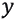是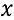到基数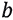的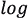。求逆，求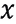，可以计算如下:


这种转换提供了处理数据偏斜的能力；同时，一旦建立了模型，就可以很容易地计算出原始值。最流行的对数变换是自然的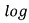，其中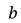是数学常数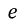，大致等于`2.71828`。

log 函数的一个有用的特性是它很好地处理了数据偏斜。例如，下面的代码演示了`log(10000)`和`log(1000000)`之间的区别，就像`4.60517`一样。数字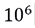比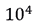大 100 倍。这减少了我们让模型处理的偏斜，这可能做得不够。

```py
#Natural Log
log(10000)
## [1] 9.21034
# 10 times bigger value
log(100000)
## [1] 11.51293
# 100 times bigger value
log(1000000)
## [1] 13.81551
```

让我们看看对 PM2.5 值的 3 小时滚动平均值应用自然对数的结果。

### 练习 80:执行日志转换

在本练习中，我们将使用对数变换绘制`avg_pm25`变量的直方图，并将其与原始值的偏斜分布进行比较。

执行以下步骤来完成练习:

1.  导入所需的库和包。
2.  Create a histogram of `avg_pm25`:

    ```py
    ggplot(PM25_three_hour_pm25_avg, aes(x=avg_pm25))+  geom_histogram(color="darkblue", fill="lightblue")
    ```

    输出如下所示:

    

    ###### 图 6.5 北京数据集 PM2.5 值的 3 小时滚动平均值直方图

3.  Create a histogram of `log_avg_pm25`:

    ```py
    ggplot(PM25_three_hour_pm25_avg, aes(x=log_avg_pm25))+  geom_histogram(color="darkblue", fill="lightblue")
    ```

    输出如下所示:


###### 图 6.6 北京数据集中 PM2.5 值 3 小时滚动平均值的自然对数直方图

在本练习中，我们绘制了一个图来显示北京数据集中 PM2.5 值的 3 小时滚动平均值，并将其与北京数据集中 PM2.5 值的 3 小时滚动平均值的自然对数直方图进行了对比。取对数使直方图在平均值和偏斜度周围看起来更对称。

## 功能选择

虽然**特征工程**确保质量和数据问题得到纠正，但**特征选择**有助于确定正确的特征集，以提高模型的性能。特征选择技术识别对模型的预测能力贡献最大的特征。重要性较低的特征抑制了模型从独立变量中学习的能力。

功能选择提供的好处包括:

*   减少过拟合
*   提高准确性
*   减少训练模型的时间

### 单变量特征选择

统计检验，如**卡方** 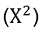检验，是选择与因变量或目标变量有密切关系的特征的常用方法。它主要处理分类问题中的分类特征。因此，为了对数值变量进行处理，需要使用离散化将特征分类。

在最一般的形式中，卡方统计可以计算如下:


这测试了观察频率和预期频率之间是否有显著差异。卡方值越高，目标变量和特定特征的相关性越强。更正式地说:


其中:

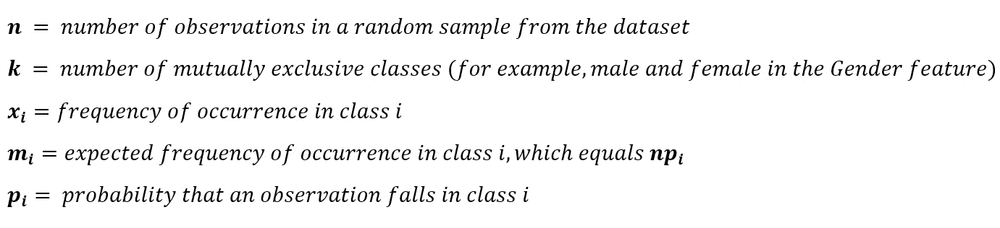

### 练习 81:探索卡方检验

在本练习中，我们将计算`Ozone`数据集中所有变量的卡方统计量。具有最高卡方值的前五个变量将是我们建模的最佳特征。

执行以下步骤来完成练习:

1.  导入所需的库和包。
2.  创建一个名为`OzoneData`的变量，并从`read.csv`函数中赋值:

    ```py
    OzoneData <- read.csv("ozone1.csv", stringsAsFactors=F)
    ```

3.  现在，设置`path`，如下图所示:

    ```py
    path="C:\\Program Files\\Java\\jdk1.8.0_92"
    ```

4.  接下来，使用 Sys.getenv 函数获取环境变量的值:

    ```py
    if (Sys.getenv("JAVA_HOME")!="")  Sys.setenv(JAVA_HOME=path)
    ```

5.  使用以下命令安装所需的软件包:

    ```py
    install.packages("rJava")
    install.packages("FSelector")
    ```

6.  导入`rJava`包:

    ```py
    library(rJava)
    ## Warning: package 'rJava' was built under R version 3.2.5
    library(FSelector)#For method
    library(mlbench)# For data
    ```

7.  计算卡方统计:

    ```py
    weights<- chi.squared(ozone_reading~., OzoneData)
    ```

8.  Print the results:

    ```py
    print(weights)
    ```

    输出如下所示:

    ```py
    ##                       attr_importance
    ## Month                       0.4240813
    ## Day_of_month                0.0000000
    ## Day_of_week                 0.0000000
    ## pressure_height             0.4315521
    ## Wind_speed                  0.0000000
    ## Humidity                    0.3923034
    ## Temperature_Sandburg        0.5191951
    ## Temperature_ElMonte         0.5232244
    ## Inversion_base_height       0.6160403
    ## Pressure_gradient           0.4120630
    ## Inversion_temperature       0.5283836
    ## Visibility                  0.4377749
    ```

9.  选择前五个变量:

    ```py
    subset<- cutoff.k(weights, 5)
    ```

10.  Print the final formula that can be used for classification:

    ```py
    f<- as.simple.formula(subset, "Class")
    print(f)
    ```

    输出如下所示:

    ```py
    ## Class ~ Inversion_base_height + Inversion_temperature + Temperature_ElMonte + 
    ##     Temperature_Sandburg + Visibility
    ## <environment: 0x000000001a796d18>
    ```

我们使用卡方()函数来计算臭氧数据集中每个要素的卡方值。该函数基于卡方值输出属性重要性。步骤 10 中使用卡方统计的前五个特征的公式可用于构建监督学习模型。

## 高度相关的变量

通常，两个高度相关的变量可能有助于模型的预测能力，这使得一个变量是多余的。例如，如果我们有一个以`age`、`height`和`BMI`为变量的数据集，我们知道`BMI`是`age`和`height`的函数，它将始终与另外两个高度相关。如果不是，那么身体质量指数计算就有问题了。在这种情况下，你可以决定去掉另外两个。但是，永远不是这么直的。在某些情况下，一对变量可能高度相关，但不容易解释为什么会这样。在这种情况下，你可以随机丢弃两个中的一个。

### 练习 82:绘制相关矩阵

在本练习中，我们将计算一对变量之间的相关性，并使用`corrplot`包绘制相关图。

执行以下步骤来完成练习:

1.  Import the required libraries using the following command:

    ```py
    library(mlbench)
    library(caret)
    ```

    输出如下所示:

    ```py
    ## Warning: package 'caret' was built under R version 3.2.5
    ## Loading required package: lattice
    ```

2.  现在，加载数据并计算相关矩阵:

    ```py
    correlationMatrix <- cor(OzoneData)
    ```

3.  Summarize the correlation matrix:

    ```py
    print(correlationMatrix)
    ```

    输出如下所示:

    ```py
    ##                              Month Day_of_month  Day_of_week ozone_reading
    ## Month                  1.000000000   0.00644330 -0.007345951   0.054521859
    ## Day_of_month           0.006443300   1.00000000  0.002679760   0.079493243
    ## Day_of_week           -0.007345951   0.00267976  1.000000000  -0.042135770
    ## ozone_reading          0.054521859   0.07949324 -0.042135770   1.000000000
    ```

4.  找到高度相关的属性(理想情况下> 0.75):

    ```py
    highlyCorrelated <- findCorrelation(correlationMatrix, cutoff=0.5)
    ```

5.  Print the indexes of the highly correlated attributes:

    ```py
    print(highlyCorrelated)
    ```

    输出如下所示:

    ```py
    ## [1] 12  9  8  5  4  7
    ```

6.  导入`corrplot`库:

    ```py
    library(corrplot)
    ```

7.  Plot the correlation matrix:

    ```py
    corrplot(correlationMatrix)
    ```

    输出如下所示:


###### 图 6.7:绘制相关矩阵

在*图 6.7* 中观察到，深蓝色圆圈代表高度正相关，深红色圆圈代表高度负相关。相关值的范围在`-1`和`1`之间。目测可知，`Inversion_temperature`变量与`pressure_height`高度正相关，与`Inversion_base_height`高度负相关。例如，如果`Inversion_temperature`增加，`pressure_height`也会增加，反之亦然。

#### 注意

图 6.7 可以在 GitHub 上找到:https://GitHub . com/TrainingByPackt/Applied-Supervised-Learning-with-R/blob/master/lesson 06/c 12624 _ 06 _ 07 . png。

### 基于模型的特征重要性排序

随机森林是一种集合建模技术，我们构建了几个模型，并使用简单的投票技术(如第 5 章、*分类*中所述)将它们的结果组合在一起，像随机森林这样的模型是一种有用的技术，可以利用数据集中的所有变量，同时不会影响模型的性能。随机森林模型背后的简单思想是，它随机选择数据和变量的子集来构建许多决策树。最终的模型预测不是通过一个决策树，而是共同使用许多决策树。多数表决是最终预测的常用技术；换句话说，大多数决策树预测的是最终的预测。

这项技术自然地给出了导致最高精度的变量组合。(也可以使用其他模型评估度量。)

#### 注意

对于基因组学和计算生物学 ***** 中的某些研究工作，潜在的预测变量在其测量范围(输入特征包括序列和分类变量，如折叠能量)和类别数量(例如，当氨基酸序列数据显示不同的类别数量时)方面有所不同，随机森林重要性测量是不可靠的。

随机森林变量重要性测量中的偏差:例证、来源和解决方案:https://link.springer.com/article/10.1186/1471-2105-8-25.

### 练习 83:使用射频探索 RFE

在本练习中，我们将使用随机森林算法探索**递归特征消除** ( **RFE** )。RFE 有助于选择具有最高特征重要性的最佳特征。

执行以下步骤来完成练习:

1.  导入`party`包:

    ```py
    library(party)
    ```

2.  适合随机森林:

    ```py
    cf1 <- cforest(pm2.5 ~ . , data= na.omit(PM25[,c("month","DEWP","TEMP","PRES","Iws","pm2.5")]), control=cforest_unbiased(mtry=2,ntree=50)) 
    ```

3.  Calculate the variable importance, based on a mean decrease in MSE. The `varimp()` function implements the RFE technique:

    ```py
    varimp(cf1)
    ```

    输出如下所示:

    ```py
    ##    month     DEWP     TEMP     PRES      Iws 
    ## 3736.679 5844.172 4080.546 1517.037 1388.532
    ```

在步骤 2 中，`party`包提供了方法`cforest()`，该方法使用参数`mtry = 2`和`ntree = 50`拟合随机森林模型，并且仅使用引导样本中没有`x`的树，找到`x`所在的最佳模型。函数`varimp()`使用 MSE 平均值减少的排列原则(随机排列值)返回变量重要性。换句话说，当一个给定的变量在训练之后但在预测之前被置换时，变量的重要性被测量为所有外袋交叉验证预测的 MSE 的平均减少。

作为随机混洗(置换)变量的结果，我们预计会创建一个*坏的*变量，并且与模型中不包含该混洗变量时相比，包含该混洗变量会增加 MSE。因此，如果 MSE 的平均减少量很高，那么由于变量的混洗，模型的 MSE 也一定很高。因此，我们可以得出结论，该变量具有更高的重要性。

### 练习 84:使用随机森林模型探索可变重要性

在本练习中，我们将使用随机森林模型探索可变重要性。我们将再次使用北京数据集来查看五个变量(`month`、`DEWP`、`TEMP`、`PRES`和`Iws)`)中哪一个对 PM2.5 的预测最好。

执行以下步骤来完成练习:

1.  使用以下命令导入 randomForest 包:

    ```py
    library(randomForest)
    ```

2.  现在，使用以下命令创建一个新对象:

    ```py
    pm25_model_rf <- randomForest(pm2.5 ~ . , data = na.omit(PM25[,c("month","DEWP","TEMP","PRES","Iws","pm2.5")]), ntree=25,importance=TRUE, nodesize=5)
    ```

3.  Print the model:

    ```py
    pm25_model_rf
    ```

    输出如下所示:

    ```py
    ## 
    ## Call:
    ##  randomForest(formula = pm2.5 ~ ., data = na.omit(PM25[, c("month",      "DEWP", "TEMP", "PRES", "Iws", "pm2.5")]), ntree = 25, importance = TRUE,      nodesize = 5) 
    ##                Type of random forest: regression
    ##                      Number of trees: 25
    ## No. of variables tried at each split: 1
    ## 
    ##           Mean of squared residuals: 3864.177
    ##                     % Var explained: 54.39
    ```

4.  Find the R-squared value for each tree:

    ```py
    pm25_model_rf$rsq
    ```

    输出如下所示:

    ```py
    ##  [1] 0.2917119 0.3461415 0.3938242 0.4240572 0.4335932 0.4445404 0.4552216
    ##  [8] 0.4735218 0.4878105 0.4998751 0.5079323 0.5156195 0.5197153 0.5228638
    ## [15] 0.5286556 0.5305679 0.5312043 0.5341559 0.5374104 0.5397305 0.5421712
    ## [22] 0.5434857 0.5430657 0.5435383 0.5439461
    ```

5.  Next, calculate the variable importance plot:

    ```py
    varImpPlot(pm25_model_rf)
    ```

    输出如下所示:


###### 图 6.8:通过对北京 PM2.5 数据拟合随机森林模型获得的 MSE 百分比增加和节点纯度值增加

前面的练习演示了查看可变重要性的另一种方法。我们使用了`randomForest`包，而不是`party`包。`%IncMSE`按以下步骤计算:

1.  适合随机森林(在我们的例子中，它是一个回归随机森林)。计算 OOB-MSE 并命名为`MSE_Base`。
2.  对于每个变量`j`:置换`j`列的值，然后预测并计算`OOB_MSE_j`。
3.  `jth`变量的`%IncMSE`等于`(OOB_MSE_j - MSE_Base)/ MSE_Base * 100%`。

*图 6.8* 显示，与变量 DEWP 相比，模型中包含变量`Iws`增加了`22%`的均方误差，而后者仅增加了`15%`的均方误差。我们知道，由于变量的混合值，MSE 必然会增加，因此更高的`%`意味着一个好的变量。如果我们看到变量`TEMP`，与`Iws`和`DEWP`相比，值的洗牌并没有对 MSE 产生太大的影响；因此，相对来说，它不那么重要。

节点纯度计算损失函数值，在这个模型中是 MSE。这有助于选择最佳分割。MSE 的降低给出了更高的节点纯度值。DEWP 的节点纯度最高，其次是特征月。在我们的数据集中，`%IncMSE`和`IncNodePurity`显示了相似的结果。然而，请记住，`IncNodePurity`往往是有偏见的，应该总是与`%IncMSE`一起看。

## 特征还原

**特征缩减**通过以下方式帮助去除降低模型效率的冗余变量:

*   开发/训练模型的时间增加了。
*   对结果的解释变得乏味。
*   它扩大了估计的方差。

在本节中，我们将看到三种有助于提高模型效率的特征约简技术。

### 主成分分析

名词（noun 的缩写）A. Campbell 和 William R. Atchley 在他们的经典论文中，*规范变量分析的几何学，*系统生物学，第 30 卷，第 3 期，1981 年 9 月，第 268-280 页，从几何学上定义了*主成分分析为原始变量坐标系的轴旋转到新的正交轴，称为主轴，使得新的轴与原始观察的最大变化方向一致*。这是常设仲裁院工作的关键所在。换句话说，它用解释原始观察值或数据的最大变化的主成分来表示原始变量。

论文优雅地呈现了主成分的几何表示，如下图所示，这是两个变量的散点图表示，显示了每个变量的平均值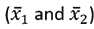、 *95%* 浓度椭圆、主轴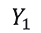和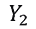。点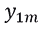和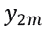给出观察值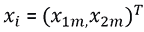的主成分分数。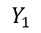和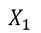之间的角度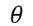的余弦给出了对应于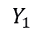的特征向量的第一个分量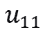。

在线性代数中，线性变换的特征向量是一个非零向量，当对其应用线性变换时，该向量只改变一个标量因子。

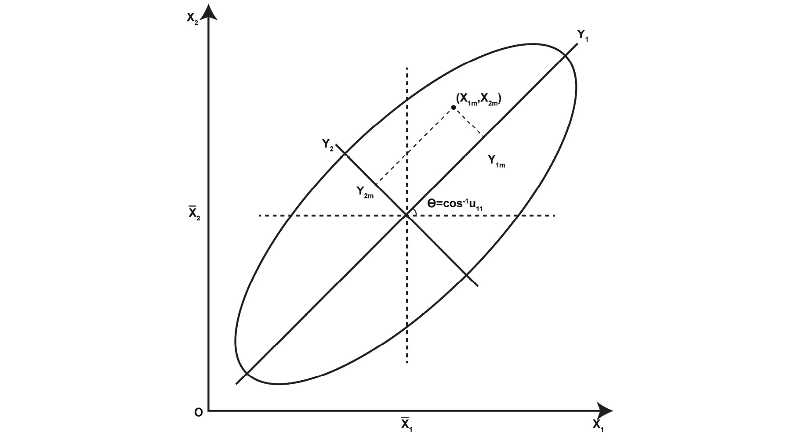

###### 图 6.9:显示了两个变量的散点图，显示了每个变量的平均值(x ̅_1 和 x ̅_2)、95%浓度椭圆以及主轴 y1 和 y2

###### 来源:规范变量分析的几何学，系统生物学，第 30 卷，第 3 期，1981 年 9 月，第 268-280 页

### 练习 85:执行 PCA

在本练习中，我们将执行 PCA，这将有助于降低特征空间的维数。换句话说，作为输入要素线性组合的较少主成分将代表整个数据集。

执行以下步骤来完成练习:

1.  Import the `OzoneData` package:

    ```py
    dim(OzoneData)
    ```

    输出如下所示:

    ```py
    ## [1] 366  13
    ```

2.  Print the column name using the `colnames` function:

    ```py
    colnames(OzoneData)
    ```

    输出如下所示:

    ```py
    ##  [1] "Month"                 "Day_of_month"         
    ##  [3] "Day_of_week"           "ozone_reading"        
    ##  [5] "pressure_height"       "Wind_speed"           
    ##  [7] "Humidity"              "Temperature_Sandburg" 
    ##  [9] "Temperature_ElMonte"   "Inversion_base_height"
    ## [11] "Pressure_gradient"     "Inversion_temperature"
    ## [13] "Visibility"
    ## [1] 50  4
    ```

3.  Find the means for all variables:

    ```py
    apply(OzoneData,2,mean)
    ```

    输出如下所示:

    ```py
    ##                 Month          Day_of_month           Day_of_week 
    ##              6.513661             15.756831              4.002732 
    ##         ozone_reading       pressure_height            Wind_speed 
    ##             11.582020           5752.448016              4.868852 
    ##              Humidity  Temperature_Sandburg   Temperature_ElMonte 
    ##             58.295691             61.858629             57.219990 
    ## Inversion_base_height     Pressure_gradient Inversion_temperature 
    ##           2596.265137             17.785440             61.005339 
    ##            Visibility 
    ##            123.300546
    ```

4.  Find the variance of all variables:

    ```py
    apply(OzoneData,2,var) 
    ```

    输出如下所示:

    ```py
    ##                 Month          Day_of_month           Day_of_week 
    ##          1.194365e+01          7.785578e+01          3.991773e+00 
    ##         ozone_reading       pressure_height            Wind_speed 
    ##          6.243605e+01          1.092618e+04          4.481383e+00 
    ##              Humidity  Temperature_Sandburg   Temperature_ElMonte 
    ##          3.861494e+02          2.039533e+02          1.109866e+02 
    ## Inversion_base_height     Pressure_gradient Inversion_temperature 
    ##          3.115312e+06          1.300448e+03          1.871074e+02 
    ##            Visibility 
    ##          6.444901e+03
    ```

    变量方差的显著差异将控制主成分。在找出主成分之前，`prcomp()`将标准化变量(均值`0`和方差`1`)。

    ```py
    pca.out<-prcomp(OzoneData,scale=TRUE)
    ```

5.  Next, find the summary of the PCA:

    ```py
    summary(pca.out)
    ```

    输出如下所示:

    ```py
    ## Importance of components:
    ##                           PC1    PC2     PC3     PC4     PC5     PC6
    ## Standard deviation     2.2817 1.4288 1.05944 1.01842 1.00160 0.93830
    ## Proportion of Variance 0.4005 0.1570 0.08634 0.07978 0.07717 0.06772
    ## Cumulative Proportion  0.4005 0.5575 0.64386 0.72364 0.80081 0.86853
    ##                            PC7     PC8     PC9    PC10    PC11    PC12
    ## Standard deviation     0.74291 0.64513 0.54523 0.48134 0.33068 0.25908
    ## Proportion of Variance 0.04246 0.03202 0.02287 0.01782 0.00841 0.00516
    ## Cumulative Proportion  0.91099 0.94301 0.96587 0.98369 0.99211 0.99727
    ##                           PC13
    ## Standard deviation     0.18840
    ## Proportion of Variance 0.00273
    ## Cumulative Proportion  1.00000
    ```

6.  Create a biplot using the `ggbiplot` function:

    ```py
    library(devtools)
    install_github("vqv/ggbiplot", force=TRUE)
    library(ggbiplot)
    ggbiplot(pca.out)
    ```

    输出如下所示:


###### 图 6.10 使用 ggbiplot 的前两个主成分的缩放 biplot

图中的 biplot 显示了`Ozone`数据集。如`summary(pca.out)`的输出所示，双标图通过使用数据集中的各种特征来描述解释的差异。这些轴被视为从中心点开始的箭头。该图还显示了变量`pressure_height`和`inversion_temperature`对`Visibility`的贡献以及`day_of_the_week`对 **PC2** 的贡献具有更高的值。

如果您发现安装`ggbiplot`有困难，您也可以使用 base R 中的`biplot()`函数，如下图所示。首先，让我们构建一个双绘图来更好地理解:

```py
biplot(pca.out,scale = 0, cex=0.65)
```


###### 图 6.11 第一主成分的缩放双标图

观察到 PC1 解释了方差的最大百分比，并且所有 PCs 都是互不相关的。特别地，PC1 解释了方差的`40%`附近，第一主成分(PC1-PC4)解释了方差的 70%。换句话说，如果我们使用前四个主成分，我们应该得到一个与我们使用数据集中所有变量时得到的模型几乎相似的模型。这并不奇怪，因为主成分是变量的线性组合。

## 变量聚类

**变量聚类**用于测量共线性，计算冗余，以及将变量分成可作为单个变量计算的聚类，从而减少数据。变量的层次聚类分析使用以下任何一种:Hoeffding 的 D 统计、平方皮尔逊或 Spearman 相关，或者使用两个变量都为正的观察值的比例作为相似性度量。其思想是找到相关变量的聚类，这些相关变量与它们自身相关，而不与另一个聚类中的变量相关。这将大量的特征减少为较少数量的特征或可变聚类。

### 练习 86:使用变量聚类

在本练习中，我们将使用特征聚类来识别相似特征的聚类。从每个集群中，我们可以为模型选择一个或多个特征。我们将在 r 中使用 Hmisc 包中的分层聚类算法。相似性度量应设置为“spear”，代表 Pearson 相关性，这是一种用于计算两个观察值之间相似性的稳健度量。

执行以下步骤来完成练习:

1.  使用以下命令安装`Hmisc`包:

    ```py
    install.packages("Hmisc")
    ```

2.  导入`Hmisc`包并将种子设置为`1` :

    ```py
    library(Hmisc)
    set.seed(1)
    ```

3.  Use variable clustering with Spearman correlation as the similarity measure:

    ```py
    Ozone_var_clust <- varclus(as.matrix(OzoneData), similarity="spear")
    Ozone_var_clust
    ```

    输出如下所示:

    ```py
    ## varclus(x = as.matrix(OzoneData), similarity = "spear")
    ## 
    ## 
    ## Similarity matrix (Spearman rho^2)
    ## 
    ##                       Month Day_of_month Day_of_week ozone_reading
    ## Month                  1.00         0.00        0.00          0.00
    ## Day_of_month           0.00         1.00        0.00          0.01
    ## Day_of_week            0.00         0.00        1.00          0.00
    ## ozone_reading          0.00         0.01        0.00          1.00
    ## pressure_height        0.12         0.00        0.00          0.36
    ## Wind_speed             0.04         0.01        0.00          0.00
    ## Humidity               0.01         0.00        0.00          0.20
    ## Temperature_Sandburg   0.05         0.01        0.00          0.63
    ## Temperature_ElMonte    0.07         0.00        0.00          0.59
    ## Inversion_base_height  0.00         0.01        0.00          0.32
    ## Pressure_gradient      0.03         0.00        0.00          0.06
    ## Inversion_temperature  0.04         0.01        0.00          0.54
    ## Visibility             0.04         0.02        0.01          0.20
    ##                       pressure_height Wind_speed Humidity
    ## Month                            0.12       0.04     0.01
    ## Day_of_month                     0.00       0.01     0.00
    ## Day_of_week                      0.00       0.00     0.00
    ## ozone_reading                    0.36       0.00     0.20
    ## pressure_height                  1.00       0.02     0.03
    ## Wind_speed                       0.02       1.00     0.03
    ## Humidity                         0.03       0.03     1.00
    <Output Truncated for brevity>
    ## hclust results (method=complete)
    ## 
    ## 
    ## Call:
    ## hclust(d = as.dist(1 - x), method = method)
    ## 
    ## Cluster method   : complete 
    ## Number of objects: 13
    ```

4.  Print the value:

    ```py
    print(round(Ozone_var_clust$sim,2))
    ```

    输出如下所示:

    ```py
    ##                       Month Day_of_month Day_of_week ozone_reading
    ## Month                  1.00         0.00        0.00          0.00
    ## Day_of_month           0.00         1.00        0.00          0.01
    ## Day_of_week            0.00         0.00        1.00          0.00
    ## ozone_reading          0.00         0.01        0.00          1.00
    ## pressure_height        0.12         0.00        0.00          0.36
    ## Wind_speed             0.04         0.01        0.00          0.00
    ## Humidity               0.01         0.00        0.00          0.20
    ## Temperature_Sandburg   0.05         0.01        0.00          0.63
    ## Temperature_ElMonte    0.07         0.00        0.00          0.59
    ## Inversion_base_height  0.00         0.01        0.00          0.32
    ## Pressure_gradient      0.03         0.00        0.00          0.06
    ```

根据相似性矩阵，下图显示了同一聚类中的变量图。例如，`Temperature_ElMonte`和`Inversion_temperature`都被聚类到一个聚类中，Spearman 相关分数为 0.85。类似地，`Humidity`和`Pressure_gradient`的斯皮尔曼相关系数为 0.25。高度的相似性将导致放弃其中一个的决定。除了集群输出的顶部之外，在最终决定完全删除变量之前，还应该考虑模型指标:

```py
plot(Ozone_var_clust)
```


###### 图 6.12:臭氧数据集中变量的等级聚类

## 线性判别分析进行特征约简

**线性判别分析** ( **LDA** )通过将数据投影到一个新的特征空间，帮助最大化类别分离:具有良好类别分离性的低维空间，以避免过拟合(*维数灾难*)。LDA 还降低了计算成本，这使得它适合作为分类算法。其思想是最大化每个类(或类别)的平均值之间的距离，并最小化类内的可变性。(这听起来肯定像无监督学习中的聚类算法的工作方式，但我们不会在这里触及它，因为它不在本书的范围内。)注意，LDA 假设数据遵循高斯分布；否则，LDA 的性能将会降低。在本节中，我们将使用 LDA 作为一种特征减少技术，而不是作为一个分类器。

对于两类问题，如果我们有一个 *m* 维的数据集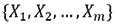，有 *N* 个观测值，其中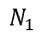属于类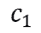，而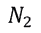属于类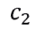。在这种情况下，我们可以将数据投影到一条线上(用 *C=2* ，投影到 *C-1* 空间):


这种投影是通过将 *X* 的平均值投影到 *Y* 的平均值上来实现的。在所有可能的行中，我们希望选择最大化标量可分性的一行。换句话说，来自同一个类的观察投影被投影得彼此非常接近，同时，投影的平均值尽可能远。

应该注意的是，虽然在 LDA 中我们更像监督学习一样使用类别变量，但是 PCA 不需要任何类别变量来减少特征大小。这就是为什么虽然 LDA 尽可能多地保留了类别歧视信息，但 PCA 并不太关心它。


###### 图 6.13:比较 PCA 和 LDA

###### 资料来源:https://sebastianraschka.com/Articles/2014_python_lda.html

### 练习 87:探索 LDA

在本练习中，我们将执行 LDA 进行特征约简。我们将使用 LDA 观察具有所有特征和减少的特征的模型性能的差异。

执行以下步骤:

1.  将时间戳上的两个数据帧合并，将其他环境变量与 PM2.5 一起堆叠成一个数据帧:

    ```py
    PM25_for_LDA <- merge(PM25_three_hour_pm25_avg, PM25[,c("datetime","TEMP","DEWP","PRES","Iws","cbwd","Is","Ir")], by.x = "timestamp",by.y = "datetime")
    PM25_for_LDA = PM25_for_LDA[,c("TEMP","PRES","DEWP","Iws","Is","Ir","pollution_level")]
    ```

2.  将数据集分成训练和测试:

    ```py
    index = sample(1:nrow(PM25_for_LDA), round(nrow(PM25_for_LDA)*0.6 ), replace = FALSE)
    LDA_train = PM25_for_LDA[ index, ]
    LDA_test = PM25_for_LDA[ -index, ]
    ```

3.  导入`MASS`包:

    ```py
    library(MASS)
    ```

4.  在训练数据集上拟合 LDA 模型:

    ```py
    LDA_model = lda( pollution_level ~ ., data = LDA_train )
    projected_data = as.matrix( LDA_train[, 1:6] ) %*%  LDA_model$scaling
    ```

5.  Plot 100 randomly selected projected values:

    ```py
    set.seed(100)
    index <- sample(nrow(projected_data),100, replace = FALSE)
    plot( projected_data[index], col = LDA_train[,7], pch = 19 )
    ```

    输出如下所示:

    

    ###### 图 6.14:随机选择的 100 个预测值的曲线图

6.  执行模型测试:

    ```py
    LDA_test_reduced = LDA_test[, !( names( LDA_test ) %in% c( "pollution_level" ) ) ]  
    LDA_model_results = predict( LDA_model, LDA_test_reduced )
    ```

7.  Import the `caret` library and print the confusion matrix:

    ```py
    library( caret )
    c_t = table( LDA_model_results$class, LDA_test$pollution_level )
    print( confusionMatrix( c_t ) )
    ```

    输出如下所示:

    ```py
    ## Confusion Matrix and Statistics
    ## 
    ##    
    ##         0     1
    ##   0  2359   978
    ##   1  2257 11108
    ##                                           
    ##                Accuracy : 0.8063          
    ##                  95% CI : (0.8002, 0.8123)
    ##     No Information Rate : 0.7236          
    ##     P-Value [Acc > NIR] : < 2.2e-16       
    ##                                           
    ##                   Kappa : 0.4704          
    ##  Mcnemar's Test P-Value : < 2.2e-16       
    ##                                           
    ##             Sensitivity : 0.5110          
    ##             Specificity : 0.9191          
    ##          Pos Pred Value : 0.7069          
    ##          Neg Pred Value : 0.8311          
    ##              Prevalence : 0.2764          
    ##          Detection Rate : 0.1412          
    ##    Detection Prevalence : 0.1998          
    ##       Balanced Accuracy : 0.7151          
    ##                                           
    ##        'Positive' Class : 0               
    ## 
    ```

8.  找到降维后的数据集:

    ```py
    new_LDA_train = as.matrix( LDA_train[,1:6] ) %*%
      LDA_model$scaling
    new_LDA_train = as.data.frame( new_LDA_train )
    new_LDA_train$pollution_level = LDA_train$pollution_level
    ```

9.  测试数据集:

    ```py
    new_LDA_test = as.matrix( LDA_test[,1:6] ) %*%
      LDA_model$scaling
    new_LDA_test = as.data.frame( new_LDA_test )
    new_LDA_test$pollution_level = LDA_test$pollution_level
    ```

10.  使用预计数据。让我们来拟合一个逻辑模型。您也可以使用任何其他分类模型:

    ```py
    PM25_logit_model_on_LDA <- glm(pollution_level ~ ., data = new_LDA_train,family=binomial(link='logit'))
    ```

11.  对测试数据进行模型评估:

    ```py
    predicted_LDA = predict(PM25_logit_model_on_LDA, newdata = new_LDA_test,type="response")
    ```

12.  概率> 0.5 时预测 1:

    ```py
    predicted <- ifelse(predicted_LDA>0.5, 1,0)
    actual <- new_LDA_test$pollution_level
    ```

13.  Find the confusion matrix:

    ```py
    confusionMatrix(predicted, actual)
    ```

    输出如下所示:

    ```py
    ## Confusion Matrix and Statistics
    ## 
    ##           Reference
    ## Prediction     0     1
    ##          0  2316   947
    ##          1  2300 11139
    ##                                           
    ##                Accuracy : 0.8056          
    ##                  95% CI : (0.7995, 0.8116)
    ##     No Information Rate : 0.7236          
    ##     P-Value [Acc > NIR] : < 2.2e-16       
    ##                                           
    ##                   Kappa : 0.4655          
    ##  Mcnemar's Test P-Value : < 2.2e-16       
    ##                                           
    ##             Sensitivity : 0.5017          
    ##             Specificity : 0.9216          
    ##          Pos Pred Value : 0.7098          
    ##          Neg Pred Value : 0.8289          
    ##              Prevalence : 0.2764          
    ##          Detection Rate : 0.1387          
    ##    Detection Prevalence : 0.1954          
    ##       Balanced Accuracy : 0.7117          
    ##                                           
    ##        'Positive' Class : 0               
    ##
    ```

注意`LDA_test`中的精度和投射的`new_LDA_test`惊人的相似。这表明新的低维空间中的投影值与原始值相比表现得同样好。新的空间可能永远不会产生与原来相同的性能。因此，在减少特征空间之前，需要进行彻底的检查。

## 总结

在本章中，我们看到了各种特征选择和简化技术。本章涉及的三个主题是:特征工程、特征选择和特征简化。后两者目的相同，都是缩小特征数量；但是，使用的技术完全不同。特征工程侧重于将变量转换成一种新的形式，这种新的形式或者有助于提高模型性能，或者使变量符合模型假设。一个例子是线性回归模型中的线性假设，其中我们通常可以对变量和数据分布的偏斜度进行平方或立方，这可以使用对数变换来解决。特征选择和特征缩减有助于提供最佳特征集或特征集的最佳表示，从而提高模型性能。最重要的是，这两种技术都缩小了特征空间，这极大地改善了模型训练时间，而不损害准确性、**、**或任何相关模型评估度量方面的性能。

我们还看到了一些模型本身，如随机森林和 **LDA、**可以直接用作特征选择和简化技术。随机森林的工作原理是通过随机选择的方法选择最佳特征，而 LDA 的工作原理是找到特征的最佳表示。因此，前者用于特征选择，后者用于归约。

在下一章中，我们将探索更多关于模型改进的内容，在这一章中我们将学到一些东西。