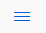
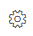
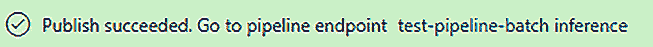

# 六、视觉模型训练与发布

**Azure Machine Learning**(**Azure ml**)Studio 通过允许你拖放和配置训练和推理管道，在开发模型时提供设计师体验。在本章中，您将对设计器有一个概述。然后，您将创建一个训练流程。一旦您看到了与设计器一起使用的整个流程，我们将通过创建一个推理管道并发布经过训练的模型工件作为服务端点来结束本章。

在本章中，我们将讨论以下主题:

*   设计器概述
*   设计训练流程
*   创建批处理和实时推理管道
*   部署实时推理管道

# 技术要求

您需要访问 Azure 订阅。在该订阅中，您将需要一个`packt-azureml-rg`。此外，你将需要一个`Contributor`或`Owner`T3，如 [*第 2 章*](B16777_02_Final_VK_ePub.xhtml#_idTextAnchor026) 、*部署 Azure 机器学习工作区资源*中所述。

您还需要在您的工作空间中注册`churn-dataset`，这是您在 [*第 5 章*](B16777_05_Final_VK_ePub.xhtml#_idTextAnchor072) ，*中创建的，让机器进行模型训练*。

# 设计者概述

AzureML Studio 提供了一个图形设计器，允许你可视化地创作管道。根据定义，流水线是描述机器学习任务的独立的可执行子任务流。您可以在设计器中创建三种类型的管道:

*   **训练管道**:这些管道用于训练模型。
*   **批量推理管道**:这些管道用于操作批量预测的预训练模型。
*   **实时推理管道**:这些管道用于公开一个 REST API，允许第三方应用使用预先训练好的模型进行实时预测。

要创建批处理和实时管道，您需要创建一个训练管道。在接下来的小节中，您将学习如何创建一个训练管道，然后在此基础上生成一个批处理和实时管道。在 [*第十一章*](B16777_11_Final_VK_ePub.xhtml#_idTextAnchor160) 、*使用管道*中，你将学习如何通过代码创作类似的管道。

要开始创作管道，您需要访问 **Designer** 主页。点击**设计师**菜单项，导航至首页，如下截图所示:


图 6.1–设计者主页

在 **New pipeline +** 按钮旁边，您会看到其他几个按钮，它们带有不同的现成样本管道。请稍后熟悉这些样品。这些示例会定期更新以显示设计器的最新功能，这是一个很好的入门资源。

在本章中，我们将从头开始创建一个新的管道。点击 **+** 按钮会将您带到创作屏幕/视图，我们将在下一节中探讨。

## 创作屏幕/视图

与设计者一起建造管道的主页看起来如下:


图 6.2–azure ml 设计器创作视图

这里我们将描述主页面用户界面，前面的截图作为参考:

*   通过点击左上角的汉堡图标()，你可以隐藏和取消隐藏前面截图中显示为编号 **1** 的 AzureML 主菜单。从现在开始，我们假设这个区域是隐藏的。
*   在标记为数字 **2** 的区域中，您可以找到可以放到画布上的所有资产，在前面的截图中称为数字 **3** 。通过将不同的资产放到画布上，您可以构建一个管道。在本章的*了解资产库*一节中，你会学到更多关于这方面的知识。
*   在标记为 **4** 的右侧区域，您将找到设置。该区域也称为详细信息页面。此视图会根据您在画布中选择的内容而变化。如果您没有在画布区域选择任何资产，您将看到您正在构建的管道的设置，并且您可以选择一个**默认计算目标**，它将运行每个管道步骤。如果您选择一项资产，您会发现该特定资产的各种配置选项。
*   面积`test-pipeline`。
*   在 **5** 区，你还会找到**设置**按钮()。使用该按钮，您可以隐藏/取消隐藏前面截图中标记为 **4** 的**设置**区域。在同一区域，您可以找到其他图标，允许您在画布上保存或删除管道和**撤销、重做和搜索**、和。**选择**工具()是画布上的标准光标。稍后，当我们在管道上工作时，我们将切换到**手**工具()来移动画布上的选定部分。点击**设置**隐藏区域 **4** 并增加画布的大小。
*   最后一个区域，在前面的截图中标记为 **6** ，为您提供了**提交、发布和 c**T5 独立管道的功能，我们将在*创建批处理和实时推理管道*一节中讨论。

在进入下一部分之前，您需要配置管道用来执行所有步骤的默认计算目标属性。打开管道设置，选择你在第五章[](B16777_05_Final_VK_ePub.xhtml#_idTextAnchor072)**中使用的计算集群，让机器做模型训练*。*

 *在下一部分中，您将探索标记为 **2** 的区域，也称为*资源库*。

## 了解资产库

为了建立一个管道，你需要将各种资产缝合在一起。在本节中，您将看到设计器的资源库中可用的不同资源。在*图 6.2* 中，我们有 96 个可用。这个数字取决于您在 AzureML 工作空间中注册了多少数据集，在 AzureML 的未来版本中，您甚至可以创建自己的编码资产。下图显示了资产库中可用的类别，并简要说明了它们包含的资产类型(也称为模块):


图 6.3–azure ml 设计器资产库中的类别

该库中有三种类型的资产:

*   用于手动输入的数据集和模块
*   未经训练的模型
*   对数据执行特定操作的模块

在 designer 中构建您的第一个端到端机器学习训练管道时，您将从此资源库中拖放组件。在下一节中，您将看到每个资产的样子，以及如何在它们之间连接各种资产。

## 探索资产的输入和输出

我们从资产库中删除的每个资产都是我们正在构建的管道中的一个模块。一个模块看起来类似于下面截图中所示的示例模块:


图 6.4-具有两个输入和一个输出的样本模块

让我们从上到下描述一下这个模块:

*   顶部有零个、一个或多个输入端口:前面截图中的示例模块接受两个输入。您可以将另一个模块的输出连接到下一个模块的输入。
*   在模块的中间，名称描述了模块的功能。我们的例子是一个**训练模型**模块，它用右输入端口给定的数据训练一个在左输入端口传入的未训练模型。
*   如果在画布中选择该模块，该模块的详细页面将出现在*图 6.2* 中标为 **4** 的区域。每个模块的页面都不同。您可以配置各种选项，例如它的简短描述或者将执行特定模块的计算目标。
*   在模块名称下，您可以阅读该模块的描述文本。您可以通过选择模块并编辑模块详细信息页面上的文本来编辑此描述。我们示例中的模块描述显示了文本**示例模块**。
*   在模块的底部，有一个或多个**输出端口**，你可以拖动并连接到下一个模块。

在本节中，您探索了 AzureML Studio 设计器的各个方面。在下一部分，您将开始创作您的第一个训练管道。

# 与设计师一起建造管道

在本节中，我们将创建一个训练管道，根据您在上一章中使用的**变动**数据集来训练一个机器学习模型。

当您开始设计训练管道时，我们建议利用下图所示的机器学习的 *7 个步骤*方法，其中包含创建机器学习模型所需的所有步骤:


图 6.5–机器学习的 7 个步骤

这个 7 步之旅是真实端到端场景的宝贵清单，可确保您不会遗漏任何东西。在这个旅程中，您将需要各种组件、转换和模型，这些都可以在资源库中找到。为了简单起见，我们将跳过您将要设计的管道中的几个步骤。在本节中，您将从准备用来训练模型的数据集开始。然后，您将评估模型并存储它。在下一节中，您将使用该模型创建一个批处理和一个利用该模型进行预测的实时管道。

让我们从获取将用于训练模型的数据开始，这是您将在下一节中做的事情。

## 获取数据

第一步是选择将用于训练模型的数据集:

1.  In the asset library, expand the **Datasets** category by clicking on the arrow next to its name. You should see **churn-dataset** there, which you created in [*Chapter 5*](B16777_05_Final_VK_ePub.xhtml#_idTextAnchor072), *Letting the Machines Do the Model Training*:

    图 6.6-数据集类别下的流失数据集

2.  Drag **churn-dataset** onto the canvas:

    图 6.7–带有流失数据集的画布

    这样，您就完成了**数据收集**步骤，这意味着您可以继续进行机器学习 *7 个步骤中的第 2 步*。

3.  下一步是**数据准备**。通过将数据集模块中的**选择列(可以在资产库中的**数据转换**类别下找到)拖到画布上，向管道添加一个处理步骤。**
4.  You will now need to create a flow between the dataset and the module. You can do that by pulling from the dataset's **output port**, the small circle at the bottom of this **dataset**, to the dataset's **input port**, the small circle at the top of the **Select Columns in Dataset** module, as shown in the following screenshot:

    图 6.8–在数据集和处理模块之间创建流程

5.  下一步是配置数据集模块中的**选择列。在画布中选择模块后，单击细节窗格上的**编辑列**链接，细节窗格位于画布的右侧，如前面的屏幕截图所示。将出现**选择列**对话框。请参见下面的屏幕截图，了解该弹出窗口的最终配置。**
6.  在弹出菜单中，从下拉菜单中选择所有列。
7.  点击 **+** 按钮添加第二行。
8.  从下拉列表中选择**排除**。
9.  从第二个下拉菜单中选择**列名**。
10.  Select the **id** column from the last dropdown.

    对话框页面应该如下所示:

    

    图 6.9–选择列对话框

11.  点击**保存**关闭弹出窗口。

到目前为止，您已经选择了将用于训练模型的数据集，并且您已经通过删除 **id** 列准备了数据，这在训练过程中是不需要的。在下一部分中，您将通过添加未训练模型、将训练模型的模块以及用于对已训练模型进行评分和评估的模块来最终确定您的训练管道。

## 准备数据和训练模型

现在，你将选择你要训练的模型。在 [*第五章*](B16777_05_Final_VK_ePub.xhtml#_idTextAnchor072) ，*让机器做模型训练*中，你确定了一个**投票组合**作为给定数据的最佳表现模型。这类模型是不同模型的组合，包括**随机森林**。为了使这个例子简单，您将使用一个**两类决策森林**模型，类似于**随机森林**。让我们开始吧:

1.  导航到资源库中的**机器学习算法**类别。你会注意到几个子类，包括**分类**。从该子类别中，将**两类决策森林**模块拖放到画布上。
2.  对于模型训练，您将需要两个额外的模块:可以在**数据转换**类别下的资源库中找到的**分割数据**模块，以及可以在**模型训练**类别中找到的**训练模型**模块。将两个模块拖放到画布上。
3.  您需要扩展在上一节中创建的数据流，以便通过新模块传递数据。将数据集模块中**选择列的**输出端口**拉到**拆分数据**模块的**输入端口**。**
4.  您需要在模块的细节窗格中配置**分割数据**模块，如下面的屏幕截图所示。将第一个输出数据集中的**行的分数**设置为 **0.7** 。通过这样做，70%的数据将被发送到用于训练模型的**左输出端口**区域，30%将被发送到用于测试的**右输出端口**区域。
5.  **列车模型**模块接受两个输入。在**左输入端口**区域，您需要通过一个未经训练的模型，该模型将用**右输入端口**区域给出的数据进行训练。将**两级决策森林**模块的一个**输出端口**拉到**列车模型**模块的**左输入端口**区域。
6.  Drag the **left output port** area of the **Split Data** module to the **right input port** area of **Train Model**. Your canvas should look as follows:

    图 6.10–列车模型模块缺少一些配置

7.  In the preceding screenshot, there is an orange exclamation mark in the **Train Model** module. This mark indicates that something is misconfigured in that module. So far, you have configured which model to train and what data to use for the model's training. However, you have not defined which column the model should predict yet. This column is referred to as **Label column**. To configure **Label column**, select the module in the canvas and click on the **Edit column** link. This will open the **Label column** dialog shown in the following screenshot. Select the **churned** column from the drop-down list and click **Save**:

    图 6.11–选择模型将预测的列

    到目前为止，训练管道正在执行机器学习的 *7 步中的前 4 步。下一步是评估模型。*

8.  拖拽**评分模型**模块到画布上，可以在**模型评分&评估**类别下的资源库中找到。该模块接受在**左输入端口**区域的训练模型和在**右输入端口**区域的数据集。此模块的输出是一个数据集，其中包含模型针对传入数据集做出的推理。
9.  将**分割数据**模块的**右输出端口**区连接到**评分模型**模块的**右输入端口**区。这将创建一个数据流，将原始数据的 30%部分带入**评分模型**模块。
10.  将**列车模型**模块的**输出端口**区连接到**乐谱模型**模块的**左输入端口**区。**评分模型**模块将使用训练好的模型对输入数据进行推理。
11.  拖动并将**评估模型**模块放到画布上，该模块可以在**模型评分&评估**类别下的资源库中找到。该模块将模型所做的预测与存储在**搅动**列中的值进行比较。
12.  Connect the **output port** area of the **Score Model** module to the **left input port** area of the **Evaluate Model** module.

    如果到目前为止您已经完成了所有步骤，那么您的画布应该如下所示:

    

图 6.12-完整的训练管道

到目前为止，您已经创建了一个执行以下操作的训练管道:

*   从数据集中删除 id 为的**列。**
*   将数据分成训练数据集和验证数据集。训练数据集包含 70%的原始数据。验证数据集包含剩余的 30%。
*   使用训练数据集训练**两类决策森林**。
*   使用训练好的模型对验证数据集进行评分。
*   通过检查评分数据集中的结果来评估模型的性能。您将能够在**评估模型**模块中查看已训练模型的指标。

在下一部分中，您将执行此管道来训练模型。

## 执行训练管道

在前面的部分中，您创建了一个完整的训练管道，现在您将通过创建一个新的管道运行来执行它。让我们开始吧:

1.  点击右上角的**提交**按钮。将打开**设置管道运行**对话框，如下图所示。
2.  您需要创建一个新的实验，并将其命名为 **test-pipeline** 。选择**创建新的**单选按钮，然后输入这个名字。
3.  注意，管道将在您在*创作屏幕/视图*部分选择的默认**计算目标**中执行。点击**提交**按钮，开始执行训练管道:


图 6.13-准备执行训练管道

一旦管道完成执行，设计器将看起来如下所示:


图 6.14–成功运行管道

至此，您已经成功完成了第一条管道的开发和训练。当流水线执行完成后，会出现**创建推理流水线**按钮。下一节描述了创建推理管道时的不同选项。

# 创建批处理和实时推理管道

本节将讨论从设计者部署推理管道的两个选项:**批处理**和**实时**:

*   通过批量预测，您可以对大型数据集进行异步评分。
*   使用实时预测，您可以对一个小数据集或单行进行实时评分。

当您创建一个推理管道时，无论是批处理还是实时的，AzureML 都会处理以下事情:

*   AzureML 将经过训练的模型和所有经过训练的数据处理模块作为资产存储在资产库中的**数据集**类别下。
*   它自动删除不必要的模块，如**火车模型**和**分割数据**。
*   它将训练好的模型添加到管道中。

特别是对于实时推理管道，AzureML 会在最终管道中增加一个 **web 服务输入**和一个 **web 服务输出**。

让我们从创建批处理管道开始，这是您将在下一节中做的事情。

## 创建批处理管道

在这个部分，您将创建一个批处理推理管道。让我们开始吧:

1.  Click on the **Create inference pipeline** dropdown next to the **Submit** button and select **Batch inference pipeline**. This action will create the **Batch inference pipeline** tab, as shown in the following screenshot:

    图 6.15–显示默认生成管道的批处理推理管道选项卡

2.  通过添加管道参数，您将能够在运行时更改管道的行为。在我们的例子中，我们希望参数化使用哪个数据集来进行预测。要对输入数据集进行参数化，点击 **churn-dataset** 并在右侧的细节窗格中选择 **Set as pipeline parameter** 复选框。
3.  将**参数名**文本框中的默认参数名改为**批处理文件**。
4.  点击**发布**按钮，弹出**设置发布管道**对话框，如下图所示。
5.  选择**创建新的**单选按钮来定义一个新的管道端点。此端点用于触发您将要发布的管道。
6.  保持**新管线端点名称**字段的默认值不变。应该是**测试流水线批量推理**。
7.  通过填写 **PipelineEndpoint description(可选)**字段，您可以向发布的端点添加描述。在该字段中编写名为 batchfile 批处理流水线参数的**测试。**
8.  Keep all the other settings as is. The completed dialog page should look as follows:

    图 6.16-已发布的管道对话框页面

9.  Click on the **Publish** button.

    一旦成功发布了管道的端点，下面截图中显示的消息将出现在设计器中。**测试-管道-批量推理**链接将引导您到发布的管道:



图 6.17–发布成功

现在您已经发布了一个批处理推理管道，您可以通过 AzureML Studio 接口来触发它。在 [*第 11 章*](B16777_11_Final_VK_ePub.xhtml#_idTextAnchor160) 、*使用管道*中，在*发布管道以将其公开为端点*一节中，您将了解更多关于这些管道的信息，以及如何将它们与第三方应用程序集成。

在下一节中，我们将基于训练管道创建一个实时管道。

## 创建实时管道

在本节中，您将创建一个实时推理管道。让我们开始吧:

1.  在设计器中选择**训练管道**页签，在*图 6.15* 左上角可见。
2.  Click on the **Create inference pipeline** dropdown next to the **Submit** button and select **Real-time inference pipeline**. This will generate the default **r****eal-time inference pipeline** shown in the following screenshot:

    图 6.18–默认实时推理管道

    在我们部署这个管道之前，我们需要做一些更改。

3.  点击数据集模块中的**选择列，并点击右侧细节窗格中的**编辑列**链接。**
4.  点击加号( **+** )图标，向**选择列**对话框添加一个新行。
5.  Select **Exclude** and **Column names** from the corresponding dropdowns and enter **churned** as the column's name to exclude. The dialog page should look as follows:

    图 6.19–从传入的数据集中排除 id 和 churned 列

6.  从资产库中的**数据转换**类别中，将**应用 SQL 转换**模块拖到画布上。将其放置在 **Webservice 输出**模块的上方。
7.  将**评分模型**模块的**输出端口**区连接到**应用 SQL 转换**模块的**左输入端口**区。
8.  删除**评分模型**模块和 **Web 服务输出**模型之间的连接。为此，通过单击选择这两个模块之间的连接。高亮显示时，选择回收站图标或按键盘上的*删除*按钮。应该拆下连接器。
9.  从画布中删除**评估模型**模块。
10.  将**应用 SQL 转换**模块的**输出端口**区域连接到 **Web 服务输出**模块的**输入端口**区域。
11.  选择**应用 SQL 转换**模块。
12.  Click on the **Edit code** link in the **Apply SQL Transformation** detail pane and replace the default query with the following one:

    ```
    select [Scored Labels] from t1
    ```

    该 SQL 转换仅选择预测值，该值存储在**得分标签**列中。

13.  按下**保存**按钮。更改后的管道应该如下图所示。
14.  为了确保您设计的管道正确执行，您需要使用**提交**按钮运行一次。将出现**设置发布管道**对话框。
15.  您将需要在一个实验中执行管道。选择**创建新的**单选按钮。
16.  使用**测试流水线实时推理**作为**新的实验名称**。
17.  Keep the default values as is for the rest of the fields and press **Submit**.

    您的管道应该执行，画布应该如下所示:


图 6.20–修改后的实时推理管道

在确认管道可以没有任何问题地执行之后，您可以将它部署为实时端点。关于将托管实时端点的基础设施，您有两种选择。你可以部署在一个 **Azure 容器实例** ( **ACI** )或者 **Azure Kubernetes 服务** ( **AKS** )集群中。 **ACI** 基础设施对于测试非常有用，而 **AKS** 基础设施支持更好的生产环境。在我们的例子中，我们将部署到 **ACI** ，这将在下一节中介绍。

# 部署实时推理管道

在这个部分，您将部署您在**实时推理管道**设计器选项卡中创建的示例实时推理管道。让我们开始吧:

1.  点击**部署**按钮。这将调出**设置实时端点**弹出窗口，如下图所示。
2.  在**设置实时端点**弹出框中，选择**部署新实时端点**单选按钮选项。
3.  在**名称**文本字段中，输入**第一实时端点**。
4.  在**描述**文本字段中，输入第一条实时管道的**容器部署。**
5.  点击**计算类型**下拉列表，选择 **Azure 容器实例**。
6.  You won't need to modify the **Advanced** settings. The completed popup should look as follows:

    图 6.21–设置实时端点弹出窗口

7.  点击 **Deploy** 按钮来配置您的实时端点。这将需要几分钟时间。

在成功部署管道后，你会在 AzureML Studio 的**资产** | **端点**下找到新部署的管道。您刚刚部署的端点与您在第 5 章 、*中部署的端点相同，让机器进行模型训练*。可以通过 web 界面测试。你将在第 12 章 、*用代码*操作化模型中深入探究如何使用类似的端点。在继续之前，您应该删除实时端点以避免被计费。按照第五章 、*中*清理模型部署*部分的说明，让机器做模型训练*，删除您刚刚部署的端点。

# 总结

本章介绍了管道设计器，它允许我们通过拖放来创建 AzureML 管道。您基于流失数据集和**两级决策森林**模型构建了您的第一个训练管道。我们讨论了三种管道类型，创建了训练管道，创建了批处理管道，并开发和部署了实时管道。

本章总结了 AzureML 提供的无代码、低代码特性。在下一章，你将开始研究 AzureML Python SDK。AzureML Python SDK 允许你通过代码训练模型和创建机器学习管道，这对 DP-100 考试至关重要。

# 问题

部署实时管道有哪些选择？

*   **仅 Azure 容器实例**
*   **Azure 容器实例**和 **Azure Kubernetes 服务**
*   **Azure 容器实例**和 **Azure 虚拟机**
*   **仅 Azure 虚拟机**

# 延伸阅读

本节提供了一个有用的 web 资源列表，帮助您扩充 AzureML 设计器知识:

*   在自动机器学习中配置数据拆分和交叉验证:[https://docs . Microsoft . com/azure/machine-learning/how-to-configure-cross-validation-data-splits](https://docs.microsoft.com/azure/machine-learning/how-to-configure-cross-validation-data-splits%0D)
*   使用 AzureML 设计器运行批处理预测:[https://github . com/Microsoft docs/azure-docs/blob/master/articles/machine-learning/how-to-run-batch-predictions-designer . MD](https://github.com/MicrosoftDocs/azure-docs/blob/master/articles/machine-learning/how-to-run-batch-predictions-designer.md%0D)
*   教程:设计师-部署机器学习模型:[https://docs . Microsoft . com/azure/machine-learning/tutorial-Designer-automobile-price-deploy](https://docs.microsoft.com/azure/machine-learning/tutorial-designer-automobile-price-deploy%0D)
*   什么是 AzureML 设计器？[https://docs . Microsoft . com/azure/机器学习/概念设计](https://docs.microsoft.com/azure/machine-learning/concept-designer%0D)
*   教程:设计师——训练无代码回归模型:[https://docs . Microsoft . com/azure/machine-learning/tutorial-Designer-automobile-price-train-score](https://docs.microsoft.com/azure/machine-learning/tutorial-designer-automobile-price-train-score%20)
*   教程:设计师-部署机器学习模型:[ttps://docs . Microsoft . com/azure/machine-learning/tutorial-Designer-automobile-price-deploy](https://ttps://docs.microsoft.com/azure/machine-learning/tutorial-designer-automobile-price-deploy)*