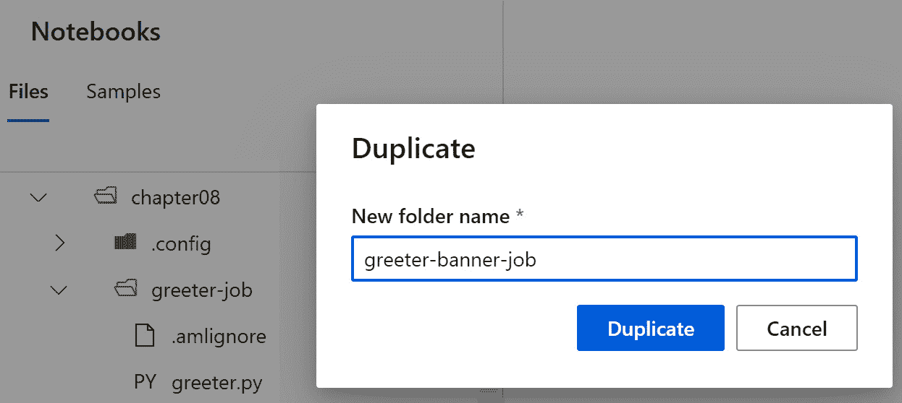

# *第八章*:尝试 Python 代码

在本章中，你将了解如何训练`scikit-learn`库，也就是通常所说的`sklearn`。你会明白如何使用 **Azure** **机器学习** ( **AzureML** ) **SDK** 和 **MLflow** 来跟踪训练指标。然后，您将看到如何在计算集群中扩展培训流程。

在本章中，我们将讨论以下主题:

*   在笔记本电脑中训练简单的`sklearn`模型
*   跟踪实验中的指标
*   利用计算集群扩展培训流程

# 技术要求

您需要访问 Azure 订阅。在该订阅中，您将需要一个`packt-azureml-rg`。你将需要一个`Contributor`或者`Owner`T3。如果你按照第二章 、*部署 Azure 机器学习工作区资源*中的说明，这些资源应该已经对你可用了。

您还需要对 Python 语言有一个基本的了解。代码片段面向 Python 3.6 或更新版本。您还应该熟悉在 AzureML Studio 中使用笔记本的体验，这在前一章中已经介绍过了。

本章假设您已经在 AzureML 工作空间中注册了`scikit-learn` `diabetes`数据集，并且已经创建了一个名为`cpu-sm-cluster`的计算集群，如 [*第 7 章*](B16777_07_Final_VK_ePub.xhtml#_idTextAnchor102) 、*azure ml Python SDK*中的*定义数据存储库*、*使用数据集*和*使用计算目标*部分所述。

你可以在 GitHub 的[http://bit.ly/dp100-ch08](http://bit.ly/dp100-ch08)找到这一章的所有笔记本和代码片段。

# 在笔记本电脑中训练简单的 sklearn 模型

本节的目标是创建一个 Python 脚本，该脚本将在*中注册的`diabetes`数据集的基础上生成一个简单的模型，在 [*第 7 章*](B16777_07_Final_VK_ePub.xhtml#_idTextAnchor102) 、*AzureML Python SDK*中使用数据集*。该模型将获得数字输入，并预测数字输出。要创建此模型，您需要准备数据，训练模型，评估训练模型的表现，然后存储它，以便您将来能够重用它，如图*图 8.1* 所示:


图 8.1-产生糖尿病预测模型的过程

让我们从了解您将使用的数据集开始。`diabetes`数据集由 442 名`diabetes`患者的数据组成。每行代表一名患者。每行包含 10 个特征(`target`，是记录特征后 1 年`diabetes`疾病进展的定量测量。

您可以在 AzureML Studio 接口中进一步探索数据集，如*图 8.2* 所示:


图 8.2–登记的糖尿病数据集

通常在准备阶段，您加载原始数据，筛选有缺失值的行，归一化特征值，然后将数据集拆分为训练和验证数据。由于数据已经过预处理，您只需加载数据并将其分成两部分:

1.  Navigate to the `chapter08` and then create a notebook named `chapter08.ipynb`:

    图 8.3–创建您将要使用的第 08 章笔记本

2.  In the first cell of the notebook, add the following code:

    ```
    from azureml.core import Workspace
    ws = Workspace.from_config()
    diabetes_ds = ws.datasets['diabetes']
    training_data, validation_data =\
    diabetes_ds.random_split(percentage = 0.8)
    X_train =\
    training_data.drop_columns('target').to_pandas_dataframe()
    y_train =\
    training_data.keep_columns('target').to_pandas_dataframe()
    X_validate =\
    validation_data.drop_columns('target').to_pandas_dataframe()
    y_validate =\
    validation_data.keep_columns('target').to_pandas_dataframe()
    ```

    在这个代码片段中，您获得了对工作区的引用，并检索了名为`diabetes`的数据集。然后你用`random_split()`方法把它分成两个`TabularDataset`。第一个数据集是`training_data`，它包含 80%的数据，而`validation_data`数据集引用另外 20%的数据。这些数据集包含您想要预测的要素和标注。使用`TabularDataset`的`drop_columns()`和`keep_columns()`方法，您可以从`label`列中分离出特性。然后用`TabularDataset`的`to_pandas_dataframe()`方法将数据加载到内存中。你最终得到了四个熊猫数据帧:

    *   `X_train`:包含 80%的行。每行有 10 列(`0`到`9`)。
    *   `y_train`:包含 80%的行。每行有 1 列(`target`)。
    *   `X_validate`:包含 20%的行。每行有 10 列(`0`到 `9`)。
    *   `y_validate`:包含 20%的行。每行有 1 列(`target`)。

    `diabetes`数据集在科学文献中非常流行。它被用作训练*回归*模型的例子。`scikit-learn`库提供了一个名为`sklearn.linear_model`的专用模块，其中包含许多我们可以使用的线性回归模型。现在您已经准备好了数据，您的下一个任务是训练模型。

3.  In this step, you are going to train a `LassoLars` model, which is an abbreviation for `LassoLars` class accepts a float parameter named `alpha`, which is known as a *regularization parameter* or *penalty term*. Its primary purpose is to protect the model from overfitting to the training dataset. Since this parameter controls the training process, it is referred to as being a *hyperparameter*. This parameter cannot be changed once the model has been trained. In this code block, you are instantiating an untrained model, setting `0.1` for the `alpha` parameter. In the next chapter, [*Chapter 9*](B16777_09_Final_VK_ePub.xhtml#_idTextAnchor136), *Optimizing the ML Model*, you will tune this parameter and try to locate the best value for your dataset.

    然后，使用`X_train`和`y_train`数据帧来拟合()模型，这意味着您正在根据训练数据集来训练模型。在这个过程之后，`model`变量引用了一个经过训练的模型，您可以用它来进行预测。

4.  下一个任务是根据一个度量标准评估您生成的模型。评估回归模型的最常见指标如下:
    *   平均或中位数绝对误差。
    *   Mean squared error or log error. Another common variation of this metric is the `mean_squared_error` method of the `sklearn.metrics` package. A common issue with this metric is that a model trained on data with a larger range of values has a higher rate of error than the same model trained on data with a smaller range. You are going to use a technique called *metric normalization* that basically divides the metric by the range of the data. The resulting metric is known as the `X_validate` DataFrame. You calculate the RMSE, comparing the predictions with the ground truth stored in the `y_validate` DataFrame. Then, you calculate the range of values (maximum minus minimum) using the `ptp()` method of `0.2`.

        最后一步是存储训练好的模型，以便能够在将来重用它。您将创建一个名为`outputs`的文件夹，并将模型保存到一个文件中。Python 对象到文件的持久化是使用`joblib`库的`dump()`方法完成的。

        在新的笔记本单元格中，输入以下源代码:

        ```
        import os
        import joblib
        os.makedirs('./outputs', exist_ok=True)
        model_file_name = f'model_{nrmse:.4f}_{alpha:.4f}.pkl'
        joblib.dump(value=model,
                filename=os.path.join('./outputs/',model_file_name))
        ```

        如果`outputs`文件夹不存在，则创建它。然后，您将模型存储在一个文件名中，该文件名包含前缀`model_`，后跟在*步骤 4* 中计算的 NRMSE 度量，再跟一个`_`，然后是用于实例化模型的`alpha`参数。您应该能够在文件浏览器中看到序列化的模型，如*图 8.4* 所示:


图 8.4–存储在输出文件夹中的序列化模型

您在*步骤 5* 中使用的命名约定有助于您跟踪模型的执行情况，并跟踪您在本次运行中使用的参数。AzureML SDK 提供了各种方法来监控、组织和管理您的训练运行，这将在下一节中探讨。

# 跟踪实验中的指标

当您训练一个模型时，您正在执行一个试验，您正在记录该过程的各个方面，包括诸如您需要用来比较模型性能的 NRMSE 之类的指标。AzureML 工作空间提供了**实验**的概念——也就是说，一个容器将这样的试验/运行组合在一起。

要创建一个新的实验，您只需要指定您将使用的工作空间，并提供一个最多包含 36 个字母、数字、下划线和破折号的名称。如果实验已经存在，您将获得对它的引用。在您的`chapter08.ipynb`笔记本中添加一个单元格，并添加以下代码:

```
from azureml.core import Workspace, Experiment
ws = Workspace.from_config()
exp = Experiment(workspace=ws, name="chapter08")
```

首先获取对现有 AzureML 工作空间的引用，然后创建`chapter08`实验(如果它还不存在的话)。如果您导航到 Studio 界面的**资产** | **实验**部分，您会注意到列表中出现一个空实验，如图 8.5 中的*所示:*


图 8.5–用 SDK 创建的空实验

要在`chapter08`实验下创建一个运行，您可以在一个新的单元格中添加以下代码:

```
run = exp.start_logging()
print(run.get_details())
```

`run`变量让您可以访问 AzureML SDK 的`Run`类的一个实例，它代表一个实验的一次试验。每个`run`实例都有一个惟一的 ID，标识工作区中的特定运行。

重要说明

在*用计算集群*扩展训练过程一节中，您将使用`Run`类的`get_context`方法来获取对正在执行 Python 脚本的`run`实例的引用。`run`通常是在您提交一个脚本以在实验中执行时自动创建的。`start_logging`方法很少使用，只有当您想要手动创建一个`run`并记录度量时才使用。最常见的情况是当您使用笔记本单元训练模型时，或者当您在远程计算机(如本地计算机或 **Databricks** 工作空间)上训练模型时。

`run`类提供了丰富的日志 API。最常用的方法是通用的`log()`方法，它允许您使用以下代码记录指标:

```
run.log("nrmse", 0.01)
run.log(name="nrmse", value=0.015, description="2nd measure")
```

在这段代码中，为`nrmse`度量记录值`0.01`，然后为相同的度量记录值`0.015`，传递可选的`description`参数。

如果您导航到`chapter08`实验，您会注意到有一个`run`当前处于`run`状态，导航到**指标**选项卡，您将能够注意到 **nrmse** 指标的两个测量值，以图表或表格的形式显示，如*图 8.6* 所示:


图 8.6–在工作室体验中看到的 nrmse 的两个测量值

`Run`类为提供了一个丰富的日志记录方法列表，包括下面的:

*   The `log_list` method allows you to log a list of values for the specific metric. An example of this method is the following code:

    ```
    run.log_list("accuracies", [0.5, 0.57, 0.62])
    ```

    该代码将在运行的*指标*部分产生*图 8.7* :


图 8.7-表示使用 log_list 方法记录的三个值的图表

*   The `log_table` and `log_row` methods allow you to log tabular data. Note that, with this method, you can specify the labels in the *x* axis in contrast to the `log_list` method:

    ```
    run.log_table("table", {"x":[1, 2], "y":[0.1, 0.2]})
    run.log_row("table", x=3, y=0.3)
    ```

    该代码片段将在运行的*指标*部分产生*图 8.8* :


图 8.8–使用 log_table 和 log_row 方法记录的表格度量

*   专门的方法，如`log_accuracy_table`、`log_confusion_matrix`、`log_predictions`和`log_residuals`提供了记录数据的自定义呈现。
*   `log_image`方法允许你从众所周知的`matplotlib` Python 库或其他绘图库中记录图形或图像。
*   `upload_file`、`upload_files`和`upload_folder`方法允许您上传实验残差并将它们与当前运行相关联。这些方法通常用于上传在`run`执行期间产生的各种二进制工件，例如由`plotly`等开源库创建的交互式 HTML 图形。

您可以选择创建子运行来隔离试验的子部分。子运行记录它们自己的指标，您也可以选择登录父运行。例如，下面的代码片段创建了一个子运行，记录了一个名为`child_metric`的指标(仅在该运行中可见)，然后记录了父运行的指标`metric_from_child`:

```
child_run = run.child_run()
child_run.log("child_metric", 0.01)
child_run.parent.log("metric_from_child", 0.02)
```

一旦你完成了运行，你需要改变它的**运行**状态。您可以使用以下方法之一:

*   `complete`方法表示运行已成功完成。该方法还将`outputs`文件夹(如果存在的话)上传到`runs`工件，而不需要显式调用`Run`类的`upload_folder`方法。
*   `cancel`方法表示作业被取消。您会注意到在 AutoML 实验中运行被取消，因为已达到超时期限。
*   不推荐使用的`fail`方法表示发生了错误。

下面的代码片段取消子运行并完成根运行，打印状态，应该显示为 **Completed** :

```
child_run.cancel()
run.complete()
print(run.get_status())
```

在本节中，您了解了 AzureML 的日志功能。在下一节中，您将重构您在*在笔记本*中训练简单 sklearn 模型一节中创建的代码，并添加日志记录功能。

## 追踪模式演变

在前面的部分中，您可能已经注意到，您在本章的*在笔记本*部分中训练一个简单的 sklearn 模型中创建的`outputs`文件夹在您执行`complete`方法时被自动上传到运行中。为了避免上传那些过时的工件，你需要删除`outputs`文件夹:

1.  在您的`chapter08.ipynb`笔记本中添加一个单元格，并使用下面的代码片段删除`outputs`文件夹:

    ```
    import shutil
    try:
      shutil.rmtree("./outputs")
    except FileNotFoundError: 
      pass
    ```

2.  As a next step, you will refactor the training and evaluation code to a single method, passing in the `alpha` parameter and the `training` and `validation` datasets:

    ```
    from sklearn.linear_model import LassoLars
    from sklearn.metrics import mean_squared_error
    def train_and_evaluate(alpha, X_t, y_t, X_v, y_v):
      model = LassoLars(alpha=alpha)
      model.fit(X_t, y_t)
      predictions = model.predict(X_v)
      rmse = mean_squared_error(predictions, y_v, squared = False)
      range_y_validate = y_v.to_numpy().ptp()
      nrmse = rmse/range_y_validate
      print(f"NRMSE: {nrmse}")
      return model, nrmse
    trained_model, model_nrmse = train_and_evaluate(0.1, 
                            X_train, y_train,
                            X_validate, y_validate) 
    ```

    这段代码与您在*笔记本*部分中编写的代码完全相同。现在，您可以使用`train_and_evaluate`并为`alpha`参数传递不同的值来训练多个模型，这个过程被称为*超参数调整*。在该代码片段的最后一行，您可以获得对最终训练模型及其 NRMSE 度量的引用。

    重要说明

    如果您得到如下错误:`NameError: name 'X_train' is not defined`，您将需要重新运行笔记本中定义了`X_train`、`y_train`、`X_validate`和`y_validate`变量的单元格。这表明 Python 内核已经重新启动，并且所有变量都已经从内存中丢失。

    到目前为止，您已经重构了现有代码，并保持了相同的功能。要通过您在上一节中探索的`Run`类启用日志记录，您需要将对当前运行实例的引用传递给`train_and_evaluate`方法。

3.  在新的单元格中，添加下面的代码片段，它将覆盖现有的`train_and_evaluate`方法声明:

    ```
    def train_and_evaluate(log and log_row methods to log the NRMSE metric of the trained model.重要说明如果您不能键入前面示例中显示的字母 *α* ，您可以使用 *a* 字符来代替。
    ```

4.  Having this `train_and_evaluate` method, you can do a hyperparameter tuning and train multiple models for multiple values of the `α` (`alpha`) parameter, using the following code:

    ```
    from azureml.core import Workspace, Experiment
    ws = Workspace.from_config()
    exp = Experiment(workspace=ws, name="chapter08")
    with exp.start_logging() as run:
        print(run.get_portal_url())
        for a in [0.001, 0.01, 0.1, 0.25, 0.5]:
            train_and_evaluate(run, a, 
                                X_train, y_train,
                                X_validate, y_validate)
    ```

    注意，我们没有调用`complete`方法，而是使用了`with .. as` Python 设计模式。随着`run`变量移出范围，它会自动标记为完成。

5.  使用*步骤 4* 中的`get_portal_url`，您打印了工作室的`log`方法调用的链接，而`α` ( `alpha`)参数是您使用`log_row`方法记录的。您应该会看到类似于*图 8.9* 所示的图表:


图 8.9–糖尿病模型的 nrmse 指标的演变

重要说明

在本节中，您只是在`Run`实例上存储指标，而不是实际训练的模型。您可以通过生成`.pkl`文件来存储生成的模型，然后使用`upload_file`方法将它上传到运行的工件中。在 [*第 12 章*](B16777_12_Final_VK_ePub.xhtml#_idTextAnchor171) ，*用代码*操作化模型中，您将了解 AzureML SDK 的模型注册功能，它提供了跟踪实际模型的卓越体验。

在本节中，您看到了如何使用 AzureML SDK 启用度量日志记录。说到跟踪实验指标，数据科学界正在使用一个流行的开源框架 MLflow。在下一节中，您将了解如何使用该库来跟踪 AzureML 工作空间中的指标。

## 使用 MLflow 跟踪实验

MLflow 库是一个受欢迎的开源库，用于管理数据科学实验的生命周期。这个库允许您在本地或服务器上存储工件和度量。AzureML 工作区提供了一个 MLflow 服务器，您可以使用它来执行以下操作:

*   通过 **MLflow** **跟踪**组件跟踪和记录实验指标。
*   通过 **MLflow** **项目**组件在 AzureML 计算集群上编排代码执行(类似于你将在 [*第 11 章*](B16777_11_Final_VK_ePub.xhtml#_idTextAnchor160) 、*中看到的管道使用管道*)。
*   管理 AzureML 模型注册中心的模型，你会在第十二章[**中看到用代码*操作化模型。*](B16777_12_Final_VK_ePub.xhtml#_idTextAnchor171)

在本节中，您将重点关注用于跟踪指标的 MLflow 跟踪组件。下面的代码片段使用`MLflow`库来跟踪您在前一节中在名为`chapter08-mlflow`的实验下创建的`diabetes`模型的参数和指标:

```
import mlflow
def train_and_evaluate(alpha, X_t, y_t, X_v, y_v):
  model = LassoLars(alpha=alpha)
  model.fit(X_t, y_t)
  predictions = model.predict(X_v)
  rmse = mean_squared_error(predictions, y_v, squared = False)
  range_y_validate = y_v.to_numpy().ptp()
  nrmse = rmse/range_y_validate
  mlflow.log_metric("nrmse", nrmse)
  return model, nrmse
mlflow.set_experiment("chapter08-mlflow")
with mlflow.start_run():
    mlflow.sklearn.autolog()
    trained_model, model_nrmse = train_and_evaluate(0.1, 
                                    X_train, y_train,
                                    X_validate, y_validate)
```

MLflow Tracking 组件的最广为人知的特性之一是它提供的自动记录功能。在您的训练代码之前调用`mlflow.sklearn.autolog()`方法能够自动记录`sklearn`度量、参数和生成的模型。类似于针对`sklearn`的`autolog`方法，有针对大多数常见训练框架的包，比如 PyTorch、fast.ai、Spark 等等。

使用`log_metric`方法，您显式地要求 MLflow 库记录一个指标。在这种情况下，您将记录 NRMSE 度量，自动记录功能不会自动捕获该度量。

正如您在*图 8.10* 中看到的，MLflow 跟踪组件在笔记本旁边的`mlruns`文件夹下的文件夹结构中记录所有工件和训练模型:


图 8.10–使用 MLflow 跟踪组件的本地文件存储模式跟踪指标

这是的默认设置，简称`local FileStore`。您可以将 AzureML workspace 用作*远程跟踪服务器*。为此，你需要使用`mlflow.set_tracking_uri()`方法连接到一个跟踪 URI。

要启用 MLflow 到 AzureML 的集成，您需要确保您的环境具有`azureml-mlflow` Python 库。此包已经存在于 AzureML 计算实例中。如果您在 Databricks 工作空间上工作，您将需要使用`pip install azureml-mlflow`命令手动安装它。

要获得跟踪 URI 并使用 AzureML 作为远程跟踪服务器运行相同的实验，请使用以下代码片段:

```
import mlflow
from azureml.core import Workspace
ws = Workspace.from_config()
mlflow.set_tracking_uri(ws.get_mlflow_tracking_uri())
mlflow.set_experiment("chapter08-mlflow")
with mlflow.start_run():
    mlflow.sklearn.autolog()
    trained_model, model_nrmse = train_and_evaluate(0.1, 
                                    X_train, y_train,
                                    X_validate, y_validate)
```

`Workspace`类的`get_mlflow_tracking_uri`方法返回一个 1 小时内有效的 URL。如果您的实验花费了一个多小时来完成，您将需要生成一个新的 URI，并使用`set_tracking_uri`方法对其赋值，如前面的代码片段所示。

您应该能够在 Studio 体验中看到运行和跟踪的指标，如*图 8.11* 所示:


图 8.11–使用 MLflow 库和 AzureML 作为远程跟踪服务器记录的指标

到目前为止，您已经在 AzureML 工作空间中使用了计算实例，并且在**笔记本**内核中训练了 ML 模型。这种方法适用于小模型或基于样本数据的快速原型。在某些情况下，您将需要处理要求更高的工作负载，要么需要更大的内存，要么甚至需要在多个计算机节点上进行分布式培训。这可以通过将培训流程委托给您在第 4 章 、*配置工作空间*中创建的计算集群来实现。在下一节中，您将学习如何在 AzureML 计算集群中执行 Python 的脚本。

# 利用计算集群扩展培训流程

在 [*第七章*](B16777_07_Final_VK_ePub.xhtml#_idTextAnchor102) ，*AzureML Python SDK*中，你创建了一个名为`cpu-sm-cluster`的计算集群。在这个部分，您将提交一个要在该集群上执行的培训作业。为此，您需要创建一个将在远程计算目标上执行的 Python 脚本。

导航到目前为止您一直使用的`chapter08`文件夹下的`greeter-job`。添加一个名为`greeter.py`的 Python 文件:


图 8.12–添加要在远程计算集群上执行的简单 Python 脚本

打开文件并在其中添加以下代码:

```
import argparse
parser = argparse.ArgumentParser()
parser.add_argument('--greet-name', type=str, 
                    dest='name', help='The name to greet')
args = parser.parse_args()
name = args.name
print(f"Hello {name}!")
```

这个脚本使用来自`argparse`模块的`ArgumentParser`类来解析传递给脚本的参数。它试图定位一个`--greet-name`参数，并将发现的值赋给它返回的对象的`name`属性(`args.name`)。然后，它为给定的名字打印一条问候消息。要尝试该脚本，请打开终端并键入以下内容:

```
python greeter.py --greet-name packt
```

该命令将产生如图 8.13 所示的输出:


图 8.13–测试您将在远程计算上执行的简单脚本

为了在远程计算集群上执行这个简单的 Python 脚本，返回到`chapter08.ipynb`笔记本，添加一个新的单元格，并键入以下代码:

```
from azureml.core import Workspace, Experiment
from azureml.core import ScriptRunConfig
ws = Workspace.from_config()
target = ws.compute_targets['cpu-sm-cluster']
script = ScriptRunConfig(
    source_directory='greeter-job',
    script='greeter.py',
    compute_target=target,
    arguments=['--greet-name', 'packt']
)
exp = Experiment(ws, 'greet-packt')
run = exp.submit(script)
print(run.get_portal_url())
run.wait_for_completion(show_output=True)
```

在这段代码中，您正在执行以下操作:

1.  获取一个对工作空间的引用,然后将一个对`cpu-sm-cluster`集群的引用赋给`target`变量。
2.  创建一个`ScriptRunConfig`来执行位于`greeter-job`文件夹中的`greeter.py`脚本。这个脚本将在传递了`--greet-name`和`packt`参数的`target`计算中执行，这两个参数将被连接起来，中间有一个空格。
3.  创建一个名为`greet-packt`的实验，您提交脚本配置以在这个实验下执行。方法`submit`创建了一个新的`Run`实例。
4.  You use the `get_portal_url` method to get the portal URL for the specific `Run` instance. You then call the `wait_for_completion` method, setting the `show_output` parameter to `True`. To wait for the run to complete, turn on verbose logging and print the logs in the output of the cell.

    重要说明

    在 AzureML SDK 的第一个版本中，您应该使用`Estimator`类，而不是`ScriptRunConfig`，这是不推荐的。此外，对于特定的框架，有一些不推荐使用的专门的`Estimator`类，比如提供运行 TensorFlow 特定代码的方法的`TensorFlow`类。这种方法已经被弃用，取而代之的是您将在接下来的*理解执行环境*部分中读到的环境。尽管如此，这些被否决的类的语法和参数与`ScriptRunConfig`非常相似。您应该能够毫无问题地阅读不推荐使用的代码。如果你在认证考试中看到一个老问题提到了这些被否决的类，请记住这一点。

您已经成功地完成了一次运行的远程执行。在下一节中，您将探索刚刚完成的运行的日志，并更好地理解 AzureML 的机制。

## 探索运行的输出和日志

在这一部分，您将探索在*使用计算集群*部分执行的远程执行的输出。这将让您深入了解 AzureML 平台是如何工作的，并帮助您解决在开发培训脚本时可能会遇到的错误。

使用`get_portal_url`方法打开您在前面部分打印的链接，或者导航到`greet-packt`实验，并打开**运行 1** 。导航到运行的**输出+日志**选项卡:


图 8.14–实验运行的输出+日志选项卡

这些输出对于排除潜在的脚本错误非常有帮助。`azureml-logs`文件夹包含平台日志。这些文件中的大部分是来自底层引擎的日志。包含脚本标准输出的日志是`70_driver_log.txt`。这是您需要首先查看的日志文件，以便对潜在的脚本执行失败进行故障排除。如果你有多个进程，你会看到多个带有数字后缀的文件，比如`70_driver_log_x.txt`。

`logs`文件夹是一个特殊的文件夹，您可以在脚本中使用它来输出日志。脚本在该文件夹中写入的所有内容都将自动上传到您在*跟踪实验中的指标*部分看到的运行的`outputs`文件夹中。AzureML 还输出你在图 8.14 中看到的`azureml`文件夹下的系统日志。

导航到`ScriptRunConfig`。该目录最多可包含 300 MB 和 2，000 个文件。如果需要更多脚本文件，可以使用数据存储。如果您编辑了`.py`脚本中的脚本文件和一个`.amltmp`文件，该文件是笔记本编辑器使用的临时文件:


图 8.15–快照中上传的临时文件

为了避免创建不想要的文件的快照，您可以在脚本旁边的文件夹中添加一个`.gitignore`或`.amlignore`文件，并排除那些遵循特定模式的文件。导航到`greeter-job`文件夹中的`.amlignore`文件，如果创建文件夹时该文件尚未添加，如图*图 8.16* 所示:


图 8.16–添加。用于排除临时文件添加到快照的 amlignore 文件

打开`.amlignore`文件，在其中添加以下行，以排除所有扩展名为. a `mltmp`文件的文件和您正在编辑的`.amlignore`文件:

```
*.amltmp
.amlignore
```

打开`chapter08.ipynb`笔记本，添加一个单元格，并添加以下代码以重新提交脚本:

```
from azureml.widgets import RunDetails
run = exp.submit(script)
RunDetails(run).show()
```

您正在重新提交您在上一步中创建的`ScriptRunConfig`的现有实例。如果你再次重启`exp`和`script`变量。

这一次，您将使用 AzureML SDK 提供的`RunDetails`小部件。这是一个**Jupyter**笔记本 widget 用来查看一个脚本执行的进度。这个小部件是异步的，在运行结束之前一直提供更新。

如果要打印运行状态，包括日志文件的内容，可以使用下面的代码片段:

```
run.get_details_with_logs()
```

运行完成后，导航到该运行的**快照**选项卡。您会注意到临时文件不见了。

请注意，这次运行的执行花费的时间要少得多。导航到运行日志。注意这次日志中没有出现`20_image_build_log.txt`文件，如图*图 8.17* 所示:


图 8.17–更快的运行执行和缺少 20_image_build_log.txt 文件

这是用于执行脚本的环境的 **Docker** 映像构建日志。这是一个非常耗时的过程。这些图像被构建并存储在与 AzureML 工作空间一起部署的容器注册表中。由于您没有修改执行环境，AzureML 在后续运行中重用了之前创建的映像。在下一节中，您将更好地理解什么是环境以及如何修改它。

## 了解执行环境

在 AzureML 工作空间术语中，**环境**意味着执行脚本所需的软件需求的列表。这些软件要求包括以下内容:

*   您的代码需要安装的 Python 包
*   代码中可能需要的环境变量
*   各种辅助软件，如 GPU 驱动程序或 **Spark** 引擎，它们可能是代码正常运行所必需的

环境是由*管理的*和*版本化的*实体，支持跨不同计算目标的可复制、可审计和可移植的 ML 工作流。

AzureML 提供了一个由`AzureML-Minimal`管理的环境列表，其中包含了最小的 Python 包需求，以支持您在*跟踪模型演化*部分看到的运行跟踪。另一方面，`AzureML-AutoML`环境是一个更大的管理环境，为您的脚本提供了运行 AutoML 实验所需的 Python 包。

重要说明

AzureML 服务不断更新，旧的环境被弃用，取而代之的是新的环境。即使在 AzureML Studio 的 web 界面中看不到`AzureML-Minimal`和`AzureML-AutoML`环境，它们也应该可供您使用。如果遇到任何错误，请从本章的 GitHub 库下载最新代码。

在*图 8.18* 中，您可以看到`AzureML-AutoML`环境与极简`AzureML-Minimal`环境相比有多少额外的软件包可用:


图 8.18–azure ml-Minimal 和 AzureML-AutoML 环境之间的 Python 包差异

*图 8.18* 显示了`AzureML-Minimal`环境*版本 46* 与`AzureML-AutoML`环境*版本 61* 的`Conda` 环境定义。`Conda`获取这个 YAML 文件并安装 Python *版本 3.6.2* 和`- pip:`符号下面列出的`pip`需求。正如您所注意到的，所有的`pip`包都有使用`==x.x.x`符号定义的特定版本。这意味着，每次使用这个 YAML 文件时，都会安装相同的 Python 包，这有助于为实验的可重复性保持一个稳定的环境。

创建环境时安装软件包是一个耗时的过程。这就是您在上一节中看到的 Docker 技术派上用场的地方。Docker 是一个开源项目，用于将应用程序自动部署为可移植的、自给自足的容器。这意味着不用在每次运行脚本时都创建一个新的环境，而是可以创建一个 Docker 容器映像，也称为 Docker 映像，其中所有 Python 依赖项都在映像的中*烘焙一次。您可以从那时起重用该映像来启动一个容器并执行您的脚本。事实上，所有 AzureML 管理的环境都可以作为 Docker 映像在`viennaglobal.azurecr.io`容器注册表中获得。*

重要说明

尽管为您的环境创建 Docker 映像很常见，但这并不总是必需的。如果在本地计算机或 AzureML 计算实例上运行实验，可以使用现有的`Conda`环境，避免使用 Docker 映像。如果您计划使用一个远程计算，例如一个 AzureML 计算集群，那么 Docker 映像是必需的，因为否则，您无法确保所提供的机器将拥有代码执行所需的所有软件组件。

为了更好地理解你到目前为止读到的内容，你将使用`AzureML-Minimal`环境重新运行前面的`greeter.py`脚本:。

1.  In your notebook, add a new cell and add the following code:

    ```
    from azureml.core import Environment
    minimal_env =\
    Environment.get(ws, name="AzureML-Minimal")
    print(minimal_env.name, minimal_env.version)
    print(minimal_env.Python.conda_dependencies.serialize_to_string())
    ```

    这段代码检索由`ws`变量引用的 AzureML 工作空间中定义的`AzureML-Minimal`环境，该环境在笔记本中的前面被初始化。然后，它打印环境的名称和版本以及您在*图 8.18* 中看到的`Conda`环境 YAML 定义。

2.  添加一个新的单元格，并键入以下内容:

    ```
    from azureml.core import Experiment, ScriptRunConfig
    target = ws.compute_targets['cpu-sm-cluster']
    script = ScriptRunConfig(
        source_directory='greeter-job',
        script='greeter.py',
        environment argument in the ScriptRunConfig constructor.
    ```

观察运行执行的输出。如果你仔细看，你会看到下面一行:

```
Status: Downloaded newer image for viennaglobal.azurecr.io/azureml/azureml_<something>:latest
```

这一行是`azureml-logs`中`55_azureml-execution-something.txt`文件的一部分。这一行通知您它正在从`viennaglobal`容器注册中心提取一个 Docker 映像，该注册中心属于**微软**。与此相反，在前面的部分中，在没有指定管理环境的运行中，图像是从您自己的容器注册表中提取的——与您的 AzureML 工作空间一起提供的那个，如图 8.19 中的*所示:*


图 8.19–在执行过程中从您自己的容器注册表中提取的图像，没有使用管理环境

这一观察将我们带到了下一种 AzureML 支持的环境，即系统管理的环境——这将在下一节中探讨。

### 定义系统管理的环境

S `Conda`环境定义或者一个简单的`pip` `requirements.txt`文件。在上一节中，您没有在`ScriptRunConfig`构造函数中定义`environment`参数，而是使用一个默认的`Conda`环境定义文件来创建系统管理的环境，该环境存储在与 AzureML 工作空间相关联的 **Azure** **容器注册表**中。让我们明确地创建一个系统管理的环境来使用您的代码:

1.  导航到 AzureML 工作区的**笔记本**部分和**文件**树形视图。
2.  Click on the three dots of the `greeter-job` folder to open the context menu (or just right-click on the name) and select the `greeter-banner-job`, as seen in the following screenshot:

    图 8.20–将迎宾-工作文件夹复制为一个名为迎宾-横幅-工作的新文件夹

3.  打开新文件夹中的`greeter.py`文件，将代码改为:

    ```
    import argparse
    Banner method from the asciistuff open source Python package. This method is used in the last print. This will output a fancy os module, which allows you to read the environment variables using the os.environ.get() method. The code tries to read the environment variable named GREET_HEADER, and if it is not defined, the default value, Message:, is assigned to the greet_header variable, which is printed before the banner message.重要说明如果您试图在 AzureML *计算实例*的终端中执行修改后的`greeter.py`，它将会失败，因为您没有安装`asciistuff`包。要在您的计算实例中安装它，您可以使用`pip install asciistuff`命令。
    ```

4.  The `asciistuff` package is a pip package that you will need to install in your executing environment for your code to work. To define that code dependency, you are going to create a `Conda` environment definition file. In the `chapter08` folder, add a new file named `greeter-banner-job.yml`. Add the following content to it:

    ```
    name: banner-env
    dependencies:
    - python=3.6.2
    - pip:
      - asciistuff==1.2.1 
    ```

    这个 YAML 文件定义了一个新的`Conda`环境，命名为`banner-env`，基于 Python *版本 3.6.2* ，安装了`pip`包`asciistuff`的 *1.2.1* 版本。

5.  To create an AzureML environment based on the `Conda` environment you just defined, you need to go to the `chapter08.ipynb` notebook, add a cell, and type the following code:

    ```
    from azureml.core import Environment
    banner_env = Environment.from_conda_specification(
                     name = "banner-env",
                     file_path = "greeter-banner-job.yml")
    banner_env.environment_variables["GREET_HEADER"] = \
                                     "Env. var. header:"
    ```

    这段代码使用`Environment`类的`from_conda_specification()`方法创建了一个名为`banner-env`的 AzureML 环境。`banner_env`变量包含新定义的环境。在后续行中，您定义了`GREET_HEADER`环境变量，并分配了`Env. var. header:`值。这个环境没有在工作区中注册，它不需要注册就可以使用。如果您确实希望将它保存在工作区中，以便能够以引用管理的环境的相同方式引用它，并且您希望保留它的版本，那么您可以使用`register()`方法，使用`banner_env.register(ws)`代码，其中您作为参数传递一个变量，该变量指向将注册环境的工作区。

    重要说明

    如果您计划在本地计算机上开始工作，然后在更强大的计算集群上扩展，那么您应该考虑创建并注册一个系统管理的环境，其中包含您所需的所有 Python 包。这将允许您在本地和远程执行中重用它。

6.  要使用这个新定义的环境，在笔记本中添加一个新的单元格，并键入以下代码:

    ```
    script = ScriptRunConfig(
        source_directory='ScriptRunConfig::
    ```

    *   源目录已经更改为指向`greeter-banner-job`文件夹，其中包含更新后的脚本。
    *   环境参数被指定，传递您自己定义的`banner_env`环境。

该实验的输出应该类似于*图 8.21* 中所示:


图 8.21–从环境变量中读取的标题文本和基于横幅的问候

正如您注意到的，在您刚刚创建的系统管理的环境中，您没有指定任何关于基本操作系统的内容(例如，它的`Conda`是否已经安装在基本系统中。您只是指定了安装的`Conda`依赖项。如果您想要更大的灵活性，您可以显式地配置环境并手动安装所有的软件需求。这些环境被称为用户管理的环境**。通常，这些用户管理的环境是定制的 Docker 映像，封装了所有必需的依赖项。例如，您可能需要 PyTorch 框架的定制版本，甚至是 Python 的定制版本。在这些情况下，您负责安装 Python 包并配置整个环境。出于本书的目的，您将使用管理的或系统管理的环境。**

到目前为止，您已经探索了如何在远程计算机上执行简单的 greeter Python 应用程序。在下一节中，您将继续您的`diabetes`模型训练并了解如何在远程计算集群上训练该模型。

## 在计算集群上训练糖尿病模型

在前面的部分中，您学习了如何通过从笔记本中调用`exp.submit(script)`方法在远程计算集群上运行脚本，如图*图 8.22* 所示:


图 8.22–在计算集群上执行脚本

当您调用`submit`方法时，以下动作在幕后发生:

1.  AzureML SDK 进行了一次`ScriptRunConfig`执行。
2.  AzureML 工作区检查了`Environment`的 Docker 图像是否已经存在。如果它不存在，它是在 Azure Container Registry 中创建的。
3.  该作业被提交给计算集群，该集群可以扩展以分配一个计算节点。在新分配的计算节点中执行以下操作:

1.  带有环境的 Docker 映像被拉至计算节点。
2.  `ScriptRunConfig`引用的脚本加载在正在运行的 Docker 实例中。
3.  指标和元数据存储在 AzureML 工作空间中。
4.  输出存储在存储帐户中。

在*使用笔记本*培训简单的 sklearn 模型部分，您在`chapter08.ipynb`笔记本中创建了一个培训脚本。培训发生在 Jupyter 服务器的进程中，在您的计算实例中。要在计算集群中运行相同的培训，您需要执行以下操作:

1.  将代码移动到 Python 脚本文件中。
2.  创建一个 AzureML 环境来运行培训。
3.  在实验中提交。

在接下来的小节中，您将看到如何转换您在*跟踪模型演进*小节中使用的脚本，以便能够在远程计算集群上执行它。

### 将代码移动到 Python 脚本文件中

如果您查看您在*跟踪模型演进*部分创建的脚本，在进行培训的代码中，您使用了`run`变量来记录指标。这个变量引用了您在调用`exp.start_logging()`时得到的`Run`对象。在上一节中，您了解了在实验中提交的`ScriptRunConfig`，并返回了`Run`类的一个实例。该实例是在计算实例的笔记本中创建的。在远程集群上执行的脚本文件如何访问同一个`Run`对象？

AzureML 的`Run`类提供了一个名为`get_context()`的方法，返回当前的服务执行上下文。在`ScriptRunConfig`的例子中，这个执行上下文与您调用`exp.submit(script)`时创建的`Run`相同:

```
from azureml.core.run import Run
run = Run.get_context()
```

除了`run`变量之外，在训练脚本中，还有`ws`变量，它是对 AzureML 工作空间的引用。您使用该变量来访问`diabetes`数据集。您通过调用`from_config`方法获得了对工作区的引用。这种方法的问题是，第一次调用该方法时，您需要手动验证并授权计算机代表您访问工作区。这在远程计算上是不可行的。

通过在实验属性中导航，然后导航到该实验的工作区属性，`run`变量使您能够访问相应的工作区:

```
ws = run.experiment.workspace
```

不过，对于这些代码行，有一个警告。您的代码假设 Python 脚本通过`ScriptRunConfig`提交。如果您在终端中本地运行 Python 脚本，使用以下命令行，您将得到一个错误:

```
python training.py --alpha 0.1
```

`get_context()`方法将返回一个`_OfflineRun`类的对象，它继承自`Run`类。这个类提供了您在实验中的*跟踪度量*部分看到的所有日志记录功能，但是它没有将度量或者工件上传到工作区，而是在终端中打印出尝试。显然，没有与该运行相关的实验，这将导致脚本抛出一个错误。因此，您需要使用到目前为止一直使用的`from_config()`方法来检索工作空间引用。由于终端是计算实例的一部分，脚本将执行传递您的凭证，而不会提示您进行身份验证，您将在本节的后面看到这一点。如果您在本地计算机上运行这段代码，您将需要对您的设备进行身份验证，正如您在第 7 章 、*AzureML Python SDK*的 [*部分的*从您的设备进行身份验证中所看到的。**](B16777_07_Final_VK_ePub.xhtml#_idTextAnchor102)

允许您在终端中脱机运行和在计算集群中提交的完整代码如下:

```
from azureml.core import Workspace
from azureml.core.run import Run, _OfflineRun
run = Run.get_context()
ws = None
if type(run) == _OfflineRun:
    ws = Workspace.from_config()
else:
    ws = run.experiment.workspace
```

这些是您需要对您的脚本进行的唯一的更改，以提交它用于远程执行并利用 AzureML SDK 功能。

重要说明

Python 开发人员通常使用一个`_`作为他们想要标记为内部的类、属性或方法的前缀。这意味着标记的代码是供`SDK`库中的类使用的，不应该被外部开发人员使用。标记的代码将来可能会在没有任何警告的情况下更改。使用以`_`前缀开头的类被认为是一种不好的做法。尽管如此，`_OfflineRun`类在 AzureML SDK 的公共示例中被广泛使用，并且可以安全使用。

让我们在您的工作区中进行这些更改。在文件树中，在`chapter08`下创建一个名为`diabetes-training`的文件夹，并在其中添加一个`training.py`文件，如图*图 8.23* 所示:


图 8.23–为远程糖尿病模型培训创建培训脚本

在`training.py`脚本中添加以下代码块。您可以直接从本章的*技术需求*一节中提到的 GitHub 库下载这些代码，而不是键入所有这些代码:

```
from sklearn.linear_model import LassoLars
from sklearn.metrics import mean_squared_error
from azureml.core import Workspace
from azureml.core.run import Run, _OfflineRun
import argparse
import os
import joblib
```

这些是脚本文件中需要的所有导入。将所有的`import`语句放在脚本文件的顶部是一个很好的做法，这样可以很容易地发现代码正确执行所需的模块。如果您使用`flake8`来 lint 您的代码库，如果您不遵循这个最佳实践，它将会抱怨:

```
parser = argparse.ArgumentParser()
parser.add_argument('--alpha', type=float, 
                  dest='alpha', help='The alpha parameter')
args = parser.parse_args()
```

这个脚本文件需要一个`--alpha`参数传递给它。在这个代码块中，使用您在*使用计算集群*部分看到的`argparse`模块解析这个参数，并且将`float`值赋给`args.alpha`变量，因为它是在`dest`参数中指定的。如果您向脚本传递未定义的参数，`parse_args`方法将抛出错误。有些人更喜欢使用`args, unknown_args = parser.parse_known_args()`而不是这个代码块的第四行，这允许脚本执行，即使它收到的参数比预期的多，在`unknown_args`变量中分配未知的参数:

```
run = Run.get_context()
ws = None
if type(run) == _OfflineRun:
    ws = Workspace.from_config()
else:
    ws = run.experiment.workspace
```

在这个代码块中，您使用在本节开始时看到的代码片段获得了对`Run`对象和`Workspace`的引用。一旦获得了对`Workspace`的引用，就可以加载`diabetes`数据集，如下一个脚本块所示:

```
diabetes_ds = ws.datasets['diabetes']
training_data, validation_data = \
               diabetes_ds.random_split(
                            percentage = 0.8, seed=1337)
X_train = training_data.drop_columns('target') \
                       .to_pandas_dataframe()
y_train = training_data.keep_columns('target') \
                       .to_pandas_dataframe()
X_validate = validation_data.drop_columns('target') \
                            .to_pandas_dataframe()
y_validate = validation_data.keep_columns('target') \
                            .to_pandas_dataframe()
```

在这个模块中，您将获得一个对`diabetes`数据集的引用，并将其拆分为所需的`X_train`、`y_train`、`X_validate`和`y_validate`熊猫数据帧，您在本章的*在笔记本*部分中培训一个简单的 sklearn 模型时看到了这些数据帧。注意，您在`random_split`方法中指定了`seed`参数。这个`seed`参数用于初始化由`split`方法使用的底层随机函数的状态，以便从数据集中随机选择行。通过这样做，随机函数将在每次被调用时生成相同的随机数。这意味着每次运行脚本时,`training_data`和`validation_data`都是相同的。拥有相同的训练和验证数据集将有助于正确比较具有不同`alpha`参数的相同脚本的多次执行:

```
def train_and_evaluate(run, alpha, X_t, y_t, X_v, y_v):
  model = LassoLars(alpha=alpha)
  model.fit(X_t, y_t)
  predictions = model.predict(X_v)
  rmse = mean_squared_error(predictions,y_v,squared=False)
  range_y_validate = y_v.to_numpy().ptp()
  nrmse = rmse/range_y_validate
  run.log("nrmse", nrmse)
  run.log_row("nrmse over α", α=alpha, nrmse=nrmse)
  return model, nrmse
```

在这个代码块中，您定义了`train_and_evaluate`方法，这与本章的*跟踪模型演化*部分中使用的方法相同:

```
model, nrmse = train_and_evaluate(run, args.alpha,
                  X_train, y_train, X_validate, y_validate)
```

在方法定义之后，您调用训练过程，传递所有必需的参数:

```
os.makedirs('./outputs', exist_ok=True)
model_file_name = 'model.pkl'
joblib.dump(value=model, filename=
           os.path.join('./outputs/',model_file_name))
```

最后一个代码块将模型存储在脚本位置旁边的`outputs`文件夹中。

您可以在本地计算实例上运行该脚本，您会注意到模型按照预期进行了训练，并且指标被记录在终端中，如图 8.24 中的*所示。这是您之前读到的`_OfflineRun`类的预期行为:*


图 8.24–在本地运行训练脚本

到目前为止，您已经创建了培训脚本。在下一节中，您将创建 AzureML 环境，该环境将包含在远程计算上执行该脚本所需的所有依赖项。

### 创建 AzureML 环境来运行培训脚本

您在*跟踪模型演化*部分创建的训练脚本使用了`scikit-learn`库，也称为`sklearn`。你在笔记本体验中使用的 Jupyter 内核已经安装了`sklearn`库。要查看当前安装在内核中的版本，请转到`chapter08.ipynb`笔记本，并在新的单元格中添加以下代码片段:

```
!pip show scikit-learn
```

该命令将使用 Python 的`pip`包管理器来显示当前安装的`scikit-learn`包的详细信息，如图*图 8.25* 所示:


图 8.25–已安装的 scikit-learn 库的包信息

重要说明

如果不确定库名，可以使用`pip freeze`命令获得当前 Python 环境中已安装的包的完整列表。

您还可以使用`sklearn.__version__`属性在 Python 脚本中找到已安装库的版本(注意两个下划线)。在新的笔记本单元格中，添加以下几行 Python 代码:

```
import sklearn
print(sklearn.__version__)
```

您应该能够在输出中看到完全相同的版本。大多数 Python SDKs 和库都有这个`__version__`属性，比如 PyTorch 和 TensorFlow 框架。

有两种方法安装`scikit-learn`包；作为`Conda`套装或`pip`套装。`Conda`提供了 Python 包的精选列表，这是推荐的方法。在*理解执行环境*部分，您看到了如何使用`Conda`规范文件创建环境。在本节中，您将学习一种不同的方法，在 Python 代码中创建环境。在`chapter08.ipynb`笔记本中添加一个新单元格，并键入以下内容:

```
from azureml.core import Environment
from azureml.core.conda_dependencies import CondaDependencies 
import sklearn
diabetes_env = Environment(name="diabetes-training-env")
diabetes_env.Python.conda_dependencies = CondaDependencies()
diabetes_env.Python.conda_dependencies.add_conda_package(
                   f"scikit-learn=={sklearn.__version__}")
diabetes_env.python.conda_dependencies.add_pip_package("azureml-dataprep[pandas]")
```

在前面的代码片段中，您创建了一个新的系统管理的环境，然后使用`add_conda_package`添加特定版本的`scikit-learn`。您还可以使用`add_pip_package`来添加`azureml-dataprep[pandas]`包，这是在`training.py`脚本中使用`to_pandas_dataframe`方法所必需的。您可以添加额外的 pip 包，比如之前安装的`asciistuff`包。您可以使用`CondaDependencies`类的`create`方法，而不是使用`add_pip_package`方法一次添加一个包，如下面的代码片段所示:

```
diabetes_env.Python.conda_dependencies = \
CondaDependencies.create(
      conda_packages=[
                   f"scikit-learn=={sklearn.__version__}"],
      pip_packages=["azureml-defaults", "azureml-dataprep[pandas]"])
```

您可以通过将多个包添加到`conda_packages`和`pip_packages`阵列中来请求它们出现在环境中。注意，因为您没有将包添加到默认的`CondaDependencies`中，所以您需要手动包含`training.py`脚本访问`azureml.core`模块所需的`azureml-defaults`包。

你可能想知道为什么我们没有在 Python 依赖中定义`joblib`。`scikit-learn`包依赖于`joblib`包，它会自动安装到环境中。如果需要，可以使用以下代码在依赖项列表中显式指定它:

```
import joblib
diabetes_env.Python.conda_dependencies.add_pip_package(f"joblib=={joblib.__version__}")
```

重要说明

尽管指定要添加到环境中的包的版本不是强制性的，但这是一个好的做法。如果你写了`add_conda_package("scikit-learn")`，跳过指定包的版本，AzureML 会认为你指的是最新的版本。第一次使用 AzureML 中的环境时，会创建 Docker 映像，安装 Docker 映像创建时最新版本的`scikit-learn`包。该版本可能比您用来创建脚本的版本更新，并且可能与您编写的代码不兼容。尽管较小的版本差异可能不会影响您的代码，但主要版本可能会引入重大变化，正如 TensorFlow 从*版本 1* 迁移到*版本 2* 时所做的那样。

如果你不想用你的代码依赖创建一个新的环境，你可以使用 AzureML 管理的环境。您可以选择高度专业化的基于 GPU 的`AzureML-Scikit-learn0.24-Cuda11-OpenMpi4.1.0-py36`环境，也可以使用更通用的`AzureML-Tutorial`管理的环境，其中包含最常用的数据科学库，如`scikit-learn`、`MLflow`和`matplotlib`。

到目前为止，您已经编写了训练脚本，并且使用所需的`sklearn`库定义了 AzureML 环境。在下一部分中，您将开始关于计算集群的培训。

### 在实验中提交 ScriptRunConfig

一旦有了脚本和 AzureML 环境定义，就可以提交`ScriptRunConfig`在远程计算集群上执行。在`chapter08.ipynb`笔记本的新单元格中，添加以下代码:

```
from azureml.core import Workspace, Experiment
from azureml.core import ScriptRunConfig
ws = Workspace.from_config()
target = ws.compute_targets['cpu-sm-cluster']
script = ScriptRunConfig(
    source_directory='diabetes-training',
    script='training.py',
    environment=diabetes_env,
    compute_target=target,
    arguments=['--alpha', 0.01]
)
exp = Experiment(ws, 'chapter08-diabetes')
run = exp.submit(script)
run.wait_for_completion(show_output=True)
```

这段代码与前面几节中用于提交`greeter.py`脚本的代码相同。您将获得对 AzureML 工作区和计算集群的引用，您将在那里执行作业。您定义了一个`ScriptRunConfig`对象，在这里您定义了要执行的脚本的位置、您在上一节中定义的环境以及目标计算。您还可以将`alpha`参数传递给脚本。在最后一段代码中，您创建了一个实验并提交`ScriptRunConfig`来执行。

使用这段代码，您触发了您在本章前面的*在计算集群*上训练糖尿病模型部分的*图 8.22* 中看到的流程。

一旦训练完成，您将能够导航到实验，选择运行`,`并观察从训练过程中收集的指标，如图*图 8.26* 所示:


图 8.26–远程计算集群上运行的脚本记录的指标

到目前为止，您已经成功地在远程计算集群上的单个节点中执行了`diabetes`模型训练脚本，并且您已经在 AzureML 实验的运行中记录了指标和经过训练的模型。

在下一节中，您将发现不同的方法来扩展您的计算工作，并利用计算集群上的多个节点。

## 在模型训练期间使用多个计算节点

正如您在第 4 章 、*配置工作空间*的*计算集群*部分中所看到的，集群可以从 0 个计算节点扩展到任意多个。在模型训练阶段，集群中需要多个节点有几个原因。它们如下:

*   **并行执行不相关的模型训练实例**:当你在一个团队中工作时，有多个实验并行运行是很常见的。每个作业都可以在单个节点上运行，就像您在上一节中所做的那样。
*   **单一模型的并行训练，也称为分布式训练**:这是一个高级场景，您使用的框架是 PyTorch 和 TensorFlow 使用的 **Apache** **Horovod** 分布式深度学习训练框架。有两种类型的分布式培训选项:
    *   哇
    *   **模型并行**:你在不同的计算节点上训练模型的比特。每个节点只负责训练整个模型的一小部分，每次需要传播步骤时，节点之间都会进行同步。
*   您在上一部分中训练的`LassoLars`模型的`alpha`参数。您可能希望探索这些参数的多个值，以选择在训练数据集上表现最佳的模型。这是一个叫做超参数调优的过程，你会在 [*第九章*](B16777_09_Final_VK_ePub.xhtml#_idTextAnchor136) 、*优化 ML 模型*中了解到更多。
*   **并行训练多个模型以选择最佳方案**:这是你在 [*第五章*](B16777_05_Final_VK_ePub.xhtml#_idTextAnchor072)*中已经发现的 AutoML 过程，让机器做模型训练*。在 [*第 9 章*](B16777_09_Final_VK_ePub.xhtml#_idTextAnchor136) 、*优化 ML 模型、*使用代码运行 AutoML 实验章节中，您也会再次看到这种方法。

在本节中，您了解了在计算集群中利用多个节点的不同方法。您将在第九章 、*优化 ML 模型*中深入探讨后两种方法。

# 总结

在本章中，您了解了在 AzureML 工作空间中创建 ML 模型的各种方法。您从一个简单的回归模型开始，这个模型是在 Jupyter 笔记本的内核进程中训练的。您学习了如何从您训练的模型中跟踪指标。然后，您将培训流程扩展到您在 [*第 7 章*](B16777_07_Final_VK_ePub.xhtml#_idTextAnchor102) ，*AzureML Python SDK*中创建的`cpu-sm-cluster`计算集群中。在向外扩展到远程计算集群时，您了解了什么是 AzureML 环境，以及如何通过查看日志来对远程执行进行故障排除。

在下一章中，您将基于这些知识，使用多个计算机节点来执行并行化的*超参数调整*过程，该过程将为您的模型定位最佳参数。您还将了解如何使用 AzureML SDK 的 AutoML 功能完全自动化模型选择、训练和调优。

# 问题

在每一章中，你会发现几个问题来检查你对所讨论主题的理解:。

1.  You want to log the number of validation rows you will use within a script. Which method of the `Run` class will you use?

    a.`log_table`

    b.`log_row`

    c.`log`

2.  You want to run a Python script that utilizes `scikit-learn`. How would you configure the AzureML environment?

    a.添加`scikit-learn Conda dependency.`

    b.添加`sklearn Conda dependency.`

    c.使用 AzureML `Azure-Minimal`环境，它已经包含了所需的依赖项。

3.  You need to use `MLflow` to track the metrics generated in an Experiment and store them in your AzureML workspace. Which two pip packages do you need to have in your Conda environment?

    a.`mlflow`

    b.`azureml-mlflow`

    c.`sklearn`

    d.`logger`

4.  You need to use `MLflow` to track the value `0.1` for the `training_rate` metric. Which of the following code achieves this requirement? Assume all classes are correctly imported at the top of the script:

    a.`mlflow.log_metric('training_rate', 0.1)`

    b.`run.log('training_rate', 0.1)`

    c.`logger.log('training_rate', 0.1)`

# 延伸阅读

本节提供了一个 web 资源列表，帮助您扩展 AzureML SDK 和本章中使用的各种代码片段的知识:

*   糖尿病数据集的来源:[https://www4.stat.ncsu.edu/~boos/var.select/diabetes.html](https://www4.stat.ncsu.edu/~boos/var.select/diabetes.html)
*   *套索*模型文档在 *scikit-learn* 网站:[https://sci kit-learn . org/stable/modules/linear _ model . html # Lars-lasso](https://scikit-learn.org/stable/modules/linear_model.html#lars-lasso)
*   *plotly* 开源图形库:【https://github.com/plotly/plotly.py 
*   MLflow 跟踪 API 参考:[https://ml flow . org/docs/latest/quick start . html # using-the-Tracking-API](https://mlflow.org/docs/latest/quickstart.html#using-the-tracking-api)
*   `.amlignore`和的语法。`gitignore`文件:【https://git-scm.com/docs/gitignore】T2
*   https://flake8.pycqa.org[代码林挺](https://flake8.pycqa.org)