# 三、分类数据

在这一章中，我们将探索**分类** ，这是监督学习中另一个有趣的问题。我们将研究一些数据分类技术，并研究如何在 Clojure 中利用这些技术。

分类可以定义为基于一些经验训练数据来识别观察数据的类别或类的问题。训练数据将具有可观察特征或独立变量的值。对于这些观察值，它也有一个已知的类别。分类类似于回归，因为我们根据另一组值来预测一个值。然而，对于分类，我们感兴趣的是观察值的类别，而不是基于给定的一组值来预测一个值。例如，如果我们从范围从 *0* 到 *5* 的一组输出值训练一个线性回归模型，则训练好的分类器可以预测一组输入值的输出值为 *10* 或 *-1* 。然而，在分类中，输出变量的预测值总是属于一组离散值。

分类模型的自变量也称为模型的*解释变量*，因变量也称为观测值的*结果*、*类别*或*类别*。分类模型的结果总是一个离散值，即一组预定值中的一个值。这是分类和回归之间的主要区别之一，因为我们在回归建模中预测一个可以有连续值范围的变量。请注意，术语“类别”和“类”在分类的上下文中可以互换使用。

实现分类技术的算法称为分类器。**分类器** 可以正式定义为将一组值映射到一个类别或类的函数。分类仍然是计算机科学中的一个活跃的研究领域，并且有几种突出的分类器算法在今天的软件中使用。分类有几个实际应用，如数据挖掘、机器视觉、语音和手写识别、生物分类和地质统计学。

# 理解二进制和多类分类

我们将首先研究关于数据分类的一些理论方面。与其他监督机器学习技术一样，目标是从样本数据中估计模型或分类器，并使用它来预测给定的一组结果。分类可以被认为是确定将样本数据的特征映射到特定类别的函数的一种方式。预测类别是从一组给定的预定类别中选择的。因此，类似于回归，对给定自变量的观察值进行分类的问题类似于确定给定训练数据的最佳拟合函数。

在某些情况下，我们可能只对单个类感兴趣，也就是说，观察到的值是否属于特定的类。这种分类形式称为**二元分类** ，模型的输出变量可以有值 *0* 或 *1* 。因此，我们可以说，其中 *y* 是分类模型的结果或因变量。当时，结果被称为负，反之，当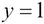时，结果被称为正。

从这个角度来看，当模型的独立变量的一些观察值被提供时，我们必须能够确定一个积极结果的概率。因此，给定样本数据的估计模型具有概率，并且可以表示如下:


在上式中，参数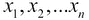表示估计分类模型的自变量，项表示该模型的估计参数向量。

这种分类的一个例子是根据发件人或电子邮件中的内容来决定一封新邮件是否是垃圾邮件。二元分类的另一个简单例子是，根据当天观察到的湿度以及最低和最高温度来确定某一天降雨的可能性。此示例的定型数据可能类似于下表中的数据:


我们可以用来模拟二元分类的数学函数是**sigmoid**或 **logistic** 函数。如果特征 *X* 的结果有一个估计的参数向量，我们可以如下定义正结果 *Y* 的估计概率(作为一个 sigmoid 函数):


为了形象化前面的等式，我们可以通过将 *Z* 替换为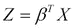来简化它，如下所示:


我们还可以使用其他几个函数对数据建模。然而，二元分类器的样本数据可以容易地被转换，使得它可以使用 sigmoid 函数来建模。这种使用逻辑函数的分类问题建模被称为**逻辑回归** 。上式中定义的简化 sigmoid 函数产生以下曲线:

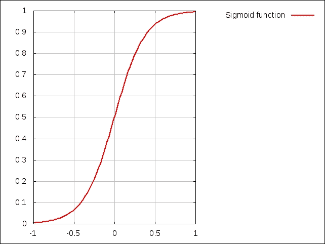

请注意，如果术语 *Z* 为负值，则该图会反转显示，是之前图的镜像。我们可以通过下面的图来想象出sigmoid 函数是如何随 *Z* 项变化的:

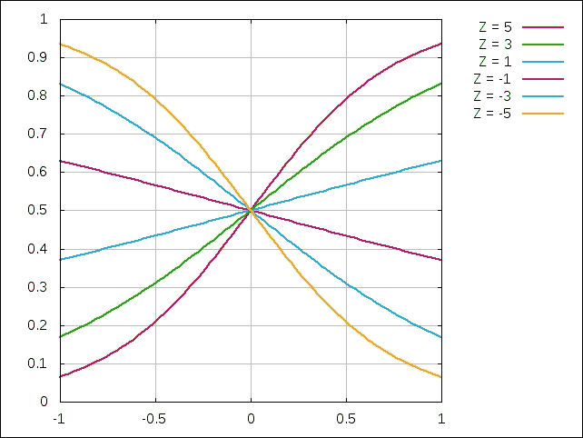

在上图中，针对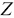项的不同值显示了 sigmoid 函数；范围从 *-5* 到 *5* 。注意，对于二维，术语是独立变量 *x* 的线性函数。有趣的是，对于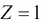和，sigmoid 函数看起来或多或少像一条直线。当时，该函数简化为一条直线，并且可以由一个恒定的 *y* 值来表示(在这种情况下为等式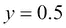)。

我们观察到估计结果 *Y* 总是在 *0* 和 *1* 之间，因为它代表给定观察值的正面结果的概率。此外，结果 *Y* 的范围不受术语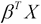符号的影响。因此，回想起来，sigmoid 函数是二元分类的有效表示。

要使用逻辑函数从训练数据中估计分类模型，我们可以将逻辑回归模型的成本函数定义如下:

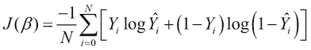

前面的等式本质上总结了我们模型中输出变量的实际值和预测值之间的差异，就像线性回归一样。然而，当我们处理 *0* 和 *1* 之间的概率值时，我们使用前面的对数函数来有效地测量实际和预测输出值之间的差异。注意，术语 *N* 表示训练数据中的样本数量。我们可以将梯度下降应用于该成本函数，以确定局部最小值或者一组观察值的预测类别。该等式可以被正则化以产生以下成本函数:

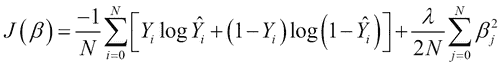

请注意，在这个等式中，第二个求和项作为正则项添加，就像我们在第 2 章、*了解线性回归*中讨论的那样。这一项基本上防止了估计模型对样本数据的*欠拟合*和*过拟合*。请注意，术语是正则化参数，必须根据我们希望模型有多精确来适当选择。

**多类分类** ，是分类的另一种形式，预测分类结果为一组特定预定值中的一个值。因此，从 *k 个*离散值中选择结果，即。该模型为观察值的每个可能类别产生 *k* 个概率。这给我们带来了以下多类分类的正式定义:

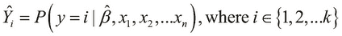

因此，在多类分类中，我们预测 *k* 个不同的值，其中每个值表示输入值属于特定类的概率。有趣的是，二进制分类可以被推理为多类分类的专门化，其中只有两个可能的类，即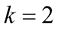和。

作为多类分类的特例，我们可以说具有最大概率的类是给定的一组观察值的结果，或者简单地说，是预测的类。这种多类分类的专门化称为 **一对一**分类。这里，具有最大(或最小)出现概率的单个类别是从给定的一组观察值中确定的，而不是在我们的模型中寻找所有可能类别的出现概率。因此，如果我们打算从一组特定的类中预测一个类，我们可以将结果 *C* 定义如下:

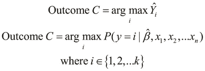

例如，让我们假设我们想要确定一个鱼包装厂的分类模型。在这种情况下，鱼被分成两个不同的类别。比方说，我们可以把鱼分为鲈鱼或鲑鱼。我们可以为我们的模型创建一些训练数据，方法是选择足够大的鱼类样本，并分析它们在一些选定特征上的分布。假设我们已经确定了两个特征来对数据进行分类，即鱼的长度和皮肤的亮度。

第一个特征的分布，即鱼的长度，可以形象化如下:

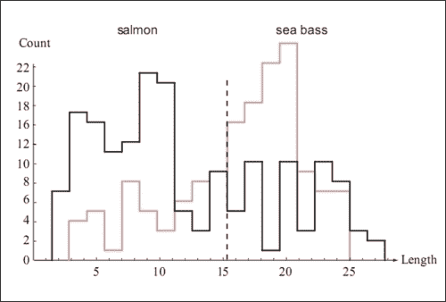

类似地，来自样本数据的鱼皮的亮度分布可以通过下面的图来可视化:

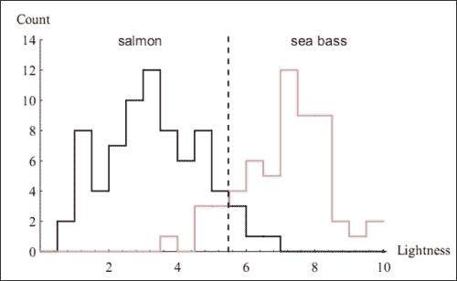

从前面的图表中，我们可以说，仅仅指定鱼的长度是不足以确定其类型的信息。因此，该特征在分类模型中具有较小的系数。相反，由于鱼的皮肤的亮度在确定鱼的类型中起着更大的作用，所以该特征在估计的分类模型的参数向量中将具有更大的系数。

一旦我们对给定的分类问题进行建模，我们就可以将训练数据划分为两个(或更多)集合。划分这两个集合的向量空间中的表面被称为公式化分类模型的**决策边界** 。决策边界一侧的所有点都是一个类的一部分，而决策边界另一侧的点是另一个类的一部分。一个明显的推论是，根据不同类别的数量，一个给定的分类模型可以有几个这样的决策边界。

我们现在可以结合这两个特征来训练我们的模型，这产生了两类鱼之间的估计决策边界。该边界可以在训练数据的散点图上可视化，如下所示:

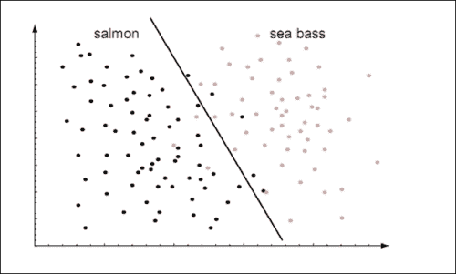

在前面的图中，我们通过使用直线来近似分类模型，因此，我们有效地将分类建模为线性函数。或者，我们可以将数据建模为多项式函数，因为这将产生更准确的分类模型。这样一个模型产生一个决策边界，它可以被可视化如下:


决策边界将样本数据划分为两个维度，如前面的图表所示。当样本数据具有更多个特征或维度时，决策边界将变得更加复杂。例如，对于三个要素，决策边界将是一个三维表面，如下图所示。注意，为了清楚起见，没有示出样本数据点。此外，假设两个标绘特征在范围内变化，第三个特征在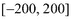范围内变化。


# 理解贝叶斯分类

我们现在将探索用于数据分类的贝叶斯技术。一个**贝叶斯**分类器本质上是一个概率分类器，它是使用条件概率的贝叶斯定理构建的。基于贝叶斯分类的模型假设样本数据具有强独立的特征。所谓*独立*，我们的意思是模型的每个特征都可以独立于模型中的其他特征而变化。换句话说，模型的特征是互斥的。因此，贝叶斯分类器假设特定特征的存在与否完全独立于分类模型的其他特征的存在与否。

术语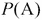用于表示条件或特征 *A* 发生的概率。其值总是在 *0* 和 *1* 范围内的分数值，包括两端。它也可以表示为一个百分比值。比如概率 *0.5* 也写成 *50%* 或者*50%*。假设我们想从给定数量的样本中找出特征 *A* 或出现的概率。因此，的值越高，表示特征 *A* 出现的几率越高。我们可以将概率正式表示如下:

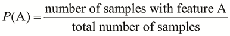

如果 *A* 和 *B* 是我们的分类模型中的两个条件或特征，那么当已知 *B* 已经发生时，我们使用术语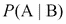来表示 *A* 的发生。这个值称为给定 *B* 的 *A* 的**条件概率** ，术语也读作给定 *B* 的 *A* 的概率。在术语中， *B* 也被称为 *A* 的证据。在条件概率中， *A* 和 *B* 这两个事件，可能是也可能不是相互独立的。但是，如果 *A* 和 *B* 确实是独立条件，那么概率等于 *A* 和 *B* 分别出现的概率的乘积。我们可以把这个公理表述如下:

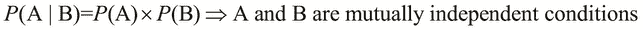

贝叶斯定理描述了条件概率和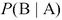与概率和之间的关系。它用以下等式正式表示:

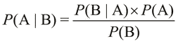

当然，概率和必须都大于 *0* ，前面的关系才会成立。

让我们再来看看前面描述的鱼类包装厂的分类示例。问题是，我们需要根据鱼的物理特征来确定它是海鲈鱼还是鲑鱼。我们现在将使用贝叶斯分类器来实现这个问题的解决方案。然后，我们将使用贝叶斯定理来模拟我们的数据。

让我们假设每一类鱼都有三个独立而鲜明的特征，即皮肤的轻盈度和长宽。因此，我们的训练数据如下表所示:


为了简化实现，让我们使用 Clojure 符号来表示这些特性。我们需要首先生成以下数据:

```clj
(defn make-sea-bass []
  ;; sea bass are mostly long and light in color
  #{:sea-bass
    (if (< (rand) 0.2) :fat :thin)
    (if (< (rand) 0.7) :long :short)
    (if (< (rand) 0.8) :light :dark)})

(defn make-salmon []
  ;; salmon are mostly fat and dark
  #{:salmon
    (if (< (rand) 0.8) :fat :thin)
    (if (< (rand) 0.5) :long :short)
    (if (< (rand) 0.3) :light :dark)})

(defn make-sample-fish []
  (if (< (rand) 0.3) (make-sea-bass) (make-salmon)))

(def fish-training-data
  (for [i (range 10000)] (make-sample-fish)))
```

这里，我们定义了两个函数`make-sea-bass`和`make-salmon`，来创建一组符号来表示这两类鱼。我们方便地使用`:salmon`和`:sea-bass`关键词来代表这两个类别。同样，我们也可以使用 Clojure 关键字来枚举一条鱼的特征。在这个例子中，皮肤的亮度不是`:light`就是`:dark`，长度不是`:long`就是`:short`，宽度不是`:fat`就是`:thin`。此外，我们定义了`make-sample-fish`函数来随机创建一条鱼，它由前面定义的一组特性来表示。

请注意，我们将这两类鱼定义为:海鲈鱼大多长且肤色浅，鲑鱼大多肥且肤色深。此外，我们在`make-sample-fish`函数中生成的鲑鱼比鲈鱼多。我们在数据中添加这种偏好只是为了提供更具说明性的结果，鼓励读者尝试更真实的数据分布。我们在[第 2 章](ch02.html "Chapter 2. Understanding Linear Regression")、*了解线性回归*中介绍的 *Iris* 数据集在 Incanter 库中可用，它是可用于研究分类的真实世界数据集的一个示例。

现在，我们将实现以下函数来计算特定条件的概率:

```clj
(defn probability
  "Calculates the probability of a specific category
   given some attributes, depending on the training data."
  [attribute & {:keys
                [category prior-positive prior-negative data]
                :or {category nil
                     data fish-training-data}}]
  (let [by-category (if category
                      (filter category data)
                      data)
        positive (count (filter attribute by-category))
        negative (- (count by-category) positive)
        total (+ positive negative)]
    (/ positive negative)))
```

我们本质上是通过出现的次数来实现概率的基本定义。

前面代码中定义的`probability`函数需要一个参数来表示我们要计算其出现概率的属性或条件。此外，该函数接受几个可选参数，例如用于计算该值的数据(默认为我们之前定义的`fish-training-data`序列)和类别(可以简单地作为另一个条件进行推理)。自变量`category`和`attribute`实际上类似于概率中的条件 *A* 和 *B* 。`probability`功能通过使用`filter`功能过滤训练数据来确定条件的总阳性发生率。然后，通过计算样本数据中由`(count by-category)`表示的正数值和总数值之间的差值，确定负数值出现的次数。该函数最终返回给定数据中条件的正出现次数与总出现次数的比率。

让我们使用`probability`函数告诉我们一些关于我们的训练数据，如下所示:

```clj
user> (probability :dark :category :salmon)
1204/1733
user> (probability :dark :category :sea-bass)
621/3068
user> (probability :light :category :salmon)
529/1733
user> (probability :light :category :sea-bass)
2447/3068
```

如前面代码所示，一条三文鱼外表是深色的概率很高，具体来说就是`1204/1733`。与海鲈鱼是浅色的和鲑鱼是深色的概率相比，海鲈鱼是深色的和鲑鱼是浅色的概率也很低。

让我们假设我们观察到的鱼的特征值是黑皮肤、长而肥。鉴于这些情况，我们需要将鱼分为鲈鱼或鲑鱼。就概率而言，我们需要确定一条鱼是鲑鱼还是海鲈鱼的概率，因为这条鱼是深色的，长的，肥的。从形式上来说，这种概率用术语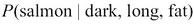和来表示任一种类的鱼。如果我们计算这两个概率，我们可以选择这两个概率中最高的类别来确定鱼的类别。

使用贝叶斯定理，我们将术语和定义如下:

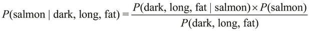

术语和可能看起来有点混乱，但是这两个术语的区别在于指定条件的出现顺序。术语表示一条又黑又长又肥的鱼是鲑鱼的概率，而术语表示一条鲑鱼是一条又黑又长又肥的鱼的概率。

概率可以根据给定的训练数据计算如下。由于假定鱼的三个特征是相互独立的，所以术语就是每个单独特征出现概率的乘积。通过相互独立，我们意味着这些特征的变化或分布不依赖于分类模型的任何其他特征。

术语也称为给定类别的**证据**，在本例中是类别“鲑鱼”。我们可以将概率表示为模型的独立特征的概率的乘积；这显示如下:

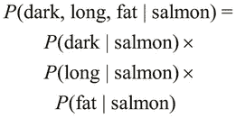

有趣的是，术语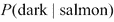、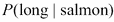和可以很容易地从训练数据和我们之前实现的`probability`函数中计算出来。同样，我们可以找到一条鱼是鲑鱼或的概率。因此，在的定义中唯一没有考虑到的术语是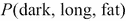。实际上，我们可以用一个简单的概率技巧来避免计算这一项。

鉴于一条鱼又黑又长又肥，它可能是鲑鱼，也可能是海鲈鱼。任何一类鱼出现的两个概率都是互补的，也就是说，它们都解释了在我们的模型中可能出现的所有可能情况。换句话说，这两个概率加起来都是一个概率 *1* 。因此，我们可以将术语正式表述如下:


前面等式右侧的两项都可以从训练数据中确定，这类似于项、、等等。因此，我们可以直接从我们的训练数据中计算出概率。我们通过以下等式来表达这种概率:


现在，让我们使用训练数据和我们之前定义的`probability`函数来实现前置等式。首先，一条鱼是鲑鱼的证据，考虑到它的外表又黑又长又肥，可以表述如下:

```clj
(defn evidence-of-salmon [& attrs]
  (let [attr-probs (map #(probability % :category :salmon) attrs)
        class-and-attr-prob (conj attr-probs
                                  (probability :salmon))]
    (float (apply * class-and-attr-prob))))
```

为了明确起见，我们实现了一个函数来根据给定的训练数据计算术语的概率。术语、、和的等同将被用作该实现的基础。

在前面的代码中，我们通过使用`probability`函数为 *i* 的所有属性或条件确定了术语和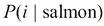。然后，我们用`apply`和`*`函数的组合将所有这些项相乘。因为所有计算的概率都是由`probability`函数返回的比率，所以我们使用`float`函数将最终比率转换为浮点值。我们可以在 REPL 中试用此功能，如下所示:

```clj
user> (evidence-of-salmon :dark)
0.4816
user> (evidence-of-salmon :dark :long)
0.2396884
user> (evidence-of-salmon)
0.6932
```

如 REPL 输出所示，训练数据中所有鱼的 48.16%是深色皮肤的鲑鱼。同样，23.96%的鱼是深色长鲑鱼，69.32%的鱼是鲑鱼。`(evidence-of-salmon :dark :long)`调用返回的值可以表示为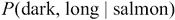，同理，`(evidence-of-salmon)`返回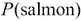。

类似地，我们可以定义`evidence-of-sea-bass`函数，该函数在给定鱼的一些观察到的特征的情况下，确定海鲈鱼出现的证据。由于我们只处理两个类别，，我们可以很容易地在 REPL 验证这种平等。有趣的是，观察到一个小误差，但是这个误差与训练数据无关。这个小误差实际上是浮点舍入误差，它是由于浮点数的限制而产生的。在实践中，我们可以使用 decimal 或`BigDecimal`(来自`java.lang`)数据类型来避免这种情况，而不是浮点数。我们可以使用 REPL 中的`evidence-of-sea-bass`和`evidence-of-salmon`函数进行验证，如下所示:

```clj
user> (+ (evidence-of-sea-bass) (evidence-of-salmon))
1.0000000298023224
```

我们可以扩展`evidence-of-salmon`和`evidence-of-sea-bass`函数，这样我们就能够确定具有某些观察特征的任何类别的概率；这显示在以下代码中:

```clj
(defn evidence-of-category-with-attrs
  [category & attrs]
  (let [attr-probs (map #(probability % :category category) attrs)
        class-and-attr-prob (conj attr-probs
                                  (probability category))]
    (float (apply * class-and-attr-prob))))
```

上述代码中定义的函数返回的值与以下`evidence-of-salmon`和`evidence-of-sea-bass`函数返回的值一致:

```clj
user> (evidence-of-salmon :dark :fat)
0.38502988
user> (evidence-of-category-with-attrs :salmon :dark :fat)
0.38502988
```

使用`evidence-of-salmon` 和`evidence-of-sea-bass`函数，我们可以根据`probability-dark-long-fat-is-salmon`计算概率如下:

```clj
(def probability-dark-long-fat-is-salmon
  (let [attrs [:dark :long :fat]
        sea-bass? (apply evidence-of-sea-bass attrs)
        salmon? (apply evidence-of-salmon attrs)]
    (/ salmon?
       (+ sea-bass? salmon?))))
```

我们可以如下检查 REPL 中的`probability-dark-long-fat-is-salmon`值:

```clj
user> probability-dark-long-fat-is-salmon
0.957091799207812
```

`probability-dark-long-fat-is-salmon`值表示黑色、长而肥的鱼有 95.7%的概率是鲑鱼。

使用前面对`probability-dark-long-fat-is-salmon`函数的定义作为模板，我们可以概括它所执行的计算。让我们先定义一个简单的数据结构可以传来传去。本着习惯性 Clojure 的精神，我们方便地使用地图来实现这个目的。使用地图，我们可以在模型中表示一个类别及其出现的证据和概率。此外，给定几个类别的证据，我们可以计算特定类别出现的总概率，如下面的代码所示:

```clj
(defn make-category-probability-pair
  [category attrs]
  (let [evidence-of-category (apply
  evidence-of-category-with-attrs
                              category attrs)]
    {:category category
     :evidence evidence-of-category}))

(defn calculate-probability-of-category
  [sum-of-evidences pair]
  (let [probability-of-category (/ (:evidence pair)
                                   sum-of-evidences)]
    (assoc pair :probability probability-of-category)))
```

`make-category-probability-pair`函数使用我们在前面的代码中定义的`evidence-category-with-attrs`函数来计算类别及其条件或属性的证据。然后，它返回这个值，作为一个映射，以及类别本身。此外，我们定义了`calculate-probability-of-category`函数，它使用`sum-of-evidences`参数和`make-category-probability-pair`函数返回的值来计算类别及其条件的总概率。

我们可以组合前面的两个函数来确定给定一些观察值的所有类别的总概率，然后选择概率最高的类别，如下所示:

```clj
(defn classify-by-attrs
  "Performs Bayesian classification of the attributes,
   given some categories.
   Returns a map containing the predicted category and
   the category's
   probability of occurrence."
  [categories & attrs]
  (let [pairs (map #(make-category-probability-pair % attrs)
                   categories)
        sum-of-evidences (reduce + (map :evidence pairs))
        probabilities (map #(calculate-probability-of-category
                              sum-of-evidences %)
                           pairs)
        sorted-probabilities (sort-by :probability probabilities)
        predicted-category (last sorted-probabilities)]
    predicted-category))
```

在给定模型特征的一些条件或观察值的情况下，前面代码中定义的`classify-by-attrs`函数将所有可能的类别映射到`make-category-probability-pair`函数上。由于我们正在处理由`make-category-probability-pair`返回的一系列对，我们可以使用`reduce`、`map`和`+`函数的简单组合来计算这个序列中所有证据的总和。然后，我们将`calculate-probability-of-category`函数映射到类别-证据对的序列上，并选择具有最高概率的类别-证据对。我们通过按概率升序对序列进行排序并选择排序后的序列中的最后一个元素来实现这一点。

现在，我们可以使用`classify-by-attrs`函数来确定观察到的又黑又长又肥的鱼是鲑鱼的概率。它也由我们之前定义的`probability-dark-long-fat-is-salmon`值表示。考虑到鱼的外表又黑又长又肥，这两种表达方式产生的可能性都是一样的，即 95.7%的鱼是鲑鱼。我们将实现`classify-by-attrs`函数，如下面的代码所示:

```clj
user> (classify-by-attrs [:salmon :sea-bass] :dark :long :fat)
{:probability 0.957091799207812, :category :salmon, :evidence 0.1949689}
user> probability-dark-long-fat-is-salmon
0.957091799207812
```

`classify-by-attrs`函数还返回给定观察条件`:dark`、:`long`和`:fat`的预测类别(即`:salmon`)。我们可以使用这个函数来告诉我们关于训练数据的更多信息，如下所示:

```clj
user> (classify-by-attrs [:salmon :sea-bass] :dark)
{:probability 0.8857825967670728, :category :salmon, :evidence 0.4816}
user> (classify-by-attrs [:salmon :sea-bass] :light)
{:probability 0.5362699908806723, :category :sea-bass, :evidence 0.2447}
user> (classify-by-attrs [:salmon :sea-bass] :thin)
{:probability 0.6369809383442954, :category :sea-bass, :evidence 0.2439}
```

如前面的代码所示，外观为深色的鱼多半是鲑鱼，外观为浅色的鱼多半是海鲈鱼。此外，一条瘦的鱼很可能是海鲈鱼。事实上，以下值与我们之前定义的训练数据一致:

```clj
user> (classify-by-attrs [:salmon] :dark)
{:probability 1.0, :category :salmon, :evidence 0.4816}
user> (classify-by-attrs [:salmon])
{:probability 1.0, :category :salmon, :evidence 0.6932}
```

请注意，仅使用`[:salmon]`作为参数调用`classify-by-attrs`函数会返回任何给定鱼是鲑鱼的概率。一个显而易见的推论是，给定一个单一的类别，`classify-by-attrs`函数总是完全确定地预测所提供的类别，即概率为 *1.0* 。但是，此函数返回的证据会根据传递给它的观察到的特征以及我们用来训练模型的样本数据而有所不同。

简而言之，前面的实现描述了一个可以使用一些样本数据来训练的贝叶斯分类器。它也为我们的模型的特征分类一些观察值。

我们可以通过构建上一个例子中的概率的定义来描述一个通用贝叶斯分类器。简单回顾一下，术语可以正式表述如下:


在前面的等式中，我们处理一个类，即鲑鱼，和三个相互独立的特征，即鱼的皮肤的长度、宽度和亮度。我们可以将 *N* 特征的等式归纳如下:


这里，术语 *Z* 是分类模型的证据，我们在前面的等式中描述了它。我们可以使用和与积符号来更简洁地描述前面的等式，如下所示:


前面的等式描述了单个类 *C* 出现的概率。如果给我们许多类来选择，我们必须选择出现概率最高的类。这就引出了贝叶斯分类器的基本定义，其形式表达如下:

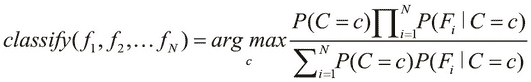

在前面的等式中，函数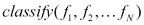描述了选择出现概率最高的类的贝叶斯分类器。注意，术语代表我们的分类模型的各种特征，而术语代表这些特征的一组观察值。此外，等式右侧的变量 *c* 可以具有来自分类模型中所有不同类的集合中的值。

我们可以通过**最大后验概率**(**MAP**)估计进一步简化贝叶斯分类器的前述方程，这可以被认为是贝叶斯统计中特征的正则化。简化的贝叶斯分类器可以正式表示如下:

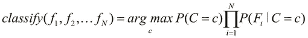

该定义实质上意味着*分类*功能确定给定特征出现概率最大的类别。因此，前面的等式描述了一个贝叶斯分类器，该分类器可以使用一些样本数据进行训练，然后用于预测一组给定观察值的类别。我们现在将集中于使用贝叶斯分类器的现有实现来对给定的分类问题建模。

`clj-ml`库([https://github.com/joshuaeckroth/clj-ml](https://github.com/joshuaeckroth/clj-ml))包含了几个实现的算法，我们可以从中选择来模拟一个给定的分类问题。这个库实际上只是流行的 **Weka** 库([http://www.cs.waikato.ac.nz/ml/weka/](http://www.cs.waikato.ac.nz/ml/weka/))的 Clojure 包装器，它是一个 Java 库，包含几个机器学习算法的实现。它还有几种方法来评估和验证生成的分类模型。然而，我们将在本章的上下文中集中讨论`clj-ml`库的分类器实现。

### 注意

通过向`project.clj`文件添加以下依赖关系，可以将`clj-ml`库添加到 Leiningen 项目中:

```clj
[cc.artifice/clj-ml "0.4.0"]
```

对于接下来的示例，命名空间声明应该类似于以下声明:

```clj
(ns my-namespace
  (:use [clj-ml classifiers data]))
```

我们现在将引入`clj-ml`库，使用一个贝叶斯分类器的实现来模拟我们之前涉及到鱼类包装工厂的问题。首先，让我们细化我们的训练数据，对于模型的各种特性，使用数值而不是我们前面描述的关键字。当然，我们仍然会在我们的训练数据中保持偏好，例如鲑鱼大多是肥胖和深色皮肤，而海鲈鱼大多是长而浅色皮肤。以下代码实现了这一点:

```clj
(defn rand-in-range
  "Generates a random integer within the given range"
  [min max]
  (let [len      (- max min)
        rand-len (rand-int len)]
    (+ min rand-len)))

;; sea bass are mostly long and light in color
(defn make-sea-bass []
  (vector :sea-bass
          (rand-in-range 6 10)          ; length
          (rand-in-range 0 5)           ; width
          (rand-in-range 4 10)))        ; lightness of skin

;; salmon are mostly fat and dark
(defn make-salmon []
  (vector :salmon
          (rand-in-range 0 7)           ; length
          (rand-in-range 4 10)          ; width
          (rand-in-range 0 6)))         ; lightness of skin
```

这里，我们定义了`rand-in-range`函数，它只是在给定的值范围内生成随机整数。然后，我们重新定义`make-sea-bass`和`make-salmon`函数，使用`rand-in-range`函数为鱼的三个特征生成`0`和`10`范围内的值，即鱼的长度、宽度和皮肤的暗度。此特征的值越高，表示鱼的肤色越浅。注意，我们重用了`make-sample-fish`函数和`fish-dataset`变量的定义来生成我们的训练数据。此外，一条鱼由一个向量而不是一个集合来表示，如前面的`make-sea-bass`和`make-salmon`函数定义中所述。

我们可以使用 `make-classifier`函数从`clj-ml`库中创建一个分类器，这个函数可以在`clj-ml.classifiers`名称空间中找到。我们可以通过将两个关键字作为参数传递给函数来指定要使用的分类器的类型。因为我们打算使用贝叶斯分类器，所以我们将关键字`:bayes`和`:naive`提供给`make-classifier`函数。简而言之，我们可以使用下面的声明来创建贝叶斯分类器。请注意，以下代码中使用的关键字`:naive`表示一个朴素贝叶斯分类器，该分类器假设我们的模型中的特征是独立的:

```clj
(def bayes-classifier (make-classifier :bayes :naive))
```

`clj-ml`库的分类器实现使用数据集，这些数据集是使用来自`clj-ml.data`名称空间的函数定义或生成的。我们可以使用`make-dataset`函数将作为向量序列的`fish-dataset`序列转换成这样一个数据集。此函数需要数据集的任意字符串名称、集合中每个项的模板以及要添加到数据集的项集合。提供给`make-dataset`函数的模板很容易用一张地图来表示，如下所示:

```clj
(def fish-template
  [{:category [:salmon :sea-bass]}
   :length :width :lightness])

(def fish-dataset
  (make-dataset "fish" fish-template fish-training-data))
```

在前面的代码中定义的`fish-template`映射简单地说，一条鱼，由一个向量表示，按照特定的顺序包括鱼的类别、长度、宽度和它皮肤的亮度。注意，鱼的种类是用`:salmon`或`:sea-bass`描述的。我们现在可以使用`fish-dataset`来训练由 `bayes-classifier`变量表示的分类器。

虽然`fish-template`地图定义了一条鱼的所有属性，但它仍然缺少一个重要的细节。它没有指定这些属性中的哪一个代表鱼的类或类别。为了在向量中指定一个特定的属性来表示整个观察值集合的类别，我们使用了`dataset-set-class`函数。此函数采用指定属性索引的单个参数，用于表示向量中一组观察值的类别。注意，这个函数实际上会改变或修改它所提供的数据集。然后，我们可以使用`classifier-train`函数训练我们的分类器，该函数将分类器和数据集作为参数；这显示在以下代码中:

```clj
(defn train-bayes-classifier []
  (dataset-set-class fish-dataset 0)
  (classifier-train bayes-classifier fish-dataset))
```

前面的`train-bayes-classifier`函数简单地调用`dataset-set-class`和`classifier-train`函数来训练我们的分类器。当我们调用`train-bayes-classifier`函数时，分类器使用以下提供的数据进行训练，然后打印到 REPL 输出:

```clj
user> (train-bayes-classifier)
#<NaiveBayes Naive Bayes Classifier

                     Class
Attribute        salmon  sea-bass
                  (0.7)    (0.3)
=================================
length
  mean            2.9791   7.5007
  std. dev.       1.9897   1.1264
  weight sum        7032     2968
  precision            1        1

width
  mean            6.4822   1.9747
  std. dev.        1.706    1.405
  weight sum        7032     2968
  precision            1        1

lightness
  mean            2.5146   6.4643
  std. dev.       1.7047   1.7204
  weight sum        7032     2968
  precision            1        1

>
```

此输出为我们提供了一些关于训练数据的基本信息，例如我们建模的各种特征的平均值和标准偏差。现在，我们可以使用这个经过训练的分类器来预测模型特征的一组观察值的类别。

让我们首先定义我们打算分类的观察值。为此，我们使用下面的`make-instance`函数，该函数需要一个数据集和一个与所提供数据集的数据模板一致的观察值向量:

```clj
(def sample-fish
  (make-instance fish-dataset [:salmon 5.0 6.0 3.0]))
```

这里，我们简单地使用`make-instance`函数定义了一个样本鱼。我们现在可以预测由`sample-fish`表示的鱼的类别如下:

```clj
user> (classifier-classify bayes-classifier sample-fish)
:salmon
```

如前面的代码所示，这条鱼被归类为`salmon`。注意，虽然我们在定义`sample-fish`时提供了鱼的类别为`:salmon`，但这只是为了符合`fish-dataset`定义的数据模板。事实上，我们可以将`sample-fish`的类指定为`:sea-bass`或第三个值，比如说`:unknown`，来表示一个未定义的值，分类器仍然会将`sample-fish`分类为`salmon`。

当处理给定分类模型的各种特征的连续值时，我们可以指定贝叶斯分类器来使用连续特征的离散化。这样，我们的意思是模型的各种特征的所有值将通过概率密度估计转换成离散值。我们可以通过简单地传递一个额外的参数`{:supervised-discretization true}`给函数`make-classifier`来指定这个选项。这个映射实际上描述了可以提供给指定分类器的所有可能的选项。

总之，`clj-ml`库为提供了一个完全可操作的贝叶斯分类器，我们可以用它来分类任意数据。虽然在前面的示例中我们自己生成了训练数据，但是也可以从 Web 或数据库中获取这些数据。


# 使用 k-最近邻算法

可用于对一组观察值进行分类的简单技术是**k-最近邻**(缩写为 **k-NN** )算法。这种算法是一种懒惰学习的形式，所有的计算都被推迟到分类之后。此外，在分类阶段，k-NN 算法仅使用来自训练数据的几个值来近似观察值的类别，并且其他值的读取被推迟，直到它们被实际需要时。

虽然我们现在在分类的背景下探索 k-NN 算法，但是它也可以应用于回归，只需选择预测值作为一组观察特征值的因变量的最近值的平均值。有趣的是，这种建模回归的技术实际上是**线性插值** 的扩展(更多信息，请参考*内核和最近邻非参数回归简介*)。

k-NN 算法读取一些训练数据，并懒洋洋地分析这些数据，也就是只在需要的时候。除了训练数据之外，该算法还需要一组观测值和一个常数 *k* 作为参数来对这组观测值进行分类。为了对这些观察值进行分类，该算法预测最接近观察值集合的 *k* 个训练样本中最频繁的类别。所谓最近的，我们是指与训练数据的欧几里德空间中的一组观察值所表示的点具有最小欧几里德距离的点。

一个显而易见的推论是，当时，预测类是最接近观察值集合的单个邻居的类。k-NN 算法的这个特例被称为 **最近邻**算法。

我们可以使用`clj-ml`库的`make-classifier`函数创建一个使用 k-NN 算法的分类器。使用关键字`:lazy`和`:ibk`作为`make-classifier`函数的参数来指定这样的分类器。我们现在将使用这样一个分类器来模拟我们之前的鱼包装厂示例，如下所示:

```clj
(def K1-classifier (make-classifier :lazy :ibk))

(defn train-K1-classifier []
  (dataset-set-class fish-dataset 0)
  (classifier-train K1-classifier fish-dataset))
```

前面的代码定义了一个 k-NN 分类器为`K1-classifier`和一个`train-K1-classifier`函数，使用我们在前面的代码中定义的`fish-dataset`用训练数据训练分类器。

请注意，`make-classifier`函数默认常量 *k* 或者更确切地说是 *1* 的邻居数量，这意味着只有一个最近的邻居。我们可以选择将常量 *k* 指定为一个键-值对，带有`:num-neighbors`键到`make-classifier`函数，如下面的代码所示:

```clj
(def K10-classifier (make-classifier
                     :lazy :ibk {:num-neighbors 10}))
```

我们现在可以调用`train-K1-classifier`函数来训练分类器，如下所示:

```clj
user> (train-K1-classifier)
#<IBk IB1 instance-based classifier
using 1 nearest neighbour(s) for classification
>
```

我们现在可以使用`classifier-classify`函数对`sample-fish`表示的鱼进行分类，这是我们之前定义的，使用由`K1-classifier`变量表示的分类器:

```clj
user> (classifier-classify K1-classifier sample-fish)
:salmon
```

如前面的代码所示，k-NN 分类器预测鱼的类别为 salmon，因此与我们之前使用 Bayes 分类器的预测一致。总之，`clj-ml`库提供了一个分类器的简洁实现，它使用 k-NN 算法来预测一组观察值的类别。

由`clj-ml`库提供的 k-NN 分类器默认使用这些特征值的平均值和标准偏差对分类模型的特征进行标准化。我们可以为`make-classifier`函数指定一个选项，通过将选项映射中的`:no-normalization`键传递给`make-classifier`函数来跳过这个标准化阶段。


# 使用决策树

我们也可以使用决策树来建模一个给定的分类问题。事实上，决策树是根据给定的训练数据构建的，我们可以使用该决策树来预测给定的一组观察值的类别。构建决策树的过程大致基于信息论中的信息熵和信息增益的概念(更多信息请参考*决策树归纳*)。它也经常被称为**决策树学习** 。不幸的是，信息论的详细研究超出了本书的范围。然而，在本节中，我们将探索信息论中的一些概念，这些概念将在机器学习的上下文中使用。

决策树是描述决策模型及其可能结果的树或图。决策树中的内部节点代表一个决策，或者更确切地说，代表分类上下文中特定特征的条件。它有两种可能的结果，由节点的左右子树表示。当然，决策树中的一个节点也可以有两个以上的子树。在我们的分类模型中，决策树中的每个叶节点代表一个特定的类或结果。

例如，我们之前涉及鱼类包装厂的分类问题可能有以下决策树:


前面说明的决策树使用两个条件将鱼分类为鲑鱼或海鲈鱼。内部节点代表基于我们的分类模型的特征的两个条件。请注意，决策树只使用了我们的分类模型的三个特征中的两个。因此我们可以说这棵树被修剪了。在这一节中，我们也将简要探讨这种技术。

为了使用决策树对一组观察到的值进行分类，我们从根节点开始遍历该树，直到到达代表该组观察值的预测类别的叶节点。这种从决策树中预测一组观察值的类别的技术总是相同的，不管决策树是如何构造的。对于前面描述的决策树，我们可以通过首先比较鱼的长度，然后比较其皮肤的亮度来对鱼进行分类。只有当鱼的长度大于由决策树中带有表达式**长度< 6** 的内部节点指定的 **6** 时，才需要第二次比较。如果鱼的长度确实大于 **6** ，我们用鱼皮的亮度来判断它是鲑鱼还是海鲈鱼。

实际上有几种算法用于从一些训练数据中构造决策树。通常，通过基于属性值测试将训练数据中的样本值集合分割成更小的子集来构建树。对每个子集重复该过程，直到拆分样本值的给定子集不再向决策树添加内部节点。正如我们前面提到的，决策树中的一个内部节点可能有两个以上的子树。

我们现在将探索 **C4.5** 算法来构建决策树(更多信息，请参考 *C4.5:机器学习的程序*)。该算法使用信息熵的概念来决定样本值集合必须被划分的特征和对应的值。**信息熵**

对于给定的特征或属性 *f* ，其值在 *1* 到 *m* 范围内，我们可以将特征的信息熵定义如下:

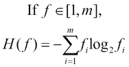

在上式中，项代表特征 *f* 相对于值 *i* 的出现次数。基于这个特征信息熵的定义，我们定义了归一化信息增益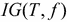。在下面的等式中，术语 *T* 指的是提供给算法的一组样本值或训练数据:


就信息熵而言，给定属性的信息增益的前述定义是当属性 *f* 从模型中的给定特征集中移除时，总的值集的信息熵的变化。

该算法从训练数据中的给定特征集中选择特征 *A* ，使得特征 *A* 在特征集中具有最大可能的信息增益。我们可以借助以下等式来表示这一点:


在前面的等式中，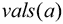代表特征 *a* 已知具有的所有可能值的集合。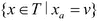集合表示观察值，其中特征 *a* 具有值 *v* ，项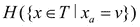表示这组值的信息熵。

使用前面的等式从训练数据中选择具有最大信息增益的特征，我们可以通过以下步骤描述 C4.5 算法:

1.  对于每个特征 *a* ，通过在特征 *a* 上划分样本数据，找到归一化的信息增益。
2.  选择具有最大归一化信息增益的特征 *A* 。
3.  基于所选特征*和*创建一个内部决策节点。从这一步创建的两个子树要么是叶节点，要么是要进一步划分的一组新的样本值。
4.  对上一步中产生的每个样本值分区集重复此过程。我们重复前面的步骤，直到样本值子集中的所有特征都具有相同的信息熵。

一旦创建了决策树，我们可以选择对树执行**修剪**。修剪就是从树中删除任何无关的决策节点的过程。这可以被认为是决策树正则化的一种形式，通过它我们可以防止估计的决策树模型的欠拟合或过拟合。

**J48** 是 C4.5 算法在 Java 中的开源实现，`clj-ml`库包含一个工作的 J48 决策树分类器。我们可以使用`make-classifier`函数创建一个决策树分类器，我们提供关键字`:decision-tree`和`:c45`作为这个函数的参数来创建一个 J48 分类器，如下面的代码所示:

```clj
(def DT-classifier (make-classifier :decision-tree :c45))

(defn train-DT-classifier []
  (dataset-set-class fish-dataset 0)
  (classifier-train DT-classifier fish-dataset))
```

在前面的代码中定义的`train-DT-classifier`函数简单地使用来自我们之前的鱼包装厂示例的训练数据来训练由`DT-classifier`表示的分类器。`classifier-train`功能还打印以下经过训练的分类器:

```clj
user> (train-DT-classifier)
#<J48 J48 pruned tree
------------------
width <= 3: sea-bass (2320.0)
width > 3
|   length <= 6
|   |   lightness <= 5: salmon (7147.0/51.0)
|   |   lightness > 5: sea-bass (95.0)
|   length > 6: sea-bass (438.0)

Number of Leaves  : 4

Size of the tree : 7
>
```

前面的输出很好地说明了经过训练的分类器的决策树是什么样子，以及决策树中叶节点的大小和数量。显然，决策树有三个不同的内部节点。树的根节点基于一条鱼的宽度，后续节点基于一条鱼的长度，最后的决策节点基于一条鱼的皮肤的亮度。

我们现在可以使用决策树分类器来预测鱼的类别，我们使用下面的`classifier-classify`函数来执行这个分类:

```clj
user> (classifier-classify DT-classifier sample-fish)
:salmon
```

如前面的代码所示，该分类器将由`sample-fish`表示的鱼的类别预测为一个`:salmon`关键字，就像前面示例中使用的其他分类器一样。

由`clj-ml`库提供的 J48 决策树分类器实现在训练分类器时执行修剪作为最后一步。我们可以通过在传递给`make-classifier`函数的选项映射中指定`:unpruned`键来生成一个未修剪的树，如以下代码所示:

```clj
(def UDT-classifier (make-classifier
                     :decision-tree :c45 {:unpruned true}))
```

先前定义的分类器将不会对通过用给定的训练数据训练分类器而生成的决策树执行修剪。我们可以通过定义和调用`train-UDT-classifier`函数来检查一棵未修剪的树是什么样子，该函数使用`classifier-train`函数和`fish-dataset`训练数据来训练分类器。该函数可定义为类似于`train-UDT-classifier`函数，并在调用时产生以下输出:

```clj
user> (train-UDT-classifier)
#<J48 J48 unpruned tree
------------------
width <= 3: sea-bass (2320.0)
width > 3
|   length <= 6
|   |   lightness <= 5
|   |   |   length <= 5: salmon (6073.0)
|   |   |   length > 5
|   |   |   |   width <= 4
|   |   |   |   |   lightness <= 3: salmon (121.0)
|   |   |   |   |   lightness > 3
|   |   |   |   |   |   lightness <= 4: salmon (52.0/25.0)
|   |   |   |   |   |   lightness > 4: sea-bass (50.0/24.0)
|   |   |   |   width > 4: salmon (851.0)
|   |   lightness > 5: sea-bass (95.0)
|   length > 6: sea-bass (438.0)

Number of Leaves  : 8

Size of the tree : 15
```

如前面的代码所示，与修剪后生成的决策树相比，未修剪的决策树有更多的内部决策节点。我们现在可以使用下面的`classifier-classify`函数来使用训练好的分类器预测鱼的类别:

```clj
user> (classifier-classify UDT-classifier sample-fish)
:salmon
```

有趣的是，未修剪的树也预测了由`sample-fish`代表的鱼的类别为`:salmon`，因此与我们之前描述的修剪决策树预测的类别一致。总之，`clj-ml`库为我们提供了一个基于 C4.5 算法的决策树分类器的工作实现。

`make-classifier`函数支持 J48 决策树分类器的几个有趣的选项。我们已经研究了`:unpruned`选项，它表示决策树没有被修剪。我们可以给`make-classifier`函数指定`:reduced-error-pruning`选项，强制使用减少误差修剪(更多信息请参考“基于树大小的悲观决策树修剪”)，这是一种基于减少模型整体误差的修剪形式。我们可以为`make-classifier`函数指定的另一个有趣的选项是通过修剪决策树可以删除的内部节点或折叠的最大数量。我们可以使用`:pruning-number-of-folds`选项指定这个选项，默认情况下，`make-classifier`函数在修剪决策树时没有这样的限制。同样，我们可以通过为`make-classifier`函数指定`:only-binary-splits`选项来指定决策树中的每个内部决策节点只有两个子树。


# 总结

在这一章中，我们探讨了分类和各种可用于给定分类问题建模的算法。尽管分类技术非常有用，但当样本数据具有大量维度时，它们的表现并不太好。此外，这些特征可能以非线性方式变化，正如我们将在[第 4 章](ch04.html "Chapter 4. Building Neural Networks")、*构建神经网络*中描述的那样。我们也将在接下来的章节中探索更多关于这些方面和监督学习的替代方法。以下是我们在本章中探讨的几个要点:

*   我们描述了两大类分类，即二分类和多分类。我们还简要研究了逻辑函数以及如何通过逻辑回归使用它来模拟分类问题。
*   我们研究并实现了一个贝叶斯分类器，它使用一个概率模型来建模分类。我们还描述了如何使用`clj-ml`库的贝叶斯分类器实现来建模给定的分类问题。
*   我们还探索了简单的 k-最近邻算法，以及如何使用`clj-ml`库来利用它。
*   我们学习了决策树和 C4.5 算法。`clj-ml`库为我们提供了一个基于 C4.5 算法的分类器的可配置实现，我们也描述了如何使用这个实现。

我们将在下一章探讨人工神经网络。有趣的是，我们可以使用人工神经网络来建模回归和分类问题，我们也将研究神经网络的这些方面。