# 九、网络攻击检测

到目前为止，我们主要开发了具有良好平衡的样本集的**机器学习** ( **ML** )模型，其中目标类平均或几乎平均地分布在数据集中的样本记录上。但是，在某些情况下，数据集具有不平衡的类分布。类别不平衡在异常和欺诈检测中尤其常见。当训练 ML 模型时，这些种类的类不平衡问题导致问题，因为当目标类大致平均分布时，大多数 ML 算法工作得最好。为了解决这种不平衡的分类问题，我们不能用我们为各种分类和回归问题开发模型的同样方式来处理它。我们将需要以不同的方式处理它。

在本章中，我们将讨论如何建立一个异常检测模型。我们将使用一个网络入侵数据集， **KDD 杯 1999 年数据**，它有大量的网络连接数据，其中一些连接是正常的网络连接，而另一些是网络攻击。我们将首先查看数据的结构、数据集中出现的网络攻击类型以及各种网络特征的分布。然后，我们将应用一些我们在前几章讨论过的特征工程技术，因为特征集包含分类变量和连续变量。我们还将应用降维技术，**主成分分析** ( **PCA** )，我们在前一章中讨论过。除了我们在前一章介绍的 PCA，我们将使用 PCA 建立异常检测模型。通过使用 PCA 构建的模型，我们将进一步讨论评估异常检测模型的一些方法，以及最适合网络攻击检测项目的方法。

在本章中，我们将讨论以下主题:

*   网络攻击检测项目的问题定义
*   互联网流量数据集的数据分析
*   特征工程和 PCA
*   用于异常检测的主成分分类器
*   评估异常检测模型


# 问题定义

具有不平衡类分布的数据集给大多数 ML 算法带来了问题，因为它们通常对平衡良好的数据集表现良好。在 ML 中有各种方法来处理类不平衡问题。对数据集进行重采样以平衡目标类是一种方法。您可以对积极的训练样本进行上采样，随机选择并复制积极的训练样本，以便大约 50%的数据集属于积极的类。您还可以对负定型样本进行缩减采样，以便负定型样本的数量与正定型样本的数量相匹配。在极端类别不平衡的情况下，您可以将其视为异常检测问题，其中积极事件被视为异常或异常值。异常检测技术在现实问题中有许多应用。它们通常用于网络入侵检测、信用卡欺诈检测，甚至医疗诊断。

在这一章中，我们将致力于为网络攻击建立一个异常检测模型。为了建立一个网络攻击检测模型，我们将使用 **KDD 杯 1999 年数据**，其中有大量人工和手工注入的网络攻击数据，以及正常的网络连接数据。这个数据可以在以下链接找到:【http://kdd.ics.uci.edu/databases/kddcup99/kddcup99.html[。有了这些数据，我们将首先查看网络攻击类型的分布，然后查看网络特征的分布。由于这是一个模拟和人工数据集，这个数据集的大部分是由网络攻击组成的，这在现实世界中是不正常和不现实的。为了模拟真实世界的网络攻击示例，我们将从样本集中随机选择网络攻击事件，并构建一个新的训练集，其中包含的正常网络连接比恶意连接多。有了这个子采样数据集，我们将使用 PCA 建立一个异常检测模型。然后，我们将通过查看各种目标虚警率下的网络攻击检测率来评估该模型。](http://kdd.ics.uci.edu/databases/kddcup99/kddcup99.html)

总结一下我们对网络攻击检测项目的问题定义:

*   有什么问题？我们需要一个网络攻击检测模型，它可以从大量的网络连接中识别潜在的恶意连接，以便我们可以避免网络攻击。
*   为什么会有问题？网络攻击的数量每年都在增加，如果没有为这种攻击做好适当的准备，我们的系统将变得更容易受到各种网络攻击。有了网络攻击检测模型，我们可以避免成为网络攻击的受害者。
*   解决这个问题的方法有哪些？我们将使用拥有大量人工和模拟网络攻击数据的公开数据。我们将对此数据进行二次抽样，以复制真实情况，即正常网络连接多于异常和恶意连接。然后，我们将使用主成分分析及其主成分来检测异常。
*   成功的标准是什么？我们想要高的网络攻击检测率，即使我们需要牺牲它来获得更高的误报率。这是因为我们更关心允许网络攻击，而不是误报警报。


# 互联网流量数据的数据分析

让我们先来看看互联网流量数据。如前所述，我们将使用 1999 年 KDD 杯的数据，你可以从以下链接下载:[http://kdd.ics.uci.edu/databases/kddcup99/kddcup99.html](http://kdd.ics.uci.edu/databases/kddcup99/kddcup99.html)。我们将在这个网络攻击检测项目中使用`kddcup.data_10_percent.gz`数据。


# 数据清理

我们需要做的第一件事是为将来的步骤清理数据。如果您打开刚刚下载的数据，您会注意到数据集中没有标题。然而，对于未来的数据分析和模型构建，让标题与每一列相关联总是有益的。根据可以在[http://kdd.ics.uci.edu/databases/kddcup99/kddcup.names](http://kdd.ics.uci.edu/databases/kddcup99/kddcup.names)找到的列描述，我们将为原始数据集附加标题。将列名附加到数据框的代码如下所示:

```cs
// Read in the Cyber Attack dataset
// TODO: change the path to point to your data directory
string dataDirPath = @"<path-to-data-dir>";

// Load the data into a data frame
string dataPath = Path.Combine(dataDirPath, "kddcup.data_10_percent");
Console.WriteLine("Loading {0}\n\n", dataPath);
var featuresDF = Frame.ReadCsv(
    dataPath,
    hasHeaders: false,
    inferTypes: true
);

string[] colnames =
{
    "duration", "protocol_type", "service", "flag", "src_bytes",
    "dst_bytes", "land", "wrong_fragment", "urgent", "hot",
    "num_failed_logins", "logged_in", "num_compromised", "root_shell",
    "su_attempted", "num_root", "num_file_creations", "num_shells",
    "num_access_files", "num_outbound_cmds", "is_host_login", "is_guest_login",
    "count", "srv_count", "serror_rate", "srv_serror_rate", "rerror_rate",
    "srv_rerror_rate", "same_srv_rate", "diff_srv_rate", "srv_diff_host_rate",
    "dst_host_count", "dst_host_srv_count", "dst_host_same_srv_rate",
    "dst_host_diff_srv_rate", "dst_host_same_src_port_rate",
    "dst_host_srv_diff_host_rate", "dst_host_serror_rate",
    "dst_host_srv_serror_rate", "dst_host_rerror_rate", "dst_host_srv_rerror_rate",
    "attack_type"
};
featuresDF.RenameColumns(colnames);
```

正如您从这段代码中看到的，我们通过向 Deedle 的数据帧的`ReadCsv`方法提供`hasHeaders: false`标志来加载这个没有标题的原始数据集。通过提供这个标志，我们告诉 Deedle 不要将数据集的第一行作为标题。一旦这些数据被加载到数据框中，我们就使用`RenameColumns`方法将列名附加到数据框中。

我们接下来要做的清理工作是将网络攻击类型按照相应的类别进行分组。可以在以下链接找到攻击类型和类别的映射:[http://KDD . ics . UCI . edu/databases/KDD cup 99/training _ attack _ types](http://kdd.ics.uci.edu/databases/kddcup99/training_attack_types)。使用此映射，我们将在数据框中创建一个新列，其中包含有关攻击类别的信息。让我们先看看代码:

```cs
// keeping "normal" for now for plotting purposes
IDictionary<string, string> attackCategories = new Dictionary<string, string>
{
    {"back", "dos"},
    {"land", "dos"},
    {"neptune", "dos"},
    {"pod", "dos"},
    {"smurf", "dos"},
    {"teardrop", "dos"},
    {"ipsweep", "probe"},
    {"nmap", "probe"},
    {"portsweep", "probe"},
    {"satan", "probe"},
    {"ftp_write", "r2l"},
    {"guess_passwd", "r2l"},
    {"imap", "r2l"},
    {"multihop", "r2l"},
    {"phf", "r2l"},
    {"spy", "r2l"},
    {"warezclient", "r2l"},
    {"warezmaster", "r2l"},
    {"buffer_overflow", "u2r"},
    {"loadmodule", "u2r"},
    {"perl", "u2r"},
    {"rootkit", "u2r"},
    {"normal", "normal"}
};

featuresDF.AddColumn(
    "attack_category",
    featuresDF.GetColumn<string>("attack_type")
        .Select(x => attackCategories[x.Value.Replace(".", "")])
);
```

如果您仔细观察这段代码，您会发现我们创建了一个`Dictionary`对象，它在攻击类型及其类别之间建立了映射。例如，`"back"`攻击类型是**拒绝服务** ( **DOS** )攻击之一，`"rootkit"`攻击类型是**用户到根** ( **U2R** )攻击之一。使用这个映射，我们创建了一个新列`"attack_category"`，并将其添加到`featuresDF`。现在我们已经清理了包含列名和攻击类别的原始数据集，我们需要将其导出并存储到本地驱动器中以备将来使用。您可以使用以下代码导出此数据:

```cs
featuresDF.SaveCsv(Path.Combine(dataDirPath, "data.csv"));
```


# 目标变量分布

现在我们有了干净的数据，我们将开始挖掘数据。我们先来看看网络攻击类别的分布。获取目标变量分布的代码如下所示:

```cs
// 1\. Target Variable Distribution
Console.WriteLine("\n\n-- Counts by Attack Category --\n");
var attackCount = featuresDF.AggregateRowsBy<string, int>(
    new string[] { "attack_category" },
    new string[] { "duration" },
    x => x.ValueCount
).SortRows("duration");
attackCount.RenameColumns(new string[] { "attack_category", "count" });

attackCount.Print();

DataBarBox.Show(
    attackCount.GetColumn<string>("attack_category").Values.ToArray(),
    attackCount["count"].Values.ToArray()
).SetTitle(
    "Counts by Attack Category"
);
```

与前几章类似，我们在 Deedle 的数据框中使用`AggregateRowsBy`方法，根据目标变量`attack_category`进行分组，并计算数据集中每个类别出现的次数。然后，我们使用`DataBarBox`类来显示这个分布的条形图。运行此代码后，将显示以下条形图:


显示每个网络攻击类别出现次数的输出如下所示:


这里有一点值得注意。数据集中的 DOS 攻击样本比正常样本多。如前所述，我们在本项目中使用的 KDD 杯 1999 数据集是人工和模拟的数据，因此，它不能反映现实生活中的情况，在现实生活中，正常互联网连接的数量将超过所有其他网络攻击的总和。在接下来的部分中构建模型时，我们必须记住这一点。


# 分类变量分布

该数据集中的特征是分类变量和连续变量的混合。例如，名为`duration`的特征表示连接的长度，它是一个连续变量。然而，名为`protocol_type`的特性代表协议的类型，如`tcp`、`udp`等等，它是一个分类变量。完整的功能描述，你可以点击这个链接:【http://kdd.ics.uci.edu/databases/kddcup99/task.html】T4。

在本节中，我们将了解正常连接和恶意连接之间分类变量的分布差异。以下代码显示了我们如何将样本集分成两个子组，一个用于正常连接，另一个用于异常连接:

```cs
var attackSubset = featuresDF.Rows[
    featuresDF.GetColumn<string>("attack_category").Where(
        x => !x.Value.Equals("normal")
    ).Keys
];
var normalSubset = featuresDF.Rows[
    featuresDF.GetColumn<string>("attack_category").Where(
        x => x.Value.Equals("normal")
    ).Keys
];
```

现在我们有了这两个子集，让我们开始比较正常和恶意连接之间的分类变量的分布。让我们先来看看代码:

```cs
// 2\. Categorical Variable Distribution
string[] categoricalVars =
{
    "protocol_type", "service", "flag", "land"
};
foreach (string variable in categoricalVars)
{
    Console.WriteLine("\n\n-- Counts by {0} --\n", variable);
    Console.WriteLine("* Attack:");
    var attackCountDF = attackSubset.AggregateRowsBy<string, int>(
        new string[] { variable },
        new string[] { "duration" },
        x => x.ValueCount
    );
    attackCountDF.RenameColumns(new string[] { variable, "count" });

    attackCountDF.SortRows("count").Print();

    Console.WriteLine("* Normal:");
    var countDF = normalSubset.AggregateRowsBy<string, int>(
        new string[] { variable },
        new string[] { "duration" },
        x => x.ValueCount
    );
    countDF.RenameColumns(new string[] { variable, "count" });

    countDF.SortRows("count").Print();

    DataBarBox.Show(
        countDF.GetColumn<string>(variable).Values.ToArray(),
        new double[][] 
        {
            attackCountDF["count"].Values.ToArray(),
            countDF["count"].Values.ToArray()
        }
    ).SetTitle(
        String.Format("Counts by {0} (0 - Attack, 1 - Normal)", variable)
    );
}
```

在这段代码中，我们遍历了一组分类变量:`protocol_type`、`service`、`flag`和`land`。我们将把功能描述推迟到可以在以下链接找到的描述页面:[http://kdd.ics.uci.edu/databases/kddcup99/task.html](http://kdd.ics.uci.edu/databases/kddcup99/task.html)。对于每个分类变量，我们使用`AggregateRowsBy`方法根据变量的每种类型进行分组，并计算每种类型出现的次数。我们对正常组进行一次聚合，然后对攻击组再进行一次聚合。然后，我们使用`DataBarBox`类来显示条形图，直观地显示分布中的差异。我们来看几个剧情和输出。

以下条形图是针对`protocol_type`功能的:


两组之间每种类型的实际计数如下:

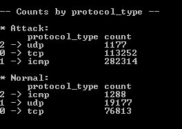

从这些输出中可以看出，正常攻击组和网络攻击组的分布有一些明显的区别。例如，大多数攻击发生在`icmp`和`tcp`协议上，而大多数正常连接发生在`tcp`和`udp`上。

以下条形图是针对`land`功能的:


此功能中每种类型的实际计数如下:


很难说我们是否能从这些输出中推断出任何有意义的见解。对于攻击组和正常组，数据集中几乎所有的样本都具有值`0`。让我们再来看一个特性。

下面的条形图显示了特征`flag`在攻击组和正常组中的分布:

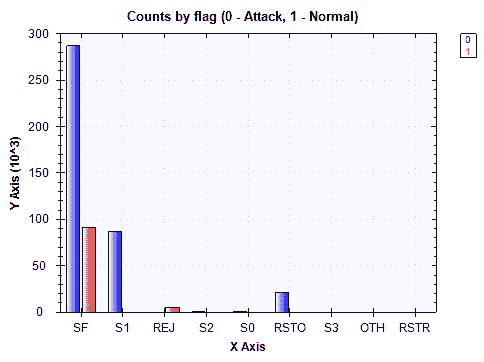

实际计数如下所示:

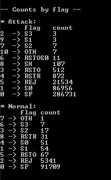

尽管攻击组和普通组最常出现的标志类型都是`SF`，但这个特性还是有一些明显的区别。看起来旗号`SF`和`REJ`占据了普通群体的大多数。另一方面，`SF`、`S0`、`REJ`三种旗型占据了攻击群的大部分。


# 连续变量分布

到目前为止，我们已经看了分类变量的分布。现在让我们看看连续变量在我们的特征集中的分布。与前几章相似，我们将看看每个连续变量的四分位数。计算每个连续要素的四分位数的代码如下所示:

```cs
foreach (string variable in continuousVars)
{
    Console.WriteLine(String.Format("\n\n-- {0} Distribution (Attack) -- ", variable));
    double[] attachQuartiles = Accord.Statistics.Measures.Quantiles(
        attackSubset[variable].DropMissing().ValuesAll.ToArray(),
        new double[] { 0, 0.25, 0.5, 0.75, 1.0 }
    );
    Console.WriteLine(
        "Min: \t\t\t{0:0.00}\nQ1 (25% Percentile): \t{1:0.00}\nQ2 (Median): \t\t{2:0.00}\nQ3 (75% Percentile): \t{3:0.00}\nMax: \t\t\t{4:0.00}",
        attachQuartiles[0], attachQuartiles[1], attachQuartiles[2], attachQuartiles[3], attachQuartiles[4]
    );

    Console.WriteLine(String.Format("\n\n-- {0} Distribution (Normal) -- ", variable));
    double[] normalQuantiles = Accord.Statistics.Measures.Quantiles(
        normalSubset[variable].DropMissing().ValuesAll.ToArray(),
        new double[] { 0, 0.25, 0.5, 0.75, 1.0 }
    );
    Console.WriteLine(
        "Min: \t\t\t{0:0.00}\nQ1 (25% Percentile): \t{1:0.00}\nQ2 (Median): \t\t{2:0.00}\nQ3 (75% Percentile): \t{3:0.00}\nMax: \t\t\t{4:0.00}",
        normalQuantiles[0], normalQuantiles[1], normalQuantiles[2], normalQuantiles[3], normalQuantiles[4]
    );
}
```

变量`continuousVars`被定义为以下字符串数组:

```cs
// 3\. Continuous Variable Distribution
string[] continuousVars =
{
    "duration", "src_bytes", "dst_bytes", "wrong_fragment", "urgent", "hot",
    "num_failed_logins", "num_compromised", "root_shell", "su_attempted",
    "num_root", "num_file_creations", "num_shells", "num_access_files",
    "num_outbound_cmds", "count", "srv_count", "serror_rate", "srv_serror_rate",
    "rerror_rate", "srv_rerror_rate", "same_srv_rate", "diff_srv_rate",
    "srv_diff_host_rate", "dst_host_count", "dst_host_srv_count",
    "dst_host_same_srv_rate", "dst_host_diff_srv_rate", "dst_host_same_src_port_rate",
    "dst_host_srv_diff_host_rate", "dst_host_serror_rate", "dst_host_srv_serror_rate",
    "dst_host_rerror_rate", "dst_host_srv_rerror_rate"
};
```

与分类变量分析类似，我们开始迭代前面代码中的连续变量。字符串数组`continuousVars`包含我们数据集中所有连续特征的列表，我们遍历这个数组开始计算每个分布的四分位数。如前几章所述，我们使用`Accord.Statistics.Measures.Quantiles`方法计算四分位数，即最小值、25%百分位、中值、75%百分位和最大值。我们这样做两次，一次是对攻击组，另一次是对正常组，这样我们就可以看到分布中是否有任何明显的差异。让我们来看看几个特性及其分布。

首先，下面的输出是一个名为`duration`的特性的分布:


从这个输出中，我们可以看到，对于攻击组和正常组，这个特性的大多数值都是`0`。由于这个变量没有太多的变化，我们的模型可能无法从这个特征中获得太多的信息。让我们来看看另一个特性。

以下输出是一个名为`dst_bytes`的特性的分布，它表示从目的地到源的数据字节数:


在这里，我们看到攻击组和正常组之间的分布有一些明显的区别。几乎所有的网络攻击的值都是 0，而对于正常的网络连接，这些值分布在很大的范围内。

最后，以下输出是一个名为`wrong_fragment`的特性:

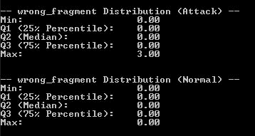

与`duration`特征的情况类似，攻击组和正常组的大多数值都是`0`，这表明我们的模型可能无法从该特征中获得很多洞察力。您可以运行前面的代码来查看所有其他特性在两组之间的分布差异。

运行这个数据分析步骤的完整代码可以在这个链接找到:[https://github . com/Yoon hwang/c-sharp-machine-learning/blob/master/ch . 9/data analyzer . cs](https://github.com/yoonhwang/c-sharp-machine-learning/blob/master/ch.9/DataAnalyzer.cs)。


# 特征工程和 PCA

到目前为止，我们已经分析了目标变量`attack_category`的分布，以及网络攻击数据集中的分类变量和连续变量。在本节中，我们将重点关注对目标变量和分类特征进行编码，并为我们未来的模型构建步骤创建 PCA 特征。


# 目标和分类变量编码

首先，我们必须在目标变量`attack_category`中对不同的类进行编码。如果您回忆一下前面的数据分析步骤，有五个不同的类别:正常、`dos`、`probe`、`r2l`和`u2r`。我们将用相应的整数表示对这些字符串值进行编码。然后，我们将使用一键编码对每个分类变量进行编码，如果给定的值出现在示例中，我们用 1 进行编码，如果没有出现，用 0 进行编码。让我们首先使用以下代码加载我们在前面的数据分析步骤中创建的清理数据:

```cs
// Read in the Cyber Attack dataset
// TODO: change the path to point to your data directory
string dataDirPath = @"<path-to-data-dir>";

// Load the data into a data frame
string dataPath = Path.Combine(dataDirPath, "data.csv");
Console.WriteLine("Loading {0}\n\n", dataPath);
var rawDF = Frame.ReadCsv(
    dataPath,
    hasHeaders: true,
    inferTypes: true
);
```

从这段代码中可以看出，我们设置了`hasHeaders: true`，因为清理后的数据现在有了与每一列相关联的正确标题。以下代码显示了我们是如何对目标变量和分类变量进行编码的:

```cs
// Encode Categorical Variables
string[] categoricalVars =
{
    "protocol_type", "service", "flag", "land"
};
// Encode Target Variables
IDictionary<string, int> targetVarEncoding = new Dictionary<string, int>
{
    {"normal", 0},
    {"dos", 1},
    {"probe", 2},
    {"r2l", 3},
    {"u2r", 4}
};

var featuresDF = Frame.CreateEmpty<int, string>();

foreach (string col in rawDF.ColumnKeys)
{
    if(col.Equals("attack_type"))
    {
        continue;
    }
    else if (col.Equals("attack_category"))
    {
        featuresDF.AddColumn(
            col, 
            rawDF.GetColumn<string>(col).Select(x => targetVarEncoding[x.Value])
        );
    }
    else if (categoricalVars.Contains(col))
    {
        var categoryDF = EncodeOneHot(rawDF.GetColumn<string>(col), col);

        foreach (string newCol in categoryDF.ColumnKeys)
        {
            featuresDF.AddColumn(newCol, categoryDF.GetColumn<int>(newCol));
        }
    }
    else
    {
        featuresDF.AddColumn(
            col, 
            rawDF[col].Select((x, i) => double.IsNaN(x.Value) ? 0.0 : x.Value)
        );
    }
}
```

让我们更深入地看看这段代码。我们首先创建了一个字符串数组变量`categoricalVars`，它包含所有分类变量的列名，还创建了一个字典变量`targetVarEncoding`，它将每个目标类映射到一个整数值。例如，我们将`normal`类编码为`0`，将`dos`攻击类编码为`1`，以此类推。然后，我们遍历`rawDF`数据帧中的所有列，并开始向新的空`featuresDF`中添加编码数据。这里需要注意的一点是，我们使用了一个辅助函数`EncodeOneHot`，用于对每个分类变量进行编码。让我们来看看下面的代码:

```cs
private static Frame<int, string> EncodeOneHot(Series<int, string> rows, string originalColName)
{

    var categoriesByRows = rows.GetAllValues().Select((x, i) =>
    {
        // Encode the categories appeared in each row with 1
        var sb = new SeriesBuilder<string, int>();
        sb.Add(String.Format("{0}_{1}", originalColName, x.Value), 1);

        return KeyValue.Create(i, sb.Series);
    });

    // Create a data frame from the rows we just created
    // And encode missing values with 0
    var categoriesDF = Frame.FromRows(categoriesByRows).FillMissing(0);

    return categoriesDF;
}
```

如果你还记得[第二章](part0028.html#QMFO0-5ebdf09927b7492888e31e8436526470)、*垃圾邮件过滤*和[第三章](part0036.html#12AK80-5ebdf09927b7492888e31e8436526470)、*推特情绪分析*，这段代码应该看起来很熟悉。在这段代码中，我们遍历每一行，创建一个新变量，它是原始列名和值的组合，最后创建一个新的 Deedle 数据帧，`categoriesDF`。一旦这个步骤完成，这个数据帧输出将被附加到前面代码中的`featuresDF`中。

既然我们已经完成了对目标和分类变量的编码，我们将需要导出并存储这个新的数据帧，`featuresDF`。我们使用以下代码来存储这些数据:

```cs
Console.WriteLine("* Exporting feature set...");
featuresDF.SaveCsv(Path.Combine(dataDirPath, "features.csv"));
```


# 安装 PCA

使用我们在上一节中刚刚创建的编码数据，让我们开始构建 PCA 特征，我们将在下面的模型构建步骤中用于异常检测。

我们需要做的第一件事是将我们的样本集分成两个独立的集——一个包含正常连接数据，另一个包含恶意连接。当我们创建这些子集时，我们需要在两个组之间创建更真实的分布。如果您还记得前面的数据分析步骤，我们注意到恶意连接比正常连接多，这是不现实的，因为 1999 年 KDD 杯数据集是人工和手动注入的数据集。除了创建具有更真实数量的正常和恶意连接的数据集之外，我们还需要创建两个子集，以便我们可以仅将 PCA 应用于正常组，然后将其应用于异常组。

这是因为我们希望仅从正常连接组中学习和构建主要组件，并能够将任何异常值标记为潜在的网络攻击。我们将更详细地讨论如何使用主成分建立异常检测模型。

让我们看一下下面的代码，它将我们的样本集分成两组，一组用于正常组，另一组用于网络攻击组:

```cs
// Build PCA with only normal data
var rnd = new Random();

int[] normalIdx = featuresDF["attack_category"]
    .Where(x => x.Value == 0)
    .Keys
    .OrderBy(x => rnd.Next())
    .Take(90000).ToArray();
int[] attackIdx = featuresDF["attack_category"]
    .Where(x => x.Value > 0)
    .Keys
    .OrderBy(x => rnd.Next())
    .Take(10000).ToArray();
int[] totalIdx = normalIdx.Concat(attackIdx).ToArray();
```

正如您从这段代码中看到的，我们通过过滤`attack_category`是`0`(正常)还是大于 0(网络攻击)来为正常和网络攻击组构建索引数组。然后，我们从正常连接中随机选择 90，000 个样本，从恶意连接中随机选择 10，000 个样本。现在我们有了正常组和异常组的索引，我们将使用下面的代码来构建用于拟合 PCA 的实际数据:

```cs
var normalSet = featuresDF.Rows[normalIdx];

string[] nonZeroValueCols = normalSet.ColumnKeys.Where(
    x => !x.Equals("attack_category") && normalSet[x].Max() != normalSet[x].Min()
).ToArray();

double[][] normalData = BuildJaggedArray(
    normalSet.Columns[nonZeroValueCols].ToArray2D<double>(), 
    normalSet.RowCount, 
    nonZeroValueCols.Length
);
double[][] wholeData = BuildJaggedArray(
    featuresDF.Rows[totalIdx].Columns[nonZeroValueCols].ToArray2D<double>(),
    totalIdx.Length,
    nonZeroValueCols.Length
);
int[] labels = featuresDF
    .Rows[totalIdx]
    .GetColumn<int>("attack_category")
    .ValuesAll.ToArray();
```

从这段代码中可以看出，`normalData`变量包含所有正常连接样本，`wholeData`变量包含正常和网络攻击连接样本。我们将使用`normalData`来拟合 PCA，然后将这个学习到的 PCA 应用到`wholeData`，正如你从下面的代码中看到的:

```cs
var pca = new PrincipalComponentAnalysis(
    PrincipalComponentMethod.Standardize
);
pca.Learn(normalData);

double[][] transformed = pca.Transform(wholeData);
```

正如在《T4》第八章、*手写数字识别*中一样，我们正在使用 Accord.NET 框架中的`PrincipalComponentAnalysis`类来适应 PCA。一旦我们用正常连接数据训练了 PCA，我们通过使用`pca`对象的`Transform`方法将它应用到包含正常和网络攻击连接的`wholeData`。


# PCA 特征

我们现在已经使用普通连接组构建了主要组件。让我们简单地考察一下我们的目标类在不同的主成分组合上的分离程度。看一下下面的代码:

```cs
double[][] first2Components = transformed.Select(
    x => x.Where((y, i) => i < 2).ToArray()
).ToArray();
ScatterplotBox.Show("Component #1 vs. Component #2", first2Components, labels);

double[][] next2Components = transformed.Select(
    x => x.Where((y, i) => i < 3 && i >= 1).ToArray()
).ToArray();
ScatterplotBox.Show("Component #2 vs. Component #3", next2Components, labels);

next2Components = transformed.Select(
    x => x.Where((y, i) => i < 4 && i >= 2).ToArray()
).ToArray();
ScatterplotBox.Show("Component #3 vs. Component #4", next2Components, labels);

next2Components = transformed.Select(
    x => x.Where((y, i) => i < 5 && i >= 3).ToArray()
).ToArray();
ScatterplotBox.Show("Component #4 vs. Component #5", next2Components, labels);

next2Components = transformed.Select(
    x => x.Where((y, i) => i < 6 && i >= 4).ToArray()
).ToArray();
ScatterplotBox.Show("Component #5 vs. Component #6", next2Components, labels);
```

正如您在这段代码中看到的，对于前六个组件，我们一次在两个主要组件之间构建散点图。当您运行这段代码时，您将看到类似于下面的图。

第一个图位于第一个和第二个主成分之间，如下所示:

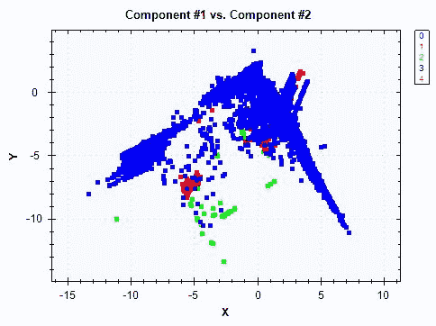

蓝色的点代表正常连接，其他不同颜色的点代表网络攻击。我们可以看到不同阶层之间的分布有所不同，但这种模式似乎并不明显。

以下是第二个和第三个组件之间的图:

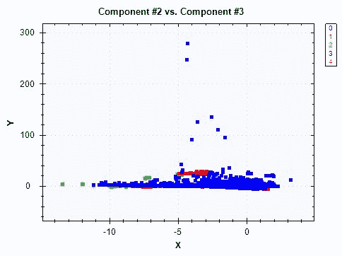

最后，下面的情节是在第三和第四个组成部分之间:

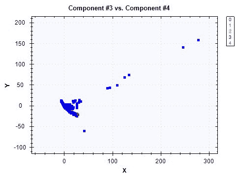

在最后一个情节中，我们看不出不同阶级之间有什么区别。尽管这种模式看起来不是很强，但之前的散点图显示了分布中的一些差异。尤其是更难在视觉上看到二维图的区别。如果我们把它带到更高维度的空间，也就是我们的异常检测模型将要观察的空间，模式的差异将变得更加明显。

现在让我们看看由主成分解释的差异量。下面的代码显示了我们如何获得所解释的方差的累积比例，并将其显示在折线图中:

```cs
double[] explainedVariance = pca.Components
    .Select(x => x.CumulativeProportion)
    .Where(x => x < 1)
    .ToArray();

DataSeriesBox.Show(
    explainedVariance.Select((x, i) => (double)i),
    explainedVariance
).SetTitle("Explained Variance");
System.IO.File.WriteAllLines(
    Path.Combine(dataDirPath, "explained-variance.csv"),
    explainedVariance.Select((x, i) => String.Format("{0},{1:0.0000}", i, x))
);
```

如果您更仔细地观察这段代码，`pca`对象中的`Components`属性包含了关于所解释的方差比例的信息。我们可以通过使用`CumulativeProportion`属性遍历每个组件并获得累积比例。一旦我们提取了这些值，我们就使用`DataSeriesBox`类来显示一个折线图，该图显示了所解释的方差的累积比例。输出如下所示:

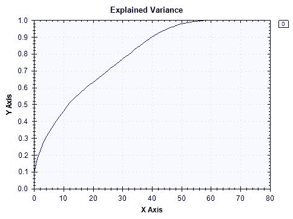

现在，我们已经成功地创建了 PCA 特征，并拥有完整的 PCA 转换数据。您可以使用以下代码导出此数据:

```cs
Console.WriteLine("* Exporting pca-transformed feature set...");
System.IO.File.WriteAllLines(
    Path.Combine(
        dataDirPath,
        "pca-transformed-features.csv"
    ),
    transformed.Select(x => String.Join(",", x))
);
System.IO.File.WriteAllLines(
    Path.Combine(
        dataDirPath,
        "pca-transformed-labels.csv"
    ),
    labels.Select(x => x.ToString())
);
```

功能工程步骤的完整代码可以在这个链接找到:[https://github . com/Yoon hwang/c-sharp-machine-learning/blob/master/ch . 9/feature engineering . cs](https://github.com/yoonhwang/c-sharp-machine-learning/blob/master/ch.9/FeatureEngineering.cs)。


# 用于异常检测的主成分分类器

我们已经整理好了一切，现在准备开始为网络攻击检测项目构建异常检测模型。如前所述，我们将使用正常连接组的主成分分布数据，并将其作为主成分的正常范围。对于任何偏离主成分值正常范围的记录，我们都会将其标记为异常和潜在的网络攻击。


# 培训准备

首先，让我们加载我们在特征工程步骤中创建的特征数据。您可以使用以下代码加载 PCA 转换的数据和标签数据:

```cs
// Read in the Cyber Attack dataset
// TODO: change the path to point to your data directory
string dataDirPath = @"<path-to-dir>";

// Load the data into a data frame
string dataPath = Path.Combine(dataDirPath, "pca-transformed-features.csv");
Console.WriteLine("Loading {0}\n\n", dataPath);
var featuresDF = Frame.ReadCsv(
    dataPath,
    hasHeaders: false,
    inferTypes: true
);
featuresDF.RenameColumns(
    featuresDF.ColumnKeys.Select((x, i) => String.Format("component-{0}", i + 1))
);

int[] labels = File.ReadLines(
    Path.Combine(dataDirPath, "pca-transformed-labels.csv")
).Select(x => int.Parse(x)).ToArray();
featuresDF.AddColumn("attack_category", labels);
```

让我们快速看一下我们的目标类的分布。按每个目标类计数的代码如下:

```cs
var count = featuresDF.AggregateRowsBy<string, int>(
    new string[] { "attack_category" },
    new string[] { "component-1" },
    x => x.ValueCount
).SortRows("component-1");
count.RenameColumns(new string[] { "attack_category", "count" });
count.Print();
```

运行此代码后，您将看到以下输出:

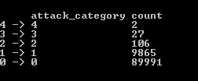

正如所料，大多数样本属于 0 类，这是正常的群体，其余的组合是少数(约 10%)在我们的样本集。这是对网络攻击更现实的看法。网络攻击发生的频率远低于正常连接。

出于说明的目的，我们将使用第一个`27`主成分来解释数据集中大约 70%的总体方差。您可以用不同数量的主成分进行试验，看看模型性能如何变化。以下代码显示了我们如何使用第一个`27`主成分创建训练集:

```cs
// First 13 components explain about 50% of the variance
// First 19 components explain about 60% of the variance
// First 27 components explain about 70% of the variance
// First 34 components explain about 80% of the variance
int numComponents = 27;
string[] cols = featuresDF.ColumnKeys.Where((x, i) => i < numComponents).ToArray();

// First, compute distances from the center/mean among normal events
var normalDF = featuresDF.Rows[
    featuresDF["attack_category"].Where(x => x.Value == 0).Keys
].Columns[cols];

double[][] normalData = BuildJaggedArray(
    normalDF.ToArray2D<double>(), normalDF.RowCount, cols.Length
);
```

如果您仔细观察这段代码，您会注意到我们只使用普通连接样本创建了`normalDF`和`normalData`变量。如前所述，我们希望只从正常数据中学习，这样我们就可以标记任何异常值和偏离主成分正常范围的极端值。在下一节中，我们将使用这些变量为网络攻击检测构建一个主成分分类器。


# 构建主成分分类器

为了建立主成分分类器，它将标记那些偏离正常连接的事件，我们需要计算记录和正常连接分布之间的距离。我们将使用一个距离度量标准，即 **Mahalanobis 距离**，它测量点和分布之间的距离。对于标准化的主成分，比如这里的主成分，计算**马氏距离**的公式如下:

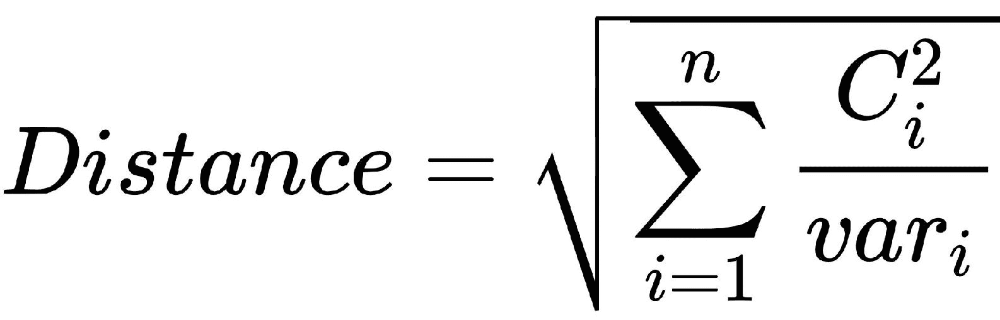

本方程中的*C[I]代表各主成分的值，*var[I]代表各主成分的方差。让我们看看下面的例子:**

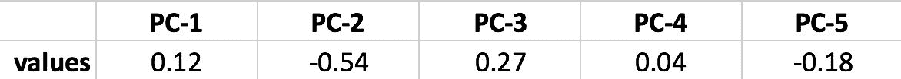

假设您有 5 个主成分，其值如该图所示，并且出于简单和演示的目的，假设每个主成分的方差为 1，则您可以计算 **Mahalanobis 距离**如下:

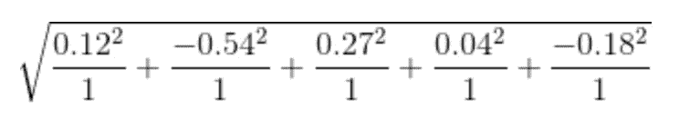

并且对于这个例子，计算的**马氏距离**是 0.64。关于这个距离度量的更详细的描述，建议你查看下面的维基百科页面:【https://en.wikipedia.org/wiki/Mahalanobis_distance 的[，或者下面的研究论文:](https://en.wikipedia.org/wiki/Mahalanobis_distance)[https://users.cs.fiu.edu/~chens/PDF/ICDM03_WS.pdf](https://users.cs.fiu.edu/~chens/PDF/ICDM03_WS.pdf)。

我们实现了 Mahalanobis 距离方程作为辅助函数`ComputeDistances`，它看起来如下:

```cs
private static double[] ComputeDistances(double[][] data, double[] componentVariances)
{

    double[] distances = data.Select(
        (row, i) => Math.Sqrt(
            row.Select(
                (x, j) => Math.Pow(x, 2) / componentVariances[j]
            ).Sum()
        )
    ).ToArray();

    return distances;
}
ComputeDistances method takes in two arguments—data and componentVariances. The variable data is a two-dimensional array that we want to compute distances for, and the componentVariances variable is the variance of the principal components that are learned from the normal network connections data. In order to compute the variances of the principal components, we use the following helper function:
```

```cs
private static double[] ComputeVariances(double[][] data)
{
    double[] componentVariances = new double[data[0].Length];

    for (int j = 0; j < data[0].Length; j++)
    {
        componentVariances[j] = data
            .Select((x, i) => Math.Pow(data[i][j], 2))
            .Sum() / data.Length;
    }

    return componentVariances;
}
ComputeDistances, as follows:
```

```cs
double[] distances = ComputeDistances(normalData);
```

现在我们已经计算了各个记录的距离，让我们分析一下正常连接的范围。我们使用以下代码来计算距离的平均值和标准偏差，并使用直方图来显示整体距离分布:

```cs
double meanDistance = distances.Average();
double stdDistance = Math.Sqrt(
    distances
    .Select(x => Math.Pow(x - meanDistance, 2))
    .Sum() / distances.Length
);

Console.WriteLine(
    "* Normal - mean: {0:0.0000}, std: {1:0.0000}",
    meanDistance, stdDistance
);

HistogramBox.Show(
    distances,
    title: "Distances"
)
.SetNumberOfBins(50);
```

运行此代码时，您将看到正常连接的距离度量的平均值和标准偏差的以下输出:


直方图如下所示:


正如您从这些输出中看到的，大多数距离非常小，这表明非攻击连接和正常连接通常紧密地聚集在一起。有了关于正常连接组中距离分布的信息，让我们开始看看是否可以通过标记超出正常距离范围的某些网络连接来构建检测模型。

以下代码显示了我们如何根据正常网络连接的分布计算网络攻击连接的距离:

```cs
// Detection
var attackDF = featuresDF.Rows[
    featuresDF["attack_category"].Where(x => x.Value > 0).Keys
].Columns[cols];

double[][] attackData = BuildJaggedArray(
    attackDF.ToArray2D<double>(), attackDF.RowCount, cols.Length
);

double[] attackDistances = ComputeDistances(attackData, normalVariances);
```

从这段代码中可以看出，我们首先创建了一个名为`attackData`的变量，它包含了来自我们训练集的所有网络攻击连接。然后，我们使用`ComputeDistances`方法来计算网络攻击连接组中各个记录的距离。

现在，我们已经准备好根据刚才计算的距离度量来标记可疑的网络连接。让我们先来看看下面的代码:

```cs
// 5-10% false alarm rate
for (int i = 4; i < 10; i++)
{
    double targetFalseAlarmRate = 0.01 * (i + 1);
    double threshold = Accord.Statistics.Measures.Quantile(
        distances,
        1 - targetFalseAlarmRate
    );

    int[] detected = attackDistances.Select(x => x > threshold ? 1 : 0).ToArray();

    EvaluateResults(attackLabels, detected, targetFalseAlarmRate);
}
```

从这段代码中可以看出，我们根据正常连接组中的距离分布来决定阈值。例如，如果我们的目标是有 5%的错误警报率，我们标记所有与正常范围的距离大于正常连接组内距离分布的 95%的连接。更具体地说，在我们的例子中，正常连接距离分布的 95%百分位数是 5.45。因此，在这种情况下，我们会将所有距离正常范围大于 5.45 的连接标记为网络攻击。我们对 5%到 10%的虚警率重复这个过程。我们将在下面的模型评估步骤中更详细地讨论这种异常检测模型的性能。

建模步骤的完整代码可以在这个链接找到:[https://github . com/Yoon hwang/c-sharp-machine-learning/blob/master/ch . 9/modeling . cs](https://github.com/yoonhwang/c-sharp-machine-learning/blob/master/ch.9/Modeling.cs)。


# 评估异常检测模型

在前面的模型构建步骤中，我们构建了一个针对网络攻击的异常检测模型。在前面的代码中，您可能已经注意到我们正在使用一个名为`EvaluateResults`的函数。这是我们为评估模型性能而编写的辅助函数。让我们来看看下面的代码:

```cs
private static void EvaluateResults(int[] attackLabels, int[] detected, double targetFalseAlarmRate)
{
    double overallRecall = (double)detected.Sum() / attackLabels.Length;

    double[] truePositives = new double[4];
    double[] actualClassCounts = new double[4];

    for (int i = 0; i < attackLabels.Length; i++)
    {
        actualClassCounts[attackLabels[i] - 1] += 1.0;

        if (detected[i] > 0)
        {
            truePositives[attackLabels[i] - 1] += 1.0;
        }
    }

    double[] recalls = truePositives.Select((x, i) => x / actualClassCounts[i]).ToArray();

    Console.WriteLine("\n\n---- {0:0.0}% False Alarm Rate ----", targetFalseAlarmRate * 100.0);
    Console.WriteLine("* Overall Attack Detection: {0:0.00}%", overallRecall * 100.0);
    Console.WriteLine(
        "* Detection by Attack Type:\n\t{0}",
        String.Join("\n\t", recalls.Select(
            (x, i) => String.Format("Class {0}: {1:0.00}%", (i + 1), x * 100.0))
        )
    );
}
```

从这段代码中可以看出，我们对两个指标感兴趣:总体网络攻击检测率和每类检测率。评估结果如下所示:

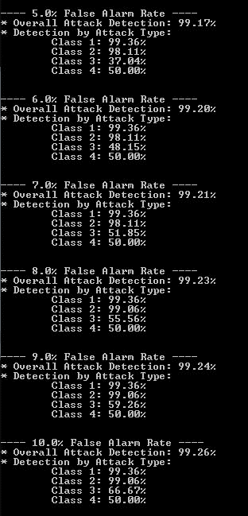

总体结果看起来不错，检测率超过 99%。在 5%的误报率下，大约 99.1%的网络攻击被检测到。然而，如果我们仔细观察每类的检测率，我们可以看到它们的缺点和优点。在 5%的误报率下，我们的模型对于检测类别 1 和类别 2(即`dos`和`probe`攻击)非常有效。另一方面，我们的模型在检测类别 3 和类别 4(即`r2l`和`u2r`攻击)时表现不佳。正如您从这个输出中看到的，随着我们增加目标错误警报率，整体和每个类的检测率也会增加。在实际情况中，您将不得不在更高的检测率和更高的误报率之间进行权衡，并决定满足您的业务要求的目标误报率。


# 摘要

在本章中，我们构建了第一个可以检测网络攻击的异常检测模型。在这一章的开始，我们讨论了这种类型的异常检测模型如何被使用和应用到现实生活中，以及开发一个异常检测模型如何不同于我们到目前为止已经建立的其他 ML 模型。然后，我们开始分析目标类和各种特性的分布，以便更好地理解数据集。当我们分析这个数据集时，我们还注意到网络攻击样本比正常连接样本多，这在现实生活中是不现实的。为了模拟真实情况，其中异常恶意连接发生的频率比正常连接低得多，我们随机地对正常和恶意连接样本进行子选择，以便 90%的训练集是正常连接，只有 10%是网络攻击示例。

利用这个子选择的训练集，我们将 PCA 应用于正常连接数据，以找出主成分的正常范围。使用 **Mahalanobis 距离**度量，我们根据正常连接的分布计算了各个记录之间的距离。在建模步骤中，我们根据目标虚警率试验了不同的阈值。使用 5%到 10%的误报率，我们建立了网络攻击检测模型，并评估了它们的性能。在我们的模型评估步骤中，我们注意到总体检测率超过了 99%，而对每次攻击检测率的进一步观察暴露了模型的弱点和优势。我们还注意到，随着我们牺牲和提高误报率，整体网络攻击检测率有所提高。当应用这种异常检测技术时，有必要了解虚警率和检测率之间的权衡，并根据相关的业务需求做出决策。

在下一章中，我们将扩展我们在构建异常检测模型方面的知识和经验。我们将使用信用卡数据集进行信用卡欺诈检测项目。在基于 PCA 的异常检测模型之上，我们将讨论如何使用单类支持向量机进行异常检测。