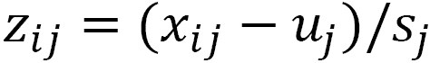
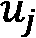
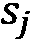

# 二、:检查特征和目标之间的二元和多元关系

在这一章中，我们将看看可能的特性和目标变量之间的相关性。使用交叉表(双向频率)、相关性、散点图和分组箱线图的双变量探索性分析可以揭示建模的关键问题。常见问题包括特征之间的高度相关性以及特征和目标变量之间的非线性关系。在本章中，我们将使用 pandas 方法进行双变量分析，使用 Matplotlib 进行可视化。我们还将讨论我们在特征工程和建模方面的发现的含义。

我们还将使用多元技术来理解特征之间的关系。这包括依靠一些机器学习算法来识别可能有问题的观察结果。之后，我们将为从我们的建模中消除某些观察以及转换关键特征提供尝试性的建议。

在本章中，我们将讨论以下主题:

*   识别二元关系中的异常值和极值
*   使用散点图查看连续特征之间的二元关系
*   使用分组箱线图查看连续特征和分类特征之间的二元关系
*   使用线性回归识别具有显著影响的数据点
*   使用 K-最近邻来发现异常值
*   使用隔离林发现异常值

# 技术要求

这一章很大程度上依赖于 pandas 和 Matplotlib 库，但是你不需要任何这方面的知识。如果您已经从科学发行版安装了 Python，比如 Anaconda 或 WinPython，那么这些库可能已经安装好了。我们还将使用 Seaborn 制作一些图形，使用 statsmodels 库制作一些汇总统计数据。如果您需要安装任何软件包，您可以通过从终端窗口或 Windows PowerShell 运行`pip install [package name]`来完成。本章的代码可以在本书的 GitHub 知识库中找到，网址是[https://GitHub . com/packt publishing/Data-Cleaning-and-Exploration-with-Machine-Learning](https://github.com/PacktPublishing/Data-Cleaning-and-Exploration-with-Machine-Learning)。

# 识别二元关系中的异常值和极值

如果对数据中的二元关系没有很好的理解，就很难开发出一个可靠的模型。我们不仅关心特定特性和目标变量之间的关系，还关心特性如何一起移动。如果特征是高度相关的，那么对它们的独立效果建模就变得棘手或不必要了。这可能是一个挑战，即使这些特征仅在一个值范围内高度相关。

很好地理解二元关系对于识别异常值也很重要。一个值可能是意外的，即使它不是极值。这是因为当第二个要素具有某些值时，某个要素的某些值是不寻常的。当一个特征是分类的而另一个是连续的时，这很容易说明。

下面的图显示了几年来每天的观鸟次数，但显示了两个地点的不同分布。一个站点每天(平均)有 33 次目击，而另一个站点有 52 次。(这是一个虚构的例子，摘自我的 *Python 数据清理食谱*。)总平均值(未示出)是 42。我们应该如何看待 58 的日访问量呢？是离群值吗？这取决于两个地点中的哪一个被观察。如果在地点 A 一天有 58 次目击，58 次将是一个异常高的数字。然而，这对于站点 B 来说是不正确的，58 次目击与该站点的平均值相差不大:


图 2.1-每日鸟类观察

这个提示了一个有用的经验法则:每当一个感兴趣的特性与另一个特性相关联时，当我们试图识别离群值(或者实际上是任何具有该特性的建模)时，我们应该将这种关系考虑在内。更精确地陈述这一点并将其扩展到两个特征都连续的情况是有帮助的。如果我们假设特征 *x* 和特征 *y* 之间存在线性关系，我们可以用熟悉的 *y = mx + b* 等式来描述这种关系，其中 *m* 是斜率，而 *b* 是 *y* 截距。然后，我们可以期望 *y* 的值接近于 *x* 乘以估计斜率，加上*y*-截距。意想不到的值是那些大大偏离这种关系的值，其中在给定 *x* 的值的情况下， *y* 的值远高于或低于预测值。这可以扩展到多个 *x* 或预测变量。

在本节中，我们将学习如何通过检查一个功能与另一个功能之间的关系来识别异常值和意外值。在本章的后续部分，我们将使用多变量技术对异常值检测进行额外的改进。

在本节中，我们将根据各国的新冠肺炎病例处理数据。该数据集包含人口中每百万人的病例数和死亡数。我们将把两列都视为可能的目标。它还包含每个国家的人口统计数据，如人均 GDP、中位年龄和糖尿病患病率。让我们开始吧:

注意

我们的数据世界在 https://ourworldindata.org/coronavirus-source-data[提供新冠肺炎公共使用数据。本节使用的数据集是在 2021 年 7 月 9 日下载的。数据中的列比我包含的多。我创建了基于国家的`region`列。](https://ourworldindata.org/coronavirus-source-data)

1.  让我们从加载新冠肺炎数据集开始，看看它是如何构造的。我们还将导入 Matplotlib 和 Seaborn 库，因为我们将进行一些可视化:

    ```py
    import pandas as pd import matplotlib.pyplot as plt import seaborn as sns covidtotals = pd.read_csv("data/covidtotals.csv") covidtotals.set_index("iso_code", inplace=True) covidtotals.info() <class 'pandas.core.frame.DataFrame'> Index: 221 entries, AFG to ZWE Data columns (total 16 columns):  #  Column                  Non-Null Count     Dtype   --  --------                ---------------    -------  0  lastdate                221    non-null    object   1  location                221    non-null    object   2  total_cases             192    non-null    float64  3  total_deaths            185    non-null    float64  4  total_cases_mill        192    non-null    float64  5  total_deaths_mill       185    non-null    float64  6  population              221    non-null    float64  7  population_density      206    non-null    float64  8  median_age              190    non-null    float64  9  gdp_per_capita          193    non-null    float64 10  aged_65_older           188    non-null    float64 11  total_tests_thous        13    non-null    float64 12  life_expectancy         217    non-null    float64 13  hospital_beds_thous     170    non-null    float64 14  diabetes_prevalence     200    non-null    float64 15  region                  221    non-null    object dtypes: float64(13), object(3) memory usage: 29.4+ KB
    ```

2.  我们检验二元关系的一个很好的起点是相关性。首先，让我们创建一个包含一些关键特性的数据帧:

    ```py
    totvars = ['location','total_cases_mill',    'total_deaths_mill'] demovars = ['population_density','aged_65_older',    'gdp_per_capita','life_expectancy',    'diabetes_prevalence'] covidkeys = covidtotals.loc[:, totvars + demovars]
    ```

3.  现在，我们可以得到这些特征的皮尔逊相关矩阵。在病例和每百万死亡人数之间存在 0.71 的强正相关。65 岁及以上人口的百分比与病例和死亡呈正相关，两者都为 0.53。预期寿命也与百万分之一病例高度相关。人均国内生产总值与病例之间似乎至少存在某种关联

值得注意的是可能特征之间的相关性，例如预期寿命与人均国内生产总值之间的相关性(0.68)以及预期寿命与 65 岁或以上人口之间的相关性(0.73)。

1.  将关联矩阵视为热图会有所帮助。这可以通过将相关矩阵传递给 Seaborn `heatmap`方法:

    ```py
    sns.heatmap(corrmatrix, xticklabels =   corrmatrix.columns, yticklabels=corrmatrix.columns,    cmap="coolwarm") plt.title('Heat Map of Correlation Matrix') plt.tight_layout() plt.show()
    ```

    来完成

这将创建以下情节:


图 2.2–COVID 数据的热图，红色和桃红色相关性最强

我们想要注意用暖色显示的单元格——在本例中，主要是桃色。我发现使用热图有助于我在建模时记住相关性。

注意

这本书包含的所有彩色图像都可以下载。查看本书的*前言*中的相应链接。

1.  让我们仔细看看每百万总病例数和每百万死亡人数之间的关系。要更好地理解这一点，一种方法是比较每个值的高值和低值，并观察它们如何一起移动。在下面的代码中，我们使用`qcut`方法创建一个分类特征，对于案例，五个值相对均匀地分布，从很低到很高。我们对死亡做了同样的处理:

    ```py
    covidkeys['total_cases_q'] = \   pd.qcut(covidkeys['total_cases_mill'],   labels=['very low','low','medium','high',   'very high'], q=5, precision=0) covidkeys['total_deaths_q'] = \   pd.qcut(covidkeys['total_deaths_mill'],   labels=['very low','low','medium','high',   'very high'], q=5, precision=0)
    ```

2.  我们可以使用`crosstab`函数查看每个五分之一病例和五分之一死亡的国家数量。正如我们所料，大多数国家都在对角线上。有 27 个国家的病例和死亡率非常低，25 个国家的病例和死亡率非常高。有趣的数字是那些不在对角线上的国家，例如有非常高病例但只有中等死亡率的四个国家，也不是有中等病例和非常高死亡率的国家。让我们也看看我们的功能的含义，以便我们可以在以后引用它们:

    ```py
    pd.crosstab(covidkeys.total_cases_q,    covidkeys.total_deaths_q) total_deaths_q  very low  low  medium  high  very high total_cases_q                                          very low              27    7       0     0          0 low                    9   24       4     0          0 medium                 1    6      23     6          1 high                   0    0       6    21         11 very high              0    0       4    10         25 covidkeys.mean() total_cases_mill         36,649 total_deaths_mill           683 population_density          453 aged_65_older                 9 gdp_per_capita           19,141 life_expectancy              73 diabetes_prevalence           8
    ```

3.  让我们仔细看看远离对角线的国家。四个国家——塞浦路斯、科威特、马尔代夫和卡塔尔——每百万死亡人数低于平均水平，但远远高于平均水平。有趣的是，这四个国家的人口都很少；四个国家中有三个国家的人口密度远低于 453 的平均值；同样，四个国家中有三个国家的 65 岁或以上人口比例远低于平均水平:

    ```py
    covidtotals.loc[(covidkeys.total_cases_q=="very high")   & (covidkeys.total_deaths_q=="medium")].T iso_code            CYP        KWT        MDV    QAT lastdate            2021-07-07 2021-07-07 2021-07-07  2021-07-07 location            Cyprus    Kuwait   Maldives  Qatar total_cases         80,588    369,227  74,724  222,918 total_deaths        380       2,059    213     596 total_cases_mill    90,752    86,459   138,239 77,374 total_deaths_mill   428       482      394     207 population         888,005 4,270,563 540,542 2,881,060 population_density  128       232      1,454    227 median_age          37        34       31       32 gdp_per_capita      32,415    65,531   15,184   116,936 aged_65_older       13        2        4        1 total_tests_thous   NaN       NaN      NaN     NaN life_expectancy     81        75       79      80 hospital_beds_thous 3         2        NaN     1 diabetes_prevalence 9         16       9       17 region              Eastern   West     South   West                       Europe    Asia     Asia    Asia
    ```

4.  让我们仔细看看国家的死亡人数比我们根据病例预计的要多。对墨西哥来说，每百万人的病例数远低于平均水平，而每百万人的死亡数则略高于平均水平:

    ```py
    covidtotals.loc[(covidkeys. total_cases_q=="medium")   & (covidkeys.total_deaths_q=="very high")].T iso_code                         MEX lastdate                  2021-07-07 location                      Mexico total_cases                2,558,369 total_deaths                 234,192 total_cases_mill              19,843 total_deaths_mill              1,816 population               128,932,753 population_density                66 median_age                        29 gdp_per_capita                17,336 aged_65_older                      7 total_tests_thous                NaN life_expectancy                   75 hospital_beds_thous                1 diabetes_prevalence               13 region                 North America
    ```

当我们想要了解数据集中的二元关系时，相关系数和热图是一个很好的起点。然而，仅仅用一个相关系数来可视化连续变量之间的关系可能是困难的。当这种关系不是线性的时候，也就是说，当它根据一个特征的范围而变化的时候，尤其如此。我们通常可以通过散点图来加深对两个特征之间关系的理解。我们将在下一节中介绍这一点。

# 使用散点图查看连续特征之间的二元关系

在本节中，我们将学习如何获得数据的散点图。

我们可以使用散点图来获得两个特征之间关系的更完整的图像,而不是仅仅通过相关系数来检测。当这种关系在某些数据范围内发生变化时，这尤其有用。在本节中，我们将创建一些与上一节中检查的相同特征的散点图。让我们开始吧:

1.  通过数据点绘制一条回归线是很有帮助的。我们可以用 Seaborn 的`regplot`方法做到这一点。让我们再次加载新冠肺炎数据，以及 Matplotlib 和 Seaborn 库，并生成一个由`total_deaths_mill` :

    ```py
    import pandas as pd import numpy as np import matplotlib.pyplot as plt import seaborn as sns covidtotals = pd.read_csv("data/covidtotals.csv") covidtotals.set_index("iso_code", inplace=True) ax = sns.regplot(x="total_cases_mill",   y="total_deaths_mill", data=covidtotals) ax.set(xlabel="Cases Per Million", ylabel="Deaths Per    Million", title="Total COVID Cases and Deaths by    Country") plt.show()
    ```

    生成的`total_cases_mill`散点图

此产生以下情节:


图 2.3-按国家分列的 COVID 病例和死亡总数

回归线是对每百万病例数和每百万死亡数之间关系的估计。这条线的斜率表明，每百万例数增加 1 个单位，我们可以预期每百万例死亡数会增加多少。散点图上明显高于回归线的那些点应该更仔细地检查。

1.  这个每百万人死亡人数接近 6000，每百万人病例低于 75000 的国家显然是个例外。让我们仔细看看:

    ```py
    covidtotals.loc[(covidtotals.total_cases_mill<75000) \   & (covidtotals.total_deaths_mill>5500)].T iso_code                           PER lastdate                    2021-07-07 location                          Peru total_cases                  2,071,637 total_deaths                   193,743 total_cases_mill                62,830 total_deaths_mill                5,876 population                  32,971,846 population_density                  25 median_age                          29 gdp_per_capita                  12,237 aged_65_older                        7 total_tests_thous                  NaN life_expectancy                     77 hospital_beds_thous                  2 diabetes_prevalence                  6 region                   South America
    ```

在这里，我们可以看到，离群的国家是秘鲁。秘鲁的百万分之一病例数确实高于平均水平，但其百万分之一死亡人数仍远远高于给定病例数的预期。如果我们在 62，830 处画一条垂直于 *x* 轴的线，我们可以看到它与回归线相交，死亡率约为百万分之 1，000，远低于秘鲁的 5，876。秘鲁数据中唯一与数据集平均值明显不同的其他数值是人口密度和人均国内生产总值，这两个数值都大大低于平均值。在这里，我们没有任何特征可以帮助我们解释秘鲁的高死亡率。

注意

创建散点图时，通常将特征或预测变量放在 *x* 轴上，将目标变量放在 *y* 轴上。如果画了一条回归线，那么它代表预测值增加 1 个单位所预测的目标值的增加。但是散点图也可以用来检查两个预测值或两个可能的目标之间的关系。

回顾我们在第一章 、*中如何定义异常值，检查特征和目标的分布*，可以得出秘鲁是异常值的结论。但是在我们得出结论之前，我们还有更多工作要做。秘鲁不是散点图上点数远高于或低于回归线的唯一国家。一般来说，调查这些问题是一个好主意。让我们来看看:

1.  创建包含大多数关键连续特征的散点图可以帮助我们识别其他可能的异常值，并更好地可视化我们在本章第一节中观察到的相关性。让我们创建 65 岁及以上人口和人均 GDP 的散点图，以及每百万人的病例总数:

    ```py
    fig, axes = plt.subplots(1,2, sharey=True) sns.regplot(x=covidtotals.aged_65_older,    y=covidtotals.total_cases_mill, ax=axes[0]) sns.regplot(x=covidtotals.gdp_per_capita,    y=covidtotals.total_cases_mill, ax=axes[1]) axes[0].set_xlabel("Aged 65 or Older") axes[0].set_ylabel("Cases Per Million") axes[1].set_xlabel("GDP Per Capita") axes[1].set_ylabel("") plt.suptitle("Age 65 Plus and GDP with Cases Per    Million") plt.tight_layout() fig.subplots_adjust(top=0.92) plt.show()
    ```

这会产生以下情节:


图 2.4-65 岁以上人口和国内生产总值，每百万人口病例数

这些散点图显示，在给定人口年龄或 GDP 的情况下，一些百万分率非常高的国家的值接近我们的预期值。这些是极端值，但不一定是我们定义的异常值。

可以使用散点图在一个图形中说明两个特征和一个目标之间的关系。让我们回到我们在上一章研究过的陆地温度数据来探讨这个问题。

数据注释

陆地温度数据集包含 2019 年全球 12，000 多个站点的平均温度读数(摄氏度)，尽管大多数站点位于美国。数据集是从全球历史气候学网络综合数据库中检索出来的。美国国家海洋和大气管理局已通过 https://www . ncdc . NOAA . gov/data-access/land-based-station-data/land-based-datasets/global-historical-climatology-network-monthly-version-4 向公众开放使用。

1.  我们预计气象站的平均温度会受到纬度和海拔的影响。比方说，我们之前的分析表明，海拔高度直到大约 1000 米时才对温度产生很大影响。我们可以将`landtemps`数据帧分为低海拔站和高海拔站，以 1000 米为阈值。在下面的代码中，我们可以看到 9538 个低海拔气象站的平均温度为 12.16 摄氏度，2557 个高海拔气象站的平均温度为 7.58 摄氏度:

    ```py
    landtemps = pd.read_csv("data/landtemps2019avgs.csv") low, high = landtemps.loc[landtemps.elevation<=1000],   landtemps.loc[landtemps.elevation>1000] low.shape[0], low.avgtemp.mean() (9538, 12.161417937651676) high.shape[0], high.avgtemp.mean() (2557, 7.58321486951755)
    ```

2.  现在，我们可以在一个散点图

    ```py
    plt.scatter(x="latabs", y="avgtemp", c="blue",   data=low) plt.scatter(x="latabs", y="avgtemp", c="red",    data=high) plt.legend(('low elevation', 'high elevation')) plt.xlabel("Latitude (N or S)") plt.ylabel("Average Temperature (Celsius)") plt.title("Latitude and Average Temperature in 2019") plt.show()
    ```

    中可视化海拔与纬度和温度的关系

这会产生以下散点图:


图 2.5-2019 年的纬度和平均温度

在这里，我们可以看到，随着离赤道的距离(以纬度衡量)增加，温度逐渐降低。我们还可以看到，高海拔气象站(带红点的气象站)一般在低海拔站的下方——也就是说，在类似的纬度上，它们的温度更低。

1.  高海拔站和低海拔站之间的坡度似乎也至少有些不同。随着高海拔地区纬度的增加，气温似乎下降得更快。我们可以通过散点图绘制两条回归线——一条用于高海拔站，一条用于低海拔站——来更清楚地了解这一点。为了稍微简化代码，让我们为低海拔和高海拔站创建一个分类的特征`elevation_group`:

    ```py
    landtemps['elevation_group'] =    np.where(landtemps.elevation<=1000,'low','high') sns.lmplot(x="latabs", y="avgtemp",    hue="elevation_group", palette=dict(low="blue",    high="red"), legend_out=False, data=landtemps) plt.xlabel("Latitude (N or S)") plt.ylabel("Average Temperature") plt.legend(('low elevation', 'high elevation'),    loc='lower left') plt.yticks(np.arange(-60, 40, step=20)) plt.title("Latitude and Average Temperature in 2019") plt.tight_layout() plt.show()
    ```

这就产生了下面的情节:


图 2.6-2019 年的纬度和平均温度以及回归线

在这里，我们可以看到高海拔站更陡的负斜率。

1.  如果我们想要看到具有两个连续特征和一个连续目标的散点图，而不是像我们在前面的例子中所做的那样，强制其中一个特征为二分法，我们可以利用 Matplotlib 的 3D 功能:

    ```py
    fig = plt.figure() plt.suptitle("Latitude, Temperature, and Elevation in    2019") ax = plt.axes(projection='3d') ax.set_xlabel("Elevation") ax.set_ylabel("Latitude") ax.set_zlabel("Avg Temp") ax.scatter3D(landtemps.elevation, landtemps.latabs,    landtemps.avgtemp) plt.show()
    ```

此产生以下三维散点图:


图 2.7-2019 年的纬度、温度和海拔

散点图是梳理连续特征之间关系的可视化工具。我们对这些关系有了更好的理解，而不仅仅是相关系数。然而，如果我们正在检查一个连续特征和一个分类特征之间的关系，我们需要一个非常不同的可视化。分组箱线图在这些情况下很有用。我们将在下一节学习如何用 Matplotlib 创建分组箱线图。

# 使用分组箱线图查看连续特征和分类特征之间的二元关系

分组箱线图是一种不被重视的可视化。当我们检查连续特征和分类特征之间的关系时，它们很有帮助，因为它们显示了连续特征的分布如何随着分类特征的值而变化。

我们可以通过返回到我们在上一章处理过的**国家纵向调查** ( **NLS** )数据来探究这个问题。NLS 对每个调查对象有一项观察，但收集关于教育和就业的年度数据(每年的数据分列在不同的栏目中)。

数据注释

如 [*第一章*](B17978_01_ePub.xhtml#_idTextAnchor014)*所述，考察特征和目标的分布*，青年 NLS 是由美国劳工统计局进行的。SPSS、Stata 和 SAS 的单独文件可以从各自的存储库中下载。可以从 https://www.nlsinfo.org/investigator/pages/search 下载 NLS 的数据。

按照以下步骤创建成组的 bloxplots:

1.  在 NLS 数据框架的许多列中，有`highestdegree`和`weeksworked17`，它们分别代表受访者在 2017 年获得的最高学位和该人工作的周数。让我们看看每个学位价值的工作周分布。首先，我们必须定义一个函数`gettots`，以获得我们想要的描述性统计数据。然后，我们必须使用`apply` :

    ```py
    nls97 = pd.read_csv("data/nls97.csv") nls97.set_index("personid", inplace=True) def gettots(x):   out = {}   out['min'] = x.min()   out['qr1'] = x.quantile(0.25)   out['med'] = x.median()   out['qr3'] = x.quantile(0.75)   out['max'] = x.max()   out['count'] = x.count()   return pd.Series(out) nls97.groupby(['highestdegree'])['weeksworked17'].\   apply(gettots).unstack()                    min   qr1   med   qr3   max   count highestdegree                                   0\. None              0     0    40    52    52     510 1\. GED               0     8    47    52    52     848 2\. High School       0    31    49    52    52   2,665 3\. Associates        0    42    49    52    52     593 4\. Bachelors         0    45    50    52    52   1,342 5\. Masters           0    46    50    52    52     538 6\. PhD               0    46    50    52    52      51 7\. Professional      0    47    50    52    52      97
    ```

    将一个`groupby`系列对象`groupby(['highestdegree'])['weeksworked17']`传递给那个函数

在这里，我们可以看到高中以下学历的人工作周数的分布与本科以上学历的人有多么不同。对于没有学位的人来说，超过 25%的人没有工作过 0 周。对于那些拥有学士学位的人来说，即使是在第 25 百分位的人一年中也要工作 45 周。四分位数范围涵盖了无学位者的整个分布(0 至 52)，但仅涵盖了有学士学位者的一小部分范围(45 至 52)。

我们还应该注意到`highestdegree`的职业不平衡。获得硕士学位后，人数会变得很少，而获得高中学位的人数几乎是第二大群体的两倍。在使用这些数据进行任何建模之前，我们可能需要折叠一些类别。

1.  分组箱线图使得分布的差异更加清晰。让我们用相同的数据创建一些。我们将在这个图中使用 Seaborn:

    ```py
    import seaborn as sns myplt = sns.boxplot(x='highestdegree',    y= 'weeksworked17' , data=nls97,   order=sorted(nls97.highestdegree.dropna().unique())) myplt.set_title("Boxplots of Weeks Worked by Highest    Degree") myplt.set_xlabel('Highest Degree Attained') myplt.set_ylabel('Weeks Worked 2017') myplt.set_xticklabels(myplt.get_xticklabels(),   rotation=60, horizontalalignment='right') plt.tight_layout() plt.show()
    ```

这个产生了以下情节:


图 2.8-按最高程度排列的周工作箱线图

分组箱线图显示了所获学位工作周数的四分位间距的显著差异。在副学士学位(在美国是 2 年制大学学位)或更高的水平上，在胡须下面有值，用点表示。在副学士学位水平以下，箱线图不会识别任何异常值或极端值。例如，对于没有学位的人来说，0 周工作值不是一个极端值，但是对于拥有大专或以上学位的人来说，这是一个极端值。

1.  我们还可以使用分组箱线图来说明新冠肺炎病例的分布如何因地区而异。让我们也添加一个群集图来查看数据点，因为它们并不太多:

    ```py
    sns.boxplot(x='total_cases_mill', y='region',   data=covidtotals) sns.swarmplot(y="region", x="total_cases_mill",   data=covidtotals, size=1.5, color=".3", linewidth=0) plt.title("Boxplots of Total Cases Per Million by    Region") plt.xlabel("Cases Per Million") plt.ylabel("Region") plt.tight_layout() plt.show()
    ```

这会产生以下情节:


图 2.9–按地区划分的每百万病例总数的箱线图

这些分组箱线图显示了每 100 万人的中值病例在不同地区的差异，从低端的东非和东亚到高端的东欧和西欧。东亚的极高值低于西欧的第一个四分位数。我们可能应该避免得出过多的结论，因为大多数地区(国家数量)的数量都相当少。

到目前为止，在这一章中，我们主要关注了特征之间的二元关系，以及特征和目标之间的二元关系。我们生成的统计数据和可视化结果将为我们将要进行的建模提供信息。我们已经了解了可能的特性，它们对目标的影响，以及一些特性的分布如何随着另一个特性的值而变化。

我们将在本章的剩余部分探讨多元关系。在开始建模之前，我们希望对多个特征如何一起移动有一些了解。一旦包含了其他特性，一些特性就不再重要了吗？哪些观察值对我们的参数估计影响更大，对模型拟合有什么影响？同样，哪些观察结果与其他观察结果不同，因为它们要么具有无效值，要么因为它们似乎捕捉到了与其他观察结果完全不同的现象？我们将在接下来的三个部分中开始回答这些问题。虽然我们在构建模型之前不会得到任何明确的答案，但是我们可以通过预测它们来开始做出困难的建模决策。

# 使用线性回归识别具有显著影响的数据点

发现一些观察结果对我们的模型、参数估计和预测有惊人的高度影响并不罕见。这可能是也可能不是想要的。如果具有重大影响的观察结果反映了与其他数据不同的社会或自然过程，那么这些观察结果可能是无用的。例如，假设我们有一个迁徙很远的飞行动物的数据集，这几乎完全是鸟类物种，除了帝王蝶的数据。如果我们使用翅膀结构作为迁移距离的预测器，帝王蝶的数据可能应该被删除。

我们应该回到我们在第一节中对极值和异常值的区分上来。我们提到过，离群值可以被认为是具有特征值或特征值之间关系的观察值，这些值是如此不寻常，以至于它们无法帮助解释其余数据中的关系。另一方面，极值可能反映某个特征的自然且可解释的趋势，或者在整个数据中观察到的特征之间的相同关系。

对于对我们的模型有很大影响的观察值，区分异常值和极值是最重要的。回归分析中影响的标准度量是**库克距离** ( **库克距离**)。这个给了我们一个度量，如果从数据中删除一个观察，我们的预测会改变多少。

在本节中，让我们用我们一直使用的新冠肺炎数据构建一个相对简单的多元回归模型，然后为每个观察值生成一个库克的 D 值:

1.  让我们加载新冠肺炎数据以及 Matplotlib 和 statsmodels 库:

    ```py
    import pandas as pd import matplotlib.pyplot as plt import statsmodels.api as sm covidtotals = pd.read_csv("data/covidtotals.csv") covidtotals.set_index("iso_code", inplace=True)
    ```

2.  现在，让我们看看每百万人口中总病例数的分布和一些可能的预测因素:

    ```py
    xvars = ['population_density','aged_65_older',   'gdp_per_capita','diabetes_prevalence'] covidtotals[['total_cases_mill'] + xvars].\   quantile(np.arange(0.0,1.05,0.25))    total_cases_mill  population_density  aged_65_older\ 0.00             8.52                0.14         1.14 0.25         2,499.75               36.52         3.50  0.50        19,525.73               87.25         6.22 0.75        64,834.62              213.54        13.92 1.00       181,466.38           20,546.77        27.05          gdp_per_capita  diabetes_prevalence   0.00             661.24                 0.99   0.25           3,823.19                 5.34   0.50          12,236.71                 7.20   0.75          27,216.44                10.61   1.00         116,935.60                30.53
    ```

3.  接下来，让我们定义一个函数`getlm`，它使用 statsmodels 来运行一个线性回归模型并生成影响统计数据，包括 Cook 的 d。这个函数接受一个数据帧、目标列的名称以及特性的列名(习惯上将目标称为 *y* ，将特性称为 *X* )。

我们将使用`dropna`删除其中一个特征有缺失值的任何观察值。该函数返回估计的系数(以及`pvalues`)、每个观察值的影响度量以及完整的回归结果(`lm`):

```py
def getlm(df, ycolname, xcolnames):
  df = df[[ycolname] + xcolnames].dropna()
  y = df[ycolname]
  X = df[xcolnames]
  X = sm.add_constant(X)
  lm = sm.OLS(y, X).fit()
  influence = lm.get_influence().summary_frame()
  coefficients = pd.DataFrame(zip(['constant'] + 
    xcolnames, lm.params, lm.pvalues),
    columns=['features','params','pvalues'])
  return coefficients, influence, lm 
```

1.  现在，我们可以调用`getlm`函数，同时将每百万的总病例数指定为目标，将人口密度(每平方英里的人口数)、65 岁年龄加上百分比、人均 GDP 和糖尿病患病率指定为预测值。然后，我们可以打印参数估计值。通常，我们想要查看模型的一个完整的摘要，它可以通过`lm.summary()`生成。为了便于理解，我们将在这里跳过:

    ```py
    coefficients, influence, lm = getlm(covidtotals,   'total_cases_mill', xvars) coefficients features                        params       pvalues 0  constant                 -1,076.471         0.870 1  population_density           -6.906         0.030 2  aged_65_older             2,713.918         0.000 3  gdp_per_capita                0.532         0.001 4  diabetes_prevalence         736.809         0.241
    ```

人口密度、65 岁以上人口和 GDP 的系数都在 95%的水平上非常显著(p 值小于 0.05)。人口密度的结果很有趣，因为我们的双变量分析没有揭示人口密度和每百万病例之间的关系。该系数表明每百万病例减少 6.9 点，每平方英里人口增加 1 点。更广泛地说，一旦我们控制了 65 岁或以上人口的比例和他们的人均 GDP，更拥挤的国家每百万人中的病例就更少。这可能是虚假的，或者这可能是一种只能用多变量分析检测的关系。(也可能是人口密度与对每百万病例有更大影响的特征高度相关，但该特征被排除在模型之外。这将给我们一个人口密度的有偏系数估计。)

1.  我们可以使用我们在对`getlm`的调用中创建的影响数据框架来更仔细地查看那些具有高 Cook's D 的观察结果。定义高 Cook's D 的一种方法是使用所有观察结果的 Cook's D 平均值的三倍。让我们创建一个`covidtotalsoutliers`数据帧，其中包含所有高于该阈值的值。

在 T4，有 13 个国家的库克 D 值超过了临界值。让我们按照厨师的 D 值降序打印出前五个。巴林和马尔代夫位于病例分布的前四分之一(参见我们在本节前面打印的描述)。它们的人口密度也很高，65 岁或以上的人口比例很低。在其他条件都相同的情况下，鉴于我们的模型所描述的人口密度和年龄与病例之间的关系，我们预计这两个国家的每百万病例数会更低。巴林确实有很高的人均 GDP，但是，我们的模型告诉我们，这与高病例数有关。

新加坡和香港的人口密度极高，每百万人中的病例低于平均水平，尤其是香港。仅这两个位置就可以解释人口密度系数的方向。这两个国家的人均 GDP 都很高，这可能会拖累该系数。可能只是我们的模型不应该包括城市国家的位置:

```py
influencethreshold = 3*influence.cooks_d.mean()
covidtotals = covidtotals.join(influence[['cooks_d']])
covidtotalsoutliers = \
  covidtotals.loc[covidtotals.cooks_d >
  influencethreshold]
covidtotalsoutliers.shape
(13, 17)
covidtotalsoutliers[['location','total_cases_mill', 
  'cooks_d'] + xvars].sort_values(['cooks_d'],
  ascending=False).head()
     location  total_cases_mill   cooks_d    population_density\
iso_code               
BHR  Bahrain        156,793.409     0.230    1,935.907
SGP  Singapore       10,709.116     0.200    7,915.731
HKG  Hong Kong        1,593.307     0.181    7,039.714
JPN  Japan            6,420.871     0.095    347.778
MDV  Maldives       138,239.027     0.069    1,454.433
 aged_65_older  gdp_per_capita  diabetes_prevalence 
iso_code 
BHR              2.372      43,290.705          16.520
SGP             12.922      85,535.383          10.990
HKG             16.303      56,054.920           8.330
JPN             27.049      39,002.223           5.720
MDV              4.120      15,183.616           9.190
```

1.  因此，让我们看看我们的回归模型估计，如果我们去除香港和新加坡:

    ```py
    coefficients, influence, lm2 = \   getlm(covidtotals.drop(['HKG','SGP']),   'total_cases_mill', xvars) coefficients    features                  params     pvalues 0  constant              -2,864.219       0.653 1  population_density        26.989       0.005 2  aged_65_older          2,669.281       0.000 3  gdp_per_capita             0.553       0.000 4  diabetes_prevalence      319.262       0.605
    ```

模型中最大的变化是人口密度系数现在改变了方向。这表明了人口密度估计值对异常值的敏感性，异常值的特征和目标值可能无法扩展到其他数据。在这种情况下，香港和新加坡等城市国家可能就是如此。

用线性回归生成影响度量是一种非常有用的技术，它的优点是非常容易解释，正如我们所看到的。然而，它确实有一个重要的缺点:它假设特征之间是线性关系，并且特征是正态分布的。事实往往并非如此。我们还需要充分理解数据中的关系，以创建*标签*，从而将每百万病例总数确定为目标。这也不总是可能的。在接下来的两节中，我们将研究不做这些假设的异常值检测的机器学习算法。

# 使用 K-最近邻来发现异常值

当我们有未标记的数据时，也就是说，当没有目标或因变量时，机器学习工具可以帮助我们识别与他人不同的观察结果。即使当选择目标和特征相对简单时，在不对特征之间的关系或特征的分布做出任何假设的情况下，识别异常值可能是有帮助的。

虽然我们通常使用**K-最近邻** ( **KNN** )和标记数据，但对于分类或回归问题，我们可以使用它来识别异常观察值。这些是它们的值和它们最近的邻居的值之间存在最大差异的观察值。KNN 是一种非常流行的算法，因为它很直观，对数据结构的假设很少，并且非常灵活。KNN 的主要缺点是它不如许多其他方法有效，尤其是线性回归等参数技术。我们将在 [*第 9 章*](B17978_09_ePub.xhtml#_idTextAnchor113) 、*K-最近邻、决策树、随机森林和梯度增强回归*和 [*第 12 章*](B17978_12_ePub.xhtml#_idTextAnchor144) 、*K-最近邻分类*中更详细地讨论这些优势。

我们将使用 **PyOD** ，即 **Python 异常值检测**的缩写，来识别新冠肺炎数据中与其他数据显著不同的国家。PyOD 可以使用几种算法来识别异常值，包括 KNN。让我们开始吧:

1.  首先，我们需要从 PyOD 导入 KNN 模块，从`sklearn`预处理实用函数导入`StandardScaler`。我们还加载了新冠肺炎的数据:

    ```py
    import pandas as pd from pyod.models.knn import KNN from sklearn.preprocessing import StandardScaler covidtotals = pd.read_csv("data/covidtotals.csv") covidtotals.set_index("iso_code", inplace=True)
    ```

接下来，我们对数据进行标准化，这在我们拥有非常不同范围的特征时非常重要，从超过 100，000 例的每百万总病例和人均 GDP 到不到 20 例的糖尿病患病率和 65 岁及以上。我们可以使用 scikit-learn 的标准定标器，它将每个特征值转换为 z 值，如下所示:



这里，是第 *j* 个特征的第 *i* 个观察值，是特征的平均值，是该特征的标准偏差。

1.  我们可以只对我们将包含在模型中的特征使用缩放器，然后丢弃一个或多个特征的缺失值的所有观察值:

    ```py
    standardizer = StandardScaler() analysisvars =['location', 'total_cases_mill',    'total_deaths_mill','population_density',   'diabetes_prevalence', 'aged_65_older',    'gdp_per_capita'] covidanalysis =    covidtotals.loc[:,analysisvars].dropna() covidanalysisstand =    standardizer.fit_transform(covidanalysis.iloc[:,1:])
    ```

2.  现在，我们可以运行模型并生成预测和异常分数。首先，我们必须将`contamination`设置为`0.1`，以表明我们希望 10%的观察值被识别为异常值。这是相当武断的，但不是一个坏的起点。在使用`fit`方法运行 KNN 算法之后，我们得到预测(如果是离群值，则为 1；如果是内界值，则为 0)和异常分值，这是预测的基础(在这种情况下，前 10%的异常分值将得到预测值 1):

    ```py
    clf_name = 'KNN' clf = KNN(contamination=0.1) clf.fit(covidanalysisstand) y_pred = clf.labels_ y_scores = clf.decision_scores_
    ```

3.  我们可以将两个 NumPy 数组分别与预测和异常值—`y_pred`和`y_scores`结合起来，并将它们转换成数据帧的列。这使得查看异常分值的范围及其相关预测变得更加容易。18 个国家被确定为异常值(这是将`contamination`设置为`0.1`的结果)。离群值的异常分值为 1.77 到 9.34，而内联值的分值为 0.11 到 1.74:

    ```py
    pred = pd.DataFrame(zip(y_pred, y_scores),    columns=['outlier','scores'],    index=covidanalysis.index) pred.outlier.value_counts() 0    156 1     18 pred.groupby(['outlier'])[['scores']].\   agg(['min','median','max'])                scores                        min      median    max outlier                    0         0.11        0.84   1.74 1         1.77        2.48   9.34
    ```

4.  让我们仔细看看异常值最高的国家:

    ```py
    covidanalysis = covidanalysis.join(pred).\   loc[:,analysisvars + ['scores']].\   sort_values(['scores'], ascending=False) covidanalysis.head(10)       location           total_cases_mill   total_deaths_mill\ iso_code                                                     …   SGP   Singapore                 10,709.12         6.15 HKG   Hong Kong                  1,593.31        28.28 PER   Peru                      62,830.48     5,876.01 QAT   Qatar                     77,373.61       206.87 BHR   Bahrain                  156,793.41       803.37 LUX   Luxembourg               114,617.81     1,308.36 BRN   Brunei                       608.02         6.86 KWT   Kuwait                    86,458.62       482.14 MDV   Maldives                 138,239.03       394.05 ARE   United Arab Emirates      65,125.17       186.75           aged_65_older    gdp_per_capita    scores iso_code                                          SGP               12.92         85,535.38      9.34 HKG               16.30         56,054.92      8.03 PER                7.15         12,236.71      4.37 QAT                1.31        116,935.60      4.23 BHR                2.37         43,290.71      3.51 LUX               14.31         94,277.96      2.73 BRN                4.59         71,809.25      2.60 KWT                2.35         65,530.54      2.52 MDV                4.12         15,183.62      2.51 ARE                1.14         67,293.48      2.45
    ```

我们在上一节中确定为具有高影响力的几个地点具有高异常分数，包括新加坡、中国香港、巴林和马尔代夫。这进一步证明，我们需要更仔细地研究这些国家的数据。也许有无效的数据，或者有理论上的原因，为什么它们与其余的数据非常不同。

与上一节中的线性模型不同，没有定义目标。在这种情况下，我们包括每百万总病例数和每百万总死亡数。秘鲁已被确定为一个异常值，虽然它不是线性模型。这部分是因为秘鲁的百万分之死亡率非常高，是数据集中最高的(我们在线性回归模型中没有使用百万分之死亡率)。

1.  注意日本不在这个离群值列表中。我们来看看它的异常得分:

    ```py
    covidanalysis.loc['JPN','scores'] 2.03
    ```

异常分数在数据集中排名第 15 位。与上一节中日本第四高的库克 D 分相比。

将这些结果与我们可以对隔离森林进行的类似分析进行比较是很有趣的。我们将在下一节中介绍这一点。

注意

这是我们在典型的机器学习项目中采用的方法的一个非常简化的例子。这里最重要的遗漏是，我们正在对整个数据集进行分析。出于我们将在 [*第 4 章*](B17978_04_ePub.xhtml#_idTextAnchor043) 、*编码、转换和缩放功能*开头讨论的原因，我们希望在流程的早期将数据拆分为训练和测试数据集。我们将在本书的剩余章节中学习如何在机器学习管道中整合离群点检测。

# 使用隔离林发现离群点

**隔离森林**是一种相对较新的用于识别异常的机器学习技术。它很快变得流行起来，部分原因是它的算法被优化成寻找异常值，而不是正常值。它通过连续划分数据直到一个数据点被隔离来发现异常值。需要隔离较少分区的点会获得较高的异常分数。这个过程对系统资源来说相当容易。在本节中，我们将学习如何使用它来检测异常新冠肺炎病例和死亡。

隔离林是 KNN 的一个很好的替代方案，尤其是当我们处理大型数据集的时候。该算法的效率允许其处理大样本和大量特征。让我们开始吧:

1.  我们可以使用隔离林而不是 KNN 进行与上一节类似的分析。让我们首先加载 scikit-learn 的`StandardScaler`和`IsolationForest`模块，以及新冠肺炎数据:

    ```py
    import pandas as pd import matplotlib.pyplot as plt from sklearn.preprocessing import StandardScaler from sklearn.ensemble import IsolationForest covidtotals = pd.read_csv("data/covidtotals.csv") covidtotals.set_index("iso_code", inplace=True)
    ```

2.  接下来，我们必须将数据标准化:

    ```py
    analysisvars = ['location','total_cases_mill','total_deaths_mill',   'population_density','aged_65_older','gdp_per_capita'] standardizer = StandardScaler() covidanalysis = covidtotals.loc[:, analysisvars].dropna() covidanalysisstand =   standardizer.fit_transform(covidanalysis.iloc[:, 1:])
    ```

3.  现在，我们准备运行我们的异常检测模型。`n_estimators`参数表示要建造多少棵树。将`max_features`设置为`1.0`将使用我们所有的功能。`predict`方法给出了异常预测，其中是异常的`-1`。这是基于异常分数的，我们可以使用`decision_function` :

    ```py
    clf=IsolationForest(n_estimators=50,    max_samples='auto', contamination=.1,    max_features=1.0) clf.fit(covidanalysisstand) covidanalysis['anomaly'] =    clf.predict(covidanalysisstand) covidanalysis['scores'] =    clf.decision_function(covidanalysisstand) covidanalysis.anomaly.value_counts()  1    156 -1     18 Name: anomaly, dtype: int64
    ```

    得到异常分数
4.  让我们仔细看看离群值(我们还将创建一个内联者的数据帧，以便在后面的步骤中使用)。我们按异常得分排序，显示得分最高(最负)的国家。新加坡、香港、巴林、卡塔尔和秘鲁再次成为最反常的国家
5.  查看离群值和内联值的可视化会有所帮助:

    ```py
    fig = plt.figure() ax = plt.axes(projection='3d') ax.set_title('Isolation Forest Anomaly Detection') ax.set_zlabel("Cases Per Million (thous.)") ax.set_xlabel("GDP Per Capita (thous.)") ax.set_ylabel("Aged 65 Plus %") ax.scatter3D(inlier.gdp_per_capita/1000,   inlier.aged_65_older, inlier.total_cases_mill/1000,    label="inliers", c="blue") ax.scatter3D(outlier.gdp_per_capita/1000,   outlier.aged_65_older,    outlier.total_cases_mill/1000, label="outliers",    c="red") ax.legend() plt.show()
    ```

此产生以下情节:


图 2.10–隔离森林异常检测–人均 GDP 和每百万例

虽然我们通过这种可视化只能看到三维，但这幅图确实说明了是什么让异常值成为异常值。我们预计，随着人均国内生产总值和 65 岁以上人口比例的增加，病例将会增加。我们可以看到异常值偏离了预期模式，每百万病例数明显高于或低于具有类似 GDP 和 65 岁以上值的国家。

# 总结

在本章中，我们使用了二元和多元统计技术和可视化来更好地理解特征之间的二元关系。我们查看了常见的统计数据，如皮尔逊相关系数。我们还通过可视化研究了双变量关系，当两个特征都连续时用散点图，当一个特征是分类的时用分组箱线图。本章的最后三节探讨了用于检查关系和识别异常值的多元技术，包括机器学习算法，如 KNN 和隔离森林。

现在我们对数据的分布有了一个很好的认识，我们准备开始设计我们的特征，包括输入缺失值和编码、转换和缩放我们的变量。这将是我们接下来两章的重点。