# 五、线性模型

线性模型是最广泛使用的模型之一，并形成了许多先进的非线性技术的基础，如支持向量机和神经网络。它们可以应用于任何预测任务，如分类、回归或概率估计。

当响应输入数据的微小变化时，如果我们的数据由完全不相关的要素组成，线性模型往往比树模型更稳定。正如我们在上一章中提到的，树模型可能会过度响应训练数据中的微小变化。这是因为在树根处的分裂产生了不可恢复的后果，也就是说，产生了不同的分支，并可能使树的其余部分显著不同。另一方面，线性模型相对稳定，对初始条件不太敏感。然而，正如您所料，这会产生相反的效果，将不太敏感的数据更改为细微差别的数据。这由术语 **方差**(对于过拟合模型)和**偏差**(对于欠拟合模型)来描述。线性模型通常是低方差和高偏差的。

线性模型通常最好从几何角度来看。我们知道，我们可以很容易地在笛卡尔坐标系中画出二维空间，我们可以用透视错觉来说明第三维空间。我们也被教导认为时间是第四维，但是当我们开始谈论 n 维时，物理类比就失效了。有趣的是，我们仍然可以使用许多直观地应用于三维空间的数学工具。虽然很难将这些额外维度可视化，但我们仍然可以使用相同的几何概念，如直线、平面、角度和距离来描述它们。对于几何模型，我们将每个实例描述为具有一组实值特征，其中每一个都是我们几何空间中的一个维度。让我们从回顾与线性模型相关的形式主义开始这一章。

我们已经不用两个变量的最小二乘法的基本数值线性模型解了。在 2D 坐标系中，这种方法简单直观。当我们试图添加参数时，当我们向模型添加特征时，我们需要一种形式主义来替换或增强直观的视觉表示。在本章中，我们将探讨以下主题:

*   最小二乘法
*   正规方程法
*   逻辑回归
*   正规化

先说基本款。

# 介绍最小二乘法

在简单的单特征模型中，我们的假设函数如下:

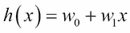

如果我们绘制这个图，我们可以看到它是一条在*w[0]处与 y 轴相交并且斜率为*w[1]的直线。线性模型的目的是找到将创建与数据最匹配的直线的参数值。我们称之为函数参数值。我们定义一个目标函数， *J [w]* ，我们希望最小化它:**

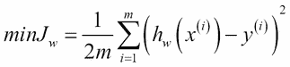

这里， *m* 为训练样本数，*h[w](x^((I)))*为第 *i ^(th)* 训练样本的估计值， *y ^i* 为其实际值。这是 *h，*的**成本函数**，因为它测量误差的成本；误差越大，成本越高。这种推导成本函数的方法有时被称为误差平方的**和，因为它对预测值和实际值之间的差异进行了求和。正如我们将会看到的，为了方便起见，这个总数减半。实际上有两种方法可以解决这个问题。我们可以使用迭代梯度下降算法，或者使用正规方程在一个步骤中最小化成本函数。我们先来看看梯度下降。**

## 梯度下降

当我们将参数值相对于成本函数作图时，我们得到一个碗形凸函数。随着参数值在任何方向偏离它们的优化值(从单个最小值)，我们的模型的成本增加。因为假设函数是线性的，所以成本函数是凸的。如果不是这样，那么将无法区分**全局**和**局部最小值**。

梯度下降算法由以下更新规则表示:


其中 *δ* 是*J[w]的一阶导数，因为它使用导数的符号来确定向哪个方向步进。这只是每一点切线斜率的符号。该算法采用一个超参数 *α* ，这是我们需要设置的学习率。它被称为 **超参数**，以区别于我们的模型估计的 *w* 参数。如果我们把学习率设置得太小，寻找最小值的时间会更长；如果设置得太高，就会过冲。我们可能会发现，我们需要多次运行模型来确定最佳学习率。*

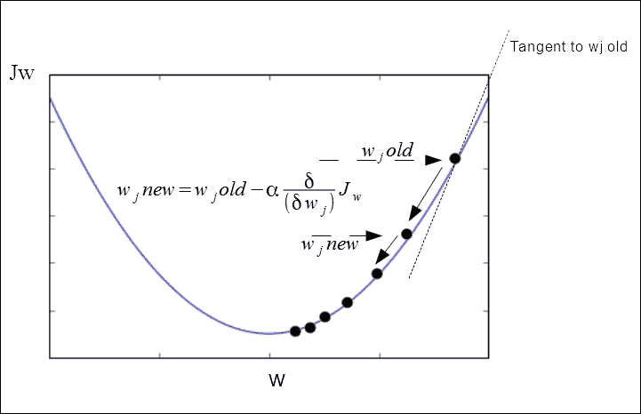

当我们将梯度下降应用于线性回归时，可以导出以下公式，这些公式是我们的模型的参数。我们可以重写导数项，使它更容易计算。推导本身相当复杂，在这里没有必要一一解释。如果你懂微积分，你会发现下面的规则是等价的。这里，我们使用停止函数对假设重复应用两个更新规则。这通常是当后续迭代中参数之间的差异低于阈值时，即 *t* 。

初始化*w[0]和*w[1]并重复:**


重要的是同时应用这些更新规则，也就是说，它们都在同一次迭代中应用，因此在下一次迭代中， *w [0]* 和 *w [1]* 的新值都被插回。这有时被称为**批次梯度下降**，因为它在一个*批次*中更新所有训练样本。

将这些更新规则应用于具有多个特征的线性回归问题是相当简单的。如果我们不担心精确的推导，这是真的。

对于多个特征，我们的假设函数将如下所示:


这里，添加 *x [0] = 1* ，通常称为我们的**偏置特征**，以帮助我们进行以下计算。我们可以看到，通过使用向量，我们也可以简单地将其写成参数值乘以特征值向量的转置， *x* 。对于多个特征梯度下降，我们的成本函数将应用于参数值的向量，而不仅仅是单个参数。这是新的成本函数。


*J(w)* 简单来说就是 *J(w [0] ，w [1] …，w [n] )* ，其中 *n* 是特征的个数。 *J* 是参数向量 *w* 的函数。现在，我们的梯度下降更新规则如下:


请注意，我们现在有多个特性。因此，我们用下标 *j* 写 *x* 值来表示 *j ^(th)* 特征。我们可以把它拆开来看，它确实代表了 *j + 1* 嵌套更新规则。除了下标之外，每一个都与我们用于单个特征的训练规则相同。

这里要提到的重要一点，也是我们将在后面的章节中再次讨论的一点是，为了使我们的模型更有效地工作，我们可以定义我们自己的特性。对于一个简单的情况，我们的假设是基于宽度和深度两个特征来估计一块土地的价格，显然，我们可以将这两个特征相乘得到一个特征，即面积。因此，根据您对某个问题的特定见解，使用衍生特征可能更有意义。我们可以进一步发展这个想法，创建我们自己的特征，使我们的模型能够适应非线性数据。做到这一点的技术是 **多项式回归**。这包括将幂项添加到我们的假设函数中，使其成为多项式。这里有一个例子:


在我们的土地价格示例中，一种应用方法是简单地添加我们的*区域*要素的平方和立方。这些项有许多可能的选择，事实上，在我们的住房例子中，更好的选择可能是取其中一项的平方根，以阻止函数爆炸到无穷大。这就凸显了一个重要的点，就是在使用多项式回归的时候，一定要非常小心特征缩放。我们可以看到，随着 *x* 变大，函数中的项也变得越来越大。

我们现在有一个模型来拟合非线性数据，然而，在这个阶段，我们只是手动尝试不同的多项式。理想情况下，我们需要能够在某种程度上在我们的模型中纳入特征选择，而不是让人类试图找出一个合适的函数。我们还需要意识到相关的特性可能会使我们的模型不稳定，所以我们需要设计出将相关的特性分解成它们的组件的方法。我们在[第 7 章](ch07.html "Chapter 7. Features – How Algorithms See the World")、*特性——算法如何看待世界*中来看这些方面。

下面是批量梯度下降的简单实现。尝试使用不同的学习率α值运行它，并在具有较大偏差和/或方差的数据上运行，并且在改变迭代次数之后运行，以查看这对我们的模型的性能有什么影响:

```py
import numpy as np
import random
import matplotlib.pyplot as plt

def gradientDescent(x, y, alpha, numIterations):
 xTrans = x.transpose()
 m, n = np.shape(x)
 theta = np.ones(n)
 for i in range(0, numIterations):
 hwx = np.dot(x, theta)
 loss = hwx - y
 cost = np.sum(loss ** 2) / (2 * m)
 print("Iteration %d | Cost: %f " % (i, cost))
 gradient = np.dot(xTrans, loss) / m
 theta = theta - alpha * gradient
 return theta

def genData(numPoints, bias, variance):
 x = np.zeros(shape=(numPoints, 2))
 y = np.zeros(shape=numPoints)
 for i in range(0, numPoints):
 x[i][0] = 1
 x[i][1] = i
 y[i] = (i + bias) + random.uniform(0, 1) * variance
 return x, y

def plotData(x,y,theta):
 plt.scatter(x[...,1],y)
 plt.plot(x[...,1],[theta[0] + theta[1]*xi for xi in x[...,1]])

x, y = genData(20, 25, 10)
iterations= 10000
alpha = 0.001
theta=gradientDescent(x,y,alpha,iterations)
plotData(x,y,theta)

```

代码的输出如下面的屏幕截图所示:

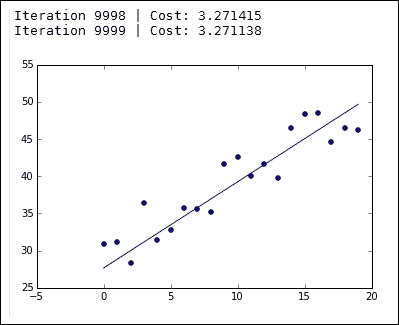

这被称为 **批量梯度下降**，因为在每次迭代中，它会基于所有训练样本一次更新参数值。另一方面，在**随机梯度下降**的情况下，梯度由一次单个示例的梯度来近似。在算法收敛之前，可以对数据进行几次处理。在每一次传递中，数据都被打乱以防止陷入循环。随机梯度下降已成功应用于大规模学习问题，如自然语言处理。缺点之一是它需要大量的超参数，尽管这确实为调整提供了机会，例如选择损失函数或应用的正则化类型。随机梯度下降也对特征缩放敏感。许多这样的实现，例如`Sklearn`包中的 **SGDClassifier** 和SGD regressor，将默认使用自适应学习速率。随着算法越来越接近最小值，这降低了学习率。为了使这些算法工作良好，通常需要缩放数据，以便输入向量中的每个值 *X* 在 0 和 1 之间或-1 和 1 之间缩放。或者，确保数据值的平均值为 0，方差为 1。使用来自`sklearn.preprocessing`的`StandardScaler`类最容易做到这一点。

梯度下降并不是唯一的算法，在很多方面，它也不是最小化代价函数的最有效的方法。有许多高级的库可以比我们手动实现梯度下降更新规则更有效地计算参数值。幸运的是，我们不必太担心细节，因为已经用 Python 编写了许多复杂而有效的回归算法。以为例，在`sklearn.linear_model`模块中，有**脊**、**套索**和 **弹性网**算法，这些算法可能会执行得更好，这取决于您的应用。

## 法线方程

现在让我们从一个稍微不同的角度来看线性回归问题。前面提到过，有一个数值解；因此，我们可以使用所谓的 **正规方程**来一步解决它，而不是像梯度下降那样迭代我们的训练集。如果你懂点微积分，你会记得我们可以通过求导来最小化一个函数，然后将导数设为零来求解一个变量。这是有意义的，因为如果我们考虑我们的凸成本函数，最小值将是切线斜率为零的地方。因此，在我们具有一个特征的简单例子中，我们相对于 *w* 对 *J(w)* 进行微分，并将其设置为零，然后求解 *w* 。我们感兴趣的问题是什么时候 *w* 是一个 *n +1* 参数向量，而代价函数 *J(w)* 是这个向量的函数。最小化这种情况的一种方法是依次对参数值取 *J(w)* 的偏导数，然后将这些导数设置为零，求解 *w* 的每个值。这为我们提供了最小化成本函数所需的 *w* 的值。

原来，一个简单的解决方法，可能是一个漫长而复杂的计算，是所谓的正常方程。为了了解其工作原理，我们首先定义一个特征矩阵，如下所示:


这通过 *n + 1* 矩阵创建了一个 *m* ，其中 *m* 是训练样本的数量， *n* 是特征的数量。注意，在我们的符号中，我们现在将训练标签向量定义如下:


现在，我们可以通过以下等式计算参数值，以最小化该成本函数:


这是正常方程。当然，在 Python 中有很多方法可以实现这一点。这里有一个使用 NumPy `matrix`类的简单方法。大多数实现将具有正则化参数，该参数尤其防止因试图转置奇异矩阵而产生的错误。当我们拥有的特征多于训练数据时，即当 *n* 大于 *m* 时，就会出现这种情况；没有正则化的正规方程是行不通的。这是因为矩阵 *X ^T X* 是不可转置的，所以，没有办法计算我们的项，*(X^TX)^(-1)*。正规化还有其他好处，我们很快就会看到:

```py
import numpy as np

def normDemo(la=.9):
 X = np.matrix('1 2 5 ; 1 4 6')
 y=np.matrix('8; 16')
 xtrans=X.T
 idx=np.matrix(np.identity(X.shape[1]))
 xti = (xtrans.dot(X)+la * idx).I
 xtidt = xti.dot(xtrans)
 return(xtidt.dot(y))

```

使用法线方程的一个优点是，您不需要担心特征缩放。具有不同范围的要素(例如，如果一个要素的值介于 1 和 10 之间，而另一个要素的值介于 0 和 1000 之间)可能会导致梯度下降问题。使用法线方程，你不需要担心这个。法线方程的另一个优点是你不需要选择学习率。我们看到，随着梯度下降。不正确选择的学习速率会使模型不必要地变慢，或者如果学习速率太大，会导致模型超过最小值。这可能需要在梯度下降的测试阶段增加一个额外的步骤。

正规方程有其特殊的缺点；最重要的是，当我们拥有包含大量特征的数据时，它不能很好地扩展。我们需要计算我们的特征矩阵的转置的逆矩阵， *X* 。该计算产生一个由 *n* 矩阵组成的 *n* 。记住 *n* 是特征的数量。这实际上意味着，在大多数平台上，矩阵求逆所需的时间大约是 n 的立方。因此，对于具有大量要素的数据，比如大于 10，000 个要素，您可能应该考虑使用梯度下降法，而不是正态方程。使用法方程时出现的另一个问题是，当我们的特征多于训练数据时，也就是当 *n* 大于 *m* 时，没有正则化的法方程就不起作用了。这是因为矩阵 *X ^T X* 是不可转置的，所以没有办法计算我们的项*(X^TX)^(-1)*。


# 逻辑回归

通过我们的最小平方模型，我们已经将其应用于解决最小化问题。我们也可以使用这种思想的变体来解决分类问题。考虑当我们将线性回归应用于分类问题时会发生什么。让我们以具有一个特征的二元分类的简单情况为例。我们可以对照 *y* 轴上的类别标签，在 *x* 轴上绘制我们的特征。我们的特征变量是连续的，但是我们在 *y* 轴上的目标变量是离散的。对于二元分类，我们通常用一个 *0* 表示负类，用一个 *1* 表示正类。我们通过数据构建一条回归线，并使用 y 轴上的阈值来估计决策边界。这里我们使用 0.5 的阈值。

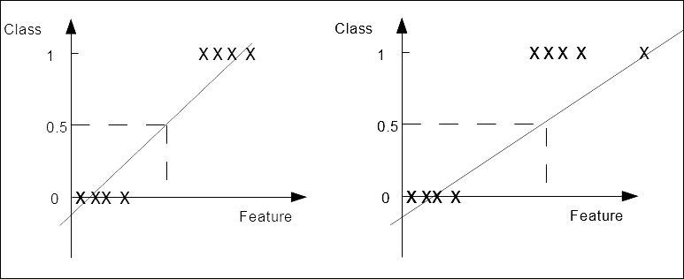

在左边的图中，方差很小，并且我们的阳性和阴性情况被很好地分开，我们得到了一个可接受的结果。该算法正确地对训练集进行分类。在右边的图像中，我们在数据中有一个异常值。这使得我们的回归线变得更平坦，并将截止线向右移动。明显属于类 *1* 的异常值不应该对模型的预测产生任何影响，但是，现在使用相同的截止点，预测将类 *1* 的第一个实例错误分类为类 *0* 。

我们处理这个问题的一个方法是用公式表达一个不同的假设。对于逻辑回归，我们将使用线性函数作为另一个函数 *g* 的输入。

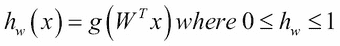

术语 *g* 被称为**s 形**或**逻辑函数**。你会从它的图中注意到，在y*轴上，它在 0 和 1 处有渐近线，它在 *0.5* 处与轴相交。*

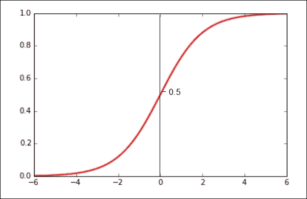

现在，如果我们用 *W ^T x* 代替 *z* ，我们可以这样重写我们的假设函数:

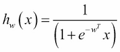

与线性回归一样，我们需要将参数 *w、*拟合到我们的训练数据中，以给出一个可以进行预测的函数。在我们尝试拟合模型之前，让我们看看如何解释假设函数的输出。因为这将返回一个介于 0 和 1 之间的数字，最自然的解释方式是它是正类的概率。因为我们知道或假设每个样本只能属于两类中的一类，那么正类的概率加上负类的概率必然等于 1。因此，如果我们可以估计正类，那么我们就可以估计负类的概率。因为我们最终是要预测特定样本的类别，所以如果假设函数的返回值大于或等于 0.5，我们可以将假设函数的输出解释为正，否则为负。现在，给定 sigmoid 函数的特征，我们可以写出以下内容:

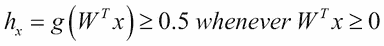

每当我们的假设函数在特定的训练样本上返回一个大于或等于零的数时，我们就可以预测一个正类。让我们看一个简单的例子。我们还没有将我们的参数拟合到这个模型，我们将很快这样做，但是为了这个例子，让我们假设我们有一个参数向量如下:

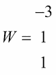

因此，我们的假设函数看起来像这样:

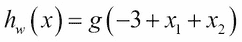

如果满足以下条件，我们可以预测 *y = 1* :

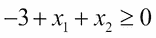

等效地:

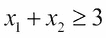

这可以用下图来表示:


这简直就是 *x=3* 和 *y=3* 之间的一条直线，它代表**决策边界**。它创建了两个区域，我们在其中预测 *y = 0* 或 *y = 1* 。当判定边界不是一条直线时会发生什么？与我们在线性回归中向假设函数添加多项式的方式相同，我们也可以在逻辑回归中这样做。让我们用一些高阶项编写一个新的假设函数，看看我们如何使它适合数据:


这里我们在函数中加入了两个平方项。我们将很快看到如何拟合参数，但现在，让我们设置我们的参数向量如下:


所以，我们现在可以写出如下内容:

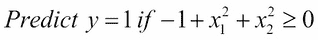

或者，我们可以这样写:

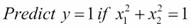

你可能知道，这是一个以原点为圆心的圆的方程，我们可以用它作为判定边界。我们可以通过增加高阶多项式项来创建更复杂的决策边界。

## 用于逻辑回归的成本函数

现在，我们需要查看将参数与数据相匹配的重要任务。如果我们更简单地重写用于线性回归的成本函数，我们可以看到成本是误差平方的一半:


解释是，它只是在给定某个预测，即 *h [w] (x)* ，以及一个训练标签 *y* 的情况下，计算我们希望模型招致的成本。

这将在一定程度上与逻辑回归一起工作，但是，有一个问题。使用逻辑回归，我们的假设函数依赖于非线性 sigmoid 函数，当我们针对我们的参数绘制它时，它通常会产生一个非凸的函数。这意味着，当我们试图将诸如梯度下降的算法应用于成本函数时，它不一定会收敛到全局最小值。一种解决方案是定义一个凸的成本函数，结果是以下两个函数(每个类一个)适合我们的目的:

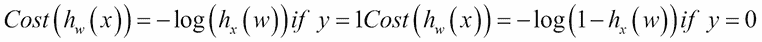

这为我们提供了以下图表:

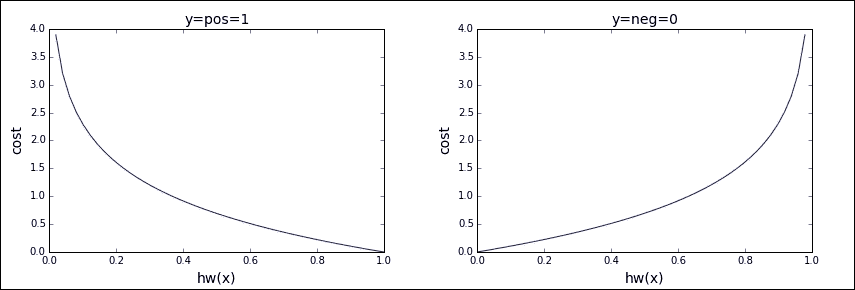

直观地说，我们可以看到它做了我们需要它做的事情。如果我们考虑在正类中的单个训练样本，即 *y = 1* ，并且如果我们的假设函数 *h [w] (x)* 正确预测了 *1* ，那么代价，正如你所料，是 *0* 。假设函数的输出如果是 *0* 则是不正确的，所以代价趋近于无穷大。当 *y* 在负类时，我们的代价函数就是右图。这里当 *h [w] (x)* 为 *0* 时成本为零，当 *h [w] (x)* 为 *1* 时成本上升到无穷大。我们可以用更简洁的方式来写，记住 *y* 要么是 *0* 要么是 *1* :


我们可以看到，对于每种可能性， *y=1* 或 *y=0* ，不相关的项被乘以 *0* ，从而为每种特定情况留下正确的项。因此，现在我们可以将成本函数写成如下形式:

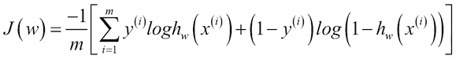

所以，如果给我们一个新的，未标记的值 *x* ，我们如何做预测呢？与线性回归一样，我们的目标是最小化成本函数 *J(w)* 。我们可以使用与我们用于线性回归的相同的更新规则，即使用偏导数来寻找斜率，当我们重写导数时，我们得到以下结果:

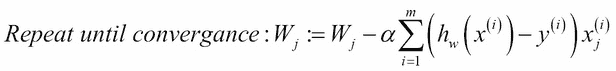

# 多类分类

到目前为止，我们只是看了二进制分类。对于多类分类，我们假设每个实例只属于一个类。一个稍微不同的分类问题是每个样本可以属于多个目标类。这叫做多标签分类。我们可以对每一类问题采用类似的策略。

有两种基本方法:

*   一个对所有
*   一对多

在一个对所有的方法中，一个单一的多类问题被转化为许多二元分类问题。这被称为 **一个对所有**技术，因为我们依次选择每个类并为该特定类拟合一个假设函数，将一个负类分配给其他类。我们最终得到不同的分类器，每个分类器都被训练来识别其中一个类别。在给定新输入的情况下，我们通过运行所有分类器并挑选预测概率最高的分类器来进行预测。为了使它形式化，我们编写了以下代码:


为了进行预测，我们选择最大化以下内容的类:

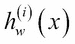

使用另一种方法称为**一对一**方法，为每对类构建一个分类器。当模型做出预测时，获得最多投票的班级获胜。这种方法通常比一对多方法慢，尤其是当有大量的类时。

所有 Sklearn 分类器都实现多类分类。我们在[第 2 章](ch02.html "Chapter 2. Tools and Techniques")、*工具和技术*中看到了这一点，其中有一个 K-最近邻示例，我们试图使用 iris 数据集预测三个类中的一个。Sklearn 使用`OneVsRestClassifier`类实现一对一算法，使用`OneVsOneClassifier`实现一对一算法。这些称为**元估计量**，因为它们将另一个估计量作为输入。它们的优势在于能够允许改变两个以上类的处理方式，这可以在计算效率或泛化误差方面带来更好的性能。

在下面的例子中，我们使用 SVC:

```py
from sklearn import datasets
from sklearn.multiclass import OneVsRestClassifier, OneVsOneClassifier
from sklearn.svm import LinearSVC

X,y = datasets.make_classification(n_samples=10000, n_features=5)
X1,y1 = datasets.make_classification(n_samples=10000, n_features=5)
clsAll=OneVsRestClassifier(LinearSVC(random_state=0)).fit(X, y)
clsOne=OneVsOneClassifier(LinearSVC(random_state=0)).fit(X1, y1)
print("One vs all cost= %f" % clsAll.score(X,y))
print("One vs one cost= %f" % clsOne.score(X1,y1))

```

我们将观察到以下输出:

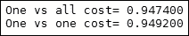

# 正规化

我们之前提到过,线性回归可能变得不稳定，也就是说，如果特征是相关的，那么它对训练数据的微小变化高度敏感。考虑两个特征完全负相关的极端情况，即一个特征的任何增加都伴随着另一个特征的同等减少。当我们将我们的线性回归算法仅应用于这两个特征时，它将产生一个恒定的函数，因此这并不能真正告诉我们关于数据的任何信息。或者，如果特征是正相关的，它们的微小变化将被放大。正规化有助于缓和这种情况。

我们之前看到，通过添加多项式项，我们可以使我们的假设更接近于训练数据。随着我们添加这些项，函数的形状变得更加复杂，这通常会导致假设过度拟合训练数据，并且在测试数据上表现不佳。当我们添加特征时，无论是直接来自数据还是我们自己获得的特征，模型将更有可能过度拟合数据。一种方法是丢弃我们认为不太重要的特征。然而，我们无法预先确定哪些特征可能包含相关信息。一个更好的方法是不丢弃特性，而是缩小它们。由于我们不知道每个特征包含多少信息，正则化减少了所有参数的数量。

我们可以简单地把这一项加到成本函数中。


超参数 **lambda，**控制两个目标之间的权衡——需要拟合训练数据，需要保持参数较小以避免过度拟合。我们没有将正则化参数应用于我们的偏差特征，因此我们为第一个特征分离更新规则，并为所有后续特征添加正则化参数。我们可以这样写:


这里，加入了我们的正则项， *λ w [j] /m* 。为了更清楚地了解这是如何工作的，我们可以将依赖于 *wj* 的所有术语分组，我们的更新规则可以重写如下:

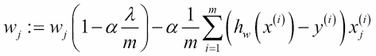

正则化参数 *λ* 通常是一个大于零的小数值。为了达到预期的效果，设定 *α λ /m* 为略小于 *1* 的数值。这将在更新的每次迭代中收缩*w[j]。*

现在，让我们看看如何将正则化应用于法线方程。方程式如下:

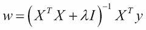

这有时被称为T21 封闭形式解决方案。我们添加乘以正则化参数的单位矩阵 *I* 。单位矩阵是一个 *(n+1)* 乘 *(n+1)* 的矩阵，由主对角线上的 1 和其他地方的 0 组成。

在一些实现方式中，我们还可以使矩阵零的第一个条目(左上角)反映我们没有将正则化参数应用于第一偏差特征的事实。然而，在实践中，这很少会对我们的模型产生很大的影响。

当我们将其与单位矩阵相乘时，我们得到一个矩阵，其中主对角线包含 *λ* 的值，其他所有位置为零。这确保了即使我们的特征多于训练样本，我们仍然能够对矩阵 *X ^T X* 求逆。如果我们有相关的变量，这也会使我们的模型更加稳定。这种形式的回归有时被称为脊形回归，我们在第 2 章的工具和技术中看到了它的实现。岭回归的一个有趣的替代方法是 **套索回归**。它用 *∑i | wi |* 代替了岭回归正则项 *∑iwi 2* 。也就是说，它不是使用权重的平方和，而是使用权重平均值的和。结果是一些权重被设置为 *0* 而其他权重被缩小。Lasso 回归往往对正则化参数非常敏感。与岭回归不同，套索回归没有封闭形式的解，因此需要采用其他形式的数值优化。岭回归有时被称为使用 **L2 规范、**拉索正规化、 **L1 规范**。

最后，我们将看看如何将正则化应用于逻辑回归。与线性回归一样，如果我们的假设函数包含高阶项或许多特征，逻辑回归也会遇到同样的过度拟合问题。我们可以修改逻辑回归成本函数来添加正则化参数，如下所示:


为了实现逻辑回归的梯度下降，我们最终得到一个方程，从表面上看，它与我们用于线性回归梯度下降的方程相同。然而，我们必须记住，我们的假设函数是我们用于逻辑回归的函数。

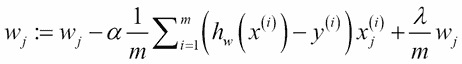

使用假设函数，我们得到以下结果:

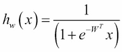

# 总结

在这一章中，我们学习了机器学习中一些最常用的技术。我们为线性和逻辑回归创建了假设表示。您了解了如何创建一个成本函数来测量假设对训练数据的性能，以及如何使用梯度下降和正态方程来最小化成本函数以拟合参数。我们展示了如何通过在假设函数中使用多项式来拟合非线性数据。最后，我们看了正则化，它的用途，以及如何将其应用于逻辑和线性回归。

这些是在许多不同的机器学习算法中广泛使用的强大技术。然而，正如你可能已经意识到的，这个故事还有更多。到目前为止，我们所看到的模型通常需要大量的人工干预才能有效运行。例如，我们必须设置超参数，如学习率或正则化参数，并且，在非线性数据的情况下，我们必须尝试并找到将迫使我们的假设符合数据的多项式项。很难准确地确定这些术语是什么，尤其是当我们有许多功能时。在下一章中，我们将着眼于驱动这个星球上一些最强大的学习算法的思想，即神经网络。