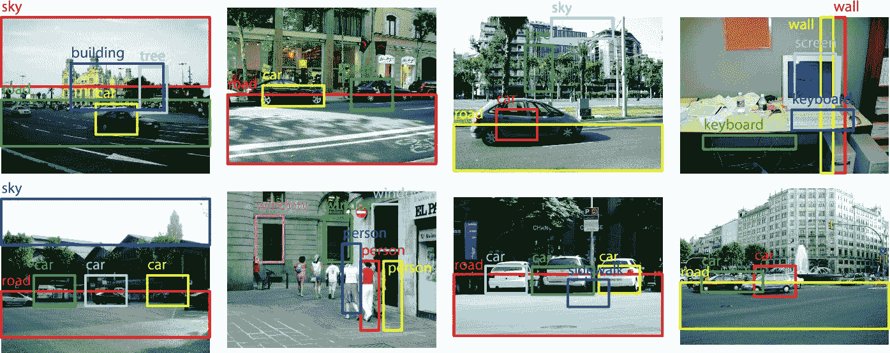
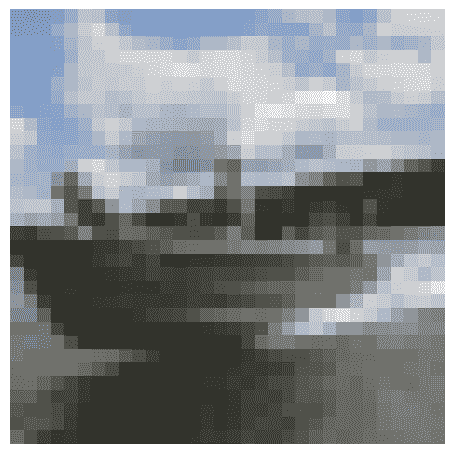

# 八、目标检测——CIFAR-10 示例

在介绍了基础知识和**卷积神经网络**(**CNN**)背后的直觉/动机之后，我们将在可用于目标检测的最流行的数据集之一上演示这一点。我们还将看到 CNN 的初始层如何获得关于我们对象的非常基本的特征，但最终的卷积层将获得更多的语义级特征，这些特征是从第一层中的那些基本特征建立起来的。

本章将涵盖以下主题:

*   目标检测
*   CIFAR-10 mages 中的目标探测—模型建立和训练


# 目标检测

维基百科称:

“目标检测——计算机视觉领域中用于在图像或视频序列中寻找和识别对象的技术。尽管目标的图像在不同的观察点、许多不同的尺寸和比例或者甚至当它们被平移或旋转时会有所不同，但是人类可以毫不费力地识别图像中的大量目标。当目标被部分遮挡时，它们甚至可以被识别。这项任务对于计算机视觉系统来说仍然是一个挑战。几十年来，已经实现了许多方法来完成这项任务。”

图像分析是深度学习中最突出的领域之一。图像很容易生成和处理，它们正是机器学习的正确数据类型:对人类来说容易理解，但对计算机来说很难。毫不奇怪，图像分析在深度神经网络的历史中发挥了关键作用。



图 11.1:探测目标的例子。资料来源:B. C. Russell，A. Torralba，C. Liu，R. Fergus，W. T. Freeman，场景对齐的目标检测，神经信息处理系统进展，2007，网址:http://Bryan Russell . org/papers/nipsdetectionbyscenealignment 07 . pdf

随着自动驾驶汽车、面部检测、智能视频监控和人数统计解决方案的兴起，快速准确的目标检测系统需求很大。这些系统不仅包括图像中的对象识别和分类，还可以通过在它们周围画出适当的方框来定位它们中的每一个。这使得目标检测比其传统的计算机视觉前身图像分类更难。

在这一章中，我们将研究目标检测——找出图像中的对象。举个例子，想象一下一辆自动驾驶汽车需要像*图 11.1* 中那样检测路上的其他汽车。目标检测有很多复杂的算法。它们通常需要庞大的数据集、非常深的卷积网络和很长的训练时间。


# CIFAR-10–建模、建造和培训

这个例子展示了如何创建一个 CNN 来对 CIFAR-10 数据集中的图像进行分类。我们将使用一个简单的卷积神经网络实现几个卷积和完全连接的层。

尽管网络架构非常简单，但您将会看到它在尝试检测 CIFAR-10 图像中的对象时表现如何。

所以，让我们从这个实现开始。


# 用过的包装

我们为此实现导入了所有必需的包:

```py
%matplotlib inline
%config InlineBackend.figure_format = 'retina'

from urllib.request import urlretrieve
from os.path import isfile, isdir
from tqdm import tqdm
import tarfile
import numpy as np
import random
import matplotlib.pyplot as plt
from sklearn.preprocessing import LabelBinarizer
from sklearn.preprocessing import OneHotEncoder

import pickle
import tensorflow as tf
```


# 加载 CIFAR-10 数据集

在这个实现中，我们将使用 CIFAR-10，它是用于目标检测的最广泛使用的数据集之一。因此，让我们首先定义一个助手类来下载和提取 CIFAR-10 数据集(如果尚未下载的话):

```py
cifar10_batches_dir_path = 'cifar-10-batches-py'

tar_gz_filename = 'cifar-10-python.tar.gz'

class DLProgress(tqdm):
    last_block = 0

    def hook(self, block_num=1, block_size=1, total_size=None):
        self.total = total_size
        self.update((block_num - self.last_block) * block_size)
        self.last_block = block_num

if not isfile(tar_gz_filename):
    with DLProgress(unit='B', unit_scale=True, miniters=1, desc='CIFAR-10 Python Images Batches') as pbar:
        urlretrieve(
            'https://www.cs.toronto.edu/~kriz/cifar-10-python.tar.gz',
            tar_gz_filename,
            pbar.hook)

if not isdir(cifar10_batches_dir_path):
    with tarfile.open(tar_gz_filename) as tar:
        tar.extractall()
        tar.close()
```

下载并提取 CIFAR-10 数据集后，您会发现它已经被分成了五批。CIFAR-10 包含 10 个类别的图像:

*   `airplane`
*   `automobile`
*   `bird`
*   `cat`
*   `deer`
*   `dog`
*   `frog`
*   `horse`
*   `ship`
*   `truck`

在我们深入构建网络核心之前，让我们做一些数据分析和预处理。


# 数据分析和预处理

我们需要分析数据集并做一些基本的预处理。因此，让我们从定义一些帮助函数开始，这些函数将使我们能够从我们拥有的五个批次中加载一个特定的批次，并打印关于该批次及其样本的一些分析:

```py
# Defining a helper function for loading a batch of images
def load_batch(cifar10_dataset_dir_path, batch_num):

    with open(cifar10_dataset_dir_path + '/data_batch_' + str(batch_num), mode='rb') as file:
        batch = pickle.load(file, encoding='latin1')

    input_features = batch['data'].reshape((len(batch['data']), 3, 32, 32)).transpose(0, 2, 3, 1)
    target_labels = batch['labels']

    return input_features, target_labels
```

然后，我们定义一个函数，它可以帮助我们显示特定批次中特定样本的统计数据:

```py
#Defining a function to show the stats for batch ans specific sample
def batch_image_stats(cifar10_dataset_dir_path, batch_num, sample_num):

    batch_nums = list(range(1, 6))

    #checking if the batch_num is a valid batch number
    if batch_num not in batch_nums:
        print('Batch Num is out of Range. You can choose from these Batch nums: {}'.format(batch_nums))
        return None

    input_features, target_labels = load_batch(cifar10_dataset_dir_path, batch_num)

    #checking if the sample_num is a valid sample number
    if not (0 <= sample_num < len(input_features)):
        print('{} samples in batch {}. {} is not a valid sample number.'.format(len(input_features), batch_num, sample_num))
        return None

    print('\nStatistics of batch number {}:'.format(batch_num))
    print('Number of samples in this batch: {}'.format(len(input_features)))
    print('Per class counts of each Label: {}'.format(dict(zip(*np.unique(target_labels, return_counts=True)))))

    image = input_features[sample_num]
    label = target_labels[sample_num]
    cifar10_class_names = ['airplane', 'automobile', 'bird', 'cat', 'deer', 'dog', 'frog', 'horse', 'ship', 'truck']

    print('\nSample Image Number {}:'.format(sample_num))
    print('Sample image - Minimum pixel value: {} Maximum pixel value: {}'.format(image.min(), image.max()))
    print('Sample image - Shape: {}'.format(image.shape))
    print('Sample Label - Label Id: {} Name: {}'.format(label, cifar10_class_names[label]))
    plt.axis('off')
    plt.imshow(image)
```

现在，我们可以使用该函数来处理数据集并可视化特定图像:

```py
# Explore a specific batch and sample from the dataset
batch_num = 3
sample_num = 6
batch_image_stats(cifar10_batches_dir_path, batch_num, sample_num)
```

输出如下所示:

```py

Statistics of batch number 3:
Number of samples in this batch: 10000
Per class counts of each Label: {0: 994, 1: 1042, 2: 965, 3: 997, 4: 990, 5: 1029, 6: 978, 7: 1015, 8: 961, 9: 1029}

Sample Image Number 6:
Sample image - Minimum pixel value: 30 Maximum pixel value: 242
Sample image - Shape: (32, 32, 3)
Sample Label - Label Id: 8 Name: ship
```



图 11.2:来自批次 3 的样本图像 6

在将我们的数据集输入模型之前，我们需要将其归一化到 0 到 1 的范围内。

批量归一化优化网络训练。已经证明它有几个好处:

*   **更快的训练**:由于网络前向传递过程中的额外计算和网络后向传递过程中要训练的额外超参数，每个训练步骤都会更慢。然而，它应该收敛得更快，所以训练应该更快。
*   **更高的学习速率**:梯度下降算法主要要求网络以较小的学习速率收敛到损失函数的最小值。随着神经网络越来越深，它们的梯度值在反向传播过程中变得越来越小，因此它们通常需要更多的迭代。使用批量标准化的思想允许我们使用更高的学习率，这进一步提高了网络训练的速度。
*   **易于初始化权重**:权重初始化可能会比较困难，如果我们使用深度神经网络的话会更加困难。批量标准化似乎允许我们在选择初始权重时不那么小心。

因此，让我们通过定义一个函数来对输入图像列表进行归一化，使这些图像的所有像素值都在 0 和 1 之间:

```py
#Normalize CIFAR-10 images to be in the range of [0,1]

def normalize_images(images):

    # initial zero ndarray
    normalized_images = np.zeros_like(images.astype(float))

    # The first images index is number of images where the other indices indicates
    # hieight, width and depth of the image
    num_images = images.shape[0]

    # Computing the minimum and maximum value of the input image to do the normalization based on them
    maximum_value, minimum_value = images.max(), images.min()

    # Normalize all the pixel values of the images to be from 0 to 1
    for img in range(num_images):
        normalized_images[img,...] = (images[img, ...] - float(minimum_value)) / float(maximum_value - minimum_value)

    return normalized_images
```

接下来，我们需要实现另一个助手函数来编码输入图像的标签。在这个函数中，我们将使用 sklearn 的一键编码，其中每个图像标签由一个零向量表示，除了这个向量所表示的图像的类索引。

输出向量的大小将取决于我们在数据集中拥有的类的数量，在 CIFAR-10 数据的情况下是 10 个类:

```py
#encoding the input images. Each image will be represented by a vector of zeros except for the class index of the image 
# that this vector represents. The length of this vector depends on number of classes that we have
# the dataset which is 10 in CIFAR-10

def one_hot_encode(images):

    num_classes = 10

    #use sklearn helper function of OneHotEncoder() to do that
    encoder = OneHotEncoder(num_classes)

    #resize the input images to be 2D
    input_images_resized_to_2d = np.array(images).reshape(-1,1)
    one_hot_encoded_targets = encoder.fit_transform(input_images_resized_to_2d)

    return one_hot_encoded_targets.toarray()
```

现在，是时候调用前面的帮助器函数来进行预处理并持久化数据集，以便我们以后可以使用它:

```py
def preprocess_persist_data(cifar10_batches_dir_path, normalize_images, one_hot_encode):

    num_batches = 5
    valid_input_features = []
    valid_target_labels = []

    for batch_ind in range(1, num_batches + 1):

        #Loading batch
        input_features, target_labels = load_batch(cifar10_batches_dir_path, batch_ind)
        num_validation_images = int(len(input_features) * 0.1)

        # Preprocess the current batch and perisist it for future use
        input_features = normalize_images(input_features[:-num_validation_images])
        target_labels = one_hot_encode( target_labels[:-num_validation_images])

        #Persisting the preprocessed batch
        pickle.dump((input_features, target_labels), open('preprocess_train_batch_' + str(batch_ind) + '.p', 'wb'))

        # Define a subset of the training images to be used for validating our model
        valid_input_features.extend(input_features[-num_validation_images:])
        valid_target_labels.extend(target_labels[-num_validation_images:])

    # Preprocessing and persisting the validationi subset
    input_features = normalize_images( np.array(valid_input_features))
    target_labels = one_hot_encode(np.array(valid_target_labels))

    pickle.dump((input_features, target_labels), open('preprocess_valid.p', 'wb'))

    #Now it's time to preporcess and persist the test batche
    with open(cifar10_batches_dir_path + '/test_batch', mode='rb') as file:
        test_batch = pickle.load(file, encoding='latin1')

    test_input_features = test_batch['data'].reshape((len(test_batch['data']), 3, 32, 32)).transpose(0, 2, 3, 1)
    test_input_labels = test_batch['labels']

    # Normalizing and encoding the test batch
    input_features = normalize_images( np.array(test_input_features))
    target_labels = one_hot_encode(np.array(test_input_labels))

    pickle.dump((input_features, target_labels), open('preprocess_test.p', 'wb'))

# Calling the helper function above to preprocess and persist the training, validation, and testing set
preprocess_persist_data(cifar10_batches_dir_path, normalize_images, one_hot_encode)
```

因此，我们将预处理后的数据保存到磁盘上。

我们还需要加载验证集，以便在训练过程的不同时期在其上运行训练模型:

```py
# Load the Preprocessed Validation data
valid_input_features, valid_input_labels = pickle.load(open('preprocess_valid.p', mode='rb'))
```


# 构建网络

现在是时候构建我们的分类应用程序的核心了，这是这个 CNN 架构的计算图，但是为了最大化这个实现的好处，我们不打算使用 TensorFlow layers API。相反，我们将使用它的TensorFlow神经网络版本。

因此，让我们从定义模型输入占位符开始，这些占位符将输入图像、目标类和丢弃层的保持概率参数(这有助于我们通过丢弃一些连接来降低架构的复杂性，从而减少过度拟合的机会):

```py

# Defining the model inputs
def images_input(img_shape):
 return tf.placeholder(tf.float32, (None, ) + img_shape, name="input_images")

def target_input(num_classes):

 target_input = tf.placeholder(tf.int32, (None, num_classes), name="input_images_target")
 return target_input

#define a function for the dropout layer keep probability
def keep_prob_input():
 return tf.placeholder(tf.float32, name="keep_prob")
```

接下来，我们需要使用 TensorFlow 神经网络实现版本来构建具有最大池的卷积层:

```py
# Applying a convolution operation to the input tensor followed by max pooling
def conv2d_layer(input_tensor, conv_layer_num_outputs, conv_kernel_size, conv_layer_strides, pool_kernel_size, pool_layer_strides):

 input_depth = input_tensor.get_shape()[3].value
 weight_shape = conv_kernel_size + (input_depth, conv_layer_num_outputs,)

 #Defining layer weights and biases
 weights = tf.Variable(tf.random_normal(weight_shape))
 biases = tf.Variable(tf.random_normal((conv_layer_num_outputs,)))

 #Considering the biase variable
 conv_strides = (1,) + conv_layer_strides + (1,)

 conv_layer = tf.nn.conv2d(input_tensor, weights, strides=conv_strides, padding='SAME')
 conv_layer = tf.nn.bias_add(conv_layer, biases)

 conv_kernel_size = (1,) + conv_kernel_size + (1,)

 pool_strides = (1,) + pool_layer_strides + (1,)
 pool_layer = tf.nn.max_pool(conv_layer, ksize=conv_kernel_size, strides=pool_strides, padding='SAME')
 return pool_layer
```

正如您可能在前一章中看到的，最大池化操作的输出是一个 4D 张量，它与完全连接的层所需的输入格式不兼容。因此，我们需要实现一个展平图层，将 max pooling 图层的输出从 4D 张量转换为 2D 张量:

```py
#Flatten the output of max pooling layer to be fing to the fully connected layer which only accepts the output
# to be in 2D
def flatten_layer(input_tensor):
return tf.contrib.layers.flatten(input_tensor)
```

接下来，我们需要定义一个助手函数，使我们能够将一个完全连接的层添加到我们的架构中:

```py
#Define the fully connected layer that will use the flattened output of the stacked convolution layers
#to do the actuall classification
def fully_connected_layer(input_tensor, num_outputs):
 return tf.layers.dense(input_tensor, num_outputs)
```

最后，在使用这些辅助函数创建整个架构之前，我们需要创建另一个辅助函数，该辅助函数将获取完全连接层的输出，并根据数据集中的类数量生成 10 个实数值:

```py
#Defining the output function
def output_layer(input_tensor, num_outputs):
    return  tf.layers.dense(input_tensor, num_outputs)
```

因此，让我们继续定义函数，将所有这些零碎信息放在一起，创建一个具有三个卷积层的 CNN。每个操作之后都有最大池操作。我们还将有两个完全连接的层，其中每一层后面都有一个下降层，以降低模型的复杂性并防止过度拟合。最后，我们将让输出层产生 10 个实值向量，其中每个值代表每个正确类的分数:

```py
def build_convolution_net(image_data, keep_prob):

 # Applying 3 convolution layers followed by max pooling layers
 conv_layer_1 = conv2d_layer(image_data, 32, (3,3), (1,1), (3,3), (3,3)) 
 conv_layer_2 = conv2d_layer(conv_layer_1, 64, (3,3), (1,1), (3,3), (3,3))
 conv_layer_3 = conv2d_layer(conv_layer_2, 128, (3,3), (1,1), (3,3), (3,3))

# Flatten the output from 4D to 2D to be fed to the fully connected layer
 flatten_output = flatten_layer(conv_layer_3)

# Applying 2 fully connected layers with drop out
 fully_connected_layer_1 = fully_connected_layer(flatten_output, 64)
 fully_connected_layer_1 = tf.nn.dropout(fully_connected_layer_1, keep_prob)
 fully_connected_layer_2 = fully_connected_layer(fully_connected_layer_1, 32)
 fully_connected_layer_2 = tf.nn.dropout(fully_connected_layer_2, keep_prob)

 #Applying the output layer while the output size will be the number of categories that we have
 #in CIFAR-10 dataset
 output_logits = output_layer(fully_connected_layer_2, 10)

 #returning output
 return output_logits
```

让我们调用前面的帮助函数来构建网络，并定义其损耗和优化标准:

```py
#Using the helper function above to build the network

#First off, let's remove all the previous inputs, weights, biases form the previous runs
tf.reset_default_graph()

# Defining the input placeholders to the convolution neural network
input_images = images_input((32, 32, 3))
input_images_target = target_input(10)
keep_prob = keep_prob_input()

# Building the models
logits_values = build_convolution_net(input_images, keep_prob)

# Name logits Tensor, so that is can be loaded from disk after training
logits_values = tf.identity(logits_values, name='logits')

# defining the model loss
model_cost = tf.reduce_mean(tf.nn.softmax_cross_entropy_with_logits(logits=logits_values, labels=input_images_target))

# Defining the model optimizer
model_optimizer = tf.train.AdamOptimizer().minimize(model_cost)

# Calculating and averaging the model accuracy
correct_prediction = tf.equal(tf.argmax(logits_values, 1), tf.argmax(input_images_target, 1))
accuracy = tf.reduce_mean(tf.cast(correct_prediction, tf.float32), name='model_accuracy')
tests.test_conv_net(build_convolution_net)
```

现在我们已经建立了这个网络的计算架构，是时候开始训练过程并看到一些结果了。


# 模特培训

因此，让我们定义一个助手函数，它将使我们能够开始训练过程。该函数将输入图像、目标类的一键编码和保持概率值作为输入。然后，它会将这些值提供给计算图形，并调用模型优化器:

```py
#Define a helper function for kicking off the training process
def train(session, model_optimizer, keep_probability, in_feature_batch, target_batch):
session.run(model_optimizer, feed_dict={input_images: in_feature_batch, input_images_target: target_batch, keep_prob: keep_probability})
```

我们将需要在训练过程的不同时间步骤中验证我们的模型，因此我们将定义一个助手函数，它将在验证集上打印出模型的准确性:

```py
#Defining a helper funcitno for print information about the model accuracy and it's validation accuracy as well
def print_model_stats(session, input_feature_batch, target_label_batch, model_cost, model_accuracy):

    validation_loss = session.run(model_cost, feed_dict={input_images: input_feature_batch, input_images_target: target_label_batch, keep_prob: 1.0})
    validation_accuracy = session.run(model_accuracy, feed_dict={input_images: input_feature_batch, input_images_target: target_label_batch, keep_prob: 1.0})

    print("Valid Loss: %f" %(validation_loss))
    print("Valid accuracy: %f" % (validation_accuracy))
```

让我们也定义模型超参数，我们可以用它来调整模型以获得更好的性能:

```py
# Model Hyperparameters
num_epochs = 100
batch_size = 128
keep_probability = 0.5
```

现在，让我们开始训练过程，但只针对一批 CIFAR-10 数据集，看看基于这一批的模型精度如何。

但是，在此之前，我们将定义一个助手函数，该函数将加载一个批处理训练，并将输入图像与目标类分开:

```py
# Splitting the dataset features and labels to batches
def batch_split_features_labels(input_features, target_labels, train_batch_size):
    for start in range(0, len(input_features), train_batch_size):
        end = min(start + train_batch_size, len(input_features))
        yield input_features[start:end], target_labels[start:end]

#Loading the persisted preprocessed training batches
def load_preprocess_training_batch(batch_id, batch_size):
    filename = 'preprocess_train_batch_' + str(batch_id) + '.p'
    input_features, target_labels = pickle.load(open(filename, mode='rb'))

    # Returning the training images in batches according to the batch size defined above
    return batch_split_features_labels(input_features, target_labels, train_batch_size)
```

现在，让我们开始一批的训练过程:

```py
print('Training on only a Single Batch from the CIFAR-10 Dataset...')
with tf.Session() as sess:

 # Initializing the variables
 sess.run(tf.global_variables_initializer())

 # Training cycle
 for epoch in range(num_epochs):
 batch_ind = 1

 for batch_features, batch_labels in load_preprocess_training_batch(batch_ind, batch_size):
 train(sess, model_optimizer, keep_probability, batch_features, batch_labels)

 print('Epoch number {:>2}, CIFAR-10 Batch Number {}: '.format(epoch + 1, batch_ind), end='')
 print_model_stats(sess, batch_features, batch_labels, model_cost, accuracy)

Output:
.
.
.
Epoch number 85, CIFAR-10 Batch Number 1: Valid Loss: 1.490792
Valid accuracy: 0.550000
Epoch number 86, CIFAR-10 Batch Number 1: Valid Loss: 1.487118
Valid accuracy: 0.525000
Epoch number 87, CIFAR-10 Batch Number 1: Valid Loss: 1.309082
Valid accuracy: 0.575000
Epoch number 88, CIFAR-10 Batch Number 1: Valid Loss: 1.446488
Valid accuracy: 0.475000
Epoch number 89, CIFAR-10 Batch Number 1: Valid Loss: 1.430939
Valid accuracy: 0.550000
Epoch number 90, CIFAR-10 Batch Number 1: Valid Loss: 1.484480
Valid accuracy: 0.525000
Epoch number 91, CIFAR-10 Batch Number 1: Valid Loss: 1.345774
Valid accuracy: 0.575000
Epoch number 92, CIFAR-10 Batch Number 1: Valid Loss: 1.425942
Valid accuracy: 0.575000

Epoch number 93, CIFAR-10 Batch Number 1: Valid Loss: 1.451115
Valid accuracy: 0.550000
Epoch number 94, CIFAR-10 Batch Number 1: Valid Loss: 1.368719
Valid accuracy: 0.600000
Epoch number 95, CIFAR-10 Batch Number 1: Valid Loss: 1.336483
Valid accuracy: 0.600000
Epoch number 96, CIFAR-10 Batch Number 1: Valid Loss: 1.383425
Valid accuracy: 0.575000
Epoch number 97, CIFAR-10 Batch Number 1: Valid Loss: 1.378877
Valid accuracy: 0.625000
Epoch number 98, CIFAR-10 Batch Number 1: Valid Loss: 1.343391
Valid accuracy: 0.600000
Epoch number 99, CIFAR-10 Batch Number 1: Valid Loss: 1.319342
Valid accuracy: 0.625000
Epoch number 100, CIFAR-10 Batch Number 1: Valid Loss: 1.340849
Valid accuracy: 0.525000
```

如您所见，仅在单个批次上训练时，验证准确性并不是很好。让我们看看仅基于模型的完整训练过程，验证准确性将如何变化:

```py
model_save_path = './cifar-10_classification'

with tf.Session() as sess:
 # Initializing the variables
 sess.run(tf.global_variables_initializer())

 # Training cycle
 for epoch in range(num_epochs):

 # iterate through the batches
 num_batches = 5

 for batch_ind in range(1, num_batches + 1):
 for batch_features, batch_labels in load_preprocess_training_batch(batch_ind, batch_size):
 train(sess, model_optimizer, keep_probability, batch_features, batch_labels)

 print('Epoch number{:>2}, CIFAR-10 Batch Number {}: '.format(epoch + 1, batch_ind), end='')
 print_model_stats(sess, batch_features, batch_labels, model_cost, accuracy)

 # Save the trained Model
 saver = tf.train.Saver()
 save_path = saver.save(sess, model_save_path)

Output:
.
.
.
Epoch number94, CIFAR-10 Batch Number 5: Valid Loss: 0.316593
Valid accuracy: 0.925000
Epoch number95, CIFAR-10 Batch Number 1: Valid Loss: 0.285429
Valid accuracy: 0.925000
Epoch number95, CIFAR-10 Batch Number 2: Valid Loss: 0.347411
Valid accuracy: 0.825000
Epoch number95, CIFAR-10 Batch Number 3: Valid Loss: 0.232483
Valid accuracy: 0.950000
Epoch number95, CIFAR-10 Batch Number 4: Valid Loss: 0.294707
Valid accuracy: 0.900000
Epoch number95, CIFAR-10 Batch Number 5: Valid Loss: 0.299490
Valid accuracy: 0.975000
Epoch number96, CIFAR-10 Batch Number 1: Valid Loss: 0.302191
Valid accuracy: 0.950000
Epoch number96, CIFAR-10 Batch Number 2: Valid Loss: 0.347043
Valid accuracy: 0.750000
Epoch number96, CIFAR-10 Batch Number 3: Valid Loss: 0.252851
Valid accuracy: 0.875000
Epoch number96, CIFAR-10 Batch Number 4: Valid Loss: 0.291433
Valid accuracy: 0.950000
Epoch number96, CIFAR-10 Batch Number 5: Valid Loss: 0.286192
Valid accuracy: 0.950000
Epoch number97, CIFAR-10 Batch Number 1: Valid Loss: 0.277105
Valid accuracy: 0.950000
Epoch number97, CIFAR-10 Batch Number 2: Valid Loss: 0.305842
Valid accuracy: 0.850000
Epoch number97, CIFAR-10 Batch Number 3: Valid Loss: 0.215272
Valid accuracy: 0.950000
Epoch number97, CIFAR-10 Batch Number 4: Valid Loss: 0.313761
Valid accuracy: 0.925000
Epoch number97, CIFAR-10 Batch Number 5: Valid Loss: 0.313503
Valid accuracy: 0.925000
Epoch number98, CIFAR-10 Batch Number 1: Valid Loss: 0.265828
Valid accuracy: 0.925000
Epoch number98, CIFAR-10 Batch Number 2: Valid Loss: 0.308948
Valid accuracy: 0.800000
Epoch number98, CIFAR-10 Batch Number 3: Valid Loss: 0.232083
Valid accuracy: 0.950000
Epoch number98, CIFAR-10 Batch Number 4: Valid Loss: 0.298826
Valid accuracy: 0.925000
Epoch number98, CIFAR-10 Batch Number 5: Valid Loss: 0.297230
Valid accuracy: 0.950000
Epoch number99, CIFAR-10 Batch Number 1: Valid Loss: 0.304203
Valid accuracy: 0.900000
Epoch number99, CIFAR-10 Batch Number 2: Valid Loss: 0.308775
Valid accuracy: 0.825000
Epoch number99, CIFAR-10 Batch Number 3: Valid Loss: 0.225072
Valid accuracy: 0.925000
Epoch number99, CIFAR-10 Batch Number 4: Valid Loss: 0.263737
Valid accuracy: 0.925000
Epoch number99, CIFAR-10 Batch Number 5: Valid Loss: 0.278601
Valid accuracy: 0.950000
Epoch number100, CIFAR-10 Batch Number 1: Valid Loss: 0.293509
Valid accuracy: 0.950000
Epoch number100, CIFAR-10 Batch Number 2: Valid Loss: 0.303817
Valid accuracy: 0.875000
Epoch number100, CIFAR-10 Batch Number 3: Valid Loss: 0.244428
Valid accuracy: 0.900000
Epoch number100, CIFAR-10 Batch Number 4: Valid Loss: 0.280712
Valid accuracy: 0.925000
Epoch number100, CIFAR-10 Batch Number 5: Valid Loss: 0.278625
Valid accuracy: 0.950000
```


# 测试模型

让我们针对 CIFAR-10 数据集的测试集部分来测试训练好的模型。首先，我们将定义一个辅助函数，它将帮助我们可视化一些样本图像的预测及其对应的真实标签:

```py
#A helper function to visualize some samples and their corresponding predictions
def display_samples_predictions(input_features, target_labels, samples_predictions):

 num_classes = 10

 cifar10_class_names = ['airplane', 'automobile', 'bird', 'cat', 'deer', 'dog', 'frog', 'horse', 'ship', 'truck']

label_binarizer = LabelBinarizer()
 label_binarizer.fit(range(num_classes))
 label_inds = label_binarizer.inverse_transform(np.array(target_labels))

fig, axies = plt.subplots(nrows=4, ncols=2)
 fig.tight_layout()
 fig.suptitle('Softmax Predictions', fontsize=20, y=1.1)

num_predictions = 4
 margin = 0.05
 ind = np.arange(num_predictions)
 width = (1\. - 2\. * margin) / num_predictions

for image_ind, (feature, label_ind, prediction_indicies, prediction_values) in enumerate(zip(input_features, label_inds, samples_predictions.indices, samples_predictions.values)):
 prediction_names = [cifar10_class_names[pred_i] for pred_i in prediction_indicies]
 correct_name = cifar10_class_names[label_ind]

axies[image_ind][0].imshow(feature)
 axies[image_ind][0].set_title(correct_name)
 axies[image_ind][0].set_axis_off()

axies[image_ind][1].barh(ind + margin, prediction_values[::-1], width)
 axies[image_ind][1].set_yticks(ind + margin)
 axies[image_ind][1].set_yticklabels(prediction_names[::-1])
 axies[image_ind][1].set_xticks([0, 0.5, 1.0])
```

现在，让我们恢复训练好的模型，并根据测试集对其进行测试:

```py
test_batch_size = 64
save_model_path = './cifar-10_classification'
#Number of images to visualize
num_samples = 4

#Number of top predictions
top_n_predictions = 4

#Defining a helper function for testing the trained model
def test_classification_model():

 input_test_features, target_test_labels = pickle.load(open('preprocess_test.p', mode='rb'))
 loaded_graph = tf.Graph()
with tf.Session(graph=loaded_graph) as sess:

 # loading the trained model
 model = tf.train.import_meta_graph(save_model_path + '.meta')
 model.restore(sess, save_model_path)

# Getting some input and output Tensors from loaded model
 model_input_values = loaded_graph.get_tensor_by_name('input_images:0')
 model_target = loaded_graph.get_tensor_by_name('input_images_target:0')
 model_keep_prob = loaded_graph.get_tensor_by_name('keep_prob:0')
 model_logits = loaded_graph.get_tensor_by_name('logits:0')
 model_accuracy = loaded_graph.get_tensor_by_name('model_accuracy:0')

 # Testing the trained model on the test set batches
 test_batch_accuracy_total = 0
 test_batch_count = 0

 for input_test_feature_batch, input_test_label_batch in batch_split_features_labels(input_test_features, target_test_labels, test_batch_size):
 test_batch_accuracy_total += sess.run(
 model_accuracy,
 feed_dict={model_input_values: input_test_feature_batch, model_target: input_test_label_batch, model_keep_prob: 1.0})
 test_batch_count += 1

print('Test set accuracy: {}\n'.format(test_batch_accuracy_total/test_batch_count))

# print some random images and their corresponding predictions from the test set results
 random_input_test_features, random_test_target_labels = tuple(zip(*random.sample(list(zip(input_test_features, target_test_labels)), num_samples)))

 random_test_predictions = sess.run(
 tf.nn.top_k(tf.nn.softmax(model_logits), top_n_predictions),
 feed_dict={model_input_values: random_input_test_features, model_target: random_test_target_labels, model_keep_prob: 1.0})

 display_samples_predictions(random_input_test_features, random_test_target_labels, random_test_predictions)

#Calling the function
test_classification_model()

Output:
INFO:tensorflow:Restoring parameters from ./cifar-10_classification
Test set accuracy: 0.7540007961783439
```


让我们想象另一个例子来看看一些错误:


现在，我们有一个大约 75%的测试准确率，这对于一个简单的 CNN 来说已经不错了。


# 摘要

本章向我们展示了如何创建一个 CNN 来对 CIFAR-10 数据集中的图像进行分类。在测试集上，分类准确率约为 79% - 80%。卷积层的输出也被绘制出来，但是很难看出神经网络如何识别和分类输入图像。需要更好的可视化技术。

接下来，我们将使用深度学习的现代和令人兴奋的实践之一，即迁移学习。迁移学习允许你在小数据集上使用深度学习的数据贪婪架构。