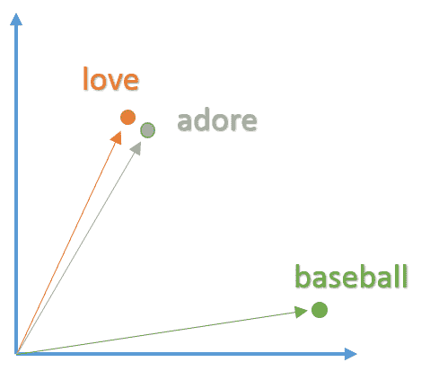
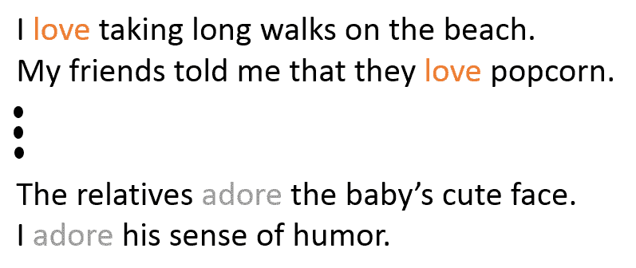
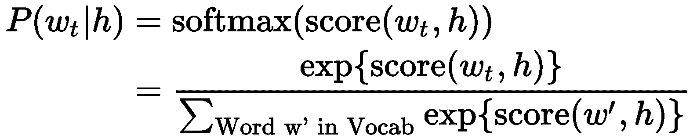
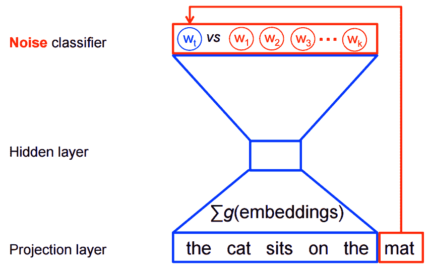
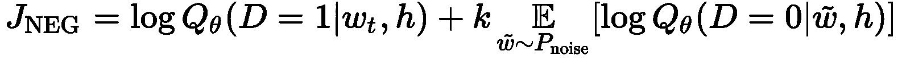
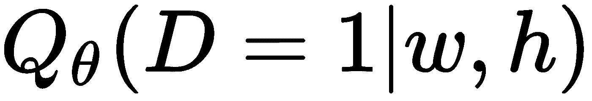
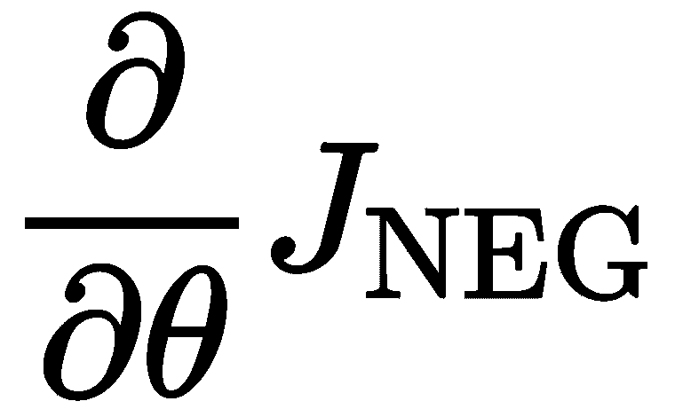
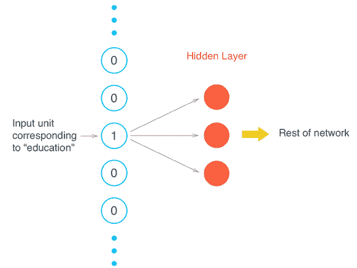
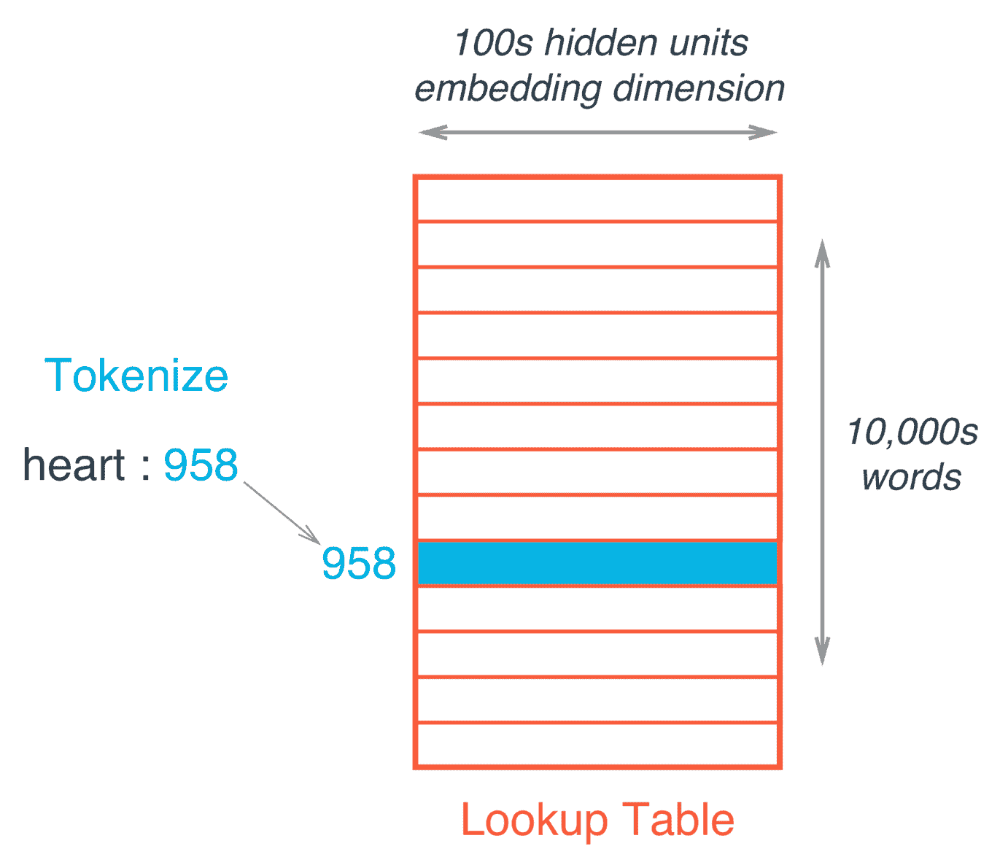
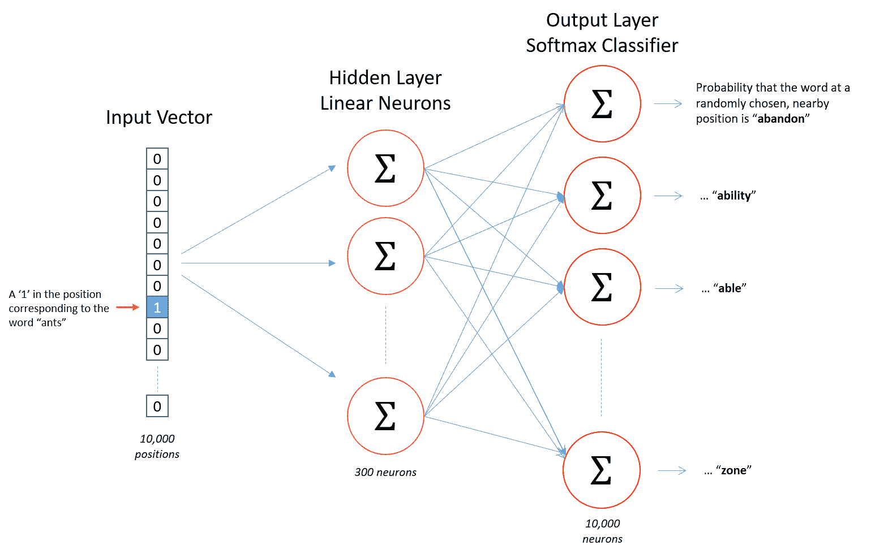

# 十一、表示学习——实现词嵌入

机器学习是一门主要基于统计学和线性代数的科学。由于反向传播，应用矩阵运算在大多数机器学习或深度学习架构中非常常见。这就是深度学习，或一般的机器学习，只接受实数值作为输入的主要原因。这一事实与许多应用相矛盾，例如机器翻译、情感分析等等；他们有文本作为输入。所以，为了在这个应用中使用深度学习，我们需要以深度学习接受的形式使用它！

在本章中，我们将介绍表示学习领域，这是一种从文本中学习实值表示同时保留实际文本语义的方法。例如，爱的表达应该非常接近崇拜的表达，因为它们在非常相似的上下文中使用。

因此，本章将涵盖以下主题:

*   表示学习导论
*   Word2Vec
*   跳过程序结构的一个实际例子
*   跳格 Word2Vec 实现


# 表示学习导论

到目前为止，我们使用的所有机器学习算法或架构都要求输入是实值或实值量的矩阵，这是机器学习中的一个常见主题。例如，在卷积神经网络中，我们必须输入图像的原始像素值作为模型输入。在这一部分中，我们正在处理文本，所以我们需要以某种方式对我们的文本进行编码，并产生可以馈送给机器学习算法的实数值。为了将输入文本编码为实数值，我们需要使用一种叫做**自然语言处理** ( **NLP** )的中间科学。

我们提到过，在这种管道中，我们将文本输入到情感分析等机器学习模型中，这将是有问题的，并且不会起作用，因为我们无法对输入应用反向传播或任何其他操作，如点积，这是一个字符串。因此，我们需要使用一种 NLP 机制，使我们能够建立一种文本的中间表示，它可以携带与文本相同的信息，也可以提供给机器学习模型。

我们需要将输入文本中的每个单词或标记转换成实值向量。如果这些向量不携带原始输入的模式、信息、意义和语义，它们将是无用的。例如，在真实文本中，love 和 adore 这两个词非常相似，具有相同的含义。我们需要表示它们的合成实值向量彼此靠近，并且在相同的向量空间中。所以，这两个单词和另一个不相似的单词的向量表示如下图所示:



图 15.1:单词的矢量表示

有许多技术可用于这项任务。这一系列技术被称为**嵌入**，将文本嵌入到另一个实值向量空间。

我们稍后会看到，这个向量空间实际上非常有趣，因为你会发现，你可以从与之相似的其他单词中得到一个单词的向量，甚至可以在这个空间中做一些地理研究。


# Word2Vec

Word2Vec 是自然语言处理领域广泛使用的嵌入技术之一。该模型通过查看输入单词出现的上下文信息，从输入文本中创建实值向量。因此，你会发现相似的单词会在非常相似的上下文中被提及，因此模型会知道这两个单词应该在特定的嵌入空间中彼此靠近放置。

从下图中的语句，模型将了解到单词 **love** 和 **adore** 共享非常相似的上下文，并且应该在结果向量空间中放置得彼此非常接近。like 的上下文可能也有点类似于 love 这个词，但它不会像 adore 这个词那样接近 love:



图 15.2:情感句子示例

Word2Vec 模型也依赖于输入句子的语义特征；例如，两个词 adore 和 love 主要用于肯定的上下文中，通常位于名词短语或名词之前。同样，模型将了解到这两个单词有一些共同点，并且更有可能将这两个向量的向量表示放在相似的上下文中。所以，句子的结构会告诉 Word2Vec 模型很多类似的单词。

在实践中，人们向 Word2Vec 模型提供大量的文本。该模型将学习为相似的词产生相似的向量，并且它将为输入文本中的每个唯一的词这样做。

所有这些单词的向量将被组合，并且最终输出将是嵌入矩阵，其中每一行表示特定唯一单词的实值向量表示。


图 15.3:word 2 vec 模型管道示例

因此，模型的最终输出将是训练语料库中所有唯一单词的嵌入矩阵。通常，好的嵌入矩阵可以包含数百万个实值向量。
Word2Vec 建模使用一个窗口扫描句子，然后试图根据其上下文信息预测该窗口中间词的向量；Word2Vec 模型将一次扫描一个句子。与任何机器学习技术类似，我们需要为 Word2Vec 模型定义一个成本函数及其相应的优化标准，这将使该模型能够为每个唯一的图像生成实值向量，并基于它们的上下文信息将向量彼此关联


# 构建 Word2Vec 模型

在这一节中，我们将深入探讨如何构建 Word2Vec 模型。正如我们之前提到的，我们的最终目标是拥有一个经过训练的模型，能够为输入文本数据生成实值向量表示，也称为词嵌入。

在模型的训练过程中，我们会使用最大似然法([https://en.wikipedia.org/wiki/Maximum_likelihood](https://en.wikipedia.org/wiki/Maximum_likelihood))，在给定模型看过的前几个词的情况下，最大化输入句子中下一个词 *w [t]* 的概率，我们可以称之为 *h* 。

这种最大似然法将用 softmax 函数来表示:



这里， *score* 函数计算一个值来表示目标单词*w[t]t*相对于上下文 *h* 的兼容性。该模型将在输入序列上训练，同时训练以最大化训练输入数据的似然性(对数似然性用于数学简化和对数推导):


因此， *ML* 方法将尝试最大化上述等式，这将产生概率语言模型。但是这种计算在计算上是非常昂贵的，因为我们需要在该模型的相应当前上下文 *h* 中，对
词汇表 *V* 单词*w’*中的所有单词使用得分函数来计算每个概率。这将发生在每一个训练步骤。


图 15.4:概率语言模型的一般架构

由于建立概率语言模型的计算成本很高，人们倾向于使用不同的计算成本较低的技术，如**连续词袋** ( **CBOW** )和 skip-gram 模型。

这些模型被训练来建立具有逻辑回归的二元分类，以在真实目标词*w[t]t*和 *h* 噪声或在相同上下文中的虚构词 **、**之间进行分离。下图使用 CBOW 技术简化了这一想法:



图 15.5:跳格模型的一般架构

下一张图展示了可以用来构建 Word2Vec 模型的两种架构:


图 15.6:word 2 vec 模型的不同架构

更正式地说，这些技术的目标函数最大化了以下内容:



其中:

*   **** 是基于模型在数据集***，**中的上下文 *h* 中看到单词 *w* 的二元逻辑回归的概率，它是根据θ向量计算的。这个向量表示学习到的嵌入。*
**   是我们可以从有噪声的概率分布中生成的虚构或有噪声的单词，例如训练输入示例的单字。*

 *总之，这些模型的目的是区分实数和虚数输入，因此对实数赋予较高的概率，对虚数或有噪声的词赋予较低的概率。

当模型将高概率分配给真实单词而将低概率分配给噪声单词时，这个目标被最大化。

在技术上，将高概率分配给真实单词的过程被称为**负采样**([https://papers . nips . cc/paper/5021-distributed-representations-of-words-and-phrases-and-they-compositivity . pdf](https://papers.nips.cc/paper/5021-distributed-representations-of-words-and-phrases-and-their-compositionality.pdf))，使用这种损失函数有很好的数学动机:它提出的更新在极限内近似 softmax 函数的更新。但是从计算上来说，它特别有吸引力，因为计算损失函数现在只与我们选择的干扰词的数量( *k* )成比例，而不是词汇表中的所有词( *V* )。这使得训练速度更快。我们将实际使用非常相似的**噪声对比估计**(**NCE**)([https://papers . nips . cc/paper/5165-learning-word-embedding-efficient-with-noise-contrast-estimation . pdf](https://papers.nips.cc/paper/5165-learning-word-embeddings-efficiently-with-noise-contrastive-estimation.pdf))损失，TensorFlow 对此有一个方便的帮助函数`tf.nn.nce_loss()`。


# 跳过程序结构的一个实际例子

让我们看一个实际的例子，看看跳格模型在这种情况下是如何工作的:

```py
the quick brown fox jumped over the lazy dog
```

首先，我们需要建立一个单词及其相应上下文的数据集。定义上下文取决于我们，但它必须有意义。因此，我们将在目标单词周围开一个窗口，从右边取一个单词，从左边取另一个单词。

通过使用这种上下文技巧，我们将得到以下一组单词及其相应的上下文:

```py
([the, brown], quick), ([quick, fox], brown), ([brown, jumped], fox), ...
```

生成的单词及其对应的上下文将被表示为成对的`(context, target)`。跳格模型的思想与 CBOW 模型相反。在跳格模型中，我们将根据单词的目标单词来预测单词的上下文。例如，考虑第一对，skip-gram 模型将尝试从目标单词`quick`中预测`the`和`brown`，等等。因此，我们可以将数据集重写如下:

```py
(quick, the), (quick, brown), (brown, quick), (brown, fox), ...
```

现在，我们有了一组输入和输出对。

让我们试着模仿特定步骤 *t* 的训练过程。因此，跳格模型将获取第一个训练样本，其中输入是单词`quick`，目标输出是单词`the`。接下来，我们还需要构建噪声输入，因此我们将从输入数据的单字中随机选择。为简单起见，噪声向量的大小将仅为 1。例如，我们可以选择单词`sheep`作为一个嘈杂的例子。

现在，我们可以继续计算真实线对与噪声线对之间的损耗，计算公式如下:


这种情况下的目标是更新θ参数，以改进之前的目标函数。通常，我们可以使用梯度。因此，我们将尝试计算损失相对于目标函数参数θ的梯度，它将由表示。

在训练过程之后，我们可以基于实值向量表示的降维来可视化一些结果。你会发现这个向量空间非常有趣，因为你可以用它做很多有趣的事情。例如，你可以在这里学习类比，说国王对王后就像男人对女人一样。我们甚至可以通过从皇后向量中减去国王向量，再加上男人，来推导出女人向量；这样的结果将非常接近女性的实际学习向量。你也可以在这个空间学习地理。


图 15.7:使用 t 分布随机邻居嵌入(t-SNE)降维技术将学习向量投影到二维

前面的例子给出了这些向量背后非常好的直觉，以及它们如何对大多数自然语言处理应用有用，如机器翻译或**词性** ( **词性**)标记。


# 跳格 Word2Vec 实现

在理解了 skip-gram 模型如何工作的数学细节之后，我们将实现 skip-gram，它将单词编码成具有某些属性的实值向量(因此得名 Word2Vec)。通过实现这个体系结构，你将得到学习另一种表示的过程是如何工作的线索。

文本是许多自然语言处理应用的主要输入，例如机器翻译、情感分析和文本到语音系统。因此，学习文本的实值表示将帮助我们使用不同的深度学习技术来完成这些任务。

在本书的前几章中，我们介绍了一种叫做一键编码的东西，它产生一个由零组成的向量，除了这个向量所代表的单词的索引。所以，你可能想知道为什么我们不在这里使用它。这种方法效率很低，因为通常你有一大组不同的单词，可能有 50，000 个单词，对此使用一键编码将产生一个 49，999 个条目的向量，其中一个条目设置为 0，只有一个条目设置为 1。

像这样非常稀疏的输入会导致巨大的计算浪费，因为我们会在神经网络的隐藏层中进行矩阵乘法。



图 15.8:一键编码会导致巨大的计算浪费

正如我们前面提到的，使用一键编码的结果将是一个非常稀疏的向量，特别是当您有大量不同的单词需要编码时。

下图显示了当我们将这个除了一个条目之外都是零的稀疏向量乘以权重矩阵时，输出将只是与稀疏向量的一个值相对应的矩阵行:


图 15.9:一个几乎全是零的独热向量乘以隐藏层权重矩阵的效果

为了避免这种巨大的计算浪费，我们将使用嵌入，这只是一个具有一些嵌入权重的全连接层。在这一层，我们跳过这个低效的乘法，从一个叫做**权重矩阵**的东西中查找嵌入层的嵌入权重。

因此，为了避免计算造成的浪费，我们将使用这个权重查找这个权重矩阵来找到嵌入权重。首先，需要构建这个查找 take。为此，我们将把所有输入单词编码为整数，如下图所示，然后为了获得这个单词的相应值，我们将使用它的整数表示作为这个权重矩阵中的行号。寻找特定单词对应嵌入值的过程称为**嵌入查找。**如前所述，嵌入层将只是一个完全连接的层，其中单元数代表嵌入维度。



图 15.10:标记化的查找表

你可以看到这个过程非常直观和直接；我们只需要遵循以下步骤:

1.  定义将被视为权重矩阵的查找表
2.  将嵌入层定义为具有特定单元数(嵌入维度)的完全连接的隐藏层
3.  使用权重矩阵查找作为计算上不必要的矩阵乘法的替代
4.  最后，将查找表训练为任意权重矩阵

正如我们前面提到的，我们将在这一部分构建一个 skip-gram Word2Vec 模型，这是一种学习单词表示的有效方法，同时保留单词的语义信息。

因此，让我们继续使用 skip-gram 架构构建一个 Word2Vec 模型，它被证明比其他模型更好。


# 数据分析和预处理

在这一节中，我们将定义一些帮助函数，它们将使我们能够构建一个良好的 Word2Vec 模型。对于这个实现，我们将使用一个干净的维基百科版本([http://mattmahoney.net/dc/textdata.html](http://mattmahoney.net/dc/textdata.html))。

因此，让我们从导入该实现所需的包开始:

```py
#importing the required packages for this implementation
import numpy as np
import tensorflow as tf

#Packages for downloading the dataset
from urllib.request import urlretrieve
from os.path import isfile, isdir
from tqdm import tqdm
import zipfile

#packages for data preprocessing
import re
from collections import Counter
import random
```

接下来，我们将定义一个类，如果以前没有下载过数据集，它将用于下载该数据集:

```py
# In this implementation we will use a cleaned up version of Wikipedia from Matt Mahoney.
# So we will define a helper class that will helps to download the dataset
wiki_dataset_folder_path = 'wikipedia_data'
wiki_dataset_filename = 'text8.zip'
wiki_dataset_name = 'Text8 Dataset'

class DLProgress(tqdm):

    last_block = 0

    def hook(self, block_num=1, block_size=1, total_size=None):
        self.total = total_size
        self.update((block_num - self.last_block) * block_size)
        self.last_block = block_num

# Cheking if the file is not already downloaded
if not isfile(wiki_dataset_filename):
    with DLProgress(unit='B', unit_scale=True, miniters=1, desc=wiki_dataset_name) as pbar:
        urlretrieve(
            'http://mattmahoney.net/dc/text8.zip',
            wiki_dataset_filename,
            pbar.hook)

# Checking if the data is already extracted if not extract it
if not isdir(wiki_dataset_folder_path):
    with zipfile.ZipFile(wiki_dataset_filename) as zip_ref:
        zip_ref.extractall(wiki_dataset_folder_path)

with open('wikipedia_data/text8') as f:
    cleaned_wikipedia_text = f.read()

Output:

Text8 Dataset: 31.4MB [00:39, 794kB/s]                             
```

我们可以看看这个数据集的前 100 个字符:

```py
cleaned_wikipedia_text[0:100]

' anarchism originated as a term of abuse first used against early working class radicals including t'
```

接下来，我们将对文本进行预处理，因此我们将定义一个辅助函数，它将帮助我们将特殊字符(如标点符号)替换为已知符号。此外，为了减少输入文本中的干扰，您可能想要移除文本中不经常出现的单词:

```py
def preprocess_text(input_text):

    # Replace punctuation with some special tokens so we can use them in our model
    input_text = input_text.lower()
    input_text = input_text.replace('.', ' <PERIOD> ')
    input_text = input_text.replace(',', ' <COMMA> ')
    input_text = input_text.replace('"', ' <QUOTATION_MARK> ')
    input_text = input_text.replace(';', ' <SEMICOLON> ')
    input_text = input_text.replace('!', ' <EXCLAMATION_MARK> ')
    input_text = input_text.replace('?', ' <QUESTION_MARK> ')
    input_text = input_text.replace('(', ' <LEFT_PAREN> ')
    input_text = input_text.replace(')', ' <RIGHT_PAREN> ')
    input_text = input_text.replace('--', ' <HYPHENS> ')
    input_text = input_text.replace('?', ' <QUESTION_MARK> ')

    input_text = input_text.replace(':', ' <COLON> ')
    text_words = input_text.split()

    # neglecting all the words that have five occurrences of fewer
    text_word_counts = Counter(text_words)
    trimmed_words = [word for word in text_words if text_word_counts[word] > 5]

    return trimmed_words
```

现在，让我们对输入文本调用这个函数，看看输出结果:

```py
preprocessed_words = preprocess_text(cleaned_wikipedia_text)
print(preprocessed_words[:30])
```

```py
Output:
['anarchism', 'originated', 'as', 'a', 'term', 'of', 'abuse', 'first', 'used', 'against', 'early', 'working', 'class', 'radicals', 'including', 'the', 'diggers', 'of', 'the', 'english', 'revolution', 'and', 'the', 'sans', 'culottes', 'of', 'the', 'french', 'revolution', 'whilst']
```

让我们看看预处理版本的文本有多少单词和不同的单词:

```py
print("Total number of words in the text: {}".format(len(preprocessed_words)))
print("Total number of unique words in the text: {}".format(len(set(preprocessed_words))))

Output:

Total number of words in the text: 16680599
Total number of unique words in the text: 63641
```

在这里，我正在创建字典来将单词转换成整数，或者反过来，也就是说，将整数转换成单词。整数按频率降序排列，因此最频繁出现的单词(`the`)被赋予整数`0`，次频繁出现的单词被赋予`1`，依此类推。单词被转换成整数并存储在列表`int_words`中。

正如本节前面提到的，我们需要使用单词的整数索引来查找它们在权重矩阵中的值，所以我们要进行单词到整数和整数到单词的转换。这将有助于我们查找单词，并获得特定索引的实际单词。例如，输入文本中重复次数最多的单词将被索引到位置 0，然后是第二个重复次数最多的单词，依此类推。

因此，让我们定义一个函数来创建这个查找表:

```py
def create_lookuptables(input_words):
 """
 Creating lookup tables for vocan

 Function arguments:
 param words: Input list of words
 """
 input_word_counts = Counter(input_words)
 sorted_vocab = sorted(input_word_counts, key=input_word_counts.get, reverse=True)
 integer_to_vocab = {ii: word for ii, word in enumerate(sorted_vocab)}
 vocab_to_integer = {word: ii for ii, word in integer_to_vocab.items()}

 # returning A tuple of dicts
 return vocab_to_integer, integer_to_vocab
```

现在，让我们调用已定义的函数来创建查找表:

```py
vocab_to_integer, integer_to_vocab = create_lookuptables(preprocessed_words)
integer_words = [vocab_to_integer[word] for word in preprocessed_words]
```

为了建立一个更准确的模型，我们可以删除那些不太改变上下文的单词，如`of`、`for`、`the`等等。因此，实践证明，我们可以在丢弃这些词的同时建立更准确的模型。从上下文中去除上下文无关单词的过程称为**子采样**。为了定义单词丢弃的一般机制，Mikolov 引入了用于计算某个单词的丢弃概率的函数，该函数由下式给出:


其中:

*   *t* 是字丢弃的阈值参数
*   *f(w [i] )* 是特定目标词*w[I]在输入数据集中的出现频率*

因此，我们将实现一个帮助器函数，它将计算数据集中每个单词的丢弃概率:

```py
# removing context-irrelevant words threshold
word_threshold = 1e-5

word_counts = Counter(integer_words)
total_number_words = len(integer_words)

#Calculating the freqs for the words
frequencies = {word: count/total_number_words for word, count in word_counts.items()}

#Calculating the discard probability
prob_drop = {word: 1 - np.sqrt(word_threshold/frequencies[word]) for word in word_counts}
training_words = [word for word in integer_words if random.random() < (1 - prob_drop[word])]
```

现在，我们有了一个更加精炼和干净的输入文本版本。

我们提到过，skip-gram 架构在生成目标单词的实值表示时考虑了目标单词的上下文，因此它在目标单词周围定义了一个大小为 *C* 的窗口。

我们不是平等地对待所有上下文相关的单词，而是对距离目标单词稍远的单词分配较小的权重。例如，如果我们选择窗口的大小为 *C = 4* ，那么我们将从 1 到 *C* 的范围内选择一个随机数 *L* ，然后从当前单词的历史和未来中采样 *L* 个单词。有关这方面的更多细节，请参考 Mikolov 等人的论文:[https://arxiv.org/pdf/1301.3781.pdf](https://arxiv.org/pdf/1301.3781.pdf)。

那么，让我们继续定义这个函数:

```py
# Defining a function that returns the words around specific index in a specific window
def get_target(input_words, ind, context_window_size=5):

    #selecting random number to be used for genearting words form history and feature of the current word
    rnd_num = np.random.randint(1, context_window_size+1)
    start_ind = ind - rnd_num if (ind - rnd_num) > 0 else 0
    stop_ind = ind + rnd_num

    target_words = set(input_words[start_ind:ind] + input_words[ind+1:stop_ind+1])

    return list(target_words)    
```

此外，让我们定义一个生成器函数，从训练样本中生成一个随机批次，并获取该批次中每个单词的上下文单词:

```py
#Defining a function for generating word batches as a tuple (inputs, targets)
def generate_random_batches(input_words, train_batch_size, context_window_size=5):

    num_batches = len(input_words)//train_batch_size

    # working on only only full batches
    input_words = input_words[:num_batches*train_batch_size]

    for ind in range(0, len(input_words), train_batch_size):
        input_vals, target = [], []
        input_batch = input_words[ind:ind+train_batch_size]

        #Getting the context for each word
        for ii in range(len(input_batch)):
            batch_input_vals = input_batch[ii]
            batch_target = get_target(input_batch, ii, context_window_size)

            target.extend(batch_target)
            input_vals.extend([batch_input_vals]*len(batch_target))
        yield input_vals, target
```


# 构建模型

接下来，我们将使用以下结构来构建计算图:



图 15.11:模型架构

因此，如前所述，我们将使用一个嵌入层来尝试学习这些单词的特殊实值表示。因此，单词将作为一个热点向量被输入。想法是训练这个网络来建立权重矩阵。

因此，让我们从创建模型的输入开始:

```py
train_graph = tf.Graph()

#defining the inputs placeholders of the model
with train_graph.as_default():
    inputs_values = tf.placeholder(tf.int32, [None], name='inputs_values')
    labels_values = tf.placeholder(tf.int32, [None, None], name='labels_values')
```

我们试图构建的权重或嵌入矩阵将具有以下形状:

```py
num_words X num_hidden_neurons
```

此外，我们不必自己实现查找函数，因为它已经在 Tensorflow: `tf.nn.embedding_lookup()`中可用。因此，它将使用单词的整数编码，并在权重矩阵中定位它们对应的行。

权重矩阵将从均匀分布中随机初始化:

```py
num_vocab = len(integer_to_vocab)

num_embedding =  300
with train_graph.as_default():
    embedding_layer = tf.Variable(tf.random_uniform((num_vocab, num_embedding), -1, 1))

    # Next, we are going to use tf.nn.embedding_lookup function to get the output of the hidden layer
    embed_tensors = tf.nn.embedding_lookup(embedding_layer, inputs_values) 
```

一次性更新嵌入层的所有嵌入权重是非常低效的。取而代之的是，我们将使用负采样技术，该技术将仅使用不正确单词的一个小子集来更新正确单词的权重。

此外，我们不必自己实现这个函数，因为它已经在 TensorFlow **`tf.nn.sampled_softmax_loss` :** 中了

```py
# Number of negative labels to sample
num_sampled = 100

with train_graph.as_default():
    # create softmax weights and biases
    softmax_weights = tf.Variable(tf.truncated_normal((num_vocab, num_embedding))) 
    softmax_biases = tf.Variable(tf.zeros(num_vocab), name="softmax_bias") 

    # Calculating the model loss using negative sampling
    model_loss = tf.nn.sampled_softmax_loss(
        weights=softmax_weights,
        biases=softmax_biases,
        labels=labels_values,
        inputs=embed_tensors,
        num_sampled=num_sampled,
        num_classes=num_vocab)

    model_cost = tf.reduce_mean(model_loss)
    model_optimizer = tf.train.AdamOptimizer().minimize(model_cost)
```

为了验证我们训练的模型，我们将对一些常用或常见的单词和一些不常见的单词进行采样，并尝试根据 skip-gram 体系结构的学习表示打印出它们最接近的单词集:

```py
with train_graph.as_default():

    # set of random words for evaluating similarity on
    valid_num_words = 16 
    valid_window = 100

    # pick 8 samples from (0,100) and (1000,1100) each ranges. lower id implies more frequent 
    valid_samples = np.array(random.sample(range(valid_window), valid_num_words//2))
    valid_samples = np.append(valid_samples, 
                               random.sample(range(1000,1000+valid_window), valid_num_words//2))

    valid_dataset_samples = tf.constant(valid_samples, dtype=tf.int32)

    # Calculating the cosine distance
    norm = tf.sqrt(tf.reduce_sum(tf.square(embedding_layer), 1, keep_dims=True))
    normalized_embed = embedding_layer / norm
    valid_embedding = tf.nn.embedding_lookup(normalized_embed, valid_dataset_samples)
    cosine_similarity = tf.matmul(valid_embedding, tf.transpose(normalized_embed))
```

现在，我们有了模型的所有零件，我们准备开始训练过程。


# 培养

让我们开始培训流程:

```py
num_epochs = 10
train_batch_size = 1000
contextual_window_size = 10

with train_graph.as_default():
    saver = tf.train.Saver()

with tf.Session(graph=train_graph) as sess:

    iteration_num = 1
    average_loss = 0

    #Initializing all the vairables
    sess.run(tf.global_variables_initializer())

    for e in range(1, num_epochs+1):

        #Generating random batch for training
        batches = generate_random_batches(training_words, train_batch_size, contextual_window_size)

        #Iterating through the batch samples
        for input_vals, target in batches:

            #Creating the feed dict
            feed_dict = {inputs_values: input_vals,
                    labels_values: np.array(target)[:, None]}

            train_loss, _ = sess.run([model_cost, model_optimizer], feed_dict=feed_dict)

            #commulating the loss
            average_loss += train_loss

            #Printing out the results after 100 iteration
            if iteration_num % 100 == 0: 
                print("Epoch Number {}/{}".format(e, num_epochs),
                      "Iteration Number: {}".format(iteration_num),
                      "Avg. Training loss: {:.4f}".format(average_loss/100))
                average_loss = 0

            if iteration_num % 1000 == 0:

                ## Using cosine similarity to get the nearest words to a word
                similarity = cosine_similarity.eval()
                for i in range(valid_num_words):
                    valid_word = integer_to_vocab[valid_samples[i]]

                    # number of nearest neighbors
                    top_k = 8 
                    nearest_words = (-similarity[i, :]).argsort()[1:top_k+1]
                    msg = 'The nearest to %s:' % valid_word
                    for k in range(top_k):
                        similar_word = integer_to_vocab[nearest_words[k]]
                        msg = '%s %s,' % (msg, similar_word)
                    print(msg)

            iteration_num += 1
    save_path = saver.save(sess, "checkpoints/cleaned_wikipedia_version.ckpt")
    embed_mat = sess.run(normalized_embed)
```

运行上述代码片段 10 个时期后，您将获得以下输出:

```py
Epoch Number 10/10 Iteration Number: 43100 Avg. Training loss: 5.0380
Epoch Number 10/10 Iteration Number: 43200 Avg. Training loss: 4.9619
Epoch Number 10/10 Iteration Number: 43300 Avg. Training loss: 4.9463
Epoch Number 10/10 Iteration Number: 43400 Avg. Training loss: 4.9728
Epoch Number 10/10 Iteration Number: 43500 Avg. Training loss: 4.9872
Epoch Number 10/10 Iteration Number: 43600 Avg. Training loss: 5.0534
Epoch Number 10/10 Iteration Number: 43700 Avg. Training loss: 4.8261
Epoch Number 10/10 Iteration Number: 43800 Avg. Training loss: 4.8752
Epoch Number 10/10 Iteration Number: 43900 Avg. Training loss: 4.9818
Epoch Number 10/10 Iteration Number: 44000 Avg. Training loss: 4.9251
The nearest to nine: one, seven, zero, two, three, four, eight, five,
The nearest to such: is, as, or, some, have, be, that, physical,
The nearest to who: his, him, he, did, to, had, was, whom,
The nearest to two: zero, one, three, seven, four, five, six, nine,
The nearest to which: as, a, the, in, to, also, for, is,
The nearest to seven: eight, one, three, five, four, six, zero, two,
The nearest to american: actor, nine, singer, actress, musician, comedian, athlete, songwriter,
The nearest to many: as, other, some, have, also, these, are, or,
The nearest to powers: constitution, constitutional, formally, assembly, state, legislative, general, government,
The nearest to question: questions, existence, whether, answer, truth, reality, notion, does,
The nearest to channel: tv, television, broadcasts, broadcasting, radio, channels, broadcast, stations,
The nearest to recorded: band, rock, studio, songs, album, song, recording, pop,
The nearest to arts: art, school, alumni, schools, students, university, renowned, education,
The nearest to orthodox: churches, orthodoxy, church, catholic, catholics, oriental, christianity, christians,
The nearest to scale: scales, parts, important, note, between, its, see, measured,
The nearest to mean: is, exactly, defined, denote, hence, are, meaning, example,

Epoch Number 10/10 Iteration Number: 45100 Avg. Training loss: 4.8466
Epoch Number 10/10 Iteration Number: 45200 Avg. Training loss: 4.8836
Epoch Number 10/10 Iteration Number: 45300 Avg. Training loss: 4.9016
Epoch Number 10/10 Iteration Number: 45400 Avg. Training loss: 5.0218
Epoch Number 10/10 Iteration Number: 45500 Avg. Training loss: 5.1409
Epoch Number 10/10 Iteration Number: 45600 Avg. Training loss: 4.7864
Epoch Number 10/10 Iteration Number: 45700 Avg. Training loss: 4.9312
Epoch Number 10/10 Iteration Number: 45800 Avg. Training loss: 4.9097
Epoch Number 10/10 Iteration Number: 45900 Avg. Training loss: 4.6924
Epoch Number 10/10 Iteration Number: 46000 Avg. Training loss: 4.8999
The nearest to nine: one, eight, seven, six, four, five, american, two,
The nearest to such: can, example, examples, some, be, which, this, or,
The nearest to who: him, his, himself, he, was, whom, men, said,
The nearest to two: zero, five, three, four, six, one, seven, nine
The nearest to which: to, is, a, the, that, it, and, with,
The nearest to seven: one, six, eight, five, nine, four, three, two,
The nearest to american: musician, actor, actress, nine, singer, politician, d, one,
The nearest to many: often, as, most, modern, such, and, widely, traditional,
The nearest to powers: constitutional, formally, power, rule, exercised, parliamentary, constitution, control,
The nearest to question: questions, what, answer, existence, prove, merely, true, statements,
The nearest to channel: network, channels, broadcasts, stations, cable, broadcast, broadcasting, radio,
The nearest to recorded: songs, band, song, rock, album, bands, music, studio,
The nearest to arts: art, school, martial, schools, students, styles, education, student,
The nearest to orthodox: orthodoxy, churches, church, christianity, christians, catholics, christian, oriental,
The nearest to scale: scales, can, amounts, depends, tend, are, structural, for,
The nearest to mean: we, defined, is, exactly, equivalent, denote, number, above,
Epoch Number 10/10 Iteration Number: 46100 Avg. Training loss: 4.8583
Epoch Number 10/10 Iteration Number: 46200 Avg. Training loss: 4.8887
```

正如您从输出中看到的，网络以某种方式学习了输入单词的一些语义上有用的表示。为了帮助我们更清楚地了解嵌入矩阵，我们将使用 t-SNE 等降维技术将实值向量降维为二维，然后我们将它们可视化，并用相应的单词标记每个点:

```py
num_visualize_words = 500
tsne_obj = TSNE()
embedding_tsne = tsne_obj.fit_transform(embedding_matrix[:num_visualize_words, :])

fig, ax = plt.subplots(figsize=(14, 14))
for ind in range(num_visualize_words):
    plt.scatter(*embedding_tsne[ind, :], color='steelblue')
    plt.annotate(integer_to_vocab[ind], (embedding_tsne[ind, 0], embedding_tsne[ind, 1]), alpha=0.7)
```

```py

Output:
```


图 15.12:单词向量的可视化


# 摘要

在这一章中，我们讨论了表示学习的概念，以及它为什么对非实值形式的输入进行深度学习或机器学习有用。此外，我们还介绍了一种将单词转换成实值向量的技术——word 2 vec——它具有非常有趣的特性。最后，我们使用 skip-gram 架构实现了 Word2Vec 模型。

接下来，您将在一个情感分析示例中看到这些学习到的表示的实际使用，在该示例中，我们需要将输入文本转换为实值向量。*