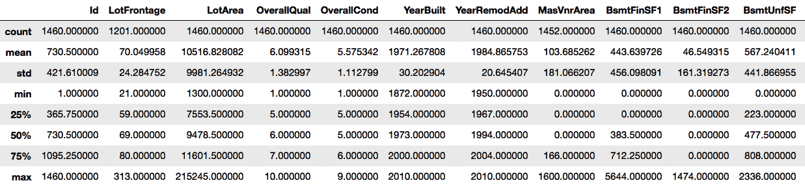
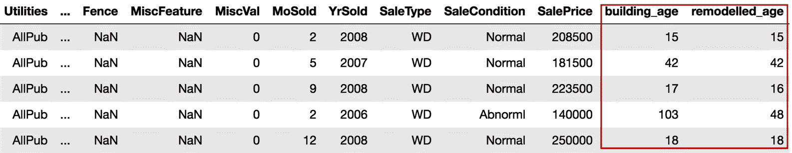
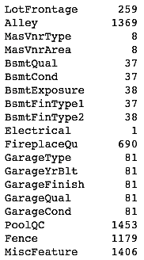
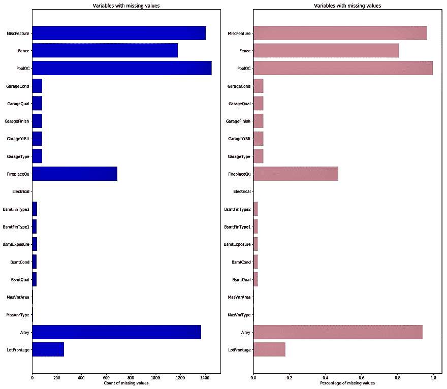
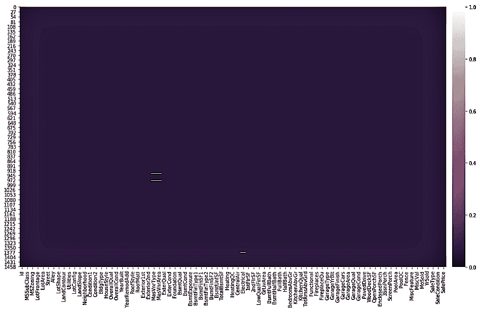
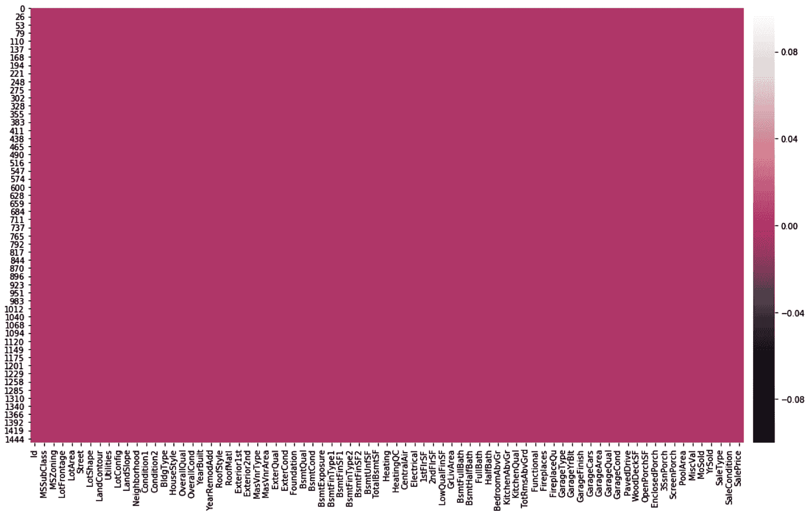
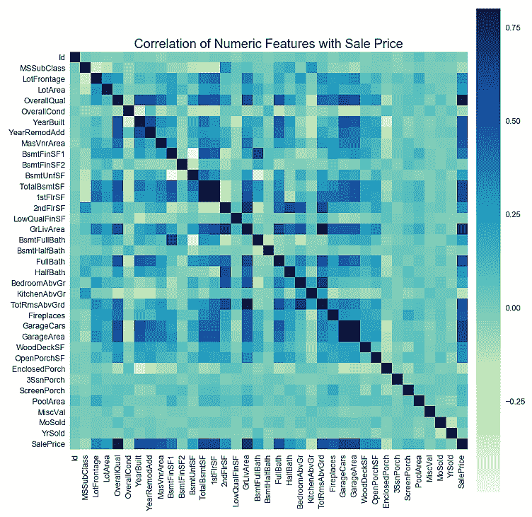
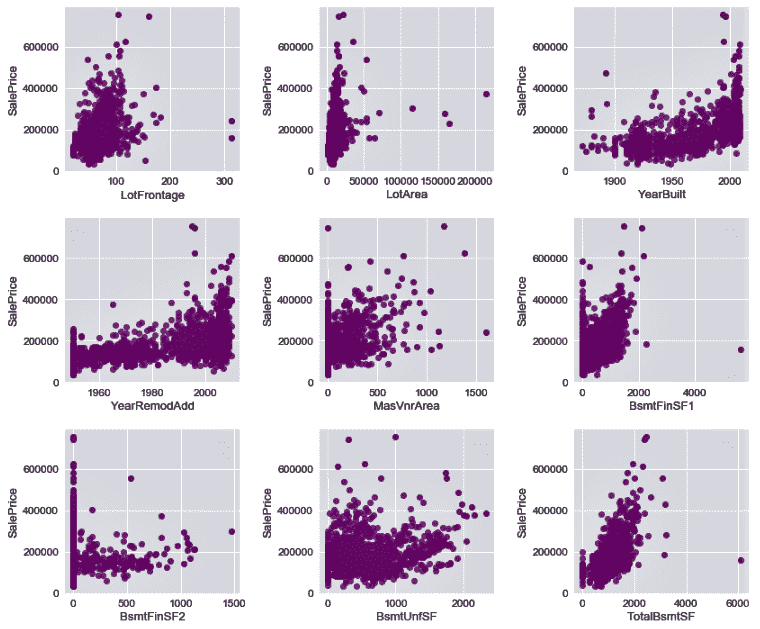
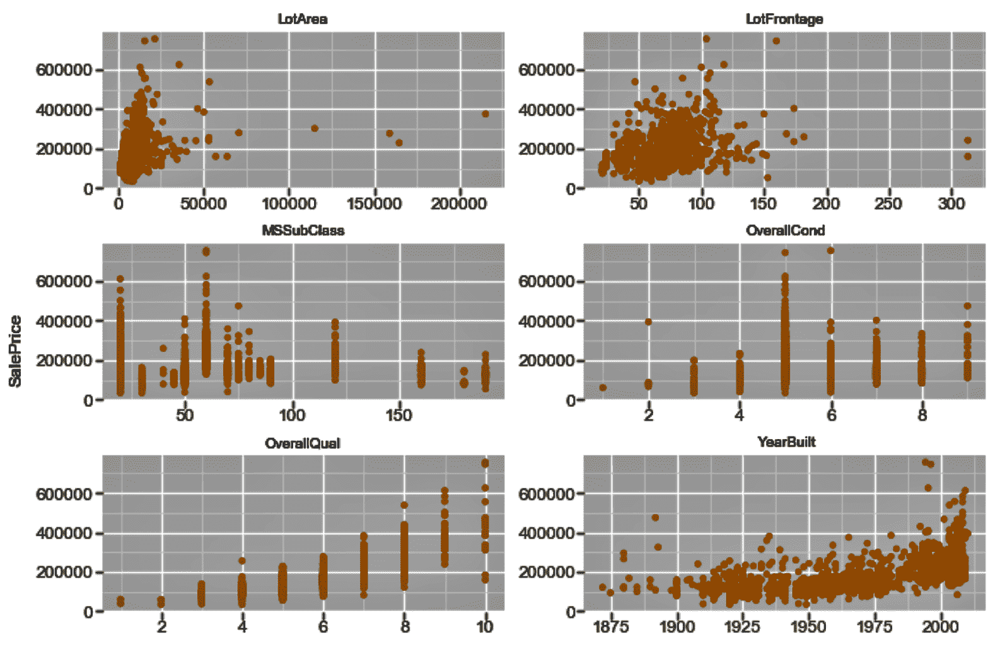

# 一、更接近您的数据

在本章中，我们将介绍以下配方:

*   使用 Python 进行数据操作
*   分析、可视化和处理缺失值
*   探索性数据分析


# 介绍

在本书中，我们将涵盖各种集成技术，并将学习如何集成多种机器学习算法来提升模型的性能。我们将使用 pandas、NumPy、scikit-learn 和 Matplotlib，所有这些都是为使用 Python 而构建的，正如我们将在整本书中所做的那样。到目前为止，您应该非常了解数据操作和探索。

在本章中，我们将回顾如何在 Python 中读取和操作数据，如何分析和处理缺失值，以及如何探索数据以获得更深入的见解。我们将使用各种 Python 包，比如用于数据操作和探索的`numpy`和`pandas`，以及用于数据可视化的`seaborn`包。在本书后面的章节中，我们将继续使用这些库的一部分或全部。我们还将使用 Anaconda 发行版进行 Python 编码。如果你没有安装 Anaconda，你需要从[https://www.anaconda.com/download](https://www.anaconda.com/download/#macos)下载。在写这本书的时候，Anaconda 的最新版本是 5.2，同时提供了 Python 3.6 和 Python 2.7。我们建议您下载 Python 3.6 版的 Anaconda。我们还将使用 GitHub 上提供的`HousePrices`数据集。


# 使用 Python 进行数据操作

在现实生活中，通常很难获得完全按照我们需要的格式编排的完整、干净的数据集。我们收到的数据往往不能直接用于统计或机器学习算法。我们需要处理原始数据，以便处理后的数据可以用于进一步的分析和建模。首先，我们需要导入所需的包，比如`pandas`，并将数据集读入 Python。


# 做好准备

我们将在操作系统的相关功能中使用`os`包，在数据操作中使用`pandas`包。

现在让我们看一下数据定义来理解我们的变量。在下面的代码中，我们列出了几个变量的数据定义。GitHub 上提供了数据集和完整的数据定义。以下是数据描述文件的节略版本:

```py
MS SubClass (Nominal): Identifies the type of dwelling involved in the sale
Lot Frontage (Continuous): Linear feet of street connected to property
Alley (Nominal): Type of alley access to property
Overall Qual (Ordinal): Rates the overall material and finish of the house
Overall Cond (Ordinal): Rates the overall condition of the house
Year Built (Discrete): Original construction date
Mas Vnr Type (Nominal): Masonry veneer type
Mas Vnr Area (Continuous): Masonry veneer area in square feet
Garage Type (Nominal): Garage location
Garage Yr Blt (Discrete): Year garage was built
Garage Finish (Ordinal): Interior finish of the garage
Garage Cars (Discrete): Size of garage in car capacity
Garage Area (Continuous): Size of garage in square feet
Garage Qual (Ordinal): Garage quality
Garage Cond (Ordinal): Garage condition
...
...
SalePrice (Continuous): Sale price $$
```

然后，我们将导入`os`和`pandas`包，并根据我们的需求设置我们的工作目录，如下面的代码块所示:

```py
import os
import pandas as pd

# Set working directory as per your need
os.chdir(".../.../Chapter 1")
os.getcwd()
```

下一步是从 GitHub 下载数据集，并将其复制到您的工作目录中。


# 怎么做...

现在，让我们执行一些数据操作步骤:

1.  首先，我们将从当前工作目录中读取`HousePrices.csv`中的数据，并创建第一个数据帧进行操作。我们将数据帧命名为`housepricesdata`，如下所示:

```py
housepricesdata = pd.read_csv("HousePrices.csv")
```

2.  现在让我们来看看我们的数据帧，看看它是什么样子的:

```py
# See first five observations from top
housepricesdata.head(5)
```

您可能看不到所有的行；朱庇特会截断一些变量。为了在 Jupyter 中查看任何输出的所有行和列，请执行以下命令:

`# Setting options to display all rows and columns`
`pd.options.display.max_rows = None`
`pd.options.display.max_columns = None`

3.  我们可以用`shape`看到数据框的尺寸。`shape`是`pandas`数据帧的一个属性:

```py
housepricesdata.shape
```

使用前面的命令，我们可以看到行数和列数，如下所示:

```py
(1460, 81)
```

在这里，我们可以看到数据帧有`1460`观察值和`81`列。

4.  让我们来看看数据帧中变量的数据类型:

```py
housepricesdata.dtypes
```

在下面的代码块中，我们可以看到数据帧中每个变量的数据类型:

```py
Id                 int64
MSSubClass         int64
MSZoning          object
LotFrontage      float64
LotArea            int64
LotConfig         object
LandSlope         object
                  ...   
BedroomAbvGr       int64
KitchenAbvGr       int64
KitchenQual       object
TotRmsAbvGrd       int64
SaleCondition     object
SalePrice          int64
Length: 81, dtype: object
```

我们现在已经准备好开始我们的数据操作，我们可以用许多不同的方式来做。在这一节中，我们将看一些方法，在这些方法中，我们可以操纵和准备我们的数据，以便进行分析。

让我们从总结我们的数据开始。

5.  `describe()`功能将只显示数字变量的统计数据:

```py
housepricesdata.describe()
```

我们可以在下面的截图中看到输出:



6.  我们将删除`id`列，因为这对我们的分析是不必要的:

```py
# inplace=True will overwrite the DataFrame after dropping Id column
housepricesdata.drop(['Id'], axis=1, inplace=True)
```

7.  现在让我们看看一些对象类型变量的分布，也就是分类变量。在下面的例子中，我们将看看`LotShape`和`LandContour`。我们可以用下面代码块中所示的相同方法研究数据集的其他分类变量:

```py
# Name the count column as "count"
lotshape_frequencies = pd.crosstab(index=housepricesdata["LotShape"], columns="count") 

landcountour_frequencies = pd.crosstab(index=housepricesdata["LandContour"], columns="count") # Name the count column as "count"

print(lotshape_frequencies)
print("\n") # to keep a blank line for display
print(landcountour_frequencies)
```

8.  我们现在将了解如何在数据类型之间执行转换。我们注意到，变量的数据定义如`MSSubClass`、`OverallQual`和`OverallCond`都是分类变量。但是，导入数据集后，它们会显示为整数。

在对任何变量进行类型转换之前，请确保没有丢失值。

这里，我们将把变量转换成分类数据类型:

```py
# Using astype() to cast a pandas object to a specified datatype
housepricesdata['MSSubClass'] = housepricesdata['MSSubClass'].astype('object')
housepricesdata['OverallQual'] = housepricesdata['OverallQual'].astype('object')
housepricesdata['OverallCond'] = housepricesdata['OverallCond'].astype('object')

# Check the datatype of MSSubClass after type conversion
print(housepricesdata['MSSubClass'].dtype)
print('\n') # to keep a blank line for display

# Check the distribution of the levels in MSSubClass after conversion
# Make a crosstab with pd.crosstab()
# Name the count column as "count"
print(pd.crosstab(index=housepricesdata["MSSubClass"], columns="count")) 
```

我们可以看到每类房屋的观察计数，如下面的代码块所示:

```py
category

col_0       count
MSSubClass       
20            536
30             69
40              4
45             12
50            144
60            299
70             60
75             16
80             58
85             20
90             52
120            87
160            63
180            10
190            30
```

有许多变量本身可能不是很有用，但是转换它们会给我们很多有趣的见解。让我们创建一些新的，有意义的变量。

9.  `YearBuilt`和`YearRemodAdd`分别代表原施工日期和改造日期。然而，如果它们可以转换成年龄，这些变量将告诉我们这些建筑有多老，以及它们被改造了多少年。为此，我们创建两个新变量，`BuildingAge`和`RemodelAge`:

```py
# Importing datetime package for date time operations
import datetime as dt

# using date time package to find the current year
current_year = int(dt.datetime.now().year)

# Subtracting the YearBuilt from current_year to find out the age of the building
building_age = current_year - housepricesdata['YearBuilt']

# Subtracting the YearRemonAdd from current_year to find out the age since the
# building was remodelled
remodelled_age = current_year - housepricesdata['YearRemodAdd']
```

10.  现在，让我们将两个变量添加到我们的数据集:

```py
# Adding the two variables to the DataFrame
housepricesdata['building_age'] = building_age
housepricesdata['remodelled_age'] = remodelled_age

# Checking our DataFrame to see if the two variables got added
housepricesdata.head(5)
```

我们注意到`building_age`和`remodelled_age`现在被添加到数据帧中，如下面的屏幕截图所示:



包含标签数据的变量需要转换成数字形式，以供机器学习算法使用。为了解决这个问题，我们将执行编码，将标签转换为数字形式，以便算法可以使用它们。

11.  我们需要识别需要编码的变量，包括`Street`、`LotShape`和`LandContour`。我们将执行一键编码，这是将分类变量表示为二进制向量。我们将使用 Python 中的`pandas`包来完成这项工作:

```py
# We use get_dummies() function to one-hot encode LotShape
one_hot_encoded_variables = pd.get_dummies(housepricesdata['LotShape'],prefix='LotShape')

# Print the one-hot encoded variables to see how they look like
print(one_hot_encoded_variables)
```

我们可以在下面的屏幕截图中看到已经创建的一次性编码变量:


12.  将独热编码变量添加到我们的数据帧中，如下所示:

```py
# Adding the new created one-hot encoded variables to our DataFrame
housepricesdata = pd.concat([housepricesdata,one_hot_encoded_variables],axis=1)

# Let's take a look at the added one-hot encoded variables
# Scroll right to view the added variables
housepricesdata.head(5)
```

在下面的屏幕截图中，我们可以看到将一位热码编码变量添加到数据帧后得到的输出:


13.  现在，让我们删除原来的变量，因为我们已经创建了我们的一次性编码变量:

```py
# Dropping the original variable after one-hot encoding the original variable
# inplace = True option will overwrite the DataFrame

housepricesdata.drop(['LotShape'],axis=1, inplace=True)
```


# 它是如何工作的...

`pandas`模块是 Python 标准库的一部分——它是数据操作的关键模块之一。我们也用过其他的包，比如`os`和`datetime`。在我们设置了工作目录并将 CSV 文件作为`pandas`数据帧读入 Python 之后，我们继续研究一些数据操作方法。

*上一节的步骤 1* 到*步骤 5* 向我们展示了如何使用`pandas`从 Python 中的 CSV 文件读取数据，以及如何使用`dtypes`等函数。

`pandas`包还提供了从各种文件类型中读取数据的方法。例如，`pandas.read_excel()`将 Excel 表格读入`pandas`data frame；`pandas.read_json()`将 JSON 字符串转换成`pandas`对象；并且`pandas.read_parquet()`从文件路径加载一个 parquet 对象并返回`pandas`数据帧。有关这方面的更多信息可以在 https://bit.ly/2yBqtvd[找到。](https://bit.ly/2yBqtvd)

还可以使用`h5py`包读取 Python 中的 HDF5 格式文件。`h5py`包是 HDF5 二进制数据格式的 Python 接口。HDF 支持 n 维数据集，数据集中的每个元素本身都可能是一个复杂的对象。集合中数据对象的数量或大小没有限制。更多信息可以在[https://www.hdfgroup.org/](https://www.hdfgroup.org/)找到。示例代码块如下所示:

```py
import h5py

# With 'r' passed as a parameter to the h5py.File() 
# the file will be read in read-only mode
data = h5py.File('File Name.h5', 'r')
```

我们查看变量的数据类型，并使用`describe()`查看数字变量的汇总统计数据。我们需要注意的是`describe()`只对数值型变量起作用，并且足够智能，可以忽略非数值型变量。在*步骤 6* 中，我们看到了如何查看分类变量(如`LotShape`和`LandContour`)的每个级别的计数。我们可以用同样的代码来看看其他分类变量的分布。

在*步骤 7* 中，我们使用`pd.crosstab()`查看了`LotShape`和`LandContour`变量的分布。

交叉表中的一个常见需求是包含行和列的小计。我们可以使用关键字`margins`显示小计。我们将`margins=True`传递给`pd.crosstab()`函数。我们还可以使用关键字`margins_name`给小计列命名。`margins_name`的默认值为`All`。

然后我们继续学习如何转换数据类型。我们有一些变量实际上是分类的，但在数据集中似乎是数字的。现实生活中经常会出现这种情况，因此我们需要学习如何对变量进行类型转换。*第 8 步*向我们展示了如何将一个数字变量，比如`MSSubClass`，转换成一个分类类型。在*步骤 8* 中，我们将一些变量转换成分类数据类型。然后我们创建了一个交叉表来可视化每一级分类变量的频率。

在*步骤 9* 中，我们从现有变量中创建了新的有意义的变量。我们分别从`YearBuilt`和`YearRemodAdd`中创建了新的变量`BuildingAge`和`RemodelAge`，来表示建筑的年龄和自建筑被改造以来已经过去的年数。这种创建新变量的方法可以为我们的分析和建模提供更好的见解。这个创建新特征的过程被称为**特征工程**。在*步骤 10* 中，我们将新变量添加到我们的数据框架中。

从那里，我们继续对我们的分类变量进行编码。我们需要对我们的分类变量进行编码，因为它们有命名的描述。许多机器学习算法无法对带标签的数据进行操作，因为它们要求所有输入和输出变量都是数字。在*步骤 12* 中，我们用一键编码对它们进行编码。在*步骤 11* 中，我们学习了如何使用`get_dummies()`函数，它是`pandas`包的一部分，来创建独热编码变量。在*步骤 12* 中，我们将`one-hot_encoded_variables`添加到我们的数据帧中。最后，在*步骤 13* 中，我们删除了现在被一键编码的原始变量。


# 还有更多...

所需的数据操作类型取决于您的业务需求。在第一个方法中，我们看到了一些执行数据操作的方法，但是对于您可以做什么以及如何操作数据进行分析没有限制。

我们还看到了如何将数字变量转换成分类变量。我们可以用很多方法来做这种类型转换。例如，如果需要，我们可以使用以下代码将分类变量转换为数值变量:

```py
# Converting a categorical variable to numerical
# Using astype() to cast a pandas object to a specified datatype

# Here we typecast GarageYrBlt from float64 type to int64 type
housepricesdata['GarageYrBlt'] = housepricesdata['GarageYrBlt'].astype('int64')
```

只有当`GarageYrBlt`变量不包含任何缺失值时，才能转换该变量。前面的代码将抛出一个错误，因为`GarageYrBlt`包含缺失值。

我们已经了解了如何使用一键编码将分类变量转换为数值变量，以及为什么要这样做。除了一键编码之外，我们还可以执行其他类型的编码，例如标签编码、频率编码等等。下面的代码块给出了标签编码的示例代码:

```py
# We use sklearn.preprocessing and import LabelEncoder class
from sklearn.preprocessing import LabelEncoder

# Create instance of LabelEncoder class
lb_make = LabelEncoder()

# We create a new variable LotConfig_code to hold the new numerical labels
# We label encode LotConfig variable
housepricesdata["LotConfig_Code"] = lb_make.fit_transform(housepricesdata["LotConfig"])

# Display the LotConfig variable and its corresponding label encoded numerical values
housepricesdata[["LotConfig", "LotConfig_Code"]]
```


# 请参见

*   熊猫指南类型转换功能([https://bit.ly/2MzFwiG](https://bit.ly/2MzFwiG))
*   熊猫指南使用`get_dummies()`([https://bit.ly/2N1xjTZ](https://bit.ly/2N1xjTZ))进行一键编码
*   sci kit-一键编码学习指南([https://bit.ly/2wrNNLz](https://bit.ly/2wrNNLz))
*   sci kit-标签编码学习指南([https://bit.ly/2pDddVb](https://bit.ly/2pDddVb))


# 分析、可视化和处理缺失值

缺失值是由不完整的数据引起的。有效处理缺失值非常重要，因为它们会导致不准确的推断和结论。在本节中，我们将了解如何分析、可视化和处理缺失值。


# 怎么做...

让我们从分析缺失值的变量开始。设置 pandas 中的选项以查看所有行和列，如前一节所示:

1.  使用以下语法，我们可以看到哪些变量缺少值:

```py
# Check which variables have missing values

columns_with_missing_values = housepricesdata.columns[housepricesdata.isnull().any()]
housepricesdata[columns_with_missing_values].isnull().sum()
```

这将产生以下输出:



2.  您可能还想查看百分比形式的缺失值。要查看缺失值的计数和百分比，请执行以下命令:

```py
import numpy as np
import matplotlib.pyplot as plt
%matplotlib inline

# To hold variable names
labels = [] 

# To hold the count of missing values for each variable 
valuecount = [] 

# To hold the percentage of missing values for each variable
percentcount = [] 

for col in columns_with_missing_values:
    labels.append(col)
    valuecount.append(housepricesdata[col].isnull().sum())
    # housepricesdata.shape[0] will give the total row count
   percentcount.append(housepricesdata[col].isnull().sum()/housepricesdata.shape[0])

ind = np.arange(len(labels))

fig, (ax1, ax2) = plt.subplots(1,2,figsize=(20,18))

rects = ax1.barh(ind, np.array(valuecount), color='blue')
ax1.set_yticks(ind)
ax1.set_yticklabels(labels, rotation='horizontal')
ax1.set_xlabel("Count of missing values")
ax1.set_title("Variables with missing values")

rects = ax2.barh(ind, np.array(percentcount), color='pink')
ax2.set_yticks(ind)
ax2.set_yticklabels(labels, rotation='horizontal')
ax2.set_xlabel("Percentage of missing values")
ax2.set_title("Variables with missing values")
```

它将以绝对值和百分比的形式显示缺失的值，如下面的屏幕截图所示:



我们注意到，变量 **Alley** 、 **PoolQC** 、 **Fence** 和**misfeature**有 **80%** 到 **90%** 的值缺失。 **FireplaceQu** 有 **47.26%** 的值缺失。其他一些变量，如 **LotFrontage** 、 **MasVnrType** 、 **MasVnrArea** 、 **BsmtQual** 、 **BsmtCond** ，以及其他一些与车库相关的变量也有缺失值。

但是有一个问题。我们再来看一下`Alley`变量。它显示它有 **93.76%** 的缺失值。现在再看一下我们在上一节中看到的数据描述。`Alley`的变量描述显示其有三个级别:*砾石*、*铺砌*、*无通路*。在原始数据集中，`'No Access'`被编码为`NA`。在 Python 中读取`NA`时，它被当作 **NaN** ，这意味着缺少一个值，所以我们需要小心。

3.  现在，我们将用有效值替换`Alley`的缺失值，例如`'No Access'`:

```py
# Replacing missing values with 'No Access' in Alley variable
housepricesdata['Alley'].fillna('No Access', inplace=True)
```

4.  现在，让我们将缺失的值可视化，并尝试看看如何处理它们。以下代码生成一个图表，展示缺失值的分布情况。这里我们使用`seaborn`库来绘制图表:

```py
# Lets import seaborn. We will use seaborn to generate our charts
import seaborn as sns

# We will import matplotlib to resize our plot figure
import matplotlib.pyplot as plt
%matplotlib inline
plt.figure(figsize=(20, 10))

# cubehelix palette is a part of seaborn that produces a colormap
cmap = sns.cubehelix_palette(light=1, as_cmap=True, reverse=True)
sns.heatmap(housepricesdata.isnull(), cmap=cmap)
```

通过`cubehelix_palette()`功能生成亮度线性增加的地图颜色:


从前面的图中，可以更容易地看出缺失值的分布。图表上的白色标记表示缺少的值。注意`Alley`不再报告任何丢失的值。

5.  `LotFrontage`为连续变量，缺失 **17.74%** 的值。将此变量中缺失的值替换为其中值，如下所示:

```py
# Filling in the missing values in LotFrontage with its median value
housepricesdata['LotFrontage'].fillna(housepricesdata['LotFrontage'].median(), inplace=True)
```

让我们再次查看缺失值图，看看来自`LotFrontage`的缺失值是否已被估算。复制并执行前面的代码。缺失值图如下所示:

6.  

这里，我们可以在前面的图中看到，`Alley`或`LotFrontage`不再有缺失值。

我们从数据描述中发现，有几个变量的值被编码为`NA`。因为这在 Python 中被读取为缺失值，所以我们用它们的实际值替换所有这些值，我们可以在下面的代码块中显示的数据描述中看到这些值:

7.  在处理了前面的变量之后，让我们来看看缺失值图:

```py
# Replacing all NA values with their original meaning
housepricesdata['BsmtQual'].fillna('No Basement', inplace=True)
housepricesdata['BsmtCond'].fillna('No Basement', inplace=True)
housepricesdata['BsmtExposure'].fillna('No Basement', inplace=True)
housepricesdata['BsmtFinType1'].fillna('No Basement', inplace=True)
housepricesdata['BsmtFinType2'].fillna('No Basement', inplace=True)

housepricesdata['GarageYrBlt'].fillna(0, inplace=True)

# For observations where GarageType is null, we replace null values in GarageYrBlt=0
housepricesdata['GarageType'].fillna('No Garage', inplace=True)
housepricesdata['GarageFinish'].fillna('No Garage', inplace=True)
housepricesdata['GarageQual'].fillna('No Garage', inplace=True)
housepricesdata['GarageCond'].fillna('No Garage', inplace=True)

housepricesdata['PoolQC'].fillna('No Pool', inplace=True)
housepricesdata['Fence'].fillna('No Fence', inplace=True)
housepricesdata['MiscFeature'].fillna('None', inplace=True)

housepricesdata['FireplaceQu'].fillna('No Fireplace', inplace=True)
```

8.  

我们从前面的图中注意到，对于我们刚刚处理过的变量，不再有丢失的值。然而，我们在`MasVnrType`、`MasVnrArea`和`Electrical`中留下了一些缺失的值。

让我们用一个交叉表来看看`MasVnrArea`对`MasVnrType`的分布:

9.  以下输出显示，当`MasVnrArea`为零时，我们在大多数情况下将`MasVnrType`作为`None`:

```py
# Using crosstab to generate the count of MasVnrType by type of MasVnrArea
print(pd.crosstab(index=housepricesdata["MasVnrType"],\
                  columns=housepricesdata["MasVnrArea"], dropna=False, margins=True)) 
```


然后，我们将在`MasVnrType`中用`None`和`MasVnrArea`中用零来估算缺失值。这是通过以下代码块中显示的命令完成的:

10.  我们仍然在`Electrical`变量中缺少一个值。

```py
# Filling in the missing values for MasVnrType and MasVnrArea with None and 0 respectively
housepricesdata['MasVnrType'].fillna('None', inplace=True)
housepricesdata['MasVnrArea'].fillna(0, inplace=True)
```

让我们看看`Electrical`有一个缺失值的观察结果:

11.  

```py
housepricesdata['MSSubClass'][housepricesdata['Electrical'].isnull()]
```

我们看到当`Electrical`为空时`MSSubClass`为`80`。让我们看看`MSSubClass`的`Electrical`型的分布:

12.  从下面的输出中，我们可以看到当`MSSubClass`为`80`时，`Electrical`类型的大多数情况是`SBrkr`:

```py
# Using crosstab to generate the count of Electrical Type by MSSubClass
print(pd.crosstab(index=housepricesdata["Electrical"],\
columns=housepricesdata['MSSubClass'], dropna=False, margins=True))
```


继续执行以下代码，用`SBrKr`估算`Electrical`变量中的缺失值:

13.  之后，让我们最后一次看看我们的缺失值图:

```py
housepricesdata['Electrical'].fillna('SBrkr', inplace=True)
```

14.  我们得到的输出可以在下面的图表中看到:

```py
import seaborn as sns
import matplotlib.pyplot as plt
%matplotlib inline
plt.figure(figsize=(20, 10))

cmap = sns.cubehelix_palette(light=1, as_cmap=True, reverse=True)
sns.heatmap(housepricesdata.isnull(), cmap=cmap)
```



请注意，图已经改变，现在在我们的数据框架中没有显示缺失值。

它是如何工作的...


# 在*步骤 1* 和*步骤* *2* 中，我们以绝对值和百分比的形式查看了缺失值的变量。我们注意到`Alley`变量丢失了超过 **93%** 的值。然而，从数据描述中，我们发现`Alley`变量有一个**不能访问通道**的值，该值在数据集中被编码为`NA`。当在 Python 中读取该值时，所有的`NA`实例都被视为缺失值。在*步骤 3* 中，我们将`Alley`中的`NA`替换为`No Access`。

注意，我们在*步骤 2* 中使用了`%matplotlib inline`。这是一个神奇的功能，可以渲染笔记本本身的剧情。

在*步骤 4* 中，我们使用了`seaborn`库来绘制缺失值图表。在这个图表中，我们确定了缺少值的变量。缺失的值用白色表示，而存在的数据用彩色表示。我们从图表中注意到`Alley`不再有丢失的值。

在*步骤 4* 中，我们使用了`seaborn`库中的`cubehelix_palette()`，它产生了一个亮度线性降低(或增加)的彩色地图。`seaborn`库还为我们提供了包括`light_palette()`和`dark_palette()`在内的选项。`light_palette()`给出从亮到色混合的连续调色板，而`dark_palette()`产生从暗到色混合的连续调色板。

在*步骤 5* 中，我们注意到其中一个数值变量`LotFrontage`有超过 **17%** 的值缺失。我们决定用这个变量的中间值来估算缺失值。我们重新查看了*步骤 6* 中的缺失值图表，以查看变量是否有缺失值。我们注意到`Alley`和`LotFrontage`没有显示白色标记，这表明这两个变量都没有任何进一步缺失的值。

在*步骤 7* 中，我们确定了一些变量，这些变量的数据用`NA`编码。这导致了我们之前遇到的同样的问题，因为 Python 将它们视为缺失值。我们用实际信息取代了所有这些编码值。

然后，我们在*步骤 8* 中重新查看了缺失值图表。我们看到，除了`MasVnrType`、`MasVnrArea`和`Electrical`，几乎所有的变量都没有缺失值。

在*第 9 步*和*第 10 步*中，我们填充了`MasVnrType`和`MasVnrArea`变量的缺失值。我们注意到，每当`MasVnrArea`是`0.0`的时候`MasVnrType`就是`None`，除了一些极少数的场合。因此，我们用`None`估算`MasVnrType`变量，用`0.0`估算`MasVnrArea`变量，只要这两个变量有缺失值。然后我们只剩下一个缺少值的变量，`Electrical`。

在*步骤 11* 中，我们查看了哪种类型的房屋缺少`Electrical`值。我们注意到`MSSubClass`表示住宅类型，对于缺少的`Electrical `值，`MSSubClass`是`80`，这意味着它是分割的或多层次的。在*步骤 12* 中，我们按住宅类型查看了`Electrical`的分布，为`MSSubClass`。我们注意到当`MSSubClass`等于`80`时，`Electrical`的大部分值是`SBrkr`，代表标准断路器和 Romex。为此，我们决定用`SBrkr`来估算`Electrical`中缺失的值。

最后，在*步骤 14* 中，我们再次查看缺失值图表，发现数据集中不再有缺失值。

还有更多...


# 使用前面的图和缺失值图表，很容易计算出数据集中缺失值的数量、百分比和分布。我们注意到，对于相同的观察结果，许多变量都有缺失值。但是查阅数据描述后，我们看到大部分的缺失值其实并没有缺失，只是由于它们被编码为`NA`，熊猫将其作为缺失值处理。

对于数据分析师来说，理解数据描述并恰当地处理缺失值是非常重要的。

通常，丢失的数据分为三类:

**完全随机缺失** ( **MCAR** ): MCAR 表示缺失值与被研究对象无关。换句话说，当一个变量缺失数据的概率与其他测量变量或值本身无关时，数据就是 MCAR。这方面的一个例子可能是，某项调查中某些被调查者的年龄没有被记录下来，这完全是偶然的。

*   **随机缺失** ( **MAR** ):名称 MAR 在这里有点误导，因为在这种情况下，值的缺失不是随机的。如果数据的缺失与其他观察到的变量有关，但与数据本身的潜在值无关，则数据是 MAR。例如，当我们从客户那里收集数据时，与其他客户相比，富裕客户不太可能披露他们的收入，从而导致 MAR 数据。
*   **非随机遗漏** ( **MNAR** ):数据是 MNAR，如果不能归类为 MCAR 或马尔，也称为**不可忽略**。例如，当年龄超过 40 岁时，可能有些消费者不想分享他们的年龄，因为他们想隐瞒年龄。
*   有多种策略可用于估算缺失值，如下所示:

寻找缺失数据的来源

*   省略不完整的观察
*   用估计值替换缺失的数据，如平均值或中值
*   估计数据集中其他变量的缺失数据
*   请参见


# 用于插补的 scikit-learn 模块([https://bit.ly/2MzFwiG](https://bit.ly/2MzFwiG))

*   使用 Python 中的`StatsModels`库通过链式方程进行多重插补([https://bit.ly/2PYLuYy](https://bit.ly/2PYLuYy))
*   使用范西姆普特([https://bit.ly/2MJKfOY](https://bit.ly/2MJKfOY))的特征插补算法
*   探索性数据分析


# 我们将从上一节停止的地方继续分析和处理缺失值。数据科学家花大部分时间做数据准备和探索，而不是建模和优化。既然我们的数据集没有缺失值，我们可以继续进行探索性数据分析。

怎么做...


# 在关于数据操作的第一部分中，我们看到了数据集的汇总统计数据。然而，自从输入缺失值后，我们就没有再研究过这个问题。

1.  现在，让我们使用以下代码来查看数据及其基本统计信息:

通过前面的代码，我们可以看到前面部分中变量的汇总统计数据。

```py
# To take a look at the top 5 rows in the dataset
housepricesdata.head(5)

# To display the summary statistics for all variables
housepricesdata.describe()
```

2.  现在让我们来看看数据类型有多少列:

下面的代码向我们展示了每种数据类型有多少个变量。我们可以看到，我们有 3 个浮点类型变量、33 个整数类型变量、45 个对象类型变量和 4 个无符号整数，它们保存了`LotShape`变量的一位热码编码值:

```py
# How many columns with different datatypes are there?
housepricesdata.get_dtype_counts()
```


让我们创建两个变量来保存数值变量和分类变量的名称:

3.  这向我们展示了数字和分类变量的数量:

```py
# Pulling out names of numerical variables by conditioning dtypes NOT equal to object type
numerical_features = housepricesdata.dtypes[housepricesdata.dtypes != "object"].index
print("Number of Numerical features: ", len(numerical_features))

# Pulling out names of categorical variables by conditioning dtypes equal to object type
categorical_features = housepricesdata.dtypes[housepricesdata.dtypes == "object"].index
print("Number of Categorical features: ", len(categorical_features))
```


我们现在将使用之前创建的`numerical_features`变量来查看数值变量的分布。我们将使用`seaborn`库来绘制图表:

4.  我们使用熊猫的`melt()`方法来重塑我们的数据框架。在使用`melt()`方法了解数据帧的排列方式后，您可能想要查看整形后的数据。

上述代码使用分布图向我们展示了数值变量观测值的单变量分布:

```py
melt_num_features = pd.melt(housepricesdata, value_vars=numerical_features)

grid = sns.FacetGrid(melt_num_features, col="variable", col_wrap=5, sharex=False, sharey=False)
grid = grid.map(sns.distplot, "value", color="blue") 
```


现在，我们使用`categorical_features`变量来绘制每个分类变量的房价分布图:

5.  在我们的数据集中，我们看到各种各样的属性可以驱动房价。我们可以尝试查看属性和表示房屋价格的变量`SalesPrice`之间的关系。

```py
melt_cat_features = pd.melt(housepricesdata, id_vars=['SalePrice'], value_vars=categorical_features)

grid = sns.FacetGrid(melt_cat_features, col="variable", col_wrap=2, sharex=False, sharey=False, size=6)
grid.map(sns.boxplot, "value", "SalePrice", palette="Set3")
grid.fig.subplots_adjust(wspace=1, hspace=0.25)

for ax in grid.axes.flat: 
    plt.setp(ax.get_xticklabels(), rotation=90)
```

让我们在下面的图中看到每个分类变量的房屋销售价格分布:


我们现在将使用以下代码来查看所有数值变量的相关矩阵:

6.  这将为您提供以下输出:

```py
# Generate a correlation matrix for all the numerical variables
corr=housepricesdata[numerical_features].corr()
print(corr)
```


可能很难查看前面格式中显示的相关性。你可能想用图表来看看这种相关性。

我们还可以查看数值变量的相关矩阵图。为此，我们使用在*步骤 3* 中创建的`numerical_features`变量来保存所有数值变量的名称:

7.  在前面的代码中，我们使用了`select_dtypes(include=[np.number])`来创建`df_numeric_features`变量。然而在*步骤 3* 中，我们用了`dtypes[housepricesdata.dtypes != "object"].index`。注意，`select_dtypes()`返回一个`pandas.DataFrame`，而`dtypes[].index`返回一个`pandas.Index`对象。

```py
# Get correlation of numerical variables
df_numerical_features= housepricesdata.select_dtypes(include=[np.number])

correlation= df_numerical_features.corr()
correlation["SalePrice"].sort_values(ascending=False)*100
# Correlation Heat Map (Seaborn library)
f, ax= plt.subplots(figsize=(14,14))
plt.title("Correlation of Numerical Features with Sale Price", y=1, size=20)

# cmap - matplotlib colormap name or object - can be used to set the color options
# vmin and vmax is used to anchor the colormap
sns.heatmap(correlation, square= True, vmin=-0.2, vmax=0.8, cmap="YlGnBu")
```

In the preceding code, we used `select_dtypes(include=[np.number])` to create the `df_numeric_features` variable. However, in *Step 3*, we used `dtypes[housepricesdata.dtypes != "object"].index`. Note that `select_dtypes()` returns a `pandas.DataFrame`, whereas `dtypes[].index` returns a `pandas.Index` object.

我们现在可以将相关图可视化如下:




您可能还想评估数值变量与`SalePrice`的相关性，以了解这些数值变量与房价的关系:

`cmap` is a Matplotlib color map object.There are various categories of color map, including sequential, diverging, and qualitative. Among the sequential colors, you may choose to set your `cmap` parameter to `BuPu` or `YlGn`. For qualitative colors, you can set it to values such as `Set3`, `Pastel2`, and so on. More information on color options can be found at [https://matplotlib.org/tutorials/colors/colormaps.html](https://matplotlib.org/tutorials/colors/colormaps.html).

8.  下面的截图向我们展示了相关图。这里，我们绘制了每个数值变量与`SalePrice`之间的相关性:

```py
row_count = 11
col_count = 3

fig, axs = plt.subplots(row_count, col_count, figsize=(12,36))
exclude_columns = ['Id', 'SalePrice']
plot_numeric_features = [col for col in numerical_features if col not in exclude_columns]

for eachrow in range(0, row_count):
    for eachcol in range(0, col_count): 
        i = eachrow*col_count + eachcol
        if i < len(plot_numeric_features):
            sns.regplot(housepricesdata[plot_numeric_features[i]], housepricesdata['SalePrice'], \
                ax = axs[eachrow][eachcol], color='purple', fit_reg=False)

# tight_layout automatically adjusts subplot params so that the subplot(s) fits in to the figure area 
plt.tight_layout() 
plt.show()
```



如果您想要评估数值变量与房屋销售价格之间的相关性，可以使用以下命令:

9.  您可以在下表中查看按降序排序的相关性输出:

```py
# See correlation between numerical variables with house prices
corr=housepricesdata.corr()["SalePrice"]

# Sort the correlation values. 
# Use [::-1] to sort it in descending manner
# Use [::+1] to sort it in ascending manner
corr[np.argsort(corr)[::-1]]
```


它是如何工作的...


# 在*步骤 1* 中，我们从读取和描述我们的数据开始。这一步为我们的数据集提供了汇总统计数据。我们在*步骤 2* 中查看了每种数据类型的变量数量。

在*步骤 3* 中，我们创建了两个变量，即`numerical_features`和`categorical_features`，分别存放数值型和分类型变量的名称。当我们分别处理数字和分类特征时，我们在步骤中使用了这两个变量。

In *Step 3*, we created two variables, namely, `numerical_features` and `categorical_features`, to hold the names of numerical and categorical variables respectively. We used these two variables in the steps when we worked with numerical and categorical features separately. 

在*步骤* 4 和*步骤* 5 中，我们使用`seaborn`库来绘制我们的图表。我们还引入了来自 pandas 的`melt()`函数，该函数可用于重塑我们的数据帧，并将其提供给`seaborn`库的`FacetGrid()`函数。在这里，我们展示了如何一次性绘制所有数值变量的分布图。我们还向您展示了如何使用相同的`FacetGrid()`函数来绘制每个分类变量的`SalesPrice`分布。

我们在*步骤 6* 中使用 DataFrame 对象的`corr()`函数生成了相关矩阵。然而，我们注意到，由于变量太多，显示不便于您识别相关性。在*步骤 7* 中，我们使用`seaborn`库中的`heatmap()`函数绘制了相关矩阵热图。

`corr()`函数计算变量的成对相关性，排除缺失值。`pearson`方法被用作计算相关性的默认方法。根据您的需求，您也可以使用`kendall`或`spearman`方法。更多信息可以在 https://bit.ly/2CdXr8n 找到。

在*步骤 8* 中，我们使用散点图矩阵看到了数字变量如何与房屋销售价格相关联。我们使用`seaborn`库中的`regplot()`函数生成了散点图矩阵。注意，我们使用了一个参数`fit_reg=False`，从散点图中移除回归线。

在*第 9 步*中，我们重复了*第 8 步*，以数字格式查看数字变量与房屋销售价格的关系，而不是散点图。我们还通过向`corr()`函数传递一个`[::-1]`参数来对输出进行降序排序。

还有更多...


# 我们已经看到了几种探索数据的方法，既有统计的，也有视觉的。Python 中有相当多的库可以用来可视化数据。其中最广泛使用的是`ggplot`。在我们看几个命令之前，让我们学习一下`ggplot`是如何工作的。

`ggplot`中有七层语法元素，其中前三层是必须的:

数据

*   美学
*   几何学图形
*   面状
*   统计数字
*   协调
*   主题
*   您通常会从向`ggplot()`提供数据集开始。然后，使用`aes()`函数提供一个美学映射，将变量映射到 *x* 和 *y* 轴。使用`aes()`，您还可以设置图表的颜色、大小、形状和位置。然后，使用`geom_point()`或`geom_histogram()`等功能添加所需的几何形状类型。您还可以添加各种选项，如绘制统计汇总、刻面、视觉主题和坐标系。

以下代码是我们在本章中已经使用的代码的扩展，因此我们将在这里直接深入研究`ggplot`代码:

前面的代码生成了下面的图表:

```py
f = pd.melt(housepricesdata, id_vars=['SalePrice'],value_vars= numerical_features[0:9])
ggplot(f,aes('value', 'SalePrice')) + geom_point(color='orange') + facet_wrap('variable',scales='free')
```



类似地，为了查看数字变量的密度图，我们可以执行以下代码:

该图显示了每个数值变量的单变量密度图。`geom_density()`计算并绘制内核密度估计值，这是直方图的平滑版本:

```py
f_1 = pd.melt(housepricesdata, value_vars=numerical_features[0:9])
ggplot(f_1, aes('value')) + geom_density(color="red") + facet_wrap('variable',scales='free') 
```


请参见


# 图书馆指南([https://bit.ly/2iU2aRU](https://bit.ly/2iU2aRU))

The guide to the `seaborn` library ([https://bit.ly/2iU2aRU](https://bit.ly/2iU2aRU))