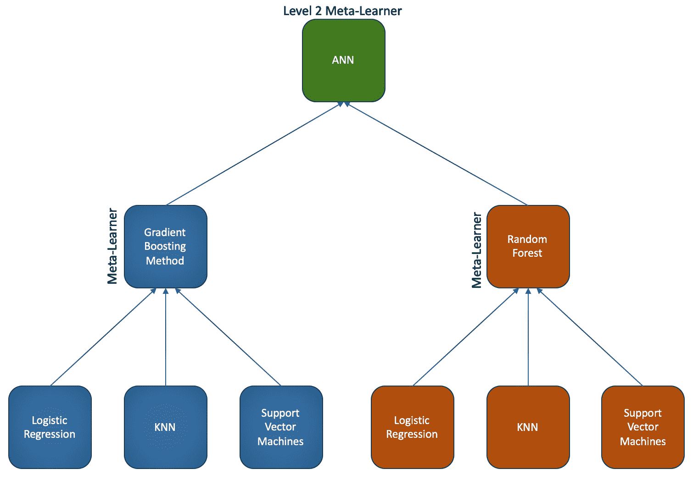
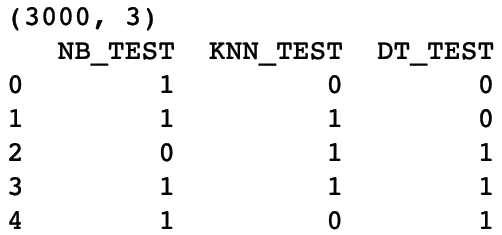
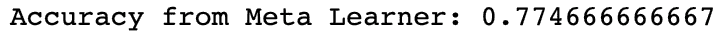
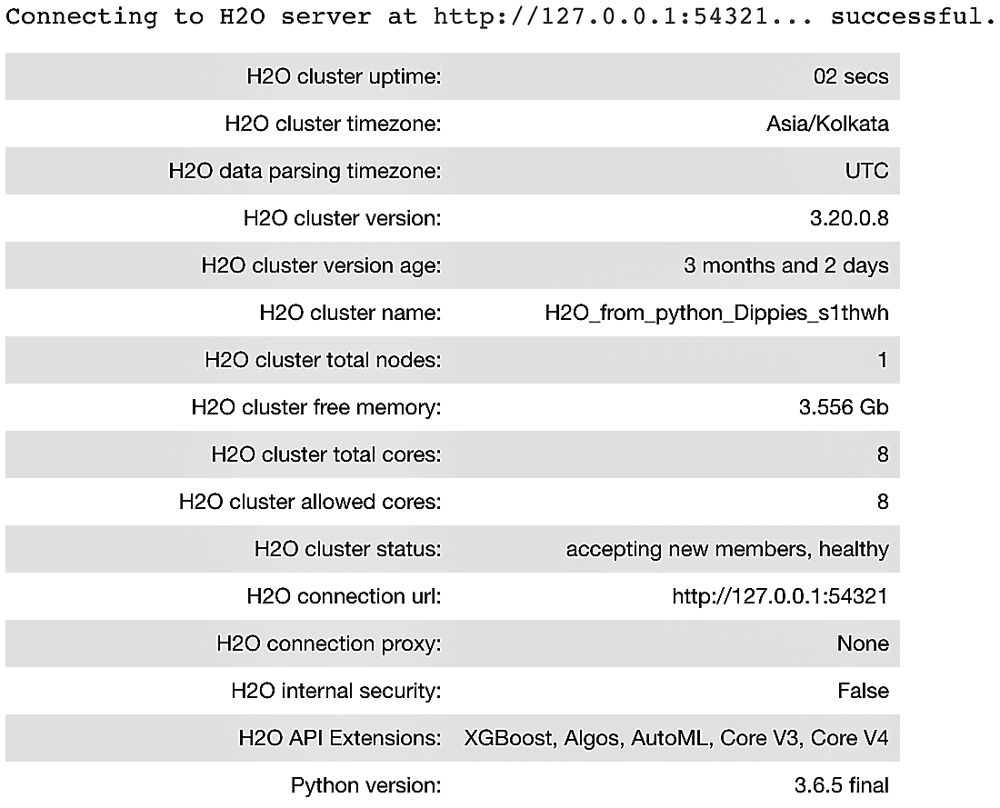

# 八、将它与堆叠混合

在本章中，我们将介绍以下配方:

*   了解堆叠概括
*   通过组合预测来实现堆叠式概化
*   使用 H2O 实现市场营销活动结果预测的堆叠概化


# 技术要求

本章的技术要求与我们在前面章节中详述的保持一致。

访问 GitHub 存储库，找到数据集和代码。数据集和代码文件是根据章节号和主题名排列的。


# 了解堆叠概括

堆叠概括是一组不同模型的集合，它引入了元学习者的概念。元学习器是第二级机器学习算法，它从基础学习器的最佳组合中学习:

“堆叠概括是一种非线性组合概括器以形成新概括器的方法，试图以最佳方式整合每个原始概括器对学习集的看法。每个概化器要说的越多(不会重复其他概化器要说的)，得到的堆叠概化就越好。”

- Wolpert (1992)*,* Stacked Generalization

堆叠的步骤如下:

1.  将数据集分为定型集和测试集。
2.  在训练集中训练几个基础学员。
3.  在测试集上应用基础学习者进行预测。
4.  使用预测作为输入，使用实际响应作为输出来训练更高水平的学习者。

因为来自基础学习者的预测被混合在一起，所以堆叠也被称为混合。

下图给出了堆叠的概念表示:



来自基础学习器的预测彼此不相关，这对于栈泛化具有重要意义。为了从基础学习器获得不相关的预测，可以使用内部使用不同方法的算法来训练基础学习器。堆叠概括主要用于最小化基础学习者的概括错误，并且可以被视为交叉验证的精炼版本。它使用一种比交叉验证的**赢家通吃**方法更复杂的策略来组合来自基础学习者的预测。


# 通过组合预测实现堆叠式概化

在本节中，我们将了解如何从头开始实现堆叠综合。

我们将执行以下步骤开始:

1.  为堆叠构建三个基础学习者。
2.  结合每个基础学习者的预测。
3.  使用另一种算法构建元学习器。


# 做好准备...

在这个例子中，我们使用了一个来自 UCI ML 数据库的关于信用卡违约的数据集。该数据集包含信用卡客户的违约付款、人口统计因素、信用数据、付款历史和账单等信息。GitHub 中提供了数据和数据描述。

我们将从加载所需的库和读取数据集开始:

```py
import os
import numpy as np
import pandas as pd
from sklearn.metrics import accuracy_score
```

我们将工作文件夹设置如下:

```py
# Set your working directory according to your requirement
os.chdir(".../Chapter 8/")
os.getcwd()
```

现在让我们来读取数据。我们将以`df_`作为数据帧名称的前缀，以便于理解:

```py
df_creditcarddata = pd.read_csv("UCI_Credit_Card.csv")
```

我们删除了`ID`列，因为这不是必需的:

```py
df_creditcarddata = df_creditcarddata.drop("ID", axis= 1) 
```

我们检查数据集的形状:

```py
df_creditcarddata.shape
```

我们注意到数据集现在有 30，000 个观察值和 24 列。现在让我们继续训练我们的模型。


# 怎么做...

1.  我们将目标变量和特征变量分开:

```py
from sklearn.model_selection import train_test_split

X = df_creditdata.iloc[:,0:23]
Y = df_creditdata['default.payment.next.month']
```

2.  将数据分成训练、验证和测试子集:

```py
# We first split the dataset into train and test subset
X_train, X_test, Y_train, Y_test = train_test_split(X, Y, test_size=0.1, random_state=1)

# Then we take the train subset and carve out a validation set from the same
X_train, X_val, Y_train, Y_val = train_test_split(X_train, Y_train, test_size=0.2, random_state=1)
```

3.  检查每个子集的尺寸，以确保我们的分割是正确的:

```py
# Dimensions for train subsets
print(X_train.shape)
print(Y_train.shape)

# Dimensions for validation subsets
print(X_val.shape)
print(Y_val.shape)

# Dimensions for test subsets
print(X_test.shape)
print(Y_test.shape)
```

4.  导入基础学习者和元学习者所需的库:

```py
# for the base learners
from sklearn.naive_bayes import GaussianNB
from sklearn.neighbors import KNeighborsClassifier
from sklearn.tree import DecisionTreeClassifier

# for the meta learner
from sklearn.linear_model import LogisticRegression
```

5.  创建基础学习者的实例，并根据我们的训练数据拟合模型:

```py
# The base learners
model_1 = GaussianNB()
model_2 = KNeighborsClassifier(n_neighbors=1)
model_3 = DecisionTreeClassifier()

# Now we train a list of models
base_learner_1 = model_1.fit(X_train, Y_train)
base_learner_2 = model_2.fit(X_train, Y_train)
base_learner_3 = model_3.fit(X_train, Y_train)
```

6.  使用我们验证子集中的基础学习者进行预测:

```py
# We then use the models to make predictions on validation data
val_prediction_base_learner_1 = base_learner_1.predict(X_val)
val_prediction_base_learner_2 = base_learner_2.predict(X_val)
val_prediction_base_learner_3 = base_learner_3.predict(X_val)
```

7.  我们有来自三个基础学习者的三组预测结果。我们用它们来创建一个堆叠阵列:

```py
# And then use the predictions to create a new stacked dataset
import numpy as np
prediction_test_stack = np.dstack([val_prediction_base_learner_1, val_prediction_base_learner_2, val_prediction_base_learner_3])

# Now we stack the actual outcomes i.e. Y_Test with the prediction_stack
final_train_stack = np.dstack([prediction_test_stack, Y_val])
```

8.  我们将`final_train_stack`堆叠数组转换为数据帧，并为每一列添加列名。验证尺寸并查看前几行:

```py
stacked_train_dataframe = pd.DataFrame(final_train_stack[0,0:5400], columns='NB_VAL KNN_VAL DT_VAL Y_VAL'.split())

print(stacked_train_dataframe.shape)
print(stacked_train_dataframe.head(5))
```

在下图中，我们看到堆叠阵列现在有 5，400 个观察值和 4 列:


9.  使用我们在*步骤 8* 中创建的堆叠数组来训练元学习者:

```py
# Build the Mata-learner
meta_learner = LogisticRegression()
meta_learner_model = meta_learner.fit(stacked_train_dataframe.iloc[:,0:3], stacked_train_dataframe['Y_VAL'])
```

10.  使用测试子集创建堆叠测试集:

```py
# Take the test data (new data)
# Apply the base learners on this new data to make predictions

# We now use the models to make predictions on the test data and create a new stacked dataset
test_prediction_base_learner_1 = base_learner_1.predict(X_test)
test_prediction_base_learner_2 = base_learner_2.predict(X_test)
test_prediction_base_learner_3 = base_learner_3.predict(X_test)

# Create the stacked data
final_test_stack = np.dstack([test_prediction_base_learner_1, test_prediction_base_learner_2, test_prediction_base_learner_3])
```

11.  将`final_test_stack`堆叠数组转换为数据帧，并为每列添加列名。验证尺寸并查看前几行:

```py
stacked_test_dataframe = pd.DataFrame(final_test_stack[0,0:3000], columns='NB_TEST KNN_TEST DT_TEST'.split())
print(stacked_test_dataframe.shape)
print(stacked_test_dataframe.head(5))
```

我们看到堆叠阵列现在有 3000 个观察值，在`stacked_test_dataframe`有 3 列:



12.  在我们的原始测试数据上检查`base_learner`的准确性:

```py
test_prediction_base_learner_1 = base_learner_1.predict(X_test)
test_prediction_base_learner_2 = base_learner_2.predict(X_test)
test_prediction_base_learner_3 = base_learner_3.predict(X_test)

print("Accuracy from GaussianNB:", accuracy_score(Y_test, test_prediction_base_learner_1))
print("Accuracy from KNN:", accuracy_score(Y_test, test_prediction_base_learner_2))
print("Accuracy from Decision Tree:", accuracy_score(Y_test, test_prediction_base_learner_3))
```

我们注意到精度如下。请注意，基于采样策略和超参数，结果可能会有所不同:


13.  对堆叠的测试数据使用元学习器并检查准确性:

```py
test_predictions_meta_learner = meta_learner_model.predict(stacked_test_dataframe)
print("Accuracy from Meta Learner:", accuracy_score(Y_test, test_predictions_meta_learner))
```

我们看到元学习者在堆叠的测试数据上返回了下面的输出。这种准确性高于单个基础学习者:




# 它是如何工作的...

在第一步中，我们将数据集分成目标和特征集。在*步骤 2* 中，我们创建了我们的训练、验证和测试子集。我们在*步骤 3* 中查看了每个子集的尺寸，以验证分割是否正确。

然后，我们继续构建我们的基础学习者和元学习者。在*步骤 4* 中，我们为基础学习者和元学习者导入了所需的库。对于基础学习者，我们使用高斯朴素贝叶斯、KNN 和决策树，而对于元学习者，我们使用逻辑回归。

在*步骤 5* 中，我们将基础学习者与我们的训练数据集相匹配。单个模型，包括高斯朴素贝叶斯、KNN 和决策树，在 0 级空间中建立。然后我们有了三个基本模型。

在*步骤 6* 中，我们在验证子集上使用这三个基础模型来预测目标变量。然后我们有三组由各自的基础学习者给出的预测。

现在，基础学习者将通过层叠概括在 1 级空间中通过逻辑回归被整合。在*步骤 7* 中，我们堆叠了三组预测值来创建一个数组。我们还将训练数据集的实际目标变量堆叠到数组中。然后，我们的数组中有四列:三列来自基础学习者的三组预测值，第四列来自我们的训练数据集的目标变量。我们称之为`final_train_stack`，即`stacked_train_dataframe`，我们根据基础学习者使用的算法来命名这些列。在我们的例子中，我们使用了名称`NB_VAL`、`KNN_VAL`和`DT_VAL`，因为我们分别使用了高斯朴素贝叶斯、KNN 和决策树分类器。因为基础学习者符合我们的验证子集，所以我们在列名后面加上了`_VAL`以使它们更容易理解。

在*步骤 9* 中，我们用逻辑回归构建了元学习器，并将其拟合到我们的堆叠数据集`stacked_train_dataframe`。请注意，我们从原始数据集转移到了堆叠数据集，其中包含来自基础学习者的预测值。

在*步骤 10* 中，我们使用测试子集上的基础模型来获得预测结果。我们称之为`final_test_stack`。在*步骤 11* 中，我们将`final_test_stack`数组转换为一个名为`stacked_test_dataframe`的数据帧。注意，在我们的`stacked_test_dataframe`中，我们只有三列，它们保存了应用于我们的测试子集的基础学习者返回的预测值。这三列以所使用的算法命名，后缀为`_TEST`，因此我们将`NB_TEST`、`KNN_TEST`和`DT_TEST`作为`stacked_test_dataframe`中的三列。

在*步骤 12* 中，我们在原始测试子集上检查了基础模型的准确性。高斯朴素贝叶斯、KNN 和决策树分类器模型分别给了我们 0.39、0.69 和 0.73 的准确率。

在*步骤 13* 中，我们检查了通过对我们的堆叠测试数据应用元学习者模型而获得的准确性。这给了我们 0.77 的准确率，我们可以看到，这比单个基础学习者要高。然而，请记住，简单地将更多的基础学习者添加到您的堆叠算法中并不能保证您会获得更好的准确性。


# 还有更多...

创建堆叠模型可能很繁琐。`mlxtend`库提供了简化构建堆叠模型的工具。它提供 StackingClassifier，这是用于堆叠的集成学习元分类器，它还提供 StackingCVClassifier，它使用交叉验证为第二级元学习器准备输入，以防止过拟合。

你可以从[https://pypi.org/project/mlxtend/](https://pypi.org/project/mlxtend/)下载这个库或者使用`pip install mlxtend`命令来安装它。你可以在[http://rasbt . github . io/mlx tend/user _ guide/classifier/stacking classifier/](http://rasbt.github.io/mlxtend/user_guide/classifier/StackingClassifier/)找到一些很棒的简单堆叠分类和带网格搜索的堆叠分类的例子。


# 请参见

也可以看一下`ML-Ensemble`库。要了解更多关于 T2 的信息，请访问 http://ml-ensemble.com/。https://bit.ly/2GFsxJN 有`ML-Ensemble`的使用指南。


# 使用 H2O 实现活动结果预测的堆叠综合

H2O 是一个用于构建机器学习和预测分析模型的开源平台。算法是在 H2O 的分布式 map-reduce 框架上编写的。借助 H2O，数据可以跨节点分布，并行读取，并以压缩方式存储在内存中。这使得 H2O 速度极快。

H2O 的堆叠集成方法是一种用于监督问题的集成机器学习算法，该算法使用堆叠来寻找一组预测算法的最佳组合。H2O 的堆叠集成支持回归、二元分类和多类分类。

在这个例子中，我们将看看如何使用 H2O 的堆叠系综来建立一个堆叠模型。我们将使用 Github 中提供的银行营销数据集。


# 做好准备...

首先，从 H2O 导入`h2o`库和其他模块:

```py
import h2o
from h2o.estimators.random_forest import H2ORandomForestEstimator
from h2o.estimators.gbm import H2OGradientBoostingEstimator
from h2o.estimators.glm import H2OGeneralizedLinearEstimator
from h2o.estimators.stackedensemble import H2OStackedEnsembleEstimator
from h2o.grid.grid_search import H2OGridSearch
```

使用`init()`函数初始化`h2o`实例:

```py
h2o.init()
```

一旦我们运行了前面的代码，`h2o`实例被初始化，我们将看到下面的输出:



现在我们已经实例化了一个`H2O`实例，我们继续读取数据集并构建堆叠模型。


# 怎么做...

1.  我们使用`h2o.import_file()`函数读取数据。我们将文件名作为参数传递给函数:

```py
df_bankdata = h2o.import_file("bank-full.csv")
```

2.  我们将数据分成训练和测试子集:

```py
# split into train and validation sets
train, test = df_bankdata.split_frame(ratios = [.8], seed = 1234)
```

3.  我们检查训练和测试子集的维度，以验证拆分是正确的:

```py
train.shape, test.shape
```

4.  我们看一下前几行，以确保数据加载正确:

```py
df_bankdata.head()
```

5.  我们将目标列名和预测列名分开，它们分别是`response`和`predictors`:

```py
# Set the predictor names 
predictors = train.columns

# Set the response column name
response = "y"

# Remove the 'y' variable from the predictors
predictors.remove(response)

print(predictors)
```

6.  我们用`asfactor()`函数将`response`变量转换成分类类型:

```py
train[response] = train[response].asfactor()
test[response] = test[response].asfactor()
```

7.  我们将使用交叉验证来培训我们的基础学习者。我们将`nfolds`值设置为`5`。我们还将变量“encoding”设置为“OneHotExplicit”。我们将使用这个变量来编码我们的分类变量。

```py
# Number of CV folds
nfolds = 5

# Using the `categorical_encoding` parameter
encoding = "OneHotExplicit"
```

8.  我们开始训练我们的基础学习者。我们选择梯度提升机器算法来构建我们的第一个基础学习器:

```py
# Train and cross-validate a GBM
base_learner_gbm = H2OGradientBoostingEstimator(distribution="bernoulli",\
                                                ntrees=100,\
                                                max_depth=5,\
                                                min_rows=2,\
                                                learn_rate=0.01,\
                                                nfolds=nfolds,\
                                                fold_assignment="Modulo",\
                                                categorical_encoding = encoding,\
                                                keep_cross_validation_predictions=True)

base_learner_gbm.train(x=predictors, y=response, training_frame=train)
```

9.  对于我们的第二个基础学习者，我们使用随机森林:

```py
# Train and cross-validate a RF
base_learner_rf = H2ORandomForestEstimator(ntrees=250,\
                                           nfolds=nfolds,\
                                           fold_assignment="Modulo",\
                                           categorical_encoding = encoding,\
                                           keep_cross_validation_predictions=True)
base_learner_rf.train(x=predictors, y=response, training_frame=train)
```

10.  对于我们的第三基础学习者，我们实现了一个**广义线性模型** ( **GLM** ):

```py
# Train and cross-validate a GLM
base_learner_glm = H2OGeneralizedLinearEstimator(family="binomial",\
                                                 model_id="GLM",\
                                                 lambda_search=True,\
                                                 nfolds = nfolds,\
                                                 fold_assignment = "Modulo",\
                                                 keep_cross_validation_predictions = True)

base_learner_glm.train(x = predictors, y = response,training_frame = train)
```

11.  根据`test AUC`获取测试集中表现最好的基础学习者。将其与堆叠系综模型的`test AUC`进行比较:

```py
# Compare to base learner performance on the test set
gbm_test_performance = base_learner_gbm.model_performance(test)
rf_test_performance = base_learner_rf.model_performance(test)
glm_test_performance = base_learner_glm.model_performance(test)

print("Best AUC from the GBM", gbm_test_performance.auc())
print("Best AUC from the Random Forest", rf_test_performance.auc())
print("Best AUC from the GLM", glm_test_performance.auc())

baselearner_best_auc_test = max(gbm_test_performance.auc(), rf_test_performance.auc(), glm_test_performance.auc())
print("Best AUC from the base learners", baselearner_best_auc_test)

stack_auc_test = perf_stack_test.auc()
print("Best Base-learner Test AUC: ", baselearner_best_auc_test)
print("Ensemble Test AUC: ", stack_auc_test)
```

12.  我们使用我们在前面的步骤中构建的基础学习器来训练堆叠集合:

```py
all_models = [base_learner_glm, base_learner_gbm, base_learner_rf]

# Set up Stacked Ensemble. Using Deep Learning as the meta learner
ensemble_deep = H2OStackedEnsembleEstimator(model_id ="stack_model_d", base_models = all_models, metalearner_algorithm = 'deeplearning')

ensemble_deep.train(y = response, training_frame = train)

# Eval ensemble performance on the test data
perf_stack_test = ensemble_deep.model_performance(test)
stack_auc_test = perf_stack_test.auc()
print("Ensemble_deep Test AUC: {0}".format(stack_auc_test))
```


# 它是如何工作的...

在*步骤 1* 中，我们使用了`h2o.import_file()`函数来读取我们的数据集。

`h2o.import_file()`函数返回一个`H2OFrame`实例。

在*步骤 2* 中，我们将`H2OFrame`分成训练和测试子集。在*步骤 3* 中，我们检查了这些子集的尺寸，以验证我们的分割是否足以满足我们的要求。

在*步骤 4* 中，我们查看了前几行，以检查数据是否被正确加载。在*步骤* *5* 中，我们分离出响应变量和预测变量的列名，在*步骤 6* 中，我们用`asfactor()`函数将响应变量转换成分类类型。

我们在*步骤 7* 中定义了一个名为`nfolds`的变量，用于交叉验证。我们还定义了一个变量`encoding`，我们在接下来的步骤中使用它来指示 H2O 对分类变量使用一键编码。在*步骤 8* 到*步骤 10* 中，我们构建了我们的基础学习者。

在*步骤 11* 中，我们训练了一个梯度提升机器模型。我们将一些值传递给几个超参数，如下所示:

`nfolds`:K 折交叉验证的折叠数。

*   `fold_assignment`:该选项指定交叉验证文件夹分配使用的方案。仅当指定了`nfolds`的值而未指定`fold_column`时，此选项才适用。
*   `distribution`:指定分布。在我们的例子中，由于响应变量有两个类，我们将`distribution`设置为`"bernoulli"`。
*   `ntrees`:树木数量。
*   `max_depth`:表示最大树深。
*   `min_rows`:一片叶子中允许的最少观察值。
*   `learn_rate`:学习率从`0.0`到`1.0`取值。
*   请注意，对于所有基础学员，交叉验证折叠必须相同，并且`keep_cross_validation_predictions`必须设置为`True`。

在*步骤 9* 中，我们使用以下超参数训练了一个随机森林基学习者:`ntrees`、`nfolds`、`fold_assignment`。

在*步骤 10* 中，我们用 GLM 训练了我们的算法。注意，我们没有对 GLM 中的分类变量进行编码。

H2O 建议用户允许 GLM 处理分类列，因为它可以利用分类列获得更好的性能和有效的内存利用。
来自 H2o.ai:“我们强烈建议避免将任何级别的分类列一次性编码成许多二进制列，因为这是非常低效的。对于那些习惯于为其他框架手动扩展分类变量的 Python 用户来说尤其如此”。

在*步骤 11* 中，我们为每个基础学习者生成了测试 AUC 值，并打印了最佳 AUC。

在*步骤 12* 中，我们通过使用`H2OStackedEnsembleEstimator`组合基础学习器的输出来训练堆叠集成模型。我们在测试子集上使用了经过训练的集成模型。注意，默认情况下，GLM 被用作`H2OStackedEnsembleEstimator`的元学习者。然而，在我们的例子中，我们使用深度学习作为元学习者。

注意，我们已经为元学习者使用了默认的超参数值。我们可以用`metalearner_params`指定超参数值。`metalearner_params`选项允许您传入一个字典/超参数列表，用于作为元学习器的算法。

微调超参数可以提供更好的结果。

还有更多...


# 您也可以组合一个模型列表，以不同方式堆叠在一起。在前面的例子中，我们训练了单个模型，并把它们放在一个列表中进行集成。我们也可以训练模型网格:

我们为网格指定随机森林超参数:

1.  我们使用前面代码中定义的超参数来训练网格:

```py
hyper_params = {"max_depth": [3, 4, 5, 8, 10],
                "min_rows": [3,4,5,6,7,8,9,10],
                "mtries": [10,15, 20],
                "ntrees": [100,250,500, 750],
                "sample_rate": [0.7, 0.8, 0.9, 1.0],
                "col_sample_rate_per_tree": [0.5, 0.6, 0.7, 0.8, 0.9, 1.0]}

search_criteria = {"strategy": "RandomDiscrete", "max_models": 3, "seed": 1}
```

2.  We train the grid using the hyperparameters defined in the preceding code:

```py
# Train the grid
grid = H2OGridSearch(model=H2ORandomForestEstimator(nfolds=nfolds,\
                                                    fold_assignment="Modulo",\
                                                    keep_cross_validation_predictions=True),\
                     hyper_params=hyper_params,\
                     search_criteria=search_criteria,\
                     grid_id="rf_grid_binomial")

grid.train(x=predictors, y=response, training_frame=train)
```

我们使用随机森林网格来训练集合:

3.  前面的代码将给出最好的基础学习者测试 AUC，并测试来自集合模型的 AUC。如果响应变量高度不平衡，可考虑微调以下超参数来控制过采样和欠采样:

```py
# Train a stacked ensemble using the RF grid
ensemble = H2OStackedEnsembleEstimator(model_id="ensemble_rf_grid_binomial_9", base_models=grid.model_ids)

ensemble.train(x=predictors, y=response, training_frame=train)

# Evaluate ensemble performance on the test data
perf_stack_test = ensemble.model_performance(test)

# Compare to base learner performance on the test set
baselearner_best_auc_test = max([h2o.get_model(model).model_performance(test_data=test).auc() for model in grid.model_ids])

stack_auc_test = perf_stack_test.auc()

print("Best Base-learner Test AUC: ", baselearner_best_auc_test)
print("Ensemble Test AUC: ", stack_auc_test)
```

`balance_classes`:该选项可用于平衡等级分布。启用后，H2O 将对多数类进行欠采样或对少数类进行过采样。如果启用该选项，您也可以为`class_sampling_factors`和`max_after_balance_size`选项指定一个值。

*   `class_sampling_factors`:默认情况下，训练时会自动计算采样因子以获得类别平衡。使用`class_sampling_factors`参数可以改变这种行为。该选项为每个类别设置过采样或欠采样比率，并需要`balance_classes=true`。

*   `max_after_balance_size`:在大多数情况下，将`balance_classes`设置为 true 会增加数据帧的大小。要减小数据帧的大小，可以使用`max_after_balance_size`参数。这指定了平衡类计数后训练数据的最大相对大小，默认为`5.0`。
*   请参见


# 看看`StackNet`，它是由 Marios Michailidis 开发的，作为他博士学位的一部分。`StackNet`在麻省理工学院许可下可用。这是一个可扩展的分析框架，类似于前馈神经网络，并使用 Wolpert 的堆叠泛化概念来提高机器学习预测任务的准确性。它使用元学习者的概念，因为它使用一些算法的预测作为其他算法的特征。StackNet 还可以在多个级别上扩展堆叠。然而，这是计算密集型的。它最初是用 Java 开发的，但是一个名为`pystacknet`的更轻便的 Python 版本`StackNet`现在也可以使用了。

让我们想想 StackNet 是如何工作的。在神经网络的情况下，将一层的输出作为输入插入到下一层，并应用激活函数，如 sigmoid、tanh 或 relu。类似地，在 StackNet 的情况下，激活函数可以用任何受监督的机器学习算法来代替。

堆叠元件可以在两种模式下运行:正常堆叠模式和重新堆叠模式。在正常堆叠模式下，每一层都使用前一层的预测。在重新堆叠模式的情况下，每一层使用前一层的神经元和激活。

使用 StackNet 的示例代码由以下步骤组成:

导入所需的库(注意，我们已经从`pystacknet`库导入了`StackNetClassifier`和`StackNetRegressor`):

1.  Import the required libraries (note that we have imported `StackNetClassifier` and `StackNetRegressor` from the `pystacknet` library):

```py
import numpy as np

# import required libraries from sklearn
from sklearn.tree import DecisionTreeClassifier
from sklearn.ensemble import RandomForestClassifier, GradientBoostingClassifier
from sklearn.linear_model import LogisticRegression

from sklearn.metrics import roc_auc_score, log_loss
from sklearn.model_selection import StratifiedKFold

# import StackNetClassifier and StackNetRegressor from pystacknet
from pystacknet.pystacknet import StackNetClassifier,StackNetRegressor
from pystacknet.metrics import rmse,mae
```

我们读取数据，删除`ID`列，并检查数据集的维度:

2.  我们将目标变量和预测变量分开。我们还将数据分成训练和测试子集:

```py
df_creditcarddata = pd.read_csv("UCI_Credit_Card.csv")

#dropping the ID column, as it would not be required
df_creditcarddata.drop(["ID"],axis=1,inplace=True)

# Check the shape of the data
df_creditcarddata.shape
```

3.  我们为基础学习者和元学习者定义了模型:

```py
#create the predictor & target set
X = df_creditcarddata.iloc[:,0:23]
Y = df_creditcarddata['default.payment.next.month']

# Create train & test sets
X_train, X_test, Y_train, Y_test = \
train_test_split(X, Y, test_size=0.20, random_state=1)
```

4.  我们现在使用`StackNetClassifier`来构建堆叠系综。但是，请注意，我们使用`restacking=False`，这意味着它使用正常堆叠模式:

```py
models=[[DecisionTreeClassifier(criterion="entropy", max_depth=5, max_features=0.5, random_state=1),
GradientBoostingClassifier(n_estimators=100, learning_rate=0.1, max_depth=5, max_features=0.5, random_state=1),
LogisticRegression(random_state=1)],
[RandomForestClassifier (n_estimators=500, criterion="entropy", max_depth=5, max_features=0.5, random_state=1)]]
```

5.  We now use `StackNetClassifier` to build the stacking ensemble. However, note that we use `restacking=False`, which means that it uses the normal stacking mode:

```py
model=StackNetClassifier(models, metric="accuracy", folds=4, restacking=False, use_retraining=True, use_proba=True, random_state=12345, n_jobs=1, verbose=1)

model.fit(X_train,Y_train )

# Uses the meta-learner model to predict the outcome
preds=model.predict_proba(X_test)[:,1]
print ("TEST ACCURACY without RESTACKING, auc %f " % (roc_auc_score(Y_test,preds)))
```

对于`restacking=True`，`StackNetClassifier`将使用重新堆叠模式来构建模型。

在 Kaggle，有各种 StackNet 用于赢得比赛的案例研究。如何使用`StackNet`的示例可在[https://bit.ly/2T7339y](https://bit.ly/2T7339y)获得。

There are various case studies of StackNet being used in winning competitions in Kaggle. An example of how `StackNet` can be used is available at [https://bit.ly/2T7339y](https://bit.ly/2T7339y).