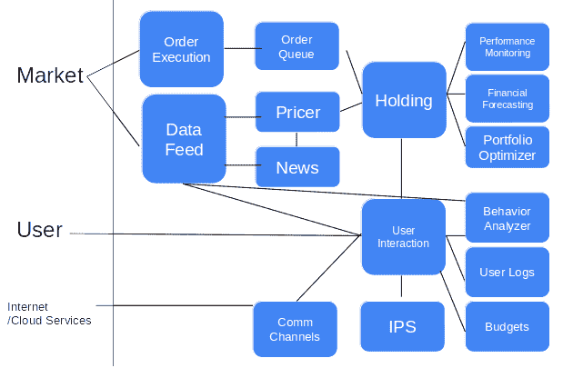

# 八、与银行一起打造个人财富顾问

在前一章中，我们分析了交易所卖方的行为。我们还学习了情绪分析，并通过学习如何使用情绪分析来分析市场需求，获得了关于该主题的深入知识。然后，我们了解了一点 Neo4j，这是一种 NoSQL 数据库技术。然后，我们使用 Neo4j 构建并存储了一个涉及证券交易的实体网络。

在本章中，我们将重点关注个人银行业务，并了解管理客户数字数据的需求。然后，我们将学习如何访问 Open Bank 项目，这是一个开放银行的开源平台。之后，我们将看一个用银行 API 包装人工智能模型的例子。最后，我们将学习文档布局分析。

我们将在本章中讨论以下主题:

*   管理客户的数字数据
*   开放银行项目
*   执行文档布局分析
*   使用开放银行 API 的现金流预测
*   使用发票实体识别来跟踪日常费用

我们开始吧！

# 管理客户的数字数据

在这个数字化的时代，没有理由货币不能 100%透明，或者货币转账不能全天候实时进行。消费者有权使用他们的数据，因为这些数据代表了他们的身份。无论可能与否，我们都应该整合我们自己的数据——实际上，这应该在今天和未来几年内发生。最好将我们的银行数据整合到一个地方；比如我们的常旅客里程。关键点是应该有两层数据架构——一层用于整合(包括存储)，另一层用于运行人工智能服务，该服务将用于通过使用智能设备来分析数据，也称为**移动应用**。在不了解数据整合层发生了什么的情况下，设计一个人工智能算法可能会很痛苦。

在这里，我们的数据源可以是身份数据、生物/心理数据、财务数据、可能影响这些静态数据的事件，以及代表我们与他人(包括人类、物体、生物体等)关系的社交数据。事实上，这非常类似于**企业对企业** ( **B2B** )的设置，其中任何公司都可以通过其法律身份、股东/所有权结构、财务健康、事件以及其商业关系来表示，如[第 7 章](d29ff3a8-3879-4d50-8795-a39bae5cc793.xhtml)、*在卖方*感知算法营销的市场情绪。这也意味着我们在这一章所学的东西可以帮助你理解本书前面的章节。

然而，对包括你在内的所有个人来说，我们的财务需求是非常基本的——它们包括支付、信贷和财富。这些阐明了金融服务的核心活动。保险是财富的一部分，因为它旨在保护我们的财富免受不良事件和风险的影响——这就像第二章、*时间序列分析*中对冲采购成本风险的衍生品。

然而，我也认为来自消费者的数据也归处理交易的银行所有。这就像亲子关系，所有关于数据的决定(父母的孩子)都是在数据所有者(消费者)和数据生产者(银行)之间达成一致的。现在缺乏的是将数据和使用这些数据的经济利益快速归因于某些经济活动的技术，例如营销。如果一个组织(例如，一家超市)出于营销目的向社交媒体(例如，谷歌、脸书和 Twitter)支付消费者数据，数据所有者将获得一部分经济利益。如果没有数据技术的进步，仅仅依靠法律法规是不现实的。

# **开放银行项目**

世界上最先进的允许消费者整合自己数据的政策被称为**开放银行项目**。它始于 2016 年的英国，遵循了欧洲的指令 PSD 2——修订后的支付服务指令([https://www . ECB . Europa . eu/paym/intro/MIP-online/2018/html/1803 _ revised PSD . en . html](https://www.ecb.europa.eu/paym/intro/mip-online/2018/html/1803_revisedpsd.en.html))。这改变了银行的竞争格局，降低了出于财务咨询目的利用银行信息的准入门槛。这使得机器人顾问成为一项可行的业务，因为银行包含的金融数据不再是独立的。

这个项目的挑战在于，现有的主流银行没有多少动力开放他们的数据。在消费者方面，数据整合的缓慢影响了银行服务金融数据互联网络的经济价值。这遵守梅特卡夫定律，该定律指出，网络的价值相当于连接用户的平方数(在我们的例子中，是银行)。下表使用博弈论分析了这种情况，以预测银行和消费者的结果，假设消费者在市场上只有两家银行，有四种可能的结果:

| **单元格价值=收益**
**银行 A/银行 B/消费者** | **银行 B:开放银行 API** | **银行 B:未开通银行 API** |
| 银行 A:开放银行 API | 0.5\0.5\2 | 0.5\1\1 |
| 银行 A:未开放银行 API | 1\0.5\1 | 1\1\1 |

对于现状(即没有任何开放的银行 API)，让我们假设银行 A 和 B 都将享受 1 个单位的好处，而消费者也将有 1 个单位的好处。

对于任何开发开放银行 API 的银行来说，他们将需要消耗 0.5%的资源。因此，我们将有两个单元格显示银行 A 或 B 开发了开放银行 API，而另一个没有。开发 Open Bank API 的好处会更少，因为最初 1 个单位中的 0.5 个单位将需要作为维护 API 的资源。在这两种情况下，消费者不能享受任何额外的好处，因为数据没有被整合。

只有在所有银行都采用开放银行 API 的情况下，消费者才会看到增加的好处(让我们假设多了一个单元，所以总共有两个，只是任意的)，而两家银行都只有更少的好处。当然，这可能是错误的，因为市场作为一个整体将更具竞争力，这就是英国虚拟银行的情况——一个新的细分市场因这一举措而产生！因此，最终，所有银行都可以提高收益。

话虽如此，但大多数现有银行的现实是，他们必须维护两套银行服务，一套完全是虚拟的，而另一套银行渠道仍然是实体的，不可扩展。或许前进的道路是在现有渠道之外建立另一个银行渠道，将客户转移到那里。

由于目前还没有实现真正理想的状态，要构建一个数字你，需要来自英国的**开放银行项目**(**)的金融交易数据(【https://uk.openbankproject.com/】)、来自欧盟的通过 Digidentity 进行的身份验证([【https://www.digidentity.eu/en/home/】](https://www.digidentity.eu/en/home/))、来自新加坡的通过 IHiS 存储的健康记录([【https://www.ihis.com.sg/】](https://www.ihis.com.sg/))、来自脸书、Twitter、Instagram 和 LinkedIn 的事件和社交数据、来自保险公司的生活事件等等。简而言之，在我们联合所有这些数据源之前，我们仍然需要在每个单独的系统部署上工作。**

 **## 智能设备——使用 API 和 Flask 和 MongoDB 作为存储

你的智能设备是一个个性化的私人银行家:该软件将与市场和你互动。在智能设备内部，核心模块是**持有**和**用户交互**模块。**持有**模块将保障用户/客户的投资，而用户的交互和用户本身由**用户交互**模块问候和连接。

**Holding** 模块通过管理投资组合和捕捉各种市场数据来处理投资的量化方面——这正是我们在前两章中所涉及的内容，但是是在个人层面。然而，不同之处在于，我们需要通过在**用户交互**模块中捕获的行为数据来更好地了解用户/客户。手持模块的**是智能设备的认知大脑。**

当然，**用户交互**模块提供了智能设备的交互方面——它理解用户在投资和交互方面的偏好。这些投资偏好在**投资政策声明** ( **IPS** )中有所体现。这些交互然后由**行为分析器**处理，行为分析器分析交流的首选时间、渠道和信息，以及用户关于其实际个性和风险偏好的财务行为，这两者都来自从外部来源的**数据馈送**获得的数据或用户使用设备生成的数据。最后但同样重要的是，**通信通道** ( **通信通道**)通过语音、文本或者可能通过物理机器人与用户进行物理交互。

这很好地总结了我们在[第一章](1464aff7-9b01-4476-bce9-7da307ef0211.xhtml)、*中提到的人工智能在银行业的重要性*，作为人工智能的定义——一台像人类一样思考和行动的机器，无论是理性还是情感，或者两者兼而有之。**持有**模块是人类的理性大脑，并在市场中相应地行动，而它的情绪由**用户交互**模块处理——由**行为分析器**同情，以及它们如何通过**通信通道**进行交互。下图显示了通过银行职能进行的市场和用户互动:



由于我们已经在前两章中讨论了关注投资过程的**持有**模块，在这里，我们将更多地关注**用户交互**模块。具体来说，我们将深入挖掘 **IPS** ，它记录了用户的投资需求。

### 了解 IPS

正如我们在[第 6 章](0e7c4e25-941b-4bd6-a04a-55924bdbaa43.xhtml)、*中提到的，使用 Treynor-Black 模型和 ResNet* 的自动化投资组合管理，我们将在这里开始查看个人的投资政策声明。为此，我们需要收集数据来为单个客户建立 IPS。

以下是为一个家庭构建 IPS 需要做的事情:

*   **回报和风险目标**:

| **目标** | **评论** |
| 退货目标 | 由投资者通过行为分析器—性格分析输入 |
| 承担风险的能力 | 由投资者通过行为分析器—性格分析输入 |
| 愿意承担风险 | 由投资者通过行为分析器—性格分析输入 |

*   **约束条件**:

| **约束** | **评论** |
| 资产流动性 | 资产的流动性可以通过智能设备内的价格来确定。 |
| 时间范围 | 为孩子的未来做好计划——他们的学业(在哪所学校，多少钱，等等)，住房计划，工作，退休，等等。 |
| 税收(都是美国公民) | 通过数字身份获得公民身份。 |
| 法律和监管环境 | 这可能会牵涉到商业交易、公民身份、就业和居住限制。你可能还需要考虑管理你的财富的法律实体，比如家族信托。 |
| 独特的环境 | 兴趣和特殊情况是不为人知的，包括社交媒体或医疗档案，从*标准*用户中脱颖而出——这需要在用户之间匿名比较，以提供真实、独特的情况。 |

## 行为分析器-支出分析器

类似于[第二章](9ee6480e-c259-4e5d-bc11-31057de1a173.xhtml)、*时间序列分析* s，我们将预测市场中每天的现金流。由于大多数情况下(甚至大多数工薪阶层)的收入是按月固定的，唯一变动的部分是支出。在这些支出中，可能有食品杂货等常规支出，也可能有购买白色家电甚至汽车等非常规支出。对于跟踪和预测定期消费习惯以及不定期消费的机器来说，实用的方法是在这些习惯发生时有效地记录它们。

## 将人工智能服务公开为 API

虽然我们在[第 6 章](0e7c4e25-941b-4bd6-a04a-55924bdbaa43.xhtml)、*中使用 Treynor-Black 模型和 ResNet* 构建的投资组合优化模型很棒，但本章将讨论的关键技术将演示如何包装 AI 模型并通过 API 提供给用户。关于技术建模技巧，我们不打算在这一章增加任何新的技术。

# 执行文档布局分析

在 ML 中，有一门学科叫做**文档布局分析**。它确实是关于研究人类如何理解文档的。它包括计算机视觉、自然语言处理和知识图表。最终的游戏是交付一个本体，它可以允许任何文档被导航，类似于文字处理器，但是是以一种自动化的方式。在文字处理器中，我们必须定义在标题中以及层次结构的不同级别中出现的某些单词，例如，标题 1 级、标题 2 级、正文、段落等等。不是由人类手动定义的是句子、词汇、单词、字符、像素等等。然而，当我们处理相机或扫描仪拍摄的图像时，最低级别的数据是像素。

## 文档布局分析的步骤

在本节中，我们将学习如何执行文档布局分析。步骤如下:

1.  **由像素形成字符**:用于将像素转换成字符的技术被称为**光学字符识别** ( **OCR** )。这是一个众所周知的问题，可以通过许多深度学习的例子来解决，包括 MNIST 数据集。或者，我们可以使用 Tesseract-OCR 来执行 OCR。
2.  **图像旋转**:当图像没有处于正确的垂直方向时，可能会对人们阅读字符造成挑战。当然，这一领域的新研究似乎可以跳过这一步。
3.  从字符中形成单词:实际上，我们不能一分一秒地等待这一切发生；有了人类的表现，我们就能正确地做到这一点。我们怎么知道一个字符应该与其他字符结合在一起形成一个单词？我们从空间线索中得知这一点。然而，字符之间的距离不是固定的，所以我们如何教机器理解这种空间距离？这也许是大多数患有诵读困难症的人面临的挑战。机器也默认患有诵读困难症。
4.  **从单词中建立意义**:这需要我们知道论文的主题和单词的拼写，这有助于我们查看各种字典，了解文档是关于什么的。*学习*(就本书中的深度学习而言)可能意味着只是一个与教育相关的话题，我们之所以知道这一点，是因为你知道这本书是 Packt 的机器学习书籍，Packt 是你过去了解过的出版商名称。否则，仅仅通过阅读 Packt 这个词，我们就可能猜测它与一家包装公司(即 PACK-t)有关？此外，我们还从标签词中得到线索— *步骤 3* 本身看起来就像是在它的右侧介绍实际内容的标签词。

将单词分类为各种通用类型的实体很有帮助，例如，日期、序列号、金额、时间等等。这些是我们通常在 spaCy 等开源空间中看到的通用实体，我们在[第 7 章](d29ff3a8-3879-4d50-8795-a39bae5cc793.xhtml)、*中使用它们来感知销售方算法营销的市场情绪*。

关于单词形式的空间线索，我们可能会理解较大单词的重要性，而较少关注较小的单词。页面上单词的位置也很重要。比如阅读英语，我们一般是从上到下，从左到右阅读，而其他一些语言，我们需要从右到左，从上到下阅读，比如古代汉语。

## 使用 Gensim 进行主题建模

在我们的主题建模的例子中，我们将关注*步骤 4* 来限制我们的工作范围。我们将这样做，同时我们将从*步骤 1* 到*步骤 3* 的准备工作视为理所当然，并跳过*步骤 5* 和*步骤 6* 。我们将使用的数据集图像已经过清理、旋转和 OCRed 处理，包括绑定字符以形成单词。我们手头的是一个数据集，每个记录由一个文本块表示，其中可能包含多个单词。Gensim 关注的是跟踪文本中的名词。

## Word2vec 的向量维数

Word2Vec 根据单词的不同特征来定义单词——每个单词的特征值由出现在同一个句子中的单词之间的距离来定义。它意味着量化概念和主题之间的相似性。在我们的 Word2vec 示例中，我们将使用预先训练的模型将文本转换为单词。然而，对于每个文本块，可能涉及几个值。在这种情况下，一系列这些向量将被压缩成一个值，使用一个叫做**特征值**的值。我们将使用这个简单的方法来执行降维，当我们想要减少变量的特征(维度)数量时，我们会这样做。最常见的降维方法叫做**主成分分析** ( **PCA** )。它主要应用于标量，而不是变量的向量。想象一下，每个单词都用一个向量来表示。这里，具有两个单词的一个文本块将由两个向量组成的矩阵来表示。因此，PCA 可能不是这种降维任务的理想解决方案。

在解释代表单词主题的向量时，分析所涉及的维度是很重要的，因为每个维度代表一个语义/意义组。在我们的 Word2vec 示例中，我们将跳过这一步，以避免在有意义的提取过程中加入过多的维度。这意味着为了便于说明，我们将使用更小的特征空间。

# 使用开放银行 API 的现金流预测

在未来，我们将需要机器人顾问能够理解我们的需求。最基本的步骤是能够从各银行提取我们的财务数据。这里，我们将假设我们是来自美国的消费者银行服务的客户，他们住在英国。我们正在寻找一个四口之家的财富规划——一对夫妇和两个孩子。我们需要的是一个机器人顾问来为我们执行所有的财务活动。

我们将从**开放银行项目** ( **OBP** ) API 中检索所有必要的交易数据，以通过开放银行 API 预测我们的支出预测。我们将使用的数据是模拟数据，遵循 OBP 中指定的格式。我们不打算深入研究任何软件技术，而是专注于构建财富规划引擎。我们将使用的家庭描述来自美联储([https://www . federal reserve . gov/econresdata/2016-economic-well-of-us-families-in-2015-Income-and-savings . htm](https://www.federalreserve.gov/econresdata/2016-economic-well-being-of-us-households-in-2015-Income-and-Savings.htm))关于美国家庭财务的信息。

下表显示了美国家庭的典型价值观，这有助于我们了解消费者银行业务的总体需求:

| **收入/费用** | **价值(美元)** | **数据源(OBS)** |
| **收入** | **102.7** |  |
| 劳动人民的工资 | One hundred and two point seven | 每月最大的自动付款，每月固定工资。 |
| **生活费** | **67.3** |  |
| 年度费用 | Fifty-seven point three | 从信用卡、储蓄和活期账户中检索所有交易。 |
| 债务偿还 | Ten | 与债务帐户相关的交易记录。 |
| **净资产** | **97** |  |
| **资产** | **189.9** |  |
| 金融资产 | Twenty-three point five | 证券账户余额。看不到 401 计划。 |
| 非金融资产 | One hundred and fifty-eight point nine | Zillow 提供的房屋估价。 |
| **负债** | **92.6** |  |
| 抵押贷款 | Fifty-nine point five | 债务账户的未清余额。 |
| 汽车贷款和教育债务 | Thirty-two point eight | 汽车贷款:债务账户余额；学生贷款(联邦)，对应的是联邦学生贷款；学生贷款(私人):债务账户的未清余额。 |

更多关于 Zillow 的细节，请参考此链接:[https://www.zillow.com/howto/api/APIOverview.htm](https://www.zillow.com/howto/api/APIOverview.htm)。

## 涉及的步骤

要使用开放银行 API，我们需要执行以下操作:

1.  注册使用开放银行 API。
2.  下载必要的数据。
3.  创建一个数据库来存储这些数据。
4.  设置用于预测的 API。

我们开始吧！

### 注册使用开放银行 API

我们可以通过多种方式访问开放银行项目——我们将在 https://demo.openbankproject.com/注册的一个项目上工作。

### 创建和下载演示数据

这部分的代码可以从 GitHub 下载([https://GitHub . com/openbank project/Hello-OBP-direct log in-Python](https://github.com/OpenBankProject/Hello-OBP-DirectLogin-Python))。基于这个存储库中的`hello_obp.py`文件，我们修改了程序，以便它下载所需的数据。使用以下代码片段下载演示数据:

```
# -*- coding: utf-8 -*-

from __future__ import print_function    # (at top of module)
import sys
import time
import requests

# Note: in order to use this example, you need to have at least one account
# that you can send money from (i.e. be the owner).
# All properties are now kept in one central place

from props.default import *

# You probably don't need to change those
...

#add the following lines to hello-obp.py before running it
#add lines to download the file
print("")
print(" --- export json")
import json
f_json = open('transactions.json','w+')
json.dump(transactions,f_json,sort_keys=True, indent=4)
```

### 创建 NoSQL 数据库以在本地存储数据

我更喜欢 MongoDB，因为它能够以分层的方式导入 JSON 文件，而不需要我们预先定义结构。尽管每当我们需要使用 ML 模型运行预测时，我们都需要以 SQL 数据库格式存储 NoSQL 文件(正如我们在上一章中所做的那样),但在运行预测之前物理缓存下载的数据仍然是有用的。

所以，你可能想知道为什么我们需要把它存储在 NoSQL 数据库中——我们不能像上一章处理 tweet 数据时那样保存它吗？不——我们希望使用数据库，因为为了更快地检索，我们将无限期地存储成千上万的 JSON 文件，而不是批量下载。这也取决于我们希望下载数据的频率；如果我们希望每天更新数据库，我们可能不需要将 JSON 数据存储在 NoSQL 数据库中，因为我们没有太多的文件要处理。但是，如果我们正在查询数据或不断向训练数据集添加新的特征，我们最好将原始数据存储在我们这边。

以下代码用于建立我们与 MongoDB 服务器的连接:

```
from pymongo import MongoClient
import json
import pprint

#client = MongoClient()
client = MongoClient('mongodb://localhost:27017/')
db_name = 'AIFinance8A'
collection_name = 'transactions_obp'

f_json = open('transactions.json', 'r')
json_data = json.loads(f_json)

...

#to check if all documents are inserted
...
```

以下代码用于创建数据库:

```
#define libraries and variables
import sqlite3
from pymongo import MongoClient
import json
from flatten_dict import flatten

client = MongoClient('mongodb://localhost:27017/')
db_name = 'AIFinance8A'
collection_name = 'transactions_obp'

db = client[db_name]
collection = db[collection_name]
posts = db.posts

...

#flatten the dictionary
...

#create the database schema
#db file
db_path = 'parsed_obp.db'
db_name = 'obp_db'

#sql db
...
sqlstr = 'drop table '+db_name
...
print('create')
...
#loop through the dict and insert them into the db
...

for cnt in dict_cnt:
    ...
    for fld in tuple_fields_list:
        ...
    ...
    sqlstr = 'insert into '+ db_name+ '(' + str(fld_list_str)+') VALUES \
                                       ('+question_len[1:]+')'
    ...
```

### 为预测设置 API

为了对支付进行预测，我们需要知道我们想要建立什么样的预测模型。我们需要时间序列模型还是 ML 模型？当然，我们希望有一个提供更多信息的模型。

在我们的例子中，我们没有为此准备任何模型，因为我们将使用的方法将类似于我们在[第 2 章](9ee6480e-c259-4e5d-bc11-31057de1a173.xhtml)、*时间序列分析*中使用的模型。这里要说明的要点是如何设置 API 服务器，以及如何使用另一个程序来消费 API。请确保这两个程序同时运行。

服务器将被设置为侦听请求，以便可以运行预测。我们将简单地加载模型，而不运行任何预测。以下代码片段用于将我们连接到 Open Bank API 服务器:

```
#Libraries
from flask import Flask, request, jsonify
from sklearn.externals import joblib
import traceback
import pandas as pd
import numpy as np

# Your API definition
app = Flask(__name__)

@app.route('/predict', methods=['POST'])
def predict():
    ...

#Run the server
if __name__ == '__main__':
    ...
```

以下代码片段用于从客户端应用创建请求:

```
import requests

host = 'http://127.0.0.1:12345/'

r = requests.post(host+'predict', json={"key": "value"})
print(r)
```

恭喜你！你已经建造了一个可以从银行读取数据的机器人，并建造了它，以便它可以根据这些数据运行人工智能模型。

对于一个家庭来说，限制开支以增加现金流变得至关重要。在下一节中，我们将了解如何使用发票实体识别技术来跟踪日常开支。

# 使用发票实体识别来跟踪日常费用

虽然我们一直梦想着通过金融领域的人工智能实现数字化的最终游戏，但现实是，有些数据被困住了。通常，这些费用是以纸张的形式出现的，而不是 API 提要。如果我们要把自己转换成一个完全数字化的世界，我们所有的信息都存储在 JSON 文件或 SQL 数据库中，处理纸张将是不可避免的。我们不能避免处理现有的纸质信息。使用一个基于纸面的文档数据集示例，我们将演示如何构建发票实体提取模型的引擎。

在本例中，我们将假设您正在开发自己的引擎来扫描发票并将其转换为结构化数据格式。然而，由于缺乏数据，您将需要解析专利图像数据集，该数据集可从[http://machine learning . ing INF . units . it/data-and-tools/ghega-dataset](http://machinelearning.inginf.units.it/data-and-tools/ghega-dataset)获得。在数据集中，有我们想要从中提取的图像、文本块和目标结果。这就是所谓的**实体抽取**。这里的挑战是这些发票不是标准化的格式。不同的商家开具不同大小和格式的发票，但我们仍然能够理解视觉线索(字体大小、线条、位置等)和文字及其周围文字的语言(称为**标签**)。

## 涉及的步骤

我们必须遵循六个步骤来使用发票实体识别跟踪日常开支。这些步骤如下:

1.  导入相关的库并定义变量。在本例中，我们将介绍主题建模，包括使用`gensim`将**单词转化为矢量** ( `Word2vec`)，以及使用内置模块`re`的正则表达式。以下代码片段用于导入所需的库:

```
import os
import pandas as pd
from numpy import genfromtxt
import numpy as np
from gensim.models import Word2Vec
from gensim.models.keyedvectors import WordEmbeddingsKeyedVectors
import gensim.downloader as api
from gensim.parsing.preprocessing import remove_stopwords
from gensim.parsing.preprocessing import preprocess_string, strip_tags, remove_stopwords,strip_numeric,strip_multiple_whitespaces
from scipy import linalg as LA
import pickle
import re
from sklearn.model_selection import train_test_split
from sklearn.neural_network import MLPClassifier
from sklearn.preprocessing import StandardScaler
from sklearn.metrics import classification_report,roc_curve, auc,confusion_matrix,f1_score

#please run this in terminal: sudo apt-get install libopenblas-dev
model_word2vec = api.load("text8") # load pre-trained words vectors
```

2.  定义以后需要使用的功能。将有两组函数—一组是`2A`，用于训练和测试神经网络，而另一组是`2B`，旨在将文本转换为数值。以下代码片段定义了将用于发票实体识别的函数:

```
#2\. Define functions relevant for works
##2A Neural Network
##2A_i. Grid search that simulate the performance of different neural network design
def grid_search(X_train,X_test, Y_train,Y_test,num_training_sample):
...
##2A_ii train network
def train_NN(X,Y,target_names):
...
#2B: prepare the text data series into numeric data series
#2B.i: cleanse text by removing multiple whitespaces and converting to lower cases
def cleanse_text(sentence,re_sub):
...
#2B.ii: convert text to numeric numbers
def text_series_to_np(txt_series,model,re_sub):
...

```

3.  准备数据集。在这个例子中，我们将尝试使用`numpy`来存储特征，因为它们相当大。我们还将对每个文件使用`pandas`,因为如果每个图像的大小不太大，使用 DataFrame 操作和选择列要容易得多。以下代码片段用于准备数据集:

```
#3\. Loop through the files to prepare the dataset for training and testing
#loop through folders (represent different sources)
for folder in list_of_dir:
    files = os.path.join(path,folder)
    #loop through folders (represent different filing of the same 
     source)
    for file in os.listdir(files):
        if file.endswith(truth_file_ext):
        #define the file names to be read
         ...

        #merge ground truth (aka target variables) with the blocks 
         ...

        #convert the text itself into vectors and lastly a single 
        value using Eigenvalue
        text_df = f_df['text']
        text_np = text_series_to_np(text_df,model_word2vec,re_sub)

        label_df = f_df['text_label'] 
        label_np = text_series_to_np(label_df, model_word2vec, \
                                     re_sub)
         ...
Y_pd = pd.get_dummies(targets_df)
Y_np = Y_pd.values
```

4.  执行模型。这里，我们使用在前面步骤中定义的函数来执行我们准备的模型。以下代码片段用于执行模型:

```
#4\. Execute the training and test the outcome
NN_clf, f1_clf = train_NN(full_X_np,Y_np,dummy_header)
...
```

恭喜你！这样，您就建立了一个可以从扫描图像中提取信息的模型！

5.  从单词的空间和视觉环境中寻找线索。前面的线清楚地分开了*步骤 4* 和*步骤 5* 。注意这些线条是如何投射的也有助于我们将相似的单词组合在一起。对于需要原始副本的文件，我们可能需要查看签名和徽标，以及将这些签名和徽标与真正经过验证的签名或印章进行匹配。
6.  构建这些文档的知识图谱。这是我们能够对文档中嵌入的知识建立透彻理解的时候。这里，我们需要使用图形数据库来跟踪这些知识(我们在前一章中已经介绍过)。

这就结束了我们跟踪日常开支的例子，以及这一章。

# 摘要

在这一章中，我们介绍了如何使用 API 提取数据和提供人工智能服务。我们知道管理客户的数字数据有多重要。我们也了解了 Open Bank 项目和文档布局分析。我们通过两个例子了解了这一点——一个是关于预测现金流，另一个是关于跟踪日常开支。

下一章也将关注个人银行业务。我们将学习如何为客户档案中缺失的信息创建代理数据。我们还将看一个示例聊天机器人，我们可以用它来服务客户并与客户进行交互。我们将使用图形和自然语言处理技术来创建这个聊天机器人。**