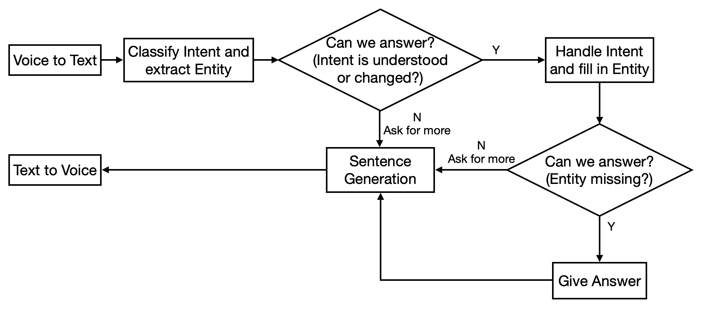
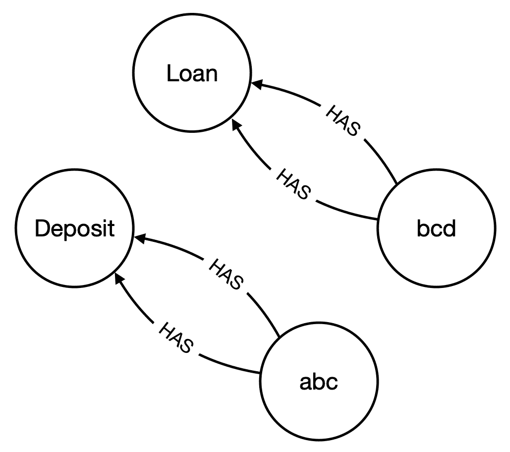

# 九、客户终身财富的大规模定制

在前一章中，我们学习了如何管理客户的数字数据。我们还介绍了开放银行项目和开放银行 API。此外，我们还学习了文档布局分析，并查看了一个预测典型家庭现金流的示例。然后，我们看了如何使用发票实体识别跟踪日常开支的另一个例子。

在本章中，我们将学习如何组合来自调查的数据进行个人数据分析。我们将学习 Neo4j 等技术，这是一个图形数据库。我们将建立一个聊天机器人，为客户提供全天候服务。我们还将借助一个示例，学习如何使用 NLP 和 Neo4j 预测客户反应。之后，我们将学习如何使用 cypher 语言来操作 Neo4j 数据库中的数据。

本章将涵盖以下主题:

*   财富工具的金融概念
*   集成学习
*   预测客户反应
*   构建一个聊天机器人，全天候为客户服务
*   使用自然语言处理和图形的知识管理

# 财富工具的金融概念

在这一部分，我们将回答消费者银行营销人员提出的几个问题。然后，我们将研究另一种重要的模型开发技术——集成学习，它将有助于组合不同模型的预测。

## 财富的来源:资产、收入和天赋

零售银行客户分析中最常见的任务之一是检索额外的数据，以帮助我们解释客户的投资行为和模式。毫无疑问，我们会知道客户的反应，但模型的工作是找出他们为什么会这样反应。令人惊讶的是，有许多关于个人行为的汇总信息，比如人口普查数据。我们还可以从社交媒体中找到数据，用户使用社交媒体进行身份验证。然后，相关的社交媒体信息可以与我们在组织内部观察到的个人级别的交易数据链接在一起。为了解释个人的银行行为，我们想要的最相关的补充数据是关于他们财富的信息。

### 客户生命周期

典型的生命周期包括三个主要阶段——收购、交叉销售/追加销售和保留。下图说明了这三个阶段:


**收购**是我们开始与客户建立商业关系的时候。然后，我们继续进行**交叉销售**和**追加销售**。交叉销售是指增加销售给客户的产品/服务的数量。向上销售是指通过产品/服务加深同一产品的钱包份额。**保留**是为了保持关系，是银行保护关系的一种防御行为。我们的第一个例子(在下一节中描述)涉及交叉销售(如果客户没有产品)和向上销售(如果客户拥有产品)。

# 集成学习

集成学习是帮助我们提高预测准确性的提升技术。我们还将学习如何使用图形数据库进行知识存储。知识存储是当前知识表示方面的挑战，可用于增强人工智能的专业级金融服务。

集成学习是一种用于总结几个模型以便给出更稳定的预测的方法。在深度神经网络流行之前，这是一种非常常见的方法。为了完整性，我们不想在这本非常短的书中忽略这种建模技术。特别是，我们使用了随机森林，这意味着我们构建了许多决策树作为森林，并应用逻辑来砍掉性能较低的树。另一种方法是组合较弱的模型来生成强的结果，这被称为**增强方法**。我们在这里不会涉及它，但是鼓励读者在 scikit-learn 文档中更深入地挖掘(【https://scikit-learn.org/stable/】T2)。

## 通过图形数据库进行知识检索

要让机器在客户服务中像人一样说话，其中一个关键要素是对话组件。当我们进行交谈时，客户可能无法提供处理所需的全部信息，这是正常的。人类可以处理模糊性。人类可以理解上下文，因此可以在没有明确提到概念的情况下推断含义。知道机器只能解决明确的问题，而人类可以处理模糊性，机器的工作就是从它为客户提供的知识地图中推断出意义。一个图形数据库被用于这个目的。

# 预测客户反应

到目前为止，我们还没有谈到银行的日常营销活动。现在，我们终于来看看营销前景是如何确定的。即使每个客户都是独一无二的，算法仍然以相同的方式处理他们。

在本例中，您将担任数据科学家的角色，负责定期存款产品的营销。我们将训练模型来预测定期存款的营销活动。从机器学习和智能系统中心([https://archive.ics.uci.edu/ml/datasets/bank+marketing](https://archive.ics.uci.edu/ml/datasets/bank+marketing))、布伦信息和计算机科学学院以及加州大学欧文分校获取与银行内部客户及其之前对活动的响应相关的数据。关于个人财富的调查信息来自美国人口普查局([https://www . Census . gov/data/tables/time-series/demo/income-poverty/historical-income-households . html](https://www.census.gov/data/tables/time-series/demo/income-poverty/historical-income-households.html))，作为银行内部数据的补充。

## 解决办法

完成此示例需要四个步骤:

1.  我们引入随机森林，这是一种利用集成学习的机器学习算法，允许通过多个模型进行预测。结果模型是来自多个模型的结果的组合。下面是导入所需库和定义变量的代码片段:

```
#import libraries & define variables
import pandas as pd
import os
from sklearn.ensemble import RandomForestClassifier
from sklearn.datasets import make_classification
```

2.  人口普查数据提供了该年龄组在银行的存款和财富信息。以下是处理人口普查数据的代码片段:

```
cat_val = ''
cat_dict = {}
for index, row in df_xtics.iterrows():
    ...

df_bank['age_c'] = pd.cut(df_bank['age'], [0,35,45,55,65,70,75,200])

#ID Conversions
df_bank['age_c_codes']=df_bank['age_c'].cat.codes.astype(str)
age_map={'0':'Less than 35 years'
,'1':'35 to 44 years'
,'2':'45 to 54 years'
,'3':'55 to 64 years'
,'4':'.65 to 69 years'
,'5':'.70 to 74 years'
,'6':'.75 and over'}
```

3.  我们想说明一列数据的映射，使用年龄来引入财富数据。以下是将人口普查数据与银行数据相结合的代码片段:

```
#3\. map back the survey data
df_bank['age_c1']=df_bank['age_c_codes'].map(age_map)
df_bank['age_c1_val']=df_bank['age_c1'].map(cat_dict['Age of Householder'])

X_flds = ['balance','day', 'duration', 'pdays',
       'previous', 'age_c1_val']
X = df_bank[X_flds]
y = df_bank['y']
```

4.  下面是训练模型的代码片段:

```
X, y = make_classification(n_samples=1000, n_features=3,
                           n_informative=2, n_redundant=0,
                           random_state=0, shuffle=False)
clf = RandomForestClassifier(n_estimators=100, max_depth=2,
                             random_state=0)
clf.fit(X, y)
print(clf.feature_importances_)
```

恭喜你！您已经将外部数据集与内部数据集合并，以增加我们对客户的了解。

# 构建一个聊天机器人，全天候为客户服务

当我们与机器人互动时，我们希望它能理解我们并和我们说话。让机器人为我们工作的好处在于它可以一周 24 小时为我们服务。实际上，现在的聊天机器人与客户的互动很差，所以我们应该尝试分解这些聊天机器人的组件，以提高标准。对于应用类型的开发，您可以使用 Google Assistant、Amazon 的 Alexa 或 IBM Watson。但出于学习目的，让我们分解组件，重点关注关键挑战:



聊天机器人在高层次上执行两个操作。一种是将输入从语音转换成文本，另一种是将输出从文本转换成语音。这两种操作都涉及提取实体和理解意图。在这个例子中，产生的文本是一个实体，而文本的含义是一个意图。它表示服务请求者和服务提供者之间的对话。当收到服务请求时，聊天机器人会将语音指令转换成文本，并在收到的信息中添加上下文。一旦上下文构建完成，聊天机器人就会处理信息，生成文本格式的输出。聊天机器人必须将其转换成可听的语音输出，以呈现给服务请求者。上图解释了整个场景。

现在，让我们只关注聊天，不要担心语音识别和话语——也就是说，让我们忽略语音到文本和文本到语音。在我看来，由于这项任务是机器和内存密集型的，并且数据可以在如此多的地方获得，所以它不适合一个初创公司从事这项任务；相反，我们应该让拥有强大基础设施的主流云提供商来提供服务。

对于纯文本聊天，重点应该放在意图分类和实体提取上。虽然我们在上一章中已经提到了实体提取，但是输入在被提取之前仍然需要被分类。意图分类的工作方式类似于实体提取，但是将整个句子作为一个实体进行分类。

虽然使用 ChatterBot 或 RasaNLU 运行聊天机器人非常常见，但我们可以分解组件，自下而上运行。

假设我们是一家提供存款和贷款的简单银行。我们正在构建一个简单的聊天机器人，它只能为现有的客户服务，目前，我们只有两个客户，一个叫 **abc** 有存款账户，另一个叫 **bcd** 有贷款账户:



Abc 的存款余额为 100 单位，定价为 1，bcd 的贷款余额为 100 单位，定价为 2。

# 使用自然语言处理和图形的知识管理

本质上，我们有两种方法来检索和更新关于我们现实世界的知识。一种是将知识存储在向量空间中，并在运行时使用 Word2Vector 和 BERT 等程序将文件读取到我们的内存中。另一种方法是将知识加载到图形数据库中，如 Neo4j，并检索和查询数据。这两种方法的优缺点在于速度和透明度。对于高速主题分类，内存模型表现更好，但对于需要透明性的任务，如银行决策，数据更新需要完全透明和永久记录。在这些情况下，我们将使用图形数据库。然而，就像我们在[第 7 章](d29ff3a8-3879-4d50-8795-a39bae5cc793.xhtml)、*中简要介绍的例子一样，在我们能够以图形格式存储信息之前，NLP 需要从文档中提取信息。*

## 实际实现

以下是完成此示例的步骤:

1.  使用密码语言将`csv`文件导入数据库。我们假设 CSV 文件是从传统的 SQL 数据库中转储的。以下是要从命令行执行的命令:

```
sudo cp dataset.csv /var/lib/Neo4j/import/edge.csv
sudo cp product.csv /var/lib/Neo4j/import/product.csv
sudo cp customer.csv /var/lib/Neo4j/import/customer.csv
```

2.  打开浏览器并导航至`http://localhost:7474/browser/`。然后，创建一个`username`并设置一个`password`。这将只执行一次:

```
username: test, password: test
```

3.  删除所有节点:

```
MATCH (n) DETACH DELETE n;
```

4.  创建客户数据:

```
LOAD CSV WITH HEADERS FROM "file:///customer.csv" AS row
CREATE (c:Customer {customer_id: row.customer});
```

5.  创建产品数据:

```
LOAD CSV WITH HEADERS FROM "file:///product.csv" AS row
CREATE (p:Product {product_name: row.product});
```

6.  加载 CSV 文件:

```
LOAD CSV WITH HEADERS FROM "file:///edge.csv" AS line
WITH line
MATCH (c:Customer {customer_id:line.customer})
MATCH (p:Product {product_name:line.product})
MERGE (c)-[:HAS {TYPE:line.type, VALUE:toInteger(line.value)}]->(p)
RETURN count(*);
```

7.  匹配并返回数据:

```
MATCH (c)-[cp]->(p) RETURN c,cp,p;
```

密码本身就是一种语言；我们所做的基本上是创造产品和客户。然后，我们加载另一个连接客户和产品的文件。

8.  我们将连接到刚刚填充了数据的`Neo4j`数据库。参数遵循默认设置。请注意 Cypher 的独特语法。此外，加载 NLP 模型以用于输入指令的相似性分析。密码查询存储在字典中。读取意图后，检索查询字符串。然后，我们使用图形数据库构建知识:

```
#import libraries and define parameters
from Neo4j import GraphDatabase
import spacy

#define the parameters, host, query and keywords
uri = "bolt://localhost:7687"
driver = GraphDatabase.driver(uri, auth=("test", "test"))
session = driver.session()

check_q = ("MATCH (c:Customer)-[r:HAS]->(p:Product)" 
 "WHERE c.customer_id = $customerid AND p.product_name = \
  $productname" 
 "RETURN DISTINCT properties(r)")
...
intent_dict = {'check':check_q, 'login':check_c}

#list of key intent, product and attribute
product_list = ['deposit','loan']
attribute_list = ['pricing','balance']
intent_list = ['check']
print('loading nlp model')
nlp = spacy.load('en_core_web_md')
```

9.  应该使用 SQL 数据库正确地对用户进行身份验证和标识。为了便于说明，我们将使用`GraphDatabase`，但是很明显，使用`GraphDatabase`进行身份验证是不正确的，因为我们希望在一个专用表中存储大量带有用户名和密码的数据，我们可以将该表的访问权限设置为少于数据库中总人数的个人。以下是对用户进行身份验证的代码片段:

```
if name == '' or reset:
    name = input('Hello, What is your name? ')
    print('Hi '+name)
    #check for login
    query_str = intent_dict['login']
    result = session.read_transaction(run_query, query_str, name, \
                                 product, attribute, attribute_val)
```

句子意图和实体抽取利用空间进行相似性分析。基于预先训练的词到向量模型，将意图和实体上的保留词与输入的句子进行比较，以提取相关的意图和实体。该模型过于简化，因为在假设我们已经制作了相关的模型来执行相关的分类任务的情况下，通过使用更好的语言模型，例如 BERT，给读者留下了大量的创造性空间来增强提取工作。

以下是提取实体和添加意图的代码片段:

```
#Sentences Intent and Entities Extraction
input_sentence = input('What do you like to do? ')
if input_sentence == "reset":
    reset = True 
entities = intent_entity_attribute_extraction(nlp, input_sentence, \
                         tokens_intent, tokens_products, tokens_attribute)
#actually can build another intent classifier here based on the scores and words matched as features, as well as previous entities
intent = entities[0]
product = entities[1]
attribute = entities[2]
attribute_val = entities[3]
```

### 交叉检查并进一步要求缺失的信息

程序将不断地询问意图、产品和属性，直到所有这三条信息对程序来说都是清楚的。在每个参数的分类下，我们部署 Word2vec 来简化分类。事实上，我们可以运行一个同类最佳的主题分类模型，如 BERT，来了解语言和主题。

以下是向用户请求缺失信息的代码片段:

```
while intent == '':
    input_sentence = input('What do you want to do?')
    entities = intent_entity_attribute_extraction(nlp, input_sentence, \
                     tokens_intent, tokens_products, tokens_attribute)
    intent = entities[0]

while product == '':
    input_sentence = input('What product do you want to check?')
    entities = intent_entity_attribute_extraction(nlp, input_sentence, \
                     tokens_intent, tokens_products, tokens_attribute)
    product = entities[1]

while attribute == '':
    input_sentence = input('What attribute of the ' + product + \
                        ' that you want to '+intent+'?')
    entities = intent_entity_attribute_extraction(nlp, input_sentence, \
                      tokens_intent, tokens_products, tokens_attribute)
    attribute = entities[2]
```

### 提取答案

填写完所有信息后，将执行密码查询，并将信息呈现给用户。以下是摘录答案的代码片段:

```
#execute the query to extract the answer
query_str = intent_dict[intent]
results = session.read_transaction(run_query, query_str, name, \
                                    product,attribute,attribute_val)
if len(results) >0:
    for result in results:
        if result['TYPE'] == attribute:
            print(attribute + ' of ' + product + ' is '+ \
                  str(result['VALUE']))
else:
    print('no record')

```

### 交互示例脚本

下面的代码片段显示了用户的输出和输入。这是为了表明 NLU 确实可以使用密切相关的词来提取意图和实体，这要感谢 spaCy 字典允许我们找到相似的词。这个例子的全部意义在于表明，对于需要完整信息才能做出的决策，图形数据库允许我们管理对话，并在执行任何指令为用户服务之前跟踪缺失的信息。当涉及到做出专业决策时，这是一个非常重要的特性，我们需要它的基本原理是透明的，具有高度的准确性，只要机器能够理解这种语言。以下是聊天机器人示例对话的片段:

```
loading nlp model
Hello, What is your name? testing
Hi testing
Failed to find testing
Hello, What is your name? abc
Hi abc
What do you like to do? do sth
matching...

What do you want to do?check sth
matching...
check 
What product do you want to check?some product
matching...

What product do you want to check?deposit
matching...
 deposit 
What attribute of the deposit that you want to check?sth
matching...

What attribute of the deposit that you want to check?pricing
matching...
 pricing
pricing of deposit is 1
```

恭喜你！您已经构建了一个非常简单的聊天机器人，可以向您展示聊天机器人的核心功能。

我们正在使用的例子很好地呼应了我们在商业银行中使用强化学习来使用借款人和储户数据的做法。当时，数据在运行时存储在变量中。现在，我们已经展示了在图形数据中存储数据的另一种可能性。事实上，与第 3 章、*中的示例相比，使用特征和强化学习来自动化银行融资，*如果我们将数据存储在图形数据库中，而不是存储在 Python 程序中的变量中，强化学习的速度将会更慢。因此，我们将使用图形数据库，但仅用于生产和应用级别，此时与计算密集型训练阶段相比，单个对话可以容忍一些延迟。

# 摘要

在本章中，我们学习了 NLP 和图形数据库，还学习了分析客户数据所需的金融概念。我们还学习了一种叫做集成学习的人工智能技术。我们看了一个使用自然语言处理预测客户反应的例子。最后，我们构建了一个聊天机器人来全天候服务客户的请求。这些概念非常强大。NLP 能够使程序解释人类自然说出的语言。另一方面，图形数据库有助于设计高效的算法。

在下一章中，我们将了解当您想要构建一个模型来解决日常挑战时需要牢记的实际考虑事项。此外，我们还希望在为数据科学家配备语言以与将算法应用于现实生活的 IT 开发人员进行交互时，了解实际的 IT 考虑因素。