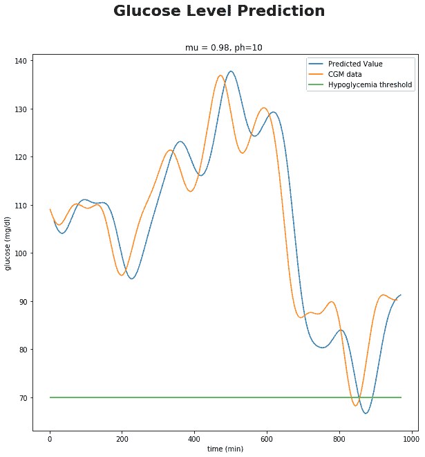
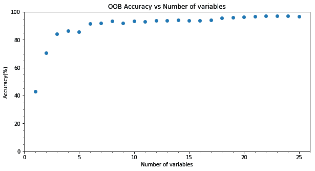
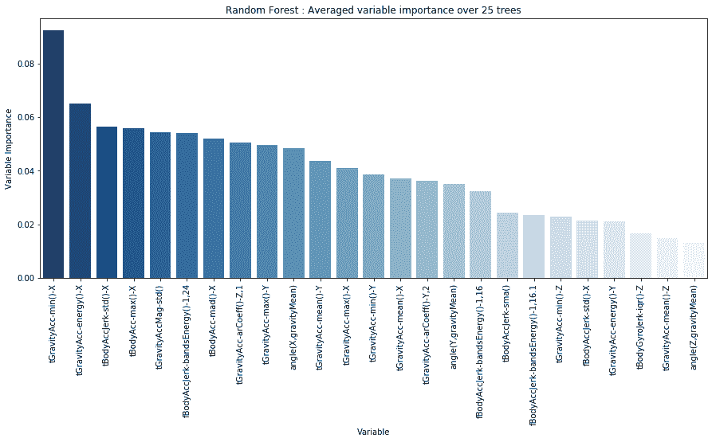
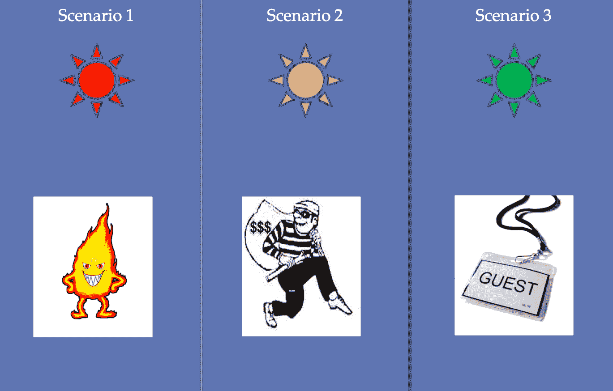
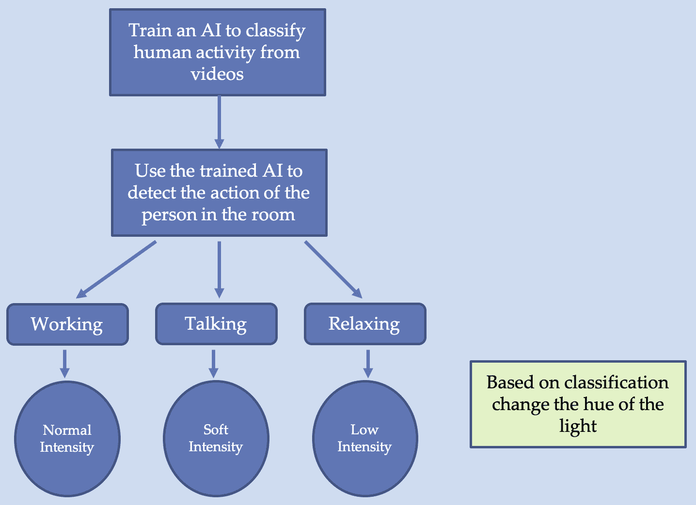

# 九、个人和家庭物联网

既然你已经完全具备了**机器学习** ( **ML** )和**深度学习** ( **DL** )的知识，并且已经学会了如何将其用于大数据、图像任务、文本任务和时间序列数据，那么是时候探索一下所学算法和技术的一些真实用途了。本章和接下来的两章将集中讨论一些具体的案例研究。本章将关注个人和家庭**物联网** ( **IoT** )用例。我们将在本章中介绍以下内容:

*   成功的物联网应用
*   可穿戴设备及其在个人物联网中的作用
*   如何使用 ML 监测心脏
*   什么让家成为智能家居
*   智能家居中使用的设备
*   人工智能在预测人类活动识别中的应用


# 个人物联网

个人物联网由可穿戴设备的使用主导，可穿戴设备是设计用于佩戴在身上的技术设备，它们与智能手机上的应用程序配合使用。第一款可穿戴设备是美国时代计算机公司(当时名为**汉密尔顿手表公司**)生产的 Pulsar 计算器手表。这是一个独立的设备，没有连接到互联网。很快，随着互联网的发展，可以连接互联网的可穿戴设备成为一种时尚。可穿戴设备市场预计将从 2016 年**的 3 . 25 亿**增长到 2020 年的 8 . 3 亿和 2 . 2 亿以上:


这张图表显示了 2016 年至 2021 年全球可穿戴设备的数量(数据来源:Statista)。随着如此多的设备在线连接，不断产生数据，AI/ML 工具是分析这些数据并做出明智决策的自然选择。在本节中，您将了解一些成功的个人物联网应用。


# 麻省理工学院的超级运动鞋

一手拿着手机，在*谷歌地图*的帮助下沿路导航，你有多少次觉得这很麻烦？你有多少次想要一双可以带你去任何你想去的地方的魔法拖鞋？麻省理工学院媒体实验室([https://www.media.mit.edu/projects/supershoes/overview/](https://www.media.mit.edu/projects/supershoes/overview/))的超级鞋几乎就像那些魔法拖鞋；它们允许用户在人行道上导航，而无需查看智能手机屏幕。

超级鞋有弹性鞋垫，脚趾下嵌入振动马达。他们无线连接到智能手机上的一个应用程序。该应用程序不仅允许用户与超级运动鞋互动，还可以在云帐户中存储喜欢/不喜欢的东西、爱好、商店、食物、人、兴趣等。振动马达产生与用户交流的声音。一旦用户在应用程序上输入目的地，鞋子就会开始工作。如果左脚趾发痒，那么用户应该左转；如果右脚趾发痒，那么用户必须右转。当没有挠痒痒时，用户必须继续直线前进。如果两者都重复挠痒痒，那么用户已经到达了他们的目的地。

除了导航，还能推荐附近的名胜古迹；用户在云上更新他们的好恶。基于用户的喜欢和不喜欢，当用户靠近推荐的感兴趣的地方时，SuperShoe 还会给出指示(两个脚趾发痒一次)。超级鞋的另一个有趣的特点是，它也可以提醒人们；如果你在附近有任务，它会提醒你。

制作这款鞋所需的硬件非常简单，它需要以下:

*   三个振动触觉挠痒器来挠脚趾
*   感应行走的电容垫
*   微控制器从应用程序中获取命令，并相应地控制备忘录
*   与智能手机连接的蓝牙设备
*   为整个系统供电的电池

这种魔力是由编码在应用程序中的软件实现的。你可以在这个网站了解更多关于超级运动鞋的信息:[http://dhairyadand.com/works/supershoes](http://dhairyadand.com/works/supershoes)。


# 连续葡萄糖监测

人工智能的一个主要应用是医疗保健的物联网，其中最成功的商业应用之一是连续监测人体的葡萄糖水平。Abbott 的 FreeStyle CGM、DexCom CGM 和 Medtronic CGM 是一些市售品牌。

**持续葡萄糖监测** ( **CGM** )可以让糖尿病患者实时检查身体的葡萄糖水平。这有助于他们在一段时间内监测读数，这些数据还可以用于预测未来的血糖水平，从而帮助他们处理低血糖等情况。

在 CGM 中，通常传感器被放置在腹部皮肤下或贴在手臂背面。传感器将读数发送到连接的寻呼机/智能手机应用程序。该应用程序具有额外的基于人工智能的算法，可以通知用户任何临床相关的葡萄糖模式。该数据的可用性不仅有助于用户主动管理他们的血糖高低，而且还可以洞察膳食、锻炼或疾病对一个人的血糖水平的影响。

传感器的使用寿命从 7 天到 14 天不等，通常这段时间足以让医生了解患者的生活方式，并相应地提出改变建议。


# 使用 CGM 数据进行低血糖预测

一旦一个人有了 CGM 数据，就可以使用 AI/ML 对其进行分析，以收集更多信息或做出关于低血糖的预测。在本节中，我们将看到如何使用我们在前面章节中学习的算法来制作一个葡萄糖预测系统。

我们将基于 Sparacino 等人的研究论文*可根据连续葡萄糖监测传感器时间序列*提前预测葡萄糖浓度[(](https://doi.org/10.1109/TBME.2006.889774)[10.1109/tbme . 2006 . 889774](https://doi.org/10.1109/TBME.2006.889774))构建我们的预测器。

本文用时间序列模型描述 CGM 时间序列葡萄糖数据；本文考虑了两种模型，一种是简单的一阶多项式模型，另一种是一阶自回归模型。相对于过去的葡萄糖数据，在每个采样时间*t[s]拟合模型参数。这里，我们将使用 scikit 线性回归器实现简单的一阶多项式，我们在[第 3 章](09538353-bf5b-4035-8b98-cc131bcfcf24.xhtml)、*物联网机器学习*中了解到:*

1.  我们导入模块 pandas 来读取`csv`文件，NumpPy 用于数据处理，Matplolib 用于绘图，scikit-learn 用于线性回归，如下所示:

```py
import pandas as pd
import numpy as np
import matplotlib.pyplot as plt
from sklearn.linear_model import LinearRegression
%matplotlib inline
```

2.  将从您的 CGM 获得的数据保存在 data 文件夹中并读取。我们需要两个值，葡萄糖读数及其时间。我们正在使用的数据在两个 CSV 文件中可用，`ys.csv`和`ts.csv`。第一个包含葡萄糖值，第二个包含相应的时间，如下所示:

```py
# Read the data
ys = pd.read_csv('data/ys.csv')
ts = pd.read_csv('data/ts.csv')
```

3.  根据论文，我们定义了预测模型的两个参数`ph`、预测`horizon`和`mu`遗忘因子。有关这两个参数的更多详细信息，请参考我们之前提到的论文:

```py
# MODEL FIT AND PREDICTION

# Parameters of the predictive model. ph is Prediction horizon, mu is Forgetting factor.
ph = 10 
mu = 0.98
```

4.  我们创建数组来保存我们的预测值，如下所示:

```py
n_s = len(ys)

# Arrays to hold predicted values
tp_pred = np.zeros(n_s-1) 
yp_pred = np.zeros(n_s-1)
```

5.  我们现在读取模拟实时采集的 CGM 数据，并预测未来`ph`分钟的血糖水平。所有过去的数据都用于确定模型参数，但是，每个数据都有不同的贡献，这取决于分配给它的单独权重`mu^k`(在实际采样时间之前`k`瞬间采集的样本):

```py
# At every iteration of the for loop a new sample from CGM is acquired.
for i in range(2, n_s+1):
    ts_tmp = ts[0:i]
    ys_tmp = ys[0:i]
    ns = len(ys_tmp)

    # The mu**k assigns the weight to the previous samples.
    weights = np.ones(ns)*mu
    for k in range(ns):
        weights[k] = weights[k]**k
    weights = np.flip(weights, 0)
    # MODEL
    # Linear Regression.
    lm_tmp = LinearRegression() 
    model_tmp = lm_tmp.fit(ts_tmp, ys_tmp, sample_weight=weights)

    # Coefficients of the linear model, y = mx + q 
    m_tmp = model_tmp.coef_
    q_tmp = model*tmp.intercept

*    # PREDICTION
    tp = ts.iloc[ns-1,0] + ph
    yp = m_tmp*tp + q_tmp

    tp_pred[i-2] = tp 
    yp_pred[i-2] = yp
```

6.  我们可以看到预测落后于实际。正常血糖水平在`70`至`180`范围内。低于`70`，患者可能会出现低血糖，高于`180`，患者可能会出现高血糖。让我们看看预测数据的图表:

```py
# PLOT
# Hypoglycemia threshold vector. 
t_tot = [l for l in range(int(ts.min()), int(tp_pred.max())+1)]
hypoglycemiaTH = 70*np.ones(len(t_tot)) 
#hyperglycemiaTH = 180*np.ones(len(t_tot))

fig, ax = plt.subplots(figsize=(10,10))
fig.suptitle('Glucose Level Prediction', fontsize=22, fontweight='bold')
ax.set_title('mu = %g, ph=%g ' %(mu, ph))
ax.plot(tp_pred, yp_pred, label='Predicted Value') 
ax.plot(ts.iloc[:,0], ys.iloc[:,0], label='CGM data') 
ax.plot(t_tot, hypoglycemiaTH, label='Hypoglycemia threshold')
#ax.plot(t_tot, hyperglycemiaTH, label='Hyperglycemia threshold')
ax.set_xlabel('time (min)')
ax.set_ylabel('glucose (mg/dl)')
ax.legend()
```



7.  对于以下代码，RMSE 误差将为 27:

```py
from sklearn.metrics import mean_squared_error as mse
print("RMSE is", mse(ys[1:],yp_pred))
```

代码位于`Chapter09/Hypoglycemia_Prediction.ipynb`笔记本上。葡萄糖预测系统可用于许多商业产品中。你也可以根据我们刚刚做的模型做一个。你也可以使用人工神经网络进行类似的预测，结果会更好(参考[https://www.ncbi.nlm.nih.gov/pubmed/20082589](https://www.ncbi.nlm.nih.gov/pubmed/20082589))。


# 心脏监护器

AI 在物联网中的另一个非常有用的个人应用是在心脏病的检测中。有大量的可穿戴设备可以用来监测和记录心率。这些数据可以用来预测任何有害的心脏状况。这里，我们将采用 AI/ML 工具来预测心脏**心律失常**，这是一组心率不规则的情况；可能太快(每分钟 100 次以上)，也可能太慢(每分钟 60 次以下)。使用的数据取自*https://archive.ics.uci.edu/ml/datasets/heart+Disease*库数据集[UCI 机器学习 R](https://archive.ics.uci.edu/ml/datasets/heart+Disease)。数据集由 76 个属性组成，并非所有属性都是预测疾病存在所必需的；数据集有一个与每个数据行相关联的目标字段。它有五个可能的值 0-4，值 0 表示心脏健康，任何其他值表示有疾病。为了更准确，可以将问题分解成一个二元分类问题。该代码的灵感来自 Mohammed Rashad 的 GitHub 链接，它是在 GNU GPL 3.0 许可证下共享的:[https://GitHub . com/Mohammed Rashad/Deep-Learning-and-Wearable-IoT-to-Monitor-and-Predict-cardiarhytmia](https://github.com/MohammedRashad/Deep-Learning-and-Wearable-IoT-to-Monitor-and-Predict-Cardiac-Arrhytmia)。完整的代码可以从 GitHub 库的`Chapter09/Heart_Disease_Prediction.ipynb`文件中获得:

1.  一如既往，第一步是导入必要的模块。由于我们现在将患者分类为患有心脏病或没有心脏病，我们将需要一个分类器。这里为了简单起见，我们使用了`SVC`分类器。您可以尝试使用 MLP 分类器，如下所示:

```py
# importing required libraries
import numpy as np
import pandas as pd
import matplotlib.pyplot as plt

from sklearn.svm import SVC
from sklearn import metrics
from sklearn.metrics import confusion_matrix
from sklearn.model_selection import train_test_split
```

2.  接下来，读取数据集，预处理数据集以选择您将考虑的属性。我们从 76 个属性中选择了 13 个属性，然后我们将目标从多类值转换为二进制类。最后，数据分为训练和测试数据集，如下所示:

```py
# reading csv file and extracting class column to y.
dataset = pd.read_csv("data.csv")
dataset.fillna(dataset.mean(), inplace=True)

dataset_to_array = np.array(dataset)
label = dataset_to_array[:,57] # "Target" classes having 0 and 1
label = label.astype('int')
label[label>0] = 1 # When it is 0 heart is healthy, 1 otherwise

# extracting 13 features
dataset = np.column_stack((
    dataset_to_array[:,4] , # pain location
    dataset_to_array[:,6] , # relieved after rest
    dataset_to_array[:,9] , # pain type 
    dataset_to_array[:,11], # resting blood pressure
    dataset_to_array[:,33], # maximum heart rate achieve
    dataset_to_array[:,34], # resting heart rate 
    dataset_to_array[:,35], # peak exercise blood pressure (first of 2 parts) 
    dataset_to_array[:,36], # peak exercise blood pressure (second of 2 parts) 
    dataset_to_array[:,38], # resting blood pressure 
    dataset_to_array[:,39], # exercise induced angina (1 = yes; 0 = no) 
    dataset.age, # age 
    dataset.sex , # sex
    dataset.hypertension # hyper tension
 ))

print ("The Dataset dimensions are : " , dataset.shape , "\n")

# dividing data into train and test data
X_train, X_test, y_train, y_test = train_test_split(dataset, label, random_state = 223)
```

3.  现在，我们定义要使用的模型。这里我们使用支持向量分类器，使用`fit`函数来训练数据集:

```py
model = SVC(kernel = 'linear').fit(X_train, y_train)
```

4.  让我们看看它在测试数据集上的性能:

```py
model_predictions = model.predict(X_test)
# model accuracy for X_test 
accuracy = metrics.accuracy_score(y_test, model_predictions)
print ("Accuracy of the model is :" , 
    accuracy , "\nApproximately : ", 
    round(accuracy*100) , "%\n")
```

5.  你可以看到它提供了 74%的准确率，使用 MLP，我们可以进一步提高它。但是一定要记住在使用 MLP 分类器之前归一化所有的输入特征。以下是我们在测试数据集上训练的支持向量分类器的混淆矩阵:

```py
#creating a confusion matrix
cm = confusion_matrix(y_test, model_predictions)

import pandas as pd
import seaborn as sn
import matplotlib.pyplot as plt
%matplotlib inline
df_cm = pd.DataFrame(cm, index = [i for i in "01"],
columns = [i for i in "01"])
plt.figure(figsize = (10,7))
sn.heatmap(df_cm, annot=True)
```

以下输出显示了测试数据集的混淆矩阵:


您可以在相同的数据集上训练您的模型，并使用您训练的模型来预测您的朋友、家人或客户的心脏状况。


# 数字助理

数字助理是最古老的人工智能应用之一。最初对数字助理的尝试从未真正起飞。但是随着智能手机的出现和大规模普及，今天我们有大量的数字助理为您提供诸如拨打电话号码、编写短信、安排约会甚至搜索互联网等服务。你可以请他们推荐附近的餐馆和酒吧或其他类似的东西。

以下是一些流行的数字助理:

*   Siri:由苹果公司开发，它允许用户发送/拨打电话，在日历中添加约会，播放音乐或视频，甚至发送文本。如今，几乎所有苹果产品上都有声控界面。
*   **Cortana** :由微软创造，它通过提醒你根据时间、地点，甚至是人来做事情，从而帮助你按计划行事。你可以让 Cortana 为你预订午餐，或者使用它合作的任何其他应用程序。它集成了 Edge，并调用了一个配有 Cortana 的声控扬声器。
*   **Alexa** :由亚马逊开发，这是亚马逊 Echo 智能音箱提供的。它可以播放音乐，制作待办事项列表，为您设置闹钟，播放有声书，并提供股票、天气等实时信息。它还能够进行语音交互。
*   谷歌助手:这是一款语音控制的智能助手。它提供了持续的对话，也就是说，你不必说*嘿，谷歌*任何后续的请求，一旦你开始说话，它就会听到回应，而不需要触发短语。它还可以识别不同人的语音配置文件，并根据该人的个人喜好和厌恶来定制其响应。它不仅可以在 Android 智能手机上使用，也可以在 Google Home 上使用。

2018 年，谷歌更进一步，发布了谷歌双工(Google Duplex)，这是一款可以为你打电话和预约的助手。它像人类一样说话，说话时也能理解上下文。


# 物联网和智能家居

我的一个密友总是担心他年迈的母亲，当他、他的妻子和孩子们外出时，她独自留在家里。随着她的健康状况开始恶化，他向她征求建议。解决办法很简单；他在所有房间都安装了闭路电视摄像头，与一个移动应用程序连接。这些摄像头被连接到互联网上，现在，无论他在哪里，他都可以在家里签到，以确保他母亲的安康。

连接到互联网的闭路电视、智能闪电、智能音箱等等帮助自动化了家里的很多任务，你得到的就是一个智能家居。目前大多数智能家居系统通过语音命令界面工作，在这里你可以使用一组命令来控制特定的设备。例如，在亚马逊的 Echo Dot 中，你可以要求它搜索或播放特定的歌曲。你可以让苹果的 Siri 用你的手机给朋友打电话，全靠简单的语音界面。这些设备中的大多数都以某种形式使用 AI/ML，但是家庭自动化可以通过使用 AI/ML 来进一步发展。例如，在我朋友的情况下，可以训练一个人工智能系统从视频中识别活动，或检测家中的入侵。可能性是无限的。有了正确的数据和足够的计算能力，你只受你的想象力的限制。

在这一部分，我们将看到一些现有的家庭自动化产品，并了解我们如何进一步使用人工智能来增强自动化。


# 人类活动识别

研究最多的智能家居应用之一是**人体活动识别** ( **HAR** )。有许多公司试图开发跟踪身体活动及其相应卡路里燃烧计数的应用程序。健康和健身无疑是大生意。除了在健身和健康方面的应用，HAR 还可以用于老年人护理或康复中心。有许多方法来执行 HAR，其中两种如下:

*   使用摄像机(或雷达或类似设备)记录人类活动，并使用 DL 方法对其进行分类
*   个人使用可穿戴传感器(类似于智能手机中的加速度计)，其数据被记录并用于预测活动

这两种方法各有利弊。我们将在接下来的小节中更详细地讨论它们。


# 使用可穿戴传感器的 HAR

大量供应商都有带健身追踪器的可穿戴手表和手环。这些手表和手镯具有 GPS、加速度计、陀螺仪、心率传感器和/或环境光传感器。利用**传感器融合**，他们结合这些传感器的输出来预测活动。由于数据的时间性质，这是一项具有挑战性的时间序列分类任务。

健身追踪器领域的顶级公司 fitbit([https://www.fitbit.com/smarttrack](https://www.fitbit.com/smarttrack))使用了一种称为 **SmartTrack** 的技术，可以识别持续运动或轻微运动的活动。它使用运动的强度和模式来对活动进行分类。它将活动分为以下七类:

*   步行
*   运转
*   有氧运动
*   椭圆的
*   户外自行车
*   运动
*   游泳

苹果手表([https://www.apple.com/in/apple-watch-series-4/workout/](https://www.apple.com/in/apple-watch-series-4/workout/))给 Fitbit 带来了激烈的竞争。在 IOs 操作系统上工作，它带有跌倒检测功能，以及许多其他健康跟踪功能。通过分析手腕轨迹和冲击加速度，它可以检测到人是否正在坠落，还可以发起紧急呼叫。默认情况下，Apple watch 将活动分为三组:行走、锻炼和站立。运动(锻炼)在另一个领域被进一步分类，例如室内跑步、室外跑步、滑雪、单板滑雪、瑜伽，甚至徒步旅行。

如果你想尝试使用智能手机传感器制作一个类似的应用程序，你首先需要的是数据。下面，我们介绍一个使用随机森林的 HAR 实现，代码改编自罗彻斯特大学数据科学家 Nilesh Patil 的 GitHub 链接:[https://GitHub . com/Nilesh-Patil/human-activity-recognition-smart phone-sensors](https://github.com/nilesh-patil/human-activity-recognition-smartphone-sensors)。

数据集来自论文 *Davide Anguita、Alessandro Ghio、Luca Oneto、Xavier Parra 和 Jorge L. Reyes-Ortiz。使用智能手机进行人类活动识别的公共领域数据集。第 21 届欧洲人工神经网络、计算智能和机器学习研讨会，ESANN 2013。2013 年 4 月 24 日至 26 日，比利时布鲁日。*
可在 UCI ML 网站获取:[https://archive . ics . UCI . edu/ML/datasets/Human+Activity+Recognition+Using+smart phones #](https://archive.ics.uci.edu/ml/datasets/Human+Activity+Recognition+Using+Smartphones#)。

对于数据集中的每条记录，包含:

*   来自加速度计的三轴加速度(总加速度)和估计的车身加速度
*   陀螺仪的三轴角速度
*   具有时域和频域变量的 561 特征向量
*   它的活动标签
*   进行实验的受试者的标识符

数据分为六类:

*   放置
*   坐着的
*   直立的
*   步行
*   步行
*   无电梯

1.  这里，我们使用 scikit-learn 的随机森林分类器对数据进行分类。实现所需的必要模块在第一步导入:

```py
import pandas as pd
import numpy as np
import seaborn as sns
import matplotlib.pyplot as plt

from sklearn.ensemble import RandomForestClassifier as rfc
from sklearn.metrics import confusion_matrix
from sklearn.metrics import accuracy_score
%matplotlib inline
```

2.  我们读取数据并将其分为`train`和`test`数据集，如下所示:

```py
data = pd.read_csv('data/samsung_data.txt',sep='|')
train = data.sample(frac=0.7,
        random_state=42)
test = data[~data.index.isin(train.index)]

X = train[train.columns[:-2]]
Y = train.activity
```

3.  该数据由 561 个特征组成，但并非所有特征都同等重要。我们可以通过制作一个简单的随机森林分类器来选择更重要的特征，并且只选择最重要的特征。在这个实现中，使用两个步骤来完成。最初，我们获得重要特性的列表，并按照重要性降序排列它们。然后通过网格超学习找到数量和特征。曲线中显示了过度调节的结果。我们可以看到，在大约 20 个特征之后，使用下面的代码，在**出袋** ( **OOB** )准确性方面没有显著的改进:

```py
randomState = 42
ntree = 25

model0 = rfc(n_estimators=ntree,
random_state=randomState,
n_jobs=4,
warm_start=True,
oob_score=True)
model0 = model0.fit(X, Y)

# Arrange the features in ascending order
model_vars0 = pd.DataFrame(
    {'variable':X.columns,
    'importance':model0.feature_importances_})

model_vars0.sort_values(by='importance',
    ascending=False,
    inplace=True)

# Build a feature vector with most important 25 features

n = 25
cols_model = [col for col in model_vars0.variable[:n].values]
```



4.  我们还可以在下图中看到前 25 项功能的平均重要性:



5.  同样，我们可以超调树参数的数量。这里，我们将自己限制在四个重要特性上:

```py
n_used = 4
cols_model = [col for col in model_vars0.variable[:n_used].values]\
     + [model_vars0.variable[6]]
X = train[cols_model]
Y = train.activity

ntree_determination = {}
for ntree in range(5,150,5):
    model = rfc(n_estimators=ntree,
        random_state=randomState,
        n_jobs=4,
        warm_start=False,
        oob_score=True)
model = model.fit(X, Y)
ntree_determination[ntree]=model.oob_score_
```


6.  因此，我们可以看到，具有大约四个重要特征和`50`树的随机森林可以给出很好的 OOB 准确度。因此，我们的最终模型如下:

```py
model2 = rfc(n_estimators=50,
    random_state=randomState,
    n_jobs=4,
    warm_start=False,
    oob_score=True)
model2 = model2.fit(X, Y)
```

7.  这导致了 94%的测试数据准确性。以下是测试数据集的混淆矩阵:

```py
test_actual = test.activity
test_pred = model2.predict(test[X.columns])
cm = confusion_matrix(test_actual,test_pred)
sns.heatmap(data=cm,
     fmt='.0f',
     annot=True,
     xticklabels=np.unique(test_actual),
     yticklabels=np.unique(test_actual))
```


GitHub 资源库`Chapter09/Human_activity_recognition_using_accelerometer.ipynb`提供了完整的代码和数据探索。使用加速度计数据的优势在于，它是从可穿戴设备收集的，因此不需要在建筑物上安装。另一个优点是，它是文本数据，因此比视频数据需要更少的计算资源。


# 视频中的 HAR

另一种检测人类活动的方法是通过视频。在这种情况下，我们将不得不使用一个 DL 模型，如 CNN，以获得良好的结果。伊万·拉普捷夫和芭芭拉·卡普托([http://www.nada.kth.se/cvap/actions/](http://www.nada.kth.se/cvap/actions/))为分类视频提供了一个很好的数据集。它包含六种类型的动作:在不同的场景中，行走、慢跑、跑步、拳击、挥手和拍手。每个视频都是使用 25 fps 的摄像机录制的。空间分辨率为 160 × 120，平均长度为 4 秒。它总共有 599 个视频，六个类别各有大约 100 个。

视频数据的一个问题是计算量大，因此减少数据集很重要，以下是一些减少数据集的方法:

*   因为颜色在活动中没有作用，所以图像可以从三通道彩色图像转换成二维灰度图像。
*   视频时长 4 秒，每秒 25 帧，其中大多数帧包含冗余数据，因此我们可以将帧数减少到每秒 5 帧，即 20 帧，而不是(25 × 4 = 100)帧对应一个数据行。(如果每个视频提取的总帧数是固定的就最好了)。
*   将单个帧的空间分辨率从 160 × 120 降低。

接下来，在建模时，我们应该使用三维卷积层。因此，假设每个视频仅拍摄 20 帧，并将每帧的大小减少到 128 × 128，则单个样本将为:20 × 128 × 128 × 1，这对应于单通道的 20 × 128 × 128 的体积。


# 智能照明

当谈论智能家居时，首先想到的家庭自动化应用是使用智能灯。目前存在的大多数智能照明系统都提供了一个选项，可以使用智能手机上的应用程序或通过互联网来控制灯光的开关和亮度。有些还允许你改变颜色/色调。运动检测灯在检测到任何运动后都会自动打开，如今几乎所有家庭都有这种灯:



针对听力障碍人士的智能灯会根据情况改变颜色

利用人工智能，我们可以让这些智能灯变得更加智能。在紧急情况下，它们可以被编程为协同工作，并指引你到正确的出口。对于有听力障碍的人来说，智能灯可以用来代替警报，例如，当火警响起时，红灯亮，但当有窃贼时，红灯亮，当有人按门铃时，绿灯亮。在诸如**If This Then than**(**If TTT**等服务的帮助下，你可以建立更智能、更复杂的支持系统。

IFTTT 提供免费服务来控制您的设备。一个设备(或服务)的动作可以触发一个或多个其他设备。它的使用非常简单，你只需在 IFTTT 网站上创建一个小程序:[https://ifttt.com](https://ifttt.com)，你选择想要用作触发器的设备(点击)或服务，并将其与你的 IFTTT 账户链接。接下来，您选择(指向并单击)当触发器被激活时您想要的服务或设备。该网站包含数以千计的预制小程序，使您的工作更容易。



个性化智能照明系统的算法

这些只是你可以用现有的智能灯做什么的一些例子。但是，如果你富有冒险精神，并准备将新的传感器与这些智能灯相结合，你可以为自己建造一个个人灯，一个根据人的精神活动改变其色调/强度的灯。当你感到困倦时，它会变得暗淡，当你工作时，它会变得非常明亮，但当你与朋友交谈和共度时光时，它只是提供了一种令人愉快的色调。听起来很牵强？不尽然，你可以首先使用一种人工智能算法，从视频(或可穿戴健身追踪器)中检测人类活动，并将其分为三类:工作、休闲和睡眠，然后使用其输出来控制智能灯的色调/强度。


# 家庭监控

家庭监控是一个非常有用和非常需要的应用。随着单亲家庭和老年人口的增加，不仅需要外部场所的安全和监控，还需要家庭内部的安全和监控。许多公司正试图利用视频提供室内监控。其中一个成功的实现是由一家名为 deep sight ai labs([http://deepsightlabs.com](http://deepsightlabs.com))的公司完成的，他们开发了专有软件**super secure**；一种通用兼容的改造解决方案，可与任何闭路电视系统、任何摄像机、任何分辨率配合使用，并将其转变为一种**人工智能智能智能监控解决方案**，以高精度检测潜在威胁，并触发即时警报以拯救生命和保护资产。

当您尝试自己实现家庭监控时，我们在使用视频实现 HAR 中讨论的要点在这里也会有用。

智能家居仍处于起步阶段，主要原因是它们涉及到高昂的拥有成本和互联设备的不灵活性。通常，一个特定的系统完全由一家公司管理。如果由于某种原因公司关闭了，消费者就会陷入困境。解决方案是允许开源家庭自动化硬件和软件。一篇关于家庭自动化领域的挑战和机遇的有趣阅读是微软研究院的一篇文章，*野外家庭自动化:挑战和机遇*([https://www . Microsoft . com/en-us/Research/publication/Home-Automation-in-the-Wild-Challenges-and-Opportunities/](https://www.microsoft.com/en-us/research/publication/home-automation-in-the-wild-challenges-and-opportunities/))。


# 摘要

本章的重点是个人和家庭人工智能驱动的物联网解决方案。智能手机的大规模使用使每个人都可以接触到可穿戴传感器，导致了大量的个人应用程序。在这一章中，我们探索并实现了一些成功的个人和家庭人工智能物联网解决方案。我们学习了麻省理工学院的超级鞋，这种鞋可以自己找到到达目的地的路径。我们了解了 CGM 系统并实现了预测高血糖的代码。本章还演示了如何实现个性化心脏监护仪。

虽然智能家居仍处于起步阶段，但本章探讨了一些最流行和最有用的智能家居解决方案。介绍了智能家居和个人物联网边界的应用程序 HAR。我们使用 scikit-learn 编写了一些代码，从使用加速度计获得的数据中对活动进行分类。本章介绍了一些很酷的智能照明应用，并讨论了使用视频的家庭监控。

在下一章中，我们将看一些案例研究，从物联网传感器获得的数据用于提高工业生产和效率。