# 二、使用 Python 的机器学习简介

上一章给大家介绍了**机器学习** ( **ML** )的世界。在本章中，我们将开发构建和使用**自动化 ML** ( **AutoML** )平台所需的 ML 基础。人们并不总是清楚如何最好地应用 ML 或者实现它需要什么。然而，ML 工具变得越来越容易使用，AutoML 平台也使它更容易被更多的人使用。毫无疑问，将来人和机器之间会有更高层次的合作。

ML 的未来可能需要人们为其消费准备数据，并识别实现的用例。更重要的是，人们需要解释结果并审核 ML 系统——他们是否遵循正确和最佳的方法来解决问题。未来看起来相当惊人，但我们需要建设这样的未来；这就是我们在本书中要做的。在本章中，我们将带您了解以下主题:

*   机器学习过程及其不同类型
*   监督学习—回归和分类
*   无监督学习—聚类
*   成套设备——装袋、提升和堆叠
*   基于数据推断任务
*   特定于任务的评估指标

我们明白，学习和练习 ML，单个章节是不够的。在 ML 上已经有很多优秀的书籍和资料，在那里你可以找到关于每个提到的主题的详细讨论。你可以在我们杂志的*其他你可能喜欢的书籍*部分看到一些推荐。这一章的目的是为你提供不同的 ML 技术的概述，并讨论在后续章节中工作所必需的一些重要方面。

所以，机器学习起来很兴奋。你准备好帮助他们了吗？抓紧了。我们先来看看什么是机器学习！


# 技术要求

所有的代码示例都可以在 GitHub 的`Chapter 02`文件夹中找到。


# 机器学习

机器学习可以追溯到几个世纪前。它诞生于一种理论，即计算机可以在没有被编程来执行特定任务的情况下学习。ML 的迭代方面是必不可少的，因为机器总是需要适应新的数据。他们需要从历史数据中学习，为更好的计算进行优化，还需要进行自我归纳以提供正确的结果。

我们都知道基于规则的系统，其中我们有一组预定义的条件供机器执行并提供结果。当机器自己学习这些模式，交付结果，并解释它发现的规则，这将是多么伟大的事情；这是 ML。它是一个更广泛的术语，用于机器从数据中学习的各种方法和算法。作为**人工智能** ( **AI** )的一个分支，ML 算法经常被用来发现隐藏的模式，建立关系，以及预测一些事情。

机器学习依赖于一些格式化的输入，它根据任务提供一个结果。输入格式特定于所使用的 ML 技术的类型，也特定于所考虑的算法。输入数据的这种特定表示被称为**特征**或**预测器**。


# 机器学习过程

我们如何学习？当我们在学校或大学学习时，我们被老师教导。我们从他们的教导(训练)中学习。学期结束时，我们需要参加一次测试(测试)，基本上是为了验证我们的知识。我们获得的分数决定了我们的命运(评价)。通常，通过考虑通过的阈值(基线)来进行评估。分数决定了我们是否需要重考该科目，或者准备进入下一阶段(部署)。

这也正是机器学习的方式。括号中的单词是 ML 专业人员使用的术语。然而，这只是我们和机器学习的方式之一。这是典型的监督学习方法。人们有时也从经验中学习，这是无监督的学习。我们再来研究一些关于这些学习方法的细节。

概括地说，我们有两类最大似然算法，如前所述——监督学习和非监督学习。还有一些其他类型的学习，如强化学习、迁移学习和半监督学习，它们不常用，因此不在本书的讨论范围内。


# 监督学习

顾名思义，学习过程是基于特定的目标/结果进行监督的。

监督 ML 模型的目标是学习和发现能够正确预测结果的模式。在监督学习的情况下，总是有一个带有目标属性的已标注历史数据集。目标之外的所有属性都被称为**预测值** / **特征**。

目标可以是连续的数字属性、表示是/否决策的二元属性或具有两个以上结果的多类属性。基于该目标，该模型识别一种模式，建立预测器之间的关系，然后使用导出的配方来预测新的独立数据集中的未知目标。

许多 ML 算法都属于这一类学习方法，例如线性和逻辑回归、决策树、随机森林和**支持向量机** ( **支持向量机**)等等。

识别和选择最适合某项工作的算法是 ML 项目中最关键的任务。这也是创建 AutoML 系统时需要特别注意的重要部分。有各种各样的因素支配着这个选择过程，它们将在本书中详细讨论。


# 无监督学习

同样，在无监督学习的情况下，没有目标属性。无监督学习的目标是通过推断输入数据集中特征的结构和关系来识别模式。它可以用来发现共同定义一个群体的规则，如主题生成、划分(如客户细分)或确定数据的内部结构(如基因聚类)。无监督学习算法的例子包括关联规则挖掘和聚类算法。

在创建 AutoML 系统之前，了解不同的学习算法是非常必要的。在使用一个算法之前，了解它的三元组 **W** — **它是什么**、**它在哪里使用**，以及通过**什么**方法可以实现它是很关键的。

在接下来的几节中，我们将讨论三重 W 的不同算法，这将有助于创建一个健壮的 AutoML 系统。


# 线性回归

让我们先从线性回归开始我们的三重 W 会话。


# 什么是线性回归？

这是传统的和最常用的回归分析。人们对它进行了严格的研究，并将其广泛用于实际目的。线性回归是确定因变量( *y* )与一个或多个自变量( *x* )之间关系的方法。这种衍生关系可用于从观察到的 *x* 预测未解释的 *y* 。从数学上讲，如果 *x* 是自变量(通常称为预测值)，而 *y* 是因变量(也称为目标值)，则关系表示如下:

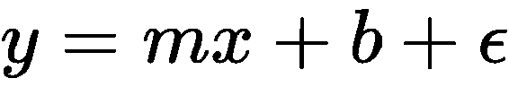

其中 *m* 是直线的斜率， *b* 是最佳拟合回归线的截距，ε是误差项，即实际值与预测值的偏差。

这是简单线性回归的方程式，因为它只涉及一个预测值( *x* )和一个目标值( *y* )。当预测一个目标涉及多个预测因素时，称为**多元线性回归**。术语*线性*暗示了一个基本假设，即基础数据呈现线性关系。

让我们创建两个变量之间的散点图:产品的**销售量**和**收入**。从图中我们可以推断出这两个变量之间存在某种正相关关系，即当产品销售量激增时，收入就会增加。但是，我们无法在它们之间建立一种关系来根据销售量预测收入:

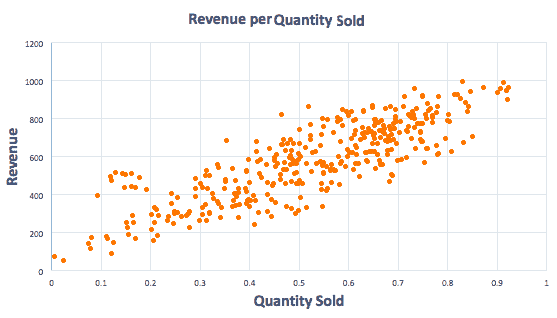

如果我们扩展之前的散点图并添加趋势线，我们会看到最佳拟合线。位于这条线上的任何数据点都是完美的预测值。随着我们远离这条线，预测的可靠性降低:


那么，我们如何找到最佳拟合线呢？最常见和最广泛使用的技术是**普通最小二乘**(**)估计。**

**

# OLS 回归工作

OLS `LinearRegression`方法是用函数拟合数据的最直接的方法。它通过最小化数据的**误差平方和** ( **SSE** )来找到最佳拟合线。SSE 是实际值与平均值偏差的总和。然而，一如既往，简单是有代价的。优秀的 OLS 方法的代价是坚持它的几个基本假设。


# OLS 的假设

所有这些关于数据的假设都应该成立，以获得 OLS 回归技术的好处:

*   **线性**:真正的底层关系 *X* 和 *Y* 是线性的。
*   **同方差**:残差的方差必须是常数。残差是目标的观测值和预测值之间的差值。
*   **正态性**:残差/误差应呈正态分布。
*   **没有或很少多重共线性**:残差/误差必须是独立的。

OLS 也受到数据中异常值的影响。在使用 OLS 线性回归进行线性回归建模之前，异常值处理是必要的。


# 线性回归用在哪里？

线性回归有许多实际使用案例，其中大多数属于以下两大类之一:

*   如果目标是预测或预报，则可以使用它来为依赖值和独立值的已识别数据集构建预测模型
*   如果目标是确定目标变量和预测变量之间的关系强度，那么它可以用于量化给定的 *X* 值的 *Y* 的变化


# 线性回归可以通过哪种方法实现？

我们可以使用 scikit-learn 的`LinearRegression`方法在 Python 中创建一个线性回归模型。由于这是我们讨论使用 Python 实现模型的第一个实例，我们将绕过对算法的讨论，学习用 Python 创建模型所需的一些基本包:

*   `numpy`:用于数学函数的数值型 Python 模块。它为多维数组和矩阵的有效计算提供了健壮的数据结构。

*   `pandas`:提供数据操作的 DataFrame 对象。数据帧可以保存不同类型的值和数组。它用于在 Python 中读取、写入和操作数据。
*   `scikit-learn`:是 Python 中的一个 ML 库。它包括各种 ML 算法，是一个广泛用于在 Python 中创建 ML 模型的库。除了 ML 算法之外，它还提供了开发模型所需的各种其他功能，例如`train_test_split`、模型评估度量和优化度量。

在创建模型之前，我们需要首先将这些必需的库导入到 Python 环境中。如果你在 Jupyter 笔记本中运行你的代码，有必要声明`%matplotlib inline`来查看界面中的内嵌图形。我们需要导入`numpy`和`pandas`包，以便于数据操作和数值计算。本练习的计划是创建一个线性回归模型，所以我们还需要从 scikit-learn 包中导入`LinearRegression`方法。我们将使用 scikit-learn 的示例`Boston`数据集来完成任务:

```
%matplotlib inline
import numpy as np
import pandas as pd
from sklearn.linear_model import LinearRegression
import matplotlib.pyplot as plt
from sklearn.datasets import load_boston
```

接下来，我们需要使用以下命令加载`Boston`数据集。它是一个字典，我们可以检查它的键来查看它的内容:

```
boston_data = load_boston()
boston_data.keys()
```

上述代码的输出如下:

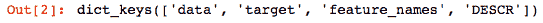

`boston_data`有四个键，它们所指向的值的种类是不言自明的。我们可以从键`data`和`target`中检索数据和目标值。`feature_names`键保存属性的名称，`DESCR`拥有每个属性的描述。

在处理数据之前，先查看数据大小始终是一种好的做法。这有助于决定是使用完整数据还是使用数据样本，也有助于推断执行可能需要多长时间。

Python 中的`data.shape`函数是查看数据维度(行和列)的绝佳方式:

```
print(" Number of rows and columns in the data set ", boston_data.data.shape)
print(boston_data.feature_names)
```

上述代码的输出如下:

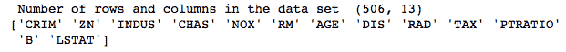

接下来，我们需要将字典转换成数据帧。这可以通过调用`pandas`库的`DataFrame`函数来完成。我们使用`head()`来显示记录的子集以验证数据:

```
boston_df =pd.DataFrame(boston_data.data)
boston_df.head()
```

数据帧是向量的集合，可以被视为二维表。我们可以认为数据帧的每一行对应于某个观察值，每一列对应于观察值的某个属性。这使得它们非常适合 ML 建模任务。

上述代码的输出如下:

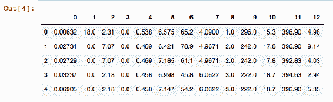

列名只是数字索引，并不能说明数据帧的含义。因此，让我们将`feature_names`作为列名分配给`boston_df`数据帧，使其具有有意义的名称:

```
boston_df.columns = boston_data.feature_names
```

我们再次检查了一个`boston`房屋租金数据的样本，现在它比以前更好地描述了这些列:

```
boston_df.head()
```

上述代码的输出如下:

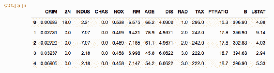

在线性回归中，必须有一个数据框架作为目标变量，另一个数据框架以其他特征作为预测变量。本练习的目标是预测房价，因此我们将`PRICE`指定为目标属性(`Y`)，其余的都指定为预测值(`X`)。使用`drop`功能将`PRICE`从预测列表中删除。

接下来，我们打印每个变量的截距和系数。这些系数决定了每个预测者在预测房价时的权重和贡献(目标`Y`)。截距提供了一个常量值，当所有预测值都不存在时，我们可以将它视为房价:

```
boston_df['PRICE'] = boston_data.target
X = boston_df.drop('PRICE', axis=1)
lm = LinearRegression()
lm.fit(X, boston_df.PRICE)
print("Intercept: ", lm.intercept_)
print("Coefficient: ", lm.coef_)
```

上述代码的输出如下:

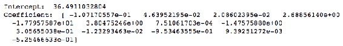

从前面的截图看不出哪个系数属于什么预测因子。因此，我们使用以下代码将特征和系数联系在一起:

```
pd.DataFrame(list(zip(X.columns, lm.coef_)),columns= ['features','estimatedCoefficients'])
```

上述代码的输出如下:

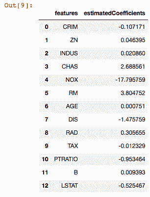

接下来，我们计算并查看均方误差指标。现在，让我们把它看作是模型在预测房价时的平均误差。评估指标对于了解模型的动态以及它在生产环境中的表现非常重要:

```
lm.predict(X)[0:5
mseFull = np.mean((boston_df.PRICE - lm.predict(X)) ** 2)
print(mseFull)
```

上述代码的输出如下:

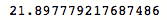

我们在整个数据集上创建了模型，但是确保我们开发的模型在实际生产环境中使用时能够在不同的数据集上正常工作是非常重要的。因此，用于建模的数据分为两组，通常比例为 70:30。最显著的分裂用于训练模型，另一个用于测试开发的模型。这个独立的测试数据集被认为是一个*虚拟生产环境*，因为它在模型的训练阶段是隐藏的。测试数据集用于生成预测和评估模型的准确性。Scikit-learn 提供了一个`train_test_split`方法，可以用来将数据集分成两部分。函数中的`test_size`参数表示为测试而保留的数据的百分比。在下面的代码中，我们将数据集分成`train`和`test`集，并重新训练模型:

```
#Train and Test set
from sklearn.model_selection import train_test_split
X_train, X_test, Y_train, Y_test = train_test_split(X, boston_df.PRICE, test_size=0.3, random_state=42)
print(X_train)
```

由于我们已经使用了`test_size=0.3`，70%的数据集将用于创建`train`集，30%将保留给`test`数据集。我们遵循与前面相同的步骤来创建线性回归模型，但是现在我们将只使用训练数据集(`X_train`和`Y_train`)来创建模型:

```
lm_tts = LinearRegression()
lm_tts.fit(X_train, Y_train)
print("Intercept: ", lm_tts.intercept_)
print("Coefficient: ", lm_tts.coef_)
```

上述代码的输出如下:

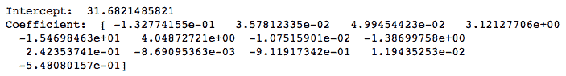

我们预测`train`和`test`数据集的目标值，并计算它们的**均方误差** ( **MSE** ):

```
pred_train = lm.predict(X_train)
pred_test = lm.predict(X_test)
print("MSE for Y_train:", np.mean((Y_train - lm.predict(X_train)) ** 2))
print("MSE with Y_test:", np.mean((Y_test - lm.predict(X_test)) ** 2))
```

上述代码的输出如下:

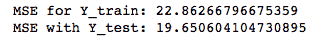

我们看到，`train`和`test`数据集的 MSE 分别是`22.86`和`19.65`。这意味着模型的性能在训练和测试阶段几乎是相似的，并且可以部署用于在新的独立相同数据集上预测房价。

接下来，让我们绘制一个残差图，看看残差是否遵循线性模式:

```
plt.scatter(pred_train,pred_train - Y_train, c = 'b',s=40,alpha=0.5)
plt.scatter(pred_test,pred_test - Y_test, c = 'r',s=40,alpha=0.7)
plt.hlines(y = 0, xmin=0, xmax = 50)
plt.title('Residual Plot - training data (blue) and test data(green)')
plt.ylabel('Residuals')
```

上述代码的输出如下:


由于残差围绕水平虚线对称分布，因此它们呈现出完美的线性模式。

开发一个模型是容易的，但是设计一个有用的模型是困难的。评估 ML 模型的性能是 ML 管道中的关键步骤。一旦一个模型准备好了，我们必须评估它以确定它的正确性。在下一节中，我们将带您了解一些广泛使用的评估回归模型的评估指标。


# 重要的评估指标–回归算法

评估 ML 模型的价值是一个两阶段的过程。首先，必须评估模型的统计准确性，即统计假设是否正确，模型性能是否突出，以及该性能是否适用于其他独立数据集。这是使用几个模型评估指标来完成的。然后，对模型进行评估，以查看结果是否符合业务需求的预期，以及利益相关者是否真正从中获得了一些见解或有用的预测。

回归模型基于以下指标进行评估:

*   **平均绝对误差** ( **MAE** ):是预测误差的绝对值之和。预测误差被定义为预测值和实际值之间的差异。这一指标给出了误差大小的概念。但是，我们无法判断该模型是预测过高还是预测过低。人们应该始终以低 MAE 分数为目标:

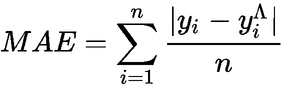

其中，*y[I]=实际值*

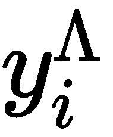 =预测值

*n* =病例数(记录)

*   **均方误差**:均方误差之和的平均值。该指标描述了误差的大小和方向。但是，测量单位会随着值的平方而改变。这个缺陷由另一个度量标准来弥补:均方根误差。分数越低，模型越好:

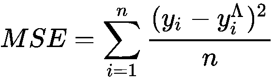

*   **均方根误差** ( **RMSE** ):该指标通过均方误差的平方根来计算。求平方根会将度量单位转换回原始单位。具有低 RMSE 分数的模型是好的模型:

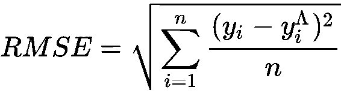

*   **R ² 得分**:又称**决定系数**。它描述了由模型解释的方差的百分比。例如，如果 *R ²* 为 0.9，那么模型中使用的属性或特征可以代表其 90%的变异。 *R ² 然而，需要有一个好的测试策略来验证模型不会过拟合:*

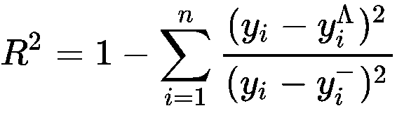

其中，*y[I]=实际值*

 =预测值

*n* =病例数(记录)

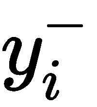= y 的平均值

当机器学习模型很好地学习了训练数据时，就会发生过拟合。这些模型的结果具有低偏差和高方差。在这种情况下，模型可能会导致对新数据的糟糕预测。

在本节中，我们学习了回归分析作为一种监督 ML 方法。它可用于目标数据是连续数字数据的情况，例如预测雇员的期望工资、预测房价或预测支出值。

目标有离散数据怎么办？我们如何预测客户是否会流失？我们如何预测是否应该为潜在客户批准贷款/信用卡？线性回归不适用于这些情况，因为这些问题违反了它的基本假设。我们还有其他方法吗？对于这些情况，我们可以使用分类模型。

分类建模是监督机器学习方法的另一种形式，用于预测具有离散输入目标值的目标。分类算法被称为**分类器**，因为它们识别输入数据支持的类别集，并使用该信息将类别分配给未识别或未知的目标标签。

在接下来的部分中，我们将介绍一些广泛使用的分类器，如逻辑回归、决策树、支持向量机和 K 近邻。物流回归可以被认为是回归和分类方法之间的桥梁。这是一个伪装成回归特征的分类器。然而，它是最有效和最易解释的分类模型之一。


# 逻辑回归

再从物流回归的*三重 W* 说起。重申一下三重 W 方法，我们首先问算法是什么，其次是它可以用在哪里，最后是通过什么方法可以实现模型。


# 什么是逻辑回归？

逻辑回归可以被认为是线性回归算法的扩展。它基本上像线性回归一样工作，但它意味着离散或分类的结果。


# 逻辑回归用在哪里？

逻辑回归适用于离散目标变量的情况，如二元响应。在这种情况下，线性回归的某些假设(如目标属性和要素)不遵循线性关系，残差可能不是正态分布的，或者误差项是异方差的。在逻辑回归中，目标被重建为其比值比的对数，以符合回归方程，如下所示:

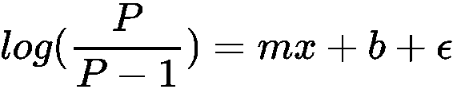

比值比反映了特定事件发生的概率或可能性与同一事件不发生的概率之比。如果 *P* 是一个事件/类出现的概率，*P–1*是第二个事件/类出现的概率。


# 通过哪种方法可以实现逻辑回归？

可以通过导入 scikit-learn 的`LogisticRegression`方法来创建逻辑回归模型。我们像之前创建线性回归模型一样加载包:

```
import pandas as pd
import numpy as np
from sklearn import preprocessing
import matplotlib.pyplot as plt
from sklearn.linear_model import LogisticRegression
```

我们将使用一个`HR`部门的数据集，该部门拥有过去流失的员工以及继续任职的员工的名单:

```
hr_data = pd.read_csv('data/hr.csv', header=0)
hr_data.head()
hr_data = hr_data.dropna()
print(hr_data.shape)
print(list(hr_data.columns))
```

上述代码的输出如下:

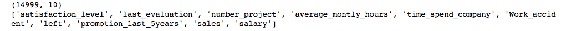

数据集有`14999`行和`10`列。`data.columns`函数显示属性的名称。`salary`属性有三个值——`high`、`low`和`medium`,`sales`有七个值——`IT`、`RandD`、`marketing`、`product_mng`、`sales`、`support`和`technical`。为了在模型中使用这种离散输入数据，我们需要将其转换成数字格式。有各种方法可以做到这一点。其中一种方法是对值进行虚拟编码，也称为**一键编码**。使用这种方法，会为分类属性的每个类生成虚拟列。

对于每个伪属性，类的存在用 1 表示，它的不存在用 0 表示。

离散数据可以是名义数据，也可以是顺序数据。当离散数据中的值有一个自然的顺序时，它被称为**序数**。例如，高、中、低等分类值是有序值。对于这些情况，通常使用标签编码。当我们无法从分类值或离散值中导出任何关系或顺序时，它被称为**名义值**。例如，红色、黄色和绿色等颜色没有顺序。对于这些情况，虚拟编码是一种流行的方法。

`pandas`的`get_dummies`方法为在 Python 中创建虚拟变量提供了一个简单的接口。该函数的输入是数据集和要进行伪编码的属性的名称。在这种情况下，我们将对`HR`数据集的`salary`和`sales`属性进行虚拟编码:

```
data_trnsf = pd.get_dummies(hr_data, columns =['salary', 'sales'])
data_trnsf.columns
```

上述代码的输出如下:

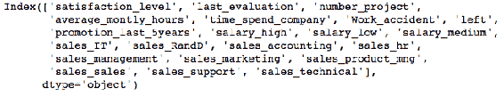

现在，数据集已经为建模做好了准备。`sales`和`salary`属性被成功地一键编码。接下来，由于我们要预测人员流失，我们将使用`left`属性作为目标，因为它包含关于员工是否流失的信息。我们可以从代码中称为`X`的输入预测数据集中删除`left`数据。左边的属性用`Y`(目标)表示:

```
X = data_trnsf.drop('left', axis=1)
X.columns
```

上述代码的输出如下:

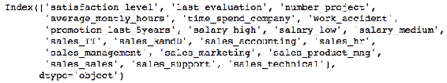

我们将数据集分成比例为 70:30 的`train`和`test`集。70%的数据将用于训练逻辑回归模型，其余 30%用于评估模型的准确性:

```
from sklearn.model_selection import train_test_split
X_train, X_test, Y_train, Y_test = train_test_split(X, data_trnsf.left, test_size=0.3, random_state=42)
print(X_train)
X_train and X_test are the train and test input predictor data. Y_train and Y_test are train and test input target data. Now, we will fit the model on the train data and evaluate the accuracy of the model on the test data. First, we create an instance of the LogisticsRegression() classifier class. Next, we fit the classifier on the training data: 
```

```
attrition_classifier = LogisticRegression()
attrition_classifier.fit(X_train, Y_train)
```

一旦成功创建了模型，我们就在测试输入预测数据集上使用`predict`方法来预测相应的目标值(`Y_pred`):

```
Y_pred = attrition_classifier.predict(X_test)
```

我们需要创建一个`confusion_matrix`来评估一个分类器。大多数模型评估度量是基于混淆矩阵本身的。在本节之后，我们将详细讨论混淆矩阵和其他评估指标。现在，让我们把混淆矩阵看作一个由四个值组成的矩阵，它为我们提供了正确和错误预测的值的计数。基于混淆矩阵中的值，计算分类器的准确度。我们的分类器的准确度是 0.79 或 79%，这意味着 79%的病例被正确预测:

```
from sklearn.metrics import confusion_matrix
confusion_matrix = confusion_matrix(Y_test, Y_pred)
print(confusion_matrix)

print('Accuracy of logistic regression model on test dataset: {:.2f}'.format(attrition_classifier.score(X_test, Y_test)))
```

上述代码的输出如下:

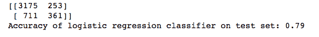

有时，准确性可能不是判断模型性能的好方法。例如，在不平衡数据集的情况下，预测可能偏向多数类。因此，我们需要查看其他指标，如 f1 得分、**曲线下面积** ( **AUC** )、精度和召回，以给出对模型的公平判断。我们可以通过从 scikit-learn 的`metric`方法导入`classification_report`来检索所有这些指标的分数:

```
from sklearn.metrics import classification_report
print(classification_report(Y_test, Y_pred))
```

上述代码的输出如下:

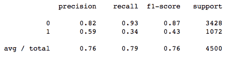

**接收器操作特性** ( **ROC** )最常用于可视化二元分类器的性能。AUC 测量值是 ROC 曲线下的面积，它提供了一个数字来总结基于 ROC 曲线的分类器的性能。以下代码片段可用于使用 Python 绘制 ROC 曲线:

```
from sklearn.metrics import roc_curve
from sklearn.metrics import auc

# Compute false positive rate(fpr), true positive rate(tpr), thresholds and roc auc(Area under Curve)
fpr, tpr, thresholds = roc_curve(Y_test, Y_pred)
auc = auc(fpr,tpr)

# Plot ROC curve
plt.plot(fpr, tpr, label='AUC = %0.2f' % auc)
#random prediction curve
plt.plot([0, 1], [0, 1], 'k--') 
#Set the x limits
plt.xlim([0.0, 1.0])
#Set the Y limits
plt.ylim([0.0, 1.0])
#Set the X label
plt.xlabel('False Positive Rate(FPR) ')
#Set the Y label
plt.ylabel('True Positive Rate(TPR)')
#Set the plot title
plt.title('Receiver Operating Characteristic(ROC) Cure')
# Location of the AUC legend
plt.legend(loc="right")
```

上述代码的输出如下:

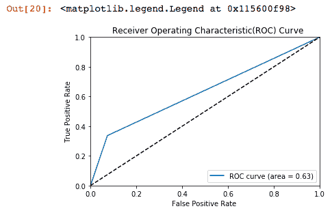

我们模型的 AUC 是 **0.63** 。我们已经看到了一些用于评估分类模型的指标，其中一些看起来很奇怪。因此，在讨论分类算法之前，让我们先了解一下度量标准。


# 重要的评估指标–分类算法

大多数用于评估分类模型的度量标准都是基于我们在混淆矩阵的四个象限中得到的值。让我们从了解它是什么开始这一部分:

*   **混淆矩阵**:它是评估一个分类模型(即分类器)的基石。顾名思义，矩阵有时会令人困惑。让我们试着把混淆矩阵想象成图表中的两个轴。 *x* 轴标签是预测，有两个值——**正**和**负**。同样的， *y* 轴标签实际上也是两个相同的值——**正**和**负**，如下图所示。该矩阵是一个表，包含分类器的实际值和预测值的计数信息:

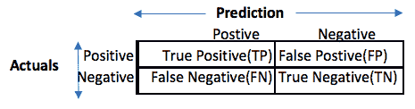

*   如果我们试图推断矩阵中每个象限的信息:
    *   象限一是被准确识别的正面类别预测的数量。所以称之为**真阳性** ( **TP** )。
    *   象限二，也称为**假阳性** ( **FP** )，是实际阳性病例的不准确预测数。
    *   象限三被称为**假阴性** ( **FN** )，是对阴性病例的不准确预测的数量。
    *   象限四是**真阴性** ( **TN** )，这是被准确分类的阴性类别预测的数量。
*   **准确性**:准确性衡量分类器做出准确预测的频率。它是正确预测数与预测总数的比率:

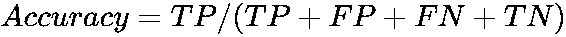****

*   **Precision** : Precision 估计被准确识别的真阳性的比例。它是真阳性与所有预测阳性的比率:

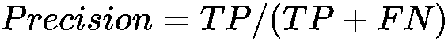

*   **召回**:召回也称为灵敏度或**真阳性率** ( **TPR** )。它估计一个目标的所有观察到的正值中真阳性的比例:

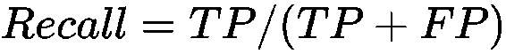

*   **误分类率**:估计分类器预测不准确的频率。它是错误预测与所有预测的比率:

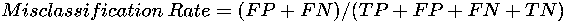

*   **特异性**:特异性又称**真阴性率** ( **TNR** )。它估计目标的所有观察到的负值中真实负值的比例:

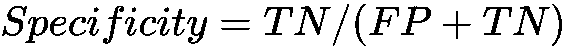

*   **ROC 曲线**:ROC 曲线总结了分类器在所有可能阈值上的性能。对于所有可能的阈值，ROC 曲线的图表用在 *y* 轴上的**真阳性率** ( **TPR** )和在 *x* 轴上的**假阳性率** ( **FPR** )来绘制。
*   **AUC** : AUC 是 ROC 曲线下的面积。如果分类器突出，真阳性率会增加，曲线下面积会接近 1。如果分类器类似于随机猜测，那么真阳性率会随着假阳性率线性增加(1-灵敏度)。在这种情况下，AUC 将在 0.5 左右。AUC 度量越好，模型就越好。
*   **Lift** : Lift 有助于评估模型预测能力相对于平均模型或基线模型的改进。例如，人力资源流失数据集的基准模型的准确性是 40%，但同一数据集的新模型的准确性是 80%。那么，该模型的升力为 2 (80/40)。
*   **平衡精度**:有时候，精度并不是单独评价一个模型的好的衡量标准。对于数据集不平衡的情况，它可能不是一个有用的评估指标。在这种情况下，平衡精度可以用作评估指标之一。平衡精度是根据任一等级中获得的平均精度计算的测量值:

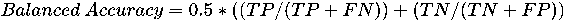

不平衡数据集-其中一个类支配另一个类。在这种情况下，对主要类别的预测存在固有的偏差。然而，这是决策树和逻辑回归等基础学习器的问题。对于集合模型，如随机森林，它可以很好地处理不平衡的类。

*   **F1 得分**:F1 得分也是一个合理的衡量标准，用于评估不平衡的分类器。F1 分数是精确度和召回率的调和平均值。其值介于 0 和 1 之间:


*   **汉明损失**:这标识了被错误预测的标签的比例。
*   **马修斯相关系数** ( **MCC** ): MCC 是目标和预测之间的相关系数。它在-1 和+1 之间变化。-1 当实际值和预测值完全不一致时，1 当实际值和预测值完全一致时，0 当预测值也可能是随机的。因为它涉及混淆矩阵的所有四个象限的值，所以它被认为是一种平衡的度量。

有时候，为预测创建模型不仅仅是一个需求。我们需要了解模型是如何构建的，以及描述模型的关键特性。在这种情况下，决策树将成为模型。


# 决策树

决策树是 ML 世界中广泛使用的分类器，因为它们在表示驱动分类/预测的规则方面是透明的。让我们向这个算法提出三个问题来了解它。


# 什么是决策树？

决策树被安排在一个分层的树状结构中，并且易于解释和说明。他们不容易受到离群值的影响。创建决策树的过程是一种递归划分方法，它将训练数据分成不同的组，目的是找到同质的纯子组，即只有一个类的数据。

离群值是远离其他数据点并扭曲数据分布的值。


# 决策树用在哪里？

决策树非常适合需要解释特定决策原因的情况。例如，金融机构在发放贷款或信用卡之前，可能需要对影响客户信用评分的规则进行完整描述。


# 决策树可以通过哪种方法实现？

可以通过导入 scikit-learn 的`DecisionTreeClassifier`来创建决策树模型:

```
import numpy as np
import pandas as pd
from sklearn.tree import DecisionTreeClassifier
from sklearn.metrics import accuracy_score
from sklearn import tree
```

接下来，我们读取`HR`损耗数据集，并执行在之前的物流回归示例中完成的所有数据预处理:

```
hr_data = pd.read_csv('data/hr.csv', header=0)
hr_data.head()
hr_data = hr_data.dropna()
print(" Data Set Shape ", hr_data.shape)
print(list(hr_data.columns))
print(" Sample Data ", hr_data.head())
```

上述代码的输出如下:

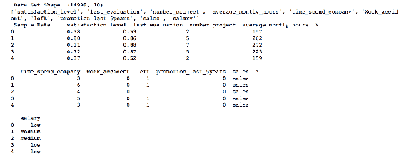

以下代码为分类数据创建虚拟变量，并将数据分成`train`和`test`集合:

```
data_trnsf = pd.get_dummies(hr_data, columns =['salary', 'sales'])
data_trnsf.columns
X = data_trnsf.drop('left', axis=1)
X.columns
from sklearn.model_selection import train_test_split
X_train, X_test, Y_train, Y_test = train_test_split(X, data_trnsf.left, test_size=0.3, random_state=42)
print(X_train)
```

接下来，为了创建一个决策树分类器，我们需要用至少所需的参数实例化一个`DecisionTreeClassifier`。以下是用于生成决策树模型的一些参数:

*   `criterion`:用于形成决策树的杂质度量；可以是`entropy`也可以是`gini`
*   `max_depth`:树的最大深度
*   `min_samples_leaf`:构建叶节点所需的最小样本数
*   `max_depth`和`min_sample_leafs`是树预修剪标准中的两个

让我们使用这些参数创建一个决策树模型:

```
attrition_tree = DecisionTreeClassifier(criterion = "gini", random_state = 100,
max_depth=3, min_samples_leaf=5)
attrition_tree.fit(X_train, Y_train)
```

上述代码的输出如下:

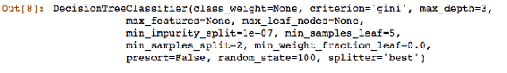

接下来，我们生成一个混淆矩阵来评估模型:

```
Y_pred = attrition_tree.predict(X_test)
from sklearn.metrics import confusion_matrix
confusionmatrix = confusion_matrix(Y_test, Y_pred)
print(confusionmatrix)
```

上述代码的输出如下:

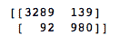

如果我们查看混淆矩阵，我们可以假设分类器在分类真阳性和真阴性方面都做了可靠的工作。但是，让我们根据总结的评估指标来验证我们的假设:

```
print('Accuracy of Decision Tree classifier on test set: {:.2f}'.format(attrition_tree.score(X_test, Y_test)))
from sklearn.metrics import classification_report
 print(classification_report(Y_test, Y_pred))
```

上述代码的输出如下:

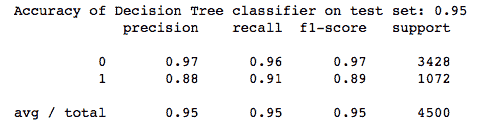

准确性以及其他指标是`0.95`，这是一个非常好的分数。

基于树的模型比逻辑回归模型有更好的结果。现在，让我们了解另一种基于支持向量的流行分类建模技术。


# 支持向量机

SVM 是一种主要用于分类任务的监督 ML 算法，然而，它也可以用于回归问题。


# 什么是 SVM？

SVM 是一个分类器，其工作原理是分离超平面。给定一个训练数据集，算法找到一个超平面，使类的分离最大化，并使用这些分区来预测新的数据集。超平面是一个比其周围平面小一维的子空间。这意味着该线是二维数据集的超平面。


# SVM 用在哪里？

SVM 的用例与其他分类器相似，但 SVM 非常适合于特征/属性的数量相对于数据点/记录的数量较高的情况。


# 通过哪种方法可以实现 SVM？

创建 SVM 模型的过程类似于我们之前学习的其他分类方法。唯一的区别是从 scikit-learn 的库中导入了`svm`方法。我们使用`pandas`库导入`HR`损耗数据集，并将数据集分成`train`和`test`集:

```
import numpy as np
import pandas as pd
from sklearn import svm
from sklearn.metrics import accuracy_score

hr_data = pd.read_csv('data/hr.csv', header=0)
hr_data.head()
hr_data = hr_data.dropna()
print(" Data Set Shape ", hr_data.shape)
print(list(hr_data.columns))
print(" Sample Data ", hr_data.head())
data_trnsf = pd.get_dummies(hr_data, columns =['salary', 'sales'])
data_trnsf.columns
X = data_trnsf.drop('left', axis=1)
X.columns
from sklearn.model_selection import train_test_split

X_train, X_test, Y_train, Y_test = train_test_split(X, data_trnsf.left, test_size=0.3, random_state=42)
print(X_train)
```

接下来，我们创建一个 SVM 模型实例。我们将内核设置为线性的，因为我们希望用一条线来分隔这两个类。为线性可分数据寻找最佳超平面很容易。但是，当数据不可线性分离时，将数据映射到新的空间，使其可线性分离。这种方法被称为**内核技巧**:

```
attrition_svm = svm.SVC(kernel='linear') 
attrition_svm.fit(X_train, Y_train)
```

上述代码的输出如下:

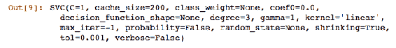

在将 SVM 模型实例拟合到训练数据之后，我们预测`test`集合的`Y`值，并创建混淆矩阵来评估模型性能:

```
Y_pred = attrition_svm.predict(X_test)
from sklearn.metrics import confusion_matrix
confusionmatrix = confusion_matrix(Y_test, Y_pred)
print(confusionmatrix)
```

上述代码的输出如下:


然后，计算模型准确性和其他指标的值:

```
print('Accuracy of SVM classifier on test set: {:.2f}'.format(attrition_svm.score(X_test, Y_test)))
from sklearn.metrics import classification_report
print(classification_report(Y_test, Y_pred))
```

上述代码的输出如下:

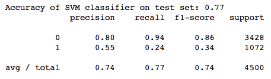

我们看到，带有默认参数的 SVM 模型并不比决策树模型表现得更好。因此，到目前为止，决策树一直占据着`HR`流失预测排行榜的首位。让我们尝试另一种分类算法，**k-最近邻** ( **KNN** )，这种算法更容易理解和使用，但是需要更多的资源。


# k-最近邻

在我们为`HR`流失数据集建立 KNN 模型之前，让我们先了解一下 KNN 的三重 w


# 什么是 k-最近邻？

KNN 是最简单的算法之一，它存储所有可用的数据点，并根据距离相似性度量(如欧几里德距离)来预测新数据。这是一种可以直接使用训练数据集进行预测的算法。然而，它需要更多的资源，因为它没有任何训练阶段，并且需要内存中的所有数据来预测新的实例。

欧几里德距离的计算方法是两点之间的平方差之和的平方根。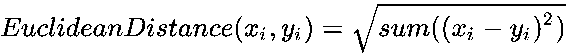


# KNN 用在哪里？

KNN 可用于构建分类和回归模型。它适用于二元和多元的分类任务。KNN 甚至可以用于创建推荐系统或输入缺失值。它易于使用，易于训练，并且易于解释结果。


# 通过哪种方法可以实现 KNN？

同样，我们对 KNN 采用了与创建之前模型相似的流程。我们从 scikit-learn 的库中导入`KNeighborsClassifier`方法，以使用 KNN 算法进行建模。接下来，我们使用`pandas`库导入`HR`损耗数据集，并将数据集分成`train`和`test`集:

```
import numpy as np
import pandas as pd
from sklearn.metrics import accuracy_score
from sklearn.neighbors import KNeighborsClassifier
hr_data = pd.read_csv('data/hr.csv', header=0)
hr_data.head()
hr_data = hr_data.dropna()
print(" Data Set Shape ", hr_data.shape)
print(list(hr_data.columns))
print(" Sample Data ", hr_data.head())
data_trnsf = pd.get_dummies(hr_data, columns =['salary', 'sales'])
data_trnsf.columns
X = data_trnsf.drop('left', axis=1)
X.columns
from sklearn.model_selection import train_test_split
X_train, X_test, Y_train, Y_test = train_test_split(X, data_trnsf.left, test_size=0.3, random_state=42)
print(X_train)
```

要创建 KNN 模型，我们需要指定距离计算中要考虑的最近邻的数量。

在现实生活中，当我们创建模型时，我们使用各种距离度量为一系列`n_neighbors`值创建不同的模型，并选择返回最高精度的模型。这个过程也被称为**调整超参数**。

对于下面的`HR`损耗模型，我们将`n_neighbors`定义为`6`，距离度量为欧几里得:

```
n_neighbors = 6
attrition_knn = KNeighborsClassifier(n_neighbors=n_neighbors, metric='euclidean')
attrition_knn.fit(X_train, Y_train)
```

上述代码的输出如下:

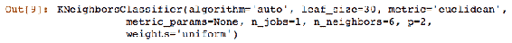

然后，在`test`数据集上进行预测，我们审查混淆矩阵以及其他评估指标:

```
Y_pred = attrition_knn.predict(X_test)
from sklearn.metrics import confusion_matrix
confusionmatrix = confusion_matrix(Y_test, Y_pred)
print(confusionmatrix)
```

上述代码的输出如下:

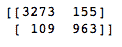

以下代码报告了其他指标的准确性得分和值:

```
print('Accuracy of KNN classifier on test set: {:.2f}'.format(attrition_knn.score(X_test, Y_test)))
from sklearn.metrics import classification_report
print(classification_report(Y_test, Y_pred))
```

上述代码的输出如下:

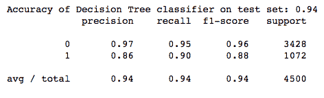

KNN 结果优于 SVM 模型，但是，它仍然低于决策树的得分。KNN 是一种资源密集型算法。如果使用 KNN 只有微小的改进，那么使用一些不同算法的模型是明智的。然而，用户可以根据他们的环境和他们试图解决的问题来决定什么是最好的。


# 集成方法

集成模型是一种增强预测模型效率的稳健方法。这是一个经过深思熟虑的战略，非常类似于一个充满力量的词——团队！！团队完成的任何任务都会带来显著的成就。


# 什么是集合模型？

同样，在 ML 世界中，集合模型是一个由模型组成的团队一起工作来提高他们工作的结果。从技术上讲，集成模型包括几个单独训练的监督学习模型，并以各种方式合并结果以实现最终预测。这一结果比其独立构成的任何学习算法的结果具有更高的预测能力。

通常，有三种集成学习方法被使用:

*   制袋材料
*   提升
*   堆叠/混合


# 制袋材料

Bagging 也称为**自举聚合**。这是减少模型结果方差误差的一种方法。有时弱学习算法非常敏感——稍微不同的输入会导致非常不寻常的输出。随机森林通过运行多个实例来减少这种可变性，从而降低方差。在这种方法中，使用带有替换模型的随机样本从训练数据集准备随机样本(引导过程)。

使用监督学习方法对每个样本开发模型。最后，通过平均预测或利用多数表决技术选择最佳预测来合并结果。多数投票是一个过程，其中集成的预测是所有分类器中预测数量最高的类别。还有各种其他方法，如加权和等级平均，用于产生最终结果。

scikit-learn 中提供了各种打包算法，如打包决策树、随机森林和额外树。我们将演示最流行的随机森林模型，您可以尝试其余的模型。我们可以通过从 scikit-learn 的`ensemble`包中导入`RandomForestClassifier`来实现随机森林。由于我们仍在使用`HR`的损耗数据，因此代码段的某些部分在本次演示中也保持不变:

```
import numpy as np
import pandas as pd
from sklearn.ensemble import RandomForestClassifier
from sklearn.metrics import accuracy_score
from sklearn import tree
hr_data = pd.read_csv('data/hr.csv', header=0)
hr_data.head()
hr_data = hr_data.dropna()
print(" Data Set Shape ", hr_data.shape)
print(list(hr_data.columns))
print(" Sample Data ", hr_data.head())
data_trnsf = pd.get_dummies(hr_data, columns =['salary', 'sales'])
data_trnsf.columns
X = data_trnsf.drop('left', axis=1)
X.columns
from sklearn.model_selection import train_test_split
X_train, X_test, Y_train, Y_test = train_test_split(X, data_trnsf.left, test_size=0.3, random_state=42)
print(X_train)
```

实例化随机森林模型没有强制参数。但是，对于创建良好的随机森林模型来说，有几个参数很重要，如下所述:

*   `n_estimators`:我们可以指定要在模型中创建的树的数量。默认值为 10。
*   `max_features`:指定每次分割时随机选择的候选变量/特征的数量。默认为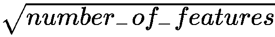。

我们创建一个随机森林模型，使用`n_estimators`作为`100`，使用`max_features`作为`3`，如下面的代码片段所示:

```
num_trees = 100
max_features = 3
attrition_forest = RandomForestClassifier(n_estimators=num_trees, max_features=max_features)
attrition_forest.fit(X_train, Y_train)
```

上述代码的输出如下:

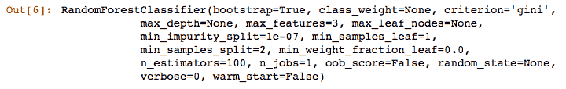

一旦模型拟合成功，我们从`test`或支持数据集预测`Y_pred`:

```
Y_pred = attrition_forest.predict(X_test)
from sklearn.metrics import confusion_matrix
confusionmatrix = confusion_matrix(Y_test, Y_pred)
print(confusionmatrix)
```

混淆矩阵中的结果看起来非常好，错误分类更少，预测更准确。让我们看看评估指标是如何得出的:

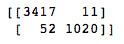

接下来，我们检查分类报告`Random Forest classifier`和`print`的准确性:

```
print('Accuracy of Random Forest classifier on test set: {:.2f}'.format(attrition_forest.score(X_test, Y_test)))
from sklearn.metrics import classification_report
print(classification_report(Y_test, Y_pred))
```

上述代码的输出如下:

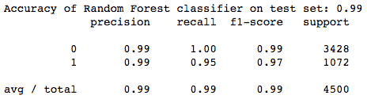

这是一个优秀的模型，所有评估指标都接近完美预测。这太好了，令人难以置信，可能是过拟合的情况。然而，让我们认为随机森林是目前我们的`HR`磨损数据集上的最佳算法，并转向另一种广泛使用的集成建模技术——boosting。


# 提升

Boosting 是一个迭代过程，在这个过程中，基于前人的缺陷，一个接一个地构建连续的模型。这有助于减少模型中的偏差，也导致方差的减少。Boosting 试图生成新的分类器，这些分类器能够更好地预测先前模型性能较低的值。与 bagging 不同，训练数据的重采样取决于早期分类器的性能。Boosting 使用所有数据来训练单个分类器，但是被之前的分类器错误分类的实例被赋予更大的重要性，以便后续的分类器增强结果。

**梯度推进机** ( **GBMs** )，又称**随机梯度推进** ( **SGB** )，就是推进法的一个例子。我们再次导入所需的包并加载`HR`损耗数据集。此外，我们执行相同的过程，将分类数据集转换为独热编码值，并将数据集拆分为比率为 70:30 的`train`和`test`集:

```
import numpy as np
import pandas as pd
from sklearn.ensemble import GradientBoostingClassifier
from sklearn.metrics import accuracy_score
from sklearn import tree
hr_data = pd.read_csv('data/hr.csv', header=0)
hr_data.head()
hr_data = hr_data.dropna()
print(" Data Set Shape ", hr_data.shape)
print(list(hr_data.columns))
print(" Sample Data ", hr_data.head())

data_trnsf = pd.get_dummies(hr_data, columns =['salary', 'sales'])
data_trnsf.columns
X = data_trnsf.drop('left', axis=1)
X.columns

from sklearn.model_selection import train_test_split
X_train, X_test, Y_train, Y_test = train_test_split(X, data_trnsf.left, test_size=0.3, random_state=42)
print(X_train)
```

有几个对`GradientBoostedClassifier`很重要的最佳参数。然而，并非所有都是强制性的:

*   `n_estimators`:这类似于随机森林算法的`n_estimators`，但是树是顺序创建的，在 boosting 方法中被认为是不同的阶段。使用这些参数，我们指定模型中的树或提升阶段的数量。默认是`100`。
*   `max_depth`:这是寻找最佳分割时要考虑的特征数量。当`max_features`小于特征数时，会导致方差减少，但会增加模型中的偏差。

*   `max_depth`:每棵树要种植的最大深度。默认值为`3`:

```
num_trees = 100
attrition_gradientboost= GradientBoostingClassifier(n_estimators=num_trees, random_state=42)
attrition_gradientboost.fit(X_train, Y_train)
```

上述代码的输出如下:

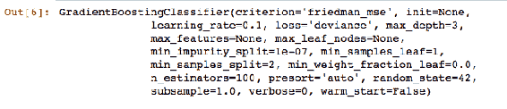

一旦模型成功拟合到数据集，我们就使用训练好的模型来预测`test`数据的`Y`值:

```
Y_pred = attrition_gradientboost.predict(X_test)

from sklearn.metrics import confusion_matrix
confusionmatrix = confusion_matrix(Y_test, Y_pred)
print(confusionmatrix)
```

下面的混淆矩阵看起来不错，分类错误最小:

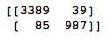

我们打印准确性和其他指标来评估分类器:

```
print('Accuracy of Gradient Boosting Classifier classifier on test set: {:.2f}'.format(attrition_gradientboost.score(X_test, Y_test)))
from sklearn.metrics import classification_report
print(classification_report(Y_test, Y_pred))
```

上述代码的输出如下:

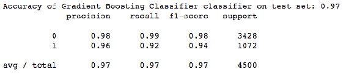

准确率 97%，很优秀，但不如随机森林模型。我们将在下一节讨论另一种系综模型。


# 堆叠/混合

在这种方法中，多层分类器一层堆叠在另一层上。应用第一层分类器的预测概率来训练第二层分类器，依此类推。通过使用基本分类器，如逻辑回归，可以获得最终结果。我们还可以使用不同的算法，如决策树、随机森林或 GBM，作为最终的层分类器。

scikit-learn 中没有现成的堆栈式集成实现。然而，我们将在第 4 章、*自动算法选择*中演示使用 scikit-learn 的基本算法为堆叠集成创建一个自动函数。


# 比较分类器的结果

我们在`HR`流失数据集上创建了大约六个分类模型。下表总结了每个型号的评估分数:

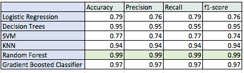

随机森林模型似乎是所有六个模型中的赢家，具有破纪录的 99%的准确性。现在，我们不需要进一步改进随机森林模型，而是检查它是否可以很好地推广到新的数据集，并且结果不会过拟合`train`数据集。方法之一是做交叉验证。


# 交叉验证

交叉验证是一种评估模型在未用于定型的数据集(即定型模型未知的数据样本)上的准确性的方法。这确保了在生产环境中部署时模型在独立数据集上的泛化。其中一种方法是将数据集分成两组——训练集和测试集。我们在前面的例子中演示了这种方法。

另一种流行且更健壮的方法是 k 倍交叉验证方法，其中数据集被划分为大小相等的 *k* 个子样本。其中 *k* 为非零正整数。在训练阶段， *k-1 个*样本用于训练模型，剩余的一个样本用于测试模型。这个过程重复 k 次，k 个样本中的一个恰好被用于测试模型一次。然后，以某种方式对评估结果进行平均或组合，例如多数投票，以提供单个评估。

我们将对之前创建的随机森林模型生成一个`5`和`10`折叠交叉验证，以评估其性能。只需在随机森林代码的末尾添加以下代码片段:

```
crossval_5_scores = cross_val_score(attrition_forest, X_train, Y_train, cv=5)
print(crossval_5_scores)
print(np.mean(crossval_5_scores))
crossval_10_scores = cross_val_score(attrition_forest, X_train, Y_train, cv=10)
print(crossval_10_scores)
print(np.mean(crossval_10_scores))
```

`5`和`10`折叠交叉验证的准确率分别为`0.9871`和`0.9875`。这是一个很好的分数，非常接近我们实际的随机森林模型分数 0.99，如下面的截图所示。这确保了模型可以很好地推广到其他独立数据集:

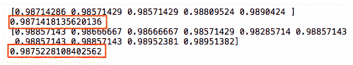

现在我们对有监督的机器学习有了一些了解，是时候转向无监督的机器学习了。

我们在本章前面介绍了无监督学习。重申目标:

无监督学习的目标是通过推断输入数据集中属性的结构和关系来识别模式。

那么，我们可以用什么算法和方法来识别模式呢？还有很多，比如集群和自编码器。我们将在接下来的章节中介绍集群，在第七章中介绍自编码器，在深度学习中介绍*。*


# 使聚集

我们将以一个问题开始这一部分。我们如何开始学习一种新的算法或机器学习方法？我们从三重 w 开始，所以，让我们用聚类方法。


# 什么是集群？

聚类是一种将相似数据分组在一起的技术，一个组具有一些不同于其他组的独特特征。可以使用各种方法将数据聚集在一起。其中一种是基于规则的，即根据某些预定义的条件来分组，比如根据客户的年龄或行业来分组。另一种方法是使用 ML 算法将数据聚集在一起。


# 集群在哪里使用？

作为一种无监督的学习过程，它最常用于从数据中推断逻辑关系和模式。集群在各个行业和商业功能中都有应用。它用于信息检索、客户细分、图像细分、对网页、新闻文章等非结构化文本进行聚类。


# 通过哪种方法可以实现集群？

有各种机器学习方法来创建聚类。聚类算法属于下列组之一:

*   **层次聚类**:也称为**凝聚聚类**，试图通过距离度量将每个数据点链接到其最近的邻居。这是一个递归过程，从一个记录开始，迭代地将它们配对在一起，直到所有记录都合并成一个单独的聚类。如果我们想象一下，它的结构类似于一棵倒置的树，可以通过树状图来可视化。使用这种方法的一个问题是确定聚类的过程。这是资源密集型的，但是可以可视化树状图并选择聚类的数量。
*   **基于分区的聚类**:在这种方法中，数据被分割成分区。划分是基于数据点之间的距离。k-means 算法是一种常用的划分聚类方法。在这种方法中，选择合适的距离函数会影响聚类的形状。欧几里德距离、曼哈顿距离和余弦距离是广泛用于创建 k 均值聚类的三种距离函数。欧几里德距离对输入向量的比例最敏感。在这种情况下，必须对输入向量的比例进行标准化或规范化，或者选择一种对比例不敏感的距离度量，如余弦距离。
*   **基于密度的技术**:这里通过使用数据点的特定概率分布来形成聚类。这个想法是，只要邻域中的密度超过一个定义的阈值，就继续传播聚类。高密度区域被标记为与低密度区域分离的聚类，这可能是噪声。噪声是数据中的随机变化或误差，在统计上是不确定的，并且无法解释。
*   **基于网格的方法**:在这种方法中，首先通过划分数据集的属性来创建超矩形网格单元。然后，它会丢弃低于定义的阈值参数的低密度细胞。然后将相邻的高密度细胞融合在一起，直到目标函数达到或保持不变。生成的像元被解释为簇。

我们将介绍层次聚类和 k-means 聚类，这是两种在行业中广泛使用的方法。


# 分层聚类

我们可以使用 scikit-learn 在 Python 中执行层次聚类。我们需要从`sklearn.cluster`导入`AgglomerativeClustering`方法来创建集群。层次聚类作用于距离度量，因此我们需要在构建模型之前将分类数据转换为合适的数字格式。我们已经使用了一键编码将分类属性转换为数字格式，还有其他各种方法可以完成这项任务。这个主题将在下一章详细讨论:

```
import pandas as pd
import numpy as np
from sklearn import preprocessing
from sklearn.cluster import AgglomerativeClustering
hr_data = pd.read_csv('data/hr.csv', header=0)
hr_data.head()
hr_data = hr_data.dropna()
print(hr_data.shape)
print(list(hr_data.columns))
data_trnsf = pd.get_dummies(hr_data, columns =['salary', 'sales'])
data_trnsf.columns
```

接下来，我们需要用以下参数实例化`AgglomerativeClustering`,并将数据拟合到模型中:

*   `n_clusters`:要查找的聚类数。默认为两个。
*   `affinity`:用于计算链接的距离度量。默认为`euclidean`；`manhattan`、`cosine`、`l1`、`l2`和`precomputed`是可以使用的其他距离度量。
*   `linkage`:该参数决定用于合并一对聚类的度量。不同的链接指标包括:
    *   **Ward** :最小化被合并聚类的方差。这是默认的参数值。
    *   **平均**:取两个集合每次观测距离的平均值。
    *   **完成**:使用两组所有观测值之间的最大距离。

现在，让我们使用一些描述的参数建立一个`AgglomerativeClustering`模型:

```
n_clusters = 3
clustering = AgglomerativeClustering(n_clusters=n_clusters,
affinity='euclidean', linkage='complete')
clustering.fit(data_trnsf)
cluster_labels = clustering.fit_predict(data_trnsf)
```

一旦模型准备好了，我们需要评估模型。评估聚类结果的最佳方式是对形成的聚类进行人工检查，并确定每个聚类代表什么以及每个聚类中的数据有哪些共同的值。

结合人工检查，还可以使用轮廓分数来确定最佳模型。轮廓值在-1 和+1 的范围内:

*   +1 表示簇中的数据靠近指定的簇，而远离其相邻簇
*   -1 表示数据点与其相邻聚类的距离比与指定聚类的距离更近

当一个模型的平均轮廓分数为-1 时，它是一个糟糕的模型，而一个具有+1 轮廓分数的模型是一个理想的模型。因此，这就是平均轮廓得分越高，聚类模型越好的原因:

```
silhouette_avg = silhouette_score(data_trnsf, cluster_labels)
print("For n_clusters =", n_clusters,"The average silhouette_score is :", silhouette_avg)
```

上述代码的输出如下:


由于我们的模型的平均轮廓分数是`0.49`，我们可以假设聚类是良好形成的。

我们可以将该分数与 k-means 聚类结果进行比较，并选择最佳模型在`HR`流失数据集上创建三个聚类。


# 分区聚类(KMeans)

我们需要从 scikit-learn 包中导入一个`KMeans`方法，其余的代码与分层集群的代码相似:

```
import pandas as pd
import numpy as np
from sklearn import preprocessing
import matplotlib.pyplot as plt 
from sklearn.cluster import KMeans
from sklearn.metrics import silhouette_samples, silhouette_score
hr_data = pd.read_csv('data/hr.csv', header=0)
hr_data.head()
hr_data = hr_data.dropna()
print(hr_data.shape)
print(list(hr_data.columns))
data_trnsf = pd.get_dummies(hr_data, columns =['salary', 'sales'])
data_trnsf.columns
```

我们需要在 k-means 函数中指定聚类数(`n_clusters`)来创建模型。这是创建 k 均值聚类的一个重要参数。它的默认值是八。接下来，将数据拟合到`KMeans`实例，并构建一个模型。我们需要`fit_predict`这些值来获得集群标签，就像对`AgglomerativeClustering`所做的那样:

```
n_clusters = 3
kmeans = KMeans(n_clusters=n_clusters)
kmeans.fit(data_trnsf)
cluster_labels = kmeans.fit_predict(data_trnsf)
```

如果我们想查看集群的质心和标签，我们可以使用`cluster_centers_`和`means_labels_`来完成:

```
centroid = kmeans.cluster_centers_
labels = kmeans.labels_
print (centroid)
print(labels)
silhouette_avg = silhouette_score(data_trnsf, cluster_labels)
print("For n_clusters =", n_clusters,"The average silhouette_score is :", silhouette_avg)
```

上述代码的输出如下:


k-means 聚类的平均值`silhouette_score`是`0.58`，这大于为分层聚类获得的平均轮廓分数。

这意味着三个聚类在 k-means 模型中比在`HR`磨损数据集上构建的分层模型中形成得更好。


# 摘要

ML 及其自动化之旅是漫长的。本章的目的是让我们熟悉机器学习的概念；最重要的是，scikit-learn 和其他 Python 包，这样我们可以在接下来的章节中顺利加速学习，创建一个线性回归模型和六个分类模型，并了解聚类技术和相互比较模型。

我们使用单个`HR`磨损数据集来创建所有分类器。我们观察到这些代码中有许多相似之处。除了用于实例化机器学习类的库之外，导入的库都是相似的。数据预处理模块在所有代码中都是冗余的。机器学习技术基于目标属性的任务和数据而变化。此外，评估方法等同于相似类型的最大似然法。

您是否认为这些领域中有一些是多余的，需要自动化？是的，他们可以，但这并不容易。当我们开始考虑自动化时，模型中以及模型周围的一切都需要连接在一起。每个代码段都是一个独立的模块。

下一章是关于数据预处理模块。这是机器学习项目中最关键和最耗时的主题。我们将讨论创建可靠的机器学习模型所需的各种数据准备任务。**