# 三、数据预处理

任何对**机器学习** ( **ML** )感兴趣的人肯定听说过，数据科学家或机器学习工程师 80%的时间花在准备数据上，剩下的 20%花在建立和评估模型上。准备数据所花费的大量时间被视为构建良好模型的一项投资。一个简单的模型——这是用一个优秀的数据集制作的——胜过一个用糟糕的数据集开发的复杂模型。在现实生活中，找到一个可靠的数据集是非常困难的。我们必须创造和培育好的数据。您一定想知道，如何创建好的数据？这是我们将在本章中发现的东西。我们将研究创建一个优秀和可行的数据集所需的一切。理论上，好与我们手头的任务以及我们如何感知和消费数据有关。在本章中，我们将带您了解以下主题:

*   数据转换
*   特征选择
*   降维
*   特征生成

对于每个主题，我们将讨论对数据集中遇到的不同类型的数据可以做的各种事情。我们还将考虑一些自动化的开源特性准备工具，这些工具对于在 Python 中准备数据非常方便。

让我们从数据转换的第一个话题开始。


# 技术要求

所有的代码示例都可以在 GitHub 的`Chapter 03`文件夹中找到。


# 数据转换

假设我们正在研究一个 ML 模型，它的任务是预测员工流失。基于我们对业务的理解，我们可能会包含一些创建好的模型所必需的相关变量。另一方面，我们可能会选择丢弃一些特征，比如`EmployeeID`，它们没有相关的信息。

识别`ID`列被称为**标识符检测**。`Identifier`在模式检测和预测中，列不会向模型添加任何信息。因此，`identifier`列检测功能可以是`AutoML`包的一部分，我们基于算法或任务依赖性来使用它。

一旦我们决定了要使用的字段，我们可以探索数据来转换某些有助于学习过程的特征。这种转换为数据增加了一些经验，这有利于 ML 模型。例如，2018 年 11 月 2 日的员工开始日期不提供任何信息。但是，如果我们将这个特性转换成四个属性——日期、日、月和年，它会增加模型构建练习的价值。

特征变换也很大程度上取决于所使用的 ML 算法的类型。大体上，我们可以将监督模型分为两类——基于树的模型和非基于树的模型。

基于树的模型自己处理大多数特征中的异常。当我们进行特征变换时，非基于树的模型，例如最近邻和线性回归，提高了它们的预测能力。

理论解释到此为止。现在，让我们直接进入一些可以在我们经常遇到的各种数据类型上执行的特性转换。我们将首先从数字特征开始。


# 数字数据转换

以下是一些最广泛使用的转换数字数据的方法:

*   缩放比例
*   缺少值
*   极端值

这里显示的技术可以嵌入到函数中，这些函数可以直接应用于在 AutoML 管道中转换数字数据。


# 缩放比例

**标准化**和**规范化**是业内使用的**缩放**技术的两个术语。这两种技术都确保了模型中使用的数字特征在其表示中具有同等的权重。大多数时候，人们交替使用标准化和规范化。虽然它们都是缩放技术，但两者之间只有一线之差。

标准化假设数据是正态分布的。它重新调整数据，使均值为零，标准差为一。归一化是一种缩放技术，它假定数据没有先验分布。在这种技术中，数值数据被重新调整到一个固定的范围:0 到 1，-1 到+1，依此类推。

以下是一些广泛使用的标准化或规范化数据的技术:

*   **Z 分数标准化**:此处，如果数据遵循高斯分布，则数据的平均值为 0，标准偏差为 1。一个先决条件是让数字数据呈正态分布。在数学上，它被表示为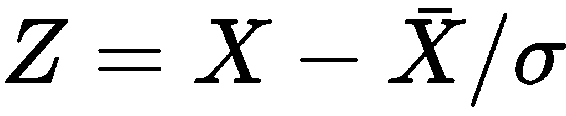，其中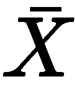是值的平均值，σ是值的标准偏差。

Scikit-learn 提供了各种方法来标准化和规范化数据。让我们首先使用以下代码片段加载`HR`流失数据集:

```
%matplotlib inline
import numpy as np
import pandas as pd
hr_data = pd.read_csv('data/hr.csv', header=0)
print (hr_data.head())
```

上述代码的输出显示了数据集的各种属性以及一些数据点:

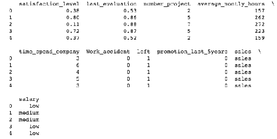

让我们使用以下代码来分析数据集的分布:

```
hr_data[hr_data.dtypes[(hr_data.dtypes=="float64")|(hr_data.dtypes=="int64")].index.values].hist(figsize=[11,11])
```

前面代码的输出是一些各种数字属性的直方图:

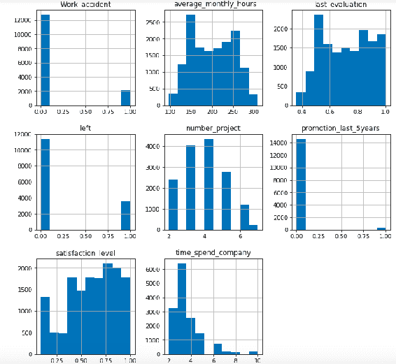

例如，让我们使用来自`sklearn.preprocessing`模块的`StandardScaler`来标准化`satisfaction_level`列的值。一旦我们导入了方法，我们首先需要创建一个`StandardScaler`类的实例。接下来，我们需要使用`fit_transform`方法来拟合和转换需要标准化的列。在下面的例子中，我们使用`satisfaction_level`属性进行标准化:

```
from sklearn.preprocessing import StandardScaler
scaler = StandardScaler()
hr_data_scaler=scaler.fit_transform(hr_data[['satisfaction_level']])
hr_data_scaler_df = pd.DataFrame(hr_data_scaler)
hr_data_scaler_df.max()
hr_data_scaler_df[hr_data_scaler_df.dtypes[(hr_data_scaler_df.dtypes=="float64")|(hr_data_scaler_df.dtypes=="int64")].index.values].hist(figsize=[11,11])
```

一旦我们执行了前面的代码，我们可以再次查看`satisfication_level`实例直方图，并观察到这些值在 **-2** 到 **1.5** 之间是标准化的:

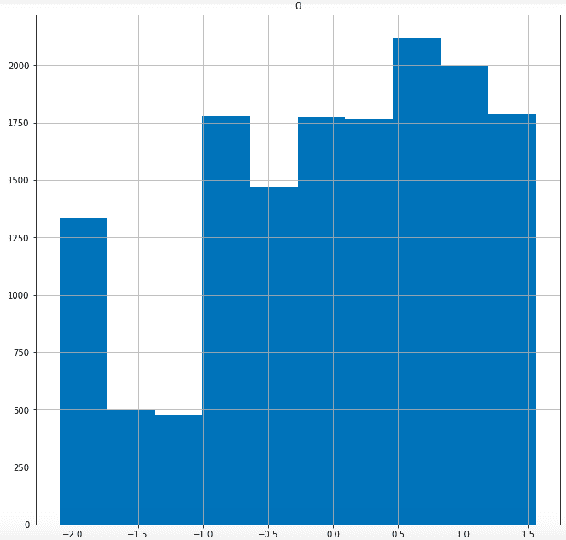

*   **最小-最大标准化**:在该技术中，变量的最小值从其实际值减去其最大值和最小值之差。从数学上来说，它可以表示为:

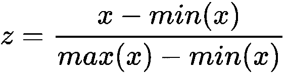

scikit-learn 的`preprocessing`模块中提供了`MinMaxScaler`方法。在本例中，我们对`HR`流失数据集的四个属性进行了归一化处理— `average_monthly_hours`、`last_evaluation`、`number_project`和`satisfaction_level`。我们遵循与`StandardScaler`相似的流程。我们首先需要从`sklearn.preprocessing`模块导入`MinMaxScaler`并创建一个`MinMaxScaler`类的实例。

接下来，我们需要使用`fit_transform`方法来拟合和转换列:

```
from sklearn.preprocessing import MinMaxScaler
minmax=MinMaxScaler()
hr_data_minmax=minmax.fit_transform(hr_data[[ 'average_montly_hours',
 'last_evaluation', 'number_project', 'satisfaction_level']])
hr_data_minmax_df = pd.DataFrame(hr_data_minmax)
hr_data_minmax_df.min()
hr_data_minmax_df.max()
hr_data_minmax_df[hr_data_minmax_df.dtypes[(hr_data_minmax_df.dtypes=="float64")|(hr_data_minmax_df.dtypes=="int64")].index.values].hist(figsize=[11,11])
```

下面的直方图描述了被转换的四个属性的值分布在 **0** 和 **1** 之间:

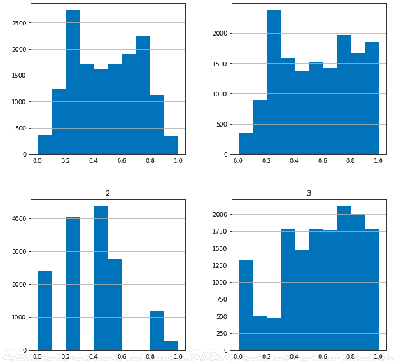

# 缺少值

我们经常会遇到这样的数据集，对于特定的变量/属性，并非所有的值都可用。发生这种情况有多种原因，例如调查中被忽略的问题、键入错误、设备故障等。在数据挖掘项目中遇到这些缺失值是意料之中的，处理这些值是必不可少的。

缺失值插补占据了数据科学家的大部分时间。我们可以通过各种方法估算缺失值。决定因素是在确定这些不可用值的属性时使用什么。决定何时使用什么来输入缺失值的过程是一种天赋，来自于处理数据的经验。有时最好直接移除这些值，对于某些赋值，最好使用高级挖掘技术来估算这些值。

因此，出现了两个最重要的问题:

*   什么时候使用哪种插补方法？
*   估算一个值的最好方法是什么？

我们认为它来自于处理缺失值的经验；最好的开始方式是通过对数据应用不同的插补方法进行比较研究，然后选择适当的技术，用偏差最小的估计值来指定空值。

一般来说，当我们遇到一个丢失的值时，我们首先会尝试检查为什么一个值会丢失。是因为收集数据时的一些问题，还是数据源本身就是罪魁祸首？最好从根本上解决问题，而不是直接估算值。这是一个理想的情况，但大多数时候，这是不可能的。例如，如果我们正在处理一个调查数据集，而一些受访者选择不透露具体信息，在这种情况下，估算值可能是不可避免的。

因此，在我们开始输入值之前，我们可以使用以下准则:

*   调查丢失的数据
*   分析缺失的数据
*   决定产生最小偏差估计的最佳策略

我们可以将此记为缺失值插补的 **IAD** 规则(即调查、分析和决定)。以下是我们处理缺失值的一些可用方法:

1.  **移除或删除数据**:当很少的数据点丢失时，我们可以忽略这些数据，单独分析这些情况。这种方法被称为**列表删除**。但是，当缺少太多值时，这是不可取的，因为我们可能会丢失数据中的一些有价值的信息。成对删除是另一种技术，我们可以只删除丢失的值。这表明我们分析所有只存在感兴趣的数据的情况。这是一个安全的策略，但是，使用这种方法，我们可能每次从每个样本中得到不同的结果，即使数据有很小的变化。

我们将再次使用`HR`损耗数据集来演示缺失值的处理。让我们首先加载数据集，并查看数据集中的空值数量:

```
import numpy as np
import pandas as pd
hr_data = pd.read_csv('data/hr.csv', header=0)
print (hr_data.head())
print('Nulls in the data set' ,hr_data.isnull().sum())
```

正如我们从下面的输出中看到的，数据集相对干净，只有`promotion_last_5years`有一些丢失的值。因此，我们将综合吸收一些缺失的值到一些列中:

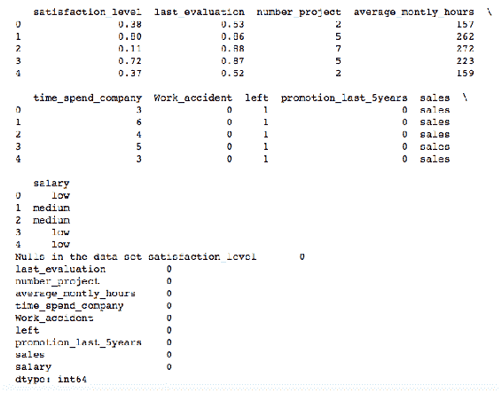

```
promotion_last_5years, average_montly_hours, and number_project with null values:
```

```
#As there are no null introduce some nulls by replacing 0 in promotion_last_5years with NaN
hr_data[['promotion_last_5years']] = hr_data[[ 'promotion_last_5years']].replace(0, np.NaN)
#As there are no null introduce some nulls by replacing 262 in promotion_last_5years with NaN
hr_data[['average_montly_hours']] = hr_data[[ 'average_montly_hours']].replace(262, np.NaN)
#Replace 2 in number_project with NaN
hr_data[['number_project']] = hr_data[[ 'number_project']].replace(2, np.NaN)
print('Nulls in the data set', hr_data.isnull().sum())
```

在这个练习之后，为这三列插入了一些空值，我们可以从下面的结果中看到:

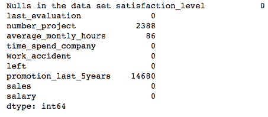

在删除行之前，让我们先创建一个`hr_data`的副本，这样我们就不会替换原始数据集，该数据集将用于演示其他缺失值插补方法。接下来，我们使用`dropna`方法删除缺少值的行:

```
#Remove rows
hr_data_1 = hr_data.copy()
print('Shape of the data set before removing nulls ', hr_data_1.shape)
# drop rows with missing values
hr_data_1.dropna(inplace=True)
# summarize the number of rows and columns in the dataset
print('Shape of the data set after removing nulls ',hr_data_1.shape)
```

我们可以观察到这个练习后的行数从`14999`减少到了`278`。删除行必须小心使用。由于`promotion_last_5years`大约有 14680 个缺失值，14680 个记录被完全删除:


2.  **使用一个全局常量来填充缺失值**:我们可以使用一个全局常量，比如 NA 或者-999，将缺失值从数据集的其余部分中分离出来。此外，还存在没有任何值的空值，但它们构成了数据集的固有部分。这些值被故意保留为空白。当空值无法从缺失值中分离出来时，使用全局常量是一种安全的策略。

我们可以使用`fillna`方法将缺失值替换为一个常量值，比如`-999`。以下代码片段演示了此方法的用法:

```
#Mark global constant for missing values
hr_data_3 = hr_data.copy()
# fill missing values with -999
hr_data_3.fillna(-999, inplace=True)
# count the number of NaN values in each column
print(hr_data_3.isnull().sum())
print(hr_data_3.head())
```

从以下结果中我们可以看出，所有缺失值都被替换为`-999`值:


3.  **用属性 mean/median** 替换缺失值:这是数据科学家和机器学习工程师最喜欢的方法。对于数值，我们可以用平均值或中值替换缺失值，对于分类值，我们可以用众数替换缺失值。这种方法的缺点是，它可能会降低属性的可变性，这反过来又会削弱相关性估计。如果我们处理的是监督分类模型，我们还可以用数字值的组均值或中值以及分类值的分组模式来替换缺失值。在这些分组均值/中值方法中，属性值按目标值分组，该组中缺少的值用该组的均值/中值替换。

我们可以使用同样的`fillna`方法，将均值函数作为参数，用均值替换缺失值。下面的代码演示了它的用法:

```
#Replace mean for missing values
hr_data_2 = hr_data.copy()
# fill missing values with mean column values
hr_data_2.fillna(hr_data_2.mean(), inplace=True)
# count the number of NaN values in each column
print(hr_data_2.isnull().sum())
print(hr_data_2.head())
```

我们可以从下面的输出中看到，缺失值被替换为每个属性的平均值:

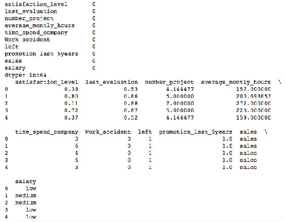

4.  **使用指示变量**:我们也可以生成一个二进制变量，指示记录中是否有缺失值。我们可以将其扩展到多个属性，为每个属性创建二进制指示器变量。我们还可以估算缺失值，并构建二元指示变量，以表示它是真实变量还是估算变量。如果因为真正的跳过而丢失了某个值，结果不会有偏差。

正如我们演示其他插补方法一样，让我们首先复制原始数据，并制作新的列来表示要插补的属性和值。下面的代码首先创建新列，将`_was_missing`追加到那些缺少值的属性的原始列名。

接下来，用全局常数`-999`替换丢失的值。虽然我们使用了全局常数插补方法，但您可以使用任何插补方法来插补缺失值:

```
# make copy to avoid changing original data (when Imputing)
hr_data_4 = hr_data.copy()
# make new columns indicating what is imputed
cols_with_missing = (col for col in hr_data_4.columns 
 if hr_data_4[col].isnull().any())
for col in cols_with_missing:
 hr_data_4[col + '_was_missing'] = hr_data_4[col].isnull()
hr_data_4.fillna(-999, inplace=True)
hr_data_4.head()
```

我们可以从下面的结果中看到，创建了新的列，表明属性中是否存在缺失值:

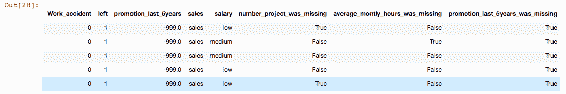

5.  **使用数据挖掘算法预测最可能的值**:我们可以应用 ML 算法，如 KNN、线性回归、随机森林或决策树技术，来预测缺失属性最可能的值。这种方法的一个缺点是，如果计划对相同的数据集使用相同的算法来执行另一项任务(如预测或分类),可能会使数据过拟合。

在 Python 中，`fancyimpute`是一个提供高级数据挖掘选项来估算缺失值的库。这是我们最常使用的东西，所以我们想展示这个包。Python 中可能还有其他一些库也可以完成类似的任务。首先，我们需要使用下面的命令安装`fancyimpute`库。这必须在命令提示符下执行:

```
pip install fancyimpute
```

安装完成后，我们可以返回 Jupyter 笔记本，从`fancyimpute`库中导入`KNN`方法。KNN 插补方法只适用于数值。因此，我们首先从`hr_data`集中只选择数字列。接下来，创建一个 *k* 等于`3`的 KNN 模型，并为数值属性替换缺失值:

```
from fancyimpute import KNN

hr_data_5 = hr_data.copy()
hr_numeric = hr_data_5.select_dtypes(include=[np.float])
hr_numeric = pd.DataFrame(KNN(3).complete(hr_numeric))
hr_numeric.columns = hr_numeric.columns
hr_numeric.index = hr_numeric.index
hr_numeric.head()
```

`fancyimpute`库使用 TensorFlow 后端，执行起来需要一些时间。执行完成后，我们可以向下滚动查看插补结果，如下图所示:

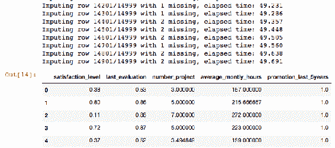

# 极端值

异常值是不符合整体数据模式的极端值。它们通常远离其他观测值，并扭曲数据的总体分布。将它们包含在模型构建过程中可能会导致错误的结果。恰当地对待他们是非常必要的。异常值有两种类型——单变量和多变量。


# 检测和处理单变量异常值

顾名思义，单变量异常值基于数据集中的单个属性。使用箱线图并通过查看属性值的分布来发现单变量异常值。然而，当我们构建 AutoML 管道时，我们没有特权可视化数据分布。相反，AutoML 系统应该能够检测异常值并自己处理它们。

因此，我们可以采用以下三种方法中的任何一种来自动检测和处理单变量异常值:

*   四分位距和过滤
*   Winsorizing
*   整理

让我们创建一个虚拟异常数据集来演示异常检测和处理方法:

```
%matplotlib inline
import numpy as np
import matplotlib.pyplot as plt
number_of_samples = 200
outlier_perc = 0.1
number_of_outliers = number_of_samples - int ( (1-outlier_perc) * number_of_samples )
# Normal Data
normal_data = np.random.randn(int ( (1-outlier_perc) * number_of_samples ),1)
# Inject Outlier data
outliers = np.random.uniform(low=-9,high=9,size=(number_of_outliers,1))
# Final data set
final_data = np.r_[normal_data,outliers]
```

让我们使用以下代码绘制新创建的数据集:

```
#Check data
plt.cla()
plt.figure(1)
plt.title("Dummy Data set")
plt.scatter(range(len(final_data)),final_data,c='b')
```

我们可以从下图中看到，在数据集的末尾有一些异常值:

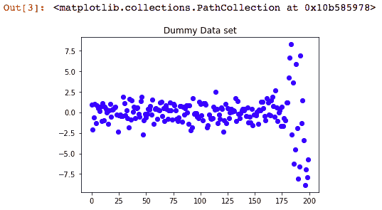

我们还可以使用下面的代码生成一个箱线图来观察异常值。盒状图，也称为**盒须**，是一种基于五个数字汇总来表示数据分布的方式:最小值、第一个四分位数、中值、第三个四分位数和最大值。任何低于最小值和高于最大值的标记都被认为是异常值:

```
## Detect Outlier###
plt.boxplot(final_data)
```

从生成的箱线图中，我们可以观察到有一些值超出了最大值和最小值标记。因此，我们可以假设我们成功地创造了一些异常值:

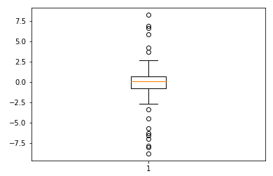

移除异常值的一种方法是过滤位于最大值以上和最小值以下的值。为了完成这项任务，首先我们需要计算**四分位间距** ( **IQR** )。


# 四分位间距

四分位间距是对数据集中可变性或分布的度量。它是通过将数据集分成四分位数来计算的。四分位数根据我们之前学习的五个数字摘要将数据集分成四份，即最小值、第一个四分位数、第二个四分位数、第三个四分位数和最大值。第二个四分位数是排序数据集的中值；第一个四分位数是排序数据集前半部分的中间值，第三个四分位数是排序数据集后半部分的中间值。

四分位数间距是第三个四分位数(`quartile75`或`Q3`)和第一个四分位数(`quartile25`或`Q1`)之间的差值。

我们使用以下代码在 Python 中计算`IQR`:

```
## IQR Method Outlier Detection and Removal(filter) ##
quartile75, quartile25 = np.percentile(final_data, [75 ,25])
## Inter Quartile Range ##
IQR = quartile75 - quartile25
print("IQR",IQR)
```

我们可以从下面的代码中看到，数据集的`IQR`是`1.49`:

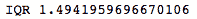

# 过滤值

我们可以过滤位于最大值之上和最小值之下的值。最小值可以用公式`quartile25 - (IQR * 1.5)`计算，最大值为`quartile75 + (IQR*1.5)`。

计算最大值和最小值的方法是基于土耳其围栏，这是由约翰土耳其。值`1.5`表示约 1%的测量值为异常值，与 3σ原则同义，3σ原则在许多统计测试中被实践为一个界限。我们可以使用除了`1.5`之外的任何值，这由我们决定。但是，界限可能会增加或减少数据集中异常值的数量。

我们利用以下 Python 代码来计算数据集的`Max`和`Min`值:

```
## Calculate Min and Max values ##
min_value = quartile25 - (IQR*1.5)
max_value = quartile75 + (IQR*1.5)
print("Max", max_value)
print("Min", min_value)
```

执行上述代码后，我们注意到以下输出。最大值和最小值分别为`2.94`和`-3.03`:

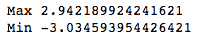

接下来，我们使用以下代码过滤低于`min_value`和高于`max_value`的值:

```
filtered_values = final_data.copy()
filtered_values[ filtered_values< min_value] = np.nan
filtered_values[ filtered_values > max_value] = np.nan
#Check filtered data
plt.cla()
plt.figure(1)
plt.title("IQR Filtered Dummy Data set")
plt.scatter(range(len(filtered_values)),filtered_values,c='b')
```

在代码执行成功完成后，我们可以看到离群值被消除，数据集看起来比之前的数据集好得多:

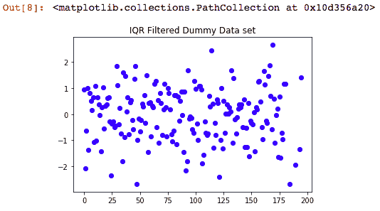

# Winsorizing

Winsorizing 是用较小的绝对值代替极值的方法。它对数值列中的非空值进行排序，计算尾部值，然后用定义的参数替换尾部值。

我们可以使用 SciPy 包中的`winsorize`方法来处理异常值。SciPy 是一个 Python 库，它收集了科学和技术计算领域的开源 Python 贡献。它有一个广泛的统计计算模块，线性代数，优化，信号和图像处理模块，以及更多的模块集合。

一旦我们导入了`winsorize`方法，我们需要将`data`和`limit`参数传递给函数。通过这种方法进行尾值的计算和替换，并生成最终的无异常值数据:

```
##### Winsorization ####
from scipy.stats.mstats import winsorize
import statsmodels.api as sm
limit = 0.15
winsorized_data = winsorize(final_data,limits=limit)
#Check winsorized data
plt.cla()
plt.figure(1)
plt.title("Winsorized Dummy Data set")
plt.scatter(range(len(winsorized_data)),winsorized_data,c='b')
```

我们可以从下面的图中观察到，极值是 winsorized，并且数据看起来没有异常值:

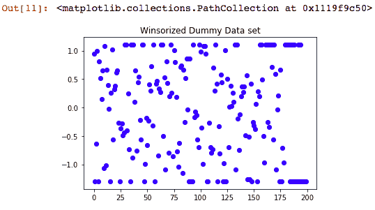

# 整理

修剪与 winsorizing 相同，只是尾部值被裁剪掉了。

`stats`库中的`trimboth`方法从数据的两端分割数据集。`final_data`和`0.1`的限值作为参数传递给函数，从两端修剪 10%的数据:

```
### Trimming Outliers ###
from scipy import stats
trimmed_data = stats.trimboth(final_data, 0.1)
#Check trimmed data
plt.cla()
plt.figure(1)
plt.title("Trimmed Dummy Data set")
plt.scatter(range(len(trimmed_data)),trimmed_data,c='b')
```

我们可以从下面的结果图中观察到，极值被剪切，不再存在于数据集中:

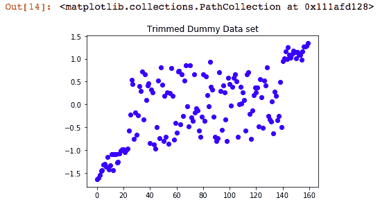

# 检测和处理多元异常值

多元异常值是至少两个变量的极端得分的混合。单变量离群点检测方法非常适合处理一维数据，但是当我们超越一维时，使用这些方法检测离群点就变得很有挑战性。多元异常检测方法也是异常检测方法的一种形式。诸如一类 SVM、**局部异常值因子** ( **LOF** )和`IsolationForest`等技术是检测多元异常值的有用方法。

我们使用下面的`IsolationForest`代码来描述对`HR`磨损数据集的多元异常值检测。我们需要从`sklearn.ensemble`包中导入`IsolationForest`。接下来，我们加载数据，将分类变量转换为一次性编码变量，并使用估计量调用`IsolationForest`方法:

```
##Isolation forest
import numpy as np
import pandas as pd
from sklearn.ensemble import IsolationForest
hr_data = pd.read_csv('data/hr.csv', header=0)
print('Total number of records ',hr_data.shape)
hr_data = hr_data.dropna()
data_trnsf = pd.get_dummies(hr_data, columns =['salary', 'sales'])
data_trnsf.columns
clf = IsolationForest(n_estimators=100)
```

然后，我们将`IsolationForest`实例(`clf`)与数据进行拟合，并使用`predict`方法预测异常值。离群值由`-1`表示，非离群值(也称为**新奇数据**)由`1`表示:

```
clf.fit(data_trnsf)
y_pred_train = clf.predict(data_trnsf)
data_trnsf['outlier'] = y_pred_train
print('Number of outliers ',data_trnsf.loc[data_trnsf['outlier'] == -1].shape)
print('Number of non outliers ',data_trnsf.loc[data_trnsf['outlier'] == 1].shape)
```

我们可以从下面的输出中看到，该模型能够从包含`14999`条记录的数据集中识别出大约`1500`个异常值:

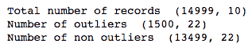

# 扔掉

宁滨是将连续数值分组到较小数量的桶或箱中的过程。这是离散化连续数据值的一项重要技术。许多算法(如朴素贝叶斯和 Apriori)适用于离散数据集，因此有必要将连续数据转换为离散值。

有各种类型的宁滨方法:

*   **等宽宁滨**:等宽面元通过将数据划分成大小相等的 *k* 个区间来确定；

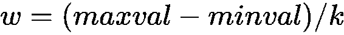

其中 *w* 是箱的宽度， *maxval* 是数据中的最大值， *minval* 是数据中的最小值， *k* 是箱的期望数量

间隔边界形成如下:

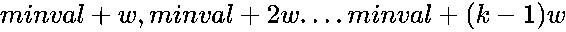

*   **等频宁滨**:通过将数据分成 *k* 组来确定等频箱，其中每组包括相同数量的值。

在这两种方法中， *k* 的值是基于我们的要求以及通过试错过程来确定的。

除了这两种方法之外，我们还可以明确地提到创建箱的切割点。当我们知道数据并希望它以某种格式存储时，这非常有用。以下代码是一个基于预定义切割点执行宁滨的函数:

```
#Bin Values:
def bins(column, cutpoints, labels=None):
 #Define min and max values:
 min_val = column.min()
 max_val = column.max()
 print('Minimum value ',min_val)
 print(' Maximum Value ',max_val)
 break_points = [min_val] + cut_points + [max_val]
 if not labels:
   labels = range(len(cut_points)+1)
 #Create bins using the cut function in pandas
 column_bin = pd.cut(column,bins=break_points,labels=labels,include_lowest=True)
 return column_bin
```

以下代码将员工的满意度分为三类— `low`、`medium`和`high`。低于`0.3`的分数被认为是`low`满意度，高于`0.6`的分数被认为是高度满意的员工分数，介于这两个值之间的被认为是`medium`:

```
import pandas as pd
hr_data = pd.read_csv('data/hr.csv', header=0)
hr_data.head()
hr_data = hr_data.dropna()
print(hr_data.shape)
print(list(hr_data.columns))
#Binning satisfaction level:
cut_points = [0.3,0.6]
labels = ["low","medium","high"]
hr_data["satisfaction_level"] = bins(hr_data["satisfaction_level"], cut_points, labels)
print('\n####The number of values in each bin are:###\n\n',pd.value_counts(hr_data["satisfaction_level"], sort=False))
```

一旦我们执行了前面的代码，我们可以从下面的结果中观察到为`satisfaction_level`属性创建了三个 bin，其中`1941`值在`low` bin 中，`4788`在`medium` bin 中，`8270`在`high` bin 中:

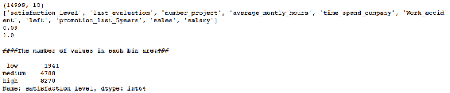

# 对数和幂变换

对数和幂变换通常有助于非基于树的模型，使高度倾斜的分布不那么倾斜。这种预处理技术有助于满足线性回归模型的假设和推断统计的假设。这种类型的转换包括对数转换、平方根转换和对数-对数转换。

以下是使用虚拟数据集的平方根变换演示:

```
import numpy as np
values = np.array([-4, 6, 68, 46, 89, -25])
# Square root transformation #
sqrt_trnsf_values = np.sqrt(np.abs(values)) * np.sign(values)
print(sqrt_trnsf_values)
```

以下是前面平方根转换的输出:

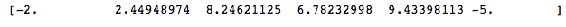

接下来，让我们使用另一个虚拟数据集来尝试对数转换:

```
values = np.array([10, 60, 80, 200])
#log transformation #
log_trnsf_values = np.log(1+values)
print(log_trnsf_values)
```

虚拟数据集上的对数变换产生以下结果:

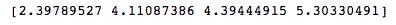

既然我们已经对数值数据的不同预处理方法有了一个比较好的想法，那么让我们来看看分类数据中存储了什么。


# 分类数据转换

分类数据本质上是非参数的。这意味着它不遵循任何数据分布。然而，为了在参数模型中使用这些变量，它们需要使用各种编码方法进行转换，缺失的值将被替换，并且我们可以使用宁滨技术来减少类别的数量。


# 编码

在许多实际的 ML 活动中，数据集将包含分类变量。它更适合于企业环境，因为大多数属性都是分类的。这些变量有不同的离散值。例如，组织的规模可以是`Small`、`Medium`或`Large`，地理区域可以是`Americas`、`Asia Pacific`和`Europe`。许多 ML 算法，尤其是基于树的模型，可以直接处理这种类型的数据。

但是，许多算法不直接接受数据。因此，需要将这些属性编码成数值，以便进一步处理。有各种方法对分类数据进行编码。以下部分描述了一些广泛使用的方法:

*   **标签编码**:顾名思义，标签编码是将分类标签转换成数值标签。标签编码更适合于有序分类数据。标签总是在 0 和 n-1 之间，其中 n 是类的数量。
*   **一键编码**:这也称为虚拟编码。在这种方法中，会为分类属性/预测值的每个类生成虚拟列。对于每个虚拟预测值，值的存在用 1 表示，不存在用 0 表示。
*   **基于频率的编码**:在这种方法中，首先计算每个类别的频率。然后计算所有类别中每个类别的相对频率。这个相对频率被指定为属性级别的编码值。
*   **目标均值编码**:在这种方法中，每一类分类预测值被编码为目标均值的函数。这种方法只能用于有目标特征的监督学习问题。
*   **二进制编码**:首先将类转换成数值。然后将这些数值转换成它们相似的二进制字符串。这后来被分成单独的列。每个二进制数字成为一个独立的列。
*   **哈希编码**:这种方法也就是俗称的特征哈希。我们大多数人都知道一个用于将数据映射为数字的哈希函数。此方法可能会将不同的类分配给同一个存储桶，但在输入要素存在数百个类别或类的情况下非常有用。

这些技术中的大部分，以及其他许多技术，也是用 Python 实现的，并且可以在包`category_encoders`中获得。您可以使用以下命令安装`category_encoders`库:

```
pip install category_encoders
```

接下来，我们将`category_encoders`库导入为`ce`(一个支持在代码中轻松使用它的简短代码)。我们加载`HR`损耗数据集，并对`salary`属性进行一次性编码:

```
import pandas as pd
import category_encoders as ce
hr_data = pd.read_csv('data/hr.csv', header=0)
hr_data.head()
hr_data = hr_data.dropna()
print(hr_data.shape)
print(list(hr_data.columns))
onehot_encoder = ce.OneHotEncoder(cols=['salary'])
onehot_df = onehot_encoder.fit_transform(hr_data)
onehot_df.head()
```

我们可以观察到使用`category_encoders`库将分类属性转换成其对应的独热编码属性是多么容易:

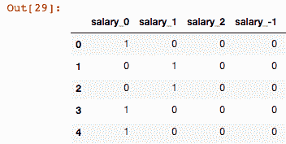

类似地，我们使用`OrdinalEncoder`来标记编码`salary`数据:

```
ordinal_encoder = ce.OrdinalEncoder(cols=['salary'])
ordinal_df = ordinal_encoder.fit_transform(hr_data)
ordinal_df.head(10)
ordinal_df['salary'].value_counts()
```

前面的代码将低、中、高工资等级映射为三个数值，`0`、`1`和`2`:

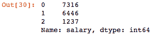

类似地，您可以使用下面的代码片段尝试`CategoryEncoders`中的其他分类编码方法，并观察结果:

```
binary_encoder = ce.BinaryEncoder(cols=['salary'])
df_binary = binary_encoder.fit_transform(hr_data)
df_binary.head()

poly_encoder = ce.PolynomialEncoder(cols=['salary'])
df_poly = poly_encoder.fit_transform(hr_data)
df_poly.head()

helmert_encoder = ce.HelmertEncoder(cols=['salary'])
helmert_df = helmert_encoder.fit_transform(hr_data)
helmert_df.head()
```

下一个讨论主题是处理分类属性缺失值的方法。


# 分类数据转换缺少值

对于分类变量，评估缺失值的技术也保持不变。但是，有些插补技术是不同的，有些方法类似于前面讨论的数值缺失值处理方法。我们将展示专门用于分类缺失值处理的技术的 Python 代码:

*   **移除或删除数据**:决定是否移除分类变量缺失数据点的过程与我们讨论的数值缺失值处理过程相同。
*   **用模式**替换缺失值:因为分类数据是非参数的，不像数字数据，它们没有平均值或中值。因此，替换缺失分类值的最简单方法是使用模式。众数是分类变量中出现次数最多的类别。例如，假设我们有三个类别的预测器:红色、绿色和蓝色。红色在数据集中出现的频率最高，为 30，其次是绿色，为 20，蓝色为 10。然后，可以使用红色替换缺失值，因为这是预测值出现频率最高的值。

我们将再次利用`HR`损耗数据集来解释分类属性的缺失值处理。让我们首先加载数据集，并观察数据集中的空值数量:

```
import numpy as np
import pandas as pd
hr_data = pd.read_csv('data/hr.csv', header=0)
print('Nulls in the data set' ,hr_data.isnull().sum())
```

我们从下面的输出中了解到，数据集在分类属性`sales`和`salary`中没有缺失数据。因此，我们将综合吸收这些特征的一些缺失值:

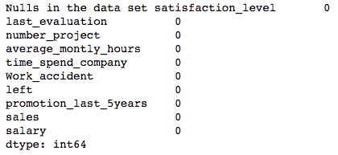

```
sales value in the sales attribute and low with nulls for the salary attribute:
```

```
#As there are no null introduce some nulls by replacing sales in sales column with NaN
hr_data[['sales']] = hr_data[[ 'sales']].replace('sales', np.NaN)
#As there are no null introduce some nulls by replacing low in salary column with NaN
hr_data[['salary']] = hr_data[[ 'salary']].replace('low', np.NaN)
print('New nulls in the data set' ,hr_data.isnull().sum())
```

一旦我们执行了代码，我们可以在`salary`和`sales`属性中找到一些空值，如下面的输出所示:

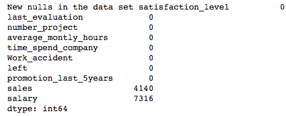

现在，我们可以用每列的模式替换这些空值。正如我们对数值缺失值插补所做的那样，即使在这里，我们也首先创建一个`hr_data`的副本，这样我们就不会替换原始数据集。接下来，我们使用`fillna`方法用模式值填充行，如下面的代码片段所述:

```
#Replace mode for missing values
hr_data_1 = hr_data.copy()
# fill missing values with mode column values
for column in hr_data_1.columns:
 hr_data_1[column].fillna(hr_data_1[column].mode()[0], inplace=True)
# count the number of NaN values in each column
print(hr_data_1.isnull().sum())
print(hr_data_1.head())
```

我们可以从下面的输出中看到，`sales`列中缺失的值被替换为`salary`列中的`technical`和`medium`:

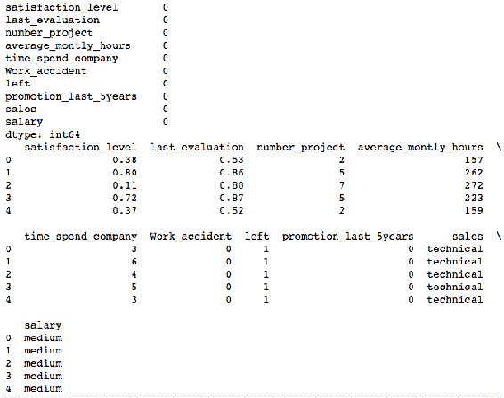

*   **使用一个全局常量来填充缺失值**:类似于数值缺失值的处理，我们可以使用一个全局常量如`AAAA`或`NA`来区分缺失值和数据集的其余部分:

```
#Mark global constant for missing values
hr_data_2 = hr_data.copy()
# fill missing values with global constant values
hr_data_2.fillna('AAA', inplace=True)
# count the number of NaN values in each column
print(hr_data_2.isnull().sum())
print(hr_data_2.head())
```

前面代码的输出产生了以下结果，其中丢失的值被替换为`AAA`:


*   **使用指示变量**:类似于我们讨论的数字变量，我们也可以有一个指示变量来识别缺失分类数据的估算值。
*   **使用数据挖掘算法预测最可能的值**:正如我们对数字属性所做的那样，我们也可以使用数据挖掘算法，比如决策树、随机森林或 KNN 方法，来预测缺失值的最可能值。同样的`fancyimpute`库也可以用于这个任务。

我们已经讨论了处理结构化数据的数据预处理的方法。在这个数字时代，我们正在从各种来源捕获大量非结构化数据。在下一节中，让我们了解预处理文本数据的方法，以便模型可以使用这些数据。


# 文本预处理

有必要通过移除在分析期间向文本添加噪声的不必要的文本来减小文本数据的特征空间的大小。通常要执行一系列步骤来预处理文本数据。然而，并不是每项任务都需要所有的步骤，而是在必要时使用。例如，如果文本数据项中的每个单词都已经是小写，那么就不需要修改文本的大小写来使其一致。

文本预处理任务有三个主要元素:

*   标记化
*   正常化
*   代替

我们将使用`nltk`库来演示不同的文本预处理方法。通过在命令提示符下发出以下命令来安装`nltk`库:

```
pip install nltk
```

安装完成后，在 Python 环境中运行以下代码片段:

```
##Run this cell only once##
import nltk
nltk.download()
```

你将得到一个 NLTK 下载弹出。从标识符部分选择 all，然后等待安装完成。

在本节中，我们将研究一些预处理步骤，这些步骤用于对文本进行预处理以生成规范化形式:

1.  标记化——这是一种将文本分割成更小块的方法，例如句子或单词。此外，一些文本挖掘任务，如准备 Word2Vec 模型，更喜欢使用段落或句子样式的文本。所以，我们可以使用 NLTK 的`sent_tokenizer`将文本转换成句子。首先，我们使用下面的代码片段从`data`文件夹中读取文本文件:

```
import pandas as pd
import category_encoders as ce
text_file = open('data/example_text.txt', 'rt')
text = text_file.read()
text_file.close()
```

2.  接下来，为了将文本标记成句子，我们从`nltk`库中导入`sent_tokenize`方法，并将文本作为参数传递:

```
## Sentence tokenization ##
from nltk import sent_tokenize
sentence = sent_tokenize(text)
print(sentence[0])
```

上述代码会产生以下输出:

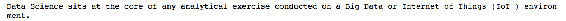

3.  类似地，一些建模方法，如单词袋模型，需要文本采用单个单词的格式。对于这种情况，我们可以使用 NLTK 的`word_tokenizer`方法将文本转换成单词，如下面的代码片段所示:

```
## Word tokenization ##
from nltk import word_tokenize
words = word_tokenize(text)
print(words[:50])
```

4.  以下输出显示文本中的`50`标记化单词。我们可以看到一些非字母字符，如标点符号被符号化。这对分析练习没有任何价值，因此，我们需要删除这些变量:

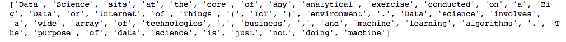

5.  在准备单词袋模型时，标点等非字母字符不会增加任何值，因此可以删除各种标点和符号，如`.`、`"`、`+`和`~`。

有各种方法可以用来删除非字母字符。现在我们将举例说明 Python 中的一种方法:

```
# Remove punctuations and keep only alphabets
words_cleaned = [word for word in words if word.isalpha()]
print(words_cleaned[:50])
```

6.  我们可以从下面的记号中看到，不需要的符号如`(`被从记号列表中删除。但是，有一些常见的词，如`at`和`of`，对分析没有任何价值，可以使用`stop word removal`方法删除:

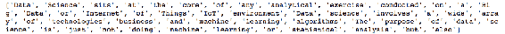

7.  停用词是书写文本文档时常用的短功能词。它们可能是填充词或介词。NLTK 提供了一个标准的英语停用词集合，可以用来过滤我们文本中的停用词。此外，有时，特定领域的停用词可用于消除非正式词汇。我们总是可以从文本中创建一个与我们的分析无关的单词列表。

为了删除停用词，首先我们从`ntlk.corpus`库中导入`stopwords`方法。然后，我们从`stopwords.words`方法中调用`english`停用词词典，并删除在标记列表中找到的任何常用词:

```
# remove the stop words
from nltk.corpus import stopwords
stop_words = set(stopwords.words('english'))
words_1 = [word for word in words_cleaned if not word in stop_words]
print(words_1[:50])
```

8.  我们可以从下面的输出中看到，之前出现的单词如`at`和`the`被从标记列表中删除。然而，一些类似的单词，如`Data`和`data`，作为单独的单词出现在令牌列表中。我们现在需要把这些词转换成类似的情况:

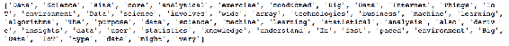

9.  大小写折叠是一种将所有单词转换成相似大小写以使单词不区分大小写的方法。它通常涉及到将所有大写字母转换成小写字母。

我们可以使用`lower`函数将所有大写字母转换成小写字母，如下面的代码片段所示:

```
# Case folding
words_lower = [words_1.lower() for words_1 in words_1]
print(words_lower[:50])
```

我们可以从下面的输出中看到，像`Data`这样的单词不再出现在列表中，并且被转换为全部小写字母:

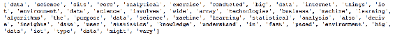

词干化是将单词缩减为基本形式或词根形式的过程。例如，*工作*、*工作*被派生为*工作*。这种转换非常有用，因为它将所有相似的单词转化为一种基本形式，有助于更好地进行情感分析、文档分类等等。

我们从`nltk.stem.porter`库中导入`PorterStemmer`并实例化`PorterStemmer`类。接下来，`words_lower`标记列表被传递给`porter.stem`类，以将每个单词简化为其根形式:

```
#Stemming
from nltk.stem.porter import PorterStemmer
porter = PorterStemmer()
stemmed_words = [porter.stem(word) for word in words_lower]
print(stemmed_words[:50])
```

前面的代码生成以下带词干的标记列表:

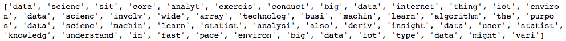

并非所有的特征或属性对 ML 模型都是重要的。在接下来的章节中，我们将学习一些在 ML 管道上工作时减少特征数量的方法。


# 特征选择

ML 模型使用一些关键特征来学习数据中的模式。所有其他特征都会向模型添加噪声，这可能会导致模型的准确性下降，并使模型过度适应数据。因此，选择正确的功能至关重要。此外，处理一组精简的重要特征可以减少模型训练时间。

以下是在创建模型之前选择正确特征的一些方法:

*   我们可以识别相关变量，并删除任何一个高度相关的值
*   移除方差较小的要素
*   测量可用特征集的信息增益，并相应地选择前 *N* 个特征

此外，在创建基线模型后，我们可以使用以下一些方法来选择合适的功能:

*   使用线性回归并根据 *p* 值选择变量
*   使用逐步选择进行线性回归，并选择重要的变量
*   使用随机森林并选择顶部的 *N 个*重要变量

在接下来的章节中，我们将看到 scikit-learn 中的一些可用方法，以减少数据集中可用的要素数量。


# 排除低方差特征

数据中没有太多变化或可变性的特征不向 ML 模型提供任何用于学习模式的信息。例如，数据集中每条记录的值都只有 5 的特性是一个常量，是一个不重要的特性。移除此功能至关重要。

我们可以使用 scikit-learn 的`featureselection`包中的`VarianceThreshold`方法来删除所有方差不满足特定标准或阈值的特性。sklearn.feature_selection 模块实现特征选择算法。它目前包括单变量滤波器选择方法和递归特征消除算法。下面是说明这种方法的一个例子:

```
%matplotlib inline
import pandas as pd
import numpy as np
from sklearn.feature_selection import SelectKBest
from sklearn.feature_selection import chi2
hr_data = pd.read_csv('data/hr.csv', header=0)
hr_data.head()
hr_data = hr_data.dropna()
data_trnsf = pd.get_dummies(hr_data, columns =['salary', 'sales'])
data_trnsf.columns
```

上述代码的输出如下:

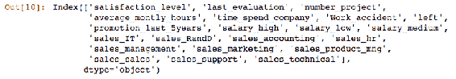

接下来，我们将`left`指定为目标变量，将其他属性指定为独立属性，如下面的代码所示:

```
X = data_trnsf.drop('left', axis=1)
X.columns
Y = data_trnsf.left# feature extraction
```

现在我们已经准备好数据，我们基于`VarianceThreshold`方法选择特征。首先，我们从 scikit-learn 的`feature_selection`模块中导入`VarianceThreshold`方法。然后我们在`VarianceThreshold`方法中设置阈值为`0.2`。这意味着，如果某个属性的数据差异小于 20%，则该属性可以被丢弃，并且不会被选作特征。我们执行以下代码片段来观察精简的功能集:

```
#Variance Threshold
from sklearn.feature_selection import VarianceThreshold
# Set threshold to 0.2
select_features = VarianceThreshold(threshold = 0.2)
select_features.fit_transform(X)
# Subset features
X_subset = select_features.transform(X)
print('Number of features:', X.shape[1])
print('Reduced number of features:',X_subset.shape[1])
```

从下面的输出中，我们可以确定`20`个属性中有五个属性通过了方差阈值测试，并显示出超过 20%方差的可变性:


在下一节中，我们将研究单变量特征选择方法，该方法基于某些统计测试来确定重要特征。


# 单变量特征选择

在这种方法中，对每个特征分别进行统计检验。我们根据测试结果分数只保留最好的特性。

以下示例说明了从`HR`损耗数据集中选择最佳特征的卡方统计测试:

```
#Chi2 Selector

from sklearn.feature_selection import SelectKBest
from sklearn.feature_selection import chi2

chi2_model = SelectKBest(score_func=chi2, k=4)
X_best_feat = chi2_model.fit_transform(X, Y)
# selected features
```

```
print('Number of features:', X.shape[1])
print('Reduced number of features:',X_best_feat.shape[1])
```

我们可以从下面的输出中看到，选择了`4`最佳特性。我们可以通过改变`k`值来改变要考虑的最佳特性的数量:

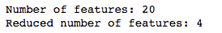

下一节演示递归特征消除方法。


# 递归特征消除

递归特征消除基于这样一种思想，即通过移除特征、使用剩余特征构建模型并计算模型的精度来递归构建模型。重复此过程，直到用尽数据集中的所有要素。这是一种贪婪的优化方法，找出性能最佳的功能子集，然后根据它们被淘汰的时间对它们进行排序。

在下面的示例代码中，`HR`磨损数据集用于说明**递归特征消除** ( **RFE** )的使用。`RFE`方法的稳定性很大程度上依赖于所使用的算法类型。在我们的演示中，我们使用了`LogisticRegression`方法:

```
#Recursive Feature Elimination
from sklearn.feature_selection import RFE
from sklearn.linear_model import LogisticRegression

# create a base classifier used to evaluate a subset of attributes
logistic_model = LogisticRegression()

# create the RFE model and select 4 attributes
rfe = RFE(logistic_model, 4)
rfe = rfe.fit(X, Y)

# Ranking of the attributes
print(sorted(zip(map(lambda x: round(x, 4), rfe.ranking_),X)))
```

以下输出显示了按等级排序的要素:

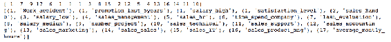

随机森林通常在 ML 管道中用于特征选择。因此，了解这项技术至关重要。


# 使用随机森林的特征选择

随机森林使用的基于树的特征选择策略自然地根据它们改善节点纯度的程度来排序。首先，我们需要构建一个随机森林模型。我们已经在[第二章](ef128bb5-3783-4eb4-9879-319dff2012b8.xhtml)、*介绍*、*使用 Python 的机器学习入门*中讨论了创建随机森林模型的过程:

```
# Feature Importance
from sklearn.ensemble import RandomForestClassifier
# fit a RandomForest model to the data
model = RandomForestClassifier()
model.fit(X, Y)
# display the relative importance of each attribute
print(model.feature_importances_)
print(sorted(zip(map(lambda x: round(x, 4), model.feature_importances_),X)))
```

模型构建成功后，模型的`feature_importance_ attribute`用于可视化按等级排序的导入要素，如以下结果所示:

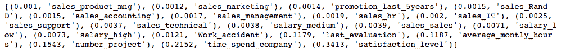

在本节中，我们讨论了使用不同的特征选择方法来选择特征子集的不同方法。接下来，我们将通过使用降维方法来了解特征选择方法。


# 使用降维的特征选择

降维方法通过从原始特征的组合中产生新的合成特征来降低维数。它们是有效的技术，可以保持数据的可变性。这些技术的一个缺点是很难解释属性，因为它们是由各种属性的元素组合而成的。


# 主成分分析

**主成分分析** ( **PCA** )将高维空间的数据转换到一个更少维的空间。让我们考虑 100 维数据集的可视化。几乎不可能有效地显示这种高维数据分布的形状。PCA 提供了一种有效的降维方法，它通过形成各种主成分来解释降维空间中数据的可变性。

数学上，给定一组变量， *X [1] ，X [2] ，....，X[p]，这里有 *p* 原始变量。在 PCA 中，我们正在寻找一组新的变量， *Z [1] ，Z [2] ，....，Z [p]**

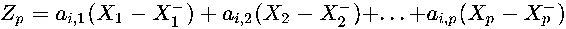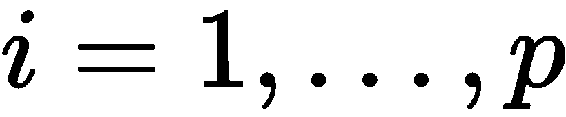

其中每对 *Z* 的相关性=0

得到的 *Z* 按方差排序，其中*Z[1]方差最大，*Z[p]方差最小。**

通常，主成分分析中提取的第一个成分占观察变量中总方差的最大量。所提取的第二分量将说明数据集中第一分量没有说明的最大方差，并且它也与第一分量不相关。如果我们计算第一分量和第二分量之间的相关性，相关性将为零。

我们使用`HR`损耗数据来演示 PCA 的使用。首先，我们将`numpy`和`pandas`库加载到环境中，并加载`HR`数据集:

```
import numpy as np
import pandas as pd
hr_data = pd.read_csv('data/hr.csv', header=0)
print (hr_data.head())
```

下面是前面代码的输出，它显示了数据集中每个属性的前五行:

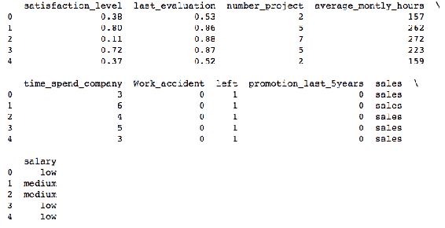

PCA 非常适合数字属性，并且在属性标准化时工作良好。因此，我们从`sklearn.preprocessing`库中导入`StandardScaler`。我们只包括用于数据预处理的数字属性。使用`StandardScaler`方法，`HR`数据集的数字属性被标准化:

```
from sklearn.preprocessing import StandardScaler
hr_numeric = hr_data.select_dtypes(include=[np.float])
hr_numeric_scaled = StandardScaler().fit_transform(hr_numeric)
```

接下来，我们从`sklearn.decomposition`导入`PCA`方法，并将`n_components`作为`2`传递。`n_components`参数定义了要构建的主要组件的数量。然后，确定由这两个主成分解释的方差:

```
from sklearn.decomposition import PCA
pca = PCA(n_components=2)
principalComponents = pca.fit_transform(hr_numeric_scaled)
principalDf = pd.DataFrame(data = principalComponents,columns = ['principal component 1', 'principal component 2'])
print(pca.explained_variance_ratio_)
```

我们可以看到，两个主要因素解释了 HR 数据集数值属性的可变性:

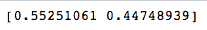

有时，我们使用的原始数据没有足够的信息来创建一个好的模型。在这种情况下，我们需要创建功能。在下一节中，我们将介绍几种不同的创建特征的方法。


# 特征生成

从现有的功能中创造新的功能是一门艺术，可以用许多不同的方式来完成。

特征创建的目的是为 ML 算法提供这样的预测器，使它们易于理解模式并从数据中导出更好的关系。

例如，在`HR`流失问题中，员工在组织中的停留时间是一个重要的属性。然而，有时我们没有将停留时间作为数据集中的一个特征，但是我们有员工开始工作的日期。在这种情况下，我们可以通过从当前日期中减去员工开始日期来创建停留时间特性的数据。

在接下来的章节中，我们将会看到一些从数据中生成新要素的不同方法。然而，这并不是一个详尽的列表，而是一些可以用来创建新特征的不同方法。人们需要仔细考虑问题陈述，探索数据，并创造性地发现构建特征的新方法:

*   **数字特征生成**:从数字数据中生成新特征比其他数据类型更容易。即使我们不理解各种数字特征的含义，我们也可以进行各种运算，例如将两个或两个以上的数字相加，计算相对差值，以及将数字相乘和相除。完成这项任务后，我们从所有生成的特征中识别出哪些是重要的特征，并丢弃其他的特征。虽然这是一项资源密集型任务，但当我们不知道派生新功能的直接方法时，它有助于发现新功能。

添加和计算一对数字特征之间差异的过程被称为**成对特征创建**。

还有另一种称为`PolynomialFeatures`创建的方法，我们自动执行特征的所有多项式组合。它有助于绘制特征之间的复杂关系，这些特征可以暗示一些独特的状态。

我们可以使用 scikit-learn 的`PolynomialFeatures`方法生成多项式特征。让我们首先创建虚拟数据，如下面的代码片段所示:

```
#Import PolynomialFeatures
from sklearn.preprocessing import PolynomialFeatures
#Create matrix and vectors
var1 = [[0.45, 0.72], [0.12, 0.24]]
```

接下来，通过首先调用带有参数阶数的`PolynomialFeatures`来生成多项式特征。该函数将生成度数小于或等于指定度数的要素:

```
# Generate Polynomial Features 
ploy_features = PolynomialFeatures(degree=2)
var1_ = ploy_features.fit_transform(var1)
print(var1_)
```

代码执行完成后，它会生成新的功能，如下面的屏幕截图所示:

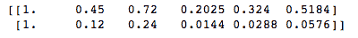

*   **分类特征创建**:从分类数据中创建新特征的方法有限。但是，我们可以计算每个分类属性的频率，或者组合不同的变量来构建新的特征。
*   **时间特征创建**:如果我们遇到一个日期/时间特征，我们可以派生出各种新的特征，例如:
    *   星期几
    *   一月中的某一天
    *   季度中的某一天
    *   一年中的某一天
    *   一天中的某个时刻
    *   一天的第二天
    *   一天中的星期
    *   一年中的第几周
    *   一年中的月份

从单个数据/时间特征中创建这些特征将有助于 ML 算法更好地学习数据中的时间模式。


# 摘要

在这一章中，我们学习了与机器学习管道非常相关的各种数据转换和预处理方法。准备属性，清理数据，并确保数据没有错误，确保 ML 模型正确地学习数据。使数据无噪声并生成良好的特征有助于 ML 模型有效地发现数据中的模式。

下一章将集中讨论 AutoML 算法的技术。我们将讨论各种算法特定的特征转换，自动监督和非监督学习，等等。