# 四、自动算法选择

本章提供了对**机器学习** ( **ML** )算法广阔前景的一瞥。鸟瞰图将向你展示你可以用 ML 解决的那种学习问题，你已经学会了。让我们简单回顾一下。

如果数据集中的示例/观察值具有关联的标签，则这些标签可以在模型训练期间为算法提供指导。有了这种指导或监督，你将使用监督或半监督学习算法。如果你没有标签，你会使用无监督学习算法。

还有其他情况需要不同的方法，例如强化学习，但是，在这一章中，主要的焦点将放在监督和非监督算法上。

ML 管道的下一个前沿是自动化。当您第一次考虑自动化 ML 管道时，核心元素是特征转换、模型选择和超参数优化。但是，对于您的具体问题，您还需要考虑其他一些要点，您将在本章中研究以下要点:

*   计算的复杂性
*   训练和得分时间的差异
*   线性与非线性
*   算法特定的特征变换

理解这些将有助于您理解哪些算法可能适合您对给定问题的需求。本章结束时:

*   你将学会自动监督学习和无监督学习的基础
*   您将了解到使用 ML 管道时要考虑的主要方面
*   您将在各种用例中练习您的技能，并构建监督和非监督 ML 管道


# 技术要求

检查`requirements.txt`文件中要安装的库，以在 GitHub 中运行本章的代码示例。

所有的代码示例都可以在 GitHub 的`Chapter 04`文件夹中找到。


# 计算的复杂性

计算效率和复杂性是选择 ML 算法的重要方面，因为它们将决定模型训练和评分在时间和内存需求方面所需的资源。

例如，计算密集型算法将需要更长的时间来训练和优化其超参数。您通常会在可用的 CPU 或 GPU 之间分配工作负载，以将花费的时间减少到可接受的水平。

在这一节中，我们将根据这些约束条件来研究一些算法，但是在深入研究 ML 算法的细节之前，您需要了解算法复杂性的基础知识。

算法的复杂性将基于其输入大小。对于 ML 算法，这可以是元素和特征的数量。你通常会计算在最坏的情况下完成任务所需的运算次数，这就是你的算法的复杂度。


# 大 O 符号

你可能听说过大 O 符号。它有不同的类别来表示复杂性，如线性— `O(n)`、对数— `O(log n)`、二次— `O(n2)`、三次— `O(n3)`以及类似的类别。您使用 big O 的原因是因为算法的运行时间高度依赖于硬件，并且您需要一种基于其输入大小来测量算法性能的系统方法。Big O 查看算法的步骤，并计算出上述最坏的情况。

例如，如果`n`是您想要添加到列表中的元素数量，那么它的复杂度就是`O(n)`，因为添加的操作数量取决于`n`。下面的代码块将帮助您绘制不同的复杂性如何作为其输入大小的函数而增长:

```
# Importing necessary libraries
import pandas as pd
import numpy as np
import matplotlib.pyplot as plt
import seaborn as sns

# Setting the style of the plot
plt.style.use('seaborn-whitegrid')

# Creating an array of input sizes
n = 10
x = np.arange(1, n)

# Creating a pandas data frame for popular complexity classes
df = pd.DataFrame({'x': x,
                   'O(1)': 0,
                   'O(n)': x,
                   'O(log_n)': np.log(x),
                   'O(n_log_n)': n * np.log(x),
                   'O(n2)': np.power(x, 2), # Quadratic
                   'O(n3)': np.power(x, 3)}) # Cubic

# Creating labels
labels = ['$O(1) - Constant$',
          '$O(\log{}n) - Logarithmic$',
          '$O(n) - Linear$',
          '$O(n^2) - Quadratic$',
          '$O(n^3) - Cubic$',
          '$O(n\log{}n) - N log n$']

# Plotting every column in dataframe except 'x'
for i, col in enumerate(df.columns.drop('x')):
    print(labels[i], col)
    plt.plot(df[col], label=labels[i])

# Adding a legend
plt.legend()

# Limiting the y-axis
plt.ylim(0,50)

plt.show()
```

我们得到下面的图作为前面代码的输出:

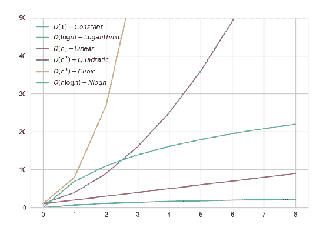

不同的复杂性随着它们的输入大小而增长

这里需要注意的一点是，不同级别的复杂性之间有一些交叉点。由此可见数据大小的作用。简单例子的复杂性很容易理解，但是 ML 算法的复杂性呢？如果到目前为止的介绍已经激起了你的兴趣，请继续阅读下一部分。


# 训练和得分时间的差异

花在训练和评分上的时间可以成就或破坏一个 ML 项目。如果在当前可用的硬件上训练一个算法需要太长时间，用新数据和超参数优化更新模型将是痛苦的，这可能会迫使你将该算法从候选列表中划掉。如果一个算法需要太长的时间来评分，那么这可能是生产环境中的一个问题，因为您的应用程序可能需要快速的推理时间，如毫秒或微秒来获得预测。这就是为什么学习最大似然算法的内部工作是重要的，至少开始时是常见的，以检测算法的适用性。

例如，监督学习算法在训练过程中学习样本集及其相关标签之间的关系，其中每个样本由一组特征组成。训练作业将在成功完成后输出 ML 模型，该模型可用于进行新的预测。当模型被输入没有标签的新示例时，在训练期间在特征和标签之间映射的关系被用于预测标签。用于预测的时间通常很短，因为模型的学习权重将应用于新数据。

然而，一些监督算法跳过了这个训练阶段，它们基于训练数据集中所有可用的例子来评分。这样的算法被称为**基于实例的**或**懒惰学习者**。对于基于实例的算法，训练简单地意味着将所有特征向量及其相关联的标签存储在存储器中，这是整个训练数据集。这实际上意味着，随着数据集大小的增加，模型将需要更多的计算和内存资源。


# 简单测量训练和得分时间

让我们来看一个简单的例子:k-最近邻 ( **k-NN** )算法，它适用于分类和回归问题。当一个算法对一个新的特征向量进行评分时，它会检查 *k* 个最近邻居并输出一个结果。如果是分类问题，则使用多数票进行预测；如果是回归问题，则使用平均值作为预测值。

让我们通过一个分类问题的例子来更好地理解这一点。首先，您将创建一个样本数据集，并根据训练和评分所花费的时间来检查 k-NN 算法。

为了方便起见，下面的函数将用于测量在给定行上花费的时间:

```
from contextlib import contextmanager
from time import time

@contextmanager
def timer():
    s = time()
    yield
    e = time() - s
    print("{0}: {1} ms".format('Elapsed time', e))
```

您可以通过以下方式使用该功能:

```
import numpy as np

with timer():
    X = np.random.rand(1000)
```

它输出执行该行所花费的时间:

```
Elapsed time: 0.0001399517059326172 ms
```

现在，您可以使用 scikit-learn 库的`KNeighborsClassifier`来测量训练和评分所花费的时间:

```
from sklearn.neighbors import KNeighborsClassifier

# Defining properties of dataset
nT = 100000000 # Total number of values in our dataset
nF = 10 # Number of features
nE = int(nT / nF) # Number of examples

# Creating n x m matrix where n=100 and m=10
X = np.random.rand(nT).reshape(nE, nF)

# This will be a binary classification with labels 0 and 1
y = np.random.randint(2, size=nE)

# Data that we are going to score
scoring_data = np.random.rand(nF).reshape(1,-1)

# Create KNN classifier
knn = KNeighborsClassifier(11, algorithm='brute')

# Measure training time
with timer():
    knn.fit(X, y)

# Measure scoring time
with timer():
    knn.predict(scoring_data)
```

让我们看看输出:

```
Elapsed time: 1.0800271034240723 ms
Elapsed time: 0.43231201171875 ms
```

为了了解这种算法与其他算法相比有何不同，您可以再尝试一种分类器，例如逻辑回归:

```
from sklearn.linear_model import LogisticRegression
log_res = LogisticRegression(C=1e5)

with timer():
    log_res.fit(X, y)

with timer():
    prediction = log_res.predict(scoring_data)
```

逻辑回归的输出如下:

```
Elapsed time: 12.989803075790405 ms
Elapsed time: 0.00024318695068359375 ms
```

看着挺不一样的！逻辑回归在训练中慢一些，在评分中快得多。这是为什么呢？

您将会了解到这个问题的答案，但是，在详细了解前面的结果之前，我们先来谈谈 Python 中的代码剖析。


# Python 中的代码剖析

一些应用程序将要求您的机器学习模型在训练和评分时间方面表现良好。例如，推荐引擎可能要求您在不到一秒钟的时间内生成推荐，如果您有超过一秒钟的延迟，分析是理解密集型操作的一种方式。代码剖析将非常有助于你理解程序的不同部分是如何执行的。分析统计数据将给出度量，例如调用次数、执行函数调用(包括/不包括对其子函数的调用)所花费的总时间，以及增量和总内存使用量。

Python 中的`cProfile`模块将帮助您查看每个函数的时间统计。这里有一个小例子:

```
# cProfile
import cProfile

cProfile.run('np.std(np.random.rand(1000000))')
```

在前一行中，计算了从均匀分布中抽取的 1，000，000 个随机样本的标准差。输出将显示执行给定行的所有函数调用的时间统计信息:

```
23 function calls in 0.025 seconds
   Ordered by: standard name
   ncalls tottime percall cumtime percall filename:lineno(function)
        1 0.001 0.001 0.025 0.025 <string>:1(<module>)
        1 0.000 0.000 0.007 0.007 _methods.py:133(_std)
        1 0.000 0.000 0.000 0.000 _methods.py:43(_count_reduce_items)
        1 0.006 0.006 0.007 0.007 _methods.py:86(_var)
        1 0.001 0.001 0.008 0.008 fromnumeric.py:2912(std)
        2 0.000 0.000 0.000 0.000 numeric.py:534(asanyarray)
        1 0.000 0.000 0.025 0.025 {built-in method builtins.exec}
        2 0.000 0.000 0.000 0.000 {built-in method builtins.hasattr}
        4 0.000 0.000 0.000 0.000 {built-in method builtins.isinstance}
        2 0.000 0.000 0.000 0.000 {built-in method builtins.issubclass}
        1 0.000 0.000 0.000 0.000 {built-in method builtins.max}
        2 0.000 0.000 0.000 0.000 {built-in method numpy.core.multiarray.array}
        1 0.000 0.000 0.000 0.000 {method 'disable' of '_lsprof.Profiler' objects}
        1 0.017 0.017 0.017 0.017 {method 'rand' of 'mtrand.RandomState' objects}
        2 0.001 0.001 0.001 0.001 {method 'reduce' of 'numpy.ufunc' objects}
```

`23`函数调用在`0.025`秒内执行，正如你所料，大部分时间都花在生成随机数和计算标准差上。

有一个很棒的库叫做`snakeviz`，可以用来可视化`cProfile`的输出。创建一个名为`profiler_example_1.py`的文件，并添加以下代码:

```
import numpy as np

np.std(np.random.rand(1000000))
```

在您的终端中，导航到您的`profiler_example_1.py`所在的文件夹，并运行以下命令:

```
python -m cProfile -o profiler_output -s cumulative profiler_example_1.py
```

这将创建一个名为`profiler_output`的文件，现在您可以使用`snakeviz`来创建一个可视化


# 可视化性能统计

Snakeviz 是基于浏览器的，它允许你与性能指标进行交互。`snakeviz`将使用由名为`profiler_output`的分析器生成的文件来创建可视化效果:

```
snakeviz profiler_output
```

这个命令将在`127.0.0.1:8080`上运行一个小型 web 服务器，它将为您提供可以找到可视化的地址，比如`http://127.0.0.1:8080/snakeviz/…/2FAutomated_Machine_Learning%2FCh4_Automated_Algorithm_Selection%2Fprofiler_output`。

在这里，您可以看到带有各种设置的旭日风格图表，例如深度和截止值:

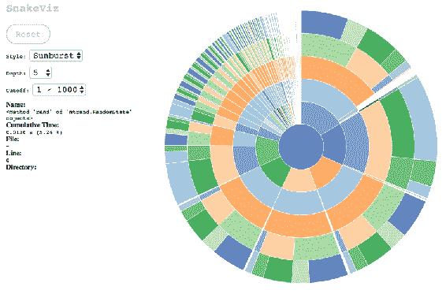

你可以将鼠标悬停在它上面，它会显示函数名称、累计时间、文件、行和目录。您可以深入到特定区域并查看详细信息。

如果选择冰柱样式，将会有不同的视觉效果:

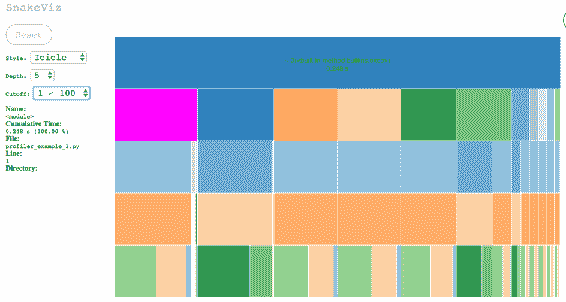

您可以尝试样式、深度和截点，看看哪些设置最适合您。

如果向下滚动到底部，会出现一个类似下面截图的表格:

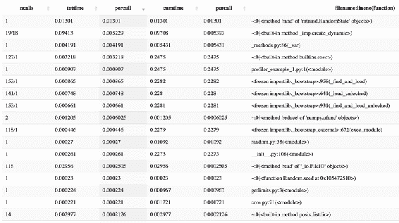

如果您根据`percall`列对这些值进行排序，您会看到`mtrand.RandomState`对象的`rand`方法和`_var`方法是最耗时的调用。

您可以检查以这种方式运行的任何东西，这是更好地理解和诊断代码的良好开端。


# 从头开始实现 k-NN

您已经看到了运行中的 k-NN 算法；让我们看一个非常简单的实现。将以下代码块另存为`knn_prediction.py`:

```
import numpy as np
import operator

# distance module includes various distance functions
# You will use euclidean distance function to calculate distances between scoring input and training dataset.
from scipy.spatial import distance

# Decorating function with @profile to get run statistics
@profile
def nearest_neighbors_prediction(x, data, labels, k):

    # Euclidean distance will be calculated between example to be predicted and examples in data
    distances = np.array([distance.euclidean(x, i) for i in data])

    label_count = {}
    for i in range(k):
        # Sorting distances starting from closest to our example
        label = labels[distances.argsort()[i]]
        label_count[label] = label_count.get(label, 0) + 1
    votes = sorted(label_count.items(), key=operator.itemgetter(1), reverse=True)

    # Return the majority vote
    return votes[0][0]

# Setting seed to make results reproducible
np.random.seed(23)

# Creating dataset, 20 x 5 matrix which means 20 examples with 5 features for each
data = np.random.rand(100).reshape(20,5)

# Creating labels
labels = np.random.choice(2, 20)

# Scoring input
x = np.random.rand(5)

# Predicting class for scoring input with k=2
pred = nearest_neighbors_prediction(x, data, labels, k=2)
# Output is ‘0’ in my case
```

您将分析这个函数，看看每一行执行需要多长时间。


# 逐行分析您的 Python 脚本

转到您的终端，运行以下命令:

```
$ pip install line_profiler
knn_prediction.py.
```

正如你已经注意到的，`nearest_neighbors_prediction`布置如下:

```
@profile
def nearest_neighbors_prediction(x, data, labels, k):
 …
```

它允许`line_profiler`知道要分析哪个函数。运行以下命令保存分析结果:

```
$ kernprof -l knn_prediction.py
```

输出如下所示:

```
Start
Wrote profile results to knn_prediction.py.lprof
```

您可以按如下方式查看探查器结果:

```
$ python -m line_profiler knn_prediction.py.lprof
Timer unit: 1e-06 s

Total time: 0.001079 s
File: knn_prediction.py
Function: nearest_neighbors_prediction at line 24

Line # Hits Time Per Hit % Time Line Contents
==============================================================
 24 @profile
 25 def nearest_neighbors_prediction(x, data, labels, k):
 26 
 27 # Euclidean distance will be calculated between example to be predicted and examples in data
 28 1 1043.0 1043.0 96.7 distances = np.array([distance.euclidean(x, i) for i in data])
 29 
 30 1 2.0 2.0 0.2 label_count = {}
 31 3 4.0 1.3 0.4 for i in range(k):
 32 # Sorting distances starting from closest to our example
 33 2 19.0 9.5 1.8 label = labels[distances.argsort()[i]]
 34 2 3.0 1.5 0.3 label_count[label] = label_count.get(label, 0) + 1
 35 1 8.0 8.0 0.7 votes = sorted(label_count.items(), key=operator.itemgetter(1), reverse=True)
 36 
 37 # Return the majority vote
 38 1 0.0 0.0 0.0 return votes[0][0]
```

正如您所料，最耗时的部分是计算距离。

用大 O 记法来说，k-NN 算法的复杂度是`O(nm + kn)`，其中`n`是样本数，`m`是特征数，`k`是算法的超参数。你现在可以把原因当作一个练习来思考。

每个算法都有相似的属性，你应该知道这些属性会影响算法的训练和评分时间。这些限制对于生产用例变得尤为重要。


# 线性与非线性

另一个考虑是决策界限。一些算法，如逻辑回归或**支持向量机** ( **SVM** )，可以学习线性决策边界，而其他算法，如基于树的算法，可以学习非线性决策边界。虽然线性决策边界相对容易计算和解释，但您应该意识到在存在非线性关系的情况下，线性算法会产生错误。


# 绘制决策边界

以下代码片段将允许您检查不同类型算法的决策界限:

```
import matplotlib.cm as cm

# This function will scale training datatset and train given classifier.
# Based on predictions it will draw decision boundaries.

def draw_decision_boundary(clf, X, y, h = .01, figsize=(9,9), boundary_cmap=cm.winter, points_cmap=cm.cool):

    # After you apply StandardScaler, feature means will be removed and all features will have unit variance.
    from sklearn.preprocessing import StandardScaler
    X = StandardScaler().fit_transform(X)

    # Splitting dataset to train and test sets.
    X_train, X_test, y_train, y_test = train_test_split(X, y, test_size=.4, random_state=42)

    # Training given estimator on training dataset by invoking fit function.
    clf.fit(X_train, y_train)

    # Each estimator has a score function.
    # Score will show you estimator's performance by showing metric suitable to given classifier.
    # For example, for linear regression, it will output coefficient of determination R^2 of the prediction.
    # For logistic regression, it will output mean accuracy.

    score = clf.score(X_test, y_test)
    print("Score: %0.3f" % score)

    # Predict function of an estimator, will predict using trained model
    pred = clf.predict(X_test)

    # Figure is a high-level container that contains plot elements
    figure = plt.figure(figsize=figsize)

    # In current figure, subplot will create Axes based on given arguments (nrows, ncols, index)
    ax = plt.subplot(1, 1, 1)

    # Calculating min/max of axes
    x_min, x_max = X[:, 0].min() - 1, X[:, 0].max() + 1
    y_min, y_max = X[:, 1].min() - 1, X[:, 1].max() + 1

    # Meshgrid is usually used to evaluate function on grid.
    # It will allow you to create points to represent the space you operate
    xx, yy = np.meshgrid(np.arange(x_min, x_max, h), np.arange(y_min, y_max, h))

    # Generate predictions for all the point-pair created by meshgrid
    Z = clf.predict(np.c_[xx.ravel(), yy.ravel()])
    Z = Z.reshape(xx.shape)

    # This will draw boundary
    ax.contourf(xx, yy, Z, cmap=boundary_cmap)

    # Plotting training data
    ax.scatter(X_train[:, 0], X_train[:, 1], c=y_train, cmap=points_cmap, edgecolors='k')

    # Potting testing data
    ax.scatter(X_test[:, 0], X_test[:, 1], c=y_test, cmap=points_cmap, alpha=0.6, edgecolors='k')

    # Showing your masterpiece
    figure.show()
```


# 逻辑回归的决策边界

您可以从逻辑回归开始测试这个函数:

```
import numpy as np
import matplotlib.pyplot as plt
from matplotlib import cm

# sklearn.linear_model includes regression models where target variable is a linear combination of input variables
from sklearn.linear_model import LogisticRegression

# make_moons is another useful function to generate sample data
from sklearn.datasets import make_moons
from sklearn.model_selection import train_test_split

X, y = make_moons(n_samples=1000, noise=0.1, random_state=0)

# Plot sample data
plt.scatter(X[:,0], X[:,1], c=y, cmap=cm.cool)
plt.show()
```

我们得到如下的情节:

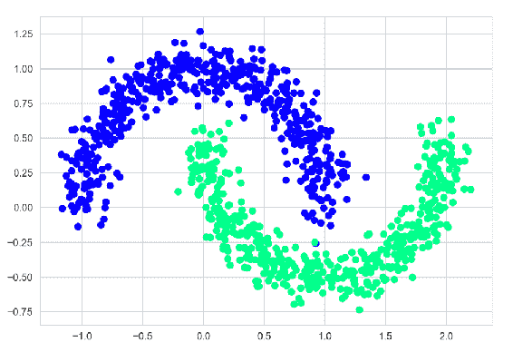

现在，您可以使用`draw_decision_boundary`函数来可视化`LogisticRegression`的决策边界:

```
draw_decision_boundary(LogisticRegression(), X, y)
```

它将输出以下图形:

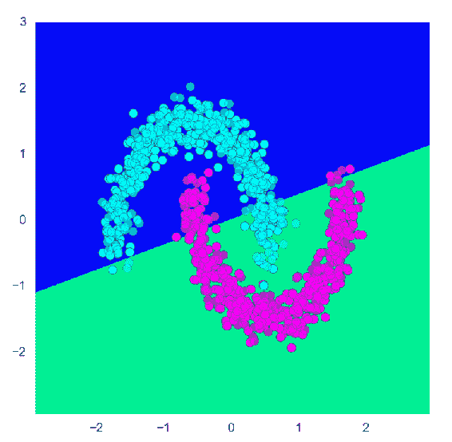

逻辑回归是广义线性模型的一员，它产生一个线性决策边界。线性决策边界无法将此类数据集的类分开。逻辑回归的输出是根据其输入的加权和计算的。由于输出不依赖于其参数的乘积或商，因此会产生一个线性决策边界。有一些方法可以解决这个问题，例如正则化和要素映射，但是在这种情况下，您可以使用能够处理非线性数据的其他算法。


# 随机森林的决策边界

随机森林是一个元估计器，它将建立许多不同的模型，并聚合它们的预测以得出最终预测。随机森林能够产生非线性决策边界，因为输入和输出之间没有线性关系。它有许多可以使用的超参数，但是为了简单起见，您将使用默认配置:

```
from sklearn.ensemble import RandomForestClassifier

draw_decision_boundary(RandomForestClassifier(), X, y)
```

从前面的代码中我们得到了下面的图:

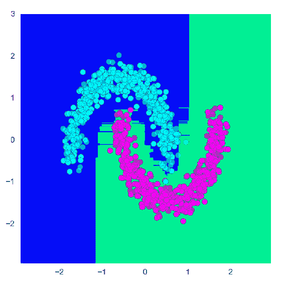

看起来一点也不差！每种算法都会根据其内部工作原理为您提供不同的决策界限，您应该尝试使用不同的评估工具来更好地理解它们的行为。


# 常用的机器学习算法

作为练习，下面列出了常用的监督和非监督算法；scikit-learn 拥有其中的大部分:

*   监督算法:
    *   线性回归
    *   逻辑回归
    *   k-神经网络
    *   随机森林
    *   升压算法(GBM、XGBoost 和 LightGBM)
    *   SVM
    *   神经网络

*   无监督算法:
    *   k 均值
    *   分层聚类
    *   主成分分析
    *   混合模型
    *   自编码器


# 必要的功能转换

您可能已经注意到，在训练机器学习算法之前，在前面的部分中对特征进行了缩放。特征变换通常是 ML 算法正常工作所必需的。例如，根据经验，对于使用正则化的 ML 算法，通常将归一化应用于特征。

以下是您应该变换要素以使数据集为 ML 算法做好准备的用例列表:

*   SVM 希望其输入在标准范围内。在将变量输入算法之前，你应该将它们规范化。
*   **主成分分析** ( **PCA** )帮助你基于方差最大化将你的特征投射到另一个空间。然后，您可以选择覆盖数据集中大多数差异的组件，将其余组件排除在外以降低维数。使用 PCA 时，您可以应用归一化，因为某些要素似乎可以解释由于比例差异而产生的几乎所有差异。您可以通过归一化要素来消除比例差异，正如您将在下一节的一些示例中看到的那样。
*   如果您正在使用正则化回归(这通常是高维数据集的情况)，您将对变量进行归一化以控制比例，因为正则化不是比例不变的。
*   要使用朴素贝叶斯算法，其中要素和标注列应是分类的，应通过应用宁滨变换连续变量使其离散化。
*   在时间序列中，通常应用对数变换来处理指数增长趋势，以便获得线性趋势和恒定方差。
*   当处理非数值变量(如分类数据)时，您将通过应用转换(如一键编码、虚拟编码或要素哈希)将其编码为数值要素。


# 监督 ML

除了前面提到的特征变换，每个 ML 算法都有自己的超参数空间需要优化。您可以将搜索最佳 ML 管道看作是遍历您的配置空间，并以一种聪明的方式尝试您的选项，以找到性能最佳的 ML 管道。

Auto-sklearn 非常有助于实现这一目标，您在介绍性章节中看到的示例向您展示了该库的易用性。这一节将解释为了使这个实现成功，在幕后发生了什么。

Auto-sklearn 使用*元学习*来基于给定数据集的属性选择有前途的数据/特征处理器和 ML 算法。有关预处理方法、分类器和回归器的列表，请参考以下链接:

*   分类器([https://github . com/automl/auto-sk learn/tree/master/autosklearn/pipeline/components/classification](https://github.com/automl/auto-sklearn/tree/master/autosklearn/pipeline/components/classification))
*   回归器([https://github . com/automl/auto-sk learn/tree/master/autosklearn/pipeline/components/regression](https://github.com/automl/auto-sklearn/tree/master/autosklearn/pipeline/components/regression))
*   预处理器([https://github . com/automl/auto-sk learn/tree/master/autosklearn/pipeline/components/feature _ 预处理](https://github.com/automl/auto-sklearn/tree/master/autosklearn/pipeline/components/feature_preprocessing)

元学习通过分析跨不同数据集的 ML 管道的性能来模仿数据科学家的经验，并将这些发现与新数据集进行匹配，以对初始配置提出建议。

一旦元学习创建了初始配置，贝叶斯优化将处理调整不同管道的超参数，并且顶级管道将被用于创建可能优于其任何成员并且也有助于避免过度拟合的集成。


# 自动 sklearn 的默认配置

当您创建一个`AutoSklearnClassifier`对象时，顺便说一下，您将很快完成，有一些默认配置您需要知道；您可以通过运行以下代码来查看它们:

```
from autosklearn.classification import AutoSklearnClassifier
AutoSklearnClassifier?
```

在 Python 中，在函数后添加`?`会输出非常有用的信息，比如签名、文档字符串、参数解释、属性和文件位置。

如果您查看签名，您会看到默认值:

```
Init signature: AutoSklearnClassifier(time_left_for_this_task=3600, per_run_time_limit=360, initial_configurations_via_metalearning=25, ensemble_size=50, ensemble_nbest=50, seed=1, ml_memory_limit=3072, include_estimators=None, exclude_estimators=None, include_preprocessors=None, exclude_preprocessors=None, resampling_strategy='holdout', resampling_strategy_arguments=None, tmp_folder=None, output_folder=None, delete_tmp_folder_after_terminate=True, delete_output_folder_after_terminate=True, shared_mode=False, disable_evaluator_output=False, get_smac_object_callback=None, smac_scenario_args=None)
```

例如，`time_left_for_this_task`设置为 60 分钟。如果您正在处理一个相当复杂的数据集，您应该将该参数设置为一个较高的值，以增加找到更好的 ML 管道的机会。

还有一个是`per_run_time_limit`，设置为六分钟。许多 ML 算法的训练时间与输入数据大小成比例，此外，训练时间还会受到算法复杂性的影响。您应该相应地设置该参数。

`ensemble_size`和`ensemble_nbest`是集合相关的参数，其设置要包括在集合中的最佳模型的大小和数量。

`ml_memory_limit`是一个重要参数，因为如果您的算法需要更多内存，训练将被取消。

通过使用以下参数提供列表，您可以在 ML 管道中包括/排除特定的数据预处理程序或估算程序:`include_estimators`、`exclude_estimators`、`include_preprocessors`和`exclude_preprocessors`

将为您提供选项来决定如何处理过度拟合。

您可以检查签名中的其余参数，看看是否需要对您的环境进行任何特定的调整。


# 为产品线预测寻找最佳 ML 管道

让我们先编写一个小的包装器函数，通过对分类变量进行编码来准备数据集:

```
# Importing necessary variables
import numpy as np
import pandas as pd
from autosklearn.classification import AutoSklearnClassifier
from autosklearn.regression import AutoSklearnRegressor
from sklearn.model_selection import train_test_split
from sklearn.metrics import accuracy_score
from sklearn.preprocessing import LabelEncoder
import wget
import pandas as pd

# Machine learning algorithms work with numerical inputs and you need to transform all non-numerical inputs to numerical ones
# Following snippet encode the categorical variables

link_to_data = 'https://apsportal.ibm.com/exchange-api/v1/entries/8044492073eb964f46597b4be06ff5ea/data?accessKey=9561295fa407698694b1e254d0099600'
filename = wget.download(link_to_data)

print(filename)
# GoSales_Tx_NaiveBayes.csv

df = pd.read_csv('GoSales_Tx_NaiveBayes.csv')
df.head()
```

这将输出数据帧的前五条记录:

```
# PRODUCT_LINE GENDER AGE MARITAL_STATUS PROFESSION
# 0 Personal Accessories M 27 Single Professional
# 1 Personal Accessories F 39 Married Other
# 2 Mountaineering Equipment F 39 Married Other
# 3 Personal Accessories F 56 Unspecified Hospitality
# 4 Golf Equipment M 45 Married Retired
```

该数据集中有四个特征(`GENDER`、`AGE`、`MARITAL_STATUS`和`PROFESSION`)和一个标签(`PRODUCT_LINE`)列。目标是预测客户感兴趣的产品线。

您需要对要素和标注的文本数据进行编码。您可以应用`LabelEncoder`:

```
df = df.apply(LabelEncoder().fit_transform)
df.head()
```

这将对`label`列进行编码:

```
#   PRODUCT_LINE GENDER AGE MARITAL_STATUS PROFESSION
# 0 4 1 27 1 3
# 1 4 0 39 0 2
# 2 2 0 39 0 2
# 3 4 0 56 2 1
# 4 1 1 45 0 5
```

如您所见，所有分类列都被编码了。请记住，在 auto-sklearn 的 API 中，您有`feat_type`参数，它允许您将列指定为`Categorical`或`Numerical`:

```
feat_type : list, optional (default=None)
```

描述属性类型的`len(X.shape[1])`的`str`列表。可能的类型有`Categorical`和`Numerical`。分类属性将被自动一次性编码。用于分类属性的值必须是由`sklearn.preprocessing.LabelEncoder`获得的整数。

然而，在这个例子中，您也可以使用 pandas 数据帧的`apply`函数。

以下包装函数将使用 auto-sklearn 的自动分类或自动回归算法处理输入数据并运行实验:

```
# Function below will encode the target variable if needed
def encode_target_variable(df=None, target_column=None, y=None):

    # Below section will encode target variable if given data is pandas dataframe
    if df is not None:
        df_type = isinstance(df, pd.core.frame.DataFrame)

        # Splitting dataset as train and test data sets
        if df_type:

            # If column data type is not numeric then labels are encoded
            if not np.issubdtype(df[target_column].dtype, np.number):
                le = preprocessing.LabelEncoder()
                df[target_column] = le.fit_transform(df[target_column])
                return df[target_column]

            return df[target_column]
    # Below section will encode numpy array.
    else:

        # numpy array's data type is not numeric then labels are encoded
        if not np.issubdtype(y.dtype, np.number):
            le = preprocessing.LabelEncoder()
            y = le.fit_transform(y)
            return y

        return y

# Create a wrapper function where you can specify the type of learning problem
def supervised_learner(type, X_train, y_train, X_test, y_test):

    if type == 'regression':
        # You can play with time related arguments for discovering more pipelines
        automl = AutoSklearnRegressor(time_left_for_this_task=7200, per_run_time_limit=720)
    else:
        automl = AutoSklearnClassifier(time_left_for_this_task=7200, per_run_time_limit=720)

    # Training estimator based on learner type
    automl.fit(X_train, y_train)

    # Predicting labels on test data
    y_hat = automl.predict(X_test)

    # Calculating accuracy_score
    metric = accuracy_score(y_test, y_hat)

    # Return model, labels and metric
    return automl, y_hat, metric

# In function below, you need to provide numpy array or pandas dataframe together with the name of the target column as arguments
def supervised_automl(data, target_column=None, type=None, y=None):

    # First thing is to check whether data is pandas dataframe
    df_type = isinstance(data, pd.core.frame.DataFrame)

    # Based on data type, you will split dataset as train and test data sets
    if df_type:
        # This is where encode_target_variable function is used before data split
        data[target_column] = encode_target_variable(data, target_column)
        X_train, X_test, y_train, y_test = \
            train_test_split(data.loc[:, data.columns != target_column], data[target_column], random_state=1)
    else:
        y_encoded = encode_target_variable(y=y)
        X_train, X_test, y_train, y_test = train_test_split(X, y_encoded, random_state=1)

    # If learner type is given, then you invoke supervied_learner
    if type != None:
        automl, y_hat, metric = supervised_learner(type, X_train, y_train, X_test, y_test)

    # If type of learning problem is not given, you need to infer it
    # If there are more than 10 unique numerical values, problem will be treated as regression problem,
    # Otherwise, classification problem

    elif len(df[target_column].unique()) > 10:
            print("""There are more than 10 uniques numerical values in target column. 
            Treating it as regression problem.""")
            automl, y_hat, metric = supervised_learner('regression', X_train, y_train, X_test, y_test)
    else:
        automl, y_hat, metric = supervised_learner('classification', X_train, y_train, X_test, y_test)

    # Return model, labels and metric
    return automl, y_hat, metric
```

您现在可以运行它来查看结果:

```
automl, y_hat, metric = supervised_automl(df, target_column='PRODUCT_LINE')
```

以下输出显示了所选模型及其参数:

```
automl.get_models_with_weights()
 [(1.0,
  SimpleClassificationPipeline({'balancing:strategy': 'none', 'categorical_encoding:__choice__': 'no_encoding', 'classifier:__choice__': 'gradient_boosting', 'imputation:strategy': 'most_frequent', 'preprocessor:__choice__': 'feature_agglomeration', 'rescaling:__choice__': 'robust_scaler', 'classifier:gradient_boosting:criterion': 'friedman_mse', 'classifier:gradient_boosting:learning_rate': 0.6019977814828193, 'classifier:gradient_boosting:loss': 'deviance', 'classifier:gradient_boosting:max_depth': 5, 'classifier:gradient_boosting:max_features': 0.4884281825655421, 'classifier:gradient_boosting:max_leaf_nodes': 'None', 'classifier:gradient_boosting:min_impurity_decrease': 0.0, 'classifier:gradient_boosting:min_samples_leaf': 20, 'classifier:gradient_boosting:min_samples_split': 7, 'classifier:gradient_boosting:min_weight_fraction_leaf': 0.0, 'classifier:gradient_boosting:n_estimators': 313, 'classifier:gradient_boosting:subsample': 0.3242201709371377, 'preprocessor:feature_agglomeration:affinity': 'cosine', 'preprocessor:feature_agglomeration:linkage': 'complete', 'preprocessor:feature_agglomeration:n_clusters': 383, 'preprocessor:feature_agglomeration:pooling_func': 'mean', 'rescaling:robust_scaler:q_max': 0.75, 'rescaling:robust_scaler:q_min': 0.25},
  dataset_properties={
    'task': 1,
    'sparse': False,
    'multilabel': False,
    'multiclass': False,
    'target_type': 'classification',
    'signed': False}))]
```

您可能会看到通常选择梯度增强算法，这是有充分理由的。目前，在 ML 社区中，基于 boosting 的算法是最先进的，最受欢迎的是 **XGBoost** 、 **LightGBM** 和 **CatBoost** 。

Auto-sklearn 提供了对 sklearn 和 XGBoost 的`GradientBoostingClassifier`的支持，由于集成问题，XGBoost 目前被禁用，但预计它很快会被添加回来。


# 为网络异常检测寻找最佳机器学习管道

让我们在 ML 社区中流行的另一个数据集上运行这个管道。`KDDCUP 99`数据集是 1998 DARPA `Intrusion Detection System Evaluation`数据集的 tcpdump 部分，目标是检测网络入侵。它包括数字特征，因此将更容易设置我们的 AutoML 管道:

```
# You can import this dataset directly from sklearn
from sklearn.datasets import fetch_kddcup99

# Downloading subset of whole dataset
dataset = fetch_kddcup99(subset='http', shuffle=True, percent10=True)
# Downloading https://ndownloader.figshare.com/files/5976042
# [INFO] [17:43:19:sklearn.datasets.kddcup99] Downloading https://ndownloader.figshare.com/files/5976042

X = dataset.data
y = dataset.target

# 58725 examples with 3 features
X.shape
# (58725, 3)

y.shape
(58725,)

# 5 different classes to represent network anomaly
from pprint import pprint
pprint(np.unique(y))
# array([b'back.', b'ipsweep.', b'normal.', b'phf.', b'satan.'], dtype=object)

automl, y_hat, metric = supervised_automl(X, y=y, type='classification')
```


# 无人监督的 AutoML

当数据集没有目标变量时，可以基于不同的特征使用聚类算法来探索它。这些算法将示例分组在一起，以便每个组中的示例彼此尽可能相似，但与其他组中的示例不相似。

由于在执行此类分析时，您通常没有标注，因此可以使用一个性能指标来检查算法所发现的最终分离的质量。

称为**轮廓系数**。轮廓系数将帮助你理解两件事:

*   **内聚力**:聚类内的相似性
*   **分离**:集群间的相异

它会给出一个介于 1 和-1 之间的值，接近 1 的值表示结构良好的簇。

如果您的训练数据中有标签，您还可以使用其他度量标准，如同质性和完整性，您将在本章的后面看到。

聚类算法用于处理许多不同的任务，例如查找相似的用户、歌曲或图像，检测模式中的关键趋势和变化，理解社交网络中的社区结构。


# 常用的聚类算法

有两种常用的聚类算法:基于距离的和概率模型。例如，带有噪声的应用程序的 k-means 和**基于密度的空间聚类** ( **DBSCAN** )是基于距离的算法，而高斯混合模型是概率性的。

基于距离的算法可以使用各种距离度量，其中通常使用欧几里德距离度量。

概率算法将假设存在一个具有未知参数的概率分布混合的生成过程，目标是从数据中计算这些参数。

因为有许多聚类算法，所以选择正确的算法取决于数据的特征。例如，k-means 将处理聚类的质心，这要求数据中的聚类大小均匀，形状凸起。这意味着 k-means 不能很好地处理拉长的簇或不规则形状的流形。当数据中的聚类大小不均匀或呈凸形时，您可能希望使用 DBSCAN 对任何形状的区域进行聚类。

对你的数据略知一二会让你离找到正确的算法更近一步，但是如果你对你的数据了解不多呢？很多时候，当您执行探索性分析时，您可能很难理解正在发生的事情。如果您发现自己处于这种情况，自动化的无监督 ML 管道可以帮助您更好地了解数据的特征。

但是，在执行这种分析时要小心；你将采取的行动将会被你将会看到的结果所驱使，如果你不小心的话，这将会很快把你送上错误的道路。


# 使用 sklearn 创建样本数据集

在`sklearn`中，有一些为测试算法创建样本数据集的有用方法:

```
# Importing necessary libraries for visualization
import matplotlib.pyplot as plt
import seaborn as sns

# Set context helps you to adjust things like label size, lines and various elements
# Try "notebook", "talk" or "paper" instead of "poster" to see how it changes
sns.set_context('poster')

# set_color_codes will affect how colors such as 'r', 'b', 'g' will be interpreted
sns.set_color_codes()

# Plot keyword arguments will allow you to set things like size or line width to be used in charts.
plot_kwargs = {'s': 10, 'linewidths': 0.1}

import numpy as np
import pandas as pd

# Pprint will better output your variables in console for readability
from pprint import pprint

# Creating sample dataset using sklearn samples_generator
from sklearn.datasets.samples_generator import make_blobs
from sklearn.preprocessing import StandardScaler

# Make blobs will generate isotropic Gaussian blobs
# You can play with arguments like center of blobs, cluster standard deviation
centers = [[2, 1], [-1.5, -1], [1, -1], [-2, 2]]
cluster_std = [0.1, 0.1, 0.1, 0.1]

# Sample data will help you to see your algorithms behavior
X, y = make_blobs(n_samples=1000,
                  centers=centers,
                  cluster_std=cluster_std,
                  random_state=53)

```

```
# Plot generated sample data
plt.scatter(X[:, 0], X[:, 1], **plot_kwargs)
plt.show()
```

从前面的代码中我们得到了下面的图:

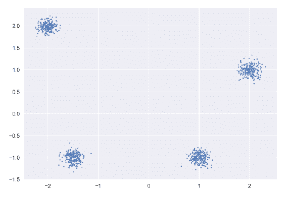

`cluster_std`会影响色散量。将其更改为`[0.4, 0.5, 0.6, 0.5]`并重试:

```
cluster_std = [0.4, 0.5, 0.6, 0.5] 

X, y = make_blobs(n_samples=1000,
                  centers=centers,
                  cluster_std=cluster_std,
                  random_state=53)

plt.scatter(X[:, 0], X[:, 1], **plot_kwargs)
plt.show()
```

从前面的代码中我们得到了下面的图:

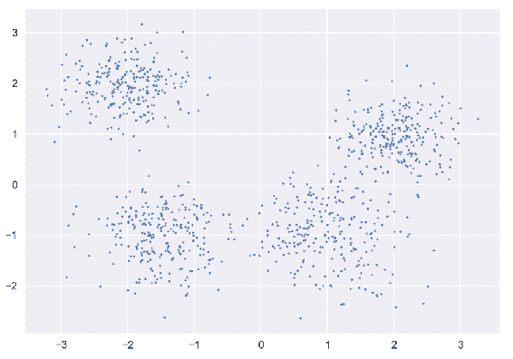

现在看起来更逼真了！

让我们用有帮助的方法写一个小类来创建无监督的实验。首先，您将使用`fit_predict`方法对样本数据集应用一个或多个聚类算法:

```
class Unsupervised_AutoML:

    def __init__(self, estimators=None, transformers=None):
        self.estimators = estimators
        self.transformers = transformers
        pass
```

类别将用一组估计器和转换器初始化。第二类方法将是`fit_predict`:

```
def fit_predict(self, X, y=None):
    """
    fit_predict will train given estimator(s) and predict cluster membership for each sample
    """

    # This dictionary will hold predictions for each estimator
    predictions = []
    performance_metrics = {}

    for estimator in self.estimators:
        labels = estimator['estimator'](*estimator['args'], **estimator['kwargs']).fit_predict(X)
        estimator['estimator'].n_clusters_ = len(np.unique(labels))
        metrics = self._get_cluster_metrics(estimator['estimator'].__name__, estimator['estimator'].n_clusters_, X, labels, y)
        predictions.append({estimator['estimator'].__name__: labels})
        performance_metrics[estimator['estimator'].__name__] = metrics

    self.predictions = predictions
    self.performance_metrics = performance_metrics

    return predictions, performance_metrics
```

`fit_predict`方法使用`_get_cluster_metrics`方法获取性能指标，这在下面的代码块中定义:

```
# Printing cluster metrics for given arguments
def _get_cluster_metrics(self, name, n_clusters_, X, pred_labels, true_labels=None):
    from sklearn.metrics import homogeneity_score, \
        completeness_score, \
        v_measure_score, \
        adjusted_rand_score, \
        adjusted_mutual_info_score, \
        silhouette_score

    print("""################## %s metrics #####################""" % name)
    if len(np.unique(pred_labels)) >= 2:

        silh_co = silhouette_score(X, pred_labels)

        if true_labels is not None:

            h_score = homogeneity_score(true_labels, pred_labels)
            c_score = completeness_score(true_labels, pred_labels)
            vm_score = v_measure_score(true_labels, pred_labels)
            adj_r_score = adjusted_rand_score(true_labels, pred_labels)
            adj_mut_info_score = adjusted_mutual_info_score(true_labels, pred_labels)

            metrics = {"Silhouette Coefficient": silh_co,
                       "Estimated number of clusters": n_clusters_,
                       "Homogeneity": h_score,
                       "Completeness": c_score,
                       "V-measure": vm_score,
                       "Adjusted Rand Index": adj_r_score,
                       "Adjusted Mutual Information": adj_mut_info_score}

            for k, v in metrics.items():
                print("\t%s: %0.3f" % (k, v))

            return metrics

        metrics = {"Silhouette Coefficient": silh_co,
                   "Estimated number of clusters": n_clusters_}

        for k, v in metrics.items():
            print("\t%s: %0.3f" % (k, v))

        return metrics

    else:
        print("\t# of predicted labels is {}, can not produce metrics. \n".format(np.unique(pred_labels)))
```

`_get_cluster_metrics`方法计算度量，例如`homogeneity_score`、`completeness_score`、`v_measure_score`、`adjusted_rand_score`、`adjusted_mutual_info_score`和`silhouette_score`。这些指标将帮助您评估分类的分离程度，并测量分类内部和分类之间的相似性。


# 运行中的 K-means 算法

您现在可以应用`KMeans`算法来看看它是如何工作的:

```
from sklearn.cluster import KMeans

estimators = [{'estimator': KMeans, 'args':(), 'kwargs':{'n_clusters': 4}}]

unsupervised_learner = Unsupervised_AutoML(estimators)
```

你可以看到`estimators`:

```
unsupervised_learner.estimators
```

这些将输出以下内容:

```
[{'args': (),
 'estimator': sklearn.cluster.k_means_.KMeans,
 'kwargs': {'n_clusters': 4}}]
```

您现在可以调用`fit_predict`来获得`predictions`和`performance_metrics`:

```
predictions, performance_metrics = unsupervised_learner.fit_predict(X, y)
```

指标将被写入控制台:

```
################## KMeans metrics #####################
  Silhouette Coefficient: 0.631
  Estimated number of clusters: 4.000
  Homogeneity: 0.951
  Completeness: 0.951
  V-measure: 0.951
  Adjusted Rand Index: 0.966
  Adjusted Mutual Information: 0.950
```

您可以随时在以后打印指标:

```
pprint(performance_metrics)
```

这将输出估计器的名称及其度量:

```
{'KMeans': {'Silhouette Coefficient': 0.9280431207593165, 'Estimated number of clusters': 4, 'Homogeneity': 1.0, 'Completeness': 1.0, 'V-measure': 1.0, 'Adjusted Rand Index': 1.0, 'Adjusted Mutual Information': 1.0}}
```

让我们添加另一个类方法来绘制给定估计值和预测标签的聚类:

```
# plot_clusters will visualize the clusters given predicted labels
def plot_clusters(self, estimator, X, labels, plot_kwargs):

    palette = sns.color_palette('deep', np.unique(labels).max() + 1)
    colors = [palette[x] if x >= 0 else (0.0, 0.0, 0.0) for x in labels]

    plt.scatter(X[:, 0], X[:, 1], c=colors, **plot_kwargs)
    plt.title('{} Clusters'.format(str(estimator.__name__)), fontsize=14)
    plt.show()

```

让我们来看看用法:

```
plot_kwargs = {'s': 12, 'linewidths': 0.1}
unsupervised_learner.plot_clusters(KMeans,
                                   X,
                                   unsupervised_learner.predictions[0]['KMeans'],
                                   plot_kwargs)
```

从前面的块中可以得到下面的图:

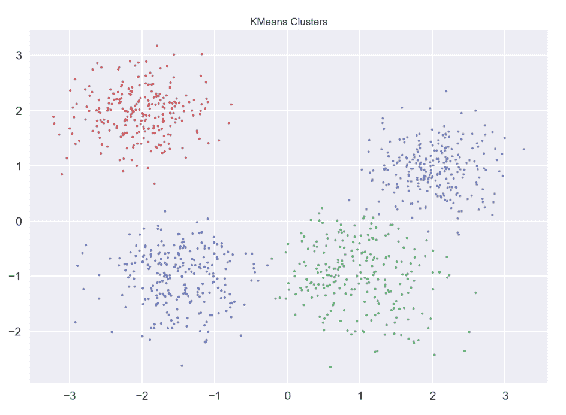

在本例中，聚类大小均匀，彼此之间明显分离，但是，当您进行这种探索性分析时，您应该尝试不同的超参数并检查结果。

在本章的后面，您将编写一个包装函数来应用一系列聚类算法及其超参数来检查结果。现在，让我们再看一个 k-means 不好用的例子。

当数据集中的聚类具有不同的统计属性(如方差差异)时，k-means 将无法正确识别聚类:

```
X, y = make_blobs(n_samples=2000, centers=5, cluster_std=[1.7, 0.6, 0.8, 1.0, 1.2], random_state=220)

# Plot sample data
plt.scatter(X[:, 0], X[:, 1], **plot_kwargs)
plt.show()
```

从前面的代码中我们得到了下面的图:

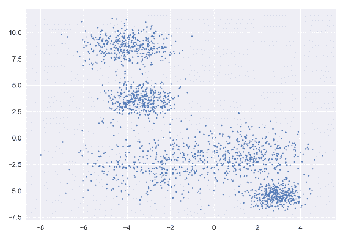

虽然这个样本数据集是由五个中心生成的，但这并不明显，也可能有四个聚类:

```
from sklearn.cluster import KMeans

estimators = [{'estimator': KMeans, 'args':(), 'kwargs':{'n_clusters': 4}}]

unsupervised_learner = Unsupervised_AutoML(estimators)

predictions, performance_metrics = unsupervised_learner.fit_predict(X, y)

```

控制台中的指标如下:

```
################## KMeans metrics #####################
  Silhouette Coefficient: 0.549
  Estimated number of clusters: 4.000
  Homogeneity: 0.729
  Completeness: 0.873
  V-measure: 0.795
  Adjusted Rand Index: 0.702
  Adjusted Mutual Information: 0.729
```

`KMeans`集群绘制如下:

```
plot_kwargs = {'s': 12, 'linewidths': 0.1}
unsupervised_learner.plot_clusters(KMeans,
                                   X,
                                   unsupervised_learner.predictions[0]['KMeans'],
                                   plot_kwargs)
```

从前面的代码中我们得到了下面的图:

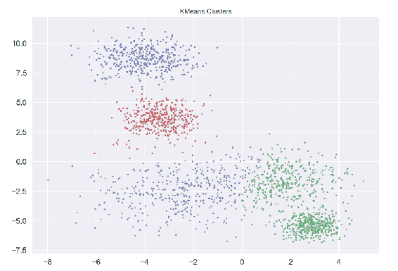

在这个例子中，红色(深灰色)和底部绿色(浅灰色)之间的点似乎形成了一个大的集群。K-means 基于质心周围点的平均值计算质心。在这里，你需要有一个不同的方法。


# 运行中的 DBSCAN 算法

DBSCAN 是一种聚类算法，可以处理不平坦的几何形状和不均匀的聚类大小。让我们看看它能做什么:

```
from sklearn.cluster import DBSCAN

estimators = [{'estimator': DBSCAN, 'args':(), 'kwargs':{'eps': 0.5}}]

unsupervised_learner = Unsupervised_AutoML(estimators)

predictions, performance_metrics = unsupervised_learner.fit_predict(X, y)
```

控制台中的指标如下:

```
################## DBSCAN metrics #####################
  Silhouette Coefficient: 0.231
  Estimated number of clusters: 12.000
  Homogeneity: 0.794
  Completeness: 0.800
  V-measure: 0.797
  Adjusted Rand Index: 0.737
  Adjusted Mutual Information: 0.792
```

`DBSCAN`集群绘制如下:

```
plot_kwargs = {'s': 12, 'linewidths': 0.1}
unsupervised_learner.plot_clusters(DBSCAN,
                                   X,
                                   unsupervised_learner.predictions[0]['DBSCAN'],
                                   plot_kwargs)
```

从前面的代码中我们得到了下面的图:

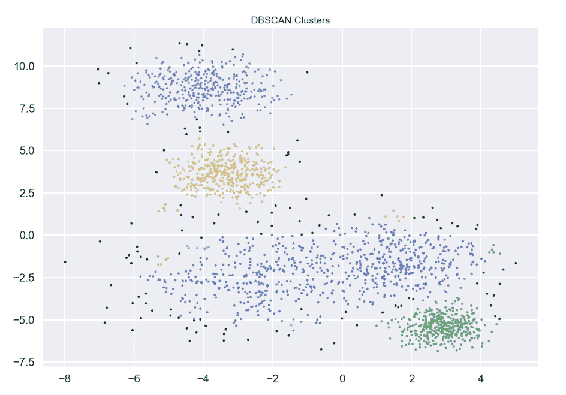

k-means 案例中红色(深灰色)和底部绿色(浅灰色)聚类之间的冲突似乎已经消失，但这里有趣的是，一些小聚类出现了，一些点没有根据它们的距离分配给任何聚类。

DBSCAN 有`eps(epsilon)`超参数，它与相同邻域中的点的接近度有关；您可以使用这些参数来观察算法的表现。

当您在对数据了解不多的情况下进行这种探索性分析时，视觉线索总是很重要，因为度量标准可能会误导您，因为不是每个聚类算法都可以使用类似的度量标准进行评估。


# 凝聚聚类算法在实践中的应用

我们最后一次尝试使用凝聚聚类算法:

```
from sklearn.cluster import AgglomerativeClustering

estimators = [{'estimator': AgglomerativeClustering, 'args':(), 'kwargs':{'n_clusters': 4, 'linkage': 'ward'}}]

unsupervised_learner = Unsupervised_AutoML(estimators)

predictions, performance_metrics = unsupervised_learner.fit_predict(X, y)
```

控制台中的指标如下:

```
################## AgglomerativeClustering metrics #####################
  Silhouette Coefficient: 0.546
  Estimated number of clusters: 4.000
  Homogeneity: 0.751
  Completeness: 0.905
  V-measure: 0.820
  Adjusted Rand Index: 0.719
  Adjusted Mutual Information: 0.750
```

`AgglomerativeClustering`集群绘制如下:

```
plot_kwargs = {'s': 12, 'linewidths': 0.1}
unsupervised_learner.plot_clusters(AgglomerativeClustering,
                                   X,
                                   unsupervised_learner.predictions[0]['AgglomerativeClustering'],
                                   plot_kwargs)
```

从前面的代码中我们得到了下面的图:

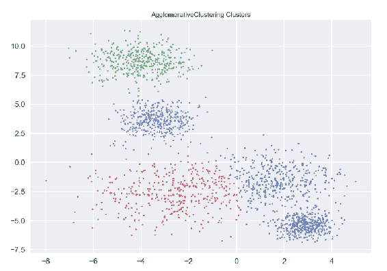

`AgglomerativeClustering`在本例中的表现类似于 k-means，只是略有不同。


# 无监督学习的简单自动化

您应该自动化整个发现过程，以使用不同的超参数设置来尝试不同的聚类算法。下面的代码将向您展示一种简单的方法:

```
# You will create a list of algorithms to test
from sklearn.cluster import MeanShift, estimate_bandwidth, SpectralClustering
from hdbscan import HDBSCAN

# bandwidth estimate for MeanShift algorithm to work properly
bandwidth = estimate_bandwidth(X, quantile=0.3, n_samples=100)

estimators = [{'estimator': KMeans, 'args': (), 'kwargs': {'n_clusters': 5}},
                         {'estimator': DBSCAN, 'args': (), 'kwargs': {'eps': 0.5}},
                         {'estimator': AgglomerativeClustering, 'args': (), 'kwargs': {'n_clusters': 5, 'linkage': 'ward'}},
                         {'estimator': MeanShift, 'args': (), 'kwargs': {'cluster_all': False, "bandwidth": bandwidth, "bin_seeding": True}},
                         {'estimator': SpectralClustering, 'args': (), 'kwargs': {'n_clusters':5}},
                         {'estimator': HDBSCAN, 'args': (), 'kwargs': {'min_cluster_size':15}}]

unsupervised_learner = Unsupervised_AutoML(estimators)

predictions, performance_metrics = unsupervised_learner.fit_predict(X, y)
```

您将在控制台中看到以下指标:

```
################## KMeans metrics #####################
  Silhouette Coefficient: 0.592
  Estimated number of clusters: 5.000
  Homogeneity: 0.881
  Completeness: 0.882
  V-measure: 0.882
  Adjusted Rand Index: 0.886
  Adjusted Mutual Information: 0.881

################## DBSCAN metrics #####################
  Silhouette Coefficient: 0.417
  Estimated number of clusters: 5.000
  ...
################## AgglomerativeClustering metrics #####################
  Silhouette Coefficient: 0.581
  Estimated number of clusters: 5.000
  ...
################## MeanShift metrics #####################
  Silhouette Coefficient: 0.472
  Estimated number of clusters: 3.000
  ...
################## SpectralClustering metrics #####################
  Silhouette Coefficient: 0.420
  Estimated number of clusters: 5.000
  ...
################## HDBSCAN metrics #####################
  Silhouette Coefficient: 0.468
  Estimated number of clusters: 6.000
  ...
```

您可以稍后打印标签和指标，因为每个算法都有一个标签和指标:

```
pprint(predictions)
[{'KMeans': array([3, 1, 4, ..., 0, 1, 2], dtype=int32)},
 {'DBSCAN': array([ 0, 0, 0, ..., 2, -1, 1])},
 {'AgglomerativeClustering': array([2, 4, 0, ..., 3, 2, 1])},
 {'MeanShift': array([0, 0, 0, ..., 1, 0, 1])},
 {'SpectralClustering': array([4, 2, 1, ..., 0, 1, 3], dtype=int32)},
 {'HDBSCAN': array([ 4, 2, 3, ..., 1, -1, 0])}]

pprint(performance_metrics)
{'AgglomerativeClustering': {'Adjusted Mutual Information': 0.8989601162598674,
                             'Adjusted Rand Index': 0.9074196173180163,
                             ...},
 'DBSCAN': {'Adjusted Mutual Information': 0.5694008711591612,
            'Adjusted Rand Index': 0.4685215791890368,
            ...},
 'HDBSCAN': {'Adjusted Mutual Information': 0.7857262723310214,
             'Adjusted Rand Index': 0.7907512089039799,
             ...},
 'KMeans': {'Adjusted Mutual Information': 0.8806038790635883,
            'Adjusted Rand Index': 0.8862210038915361,
            ...},
 'MeanShift': {'Adjusted Mutual Information': 0.45701704058584275,
               'Adjusted Rand Index': 0.4043364504640998,
               ...},
 'SpectralClustering': {'Adjusted Mutual Information': 0.7628653432724043,
                        'Adjusted Rand Index': 0.7111907598912597,
                        ...}}
```

您可以使用`plot_clusters`方法以同样的方式可视化预测。让我们编写另一个类方法，它将为您在实验中使用的所有估计量绘制聚类图:

```
def plot_all_clusters(self, estimators, labels, X, plot_kwargs):

    fig = plt.figure()

    for i, algorithm in enumerate(labels):

        quotinent = np.divide(len(estimators), 2)

        # Simple logic to decide row and column size of the figure
        if isinstance(quotinent, int):
            dim_1 = 2
            dim_2 = quotinent
        else:
            dim_1 = np.ceil(quotinent)
            dim_2 = 3

        palette = sns.color_palette('deep',
                                    np.unique(algorithm[estimators[i]['estimator'].__name__]).max() + 1)
        colors = [palette[x] if x >= 0 else (0.0, 0.0, 0.0) for x in
                  algorithm[estimators[i]['estimator'].__name__]]

        plt.subplot(dim_1, dim_2, i + 1)
        plt.scatter(X[:, 0], X[:, 1], c=colors, **plot_kwargs)
        plt.title('{} Clusters'.format(str(estimators[i]['estimator'].__name__)), fontsize=8)

    plt.show()
```

让我们来看看用法:

```
plot_kwargs = {'s': 12, 'linewidths': 0.1}
unsupervised_learner.plot_all_clusters(estimators, unsupervised_learner.predictions, X, plot_kwargs)
```

我们从前面的代码块中得到下面的图:

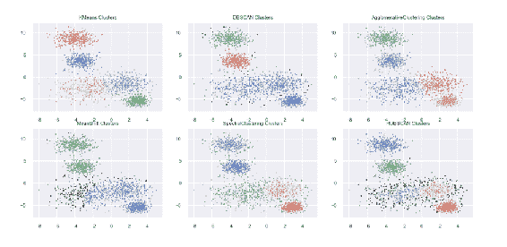

第一行，从左开始:KMeans、DBSCAN、AgglomerativeClustering

底部一行，从左开始:MeanShift，SpectralClustering，HDBSCAN


# 可视化高维数据集

视觉检查超过三维的数据集怎么样？为了直观地检查您的数据集，您最多需要三个维度；如果没有，就需要使用特定的方法来降维。这通常通过应用**主成分分析** ( **PCA** )或 t-SNE 算法来实现。

下面的代码将加载在 ML 教程中常用的`Breast Cancer Wisconsin Diagnostic`数据集:

```
# Wisconsin Breast Cancer Diagnostic Dataset
from sklearn.datasets import load_breast_cancer
import pandas as pd

data = load_breast_cancer()
X = data.data

df = pd.DataFrame(data.data, columns=data.feature_names)
df.head()
```

控制台中的输出如下:

```
 mean radius mean texture mean perimeter mean area mean smoothness \
0 17.99 10.38 122.80 1001.0 0.11840 
1 20.57 17.77 132.90 1326.0 0.08474 
2 19.69 21.25 130.00 1203.0 0.10960 
3 11.42 20.38 77.58 386.1 0.14250 
4 20.29 14.34 135.10 1297.0 0.10030 

...

 mean fractal dimension ... worst radius \
0 0.07871 ... 25.38 
1 0.05667 ... 24.99 
2 0.05999 ... 23.57 
3 0.09744 ... 14.91 
4 0.05883 ... 22.54 

...

 worst fractal dimension 
0 0.11890 
1 0.08902 
2 0.08758 
3 0.17300 
4 0.07678 
```

你有 30 种不同的特征可以用来理解给定患者肿瘤的不同特征。

`df.describe()`将向您显示每个功能的描述性统计数据:

```

df.describe()

       mean radius mean texture mean perimeter mean area \
count 569.000000 569.000000 569.000000 569.000000 
mean 14.127292 19.289649 91.969033 654.889104 
std 3.524049 4.301036 24.298981 351.914129 
min 6.981000 9.710000 43.790000 143.500000 
25% 11.700000 16.170000 75.170000 420.300000 
50% 13.370000 18.840000 86.240000 551.100000 
75% 15.780000 21.800000 104.100000 782.700000 
max 28.110000 39.280000 188.500000 2501.000000 

...

       mean symmetry mean fractal dimension ... \
count 569.000000 569.000000 ... 
mean 0.181162 0.062798 ... 
std 0.027414 0.007060 ... 
min 0.106000 0.049960 ... 
25% 0.161900 0.057700 ... 
50% 0.179200 0.061540 ... 
75% 0.195700 0.066120 ... 
max 0.304000 0.097440 ... 

...

       worst concave points worst symmetry worst fractal dimension 
count 569.000000 569.000000 569.000000 
mean 0.114606 0.290076 0.083946 
std 0.065732 0.061867 0.018061 
min 0.000000 0.156500 0.055040 
25% 0.064930 0.250400 0.071460 
50% 0.099930 0.282200 0.080040 
75% 0.161400 0.317900 0.092080 
max 0.291000 0.663800 0.207500 
[8 rows x 30 columns]
```

让我们看看缩放前后的结果。下面的代码片段将使 PCA 适合原始数据。


# 主成分分析在行动中

以下代码块向您展示了如何对两个组件应用 PCA 并可视化结果:

```
# PCA
from sklearn.decomposition import PCA

pca = PCA(n_components=2, whiten=True)
pca = pca.fit_transform(df)

plt.scatter(pca[:, 0], pca[:, 1], c=data.target, cmap="RdBu_r", edgecolor="Red", alpha=0.35)
plt.colorbar()
plt.title('PCA, n_components=2')
plt.show()
```

从前面的代码中我们得到了下面的图:

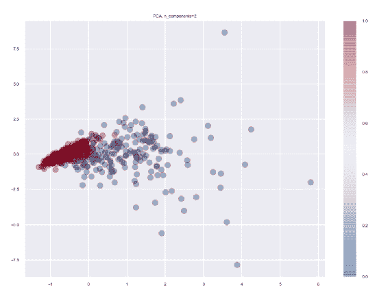

PCA 图，n_components=2

在这里，你可以看到红色等级(深灰色)非常集中在一个特定的区域，很难区分等级。方差的差异会扭曲我们的观点，缩放可以帮助我们:

```
# Preprocess data.
scaler = StandardScaler()
scaler.fit(df)
preprocessed_data = scaler.transform(df)
scaled_features_df = pd.DataFrame(preprocessed_data, index=df.index, columns=df.columns)
```

应用`StandardScaler`预处理数据后，数据集有单位方差:

```
scaled_features_df.describe()

        mean radius mean texture mean perimeter mean area \
count 5.690000e+02 5.690000e+02 5.690000e+02 5.690000e+02 
mean -3.162867e-15 -6.530609e-15 -7.078891e-16 -8.799835e-16 
std 1.000880e+00 1.000880e+00 1.000880e+00 1.000880e+00 
min -2.029648e+00 -2.229249e+00 -1.984504e+00 -1.454443e+00 
25% -6.893853e-01 -7.259631e-01 -6.919555e-01 -6.671955e-01 
50% -2.150816e-01 -1.046362e-01 -2.359800e-01 -2.951869e-01 
75% 4.693926e-01 5.841756e-01 4.996769e-01 3.635073e-01 
max 3.971288e+00 4.651889e+00 3.976130e+00 5.250529e+00 

...

       mean symmetry mean fractal dimension ... \
count 5.690000e+02 5.690000e+02 ... 
mean -1.971670e-15 -1.453631e-15 ... 
std 1.000880e+00 1.000880e+00 ... 
min -2.744117e+00 -1.819865e+00 ... 
25% -7.032397e-01 -7.226392e-01 ... 
50% -7.162650e-02 -1.782793e-01 ... 
75% 5.307792e-01 4.709834e-01 ... 
max 4.484751e+00 4.910919e+00 ... 

...

       worst concave points worst symmetry worst fractal dimension 
count 5.690000e+02 5.690000e+02 5.690000e+02 
mean -1.412656e-16 -2.289567e-15 2.575171e-15 
std 1.000880e+00 1.000880e+00 1.000880e+00 
min -1.745063e+00 -2.160960e+00 -1.601839e+00 
25% -7.563999e-01 -6.418637e-01 -6.919118e-01 
50% -2.234689e-01 -1.274095e-01 -2.164441e-01 
75% 7.125100e-01 4.501382e-01 4.507624e-01 
max 2.685877e+00 6.046041e+00 6.846856e+00 
[8 rows x 30 columns]
```

应用 PCA 来查看前两个主成分是否足以分离标签:

```
# PCA
from sklearn.decomposition import PCA

pca = PCA(n_components=2, whiten=True)
pca = pca.fit_transform(scaled_features_df)

plt.scatter(pca[:, 0], pca[:, 1], c=data.target, cmap="RdBu_r", edgecolor="Red", alpha=0.35)
plt.colorbar()
plt.title('PCA, n_components=2')
plt.show()
```

我们从前面的代码中得到以下输出:

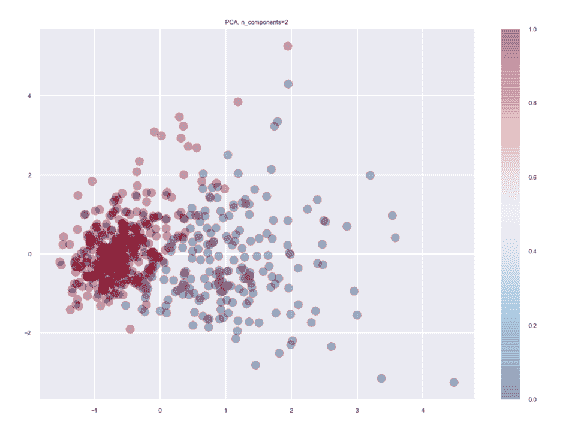

PCA，n_components=2，缩放后

这似乎很有趣，因为带有不同标签的例子大多使用前两个主成分来分离。


# t-SNE 在行动

你也可以尝试 t-SNE 来可视化高维数据。首先，`TSNE`将应用于原始数据:

```
# TSNE
from sklearn.manifold import TSNE

tsne = TSNE(verbose=1, perplexity=40, n_iter=4000)
tsne = tsne.fit_transform(df)
```

控制台中的输出如下:

```
[t-SNE] Computing 121 nearest neighbors...
[t-SNE] Indexed 569 samples in 0.000s...
[t-SNE] Computed neighbors for 569 samples in 0.010s...
[t-SNE] Computed conditional probabilities for sample 569 / 569
[t-SNE] Mean sigma: 33.679703
[t-SNE] KL divergence after 250 iterations with early exaggeration: 48.886528
[t-SNE] Error after 1600 iterations: 0.210506
```

绘制结果如下:

```
plt.scatter(tsne[:, 0], tsne[:, 1], c=data.target, cmap="winter", edgecolor="None", alpha=0.35)
plt.colorbar()
plt.title('t-SNE')
plt.show()
```

我们从前面的代码中得到以下输出:

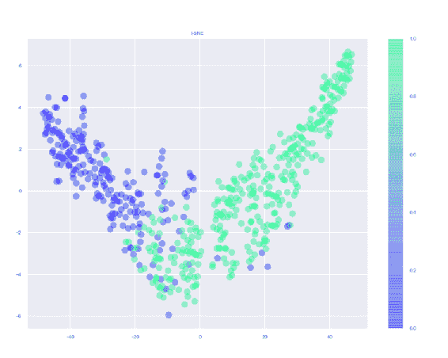

TSNE 的情节

将`TSNE`应用于缩放数据如下:

```
tsne = TSNE(verbose=1, perplexity=40, n_iter=4000)
tsne = tsne.fit_transform(scaled_features_df)
```

控制台中的输出如下:

```
[t-SNE] Computing 121 nearest neighbors...
[t-SNE] Indexed 569 samples in 0.001s...
[t-SNE] Computed neighbors for 569 samples in 0.018s...
[t-SNE] Computed conditional probabilities for sample 569 / 569
[t-SNE] Mean sigma: 1.522404
[t-SNE] KL divergence after 250 iterations with early exaggeration: 66.959343
[t-SNE] Error after 1700 iterations: 0.875110
```

绘制结果如下:

```
plt.scatter(tsne[:, 0], tsne[:, 1], c=data.target, cmap="winter", edgecolor="None", alpha=0.35)
plt.colorbar()
plt.title('t-SNE')
plt.show()
```

我们从前面的代码中得到以下输出:

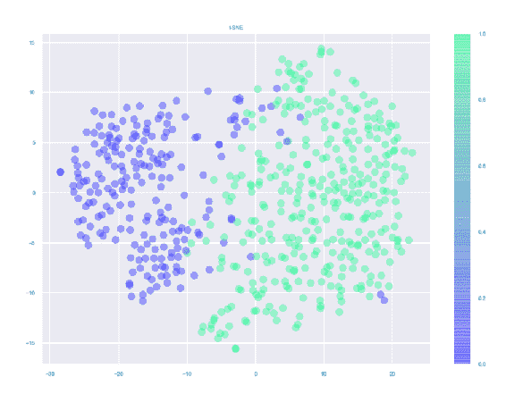

缩放后的 TSNE


# 将简单的组件添加到一起以改善管道

让我们对`fit_predict`方法做一些调整，在您的管道中加入一个分解器，这样您就可以在必要时可视化高维数据:

```
def fit_predict(self, X, y=None, scaler=True, decomposer={'name': PCA, 'args':[], 'kwargs': {'n_components': 2}}):
    """
    fit_predict will train given estimator(s) and predict cluster membership for each sample
    """

    shape = X.shape
    df_type = isinstance(X, pd.core.frame.DataFrame)

    if df_type:
        column_names = X.columns
        index = X.index

    if scaler == True:
        from sklearn.preprocessing import StandardScaler
        scaler = StandardScaler()
        X = scaler.fit_transform(X)

        if df_type:
            X = pd.DataFrame(X, index=index, columns=column_names)

    if decomposer is not None:
        X = decomposer['name'](*decomposer['args'], **decomposer['kwargs']).fit_transform(X)

        if df_type:
            if decomposer['name'].__name__ == 'PCA':
                X = pd.DataFrame(X, index=index, columns=['component_' + str(i + 1) for i in
                                                          range(decomposer['kwargs']['n_components'])])
            else:
                X = pd.DataFrame(X, index=index, columns=['component_1', 'component_2'])

        # if dimensionality reduction is applied, then n_components will be set accordingly in hyperparameter configuration
        for estimator in self.estimators:
            if 'n_clusters' in estimator['kwargs'].keys():
                if decomposer['name'].__name__ == 'PCA':
                    estimator['kwargs']['n_clusters'] = decomposer['kwargs']['n_components']
                else:
                    estimator['kwargs']['n_clusters'] = 2

    # This dictionary will hold predictions for each estimator
    predictions = []
    performance_metrics = {}

    for estimator in self.estimators:
        labels = estimator['estimator'](*estimator['args'], **estimator['kwargs']).fit_predict(X)
        estimator['estimator'].n_clusters_ = len(np.unique(labels))
        metrics = self._get_cluster_metrics(estimator['estimator'].__name__, estimator['estimator'].n_clusters_, X, labels, y)
        predictions.append({estimator['estimator'].__name__: labels})
        performance_metrics[estimator['estimator'].__name__] = metrics

    self.predictions = predictions
    self.performance_metrics = performance_metrics

    return predictions, performance_metrics
```

现在，您可以将`fit_predict`应用到您的数据集。下面的代码块显示了一个用法示例:

```
from sklearn.cluster import KMeans, DBSCAN, AgglomerativeClustering, MeanShift, estimate_bandwidth, SpectralClustering
from hdbscan import HDBSCAN

from sklearn.datasets import load_breast_cancer

data = load_breast_cancer()
X = data.data
y = data.target

# Necessary for bandwidth
bandwidth = estimate_bandwidth(X, quantile=0.1, n_samples=100)

estimators = [{'estimator': KMeans, 'args': (), 'kwargs': {'n_clusters': 5}},
                         {'estimator': DBSCAN, 'args': (), 'kwargs': {'eps': 0.3}},
                         {'estimator': AgglomerativeClustering, 'args': (), 'kwargs': {'n_clusters': 5, 'linkage': 'ward'}},
                         {'estimator': MeanShift, 'args': (), 'kwargs': {'cluster_all': False, "bandwidth": bandwidth, "bin_seeding": True}},
                         {'estimator': SpectralClustering, 'args': (), 'kwargs': {'n_clusters':5}},
                         {'estimator': HDBSCAN, 'args': (), 'kwargs': {'min_cluster_size':15}}]

unsupervised_learner = Unsupervised_AutoML(estimators)

predictions, performance_metrics = unsupervised_learner.fit_predict(X, y, decomposer=None)
```

自动无监督学习是一个高度实验性的过程，尤其是如果你不太了解你的数据。作为练习，您可以扩展`Unsupervised_AutoML`类，尝试为每个算法设置多个超参数，并可视化结果。


# 摘要

在本章中，您了解了为给定问题选择合适的 ML 管道的许多不同方面。

计算复杂性、训练和评分时间的差异、线性与非线性、算法、特定的特征变换都是有效的考虑因素，从这些角度来看您的数据非常有用。

通过实践各种用例，您对选择合适的模型以及机器学习管道如何工作有了更好的理解。你已经开始触及表面，这一章是扩展这些技能的良好起点。

在下一章中，您将学习优化超参数，并将了解更高级的概念，如基于贝叶斯的超参数优化。