<title>Unknown</title> 

# 深入学习

**人工智能** ( **AI** )的下一步更多的是自动化。在本书中，我们已经涵盖了**自动化机器学习** ( **AutoML** )的一些基础知识。还有一个人工智能领域刚刚开始在多种用例中出现，并且非常需要应用于自动化。人工智能领域的这一领域被称为**深度学习** ( **DL** )。DL 正处于机器能力的临界点。它可以比**机器学习** ( **ML** )做得更多，更轻松，精度更高。DL 算法可以自己学习数据集的关键特征，可以调整权重以创建更好的模型，等等。DL 网络的应用非常广泛。

随着深度学习的出现，图像、语音和视频识别领域的研究人员和从业者正在看到一些可操作的结果。它帮助人工智能接近其最初的目标，即成为机器人的大脑。它还可以在不断发展的物联网领域发挥作用。对于企业来说，DL 已经在简化客户服务和帮助许多人力密集型任务的自动化方面发挥了重要作用。到目前为止，你可能已经遇到过由 DL 驱动的机器人试图回答你的产品查询或帮助你预订你最喜欢的比萨饼订单。

DL 还在医药和保健领域推动发展。如果机器开始通过阅读 x 光和核磁共振扫描来诊断你的疾病，不要感到惊讶。预计 DL 将解决人类的许多秘密，并自动完成以前不可能完成的大量手工任务。很有趣，不是吗？让我们揭开 DL 的一些深层秘密。

在本章中，我们将了解:

*   前馈神经网络
*   自动编码器
*   深度卷积网络

在这一章中，我们将试着说明性地触及数字图书馆的一些基本概念。我们在这里的重点不是阻止你用方程式、数学公式和导数来描述 DL。虽然它们是基本的概念，但它们可能会让人不知所措。相反，我们将以一种说明性的方式向您介绍这些概念，并帮助您编写您的第一批 DL 代码。

神经网络是 DL 网络的前身，它们构成了 DL 框架的构建块。神经网络背后的基本思想是创建一个模拟我们生物大脑工作的计算系统。

<title>Unknown</title> 

# 技术要求

所有的代码示例都可以在 GitHub 的`Chapter 07`文件夹中找到。

<title>Unknown</title> 

# 神经网络概述

神经网络的最佳定义是由发明者 Robert Hecht-Nielsen 博士提供的，他是第一批神经计算机科学家之一，在 1989 年 2 月由人工智能专家 Maureen Caudill 编写的*神经网络初级读本:第一部分*:

...一种由许多简单、高度互联的处理元件组成的计算系统，这些元件通过对外部输入的动态响应来处理信息。

神经网络的基本构件是神经元，它们被组织在不同的层中。分层架构的每一层神经元都与下一层神经元相连。一个神经网络至少有三层。输入层连接到一个或多个隐藏层，其中连接是通过一个系统的**加权**链接建立的。最后一个隐藏层连接到产生任务结果的输出层。

下图说明了一个三层神经网络:

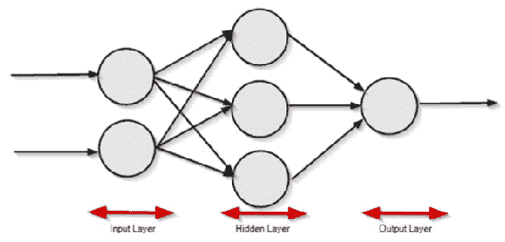

这个网络也被称为全连接人工神经网络或**前馈神经网络**(**)。还有另一种神经网络架构，其结果被传播回来以学习和调整权重，称为具有反向传播的**前馈神经网络**，如下图所示:**

**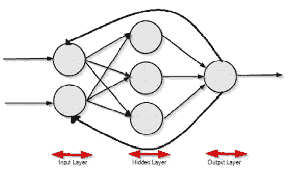

让我们全面地考察一下神经网络的每个单元。** **<title>Unknown</title> 

# 神经元

神经元是神经网络的基本单位。每个神经元都有多个输入、一个处理器和一个输出。神经元的处理始于积累其所有传入的输入，并基于激活函数，它发出一个信号，该信号传播到其他神经元或作为输出信号。这有助于神经元学习。神经元的最基本形式被称为**感知器**。感知器的二进制输出不是 0 就是 1。

典型的神经元如下所示:

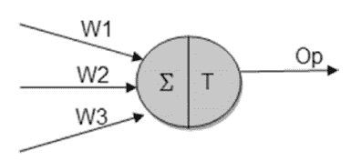

正如我们所见，神经元有几个输入。对于每个输入连接，都有一个与该特定连接相关联的权重。当神经元被激活时，通过将输入乘以其相应连接的权重相加来计算状态。在数学上，它可以用下面的函数来表示:

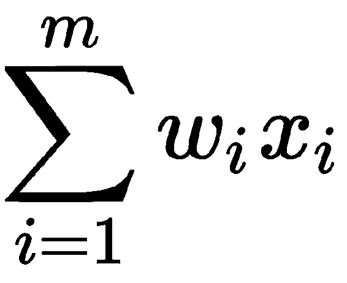

其中*x[I]为包含偏差的输入值。*

偏见是一个额外的输入，一个神经元。一个 bias 有自己的连接权重，bias 的值总是 1。这是为了确保即使没有输入，即输入值为 0，神经元中也会有激活。

一旦计算出状态，该值将通过一个激活函数进行传递，以对结果进行规范化。

<title>Unknown</title> 

# 激活功能

激活函数用于使用加权输入的先前线性组合来产生非线性决策。我们将讨论主要用于 DL 应用的四种不同类型的激活功能:

*   步骤
*   乙状结肠的
*   热卢
*   双曲正切

<title>Unknown</title> 

# 阶跃函数

在阶跃函数中，如果输入的加权和的值大于某个阈值，则激活神经元。两个选项如下:

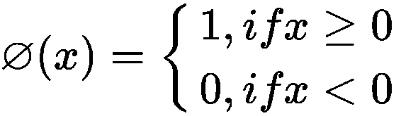

如果 *x* ，即输入值的加权和大于或等于 0，则激活 1，否则激活 0。下图说明了阶跃函数:

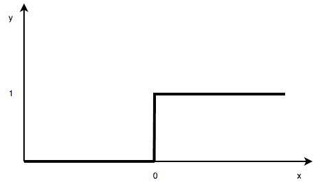

下一个广泛使用的激活函数是 **sigmoid** 函数。

<title>Unknown</title> 

# sigmoid 函数

sigmoid 函数定义为:

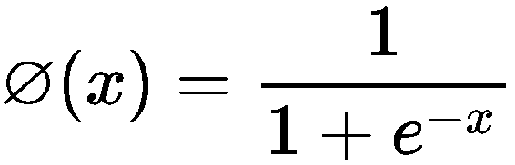

这里， *x* 是输入值的加权和的值。我们已经在逻辑回归中看到了这个函数。当 *x* 小于零时，它下降，大于零时，它接近 1。与阶跃函数不同，它是一个非线性激活函数。当我们在分类任务中尝试预测概率时，它主要用于神经网络的输出层。下图说明了 sigmoid 函数:

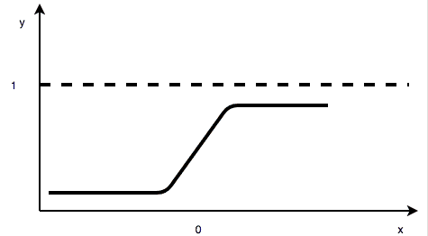

我们讨论的下一个激活函数是 **ReLU** ，它广泛用于神经网络的隐藏层。

<title>Unknown</title> 

# ReLU 函数

研究人员发现，使用**整流线性单元** ( **ReLU** )函数的神经网络比其他非线性函数(如 sigmoid 和 tanh)训练得更快，而准确性没有明显下降。因此， **ReLU 功能**是最重要的激活功能之一。如果 *x* 为正，则输出 *x* ，否则输出 0。

其定义如下:

*A(x) = max (0，x)*

ReLU 函数如下图所示:

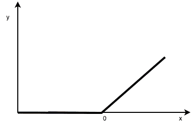

ReLU 是非线性函数，并且 ReLU 函数的组合也是非线性的。ReLU 的范围是从 0 到无穷大。

接下来，我们讨论双曲正切函数，它与 sigmoid 函数非常相似，但这里的值低于 0。

<title>Unknown</title> 

# 双曲正切函数

双曲正切函数也称为**双曲正切函数**。值从-1 到+1。

它的数学公式如下:

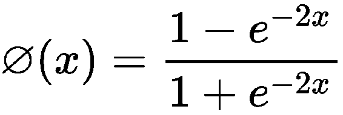

双曲正切函数的输出以零为中心。它也是一个非线性函数，因此可以用来堆叠不同的层。双曲正切函数如下图所示:

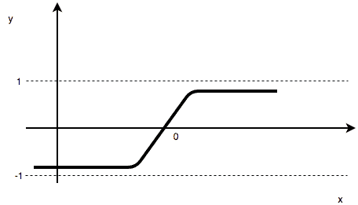

现在，我们对什么是神经网络、神经网络的结构及其不同组件有了一些了解，让我们使用 Keras 创建一个前馈神经网络。

<title>Unknown</title> 

# 基于 Keras 的前馈神经网络

Keras 是一个 DL 库，最初构建于 Python 之上，运行于 TensorFlow 或 Theano 之上。开发它是为了使 DL 实现更快:

1.  我们在操作系统的命令提示符下使用以下命令调用`install keras`:

```
pip install keras
```

2.  我们从导入用于数据操作的`numpy`和`pandas`库开始。此外，我们设置了一个`seed`,允许我们重现脚本的结果:

```
import numpy as np
import pandas as pd
numpy.random.seed(8)
```

3.  接下来，分别从`keras.models`和`keras.layers`导入序列模型和密集层。Keras 模型被定义为一系列层。顺序构造允许用户配置和添加层。密集层允许用户构建完全连接的网络:

```
from keras.models import Sequential
from keras.layers import Dense
```

4.  然后加载`HR`流失数据集，它有 14999 行和 10 列。`salary`和`sales`属性是一次性编码的，供 Keras 用于构建 DL 模型:

```
#load hrdataset
hr_data = pd.read_csv('data/hr.csv', header=0)
# split into input (X) and output (Y) variables
data_trnsf = pd.get_dummies(hr_data, columns =['salary', 'sales'])
data_trnsf.columns
X = data_trnsf.drop('left', axis=1)
X.columns
```

以下是上述代码的输出:

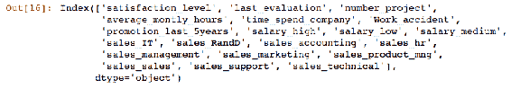

5.  然后，数据集以 70:30 的比例拆分，以训练和测试模型:

```
from sklearn.model_selection import train_test_split

X_train, X_test, Y_train, Y_test = train_test_split(X, data_trnsf.left, test_size=0.3, random_state=42)
```

6.  接下来，我们通过定义一个使用三层的顺序模型，开始创建一个完全连接的神经网络。第一层是输入层。在这一层，我们使用`input_dim`参数定义输入特征的数量、神经元的数量和激活函数。对于预处理数据集`X_train`中的 20 个输入要素，我们将`input_dim`参数设置为`20`。第一层的神经元数量被指定为`12`。目标是预测员工流失，这是一个二元分类问题。因此，我们在前两层使用整流器`activation`功能将非线性引入模型并激活神经元。第二层，也就是隐藏层，配置了`10`神经元。第三层是输出层，有一个神经元具有`sigmoid`激活功能。这确保了二进制分类任务的输出介于 0 和 1 之间:

```
# create model
model = Sequential()
model.add(Dense(12, input_dim=20, activation='relu'))
model.add(Dense(10, activation='relu'))
model.add(Dense(1, activation='sigmoid'))
```

7.  一旦我们配置了模型，下一步就是编译模型。在编译过程中，我们指定了`loss`函数、`optimizer`和`metrics`。因为我们正在处理一个两类的问题，我们将`loss`函数指定为`binary_crossentropy`。我们声明`adam`作为这个练习中使用的优化器。优化算法的选择对于模型的优异性能至关重要。`adam`优化器是随机梯度下降算法的扩展，是一种广泛使用的优化器:

```
# Compile model
model.compile(loss='binary_crossentropy', optimizer='adam', metrics=['accuracy'])
```

8.  接下来，我们使用`fit`方法将模型拟合到训练集。一个时期用于指定向前和向后传递的次数。`batch_size`参数用于声明每个时期要使用的训练样本的数量。在我们的例子中，我们用`10`的`batch_size`指定`epochs`的数量为`100`:

```
# Fit the model
X_train = np.array(X_train)
model.fit(X_train, Y_train, epochs=100, batch_size=10)
```

9.  一旦我们执行了前面的代码片段，执行就开始了，我们可以看到进度，如下面的屏幕截图所示。一旦达到模型的`fit`方法中指定的时期数，处理就会停止:

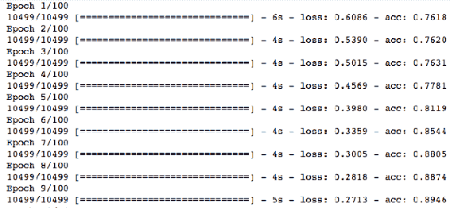

10.  最后一步是评估模型。我们在前面的评估指标中指定了准确性。在最后一步，我们使用以下代码片段检索模型的准确性:

```
# evaluate the model
scores = model.evaluate(X_train, Y_train)
print("%s: %.4f%%" % (model.metrics_names[1], scores[1]*100))

X_test = np.array(X_test)

scores = model.evaluate(X_test, Y_test)
print("%s: %.4f%%" % (model.metrics_names[1], scores[1]*100))
```

下面的结果显示模型精度为`93.56%`，测试精度为`93.20%`，这是一个非常好的结果。我们得到的结果可能与 seed 中描述的略有不同:

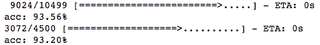

为了从神经网络中获得良好的结果，通常需要进行数据缩放。

在下一节中，我们将讨论自动编码器，这是一种无监督的 DL 技术，广泛用于非线性降维。

<title>Unknown</title> 

# 自动编码器

自动编码器是一种可用于无监督学习的 DL。它类似于我们之前研究过的其他降维技术如**主成分分析** ( **PCA** )。然而，PCA 使用线性变换将数据从较高的维度投影到较低的维度，但是自动编码器使用非线性变换。

在自动编码器中，其结构有两部分:

*   **编码器**:该部分将输入压缩成更少的元素或比特。输入被压缩到最大点，称为**潜在空间**或**瓶颈**。这些压缩比特被称为**编码比特**。
*   **解码器**:解码器尝试根据编码位重建输入。如果解码器能够从编码的比特中再现精确的输入，那么我们可以说有一个完美的编码。然而，这是一个理想的情况，并不总是发生。重构误差提供了一种测量解码器重构努力和判断自动编码器准确性的方法。

现在，我们对自动编码器的结构有了一点了解，让我们使用下图来形象化它:

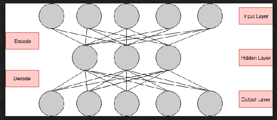

有不同类型的自动编码器，例如:

*   **Vanilla autoencoder** :它有两层神经网络架构，有一个隐藏层。
*   **稀疏自动编码器**:用于学习数据的稀疏表示。这里，对其损失函数施加约束，以约束自动编码器的重构。
*   **去噪自动编码器**:在这些自动编码器中，引入了部分损坏的输入。这样做是为了防止自动编码器简单地学习输入的结构，并迫使网络发现更鲁棒的特征来学习输入模式。

异常检测是自动编码器最广泛使用的用例之一。这是一个从已知中发现未知的过程。在异常检测练习中，输入数据总是有一个已知的类别。当自动编码器通过重构输入数据来学习数据的模式时，它倾向于发现可能是数据中的异常的未知模式:

1.  正如我们对上一个示例所做的那样，这里我们使用下面的代码片段导入所需的库:

```
%matplotlib inline
import numpy as np
import pandas as pd
import matplotlib.pyplot as plt
from sklearn.model_selection import train_test_split
from keras.models import Model, load_model
from keras.layers import Input, Dense
np.random.seed(8)
```

2.  接下来，加载用于使用自动编码器构建异常检测器的数据集。用于演示的数据摘自 1974 年的《美国汽车趋势》杂志；它包括 32 辆汽车(1973 年至 1974 年的车型)的油耗以及汽车设计和性能的 10 个方面。数据集做了一些修改，引入了一些数据异常:

```
# load autodesign
auto_data = pd.read_csv('data/auto_design.csv')
# split into input (X) and output (Y) variables
X =auto_data.drop('Unnamed: 0', 1)
from sklearn.model_selection import train_test_split
X_train, X_test = train_test_split(X, test_size=0.3, random_state=42)
```

```
print(X_train)
X_train.shape
```

对于前面的代码，我们得到以下输出:

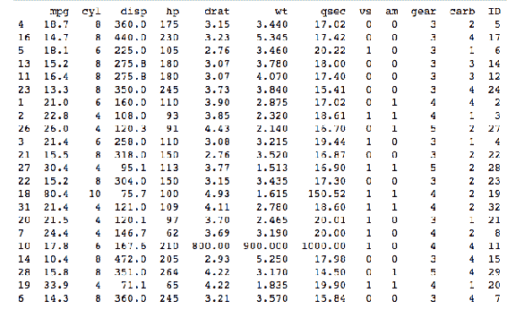

3.  接下来，定义输入维度。由于有 12 个不同的输入特征，并且我们计划使用自动编码器中的所有特征，我们将输入神经元的数量定义为`12`。这嵌入在输入层中，如下面的代码片段所示:

```
input_dim = X_train.shape[1]
encoding_dim = 12
input_layer = Input(shape=(input_dim, ))
```

4.  接下来，我们创建一个编码器和解码器。ReLU 函数是一种非线性激活函数，用于编码器中。编码层被传递到解码器，在解码器中，它尝试重建输入数据模式:

```
encoded = Dense(encoding_dim, activation='relu')(input_layer)
decoded = Dense(12, activation='linear')(encoded)
```

5.  以下模型将输入映射到其重构，重构在解码器层完成，`decoded`。接下来，使用`compile`方法定义`optimizer`和`loss`函数。`adadelta`优化器使用指数衰减梯度平均值，是一种高度自适应的学习率方法。重建是一个线性过程，并且在解码器中使用线性激活函数来定义。`loss`定义为`mse`，它是均方误差，我们在[第 2 章](ef128bb5-3783-4eb4-9879-319dff2012b8.xhtml)、*使用 Python 的机器学习简介*中研究过:

```
autoencoder = Model(input_layer, decoded)
autoencoder.compile(optimizer='adadelta', loss='mse')
```

6.  接下来，将训练数据`X_train`装入自动编码器。让我们用`4`的`batch_size`训练我们的自动编码器`100`个时期，并观察它是否达到稳定的训练或测试损耗值:

```
X_train = np.array(X_train)
autoencoder.fit(X_train, X_train,epochs=100,batch_size=4)
```

7.  一旦我们执行了前面的代码片段，执行就开始了，我们可以在下面的屏幕截图中看到进度。一旦达到模型的`fit`方法中指定的时期数，处理就会停止:

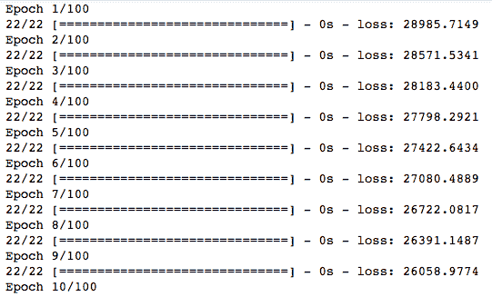

8.  一旦模型被拟合，我们通过将相同的`X_train`数据集传递给自动编码器的`predict`方法来预测输入值。接下来，我们计算`mse`值，以了解自动编码器是否能够正确重建数据集，以及重建误差有多大:

```
predictions = autoencoder.predict(X_train)
mse = np.mean(np.power(X_train - predictions, 2), axis=1)
```

9.  我们可以绘制`mse`来查看重建误差和无法正确重建的输入数据的索引:

```
plt.plot(mse)
```

10.  我们可以从下面的图中观察到，自动编码器无法正确地重建数据集的第 16 个^(记录。重建误差对于记录来说太高了，这是异常。第 13 个^第个记录也有一个小的重建误差，这也可能是一个异常:)

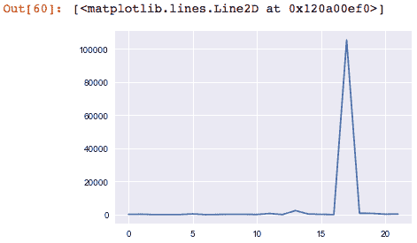

在接下来的章节中，我们将重点介绍**卷积神经网络** ( **CNN** )，它被广泛用于图像处理和图像识别。

<title>Unknown</title> 

# 卷积神经网络

这一节将重点介绍 CNN 的架构。虽然 CNN 是一个不可能在一个章节中完全涵盖的主题，但是我们将集中在 CNN 的重要元素上，以便您轻松地开始使用 CNN。在我们的讨论中，我们将使用 Keras 包来创建一个 CNN，使用包中的样本数据集。

当我们听到 CNN 这个词时，我们想到的问题是，*为什么是 CNN？*我们将尝试用一个简短的解释来回答这个问题。

<title>Unknown</title> 

# 为什么是 CNN？

我们在前面的章节中讨论了前馈神经网络。尽管它们功能强大，但它们的一个主要缺点是 FNN 忽略了输入数据的结构。所有输入网络的数据都必须首先转换成 1D 数值数组。但是，对于图像中的高维数组，处理这种转换会变得很困难。保持图像的结构是很重要的，因为有很多隐藏的信息存储在里面，这就是 CNN 介入的原因。CNN 在处理图像时会考虑图像的结构。

下一个问题是一个困难的术语——卷积。这是什么？

<title>Unknown</title> 

# 什么是卷积？

卷积是一种特殊的数学运算，它涉及两个函数`f`和`g`的相乘，以产生一个新的修正函数(`f * g`)。例如，图像(假设函数`f`)与过滤函数`g`之间的卷积将产生图像的新版本。

我们刚刚讨论了过滤器，所以让我们试着理解什么是过滤器。

<title>Unknown</title> 

# 什么是过滤器？

CNN 使用滤镜来识别图像中的特征，如边缘、线条或拱门。他们在图像中寻找某些重要的模式或特征。滤镜旨在搜索图像中的某些特征，并检测图像中是否包含这些特征。滤镜应用于图像中的不同位置，直到它覆盖整个图像。滤波器是卷积层的关键元素，是 CNN 的重要步骤。

CNN 主要有四个不同的层次:

*   卷积层
*   图层继电器
*   汇集层
*   全连接层

让我们讨论卷积层，这是 CNN 的第一步。

<title>Unknown</title> 

# 卷积层

这是在输入图像和我们刚刚讨论的过滤器之间发生卷积操作的层。执行此步骤是为了减小图像的整体大小，以便更容易在接下来的层中处理图像。让我们用一个简单的问题来理解这一层的作用，*我们如何识别一只狗或一只猫？当我们看到它们时，一秒钟内就会自然而然地想到它们。我们不会分析它们的所有特征来决定狗是狗还是猫是猫。*

我们识别重要的特征，比如它们的眼睛、耳朵或尾巴，然后识别生物。这也是在卷积层中完成的。在这一层中，重要的特征被识别，其余的都被忽略。滤光器在图像上移动，以检测图像中的基本特征。移动过滤器的过程称为**步距**。

卷积层的结果然后通过非线性激活函数，例如 ReLU 函数。

<title>Unknown</title> 

# ReLU 层

这个附加步骤被应用于回旋层，以在回旋特征图中引入非线性。我们在前面的章节中学习了 ReLU 函数。图像具有高度非线性的图案。当我们应用卷积时，由于存在乘法和求和等线性运算，因此存在卷积可能变成线性的风险。因此，使用诸如 ReLU 的非线性激活函数来保持图像中的非线性。

CNN 的下一个阶段是汇集层。

<title>Unknown</title> 

# 汇集层

池化图层通过应用池化函数进一步减小了要素制图表达的大小。有不同种类的池功能，如`average`、`min`和`max`。最大池被广泛使用，因为它倾向于为每个步幅保持特征图的`max`值。这类似于卷积层，我们有一个滑动窗口，该窗口在特征图上滑动，以找到每个步幅内的`max`值。汇集层中的窗口大小通常小于卷积层中使用的窗口大小。

然后，将汇集的要素地图展平为 1D 制图表达，以便在完全连接的图层中使用。

<title>Unknown</title> 

# 完全连接的层

在一个 CNN 中可以有多个卷积、ReLU 和池操作。然而，总有最后一个单级是完全连接的层。全连接层是我们前面讨论过的前馈神经网络。这一步的目的是对`image`数据集进行不同的预测，比如对图像进行分类。

下图展示了 CNN 基本架构的最终图景:

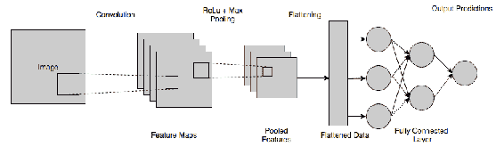

现在我们已经了解了 CNN 的一些基础知识，让我们使用 Keras 创建一个 CNN。我们将使用 Keras 本身提供的`MNIST`数据集。`MNIST`数据集是一个众所周知的书写数字数据集。数据集已经被分成训练集和测试集。它有大约 70，000 张图片。每幅图像的灰度尺寸为 28 * 28。

本节的完整代码可以在本书的代码库中找到。我们将演示重要的代码部分。

我们通过定义一个顺序模型开始构建一个 Keras DL 模型:

1.  如前所述，顺序方法使我们能够在按顺序执行的其他层上添加一层。添加的第一层是由`Conv2D`方法定义的卷积层。由于`MNIST`数据集由 2D 图像组成，我们添加了一个 2D 卷积层。`kernel_size`参数用于定义过滤器的大小，步长用于定义移动窗口。
2.  Keras 中没有不同的 ReLU 层。但是，我们可以在卷积层本身定义激活函数。我们为这个任务选择的激活函数是 ReLU。
3.  第三步是使用`MaxPooling2D`方法添加最大池层。`pool_size`被定义为 2 * 2，并且池层的跨距是 2 * 2。
4.  数据扁平化的第四步是通过添加一个`Flatten2D`方法来完成的。最后一层是全连接层，其定义类似于前馈神经网络:

```
#Model Definition
cnn_model = Sequential()
cnn_model.add(Conv2D(32, kernel_size=(5, 5), strides=(1, 1),activation='relu',input_shape=input))
cnn_model.add(MaxPooling2D(pool_size=(2, 2), strides=(2, 2)))
cnn_model.add(Flatten())
cnn_model.add(Dense(1000, activation='relu'))
cnn_model.add(Dense(num_classes, activation='softmax'))
```

5.  下面的代码片段类似于我们见过的其他 Keras 代码。我们需要首先用`loss`函数、`optimizer`和`metrics`编译模型。然后，使用`batch_size`和`epochs`用训练集拟合模型，这是模型拟合方法中的重要参数:

```
cnn_model.compile(loss=keras.losses.categorical_crossentropy,
 optimizer=keras.optimizers.Adam(),
 metrics=['accuracy'])
 cnn_model.fit(x_train, y_train,
 batch_size=10,
 epochs=10,
 verbose=1,
 validation_data=(x_test, y_test))
```

6.  一旦我们执行了前面的代码，我们需要等待一段时间才能得到结果。由于训练数据集庞大且图像复杂，仅完成 10 个时期就需要花费大量时间:

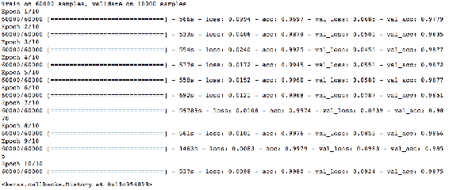

7.  训练完成后，我们可以使用以下代码片段评估模型的准确性:

```
model_score = cnn_model.evaluate(x_test, y_test, verbose=0)
print('Loss on the test data:', model_score[0])
print('Model accuracy on the test data:', model_score[1])
```

在测试数据上，该模型具有令人印象深刻的准确度`0.9875`，为 98.75%；

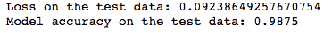<title>Unknown</title> 

# 摘要

在本章中，我们向您介绍了神经网络和深度学习的世界。我们讨论了不同的激活函数，神经网络的结构，并用 Keras 演示了一个前馈神经网络。

深度学习本身就是一个话题，有几本深度学习的书有深入的重点。本章的目的是为您提供探索深度学习的开端，因为它是机器学习自动化的下一个前沿。我们见证了自动编码器降维的能力。此外，具有强大特征处理机制的 CNN 是构建未来自动化系统的重要组成部分。

我们将在下一章结束我们的讨论，我们将回顾到目前为止我们已经覆盖的内容，接下来的步骤，以及创建一个完整的机器学习系统所必需的技能。**