<title>Chapter 1. Introduction to Ensemble Techniques</title>  

# 第一章。集成技术介绍

集成技术是在过去十五年中在统计和机器学习领域发展起来的模型输出聚集技术。这构成了这本书的中心主题。统计模型和机器学习工具的任何用户都将熟悉建立模型的问题以及在潜在候选模型中进行选择的重要决策。模型的准确性当然不是唯一相关的标准；我们还关心它的复杂性，以及整个模型是否有实际意义。

常见的建模问题包括选择模型的决策，并且存在各种方法来帮助完成这项任务。在统计学中，我们求助于诸如 **Akaike 信息标准** ( **AIC** )和**贝叶斯信息标准** ( **BIC** )等措施，而在其他方面，与拟合模型中的变量相关联的 p 值有助于决策。这是一个通常被称为**型号选择**的过程。脊罚，套索，和其他统计也有助于这项任务。对于机器学习模型，如神经网络、决策树等，当使用称为训练数据的一部分数据构建模型时，k 重交叉验证是有用的，然后在未训练区域或验证数据中寻找准确性。如果模型对其复杂性敏感，这种尝试可能是徒劳的。

获得*最佳*模型的过程意味着我们创建大量其他模型，这些模型本身几乎与最佳模型一样有效。此外，最佳模型准确地覆盖了大多数样本，而其他模型可能准确地评估不准确的可变空间区域。因此，我们可以看到，最终入围的模型比亚军几乎没有优势。下一款车型还不至于差到被直接拒绝的地步。这使得有必要找到一种方法，将已经从模型中获得的大部分结果以一种有意义的方式组合起来。集成学习的主要目标是寻找一种将各种模型组合在一起的方法。或者，可以说集成学习将竞争模型转换成协作模型。事实上，集成技术并不是建模工作的终点，因为它们还将扩展到无监督学习问题。我们将通过一个例子来证明这样做的必要性。

没有现代计算能力的发明，集合方法的实现是不可能的。统计方法预见了需要大量计算的技术。排列测试和刀切等方法证明了计算能力的有效性。我们将在这一章的后面做一个练习来学习这些，并且我们将在本书的后面重新讨论它们。

从机器学习的角度来看，*监督的*和*非监督的*是两种主要的学习技术。**监督学习**是机器学习的手臂，是已知某个变量的过程，目的是通过其他各种变量来了解这个变量。这里，我们有一个目标变量。由于学习是相对于输出变量进行的，因此监督学习有时被称为跟随老师学习。所有的目标变量都不相同，它们通常属于以下四种类型之一。如果目标是将观察结果分类到 *k* 类类型之一(例如，是/否，满意/不满意)，那么我们就有一个分类问题。这种变量在统计学中被称为*分类变量*。感兴趣的变量可能是一个连续变量，从软件的角度来看是一个数字。这可能包括每升汽车行驶里程，一个人的收入，或者一个人的年龄。对于这样的场景，机器学习问题的目的是学习其他关联变量的项中的变量，然后对只有关联变量的值可用的未知情况进行预测。我们将这类问题统称为**回归问题**。

在临床试验中，事件发生的时间通常是令人感兴趣的。当一种疾病被诊断出来时，我们会问这种被提议的药物是否比现有的药物有所改进。虽然这里讨论的变量是诊断和死亡之间的时间长度，但临床试验数据提出了其他几个问题。分析不能等到所有患者死亡，和/或一些患者可能已经离开研究，使得不再可能知道他们的状态。因此，我们审查了数据。作为研究观察的一部分，没有完整的信息。生存分析在很大程度上处理这类问题，我们将在这里承担创建集合模型的问题。

利用分类、回归和生存数据，可以假设实例/观察值是相互独立的。这是一个非常合理的假设，因为有充分的理由相信患者会独立于其他患者对药物产生反应，客户会独立于其他客户流失或支付贷款，等等。在另一类重要的问题中，这一假设不成立，我们只能通过时间序列数据得到相互依赖的观察结果。时间序列数据的一个例子是一家公司的收盘股票交易点。显然，一家公司股票的表现不可能每天都是独立的，因此我们需要考虑相关性。

在许多实际问题中，目标是理解模式或找到观察组，并且我们没有关于哪个算法需要被训练的感兴趣的特定变量。寻找群体或聚类被称为无监督学习或没有老师的学习。在寻找聚类中出现的两个主要实际问题是(I)通常事先不知道群体中有多少个聚类，以及(ii)初始聚类中心的不同选择导致不同的解决方案。因此，我们需要一个不需要初始化，或者至少不关心初始化的解决方案，并且考虑每个有用解决方案的优点。这将引导我们走向无监督集成技术。

对最佳模型的搜索，不管是有监督的还是无监督的，经常会因为离群值的存在而受阻。众所周知，单个异常值的存在会严重影响线性模型的整体拟合，甚至还会显著影响非线性模型。离群点检测本身就是一个挑战，大量的统计方法有助于识别离群点。许多机器学习方法也有助于识别异常值。当然，集成在这里会有所帮助，我们将开发 R 程序来帮助解决识别异常值的问题。这种方法将被称为异常值集成。

首先，读者熟悉本书中使用的数据集是很重要的。所有主要数据集将在第一部分介绍。我们以对核心统计/机器学习模型的简要介绍开始这一章，然后立即将它们付诸行动。很快就会发现，没有哪一类模型会比任何其他模型表现得更好。如果存在这样的解决方案，我们就不需要系综技术了。

在本章中，我们将介绍:

*   **数据集**:贯穿全书的核心数据集
*   **统计/机器学习模型**:这里将解释重要的分类模型
*   **正确的模式困境**:缺乏一个*主导的*模式
*   合奏范围:对合奏的需求
*   **补充统计测试**:这里将讨论对模型比较有用的重要统计测试

本章需要以下 R 包:

*   `ACSWR`
*   `caret`
*   `e1071`
*   `factoextra`
*   `mlbench`
*   `NeuralNetTools`
*   `perm`
*   `pROC`
*   `RSADBE`
*   `Rpart`
*   `survival`
*   `nnet`

<title>Chapter 1. Introduction to Ensemble Techniques</title>  

# 数据集

数据无疑是机器学习最重要的组成部分。如果没有数据，我们就没有共同的目的。在大多数情况下，收集数据的目的决定了问题本身。正如我们所知，变量可能有几种类型，它的存储和组织方式也非常重要。

Lee 和 Elder (1997)考虑了一系列数据集，并介绍了集合模型的必要性。我们将从他们的论文中考虑的数据集的细节开始，然后我们将在本书的后面提到其他重要的数据集。

<title>Chapter 1. Introduction to Ensemble Techniques</title>  

## 甲状腺功能减退

甲状腺数据集`Hypothyroid.csv`可在位于`/…/Chapter01/Data`的本书的代码包中获得。虽然数据集中有 26 个变量，但我们将只使用其中的 7 个变量。这里的观察次数为 *n* = 3163。数据集从[http://archive.ics.uci.edu/ml/datasets/thyroid+disease](http://archive.ics.uci.edu/ml/datasets/thyroid+disease)下载，文件名为`hypothyroid.data`([http://archive . ics . UCI . edu/ml/machine-learning-databases/甲状腺疾病/甲状腺机能减退. data](http://archive.ics.uci.edu/ml/machine-learning-databases/thyroid-disease/hypothyroid.data) )。在对重新标记某些值的顺序做了一些调整后，CSV 文件在本书的代码包中可用。本研究的目的是根据其他变量提供的信息对甲状腺疾病患者进行分类。数据集有多种变体，读者可以在以下网页上深入了解细节:[http://archive . ics . UCI . edu/ml/machine-learning-databases/甲状腺疾病/HELLO](http://archive.ics.uci.edu/ml/machine-learning-databases/thyroid-disease/HELLO) 。在这里，代表感兴趣的变量的列被命名为`Hypothyroid`，它显示我们有 151 名甲状腺问题患者。剩下的 3012 人检测结果呈阴性。显然，这个数据集是一个*不平衡数据*的例子，这意味着两种情况中的一种在数量上超过了一个巨大的数字；对于每个甲状腺病例，我们有大约 20 个阴性病例。这样的问题需要以不同的方式处理，我们需要进入算法的微妙之处，以建立有意义的模型。在建立预测模型时，我们将使用的额外变量或协变量包括`Age`、`Gender`、`TSH`、`T3`、`TT4`、`T4U`和`FTI`。数据首先被导入到 R 会话中，并根据感兴趣的变量进行分组，如下所示:

```
> HT <- read.csv("../Data/Hypothyroid.csv",header = TRUE,stringsAsFactors = F)
> HT$Hypothyroid <- as.factor(HT$Hypothyroid)
> HT2 <- HT[,c("Hypothyroid","Age","Gender","TSH","T3","TT4","T4U","FTI")]
```

第一行代码使用`read.csv`函数从`Hypothyroid.csv`文件导入数据。数据集的变量中现在有许多缺失的数据，如下所示:

```
> sapply(HT2,function(x) sum(is.na(x)))
Hypothyroid         Age      Gender         TSH          T3         TT4 
          0         446          73         468         695         249 
        T4U         FTI 
        248         247 
```

因此，我们删除所有缺少值的行，然后将数据分成训练和测试数据集。我们还将为分类问题创建一个公式:

```
> HT2 <- na.omit(HT2)
> set.seed(12345)
> Train_Test <- sample(c("Train","Test"),nrow(HT2),replace=TRUE, prob=c(0.7,0.3))
> head(Train_Test)
[1] "Test"  "Test"  "Test"  "Test"  "Train" "Train"
> HT2_Train <- HT2[Train_Test=="Train",]
> HT2_TestX <- within(HT2[Train_Test=="Test",],rm(Hypothyroid))
> HT2_TestY <- HT2[Train_Test=="Test",c("Hypothyroid")]
> HT2_Formula <- as.formula("Hypothyroid~.")
```

`set.seed`功能确保每次运行程序时结果都是可重复的。在用`na.omit`函数移除缺失的观察值后，我们将甲状腺机能减退数据分成训练和测试部分。前者用于构建模型，后者用于验证模型，使用尚未用于构建模型的数据。流行的树算法 C4.5 的发明者昆兰广泛使用了这个数据集。

<title>Chapter 1. Introduction to Ensemble Techniques</title>  

## 波形

这个数据集是一个模拟研究的例子。这里，我们有二十一个变量作为输入或自变量，还有一个类变量称为`classes`。使用`mlbench` R 包中的`mlbench.waveform`函数生成数据。更多详情，请参考以下链接:[ftp://ftp.ics.uci.edu/pub/machine-learning-databases](ftp://ftp.ics.uci.edu/pub/machine-learning-databases)。我们将为此数据集模拟 5000 次观察。如前所述，`set.seed`功能保证了再现性。由于我们正在解决二进制分类问题，因此我们将把波形函数生成的三个类减少为两个，然后将数据划分为训练和测试部分，以用于模型构建和测试目的:

```
> library(mlbench)
> set.seed(123)
> Waveform <- mlbench.waveform(5000)
> table(Waveform$classes)
   1    2    3 
1687 1718 1595 
> Waveform$classes <- ifelse(Waveform$classes!=3,1,2)
> Waveform_DF <- data.frame(cbind(Waveform$x,Waveform$classes)) # Data Frame
> names(Waveform_DF) <- c(paste0("X",".",1:21),"Classes")
> Waveform_DF$Classes <- as.factor(Waveform_DF$Classes)
> table(Waveform_DF$Classes)
   1    2 
3405 1595 
```

R 函数`mlbench.waveform`创建了一个`mlbench`类的新对象。由于它由`x`和类中的两个子部分组成，我们将在进一步操作后将其转换为`data.frame`。`cbind`函数将两个对象`x`(一个矩阵)和类(一个数字向量)绑定到一个矩阵中。`data.frame`函数将矩阵对象转换成数据帧，这是程序其余部分所需的类。

分割数据后，我们将为波形数据集创建所需的`formula`:

```
> set.seed(12345)
> Train_Test <- sample(c("Train","Test"),nrow(Waveform_DF),replace = TRUE,
+ prob = c(0.7,0.3))
> head(Train_Test)
[1] "Test"  "Test"  "Test"  "Test"  "Train" "Train"
> Waveform_DF_Train <- Waveform_DF[Train_Test=="Train",]
> Waveform_DF_TestX <- within(Waveform_DF[Train_Test=="Test",],rm(Classes))
> Waveform_DF_TestY <- Waveform_DF[Train_Test=="Test","Classes"]
> Waveform_DF_Formula <- as.formula("Classes~.")
```

<title>Chapter 1. Introduction to Ensemble Techniques</title>  

## 德国信贷

贷款并不总是全额偿还，也有违约者。在这种情况下，银行根据可用信息识别潜在违约者变得非常重要。这里，我们修改了来自`RSADBE`包的`GC`数据集，以正确反映因子变量的标签。转换后的数据集在数据文件夹中以`GC2.RData`的形式提供。`GC`数据集本身主要是对[https://archive . ics . UCI . edu/ml/datasets/statlog+(german+credit+data)](https://archive.ics.uci.edu/ml/datasets/statlog+(german+credit+data))中可用版本的改编。这里，我们有 1，000 个观察值和 20 个协变量/自变量，如现有支票账户的状态、持续时间等。贷款是否完全支付的最终状态在`good_bad`列中提供。我们将数据划分为训练和测试部分，并创建公式:

```
> library(RSADBE)
> load("../Data/GC2.RData")
> table(GC2$good_bad)
 bad good 
 300  700 
> set.seed(12345)
> Train_Test <- sample(c("Train","Test"),nrow(GC2),replace = TRUE,prob=c(0.7,0.3))
> head(Train_Test)
[1] "Test"  "Test"  "Test"  "Test"  "Train" "Train"
> GC2_Train <- GC2[Train_Test=="Train",]
> GC2_TestX <- within(GC2[Train_Test=="Test",],rm(good_bad))
> GC2_TestY <- GC2[Train_Test=="Test","good_bad"]
> GC2_Formula <- as.formula("good_bad~.")
```

<title>Chapter 1. Introduction to Ensemble Techniques</title>  

## 鸢尾

Iris 可能是最著名的分类数据集。伟大的统计学家 R. A. Fisher 爵士推广了这个数据集，他用这个数据集根据花瓣和萼片的长度和宽度对三种植物进行分类。Fisher 利用这个数据集开创了统计分类器线性判别分析的发明。由于`iris`有三个种类，我们将其转化为一个二元分类问题，分离数据集，并创建一个公式，如下所示:

```
> data("iris")
> ir2 <- iris
> ir2$Species <- ifelse(ir2$Species=="setosa","S","NS")
> ir2$Species <- as.factor(ir2$Species)
> set.seed(12345)
> Train_Test <- sample(c("Train","Test"),nrow(ir2),replace = TRUE,prob=c(0.7,0.3))
> head(Train_Test)
[1] "Test"  "Test"  "Test"  "Test"  "Train" "Train"
> ir2_Train <- ir2[Train_Test=="Train",]
> ir2_TestX <- within(ir2[Train_Test=="Test",],rm(Species))
> ir2_TestY <- ir2[Train_Test=="Test","Species"]
> ir2_Formula <- as.formula("Species~.")
```

<title>Chapter 1. Introduction to Ensemble Techniques</title>  

## 皮马印第安人糖尿病

糖尿病是一种健康危害，大多数情况下是无法治愈的，被诊断患有糖尿病的患者不得不调整他们的生活方式以适应这种情况。基于`pregnant`、`glucose`、`pressure`、`triceps`、`insulin`、`mass`、`pedigree`、`age`等变量，这里的问题是将人归类为糖尿病人还是非糖尿病人。这里，我们有 768 个观察值。该数据集取自`mlbench`包:

```
> data("PimaIndiansDiabetes")
> set.seed(12345)
> Train_Test <- sample(c("Train","Test"),nrow(PimaIndiansDiabetes),replace = TRUE,
+ prob = c(0.7,0.3))
> head(Train_Test)
[1] "Test"  "Test"  "Test"  "Test"  "Train" "Train"
> PimaIndiansDiabetes_Train <- PimaIndiansDiabetes[Train_Test=="Train",]
> PimaIndiansDiabetes_TestX <- within(PimaIndiansDiabetes[Train_Test=="Test",],
+                                     rm(diabetes))
> PimaIndiansDiabetes_TestY <- PimaIndiansDiabetes[Train_Test=="Test","diabetes"]
> PID_Formula <- as.formula("diabetes~.")
```

到目前为止描述的五个数据集是分类问题。我们看一个回归、时间序列、生存、聚类和异常值检测问题的例子。

<title>Chapter 1. Introduction to Ensemble Techniques</title>  

## 美国犯罪

这里对美国 47 个州的百万人口犯罪率进行了研究，并试图找出它与 13 个变量的依赖关系。这些包括年龄分布，南部各州的指标，平均受教育年限，等等。与前面的数据集一样，我们也将把这个数据集划分为 R 程序的以下块:

```
> library(ACSWR)
Warning message:
package 'ACSWR' was built under R version 3.4.1 
> data(usc)
> str(usc)
'data.frame':	47 obs. of  14 variables:
 $ R  : num  79.1 163.5 57.8 196.9 123.4 ...
 $ Age: int  151 143 142 136 141 121 127 131 157 140 ...
 $ S  : int  1 0 1 0 0 0 1 1 1 0 ...
 $ Ed : int  91 113 89 121 121 110 111 109 90 118 ...
 $ Ex0: int  58 103 45 149 109 118 82 115 65 71 ...
 $ Ex1: int  56 95 44 141 101 115 79 109 62 68 ...
 $ LF : int  510 583 533 577 591 547 519 542 553 632 ...
 $ M  : int  950 1012 969 994 985 964 982 969 955 1029 ...
 $ N  : int  33 13 18 157 18 25 4 50 39 7 ...
 $ NW : int  301 102 219 80 30 44 139 179 286 15 ...
 $ U1 : int  108 96 94 102 91 84 97 79 81 100 ...
 $ U2 : int  41 36 33 39 20 29 38 35 28 24 ...
 $ W  : int  394 557 318 673 578 689 620 472 421 526 ...
 $ X  : int  261 194 250 167 174 126 168 206 239 174 ...
> set.seed(12345)
> Train_Test <- sample(c("Train","Test"),nrow(usc),replace = TRUE,prob=c(0.7,0.3))
> head(Train_Test)
[1] "Test"  "Test"  "Test"  "Test"  "Train" "Train"
> usc_Train <- usc[Train_Test=="Train",]
> usc_TestX <- within(usc[Train_Test=="Test",],rm(R))
> usc_TestY <- usc[Train_Test=="Test","R"]
> usc_Formula <- as.formula("R~.")
```

到目前为止，在本部分讨论的每个例子中，我们有理由相信观察是相互独立的。这个假设仅仅意味着一个观察值的回归变量和回归变量与其他观察值的回归变量和回归变量没有关系。这是一个简单而合理的假设。我们有另一类观察/数据集，其中这样的假设是不实际的。例如，一天的最高温度并不完全独立于前一天的温度。如果是这样的话，我们可能会有一个酷热的一天，然后是冬天，然后是另一个炎热的一天，然后是一个非常大的雨天。然而，天气不会像连续几天那样发生，天气取决于前几天。在下一个例子中，我们考虑去新西兰的海外游客的数量。

<title>Chapter 1. Introduction to Ensemble Techniques</title>  

## 海外游客

新西兰海外数据集在 Tattar 等人(2017)的第 10 章中有详细论述。这里，海外游客的数量是从 1977 年 1 月到 1995 年 12 月(T2)按月统计的。我们有超过 228 个月的访客数据。该`osvisit.dat`文件可在多个网络链接获得，包括[https://www . stat . Auckland . AC . NZ/~ ihaka/courses/726-/OS visit . dat](https://www.stat.auckland.ac.nz/~ihaka/courses/726-/osvisit.dat)和[https://github.com/AtefOuni/ts/blob/master/Data/osvisit.dat](https://github.com/AtefOuni/ts/blob/master/Data/osvisit.dat)。它也可以在本书的代码包中找到。我们将导入 R 中的数据，将其转换成时间序列对象，并将其可视化:

```
> osvisit <- read.csv("../Data/osvisit.dat", header= FALSE)
> osv <- ts(osvisit$V1, start = 1977, frequency = 12)
> class(osv)
[1] "ts"
> plot.ts(osv)
```

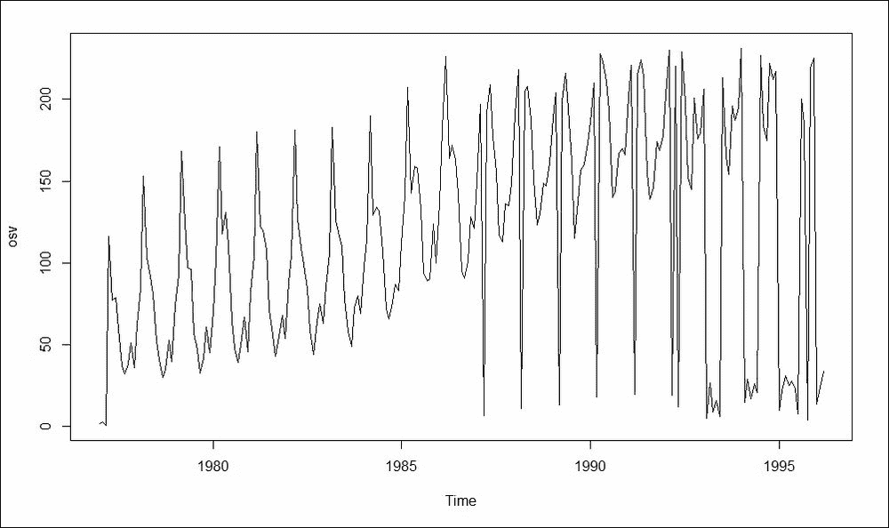

图 1:新西兰海外游客

这里，数据集没有分区！时间序列数据不能任意划分为训练和测试部分。原因很简单:如果我们有五个按时间顺序排列的观测值 *y1* 、 *y2* 、 *y3* 、 *y4* 、 *y5* ，我们认为撞击的顺序是 *y1→y2→y3→y4→y5* 、y1 、 *y2* 、 *y5* 的任意分割它不会有与三次连续观测相同的信息。因此，时间序列划分必须保持依赖结构；我们保留时间的最近部分作为测试数据。对于五个观测值的例子，我们选择了一个样本 *y1* 、 *y2* 、 *y3* ，作为测试数据。划分很简单，我们将在第 11 章、*集成时间序列模型*中介绍。

活体测试实验很少产生完整的观察结果。在可靠性分析以及生存分析/临床试验中，观察单位/患者直到预定时间，并记录是否发生特定事件，通常是失败或死亡。相当一部分的观察不会在预先决定的时间之前失败，并且分析不能等待所有单元都失败。缩减研究的一个原因可能是，所有机组都出现故障的时间会很长，在此之前继续研究的成本会很高。因此，我们留下了不完整的观察；我们只知道在研究被取消之前，单元的寿命至少持续预定的时间，并且感兴趣的事件可能在未来的某个时间发生。因此，一些观察值被删截，数据被称为删截数据。分析这种数据集需要特殊的统计方法。接下来我们将给出这类数据集的一个例子，稍后在第十章、*集合生存模型*中进行分析。

<title>Chapter 1. Introduction to Ensemble Techniques</title>  

## 原发性胆汁性肝硬化

survival package 中的`pbc`数据集是临床试验领域的基准数据集。梅奥诊所收集了与原发性胆汁性肝硬化(PBC)相关的数据。这项研究是在 1974 年至 1984 年间进行的。更多细节可以通过运行`pbc`，然后在 R 终端上运行`library(survival)`来找到。这里，事件的主要时间是 1986 年 7 月登记与死亡、移植或研究分析之间的天数，这在时间变量中被捕获。类似于生存研究，事件可能被删截，指标在列状态中。需要理解事件发生的时间，并考虑诸如`trt`、`age`、`sex`、`ascites`、`hepato`、`spiders`、`edema`、`bili`、`chol`、`albumin`、`copper`、`alk.phos`、`ast`、`trig`、`platelet`、`protime`和`stage`等变量。

到目前为止所讨论的八个数据集都有一个目标变量或一个回归变量/因变量，并且是监督学习问题的例子。另一方面，在实际案例中，我们只是试图理解数据，并从中找到有用的模式和组/群。当然，需要注意的是，聚类的目的是找到一个相同的组，并给它一个合理的标签。例如，如果我们试图根据汽车的特征(如长度、宽度、马力、发动机立方容量等)对汽车进行分组，我们可能会找到标记为 hatch、sedan 和 saloon 类别的组，而另一种聚类解决方案可能会产生基本、高级和运动变体组的标签。在聚类中提出的两个主要问题是组数量的选择和鲁棒聚类的形成。我们考虑一个来自`factoextra` R 包的简单数据集。

<title>Chapter 1. Introduction to Ensemble Techniques</title>  

## 多形状

来自`factoextra`包的`multishapes`数据集由三个变量组成:`x`、`y`和`shape`。它由不同的形状组成，每个形状形成一个簇。这里，我们有两个同时存在的圆形，两个平行的矩形/床，和一个在右下角的点群。散点图中也会添加异常值。一些简短的 R 代码给出了一个有用的显示:

```
> library(factoextra)
> data("multishapes")
> names(multishapes)
[1] "x"     "y"     "shape"
> table(multishapes$shape)
  1   2   3   4   5   6 
400 400 100 100  50  50 
> plot(multishapes[,1],multishapes[,2],col=multishapes[,3])
```

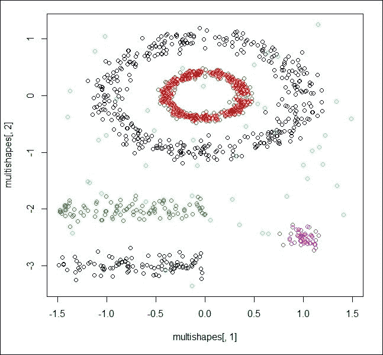

图 2:查找形状或组

该数据集包括一个名为 shape 的列，因为它是一个假设的数据集。在真正的聚类问题中，我们既没有聚类组指标，也没有只有两个变量的可视化奢侈品。在本书的后面，我们将看到集成聚类技术如何帮助克服决定聚类数量和聚类成员一致性的问题。

尽管这种情况并不经常发生，但是当微调不同的参数、拟合不同的模型以及其他技巧都无法找到有用的工作模型时，挫败感就会出现。这种情况的罪魁祸首通常是离群值。众所周知，一个孤立点会对一个潜在有用的模型造成严重破坏，检测到它们是至关重要的。迄今为止，参数和非参数异常值检测将是一个深入的专业问题。在复杂的情况下，识别将是一项不可完成的任务。使用集合异常值框架可以达成关于观察值是异常值的共识。为了考虑这一点，将考虑板刚度数据集。我们将在本书的结尾看到一个异常值是如何被确定下来的。

<title>Chapter 1. Introduction to Ensemble Techniques</title>  

## 纸板硬度

通过 stiff`data.frame`stiff`ACSWR`包中的可获得板刚度数据集。该数据集由 30 块板的四个刚度测量值组成。刚度的第一个测量值是通过向电路板发送冲击波获得的，第二个测量值是通过振动电路板获得的，其余两个测量值是通过静态测试获得的。识别多元数据集中异常值的一种快速方法是使用马氏距离函数。观察点离中心的距离越远，观察点就越有可能是异常值:

```
> data(stiff)
> sort(mahalanobis(stiff,colMeans(stiff),cov(stiff)),decreasing = TRUE)
 [1] 16.8474070168 12.2647549939  9.8980384087  7.6166439053
 [5]  6.2837628235  5.4770195915  5.2076098038  5.0557446013
 [9]  4.9883497928  4.5767867224  3.9900602512  3.5018290410
[13]  3.3979804418  2.9951752177  2.6959023813  2.5838186338
[17]  2.5385575365  2.3816049840  2.2191408683  1.9307771418
[21]  1.4876569689  1.4649908273  1.3980776252  1.3632123553
[25]  1.0792484215  0.7962095966  0.7665399704  0.6000128595
[29]  0.4635158597  0.1295713581
```

<title>Statistical/machine learning models</title>  

# 统计/机器学习模型

前面的部分通过真实数据集介绍了许多问题，现在我们将讨论一些对处理这些问题有用的标准模型变体。首先，我们建立所需的数学框架。

假设我们有 *n* 对独立的观察值，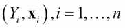，其中表示感兴趣的随机变量，也称为*因变量*，回归和，内生变量，等等。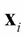是解释变量的关联向量，或独立/外生变量。解释向量将由 *k 个*元素组成，即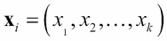。实现的数据形式为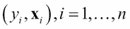，其中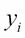为随机变量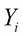的实现值(数据)。一个约定将贯穿于本书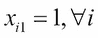中，这将处理截取项。我们假设观察值来自真实分布 *F* ，这是不完全已知的。通用回归模型，包括分类模型和回归模型，由以下各项规定:

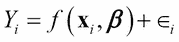

这里，函数 *f* 是未知函数，是回归参数，其捕获了对的影响。误差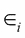是相关的不可观察误差项。可以应用不同的方法来模拟 Ys 和`xes`之间的关系。统计回归模型侧重于误差分布的完整规格，一般而言，函数形式将是线性的，如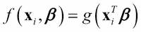所示。函数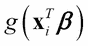是广义线性模型类中的连接函数。非参数和半参数回归模型更灵活，因为我们不对误差的概率分布加以限制。然而，灵活性是有代价的，这里我们需要更多的观察来做出有效的推断，尽管这个数字是不确定的，而且通常是主观的。

机器学习范式包括一些*黑盒*方法，我们在这个范式和非参数和半参数模型之间有一个健康的重叠。也提醒读者，黑盒在任何意义上都不意味着不科学。这些方法有坚实的数学基础，每次都是可重复的。接下来，我们快速回顾一些最重要的统计和机器学习模型，并通过前面讨论的数据集来说明它们。

<title>Statistical/machine learning models</title>  

## 逻辑回归模型

逻辑回归模型是一个二元分类模型，并且它是属于广义线性模型类的指数家族的成员。现在，让表示二进制标签:

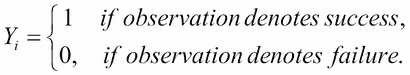

使用解释向量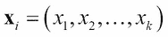中包含的信息，我们试图建立一个模型来帮助完成这项任务。逻辑回归模型如下:

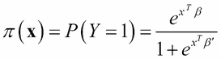

这里，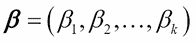是回归系数的向量。注意，logit 函数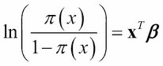在回归系数中是线性的，因此模型的名称是逻辑回归模型。逻辑回归模型可以等价地写成如下:

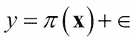

这里，是遵循伯努利分布的二进制误差项。有关更多信息，请参考 Tattar 等人(2016 年)的第 17 章。逻辑回归的参数估计需要**迭代重加权最小二乘** ( **IRLS** )算法，我们将使用`glm` R 函数来完成这项任务。我们将在本节的中使用甲状腺功能减退数据集。在上一节中，已经创建了训练和测试数据集以及公式，我们将从这一点继续。

### 甲状腺功能减退分类的逻辑回归分析

对于`hypothyroid`数据集，我们将`HT2_Train`作为训练数据集。测试数据集在`HT2_TestX`中被拆分为协变量矩阵，在`HT2_TestY`中被拆分为测试数据集的输出，而逻辑回归模型的公式在`HT2_Formula`中可用。首先，使用`glm`函数将逻辑回归模型拟合到训练数据集，并将拟合的模型命名为`LR_fit`，然后我们使用`summary(LR_fit)`检查模型拟合汇总。然后使用`predict`功能将拟合的模型应用于测试零件中的协变量数据，以创建`LR_Predict`。然后在`LR_Predict_Bin`中标记预测的概率，并将这些标记与实际的`testY_numeric`进行比较，从而获得总体精度:

```
> ntr <- nrow(HT2_Train) # Training size
> nte <- nrow(HT2_TestX) # Test size
> p <- ncol(HT2_TestX)
> testY_numeric <- as.numeric(HT2_TestY)
> LR_fit <- glm(HT2_Formula,data=HT2_Train,family = binomial())
Warning message:
glm.fit: fitted probabilities numerically 0 or 1 occurred 
> summary(LR_fit)
Call:
glm(formula = HT2_Formula, family = binomial(), data = HT2_Train)
Deviance Residuals: 
    Min       1Q   Median       3Q      Max  
-3.6390   0.0076   0.0409   0.1068   3.5127  
Coefficients:
             Estimate Std. Error z value Pr(>|z|)    
(Intercept) -8.302025   2.365804  -3.509 0.000449 ***
Age         -0.024422   0.012145  -2.011 0.044334 *  
GenderMALE  -0.195656   0.464353  -0.421 0.673498    
TSH         -0.008457   0.007530  -1.123 0.261384    
T3           0.480986   0.347525   1.384 0.166348    
TT4         -0.089122   0.028401  -3.138 0.001701 ** 
T4U          3.932253   1.801588   2.183 0.029061 *  
FTI          0.197196   0.035123   5.614 1.97e-08 ***
---
Signif. codes:  0 '***' 0.001 '**' 0.01 '*' 0.05 '.' 0.1 ' ' 1

(Dispersion parameter for binomial family taken to be 1)

    Null deviance: 609.00  on 1363  degrees of freedom
Residual deviance: 181.42  on 1356  degrees of freedom
AIC: 197.42
Number of Fisher Scoring iterations: 9
> LR_Predict <- predict(LR_fit,newdata=HT2_TestX,type="response")
> LR_Predict_Bin <- ifelse(LR_Predict>0.5,2,1)
> LR_Accuracy <- sum(LR_Predict_Bin==testY_numeric)/nte
> LR_Accuracy
[1] 0.9732704
```

从拟合的 GLM 的摘要(线`summary(LR_fit)`后的输出)可以看出，我们有四个重要变量`in Age`、`TT4`、`T4U`和`FTI`。使用`predict`函数，我们将拟合的模型应用于`HT2_TestX`中的未知测试用例，并与实际情况进行比较，发现准确率为 97.33%。因此，逻辑回归很容易在 R 软件中使用。

<title>Statistical/machine learning models</title>  

## 神经网络

逻辑回归可能显得受限，因为它只允许通过链接函数对协变量产生线性影响。线性假设可能不成立，并且在大多数实际情况下，我们没有足够的信息来指定非线性关系的函数形式。因此，我们所知道的是，很可能存在一种未知的非线性关系。神经网络是逻辑回归的非线性推广，这涉及到两个重要的组成部分:隐藏神经元和学习率。我们将首先修改神经网络的结构。

在神经网络中，输入变量被认为是第一层神经元，输出变量被认为是最后一层神经元。神经网络模型的结构可以使用 R 包`NeuralNetTools`可视化。假设我们有三个输入变量和两个隐藏层，每个包含两个隐藏神经元。这里，我们有一个四层的神经网络。下一个代码段显示了一个神经网络的结构，它有三个输入变量、两个隐藏层中的两个隐藏神经元和一个输出变量:

```
> library(NeuralNetTools) 
> plotnet(rep(0,17),struct=c(3,2,2,1))
> title("A Neural Network with Two Hidden Layers")
```

我们发现 R 包`NeuralNetTools`在可视化神经网络的结构方面非常有用。使用核心 R 包`nnet`构建的神经网络也可以使用`NeuralNetTools::plotnet`函数可视化。`plotnet`功能通过`struct`选项建立一个神经网络，其结构由第一层的三个神经元、第二层和第三层各两个神经元以及最终输出层的一个神经元组成。在`rep(0,17)`中，沿弧线的权重设置为零:

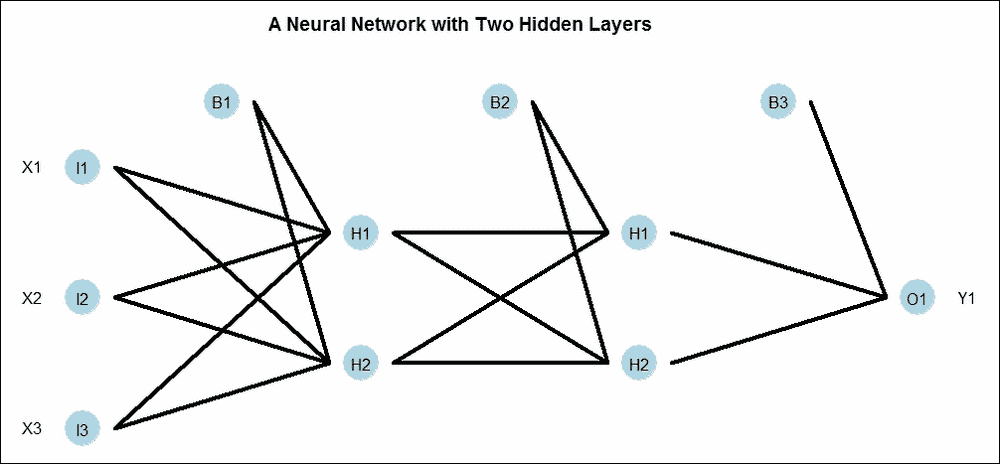

图 3:神经网络的结构

在上图中，我们有四层神经网络。第一层由 **B1** (偏置)**【I1(X1)****I2(X2)****I3(X3)**组成。第二层由 **B2** (第一隐层的偏置) **H1** 、 **H2** 三个神经元组成。注意，偏置 **B2** 不接收来自第一隐藏层的任何输入。接下来，每个神经元接收来自上一层的每个神经元的总体输入，这里是 **B1** 、 **X1** 、 **X2** 和 **X3** 。然而，第一隐藏层的 **H1** 和 **H2** 将从 **B1** 、 **X1** 、 **X2** 和 **X3** 接收不同的聚合输入。适当的权重在网络的每个弧上起作用，并且权重形成神经网络的参数；也就是说， **H1** (第一层)的到来会是什么样子

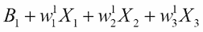

有效到达是通过*传递函数*实现的。传递函数可以是恒等函数、s 形函数等等。类似地，到达第一层的第二个神经元是

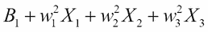

。推而广之， **B2** 、 **H1** 、 **H2** (第一层)将作为第二隐含层的输入， **B3** 、 **H1** 、 **H2** 将作为最终输出的输入。在神经网络的每个阶段，我们都有权重。需要以这样的方式确定权重，使得预测输出 **O1** 和真实 **Y1** 之间的差异尽可能小。请注意，逻辑回归是神经网络的一个特例，可以通过直接移除输出层中的所有隐藏层和输入层引线来看出。神经网络将适用于甲状腺功能减退问题。

### 用于甲状腺功能减退分类的神经网络

我们使用同名软件包中的`nnet`函数来建立甲状腺分类问题的神经网络。公式、训练和测试数据集像以前一样继续。精确度计算遵循与逻辑回归中的部分类似的路线。使用`NeuralNetTools`包中的`plotnet`图形功能可视化拟合的神经网络:

```
> set.seed(12345)
> NN_fit <- nnet(HT2_Formula,data = HT2_Train,size=p,trace=FALSE)
> NN_Predict <- predict(NN_fit,newdata=HT2_TestX,type="class")
> NN_Accuracy <- sum(NN_Predict==HT2_TestY)/nte
> NN_Accuracy
[1] 0.9827044025
> plotnet(NN_fit)
> title("Neural Network for Hypothyroid Classification")
```

这里，准确度是 98.27%，这是对逻辑回归模型的改进。下图给出了拟合模型的直观显示。我们已经使用`set.seed(12345)`在`12345`固定了神经网络参数随机初始化的种子，因此结果在阅读器端是可再现的。对于集合建模来说，这是一个有趣的案例。不同的初始种子——读者可以随意摆弄——将导致不同的准确性。有时，您将获得比本节中考虑的任何模型都低的精度，而在其他时候，您将获得最高的精度。种子的任意选择导致了一个重要的问题，即哪种解决方案是有用的。因为种子是任意的，所以不会出现好种子或坏种子的问题。在这种情况下，如果一个模型给你一个更高的精确度，它不一定意味着什么:

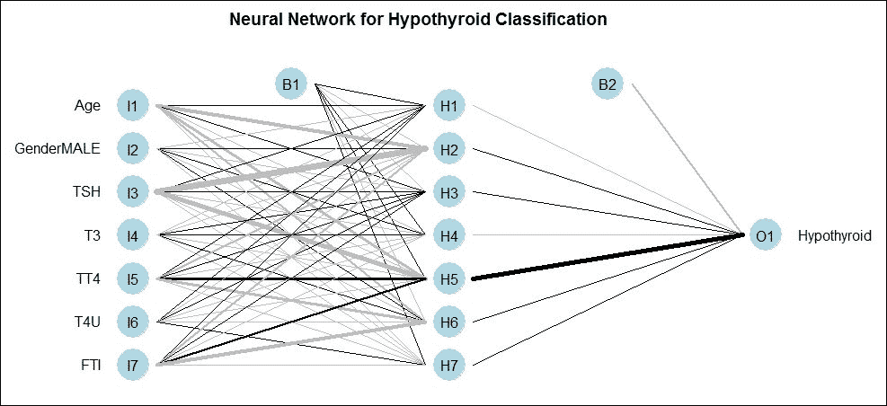

图 4:用于甲状腺功能减退分类的神经网络

<title>Statistical/machine learning models</title>  

## 朴素贝叶斯分类器

朴素贝叶斯分类器是基于贝叶斯公式的简单实现。它基于简单的经验和条件概率，如实际数据所示。除了最简单的观察独立性假设，我们在使用这个模型时没有任何限制。

### 甲状腺功能减退分类的朴素贝叶斯方法

使用来自`e1071` R 包的`naiveBayes`函数来拟合朴素贝叶斯分类器。使用两个函数`predict`和`sum`进行预测和精度评估:

```
> NB_fit <- naiveBayes(HT2_Formula,data=HT2_Train)
> NB_predict <- predict(NB_fit,newdata=HT2_TestX)
Warning message:
In data.matrix(newdata) : NAs introduced by coercion
> NB_Accuracy <- sum(NB_predict==HT2_TestY)/nte
> NB_Accuracy
[1] 0.9732704403
```

朴素贝叶斯分类器的准确率为 97.33%，与逻辑回归模型相同，但低于神经网络提供的准确率。我们在这里注意到，这只是一个巧合，这种方法的准确性和逻辑回归是相同的。

<title>Statistical/machine learning models</title>  

## 决策树

Breiman 和 Quinlan 主要开发了决策树，自 20 世纪 80 年代以来，决策树已经发展了很多。如果因变量是连续的，决策树将是一棵回归树，如果它是分类变量，它将是一棵分类树。当然，我们也可以有一棵生存树。决策树将是受益于集成技术的主要模型，这在整本书中都可以看到。

考虑下图中给出的回归树。我们可以看到有三个输入变量，分别是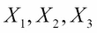，输出变量是 *Y* 。严格地说，决策树不会显示用于构建该树的所有变量。在这种树形结构中，决策树通常是上下颠倒显示的。我们有四个终端节点。如果条件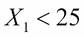得到满足，我们移到树的右侧，得出平均 *Y* 值为 40 的结论。如果条件不满足，我们向左移动，并检查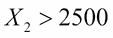是否成立。如果这个条件不满足，我们移到树的左侧，得出平均 *Y* 值为 100 的结论。满足这个条件后，我们移到右边，如果分类变量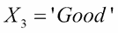，平均 *Y* 值将是 250，否则为 10。该决策树也可以以等式的形式捕获，如下所示:

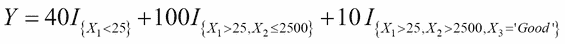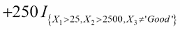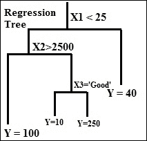

图 5:回归树

统计学家 Terry Therneau 开发了`rpart` R 包。

### 甲状腺功能减退分类决策树

使用来自`rpart`包的`rpart`函数,我们为与前面的分区数据相同的公式构建一个分类树。构造的树可以用 plot 函数可视化，变量名用 text 函数浮雕在树上。拟合分类树的等式(见图*甲状腺功能减退*分类树)如下:


预测和准确性的实现方式与前面提到的类似:

```
> CT_fit <- rpart(HT2_Formula,data=HT2_Train)
> plot(CT_fit,uniform=TRUE)
> text(CT_fit)
> CT_predict <- predict(CT_fit,newdata=HT2_TestX,type="class")
> CT_Accuracy <- sum(CT_predict==HT2_TestY)/nte
> CT_Accuracy
[1] 0.9874213836
```

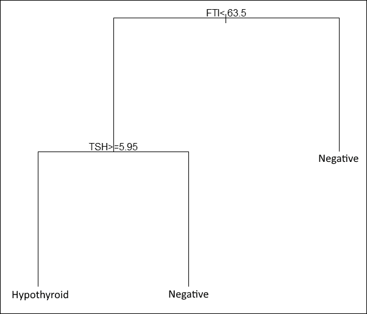

图 6:甲状腺功能减退的分类树

因此，分类树给出了 98.74%的准确度，这是迄今为止考虑的四个模型中最好的。接下来，我们将考虑最后一个模型，支持向量机。

<title>Statistical/machine learning models</title>  

## 支持向量机

**支持向量机**，俗称 **SVM** ，是一类重要的机器学习技术。理论上，SVM 可以采用无限数量的特征/协变量，并建立适当的分类或回归支持向量机。

### SVM 对甲状腺功能减退的分类

`e1071`包中的`svm`函数将有助于在甲状腺数据集上构建一个`SVM`分类器。按照惯例，我们在 R 会话中有以下输出:

```
> SVM_fit <- svm(HT2_Formula,data=HT2_Train)
> SVM_predict <- predict(SVM_fit,newdata=HT2_TestX,type="class")
> SVM_Accuracy <- sum(SVM_predict==HT2_TestY)/nte
> SVM_Accuracy
[1] 0.9842767296
```

SVM 技术给出了 98.43%的准确度，这是迄今为止建立的模型中第二好的。

在下一节中，我们将分别运行 Waveform、German Credit、Iris 和 Pima Indians 糖尿病问题数据集的五个分类模型。

<title>The right model dilemma!</title>  

# 正确的模式困境！

在上一节中，我们为`Hypothyroid`数据集运行了五个分类模型。这里的任务是对另外四个数据集重复这个练习。在适当的地方修改代码并重复练习四次将是一项非常费力的任务。因此，为了避免这个问题，我们将创建一个名为`Multiple_Model_Fit`的新函数。这个函数将接受四个参数:`formula`、`train`、`testX`和`testY`。已经为五个数据集的每一个设置了四个参数。然后，以一种概括前一节中针对五个模型中的每一个模型的步骤的方式来设置函数。

该函数继续创建一个矩阵，其第一列由型号名称组成，而第二列由精度组成。该矩阵作为该函数的输出返回:

```
> Multiple_Model_Fit <- function(formula,train,testX,testY){
+   ntr <- nrow(train) # Training size
+   nte <- nrow(testX) # Test size
+   p <- ncol(testX)
+   testY_numeric <- as.numeric(testY)
+   
+   # Neural Network
+   set.seed(12345)
+   NN_fit <- nnet(formula,data = train,size=p,trace=FALSE)
+   NN_Predict <- predict(NN_fit,newdata=testX,type="class")
+   NN_Accuracy <- sum(NN_Predict==testY)/nte
+   
+   # Logistic Regressiona
+   LR_fit <- glm(formula,data=train,family = binomial())
+   LR_Predict <- predict(LR_fit,newdata=testX,type="response")
+   LR_Predict_Bin <- ifelse(LR_Predict>0.5,2,1)
+   LR_Accuracy <- sum(LR_Predict_Bin==testY_numeric)/nte
+   
+   # Naive Bayes
+   NB_fit <- naiveBayes(formula,data=train)
+   NB_predict <- predict(NB_fit,newdata=testX)
+   NB_Accuracy <- sum(NB_predict==testY)/nte
+   
+   # Decision Tree
+   CT_fit <- rpart(formula,data=train)
+   CT_predict <- predict(CT_fit,newdata=testX,type="class")
+   CT_Accuracy <- sum(CT_predict==testY)/nte
+   
+   # Support Vector Machine
+   svm_fit <- svm(formula,data=train)
+   svm_predict <- predict(svm_fit,newdata=testX,type="class")
+   svm_Accuracy <- sum(svm_predict==testY)/nte
+   
+   Accu_Mat <- matrix(nrow=5,ncol=2)
+   Accu_Mat[,1] <- c("Neural Network","Logistic Regression","Naive Bayes",
+                 "Decision Tree","Support Vector Machine")
+   Accu_Mat[,2] <- round(c(NN_Accuracy,LR_Accuracy,NB_Accuracy,
+                     CT_Accuracy,svm_Accuracy),4)
+   return(Accu_Mat)
+   
+ }
```

`Multiple_Model_Fit`现在应用于`Hypothyroid`数据集，可以看到结果与前面的部分一致:

```
> Multiple_Model_Fit(formula=HT2_Formula,train=HT2_Train,
+                    testX=HT2_TestX,
+                    testY=HT2_TestY)
     [,1]                     [,2]    
[1,] "Neural Network"         "0.989" 
[2,] "Logistic Regression"    "0.9733"
[3,] "Naive Bayes"            "0.9733"
[4,] "Decision Tree"          "0.9874"
[5,] "Support Vector Machine" "0.9843"
```

然后将`Multiple_Model_Fit`函数应用于其他四个分类数据集:

```
> Multiple_Model_Fit(formula=Waveform_DF_Formula,train=Waveform_DF_Train,
+                    testX=Waveform_DF_TestX,
+                    testY=Waveform_DF_TestY)
     [,1]                     [,2]    
[1,] "Neural Network"         "0.884" 
[2,] "Logistic Regression"    "0.8873"
[3,] "Naive Bayes"            "0.8601"
[4,] "Decision Tree"          "0.8435"
[5,] "Support Vector Machine" "0.9171"
> Multiple_Model_Fit(formula=GC2_Formula,train=GC2_Train,
+                    testX=GC2_TestX,
+                    testY =GC2_TestY )
     [,1]                     [,2]    
[1,] "Neural Network"         "0.7252"
[2,] "Logistic Regression"    "0.7572"
[3,] "Naive Bayes"            "0.8083"
[4,] "Decision Tree"          "0.7061"
[5,] "Support Vector Machine" "0.754" 
> Multiple_Model_Fit(formula=ir2_Formula,train=ir2_Train,
+                    testX=ir2_TestX,
+                    testY=ir2_TestY)
     [,1]                     [,2]
[1,] "Neural Network"         "1" 
[2,] "Logistic Regression"    "1" 
[3,] "Naive Bayes"            "1" 
[4,] "Decision Tree"          "1" 
[5,] "Support Vector Machine" "1"  
> Multiple_Model_Fit(formula=PID_Formula,train=PimaIndiansDiabetes_Train,
+                    testX=PimaIndiansDiabetes_TestX,
+                    testY=PimaIndiansDiabetes_TestY)
     [,1]                     [,2]    
[1,] "Neural Network"         "0.6732"
[2,] "Logistic Regression"    "0.751" 
[3,] "Naive Bayes"            "0.7821"
[4,] "Decision Tree"          "0.7588"
[5,] "Support Vector Machine" "0.7665"
```

下表总结了每个数据集的结果:

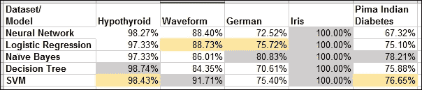

表 1:五个数据集的五个模型的准确性

`iris`数据集是一个简单明了的问题，因此五个模型中的每一个都给了我们 100%的测试数据准确性。这个数据集将不会被进一步研究。

对于每个数据集，我们用灰色突出显示精度最高的像元，用黄色突出显示精度次高的像元。

这就是建模的困境。朴素贝叶斯方法对于`German`和`Pima Indian Diabetes`数据集来说是最好的。决策树为`Hypothyroid`数据集提供了最高的准确性，而 SVM 为`Waveform`提供了最好的结果。第二名是两次被逻辑回归获得，两次被 SVM 获得。然而，我们也知道，根据初始种子和隐藏神经元的数量，神经网络也有望在一些数据集上表现最好。然后，我们还必须考虑不同分区的结果是否会不同。

正是在这样的实际情况下，我们更希望有一个单一的方法来确保合理的属性。使用`Hypothyroid`数据集，每个模型的准确率都是 97%或更高，任何模型都不会出错。然而，在`German`和`Pima Indian Diabetes`问题中，最高准确率分别为 80%和 78%。如果我们能很好地利用所有的模型，建立一个单一的统一的模型，并提高精确度，那就更好了。

<title>An ensemble purview</title>  

# 一个合奏的范围

R 包是集合机器学习方法的核心。它提供了一个大框架，我们还可以将不同的统计和机器学习模型放在一起，以创建一个整体。对于作者笔记本电脑上的最新版本的包，`caret`包提供了对以下模型的访问:

```
> library(caret)
> names(getModelInfo())
  [1] "ada"                 "AdaBag"              "AdaBoost.M1" 
  [4] "adaboost"            "amdai"               "ANFIS" 
  [7] "avNNet"              "awnb"                "awtan"        

[229] "vbmpRadial"          "vglmAdjCat"          "vglmContRatio 
[232] "vglmCumulative"      "widekernelpls"       "WM" 
[235] "wsrf"                "xgbLinear"           "xgbTree" 
[238] "xyf"               
```

```

图 7:插入符号提供安装所需 R 包的消息

```

您需要键入数字`1`并继续。软件包将被安装和加载，程序将继续运行。了解集合方法的众多选择是有益的。这里提供了一个简单的堆叠集合分析模型的方法，细节将在本书后面展开。

对于`Hypothyroid`数据集，我们在五个模型之间获得了平均 98%的高精度。`Waveform`数据集的平均准确率约为 88%，而`German`信用数据的平均准确率为 75%。我们将努力提高该数据集的准确性。将尝试使用三种模型来提高准确性:朴素贝叶斯、逻辑回归和分类树。首先，我们需要将数据划分为三个部分:训练、测试和堆栈:

```
> load("../Data/GC2.RData")
> set.seed(12345)
> Train_Test_Stack <- sample(c("Train","Test","Stack"),nrow(GC2),replace = TRUE,prob = c(0.5,0.25,0.25))
> GC2_Train <- GC2[Train_Test_Stack=="Train",]
> GC2_Test <- GC2[Train_Test_Stack=="Test",]
> GC2_Stack <- GC2[Train_Test_Stack=="Stack",]The dependent and independent variables will be marked next in character vectors for programming convenient. 

> # set label name and Exhogenous
> Endogenous <- 'good_bad'
> Exhogenous <- names(GC2_Train)[names(GC2_Train) != Endogenous]
```

该模型将首先建立在训练数据上，并且将使用曲线下面积的度量来评估准确性，该曲线是 ROC。首先设置控制参数，然后使用训练数据集创建三个模型，即朴素贝叶斯、分类树和逻辑回归:

```
> # Creating a caret control object for the number of 
> # cross-validations to be performed
> myControl <- trainControl(method='cv', number=3, returnResamp='none')
> # train all the ensemble models with GC2_Train
> model_NB <- train(GC2_Train[,Exhogenous], GC2_Train[,Endogenous], 
+                    method='naive_bayes', trControl=myControl)
> model_rpart <- train(GC2_Train[,Exhogenous], GC2_Train[,Endogenous], 
+                      method='rpart', trControl=myControl)
> model_glm <- train(GC2_Train[,Exhogenous], GC2_Train[,Endogenous], 
+                        method='glm', trControl=myControl)
```

接下来进行测试和堆栈块的预测。我们沿着测试和堆栈数据帧存储预测的概率:

```
> # get predictions for each ensemble model for two last datasets
> # and add them back to themselves
> GC2_Test$NB_PROB <- predict(object=model_NB, GC2_Test[,Exhogenous],
+                              type="prob")[,1]
> GC2_Test$rf_PROB <- predict(object=model_rpart, GC2_Test[,Exhogenous],
+                             type="prob")[,1]
> GC2_Test$glm_PROB <- predict(object=model_glm, GC2_Test[,Exhogenous],
+                                  type="prob")[,1]
> GC2_Stack$NB_PROB <- predict(object=model_NB, GC2_Stack[,Exhogenous],
+                               type="prob")[,1]
> GC2_Stack$rf_PROB <- predict(object=model_rpart, GC2_Stack[,Exhogenous],
+                              type="prob")[,1]
> GC2_Stack$glm_PROB <- predict(object=model_glm, GC2_Stack[,Exhogenous],
+                                   type="prob")[,1]
```

ROC 是模型评估的一个重要的度量。ROC 下的面积越高，模型就越好。请注意，这些测量值或任何其他测量值都不会与之前拟合的模型相同，因为数据已经改变:

```
> # see how each individual model performed on its own
> AUC_NB <- roc(GC2_Test[,Endogenous], GC2_Test$NB_PROB )
> AUC_NB$auc
Area under the curve: 0.7543
> AUC_rf <- roc(GC2_Test[,Endogenous], GC2_Test$rf_PROB )
> AUC_rf$auc
Area under the curve: 0.6777
> AUC_glm <- roc(GC2_Test[,Endogenous], GC2_Test$glm_PROB )
> AUC_glm$auc
Area under the curve: 0.7446
```

对于`test`数据集，我们可以看到朴素贝叶斯、分类树和逻辑回归的曲线下面积分别为`0.7543`、`0.6777`和`0.7446`。如果我们以某种形式把预测值放在一起，并导致精确度的增加，那么集合技术的目的就达到了。因此，我们考虑三种模型下的新预测概率，并将它们附加到堆叠数据框中。这三列现在将被视为新的输入向量。然后，我们构建一个朴素贝叶斯模型，这是一个任意的选择，您可以为堆叠数据框尝试任何其他模型(不一定局限于其中的一个)。然后可以预测和计算 AUC:

```
> # Stacking it together
> Exhogenous2 <- names(GC2_Stack)[names(GC2_Stack) != Endogenous]
> Stack_Model <- train(GC2_Stack[,Exhogenous2], GC2_Stack[,Endogenous], 
+                      method='naive_bayes', trControl=myControl)
> Stack_Prediction <- predict(object=Stack_Model,GC2_Test[,Exhogenous2],type="prob")[,1]
> Stack_AUC <- roc(GC2_Test[,Endogenous],Stack_Prediction)
> Stack_AUC$auc
Area under the curve: 0.7631
```

堆叠数据观察的 AUC 高于任何早期模型，这是一个改进。

对于批判性思考者来说，将会出现一大堆问题。为什么这种技术会起作用？会不会导致所有可能情况下的即兴发挥？如果是，简单地添加新的模型预测会导致进一步的改进吗？如果没有，如何挑选基本模型，以便我们可以合理地确信即兴创作？车型的选择有什么限制？在本书中，我们将提供这些问题的解决方案。在下一节中，我们将快速查看一些有助于评估模型性能的有用的统计测试。

<title>Complementary statistical tests</title>  

# 补充统计检验

这里，一个模型被选择而不是另一个看似合理的模型。一个模型的准确性似乎比另一个高。一个模型的 ROC 曲线下面积 ( **AUC** )大于另一个模型。但是，仅仅把结论建立在单纯的数字上是不合适的。从统计推断的角度来看，得出这些数字是否有意义的结论是很重要的。在分析世界中，关键是我们利用统计测试来验证主张/假设。使用统计检验的一个原因是，概率可能非常违反直觉，在纳入机会变化后，表面上看起来的情况可能不是这样。例如，如果一枚公平的硬币被投掷 100 次，认为正面的数量必须正好是 50 是轻率的。因此，如果一枚硬币有 45 个头像，我们需要考虑头像数量也可能少于 50 的概率变化。当我们处理不确定的数据时，必须始终保持谨慎。这里举几个例子。两个变量可能看起来相互独立，相关性也可能几乎等于零。但是，应用相关性检验可能会得出相关性不明显为零的结论。由于我们将在本文中进行大量的采样和重采样，我们将查看相关的测试。

<title>Complementary statistical tests</title>  

## 排列测试

假设我们有两个过程，A 和 B，已知这两个过程的方差相等，尽管未知。来自过程 A 的三个独立观察结果产生 18、20 和 22 的产率，而来自过程 B 的三个独立观察结果产生 24、26 和 28 的产率。假设收益率服从正态分布，我们想检验过程 A 和过程 B 的均值是否相同。这是应用 t-检验的合适情况，因为观察的数量较少。`t.test`函数的一个应用表明，这两种方法互不相同，而且直观上似乎是这样。

现在，零假设下的假设是均值相等，方差未知，假设两个过程下的均值相等。因此，我们有真正的理由相信来自过程 A 的观察很可能也发生在过程 B 中，反之亦然。因此，我们可以将流程 B 中的一个观察值与流程 A 交换，并重新计算 t-test。可以对两个样本的所有可能排列重复该过程。一般来说，如果我们有来自人口 1 的 m 个样本和来自人口 2 的 n 个样本，我们可以


不同的样本和尽可能多的测试。总体测试可以基于这样的排列样本，这样的测试称为**排列测试**。

对于流程 A 和 B 的观察值，我们将首先应用 t 检验，然后应用排列检验。`t.test`在核心`stats`包中可用，置换 t-test 取自`perm`包:

```
> library(perm)
> x <- c(18,20,22); y <- c(24,26,28)
> t.test(x,y,var.equal = TRUE)
Two Sample t-test
data:  x and y
t = -3.6742346, df = 4, p-value = 0.02131164
alternative hypothesis: true difference in means is not equal to 0
95 percent confidence interval:
 -10.533915871  -1.466084129
sample estimates:
mean of x mean of y 
       20        26 
```

较小的 p 值表明过程 A 和过程 B 的均值不相等。因此，我们现在应用来自`perm`包的置换测试`permTS`:

```
> permTS(x,y)
Exact Permutation Test (network algorithm)
data:  x and y
p-value = 0.1
alternative hypothesis: true mean x - mean y is not equal to 0
sample estimates:
mean x - mean y 
             -6 
```

p 值现在为 0.1，这意味着置换测试得出的结论是过程的平均值相等。这是不是意味着排列检验总会得出这个结论，与 t 检验相矛盾？答案在下一段代码中给出:

```
> x2 <- c(16,18,20,22); y2 <- c(24,26,28,30)
> t.test(x2,y2,var.equal = TRUE)
Two Sample t-test
data:  x2 and y2
t = -4.3817805, df = 6, p-value = 0.004659215
alternative hypothesis: true difference in means is not equal to 0
95 percent confidence interval:
 -12.46742939  -3.53257061
sample estimates:
mean of x mean of y 
       19        27 
> permTS(x2,y2)
Exact Permutation Test (network algorithm)
data:  x2 and y2
p-value = 0.02857143
alternative hypothesis: true mean x2 - mean y2 is not equal to 0
sample estimates:
mean x2 - mean y2 
               -8 
```

<title>Complementary statistical tests</title>  

## 卡方检验和麦克内马检验

我们有五个模型用于甲状腺功能减退测试。然后，我们计算了准确度，并对数字感到满意。让我们首先看看拟合模型产生的错误的数量。我们在测试分区中有 636 个观察值，其中 42 个对甲状腺功能减退问题测试为阳性。请注意，如果我们将所有患者标记为阴性，我们将得到 *1-42/636 = 0.934* 的准确度，或者大约 93.4%。使用 table 函数，我们将实际值与预测值进行比较，看看拟合模型出错的频率。我们在这里注意到，将甲状腺功能减退病例识别为相同，将阴性病例识别为阴性是正确的预测，而将甲状腺功能减退病例标记为阴性，反之则导致错误。对于每个模型，我们查看错误分类错误:

```
> table(LR_Predict_Bin,testY_numeric)
              testY_numeric
LR_Predict_Bin   1   2
             1  32   7
             2  10 587
> table(NN_Predict,HT2_TestY)
             HT2_TestY
NN_Predict    hypothyroid negative
  hypothyroid          41       22
  negative              1      572
> table(NB_predict,HT2_TestY)
             HT2_TestY
NB_predict    hypothyroid negative
  hypothyroid          33        8
  negative              9      586
> table(CT_predict,HT2_TestY)
             HT2_TestY
CT_predict    hypothyroid negative
  hypothyroid          38        4
  negative              4      590
> table(SVM_predict,HT2_TestY)
             HT2_TestY
SVM_predict   hypothyroid negative
  hypothyroid          34        2
  negative              8      592
```

从错误分类表中，我们可以看到神经网络正确识别了 42 例甲状腺功能减退中的 41 例，但它也错误地识别了更多的甲状腺功能减退病例。由此产生的问题是，拟合模型的正确预测是否只是偶然发生，或者它们是否依赖于真理并可以被解释。为了测试这一点，在假设框架中，我们想要测试实际值和实际值的预测值是否相互独立或相互依赖。从技术上讲，零假设是预测独立于实际，如果一个模型解释了真相，零假设必须被拒绝。我们应该得出结论，拟合的模型预测依赖于事实。我们在这里部署了两种解决方案，卡方检验和麦克内马检验:

```
> chisq.test(table(LR_Predict_Bin,testY_numeric))
Pearson's Chi-squared test with Yates' continuity correction
data:  table(LR_Predict_Bin, testY_numeric)
X-squared = 370.53501, df = 1, p-value < 0.00000000000000022204
> chisq.test(table(NN_Predict,HT2_TestY))
Pearson's Chi-squared test with Yates' continuity correction
data:  table(NN_Predict, HT2_TestY)
X-squared = 377.22569, df = 1, p-value < 0.00000000000000022204
> chisq.test(table(NB_predict,HT2_TestY))
Pearson's Chi-squared test with Yates' continuity correction
data:  table(NB_predict, HT2_TestY)
X-squared = 375.18659, df = 1, p-value < 0.00000000000000022204
> chisq.test(table(CT_predict,HT2_TestY))
Pearson's Chi-squared test with Yates' continuity correction
data:  table(CT_predict, HT2_TestY)
X-squared = 498.44791, df = 1, p-value < 0.00000000000000022204
> chisq.test(table(SVM_predict,HT2_TestY))
Pearson's Chi-squared test with Yates' continuity correction
data:  table(SVM_predict, HT2_TestY)
X-squared = 462.41803, df = 1, p-value < 0.00000000000000022204
> mcnemar.test(table(LR_Predict_Bin,testY_numeric))
McNemar's Chi-squared test with continuity correction
data:  table(LR_Predict_Bin, testY_numeric)
McNemar's chi-squared = 0.23529412, df = 1, p-value = 0.6276258
> mcnemar.test(table(NN_Predict,HT2_TestY))
McNemar's Chi-squared test with continuity correction
data:  table(NN_Predict, HT2_TestY)
McNemar's chi-squared = 17.391304, df = 1, p-value = 0.00003042146
> mcnemar.test(table(NB_predict,HT2_TestY))
McNemar's Chi-squared test with continuity correction
data:  table(NB_predict, HT2_TestY)
McNemar's chi-squared = 0, df = 1, p-value = 1
> mcnemar.test(table(CT_predict,HT2_TestY))
McNemar's Chi-squared test
data:  table(CT_predict, HT2_TestY)
McNemar's chi-squared = 0, df = 1, p-value = 1
> mcnemar.test(table(SVM_predict,HT2_TestY))
McNemar's Chi-squared test with continuity correction
data:  table(SVM_predict, HT2_TestY)
McNemar's chi-squared = 2.5, df = 1, p-value = 0.1138463
```

卡方检验提供的答案清楚地表明，每个拟合模型的预测不是偶然的。它还表明，甲状腺功能减退症病例的预测与以及阴性病例一样，是拟合模型所期望的。麦克内马检验的解释和结论留给读者。分类问题的最后一个重要指标是 ROC 曲线，这将在下面讨论。

<title>Complementary statistical tests</title>  

## ROC 试验

ROC 曲线是对模型性能的假正和真负测量的重要改进。详细解释请参考 Tattar 等人(2017)的第 9 章。ROC 曲线基本上绘制了真阳性率对假阳性率，我们测量了拟合模型的 AUC。

ROC 测试试图实现的主要目标如下。假设模型 1 给出了 0.89 的 AUC，模型 2 给出了 0.91。使用简单的 AUC 标准，我们直接得出结论，模型 2 优于模型 1。但是，由此产生的一个重要问题是，0.91 是否明显高于 0.89。来自`pROC` R 包的`roc.test`，在这里提供了答案。对于神经网络和分类树，下面的 R 段给出了所需的答案:

```
> library(pROC)
> HT_NN_Prob <- predict(NN_fit,newdata=HT2_TestX,type="raw")
> HT_NN_roc <- roc(HT2_TestY,c(HT_NN_Prob))
> HT_NN_roc$auc
Area under the curve: 0.9723826
> HT_CT_Prob <- predict(CT_fit,newdata=HT2_TestX,type="prob")[,2]
> HT_CT_roc <- roc(HT2_TestY,HT_CT_Prob)
> HT_CT_roc$auc
Area under the curve: 0.9598765
> roc.test(HT_NN_roc,HT_CT_roc)
	DeLong's test for two correlated ROC curves
data:  HT_NN_roc and HT_CT_roc
Z = 0.72452214, p-value = 0.4687452
alternative hypothesis: true difference in AUC is not equal to 0
sample estimates:
 AUC of roc1  AUC of roc2 
0.9723825557 0.9598765432 
```

由于 p 值非常大，我们得出结论，两种模型的 AUC 没有显著差异。

统计测试至关重要，我们建议在合适的时候使用。本章强调的概念将在本书的其余部分更详细地阐述。

<title>Summary</title>  

# 总结

本章首先介绍了一些最重要的数据集，这些数据集将在本书的其余部分使用。这些数据集涵盖了一系列分析问题，包括分类、回归、时间序列、生存、聚类以及识别异常值非常重要的数据集。然后在统计/机器学习模型部分介绍了重要的分类模型系列。随着各种模型的引入，我们立即看到了缺点，因为我们没有一个适合所有季节的模型。模型性能因数据集而异。根据初始化的不同，某些模型(如神经网络)的性能会受到影响。因此，需要找到一种方法来确保模型在大多数情况下都可以得到改进。

这为系综法铺平了道路，这就是本书的标题。我们将在本书的其余部分详细阐述这种方法。本章以快速统计测试结束，这将有助于进行模型比较。重采样是集成方法的核心，我们将在下一章讨论重要的刀切和自举方法。