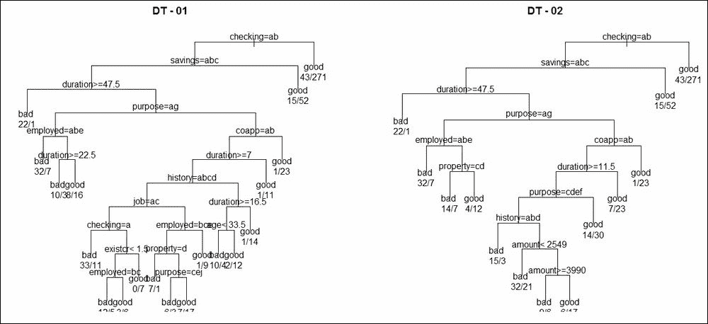
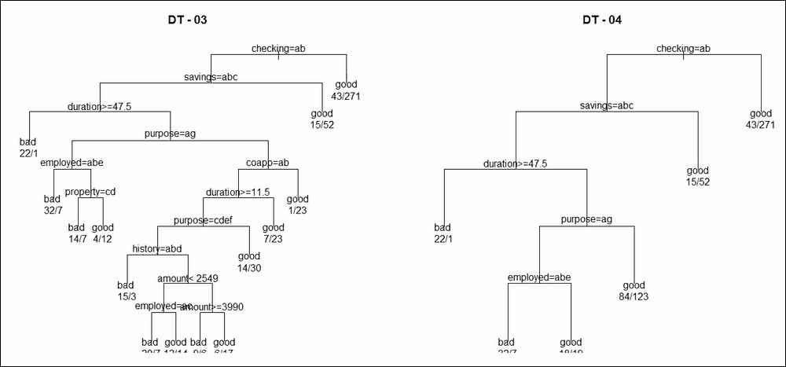
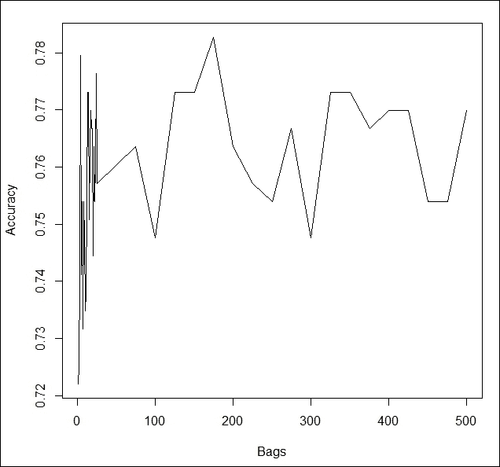
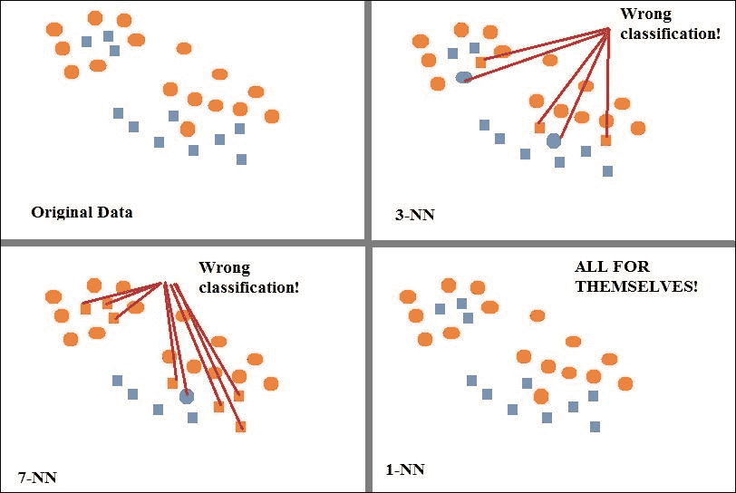
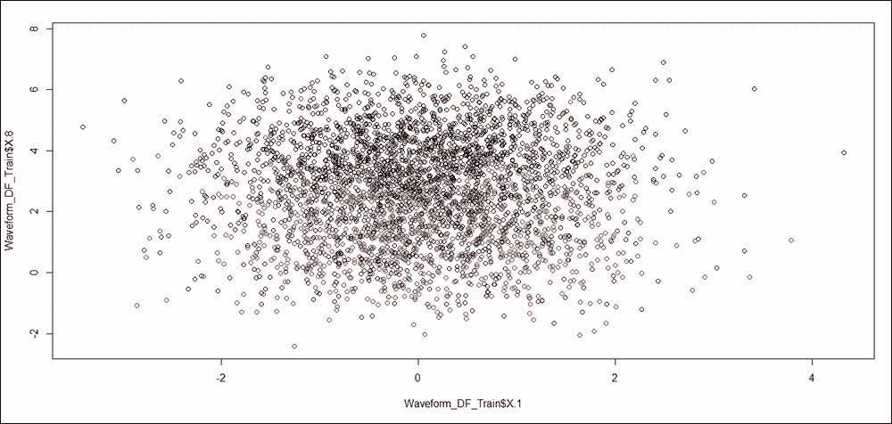
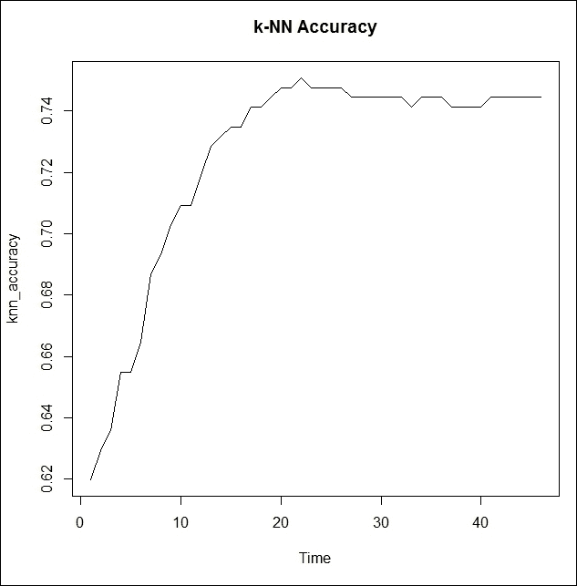

<title>Chapter 3. Bagging</title>  

# 第三章。制袋材料

决策树在[第一章](part0012_split_000.html#BE6O2-2006c10fab20488594398dc4871637ee "Chapter 1. Introduction to Ensemble Techniques")、*集成技术介绍*中介绍，然后应用于五个不同的分类问题。在这里，可以看到它们在某些数据库中比在其他数据库中工作得更好。在构建决策树时，我们几乎只使用了`rpart`函数的`default`设置。本章首先探讨一些可能提高决策树性能的选项。前一章介绍了`bootstrap`方法，主要用于统计方法和模型。在这一章中，我们将把它用于树。该方法通常被认为是一种机器学习技术。自举决策树被广泛称为*装袋*。一种类似的分类方法是 k-最近邻分类，缩写为 *k* -NN。我们将在第三节中介绍这种方法，并在本章的最后一节中应用这种方法的装袋技术。

在本章中，我们将介绍以下内容:

*   分类树和相关的修剪/改进方法
*   给分类树装袋
*   k -NN 分类器的介绍及应用
*   *k* -NN 装袋延伸

<title>Chapter 3. Bagging</title>  

# 技术要求

我们将在本章中使用以下库:

*   `class`
*   `FNN`
*   `ipred`
*   `mlbench`
*   `rpar`

<title>Classification trees and pruning</title>  

# 树木分类和修剪

分类树是一种特殊类型的决策树，它主要关注分类问题。Breiman 等人(1984 年)发明了决策树，Quinlan (1984 年)独立引入了 C4.5 算法。这两者有很多共同点，但我们将重点放在布雷曼决策树学校。Hastie 等(2009)给出了决策树的综合处理，张和 Singer (2010)给出了递归划分方法的论文。在 Tattar (2017)的[第 9 章](part0062_split_000.html#1R42S1-2006c10fab20488594398dc4871637ee "Chapter 9. Ensembling Regression Models")、*集合回归模型*中，可以找到树的直观和系统的 R 程序开发。

分类树有许多参数，可以对这些参数进行微调以提高性能。然而，我们将首先使用默认设置简单地构建分类树，并可视化该树。来自`rpart`包的`rpart`函数可以创建分类、回归以及生存树。该函数首先检查回归对象是分类对象、数值对象还是生存对象，并相应地建立相应的分类树、回归树或生存树，同时使用相关的拆分函数。

加载**德国信用**数据集并将数据分割为列车和测试部分的操作与之前的设置相同:

```
> load("../Data/GC2.RData")
> set.seed(12345)
> Train_Test <- sample(c("Train","Test"),nrow(GC2),replace = TRUE,
+    prob = c(0.7,0.3))
> GC2_Train <- GC2[Train_Test=="Train",]
> GC2_TestX <- within(GC2[Train_Test=="Test",],rm(good_bad))
> GC2_TestY <- GC2[Train_Test=="Test","good_bad"]
> nte <- nrow(GC2_TestX)
> GC2_Formula <- as.formula("good_bad~.")
```

可以参考[第一章](part0012_split_000.html#BE6O2-2006c10fab20488594398dc4871637ee "Chapter 1. Introduction to Ensemble Techniques")、*合奏技法介绍*了解 R 码是如何执行的。现在，使用训练数据集和选择的公式，我们将创建第一个分类树。应用于公式和数据集的`rpart`函数将创建一个分类树。使用`plot`功能可视化该树，并且`uniform=TRUE`选项确保显示在正确的层次级别上对齐拆分。此外，文本功能将显示分割点的变量名，而`use.n=TRUE`将给出节点处 y 的分布。最后，将拟合的分类树用于`predict`测试数据集的好/坏贷款，对测试样本进行比较，我们发现该分类树的准确率为 70.61%，与[第一章](part0012_split_000.html#BE6O2-2006c10fab20488594398dc4871637ee "Chapter 1. Introduction to Ensemble Techniques")、*集成技术介绍*相同:

```
> DT_01 <- rpart(GC2_Formula,GC2_Train)
> windows(height=200,width=200)
> par(mfrow=c(1,2))
> plot(DT_01,uniform=TRUE,main="DT - 01"); text(DT_01,use.n=TRUE)
> DT_01_predict <- predict(DT_01,newdata = GC2_TestX,type="class")
> DT_01_Accuracy <- sum(DT_01_predict==GC2_TestY)/nte
> DT_01_Accuracy
[1] 0.7060703
> DT_01$variable.importance
checking duration  savings  purpose employed  history   amount    coapp 
 38.5358  19.6081  15.6824  12.8583  12.5501   9.2985   8.9475   8.1326 
     age  existcr property      job resident telephon  housing  depends 
  7.3921   6.0250   5.5503   5.2012   2.6356   1.6327   1.3594   0.6871 
 marital installp  foreign 
  0.6871   0.4836   0.2045 
```

前面的代码图是下一张图的左树显示`DT-01`。从显示屏上可以看到有太多的终端节点，似乎也有许多分裂，这意味着我们有可能过度拟合数据。一些终端节点具有少至 7 个观测值，而许多终端节点具有少于 20 个观测值。因此，还有改进的余地。

在决策树的下一次迭代中，如果我们在节点`(minsplit=30)`中的观察值少于 30，并且最小存储桶大小`(minbucket=15)`必须至少为 15，我们要求树算法不要进一步分裂。这个变化应该给我们一个即兴超过树，`DT_01`。对于新的树，我们将再次检查准确性的变化:

```
> DT_02 <- rpart(GC2_Formula,GC2_Train,minsplit=30,minbucket=15)
> plot(DT_02,uniform=TRUE,main="DT - 02"); text(DT_02,use.n=TRUE)
> DT_02_predict <- predict(DT_02,newdata = GC2_TestX,type="class")
> DT_02_Accuracy <- sum(DT_02_predict==GC2_TestY)/nte
> DT_02_Accuracy
[1] 0.7252396
> DT_02$variable.importance
checking duration  savings  purpose  history   amount    coapp employed 
 35.2436  15.5220  15.3025  11.6655   7.8141   7.5564   7.1990   5.6960 
property  existcr      age resident  foreign  depends  marital      job 
  3.7257   1.7646   1.3781   1.1833   0.7883   0.6871   0.6871   0.5353 
 housing installp 
  0.5072   0.4581 
```



图 1:德国数据的分类树

`DT-02`树看起来比`DT-01`更清晰，并且每个终端节点都有相当多的观察值。重要的是，精度提高到了`0.7252 - 0.7061 = 0.0191`，或者说大约 2%，这是一个进步。

**复杂度参数**， **Cp** ，是树的重要方面，我们现在将使用它来改进分类树。使用参数`cp=0.005`以及`minsplit`和`minbucket`，我们将尝试提高树的性能:

```
> DT_03 <- rpart(GC2_Formula,GC2_Train,minsplit=30,minbucket=15,
+                cp=0.005)
> plot(DT_03,uniform=TRUE,main="DT - 03"); text(DT_03,use.n=TRUE)
> DT_03_predict <- predict(DT_03,newdata = GC2_TestX,type="class")
> DT_03_Accuracy <- sum(DT_03_predict==GC2_TestY)/nte
> DT_03_Accuracy
[1] 0.7316294
> DT_03$variable.importance
checking duration  savings  purpose  history employed   amount    coapp 
 35.7201  15.5220  15.3025  11.6655   7.8141   7.7610   7.5564   7.1990 
property      age  existcr resident  marital  foreign installp  depends 
  3.7257   1.8547   1.7646   1.5010   1.0048   0.7883   0.7758   0.6871 
     job  housing 
  0.5353   0.5072
```

性能现在从`0.7252`变成了`0.7316`，这又是一个进步。下图左侧的树`DT-03`中的树复杂度结构似乎变化不大。我们现在同时进行两项变革。首先，我们将分割标准从基尼系数改为信息量，然后我们为错误分类添加一个损失矩阵。

什么是分类错误的损失矩阵？如果模型以这种方式将一笔好贷款识别或预测为好贷款，我们就没有错误分类。再者，如果不良贷款被归类为不良贷款，也是算法识别出的正确决策。将一笔好贷款错误地归类为坏账的后果，与将坏账归类为好贷款是不同的。例如，如果一个坏客户获得贷款，损失将是四到六位数的收入损失，而一个好客户被拒绝贷款可能会在 3 个月后再次申请。如果运行`matrix( c(0,200,500,0),byrow = TRUE,nrow=2)`，输出如下:

```
> matrix(c(0,200,500,0),byrow = TRUE,nrow=2)
     [,1] [,2]
[1,]    0  200
[2,]  500    0
```

这意味着，将一笔好贷款错划为坏贷款的罚款是 200 英镑，而将一笔坏贷款错划为好贷款的罚款是 500 英镑。罚分很有帮助，给分类问题以权重。使用该选项和分割标准，我们建立下一个分类树:

```
> DT_04 <- rpart(GC2_Formula,GC2_Train,minsplit=30,minbucket=15,
+                parms = list(split="information",
+                             loss=matrix(c(0,200,500,0),byrow = TRUE,nrow=2)))
> plot(DT_04,uniform=TRUE,main="DT - 04"); text(DT_04,use.n=TRUE)
> DT_04_predict <- predict(DT_04,newdata = GC2_TestX,type="class")
> DT_04_Accuracy <- sum(DT_04_predict==GC2_TestY)/nte
> DT_04_Accuracy
[1] 0.7380192
> DT_04$variable.importance
checking  savings duration  purpose employed  history   amount  existcr 
 26.0182  10.4096  10.2363   5.0949   5.0434   2.1544   1.5439   0.9943 
resident      age  depends  marital property 
  0.9648   0.7457   0.6432   0.6432   0.5360 

```



图 2:带有更多选项的分类树

请注意，决策树`DT-04`看起来比`DT-01-03`具有更少的分裂，并且没有过度训练数据。

在这里，我们可以看到许多可以用来调整决策树的选项，其中一些仅适用于分类树。然而，对一些参数的调整可能需要专业知识，尽管知道这些选项是很好的。注意变量重要性的顺序如何从一个决策树变化到另一个决策树。给定数据和树形结构，我们能有多可靠地确定给定变量的变量重要性？这个问题将在下一节讨论。接下来还将探讨提高决策树性能的一般方法。

<title>Bagging</title>  

# 装袋

**Bagging** 代表**B**oostap**AGG**regat**ING**。这是 Breiman (1994)发明的。Bagging 是*同质集成*的一个例子，这是因为基本学习算法仍然是分类树。这里，每个引导树将是一个基础学习者。这也意味着当我们在[第二章](part0018_split_000.html#H5A41-2006c10fab20488594398dc4871637ee "Chapter 2. Bootstrapping")、*引导*中引导线性回归模型时，我们实际上在那里执行了一个系综。这里有一些关于组合多个树的结果的说明。

集成方法组合来自多个模型的输出，也称为基础学习器，并产生单一结果。这种方法的一个好处是，如果这些基础学习者中的每一个都拥有*期望的属性*，那么组合的结果将具有增加的稳定性。如果某个基础学习者在协变空间的特定区域中被过度训练，则另一个基础学习者将使这种不期望的预测无效。从集合中期望的是增加的稳定性，并且多次装袋有助于提高来自给定模型集的拟合值的性能。更多细节可参考 Berk (2016 年)、Seni 和 Elder (2010 年)以及 Hastie 等人(2009 年)的研究。

*一个基本结果！*如果用来自 *N* 个单位的替换来抽取 *N* 个观测值，那么平均有 37%的观测值被遗漏。

这个结果很重要。由于我们将执行一个 bootstrap 方法，这意味着平均来说，对于每棵树，我们将有 37%的维持样本。一个简单的模拟程序将为我们计算概率。对于一个从 11 到 100 的 *N* 值，我们将抽取一个有替换的样本，找出遗漏了多少个指标，将该数除以 *N* 得到本次模拟遗漏单位数的经验概率。多次通过 *B = 100，000* 获得经验概率，并且该平均值被报告为在从具有替换的 *N* 个项目中抽取的 *N* 个项目中任何个人未被选中的概率:

```
> N <- 11:100
> B <- 1e5
> Prob_Avg <- NULL
> for(i in N){
+   set <- 1:i
+   leftout <- 0
+   for(j in 1:B){
+     s1 <- sample(set,i,replace=TRUE)
+     leftout <- leftout+(i-length(unique(s1)))/i
+   }
+   Prob_Avg[i-10] <- leftout/B
+ }
> Prob_Avg
 [1] 0.3504 0.3517 0.3534 0.3549 0.3552 0.3563 0.3571 0.3574 0.3579 0.3585
[11] 0.3585 0.3594 0.3594 0.3601 0.3604 0.3606 0.3610 0.3612 0.3613 0.3614
[21] 0.3620 0.3622 0.3625 0.3622 0.3626 0.3627 0.3627 0.3626 0.3631 0.3634
[31] 0.3635 0.3637 0.3636 0.3638 0.3639 0.3638 0.3640 0.3641 0.3641 0.3641
[41] 0.3644 0.3642 0.3645 0.3643 0.3645 0.3647 0.3645 0.3646 0.3649 0.3649
[51] 0.3648 0.3650 0.3648 0.3650 0.3651 0.3653 0.3649 0.3649 0.3653 0.3653
[61] 0.3654 0.3654 0.3654 0.3654 0.3653 0.3655 0.3654 0.3655 0.3655 0.3657
[71] 0.3657 0.3657 0.3655 0.3658 0.3658 0.3660 0.3656 0.3658 0.3658 0.3658
[81] 0.3658 0.3658 0.3660 0.3658 0.3659 0.3659 0.3662 0.3660 0.3661 0.3661
```

因此，我们可以看到，在从有替换的 *N* 个项目中抽取的 *N* 个样本中，大约有 0.37%或 37%的观测值没有被选择。

装袋算法给出如下:

*   从由 *N* 个观察值组成的数据中抽取一个大小为 *N* 的随机样本。被选中的随机样本称为一个**自举样本** *。*
*   从引导样本构建分类树。
*   为每个终端节点分配一个类别，并存储每个观测的预测类别。
*   多次重复步骤 1-3，例如 *B* 。
*   通过对树集合的多数投票，将每个观察分配给最终类。

装袋程序的主要目的是减少不稳定性，这主要通过`bootstrap`方法实现。如前所述，并由模拟程序证明，当我们从 *N* 个观测值中抽取 *N* 个观测值进行替换时，平均有 37%的观测值会从样本中排除。`bagging`方法通过替换技术利用了这种采样，我们将未选择的观察值称为**随机观察值** ( **OOB** )观察值。与`bootstrap`方法一样，重采样技术为我们提供了不同参数的多个估计值，使用这样的采样分布，就有可能进行适当的统计推断。对于这种技术更严格的理由，Breiman (1996)的原始论文是一个很好的阅读。

### 注意

*一句提醒的话*:假设一个观察已经是 271 棵树中的 100 次超出袋外观察。在第 100 个实例中，当观察被标记为测试目的时，该观察可能被分类为其中的 *70* 中的`TRUE`。然后很容易得出结论，观察到 *P(真)= 70/100 = 0.7* 。这种解释可能会产生误导，因为袋子中的样本并不是独立的。

在我们开始软件实现之前，Hastie 等人(2009)的两个重要评论是适当的。首先，bagging 技术有助于减少估计预测函数的方差，它也适用于高方差、低偏差的模型，如树。第二，bagging in aggregation 的核心目标是对许多无偏的噪声模型进行平均，从而减少方差。与 bootstrap 方法一样，bagging 减少了偏差，因为它是一种平滑方法。我们现在将使用德国信贷数据来说明 bagging 方法。

`ipred` 包中的`bagging` 功能将有助于设置程序:

```
> B <- 500
> GC2_Bagging <- bagging(GC2_Formula,data=GC2_Train,coob=FALSE,
+                        nbagg=B,keepX=TRUE)
> GC2_Margin <- predict(GC2_Bagging,newdata = GC2_TestX,
+                       aggregation="weighted",type="class")
> sum(GC2_Margin==GC2_TestY)/nte
[1] 0.7795527
```

通过显著提高准确性，聚合在这里起到了作用。请注意，bagging 方法的每次运行都会产生不同的答案。这主要是因为每棵树都是用不同的样本建立的，并且允许生成随机样本的种子动态变化。到目前为止，人们试图将种子固定在一定的数量上，以重现这一结果。展望未来，种子很少会固定下来。作为测试你的知识的一个练习，找出装袋函数中指定的`keepx`和`coob options`是什么。通过使用`?bagging`来实现。

回到德国的信用问题！我们已经创建了 *B = 500* 棵树，出于某种疯狂的原因，我们想查看所有的树。当然，如果作者坚持印刷所有 500 棵树，Packt(这本书的出版商)可能会有点恼火，此外，这些树因为没有修剪而看起来很丑。该计划必须完成的书籍大小的限制。记住这一点，让我们从下面的代码开始:

```
> pdf("../Output/GC2_Bagging_Trees.pdf")
> for(i in 1:B){
+   tt <- GC2_Bagging$mtrees[[i]]
+   plot(tt$btree)
+   text(tt$btree,use.n=TRUE)
+ }
> dev.off()
pdf 
  2 
```

在前面的代码中执行了以下步骤:

1.  我们将首先调用 PDF 设备。
2.  然后在`Output`文件夹中创建一个新文件。
3.  接下来，我们开始从`1`到`B`的循环。`bagging`对象由`B = 500`树组成，在临时对象`tt`中，我们存储了第 I 棵树的细节。
4.  然后，我们使用`plot`函数绘制该树，从`tt`中提取树的细节，并添加与该树的节点和分支相关的文本。
5.  循环完成后，运行`dev.off`行，然后保存`GC2_Bagging_Trees.pdf`文件。这个可移植文档文件将由 500 棵树组成。

关于自举的好处已经说了很多，在前一章中也有很多说明。然而，抛开 bagging 通常的优势(在许多博客和参考文献中均有展示)，我们将在这里展示如何也能得到变量重要性的可靠推断。很容易看出，变量重要性在不同的树上变化很大。然而，这不是问题。当我们被问及决策树中每个变量的`variable importance`的总体可靠性时，我们现在可以跨树查看它们的值并进行推断:

```
> VI <- data.frame(matrix(0,nrow=B,ncol=ncol(GC2)-1))
> vnames <- names(GC2)[-20]
> names(VI) <- vnames
> for(i in 1:B){
+   VI[i,] <- GC2_Bagging$mtrees[[i]]$btree$variable.importance[vnames]
+ }
> colMeans(VI)
checking duration  history  purpose   amount  savings employed installp 
  50.282   58.920   33.540   48.301   74.721   30.838   32.865   18.722 
 marital    coapp resident property      age  housing  existcr      job 
  17.424    8.795   18.171   20.591   51.611    9.756   11.433   14.015 
 depends telephon  foreign 
      NA       NA       NA 
```

前面的程序需要解释。回想一下`variable.importance`是按降序显示的。如果你已经浏览了`GC2_Bagging_Trees.pdf`文件(即使粗略浏览也可以)，可以看到不同的树对主要分割有不同的变量，因此变量的重要性顺序也不同。因此，我们首先在`vnames`对象中保存我们需要的变量的顺序，然后按照与`vnames`中相同的顺序为每棵树`variable.importance[vnames]`排序。使用`$mtrees`和`$btree$variable.importance`提取循环中的每棵树，以做所需的事情。因此，`VI data.frame`对象现在由装袋过程建立的所有 500 棵树的可变重要性组成。`colMeans`给出了跨越 500 棵树的重要性的期望集合，并且期望的统计推断可以通过查看`VI`框架中的详细信息来执行。请注意，最后三个变量在合计平均值中有`NA`。产生`NA`结果的原因是，在一些分类树中，这些变量不提供任何增益，甚至不在任何代理分裂中。我们可以快速发现有多少树不包含这三个变量的重要性信息，然后使用`na.rm=TRUE`选项重复`colMeans`的计算:

```
> sapply(VI,function(x) sum(is.na(x)))
checking duration  history  purpose   amount  savings employed installp 
       0        0        0        0        0        0        0        0 
 marital    coapp resident property      age  housing  existcr      job 
       0        0        0        0        0        0        0        0 
 depends telephon  foreign 
       9       35       20 
> colMeans(VI,na.rm=TRUE)
checking duration  history  purpose   amount  savings employed installp 
  50.282   58.920   33.540   48.301   74.721   30.838   32.865   18.722 
 marital    coapp resident property      age  housing  existcr      job 
  17.424    8.795   18.171   20.591   51.611    9.756   11.433   14.015 
 depends telephon  foreign 
   6.345    5.167    3.200 
```

在上一节中，我们研究了`minsplit`、`minbucket`、`split`和`loss`参数中的许多选项。装袋能包含这些指标吗？使用`bagging`函数的`control`参数，我们现在将根据先前的结果即兴创作。附加参数的选择与之前相同。拟合装袋对象后，我们检查精度，然后将分类树写入`GC2_Bagging_Trees_02.pdf`文件。显然，这个文件中的树比`GC2_Bagging_Trees.pdf`文件中的树可读性更好，这是意料之中的。变量信息表也可从`B = 500`树获得，代码如下:

```
> GC2_Bagging_02 <- bagging(GC2_Formula,data=GC2_Train,coob=FALSE,
+                        nbagg=B,keepX=TRUE,
+                        control=rpart.control(minsplit=30,minbucket=15,
+split="information",loss=matrix(c(0,200,500,0), byrow = TRUE, nrow=2)))
> GC2_Margin_02 <- predict(GC2_Bagging_02,newdata = GC2_TestX,
+                       aggregation="weighted",type="class")
> sum(GC2_Margin_02==GC2_TestY)/nte
[1] 0.7604
> pdf("../Output/GC2_Bagging_Trees_02.pdf")
> for(i in 1:B){
+   tt <- GC2_Bagging_02$mtrees[[i]]
+   plot(tt$btree)
+   text(tt$btree,use.n=TRUE)
+ }
> dev.off()
null device 
          1 
> VI_02 <- data.frame(matrix(0,nrow=B,ncol=ncol(GC2)-1))
> names(VI_02) <- vnames
> for(i in 1:B){
+   VI_02[i,] <- GC2_Bagging_02$mtrees[[i]]$btree$variable.importance[vnames]
+ }
> colMeans(VI_02,na.rm=TRUE)
checking duration  history  purpose   amount  savings employed installp 
 38.3075  18.9377  11.6756  19.1818  18.4385  16.1309   9.6110   3.6417 
 marital    coapp resident property      age  housing  existcr      job 
  4.3520   4.4913   3.4810   6.5278  10.0255   3.3401   3.1011   4.5115 
 depends telephon  foreign 
  1.6432   2.5535   0.9193 
```

用于装袋的树的数量被任意选择为 500。这没有什么特别的原因。我们现在将看到测试数据的准确性如何随着所选的树的数量而变化。检查将在从 1 到 25 的树的数量的选择上发生，以 1 为增量，然后以 25 为增量到 50，75，…，475，500。留给读者去理解这个情节。同时，下面的程序很简单，不需要进一步解释:

```
> Bags <- c(1:24,seq(25,B,25))
> Bag_Acc <- NULL
> for(i in 1:length(Bags)){
+   TBAG <- bagging(GC2_Formula,data=GC2_Train,coob=FALSE,
+                       nbagg=i,keepX=TRUE,
+                       control=rpart.control(minsplit=30,minbucket=15,
+                                             split="information",
+                                             loss=matrix(c(0,200,500,0),
+                                                         byrow = TRUE,
+                                                         nrow=2)))
+   GC2_Margin_TBAG <- predict(TBAG,newdata = GC2_TestX,
+                            aggregation="weighted",type="class")
+   Bag_Acc[i] <- sum(GC2_Margin_TBAG==GC2_TestY)/nte
+   print(Bags[i])
+ }
[1] 1
[1] 2
[1] 3
[1] 4
[1] 5

[1] 23
[1] 24
[1] 25
[1] 50
[1] 75

[1] 475
[1] 500
> plot(Bags,Bag_Acc,"l",ylab="Accuracy")
```

以下是生成的输出:



图 3:装袋精度与树木数量的关系

分析技术不属于炼金术家族。如果发明了这样的程序，我们就不用担心建模的问题了。下一个例子表明装袋也会出错。

装袋并不是一个有保证的食谱！

在他的书的第一版中，Berk (2016)警告读者不要被新发明的方法宣称的优越性所欺骗。回忆一下[第一章](part0012_split_000.html#BE6O2-2006c10fab20488594398dc4871637ee "Chapter 1. Introduction to Ensemble Techniques")、*合奏技巧介绍*中介绍的皮马印第安人糖尿病问题。那里的精度表显示决策树给出了`0.7588`的精度。我们现在对同一分区应用 bagging 方法，并计算精度如下:

```
> data("PimaIndiansDiabetes")
> set.seed(12345)
> Train_Test <- sample(c("Train","Test"),nrow(PimaIndiansDiabetes),replace = TRUE,prob = c(0.7,0.3))
> head(Train_Test)
[1] "Test"  "Test"  "Test"  "Test"  "Train" "Train"
> PimaIndiansDiabetes_Train <- PimaIndiansDiabetes[Train_Test=="Train",]
> PimaIndiansDiabetes_TestX <- within(PimaIndiansDiabetes[Train_Test=="Test",],
+                                     rm(diabetes))
> PimaIndiansDiabetes_TestY <- PimaIndiansDiabetes[Train_Test=="Test","diabetes"]
> PID_Formula <- as.formula("diabetes~.")
> PID_Bagging <- bagging(PID_Formula,data=PimaIndiansDiabetes_Train,coob=FALSE,
+                        nbagg=1000,keepX=TRUE)
> PID_Margin <- predict(PID_Bagging,newdata = PimaIndiansDiabetes_TestX,
+                       aggregation="weighted",type="class")
> sum(PID_Margin==PimaIndiansDiabetes_TestY)/257
[1] 0.7548638
```

这里的总体精度为`0.7548`，而单木分类模型的精度为`0.7588`，这意味着套袋降低了精度。如果人们理解装袋的目的，这就不是一个担忧。目的总是增加预测的稳定性，因此，我们宁愿接受装袋会减少方差项。

Bagging 是一项非常重要的技术，您不需要将它局限于分类树，而是应该继续探索其他回归方法，如神经网络和支持向量机。在下一节中，我们将介绍 k-最近邻的不同方法( *k* -NN)。

<title>k-NN classifier</title>  

# *k* -NN 分类器

在[第一章](part0012_split_000.html#BE6O2-2006c10fab20488594398dc4871637ee "Chapter 1. Introduction to Ensemble Techniques")、*集成技术介绍*中，我们熟悉了各种分类模型。一些的读者可能已经熟悉了 *k* -NN 模型。k -NN 分类器是最简单、直观、非假设的模型之一。这个模型的名字本身就暗示了它可能是如何工作的——最近邻！而且那前面还有 *k* ！因此，如果我们在一项研究中有 *N* 个点，我们会找到邻域中的 *k* 个最近点，然后记下 k 个邻居的类别。然后将 *k-* 邻居的多数类分配给该单元。在回归的情况下，邻域的平均值被分配给该单元。以下是对 *k* -NN 的直观描绘:



图 4:*k*-NN 的可视化描述

*k* -NN 的视觉描绘的左上部分显示了 27 个观测值的散点图，其中 16 个是圆形，其余 11 个是正方形。圆圈用橙色标记，而方块用蓝色标记。假设我们选择基于 k = 3 个邻居建立分类器。对于每一个点，我们找到它的三个邻居，并给它分配主要颜色。因此，如果一个圆保持橙色，它就被正确识别，同样，如果一个正方形被正确识别，它的颜色将保持蓝色。然而，如果一个圆形点的三个最近邻点中有两个或更多个是正方形，则其颜色将变为蓝色，这将由表示。类似地，错误分类的方块的颜色将变为橙色。在上图的右上方，我们有 3-NN 预测，而 7-NN 预测可以在图的左下方找到。注意，对于 3-NN，我们有五个错误分类，而对于 7-NN，我们有七个错误分类。因此，增加最近邻的数量并不意味着精度会提高。

右下面板是 1-NN，总会给出一个完美的分类。然而，它就像一个坏掉的钟，一天只显示两次时间。

<title>k-NN classifier</title>  

## 分析波形数据

接下来，我们将对波形数据进行分析。重复从[第一章](part0012_split_000.html#BE6O2-2006c10fab20488594398dc4871637ee "Chapter 1. Introduction to Ensemble Techniques")、*系综技术介绍*开始的代码，获得波形数据，然后将其划分为列车和测试部分:

```
> set.seed(123)
> Waveform <- mlbench.waveform(5000)
> Waveform$classes <- ifelse(Waveform$classes!=3,1,2)
> Waveform_DF <- data.frame(cbind(Waveform$x,Waveform$classes)) # Data Frame
> names(Waveform_DF) <- c(paste0("X",".",1:21),"Classes")
> Waveform_DF$Classes <- as.factor(Waveform_DF$Classes)
> set.seed(12345)
> Train_Test <- sample(c("Train","Test"),nrow(Waveform_DF),replace = TRUE,
+    prob = c(0.7,0.3))
> Waveform_DF_Train <- Waveform_DF[Train_Test=="Train",]
> Waveform_DF_TestX <- within(Waveform_DF[Train_Test=="Test",],rm(Classes))
> Waveform_DF_TestY <- Waveform_DF[Train_Test=="Test","Classes"]
> Waveform_DF_Formula <- as.formula("Classes~.")
> plot(Waveform_DF_Train$X.1,Waveform_DF_Train$X.8,col=Waveform_DF_Train$Classes)
```

下图给出了两个变量`X.1`和`X.8`的简单散点图显示。在显示中可以看到许多颜色的相互作用，并且似乎没有任何形式的逻辑回归模型或决策树会对此有所帮助。在这种情况下， *k* -NN 可能会有用:



图 5:波形数据散点图

对于`k = 10`，我们首先为波形数据建立一个 *k* -NN 模型。这里使用了`class`包中的`knn`函数:

```
> WF_knn <- knn(train=Waveform_DF_Train[,-22],test=Waveform_DF_TestX,
+               cl=Waveform_DF_Train$Classes,k=10)
> sum(Waveform_DF_TestY==WF_knn)/nrow(Waveform_DF_TestX)
[1] 0.903183
```

90.32%的准确率看起来很有希望，而且比[第一章](part0012_split_000.html#BE6O2-2006c10fab20488594398dc4871637ee "Chapter 1. Introduction to Ensemble Techniques")、*集成技术介绍*中考虑的所有模型都好，除了支持向量机。我们将把 k 的搜索范围从 2 扩大到 50:

```
> k <- c(2:15,seq(20,50,5))
> knn_accuracy <- NULL
> for(i in 1:length(k)){
+   WF_temp_knn <- knn(train=Waveform_DF_Train[,-22],test=Waveform_DF_TestX,
+                 cl=Waveform_DF_Train$Classes,k=k[i])
+   knn_accuracy <- c(knn_accuracy,sum(Waveform_DF_TestY==WF_temp_knn)/
+                       nrow(Waveform_DF_TestX))
+ }
> knn_accuracy
 [1] 0.8561 0.8919 0.8893 0.8886 0.8932 0.8985 0.8972 0.8992 0.9012 0.9025
[11] 0.9032 0.9058 0.9105 0.9019 0.8999 0.9072 0.9065 0.9098 0.9118 0.9085
[21] 0.9072
```

注意，对于 k = 40，我们得到最大精度。为什么？我们会在下一节把 *k* -NN 放到一个袋子里。

<title>k-NN bagging</title>  

# *-NN 装袋*

**k-NN* 分类器在前一节中介绍了一个分类模型。我们可以使用 bootstrap 方法使其变得鲁棒。更广泛的算法保持不变。与典型的自举方法一样，我们总是可以编写一个由循环组成的程序，根据所需自举样本或包的数量，可以很容易地指定控制。然而，这里我们将使用来自`FNN` R 包的一个函数。`ownn`功能有助于在 *k* -NN 分类器上执行装袋方法。*

*`ownn`函数要求数据集中的所有变量都是数字。然而，我们有许多变量是因子变量。因此，我们需要调整数据，以便可以使用`ownn`函数。首先使用`rbind`函数将来自训练和测试数据集的协变量数据放在一起。使用带有公式`~.-1`的`model.matrix`函数，我们将所有因子变量转换为数字变量。这里重要的问题是`model.matrix`函数是如何工作的？为了使解释简单，如果一个因子变量有 m 个级别，它将创建 m-1 个新的二进制变量，这将跨越 *m* 个维度。我们组合训练和测试协变量的原因是，如果任何因素在任何分区中具有较少的级别，变量的数量将是不相等的，并且我们将无法在测试数据集上采用基于训练数据集构建的模型。获得包含所有数字变量的协变量矩阵后，我们将再次将协变量分成训练和测试区域，指定使用`ownn`函数设置的 *k* -NN，并预测使用 bagging 方法后的精度。该计划如下:*

```
*> All_Cov <- rbind(GC2_Train[,-20],GC2_TestX)
> All_CovX <- model.matrix(~.-1,All_Cov)
> GC2_Train_Cov <- All_CovX[1:nrow(GC2_Train),]
> GC2_Test_Cov <- All_CovX[(nrow(GC2_Train)+1):nrow(All_CovX),]
> k <- seq(5,50,1)
> knn_accuracy <- NULL
> for(i in 1:length(k)){
+   GC2_knn_Bagging <- ownn(train=GC2_Train_Cov, test=GC2_Test_Cov,
+                           cl=GC2_Train$good_bad,testcl=GC2_TestY,k=k[i])
+  knn_accuracy[i] <- GC2_knn_Bagging$accuracy[3]
+ }
> knn_accuracy
 [1] 0.6198083 0.6293930 0.6357827 0.6549521 0.6549521 0.6645367 0.6869010
 [8] 0.6932907 0.7028754 0.7092652 0.7092652 0.7188498 0.7284345 0.7316294
[15] 0.7348243 0.7348243 0.7412141 0.7412141 0.7444089 0.7476038 0.7476038
[22] 0.7507987 0.7476038 0.7476038 0.7476038 0.7476038 0.7444089 0.7444089
[29] 0.7444089 0.7444089 0.7444089 0.7444089 0.7412141 0.7444089 0.7444089
[36] 0.7444089 0.7412141 0.7412141 0.7412141 0.7412141 0.7444089 0.7444089
[43] 0.7444089 0.7444089 0.7444089 0.7444089
> windows(height=100,width=100)
> plot.ts(knn_accuracy,main="k-NN Accuracy")*
```

*`train`、`test`、`cl`和`testcl`参数很容易理解；参见`ownn`，我们将在 5-50 的网格上改变邻居的数量。我们是否指定了袋子的数量或引导样本的数量？现在进行装袋，并给出装袋预测。看起来可能有一个估计的近似值，因为程序包和函数清楚地表明预测是基于 bagging:*

```
*> GC2_knn_Bagging$accuracy
      knn      ownn       bnn 
0.7444089 0.7444089 0.7444089 
> GC2_knn_Bagging$bnnpred
  [1] good good good good good good good good good good good good good
 [14] good good good good good good good good good bad  good good good
 [27] good good good good good good good good good good bad  good good

[274] good good good good good good good good good good good good good
[287] good good good good good good good good good bad  bad  good good
[300] good good good good good good good good good good good good good
[313] good
Levels: bad good*
```

*下面的精度图显示，模型精度在大约 20 个邻域后趋于稳定。因此，我们实施了 *k* -NN 套袋技术:*

*

图 6:k-NN 装袋的精度* *<title>Summary</title>  

# 总结

Bagging 本质上是一种由同质基础学习者组成的集合方法。Bagging 是作为 bootstrap 聚合方法引入的，我们在[第 2 章](part0018_split_000.html#H5A41-2006c10fab20488594398dc4871637ee "Chapter 2. Bootstrapping")、*bootstrap*中看到了 bootstrap 方法的一些优点。bagging 方法的优点是预测的稳定性。本章从对分类树的修改开始，我们看到了改进决策树性能的不同方法，这样决策树就不会过度适应数据。决策树的打包和相关技巧将在下一节介绍。然后我们介绍了 *k* -NN 作为一个重要的分类器，并用一个简单的例子来说明。本章以 *k* -NN 分类器的装袋扩展结束。

打包有助于减少决策树的方差。然而，两个 bootstrap 样本的树是相关的，因为它们是由许多共同的观察值生成的。在下一章，我们将看看创新的重采样，它将解除两个决策树的关联。*