# 七、通用集成技术

前四章已经讨论了决策树的集成技术。在那些章节讨论的每个主题中，基础学习器是一棵决策树，因此，我们深入研究了同质集成技术。在这一章中，我们将证明基础学习器可以是任何统计或机器学习技术，它们的集成将提高预测的精度。一个重要的要求是基础学习器应该比随机猜测更好。通过 R 程序，我们将讨论和阐明集成工作的不同可能情况。投票是分类器的一个重要特征——我们将为此陈述两种不同的方法，并在 bagging 和随机森林集成的上下文中说明它们。平均技术是回归变量的一个集成，它将在分类方法的讨论之后。本章最后将详细讨论叠加方法，非正式介绍见[第 1 章](part0012_split_000.html#BE6O2-2006c10fab20488594398dc4871637ee "Chapter 1. Introduction to Ensemble Techniques")、*系综技术介绍*。主题流展开如下:

*   为什么集成会起作用？
*   投票集成
*   平均集成
*   堆叠系综


# 技术要求

本章将使用的库如下:

*   `rpart`
*   `randomForest`


# 组装为什么有效？

当使用 bagging 方法时，我们组合许多决策树的结果，并通过取多数计数来产生单个输出/预测。在不同的采样机制下，结果被组合以产生随机森林的单个预测。在决策树的顺序错误减少方法下，提升方法也提供改进的答案。尽管我们正在处理不确定的数据，这涉及到概率，但我们并不打算拥有一套方法来给出黑箱外的结果，并且没有一致的解决方案。一个理论应该解释工作，我们需要一个保证，结果将是一致的，没有黑魔法。武断和不确定的答案是完全不受欢迎的。在本节中，我们将了解集成解决方案如何工作以及为什么工作，以及它们不工作的场景。

集成方法有很强的数学和统计学基础，解释了为什么它们给出这样的解决方案。我们先考虑分类问题。我们将从一个简化的设置开始，并假设我们有 *T* 个彼此独立的分类器，并且与它们中的每一个相关联的准确度与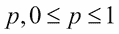相同。这是最简单的情况之一，我们将在后面概括这个场景。现在，如果我们有 *T* 个分类器，每个分类器对观察值进行投票，比如+1 或-1，这就引出了一个问题，整体的准确度会是多少？由于 *T* 分类器的正确分类数必须超过错误分类数，我们至少需要个分类器来投票选出正确的结果。这里，表示小于给定分数的最大整数。每当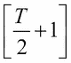或更多的分类器投票选择正确的类别时，多数分类是正确的。

为了澄清，需要注意的是，当我们说分类器具有精度 *p* 时，我们并不意味着分类器将观察标记为+1 的概率是 *p* 。相反，我们在这里的意思是，如果分类器进行 100 次预测，预测可以是+1 和-1 的任意组合；100*p 预测被分类器正确识别。精度与群体中+1 和-1 的分布无关。

在这种设置下，标记正确观察的分类器数量的概率遵循二项式分布，其中 *n = T* 并且概率为 *p* 。因此，多数票获得正确预测的概率如下:

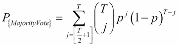

因为我们已经提到过分类器必须比随机猜测更好，我们将需要分类器精度超过 0.5。然后，我们将在多个点上增加准确度，并查看分类器数量的增加如何影响多数投票的概率:

```
> source("Utilities.R")
> windows(height=100,width=100)
> # Ensembling in Classification
> # Illustrating the ensemble accuracy with same accuracy for each classifier
> # Different p's and T's with p > 0.5
> classifiers <- seq(9,45,2) # Number of classifiers 
> accuracy <- seq(0.55,0.85,.05)
> plot(0,type='n',xlim=range(classifiers),ylim=c(0.6,1),
+      xlab="Number of Classifiers",ylab="Probability of Majority Voting")
> for(i in 1:length(accuracy)){
+   Prob_MV <- NULL
+   for(j in 1:length(classifiers)){
+     Prob_MV[j] <- sum(dbinom(floor(classifiers[j]/2+1):classifiers[j],
+        prob=accuracy[i],size=classifiers[j]))
+   }
+   points(classifiers,Prob_MV,col=i,"l")
+ }
> title("Classifiers with Accuracy Better Than Random Guess")
```

`seq`函数在`classifiers R`数字向量中设置分类器数量的奇数序列。在`accuracy`向量中，精度百分比从`0.55`到`0.85`不等。为了开始这个过程，我们设置了一个空的排序`plot`，带有适当的 *x* 和 *y* 轴标签。现在，对于每个精度值，我们将计算范围`floor(classifiers[j]/2+1):classifiers[j]`的多数投票的概率。`floor(./2+1)`确保我们选择正确的起点。例如，如果分类器的数量是 9，那么`floor(./2+1)`的值就是`5`。此外，当我们有九个分类器时，我们需要至少五票来支持感兴趣的事件。另一方面，对于偶数个分类器(例如，八个)，`floor(./2+1)`的值是`5`。`dbinom`函数根据给定的大小和概率计算特定值的概率。在`floor(classifiers[j]/2+1): classifiers[j]`的范围内，它给出了多数投票的概率，或多数投票的准确性。前述代码的输出如图 1 中的*所示。从结果中我们可以看出，随着分类器数量的增加(每个分类器都具有相同的准确性，并且比随机猜测更好)，多数投票的准确性也增加了:*

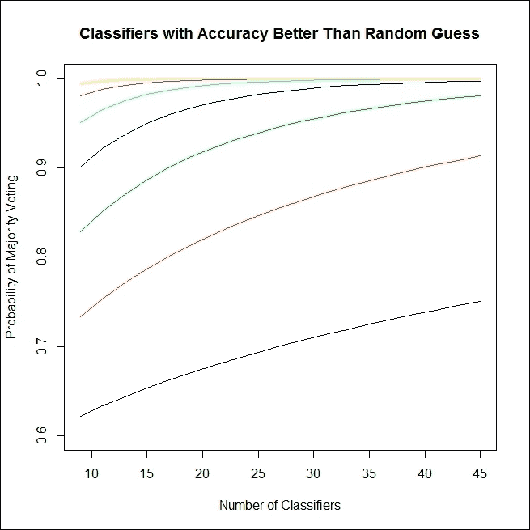

图 1:为什么集成应该工作？

这将有助于我们看到`Prob_MV`的一个精度选项，例如 0.65。我们将为`prob=0.65`分别运行索引为`j`的循环，并查看多数投票的准确性如何随着分类器数量的增加而增加:

```
> Prob_MV <- NULL
> for(j in 1:length(classifiers)){
+   Prob_MV[j] <- sum(dbinom(floor(classifiers[j]/2+1):classifiers[j],
+                            prob=0.65,size=classifiers[j]))
+ }
> Prob_MV
 [1] 0.8282807 0.8513163 0.8705318 0.8867689 0.9006211 0.9125264 0.9228185
 [8] 0.9317586 0.9395551 0.9463770 0.9523633 0.9576292 0.9622714 0.9663716
[15] 0.9699991 0.9732133 0.9760651 0.9785984 0.9808513
```

因此，随着具有相同准确度的分类器的数量增加，我们可以看到多数投票的准确度也增加。此外，值得注意的是，尽管我们的每个分类器的精度只有`0.65`，但整体的精度要高得多，几乎成为一个完美的分类器。这是合奏的主要优势。

集成有助于任何种类的分类器吗？如果我们的分类器的准确性比随机猜测差，因此小于`0.5`，那么我们将以与前一种情况相同的方式进行搜索。对于许多分类器和准确度小于`0.5`的主机，我们将计算多数投票分类器的准确度:

```
> # When p < 0.5, ensemble accuracy goes to zero
> classifiers <- seq(6,50,2)
> accuracy <- seq(0.45,0.05,-0.05)
> plot(0,type='n',xlim=range(classifiers),ylim=c(0,0.3),
+      xlab="Number of Classifiers",ylab="Probability of Majority Voting")
> for(i in 1:length(accuracy)){
+   Prob_MV <- NULL
+   for(j in 1:length(classifiers)){
+     Prob_MV[j] <- sum(dbinom(floor(classifiers[j]/2+1):classifiers[j],
+                              prob=accuracy[i],size=classifiers[j]))
+   }
+   points(classifiers,Prob_MV,col=i,"l")
+   }
> title("Classifiers with Accuracy Worse Than Random Guess")
```

前面 R 程序的结果如图 2*所示。*现在，第一个观察结果应该是，准确度更接近`0.5`还是更接近`0`并不重要，多数表决分类器的概率/准确度在下降，这不利地影响了性能。在每一种情况下，我们看到精度最终将趋近于零。R 代码块中的变化是分类器序列`seq(6,50,2)`，在`seq(0.45,0.05,-0.05)`中精度等级从`0.45`下降到`0.05`。现在，考虑精度略小于`0.5`的情况。比如让我们保持到`0.4999`。我们现在会幸运地看到性能的提高吗？

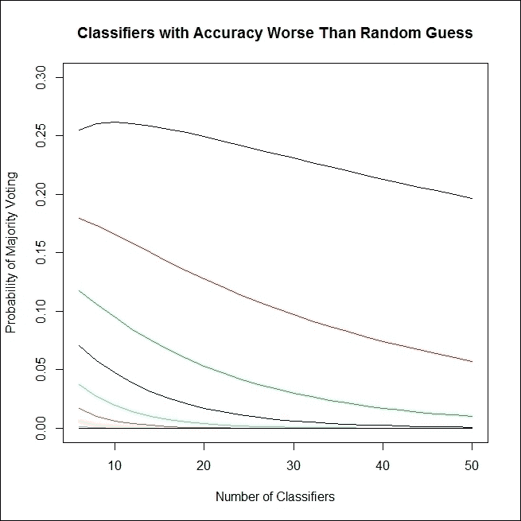

图 2:合奏不是炼金术！

```
> classifiers <- seq(10,200,10)
> Prob_MV <- NULL
> for(j in 1:length(classifiers)){
+   Prob_MV[j] <- sum(dbinom(floor(classifiers[j]/2+1):classifiers[j],
+                            prob=0.4999,size=classifiers[j]))
+ }
> Prob_MV
 [1] 0.3767071 0.4115491 0.4273344 0.4368132 0.4433011 0.4480955 0.4518222
 [8] 0.4548247 0.4573097 0.4594096 0.4612139 0.4627854 0.4641698 0.4654011
[15] 0.4665053 0.4675025 0.4684088 0.4692370 0.4699975 0.4706989
```

同样，事实证明我们无法匹配单个分类器的准确性。因此，我们有一个重要和关键的条件，即分类器必须比随机猜测更好。随机猜测本身呢？假设我们有许多分类器，它们都是随机猜测的，这一点也不难。如果集成的性能随着随机猜测而提高，我们通常不必构建任何统计或机器学习技术。给定一组随机猜测，我们总能提高的准确性。我们来看看这个。

有两种情况——奇数个分类器和偶数个分类器——我们为这两种情况都提供了程序:

```
> accuracy <- 0.5
> classifiers <- seq(5,45,2)
> Prob_MV <- NULL
> for(j in 1:length(classifiers)){
+   Prob_MV[j] <- sum(dbinom(floor(classifiers[j]/2+1):classifiers[j],
+                            prob=accuracy,size=classifiers[j]))
+   }
> Prob_MV
 [1] 0.5 0.5 0.5 0.5 0.5 0.5 0.5 0.5 0.5 0.5 0.5 0.5 0.5 0.5 0.5 0.5 0.5 0.5
[19] 0.5 0.5 0.5
> classifiers <- seq(10,50,2)
> Prob_MV <- NULL
> for(j in 1:length(classifiers)){
+   Prob_MV[j] <- (sum(dbinom(floor(classifiers[j]/2):classifiers[j],
+                             prob=accuracy,size=classifiers[j]))+
+                    sum(dbinom(floor(classifiers[j]/2+1):classifiers[j],
+                               prob=accuracy,size=classifiers[j])))/2
+   }
> Prob_MV
 [1] 0.5 0.5 0.5 0.5 0.5 0.5 0.5 0.5 0.5 0.5 0.5 0.5 0.5 0.5 0.5 0.5 0.5 0.5
[19] 0.5 0.5 0.5
```

这就有意思了！不管分类器的数量有多少，随机猜测的集成保持不变。在这里，既没有任何改善，也没有恶化。因此，出于集成的目的，我们总是需要比随机猜测更好的分类器。

当理解组装是如何工作的时候，跟随你的直觉是有好处的。我们从一个过于简单的假设开始，即所有模型都具有相同的精度，但是如果我们处理具有不同精度的模型，这样的假设就不太适用了。因此，我们需要考虑不同分类器可能具有不同精度的情况。我们将首先考虑这样一种情况，其中每个分类器都具有高于 0.5 的准确度，或者其中每个分类器都优于随机猜测。找到多数投票准确性的方法是评估分类器结果的每个可能组合的概率。我们考虑当分类器的数量是奇数时的更简单的情况。

假设我们有 *T* 个分类器，每个分类器的准确率是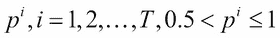。注意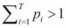，因为这些对应不同的措施。

以下步骤给出了评估具有不同准确度的多数票的概率所涉及的步骤:

*   列出所有可能的基本事件。如果每个分类器对一个给定的案例投票为真或假，这意味着它有两种可能的结果，以及 *T* 个分类器。列出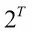可能的结果:

    *   例:如果我们有三个分类器，将有八种可能的情况， 如下:

        | 

        分类器 1

         | 

        分类器 2

         | 

        分类器 3

         |
        | --- | --- | --- |
        | 真实的 T34 | 真实的 | 真实的 |
        | 错误的 T48 | 真实的 T52 | 真实的 |
        | 真实的 T62 | 错误的 | 真实的 |
        | 错误的 | 错误的 T80 | 真实的 |
        | 真实的 | 真实的 | 错误的 |
        | 错误的 | 真实的 | 错误的 |
        | 真实的 | 错误的 | 错误的 T128)T129)T130)错误的 | 错误的 T136 | 错误的 |

*   计算每个可能事件的概率。由于每个分类器具有不同的准确度，因此对于每个可能的结果，概率将是不同的:

    *   示例:如果三个分类器(对于真)的准确度是 0.6、0.7 和 0.8，那么假的概率分别是 0.4、0.3 和 0.2， 而上表的概率会是:

        | 

        分类器 1

         | 

        分类器 2

         | 

        分类器 3

         |
        | --- | --- | --- |
        | 零点六 | 零点七 | 零点八 |
        | 零点四 | 零点七 | 零点八 |
        | 零点六 | 零点三 | 零点八 |
        | 零点四 | 零点三 | 零点零点七 | 零点二 |
        | 零点六 | 零点三 | 零点二 |
        | 零点四 |

*   在下一步中，获得基本事件的概率， 将各列中的数字相乘:

    | 

    分类器 1

     | 

    分类器 2

     | 

    分类器 3

     | 

    可能性

     |
    | --- | --- | --- | --- |
    | 零点六 | 零点七 | 零点八 | 零点三六 |
    | 零点 四 | 零点七 | 零点八 | 零点二四 |
    | 零点六 | 零点三 | 零点八 | 零点九六 |
    | 零点六 | 零点七 | 零点二 | 零点八四 |
    | 零点四【T122 | 零点三 | 零点二 | 零点三六 |
    | 零点四 | 零点三 | 零点二 |

*   找出占多数的事件。在这种情况下， 这是指大于或等于 2 的总和:

    | 

    分类器 1

     | 

    分类器 2

     | 

    分类器 3

     | 

    投票计数

     |
    | --- | --- | --- | --- |
    | 真实的 T34 | 真实的 | 真实的 | 三 |
    | 错误的 T52 | 真实的 T56 | 真实的 | 两个 |
    | 真实的 | 错误的 | 真实的 | 两个 |
    | 错误的 | 错误的 | 真实的 | 一个 |
    | 真实的 | 真实的 | 错误的 | 两个 |
    | 错误的 T124 |  真实的 | 错误的 | 一人 |
    | 真实的 | 错误的 | 错误的 | 其中 |
    | 错误的 | 错误的 | 错误的 |  |

*   多数票的概率就是票数大于或等于 2 的概率之和。这是概率列的第 1、2、3 和 5 行中条目的总和，即 0.336 + 0.224 + 0.144 + 0.084 = 0.788。

我们需要在这里定义一个名为`Get_Prob`的函数，如下所示:

```
> Get_Prob <- function(Logical,Probability){
+   return(t(ifelse(Logical,Probability,1-Probability)))
+ }
```

给定一个逻辑向量和一个对应概率的向量，`Get_Prob`函数将返回一个包含逻辑条件为`TRUE`的概率的向量。如果逻辑值是`FALSE`，则返回补码(1-概率)。

前面的步骤放在 R 程序中，如下所示:

```
> # Different accuracies T's illustration
> # For simplicity, we set the number of classifiers at odd number
> # Each p_i's greater than 0.5
> accuracy <- c(0.5,0.55,0.6,0.65,0.7,0.75,0.8,0.85,0.9)
> NT <- length(accuracy) # Number of classifiers 
> APC <- expand.grid(rep(list(c(TRUE,FALSE)),NT)) # All possible combinations
> head(APC)
   Var1  Var2  Var3 Var4 Var5 Var6 Var7 Var8 Var9
1  TRUE  TRUE  TRUE TRUE TRUE TRUE TRUE TRUE TRUE
2 FALSE  TRUE  TRUE TRUE TRUE TRUE TRUE TRUE TRUE
3  TRUE FALSE  TRUE TRUE TRUE TRUE TRUE TRUE TRUE
4 FALSE FALSE  TRUE TRUE TRUE TRUE TRUE TRUE TRUE
5  TRUE  TRUE FALSE TRUE TRUE TRUE TRUE TRUE TRUE
6 FALSE  TRUE FALSE TRUE TRUE TRUE TRUE TRUE TRUE
> Elements_Prob <- t(apply(APC,1,Get_Prob,Probability=accuracy))
> head(Elements_Prob)
     [,1] [,2] [,3] [,4] [,5] [,6] [,7] [,8] [,9]
[1,]  0.5 0.55  0.6 0.65  0.7 0.75  0.8 0.85  0.9
[2,]  0.5 0.55  0.6 0.65  0.7 0.75  0.8 0.85  0.9
[3,]  0.5 0.45  0.6 0.65  0.7 0.75  0.8 0.85  0.9
[4,]  0.5 0.45  0.6 0.65  0.7 0.75  0.8 0.85  0.9
[5,]  0.5 0.55  0.4 0.65  0.7 0.75  0.8 0.85  0.9
[6,]  0.5 0.55  0.4 0.65  0.7 0.75  0.8 0.85  0.9
> Events_Prob <- apply(Elements_Prob,1,prod)
> Majority_Events <- (rowSums(APC)>NT/2)
> sum(Events_Prob*Majority_Events)
[1] 0.9112646
```

给定一个名为`accuracy`的具有精确度的数字向量，带有奇数个分类器，我们首先用`length`函数找到其中的分类器数量，并将其存储在`NT`中。然后使用`expand.grid`函数生成`APC`的所有可能组合，其中`rep`函数将重复矢量`(TRUE, FALSE) NT`的次数。然后，`APC`对象的列的每个元素将生成一个列，其中`TRUE`和`FALSE`条件将被相应的分类器精度以及使用`Get_Prob`函数的适当补码所取代。因为我们考虑奇数个分类器，所以当基本事件中的`TRUE`的数量大于分类器数量的 50 %(即大于`NT/2`)时，会出现多数投票。其余的计算更容易理解。如果九个分类器的精度是 0.5、0.55、0.6、0.65、0.7、0.75、0.8、0.85 和 0.9，则计算显示集成的精度将是 0.9113，高于这里最准确的分类器 0.9。然而，我们必须记住，八个分类器中的每一个的精确度都低于 0.9。尽管如此，集成精度高于我们手头的最高分类器。为了验证计算工作正常，我们将此方法应用于周(2012 年)第 74 页给出的示例，并确认最终多数投票概率为 0.933:

```
> accuracy <- c(0.7,0.7,0.7,0.9,0.9)
> NT <- length(accuracy) # Number of classifiers
> APC <- expand.grid(rep(list(c(TRUE,FALSE)),NT)) # All possible combinations
> Elements_Prob <- t(apply(APC,1,Get_Prob,Probability=accuracy))
> Events_Prob <- apply(Elements_Prob,1,prod)
> Majority_Events <- (rowSums(APC)>NT/2)
> sum(Events_Prob*Majority_Events)
[1] 0.93268
```

当每个分类器都比随机猜测差的情况下会发生什么？我们将简单地得出九个分类器场景的准确度，并重复该程序以得到以下答案:

```
> # Each p_i's lesser than 0.5
> accuracy <- 1-c(0.5,0.55,0.6,0.65,0.7,0.75,0.8,0.85,0.9)
> NT <- length(accuracy) # Number of classifiers
> APC <- expand.grid(rep(list(c(TRUE,FALSE)),NT)) # All possible combinations
> head(APC)
   Var1  Var2  Var3 Var4 Var5 Var6 Var7 Var8 Var9
1  TRUE  TRUE  TRUE TRUE TRUE TRUE TRUE TRUE TRUE
2 FALSE  TRUE  TRUE TRUE TRUE TRUE TRUE TRUE TRUE
3  TRUE FALSE  TRUE TRUE TRUE TRUE TRUE TRUE TRUE
4 FALSE FALSE  TRUE TRUE TRUE TRUE TRUE TRUE TRUE
5  TRUE  TRUE FALSE TRUE TRUE TRUE TRUE TRUE TRUE
6 FALSE  TRUE FALSE TRUE TRUE TRUE TRUE TRUE TRUE
> Elements_Prob <- t(apply(APC,1,Get_Prob,Probability=accuracy))
> head(Elements_Prob)
     [,1] [,2] [,3] [,4] [,5] [,6] [,7] [,8] [,9]
[1,]  0.5 0.45  0.4 0.35  0.3 0.25  0.2 0.15  0.1
[2,]  0.5 0.45  0.4 0.35  0.3 0.25  0.2 0.15  0.1
[3,]  0.5 0.55  0.4 0.35  0.3 0.25  0.2 0.15  0.1
[4,]  0.5 0.55  0.4 0.35  0.3 0.25  0.2 0.15  0.1
[5,]  0.5 0.45  0.6 0.35  0.3 0.25  0.2 0.15  0.1
[6,]  0.5 0.45  0.6 0.35  0.3 0.25  0.2 0.15  0.1
> Events_Prob <- apply(Elements_Prob,1,prod)
> Majority_Events <- (rowSums(APC)>NT/2)
> sum(Events_Prob*Majority_Events)
[1] 0.08873544
```

当每个分类器都比随机猜测的差时，多数投票分类器在集成的情况下会给出可怕的结果。这留给我们最后一个案例。如果我们有一个混合的分类器，其中一些比随机猜测分类器好，一些比随机猜测分类器差，会怎么样？我们将把计算代码块放在一个名为`Random_Accuracy`的函数中。然后，分类器中的精度变成单位区间内随机生成的数字。然后运行函数`Random_Accuracy`十次以上，以生成以下输出:

```
> # Mixture of p_i's, some > 0.5, and some < 0.5
> Random_Accuracy <- function() {
+   accuracy <- runif(9)
+   NT <- length(accuracy) 
+   APC <- expand.grid(rep(list(c(TRUE,FALSE)),NT)) 
+   Elements_Prob <- t(apply(APC,1,Get_Prob,Probability=accuracy))
+   Events_Prob <- apply(Elements_Prob,1,prod)
+   Majority_Events <- (rowSums(APC)>NT/2)
+   return(sum(Events_Prob*Majority_Events))
+ }
> Random_Accuracy()
[1] 0.3423631
> Random_Accuracy()
[1] 0.3927145
> Random_Accuracy()
[1] 0.5341844
> Random_Accuracy()
[1] 0.1624876
> Random_Accuracy()
[1] 0.4065803
> Random_Accuracy()
[1] 0.4687087
> Random_Accuracy()
[1] 0.7819835
> Random_Accuracy()
[1] 0.3124515
> Random_Accuracy()
[1] 0.6842173
> Random_Accuracy()
[1] 0.2531727
```

好坏参半的结果。因此，如果我们需要从集成方法中获得合理的准确性和性能，就必须确保每个分类器都优于随机猜测。到目前为止，我们分析中的一个核心假设是分类器是相互独立的。这种假设在实际设置中很少成立，因为分类器是使用相同的数据集构建的。然而，这个问题将在下一章中讨论。

我们现在将通过投票来讨论集成问题。


# 投票集成

投票集成可以有效地用于分类问题。我们现在有一组分类器，我们需要使用它们来预测未知案例的类别。分类器预测的组合可以多种方式进行。我们将考虑的两个选项是多数投票和加权投票。


## 多数表决

与投票相关的想法将通过基于决策树的同质基础学习器的集成来说明，正如在开发 bagging 和 random forests 中所使用的。首先，我们将使用`randomForest`函数创建 500 个基础学习器，并在第一个模块中重复该程序，如[第 4 章](part0033_split_000.html#VF2I1-2006c10fab20488594398dc4871637ee "Chapter 4. Random Forests")、*随机森林*所示。在那一章中已经执行了集成，我们将在这里详细说明这些步骤。首先，这里给出了设置随机森林的代码块:

```
> load("../Data/GC2.RData")
> set.seed(12345)
> Train_Test <- sample(c("Train","Test"),nrow(GC2),
+ replace = TRUE,prob = c(0.7,0.3))
> GC2_Train <- GC2[Train_Test=="Train",]
> GC2_TestX <- within(GC2[Train_Test=="Test",],rm(good_bad))
> GC2_TestY <- GC2[Train_Test=="Test","good_bad"]
> GC2_Formula <- as.formula("good_bad~.")
> # RANDOM FOREST ANALYSIS
> GC2_RF <- randomForest(GC2_Formula,data=GC2_Train,keep.inbag=TRUE,
+                        ntree=500)
```

接下来，我们将使用标准的`predict`函数来预测`GC2_TestX`数据的类别，然后，使用`predict.all=TRUE`选项，获得随机森林中生成的每棵树的预测值:

```
> # New data voting
> GC2_RF_Test_Margin <- predict(GC2_RF,newdata = GC2_TestX,
+                          type="class")
> GC2_RF_Test_Predict <- predict(GC2_RF,newdata=GC2_TestX,
+                           type="class",predict.all=TRUE
+                           )
```

预测的`GC2_RF_Test_Predict`对象将由更多的`individual`对象组成，这些对象将具有对每个决策树的预测。我们将首先定义一个名为`Row_Count_Max`的函数，它将返回森林中计数最大的预测。基本的投票方法是，然后在下面的代码块中与`predict`函数的结果进行比较:

```
> Row_Count_Max <- function(x) names(which.max(table(x))) 
> # Majority Voting
> Voting_Predict <- apply(GC2_RF_Test_Predict$individual,1,
+ Row_Count_Max)
> head(Voting_Predict);tail(Voting_Predict)
     1      2      3      4      9     10 
"good"  "bad" "good"  "bad" "good"  "bad" 
   974    980    983    984    988    996 
 "bad"  "bad" "good" "good" "good" "good" 
> all(Voting_Predict==GC2_RF_Test_Predict$aggregate)
[1] TRUE
> all(Voting_Predict==GC2_RF_Test_Margin)
[1] TRUE
> sum(Voting_Predict==GC2_TestY)/313
[1] 0.7795527
```

因此，我们可以看到`predict`函数实现了多数计数技术。接下来，我们将快速说明加权投票背后的想法和思路。


## 加权投票

使用简单投票的一个隐含假设是所有分类器都同样准确，或者所有分类器都具有同等的投票权。考虑更简单的情况，其中我们有五个分类器，其中三个的精度为 0.51，其余两个的精度为 0.99。如果不太准确的分类器将一个观察结果投票为否定情况(-1)，而两个较准确的分类器投票为肯定情况(+1)，则简单投票方法将调用该观察结果(-1)。在这种投票模式下，观察值为-1 的概率是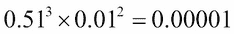，而为+1 的概率是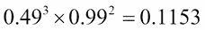。因此，我们不能假装所有的分类器应该有相同的投票权。这就是我们要好好利用加权投票法的地方。

在这个分析中，我们将把分类器在训练数据集上的准确度作为权重。我们将把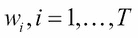视为与分类器相关联的权重。权重的一个重要的特征是它们应该是非负的，并且应该加起来是 1，即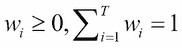。我们将标准化分类器的准确性以满足该约束。

我们将继续分析德国的信用数据集。首先，我们将通过训练数据集获得 500 棵树的预测，然后获得精确度:

```
> # Analyzing Accuracy of Trees of the Fitted Forest
> GC2_RF_Train_Predict <- predict(GC2_RF,newdata=GC2_Train[,-20],
+                                 type="class",predict.all=TRUE)
> head(GC2_RF_Train_Predict$individual[,c(1:5,496:500)])  
   [,1]   [,2]   [,3]   [,4]   [,5]   [,6]   [,7]   [,8]   [,9]   [,10] 
5  "bad"  "bad"  "bad"  "bad"  "good" "bad"  "bad"  "bad"  "bad"  "bad" 
6  "good" "good" "good" "good" "good" "good" "bad"  "bad"  "bad"  "good"
7  "good" "good" "good" "good" "good" "good" "good" "good" "good" "good"
8  "good" "good" "good" "good" "good" "bad"  "good" "bad"  "good" "good"
11 "bad"  "bad"  "bad"  "bad"  "bad"  "bad"  "bad"  "bad"  "bad"  "bad" 
12 "good" "bad"  "bad"  "bad"  "bad"  "good" "bad"  "bad"  "bad"  "bad" 
> RF_Tree_Train_Accuracy <- NULL
> for(i in 1:GC2_RF$ntree){
+   RF_Tree_Train_Accuracy[i] <- sum(GC2_RF_Train_Predict$individual[,i]==
+                                   GC2_Train$good_bad)/nrow(GC2_Train)
+ }
> headtail(sort(RF_Tree_Train_Accuracy),10)
 [1] 0.8340611 0.8369723 0.8384279 0.8398836 0.8398836 0.8413392 0.8413392
 [8] 0.8413392 0.8413392 0.8427948 0.8908297 0.8908297 0.8908297 0.8908297
[15] 0.8922853 0.8922853 0.8937409 0.8937409 0.8966521 0.8981077
```

`headtail`功能是什么？它存在于`Utilities.R`文件中。用 bagging 系综重复分析如下:

```
> # Bagging ANALYSIS
> GC2_Bagg <- randomForest(GC2_Formula,data=GC2_Train,keep.inbag=TRUE,
+                          mtry=ncol(GC2_TestX),ntree=500)
> GC2_Bagg_Test_Predict <- predict(GC2_Bagg,newdata=GC2_TestX,
+                                 type="class",predict.all=TRUE)
> GC2_Bagg_Train_Predict <- predict(GC2_Bagg,newdata=GC2_Train[,-20],
+                                 type="class",predict.all=TRUE)
> Bagg_Tree_Train_Accuracy <- NULL
> for(i in 1:GC2_Bagg$ntree){
+   Bagg_Tree_Train_Accuracy[i] <- sum(GC2_Bagg_Train_Predict$individual[,i]==
+                                   GC2_Train$good_bad)/nrow(GC2_Train)
+ }
> headtail(sort(Bagg_Tree_Train_Accuracy),10)
 [1] 0.8369723 0.8384279 0.8413392 0.8457060 0.8457060 0.8471616 0.8471616
 [8] 0.8471616 0.8471616 0.8486172 0.8966521 0.8966521 0.8966521 0.8966521
[15] 0.8966521 0.8981077 0.8995633 0.8995633 0.9024745 0.9097525
```

接下来，我们对权重进行归一化，然后计算测试样本中观察值的加权投票，如下面的代码所示:

```
> # Weighted Voting with Random Forest
> RF_Weights <- RF_Tree_Train_Accuracy/sum(RF_Tree_Train_Accuracy)
> Bagg_Weights <- Bagg_Tree_Train_Accuracy/sum(Bagg_Tree_Train_Accuracy)
> RF_Weighted_Vote <- data.frame(matrix(0,nrow(GC2_TestX),ncol=3))
> names(RF_Weighted_Vote) <- c("Good_Weight","Bad_Weight","Prediction")
> for(i in 1:nrow(RF_Weighted_Vote)){
+   RF_Weighted_Vote$Good_Weight[i] <- 
+     sum((GC2_RF_Test_Predict$individual[i,]=="good")*RF_Weights)
+   RF_Weighted_Vote$Bad_Weight[i] <- 
+     sum((GC2_RF_Test_Predict$individual[i,]=="bad")*RF_Weights)
+   RF_Weighted_Vote$Prediction[i] <- c("good","bad")[which.max(RF_Weighted_Vote[i,1:2])]
+ }
> head(RF_Weighted_Vote,10)
   Good_Weight Bad_Weight Prediction
1    0.8301541 0.16984588       good
2    0.3260033 0.67399668        bad
3    0.8397035 0.16029651       good
4    0.4422527 0.55774733        bad
5    0.9420565 0.05794355       good
6    0.2378956 0.76210442        bad
7    0.4759756 0.52402435        bad
8    0.7443038 0.25569624       good
9    0.8120180 0.18798195       good
10   0.7799587 0.22004126       good
```

对`bagging`对象重复进行加权投票分析，如下所示:

```
> # Weighted Voting with Bagging
> Bagg_Weights <- Bagg_Tree_Train_Accuracy/sum(Bagg_Tree_Train_Accuracy)
> Bagg_Weights <- Bagg_Tree_Train_Accuracy/sum(Bagg_Tree_Train_Accuracy)
> Bagg_Weighted_Vote <- data.frame(matrix(0,nrow(GC2_TestX),ncol=3))
> names(Bagg_Weighted_Vote) <- c("Good_Weight","Bad_Weight","Prediction")
> for(i in 1:nrow(Bagg_Weighted_Vote)){
+   Bagg_Weighted_Vote$Good_Weight[i] <- 
+     sum((GC2_Bagg_Test_Predict$individual[i,]=="good")*Bagg_Weights)
+   Bagg_Weighted_Vote$Bad_Weight[i] <- 
+     sum((GC2_Bagg_Test_Predict$individual[i,]=="bad")*Bagg_Weights)
+   Bagg_Weighted_Vote$Prediction[i] <- c("good","bad")[which.max(Bagg_Weighted_Vote[i,1:2])]
+ }
> head(Bagg_Weighted_Vote,10)
   Good_Weight Bad_Weight Prediction
1    0.9279982 0.07200181       good
2    0.1634505 0.83654949        bad
3    0.8219618 0.17803818       good
4    0.4724477 0.52755226        bad
5    0.9619528 0.03804725       good
6    0.1698628 0.83013718        bad
7    0.4540574 0.54594265        bad
8    0.7883772 0.21162281       good
9    0.8301772 0.16982283       good
10   0.7585720 0.24142804       good
```

现在，随着投票机制的出现，我们将注意力转向回归问题。


# 平均集成

在回归模型的上下文中，预测是感兴趣的变量的数值。组合由于各种集成器而产生的输出预测相当简单；由于集成机制，我们简单地将集成器上预测值的平均值解释为预测值。在分类问题的上下文中，我们可以执行简单的平均和加权平均。在前面的部分中，集成有同质的基础学习器。然而，在这一节中，我们将处理异类基础学习器。

我们现在将考虑一个回归问题，该问题将在第 8 章、*集成诊断*中详细讨论。问题是基于 60 多个解释变量的房价预测。我们在训练和测试分区中有数据集，并加载它们以开始程序:

```
> # Averaging for Regression Problems
> load("../Data/ht_imp_author.Rdata") # returns ht_imp object
> load("../Data/htest_imp_author.Rdata") # returns htest_imp
> names(ht_imp)[69] <- "SalePrice"
> dim(ht_imp)
[1] 1460   69
> dim(htest_imp)
[1] 1459   68
```

因此，我们有许多观察来建立我们的模型。这里的`SalePrice`是感兴趣的变量。首先，我们创建一个`formula`并建立一个线性模型；四棵不同深度的回归树；具有不同数量的隐藏神经元的四个神经网络；和支持向量机模型，如下代码块所示:

```
> hf <- as.formula("SalePrice~.")
> SP_lm <- lm(hf,data=ht_imp)
> SP_rpart2 <- rpart(hf,data=ht_imp,maxdepth=2)
> SP_rpart4 <- rpart(hf,data=ht_imp,maxdepth=4)
> SP_rpart6 <- rpart(hf,data=ht_imp,maxdepth=6)
> SP_rpart8 <- rpart(hf,data=ht_imp,maxdepth=8)
> SP_nn2 <- nnet(hf,data=ht_imp,size=2,linout=TRUE)
# weights:  267
initial  value 56996872361441.906250 
final  value 9207911334609.976562 
converged
> SP_nn3 <- nnet(hf,data=ht_imp,size=3,linout=TRUE)
# weights:  400
initial  value 56997125121706.257812 
final  value 9207911334609.960938 
converged
> SP_nn4 <- nnet(hf,data=ht_imp,size=4,linout=TRUE)
# weights:  533
initial  value 56996951452602.304687 
iter  10 value 19328028546738.226562
iter  20 value 19324281941793.617187
final  value 9080312934601.205078 
converged
> SP_nn5 <- nnet(hf,data=ht_imp,size=5,linout=TRUE)
# weights:  666
initial  value 56997435951836.507812 
final  value 9196060713131.609375 
converged
> SP_svm <- svm(hf,data=ht_imp)
```

这里我们有必要的设置来考虑异质系综。


## 简单平均

我们使用训练数据集构建了十个模型，现在我们将使用`predict`函数对训练数据集上的这些模型进行预测，如下所示:

```
> # Simple Averaging
> SP_lm_pred <- predict(SP_lm,newdata=htest_imp)
Warning message:
In predict.lm(SP_lm, newdata = htest_imp) :
  prediction from a rank-deficient fit may be misleading
> SP_rpart2_pred <- predict(SP_rpart2,newdata=htest_imp)
> SP_rpart4_pred <- predict(SP_rpart4,newdata=htest_imp)
> SP_rpart6_pred <- predict(SP_rpart6,newdata=htest_imp)
> SP_rpart8_pred <- predict(SP_rpart8,newdata=htest_imp)
> SP_nn2_pred <- predict(SP_nn2,newdata=htest_imp)
> SP_nn3_pred <- predict(SP_nn3,newdata=htest_imp)
> SP_nn4_pred <- predict(SP_nn4,newdata=htest_imp)
> SP_nn5_pred <- predict(SP_nn5,newdata=htest_imp)
> SP_svm_pred <- predict(SP_svm,newdata=htest_imp)
```

当涉及分类问题时，预测要么基于类别标签，要么基于感兴趣类别的概率。因此，就预测的幅度而言，我们不会遇到*坏预测*，尽管我们至少需要检查预测给出的是+1 还是-1 的混合。如果分类器仅预测+1 或-1，那么可以从进一步的分析中丢弃这样的分类器。对于回归问题，我们需要查看模型是否可以根据大小做出合理的预测，我们将简单地获得预测大小的图，如下所示:

```
> windows(height=300,width=400)
> par(mfrow=c(2,5))
> plot.ts(SP_lm_pred,col=1)
> plot.ts(SP_rpart2_pred,col=2)
> plot.ts(SP_rpart4_pred,col=3)
> plot.ts(SP_rpart6_pred,col=4)
> plot.ts(SP_rpart8_pred,col=5)
> plot.ts(SP_nn2_pred,col=6)
> plot.ts(SP_nn3_pred,col=7)
> plot.ts(SP_nn4_pred,col=8)
> plot.ts(SP_nn5_pred,col=9)
> plot.ts(SP_svm_pred,col=10)
```

下图显示了上述代码块的结果:

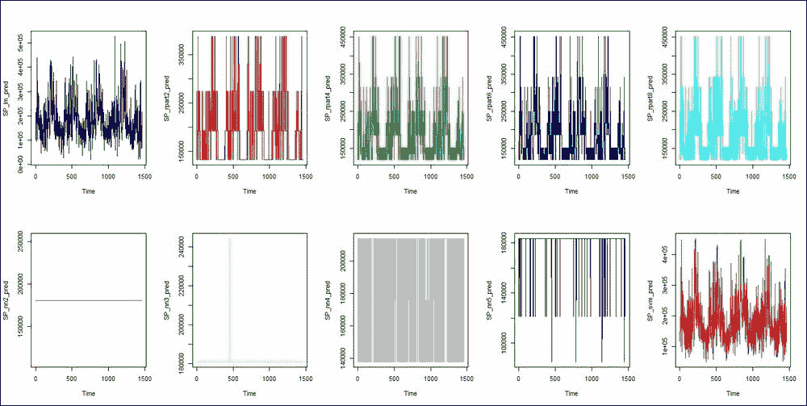

图 3:十个不同基础学习器预测的简单图表

我们可以看到与具有两个或三个隐藏神经元的神经网络模型相关的预测在预测中没有产生变化。因此，我们从进一步的分析中删除这两个模型。集成预测只是其余八个模型预测的平均值:

```
> Avg_Ensemble_Prediction <- rowMeans(cbind(SP_lm_pred,SP_rpart2_pred,
+     SP_rpart4_pred,SP_rpart6_pred,
+                SP_rpart8_pred,SP_nn4_pred,SP_nn5_pred,SP_svm_pred))
> plot.ts(Avg_Ensemble_Prediction)
```

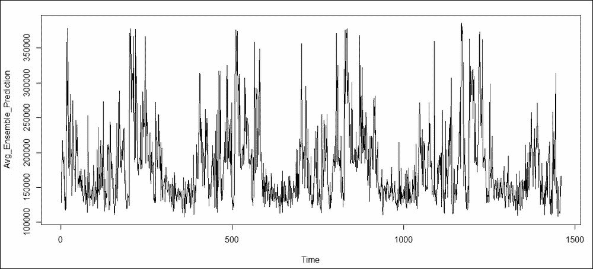

图 4:房屋数据集的集成预测

随着简单投票向加权投票的扩展，我们现在来看看加权平均。


## 加权平均

在分类器的情况下，从训练数据集的分类器的准确度中选择权重。在这种情况下，我们需要这样的统一措施。如果回归模型具有较小的残差方差，则它是首选模型，我们将选择方差作为准确性的度量。假设弱基模型 *i* 的估计残差方差为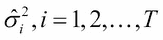。在集成神经网络的背景下，Perrone 和 Cooper (1993)声称第*和第*个弱碱模型的最佳权重可以使用以下等式获得:

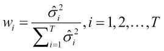

由于比例常数无关紧要，我们将简单地用剩余平方的平均值代替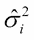。在这个方向上，我们将首先通过简单计算简单平均环境中考虑的八个模型的`mean(residuals(model)^2)`,获得达到常数的,如下所示:

```
> # Weighted Averaging
> SP_lm_sigma <- mean(residuals(SP_lm)^2)
> SP_rp2_sigma <- mean(residuals(SP_rpart2)^2)
> SP_rp4_sigma <- mean(residuals(SP_rpart4)^2)
> SP_rp6_sigma <- mean(residuals(SP_rpart6)^2)
> SP_rp8_sigma <- mean(residuals(SP_rpart8)^2)
> SP_nn4_sigma <- mean(residuals(SP_nn4)^2)
> SP_nn5_sigma <- mean(residuals(SP_nn5)^2)
> SP_svm_sigma <- mean(residuals(SP_svm)^2)
```

接下来，我们简单地用下面的公式实现权重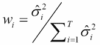:

```
> sigma_sum <- SP_lm_sigma + SP_rp2_sigma + SP_rp4_sigma +
+   SP_rp6_sigma + SP_rp8_sigma + SP_nn4_sigma +
+   SP_nn5_sigma + SP_svm_sigma
> sigma_sum
[1] 20727111061
> SP_lm_wts <- SP_lm_sigma/sigma_sum
> SP_rp2_wts <- SP_rp2_sigma/sigma_sum
> SP_rp4_wts <- SP_rp4_sigma/sigma_sum
> SP_rp6_wts <- SP_rp6_sigma/sigma_sum
> SP_rp8_wts <- SP_rp8_sigma/sigma_sum
> SP_nn4_wts <- SP_nn4_sigma/sigma_sum
> SP_nn5_wts <- SP_nn5_sigma/sigma_sum
> SP_svm_wts <- SP_svm_sigma/sigma_sum
```

`rowMeans`和`cbind`函数只是给出了加权平均预测:

```
> Weighted_Ensemble_Prediction <- rowMeans(cbind(SP_lm_wts*SP_lm_pred,
+                                           SP_rp2_wts*SP_rpart2_pred,
+                                           SP_rp4_wts*SP_rpart4_pred,
+                                           SP_rp6_wts*SP_rpart6_pred,
+                                           SP_rp8_wts*SP_rpart8_pred,
+                                           SP_nn4_wts*SP_nn4_pred,
+                                           SP_nn5_wts*SP_nn5_pred,
+                                           SP_svm_wts*SP_svm_pred))
> plot.ts(Weighted_Ensemble_Prediction)
```

上述代码的输出如下:

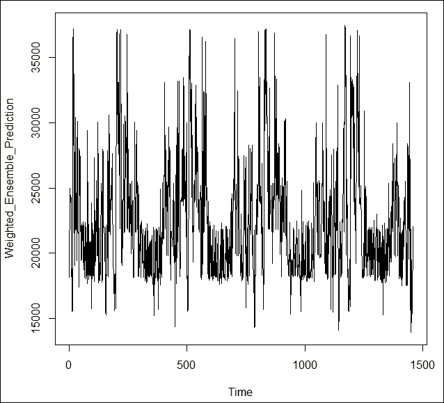

图 5:住房价格的加权平均预测


# 堆叠组装

堆叠回归的介绍性和激励性示例在[第 1 章](part0012_split_000.html#BE6O2-2006c10fab20488594398dc4871637ee "Chapter 1. Introduction to Ensemble Techniques")、*集成技术介绍*中提供。在这里，我们将继续讨论以前没有开发的回归问题的堆叠系综。

使用堆叠集成，几个弱模型的输出作为输入变量，与用于构建早期模型的协变量一起，构建一个堆叠模型。堆栈模型的形式可能是其中之一，也可能是不同的模型。这里，我们将简单地使用八个回归模型(在前面的章节中使用)作为弱模型。选择叠加回归模型作为梯度推进模型，并给出新模型的原始输入变量和预测，如下所示:

```
> SP_lm_train <- predict(SP_lm,newdata=ht_imp)
Warning message:
In predict.lm(SP_lm, newdata = ht_imp) :
  prediction from a rank-deficient fit may be misleading
> SP_rpart2_train <- predict(SP_rpart2,newdata=ht_imp)
> SP_rpart4_train <- predict(SP_rpart4,newdata=ht_imp)
> SP_rpart6_train <- predict(SP_rpart6,newdata=ht_imp)
> SP_rpart8_train <- predict(SP_rpart8,newdata=ht_imp)
> SP_nn4_train <- predict(SP_nn4,newdata=ht_imp)
> SP_nn5_train <- predict(SP_nn5,newdata=ht_imp)
> SP_svm_train <- predict(SP_svm,newdata=ht_imp)
> 
> ht_imp2 <- cbind(ht_imp[,-69],SP_lm_train,SP_rpart2_train,SP_rpart4_train,
+                           SP_rpart6_train,SP_rpart8_train,SP_nn4_train,SP_nn5_train,
+                           SP_svm_train,ht_imp[,69])
> names(ht_imp2)[77] <- "SalePrice"
> SP_gbm <- gbm(hf,data=ht_imp2,distribution = "gaussian",n.trees=200)
> headtail(predict(SP_gbm,n.trees=100),20)
 [1] 180260.6 177793.3 181836.9 177793.3 191927.7 177793.3 191927.7 182237.3
 [9] 177793.3 177793.3 177793.3 191927.7 177793.3 187520.7 177793.3 177793.3
[17] 177793.3 177793.3 177793.3 177793.3 177908.2 177793.3 191927.7 177793.3
[25] 177793.3 177793.3 177793.3 191927.7 177793.3 177793.3 177793.3 191927.7
[33] 177793.3 177793.3 177793.3 177793.3 179501.7 191927.7 177793.3 177793.3
```

这就结束了我们对堆积系综回归的简单讨论。


# 总结

在这一章中，我们看了为什么集成在分类问题的背景下工作。一系列详细的程序说明了每个分类器必须比随机猜测更好。我们考虑了所有分类器具有相同精度、不同精度的情况，以及最终具有完全任意精度的情况。在随机森林和 bagging 方法的背景下说明了多数和加权投票。对于回归问题，我们使用不同的基础学习器选择，并允许他们是异类。结合住房销售价格数据说明了简单平均法和加权平均法。堆叠回归的一个简单说明最终结束了本章的技术部分。

在下一章中，我们将研究集成诊断。