# 八、集成诊断

在前面的章节中，集成方法被发现是有效的。在前一章中，我们看了集成方法提高预测整体准确性的情景。以前假设不同的基础学习器是相互独立的。然而，除非我们有一个非常大的样本，并且基础模型是使用一组独特观察的学习器，这样的假设是非常不切实际的。即使我们有足够大的样本来相信分区是不重叠的，每个基本模型都建立在不同的分区上，并且每个分区携带与任何其他分区相同的信息。然而，像这样的验证很难测试，所以我们需要使用各种技术来验证同一数据集上的基础模型的独立性。为此，我们将研究各种不同的方法。本章将从对集成诊断需求的简短讨论开始，基础模型中多样性的重要性将在下一节讨论。对于分类问题，分类器之间可以相互比较。然后，我们可以进一步评估集成的相似性和准确性。实现这一任务的统计检验将在第三部分介绍。最初，将一个基础学习器与另一个进行比较，然后我们将在一个步骤中查看集成的所有模型。

本章将涉及的主题如下:

*   集成诊断
*   集成多样性
*   成对比较
*   评级机构间协议


# 技术要求

我们将在本章中使用以下库:

*   `rpart`


# 什么是集成诊断？

集成方法的威力在前面的章节中已经演示过了。具有决策树的集成形成同质集成，这是第三章、*打包*到第六章、*提升细化*的主题。在[第 1 章](part0012_split_000.html#BE6O2-2006c10fab20488594398dc4871637ee "Chapter 1. Introduction to Ensemble Techniques")、*合奏技术介绍*和[第 7 章](part0051_split_000.html#1GKCM1-2006c10fab20488594398dc4871637ee "Chapter 7. The General Ensemble Technique")、*一般合奏技术*中，我们对堆叠合奏有所了解。集成中的一个中心假设是模型是相互独立的。然而，这种假设很少是正确的，我们知道相同的数据分区被反复使用。这并不意味着集成是不好的；在集成应用中预览问题时，我们有充分的理由使用集成。因此，我们需要了解基本模型之间的接近程度，以及它们在预测中的整体接近程度。如果预测彼此接近，那么我们可能需要集成中的那些基础模型。在这里，我们将为德国信贷数据集构建逻辑回归、朴素贝叶斯、SVM 和决策树作为基础模型。这里的分析和程序略有重复，因为它是从前面的章节转来的:

```r
> load("../Data/GC2.RData")
> table(GC2$good_bad)
 bad good 
 300  700 
> set.seed(12345)
> Train_Test <- sample(c("Train","Test"),nrow(GC2),replace = 
+ TRUE,prob = c(0.7,0.3))
> head(Train_Test)
[1] "Test"  "Test"  "Test"  "Test"  "Train" "Train"
> GC2_Train <- GC2[Train_Test=="Train",]
> GC2_TestX <- within(GC2[Train_Test=="Test",],rm(good_bad))
> GC2_TestY <- GC2[Train_Test=="Test","good_bad"]
> GC2_TestY_numeric <- as.numeric(GC2_TestY)
> GC2_Formula <- as.formula("good_bad~.")
> p <- ncol(GC2_TestX)
> ntr <- nrow(GC2_Train) 
> nte <- nrow(GC2_TestX) 
> # Logistic Regression
> LR_fit <- glm(GC2_Formula,data=GC2_Train,family = binomial())
> LR_Predict_Train <- predict(LR_fit,newdata=GC2_Train,
+ type="response")
> LR_Predict_Train <- as.factor(ifelse(LR_Predict_Train>0.5,
+ "good","bad"))
> LR_Accuracy_Train <- sum(LR_Predict_Train==GC2_Train$good_bad)/
+ ntr
> LR_Accuracy_Train
[1] 0.78
> LR_Predict_Test <- predict(LR_fit,newdata=GC2_TestX,
+ type="response")
> LR_Predict_Test_Bin <- ifelse(LR_Predict_Test>0.5,2,1)
> LR_Accuracy_Test <- sum(LR_Predict_Test_Bin==
+ GC2_TestY_numeric)/nte
> LR_Accuracy_Test
[1] 0.757
> # Naive Bayes
> NB_fit <- naiveBayes(GC2_Formula,data=GC2_Train)
> NB_Predict_Train <- predict(NB_fit,newdata=GC2_Train)
> NB_Accuracy_Train <- sum(NB_Predict_Train==
+ GC2_Train$good_bad)/ntr
> NB_Accuracy_Train
[1] 0.767
> NB_Predict_Test <- predict(NB_fit,newdata=GC2_TestX)
> NB_Accuracy_Test <- sum(NB_Predict_Test==GC2_TestY)/nte
> NB_Accuracy_Test
[1] 0.808
> # Decision Tree
> CT_fit <- rpart(GC2_Formula,data=GC2_Train)
> CT_Predict_Train <- predict(CT_fit,newdata=GC2_Train,
+ type="class")
> CT_Accuracy_Train <- sum(CT_Predict_Train==
+ GC2_Train$good_bad)/ntr
> CT_Accuracy_Train
[1] 0.83
> CT_Predict_Test <- predict(CT_fit,newdata=GC2_TestX,
+ type="class")
> CT_Accuracy_Test <- sum(CT_Predict_Test==GC2_TestY)/nte
> CT_Accuracy_Test
[1] 0.706
> # Support Vector Machine
> SVM_fit <- svm(GC2_Formula,data=GC2_Train)
> SVM_Predict_Train <- predict(SVM_fit,newdata=GC2_Train,
+ type="class")
> SVM_Accuracy_Train <- sum(SVM_Predict_Train==
+ GC2_Train$good_bad)/ntr
> SVM_Accuracy_Train
[1] 0.77
> SVM_Predict_Test <- predict(SVM_fit,newdata=GC2_TestX,
+ type="class")
> SVM_Accuracy_Test <- sum(SVM_Predict_Test==GC2_TestY)/nte
> SVM_Accuracy_Test
[1] 0.754
```

在下一部分，我们将强调集成中多样性的必要性。


# 集成多样性

在一个合奏中，我们有许多基础模特——比如说 L 个 T2 模特。对于分类问题，我们使用基本模型作为分类器。如果我们有一个回归问题，我们有作为学习器的基本模型。由于仅在训练数据集上执行诊断，我们将放弃训练和有效分区的约定。为了简单起见，在接下来的讨论中，我们将假设我们有 *N* 个观测值。模型的数量为 *L* 意味着我们对每一个 *N* 观测值都有 *L* 个预测，因此预测的数量为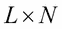。正是在这些预测中，我们试图找到集成的多样性。集成的多样性取决于我们正在处理的问题的类型。首先，我们将考虑回归问题。


## 数值预测

在回归问题的情况下，观测值的预测值可以直接与它们的实际值进行比较。我们可以很容易地看出哪些基础模型的预测更接近实际观察值，而哪些离它很远。如果所有的预测都彼此接近，则基础模型不是多样的。在这种情况下，其中一个预测可能就足够了。如果预测显示出一些差异，通过使用平均值来组合它们可能会提供稳定性。在评估多样性时，了解集成预测与真实观测值的接近程度也很重要。

让我们考虑一个假设的场景，其中我们有六个观察值、它们的实际值、三个基础学习器、学习器的预测和集成预测。下表给出了一个样本数据集，它将帮助您理解集成多样性的复杂性:

| 

观察数

 | 

实际的

 | 

E1

 | 

E2

 | 

E3

 | 

极限压力

 |
| --- | --- | --- | --- | --- | --- |
| one | Thirty | Fifteen | Twenty | Twenty-five | Twenty |
| Two | Thirty | Forty | Fifty | Sixty | Fifty |
| three | Thirty | Twenty-five | Thirty | Thirty-five | Thirty |
| four | Thirty | Twenty-eight | Thirty | Thirty-two | Thirty |
| five | Thirty | Twenty | Thirty | Forty | Thirty |
| six | Thirty | Ten | Fifteen | Sixty-five | Thirty |

> 表 1:六个观察，三个基础学习器，和全体

为了便于比较，在*表 1* 中，所有观测值的真值都保持在 30。六个观察/案例的总体预测范围为 10–65，而总体预测(基础学习器预测的平均值)范围为 20–50。作为理解特定观测和相关预测的集成多样性的第一步，我们将使用以下程序块来可视化数据:

```r
> DN <- read.csv("../Data/Diverse_Numeric.csv")
> windows(height=100,width=100)
> plot(NULL,xlim=c(5,70),ylim=c(0,7),yaxt='n',xlab="X-values",ylab="")
> points(DN[1,2:6],rep(1,5),pch=c(19,1,1,1,0),cex=2)
> points(DN[2,2:6],rep(2,5),pch=c(19,1,1,1,0),cex=2)
> points(DN[3,2:6],rep(3,5),pch=c(19,1,1,1,0),cex=2)
> points(DN[4,2:6],rep(4,5),pch=c(19,1,1,1,0),cex=2)
> points(DN[5,2:6],rep(5,5),pch=c(19,1,1,1,0),cex=2)
> points(DN[6,2:6],rep(6,5),pch=c(19,1,1,1,0),cex=2)
> legend(x=45,y=7,c("Actual","Model","Ensemble"),pch=c(19,1,0))
> axis(2,at=1:6,labels=paste("Case",1:6),las=1)
```

程序的解释在这里。第一行代码从代码包文件夹导入`Diverse_Numeric.csv`数据。`windows (X11)`函数在 Windows (Ubuntu)操作系统中设置一个新的图形设备。然后`plot`功能建立一个空白图，轴的范围规格由`xlim`和`ylim`给出。使用绘图和`points`功能对来自*表 1* 的每一行数据进行浮雕处理。选择`pch`需要进一步澄清。如果我们选择`pch`，例如`19`、`1`和`0`，那么这意味着我们选择了一个实心圆、一个圆和一个正方形。这三种形状将分别表示实际值、模型预测和集成预测。axis 命令帮助我们在正确的显示中获取标签。前面 R 代码块的结果如下图所示:

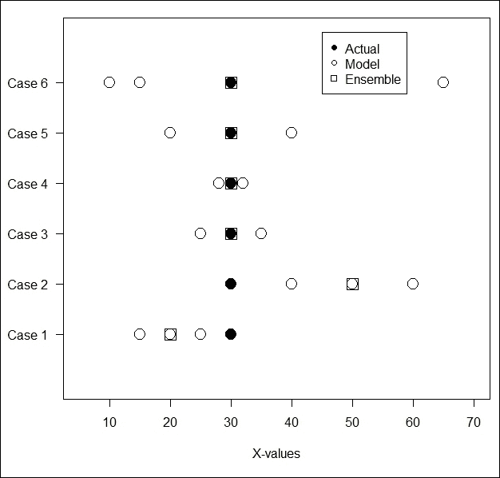

图 1:了解回归问题的集成多样性

我们有六个观察值，每个都被标记为**案例**。首先考虑**案例 1** 。每个观察值的实心圆是实际值，在本例中为 **30** ，这在整个数据集中是相同的。对于这个观测，集成预测是 **20** 。空心方块和由三个基本模型 **15** 、 **20** 和 **25** 预测的值被描绘在空心圆中。集成预测——基础学习器预测的平均值——是 **20** ,用空白方块表示。现在，这三个值不太分散，这被解释为表明该观测的系综不太多样化。因此，这是一个低多样性的例子。 **20** 的估算也与实际相差甚远，可以看出这是一个很差的估算。因此，这是一个*低多样性——估计不足的*案例。

在*表 1* 的第二种情况中，三个预测很好地展开，具有很高的多样性。然而， **50** 的集成估计与 **30** 的实际值相差太远，我们称之为*高分集-差估计*的情况。**情况 3** 和**情况 4** 因此被视为*低分集-良好估计*，因为集成预测与实际值匹配，并且三个集成预测彼此接近。**案例 5** 在多样性和准确性之间取得了很好的平衡，因此我们可以将它称为*高多样性-良好估计*的一个例子。最后一种情况有很好的准确性，尽管差异太大，使得集成预测没有任何好处。你可以参考 Kuncheva (2014)关于多样性困境的更多细节——集成学习器的准确性。

接下来，我们将考虑分类问题的多样性-准确性问题。

### 班级预测

上一节讨论了多样性的问题——回归问题的准确性。在分类问题的情况下，我们可以清楚地标记分类器的预测是否与实际输出/标签匹配。此外，我们只有两个潜在的预测:0 或 1。因此，我们可以比较两个分类器在所有观测中的相互接近程度。例如，对于分类器的两个可能结果和的两个可能结果，对于给定的观察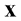，我们有四个可能的场景:

*   预测标签为 1；预测为 1
*   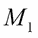预测标签为 1；预测为 0
*   预测标签为 0；预测为 1
*   预测标签为 0；预测为 0

在场景 1 和 4 中，两个分类器*彼此同意*，在场景 2 和 3 中，他们*不同意*。如果我们有 *N* 个观测值，那么用两个模型预测的每个观测值都将落入前面四个场景中的一个。在我们考虑两个或更多模型的同意或不同意的正式度量之前，我们将在接下来的讨论中考虑两个更简单的情况。

有一句流行的话，如果两个人一直意见一致，那么其中一个是不需要的。这类似于分类器的工作方式。同样，说一对鹅是众所周知的非常忠诚；他们相互支持，共同面对问题。现在，如果我们有两个模型，它们在所有的观察中都表现得和这些鹅一样，那么多样性就永远消失了。因此，在任何给定的集成场景中，我们需要消除这对鹅，只保留其中一只。假设我们有一个矩阵，其中列对应于分类器，行对应于 N 个观察值。在这种情况下，我们将定义一个名为`GP`的函数，以及鹅对的缩写，这将告诉我们哪些分类器具有在所有观察中与它们一致的鹅对分类器:

```r
> # Drop the Geese Pair
>GP<- function(Pred_Matrix) {
+   L<- ncol(Pred_Matrix) # Number of classifiers
+   N<- nrow(Pred_Matrix)
+   GP_Matrix <- matrix(TRUE,nrow=L,ncol=L)
+   for(i in 1:(L-1)){
+     for(j in (i+1):L){
+       GP_Matrix[i,j] <- ifelse(sum(Pred_Matrix[,i]==Pred_Matrix[,j])==N,
+                                TRUE,FALSE)
+       GP_Matrix[j,i] <- GP_Matrix[i,j]
+     }
+   }
+   return(GP_Matrix)
+ }
```

鹅对`GP`功能是如何工作的？我们给出一个`matrix`预测作为这个函数的输入，其中列用于分类器，行用于观察值。该函数首先创建一个顺序为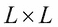的逻辑矩阵，默认逻辑值为`TRUE`。由于分类器显然会与自身一致，所以我们接受默认值。此外，由于分类器同意/不同意的方式与同意/不同意的方式相同，我们利用这一事实通过对称关系来计算下矩阵。在这两个嵌套循环中，我们将一个分类器的预测与所有其他分类器的预测进行比较。`ifelse`函数检查一个分类器的所有预测是否与另一个分类器匹配，如果条件甚至对于单个观察都不成立，我们说考虑中的两个分类器不是鹅对，或者它们至少在一个场合不一致:

接下来，`GP`函数被应用于为分类问题设置的 500 个分类器。`CART_Dummy`数据集取自`RSADBE`包。`CART_DUMMY`数据集和相关问题描述可在 Tattar (2017)第 9 章中找到。我们改编来自同一来源的代码和结果输出:

```r
> data(CART_Dummy)
> CART_Dummy$Y <- as.factor(CART_Dummy$Y)
> attach(CART_Dummy)
> windows(height=100,width=200)
> par(mfrow=c(1,2))
> plot(c(0,12),c(0,10),type="n",xlab="X1",ylab="X2")
> points(X1[Y==0],X2[Y==0],pch=15,col="red")
> points(X1[Y==1],X2[Y==1],pch=19,col="green")
> title(main="A Difficult Classification Problem")
> plot(c(0,12),c(0,10),type="n",xlab="X1",ylab="X2")
> points(X1[Y==0],X2[Y==0],pch=15,col="red")
> points(X1[Y==1],X2[Y==1],pch=19,col="green")
> segments(x0=c(0,0,6,6),y0=c(3.75,6.25,2.25,5),
+          x1=c(6,6,12,12),y1=c(3.75,6.25,2.25,5),lwd=2)
> abline(v=6,lwd=2)
> title(main="Looks a Solvable Problem Under Partitions")
```

从程序中可以看出，这里有三个变量:`X1`、`X2`和`Y`。用`Y`表示的变量是一个二元变量——一个类用绿色表示，另一个用红色表示。使用由`X1`和`X2`变量提供的信息，目标是预测`Y`的类别。红色和绿色色点混合在一起，因此单个线性分类器不足以将红色和绿色分开。然而，如果我们通过`X1`和`X2`递归划分数据空间，如结果图右侧所示，如图*图 2* 所示，红色和绿色看起来是可分的。前面的 R 代码块产生了下图:

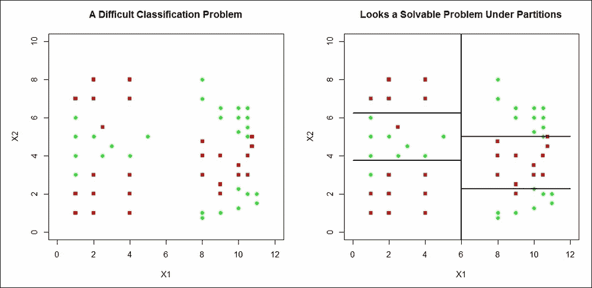

图 2:一个典型的分类问题

为`CART_DUMMY`数据集建立一个带有`500`棵树的随机森林。固定种子确保这里的输出在任何执行中都是可再现的。使用拟合的随机森林，我们接下来使用`500`树预测所有观测的输出。`type="class"`和`predict.all=TRUE`选项是这个代码块的核心。然后将`GP`函数应用于`500`树的预测矩阵。请注意，`GP`矩阵的对角线元素将始终是`TRUE`。因此，如果有任何分类器与它在所有观察上完全一致，则该单元的值将是`TRUE`。如果行总和超过计数 2，我们有一个鹅分类器。以下代码捕获了整个计算过程:

```r
> CD <- CART_Dummy 
> CD$Y <- as.factor(CD$Y)
> set.seed(1234567)
> CD_RF <- randomForest(Y~.,data=CD,ntree=500)
> CD_RF_Predict <- predict(CD_RF,newdata=CD,
+                           type="class",predict.all=TRUE)
> CD_RF_Predict_Matrix <- CD_RF_Predict$individual
> CD_GP <- GP(CD_RF_Predict_Matrix)
> CD_GP[1:8,1:8]
      [,1]  [,2]  [,3]  [,4]  [,5]  [,6]  [,7]  [,8]
[1,]  TRUE FALSE FALSE FALSE FALSE FALSE FALSE FALSE
[2,] FALSE  TRUE FALSE FALSE FALSE FALSE FALSE FALSE
[3,] FALSE FALSE  TRUE FALSE FALSE FALSE FALSE FALSE
[4,] FALSE FALSE FALSE  TRUE FALSE FALSE FALSE FALSE
[5,] FALSE FALSE FALSE FALSE  TRUE FALSE FALSE FALSE
[6,] FALSE FALSE FALSE FALSE FALSE  TRUE FALSE FALSE
[7,] FALSE FALSE FALSE FALSE FALSE FALSE  TRUE FALSE
[8,] FALSE FALSE FALSE FALSE FALSE FALSE FALSE  TRUE
> rowSums(CD_ST)
  [1] 1 1 1 1 1 1 1 1 1 1 1 1 1 1 1 1 1 1 1 1 2 1 1 1 1 1 1 1 1 1 1 1 1 1 1 1 1
 [38] 1 1 1 1 2 1 1 1 1 1 1 1 1 1 1 1 1 1 1 1 1 1 1 1 1 1 1 1 1 1 1 1 1 1 1 1 1

 [149] 1 1 1 1 1 1 1 1 1 1 1 1 1 1 1 1 1 1 1 1 1 1 1 1 1 1 1 2 1 1 1 1 1 1 1 1 1
[186] 1 1 2 1 1 1 1 1 1 1 1 1 1 1 1 1 1 1 1 1 2 1 1 1 1 1 1 1 1 1 1 1 1 1 1 2 1
[223] 1 1 1 1 1 1 1 1 1 1 1 1 1 1 1 1 1 1 1 1 1 1 1 1 1 1 1 1 1 1 1 1 1 2 1 1 1
[260] 1 1 1 1 1 1 1 1 1 1 1 1 1 1 1 1 1 1 2 1 1 1 1 1 1 1 1 1 1 1 2 1 1 1 1 1 1
[297] 1 1 1 1 1 1 1 1 1 1 1 1 1 1 1 1 1 1 1 1 1 1 1 1 1 1 1 1 1 1 1 1 1 1 1 1 1
[334] 1 1 1 1 1 1 1 1 1 1 1 1 1 1 1 1 1 1 1 1 1 1 1 1 1 1 1 1 1 2 1 2 1 1 1 1 1
[371] 1 1 1 1 1 1 1 1 1 1 1 1 1 1 2 1 1 1 1 1 1 1 1 1 1 1 1 1 1 1 1 1 1 1 1 1 1
[408] 1 1 1 1 1 1 1 1 1 1 1 1 1 1 1 1 2 1 1 1 1 1 1 1 1 1 1 1 1 1 1 1 1 1 2 1 1

[482] 1 1 1 1 1 1 1 1 1 1 1 1 1 1 1 1 1 1 1
```

读者应该注意到，前面输出中的粗体和较大字体 2 不是由 r 给出的。它已经被处理文本内容的软件修改过。因此，我们有许多分类器，它们有一个鹅分类器来匹配它们自己的预测。使用 which 函数，我们首先找到满足标准的所有分类器索引，然后，通过对`CD_GP`矩阵的行应用 which 函数，我们得到相关联的鹅分类器:

```r
> which(rowSums(CD_GP)>1)
 [1]  21  42 176 188 206 221 256 278 290 363 365 385 424 442
> which(CD_GP[21,]==TRUE)
[1]  21 188
> which(CD_GP[42,]==TRUE)
[1]  42 290
> which(CD_GP[176,]==TRUE)
[1] 176 363
> which(CD_GP[206,]==TRUE)
[1] 206 256
> which(CD_GP[221,]==TRUE)
[1] 221 278
> which(CD_GP[365,]==TRUE)
[1] 365 424
> which(CD_GP[385,]==TRUE)
[1] 385 442
```

作为运行前面代码的结果，我们能够识别与分类器相关联的鹅分类器。我们可以选择移除鹅对中的任何一个成员。在下一个例子中，我们将把这个方法应用于德国的信用数据。该程序尝试按如下方式识别鹅分类器:

```r
> set.seed(12345)
> GC2_RF3 <- randomForest(GC2_Formula,data=GC2_Train,mtry=10,
+                         parms = list(split="information",
+                                      loss=matrix(c(0,1,1000,0),byrow = TRUE,nrow=2)),
+                         ntree=1000)
> GC2_RF_Train_Predict <- predict(GC2_RF3,newdata=GC2_Train,
+                                 type="class",predict.all=TRUE)
> GC2_RF_Train_Predict_Matrix <- GC2_RF_Train_Predict$individual
> GC2_GP <- GP(GC2_RF_Train_Predict_Matrix)
> rowSums(GC2_GP)
   [1] 1 1 1 1 1 1 1 1 1 1 1 1 1 1 1 1 1 1 1 1 1 1 1 1 1 1 1 1 1 1 1 1 1 1 1 1
  [37] 1 1 1 1 1 1 1 1 1 1 1 1 1 1 1 1 1 1 1 1 1 1 1 1 1 1 1 1 1 1 1 1 1 1 1 1

[973] 1 1 1 1 1 1 1 1 1 1 1 1 1 1 1 1 1 1 1 1 1 1 1 1 1 1 1 1
> which(rowSums(GC2_GP)>1)
integer(0)
```

由于没有一个分类器有相应的鹅分类器，我们不必消除任何树。

在 Kuncheva (2014)的第 112 页中，有一个称为 *oracle 输出*的有用指标。接下来，我们正式定义数量。记住我们有 *L* 个分类器和 *N* 个观察值。标签的原始/实际值用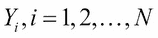表示。我们将使用分类器 j 通过来表示第 I 个预测值。

**甲骨文输出**:如果预测值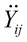等于，则甲骨文输出定义为**1**；否则定义为 **0** 。在数学术语中，oracle 输出使用以下数学表达式给出:


那么，oracle 输出和预测之间的差异是什么呢？预测由数据的标签组成，这些标签可能是 1/0、好/坏、+1/-1、是/否或其他二元标签对。此外，在二进制标签的情况下，1 的预测不一定意味着原始值是 1；也可能是 0。如果 1 被预测为 1，或者如果 0 被预测为 0，则 oracle 输出取值 1；否则，它取值为 0。使用 oracle 输出的一个结果是，分类器的 1 的比例将为我们提供分类器的准确性。

我们现在将创建一个名为`Oracle`的 R 函数，当它是预测矩阵和实际标签的输入时，它将给出 oracle 输出。在此之后，我们将计算分类器的准确度:

```r
> # Oracle Output
> Oracle <- function(PM,Actual){
+   # PM = Prediction Matrix, Actual = the true Y's
+   OM <- matrix(0,nrow=nrow(PM),ncol=ncol(PM))
+   for(i in 1:ncol(OM)) {
+     OM[,i] <- as.numeric(PM[,i]==Actual)
+   }
+   return(OM)
+ }
> GC_Oracle <- Oracle(PM=GC2_RF_Train_Predict$individual,
+                     Actual=GC2_Train$good_bad)
> colSums(GC_Oracle)/nrow(GC_Oracle)
   [1] 0.872 0.884 0.859 0.869 0.866 0.878 0.888 0.872 0.869 0.875 0.885 0.869
  [13] 0.881 0.866 0.879 0.856 0.870 0.869 0.857 0.870 0.878 0.868 0.886 0.892
  [25] 0.881 0.863 0.866 0.856 0.886 0.876 0.873 0.879 0.875 0.885 0.872 0.872

[973] 0.860 0.873 0.869 0.888 0.863 0.879 0.882 0.865 0.891 0.863 0.878 0.879
 [985] 0.878 0.869 0.856 0.872 0.889 0.881 0.868 0.881 0.884 0.854 0.882 0.882
 [997] 0.862 0.884 0.873 0.885
```

oracle matrix 帮助我们获得分类器的准确性。在下一节中，我们将讨论一些有助于我们理解分类器之间有多接近的方法。


## 成对测量

在本节中，我们将提出两个分类器之间的一些一致性度量。目的是确定两个分类器一致/不一致的概念，然后在下一节中把这个概念应用到整体分类器中。如果和是带有预测的分类器模型，那么我们可以获得一个表，该表给出了以下内容:

*   预测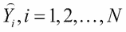为 1；预言它为 1
*   预测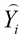为 1；预测为 0
*   预测为 0；预言它为 1
*   预测为 0；预测为 0

跨越 *N* 个观察值的信息可以用表格形式表示，如下所示:

|   | 

M1 预测 1

 | 

M1 预测 0

 |
| --- | --- | --- |
| M2 预测 1 | n11 | n10 |
| M2 预测 0 | n01 | n00 |

表 2:两个分类者/评定者的列联表

上表的对角线元素显示了两个模型/分类器之间的一致性，而非对角线元素显示了不一致性。这些模特有时被称为 T2 评委。频率表也被称为作为**列联表**。利用这个设置，我们现在将讨论*协议*的一些有用的措施。这种比较称为成对度量，因为我们在分析中只采用一对分类器。


## 不一致度量

两个分类器/速率之间的不一致度量根据以下公式定义:

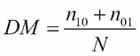

我们现在将定义一个`DM`函数，给出两个分类器的预测。该函数将首先为预测准备列联表。不一致度量的计算很简单，在下面的代码块中给出:

```r
> # Disagreement Measure
> DM <- function(prediction1,prediction2){
+   tp <- table(prediction1,prediction2)
+   Diss <- (tp[1,2]+tp[2,1])/length(prediction1)
+   return(Diss)
+ }
```

在第一部分中，我们基于逻辑回归模型朴素贝叶斯、SVM 和分类树对德国信贷数据进行了预测。现在，我们将 DM 函数应用于这些预测，并查看这些分类器之间的差异程度:

```r
> DM(LR_Predict_Train,NB_Predict_Train)
[1] 0.121
> DM(LR_Predict_Train,CT_Predict_Train)
[1] 0.154
> DM(LR_Predict_Train,SVM_Predict_Train)
[1] 0.153
> DM(NB_Predict_Train,CT_Predict_Train)
[1] 0.179
> DM(NB_Predict_Train,SVM_Predict_Train)
[1] 0.154
> DM(CT_Predict_Train,SVM_Predict_Train)
[1] 0.167
```

因为我们有四个分类器，所以将有 3 + 2 + 1 = 6 个成对比较。朴素贝叶斯和分类树的不一致性最大，而逻辑回归和朴素贝叶斯分类器之间的不一致性最小。DM 测量可用于轻松获得两个模型的不一致。


## 尤尔统计或 Q 统计

尤尔系数是一致性的度量，当它的值几乎等于为零时，它将给出两个评价者之间的不一致。使用以下公式给出 Yule 的测量值:

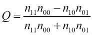

Q 统计采用相关系数范围内的值，即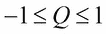。因此，如果 Q 值更接近 1，这意味着两个测量值几乎总是彼此一致，而更接近-1 的值意味着两个模型预测彼此相反。当 Q 值接近 0 时，意味着两个评价者之间的关联非常弱。创建一个`Yule`函数，并将其应用于以下代码块中的不同模型预测:

```r
> # Q-statistic 
> Yule <- function(prediction1,prediction2){
+   tp <- table(prediction1,prediction2)
+   Yu <- (tp[1,1]*tp[2,2]-tp[1,2]*tp[2,1])/(tp[1,1]*tp[2,2]+tp[1,2]*tp[2,1])
+   return(Yu)
+ }
> Yule(LR_Predict_Train,NB_Predict_Train)
[1] 0.949
> Yule(LR_Predict_Train,CT_Predict_Train)
[1] 0.906
> Yule(LR_Predict_Train,SVM_Predict_Train)
[1] 0.98
> Yule(NB_Predict_Train,CT_Predict_Train)
[1] 0.865
> Yule(NB_Predict_Train,SVM_Predict_Train)
[1] 0.985
> Yule(CT_Predict_Train,SVM_Predict_Train)
[1] 0.912
```

朴素贝叶斯预测和 SVM 预测之间的一致性最高。请注意，如果我们采用不一致度量的补充，并使用以下代码轻松执行，我们将获得以下一致度量:

```r
> 1-DM(LR_Predict_Train,NB_Predict_Train)
[1] 0.879
> 1-DM(LR_Predict_Train,CT_Predict_Train)
[1] 0.846
> 1-DM(LR_Predict_Train,SVM_Predict_Train)
[1] 0.847
> 1-DM(NB_Predict_Train,CT_Predict_Train)
[1] 0.821
> 1-DM(NB_Predict_Train,SVM_Predict_Train)
[1] 0.846
> 1-DM(CT_Predict_Train,SVM_Predict_Train)
[1] 0.833
```

然而，该分析表明，逻辑回归和朴素贝叶斯评分者之间的一致性最高。因此，我们注意到输出和比较可能导致不同的结论。也可以为两个评价人计算相关系数；我们将在接下来讨论这个问题。


## 相关系数度量

两个数值变量之间的相关系数非常直观，当它们之间存在线性关系时，它也是一个非常有用的关系度量。如果两个变量本质上都是分类的，那么我们仍然可以获得它们之间的相关系数。对于两个评定者，相关系数使用以下公式计算:

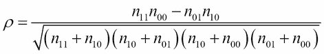

我们将定义一个`SS_Cor`函数，它将执行必要的计算并返回相关系数:

```r
> # Correlation coefficient 
> # Sneath and Sokal, 1973
> SS_Cor <- function(prediction1, prediction2){
+   tp <- table(prediction1,prediction2)
+   a <- tp[1,1]; b <- tp[2,1]; c <- tp[1,2]; d <- tp[2,2]
+   SS <- (a*d-b*c)/sqrt(exp(log(a+b)+log(a+c)+log(c+d)+log(b+d)))
+   return(SS)
+ }
```

相关性系数函数现在应用于预测，如前面的示例所示:

```r
> SS_Cor(LR_Predict_Train,NB_Predict_Train)
[1] 0.69
> SS_Cor(LR_Predict_Train,CT_Predict_Train)
[1] 0.593
> SS_Cor(LR_Predict_Train,SVM_Predict_Train)
[1] 0.584
> SS_Cor(NB_Predict_Train,CT_Predict_Train)
[1] 0.531
> SS_Cor(NB_Predict_Train,SVM_Predict_Train)
[1] 0.587
> SS_Cor(CT_Predict_Train,SVM_Predict_Train)
[1] 0.493
```

结果表明，逻辑和朴素贝叶斯预测比任何其他组合更一致。相关性测试可用于检查分类器的预测是否相互独立。

**练习**:在这里应用`chisq.test`来检查各种分类器预测的独立性。


## 科恩的统计

科恩的统计数据于 1960 年首次出现。它是基于两个评分者因偶然或巧合而达成一致的概率。两个评定者相互同意的概率如下所示:

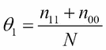

然而，随机或偶然同意的概率如下:

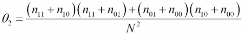

使用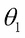和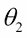的定义，科恩统计量定义如下:

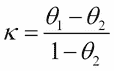

科恩的 kappa 也可以接受负值。如果它的值是 1，这意味着评分者彼此完全同意。值为 0 表示约定只是偶然，负值表示约定偶然少于预期数。首先，在下面的代码中创建 R 函数`Kappa`:

```r
> # Kappa-statistic 
> # Cohen's Statistic
> Kappa <- function(prediction1, prediction2){
+   tp <- table(prediction1,prediction2)
+   a <- tp[1,1]; b <- tp[2,1]; c <- tp[1,2]; d <- tp[2,2]
+   n <- length(prediction1)
+   theta1 <- (a+d)/n
+   theta2 <- (((a+b)*(a+c))+((c+d)*(b+d)))/n^2
+   kappa <- (theta1-theta2)/(1-theta2)
+   return(kappa)
+ }
```

编码部分是公式的清晰实现，并选择了`a`、`b`、`c`、`d`、`theta1`和`theta2`，使代码易于理解和遵循。接下来，我们将预测应用于德国训练数据集:

```r
> Kappa(LR_Predict_Train,NB_Predict_Train)
[1] 0.69
> Kappa(LR_Predict_Train,CT_Predict_Train)
[1] 0.592
> Kappa(LR_Predict_Train,SVM_Predict_Train)
[1] 0.524
> Kappa(NB_Predict_Train,CT_Predict_Train)
[1] 0.53
> Kappa(NB_Predict_Train,SVM_Predict_Train)
[1] 0.525
> Kappa(CT_Predict_Train,SVM_Predict_Train)
[1] 0.453
```

同样，逻辑和朴素贝叶斯预测之间的一致性最高。我们现在进入最后一个分歧衡量标准。


## 双故障测量

在网球中，双误是指发球失败。发球者有两次机会获得正确的发球，如果他们没有，这一分就让给了对手。当两个分类器都得到错误的预测时，发生双重错误测量:

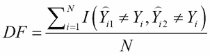

显然，我们需要 DF 尽可能低，接近 0。这个函数很容易解释，所以这将留给读者去做练习。双故障测量的 R 函数及其应用在下面的代码中给出:

```r
> # Double-fault Measure
> Double_Fault <- function(prediction1,prediction2,actual){
+   DF <- sum((prediction1!=actual)*(prediction2!=actual))/
+         length(actual)
+   return(DF)
+ }
> Double_Fault(LR_Predict_Train,NB_Predict_Train,
+ GC2_Train$good_bad)
[1] 0.166
> Double_Fault(LR_Predict_Train,CT_Predict_Train,
+ GC2_Train$good_bad)
[1] 0.118
> Double_Fault(LR_Predict_Train,SVM_Predict_Train,
+ GC2_Train$good_bad)
[1] 0.148
> Double_Fault(NB_Predict_Train,CT_Predict_Train,
+ GC2_Train$good_bad)
[1] 0.709
> Double_Fault(NB_Predict_Train,SVM_Predict_Train,
+ GC2_Train$good_bad)
[1] 0.154
> Double_Fault(CT_Predict_Train,SVM_Predict_Train,
+ GC2_Train$good_bad)
[1] 0.116
```

读者应该通过使用双故障测量来识别最佳协议。

**练习**:在多边标签(超过两个类别)的情况下，本节讨论的指标扩展变得很麻烦。相反，可以使用 oracle 矩阵并重复这些指标。读者应该将这些方法应用到 oracle 输出中。

到目前为止讨论的方法仅适用于一个分类器对。在下一节中，我们将测量集成中所有分类器的多样性。


# 互签协议

上一节中讨论的关于集组件类器的度量的简单扩展是计算集成的所有可能对的度量，然后简单地对所有这些值进行平均。这项任务构成了下一个练习。

**练习**:对于系综对的所有可能组合，计算不一致测度、Yule 统计量、相关系数、Cohen kappa 和双错测度。这样做之后，获得比较的平均值，并将其报告为总体差异。

在这里，我们将提出多样性的替代度量，并以熵度量开始讨论。在本节的所有讨论中，我们将使用 oracle 输出。


## 熵度量

你可能记得我们根据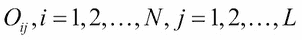来表示甲骨文的输出。对于一个特定的实例，如果错误分类的分类器的数量是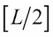，则集成是最多样化的。这意味着中的为 0，其余的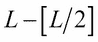、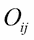为 1。然后，系综的*熵度量定义如下:*

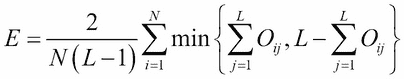

熵测度 E 的值在单位区间内。如果 E 值更接近 0，这个意味着集成中没有多样性，而接近 1 的值意味着多样性处于最高可能水平。给定 oracle 矩阵，我们可以很容易地计算熵度量，如下所示:

```r
> # Entropy Measure
> # Page 250 of Kuncheva (2014)
> Entropy_Measure <- function(OM){
+   # OM = Oracle Matrix
+   N <- nrow(OM); L <- ncol(OM)
+   E <- 0
+   for(i in 1:N){
+     E <- E+min(sum(OM[i,]),L-sum(OM[i,]))
+   }
+   E <- 2*E/(N*(L-1))
+   return(E)
+ }
> Entropy_Measure(GC_Oracle)
[1] 0.255
```

通过将的`Entropy_Measure`应用于德国信贷数据的集成，我们可以看到熵度量值是`0.255`。由于熵测度不接近 0，随机森林集成表现出多样性。但是，它也远离 1，这意味着多样性。然而，没有临界值或测试来解释多样性是否太低，甚至太高。


## 科哈维-沃伯特测量

Kohavi–WOL pert 测量值基于 1 或 0 的预测方差。它基于分类器错误率的分解公式。对于二元问题，或者使用 oracle input 时，方差与基尼指数相同。这是根据以下公式给出的:

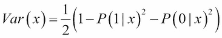

Kohavi–WOL pert 测量值是所有观测值方差的平均值。通过使用 oracle matrix 给出的预测概率,或者作为拟合对象的副产品，我们可以获得方差，然后对所有观测值进行平均。现在创建了一个 R 函数，并将其应用于从德国信贷数据获得的一些预测，如下所示:

```r
> # Kohavi-Wolpert variance 
> # Using the predicted probability
> KW <- function(Prob){
+   N <- nrow(Prob)
+   kw <- mean(1-Prob[,1]^2-Prob[,2]^2)/2
+   return(kw)
+ }
> GC2_RF_Train_Predict_Prob <- predict(GC2_RF3,newdata=GC2_Train,
+                                 type="prob",predict.all=TRUE)
> GC2_RF_Train_Prob <- GC2_RF_Train_Predict_Prob$aggregate
> KW(GC2_RF_Train_Prob)
[1] 0.104
```

Kohavi–WOL pert 度量也可以使用 oracle 输出获得。我们定义了一个数学实体，它将计算正确分类观测值的分类器数量，如下所示:

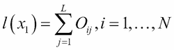

被正确预测的概率如下:

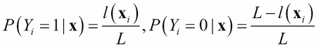

使用这些概率，方差可以如下获得:

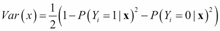

该方法在以下代码中使用`KW_OM`函数实现:

```r
> # Using the Oracle matrix
> KW_OM<- function(OM){
+   # OM is the oracle matrix
+   N <- nrow(OM); L <- ncol(OM)
+   kw <- 0
+   for(i in 1:N){
+     lz <- sum(OM[i,])
+     kw <- kw + lz*(L-lz)
+   }
+   kw <- kw/(N*L^2)
+   return(kw)
+ }
> KW_OM(GC_Oracle)
[1] 0.104
```

由此可见，两种方法给我们的结果是一样的。同样清楚的是，在构建了随机森林之后，我们没有太多的多样性。


## 集成的不一致度量

两个分类器之间的不一致度量可以使用以下公式定义:

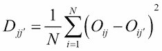

集成的不一致度量由下式给出:

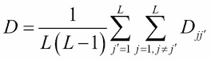

Kohavi–WOL pert 和不一致测量的关系如下:


下一个 R 代码块使用 oracle 输出实现 Kohavi–WOL per 测量，如下所示:

```r
> # Disagreement Measure OVerall on Oracle Matrix
> DMO <- function(OM){
+   # OM is the oracle matrix
+   N <- nrow(OM); L <- ncol(OM)
+   dmo <- 0
+   for(i in 1:L){
+     for(j in c(c(1:L)[c(1:L)!=i])){
+       dmo <- dmo + sum((OM[,i]-OM[,j])^2)/N
+     }
+   }
+   dmo <- dmo/(L*(L-1))
+   return(dmo)
+ }
> DM_GC <- DMO(OM=GC_Oracle)
> DM_GC
[1] 0.208
> KW(GC_Oracle)
[1] 0.104
> DM_GC*999/2000
[1] 0.104
```

同样，我们看不到合奏中表现出的多样性。我们现在将继续关注合奏多样性的最终衡量标准。


## 评价者间一致性的测量

在对 oracle 输出的介绍性讨论中，我们展示了如何轻松地使用它来获得分类器的准确性。分类器精度的平均值定义为平均个体分类精度，用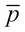表示。评定者间协议的衡量由以下内容定义:

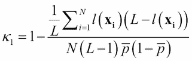

该指标与 Kohavi–WOL pert 指标的关系如下:


借助下面的代码块，可以理解上述关系的实现:

```r
> Avg_Ensemble_Acc <- function(Oracle){
+   return(mean(colSums(GC_Oracle)/nrow(GC_Oracle)))
+ }
> Avg_Ensemble_Acc(GC_Oracle)
[1] 0.872
> Kappa <- function(Oracle){
+   pbar <- Avg_Ensemble_Acc(Oracle)
+   AvgL <- 0
+   N <- nrow(Oracle); L <- ncol(Oracle)
+   for(i in 1:N){
+     lz <- sum(Oracle[i,])
+     AvgL <- AvgL + lz*(L-lz)
+   }
+   Avgl <- AvgL/L
+   kappa <- 1-Avgl/(N*(L-1)*pbar*(1-pbar))
+   return(kappa)
+ }
> Kappa(GC_Oracle)
[1] 0.0657
> 1-DM_GC/(2*Avg_Ensemble_Acc(GC_Oracle)*(1-
+ Avg_Ensemble_Acc(GC_Oracle)))
[1] 0.0657
```

我们对协议的讨论到此结束。


# 总结

已经发现集成方法对于分类、回归和其他相关问题非常有效。任何统计和机器学习方法都必须始终遵循适当的诊断。所有基本模型相互独立的假设是集成方法成功的关键。然而，这种独立性条件很少得到满足，尤其是因为基础模型建立在相同的数据集上。我们用最简单的方法开始了这一章:雁对法。有了这个，我们基本上就在寻找始终彼此一致的模型。如果集成中存在这样的模型，则移除其中一个会更安全。对于一个大的数据集和大量的变量，确实有可能不会有任何基础模型使用相同的语言。但是，我们仍然需要检查它们是否相等。考虑到这一点，我们首先提出了一次只比较两个基本模型的方法。不同的衡量标准会导致相互矛盾的结论。然而，这通常不是问题。然后，成对比较的概念被扩展到整个基于集成的模型。虽然我们发现我们的基本模型并不太多样化，但在这里注意到大多数值距离边界值 0 有一个安全距离也是很重要的。当我们对系综进行诊断并发现这些值等于零时，很明显基本模型没有提供任何种类的多样性。在下一章中，我们将着眼于回归数据的专题。