# 十一、集成时间序列模型

到目前为止，本书中开发的所有模型都处理了当观察值相互独立时出现的情况。海外游客的例子解释了一个时间序列，其中的观察依赖于以前观察到的数据。在对这个例子的简短讨论中，确定了有必要开发时间序列模型。由于时间序列本质上是连续的，时间戳可以以纳秒、秒、分钟、小时、天或月来显示。

本章将首先快速回顾自相关和部分自相关函数中时间序列的重要概念，以及拟合的模型评估方法。与分类和回归模型非常相似，有许多方法可用于分析时间序列数据。季节分解中一类重要的时间序列模型包括黄土(STL)、指数平滑状态空间模型(ets)、Box-Jenkins (ARIMA)模型和自回归神经网络模型。这些将在下一节中讨论和说明。时间序列模型的集成将在本章的最后一节说明。

本章将涉及的主要领域包括以下内容:

*   时间序列数据集
*   时间序列可视化
*   核心概念
*   时间序列模型
*   装袋时间序列
*   集成时间序列模型


# 技术要求

在本章中，我们将使用以下 R 库:

*   `forecast`
*   `forecastHybrid`


# 时间序列数据集

时间序列数据在结构上不同于迄今为止所讨论的数据。在[第一章](part0012_split_000.html#BE6O2-2006c10fab20488594398dc4871637ee "Chapter 1. Introduction to Ensemble Techniques")*集成技术介绍*中的*海外游客*中可以看到时间序列数据的一瞥，时间序列模型的自举在[第二章](part0018_split_000.html#H5A41-2006c10fab20488594398dc4871637ee "Chapter 2. Bootstrapping")*自举*中也有简要提及。时间序列数据分析的复杂性在于观察值不是独立的，因此，我们需要确定相关性。Box et al. (2015)是时间序列统计分析的基准书，其第一版于 1970 年出版。博克斯和詹金斯发明并推广的模型类别是流行的自回归综合移动平均线，著名的缩写是 ARIMA。这通常也被称为 Box-Jenkins 模型。

*表 1* 总结了 21 个时间序列数据集。Length 列给出了序列的观察值/数据点的数量，而 **Frequency** 列给出了时间序列的周期性，剩下的六列只是通过将 summary 函数应用于一个数字对象而获得的摘要。当然，第一列给出了 R 中可用的数据集的名称，因此我们没有改变大小写。数据集中的观测值数量范围从 19 到 7980。

但是频率或周期性是什么意思呢？在包含周期性的数据集中，相关的时间索引会重复。例如，我们可能有每年、每季度、每月或每周的数据，因此，在中间的两种情况下，频率将分别是 **4** 和 **12** 。频率不必是整数，也可以是分数值。例如，致癌试验的数值以纳秒为单位。时间序列数据的汇总只是将汇总函数应用于数值数据集的结果。因此，我们隐含地假设时间序列数据是数值型的。在摘要中看到的变化还表明，不同的数据集将需要不同的处理。Tattar 等人(2017)的第 10 章提供了时间序列应用的快速介绍。

本章中使用的数据集描述见下表:

| 

资料组

 | 

长度

 | 

频率

 | 

最低限度

 | 

雌三醇环戊醚

 | 

中位数

 | 

平均

 | 

Q3

 | 

最高的

 |
| --- | --- | --- | --- | --- | --- | --- | --- | --- |
| `AirPassengers` | One hundred and forty-four | Twelve | One hundred and four | One hundred and eighty | Two hundred and sixty-five point five | Two hundred and eighty point three | Three hundred and sixty point five | Six hundred and twenty-two |
| `BJsales` | One hundred and fifty | one | One hundred and ninety-eight point six | Two hundred and twelve point five eight | Two hundred and twenty point six five | Two hundred and twenty-nine point nine eight | Two hundred and fifty-four point six eight | Two hundred and sixty-three point three |
| `JohnsonJohnson` | Eighty-four | four | Zero point four four | One point two five | Three point five one | Four point eight | Seven point one three | Sixteen point two |
| `LakeHuron` | Ninety-eight | one | Five hundred and seventy-five point nine six | Five hundred and seventy-eight point one four | Five hundred and seventy-nine point one two | Five hundred and seventy-nine | Five hundred and seventy-nine point eight eight | Five hundred and eighty-one point eight six |
| `Nile` | One hundred | one | Four hundred and fifty-six | Seven hundred and ninety-eight point five | Eight hundred and ninety-three point five | Nine hundred and nineteen point three five | One thousand and thirty-two point five | One thousand three hundred and seventy |
| `UKgas` | One hundred and eight | four | Eighty-four point eight | One hundred and fifty-three point three | Two hundred and twenty point nine | Three hundred and thirty-seven point six three | Four hundred and sixty-nine point nine | One thousand one hundred and sixty-three point nine |
| `UKDriverDeaths` | One hundred and ninety-two | Twelve | One thousand and fifty-seven | One thousand four hundred and sixty-one point seven five | One thousand six hundred and thirty-one | One thousand six hundred and seventy point three one | One thousand eight hundred and fifty point seven five | Two thousand six hundred and fifty-four |
| `USAccDeaths` | seventy-two | Twelve | Six thousand eight hundred and ninety-two | Eight thousand and eighty-nine | Eight thousand seven hundred and twenty-eight point five | Eight thousand seven hundred and eighty-eight point seven nine | Nine thousand three hundred and twenty-three point two five | Eleven thousand three hundred and seventeen |
| `WWWusage` | One hundred | one | Eighty-three | Ninety-nine | One hundred and thirty-eight point five | One hundred and thirty-seven point zero eight | One hundred and sixty-seven point five | Two hundred and twenty-eight |
| `airmiles` | Twenty-four | one | Four hundred and twelve | One thousand five hundred and eighty | Six thousand four hundred and thirty-one | Ten thousand five hundred and twenty-seven point eight three | Seventeen thousand five hundred and thirty-one point five | Thirty thousand five hundred and fourteen |
| `austres` | eighty-nine | four | Thirteen thousand and sixty-seven point three | Fourteen thousand one hundred and ten point one | Fifteen thousand one hundred and eighty-four point two | Fifteen thousand two hundred and seventy-three point four five | Sixteen thousand three hundred and ninety-eight point nine | Seventeen thousand six hundred and sixty-one point five |
| `co2` | Four hundred and sixty-eight | Twelve | Three hundred and thirteen point one eight | Three hundred and twenty-three point five three | Three hundred and thirty-five point one seven | Three hundred and thirty-seven point zero five | Three hundred and fifty point two six | Three hundred and sixty-six point eight four |
| `discoveries` | One hundred | one | Zero | Two | Three | Three point one | Four | Twelve |
| `lynx` | One hundred and fourteen | one | Thirty-nine | Three hundred and forty-eight point two five | Seven hundred and seventy-one | One thousand five hundred and thirty-eight point zero two | Two thousand five hundred and sixty-six point seven five | Six thousand nine hundred and ninety-one |
| `nhtemp` | Sixty | one | Forty-seven point nine | Fifty point five eight | Fifty-one point two | Fifty-one point one six | Fifty-one point nine | Fifty-four point six |
| `nottem` | Two hundred and forty | Twelve | Thirty-one point three | Forty-one point five five | Forty-seven point three five | Forty-nine point zero four | Fifty-seven | Sixty-six point five |
| `presidents` | One hundred and twenty | four | Twenty-three | Forty-six | Fifty-nine | Fifty-six point three one | Sixty-nine | Eighty-seven |
| `treering` | Seven thousand nine hundred and eighty | one | Zero | Zero point eight four | One point zero three | One | One point two | One point nine one |
| `gas` | Four hundred and seventy-six | Twelve | One thousand six hundred and forty-six | Two thousand six hundred and seventy-four point seven five | Sixteen thousand seven hundred and eighty-seven point five | Twenty-one thousand four hundred and fifteen point two seven | Thirty-eight thousand six hundred and twenty-eight point five | Sixty-six thousand six hundred |
| `uspop` | Nineteen | Zero point one | Three point nine three | Fifteen | Fifty point two | Sixty-nine point seven seven | One hundred and fourteen point two five | Two hundred and three point two |
| `sunspots` | Two thousand eight hundred and twenty | Twelve | Zero | Fifteen point seven | Forty-two | Fifty-one point two seven | Seventy-four point nine three | Two hundred and fifty-three point eight |

> 表 1:R 中的时间序列数据集


### 飞机乘客

`AirPassengers`数据集包含从 1949 年到 1960 年的个月的国际航线乘客总数。每月的统计数字是以千计的。十二年来，每月的数据累积了 144 次观察。由于我们对几个月进行了多年的多次观察，因此可以从数据中捕捉到旅行者数量的季节性特征。这在 Box 等人(2015)中得到了推广。

### 二氧化碳

`co2`时间序列数据与大气中二氧化碳的浓度有关。浓度以百万分率(ppm)表示，该数据集在 1997 年初步 SIO 压力计摩尔分数标度中报告。这一时间序列是在 1959 年至 1997 年期间每月捕获的。在`co2`的帮助页面上，注意到 1964 年 2 月、3 月和 4 月的缺失值是通过对 1964 年 1 月和 5 月的值进行线性插值得到的。

### uspop

美国人口普查人口(百万)，`uspop`，由 1790 年至 1970 年间的十年一次的人口普查记录。这是在一个小的时间序列数据集中提供的，因此，它只包含 19 个数据点。该数据集中不包含季节性。

### 气体

`gas`时间序列数据包含澳大利亚的月天然气产量。这里提供的数据是 1956 年至 1995 年期间的。因此，我们这里有 476 个观察值。这个数据集是从`forecast`包中提取的。

### 汽车销售

`car sales`数据改编自亚伯拉罕和勒多尔特(1983)。有关更多信息，请参考本书第 68 页的表 2.7。销售和广告数据的有效期为 36 个月。在这里，我们有每周花费在广告上的额外信息。这是附加变量可用性的第一个实例，它需要特殊的处理，我们将在本章后面进一步探讨。数据可以在`Car_Sales.csv`文件中获得，也可以在代码包中获得。

### 澳大利亚

`austres`时间序列数据集由【1971 年 3 月至 1994 年 3 月期间澳大利亚居民的季度数量组成。

### WWWusage

`WWWusage`时间序列数据集由通过服务器连接到互联网的用户数量组成。数据以一分钟的时间间隔收集。收集 100 次观察的时间序列值。

可视化提供了宝贵的见解，我们接下来将绘制一些时间序列。


## 时间序列可视化

时间系列数据的主要特点是以固定的间隔进行观测。时间序列值( *y* 轴)相对于时间本身( *x* 轴)的图表非常重要，并且给出了许多结构性的见解。时间序列图不仅仅是以时间为 *x* 轴的散点图。时间是不减少的，因此在时间序列图中，它比散点图中的 *x* 轴更重要，更有意义。例如，线可以连接时间序列图的点，这些点将指示时间序列的路径，而这样的连接在散点图中是没有意义的，散点图将到处都是。该路径通常会指示趋势，并因此显示系列的下一步走向。时间序列的变化很容易在图中描绘出来。我们现在将可视化不同的时间序列。

在这里,`plot.ts`函数是可视化方案的核心。首先使用`windows`功能调用适当大小的外部图形设备。在 Ubuntu/Linux 中可以使用`X11`功能。接下来，我们对`AirPassengers`数据集运行`plot.ts`函数:

```r
> windows(height=100,width=150)
> plot.ts(AirPassengers)
```

下图显示了多年来平均每月乘客数量的增长情况:

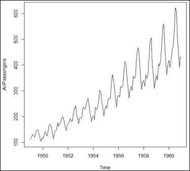

图 1:每月航空乘客数量

我们在这里可以看到，一个模式似乎在 12 个月的周期后重复自己，这表明了几个月的季节性趋势。如果能获得一个图，我们选择第一年，跨月份查看该图，然后移动到下一年，应用下一年的月度数据并将其可视化，以此类推，直到显示整个数据。一个`plotts`函数被创建，它实现了这个描述的一个情节，它的结构在*图 3* 中给出:

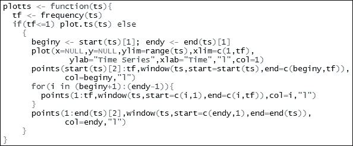

图 2:时间序列频率图函数

`plotts`函数现在应用于`AirPassengers`数据。该功能在伴随章节代码包的`Utilities.R`文件中可用，并在`C11.R`文件的开头使用`source`命令调用。该数据有 12 年的数据，因此我们将在生成的时间序列图上有 12 条曲线。图中的`legend`将需要比通常更多的面积，因此我们将其绘制在图表的右侧。所需的操作通过`par`、`mar`和`legend`功能完成，如下所示:

```r
> par(mar=c(5.1, 4.1, 4.1, 8.1), xpd=TRUE)
> plotts(AirPassengers)
> legend("topright", inset=c(-0.2,0), "-",
+        legend=c(start(AirPassengers)[1]:end(AirPassengers)[1]),
+        col=start(AirPassengers)[1]:end(AirPassengers)[1],lty=2)
```

我们现在可以在下图中清楚地看到季节性影响:

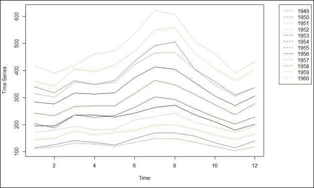

图 AirPassengers 数据集的季节性曲线图

月客流量在二月和十一月达到最低点。从 2 月到 7 月，每月乘客数量稳步增加，8 月保持在类似水平，然后急剧下降，直到 11 月。12 月和 1 月可以看到略有增加。因此，季节图提供了更多的见解，它们应该与`plot.ts`函数互补使用。Hyndman 的预测包包含一个名为`seasonalplot`的函数，它实现了与这里定义的`plotts`函数相同的结果。

接下来将介绍澳大利亚居民数据集`austres`。`plotts`功能和图例将用于增强显示:

```r
>plot.ts(austres)
>windows(height=100,width=150)
>par(mar=c(5.1, 4.1, 4.1, 8.1), xpd=TRUE)
>plotts(austres)
>legend("topright", inset=c(-0.2,0), "-",
+        legend=c(start(austres)[1]:end(austres)[1]),
+        col=start(austres)[1]:end(austres)[1],lty=2)
```

以下是澳大利亚居民数量的季度时间序列图:

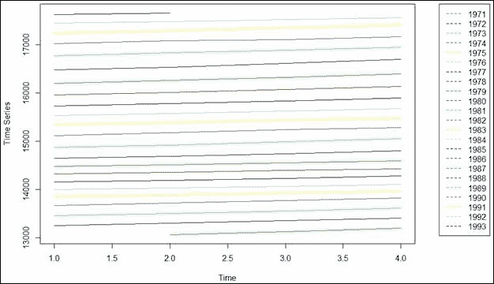

图 4:澳大利亚居民数量的季度时间序列

*图 4* 和*图 5* 的季节图有什么区别？当然，我们寻找的是不同于琐碎的月度和季度周期的差异。在*图 5* 中，我们可以看到，尽管月度居民的季度数量有所增加，但这几乎不是季节性因素；这似乎更像是一个趋势因素，而不是季节性因素。因此，与`AirPassengers`数据集相比，季节性贡献显得更少。

接下来显示二氧化碳浓度的时间序列图。我们在`co2`数据集上使用`plot.ts`函数:

```r
>plot.ts(co2)
```

运行`plot.ts`函数的结果是下一个输出:

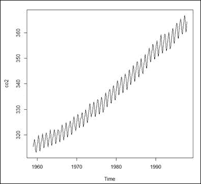

图 5:莫纳罗亚火山大气二氧化碳浓度的可视化

在二氧化碳浓度的时间序列图中很容易看到季节性影响。季节性曲线图可能会提供更多信息，接下来我们将使用`plotts`函数:

```r
>windows(height=100,width=150)
>par(mar=c(5.1, 4.1, 4.1, 8.1), xpd=TRUE)
>plotts(co2)
>legend("topright",inset=c(-0.2,0),
+        "-",
+        legend=c(c(start(co2)[1]:(start(co2)[1]+3)),". . . ",
+                 c((end(co2)[1]-3):end(co2)[1])),
+        col=c(c(start(co2)[1]:(start(co2)[1]+3)),NULL,
+              c((end(co2)[1]-3):end(co2)[1])),lty=2)
```

`plotts`和`legend`功能的使用方式与之前相同。程序的结果如图*图 7* 所示，我们可以在时间序列显示中清楚地看到季节的影响:

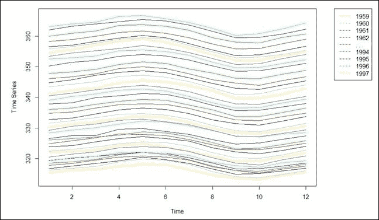

图 6:莫纳罗亚火山大气二氧化碳浓度的季节性曲线图

**练习**:使用`forecast`包中的`seasonalplot`函数，复制季节图。这里有什么不同吗？

季节性是时间序列的一个重要方面。重要的是尽早识别它，以便选择合适的模型来分析时间序列。我们将可视化另外三个时间序列数据集，`UKDriverDeaths`、`gas`和`uspop`:

```r
>windows(height=100,width=300)
>par(mfrow=c(1,3))
>plot.ts(UKDriverDeaths,main="UK Driver Deaths")
>plot.ts(gas,main="Australian monthly gas production")
>plot.ts(uspop,main="Populations Recorded by the US Census")
```

图 7*和图 7* 中的三个显示屏与迄今为止看到的任何显示屏都不一样。早先适合的模型在这里似乎不太可能有类似的表现。我们看到`UKDriverDeaths`和`gas`数据集有很多可变性。就`UKDriverDeaths`而言，似乎在`1983`年后死亡人数有所下降。对于天然气数据集，我们可以看到，在`1970`年之前，有一个定期的季节性影响，在那一年之后，`gas`生产率急剧上升。这可能是某种技术突破或其他现象变化的标志。可变性也增加了，并且在整个时间范围内几乎不变。`uspop`显示指数增长。

**练习**:目测`UKDriverDeaths`和`gas`数据集是否有季节性影响；

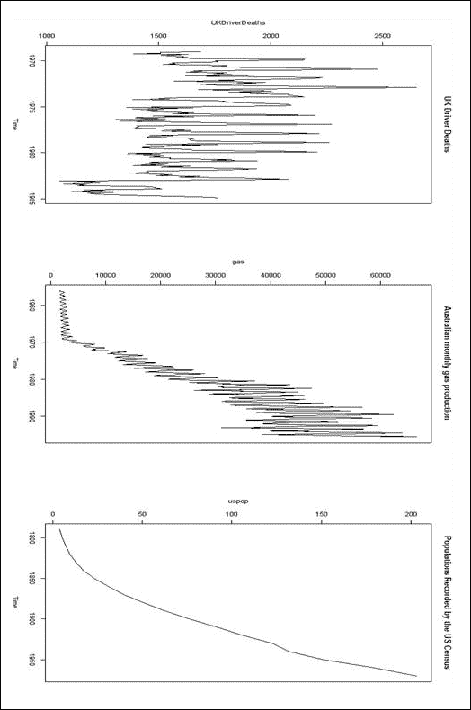

图 7:三个时间序列图:UKDriverDeaths、gas 和 uspop


## 核心概念和指标

从*图 1* 到*图 7* ，时间序列数据的可视化在所有示例中都传达了类似的故事。观察值的趋势和季节性意味着时间序列的未来值取决于当前值，因此我们不能假设观察值是相互独立的。但这意味着什么呢？为了重申这一点，考虑更简单的`uspop`(美国人口)数据集，图 7 的*右三个面板显示。在这里，我们没有季节的影响。现在，考虑一下 1900 年的人口普查。下一次人口普查的人口肯定不会少于 1890 年，也不会超过 1890 年的人口数。类似的叙述适用于大多数时间序列；例如，如果我们正在记录一天的最高温度。这里，如果今天的最高温度是 42 ℃,第二天的最高温度受这个数字的影响很大，几乎完全排除了第二天的最高温度是 55℃或 25℃。虽然很容易看出观测值是相互依赖的，但正式的规范本身也是一个挑战。让我们正式介绍一个时间序列。*

我们将用在时间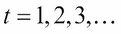观察到的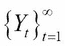来表示时间序列。到时间 T 为止观察到的时间序列的替代符号是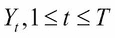。时间序列可以被概念化为在时间 t =1，2，3，…观察到的随机过程 Y。与时序过程相关的是误差过程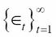。误差过程通常被假设为具有零均值和一些恒定方差的白噪声过程。错误过程通常被称为创新过程。注意，时间序列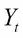可能取决于中过程的过去值，以及误差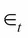的值和误差过程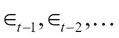的过去值。值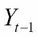也被称为的第一滞后值、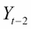的第二滞后值、的第二滞后值，以此类推。现在，如果观察是相互依赖的，那么它们之间关系的规范就是最大的挑战。当然这里不能细说。但是，如果我们认为一阶滞后项是相关的，那么这里一定有关系，我们可以用 y 轴上的观察值和 x 轴上的一阶滞后项来获得散点图。`AirPassengers`数据集的一阶滞后散点图如下获得:

```r
>plot(AirPassengers[1:143],AirPassengers[2:144],
+      xlab="Previous Observation",
+      ylab="Current Observation")
```

索引的使用将时间序列对象的类别更改为数字对象:

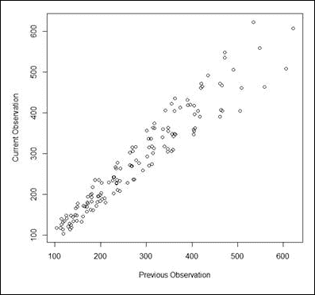

图 AirPassengers 数据集的滞后图

在前面的图形显示中，我们可以清楚地看到，滞后观测值之间(几乎)存在线性关系，因此模型的形式可能是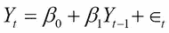。散点图能帮助确定依赖关系的顺序吗？几乎没有！接下来，我们将获得`WWWusage`数据集的图，并查看滞后图:

```r
>windows(height=200,width=200)
>par(mfrow=c(2,2))
>plot.ts(WWWusage)
>plot(WWWusage[1:99],WWWusage[2:100],
+      xlab="Previous Observation",
+      ylab="Current Observation",main="Lag-1 Plot"
+      )
>plot(WWWusage[1:98],WWWusage[3:100],
+      xlab="Previous Observation",
+      ylab="Current Observation",main="Lag-2 Plot"
+      )
>plot(WWWusage[1:97],WWWusage[4:100],
+      xlab="Previous Observation",
+      ylab="Current Observation",main="Lag-3 Plot"
+      )
```

以下是`WWWUsage`的滞后图:

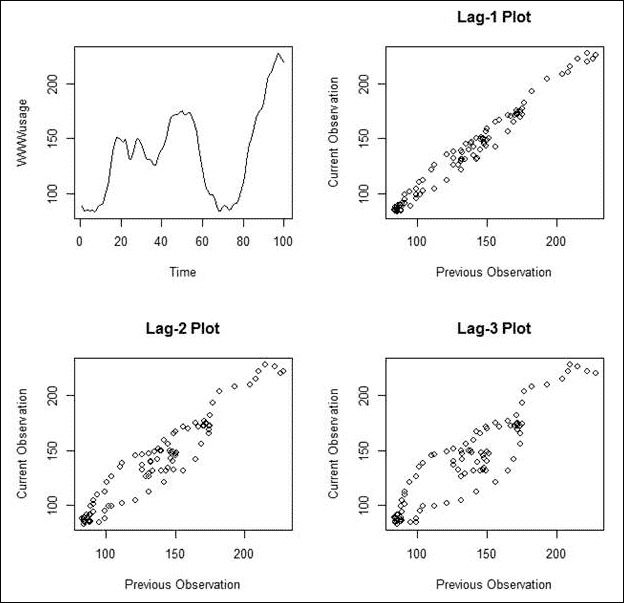

图 WWWUsage 的滞后图

第一个滞后图可能给人的印象是观察值是相关的。然而，高阶滞后图几乎没有任何意义，回到一阶滞后图会造成更多的混乱。因此，我们需要一种更正式的方法来获得对滞后量级的认识。

有助于理解时间序列数据相关性本质的两个度量是**自相关函数** ( **ACF** )和**部分自相关函数** ( **PACF** )。顾名思义，ACF 是一个时间序列与其自身滞后值的相关性。PACF 的部分命名法解释了从滞后变量中去除中间变量的影响。简单地说，滞后 3 的 PACF 将只包括第一个；第三滞后变量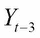和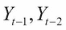变量不允许影响 PACF。滞后-k ACF 定义为随机变量*Y*t 和第 k 个滞后变量*Y*t-k 之间的相关性:

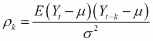

其中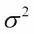是时间序列的方差。 *Yt* 与其第 k 个滞后 *Yt-k* 之间的偏相关函数 PACF 是控制较短滞后*Y*t-1、*Y*t-2、 *…、*Y、 *t-k+1* 时时间序列的偏相关。不可能深入 PACF 概念的数学细节；读者可参考 Box 等人(2015 年)了解更多信息。基于 *n* 观察值的样本 ACF 公式使用以下公式给出:

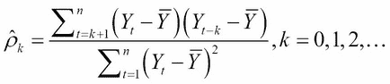

对于 PACF 的明确公式，我们请读者参考位于[http://mondi.web.elte.hu/spssdoku/algoritmusok/acf_pacf.pdf](http://mondi.web.elte.hu/spssdoku/algoritmusok/acf_pacf.pdf)的网站上的文档。

尽管公式令人生畏，但我们可以通过简单地在两个数据集`austres`和`uspop`上使用`acf`和`pacf`函数轻松脱身:

```r
>jpeg("ACF_PACF_Plots.jpeg")
>par(mfrow=c(2,2))
>acf(austres,main="ACF of Austres Data")
>pacf(austres,main="PACF of Austres Data")
>acf(uspop,main="ACF of US Population")
>pacf(uspop,main="PACF of US Population")
>dev.off()
RStudioGD 
        2 
```

我们将保持 ACF 和 PACF 图的解释更简单。在 ACF 和 PACF 图中重要的指导方针是水平蓝线。任何超出两条线的滞后 ACF 和 PACF 图都是显著的，而那些在界限内的图是不显著的:

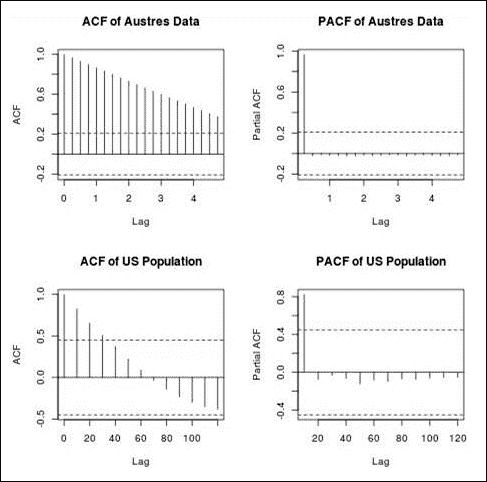

图 10:澳大利亚和美国数据集的 ACF 和 PACF 图

我们可以从*图 10* 中看到`austres`时间序列，我们需要扩展 ACF 图以包含更多的滞后。这是因为所有绘制的滞后都超出了水平蓝线。对于`uspop`时间序列，第一个时间序列，前四个滞后是显著的，其余的在水平蓝线内。PACF 曲线可以用类似的方式来解释。

ACF 和 PACF 图在 ARMA 模型的识别中起着重要的作用。即使这些图揭示了关于 AR 情况下的滞后的信息，它也可以用于指定时间序列的先前值的数量，作为适用于时间序列数据的神经网络的输入向量的一部分。

在许多实际问题中，我们有额外的变量，我们可以称之为协变量时间序列或外生变量。让我们用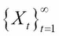来表示协变量时间序列，其中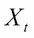可能是标量或向量时间序列。我们采用惯例，即只有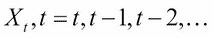的当前和过去的值会影响，而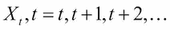的未来值不会以任何方式影响。也就是说，只有协变量的滞后值有影响，而不是超前值。在`Car Sales`数据集中，销售额是感兴趣的时间序列，我们认为是广告方面影响了销售额；销售不可能解释广告金额！`ccf`函数用于获得如下互相关系数:

```r
>CarSales <- read.csv("../Data/Car_Sales.csv")
>summary(CarSales)
     Sales       Advertising  
 Min.   :12.0   Min.   : 1.0  
 1st Qu.:20.3   1st Qu.:15.8  
 Median :24.2   Median :23.0  
 Mean   :24.3   Mean   :28.5  
 3rd Qu.:28.6   3rd Qu.:41.0  
 Max.   :36.5   Max.   :65.0  
>jpeg("CCF_Car_Sales_Advertising.jpeg")
>ccf(x=CarSales$Advertising,y=CarSales$Sales,
+     main="Cross Correlation Between Sales and Advertising")
>dev.off()
RStudioGD 
        2 
```

下图显示了销售和广告之间的交叉关联:

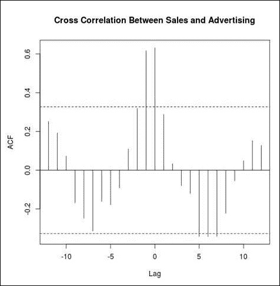

图 11:广告支出和汽车销售的交叉相关系数

我们应该看正滞后值还是负滞后值？注意,`ccf`图是不对称的，因此我们不能忽略滞后值的符号。在 R 终端运行`?ccf`，我们得到`The lag k value returned by ccf(x, y) from the help file, which estimates the correlation between x[t+k] and y[t]`。因此，正滞后是前导，而负滞后是我们感兴趣的。在这个例子中，只有(即和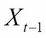)的先前滞后是显著的。

我们以对精度测量的简要讨论来结束这一部分。与早期的学习问题一样，我们将有大量的模型可供选择。这是下一节讨论的主题，我们需要相应地定义某些评估指标。设表示时间序列，由于使用了某种模型，拟合值将为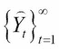。我们可以通过各种方法评估模型的准确性；一些精度测量包括以下内容:

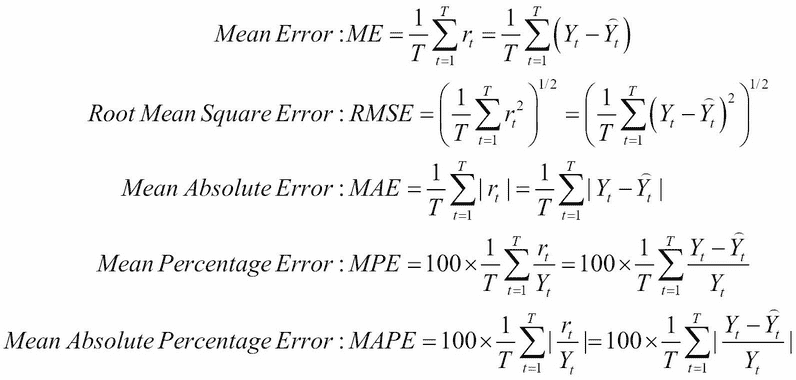

目前，我们不会关注这个模型。相反，我们将使用它作为主要工具来提取合适的值，并帮助获得定义的指标。使用`subset`函数，我们将定义训练数据集，并使用`forecast`包中的`auto.arima`函数拟合模型。使用`accuracy`和`forecast`功能，我们将获得不同的精度:

```r
>co2_sub <- subset(co2,start=1,end=443)
>co2_arima <- auto.arima(co2_sub)
>accuracy(forecast(co2_arima,h=25),x=co2[444:468])
                  ME  RMSE   MAE      MPE   MAPE  MASE   ACF1
Training set  0.0185 0.283 0.225  0.00541 0.0672 0.211 0.0119
Test set     -0.0332 0.349 0.270 -0.00912 0.0742 0.252     NA
```

`forecast`函数是一个非常重要的函数。给定拟合的时间序列，它将根据请求提供未来时段的预测，并且精度函数计算七个不同标准所需的精度。平均误差标准通常是无用的，对于接近无偏的模型，其数值将在 0 附近。RMSE、MAE、MPE 和 MAPE 这些指标通常很有用，它们的值越低，模型拟合得越好。此外，训练集误差和测试集误差必须具有可比性。如果它们彼此差异很大，那么这个模型对预测就没用了。在下一节中，我们将回顾一类有用的时间序列模型。


## 基本时间序列模型

到目前为止，我们已经遇到了不同回归模型的一组模型。时间序列数据带来了额外的复杂性，因此我们有更多的模型可供选择(或者更确切地说，是集成)。这里提供了重要模型的快速回顾。这里讨论的大多数模型处理的是单变量时间序列，我们甚至需要更专业的模型和方法来整合。我们将从最简单的时间序列模型开始，然后向上移动到神经网络实现。

### 天真的预测

假设我们有数据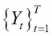，并且我们需要下一个 *h* 时间点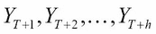的预测。天真的预测模型不需要任何建模练习或计算，它只是返回当前值作为未来预测，因此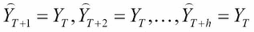。就这么简单。即使对于这个简单的任务，我们也将使用预测包中的 nave 函数，并要求它用`h=25`为下一个`25`观测提供预测:

```r
>co2_naive <- naive(co2_sub,h=25,level=c(90,95))
>summary(co2_naive)

Forecast method: Naive method

Model Information:
Call: naive(y = co2_sub, h = 25, level = c(90, 95)) 

Residual sd: 1.1998 

Error measures:
              ME RMSE  MAE   MPE  MAPE  MASE  ACF1
Training set 0.1  1.2 1.07 0.029 0.319 0.852 0.705

Forecasts:
         Point Forecast Lo 90 Hi 90 Lo 95 Hi 95
Dec 1995            360   358   362   357   362
Jan 1996            360   357   362   356   363
Feb 1996            360   356   363   356   364

Oct 1997            360   350   369   348   371
Nov 1997            360   350   369   348   371
Dec 1997            360   350   370   348   371
```

正如预期的那样，预测值在整个期间保持不变。它们可以很容易地可视化，并且精度也可以很容易地计算出来，如下所示:

```r
>plot(co2_naive) # Output suppressed
>accuracy(forecast(co2_naive,h=25),x=co2[444:468])
               ME RMSE  MAE   MPE  MAPE MASE  ACF1
Training set 0.10 1.20 1.07 0.029 0.319 1.00 0.705
Test set     3.54 4.09 3.55 0.972 0.974 3.32    NA
```

自然会出现的问题是，这些天真的预测是否有任何好处。这个问题的答案可以用其他方式给出。复杂和精密的模型总是声称有优势和优点。模型可能确实有优势，但是参考和基准应该是清楚的。天真的预测提供了这个重要的基准。请注意，在训练期间，原始预测的精度值是不同的，重要的是，建议的模型至少要比原始预测的指标更好。这是天真预测的主要目的。

### 季节、趋势和黄土拟合

季节、趋势和黄土是组成 stl 模型的三个技术词汇。早些时候，我们在时间序列的可视化显示中看到，其中一些描述了季节效应，一些显示了趋势，一些显示了季节和趋势的组合，还有一些只是不规则的时间序列。因此,显示指示潜在现象的特定性质的存在或不存在。在这一节中，我们将看看如何利用时间序列的季节性和趋势部分。黄土中 stl 模型的第三个组成部分根本没有解释。黄土是一种非参数回归技术，代表局部多项式回归，它将加权最小二乘准则推广到 p 阶多项式。黄土方法还包括一个重要的组成部分，称为内核。内核是一种平滑方法，但我们不会对此进行过多的讨论。

Cleveland 等人(1990 年)提出了一个基于黄土的季节趋势分解，该过程的完整细节可从以下来源获得:[http://www . SCB . se/content assets/ca 21 efb 41 fee 47d 293 bbee 5b f 7 be 7 FB 3/STL-a-seasonal-trend-decomposition-procedure-based-on-loose . pdf](http://www.scb.se/contentassets/ca21efb41fee47d293bbee5bf7be7fb3/stl-a-seasonal-trend-decomposition-procedure-based-on-loess.pdf)。这篇文章可读性强，直观，见解深刻，读者应该真正地跟随它。stl 模型是一种过滤方法，它将季节性时间序列分解为三个部分:趋势、季节性和余数。设为时间序列，我们用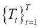、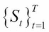和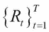表示趋势、季节和余数部分；那么我们将有以下内容:

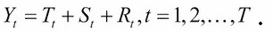

请参考 Cleveland 等人的论文以了解完整的细节。

使用`stats`包中的`stl`函数，我们将`AirPassengers`数据分解如下:

```r
>AP_stl <- stl(AirPassengers,s.window=frequency(AirPassengers))
>summary(AP_stl)
 Call:
 stl(x = AirPassengers, s.window = frequency(AirPassengers))

 Time.series components:
    seasonal         trend       remainder    
 Min.   :-73.3   Min.   :123   Min.   :-36.2  
 1st Qu.:-25.1   1st Qu.:183   1st Qu.: -6.4  
 Median : -5.5   Median :260   Median :  0.3  
 Mean   :  0.1   Mean   :280   Mean   : -0.2  
 3rd Qu.: 20.4   3rd Qu.:375   3rd Qu.:  5.9  
 Max.   : 94.8   Max.   :497   Max.   : 48.6  
 IQR:
     STL.seasonal STL.trend STL.remainder data 
      46          192        12           180  
   %  25.2        106.4       6.8         100.0

 Weights: all == 1

 Other components: List of 5
 $ win  : Named num [1:3] 12 21 13
 $ deg  : Named int [1:3] 0 1 1
 $ jump : Named num [1:3] 2 3 2
 $ inner: int 2
 $ outer: int 0
>jpeg("STL_Decompose_AirPassengers.jpeg")
>plot(AP_stl)
>dev.off()
windows 
      2 
>accuracy(forecast(AP_stl))
                  ME RMSE  MAE    MPE MAPE  MASE     ACF1
Training set 0.00498 11.2 8.29 -0.129 3.29 0.259 0.000898
```

通过执行上述代码，可以获得以下图形:

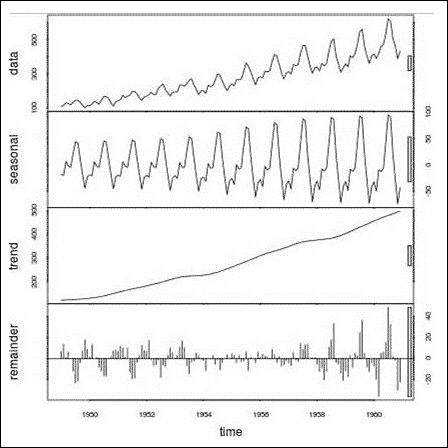

图 12:空中乘客的 STL 分解

重要的是通过`stl`函数中的`s.window`选项指定季节性。从季节图中，我们可以看到各个分量都是随时间而增加的。然而，随着时间的推移，我们对乘客数量的不同组成部分有了一个清晰的了解。尽管季节性部分在数量上有所增加，但其模式在整个时期保持不变。趋势显示线性增长，这表明该系列的前进方向。很明显，季节性在这方面起着重要的作用。

**练习**:之前已经说过，在`austres`数据集的分析中，季节性似乎不是一个有用的因素。使用`stl`分解并检查观察是否成立。

接下来将以指数平滑模型的形式考虑更具参数性的模型。

### 指数平滑状态空间模型

可以清楚地定义基本的指数平滑模型。用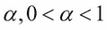表示平滑因子，并初始化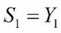。基本指数平滑模型定义如下:

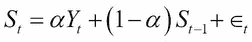

指数模型的细节可以在[https://labs.omniti.com/people/jesus/papers/holtwinters.pdf](https://labs.omniti.com/people/jesus/papers/holtwinters.pdf)找到。更一般的模型形式是**指数平滑状态空间模型**。这里，一个模型在三个方面被指定，如在 stl 模型中:误差分量，趋势分量，第三个是季节分量。在预测包的`ets`功能中，组件可以具有由 **A** 表示的**加性**效果，它可以具有由 M 表示的**乘性**效果，或者它可以被要求自动选择(Z)，并且该规范对于每个组件都是可能的。字母 n 的影响既不能被指定为加法，也不能被指定为乘法。因此，`ets`函数中的模型被指定为第一个字母代表误差分量，第二个字母代表趋势分量，第三个字母代表季节分量。因此，符号`model="ZZZ"`意味着三个组件中的每一个都是自动选择的。`model="AMZ"`表示误差分量是加性的，趋势是乘性的，季节分量是自动选择的，以此类推。Hyndman 等人(2008 年)对指数平滑法的细节进行了全面阐述。接下来，我们将使用`forecast`包中的`ets`函数来拟合指数平滑模型:

```r
>uspop_sub <- subset(uspop,start=1,end=15)
>USpop_ets <- ets(uspop_sub)
>summary(USpop_ets)
ETS(A,A,N) 

Call:
 ets(y = uspop_sub) 

  Smoothing parameters:
    alpha = 0.8922 
    beta  = 0.8922 

  Initial states:
    l = 2.3837 
    b = 1.7232 

  sigma:  1.68

 AIC AICc  BIC 
66.2 72.8 69.7 

Training set error measures:
               ME RMSE MAE  MPE MAPE   MASE  ACF1
Training set 1.11 1.68 1.4 3.26  4.6 0.0318 -0.28
```

`ets`函数为误差和趋势分量拟合了一个加性误差，同时选择不为季节因素添加任何加性误差。这是有意义的，因为`uspop`数据集没有季节性组件。使用这个拟合的模型，我们将`forecast`1940 年至 1970 年期间的美国人口，使用`accuracy`函数计算训练和测试数据集的精确度，并与`naive`预测进行比较:

```r
>forecast(USpop_ets,h=4)
     Point Forecast Lo 80 Hi 80 Lo 95 Hi 95
1940            139   137   141   136   142
1950            156   151   160   149   162
1960            172   165   180   161   183
1970            189   178   200   173   205
>plot(forecast(USpop_ets,h=4))
>accuracy(forecast(USpop_ets,h=4),x=uspop[16:19])
               ME RMSE  MAE   MPE MAPE  MASE  ACF1
Training set 1.11 1.68 1.40 3.259 4.60 0.165 -0.28
Test set     2.33 9.02 8.26 0.578 4.86 0.973    NA
>accuracy(forecast(naive(uspop_sub),h=4),x=uspop[16:19])
                ME  RMSE   MAE  MPE MAPE MASE  ACF1
Training set  8.49  9.97  8.49 21.7 21.7 1.00 0.778
Test set     43.58 51.35 43.58 24.2 24.2 5.13    NA
```

下图描述了美国人口数据的指数平滑:

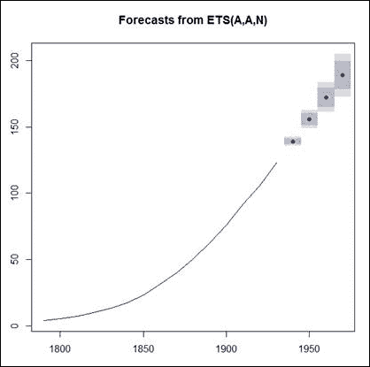

图 13:美国人口数据的指数平滑

准确性的比较是与天真的预测进行的，我们发现`ets`的预测有显著的改进。因此，`ets`预测是有用的，我们可以用它们来预测未来。

接下来，我们将转向广受欢迎的博克斯-詹金斯/ARIMA 模型。

### 自回归综合移动平均(ARIMA)模型

Box 和 Jenkins 使用 ARIMA 模型对时间序列的方法改变了对时间序列数据进行分析和预测的方式。ARIMA 模型是更一般的线性过程模型的特例，对于具有新息过程的时间序列，给出如下:

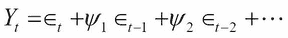

这里，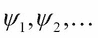是线性过程的系数。注意，对创新过程的滞后值没有限制，我们实际上是指在这个线性过程模型中有无限项。在流行的自回归 ar(p)模型中，p 是 AR 模型的阶。这是使用以下公式给出的:

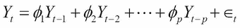

AR 模型可以显示为线性过程模型的一个特例。当时间序列用创新过程表示时，另一个有用的模型是 q 阶移动平均 MA(q)模型:

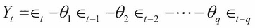

一个时间序列可能依赖于过去的误差和过去的值，这种结构依赖性可以在`(p,q)`阶的自回归移动平均`ARMA(p,q)`模型中捕捉到:

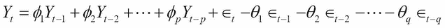

*p* 和 *q* 的顺序可以通过*表 2* 中的 ACF 和 PACF 相关的经验法则来决定:


表 ARMA 模型的 ACF 和 PACF

ARMA 模型适用于平稳的时间序列数据，这里的平稳松散地表示序列的可变性始终是恒定的。这是一个限制性的假设，对于许多时间系列现象，它不成立。在很多实际场景中，已经有人提出通过对级数求差分可以得到平稳，也就是说，我们可以考虑差分。差分是一阶差分，有时可能需要高阶差分。在大多数实际情况下，已知 4 阶差分会带来平稳性。差分的顺序通常用字母 d 表示，对差分应用 ARMA 模型被称为自回归综合移动平均模型，或 ARIMA 模型。一个简洁的缩写就是`ARIMA(p,d,q)`。

我们在本章中经常遇到季节性的组件，它通过季节性的 ARIMA 模型在 ARIMA 得到了体现。有兴趣的读者可以阅读 Tattar 等人(2017)的第 10 章了解更多细节。我们将在这里简单地补充，我们有更多的大写字母(P，D，Q)表示季节参数，以及频率项。我们现在能够理解上一节末尾的拟合模型了。已经访问了`co2_arima`精度，现在我们来看看摘要:

```r
>summary(co2_arima)
Series: co2_sub 
ARIMA(2,1,2)(1,1,2)[12] 

Coefficients:
        ar1    ar2     ma1     ma2    sar1   sma1    sma2
      0.033  0.250  -0.369  -0.246  -0.828  0.014  -0.750
s.e.  0.341  0.122   0.342   0.197   0.230  0.210   0.173

sigma^2 estimated as 0.0837:  log likelihood=-73.4
AIC=163   AICc=163   BIC=195

Training set error measures:
                 ME  RMSE   MAE     MPE   MAPE  MASE   ACF1
Training set 0.0185 0.283 0.225 0.00541 0.0672 0.179 0.0119
```

最适合的 ARIMA 模型阶是`(2,1,2)(1,1,2)[12]`，这意味着季节频率在`12`(这是我们已经知道的)，季节阶(P，D，Q)是`(1,1,2)`，ARIMA 阶(P，D，Q)是`(2,1,2)`。正是这种差分顺序实现了平稳性。获得预测，然后可视化:

```r
>jpeg("CO2_Forecasts.jpeg")
>plot(forecast(co2_arima,h=25))
```

下图显示了输出:


图 14:二氧化碳预测

因此，我们为二氧化碳浓度水平安装了 ARIMA 模型。

接下来，我们将研究非线性神经网络时间序列模型。

### 自回归神经网络

神经网络以前曾被用于分类和回归问题。由于时间序列是相关的观察值，我们需要调整神经网络的结构来包含这种相关性。调整是允许时间序列的滞后值作为输入层的成员。该架构的其余部分遵循与通常的神经网络相同的结构。`forecast`中的`nnetar`函数代表神经网络自回归，`p=`选项允许时间序列的滞后值，我们应用于`gas`问题:

```r
>gas_sub <- subset(gas,start=1,end=450)
>gas_nnetar <- nnetar(gas_sub,p=25,P=12,size=10,repeats=10)
>plot(forecast(gas_nnetar,h=26))
>accuracy(forecast(gas_nnetar,h=26),x=gas[451:476])
               ME RMSE  MAE    MPE  MAPE  MASE    ACF1
Training set    2  318  237 -0.127  1.78 0.148 -0.0879
Test set     5033 6590 5234 10.566 10.94 3.276      NA
```


图 15:使用自回归神经网络的气体预测

我们现在已经看到了自回归神经网络的作用。

### 把一切都搞砸了

本章开始时，我们简要介绍了七个数据集，并提到了*表 1* 中的 21 个数据集。数据可视化提供了适度的洞察力，并且准确性度量对于分析模型的有用性是有用的。到目前为止，这一部分已经介绍了一系列模型，现在我们将把它们全部打乱。定义了一个适合六种不同时间序列模型的`get_Accuracy`函数。 **LM** ，代表**线性模型**，没有解释；TBATS 模型也没有。线性模型非常简单，因为时间指数被视为协变量。一般来说，如果一个时间序列有 T 个观测值，协变量向量只包含值 1，2，3，…，T。我们预计线性模型表现不佳。这里不详细解释 TBATS 模型，所以建议做一些额外的阅读，以便获得更多的信息。`get_Accuracy`模型将六个模型中的每一个模型与 21 个数据集相匹配，命名模型，并登记其在整个数据集上的性能。下面的程序得到了想要的结果:

```r
>get_Accuracy<- function(ts){
+   tsname <- deparse(substitute(ts))
+   Acc_Mat <- data.frame(TSName = rep(tsname,6),Models=c(
+               "ETS","STL","LM","ARIMA","NNETAR","TBATS"),
+                ME=numeric(6),RMSE=numeric(6),MAE=numeric(6),
+                MPE=numeric(6), MAPE=numeric(6),MASE=numeric(6))
+   for(i in 1:nrow(Acc_Mat)){
+     Acc_Mat[1,3:8] <- accuracy(ets(ts)$fitted,ts)[1:6]
+     if(frequency(ts)>1) Acc_Mat[2,3:8] <- accuracy(ts-stl(ts,
+            frequency(ts))$time.series[,3],ts)[1:6] else
+       Acc_Mat[2,3:8] <- NA
+     Acc_Mat[3,3:8] <- accuracy(fitted(lm(ts~I(1:length(ts)))),ts)[1:6]
+     Acc_Mat[4,3:8] <- accuracy(auto.arima(ts)$fitted,ts)[1:6]
+     Acc_Mat[5,3:8] <- accuracy(fitted(nnetar(ts)),ts)[1:6]
+     Acc_Mat[6,3:8] <- accuracy(fitted(tbats(ts)),ts)[1:6]
+   }
+   Acc_Mat
+ }
> TSDF <- data.frame(TSName=character(0),Models=character(0),
+ Accuracy=numeric(0))
> TSDF <- rbind(TSDF,get_Accuracy(AirPassengers))
> TSDF <- rbind(TSDF,get_Accuracy(BJsales))
> TSDF <- rbind(TSDF,get_Accuracy(JohnsonJohnson))
> TSDF <- rbind(TSDF,get_Accuracy(LakeHuron))
> TSDF <- rbind(TSDF,get_Accuracy(Nile))
> TSDF <- rbind(TSDF,get_Accuracy(UKgas))
> TSDF <- rbind(TSDF,get_Accuracy(UKDriverDeaths))
> TSDF <- rbind(TSDF,get_Accuracy(USAccDeaths))
> TSDF <- rbind(TSDF,get_Accuracy(WWWusage))
> TSDF <- rbind(TSDF,get_Accuracy(airmiles))
> TSDF <- rbind(TSDF,get_Accuracy(austres))
> TSDF <- rbind(TSDF,get_Accuracy(co2))
> TSDF <- rbind(TSDF,get_Accuracy(discoveries))
> TSDF <- rbind(TSDF,get_Accuracy(lynx))
> TSDF <- rbind(TSDF,get_Accuracy(nhtemp))
> TSDF <- rbind(TSDF,get_Accuracy(nottem))
> TSDF <- rbind(TSDF,get_Accuracy(presidents))
In addition: Warning message:
In ets(ts) :
  Missing values encountered. Using longest contiguous portion of time series
> TSDF <- rbind(TSDF,get_Accuracy(treering))
> TSDF <- rbind(TSDF,get_Accuracy(gas))
> TSDF <- rbind(TSDF,get_Accuracy(uspop))
> TSDF <- rbind(TSDF,get_Accuracy(sunspots))
> write.csv(TSDF,"../Output/TS_All_Dataset_Accuracies.csv",row.names=F)
```

前面代码块的输出如下表所示:

| 

TSName

 | 

模型

 | 

我

 | 

均方根误差

 | 

平均绝对误差

 | 

MasterofPhysicalEducation 体育硕士

 | 

multidimensional assessment of philosophy of education 教育哲学的多维评价

 | 

激射微波

 |
| --- | --- | --- | --- | --- | --- | --- | --- |
| `AirPassengers` | 美国教育考试服务中心 | 1.5807 | 10.6683 | 7.7281 | 0.4426 | 2.8502 | 0.0164 |
| `AirPassengers` | 标准模板库 | -0.1613 | 11.9379 | 8.5595 | -0.0662 | 3.4242 | 0.5515 |
| `AirPassengers` | 长韵律 | 0.0000 | 45.7362 | 34.4055 | -1.2910 | 12.3190 | 0.7282 |
| `AirPassengers` | ARIMA | 1.3423 | 10.8462 | 7.8675 | 0.4207 | 2.8005 | -0.0012 |
| `AirPassengers` | 花蜜 | -0.0118 | 14.3765 | 11.4899 | -0.2964 | 4.2425 | 0.5567 |
| `AirPassengers` | TBATS | 0.4655 | 10.6614 | 7.7206 | 0.2468 | 2.8519 | 0.0215 |
| `BJsales` | 美国教育考试服务中心 | 0.1466 | 1.3272 | 1.0418 | 0.0657 | 0.4587 | -0.0110 |
| `BJsales` | 标准模板库 | 钠 | 钠 | 钠 | 钠 | 钠 | 钠 |
| `BJsales` | 长韵律 | 0.0000 | 9.1504 | 7.1133 | -0.1563 | 3.1686 | 0.9872 |
| `BJsales` | ARIMA | 0.1458 | 1.3281 | 1.0447 | 0.0651 | 0.4601 | -0.0262 |
| `BJsales` | 花蜜 | -0.0001 | 1.4111 | 1.0849 | -0.0040 | 0.4798 | 0.2888 |
| `BJsales` | TBATS | 0.1622 | 1.3566 | 1.0666 | 0.0732 | 0.4712 | -0.0113 |
| `JohnsonJohnson` | 美国教育考试服务中心 | 0.0495 | 0.4274 | 0.2850 | 1.0917 | 7.0339 | -0.2948 |
| `JohnsonJohnson` | 标准模板库 | -0.0088 | 0.1653 | 0.1080 | -0.5953 | 2.8056 | -0.4155 |
| `JohnsonJohnson` | 长韵律 | 0.0000 | 1.6508 | 1.3287 | 22.6663 | 66.3896 | 0.6207 |
| `JohnsonJohnson` | ARIMA | 0.0677 | 0.4074 | 0.2676 | 2.0526 | 6.5007 | 0.0101 |
| `JohnsonJohnson` | 花蜜 | 0.0003 | 0.3501 | 0.2293 | -0.6856 | 5.8778 | -0.0347 |
| `JohnsonJohnson` | TBATS | 0.0099 | 0.4996 | 0.3115 | 0.9550 | 7.5277 | -0.1084 |
| `sunspots` | 美国教育考试服务中心 | -0.0153 | 15.9356 | 11.2451 | #姓名？ | 中程核力量 | 0.0615 |
| `sunspots` | 标准模板库 | 0.0219 | 12.2612 | 8.7973 | 钠 | 中程核力量 | Zero point one eight |
| `sunspots` | 长韵律 | Zero | 42.9054 | 34.1212 | #姓名？ | 中程核力量 | 0.9196 |
| `sunspots` | ARIMA | -0.0267 | 15.6006 | 11.0258 | 钠 | 中程核力量 | -0.0106 |
| `sunspots` | 花蜜 | -0.0672 | 10.3105 | 7.6878 | 钠 | 中程核力量 | 0.0108 |
| `sunspots` | TBATS | -0.0514 | 15.5788 | 11.0119 | 钠 | 中程核力量 | -0.0013 |

表 3:六个模型在 21 个数据集上的准确性

总体信息与在分类问题的介绍章节中获得的信息相同。因为我们不可能总是对结果进行检验，所以最好将多个模型的结果结合起来，以更准确地描述一个统一的故事。我们从打包指数时间序列模型的简单想法开始这项任务。


## 装袋和时间序列

在本节中，我们将只说明 ETS 模型的打包技术。bagging 的主要目的是稳定预测或预报。在这里，我们将根据盒考克斯和黄土为基础的分解装袋。使用 500 个这样的自举样本，将获得 ETS 的 bagging 模型:

```r
>uspop_bagg_ets <- baggedETS(uspop_sub,bootstrapped_series = 
+                               bld.mbb.bootstrap(uspop_sub, 500))
>forecast(uspop_bagg_ets,h=4);subset(uspop,start=16,end=19)
     Point Forecast Lo 100 Hi 100
1940            141    136    145
1950            158    150    165
1960            175    164    184
1970            193    178    204
Time Series:
Start = 1940 
End = 1970 
Frequency = 0.1 
[1] 132 151 179 203
>plot(forecast(uspop_bagg_ets,h=4))
```

使用装袋法有优势吗？我们可以使用置信区间快速检查这一点:

```r
>forecast(uspop_bagg_ets,h=4)
     Point Forecast Lo 100 Hi 100
1940            141    136    145
1950            158    150    165
1960            175    164    184
1970            193    178    204
>forecast(USpop_ets,h=4,level=99.99)
     Point Forecast Lo 99.99 Hi 99.99
1940            139      133      146
1950            156      142      169
1960            172      150      194
1970            189      157      221
```

袋装 ETS 的置信区间明显更短，因此反映了方差的减少，这是装袋的主要目的:


图 16:美国人口的 Bagging 预测

精确度比较也很容易在这里进行:

```r
>accuracy(forecast(USpop_ets,h=4),x=uspop[16:19])
               ME RMSE  MAE   MPE MAPE  MASE  ACF1
Training set 1.11 1.68 1.40 3.259 4.60 0.165 -0.28
Test set     2.33 9.02 8.26 0.578 4.86 0.973    NA
>accuracy(forecast(uspop_bagg_ets,h=4),x=subset(uspop,start=16,end=19))
                 ME RMSE  MAE    MPE MAPE   MASE  ACF1 Theil's U
Training set  1.137 1.44 1.24  2.226 4.48 0.0283 0.563        NA
Test set     -0.359 7.87 7.48 -0.995 4.63 0.1700 0.296     0.299
```

集成同质基础学习器的优势在这里显而易见。接下来，我们转向异质基础学习器和他们的合奏。


## 集成时间序列模型

R 包提供了一个集成异构时间序列模型的平台。实现该任务的主要函数是`hybridModel`函数。核心函数提供了被称为`models`的选项。它接受一个最多六个字符的字符串作为输入，这些字符代表模型:`a`代表`auto.arima`模型，`e`代表`ets`，`f`代表`thetam`，`n`代表`nnetar`，`s`代表`stlm`，最后，`t`代表`tbats`。因此，如果我们给模型一个字符串`ae`，它将组合来自 ARIMA 和 ets 模型的结果。这在`co2`数据集上针对时间序列模型的不同组合进行了说明:

```r
>accuracy(forecast(co2_arima,h=25),x=co2[444:468])
                  ME  RMSE   MAE      MPE   MAPE  MASE   ACF1
Training set  0.0185 0.283 0.225  0.00541 0.0672 0.211 0.0119
Test set     -0.0332 0.349 0.270 -0.00912 0.0742 0.252     NA
>AP_Ensemble_02 <- hybridModel(co2_sub,models="ae")
Fitting the auto.arima model
Fitting the ets model
>accuracy(AP_Ensemble_02,h=25,x=co2[444:468])
             ME  RMSE   MAE     MPE   MAPE    ACF1 Theil's U
Test set 0.0258 0.271 0.219 0.00755 0.0653 0.00289     0.226
>AP_Ensemble_03 <- hybridModel(co2_sub,models="aen")
Fitting the auto.arima model
Fitting the ets model
Fitting the nnetar model
>accuracy(AP_Ensemble_03,h=25,x=co2[444:468])
            ME  RMSE   MAE    MPE  MAPE  ACF1 Theil's U
Test set 0.017 0.304 0.245 0.0049 0.073 0.282      0.25
>AP_Ensemble_04 <- hybridModel(co2_sub,models="aens")
Fitting the auto.arima model
Fitting the ets model
Fitting the nnetar model
Fitting the stlm model
>accuracy(AP_Ensemble_04,h=25,x=co2[444:468])
             ME  RMSE   MAE     MPE  MAPE  ACF1 Theil's U
Test set 0.0165 0.275 0.221 0.00478 0.066 0.209     0.226
>AP_Ensemble_05 <- hybridModel(co2_sub,models="aenst")
Fitting the auto.arima model
Fitting the ets model
Fitting the nnetar model
Fitting the stlm model
Fitting the tbats model
>accuracy(AP_Ensemble_05,h=25,x=co2[444:468])
             ME  RMSE   MAE     MPE   MAPE  ACF1 Theil's U
Test set 0.0123 0.267 0.216 0.00348 0.0645 0.153      0.22
```

虽然这里对集成的讨论非常简短，但是时间序列文献直到最近才开始适应集成技术。

**练习**:`weights`和`errorMethod`的选项对于将不同的时间序列模型放在一起至关重要。探索本章中介绍和讨论的不同数据集的这些选项。


# 总结

时间序列数据带来了新的挑战和复杂性。这一章首先介绍了重要和流行的数据集。我们观察了不同的时间序列及其错综复杂的关系。时间序列的可视化提供了很好的洞察力，时间序列图连同季节图被互补地用于清晰的思路和利基实现。时间序列的准确性指标有所不同，我们考察了其中的许多指标。ACF 和 PACF 的概念在模式识别中至关重要，季节组件对时间序列的建模也很重要。我们还看到，不同的模型表达不同的数据集，并且变化的程度类似于通常的回归问题。时间序列的装袋(仅 ets)减少了预测的方差。最后一节讨论了如何结合异构基础学习器。下一章是结语。我们将总结前 11 章的主要观点，并概述一些缺点和进一步的范围。