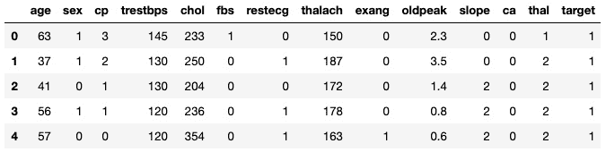
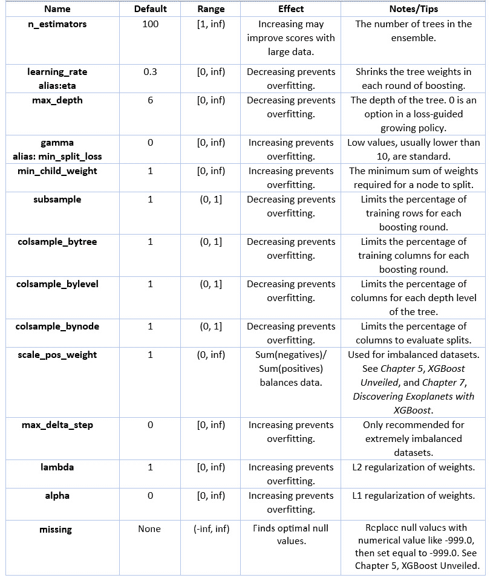

# 六、XGBoost 超参数

XGBoost 有很多超参数。基于 XGBoost 学习器超参数将所有决策树超参数合并为一个起点。有梯度增强超参数，因为 XGBoost 是梯度增强的增强版本。XGBoost 独有的超参数旨在提高精度和速度。然而，试图一次解决所有 XGBoost 超参数可能会令人眼花缭乱。

在 [*第二章*](B15551_02_Final_NM_ePUB.xhtml#_idTextAnchor047)*决策树深度*中，我们回顾并应用了`max_depth`等基础学习器超参数，而在 [*第四章*](B15551_04_Final_NM_ePUB.xhtml#_idTextAnchor093) 、*从梯度推进到 XGBoost* 中，我们应用了重要的 XGBoost 超参数，包括`n_estimators`和`learning_rate`。我们将在本章 XGBoost 的上下文中重新讨论这些超参数。此外，我们还将了解新的 XGBoost 超参数，如`gamma`和一种叫做**提前停止**的技术。

在本章中，为了熟练微调 XGBoost 超参数，我们将讨论以下主要主题:

*   准备数据和基本模型

*   调整核心 XGBoost 超参数

*   应用提前停止

*   把所有的放在一起

# 技术要求

本章的代码可以在[https://github . com/packt publishing/Hands-On-Gradient-Boosting-with-XGBoost-and-Scikit-learn/tree/master/chapter 06](https://github.com/PacktPublishing/Hands-On-Gradient-Boosting-with-XGBoost-and-Scikit-learn/tree/master/Chapter06)找到。

# 准备数据和基础模型

在介绍和应用 XGBoost 超参数之前，我们先做以下准备:

*   获取**心脏病数据集**

*   建立一个`XGBClassifier`模型

*   实现`StratifiedKFold`

*   对**基线 XGBoost 模型进行评分**

*   将`GridSearchCV`和`RandomizedSearchCV`组合成一个强大的功能

在微调超参数时，良好的准备对于获得准确性、一致性和速度至关重要。

## 心脏病数据集

本章通篇使用的数据集是最初出现在 [*第 2 章*](B15551_02_Final_NM_ePUB.xhtml#_idTextAnchor047) 、*深度决策树*中的心脏病数据集。我们选择了相同的数据集，以最大化进行超参数微调所花费的时间，并最小化数据分析所花费的时间。让我们开始这个过程:

1.  转到[https://github . com/packt publishing/Hands-On-Gradient-Boosting-with-XGBoost-and-Scikit-learn/tree/master/chapter 06](https://github.com/PacktPublishing/Hands-On-Gradient-Boosting-with-XGBoost-and-Scikit-learn/tree/master/Chapter06)将`heart_disease.csv`加载到 DataFrame 中并显示前五行。代码如下:

    ```py
    import pandas as pd
    df = pd.read_csv('heart_disease.csv')
    df.head()
    ```

    结果应该如下所示:

    

    图 6.1-前五行

    最后一列，**目标**，是目标列，其中 **1** 表示在场，表示患者有心脏病， **2** 表示不在场。有关其他专栏的详细信息，请访问 UCI 机器学习知识库的[https://archive.ics.uci.edu/ml/datasets/Heart+Disease](https://archive.ics.uci.edu/ml/datasets/Heart+Disease)，或者深入查看 [*第 2 章*](B15551_02_Final_NM_ePUB.xhtml#_idTextAnchor047) 、*决策树*。

2.  现在，检查`df.info()`到以确保数据都是数字，没有空值:

    ```py
    df.info()
    ```

    以下是输出:

    ```py
    <class 'pandas.core.frame.DataFrame'>
    RangeIndex: 303 entries, 0 to 302
    Data columns (total 14 columns):
     #   Column    Non-Null Count  Dtype  
    ---  ------    --------------  -----  
     0   age       303 non-null    int64  
     1   sex       303 non-null    int64  
     2   cp        303 non-null    int64  
     3   trestbps  303 non-null    int64  
     4   chol      303 non-null    int64  
     5   fbs       303 non-null    int64  
     6   restecg   303 non-null    int64  
     7   thalach   303 non-null    int64  
     8   exang     303 non-null    int64  
     9   oldpeak   303 non-null    float64
     10  slope     303 non-null    int64  
     11  ca        303 non-null    int64  
     12  thal      303 non-null    int64  
     13  target    303 non-null    int64  
    dtypes: float64(1), int64(13)
    memory usage: 33.3 KB
    ```

由于所有数据点都是非空的和数字的，所以数据是机器学习就绪的。是时候建立分类器了。

## XGBClassifier

在调整超参数之前，让我们构建一个分类器，这样我们可以获得一个基线分数作为起点。

要构建 XGBoost 分类器，请按照下列步骤操作:

1.  从各自的库中下载`XGBClassifier`和`accuracy_score`。代码如下:

    ```py
    from xgboost import XGBClassifier
    from sklearn.metrics import accuracy_score
    ```

2.  将`X`声明为预测列，将`y`声明为目标列，其中最后一行是目标列:

    ```py
    X = df.iloc[:, :-1]
    y = df.iloc[:, -1]
    ```

3.  用`booster='gbtree'`和`objective='binary:logistic'`默认值以及`random_state=2`初始化`XGBClassifier`:

    ```py
    model = XGBClassifier(booster='gbtree', objective='binary:logistic', random_state=2)
    ```

    `'gbtree'`提升器，基础学习器，是一个梯度提升树。`'binary:logistic'`目标是确定损失函数时二元分类的标准。虽然`XGBClassifier`默认包含这些值，但是我们在这里包含它们是为了熟悉在后面的章节中修改它们。

4.  为了给基线模型评分，导入`cross_val_score`和`numpy`来拟合、评分和显示结果:

    ```py
    from sklearn.model_selection import cross_val_score
    import numpy as np
    scores = cross_val_score(model, X, y, cv=5)
    print('Accuracy:', np.round(scores, 2))
    print('Accuracy mean: %0.2f' % (scores.mean()))
    ```

    准确度得分如下:

    ```py
    Accuracy: [0.85 0.85 0.77 0.78 0.77]
    Accuracy mean: 0.81
    ```

81%的准确率是一个很好的起点，远远高于第二章[](B15551_02_Final_NM_ePUB.xhtml#_idTextAnchor047)**深度决策树*中的`DecisionTreeClassifier`所获得的 76%的交叉验证。*

 *我们在这里使用了`cross_val_score`，我们将使用`GridSearchCV`来调优超参数。接下来，让我们找到一种方法来确保使用`StratifiedKFold`测试折叠是相同的。

## 分层折叠

微调超参数时，`GridSearchCV`和`RandomizedSearchCV`为标准选项。 [*第二章*](B15551_02_Final_NM_ePUB.xhtml#_idTextAnchor047)*决策树深度*的一个问题是`cross_val_score`和`GridSearchCV` / `RandomizedSearchCV`分割数据的方式不同。

一种解决方案是在使用交叉验证时使用`StratifiedKFold`。

分层折叠在每个折叠中包括相同百分比的目标值。如果数据集在目标列中包含 60% 1 和 40% 0，则每个分层测试集包含 60% 1 和 40% 0。当折叠是随机的时，可能一个测试集包含 70-30 分割，而另一个包含 50-50 分割的目标值。

小费

使用`train_test_split`时，shuffle 和 strategy 参数使用默认值为您对数据进行分层。一般信息见[https://sci kit-learn . org/stable/modules/generated/sk learn . model _ selection . train _ test _ split . html](https://scikit-learn.org/stable/modules/generated/sklearn.model_selection.train_test_split.html)。

要使用`StratifiedKFold`，请执行以下操作:

1.  从`sklearn.model_selection`开始执行`StratifiedKFold`:

    ```py
    from sklearn.model_selection import StratifiedKFold
    ```

2.  接下来，通过选择`n_splits=5`、`shuffle=True`和`random_state=2`作为`StratifiedKFold`参数，将折叠次数定义为`kfold`。请注意，`random_state`提供了一致的索引排序，而`shuffle=True`允许对行进行初始洗牌:

    ```py
    kfold = StratifiedKFold(n_splits=5, shuffle=True, random_state=2)
    ```

    现在可以在`cross_val_score`、`GridSeachCV`和`RandomizedSearchCV`中使用`kfold`变量，以确保结果的一致性。

现在，让我们使用`kfold`返回到`cross_val_score`，这样我们就有了一个合适的比较基准。

## 基线模型

现在我们有了一个获得一致褶皱的方法，是时候在`cross_val_score`中使用`cv=kfold`来获得一个官方基线模型了。代码如下:

```py
scores = cross_val_score(model, X, y, cv=kfold)
print('Accuracy:', np.round(scores, 2))
print('Accuracy mean: %0.2f' % (scores.mean()))
```

准确度得分如下:

```py
Accuracy: [0.72 0.82 0.75 0.8 0.82]
Accuracy mean: 0.78
```

分数下降了。这是什么意思？

重要的是不要太投入于获得尽可能高的分数。在这种情况下，我们在不同的褶皱上训练同一个`XGBClassifier`模型，得到不同的分数。这说明了在训练模型时与测试折叠保持一致的重要性，以及为什么分数不一定是最重要的。虽然在模型之间进行选择时，获得尽可能好的分数是一种最优策略，但这里分数的差异揭示了模型不一定更好。在这种情况下，两个模型具有相同的超参数，得分的差异归因于不同的折叠。

这里的要点是，当使用`GridSearchCV`和`RandomizedSearchCV`微调超参数时，使用相同的折叠来获得新的分数，以便分数的比较是公平的。

## 结合 GridSearchCV 和 RandomizedSearchCV

`GridSearchCV`在超参数网格中搜索所有可能的组合，以找到最佳结果。`RandomizedSearchCV`默认选择 10 个随机超参数组合。当`GridSearchCV`变得难以使用时，通常使用`RandomizedSearchCV`，因为有太多的超参数组合，无法详尽地检查每一个。

我们不是为`GridSearchCV`和`RandomizedSearchCV`编写两个独立的函数，而是通过以下步骤将它们合并成一个简化的函数:

1.  从`sklearn.model_selection`导入`GridSearchCV`和`RandomizedSearchCV`:

    ```py
    from sklearn.model_selection import GridSearchCV, RandomizedSearchCV
    ```

2.  用`params`字典和`random=False`定义一个`grid_search`函数作为输入:

    ```py
    def grid_search(params, random=False): 
    ```

3.  使用标准默认值初始化 XGBoos t 分类器:

    ```py
    xgb = XGBClassifier(booster='gbtree', objective='binary:logistic', random_state=2)
    ```

4.  如果`random=True`，用`xgb`和`params` 字典初始化`RandomizedSearchCV`。设置`n_iter=20`允许 20 个随机组合，而不是 10 个。否则，用相同的输入初始化`GridSearchCV`。确保设置`cv=kfold`以获得一致的结果:

    ```py
        if random:
            grid = RandomizedSearchCV(xgb, params, cv=kfold, n_iter=20, n_jobs=-1)
        else:
            grid = GridSearchCV(xgb, params, cv=kfold, n_jobs=-1)
    ```

5.  将`X`和`y`安装到`grid`型号上:

    ```py
    grid.fit(X, y)
    ```

6.  获取并打印`best_params_`:

    ```py
    best_params = grid.best_params_
    print("Best params:", best_params)
    ```

7.  获取并打印`best_score_`:

    ```py
    best_score = grid.best_score_
    print("Training score: {:.3f}".format(best_score))
    ```

`grid_search`功能现在可以用于微调所有超参数。

# 调整 XGBoost 超参数

XGBoost 超参数有很多，其中一些已经在前面的章节中介绍过了。下表总结了关键的 XGBoost 超参数，其中大部分我们在本书中都有涉及。

注意

这里介绍的 XGBoost 超参数并不是详尽的，而是全面的。有关超参数的完整列表，请阅读官方文档，https://xgboost.readthedocs.io/en/latest/parameter.html[的 *XGBoost 参数*。](https://xgboost.readthedocs.io/en/latest/parameter.html)

下表提供了进一步的解释和示例:



图 6.2–XGBoost 超参数表

既然已经给出了关键的 XGBoost 超参数，让我们通过一次调优一个来更好地了解它们。

## 应用 XGBoost 超参数

本节中介绍的 XGBoost 超参数经常由机器学习实践者进行微调。在简要解释了每个超参数之后，我们将使用上一节定义的`grid_search`函数来测试标准变量。

## n _ 估计量

回想一下中的`n_estimators`提供了集合中树的数量。在 XGBoost 的情况下，`n_estimators`是在残差上训练的树的数量。

初始化网格搜索`n_estimators`，默认值为`100`，然后通过`800`将树的数量加倍，如下所示:

```py
grid_search(params={'n_estimators':[100, 200, 400, 800]})
```

输出如下所示:

```py
Best params: {'n_estimators': 100}
Best score: 0.78235
```

由于我们的数据集很小，增加`n_estimators`不会产生更好的结果。本章的*应用提前停止*一节讨论了一种寻找理想值`n_estimators`的策略。

## 学习 _ 速率

`learning_rate`缩小每一轮推进的树的权重。通过降低`learning_rate`，需要更多的树来产生更好的分数。降低`learning_rate`可以防止过度配合，因为结转的重量更小。

使用默认值`0.3`，尽管以前版本的 scikit-learn 已经使用了`0.1`。这里是放置在我们的`grid_search`函数中的`learning_rate`的起始范围:

```py
grid_search(params={'learning_rate':[0.01, 0.05, 0.1, 0.2, 0.3, 0.4, 0.5]})
```

输出如下所示:

```py
Best params: {'learning_rate': 0.05}
Best score: 0.79585
```

改变的学习率导致了轻微的增长。如 [*第四章*](B15551_04_Final_NM_ePUB.xhtml#_idTextAnchor093)*所述，从梯度升压到 XGBoost* ，降低`learning_rate`可能在`n_estimators`上升时有利。

## 最大深度

`max_depth`决定了树的长度，相当于分裂的回合数。限制`max_depth`可以防止过拟合，因为单棵树只能生长到`max_depth`允许的程度。XGBoost 提供了默认的`max_depth`值 6:

```py
grid_search(params={'max_depth':[2, 3, 5, 6, 8]})
```

输出如下所示:

```py
Best params: {'max_depth': 2}
Best score: 0.79902
```

将`max_depth`从`6`改为`2`给出了一个更好的分数。`max_depth`的较低值意味着方差已经减小。

## 伽玛

已知的为`gamma`提供了一个阈值，节点在根据损失函数进行进一步分割之前必须超过该阈值。`gamma`的值没有上限。默认为`0`，任何超过`10`的都被认为非常高。增加`gamma`会导致更保守的模型:

```py
grid_search(params={'gamma':[0, 0.1, 0.5, 1, 2, 5]})
```

输出如下所示:

```py
Best params: {'gamma': 0.5}
Best score: 0.79574
```

将`gamma`从`0`改为`0.5`使得的略有改善。

## 最小 _ 孩子 _ 体重

`min_child_weight`指一个节点分裂成子节点所需的最小权重和。如果权重之和小于`min_child_weight`的值，则不再进行分割。`min_child_weight`通过增加其值来减少过拟合:

```py
grid_search(params={'min_child_weight':[1, 2, 3, 4, 5]})
```

输出如下所示:

```py
Best params: {'min_child_weight': 5}
Best score: 0.81219
```

稍微调整一下`min_child_weight`就能得到最好的结果。

## 子样本

`subsample`超参数限制了每个增强回合的训练实例(行)的百分比。从 100%降低`subsample`会减少过拟合:

```py
grid_search(params={'subsample':[0.5, 0.7, 0.8, 0.9, 1]})
```

输出如下所示:

```py
Best params: {'subsample': 0.8}
Best score: 0.79579
```

分数再次略有提高，表明存在少量过拟合。

## colsample_bytree

类似于`subsample`，`colsample_bytree`根据给定的百分比随机选择特定的列。`colsample_bytree`对于限制列的影响和减少方差很有用。注意`colsample_bytree`接受一个百分比作为输入，而不是列数:

```py
grid_search(params={'colsample_bytree':[0.5, 0.7, 0.8, 0.9, 1]})
```

输出如下所示:

```py
Best params: {'colsample_bytree': 0.7}
Best score: 0.79902
```

这里的收益最多也是微乎其微。鼓励你自己尝试`colsample_bylevel`和`colsample_bynode`。`colsample_bylevel`随机选择每个树深度的列，`colsample_bynode`在评估每个树分割时随机选择列。

微调超参数是一门艺术，也是一门科学。正如这两个学科一样，不同的方法都起作用。接下来，我们将把提前停止作为微调的具体策略`n_estimators`。

# 应用提前停止

提前停止是迭代机器学习算法中限制训练轮数的一种通用方法。在本节中，我们将通过`eval_set`、`eval_metric`和`early_stopping_rounds`来应用提前停止。

## 什么是提前停止？

提前停止为迭代机器学习算法训练的回合数提供了限制。提前停止允许训练继续进行，直到 *n* 个连续回合没有产生任何收益，而不是预先定义训练回合数，其中 *n* 是由用户决定的数字。

找`n_estimators`的时候只选择 100 的倍数没有意义。有可能最佳值是 737 而不是 700。手动找到如此精确的值可能会很累，尤其是当超参数调整可能需要后续更改时。

使用 XGBoost，可以在每一轮增强后确定分数。尽管分数有升有降，但最终分数会保持平稳或朝着错误的方向移动。

当所有随后的分数都不能提供任何收益时，就达到了最高分数。在 10 轮、20 轮或 100 轮训练未能提高分数后，您确定了峰值。你选择回合数。

在早期停止中，给模型足够的时间来失败是很重要的。如果模型停止得太早，比如说，在五轮没有改进之后，模型可能会错过它可以在以后发现的一般模式。与深度学习一样，早期停止经常被使用，梯度推进需要足够的时间来发现数据中复杂的模式。

对于 XGBoost，`early_stopping_rounds`是应用提前停止的关键参数。如果`early_stopping_rounds=10`，连续 10 轮训练未能提高模型，模型将停止训练。同样，如果`early_stopping_rounds=100`，训练继续进行，直到连续 100 轮未能改进模型。

现在你明白什么是早停了，我们来看看`eval_set`和`eval_metric`。

## 评估集和评估度量

`early_stopping_rounds`不是超参数，而是优化`n_estimators`超参数的策略。

通常在选择超参数时，测试分数是在所有提升轮次完成后给出的。要使用提前停止，我们需要在每一轮后测试分数。

`eval_metric`和`eval_set`可用作`.fit`的参数，以生成每轮训练的测试分数。`eval_metric`提供评分方法，通常`'error'`用于分类，`'rmse'`用于回归。`eval_set`提供待评估的测试，通常为`X_test`和`y_test`。

以下六个步骤显示了每轮训练的评估指标，默认为`n_estimators=100`:

1.  将数据分为训练集和测试集:

    ```py
    from sklearn.model_selection import train_test_split
    X_train, X_test, y_train, y_test = train_test_split(X, y, random_state=2)
    ```

2.  初始化模型:

    ```py
    model = XGBClassifier(booster='gbtree', objective='binary:logistic', random_state=2)
    ```

3.  声明`eval_set`:

    ```py
    eval_set = [(X_test, y_test)]
    ```

4.  声明`eval_metric`:

    ```py
    eval_metric = 'error'
    ```

5.  用`eval_metric`和`eval_set`装配型号:

    ```py
    model.fit(X_train, y_train, eval_metric=eval_metric, eval_set=eval_set)
    ```

6.  查看最终得分:

    ```py
    y_pred = model.predict(X_test)
    accuracy = accuracy_score(y_test, y_pred)
    print("Accuracy: %.2f%%" % (accuracy * 100.0))
    ```

    以下是截断的输出:

    ```py
    [0]	validation_0-error:0.15790
    [1]	validation_0-error:0.10526
    [2]	validation_0-error:0.11842
    [3]	validation_0-error:0.13158
    [4]	validation_0-error:0.11842
    …
    [96]	validation_0-error:0.17105
    [97]	validation_0-error:0.17105
    [98]	validation_0-error:0.17105
    [99]	validation_0-error:0.17105
    Accuracy: 82.89%
    ```

不要对分数过于兴奋，因为我们还没有使用交叉验证。事实上，我们知道当`n_estimators=100`时`StratifiedKFold`交叉验证给出了 78%的平均准确率。分数的悬殊来自于测试集的不同。

## 提前 _ 停止 _ 回合

`early_stopping_rounds`是一个可选参数，在拟合模型时与`eval_metric`和`eval_set`一起包含。

我们试试`early_stopping_rounds=10`。

先前的代码被重复，并添加了`early_stopping_rounds=10`:

```py
model = XGBClassifier(booster='gbtree', objective='binary:logistic', random_state=2)
eval_set = [(X_test, y_test)]
eval_metric='error'
model.fit(X_train, y_train, eval_metric="error", eval_set=eval_set, early_stopping_rounds=10, verbose=True)
y_pred = model.predict(X_test)
accuracy = accuracy_score(y_test, y_pred)
print("Accuracy: %.2f%%" % (accuracy * 100.0))
```

输出如下所示:

```py
[0]	validation_0-error:0.15790
Will train until validation_0-error hasn't improved in 10 rounds.
[1]	validation_0-error:0.10526
[2]	validation_0-error:0.11842
[3]	validation_0-error:0.13158
[4]	validation_0-error:0.11842
[5]	validation_0-error:0.14474
[6]	validation_0-error:0.14474
[7]	validation_0-error:0.14474
[8]	validation_0-error:0.14474
[9]	validation_0-error:0.14474
[10]	validation_0-error:0.14474
[11]	validation_0-error:0.15790
Stopping. Best iteration:
[1]	validation_0-error:0.10526
Accuracy: 89.47%
```

结果可能会出乎意料。提前停止表明`n_estimators=2`给出了最好的结果，这可能是测试折叠的一个原因。

为什么只有两棵树？通过只给模型 10 轮来提高准确性，可能数据中的模式还没有被发现。但是，数据集非常小，因此两轮提升可能会产生最佳结果。

更彻底的方法是使用更大的值，比如说，`n_estimators = 5000`和`early_stopping_rounds=100`。

通过设置`early_stopping_rounds=100`，保证你达到 XGBoost 呈现的默认`100` boosted 树。

下面是给出最多 5，000 棵树的代码，它将在连续 100 轮没有发现任何改进后停止:

```py
model = XGBClassifier(random_state=2, n_estimators=5000)
eval_set = [(X_test, y_test)]
eval_metric="error"
model.fit(X_train, y_train, eval_metric=eval_metric, eval_set=eval_set, early_stopping_rounds=100)
y_pred = model.predict(X_test)
accuracy = accuracy_score(y_test, y_pred)
print("Accuracy: %.2f%%" % (accuracy * 100.0))
```

这里是被截断的输出:

```py
[0]	validation_0-error:0.15790
Will train until validation_0-error hasn't improved in 100 rounds.
[1]	validation_0-error:0.10526
[2]	validation_0-error:0.11842
[3]	validation_0-error:0.13158
[4]	validation_0-error:0.11842
...
[98]	validation_0-error:0.17105
[99]	validation_0-error:0.17105
[100]	validation_0-error:0.17105
[101]	validation_0-error:0.17105
Stopping. Best iteration:
[1]	validation_0-error:0.10526
Accuracy: 89.47%
```

经过 100 轮提升后，两棵树提供的分数仍然是最好的。

最后一点，考虑当不清楚你应该设定多高的目标时，早期停止对大型数据集特别有用。

现在，让我们使用早期停止的结果以及之前调整的所有超参数来生成可能的最佳模型。

# 组合超参数

是时候结合本章的所有组成部分来提高通过交叉验证获得的 78%的分数了。

众所周知，超参数微调没有一种通用的方法。一种方法是用`RandomizedSearchCV`输入所有超参数范围。更系统的方法是一次处理一个超参数，将最佳结果用于后续迭代。所有方法都有优点和局限性。不管什么策略，重要的是尝试多种变化，并在数据出现时做出调整。

## 一次一个超参数

使用系统的方法，我们一次添加一个超参数，一路汇总结果。

### n _ 估计量

尽管`2`的`n_estimators`值给出了最好的结果，但是在`grid_search`函数上尝试一个范围是值得的，它使用交叉验证:

```py
grid_search(params={'n_estimators':[2, 25, 50, 75, 100]})
```

输出如下所示:

```py
Best params: {'n_estimators': 50}
Best score: 0.78907
```

毫不奇怪，`n_estimators=50`，在之前的最佳值 2 和默认值 100 之间，给出了最佳结果。由于在早期停止中没有使用交叉验证，这里的结果是不同的。

### 最大深度

`max_depth`超参数决定了每棵树的长度。这里有一个不错的系列:

```py
grid_search(params={'max_depth':[1, 2, 3, 4, 5, 6, 7, 8], 'n_estimators':[50]})
```

输出如下所示:

```py
Best params: {'max_depth': 1, 'n_estimators': 50}
Best score: 0.83869
```

这是一个非常实质性的收获。深度为 1 的树被称为**决策树树桩**。通过调整两个超参数，我们从基线模型中获得了 4 个百分点。

保持最高值的方法的一个限制是我们可能会错过更好的组合。也许`n_estimators=2`或`n_esimtators=100`与`max_depth`结合会给出更好的结果。让我们来看看:

```py
grid_search(params={'max_depth':[1, 2, 3, 4, 6, 7, 8], 'n_estimators':[2, 50, 100]})
```

输出如下所示:

```py
Best params: {'max_depth': 1, 'n_estimators': 50}
Best score: 0.83869
```

`n_estimators=50`和`max_depth=1`仍然给出最好的结果，因此我们将继续使用它们，稍后返回到我们的早期停止分析。

### 学习率

由于`n_esimtators`的相当低，调整 `learning_rate`可能会改善结果。以下是标准范围:

```py
grid_search(params={'learning_rate':[0.01, 0.05, 0.1, 0.2, 0.3, 0.4, 0.5], 'max_depth':[1], 'n_estimators':[50]})
```

输出如下所示:

```py
Best params: {'learning_rate': 0.3, 'max_depth': 1, 'n_estimators': 50}
Best score: 0.83869
```

这与之前获得的分数相同。请注意，0.3 的`learning_rate`值是 XGBoost 提供的默认值。

### 最小 _ 孩子 _ 体重

让我们来看看调整分割成子节点所需的权重的总和是否会增加分数:

```py
grid_search(params={'min_child_weight':[1, 2, 3, 4, 5], 'max_depth':[1], 'n_estimators':[50]})
```

输出如下所示:

```py
Best params: {'max_depth': 1, 'min_child_weight': 1, 'n_estimators': 50}
Best score: 0.83869
```

在这种情况下，最好的分数是一样的。注意 1 是`min_child_weight`的默认值。

### 子样品

如果减少方差是有益的，`subsample`可以通过限制样本的百分比来起作用。然而，在这种情况下，只有 303 个样本开始，少量的样本使得很难调整超参数来提高分数。代码如下:

```py
grid_search(params={'subsample':[0.5, 0.6, 0.7, 0.8, 0.9, 1], 'max_depth':[1], 'n_estimators':[50]})
```

输出如下所示:

```py
Best params: {'max_depth': 1, 'n_estimators': 50, 'subsample': 1}
Best score: 0.83869
```

还是没有收获。在这一点上，你可能想知道新的收益是否会随着`n_esimtators=2`继续下去。

让我们通过对到目前为止使用的值进行全面的网格搜索来找出。

```py
grid_search(params={'subsample':[0.5, 0.6, 0.7, 0.8, 0.9, 1], 
                    'min_child_weight':[1, 2, 3, 4, 5], 
                    'learning_rate':[0.1, 0.2, 0.3, 0.4, 0.5], 
                    'max_depth':[1, 2, 3, 4, 5],
                    'n_estimators':[2]})
```

输出如下所示:

```py
Best params: {'learning_rate': 0.5, 'max_depth': 2, 'min_child_weight': 4, 'n_estimators': 2, 'subsample': 0.9}
Best score: 0.81224
```

只有两棵树的分类器性能更差并不奇怪。即使初始分数更好，它也没有经历足够的迭代来对超参数进行显著的调整。

## 超参数调整

当使用超参数移动方向时，`RandomizedSearchCV`因输入范围广而很有用。

这是一系列结合了新输入和先前知识的超参数值。用`RandomizedSearchCV`限制范围增加了找到最佳组合的几率。回想一下，当组合总数对于网格搜索来说太耗时时，`RandomizedSearchCV`是有用的。以下选项有 4500 种可能的组合:

```py
grid_search(params={'subsample':[0.5, 0.6, 0.7, 0.8, 0.9, 1], 
                    'min_child_weight':[1, 2, 3, 4, 5], 
                    'learning_rate':[0.1, 0.2, 0.3, 0.4, 0.5], 
                    'max_depth':[1, 2, 3, 4, 5, None], 
                    'n_estimators':[2, 25, 50, 75, 100]},
                    random=True)
```

输出如下所示:

```py
Best params: {'subsample': 0.6, 'n_estimators': 25, 'min_child_weight': 4, 'max_depth': 4, 'learning_rate': 0.5}
Best score: 0.82208
```

这很有意思。不同的价值观正在取得良好的效果。

我们使用从最佳分数向前的超参数。

### Colsample

现在，让我们按顺序用试试`colsample_bytree`、`colsample_bylevel`和`colsample_bynode`。

#### 列样本 _ 字节树

让我们从`colsample_bytree`开始:

```py
grid_search(params={'colsample_bytree':[0.5, 0.6, 0.7, 0.8, 0.9, 1], 'max_depth':[1], 'n_estimators':[50]})
```

输出如下所示:

```py
Best params: {'colsample_bytree': 1, 'max_depth': 1, 'n_estimators': 50}
Best score: 0.83869
```

分数没有提高。接下来，试试`colsample_bylevel`。

#### colsample_bylevel

使用以下代码来测试`colsample_bylevel`:

```py
grid_search(params={'colsample_bylevel':[0.5, 0.6, 0.7, 0.8, 0.9, 1],'max_depth':[1], 'n_estimators':[50]})
```

输出如下所示:

```py
Best params: {'colsample_bylevel': 1, 'max_depth': 1, 'n_estimators': 50}
Best score: 0.83869
```

还是没有收获。

看起来我们正在用浅层数据集达到顶峰。让我们尝试一种不同的方法。让我们一起调优所有的 colsamples，而不是单独使用`colsample_bynode`。

#### 列样本 _ 节点

尝试下面的代码:

```py
grid_search(params={'colsample_bynode':[0.5, 0.6, 0.7, 0.8, 0.9, 1], 'colsample_bylevel':[0.5, 0.6, 0.7, 0.8, 0.9, 1], 'colsample_bytree':[0.5, 0.6, 0.7, 0.8, 0.9, 1], 'max_depth':[1], 'n_estimators':[50]})
```

输出如下所示:

```py
Best params: {'colsample_bylevel': 0.9, 'colsample_bynode': 0.5, 'colsample_bytree': 0.8, 'max_depth': 1, 'n_estimators': 50}
Best score: 0.84852
```

非常好。通过共同努力，colsamples 取得了迄今为止的最高分，比原来的分数高出了 5 个百分点。

### 微克

我们将尝试微调的最后一个超参数是`gamma`。这里是为减少过拟合而设计的`gamma`值的范围:

```py
grid_search(params={'gamma':[0, 0.01, 0.05, 0.1, 0.5, 1, 2, 3], 'colsample_bylevel':[0.9], 'colsample_bytree':[0.8], 'colsample_bynode':[0.5], 'max_depth':[1], 'n_estimators':[50]})
```

输出如下所示:

```py
Best params: {'colsample_bylevel': 0.9, 'colsample_bynode': 0.5, 'colsample_bytree': 0.8, 'gamma': 0, 'max_depth': 1, 'n_estimators': 50}
Best score: 0.84852
```

`gamma`保持默认值`0`。

由于我们的最好成绩比原来高了 5 个百分点，这对于 XGBoost 来说是一个不小的成就，我们就到此为止。

# 总结

在本章中，您通过使用`StratifiedKFold`建立一个基线 XGBoost 模型，为超参数微调做好了准备。然后，你将`GridSearchCV`和`RandomizedSearchCV`组合成一个强大的函数。您了解了关键 XGBoost 超参数的标准定义、范围和应用，以及一种称为早期停止的新技术。您综合了所有函数、超参数和技术来微调心脏病数据集，从默认的 XGBoost 分类器中获得了令人印象深刻的 5 个百分点。

XGBoost 超参数微调需要时间来掌握，你已经在路上了。微调超参数是区分机器学习专家和机器学习新手的关键技能。XGBoost 超参数的知识不仅有用，而且对于最大限度地利用您构建的机器学习模型至关重要。

祝贺你完成这重要的一章。

接下来，我们从头到尾展示了一个 XGBoost 回归的案例研究，突出了`XGBClassifier`的能力、范围和应用。*