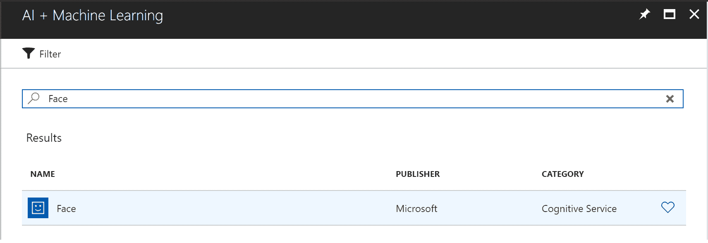
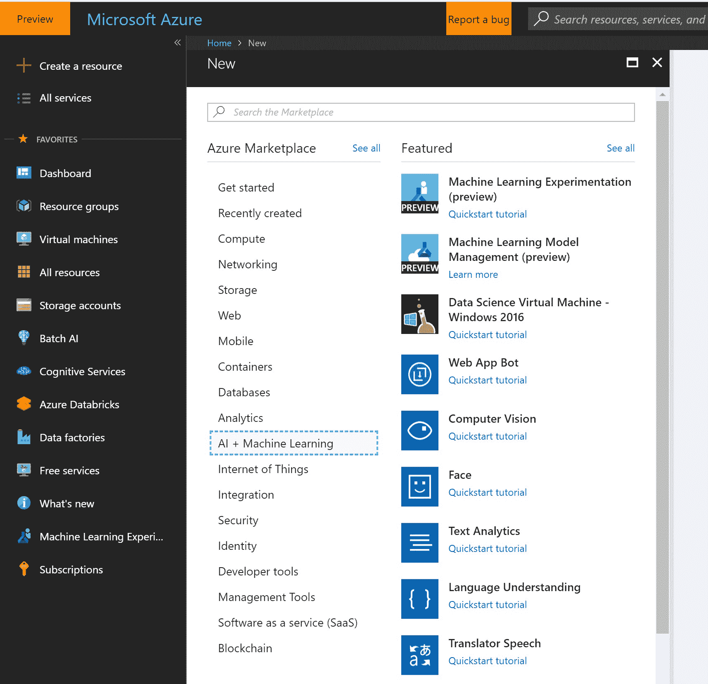
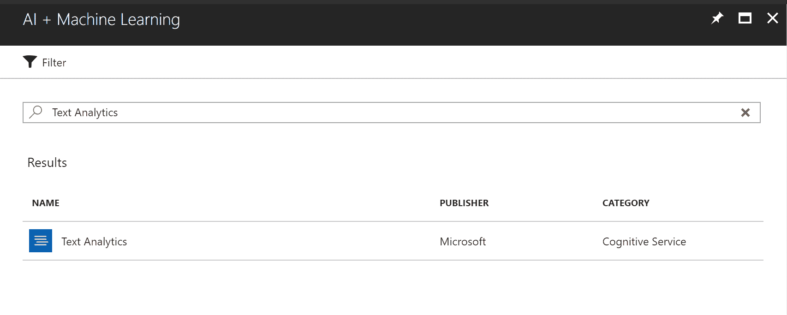
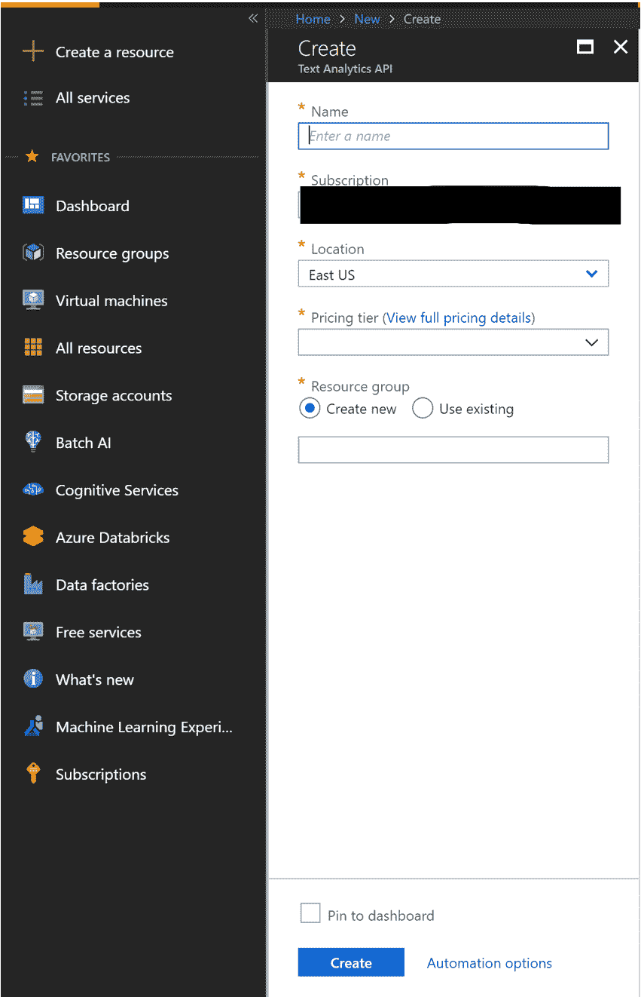
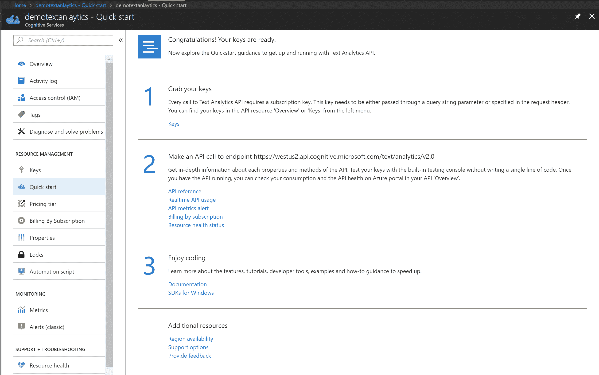
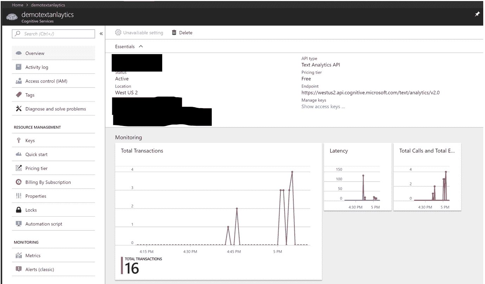

    

# 三、认知服务

认知服务是微软提供的一套预先训练好的 API，允许开发者开发使用 AI 的应用，而不必构建 ML 模型。凭借对边缘部署的支持，开发人员可以构建使用强大的人工智能算法在无人机等设备上进行解释、听、说和看的应用。

API 有五个主要类别:

*   视力
*   语言
*   演讲
*   知识
*   搜索

现在，这些 API 中的许多都可以定制，以满足公司及其客户的特定需求。在本章中，我们将对每个服务类别进行概述，并浏览一些示例。

# 视觉 API 的认知服务

Vision APIs 帮助您将图像分析功能添加到您的 AI 应用中。在撰写本文时，认知服务包括五个 Vision APIs:

*   计算机视觉
*   脸
*   内容版主
*   视频索引器
*   定制视觉

我们将在本章学习前两个 API。我们会把剩下的留给你自己去探索。

# 计算机视觉 API

这个 API 为基于各种可识别的物体、生物、动作和风景的图像提供标签。上传图像或指定图像的 URL 后，计算机视觉 API 的算法会在图像中识别标签。这可能包括主题、场景(室内或室外)、家具、工具、植物、动物、配件和小工具。

让我们来看一个示例图像:


我们将它发送给 API，并获得 JSON 格式的输出。这将向我们显示标签以及与每个标签相关联的置信度:

| **标签** | `[``{ "name": "bench", "confidence": 0.999963641 ...` |

# Face API

现在让我们看看视觉类别中的下一个 API，面部 API。

这可以用来检测人脸和比较相似的人脸。它还会指示面部属性，包括年龄、情绪、性别和头发颜色。

让我们来看一个示例图像:


如果我们将这个输入图像发送给 API，我们会得到以下 JSON 格式的输出:

```py
//output omitted
"faceAttributes": {
      "hair": {
        "bald": 0.01,
        "invisible": false,
        "hairColor": [
          {
            "color": "blond",
            "confidence": 1.0
          },
          {
            "color": "brown",
            "confidence": 0.87
          },
        //omitted
        ]
      },
      "smile": 0.018,
      "headPose": {
        "pitch": 0.0,
        "roll": 3.2,
        "yaw": -23.3
      },
      "gender": "female",
      "age": 24.4,
      "facialHair": {
        "moustache": 0.0,
        "beard": 0.0,
        "sideburns": 0.0
      },
      "glasses": "NoGlasses",      "makeup": {
        "eyeMakeup": true,
        "lipMakeup": true
      },
      "emotion": {
        "anger": 0.001,
        "contempt": 0.002,
        "disgust": 0.002,
        "fear": 0.0,
        "happiness": 0.018,
        "neutral": 0.969,
        "sadness": 0.006,
        "surprise": 0.002
      },
//output omitted
```

想要快速试用 Face API，可以去下面的网址:[https://azure . Microsoft . com/en-us/services/cognitive-services/Face/](https://azure.microsoft.com/en-us/services/cognitive-services/face/)。

就像计算机视觉 API 一样，您可以使用 Python 或任何其他语言调用 Face API。创建 Face API 资源的步骤与计算机视觉 API 类似，只是您必须在门户中搜索 Face API，如以下屏幕截图所示:



有关其余 Vision APIs 的更多信息，可以访问以下网址:[https://azure . Microsoft . com/en-us/services/cognitive-services/directory/Vision/](https://azure.microsoft.com/en-us/services/cognitive-services/directory/vision/)。

# 语言 API 的认知服务

语言 API 允许我们将文本分析、翻译和其他功能添加到我们的 AI 应用中。在撰写本文时，认知服务提供了五种语言 API:

*   文本分析

*   翻译文本

*   Bing 拼写检查

*   内容版主

*   语言理解

在本章中，我们将只看第一个 API。我们会把其他的留给你自己去探索。

# 文本分析

文本分析 API 可用于从文本中检测情感、关键短语、实体和语言。下面是一个示例，它向 API 发送一个输入文本，并以 JSON 格式获得以下输出。正文如下:

```py
{  "languageDetection": {    "documents": [      {        "id": "fe2529ff-073e-4355-86fa-b927d1b62a23",        "detectedLanguages": [          {            "name": "English",            "iso6391Name": "en",            "score": 1.0          }        ]      }    ],    "errors": []  },  "keyPhrases": {    "documents": [      {        "id": "fe2529ff-073e-4355-86fa-b927d1b62a23",        "keyPhrases": [          "Microsoft's offerings",          "AI space"        ]      }    ],    "errors": []  },  "sentiment": {    "documents": [      {        "id": "fe2529ff-073e-4355-86fa-b927d1b62a23",        "score": 0.93527746200561523      }    ],    "errors": []  },  "entities": {    "documents": [      {        "id": "fe2529ff-073e-4355-86fa-b927d1b62a23",        "entities": [          {            "name": "Microsoft",            "matches": [              {                "text": "Microsoft's",                "offset": 25,                "length": 11              }            ],            "wikipediaLanguage": "en",            "wikipediaId": "Microsoft",            "wikipediaUrl": "https://en.wikipedia.org/wiki/Microsoft",            "bingId": "a093e9b9-90f5-a3d5-c4b8-5855e1b01f85"          },          {            "name": "Ai Space",            "matches": [              {                "text": "AI space",                "offset": 50,                "length": 8              }            ],            "wikipediaLanguage": "en",            "wikipediaId": "Ai Space",            "wikipediaUrl": "https://en.wikipedia.org/wiki/Ai_Space",            "bingId": "2d055fa3-b3cc-e9f6-776a-77b6ed7f341f"          }        ]      }    ],    "errors": []  }}
```

要快速试用文本分析 API，请访问以下 URL:[https://azure . Microsoft . com/en-us/services/cognitive-services/Text-Analytics/](https://azure.microsoft.com/en-us/services/cognitive-services/text-analytics/)。

作为一个 AI 开发者，你可以用任何语言调用 API。在这个例子中，我们将看看如何使用 Python 调用 API。类似的方法可以用于其他编程语言:

1.  从 Azure 门户创建一个文本分析 API 认知服务资源:[https://portal.azure.com](https://portal.azure.com)。

2.  导航到 API，如下面的屏幕截图所示。点击创建资源，然后 AI +机器学习，然后文本分析:



3.  或者，你可以在 Azure 门户中搜索`Text Analytics`:



4.  为您的服务提供一个名称，然后选择合适的 Azure 订阅、位置和定价层(免费或付费)。您还需要创建一个新的资源组或选择一个现有的资源组:



5.  创建 API 不到一分钟。创建完成后，您将看到快速启动页面，其中包含指向 API 密钥及其文档的链接。您将需要 API 键来从您的 Python(或任何其他语言)代码或您正在使用的任何语言的代码中访问 API。创建 API 后，您将看到以下屏幕:



6.  使用您最喜欢的 Python 编辑器，并使用以下示例代码调用 API:

```py
# Replace <Subscription Key> with your valid subscription's api access key.
subscription_key = "<Access Key>"
assert subscription_key

# Replace the base url with what you see as Endpoint in the portal’s Overview section under your api
text_analytics_base_url = "https://westus2.api.cognitive.microsoft.com/text/analytics/v2.0/"
sentiment_api_url = text_analytics_base_url + "sentiment"

# Send the text you want the api to analyze
# You can send multiple texts
documents = {'documents' : [
  {'id': '1', 'text': 'I am excited about using AI offerings by Microsoft.'},
]}

import requests
# Get sentiment of text
headers   = {"Ocp-Apim-Subscription-Key": subscription_key}
response  = requests.post(sentiment_api_url, headers=headers, json=documents)
sentiments = response.json()
print(sentiments)

# Get the language of text
language_api_url = text_analytics_base_url + "languages"
response  = requests.post(language_api_url, headers=headers, json=documents)
languages = response.json()
print(languages)

# Get key phrases from text
key_phrase_api_url = text_analytics_base_url + "keyPhrases"
response  = requests.post(key_phrase_api_url, headers=headers, json=documents)
key_phrases = response.json()
print(key_phrases)

# Get well-known entities
entity_linking_api_url = text_analytics_base_url + "entities"
response  = requests.post(entity_linking_api_url, headers=headers, json=documents)
entities = response.json()
print(entities)
```

7.  当您运行上述代码时，您将看到如下所示的输出:

```py

{'documents': [{'id': '1', 'score': 0.9388835430145264}], 'errors': []}{'documents': [{'detectedLanguages': [{'iso6391Name': 'en', 'name': 'English', 'score': 1.0}], 'id': '1'}], 'errors': []}
{'documents': [{'keyPhrases': ['AI offerings', 'Microsoft'], 'id': '1'}], 'errors': []}
{'documents': [{'id': '1', 'entities': [{'name': 'Microsoft', 'wikipediaId': 'Microsoft', 'matches': [{'offset': 41, 'length': 9, 'text': 'Microsoft'}], 'bingId': 'a093e9b9-90f5-a3d5-c4b8-5855e1b01f85', 'wikipediaUrl': 'https://en.wikipedia.org/wiki/Microsoft', 'wikipediaLanguage': 'en'}, {'name': 'Artificial intelligence', 'wikipediaId': 'Artificial intelligence', 'matches': [{'offset': 25, 'length': 2, 'text': 'AI'}], 'bingId': '9d99fb44-edac-0e03-1579-19d8d8591a49',
'wikipediaUrl': 'https://en.wikipedia.org/wiki/Artificial_intelligence', 'wikipediaLanguage': 'en'}]}], 'errors': []}
```

情绪得分为 0.93 表示情绪积极。API 检测到英语作为语言，以及两个关键短语和实体。

8.  每个事务相当于一个 API 调用。该门户将显示您可以监控的详细信息，如呼叫总数、错误、延迟和数据输入/输出。在前面的例子中，我们调用了四个不同的 API:`sentiment`、`languages`、`keyPhrases`和`entities`:



想了解更多关于其余语言 API 的信息，可以去以下网址:[https://azure . Microsoft . com/en-us/services/cognitive-services/directory/lang/](https://azure.microsoft.com/en-us/services/cognitive-services/directory/lang/)。

# 语音 API 的认知服务

语音 API 帮助您将与语音到文本和文本到语音操作相关的各种功能添加到您的 AI 应用中。

在撰写本文时，认知服务提供了四个语音 API:

*   语音转文本

*   文本到语音

*   说话人识别

*   语音翻译

# 语音转文本

语音到文本 API 可以帮助将语音音频转换为文本。音频可以是实时音频，也可以是从录音中流出的音频。你可以在[https://azure . Microsoft . com/en-us/services/cognitive-services/speech-to-text/](https://azure.microsoft.com/en-us/services/cognitive-services/speech-to-text/)找到更多信息。

# 知识 API 的认知服务

基于自然语言处理，知识 API 帮助解析复杂的信息，并以一种易于使用的方式对其进行映射。

在撰写本文时，有一个基于知识 API 的服务:QnA Maker。

# QnA 制造商

这个 API 允许您通过智能地解析文本，从 FAQ 形式的文本中快速提取问题和答案。一旦这些信息可用，就可以用来创建一个问答机器人。你可以在[https://azure . Microsoft . com/en-us/services/cognitive-services/qna-maker/](https://azure.microsoft.com/en-us/services/cognitive-services/qna-maker/)找到更多信息。

# 搜索 API 的认知服务

搜索 API 帮助您搜索不同类型的内容，而不必开发复杂的搜索算法。

在撰写本文时，认知服务提供了八个 API:

*   Bing 网络搜索

*   Bing 自定义搜索

*   必应视频搜索

*   必应图片搜索

*   Bing 视觉搜索

*   Bing 实体搜索

*   必应新闻搜索

*   Bing 自动建议

在这一章中，我们将讨论一个 API，Bing 视觉搜索，剩下的就留给你自己去探索了。

# Bing 视觉搜索

Bing 视觉搜索 API 允许用户识别图像中的实体和文本。这意味着他们可以执行一系列操作，包括从图像中获取信息，并在一系列类别中找到相似的图像、产品和对象，包括时尚、地标、鲜花、名人等。Bing 视觉搜索可以从名片中提取信息，并可以针对特定领域进行定制。

下面的屏幕截图显示了一个发送给 API 的输入图像的例子。然后，我们收到了 JSON 格式的输出，它可以被解析并显示在 web 页面上，如屏幕截图的右侧所示:


要试用这个 API 或以编程方式调用这个 API，可以转到以下 URL:[https://azure . Microsoft . com/en-us/services/cognitive-services/bing-visual-search/](https://azure.microsoft.com/en-us/services/cognitive-services/bing-visual-search/)。它还包含 API 参考文档。

其余的搜索 API，可以去以下网址:[https://azure . Microsoft . com/en-us/services/cognitive-services/directory/Search/](https://azure.microsoft.com/en-us/services/cognitive-services/directory/search/)。

# 摘要

在这一章中，我们学习了如何使用认知服务快速开发 AI 应用。在下一章，我们将学习机器人框架，它是用来建立机器人的。

# 参考

*   所有认知服务都可以通过以下网址访问:[https://azure . Microsoft . com/en-us/Services/Cognitive-Services/](https://azure.microsoft.com/en-us/services/cognitive-services/)