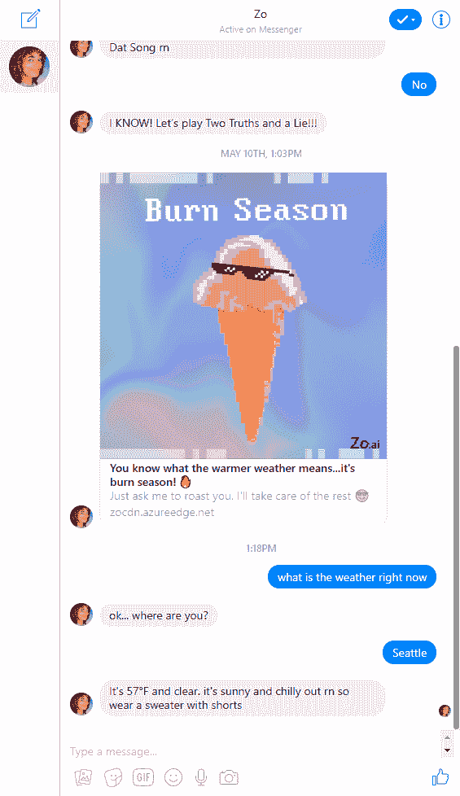
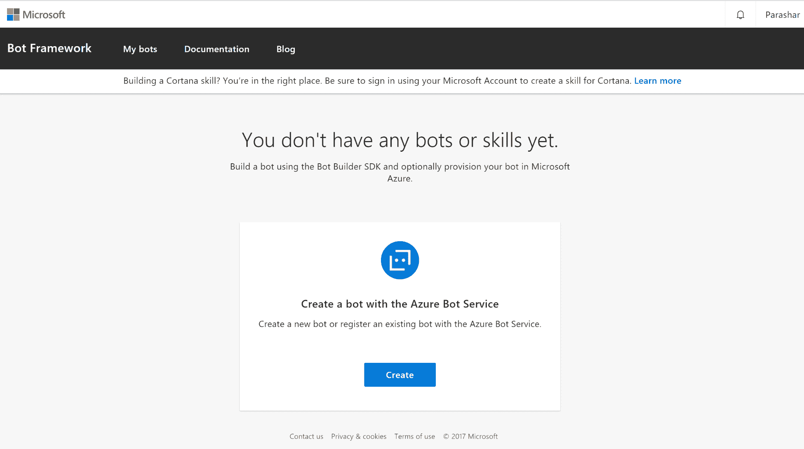
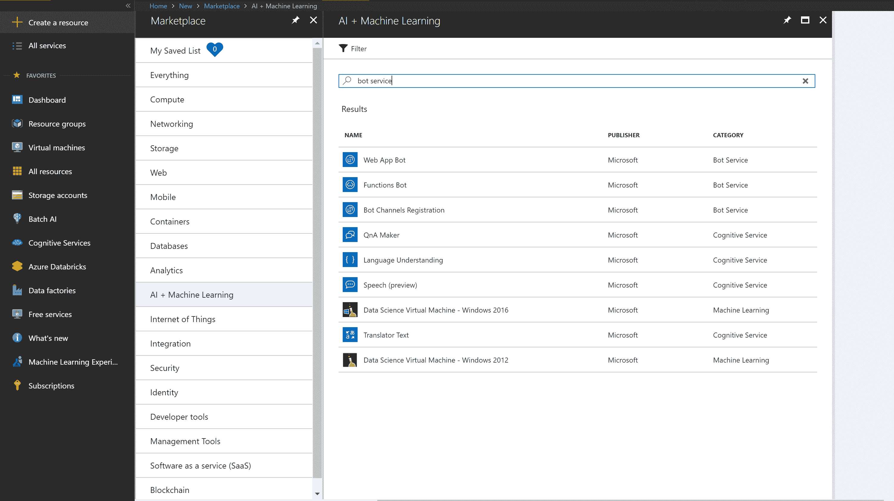
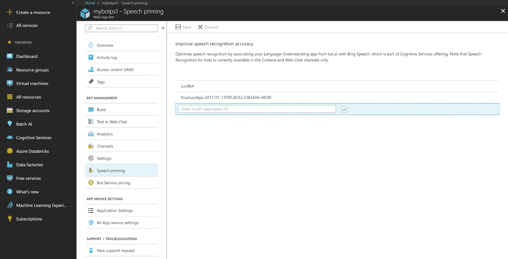

    

# 四、Bot 框架

在前一章中，我们学习了认知服务，它可以帮助我们创建一个人工智能应用。在这一章中，我们将学习使用各种 Azure 服务构建机器人。微软提供了一个强大的平台，包括以下组件来帮助构建和部署机器人:

*   Bot builder SDK
*   Bot 框架
*   QnA 制造商
*   Bot 服务

# 什么是机器人？

聊天机器人是一种允许你通过文本、图像或语音进行类似人类对话的应用。机器人可以集成到 web 应用或移动应用中。不同的应用，如 Facebook Messenger、Kik、微信或 Skype，支持各种类型的机器人，这些机器人可能会帮助你找到特定问题的答案，在沙龙预约，或在餐厅预订桌子。与机器人聊天应该像与客户服务代理或朋友聊天一样。这是一个机器人的例子，它在 Facebook Messenger 中帮助回答关于天气的问题。这个机器人是由微软制造的，被称为 Zo 机器人:

可以在云中部署一个机器人，以帮助根据用户需求扩展它可以处理的流量。为了让您了解创建智能和强大的机器人有多容易，我们将使用 bot 服务创建一个机器人，它将涵盖上述所有组件。

在接下来的章节中，我们将快速描述 Azure 中可用的每个组件，以帮助我们构建机器人。

# Bot Builder SDK

Bot Builder SDK 使您能够创建 Bot。两者都支持。NET 和 Node.js 语言，以覆盖广大的开发人员。

# Bot 框架

机器人框架使您能够将机器人连接到各种社交媒体渠道。您可以连接任意数量的频道，包括 Facebook Messenger、Skype、Teams、Kik 或自定义频道。

除了 SDK 和框架，我们还有 Bot 框架仿真器和 Bot 框架通道仿真器。bot 框架模拟器是一个桌面应用，用于测试您的 bot，而 Bot 框架通道模拟器可以帮助您测试您的 Bot 在不同通道上的外观和工作方式。

# QnA 制造商

QnA Maker 服务帮助我们快速创建基本的对话机器人。它可以与**语言理解智能服务** ( **路易斯**)集成，创建更多智能机器人。QnA Maker 和 LUIS 都是认知服务，我们在[第 3 章](89299379-0f5e-4602-ad78-9d3d46a0710e.xhtml)、*认知服务中简单提到过。*

# Bot 服务

Bot 服务通过结合 Bot Builder SDK 和我们前面讨论的 Bot 框架，使得创建 Bot 变得很容易。两者都支持。NET 和 Node.js 开发者。有五种模板可用于快速创建机器人:

*   基本机器人
*   表单 bot
*   语言理解机器人
*   问答机器人
*   主动机器人

以下是说明如何使用 bot 服务创建和运行 Bot 的高级步骤:

# 使用 bot 服务创建 Bot

当我们用 Azure bot 服务创建一个 Bot 时，Azure 为我们做了很多工作。它提供 bot，基于 bot builder SDK 创建 bot 项目，并发布 bot。以这种方式创建一个机器人只需要一个 Azure 订阅。

1.  首先，去 https://dev.botframework.com 的机器人框架网站，它会带你去 Azure 门户网站:

2.  或者，我们可以直接进入位于 https://portal.azure.com 的 Azure 门户网站，搜索`Bot Service`:

3.  对于本例，选择...

# 路易斯应用

我们的机器人还可以接收音频作为输入，门户允许我们集成 LUIS 应用。如果您已经有 LUIS 申请，您可以在此处提供信息:

# 摘要

在这一章中，我们已经学习了使用各种基于 Azure 的服务，这些服务帮助我们创建可以快速轻松地集成到不同 messenger 服务中的机器人。在下一章中，我们将了解 Azure Machine Learning Studio，我们可以使用它来创建自定义的机器学习模型。