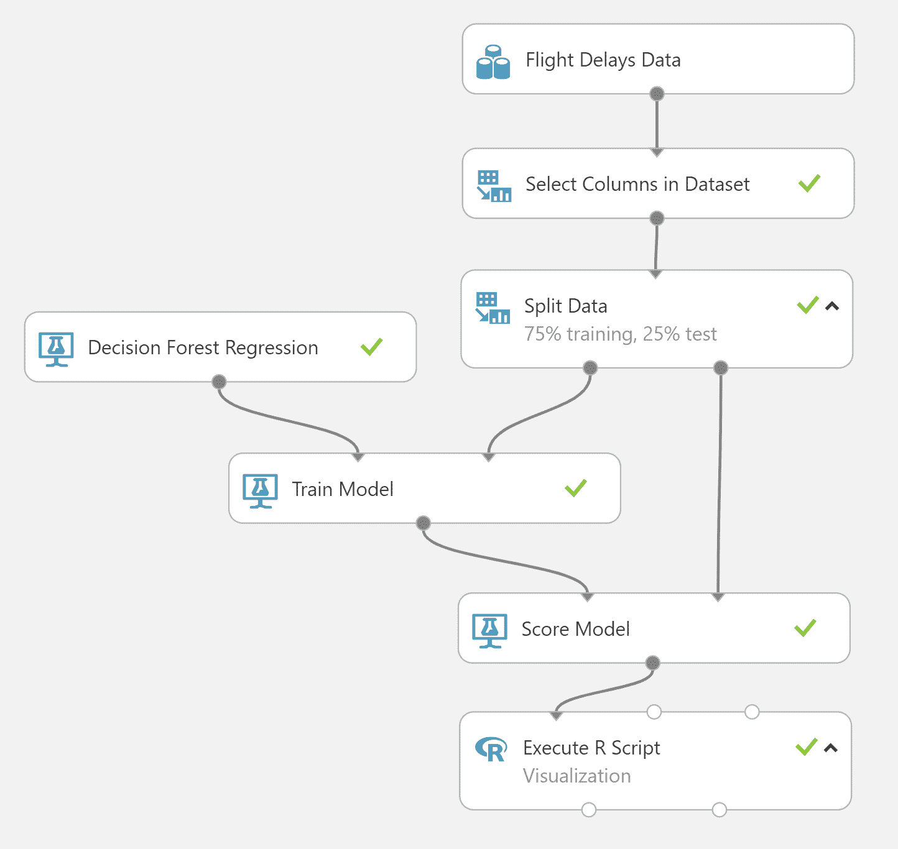
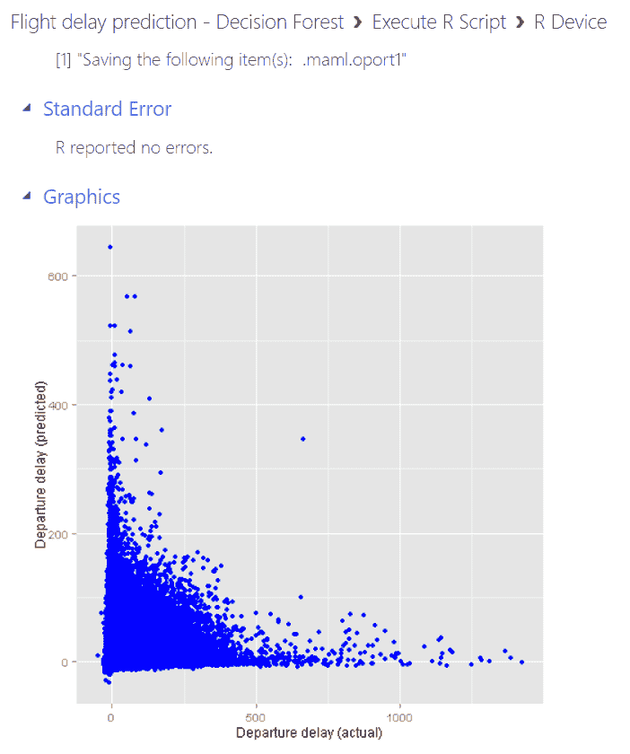
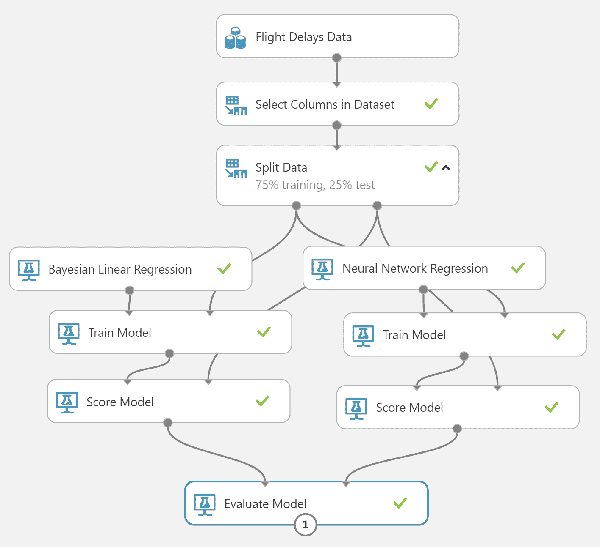
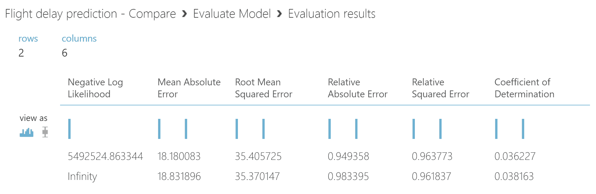
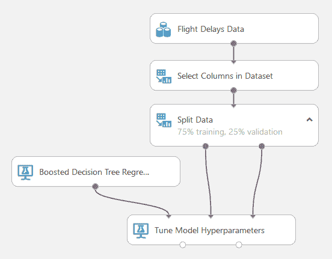
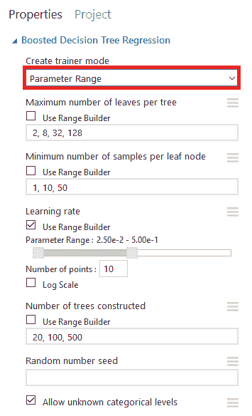
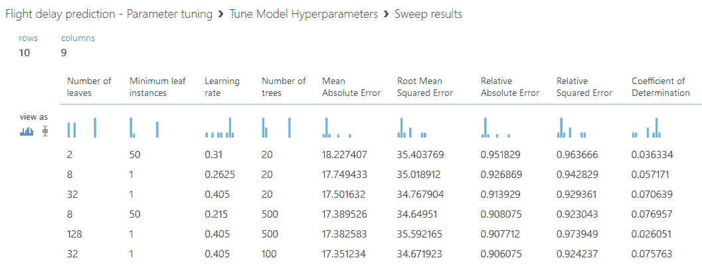
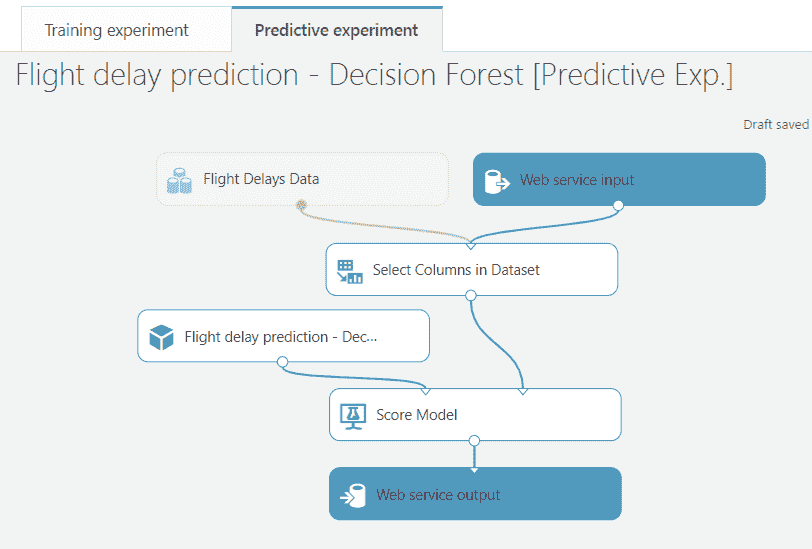
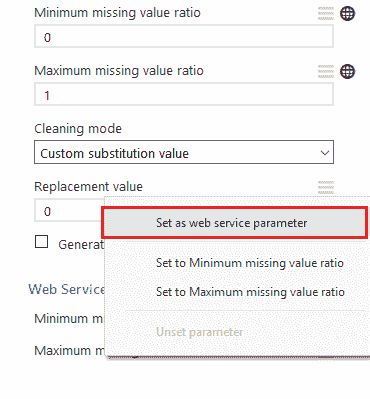

    

# 五、Azure ML Studio

**Azure ML Studio**是一个 ML 即服务平台，用于创建定制的**机器学习** ( **ML** )模型。Azure ML Studio 对于初学者来说是一个很好的工具，他们可能有一些使用机器学习模型的经验，并且希望对训练过程有更深入的了解。它提供了比认知服务 API 更大的灵活性和简单易学的开发环境。GUI 不需要任何编程，并允许用户尽可能有效地专注于构建 ML 模型。Azure ML Studio 也是更有经验的 AI 开发人员的有用工具，他们手头有一个相当简单的问题，需要快速获得结果。

Azure ML Studio 由两个独立的服务组成:Studio 工作区和 Studio Web 服务。这两种服务还包括处理所需的后端计算资源，因此用户不必担心底层操作系统或硬件的维护。这两个服务之间的区别是显而易见的:Studio 工作区用于训练 ML 模型和试验不同的配置，而 Studio Web 服务提供了一个 REST API 接口，用于对示例进行评分，使用从工作区发布的模型。

Azure ML Studio 是为协作开发而设计的。它与 Azure Active Directory 集成，因此只需几次点击，就可以将来自同一组织的用户添加到工作区。ML Studio 工作区中的所有 ML 模型对工作区的所有成员都是可见的。工作空间成员还可以编辑其他人创建的模型，因此开发人员可以尝试迭代地改进彼此的结果。因此，例如，当开发人员遵循**团队数据科学过程**(**)时，它是一个很好的工具。**

 **ML 模型是在*实验*中开发的。实验包含从输入数据集开始产生 ML 模型所需的所有步骤。实验可用于比较不同的 ML 模型和参数配置。ML Studio 提供了广泛的模块，可以添加到实验中以执行不同的任务，如预处理数据或评估训练结果。通过组合这些模块，逐步构建实验，产生可以运行以产生训练的 ML 模型的训练管道。ML Studio 还包括一个广泛的实验模板集合，包含来自许多不同领域的现成例子。在下一节中，我们将展示如何将这些模板部署到 ML Studio 工作区。

工作空间和 web 服务的定价基于计算资源的使用。在 ML Studio 中训练新的 ML 模型时，会消耗工作空间资源。工作区计费也是基于用户数量，但是使用 ML Studio UI 和搭建实验不会产生任何额外的费用；只计算实验运行时间。

当创建一个新的 ML Studio 工作区时，会自动创建一个新的 web 服务计划资源。当外部应用调用 ML Studio Web 服务 API 时，会消耗 Web 服务资源。在 Azure 门户中创建 web 服务资源时，必须选择 web 服务定价层。定价层决定了一个月内可以处理的最大请求量。如果超过此限制，每个请求将在每月固定价格的基础上计费。

若要使用 Azure ML Studio，您需要一个工作区帐户。工作空间账户有两种类型:*自由层*和*标准层* *T* ier。免费层是一个独立的帐户，不连接到 Azure 订阅。它在使用方面有更多的限制，并且不像标准层那样包含生产规模的 web API。标准层需要 Azure 订阅，ML Studio 资源的成本被添加到订阅账单中。工作区和 web 服务作为独立的项目出现在资源组中，它们可以像任何其他 Azure 资源一样在 Azure 门户中进行管理。

要访问 ML Studio UI，请转到 Azure 门户中的 ML Studio Workspace blade，然后单击启动 ML Studio。也可以直接在浏览器中输入门户地址:[https://studio.azureml.net/](https://studio.azureml.net/)。

在本章中，我们将讨论以下主题:

*   部署 Azure AI 图库模板
*   在 Azure ML Studio 中构建实验
*   在 ML Studio 中将模型部署为 web 服务**  **# 部署 Azure AI 图库模板

使用 ML Studio 开发模型并不需要从头开始。Azure AI Gallery 包含许多不同场景的广泛模板选择。这些场景包括许多常见的 ML 用例，如信用风险预测、需求估计和文本情感分析。只需点击几下鼠标，就可以将模板导入到 Azure ML Studio 工作区，它们包含了生成一个工作 ML 模型所需的所有步骤。学习模板是了解不同用例以及产生 ML 模型所需步骤的好方法。一些模板是由微软准备的，但用户也可以向图库提交自己的实验。

模板库可以直接从...

# 建立一个实验

在这一节中，我们将展示如何使用自定义数据集从头构建一个实验。有了 GUI，创建新实验的速度非常快，并且可以立即查看结果。Azure ML Studio 包含所有常见 ML 和数据处理任务的模块，因此它是一个快速迭代测试想法的伟大工具。如果内置模块不足以完成手头的任务，可以使用脚本模块来提高可扩展性，如下所述。

# 导入和预处理数据

正如已经讨论过的，Azure ML Studio 是一个完整的 ML 工具，负责 ML 模型开发过程中的每一步。唯一需要的输入是 ML Studio 理解的格式的原始数据集；如果无法识别原始数据格式，则需要使用外部工具或 ML Studio 中的自定义脚本模块进行文件转换。对于原始文件，ML Studio 目前识别的数据格式有 CSV、TSV、ARFF、SvmLight 和 R objects。数据集也可以保存为压缩格式，以节省存储空间和带宽。

数据集可以通过两种方式导入 ML Studio:从用户的电脑上传一个本地文件，或者使用 Azure 中的云存储。从本地导入数据...

# 选择和配置算法

选择正确的模型和调整模型的参数是 AI 应用开发的核心。在大多数情况下，有几种算法适用于该任务，并且可能从一开始就不清楚哪种算法执行得最好。例如，一些算法可能在小数据集上表现更好，而另一些算法在大数据上表现出色。通常，还需要考虑其他约束，比如运行时间或可用的计算资源量。最佳模型是用最少的计算资源达到足够的精确度的模型。

解决 ML 问题的第一步是确定应该使用哪一类算法。算法家族主要取决于*预测的*值的类型，例如，如果预测一个数字，可能的算法与预测一个*分类*值时的算法不同。分类值是指可能结果的数量是有限的。最简单的分类值是一个布尔变量，它可以有两个值(真/假)。可能结果的数量也可以限制哪些类型的算法可以用于该问题，因为不是所有的算法都能很好地处理非常高维的数据。高维分类数据的一个例子是在文本分析中遇到的，其中每个单词可能代表一个不同的类别，类别的数量等于字典的大小。对于这种高维数据，通常最好使用神经网络模型，它可以处理大量的输出值。

Azure ML Studio 包含一些最常用的 ML 算法，可以拖放到实验画布上。这些算法列在机器学习菜单下的初始化模型部分。这些算法分为四类。异常检测模块旨在检测数据集中的异常值，其中大多数值彼此相似，但也有一些我们想要识别的例外。这些模型广泛用于预测故障检测，例如，在制造和加工工业中，机器通常正常运行，但有时可能产生异常值，指示机器即将损坏。分类模块用于训练监督算法，该算法将输入分类到专有类别。聚类模块提供了无监督算法来查找数据集中的相似项目。回归算法预测数值(但输入也可以是分类变量)。除了这些 ML 算法，ML Studio 还提供了其他常见 ML 相关任务的模块，如 **P** **主成分分析** ( **PCA** )和文本标记化。

在本节中，我们将展示一个如何训练回归模型的示例。输入数据集是来自多个机场的航班延误信息记录，作为 ML Studio 中的内置数据集提供。该数据集包括航班时间、始发地、目的地机场以及运营该航班的航空公司的信息。标签列，我们想要预测的值，是以分钟为单位的出发延迟(列`DepDelay`)。`DepDelay`的正值表示航班延误，负值表示提前出发。这是一个相当大的数据集，包含超过 270 万行和 14 列。要获得关于数据集的更多详细信息，请参见位于[https://docs . Microsoft . com/en-us/azure/machine-learning/studio/use-sample-datasets](https://docs.microsoft.com/en-us/azure/machine-learning/studio/use-sample-datasets)的文档中的完整描述。

训练过程包括以下步骤:

1.  输入数据
2.  预处理数据(选择要使用的列)
3.  将数据分为训练数据集和测试数据集
4.  选择一个 ML 算法，并使用训练数据集对其进行训练
5.  使用训练好的模型为测试数据集创建预测
6.  将预测值与测试数据集中的实际值进行比较

输入数据集主要包含不需要太多预处理的数字数据。`Carrier`列包含文本格式的分类值，但是 ML Studio 会自动将这些值转换成数值。唯一的预处理步骤是选择用于训练模型的列。在此示例中，选择以下列作为模型的特征:

| **栏** | **描述** |
| `Month` | 月份(分类数字，1-12) |
| `DayOfWeek` | 星期几(分类数字，1-7) |
| `OriginAirportID` | 机场—出发(分类数字，70 个唯一值) |
| `Carrier` | 航空公司(分类字符串，16 个唯一值) |
| `CRSDepTime` | 一天中的时间(分类数字，1-2359，1440 个可能值) |

请注意，出发时间以数字格式给出，例如，数字 101 对应于 01:01。数据集模块中的选择列可用于挑选这些列，标签列(`DepDelay`)将在训练过程中使用。

在训练模型之前，必须将数据分成训练数据集和测试数据集。这是训练过程中至关重要的一步:用模型在训练过程中没有见过的例子来衡量模型的准确性是很重要的。分割数据模块就是为此目的而设计的。例如，通过将模块的第一个输出数据集属性中的行数比例设置为`0.75`，模块的第一个输出端口将包含 75%的行，第二个输出端口将包含 25%的行，这些行是从输入数据集中随机选择的。我们将使用这种拆分将数据分别划分为训练数据集和测试数据集。

一旦数据被处理并分成训练和测试数据集，就用训练数据集训练模型。ML Studio 中的训练模型模块需要两个输入:未初始化的 ML 模型和训练数据集。该模块的输出是经过训练的 ML 模型，可用于进行预测。在这个例子中，目标是预测一个数字变量(航班延误分钟数)。如前所述，这类问题需要回归模型。对于简单的测试，通常最好从线性回归开始。该模型通常不会产生最佳结果，但它运行速度很快，并且在评估更高级的模型时提供了一个准确性基线。以下是完整训练渠道的示例:



在这种情况下，用 75%的输入数据训练决策森林回归模型。此模型可以产生准确的结果，但是如果数据集包含许多行，则训练时间可能会很长。用 200 万多一点的行训练这个模型大约需要 1 个小时，而线性回归模型的训练不到 1 分钟。尽管某些算法在某些情况下可能表现得更好，但通常很难预先预测哪种算法会对给定的问题产生最佳结果。最好的方法是试验不同的算法和参数，以找到最佳模型。我们将展示如何使用 ML Studio 中的模块以一种有组织的方式做到这一点，如下所示。

要获得关于每个模块的更多信息，请单击该模块，以便配置面板出现在画布的右侧。请点击面板底部“快速帮助”下的链接。模块文档包括关于每个模块以及如何配置它的详细信息。

在训练模型模块已经与 ML 模块和输入数据集连接之后，其输出可以被带到分数模型模块以进行预测。为了了解我们的模型执行得有多好，对测试数据集进行评分，并将模型的预测与真实值(标签)进行比较。分数模型模块将向输出数据添加一个新列，包含预测值。然后将预测值与实际值绘制成散点图，以查看它们之间的匹配程度。

虽然 ML Studio 没有提供任何本地可视化模块，但是 Execute R Script 模块可以生成 R 图形作为输出。`plot`命令适用于简单图形，并且在 R 模块中被本地支持。在 R 模块中也有`ggplot2`库。这个库被广泛使用并产生高质量的图片。以下是如何在 *x* 轴上绘制`DepDelay`(实际值)以及在 *y* 轴上绘制`Scored Label Mean`(预测值)的示例:

```
# Import ggplot2 library
library(ggplot2)

# Map the first input port to data frame
input1 <- maml.mapInputPort(1)

# Create a graph with ggplot
graph <- ggplot(input1, aes(x=DepDelay, y=`Scored Label Mean`))
graph <- graph + labs(x="Departure delay (actual)",
                      y="Departure delay (predicted)")
graph + geom_point(color="blue");

# Pass the data frame to the output port
maml.mapOutputPort("input1");
```

注意，如果使用线性回归模型，预测值将在不同的列中(`Scored Labels`)。

这些都是在单个管道中训练模型和分析结果所需的步骤。现在可以通过单击 ML Studio 底部工具栏中的 Run 按钮来训练模型。运行完成后，可以通过右键单击第二个输出(R 设备)并选择 Visualize 来查看结果。可以在图形部分下查看打印输出，如下图所示:



在理想情况下，每个预测值将等于实际值，并且从左下角到右上角将有一条直线。因此，前面的截图并不理想。似乎模型在实际值较低时预测了一些高值，反之亦然；它不能在应该预测高值时预测高值。从这张截图中我们已经可以看出，结果的*方差*较高。结论是给予模型的特征不足以准确预测延误。所选要素(参见前面的列表)不包含足够的信息来解释标注变量的变化。

既然最初的结果似乎不令人信服，下一步应该做什么？与其继续试验不同的配置，不如退一步考虑是否有一些额外的数据来提供更多关于何时可能发生延迟的信息，这样可能会更有成效。例如，天气状况可能与航班延误密切相关，因此在模型中包含天气数据可能是个好主意。要查看这方面的示例，请导航到 Azure AI Gallery 并搜索`Binary Classification: Flight delay prediction`模板。

在接下来的小节中，我们将研究不同的特征变量如何影响标签变量的变化。我们还将展示如何使用 ML Studio 模块来评估不同的模型并探索不同的参数配置。

对于一个初学者来说，不同的 ML 算法的广泛选择可能会让人感到不知所措。哪种算法能快速得出结果，哪种算法适合大型数据集？为了帮助回答这些和其他问题，微软发布了一份 Azure ML 算法备忘单:[https://docs . Microsoft . com/en-us/Azure/machine-learning/studio/algorithm-cheat-sheet](https://docs.microsoft.com/en-us/azure/machine-learning/studio/algorithm-cheat-sheet)。备忘单一目了然地显示了每种算法的优缺点。

更高级的用户会知道 ML Studio 中的算法只是所有可用模型的一小部分。通过使用 Create R Model 模块，可以用 R 库扩展算法选择。这是在 ML Studio 中开发 ML 模型的一个基于代码的替代方案。

# 特征选择

开发 ML 模型时的一个常见问题是决定在训练模型时应该使用哪些特征。对于监督学习算法，最佳特征是那些与标签变量高度相关的特征。这意味着，从广义上讲，改变一个变量会导致另一个变量的改变。高度相关变量的一个例子可能是一天中的时间和道路交通量:交通堵塞通常发生在高峰时间，而夜间的交通量特别低。

特征选择的总体目标是发现对目标变量影响最大的变量。如果输入数据集包含大量列，它将...

# 比较模型和参数

开发 ML 模型的核心任务之一是选择 ML 算法和配置算法的参数。ML Studio 为这两项任务提供了模块，允许您在一次运行中比较多个模型或参数值。

要在一个实验中训练多个模型，可以通过将数据集定向到多个训练分支来重用训练和测试数据集，如下所示:



除了有两个具有不同算法的训练模型模块作为输入之外，前面的实验类似于前面的训练实验。分数模型模块的结果也被定向到评估模型模块，而不是像前面所做的那样可视化原始预测结果。评估模块将两个数据集作为输入，每个数据集包含原始标签和来自评分模块的预测值。

评估模块的输出包含预测值的汇总统计数据(第一个输入数据集显示在第一行):



评估结果的列取决于算法的性质。例如，用于评估回归模型的准确性度量不同于用于评估分类模型的准确性度量。如前面的屏幕截图所示，评估模块为回归模型计算了几个不同的指标。不同的精度度量捕捉误差的不同方面。均方根误差可能是回归模型中使用最广泛的度量标准。此度量指示包含测试数据集中 95%示例的置信区间。

有时，不同的度量标准会给出相互矛盾的结果。在前面的示例中，第二个模型具有较低的均方根误差，而其他指标(如平均绝对误差)在第一个模型中更好。因此，在比较不同模型的结果时，仔细选择精度指标非常重要。不同的度量强调错误分布的不同方面，因此最佳度量取决于问题和输入数据。每个度量的属性超出了本书的范围，我们建议读者参考 ML Studio 文档和一般统计文献，以获得关于准确性度量的详细信息。

正如已经提到的，ML 算法包括影响模型如何被训练的参数。这些参数通常被称为**超参数**。虽然超参数的默认值在大多数情况下选择得很好，但有时可以通过为参数选择不同的值来提高模型的准确性。“调整模型超参数”模块可让您在一次运行中使用不同的参数值多次训练模型。此模块可用于代替训练模型模块来创建训练模型，如以下实验所示:



调整模型超参数的输入与训练模型相同，只是前者接受验证数据集作为第三个可选输入。使用验证数据集意味着不同参数值之间的准确性是使用未用于训练模型的示例来评估的。

每个算法都有自己的一组参数，用于训练的参数必须在算法模块中指定。要启用多个参数值，将算法模块的创建教练模式选项切换至参数范围。请注意，一些算法，如线性回归，不允许超参数调整。参数的可能值可以以逗号分隔列表的形式给出，或者通过使用范围生成器指定一个范围来给出，如下所示:



“调整模型超参数”模块不必尝试所有可能的参数组合。该模块支持以下参数扫描模式:整个网格、随机网格和随机扫描。如果选择整个网格模式，将尝试所有组合。随机网格模式仅使用随机选择的所有可能组合的子集。通过将随机扫描的最大运行次数设置为合适的值，可以控制随机网格扫描的运行总量。如果有大量的组合，并且需要很长时间来扫描整个参数空间，这是特别有用的。类似地，随机扫描模式可用于运行所有可能组合的子集。随机网格和随机扫描模式的区别在于，后者在指定范围内随机选择参数值，而前者仅使用算法模块中定义的精确值。

在运行该示例之前，类似地设置标签列，就像火车模型一样。根据模型的性质(分类或回归)，还必须定义准确性度量。准确性度量决定了选择最佳模型时使用的度量。正如已经讨论过的，不同的度量标准对最佳模型的意见可能不一致，因此决定使用哪个度量标准来评估模型的性能是很重要的。

实验运行完成后，可以在优化模型超参数模块的第一个输出中查看评估结果，如下所示:



结果中的每一行对应于一个独立的模型，用不同的参数进行训练。这些列显示了在每种情况下使用了哪些参数值，以及准确性度量的相应值。根据所选的度量标准(这里是:平均绝对误差)，结果按精度降序排列。调整模型超参数的第二个输出包含最佳训练模型，也是由度量定义的。该模型可用于评分，类似于训练模型模块的输出。

总之，Azure ML Studio 包括许多内置模块来评估 ML 模型的准确性，并测试不同的模型和配置。然而，我们必须记住，即使是最好的模型也不能在糟糕的数据上表现良好。如果要预测的值与特征变量不相关，则算法将不能做出好的预测。此外，产生最佳精确度的算法并不总是实践中的最佳模型。特别是对于大型数据集，通常需要考虑训练过程的运行时间。如果训练过程的复杂性随着数据量的增长而不受控制地增长，那么训练算法在实践中可能变得不可能。在为任何给定的问题选择最大似然算法时，也必须考虑这些方面。

# 将模型部署为 web 服务

Azure ML Studio 的最大优势之一是可以轻松地将模型部署到云中，供其他应用使用。一旦一个 ML 模型被训练，如前一节所演示的，只需点击几下就可以将它导出到 ML Studio Web 服务。部署为模型创建了一个 web API，可以从任何连接到 internet 的应用中调用它。该模型将要素作为输入数据，并生成预测值作为输出。通过将模型部署到 ML Studio Web 服务，就不需要担心底层的服务器基础设施。计算资源和维护完全由 Azure 处理。

以下小节展示了如何部署...

# 创建一个预测实验

在将训练模型导出到 web 服务之前，必须将创建该模型的训练实验转换为预测实验。预测性实验定义了基于 web 服务输入创建预测的评分管道。它不包含任何训练模块，因为模型已经过训练。相反，模型只是从训练模型列表中加载，并作为输入导入到评分模型模块。

若要创建预测性实验，请打开以前运行过的训练实验，或者运行一次训练实验来创建训练模型。该实验不需要包括分数模型模块——这将自动添加到预测实验中。点击设置网络服务|创建预测实验。这导致了一个新的视图，显示了新的预测实验，如下:



这个例子使用了之前训练的相同的航班延误预测实验。注意，分割数据模块已经从预测实验中移除，并且训练模块现在已经被训练模型所取代。分割数据模块仅用于将数据分为训练和测试数据集，因此 ML Studio 推断它可以与训练模块一起从预测实验中移除。

在部署之前运行一次实验。在预测实验至少运行一次之前，不能将其部署为 web 服务。有关如何部署模型的说明，请跳到下一小节。

在某些情况下，提供一些模块参数作为 web 服务的输入可能是有用的。例如，数据预处理步骤可能取决于输入数据。为此，大多数模块配置都可以参数化，以便在请求中提供配置值作为输入。要对某个模块参数进行参数化，请返回训练实验并单击要配置的模块。在画布右侧的配置面板中，单击要配置的字段旁边的菜单，并选择 Set as web service parameter，如下所示:



这将把参数添加到模块的 Web 服务参数列表中。如果请求中没有提供值，也可以为参数设置默认值。然而，并不是所有的模块参数都可以设置为 Web 服务参数。那些无法设置的参数在字段旁边没有上下文菜单(例如，参见前面屏幕截图中的清理模式)。

有时，部署的模型可能给出很差的预测，我们可能希望恢复到以前版本的模型。以前的运行可以从运行历史中查看，运行历史可以在实验的底部面板中找到。运行历史显示实验的每次执行，单击实验的一个版本将打开它，并显示相应的配置和结果。该实验版本将被锁定，不能再进行编辑或部署，但可以保存为新的训练实验，并重新训练以创建新的预测实验。如果模型被重新训练了几次，并且忘记了模型的最佳参数，这是有用的。

# 部署和测试 web 服务

创建预测实验后的最后一步是将模型部署到云中。如前所述，打开预测性实验，并确保至少成功运行过一次。从底部面板中，选择部署 Web 服务|部署 Web 服务[新建]。这将打开部署配置视图。为 web 服务选择名称和价格方案。价格计划决定了服务在一个月内可以处理多少请求。在 Azure 门户中创建新的 ML Studio Web 服务的同时，价格计划也被创建。如果没有现有的价格计划，也可以通过选择“新建”来创建新的价格计划...从菜单上。

当配置...

# 摘要

Azure Machine Learning Studio 是一个完全托管的平台，用于开发机器学习模型，使用户能够专注于机器学习开发中的基本任务和问题。图形用户界面易于学习，其使用不需要编程技能。即使没有编程或机器学习经验的用户也可以学习使用它，实验模板集合包含许多 ML 模型的真实示例。ML Studio 是开始学习开发 ML 模型的一个很好的方式，ML Studio 中的样本数据集使开发您自己的模型成为可能，即使您没有自己的数据来开始。

Machine Learning Studio 包含所有最常见的 ML 相关任务的模块，如数据预处理、调整超参数和评估 ML 算法的性能。例如，如果模块集合不足以完成手头的任务，可以使用 R 和 Python 脚本模块来定制任务和可视化结果。

Machine Learning Studio 是一个开发 ML 模型的完整环境，包括从数据摄取到在云端服务模型的所有步骤。一旦在 ML Studio Workspace 中对模型进行了训练，就可以将它们转换为预测性实验，并部署到 ML Studio Web 服务中，只需点击几下鼠标即可提供服务。用户不需要担心管理 web 服务 API 背后的底层基础设施，因为这完全由服务来管理。web 服务门户包含全面的文档和集成服务的示例，使得从外部应用开始使用 ML 模型变得非常容易。在下一章，我们将看到如何在数据科学中使用 Azure。**