    

# 后见之明

HDInsight 是 Hadoop 的一种实现类型，运行在微软 Azure 平台上。HDInsight 建立在 **Hortonworks 数据平台** ( **HDP** )之上，完全兼容 Apache Hadoop。

HDInsight 可以被视为微软的 **Hadoop 即服务** ( **哈斯**)。您可以从门户或通过 Windows PowerShell 脚本快速部署系统，而无需创建任何物理或虚拟机。

HDInsights 的特点如下:

*   您可以在集群中实现少量或大量的节点
*   您只需为您使用的东西付费
*   当您的工作完成时，您可以取消配置群集，当然，也可以停止为此付费
*   您可以使用 Microsoft Azure 存储，这样即使在取消配置群集时，您也可以保留数据
*   HDInsight 服务使用微软和其他供应商的输入输出技术

如前所述，HDInsight 服务运行在 Microsoft Azure 上，这需要在我们继续之前做一些解释。

数据被描述为“大数据”,这表明它正在以越来越高的数量、越来越快的速度、越来越多的非结构化格式和可变语义上下文进行收集。大数据收集本身并不能为企业提供价值。为了让大数据以可操作的情报或洞察力的形式提供价值，它必须是可访问的、可清理的、可分析的，然后以一种有用的方式呈现，通常与来自各种其他来源的数据相结合。

Apache Hadoop 是一个有助于大数据管理和分析的软件框架。Apache Hadoop 的核心通过 **Hadoop 分布式文件系统** ( **HDFS** )提供可靠的数据存储，以及简单的 MapReduce 编程模型来并行处理和分析存储在这个分布式系统中的数据。HDFS 使用数据复制来解决部署这种高度分布式系统时出现的硬件故障问题。

Windows Azure HDInsight 使 Apache Hadoop 可以作为一项服务在云中使用。它使 HDFS 或 MapReduce 软件框架和相关项目在一个更简单、更具可扩展性和成本效益的环境中可用。为了简化配置和运行 Hadoop 作业，以及管理部署的集群，微软提供了 JavaScript 和 Hive 交互控制台。这种简化的 JavaScript 方法为 IT 专业人员和更广泛的开发人员群体提供了一条更容易进入 Hadoop 框架的途径，从而使他们能够处理大数据管理和分析。

对于已经使用 R 的数据科学家来说，HDInsight 提供了一条进入云的途径，以支持大数据分析。对于 IT 专业人员和系统管理员来说，它允许通过简单的管理来管理大数据。

与前几章一样，我们将使用微软的 TDSP 作为背景，用 HDInsight 制作机器学习模型。现在，我们将使用 R 和 HDInsight 对一个样本数据集进行分析和建模。

# r 带 HDInsight

HDInsight 的主要特点是什么？它是微软专有的解决方案，但它是微软 Azure 云中 100%的 Apache Hadoop 解决方案。Azure HDInsight 是一项在云中部署和供应 Apache Hadoop 集群以进行大数据分析的服务。

HDInsight 提供了一个旨在管理、分析和报告大数据的软件框架。您可以使用 HDInsight 对任何格式的结构化或非结构化数据执行 Pb 级的交互式查询。您还可以构建模型，将它们连接到 BI 工具。HDInsight 旨在通过 Excel 和 Power BI 提供大数据分析和见解。Azure 的 HDInsight 服务使得 Apache Hadoop 可以作为云中的服务，提供一个软件...

# Azure HDInsight 和 ML 服务入门

HDInsight 有许多集群类型，包括 Hadoop (Hive)、HBase、Storm、Spark、Kafka、Interactive Hive (LLAP)和 ML Services (R Server)(带 R Studio，R 9.1)。以下是在设置过程中建立的 ML 集群配置:

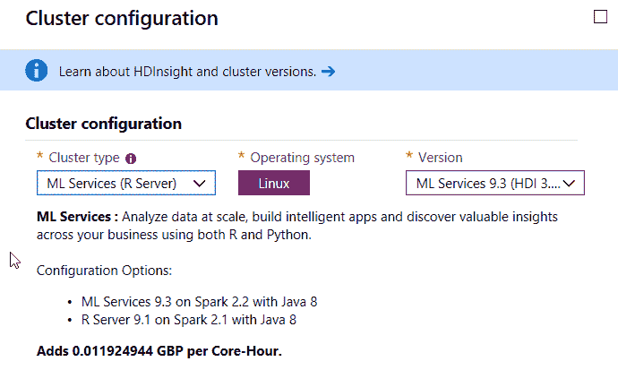

# HDInsight 的设置和配置

在本节中，我们将设置和配置 HDInsight。要设置和配置 HDInsight，请执行以下步骤:

1.  确保您拥有 Azure 帐户
2.  在[portal.azure.com](https://portal.azure.com)登录 Azure 门户网站
3.  当你登录到 Azure 门户时，点击按钮添加一个新的资源
4.  在搜索查询框中，输入`HDInsight`，你会看到许多选项
5.  选择显示 HDInsight 的选项

接下来，我们将设置 HDInsight 的基本配置。

# HDInsight 的基本配置

在基本配置项上，您需要输入您希望用于 Azure HDInsight 的名称以及存储选项。下面是一个配置示例:

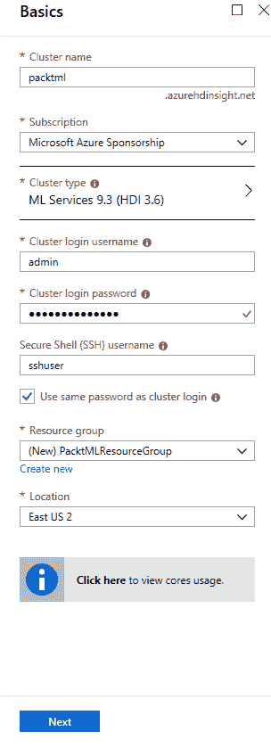

对于集群类型，请确保选择 ML 服务选项。这里有一个例子:


# Azure HDInsight 的存储选项

一旦选择了群集类型，下一步就是考虑存储。在撰写本文时，有两种类型的存储:默认的 Azure 存储和 Azure 数据湖存储第 1 代。对于本演练，将使用默认的 Azure 存储:

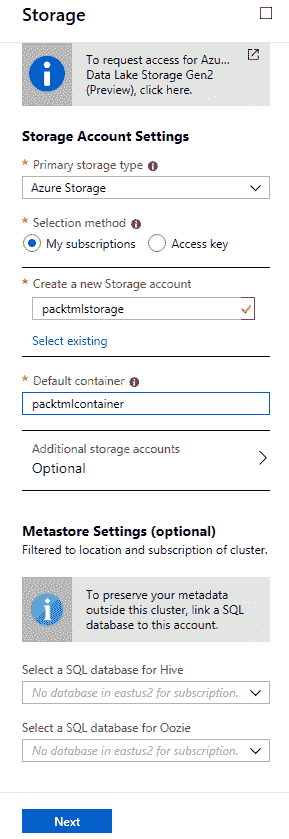

要完成 HDInsight 集群的创建，请单击“Next”。然后检查设置并点击创建。

设置 HDInsight 集群大约需要 20 分钟。

设置完成后，单击门户中的 Azure HDInsight 集群。以下是门户网站的屏幕截图:

这是 Azure HDInsight 的截图...

# 使用 SSH 连接到 HDInsight 集群

Azure Cloud Shell 允许数据科学家使用 SSH 访问 HDInsight 集群。Azure 云外壳可以在 Azure 门户的顶部导航中找到，并用箭头符号表示。以下是截图:


1.  点击 Azure 门户中的 Azure 云壳图标。
2.  选择订阅以创建存储帐户和 Microsoft Azure 文件共享。
3.  选择创建存储。
4.  检查 shell 窗口左侧的环境下拉菜单是否显示 Bash。现在，您可以使用`ssh`命令登录。以下是截图:


登录后，您可以访问 Azure HDInsight 集群上的 Microsoft ML 服务。

# 在 Azure HDInsight 上访问 Microsoft ML 服务

在 bash 提示符下，只需输入 R 就可以访问 Microsoft ML 服务。以下是截图:

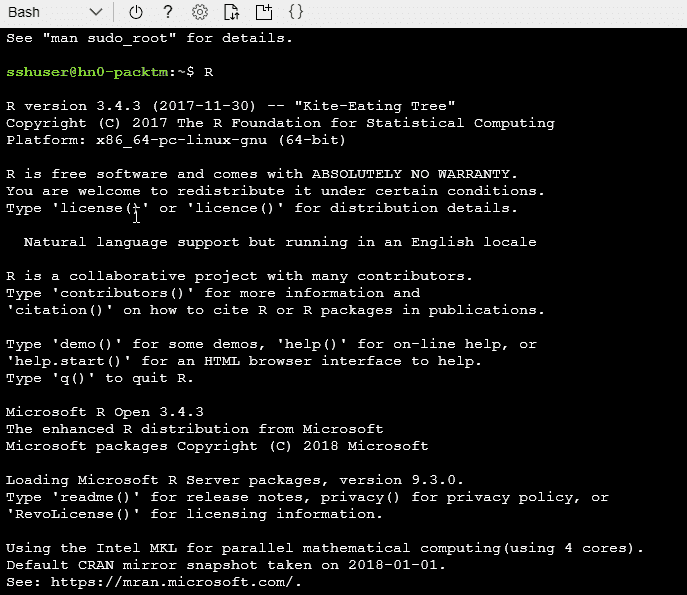

要查看 HDInsight 集群上的文件，请使用以下 RevoScaleR 命令:

```
rxHadoopListFiles
```

然后这些文件被读入 DOS 提示框。这里有一个例子:

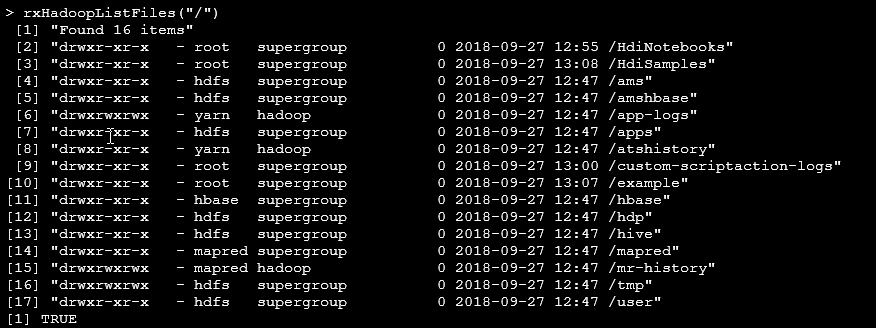

一旦文件被读出，我们就可以开始使用 R 中的一些样本数据集。Iris 数据集将用于在 HDInsight 中解释 R 在 Microsoft ML 服务中的使用。

键入以下命令将会让数据科学家放心...

# HDInsight 和数据分析与 R

首先，我们需要将我们的数据放入 Azure，以便 HDInsight 可以看到它。我们可以将数据直接上传到 Azure Storage，或者我们可以使用**SQL Server Integration Services**(**SSIS**)中的功能。SSIS 能够连接到 Azure Blob 存储和 Azure HDInsight。它使您能够创建在 Azure Blob 存储和本地数据源之间传输数据的集成服务包。然后，Azure HDInsight 进程可以对数据进行处理。

为了使用 SSIS 将数据导入 HDInsight，有必要安装 Azure 功能包。Microsoft SSIS Azure 功能包为 SQL Server Integration Services 提供了连接到许多 Azure 服务的能力，如 Azure Blob Storage、Azure Data Lake Store、Azure SQL Data Warehouse 和 Azure HDInsight。这是一个单独的安装，您需要确保在服务器上安装 Azure 功能包之前安装了 SQL server。否则，在将包部署到 SSIS 目录数据库时，功能包中的组件可能不可用。

要安装 Microsoft SQL Server 2017 Integration Services Feature Pack for Azure，请使用术语`Microsoft SQL Server 2017 Integration Services Feature Pack for Azure`搜索 Microsoft 下载页面。然后，下载文件并运行向导。

# Azure 数据工厂和 HDInsight 是如何交互的？

可以将文件或读写数据移动到 Azure Blob 存储。使用 Azure Data Factory 的好处在于，可以使用云存储来扩展现有的 ETL 管道，或者通过 Azure 虚拟机来执行基于云的 SSIS。可以在 Azure Data Factory 版本 2 中部署 SSIS 包，该版本于 2018 年 7 月正式发布。它提供了强大的功能，有助于为 HDInsight 和 Microsoft ML Server 等云计算服务准备数据。它可以完成一系列任务，包括将数据归档到云存储，以及直接枚举 blob 存储中的文件。

Azure 中有特定的 HDInsight 处理任务...

# 使用 ML 服务在 Azure HDInsight 上运行查询

在 HDInsight 上的 ML 服务中，计算上下文指定了处理给定工作负载的计算引擎的物理位置。缺省值是 local，这意味着它运行在您的本地机器上。为了充分利用云中的运行，您需要从本地切换到远程。

如果在边缘节点上的 ML 服务集群中运行，那么 R 脚本在该节点上的 R 解释器中运行。如果它调用一个 RevoScaleR 函数，那么它将在一个由您如何设置 RevoScaleR 计算上下文决定的计算环境中执行。在这种情况下，当您从边缘节点运行 R 脚本时，计算上下文的可能值如下:

*   本地顺序(*本地*)
*   本地并行( *localpar*
*   MapReduce
*   火花

并行提供最佳性能。除非另有说明，否则 local 和 localpar 选项都以并行方式在所有可用内核上执行其他`rx`函数调用。为此，使用了`rxOptions numCoresToUse`设置，下面是一个例子:

```
rxOptions(numCoresToUse=6)
```

如果要分析的数据量很小，并且是一次性的或不经常进行的分析，那么建议您使用 local 或 localpar 将其直接传输到分析例程中。如果要分析的数据量是小规模或中等规模的，并且需要重复或迭代分析，那么将其复制到本地文件系统，导入到 XDF，并通过 local 或 localpar 进行分析。

# Azure 中的 RevoScaleR

RevoScaleR 是一组强大的微软专有功能，用于大规模实践数据科学。RevoScaleR 在使用 R 进行大数据分析时提供了额外的功能，例如用于导入、转换、操作、汇总、可视化和分析的数据相关功能。使用 R 和 HDInsight 为您提供了在分布式文件系统上并行地针对非常大的数据集执行这些任务的能力。RevoScaleR 使用外部存储算法，允许它一次处理一个数据块，更新结果，并处理所有可用的数据。

RevoScaleR 函数通过 RevoScaleR 包提供，该包在 Azure HDInsight ML 服务中提供。...

# 如何使用 ML 服务将数据读入 HDInsight？

使用 RevoScaleR R 默认命令，我们可以在 HDInsight 上使用 ML 服务读取数据。这些数据类型包括:

*   通过**开放式数据库连接** ( **ODBC** )数据源读取数据
*   从其他文件系统读入文件，例如 SAS、SPSS、ODBC、Teradata、分隔和固定格式文本
*   使用内部数据帧作为数据源
*   处理来自 R 服务器不能本地读取的源的数据

RevoScaleR 还嵌入在 Azure HDInsight、Azure DSVMs 和 SQL Server 中。RevoScaleR 还包括一个可扩展的框架，用于编写您自己的大数据集分析。

优选的数据格式是 XDF 格式。从那里，我们可以用 HDInsight 和 ML 服务，使用 r。

# HDinsight 上 ML 服务中的 R 可以做什么样的分析？

我们可以做总结，交叉制表，创建立方体，并进行建模，如决策树和森林，以及标准的 R 工作。为了执行代码，我们将使用 RStudio 执行 Microsoft R server 命令。RStudio 让 R 更容易上手。它包括一个代码编辑器，以及调试和可视化工具。在下面的示例中，将使用 RStudio 执行代码练习和图像。我们还将使用 R Notebooks 作为执行代码的整洁方式。R Notebook 是一个包含代码块的文档，这些代码块可以独立地、交互地执行。正如我们将在整个练习中看到的，输出就在输入的下面。我们可以想象...

# 将数据从文件读入 Azure HDInsight ML 服务

ML 服务可以读取几乎所有的平面文本文件，比如 SPSS、CSV 和 TXT 文件。这里有一个例子，我们提供路径方向，并从给定的路径读取文件目录到 R:

```
filename <- read.csv ( file = "Filename.csv" )
```

我们还可以将文本文件导入到 R 中，然后查看该文件以进行阅读:

```
filename <- rxImport ( "full file path")
```

从检查 r 中工作目录的位置开始是至关重要的。使用以下命令执行该命令:
`getwd()`

在我们的例子中，工作目录在`D`驱动器上，它是`Demo`文件夹。

为了读入一个 CSV 文件，我们提供路径，然后我们读取指向变量名的文件路径。在本例中，文件将存储在名为`SalesRecordsFile`的变量中:

```
 SalesRecordsFile <- read.csv ( "D:/Demo/SalesRecordsFile.csv" , header = TRUE )
```

接下来，我们将获取`SalesRecordsFile`变量，并将它设置为一个命令以读入 CSV 文件。

一旦我们执行了`SalesRecordsFile`命令，微软 ML 服务器就会读入`SalesRecordsFile.csv`文件。

# 将文本和 CSV 文件转换为首选的 XDF 格式

与 CSV 文件相比，XDF 文件较小且经过压缩。这意味着 XDF 文件的读取和处理速度比 CSV 文件快得多。平面文件包含没有结构化相互关系的记录。XDF 文件格式只能由微软 ML 服务器读取。这是一种非常有效的存储和查询存储在平面文件中的数据的方式。与其他文件相比，这些文件非常小，因此可以快速、轻松地对它们进行分析。RStudio 可以轻松地将我们的源文本或 CSV 文件转换为 XDF 格式。

要转换文件，我们可以使用`rxImport`函数，它将保存在平面文件(如文本文件)中的数据加载到首选文件中...

# 在微软 ML 服务中使用新的 XDF 文件

我们设置`SalesRecordsXDF`变量来保存入站数据的路径，并指定 XDF 文件必须写入的位置。

我们可以使用`print`命令找到更多关于变量`SalesRecordsXDF`中内容的信息。当我们运行代码时，我们可以看到输出，它详细描述了处理的行数和位置。如果我们想看到文件的内容，我们可以使用`rxGetInfo`命令为我们提供一些信息。在本例中，我们将获取前五行数据。

# XDF 与平面文本文件

既然我们已经看了 CSV 文件和 XDF 文件，哪一个更好？XDF 文件可以读取和处理，因此它们存储在本地磁盘上。微软 R 服务器调用`rxImport()`，将读取一个 XDF 文件并解压缩，然后将其作为数据帧插入内存。

XDF 文件格式是微软的文件格式。这意味着检查输出和导出功能非常重要，因为其他程序将无法读取它。XDF 文件旨在支持 RevoScaleR 软件包中的一套分析和数据处理功能。

文件大小的优势是什么？对于大数据，这意味着数据可以和机器上的可用磁盘一样大，而不会产生任何压力...

# 从 SQL Server 读取数据

要连接到 SQL Server，应该遵循一系列事件:

1.  连接到 Microsoft SQL Server
2.  从 Microsoft SQL Server 检索数据

# 连接到 SQL Server 数据库

微软 ML Services 还可以通过**开放式数据库连接(ODBC)** 读取数据，这是一种众所周知的、普遍接受的数据库访问方法。最初，连接字符串被设置，并被赋给一个变量。在此示例中，变量名保存连接字符串。以下是示例代码:

```
sqlServerConnectionString <- "SERVER=<IP Address goes here>;DATABASE=<database name goes here>;UID=<User Name goes here>; PWD=<Your Password Goes Here>”
```

# 从表中提取数据从 Microsoft SQL Server 中检索数据

一旦我们设置了连接字符串信息，下一步就是设置一个变量来保存检索数据的 SQL 命令。下面是一段示例代码:

```
sqlServerDataSource <- RxSqlServerData(sqlQuery = "SELECT * FROM <view name goes here>",connectionString = sqlServerConnectionString)
```

# 在 Microsoft ML 服务上安装 R 包

在 Azure ML Studio、Microsoft ML Server 和 SQL Server 机器学习服务中使用相同的 R 代码是可能的。

在这个例子中，`rjson`包允许用户使用`fromJSON()`函数导入数据。如果微软 ML 服务器上没有安装`rjson`包，那么你需要安装它。说明如下:

1.  导航到安装 R 工具的文件夹。
2.  右键单击`RGui.exe`，选择以管理员身份运行。如果您没有所需的权限，请与数据库管理员联系，并提供您需要的软件包列表。
3.  在命令行中，如果您知道包名，请键入:`install.packages("rjson")`。
4.  注意双引号...

# 分析和汇总 Microsoft ML 服务中的数据

我们可以使用不同类型的统计数据来分析和总结我们的数据。有些统计更基本，我们从使用简单的交叉表开始。然后，我们可以进入更复杂的统计。

# 交叉标签和单变量统计

交叉选项卡提供了一种功能，可通过简单的调查对象数量和比例列表来帮助研究调查数据，包括指定以下内容的能力:

*   频率计数或行/列/联合/总表比例
*   多个行和列变量
*   所有边距、仅大边距或无边距

为了创建交叉表，使用了`rxCrossTabs()`函数。`rxCrossTabs()`也用于根据不同变量的组合计算总和:

```
rxCrossTabs(formula, data, …)
```

`rxCrossTabs`函数使用一个包含要交叉制表的变量的公式。它还有一个对数据的引用，该数据引用您要在其中查找变量的数据集...

# 使用多维数据集

分析的一个重要特征是数据的聚合。在微软 ML 服务器中，当我们想要聚合数据以便在 r 内进一步分析时，使用`rxCube()`函数。

`rxCube()`执行与`rxCrossTabs()`非常相似的功能。`rxCube()`通过计算指标(如列表总和或平均值)来帮助分析。`rxCube()`以长格式而不是表格的形式产生总和或平均值。`rxCube`的示例语法如下:

```
rxCube(formula, data, …)
```

代码显示`rxCube`需要一个包含变量的公式来交叉制表。它与`rxCrossTabs()`的不同之处在于 means 参数的默认值(对于`rxCube()`为真)；`rxCrossTabs()`为假)。与`rxCrossTabs`一样，数据项指的是要在其中查找公式中指定变量的数据集。下面是一段示例代码，使用 Iris 数据集，如前所述:

```
IrisDataCube <- rxCube(Petal.Width ~ Species, data = iris)
```

为了阐明其用途，下面演示了一个示例输出:

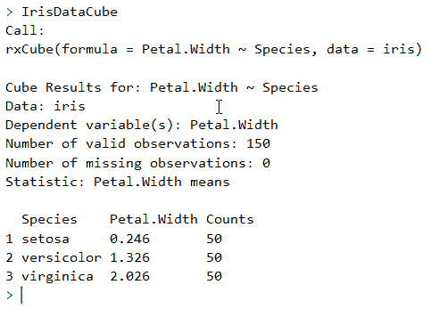

既然我们已经看到了如何做一些初步的分析，我们可以通过做一些分组来进一步调查数据。

# 使用 Microsoft ML 服务器和 R

在商业智能和分析中，许多数据操作是在由变量定义的分组数据上完成的。在微软 ML 服务中，有一个额外的增强 R 公式，叫做`rxSummary`，它汇总了数据，这是调查数据时一个很好的起点。`rxSummary`通过计算包含可变平均值的汇总统计数据来工作。

以下是使用`rxSummary`和 Iris 数据集的输出示例:

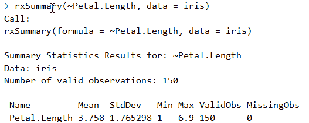

摘要集中在其中一列`Petal.Length`。它产生的信息与我们期望从 r 中的`summary`命令得到的信息相同。

# 在微软 ml 服务器中用 r 计算五分位数

在 Microsoft ML Server 中，`rxQuantile`函数用于快速计算近似分位数。注意，这个计算不包括任何类型的排序。下面这段代码对 Iris 数据集的花瓣长度使用了`rxQuantile`:

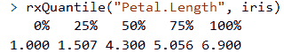

分位数计算提供数据的分位数并将其打印出来。

# 微软 ML 服务中的逻辑回归

逻辑回归是用二元响应变量建模数据的标准工具。在 R 中，使用`glm`函数拟合逻辑回归，指定二项式家族和 logit 链接函数。在微软 ML 服务中，`rxGlm`用于同样的目的，并且以同样的方式使用:

```
irisGLM <- rxGlm(Petal.Width~ Species,family = Gamma,dropFirst = TRUE,data = iris)
```

然后，我们可以输入变量名来查看结果。以下是截图:

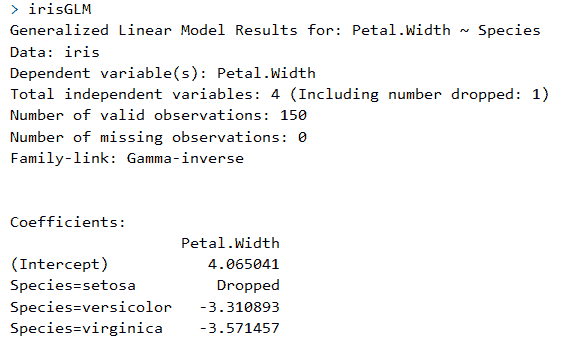

为了更好地解释系数，我们可以将它们转换回因变量的原始标度。为此，我们执行...

# 使用模型预测值

如果输入数据集与用于拟合`rxLinMod`对象的数据集相同，则得到的预测就是模型的拟合值。如果输入数据集是不同的数据集，则生成的预测是原始模型中新数据响应的真实预测。从下面的例子中可以看出，预测值的残差可以通过将`computeResiduals`标志设置为`TRUE`来获得:

```
rxPredict(irisGLM,data = iris,writeModelVars = TRUE,computeResiduals  = TRUE,overwrite = TRUE)
```

接下来，我们使用`rxPredict`来获得拟合值、预测标准误差和置信区间。通过将`writeModelVars`设置为`TRUE`，模型中使用的变量也将包含在输出数据集中。示例输出如下:

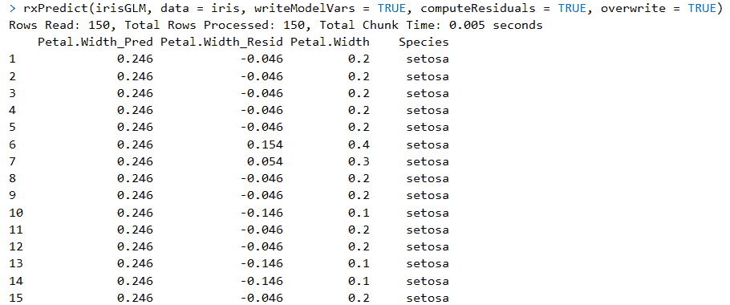

我们可以在这里查看`irisGLM`模型的概要:

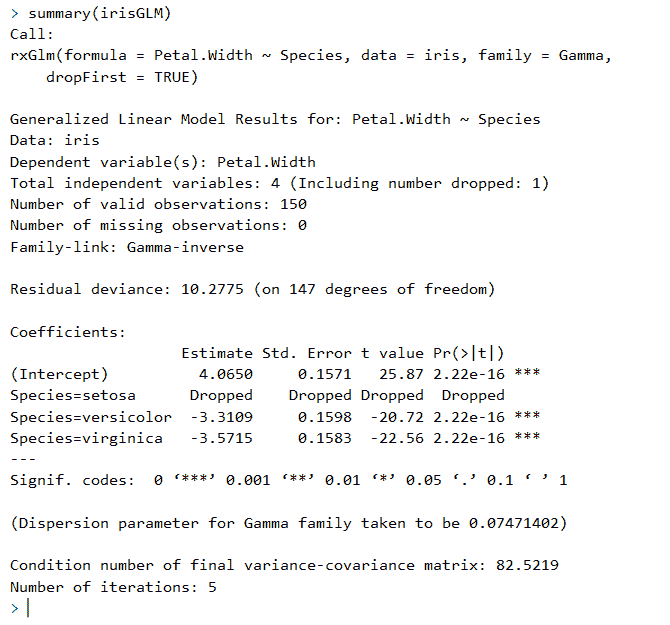

输出显示这些是非常显著的 p 值，这意味着模型看起来非常适合。

但是，我们可以通过查看剩余偏差和剩余自由度之间的比率来检查模型是否合理，该比率为 10.2/147，结果为 0.06。这意味着模型是相当分散的。另一个选择是使用二项式而不是伽玛族重做`irisGLM`模型。

为了更好地理解数据，可以使用 Microsoft ML Services 中的默认 R 和自定义功能来可视化数据。

# 可视化数据

微软 ML 服务提供了使用 R 作为可视化引擎来生成图形的工具。您可以提供各种图表和仪表板，以直观的方式表示单变量和多变量数值和分类数据。

# 创建直方图

`rxHistogram()`用于为数据创建直方图。以下是 Iris 数据集的语法示例:

```
rxHistogram(~Petal.Width, data = iris)
```

您可以在公式中看到，最简单的情况是在`~`右侧只有一个变量的公式。

和以前一样，Iris 数据集是这里使用的数据，这是公式中您想要指定使用的数据集的部分。下面是一个输出示例:

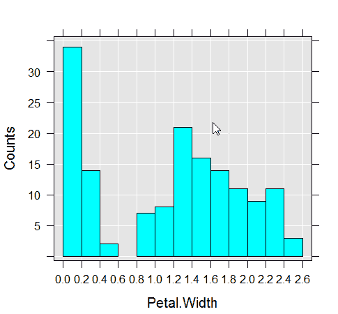

用一行代码创建直方图非常简单。

# 创建线形图

直方图只是可视化数据的一种方式。另一个例子是`rxLinePlot`例子，它使用数据创建散点图的线条。对于该函数，该公式应该在反映 *y* 轴的`~`左侧有一个变量，在反映 *x* 轴的`~`右侧有一个变量。下面是一个线形图示例:

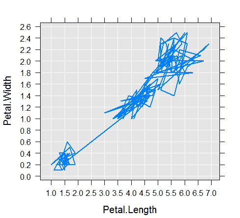

我们还可以使用 Microsoft ML Services 中的其他特性和功能来转换数据子集，然后对数据进行修订。

一旦我们可以看到和理解我们的数据，我们可以通过使用额外的微软 ML 服务功能进一步丰富它。...

# 丰富分析数据

在大数据解决方案中，由于数据非常庞大，有时需要将其转换和处理成更小的数据块。为了处理这个问题，微软推出了一些功能来帮助。本节将介绍旨在帮助解决大数据问题的功能。

# rxDataSteps 步骤

`rxDataStep`函数可以用来处理块中的数据。它是微软 ML 服务中重要的数据转换函数之一。

`rxDataStep`函数可用于创建和转换数据子集。`rxDataStep`函数一次处理一个数据块，从一个数据源读取数据并写入另一个数据源。`rxDataStep`允许您修改现有的列或向数据中添加新列。它还可以通过处理您的列和行，以及在进一步处理数据之前过滤和排除它们来丰富分析。

`rxDataStep`的一个常见用途是创建一个包含行和变量子集的新数据集，如下所示:

```
rxDataStep(inData = iris, outFile = "myIrisXDF.xdf")
```

在前一篇文章中...

# 摘要

在这一章中，我们在 HDInsight 上研究了微软 ML 服务的机器学习过程。我们已经回顾了如何接收数据、如何清理数据、如何建模以及如何可视化数据。

最后一步是确保在停止使用 HDInsight 时将其拆除。HDInsight 是按分钟收费的，让它继续运行需要花钱。建议您保存代码，并在不再需要时将其拆除。

如果您只是想运行代码并学习如何使用 Microsoft ML 服务，前面的代码示例也可以在 DSVM 上的 Visual Studio 中的 Microsoft ML 服务器上运行。