    

# 十、构建深度学习解决方案

深度学习是机器学习的超集，结合了受人脑设计和功能影响的算法，被称为人工智能神经网络。它以监督、半监督和非监督算法的形式表示，其中架构深刻地专注于深度神经网络、深度信念网络和循环神经网络。如今，深度学习在工业以及计算机视觉、语音识别、音频合成、图像识别、自然语言处理、社交媒体内容调节等领域的研发部门中被广泛接受和利用。

在本章中，我们将了解以下主题:

*   Microsoft CNTK 和 MMLSpark 框架概述，以及第三方深度学习工具
*   TensorFlow 和 Keras，以及在 Azure compute 上部署的步骤

# 什么是深度学习？

深度学习是传统机器学习算法的一个子类，它利用一系列非线性处理层进行特征提取、转换，并最终对来自先前输入层的连续输出层进行分析。

深度学习神经网络的第一层由输入层、输出层(最外层)和隐藏层组成，隐藏层是输入层和输出层之间的复杂层:

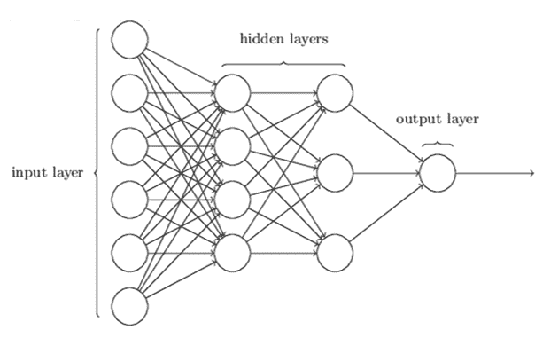

# 传统机器学习和深度学习的区别

传统机器学习和深度学习的比较如下:

| **传统机器学习** | **深度学习** |
| 传统的机器学习需要数据提取/工程的手动功能。 | 深度学习从数据特征中自动学习。 |
| 对于非结构化数据，特征提取比较困难。 | 深度学习更新每层中学习到的网络权重和偏差。 |

# 通用深度学习神经网络(DNNs)

有各种各样的深度学习神经网络可用于解决数据科学平台中的深度学习问题。其中一些如下:

*   **深度卷积神经网络** ( **DCNN** ):用于图像表征的提取
*   **循环神经网络**(**):用于提取序列数据表示**
***   **深度信念神经网络** ( **DBN** ):用于分层数据集表示的提取*   **深度强化学习** ( **DRL** ):预测智能体的行为，以最大化未来的累积回报**

 **在各种深度学习框架和工具上工作的传统方式带来了许多挑战，因为它包含各种依赖关系...**  **# Azure 笔记本服务概述

Azure Notebook service 是一个托管服务，基本上通过使用 R、Python 和 F#的计算能力来提供对 Jupyter 笔记本的轻松访问，用户可以利用其众多的可视化库，并通过可共享的链接以公开和私有的方式共享笔记本。

微软的**认知工具包** ( **CNTK** )拥有对 Azure 笔记本服务的原生支持，因此基于 Python 的 Jupyter 笔记本可以在 CNTK 框架下执行。为了在 TensorFlow、Keras 或 Theano 等其他 DL 框架中执行，用户需要使用 Miniconda 或 Pip/wheel 安装相应的框架组件。

Azure 笔记本服务在[https://notebooks.azure.com/](https://notebooks.azure.com/)可用，并利用免费的、基于云的、基于网络的 Jupyter 笔记本环境的功能，包括使用 Python 2、Python 3、R 和 F#等数据科学语言创建库和大量交互式图形的设施。您可以创建自己的图书馆和交互式笔记本，也可以上传现有的 Jupyter 笔记本:

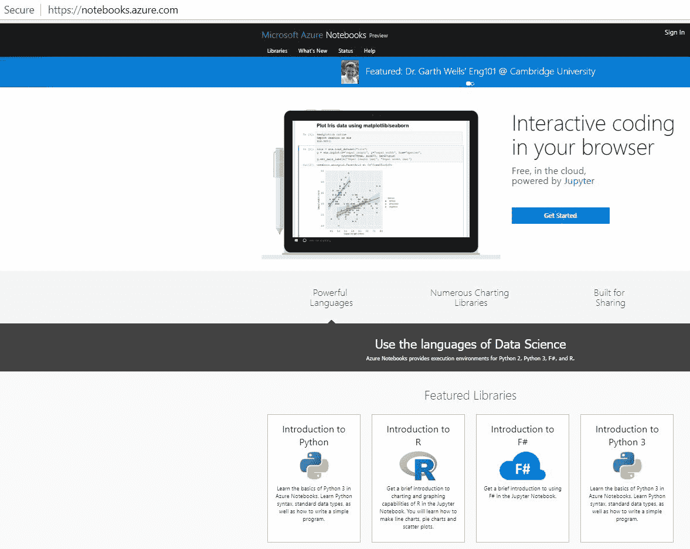

微软 CNTK 笔记本在 Azure 笔记本中有内置支持。Azure 笔记本中的所有笔记本都可以组织成单独的组，称为库，可共享但不可编辑。笔记本也可以从其他存储库中克隆。

通过使用“数据”菜单并使用函数单元格将数据加载到内存中，可以轻松地将数据上传到 Azure 笔记本。也可以下载，如下图所示:

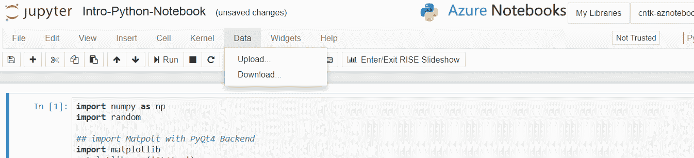

Azure 笔记本服务通过使用 matplotlib、scikit-learn、scipy、numpy、pandas 等库提供了实现交互式 IPython 笔记本的能力。在下面的演示中，实现了关于世界人口增长率分析的交互式 IPython 笔记本:

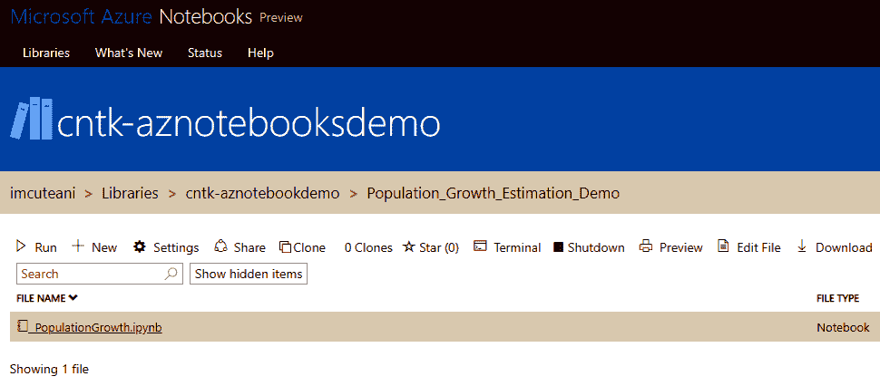

首先，通过将原始数据导入数据帧来执行数据探索:

```
import pandas as pd
 df_population_density = pd.read_csv('/home/nbuser/library/World_Population_Growth.csv')
 df_population_density.head(10)
```

然后，我们实施过滤，以构建一个更简洁的数据透视表:

```
filtered_cells_df = df_population_density[['Location','Time','Births','Deaths','GrowthRate']].dropna(how="any")
 filtered_cells_df
```

上述代码片段的输出如下:

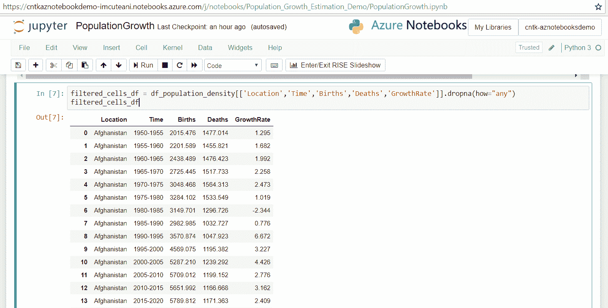

# 天蓝色笔记本形成的数据透视表

可以使用类似`pivot_table()`的函数填充数据透视表:

```
df_population_pivot = filtered_cells_df.pivot_table('GrowthRate','Location','Time') df_population_pivot.head(100)
```

最后，我们可以使用可视化库来构建基于 Python 的交互式可视化，如`matplotlib`、`seaborn`、`pandas`、`folium`等:**、**

```
import numpy as np import matplotlib.pyplot as plot plot.figure(figsize=(15,10),dpi = 80) plot.plot(df_population_pivot.ix[:,0:1], label="Net Growth rate, both sexes males and females") plot.plot(df_population_pivot.ix[:,1:2], label="Net migration rate (per 1000 population distribution)") plot.plot(df_population_pivot.ix[:,2:3],label="Population growth rate (%)") plot.xlabel('Location') ...
```

# Azure 深度学习虚拟机工具包概述

**深度学习虚拟机** ( **DLVM** )是传统 Azure data science VM 的超集变体，它由预配置的环境组成，主要用于在 GPU 实例(例如，Azure GPU NC 系列 VM)上开发和部署深度学习模型，并在两个 OS 上可用——Windows Server 2016 和 Ubuntu Linux edition。

Azure 上的 DSVM 包含几个预先构建的 AI 工具，包括 CNTK、Keras、Caffe2 和 Chainer，用于预处理和提取视觉数据、文本、音频或视频数据。可以使用类似微软 R server、Anaconda Python、Jupyter Notebooks for Python /2.x，R、SQL Server 2017、Azure ML workbench、Julia、F# SDK 等工具进行数据科学建模和使用实现操作。

你可以在 Azure 门户中从市场中将深度学习虚拟机配置为 Azure 资源管理器(ARM ),并通过提供各种细节，如操作系统类型、用户凭证和在深度学习机器上加速的 GPU 的实例大小:

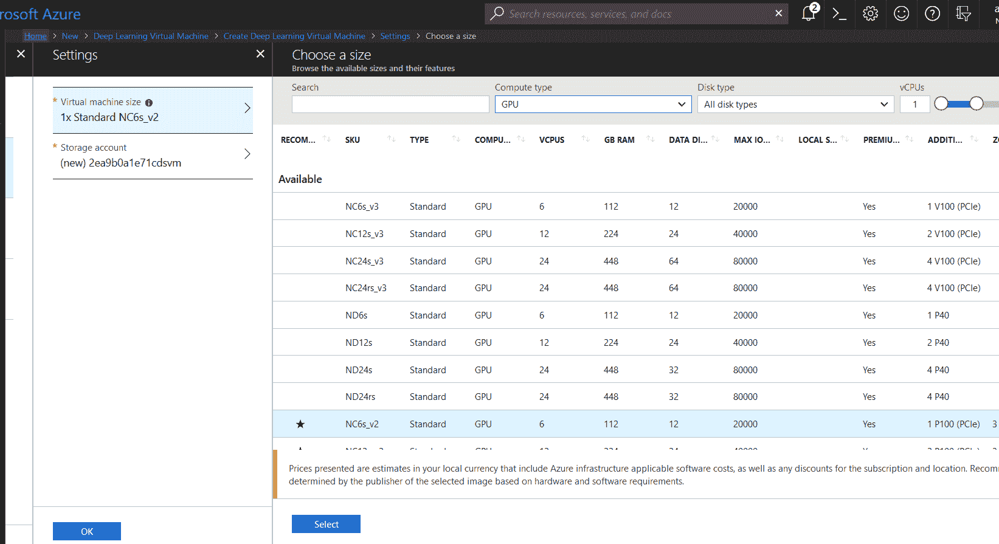

关于来自 marketplace 的 Azure DLVM 的更多细节可以在以下链接找到:<q>[https://Azure market place . Microsoft . com/en-us/market place/apps/Microsoft-ads . dsvm-deep-learning](https://azuremarketplace.microsoft.com/en-us/marketplace/apps/microsoft-ads.dsvm-deep-learning)。</q>

# 开源深度学习框架

在企业环境中使用的各种开源深度学习框架的详细信息可以在下表中看到:

| **软件** | **创新者** | **平台** | **软件许可** | **开源？** | **CUDA (GPU)支持** | **平台接口** |
| CNTK | 微软研究院 | Windows 和 Linux | 用它 | 是 | 是 | Python、C++、C#和 CLI 支持 |
| TensorFlow | 谷歌大脑 | Linux、macOS 和 Windows | 阿帕奇 2.0 | 是 | 是 | Python(NumPy)和 C/C++ |
| 提亚诺 | 蒙特利尔大学 | 跨平台 | 阿帕奇 2.0 | BSD 许可证 | 是 | 计算机编程语言 |
| 咖啡 | 伯克利人工智能 | Linux、macOS 和 Windows | BSD 许可证 | 是 | 是 | Python 和 Matlab |
| 阿帕奇 MXNet | 分布式 ML 社区 | Ubuntu、macOS、Windows、AWS、Android 和 iOS | 阿帕奇 2.0 | 是 | 是 | C++，Python，Matlab，... |

# 微软深度学习工具深度分析

微软推出了大量新的深度学习工具包，通过应用称为 CNTK 的认知工具包，可以用来加速文本分析、语音/声音识别和图像分类等领域的进步，CNTK 可以在内部或 Azure GPU 实例中运行。Azure Cognitive toolkit 支持绑定到 BrainScript 和 Python(撰写本文时的版本为 2.7、3.5 和 3.6)、C++和。NET 托管 C#平台。

以下是 CNTK 2.0 在深度学习方面的特点:

*   CNTK 函数的扩展工具，用于各种语言(如 Python、C#和 C++)中优化器 ML 算法的提取、特征工程和评分。
*   CNTK 中可视化张量流模型的集成。
*   几个预先训练的模型可作为样本。
*   通过在 GPU 实例(例如 Nvidia Tesla CUDA 和 cuDNN)上使用快速 R-CNN 算法支持图像识别。
*   Python 和 BrainScript 的性能分析器的可用性。
*   通过在 kubernetes 集群上运行，在 Azure 上自动缩放深度学习项目的可行性。Kubernetes 上的自动伸缩功能提供了 pod 级伸缩(开箱即用)和节点级伸缩。**水平单元扩展** ( **HPA** )是在 AKS 上运行 CNTK 模型的一个主要特性，因为这可以根据您的需求自动扩展集群中的单元数量，并且还会根据扩展或缩小来指定几个节点指标，如 CPU 利用率百分比和内存可用性百分比。
*   支持用于 AIs 的 VS 工具，该工具为大多数(如果不是全部)深度学习库(例如，Tensorflow、MXNet、Keras、Caffe2、Theano、Torch、Pytorch、Chainer(具有 GPU cuda 支持作为 cuPy)、XG-Boost、Scikit-learn、LIBSVM、**开放神经网络交换** ( **ONNX** )、核心 ML 社区工具(coremltools)、微软 ML 工具、tf2onnx、Netron 等等)提供了方便的本地安装。

有关 Visual Studio 的 AI 工具及其支持的 ML/DL 库的更多详细信息，可以在以下 GitHub 链接中找到:[https://GitHub . com/Microsoft/vs-tools-for-AI/blob/master/docs/](https://github.com/Microsoft/vs-tools-for-ai/blob/master/docs/prepare-localmachine.md)。

# Microsoft CNTK 概述

微软 CNTK 是一个商业级开源工具包，用于深度学习，并将神经网络结构指定为一系列计算有向图。它由微软语音研究人员(董宇等人)于 2012 年推出，2015 年开源，并发表在 Codeplex 上。在 GitHub 上，CNTK 的源代码库从 2016 年开始在许可许可下可用。CNTK 提供了易用、快速的灵活性，并将简单的构建模块组成复杂的网络。这个深度学习工具包是 100%生产就绪的，并提供最先进的准确性，使其高效并可扩展到任何 CPU/GPU 处理平台。它结合了流行的前馈训练模型...

# CNTK 的架构构建模块

CNTK 支持的作为第一个深度学习工具包的**开放神经网络交换** ( **ONNX** )格式具有用于框架互操作性和优化的共享开源模型表示。ONNX 还扩展了对在 CNTK、Caffe2、Apache MXNet 和 PyTorch 等框架之间移动训练模型的支持。

CNTK 的顶层命令块是 CNTK 配置文件，定义了要对相关信息执行的操作。如果定义了一个以上的命令块，则配置参数对要实现什么命令块以及以什么顺序上下文进行分类。

就架构而言，CNTK 配置参数命令模块由以下部分组成:

*   **输入阅读器模块**:通过加载现有模型，从语料库中指定网络的构建概念
*   **网络层**:定义要使用的指定训练算法

*   **学员层**:指定*在哪里*和*如何*加载训练模块和标签；

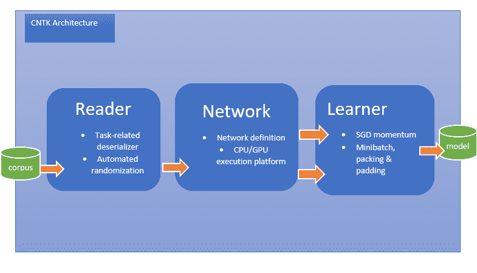

CNTK 最广泛使用的配置模块如下:

*   网络层构造块:
    *   **SimpleNetwork Builder** :执行带有受限定制的网络模型之一
    *   **BrainScript network Builder**:实现一个基于 CNTK 网络描述语言(brain script)的网络，它在网络设计和神经网络配置方面提供了好处
*   学习器:
    *   **SGD 模型**:主要应用随机梯度下降算法进行模型的训练。
*   输入阅读器:
    *   **CNTK Text format Reader** :读取输入文本文件，该文件合并了多个相同格式的输入文本文件。
    *   **LM 序列阅读器**:读取包含预测单词序列的单词序列的输入文本文件。
    *   **LU 序列阅读器**:接受输入的基于文本的文件作为单词序列，以及它的相关标签。这主要用于语言理解 API 构建。
    *   **HTKMLF 阅读器**:读取 HTK/MLF 格式的输入文件，用于语音识别和语音合成应用。

# CNTK 的概念

CNTK 的输入、输出和参数被组织为*张量*，其中 rank 对每个张量进行分类。秩为 0 的张量关联为标量，*秩为 1* 的张量指定为向量，*秩为 2* 的张量定义为矩阵。每个 CNTK 都有一些静态和动态轴。静态轴在网络的整个生命周期中具有相同的长度。动态网络的静态轴被定义为一组有意义的张量，其中 a)它们的轴的长度可以从一个实例到另一个实例进行区分，b)它们的轴的长度在每个小批被表示之前通常是未知的，以及 c)动态轴是有序的。迷你批次称为张量，称为动态轴或批次轴，如果...

# 在 Azure 深度学习虚拟机中开发和部署 CNTK 层，以实现神经网络

微软 CNTK 灵活易用，主要应用简单的积木快速搭建复杂的图层。CNTK 的主要用途之一是它也可以用作 Keras 框架的后端。从一些基准测试结果中，我们可以看到 CNTK 通常比 Google 的 TensorFlow 快，比 recurrent/LSTM 网络快 5-10 倍。

为了开始并构建 Azure 深度学习 GPU 实例的 CNTK 构建块，我们需要从支持 GPU 实例的 Azure 门户提供 DLVM。您可以通过选择 Create a Resource | New，然后在搜索栏中键入`Deep Learning Virtual Machine`,从 Azure Marketplace 配置 DLVM，如下面的屏幕截图所示:

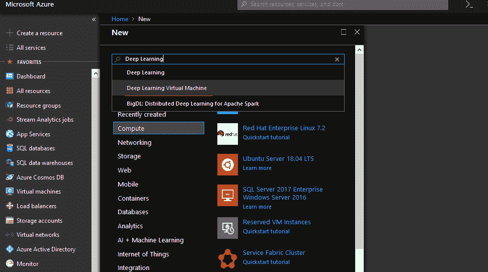

接下来，通过提供适当的虚拟机详细信息，如操作系统类型(Windows/Linux)、用户凭据和资源组，您可以选择所需的 GPU 实例大小，例如 NV6 或 NV12，或者，如果您的 Azure 订阅中有足够的配额，则您可以尝试诸如 NC6sv3(例如，6 个核心 GPU、112 GB RAM 和 12 个数据磁盘)和 NC12sv3(例如，12 个核心 GPU、224 GB RAM、24 个数据磁盘和 40k)的实例大小

Azure 深度学习可以通过远程桌面(RDP)模式(端口`3389`)或 SSH 模式(端口`22`)访问。

# CNTK 输入和变量声明

深度学习框架最突出的特点是它能够处理输入数据集、声明的变量和计算图上的性能管理。在 Azure Deep Learning VM 上的这个 CNTK 演示中，将关联三个层，以便它们可以识别手写数字的 MNIST 数据集。

# CNTK 变量部分

在 MNIST 数据集分类问题中，一个展平的 28 x 28 像素值比例输入及其关联的十个标注用于分类。在 CNTK 中，可以声明变量来捕获数据，如下所示:

```
import cntk as Cognitive
 from cntk.train import Trainer
 from cntk.io import MinibatchSource, CTFDeserializer, StreamDef, StreamDefs
 from cntk.learners import adadelta, learning_rate_schedule, UnitType
 from cntk.ops import RELU, element_times, constant
 from cntk.layers import Dense, Sequential, For, default_options
 from cntk.losses import cross_entropy_with_softmax
 from cntk.metrics import classification_error
 from cntk.train.training_session import *
 from cntk.logging import ProgressPrinter

 input_dimension = 784
 number_output_classes = 10
 number_hidden_layers = 2
 hidden_layers_dimension=200
 feature_val = Cognitive.input_variable(input_dimension)
 label_val = Cognitive.input_variable(number_output_classes)
```

声明这些类型的`input_variable`函数，就像 TensorFlow 中的占位符变量一样。然而，Microsoft CNTK 消除了确定样品/批次尺寸数量的必要性，用户还可以提供每个评估样品的尺寸。在卷积神经网络任务的情况下，用户可以为展平的 28 x 28 = 784 像素输入和 10 个输出标签或类分配`input_dimension = (1,28,28)`。

# CNTK 的数据读取器

Microsoft CNTK 提供了几个助手模块来帮助将训练数据转换成可接受的格式，并将其读入小型批次上下文中的模型。`CTFDeserializer()`是 CNTK 中的一种函数，可以读取特殊 CNTK 格式的输入文本文件(其中数据以管道/分隔符每行一个样本的形式出现)。另一个是`StreamDef()`函数，它的作用类似于一个字典对象。

使用`CTFDeserializer()`功能，以如下方式读取 CNTK 文件格式:

```
from cntk.io import MinibatchSource, CTFDeserializer, StreamDef, StreamDefspath =  "C:\\Users\\CNTK\\Examples\\Image\\DataSets\\MNIST\Train-28x28_cntk_text.txt"reader_train_val = MinibatchSource(CTFDeserializer(path, StreamDefs( ...
```

# CNTK 中的操作

与 TensorFlow 类似，Microsoft CNTK 允许作为计算图中节点的操作。这些节点和操作为流提供支持。CNTK 指定了从图乘法和除法到 softmax 和卷积运算的操作。需要在操作运行时通过`eval()`方法显式评估操作代码。虽然这些操作中的大多数没有被显式地评估，但是在最终层的网络执行过程中会被隐式地评估。

例如，在 MNIST 数据集中，执行简单的 CNTK 操作来缩放输入要素。这种缩放是通过使用 1/256 ~ 0.00390625 实现的:

```
 # Instantiate the feed forward classification model
 scaled_input = element_times(constant(0.00390625), feature_val)
```

这里声明了一个常数 0.00390，以及使用`element_times()`操作将其乘以输入变量特性。输入数据集的比例介于 0 和 1 之间。

# Microsoft CNTK 的层

Microsoft Cognitive Toolkit 为我们提供了配置神经网络层的能力，它提供了许多层功能，如密集、卷积、最大池、递归和 LSTM。例如，在 MNIST 数据集中，标准神经网络分类器由一些紧密连接的层组成，如输入层、第一个隐藏层、第二个隐藏层和最终输出层:

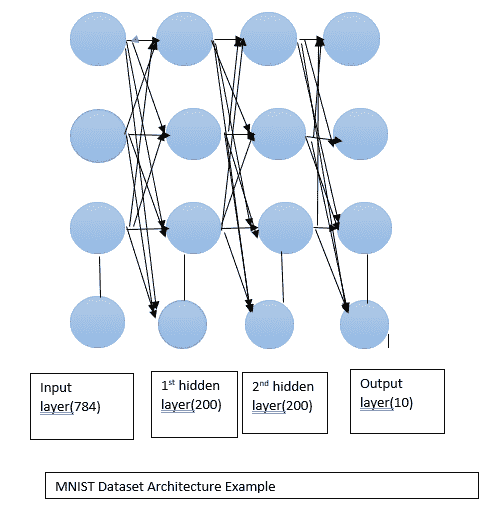

基本上，输入层由 784 个展平的像素输入层组成，这些像素输入层由两个大小为 200 的隐藏层和一个最终输出层继续，在最终输出层上激活了一个 softmax。这些层...

# CNTK 层供应帮助程序

为了使网络定义更加精简，CNTK 提供了一些助手函数/对象类，比如`Sequential()`模块，它类似于 Keras 中的`Sequential( )`范例。它还允许您在不指定输出的情况下将一层又一层地顺序堆叠在顶部，然后将输出作为下一层的输入传递给下一层:

```
from cntk.layers import Dense, Sequential, For, default_options

with default_options(activation=relu, init=Cognitive.glorot_uniform()):
 z = Sequential([For(range(number_hidden_layers),

lambda i: Dense(hidden_layers_dimension)),
 Dense(number_output_classes, activation=None)])(scaled_input)
```

CNTK 中有一个`layers.default_options()`模块，可以帮助简化流程，用于更复杂的网络。这里不再需要激活函数，但是`default_option`用于输出层，因为它允许我们在损失函数中应用 softmax。在每一层中都指定了相同的`glorot_uniform()`函数的初始化:

```

 def simple_mnist():
 input_dimension = 784
 number_output_classes = 10
 number_hidden_layers = 2
 hidden_layers_dimension = 200
```

```
# Instantiate the feedforward classification model
 scaled_input = element_times(constant(0.00390625), feature_val)

with default_options(activation=relu, init=Cognitive.glorot_uniform()):
 z = Sequential([For(range(number_hidden_layers),
 lambda i: Dense(hidden_layers_dimension)),
 Dense(number_output_classes, activation=None)])(scaled_input)
```

# 丢失和错误处理的 CNTK 模块

CNTK 库有全套的损失函数和错误处理模块来训练模型。该范围从标准交叉熵和平方误差到余弦距离(如λ等级)进行分类。出于分类目的，可应用`cross_entropy_with_softmax`选项:

```
ce = cross_entropy_with_softmax(z, label_val)
```

这里，输出层`z`被提供一个带标签的输出变量值，交叉熵损失用`z`上的 softmax 精度计算。

接下来，为了访问测试集上的错误，必须使用训练模型。对于分类任务，必须使用`classification_error()`功能:

```
pe = classification_error(z, label_val)
```

# 在 CNTK 中输入训练模型

CNTK 有各种选项来执行训练，例如简单地调用包含输入和输出训练集的字典:

```
input_map = {
 feature_val: reader_train_val.streams.features,
 label_val: reader_train_val.streams.labels
 }
```

这里使用的`MinibatchSource()`对象调用`reader_train`，在这里您可以通过使用点符号来访问流/数据。

还需要定义一个`ProgressPrinter`，这是一个允许你设计输出度量的对象，比如损失和分类错误。进度编写器也可以被实例化:

```
# Instantiate progress writers.
 progress_writers_val = [ProgressPrinter(
 tag='Training',
 num_epochs=number_sweeps_to_train_with)]
```

`tag`参数指定在每次更新中附加的日志中的值的演示。模型训练期间的总次数由计数器计数，并由`num_epochs`宣布。

# 实例化教练对象

为了设置`Trainer`对象，我们需要一个模块来训练模型，并将其提供给多个信息层，如输出层和前一层，用于训练计算图形结构。然后，我们需要利用损失函数来计算梯度，其中可以使用随机下降和 Ada Grad 等优化器:

```
#Instantiate the trainer object to drive the model training lr = learning_rate_schedule(1, UnitType.sample) trainer = Trainer(z, (ce, pe), [adadelta(z.parameters, lr)], progress_writers_val)  
```

# 定义训练课程对象

CNTK 库有一种奇妙的方式来表达`training_session()`对象及其 minibatch 初始化。它与定义输入数据、测井、`num_sweeps_to_train`、每次扫描的样本等相关联:

```
# Training config
 minibatch_size_val = 64
 number_samples_per_sweep = 60000
 number_sweeps_to_train_with = 10

training_session(
 trainer=trainer,
 mb_source=reader_train_val,
 mb_size=minibatch_size_val,
 model_inputs_to_streams=input_map,
 max_samples=number_samples_per_sweep * number_sweeps_to_train_with,
 progress_frequency=number_samples_per_sweep
 ).train()
```

在这个`training_session()`对象中，所有的优化和参数学习都将在源代码中进行，我们可以在源代码中提取用作`reader_main` `MinibatchSource`对象的小批数据。

执行训练后，输出会显示在进度编写器上，如下面的屏幕截图所示:

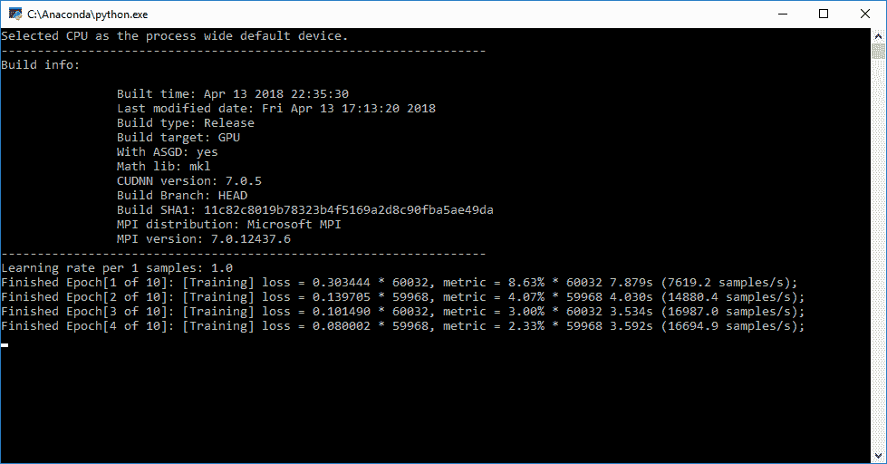

# CNTK 测试模型

为了测试 CNTK 训练模型，我们需要在从 MNIST 数据集检索的路径中加载`Test-28x28_cntk__text.txt`。我们需要设置`MinibatchSource`来读取我们的测试数据，我们还需要为测试数据分配输入映射:

```
# Load test data path = "C:\\Users\\CNTK\\Examples\\Image\\DataSets\\MNIST\\Test-28x28_cntk_text.txt"#Reading of data using MinibatchSourcereader_test_val = MinibatchSource(CTFDeserializer(path, StreamDefs( features=StreamDef(field='features', shape=input_dimension), labels=StreamDef(field='labels', shape=number_output_classes))))#mapping of input dataset using feature & labelinput_map = { feature_val: reader_test_val.streams.features, label_val: reader_test_val.streams.labels }
```

这...

# 使用 Azure 容器(Docker)部署 CNTK 工具

为了在 Docker 容器上运行 CNTK Jupyter 笔记本并从 Docker 中提取 CNTK 映像，请确保使用基于 Linux 的 VM 或 Azure Linux Data Science/DLVM。

CNTK 的最新版本可以通过以下命令使用使用 Azure DSVM 的 Docker 容器来获取:

```
docker pull microsoft/cntk 
```

`docker pull microsoft/cntk:2.6-gpu-python3.6`可用于特定 GPU 版本的 Python。执行 CNTK Jupyter 笔记本的 GPU 版本需要 Nvidia-docker 驱动程序:

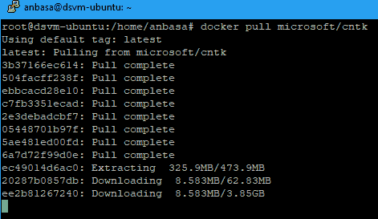

要在 Azure 深度学习虚拟机的 Docker 容器中运行 CNTK Jupyter 笔记本，需要创建并启动 CNTK 容器，在默认端口`8888:8888`中以分离模式暴露 IP 端口:

```
docker run -d -p 8888:8888 --name cntk-jupyter-notebooks -t microsoft/cntk
```

然后，以下命令启动并激活 Jupyter 笔记本的 CNTK。您需要在**网络安全组** ( **NSG** )配置设置中暴露端口`8888`用于入站网络规则:

```
docker exec -it cntk-jupyter-notebooks bash -c "source /cntk/activate-cntk andand jupyter-notebook --no-browser --port=8888 --ip=0.0.0.0 --notebook-dir=/cntk/Tutorials --allow-root"
```

输出屏幕截图如下图所示:

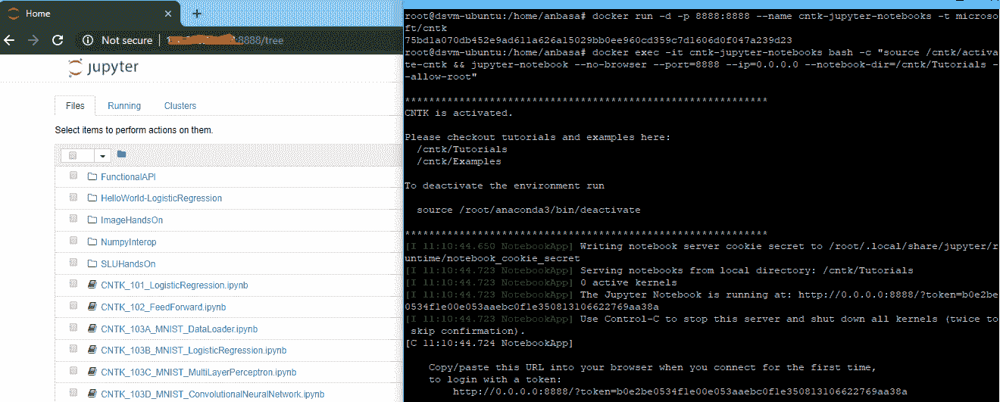

关于在 Linux 环境中在 Docker 容器上以 GPU 模式执行 CNTK 的更多细节可以在以下链接中找到:[https://docs . Microsoft . com/en-us/cognitive-toolkit/CNTK-Docker-Containers](https://docs.microsoft.com/en-us/cognitive-toolkit/CNTK-Docker-Containers)。

# Keras 作为微软 CNTK 的后端

Keras 是用 Python 编写的高级神经网络 API，它抽象复杂的配置，并使用矩阵代数构建生产级训练模型。Keras 能够在 Microsoft CNTK、Google TensorFlow 或 Theano 之上执行，其开发目标是支持在独立的、完全可配置的模块序列或图形中进行快速实验:

*   Keras 支持卷积和循环网络，并在 CPU/GPU 上执行。
*   激活 CNTK 后，可以使用`pip`简单安装 Keras。`keras.json`文件可以作为 CNTK 的后端。
*   在 Windows 上的`%USERPROFILE%/.keras`更新`keras.json`，或者在 Linux 上的`$HOME/.keras`:

```
{    "epsilon": 1e-07, "image_data_format": ...
```

# Apache Spark 的微软机器学习库(MMLSpark)概述

微软**面向 Apache Spark**(**MMLSpark**)的机器学习库协助为大型数据集提供可扩展的机器学习模型，尤其是构建深度学习问题。MMLSpark 与 SparkML 管道合作，包括 Microsoft CNTK 和 OpenCV 库，这些管道使用预训练的深度学习算法为图像输入数据的输入和处理、图像分类和文本分析提供端到端支持。他们还通过应用特征化从分类和回归模型中训练和检索分数。

# MMLSpark 的环境设置

在 Azure 上为深度学习项目设置 MMLSpark 库必须满足以下先决条件:

*   `MMLSpark`库可以和 Azure ML 工作台一起使用
*   `MMLSpark`还可以与 Azure HDInsight Spark 集群集成
*   Databricks 云的使用
*   Azure GPU 虚拟机的使用
*   Spark/pyspark/Scala(SBT)软件包的使用
*   码头集装箱的使用

# 使用 Docker 容器执行 MMLSpark 笔记本

为了使用 Docker 容器执行`MMLSpark` Jupyter 笔记本，您可以在 PowerShell 提示符下运行以下命令:

```
docker run -d --name my-mmlsparkbook -p 8888:8888 -e ACCEPT_EULA=yes microsoft/MMLSpark
```

在 Docker 容器上运行的 MMLSpark Jupyter 笔记本的执行输出如下图所示:

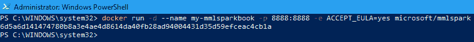

在这里，笔记本被贴上了名称`mmlsparkbook`的标签，默认接受 EULA 协议。接下来，需要为`mmlsparkbook`启动并激活 Docker 容器，这将打开位于以下 URL 的 MMLSpark 笔记本:`http://localhost:8888`:

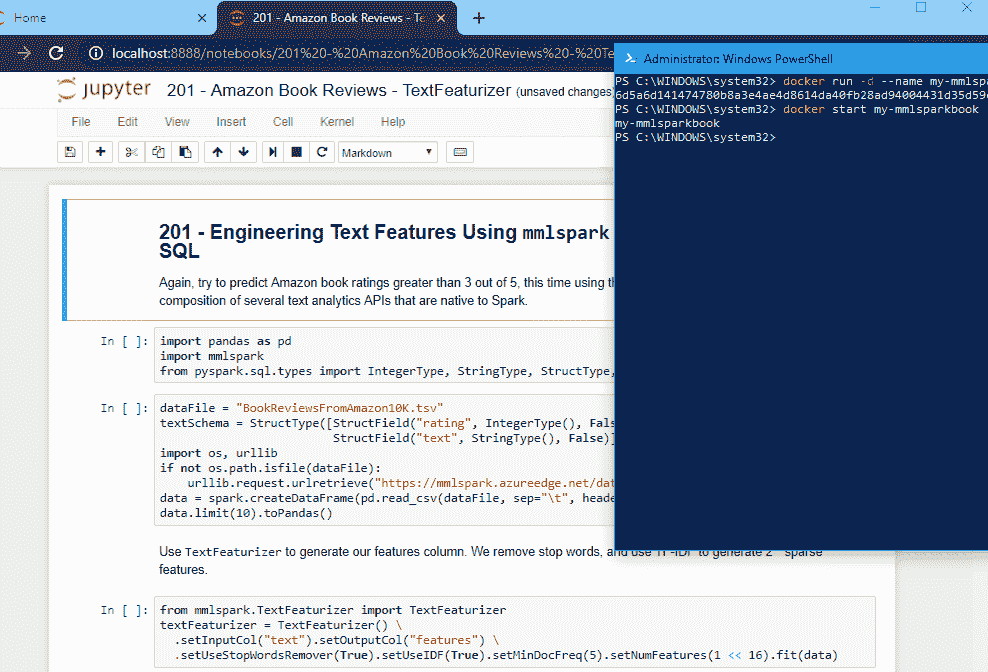

# MMLSpark 的 Azure HDInsight Spark 群集设置

可以使用现有的 Spark 集群并应用`--packages`选项来安装 MMLSpark 库，如下所示:

*   `spark-shell --packages Azure:MMLSpark:0.13`
*   `pyspark --packages Azure:MMLSpark:0.13`
*   `spark-submit --packages Azure:MMLSpark:0.13 MyMMLSparkApp.jar`

类似地，它也可以应用于 Spark 上下文，这可以通过在`.aztk/spark-default.conf`文件中使用 AZTK 中的 MMLSpark 来完成。

关于 MMLSpark 库的更多细节可以在下面的 GitHub 链接中找到:[https://github.com/Azure/MMLSpark](https://github.com/Azure/mmlspark)。

# Azure 上的 TensorFlow 概述

TensorFlow 是一个开源的深度学习库，由 Google 推出，用于解决一系列任务。引入 TensorFlow 是为了满足构建和训练复杂神经网络的要求，以便检测和破译模式、识别和相关性，类似于人脑的学习过程。谷歌推出了 TPU(张量处理单元)云平台，用于运行 TensorFlow Python API 和利用 TensorFlow 图形单元。

为了开始使用 TensorFlow 和 Azure，最简单的两个选项如下:

*   **使用用于数据科学 VM 的深度学习工具包(Deep Learning VM)** :提供 mxnet、CNTK、TensorFlow 和 Keras 的 Windows GPU 版本，能够在 GPU-NC、N 系列或 FPGA 基础设施上运行。
*   **使用 Data Science VM for Azure** :默认情况下安装了对 CNTK、TensorFlow、MXNet、Caffe、Caffe2、DIGITS、H2O、Keras、Theano 和 PyTorch 的支持，并且已经过配置，可以与 NVidia CUDA 和 cuDNN 的支持一起使用。Jupyter 笔记本和带有 AI 的 VS 工具也是预先配置好的。

# 张量流上的简单计算图

TensorFlow 库基于计算图形，如 *a = d * e* 、*d = b + c* 、 *e = c+ 2* ，因此该公式可以写成 *a = (b+c) * (c+2)* ，如下图所示:

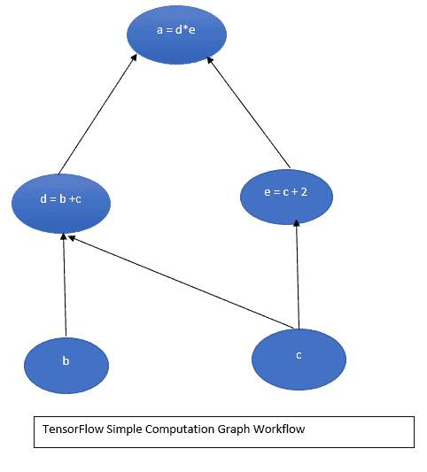

前面的图形计算可以通过执行( *d = b + c* 和 *e = c + 2* )以及在 CPU 和 GPU 上分割计算来并行化。对于复杂的深度学习问题，尤其是在卷积神经网络(CNN)和**循环神经网络** ( **RNNs** )架构中，这是必不可少的。TensorFlow 背后的概念是能够在代码中提供这些计算图形，并允许...

# 张量流运算

TensorFlow 支持一系列操作，因此它可以初始化图形的结构:

```
#Declare few TensorFlow operations
 d = tensorf.add(b, c, name='d')
 e = tensorf.add(c, 2, nname='e')
 a = tensorf.multiply(d, e, nname='a')
```

```
#setup the initialization of variables
 init_operation = ttensorf.global_variable_initializer()
```

为了运行变量之间的操作，我们需要启动一个 TensorFlow 会话，比如`tensorf.Session`。TensorFlow 会话是一个可以运行所有此类操作的对象。在 TensorFlow 会话`run`函数中，操作初始化需要初始化的变量。接下来是手术。这需要运行，可以用`tfsess.run(a)`命令执行。我们可以将输出分配给`a_graphout`,以便打印:

```
#Start the Tensorflow Session
 with tensorf.Session() as tfsess:
 #initialize the variables
 tfsess.run(init_operation)
 #computation of the output from the graph
 a_graphOut = tfsess.run(a)
 print("Variable a is the value of {}".format(a_graphOut))
```

# 张量流占位符的声明

TensorFlow 通过使用占位符变量声明来分配数据的基本结构，如下所示:

```
def run_simple_tensorGraph_multiple(): #first lets create a constant for TensorFlow constant = tensorf.constant(2.0, name="constant")
```

```
#Next create those TensorFlow variables b = tensorf.placeholder(tensorf.float32,[None, 1], NameError='b') c = tensorf.Variable(1.0, name='c')
```

# 使用张量流形成神经网络

TensorFlow 指定了用于解决复杂现实问题的神经网络形式，尤其是在 CNN 或 rnn 上。例如，我们可以使用 MNIST 数据集 TensorFlow 包，其中数据集包含一个 28 x 28 像素的灰度图像，大约有 55k 行、10k 测试行和 5k 验证手写数字行:

```
def nn_example():
 mnist = input_data.read_data_sets("MNIST_data/", one_hot=True)
```

```
# Python optimisation variables
 learning_rate = 0.5
 epochs = 10
 batch_size = 100
```

对于训练数据和参数，可以提供占位符变量:

```
 # declare the training data placeholders
 # input x - for 28 x 28 pixels = 784
 x = tensorf.placeholder(tensorf.float32, [None, 784])
 # now declare the output data placeholder - 10 digits
 y = tensorf.placeholder(tensorf.float32, [None, 10])
```

这里，`x`输入数据层由 28 x 28 = 784 个像素和类似 10 位数的 y 个节点组成。此外，对于神经网络，权重和偏差也需要初始化。在张量流中，可能有 L-1 个权重/偏差张量或图形:

```
# now declare the weights connecting the input to the hidden layer
 W1 = tensorf.Variable(tensorf.random_normal([784, 300], stddev=0.03), name='W1')
 b1 = tensorf.Variable(tensorf.random_normal([300]), name='b1')
 # and the weights connecting the hidden layer to the output layer
 W2 = tensorf.Variable(tensorf.random_normal([300, 10], stddev=0.03), name='W2')
 b2 = tensorf.Variable(tensorf.random_normal([10]), name='b2') 
```

首先，我们需要为`W1`和`b1`声明一些变量，用于输入层和隐藏层之间的连接的权重和偏差，其中神经网络在隐藏层中将有 300 个节点。权重张量`W1`的大小为`[784, 300]`。类似地，TensorFlow 支持 NumPy random normal 函数，该函数指定提供一个由随机样本填充的给定大小的矩阵。以类似的方式，权重变量`W2`和偏差变量`b2`将隐藏层连接到神经网络的输出。

使用`relu`函数计算隐藏层的输出(通过应用校正的线性单位):

```
# calculate the output of the hidden layer
 hidden_out = tensorf.add(tensorf.matmul(x, W1), b1)
 hidden_out = tensorf.nn.relu(hidden_out)
```

通过使用输出层的 softmax 激活，与隐藏层的输出进行权重相乘，并添加一个`b2`偏置值。这可以通过 TensorFlow softmax 函数`tf.nn.softmax`找到:

```
 # now calculate the hidden layer output - in this case, let's use a softmax activated
 # output layer
 y_ = tensorf.nn.softmax(tensorf.add(tensorf.matmul(hidden_out, W2), b2))
```

对于优化器，我们需要包含一个成本或损失函数。交叉熵成本函数用于此目的。下面是我们如何在 TensorFlow 中设置优化器:

```
# add an optimiser
 optimiser = tensorf.train.GradientDescentOptimizer(learning_rate=learning_rate).minimize(cross_entropy)
```

TensorFlow 提供了梯度下降优化器和学习率，学习率用于指定已提供的最小交叉熵成本操作。该函数将执行梯度下降和反向传播，如下所示:

```
# finally setup the initialisation operator
 init_operation = tensorf.global_variables_initializer()
# define an accuracy assessment operation
 correct_prediction = tensorf.equal(tensorf.argmax(y, 1), tensorf.argmax(y_, 1))
 accuracy = tensorf.reduce_mean(tensorf.cast(correct_prediction, tensorf.float32))
```

```
# add a summary to store the accuracy
 tensorf.summary.scalar('accuracy', accuracy)
```

```
merged = tensorf.summary.merge_all()
 writer = tensorf.summary.FileWriter('c:\\users\\anbasa\\source\\repos')
```

正确的预测操作提供了`correct_prediction`，它利用了 TensorFlow。`tensorf.equal`根据布尔值的参数提供真/假读数。`tensorf.argmax`的工作方式与 NumPy `argmax`函数相同，因为它返回特定张量或向量中最大值的索引。

此后，`correct_prediction`操作指定大小为(`mx1`)的张量为真或假，指定神经网络是否正确预测数字值。

# 张量流训练

为了提供 TensorFlow 训练，首先需要设置 TensorFlow 会话并初始化变量。

它还提供了可以为神经网络执行的小批量训练方案的细节。它还通过计算每个训练时段并初始化一个`avg_cost`变量来计算每个时段中要运行的批次数量。TensorFlow 提供了一个 MNIST 数据集，该数据集具有一个效用函数，例如`next_batch`，这使得提取批量训练数据变得更加容易:

```
# start the session with tensorf.Session() as tfsess: # initialise the variables tfsess.run(init_operation) total_batch = int(len(mnist.train.labels) / batch_size) for epoch in range(epochs): avg_cost = 0 for i ...
```

# 使用 Docker 容器服务在 Azure 上执行 TensorFlow

TensorFlow 可以在 Azure Linux 虚拟机上使用 Docker 容器服务来执行。端点需要在 NSG 端口`8888`中公开，需要执行以下命令，该命令初始化 Jupyter 笔记本中运行 TensorFlow 的 Docker 容器:

```
docker run -d -p 8888:8888 -v /notebook:/notebook xblaster/TensorFlow-jupyter
```

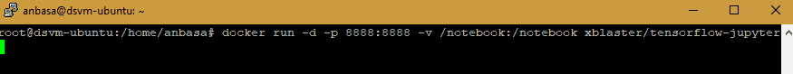

# 在 Azure Kubernetes 集群(AKS)上运行 TensorFlow 容器

通过使用开源工具包 dl workspace(【https://microsoft.github.io/DLWorkspace/】)在 **Azure 容器服务** ( **AKS** )上提供了一个示例 Kubernetes 集群。该存储库在 CPU/GPU 上提供标准的 Azure 虚拟机。可以创建示例 k8 集群和支持 Alluxio-FUSE 的 k8 pods。

示例 pod 配置可从以下 GitHub 链接获得:[https://GitHub . com/Ji Chang 1/TensorFlowonAzure/tree/master/Alluxio](https://github.com/jichang1/TensorFlowonAzure/tree/master/Alluxio)。

可以使用以下命令在参数服务器单元和工作单元上执行 TensorFlow 作业:

```
python tf_cnn_benchmarks.py --local_parameter_device=gpu --num_gpus=2 --batch_size=128 --model=googlenet --variable_update=parameter_server ...
```

# 其他深度学习库

微软在 MNIST 和 CIFAR10 等数据集上提供了横跨 Theano、Caffe、MXNet、Chainer、PyTorch 和 Keras 的深度学习工具样本。以下是运行这些示例的先决条件:

*   你需要 Visual Studio 2017 的人工智能和 MNIST 数据集的 VS 工具。人工智能的 VS 工具可以从工具下的扩展和更新中下载:

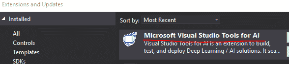

*   NVIDIA GPU 驱动程序/CUDA 9.0/cuDNN 7.0(如果适用)和 Python 3.5/3.6。Python 2.x 仍然不受支持(截至本文撰写之时)。
*   需要安装的深度学习库有 NumPy、SciPy、Matplotlib、ONNX、CNTK、TensorFlow、Caffe2、MXNet、Keras、theano、PyTorch:

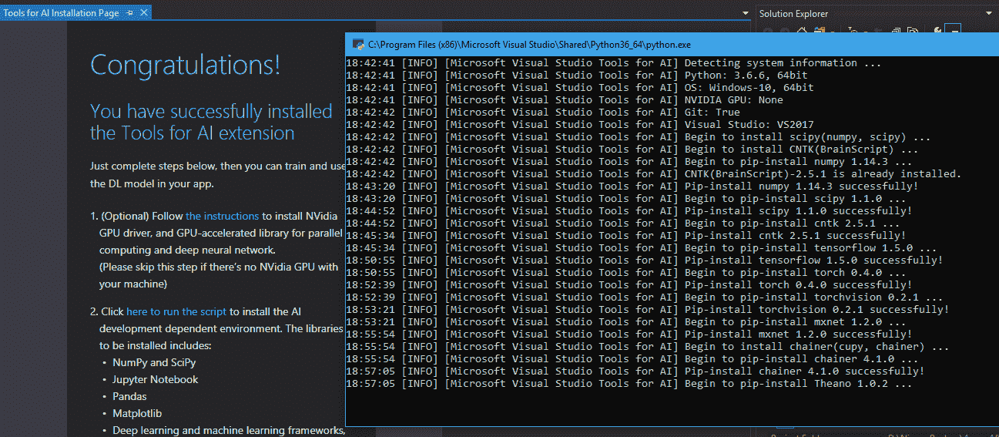

*   人工智能样本库的 GitHub 链接可在[https://github.com/Microsoft/samples-for-ai](https://github.com/Microsoft/samples-for-ai)获得。
*   **Apache MXNet** : Apache MXNet 是一个可扩展的深度学习库，用于训练和部署可跨 GPU 或 CPU 扩展的深度神经网络。MXNet 提供了对 Azure 的支持。关于 MXNet 的更多细节可以在 https://mxnet.incubator.apache.org/的[获得。](https://mxnet.incubator.apache.org/)
*   **Caffe** :这个深度学习框架为构建和训练复杂的神经网络提供了表达式、速度、可扩展性、模块化、开放性和巨大的社区支持。Caffe 2.0 预装在 Azure 深度学习工具包和 DSVM 中。
*   **Theano** :这是一个基于 Python 的深度学习库，通过使用 NumPy-esque 语法来评估复杂的数学、统计表达式，并通过使用 CPU/GPU 架构来编译。
*   Pytorch : Pytorch 又是一个基于 Python 的科学计算框架，用于 GPU 上的 Numpy 执行和深度学习交互研究。Pytorch 允许使用干净的动态图形进行交互式调试，混合了高级和低级 API 支持。这适用于**人工神经网络**(**ann**)、回归、**卷积神经网络**(**CNN**)。
*   **Chainer** :一个基于 Python 的开源深度学习库，用于 NumPy 和 CuPy `libraries.supports` CUDA 实现以及直观、灵活的 DL 框架，允许使用前馈网、convnets、递归网和递归网。更多细节可以在 https://chainer.org/的[找到。](https://chainer.org/)

# 摘要

在这一章中，我们学习了深度学习方法论和微软 Azure AI 平台上支持的工具。我们展示了各种 AI 工具，如 CNTK、MMLSpark 和 TensorFlow，以及它在 Azure 深度学习工具包/数据科学虚拟机上的执行过程，以及其他开源深度学习库和实用程序。

在下一章中，我们将一步一步地看着其他 Azure 服务与微软 AI 平台的集成。**