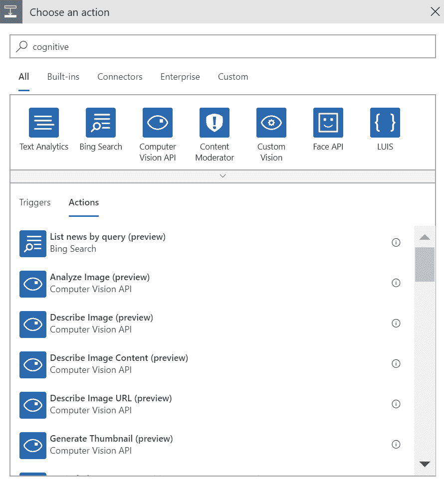
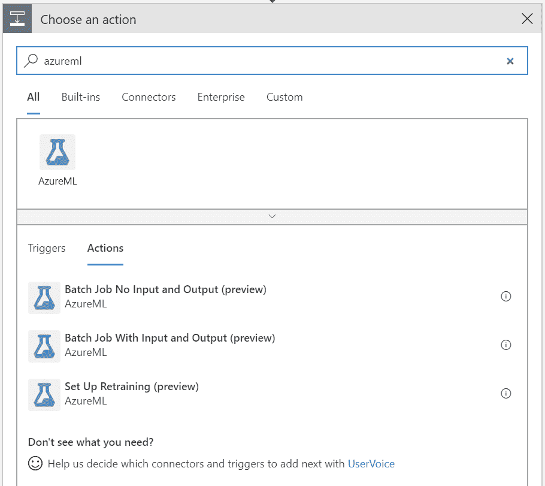
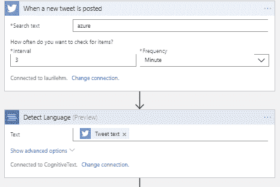
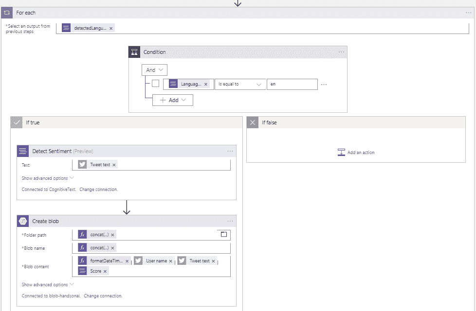
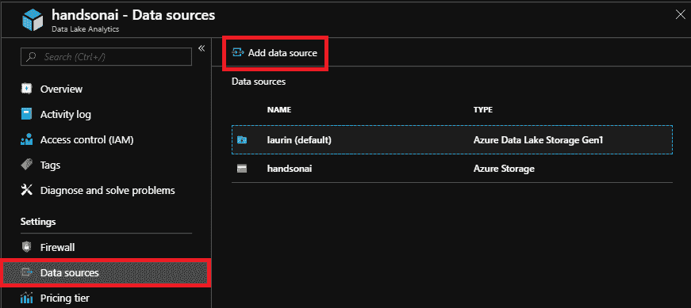
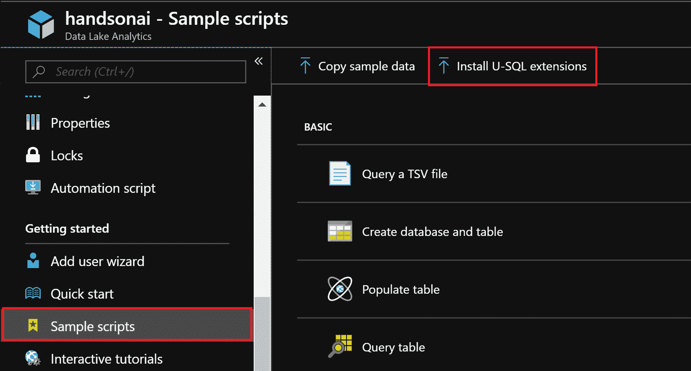
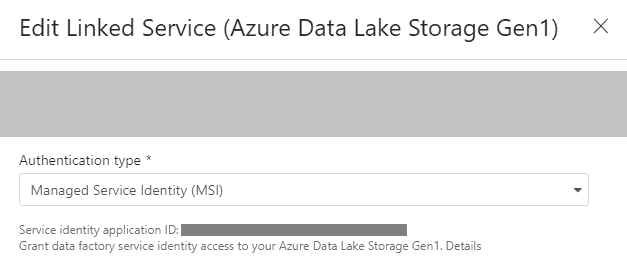
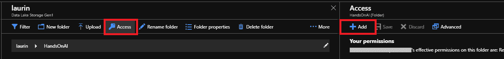
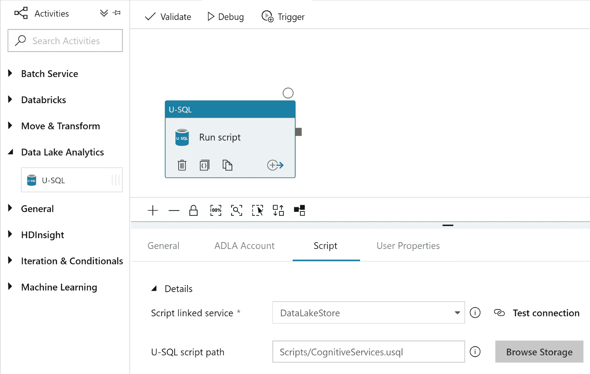

    

# 与其他 Azure 服务的集成

除了直接使用 Azure AI 服务，Azure 还提供了从其他非 AI 服务使用这些服务的选项。很多 Azure AI 服务都提供了 REST API 接口，可以从其他服务消费。因此，人工智能服务可以作为其他应用程序的子组件来提供见解和预测。Azure 中的许多非人工智能服务都内置了与人工智能服务的集成，因此只需点击几下，就可以将人工智能组件添加到应用程序中。

一些人工智能服务不包括任何自动化功能。重复性任务，比如重新训练 ML 模型或者运行批处理工作负载，需要与提供这些特性的其他服务集成。在接下来的部分中，我们将展示自动启动 AI 作业的各种选项。除了传统的按时间安排的工作负载，Azure 服务还提供称为触发器的对象，以便在特定事件发生后启动任务。触发器允许服务以特定的方式对事件做出反应，例如，在创建或修改 blob 文件后处理其内容。

在本章中，我们将学习如何将 Azure 人工智能服务与四个非人工智能服务集成:

*   逻辑应用
*   Azure 函数
*   数据湖分析
*   数据工厂

有了这些服务，就有可能构建复杂的应用程序管道，而 ML 模型只是解决方案的一部分。在 Azure 中，不同服务之间的集成变得尽可能简单，而不损害安全性。因此，获得结果是快速有效的，开发 Azure 应用程序会很有趣！

# 逻辑应用

Azure Logic Apps 是一个图形工具，用于自动化各种类型的任务，例如从 Web API 获取数据并将其保存在云存储中。无需编写一行代码就可以开发逻辑应用程序，因此不需要任何编程技能。然而，Logic Apps 为编程语言提供了一些基本功能，例如条件执行和迭代循环。

Logic Apps 适用于不需要复杂逻辑或闪电般性能的轻量级任务。此类任务可能包括当 SharePoint 列表被修改时发送电子邮件，或者如果文件被修改，则在 Dropbox 和 OneDrive 之间复制文件。

对于人工智能开发，Logic Apps 提供了许多基本功能。有内置的...

# 触发器和操作

Logic Apps 基于两个主要概念:触发器和动作。触发器是不断等待特定类型事件的监听器。这些事件可以在`Blob`文件夹中创建新文件时创建，也可以在每天的同一时间发生，以自动执行日常任务。动作是每次触发器触发时执行的例程。动作通常接受一些输入数据，对其进行处理，最后将结果保存或发送到某个地方。

Logic Apps 支持所有 Azure 数据存储服务:数据湖存储、Blob 存储、Cosmos DB 等等。例如， **Blob 存储**触发器在每次向目录添加新文件或修改目录中的文件时执行逻辑应用。然后，我们可以将该文件作为逻辑应用程序的输入，处理该文件的内容，并将结果保存回 Blob。

Logic Apps 设计器包含许多认知服务操作:计算机视觉 API、自定义视觉、文本分析等。要查看完整列表，请在创建动作时搜索认知动作，如下所示:



还有几个 Azure 机器学习工作室的动作。这些可用于对示例评分或重新训练 ML 模型，如下所示:



在撰写本文时，连接器可能已经更新过，所以请查看 Microsoft 官方文档中的最新信息。

# 推特情感分析

社交媒体已经成为许多组织的日常工具。除了在这些平台上宣传自己之外，监测关于公司品牌的讨论还能提供关于客户如何看待其产品和公司形象的重要信息。

在这一节中，我们将展示如何创建一个应用程序来读取包含关键字 *Azure* 的推文，并将这些推文保存在云存储中。这是一个真实的数据获取场景:一旦推文被永久存储在云中，我们就开始收集关于公司品牌的历史数据。下一步，我们可以开始基于这些数据创建分析和机器学习模型。这些模型可以包括主题分析或寻找...

# 添加语言检测

在前面的例子中，我们创建了一个工作流，它读取带有特定关键字的 tweets，对它们执行情感分析，并将结果保存在 Blob 存储中。如果您完成了示例并更仔细地查看了结果，您可能会注意到 tweets 可以包含许多不同的语言，因为我们的关键字(Azure)并不特定于任何语言。在这个例子中，我们展示了如何将语言检测添加到管道中，并过滤掉所有不是特定语言的 tweets。

1.  为了开始这个例子，在 Azure 门户中创建一个新的逻辑应用程序，打开逻辑应用程序设计器，并选择与我们在上一个例子中所做的相同的触发器作为起点(当一个新的 tweet 出现时)。

2.  从文本分析 API 添加检测语言模块。对于文本字段，选择要由文本分析 API 分析的 Tweet 文本参数。这个模块的输出将包含从 tweet 中检测到的语言列表。请注意，检测到的语言的默认数量是 1。如果文本预计包含多种语言，可以在模块的高级选项中进行更改:



3.  一旦检测到 tweet 语言，我们需要添加一个模块，只选择特定语言的 tweet。为此，在管道中创建一个新步骤，搜索`Control`动作并选择`Condition`动作。

4.  当`Condition`模块被添加到管道中时，我们必须使用模块中的三个字段来指定过滤条件。第一个字段指示我们想要比较哪个值，第二个字段指定条件类型，最后一个字段包含要比较的值。对于第一个字段，选择`detectedLanguages`项。请注意，检测语言模块将语言作为列表返回，即使我们只检测一种语言。`detectedLanguages`项是指本清单中的每一项。因此，逻辑应用程序设计人员将在管道中添加一个新的`For each`控制模块，之前创建的`Condition`模块将放在`For each`模块中。如果检测到不止一种语言，`For each`模块遍历`detectedLanguages`列表中的所有值。
5.  现在我们的`Condition`模块被放在了`For each`模块中，我们可以将`Condition`模块的第一个字段改为`Language code`。第二个字段应设置为`is equal to`，最后一个字段应包含两个字母的语言代码。为了只保留英语推文，我们将参数设置为`en`。请注意，语言检测模块可能无法检测所有语言，因此请查看最新 Microsoft 文档中的可用语言列表。
6.  在条件模块之后，管道现在分支成两个方向，这取决于条件是否为`true`。在`true`分支中，我们可以为英语推文添加任何处理步骤。在`false`分支中，我们可以指定如何处理剩余的推文。在本例中，我们使用上例中开发的情感检测管道来处理英语推文。我们对非英语推文不感兴趣，所以我们可以忽略它们，让错误的分支为空。完成所有这些步骤后，管道如下所示:



一旦你保存应用程序，触发器将开始运行，推文将被保存到 Blob。由于我们使用了与上一个示例相同的情感检测模块，所以文件的格式应该是相同的，只是只有英文推文被保存到 Blob 中。

# Azure 函数

虽然 Logic Apps 提供了一种快速自动化任务的方法，但它的操作集合仅限于无法定制的预选选项。此外，Logic 应用程序的可编程性相当有限，开发更复杂的程序并不一定比编写代码容易。如果需要更大的灵活性，用 Azure 函数开发应用程序可能会更有效率。可以使用 web 开发人员熟悉的多种编程语言来开发函数。

Azure Functions 是云中的无服务器编码平台，其中底层操作系统已经虚拟化。这意味着许多维护任务(如更新操作系统或语言版本)由管理...

# 扳机

Azure Functions 触发器的工作原理与上一节介绍的 Logic Apps 触发器相同:它们监听某个事件，并在每次事件发生时启动函数。例如，每次调用该函数的 web URL 时，HTTP 触发器都会执行该函数。调度触发器可以定期执行该功能，例如，一天一次。Azure 函数最大的优势之一是触发器集合。trigger 集合允许您响应许多不同类型的事件，而基于代码的方法使得利用编程语言的全部灵活性来响应这些事件成为可能。

对于与数据相关的任务，最有用的触发器是存储触发器。类似于逻辑应用如何在 blob 事件上触发，Azure 函数可以在 Blob Storage 或 Cosmos DB 等存储服务中添加或更新文件时触发。考虑一个方案，其中原始数据存储在云中，例如，由 web 应用程序生成的 JSON 文件，我们希望将这些文件转换成列格式，以便将它们添加到关系数据库中。使用带有 Blob 存储触发器的 Azure 函数，这项任务可以完全自动化，无需任何外部服务。因此，Azure Functions 提供了执行这种格式转换的另一种方式。

Azure 功能最有趣的应用之一是处理来自**物联网** ( **物联网**)设备的数据。通过事件中心和物联网中心触发器，Azure 函数可以用作物联网设备发送的数据的下游处理引擎。Azure 中的事件中心和物联网中心资源是数据摄取服务，能够在短时间间隔内处理大量请求。它们是为连续数据流设计的，其中每个消息的大小很小，但消息的数量可以很大。因此，它们是从一系列物联网传感器接收数据的理想服务，这些传感器以短时间间隔发送测量结果。事件中心和物联网中心触发器被设置为每次从物联网设备接收到新事件时触发，因此我们可以使用 Azure 函数为每个事件定义一个处理例程。例如，该例程可以包括对机器学习服务的评分调用，并将结果保存在数据库中。

对于大多数触发器类型，触发器还传递一些关于触发触发器的事件的信息。例如，Blob 存储触发器传递创建或更改的文件的内容，或者 HTTP 触发器传递 POST 请求的内容。在 Azure 函数中，处理不同类型的输入数据非常简单:根据数据源，输入数据的句柄作为参数传递给 main 函数。在下一节中，我们将展示一个如何在 blob 触发器被触发后读取 blob 文件内容的示例。

# Blob 触发函数

在这个例子中，我们将演示如何创建一个简单的函数来读取 blob 文件的内容。我们不会对文件做任何处理；相反，我们只是将它的内容打印在一个日志文件中。

当您在门户中创建 Azure Functions 服务时，除了 Functions 应用程序本身之外，它还会创建许多资源。需要一个存储帐户来存储功能应用程序生成的日志。应用服务计划是一种容器资源，它决定了应用的定价和资源扩展。或者，您也可以创建 app insights 资源来监控您的应用使用情况。这对于错误分析和跟踪应用程序被触发的频率特别有用。

开始发展，...

# Azure 数据湖分析

**Azure Data Lake**(**ADL**)是微软的大数据存储和分析服务。它能够存储 Pb 级的数据，并对存储的数据进行有效的查询。Azure 中的存储和分析服务是分开的，ADL 服务实际上由两种不同的产品组成: **Azure 数据湖存储** ( **ADLS** )和 **Azure 数据湖分析** ( **ADLA** )。在这一节中，我们将集中讨论 ADLA，但在适当的时候也会涉及 ADLS。

数据湖存储是一种基于文件的存储，文件被组织到目录中。这种类型的存储称为无模式存储，因为在数据湖中可以存储什么类型的数据没有限制。目录可以包含文本文件和图像，并且只有当从数据湖中读取数据时才指定数据类型。这在大数据场景中特别有用，在这种场景中，写入数据湖的数据量很大，并且动态运行数据验证步骤会非常消耗资源。数据验证步骤可以在以后读取数据时合并到查询中，也可以定期成批运行。

ADLA 是一个查询引擎，使您能够针对 ADLS 进行高效的查询。一个 ADLA 账户背后总是需要一个 ADLS 账户。此主要帐户是查询的默认来源。ADLA 查询是用 U-SQL 编写的，U-SQL 是一种类似 SQL 的语言，具有一些借鉴自 C#的编程特性。下面是一些从 ADLS 和存储 Blobs 中查询数据的 U-SQL 脚本示例。

除了主要的 ADLS 源之外，ADLA 实例还可以有辅助源。您可以从门户中的数据源选项卡添加其他 ADLS 帐户或 Azure 存储 Blobs，如下所示:



一旦帐户注册为数据源，就可以在类似于主要 ADLS 帐户的查询中使用它。通过使用多个数据源，如果数据驻留在多个存储帐户中，可以避免将数据移动到单个数据湖中。

顺便提一下，创建 ADL 存储帐户时，总是可以不关联 ADLA 帐户。但是在这种情况下，ADLS 只能充当文件存储，而不能对文件内容进行查询。此外，没有什么可以阻止你创建多个 ADLA 帐户，所有使用同一个 ADLS 帐户作为他们的主要来源。这种灵活性是可能的，因为 ADLS 和 ADLA 是 Azure 门户中独立的产品。

ADL 最大的优势之一是它的用户权限控制。可以为每个文件和目录分别设置权限。如果数据湖中的某些数据是机密的，不应该对所有用户都可见，那么可以将这些数据放在一个单独的目录中，并且该目录只能对选定的一组用户可见。数据湖还与 Azure AD 集成，可以将权限分配给 Azure AD 组，而不是特定用户。这里将不进一步讨论基于角色的访问控制，因为重点是分析。要将用户添加到 ADLA 帐户，应使用 Azure 门户中 ADLA 实例中的添加用户向导授予他们数据湖分析开发人员角色。

本节中的材料涉及第一代数据湖存储(数据湖存储)。在撰写本文时，ADLS 第二代正在私下预览中。ADLA 使用 Gen2 的方式可能会有变化，所以请查看微软文档中的最新信息。

# 使用 U-SQL 开发

如前所述，ADLA 查询是用 U-SQL 编写的，这是微软专门为大数据开发的一种查询语言。与许多其他 Azure 服务类似，查询可以在 Azure 门户中编写和执行，这对于小而快速的任务很有用。对于高级开发，VS 代码和 Visual Studio IDEs 的扩展提供了更多的功能。

虽然编写 U-SQL 查询在许多方面类似于编写 SQL 查询，但也有一些不同之处。例如，ADLA 不会像在 SQL Server Management Studio 中那样向查询编辑器生成交互式输出。结果总是指向某个输出，通常是 ADLS 的一个文件。要检查查询的结果，...

# SQL 数据库

尽管 ADLS 是一个基于文件的存储系统，但它也包括关系数据库中常见的功能，比如表和视图。ADLA 数据库是这些对象的集合。ADLA 数据库对于管理数据湖存储中的数据非常有用，因为它们提供了一些有用的特性，比如表索引。另一方面，ADLA 数据库表有严格的模式，所以数据在输入表之前必须经过验证。然后，我们失去了数据湖的最大优势之一，即本节开始时讨论的无模式存储原则。

创建 ADLA 资源时，也会创建一个主数据库。该数据库用作 U-SQL 查询的默认数据库。使用`CREATE DATABASE`命令可以创建新的数据库，使用`USE DATABASE`命令可以改变数据库。可以在 ADLA 数据浏览器的目录中查看数据库的内容。

在 U-SQL 数据库中有两种类型的表:托管表和外部表。托管表在许多方面类似于 SQL 表:表由元数据(例如，表模式)和数据本身组成。实际上，数据作为结构化文件存储在数据湖存储目录中。托管表强制执行写模式，这意味着除非数据符合表模式，否则不可能向表中输入数据。

外部表在某些方面类似于 SQL 视图:只有元数据存储在数据库中，但是数据本身可以驻留在数据湖之外。外部表可以引用各种 Azure 服务:Azure SQL 数据库、Azure SQL 数据仓库或虚拟机上的 SQL 服务器。与托管表相比，外部表强制执行读取模式:在定义模式后，底层数据的格式可能会改变，因为在编写模式时不会强制执行该模式。如果数据的模式发生变化，可以修改外部表定义以匹配新数据。

使用托管表而不是将数据作为文件存储在目录中有一些优点。例如，如果您的数据存储在一个巨大的 CSV 文件中，可能很难向该文件追加新值。使用`INSERT`语句对托管表进行此操作是可能的。(请注意，托管表只是追加，不可能更新值。)托管表还定义了一个聚集索引，可以用来进行更有效的查询。

# blobs 的简单格式转换

在这一节中，我们将演示 U-SQL 脚本在 Azure 门户中的执行以及与辅助数据源(Blob 存储)的集成。我们将从 blob 存储中读取一个**CSV**(**逗号分隔值**的简称)文件，并将该文件的全部内容以**TSV**(**制表符分隔值**的简称)格式写入另一个 Blob 文件。换句话说，我们将执行从 CSV 到 TSV 的文件格式转换。这种格式转换在数据管理中很常见，因为不同的应用程序通常需要不同格式的数据。

运行此示例的要求是一个 Blob 存储帐户(包含一些数据)，以及 ADLS 和 ADLA 帐户。

要读取输入数据，必须使用 U-SQL 模块`Extractors`。...

# 与认知服务的集成

在前面的章节中，我们看到了如何将逻辑应用程序与认知服务相集成。我们使用文本分析 API 对每条推文的情绪进行评分，并将结果存储在 Blob 存储中。在这个例子中，我们将展示如何用 ADLA 实现同样的步骤。除了获得情绪得分，我们还将提取每条推文的关键短语，以获得更多见解。

完成此示例需要一个认知服务文本分析 API 帐户。

在认知服务可以用于 U-SQL 脚本之前，ADLA 实例必须注册到认知扩展。这可以在 Azure 门户中通过打开 ADLA 实例并选择示例脚本选项卡来完成，如下所示:



一旦安装成功，就可以在 U-SQL 脚本中使用认知扩展了。这意味着现在可以使用`REFERENCE ASSEMBLY`语句来导入认知服务模块。

在本例中，输入来自包含多个文件的目录。根据文件名，查询可以被限制为仅匹配目录中的一些文件。在这种情况下，将选择输入目录中的所有 CSV 文件。输入文件的格式与之前示例中由 Logic 应用程序生成的文件的格式相同:

```
2018-09-22 11:55:20|Nadeem_ahamed_r|RT @msdev: .@JimBobBennett would like to help you build #Azure #CognitiveServices speech API into your Android app in this three part serie…|1
```

创建一个新作业，并输入以下脚本:

```
DECLARE @inputFiles string = "HandsOnAI/twitter/2018-09-21/{*}.csv";
DECLARE @sentimentOutput string = "HandsOnAI/twitter/sentiment.csv";

REFERENCE ASSEMBLY [TextSentiment];

@query =
    EXTRACT Timestamp DateTime,
            Username string,
            Text string,
            SentimentScore float
    FROM @inputFiles
    USING Extractors.Text(delimiter:'|', quoting:false, silent:true);

// Extract the sentiment for each tweet
@sentiment =
    PROCESS @query
    PRODUCE Username,
            Text,
            Sentiment string,
            Conf double
    READONLY Username, Text
    USING new Cognition.Text.SentimentAnalyzer();

OUTPUT @sentiment
    TO @sentimentOutput
    USING Outputters.Csv();
```

前面的脚本使用`Extractors.Text()`模块读取输入数据。模块选项声明值由管道符`|`分隔，文本值不加引号，并且`Extractor`应该忽略所有错误数据，而不是抛出错误并退出(静默模式)。如果我们不需要担心错误，最后一个属性是有用的。

认知服务模块通过`PROCESS`命令访问。因为我们在脚本的开头引用了程序集`TextSentiment`，所以`Cognition.Text.SentimentAnalyzer`模块现在可以用于处理了。

最后，用户名、tweet 文本、tweet 情感和情感分数被保存到输出(数据湖目录)。输出文件应该如下所示:

```
"treyjohnson","Delta got me this far.  Waiting on the MARTA train and then a quick UBER to #SQLSatATLBI.  Feels like an episode of the Amazing Race! #Evangelism #Azure #BusinessIntelligence @ZAP_Data","Positive",0.74410326366140189
"LouSimonetti","RT @fincooper: Getting ready for #MSIgnite? Check out my sessions BRK3267 and THR2104 in the schedule builder: https://t.co/NYiEWCAfr5 . I'…","Neutral",0
```

注意，在前面的脚本中，输出模式是在`PRODUCE`语句之后定义的。在这种情况下，输入模式中的一些字段将被忽略(`Timestamp`、`SentimentScore`)。认知服务返回的新的情感和信心值丰富了输出。新的置信度得分可以取在`-1`和`1`之间的值。

除了情感检测，文本分析 API 还包括许多其他功能。我们可以从文本样本中提取最相关的关键短语，在本例中是 tweet 文本。`Cognition.Text.KeyPhraseProcessor`模块可用于从`Text`列中提取关键短语，如以下脚本所示:

```
// Add this to the beginning of the script
DECLARE @keyphrasesOutput string = "HandsOnAI/split_keyphrases.csv";
REFERENCE ASSEMBLY [TextKeyPhrase];

// Extract key phrases for each tweet
@keyphrase =
    PROCESS @query
    PRODUCE Username,
            Text,
            KeyPhrase SQL.ARRAY<string>
    READONLY Username, Text
    USING new Cognition.Text.KeyPhraseProcessor();

// Tokenize the key phrases
@split_keyphrases =
    SELECT Username,
           Text,
           T.KeyPhrase
    FROM @keyphrase
        CROSS APPLY EXPLODE (KeyPhrase) AS T(KeyPhrase);

OUTPUT @split_keyphrases
    TO @keyphrasesOutput
    USING Outputters.Csv();
```

前面的脚本使用`CROSS APPLY`语句为关键短语列表中的每一项生成一个新行。

通过将前面的脚本与前面的脚本合并，我们创建了一个简单的数据管道，它从 CSV 文件中读取推文，调用认知服务文本分析 API 来查找推文情感和关键短语，并最终将结果保存在 ADLS。

# Azure 数据工厂

**Azure Data Factory**(**ADF**)是一个云数据集成平台，它允许你自动化各种与数据相关的任务，例如在数据存储之间复制数据，运行分析工作负载，以及重新训练机器学习模型。它支持各种不同的数据存储，包括来自其他供应商的产品。通过其集成运行时模型，ADF 还可以连接到本地位置，如自托管 SQL 数据库。

ADF 可以利用 Azure 目录中许多不同类型的计算资源。其中包括机器学习工作室、ADLA、Databricks 和 HDInsight。ADF 还可以向任何公开 REST API 的服务发出请求，比如认知服务。

数据工厂是用 ADF Visual 开发的...

# 数据集、管道和链接服务

ADF 中的三个主要概念是数据集、管道和链接服务。数据集表示存储在特定位置的数据，如 Blob 存储中的文件或 SQL 数据库中的表。管道是在数据集之间复制或修改数据的过程。管道由一系列对输入数据集进行转换并生成输出数据集的活动组成。最简单的管道包含两个数据集，即输入和输出数据集，以及它们之间的复制活动。这个简单的管道可以用来在数据存储之间移动数据，例如，从本地 SQL 数据库到 Azure SQL 数据库。

数据集定义本身只包含有关数据格式和模式的信息，而不包含有关数据位置的信息。所有的连接信息都被分离到称为**链接服务**的模块中。链接的服务包含集成所需的所有信息，比如连接字符串、服务器地址和密码。每个数据集都必须与链接的服务相关联，否则，ADF 将不知道数据驻留在哪里。链接服务集合定义了 ADF 可以连接到的所有数据源。这个集合包括许多 Azure、内部部署和第三方产品和服务。完整的列表可以在 ADF 文档中找到，如果缺少您喜欢的服务，您还可以通过 Azure 反馈系统请求更多的连接器。

活动是在管道中移动和转换数据的任务。这些包括控制语句，如循环和条件执行，以及使用各种 Azure 服务的计算任务。计算服务包括 Azure 批处理服务和许多机器学习服务，如 AML Studio、Azure Databricks 和 Azure HDInsight。因此，数据工厂提供了一种自动化许多人工智能相关任务的好方法，包括重新训练 ML 模型和运行定期分析工作负载。与数据集类似，计算活动需要指向 Azure 中现有计算资源的链接服务定义。

值得注意的是，存储和计算资源的使用不包括在数据工厂计费模型中。数据工厂计费仅包括数据管理，数据传输成本和计算成本在数据工厂账单之上按服务计费。作为一般建议，用非常小的数据集测试管道总是好的，并且随着数据量的增长关注成本。

# 文件格式转换

这里，我们将展示在云中执行文件格式转换的另一种方式。要开始开发数据工厂管道，请打开数据工厂可视化工具门户，并从左侧菜单中选择 *Author* 选项卡。为输入和输出数据所在的存储帐户创建和配置链接服务。成功创建链接服务后，为输入文件和输出文件创建数据集，并将这些数据集附加到链接服务。

创建数据集时，请注意配置与数据的格式相匹配。此外，请确保正确指定了数据模式。

配置数据集后，向数据工厂添加一个新管道。...

# 自动化 U-SQL 脚本

在前面的小节中，我们开发了 U-SQL 脚本来在云端传输和转换数据。ADL 分析引擎本身不包含任何自动化功能，因此我们必须使用外部服务来自动化此类数据工作流。ADF 能够定期触发数据湖分析作业，因此它是自动化 U-SQL 脚本的好选择。

完成此示例需要 ADLS 和 ADLA 帐户，以及要运行的 U-SQL 脚本。第一步是创建一个 ADLS 链接服务。ADLS 链接服务用于存储要运行的 U-SQL 脚本。应该将 U-SQL 脚本上传到 ADLS，以便它可以在运行时被数据工厂读取。

ADLS 实例有两种认证方式:**托管服务身份** ( **MSI** )和**服务主体**。在本例中，我们将使用 MSI 身份验证。可以在文档中找到使用服务主体身份验证的说明。创建链接服务时，请注意服务标识应用程序 ID，它显示在屏幕上，如下所示:



为了修改数据湖的内容，数据工厂实例必须拥有对数据湖的正确访问权限。要授予这些访问权限，请将应用程序 ID 复制到剪贴板上，并导航到 Azure 门户中的数据湖存储。从数据浏览器视图中，打开要存储数据的目录。单击 Access，并使用+Add 按钮添加新权限，如下所示:



使用服务身份应用程序 ID 查找数据工厂帐户，并授予该帐户所有访问权限(`rwx`)。这赋予了数据工厂在指定目录中读写文件的权限。

除了目标目录，数据工厂还需要对父目录的权限。在这种情况下，`x`权限就足够了。授予这些权限最简单的方法是转到根目录，授予`x`对根目录及其所有子目录的访问权限。这意味着服务帐户可以导航到数据湖中的所有子目录，但是它不能读取或写入这些目录中的任何文件，除非明确授予这些目录`rw`权限。如果您希望 Data Factory 能够修改数据湖中的所有文件，您可以一次性授予`rwx`对根目录及其所有子目录的权限。这样，您就不再需要担心权限问题，因为默认情况下，Data Factory 拥有所有必需的权限。

接下来，创建一个 ADLA 链接服务。有关为 ADLA 配置服务主体身份验证的详细信息，请参阅文档。

最后一步是创建一个新管道，并向管道添加一个 U-SQL 活动。将活动配置为使用之前为 ADLS 和 ADLA 创建的链接服务，并指定可以找到 U-SQL 脚本的路径。下面是一个配置示例:



请注意，U-SQL 模块没有任何关联的数据集。输入数据和输出数据在 U-SQL 脚本中指定，如章节 *Azure Data Lake Analytics* 中所述。但是，可以将参数传递给 U-SQL 脚本。这些可以在脚本选项卡的高级属性下指定，并且它们将作为变量在 U-SQL 脚本中可用。例如，这对于传递输入和输出数据的文件名或表名很有用。

# 运行数据块作业

Azure Databricks 是一种基于云的机器学习服务，能够以非常高的效率处理繁重的工作负载。它基于 Apache Spark，旨在实时处理大数据和高吞吐量流。使用 ADF，可以安排 Databricks 作业定期运行批处理工作负载。

要完成这个示例，您需要访问 Databricks 工作区。如果您没有现有的 Databricks 帐户，请先在 Azure 门户中创建一个。

访问数据块工作空间后，打开数据工厂可视化工具并为数据块创建链接服务。数据块链接服务属于计算类型。选择要连接的数据块帐户并配置链接的服务...

# 摘要

正如我们在本章中看到的，将 Azure AI 服务与其他非 AI 服务集成很容易，配置这些集成只需几个简单的步骤。对于无代码方法，逻辑应用程序和数据工厂提供工具来自动化许多数据相关的任务。通过利用人工智能服务，如认知服务或 ML Studio Web 服务，输入的数据可以通过人工智能服务产生的见解和预测来丰富。

基于触发器的事件处理系统允许您对不同类型的事件做出反应，例如当云存储中创建和修改了一个新文件时。触发器可用于在数据不常移动且基于计划的数据处理可能引入延迟的情况下启动数据处理管道，因为系统必须等待计划的时间过去。使用基于存储的触发器，每次更新源数据时，数据管道都会自动启动。

数据湖分析是一个批处理引擎，可以对大量数据进行高效查询。U-SQL 语言结合了 SQL 风格的查询和 C#命令，是一种高度灵活的大数据查询语言。虽然数据湖分析引擎本身不包含自动化服务，但可以使用 U-SQL 模块从数据工厂启动数据湖分析作业。这样，Data Factory 中所有可用的触发器都可以用于自动化数据湖分析作业。

在下一章中，我们将了解微软推出的 Azure 机器学习服务。