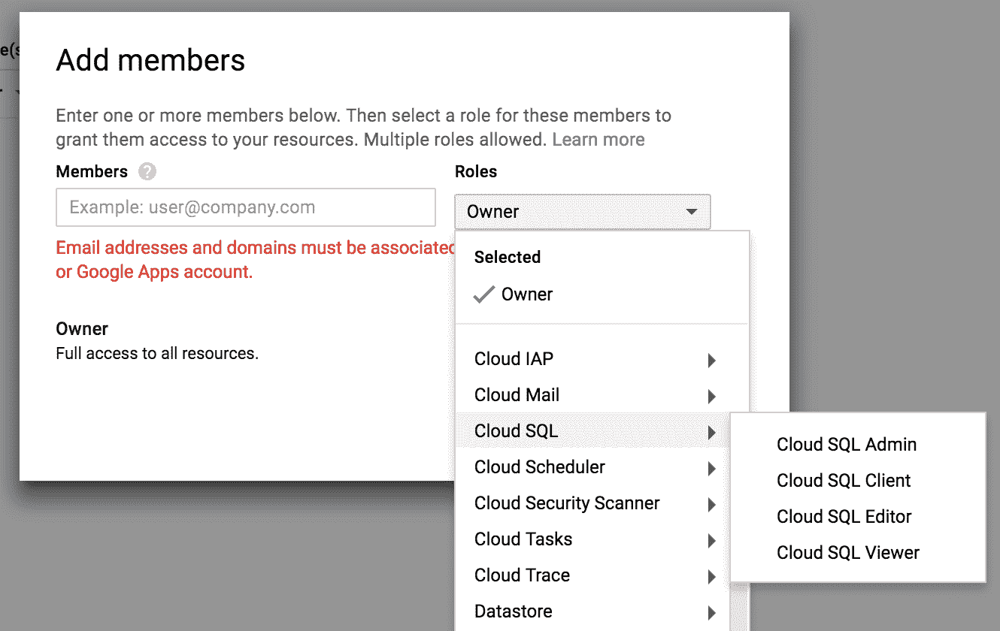

<title>Introducing the Google Cloud Platform</title>  

# 介绍谷歌云平台

这第一个介绍性章节的目标是给你一个关于谷歌云平台的概述。我们首先解释为什么**机器学习** ( **ML** )和云计算携手并进，因为今天的 ML 应用对越来越饥渴的计算资源的需求不断增长。然后，我们对该平台的数据相关服务进行 360 度展示。帐户和项目创建以及角色分配结束这一章。

数据科学项目遵循一系列常规步骤:提取数据、探索、清理数据、提取信息、训练和评估模型，最后构建支持机器学习的应用程序。对于数据科学流程的每一步，GCP 中都有一个或几个足够的服务。

但是，在我们呈现 GCP 数据相关服务的整体映射之前，理解为什么 ML 和云计算是真正的天生一对是很重要的。

在本章中，我们将讨论以下主题:

*   ML 和云
*   介绍 GCP
*   谷歌平台的数据服务

<title>ML and the cloud</title>  

# ML 和云

简而言之，**人工智能** ( **AI** )需要大量的计算资源。云计算解决了这些问题。

ML 是一种新型的显微镜和望远镜，它让我们每个人都可以拓展人类知识和人类活动的边界。随着越来越强大的 ML 平台和开放工具，我们能够征服新的知识领域，发展新的业务类型。从我们舒适的笔记本电脑，在家里或在办公室，我们可以更好地理解和预测人类在广泛领域的行为。想想医疗保健、交通、能源、金融市场、人类交流、人机交互、社交网络动态、经济行为和自然(天文学、全球变暖或地震活动)。受人工智能爆炸影响的领域是无限的。对社会的影响？令人震惊。

拥有在线连接的任何人都可以获得如此多的资源，加入人工智能革命的障碍从未像现在这样低。书籍、教程、MOOCs、见面会以及各种语言的开源库对经验丰富的数据科学家和初学者都是免费的。

正如资深数据科学家所知，数据科学总是渴望更多的计算资源。Iris 或 MINST 图像数据集的分类或泰坦尼克号乘客的预测模型并不反映真实世界的数据。现实世界的数据本质上是肮脏的、不完整的、嘈杂的、多源的，并且通常是大量的。利用这些大型数据集需要计算能力、存储、CPU、GPU 和快速 I/O。

然而，更强大的机器不足以构建有意义的 ML 应用程序。数据科学以科学为基础，需要科学的思维方式，并具备可再现性和审查等概念。通过使用在线可访问资源，这两个方面都变得更加容易。当数据存储在一个人的计算机上时，共享数据集和模型以及公开结果总是更加困难。用新数据复制结果和维护模型也需要容易访问资产。随着我们处理越来越个性化和关键的数据(例如医疗保健)，隐私和安全问题对项目干系人来说变得更加重要。

这就是云的用武之地，它提供可伸缩性和可访问性，同时提供足够的安全性。

在深入 GCP 之前，让我们了解更多关于云的知识。

<title>The nature of the cloud</title>  

# 云的本质

ML 项目是资源密集型的。从存储到计算能力，训练模型有时需要在简单的独立计算机上找不到的资源。近年来，存储方面的物理限制已经缩小。由于我们现在可以以较低的价格享受可靠的 TB 级存储，对于不属于大数据领域的大多数数据项目来说，存储不再是一个问题。计算能力也提高了很多，几年前需要昂贵工作站的东西现在可以在笔记本电脑上运行。

然而，尽管有如此惊人的快速发展，独立 PC 的能力是有限的。您可以在计算机上存储的数据量以及您愿意等待模型训练的时间都有一个上限。人工智能的新前沿，包括语音转文本、实时视频字幕、无人驾驶汽车、音乐生成或可以愚弄人类并通过图灵测试的聊天机器人，需要更多的资源。深度学习模型尤其如此，在标准 CPU 上速度太慢，需要基于 GPU 的机器在合理的时间内进行训练。

云中的 ML 不会面临这些限制。通过云计算，您可以直接获得**高性能计算** ( **HPC** )。在云出现之前(大约在 AWS 于 2006 年推出其**弹性计算云** ( **EC2** )服务之前)，HPC 只能通过超级计算机使用，如 Cray 计算机。Cray 是一家美国公司，自 20 世纪 60 年代以来，它已经制造了一些最强大的超级计算机。中国的天河二号现在是世界上最强大的超级计算机，具有 10 万万亿次浮点运算的能力(即 10 ² x 10 ^(15) ，即 10 的 17 次方每秒浮点运算！).

一台超级计算机不仅要花费数百万美元，而且需要自己的物理基础设施和巨额维护费用。这对于个人和大多数公司来说也是遥不可及的。渴望 HPC 的工程师和研究人员现在转向按需云基础架构。云服务产品正在普及对 HPC 的访问。

云中的计算建立在分布式架构之上。处理器分布在不同的服务器上，而不是集中在一台机器上。只需点击几下鼠标或命令行，任何人都可以在几分钟内注册庞大复杂的服务器库。你所掌握的权力之大令人震惊。

云计算不仅可以处理最苛刻的优化任务，还可以对微小的数据集进行简单的回归。云计算非常灵活。

总而言之，云计算提供了:

*   即时性:资源可以在几分钟内提供。
*   **按需**:实例可以放在袖手旁观上，或者在不再需要时停用。
*   **多样性**:广泛的操作系统、存储和数据库解决方案允许架构师创建以项目为中心的架构，从简单的移动应用程序到 ML APIs。
*   **无限的资源**:如果不是无限的，你可以为存储计算和网络收集的资源量是令人震惊的。
*   **GPU**:大部分 PC 都是基于 CPU 的(针对游戏优化的机器除外)。深度学习要求 GPU 达到人类兼容的速度来训练模型。云计算使得 GPU 的价格只是购买 GPU 机器的一小部分。
*   **可控的可访问性和安全性**:借助精细的角色定义、服务划分、加密连接和基于用户的访问控制，云平台大大降低了入侵和数据丢失的风险。

除此之外，市场上还有其他几种类型的云平台和产品。

<title>Public cloud</title>  

# 公共云

根据客户的需求，有两种主要类型的云模型:公共云与私有云和多租户与单租户。这些不同的云类型提供不同级别的管理、安全性和定价。

公共云由位于互联网上的异地资源组成。在公共云中，基础架构通常是多租户的。多个客户可以共享相同的底层硬件或服务器。网络、存储、电力、冷却和计算等资源都是共享的。除了选择地理区域之外，客户通常不知道该基础架构托管在哪里。公共云服务的定价模式基于数据量、使用的计算能力和其他基础架构管理相关服务，或者更准确地说，是 RAM、vCPUs、磁盘和带宽的组合。

在私有云中，资源专用于单个客户；该架构是单租户的，而不是多租户的。服务器位于本地或远程数据中心。客户拥有(或租用)基础架构，并负责维护它。私有云基础架构的运营成本更高，因为它们需要为单个租户保护专用硬件。私有云的客户对其基础架构拥有更多控制权，因此他们可以满足合规性和安全性要求。

混合云由公共云和私有云混合组成。

GCP 是一个公共多租户云平台。您与其他客户共享您使用的服务器，并让 Google 处理支持、数据中心和基础设施。

<title>Managed cloud versus unmanaged cloud</title>  

# 托管云与非托管云

云市场也已经多样化，分为两大块——托管云和非托管云。

在不受管理的云平台中，基础架构是自助式的。如果出现故障，客户有责任建立一些机制来恢复操作。非托管云要求客户拥有合格的专业知识和资源来构建、管理和维护云实例和基础架构。非托管云产品侧重于自助式应用，不包括对其基本层的支持。

在托管云平台中，提供商将通过提供监控、故障排除和全天候客户服务来支持底层基础架构。托管云立即为团队带来合格的专业知识和资源。对于许多公司来说，让服务提供商来处理他们的公共云可能比雇佣自己的员工来运营他们的云更容易，也更具成本效益。

GCP 是一种公共、多租户、不受管理的云服务。AWS 和 Azure 也是。另一方面，Rackspace 是托管云服务公司的一个例子。例如，Rackspace 在 2017 年 3 月刚刚开始为 GCP 提供托管服务。

<title>IaaS versus PaaS versus SaaS</title>  

# IaaS 对 PaaS 对 SaaS

另一个重要的区别是由用户或云平台提供商完成的工作量。让我们借助以下服务级别来看一下这种区别:

*   **基础设施即服务(IaaS)** :在最低级别，IaaS，即云提供商，处理机器、其虚拟化和所需的网络。用户负责其他一切—操作系统、中间件、数据和应用软件。提供者是用户在其上构建基础结构的资源的宿主。谷歌计算引擎、SQL、DNS 或负载平衡都是 GCP 中 IaaS 服务的例子。
*   **平台即服务(PaaS)** :在 PaaS 产品中，用户只负责软件和数据。其他一切都由云提供商处理。提供商构建基础设施，而用户部署软件。PaaS 相对于 IaaS 的主要优势，除了减少工作负载和对系统管理员资源的需求之外，还在于 web 应用程序的自动伸缩。当需求波动时，会自动分配适当数量的资源。PaaS 服务的例子包括 Heroku 或 Google App Engine。
*   **软件即服务(SaaS)** :在 SaaS，提供商是一家在线提供服务的软件公司，而用户则消费所提供的服务。想想优步、脸书或 Gmail。

虽然主要是 IaaS 提供商，但 GCP 也有一些 PaaS 产品，如 Google App Engine。它的 ML APIs(文本、语音、视频和图像)可以被认为是 SaaS。

<title>Costs and pricing</title>  

# 成本和定价

云服务的定价很复杂，并且因供应商而异。云服务的基本成本结构可以分为:

*   **计算成本**:每 GB 内存中每数量虚拟 CPU 运行虚拟机的持续时间
*   **存储成本**:每 GB 的磁盘、文件和数据库
*   **网络成本**:内部和外部、入站和出站流量

Google 的可抢占虚拟机(AWS Spot 实例)是基于剩余的未使用容量构建的虚拟机，价格比普通按需虚拟机低三到四倍。但是，如果其他任务需要访问这些资源，计算引擎可能会终止(抢占)这些实例。可抢占实例适用于能够承受突然中断的批处理作业或工作流。他们也不总是可用的。在下一章，我们将学习如何从命令行启动可抢占的实例。

谷歌云最近还推出了承诺使用降价。如果您长期保留实例，通常承诺 1 年或 3 年的使用期限，您将获得折扣。

当您的基础架构快速发展并需要可伸缩性和快速修改时，迁移到云可以降低成本的论点就成立了。如果您的应用程序非常静态且负载稳定，那么云可能不会降低成本。最后，由于云提供了更大的灵活性，并为快速实施新项目开辟了道路，因此总体成本高于固定基础设施。但是这种灵活性是云计算的真正好处。

查看[https://cloud.google.com/compute/pricing](https://cloud.google.com/compute/pricing)当前谷歌计算引擎的价格。

价格战在过去几年里，云服务的成本已经下降。自 2012 年以来，三大公共云参与者经历了连续的降价阶段，当时 AWS 大幅降低了存储价格，以削弱竞争。四大主要云提供商在 2012 年降价 22 次，2013 年降价 26 次。降幅从 6%到 30%不等，涉及所有类型的服务:计算、存储、带宽和数据库。截至 2014 年 1 月，亚马逊已经降低了 40 多次产品价格。其他主要云服务提供商已经达到或超过了这一降幅。最近，三个主要参与者进一步降低了他们的存储价格，可能会再次引发价格战。根据最近对云计算价格的研究，没有太多的数据表明云已经成为一种商品。451 research 这样说，进一步预测关系数据库可能是下一个价格战的战场。

<title>ML</title>  

# 机器语言(Machine Language)

因此，近乎即时的可用性、低成本、灵活的架构和近乎无限的资源是云计算的优势，但代价是额外的开销和经常性成本。

在云计算的全球格局中，GCP 是一个公共的非托管 IaaS 云产品，提供一些 PaaS 和 SaaS 服务。虽然 Azure 和 GCP 在计算(EC2、云计算等)、数据库(BigQuery、Redshift 等)、网络等标准云服务方面有直接的可比性；Google Cloud 的 ML 方法与 Amazon 或 Azure 的完全不同。

简而言之，AWS 要么提供针对非常特定的应用程序的一体化服务——人脸识别和 Alexa 相关的应用程序，要么提供基于经典(而非深度学习)模型的预测分析平台，称为亚马逊 ML。微软的提议更多的是以 PaaS 为中心，其 Cortana 智能套件。微软的 ML 服务和 AWS 的很像，有更多可用的模型。

GCP ML 的提议是基于谷歌的深度学习库 TensorFlow。Google 基于预先训练的 TensorFlow 模型，为 NLP、语音转文本、翻译、图像和视频处理提供了广泛的 ML APIs。它还提供了一个平台，在这里您可以训练自己的 TensorFlow 模型并对其进行评估(TensorBoard)。

<title>Introducing the GCP</title>  

# 介绍 GCP

第一个云计算服务可以追溯到 15 年前，当时，在 2002 年 7 月，亚马逊推出了 AWS 平台，以公开来自亚马逊及其附属公司的技术和产品数据，使开发人员能够自行构建创新和创业应用程序。2006 年，AWS 作为 EC2 重新推出。

AWS 的早期启动让亚马逊在云计算领域处于领先地位，此后从未动摇过。竞争对手反应迟缓，没有推出自己的报价。一家大公司的 AWS 云服务的第一个替代品来自于 2008 年 4 月推出的 Google App Engine，它是一种 PaaS 服务，用于开发和托管 web 应用程序。GCP 就这样诞生了。微软和 IBM 紧随其后，2010 年 2 月推出了 Windows Azure 平台，2009 年 1 月推出了 LotusLive。

谷歌直到很久以后才进入 IaaS 市场。2013 年，谷歌向公众发布了计算引擎，并签署了企业服务水平协议(T2 服务水平协议)。

<title>Mapping the GCP</title>  

# 绘制 GCP 地图

拥有超过 40 种不同的 IaaS、PaaS 和 SaaS 服务，GCP 生态系统丰富而复杂。这些服务可以分为六个不同的类别:

*   托管和计算
*   存储和数据库
*   建立工作关系网
*   机器语言(Machine Language)
*   身份和安全性
*   资源管理和监控

在下一节中，我们将学习如何在 Google Compute Engine 上设置和管理单个 VM 实例。但是，在此之前，我们需要创建我们的帐户。

<title>Getting started with GCP</title>  

# GCP 入门

开始使用 GCP 非常简单。你真正需要的只是一个谷歌账户。前往[https://cloud.google.com/](https://cloud.google.com/)，用你的谷歌账户登录，然后按照指示操作。根据需要添加您的账单信息。这使您可以访问 GCP 基于 web 的用户界面。我们将在下一章讨论命令行和 shell 可访问性以及相关的 SSH 密钥创建。

在我写这篇文章的时候，谷歌提供了一个相当慷慨的免费试用期，为期 12 个月，新账户可获得 300 美元的信用额度。然而，有些服务是有限制的。例如，您不能启动超过 8 个 CPU 的 Google Compute Engine VM 实例，并且您创建的项目数量受到限制，尽管您可以请求超过分配的配额。没有 SLA。不允许使用谷歌云服务进行比特币挖矿等活动。一旦您升级了您的帐户，这些限制将不再适用，最初 300 美元中剩下的钱将记入您的帐户。有关免费试用的更多信息，请访问[https://cloud . Google . com/free/docs/FAQ-questions](https://cloud.google.com/free/docs/frequently-asked-questions)。

<title>Project-based organization</title>  

# 基于项目的组织

GCP 的一个重要方面是它以项目为中心的组织。所有计费、权限、资源和设置都分组在一个用户定义的项目中，该项目基本上充当一个全局名称空间。如果不首先指定一个资源所属的项目，就不可能启动这个资源。

这些项目中的每一个都有:

*   您选择的项目名称。
*   项目 ID，由 GCP 建议，但可编辑。项目 ID 由项目中的 API 调用和资源使用。
*   项目编号，由 GCP 提供。

项目标识和项目编号在所有 GCP 项目中都是唯一的。项目组织有几个直接的好处:

*   由于资源专用于单个项目，预算分配和计费得到简化
*   由于分配给项目的资源遵循相同的地区和区域规则，并且共享相同的元数据，因此它们之间的操作和通信可以无缝地工作
*   类似地，访问管理在单个项目中是一致的，限制了访问控制的整体复杂性

基于项目的组织极大地简化了资源管理，这也是 GCP 易于使用的一个重要方面。

<title>Creating your first project</title>  

# 创建您的第一个项目

要创建新项目:

1.  进入资源管理页面，[https://console.cloud.google.com/cloud-resource-manager](https://console.cloud.google.com/cloud-resource-manager)。
2.  点击创建项目。
3.  写下你的项目标题，注意 Google 是如何动态生成项目 ID 的。根据需要进行编辑。
4.  点击创建。
5.  您将被重定向到 IAM 服务的角色部分。

<title>Roles and permissions</title>  

# 角色和权限

默认情况下，当您创建一个新项目时，您的 Google 帐户被设置为项目的所有者，拥有对项目所有资源和计费的完全权限和访问权。在 IAM 页面的角色部分，[https://console.cloud.google.com/iam-admin/roles/](https://console.cloud.google.com/iam-admin/roles/)，您可以将人员添加到您的项目中，并为该人员定义角色。您还可以逐个服务地创建新的自定义角色，或者分配由服务组织的预定义角色。

1.  转到 IAM 页面，选择刚刚创建的项目，如果还没有选择的话:[https://console.cloud.google.com/iam-admin/iam/project](https://console.cloud.google.com/iam-admin/iam/project)。你应该看到你的谷歌帐户作为项目所有者的电子邮件。
2.  要将新人员添加到项目中:
    1.  点击+添加。
    2.  输入此人的 Google 帐户电子邮件(它必须对应于一个有效的 Google 帐户)。
    3.  选择该人员的所有角色，如下面的屏幕截图所示:

角色菜单按服务和管理域(计费、日志记录和监控)组织，对于每个服务，按访问级别组织。尽管这因服务而异，但您可以大致在四种角色类型之间进行选择:

*   **管理员**:对资源的完全控制
*   **客户端**:连接访问
*   **编辑/创建者**:除用户管理、SSL 证书和删除实例之外的完全控制
*   **查看器**:只读访问

您也可以在[https://console.cloud.google.com/iam-admin/roles/project?的角色 IAM 页面创建新的定制角色 project=packt-gcp](https://console.cloud.google.com/iam-admin/roles/project?project=packt-gcp) 。

当您为项目分配新资源时，平台会在服务之间创建适当的、必需的角色和权限。您可以从给定项目的“管理资源”页面或“IAM”页面右侧的信息面板中查看和管理这些访问权限和相关角色。Google 在生成正确的访问级别方面做得很好，这使得平台用户的生活更加轻松。

我们的谷歌云项目为了这本书我创建了`packt-gcp`项目。因为这个名称在所有其他 GCP 项目中是唯一的，所以项目 ID 也是`packt-gcp`。所有的资源都是在美国中心地带创造的。

<title>Further reading</title>  

# 进一步阅读

在整本书中，我将以一系列在线资源来总结这一章，这些资源概括或超越了本章所讨论的内容:

*   许多关于 GCP 使用大数据的优秀文章可以在 https://cloud.google.com/blog/big-data/的谷歌大数据博客上找到。
*   GCP 有什么服务？谷歌的软件工程师烈斗·梅尔用简单的方式描述了不同的谷歌云服务(更多信息，请参见[https://hacker noon . com/what-the-the-Google-Cloud-platform-GCP-services-285 f 1988957 a](https://hackernoon.com/what-are-the-google-cloud-platform-gcp-services-285f1988957a))。这对于掌握 GCP 服务的多样性非常有用。
*   谷歌云平台注释史是烈斗·梅尔关于 GCP 历史的另一篇文章。你可以在:[https://medium . com/@ reto Meier/an-annotated-history-of-Google-cloud-platform-90b 90 f 948920](https://medium.com/@retomeier/an-annotated-history-of-googles-cloud-platform-90b90f948920)找到。它从要点开始:【2008 年以前——计算机发明。谷歌创立了...。关于 GCP 更详细的时间表可以在 Crunchbase 上找到，网址是 https://www . Crunchbase . com/organization/Google-cloud-platform/timeline #/timeline/index。
*   计算能力的演变，也称为摩尔定律，可在[http://www . cs . Columbia . edu/～sedwards/classes/2012/3827-spring/advanced-arch-2011 . pdf](http://www.cs.columbia.edu/~sedwards/classes/2012/3827-spring/advanced-arch-2011.pdf)上获得，在更近的版本中，七个最近的数据点都是 NVIDIA GPUs，可在[https://en . Wikipedia . org/wiki/Moore % 27s _ Law #/media/File:Moore % 27s _ Law _ over _ 上获得](https://en.wikipedia.org/wiki/Moore%27s_law#/media/File:Moore%27s_Law_over_120_Years.png)
*   更多关于三大主要云平台的定价大战，请参见本文:*云定价趋势:获取白皮书，* Rightscale *，* 2013，在[https://www . right scale . com/LP/Cloud-Pricing-Trends-White-Paper](https://www.rightscale.com/lp/cloud-pricing-trends-white-paper)。
*   大卫·斯泰帕尼亚写的一篇关于*超级计算与云计算*的好文章可以在[https://www . LinkedIn . com/pulse/super Computing-vs-Cloud-Computing-David-step ania/](https://www.linkedin.com/pulse/supercomputing-vs-cloud-computing-david-stepania/)找到。

<title>Summary</title>  

# 摘要

在这一介绍性章节中，我们研究了 GCP 的本质并探索了它的服务架构。我们创建了一个新项目，并理解了角色创建和分配。虽然 GCP 是云计算市场的新成员，但它为广泛的应用提供了一整套服务。我们将在本书的其余部分深入研究这些服务。

我们现在已经准备好在 Google 平台上开始研究数据科学。在下一章中，我们将在 Google Compute Engine 上创建一个 VM 实例，并使用 Anaconda 发行版安装一个 data science Python 堆栈。我们将探索 web UI，并学习如何通过命令行和 Google Shell 管理实例。