# 使用 BigQuery 查询您的数据

在过去的几年中，技术的发展已经导致了在商业世界和家庭中能够自动化许多操作的电子设备的显著增加。这些设备每天都会产生大量数据，近年来数据量呈指数级增长。

这些数据代表了一种巨大的资源，在过去，这种资源很久没有被表达出来。如今，大公司意识到，他们活动的成功至少取决于(如果不是很大程度上)从这些数据的处理中获得的信息。但是处理大量的数据需要公司付出大量的努力——包括技术和人力。谷歌是最早理解数据管理重要性的公司之一，随着时间的推移，它创造了一个今天可供公司和个人使用的技术背景。

在本章中，我们将介绍 BigQuery 和 Data Studio 平台来管理和查看数据。首先，我们将了解大数据以及与管理大量数据相关的问题。然后我们将分析如何组织数据和用于正确查询数据库的工具。考虑到这一点，我们将介绍 SQL 语言。然后我们将分析 Google BigQuery，这是一个支持对大规模数据集进行交互式分析的 web 服务。最后，我们将分析如何使用 Google Data Studio 根据我们的数据创建报告。

涵盖的主题有:

*   大数据
*   查询数据库
*   SQL 语言
*   谷歌大查询
*   谷歌数据工作室

在本章的结尾，读者将能够应用这些工具来分析他们的数据，而不需要技术支持。我们将讨论几个例子，以便在实际案例中尽可能真实地使用这些工具。


# 走近大数据

社交网络的爆炸，加上智能手机不可阻挡的传播，证明了一个事实，即近年来在创新、营销和信息技术领域反复出现的术语之一是大数据。这一术语指的是以相当高的速度和最多样化的格式大量产生的数据，其处理需要的技术和资源远远超过传统的数据管理和存储系统。但是这个术语包含了什么呢？

在一篇被广泛引用的文章《大数据时代》中，Steve Lohr(*《纽约时报》的科技记者)这样解释大数据:*

“什么是大数据？毫无疑问，这是一个迷因和营销术语，但也是推进技术趋势的简写，为理解世界和做出决策的新方法打开了大门。”

全文详细阅读可参考以下网址:[http://www . nytimes . com/2012/02/12/Sunday-review/big-datas-impact-in-the-world . html](http://www.nytimes.com/2012/02/12/sunday-review/big-datas-impact-in-the-world.html)。

大数据这个术语不应该误导我们；事实上，乍一看，我们可能会认为这种现象只涉及数据大小。尽管维度无疑代表了问题的一个元素，但大数据的其他方面或其他属性并不一定与它们相关联。

*“大数据有三个维度——数量、种类和速度*，”Michael Minelli 说。"*在这三个维度中的每一个维度中都有大量的变量*"

让我们仔细看看与大数据相关的三个方面:

*   **量**:大数据意味着巨大的数据量。早些时候，是男人创造了数据。现在，数据是由机器、网络和社交媒体生成的，需要分析的数据量是巨大的。然而，数量并不是唯一需要解决的问题。
*   **多样性**:数据的多样性源于存储结构化和非结构化数据的多种来源和类型。过去，数据存储在电子表格和数据库中。现在它以照片、视频、音频、电子邮件等形式出现。这种非结构化数据的多样性给存储、提取和分析数据带来了问题。
*   **速度**:最后，速度是指数据从工业流程、机器、网络、社交媒体、移动设备等来源到达的顺序。因此，数据流是巨大而连续的。如果能够控制速度，这些实时数据可以帮助研究人员和公司做出重要决策，提供战略竞争优势。

公司正在生成越来越多的数据，捕获有关其客户、供应商和运营的数万亿字节的信息。如此大量的信息是因为数据大量来自以下来源:

*   收集不同类型数据的传感器
*   绘制潜在客户位置的移动电话 GPRS 包
*   社交媒体上的内容
*   图像—数字和视频
*   购买交易的在线记录
*   能产生我们感兴趣的信息的任何其他来源

这些显示在下图中:

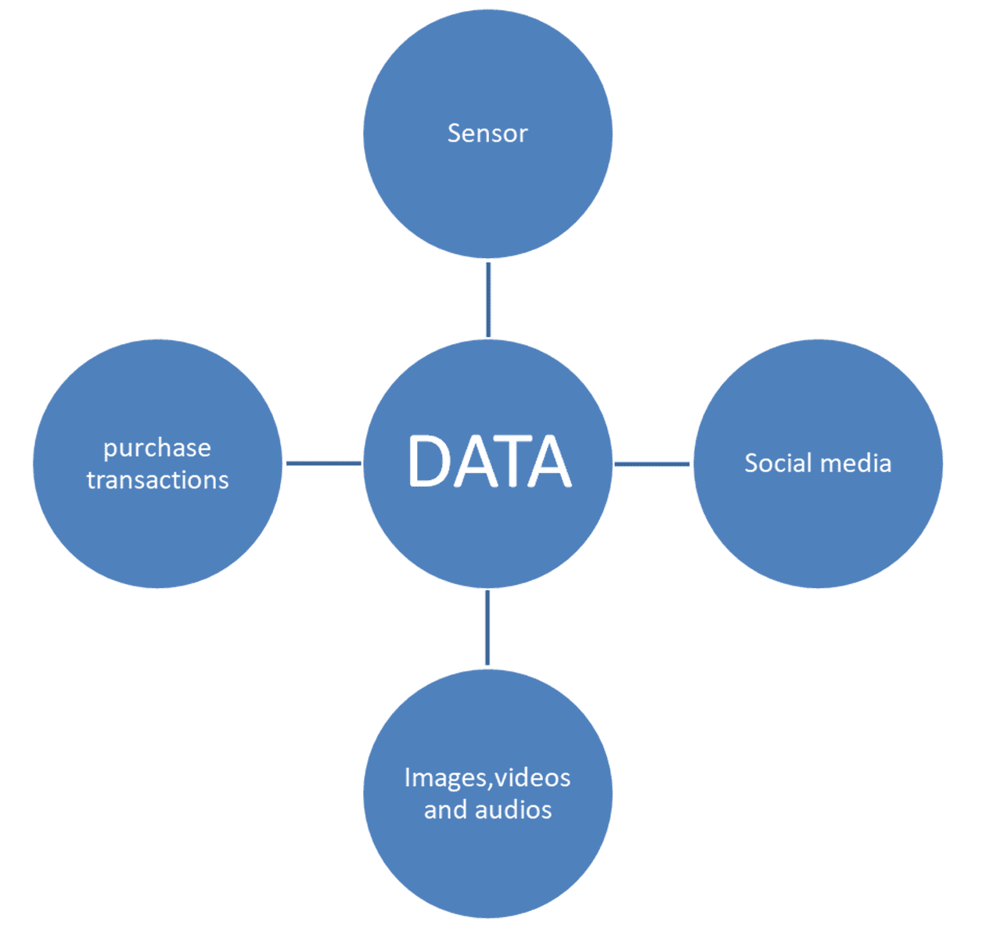

从功能上讲，收集如此大量的结构化和非结构化数据可以帮助组织:

*   降低成本
*   提高运营效率和生产绩效
*   改善客户关系
*   以更明智的方式开发新产品
*   加速和同步交付
*   制定并回应更深入的请求
*   改进和简化决策

所有这些对许多大公司来说已经是现实。未来的挑战是确保即使是小公司和个人也能获得资源，以简单实用的方式处理数据。

得益于数据存储和云计算，记忆、聚合和组合数据(从而使用结果进行深度分析)的能力正变得越来越容易获得。换句话说，面对日益提高的性能和效率，这些服务继续降低它们的成本和其他技术壁垒。例如，通过云计算，可以通过互联网访问高度可扩展的计算资源，通常比安装在他们的计算机上所需的价格更低，因为资源在许多用户之间共享。


# 数据结构化

每天，在世界各地，人类的不同活动都会产生大量的数据。最初，这些数据没有结构化，因为它们来自不同性质的来源。因此，它们需要一个随时可用的组织。因此，收集的非结构化信息必须根据特定要求进行处理，并随后作为结构化数据进行存储。数据结构有很多种形式，从基本的到高级的和复杂的，它们的使用在结构化数据的过程中是必不可少的。

数据结构化由一组线性或非线性操作组成，这些操作对作为输入的明显随机和非结构化的数据执行。这些操作旨在分析数据的性质及其重要性。然后，系统根据分析结果将数据划分为广泛的信息类别，并存储或发送这些信息以供进一步分析。这种附加分析可用于将数据细分为嵌套类别的附加子类别。在分析过程中，一些数据也可能被认为是无用的，并最终被丢弃。

这一过程的结果由结构化数据表示，可以进一步分析或直接用于提取迄今为止未知的信息。从非结构化数据到有用信息的转变是结构化和处理数据的循环的基础，它们的成功通常决定了数据在给定应用领域中的重要性。

数据结构化是一种组织和归档数据的方法，以便可以有效地访问和修改数据。特别是，数据结构由数据值的集合、数据值之间的关系以及可应用于数据的函数或操作组成，如下图所示:

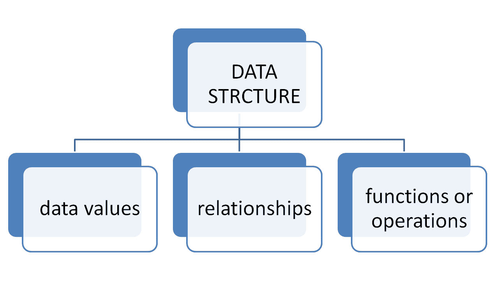

随着时间的推移，数据以不同的方式进行组织，从编程语言中常用的非常基本的结构(如数组)开始，一直到可以采用复杂形式的现代数据结构。现代数据结构是不同类型的数据库，支持广泛的加工和扩展操作，允许以许多不同的方式对数据进行简单的操作、分类和排序。

**关系数据库**是很多人首选的数据结构，因为它们已经被广泛使用了很多年。术语**数据库**表示在特定信息系统中使用的数据集，包括商业、科学、行政或其他类型的数据。数据库由两种不同类型的信息组成，属于不同的抽象层次:

*   数据，表示要建模的系统的实体。这些实体的属性用值(数字、字母数字等)来描述。数据片段也根据它们的公共结构(例如，书籍、作者等)进行分组或分类。
*   结构(元数据)，描述各种数据类别的共同特征，如属性值的名称和类型。

数据库必须代表现实的不同方面，特别是，除了实际数据之外，还必须代表数据之间的关系，即各种类别之间的逻辑联系。例如，必须表现出将每个作者与他们的书绑定在一起的关联，反之亦然。数据库还必须满足以下要求:

*   数据必须以最小的冗余来组织，也就是说，不要不必要的重复。这一条件源于不仅需要避免存储资源的不必要使用，而且首先需要避免管理多个副本的负担；此外，如果与某一类数据有关的信息被复制，就有一种风险，即对其中一个副本进行的更新没有显示在其他副本上，这对所有数据的一致性和可靠性有负面影响。
*   数据必须可供多个用户同时使用。这一要求源于前一点；应避免每个用户(或用户类别)使用自己的数据副本的情况，必须有一个所有用户都可以访问的数据版本；这意味着每种类型的用户都需要有特定的数据视图和特定的数据访问权限。此外，还需要一些技术来防止不同用户的活动在同时使用相同数据时产生冲突。
*   数据必须是永久的。这不仅意味着使用大容量存储器，而且还意味着在系统的任何部件发生故障的情况下应用保存数据集的技术。

表是关系数据库的基本数据结构。这些表表示概念架构的实体和关系。它由记录(行或元组)和字段(列或属性)组成:

*   每个记录代表实体/关系的一个实例(或出现或元组)
*   每个字段代表实体/关系的一个属性

每个字段都有一个域(数据类型):字母数字、数字、日期、布尔等等。

其值唯一标识表中记录的一组字段称为**主键**。当主键只包含一个字段时，它被称为**键字段**。下图显示了数据库中主键的一个示例:

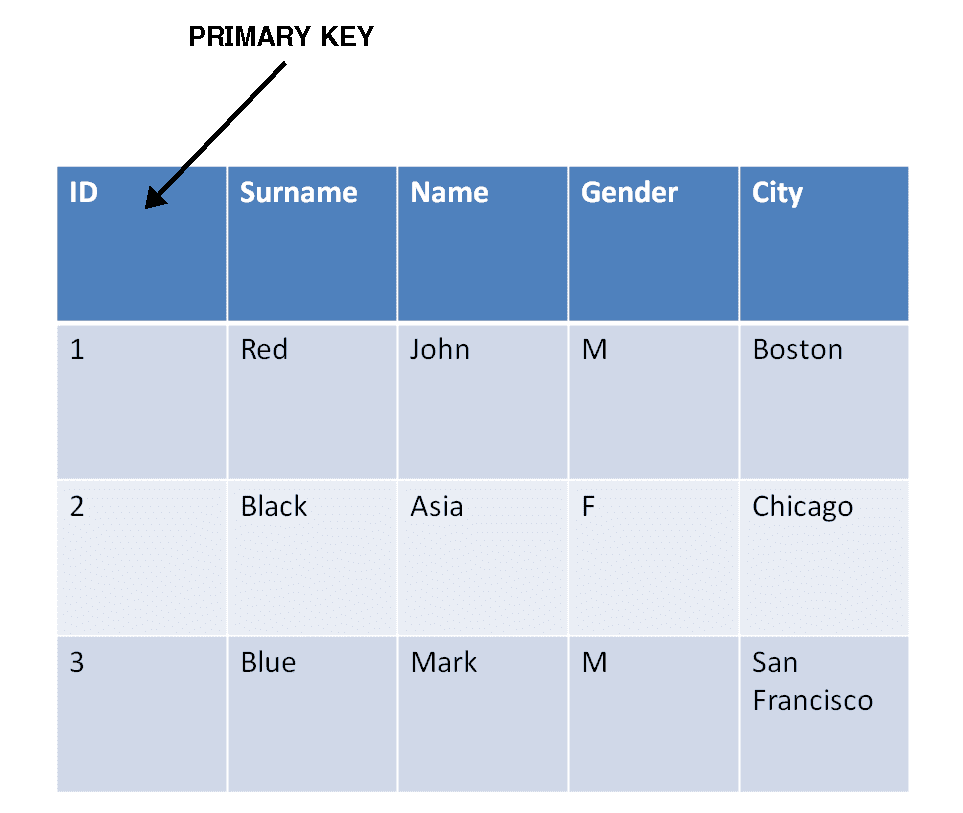

当在实体的属性之间找不到关键字字段时，会定义一个自动递增(计数器)的数字 ID 字段。

引用完整性是关系模型的一组规则，当关系通过外键彼此关联时，它们保证数据的完整性:这些规则用于验证表之间的关联，并消除插入、删除或修改链接数据时的错误。

索引与数据库相关。索引是一种数据结构，旨在缩短数据搜索时间。表中需要搜索或连接操作的字段可以被索引。在没有索引的情况下，对字段值的搜索按顺序在表中的记录上进行。对于定义为关键字的字段，索引是从数据库中自动生成的。


# 查询数据库

到目前为止，我们已经看到了如何从非结构化信息转移到结构化信息。特别是，我们了解到这一行动需要大量资源。对适当结构化数据的需求源于在数据库中搜索信息以提取知识的需求。

任何一个**数据库管理系统** ( **DBMS** )都为查询数据库表的内容提供了一个非常强大的工具:查询。

DBMS 是一种软件系统，旨在允许创建、操作(由 DBA 管理员)和高效查询(由一个或多个客户端用户)数据库，因此也称为**数据库管理器**或**引擎**，并托管在专用硬件架构(服务器)或简单的计算机上。

查询是一种查询数据库的方法，即显示从表中提取的信息。为此，可以执行几项操作:

*   根据各种标准过滤表中包含的数据
*   重新关联不同表中包含的数据
*   选择要查看的字段
*   根据某些字段的值对结果进行排序
*   对在特定字段中具有相同值的记录进行分组(聚合)

查询可以只执行一次来显示结果，也可以保存在数据库中执行多次。如果在更改表后再次使用查询，查询结果将返回新的表内容。

例如，假设您有一个包含两个表的图书馆数据库:

*   图书表表示目录中的图书，包含字段`ID_Book`(主键)、标题、作者、年份、价格、出版商
*   Publisher 表表示与图书馆有联系的出版社，包括出版社(主键)、城市、电话

假设想要定义一个显示所有书籍的书名和价格的查询。这个查询需要访问 Books 表，并只向用户显示两个选择的字段(标题和价格)。如果 Books 表包含 80 卷，查询将在结果中显示 80 个标题和价格对。如果从 Books 表中删除了一条记录，重新运行已经定义的查询将只产生 79 个标题和价格对，而不必干预查询的定义。


# SQL 基础知识

此时，提出以下问题是合理的:*使用哪种语言来表达对数据库的查询？*我们需要一种查询语言，它是用户用来在数据库和信息系统上创建查询的语言。它用于通过相关的 DBMS 从数据库中提取信息，查询数据库，然后与用户及其服务请求进行交互。普遍使用的查询语言是 SQL。

SQL 是一种定义和操作数据的语言。作为一种操作语言，SQL 允许从数据库中选择感兴趣的数据并更新其内容。这些查询既用于数据定义的 SQL 结构，也用于更新数据库的 SQL 结构。

SQL 是一种声明性语言:它允许您指定要查找什么，而无需说明如何查找。当查询由查询处理器执行时，它被翻译成系统内部的过程语言，该过程语言允许指定如何访问数据。通常有几种 SQL 查询到过程语言的翻译。查询优化器的任务是选择最有效的执行计划。

SQL 查询在数据库上执行，然后在通过外键机制相互连接的一组表上执行。查询的结果是一个表。我们将通过实例介绍 SQL，即展示日益丰富和复杂的询问实例。

为了理解 SQL 是如何工作的，我们分析了包含两年来意大利博物馆的游客数量的表，如下面的屏幕截图所示:

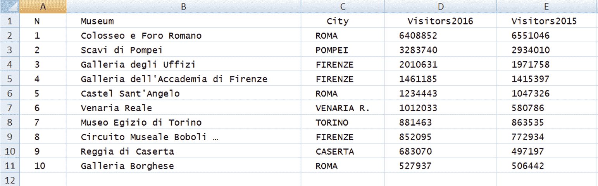

这张桌子被命名为**博物馆**；可以编写的最简单的询问如下:

```
select *
from museum
```

结果是整个博物馆的桌子。查询的第一行称为`select`语句，用于从数据库中检索数据。`*`操作符允许我们选择所有列。查询的第二行称为`from`语句，用于指示使用哪些表。`select`语句和 from 语句在查询中是必需的。密切注意 SQL 关键字的每个查询的大小写、间距和逻辑分隔。

如果我们只对博物馆的名称和城市感兴趣，我们可以这样选择它们:

```
select Museum, City
from museum
```

结果如下表所示:

| **博物馆** | **城市** |
| 罗马式的竞技场和孔 | 吉卜赛人 |
| 挖庞贝 | POMPEI |
| 办公室画廊 | 佛罗伦萨 |
| 佛罗伦萨学院画廊 | 佛罗伦萨 |
| 圣安杰洛堡 | 吉卜赛人 |
| 维纳里亚·里勒 | 维纳里亚河 |
| 都灵埃及博物馆 | 托里诺 |
| Boboli 博物馆电路... | 佛罗伦萨 |
| 卡萨特王朝 | 卡萨特 |
| 资产阶级画廊 | 吉卜赛人 |

为了阐明数据库表和 SQL 表之间的区别，我们来看一个简单的查询，它生成一个包含两个同名列的表:

```
select Museum, Museum
from museum
```

结果如下表所示:

| **博物馆** | **博物馆** |
| 罗马式的竞技场和孔 | 罗马式的竞技场和孔 |
| 挖庞贝 | 挖庞贝 |
| 办公室画廊 | 办公室画廊 |
| 佛罗伦萨学院画廊 | 佛罗伦萨学院画廊 |
| 圣安杰洛堡 | 圣安杰洛堡 |
| 维纳里亚·里勒 | 维纳里亚·里勒 |
| 都灵埃及博物馆 | 都灵埃及博物馆 |
| Boboli 博物馆电路... | Boboli 博物馆电路... |
| 卡萨特王朝 | 卡萨特王朝 |
| 资产阶级画廊 | 资产阶级画廊 |

SQL 表可以包含同名的重复行和列。这些列由其位置唯一标识。这对于查询产生的表来说是正确的。数据库表，即数据库的一部分，不能有同名的列。

此外，我们展示了一个简单的查询，该查询生成一个具有相等行的表:

```
select city
from museum
```

结果如下表所示:

| **城市** |
| 吉卜赛人 |
| POMPEI |
| 佛罗伦萨 |
| 佛罗伦萨 |
| 吉卜赛人 |
| 维纳里亚河 |
| 托里诺 |
| 佛罗伦萨 |
| 卡萨特 |
| 吉卜赛人 |

此外，您可以在`select`关键字之后指定`distinct`关键字，以消除重复:

```
select distinct city
from museum
```

结果如下表所示:

| **城市** |
| 吉卜赛人 |
| POMPEI |
| 佛罗伦萨 |
| 维纳里亚河 |
| 托里诺 |
| 卡萨特 |

现在我们来介绍一下`where`子句:

```
select Museum,City
from museum
where City = 'Rome'
```

结果如下表所示:

| **博物馆** | **城市** |
| 罗马式的竞技场和孔 | 吉卜赛人 |
| 圣安杰洛堡 | 吉卜赛人 |
| 资产阶级画廊 | 吉卜赛人 |

如果您想在数据库中找到一个特定的项目或一组项目，您需要一个或多个条件。条件包含在`where`子句中。例如，要查找 2016 年注册游客数量超过 100 万的博物馆，我们必须填写:

```
select Museum, City, Visitors_2016
from museum
where Visitors_2016 >= 1000000
```

结果如下表所示:

| **博物馆** | **城市** | **访客 _2016** |
| 罗马式的竞技场和孔 | 吉卜赛人 | Six million four hundred and eight thousand eight hundred and fifty-two |
| 挖庞贝 | POMPEI | Three million two hundred and eighty-three thousand seven hundred and forty |
| 办公室画廊 | 佛罗伦萨 | Two million ten thousand six hundred and thirty-one |
| 佛罗伦萨学院画廊 | 佛罗伦萨 | One million four hundred and sixty-one thousand one hundred and eighty-five |
| 圣安杰洛堡 | 吉卜赛人 | One million two hundred and thirty-four thousand four hundred and forty-three |
| 维纳里亚·里勒 | 维纳里亚河 | One million twelve thousand and thirty-three |

在这一系列的例子中，我们学习了如何使用 SQL 语言正确地表达对数据库的查询。正如我们所看到的，使用 SQL 非常简单。下表列出了一些最重要的 SQL 命令:

| **命令** | **简要说明** |
| `SELECT` | 从数据库中提取数据 |
| `UPDATE` | 更新数据库中的数据 |
| `DELETE` | 从数据库中删除数据 |
| `INSERT INTO` | 将新数据插入数据库 |
| `CREATE DATABASE` | 创建新的数据库 |
| `ALTER DATABASE` | 修改数据库 |
| `CREATE TABLE` | 创建新表格 |
| `ALTER TABLE` | 修改表格 |
| `DROP TABLE` | 删除表格 |
| `CREATE INDEX` | 创建索引(搜索关键字) |
| `DROP INDEX` | 删除索引 |

我们现在将处理其他 SQL 查询，以便获得更多技能。


# 谷歌大查询

数据是公司管理和发展的基本因素。确保数据受到保护、可用且易于访问是任何 IT 部门的基本要求。更重要的是，另一个要求是确保数据以正确的方式使用:管理流程、通知决策者，以及在不断变化的情况下进行智能干预。

公司确保数据可用性的方式正在快速变化。近年来，无论是作为一个概念还是作为 IT 基础设施的一个实际组成部分，云计算都取得了令人印象深刻的增长。

云计算是一种允许通过远程服务器使用软件和硬件资源(例如用于数据存储的大容量存储器)的技术，其使用由提供商作为服务提供，特别是通过订阅。

一个特别有趣的云计算解决方案是 Google BigQuery。BigQuery 是一个 web 服务，旨在允许您对大型数据集执行查询；例如，它能够在几秒钟内对具有数十亿条记录的表执行选择和聚合查询，因此以交互方式获得以前需要几天才能计算的信息将是一个很好的进步。

BigQuery 使世界各地的公司和开发人员能够实时管理大量数据，而无需任何硬件或软件投资的支持。例如，如果一家大型跨国公司必须根据销售和广告数据优化其日常支出，谷歌提供的服务是有用的，但即使一家小型在线零售商不得不根据用户点击量改变产品的展示方式。正如生产商自己所说，该系统还旨在帮助许多公司抗击当前的世界经济危机。

通过将 BigQuery 变成一项公共服务，谷歌声称在通过云服务让所有企业都能访问大数据分析的努力中，已经达到了一个重要的里程碑。BigQuery 可以通过一个简单的用户界面访问，该界面允许您利用 Google 提供的强大计算能力。收集的数据受到多种安全级别的保护，在多台服务器上复制，并且可以轻松导出。开发者和企业可以在线订阅该服务，每月免费使用 100 GB 的数据。

BigQuery 的主要特性是:

*   **可扩展性**:云计算的固有优势之一是能够按需扩展基础设施，确保应用程序容量能够根据需求的增长进行动态扩展。当托管应用程序的峰值使用水平随着时间的推移不断变化时，这尤其有用。
*   **交互性**:设法在几秒钟内对数十亿条记录执行选择或分组查询。
*   **熟悉度**:使用 SQL 方言编写查询。

它还允许很好地共享数据，使用谷歌存储可以让你创建一个协作中心。每当需要与其他用户共享他们的数据时，可以通过设置**访问控制列表** ( **ACL** )来适当地向那些想要的人提供对可用信息的访问。

ACL 是一种机制，用于表达复杂的规则，这些规则确定 IT 系统的一些资源是否被其用户访问。

BigQuery 包含的方法既允许创建、填充和删除表，也允许对表进行查询。使用 SQL 方言在 BigQuery 中编写查询是可能的；在这种方言中，修改了一些 SQL 方法，以加快一些查询的执行速度；在这些情况下，结果的精确度并不重要，它们基于统计估计并返回一个指示性值。


# BigQuery 基础

BigQuery 是 Google Analytics 的数据仓库。它基本上是一个完全托管的、Pb 级的低成本工具。BigQuery 是 NoOps:术语**NoOps**(**no operation**的缩写)标识了一个如此自动化并且从底层基础设施中抽象出来的 IT 环境，它不需要专门的团队来内部管理软件。事实上，在 BigQuery 中，不需要管理基础设施，也不需要数据库管理员。节省下来的时间可以用来分析数据，以便找到有意义的信息。要在 BigQuery 中形成查询，我们可以使用熟悉的 SQL 语法，非常容易学习，而且非常有效。但是使用这种技术的真正便利来自于实际节省，这是由于现收现付模型允许我们只为执行特定分析所需的资源的实际使用付费。

要访问 BigQuery，我们基本上可以使用三种模式:

*   使用图形 web 用户界面
*   使用命令行工具
*   使用 API 或客户端库

在本章中，我们将只通过一个图形界面来分析 BigQuery 的操作。


# 使用图形 web 用户界面

可以通过 web 图形用户界面访问 BigQuery，该界面可用于在浏览器中加载和导出数据、执行查询以及执行其他用户和管理任务。网络用户界面可以在任何浏览器上运行，即使谷歌推荐使用 Chrome 网络浏览器，因为它能产生最佳性能。

要通过 web UI 访问 BigQuery，请访问以下链接:
[https://bigquery.cloud.google.com](https://bigquery.cloud.google.com)

登录后，您将看到 BigQuery 控制台，如下图所示:

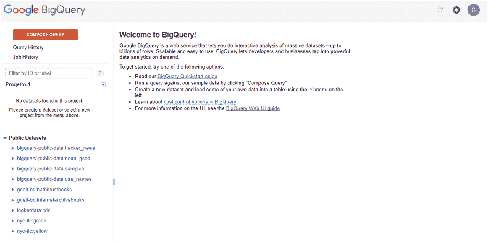

在 BigQuery 控制台中，会显示一条欢迎消息。其中向我们提出了各种活动:

*   阅读 BigQuery 快速入门指南
*   通过单击“编写查询”,对已经可用于实践的样本数据运行查询
*   创建一个新的数据集，并使用左侧的菜单将数据加载到一个表中
*   发现 BigQuery 中的成本控制选项
*   最后，有关用户界面的更多信息，请参考 BigQuery web 用户界面指南

为了详细分析 BigQuery 控制台，我们将选择第二个选项，然后单击左上角的 COMPOSE QUERY 按钮。通过这种方式，将显示如下屏幕截图所示的窗口:

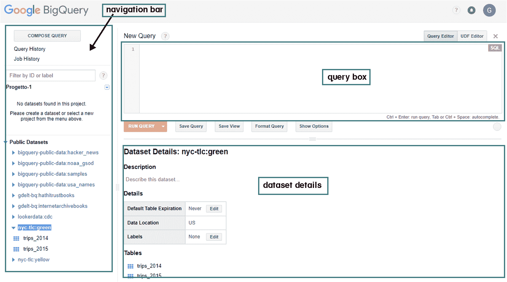

在上一个屏幕截图中，突出显示了两个主要部分:

*   **导航栏**:从顶部开始，它包含一个元素列表，描述您想要执行的操作:编写查询、查询历史或查询作业历史。继续往下，我们可以确定当前项目中具有读访问权限的数据集列表，以及一个名为**公共数据**的公共数据集。这个列表显示了一系列可供我们练习使用的公共数据库。要使用这些数据，只需单击任何数据集旁边的数据集扩展图标或数据集名称，链接就会扩展，我们就可以查看该数据集中的表。
*   **查询框**:表示一个框，您可以在其中键入 SQL 语法的查询。这是窗口的主要部分，因为它代表了我们制定查询的地方。正如预期的那样，为了制定一个查询，有必要使用 SQL 语法，我们在前面的章节中至少已经部分地看到了。当然，在我们将要提出的例子中，我们将有机会深化这个主题。在正确制定了要执行的查询之后，只需单击查询框底部的 Run Query 按钮。
*   **Dataset details** :表示包含我们在导航栏中选择的数据摘要的部分。数据集的名称、其内容的简要描述、一系列细节，最后提出数据集中包含的表。要预览单个表的内容，只需单击表名。

让我们举一个例子来理解 BigQuery 控制台的易用性。我们使用一个可用的公共数据集:

`bigquery-public-data.new_york.tlc_yellow_trips_2015`。

该数据集由纽约市**出租车和豪华轿车委员会** ( **TLC** )收集，包括从 2009 年至今纽约市黄色和绿色出租车完成的所有行程的行程记录，以及从 2015 年至今**出租车辆** ( **FHV** )的所有行程。记录包括捕捉接送日期/时间、接送位置、行程距离、分项费用、费率类型、支付类型和驾驶员报告的乘客计数的字段。

下表列出了数据集中包含的几个字段以及内容的简要描述:

| **字段名** | **简要说明** |
| `vendor_id` | 表示提供记录的 TPEP 提供商的代码。1 =创意移动技术有限责任公司；*2 =威瑞丰公司*。 |
| `pickup_datetime` | 启用血糖仪的日期和时间。 |
| `dropoff_datetime` | 血糖仪脱离的日期和时间。 |
| `passenger_count` | 车内乘客的数量。这是驾驶员输入的值。 |
| `trip_distance` | 出租车计价器显示的行驶里程(英里)。 |
| `pickup_longitude` | 计量表所在的经度。 |
| `pickup_latitude` | 仪表所处的纬度。 |
| `rate_code` | 行程结束时生效的最终薪酬代码。*1 =标准费率*， *2=JFK* ，*3 =纽瓦克*，*4 =拿骚*或*威彻斯特*，*5 =协商票价*，*6 =团体乘车*。 |
| `store_and_fwd_flag` | 该标志指示行程记录在发送给供应商之前是否保存在车辆的存储器中，也称为**存储和转发**，因为车辆没有到服务器的连接。*Y =存储和转发行程；**N =不存储和转发行程*。 |
| `dropoff_longitude` | 仪表脱离的经度。 |
| `dropoff_latitude` | 仪表脱离的纬度。 |
| `payment_type` | 表示乘客如何支付旅行费用的数字代码。*1 =信用卡*，*2 =现金*，*3 =不收费*，*4 =纠纷*，*5 =不明*，*6 =作废行程*。 |
| `fare_amount` | 计价器计算出的时间和路程费用。 |
| `extra` | 杂项额外费用和附加费。目前，这仅包括 0.5 美元和 1 美元的高峰时间和过夜费用。 |
| `mta_tax` | 根据使用的计量费率自动触发的 0.50 美元 MTA 税。 |
| `tip_amount` | 小费金额—该字段自动填充信用卡小费。不包括现金小费。 |
| `tolls_amount` | 行程中支付的所有通行费总额。 |
| `imp_surcharge` | 0.30 美元的改良附加费在落旗处评估行程。改善附加费于 2015 年开始征收。 |
| `total_amount` | 向乘客收取的总额。不包括现金小费。 |

首先，让我们制定一个简单的数据库查询。*2015 年，黄色出租车每月行驶多少次？*此查询必须返回 2015 年所有黄色出租车的每月出行总数。有人可能会认为我们从过于简单的操作开始；事实上，统计每个月的出租车呼叫似乎是微不足道的。对大多数小城市来说是这样，但对像纽约这样的大都市来说就不是这样了。事实上，我们谈论的是一个维度等于 18.1 GB、观察次数等于 146，112，989 的数据库。

让我们看看要插入到查询框中的 SQL 代码:

```
#standardSQL
SELECT
 TIMESTAMP_TRUNC(pickup_datetime,
    MONTH) month,
  COUNT(*) trips
FROM
  `bigquery-public-data.new_york.tlc_yellow_trips_2015`
GROUP BY
  1
ORDER BY
  1
```

让我们一行一行地解释它，以理解所使用的每个命令的含义。让我们从第一行开始:

```
#standardSQL
```

插入第一行是为了让 BigQuery 知道您想要使用 SQL 标准。我们可以为一个查询启用标准 SQL，所以您不必将这个标记插入到您的 SQL 中。为此，只需单击查询框正下方的显示选项按钮。在打开的部分中，取消选中使用传统 SQL 复选框。让我们继续分析查询:

```
SELECT
 TIMESTAMP_TRUNC(pickup_datetime, MONTH) month,
  COUNT(*) trips
```

在这段代码中，我们使用了`SELECT`语句，正如前面几节已经预料到的那样，它从数据库中检索数据。在语句的第一部分，指定要检索的数据。我们已经说过每个月的旅行次数在美国。为此，我们将计算每个月的行数。回想一下，数据库中的每一行都对应一次旅行。包含该信息的字段是`pickup_datetime`。为了以一种易于阅读的格式返回数据，我们使用了截断为`TIMESTAMP`值的`TIMESTAMP_TRUNC`函数(返回值的类型为`TIMESTAMP`)。然后，我们使用`count()`函数返回符合指定标准的行数。让我们继续前进:

```
FROM
  `bigquery-public-data.new_york.tlc_yellow_trips_2015`
```

使用`FROM`子句，我们选择要搜索的表。最后最后两行:

```
GROUP BY
  1
ORDER BY
  1
```

插入这些行是为了对数据进行分组和排序。结果如下表所示:

| **行** | **月** | **行程** |
| --- | --- | --- |
| one | 世界协调时 2015 年 1 月 1 日 00:00:00.000 | Twelve million seven hundred and forty-eight thousand nine hundred and eighty-six |
| Two | 世界协调时 2015 年 2 月 1 日 00:00:00.000 | Twelve million four hundred and fifty thousand five hundred and twenty-one |
| three | 世界协调时 2015 年 3 月 1 日 00:00:00.000 | Thirteen million three hundred and fifty-one thousand six hundred and nine |
| four | 世界协调时 2015 年 4 月 1 日 00:00:00.000 | Thirteen million seventy-one thousand seven hundred and eighty-nine |
| five | 世界协调时 2015 年 5 月 1 日 00:00:00.000 | Thirteen million one hundred and fifty-eight thousand two hundred and sixty-two |
| six | 世界协调时 2015 年 6 月 1 日 00:00:00.000 | Twelve million three hundred and twenty-four thousand nine hundred and thirty-five |
| seven | 世界协调时 2015 年 7 月 1 日 00:00:00.000 | Eleven million five hundred and sixty-two thousand seven hundred and eighty-three |
| eight | 世界协调时 2015 年 8 月 1 日 00:00:00.000 | Eleven million one hundred and thirty thousand three hundred and four |
| nine | 世界协调时 2015 年 9 月 1 日 00:00:00.000 | Eleven million two hundred and twenty-five thousand and sixty-three |
| Ten | 世界协调时 2015 年 10 月 1 日 00:00:00.000 | Twelve million three hundred and fifteen thousand four hundred and eighty-eight |
| Eleven | 世界协调时 2015 年 11 月 1 日 00:00:00.000 | Eleven million three hundred and twelve thousand six hundred and seventy-six |
| Twelve | 世界协调时 2015 年 12 月 1 日 00:00:00.000 | Eleven million four hundred and sixty thousand five hundred and seventy-three |

可以看到，每个月的出行次数从最少的 11130304 次到最多的 13351609 次不等。以下屏幕截图显示了 BigQuery 控制台中的结果:

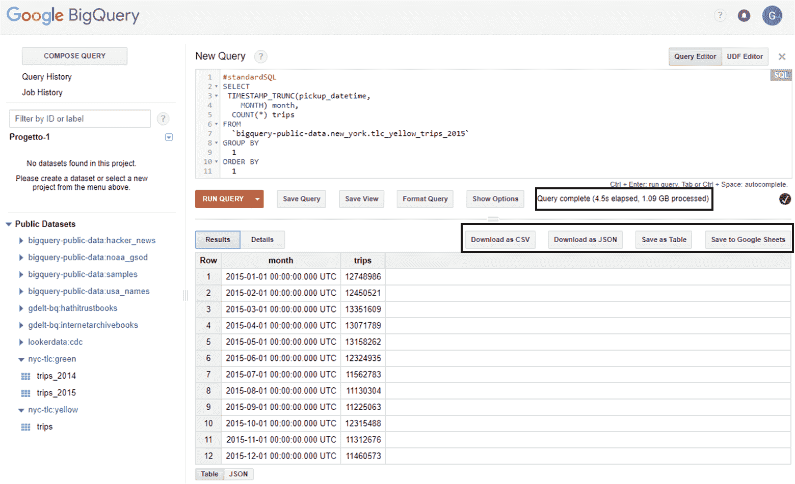

在上一个截图中，突出显示了两个细节:

*   关于计算时间和处理数据的报告
*   一系列结果存储选项

在第一种情况下，BigQuery 告诉我们，为了完成操作，Google 资源已经被提交到 4.5 s，在此期间处理了 1.09 GB 的数据。这些信息将有助于计算交易成本。

在上图中，我们突出显示了可用的存储选项。我们有四种选择:

*   以 CSV 格式下载
*   作为 JSON 下载
*   另存为表格
*   保存到 Google 工作表

如果你还记得，JSON 语法是 JavaScript 语法的一个子集，而 Google Sheets 是一个在线电子表格应用程序，允许用户创建和格式化电子表格，同时与其他人一起工作。

在前面的截图中，可以注意到在结果的顶部有两个选项卡:结果和细节。到目前为止，我们已经看到了 Results 选项卡中返回的内容；让我们看看，如果我们点击细节选项卡，我们会看到什么。执行的操作的一系列统计信息返回给我们，如下所示:

```
Job ID   progetto-1-191608:bquijob_1d181029_1614bc7198f
Creation Time  Jan 31, 2018, 11:33:14 AM
Start Time     Jan 31, 2018, 11:33:15 AM
End Time Jan 31, 2018, 11:33:18 AM
User     xxxxxx@gmail.com
Bytes Processed      1.09 GB
Bytes Billed   1.09 GB
Slot Time (ms) 153 K
Destination Table    progetto-1-191608:_b6e2bd761c7590ee099d343a7b87889c01400431.anond9ac14f20bd65f3658af2aa65b7b8847b7d677be
Use Legacy SQL false
```

该信息再次引用我们执行的查询和获得的结果。


# 使用 Google Data Studio 可视化数据

Google Data Studio 是一个免费的工具，它可以让我们快速轻松地创建迷人的报告。我们终于可以告别冗余和混乱的数据表了。事实上，使用 Data Studio，除了能够插入简单的表格之外，还可以附加各种颜色和字体的可定制图形，以便于理解。有了 Google Data Studio，共享报告甚至更容易，因为它是一个 Google Drive 应用程序，工作方式类似。

对公司来说最重要的消息(但也是，如果不是最重要的，对客户来说)在于极其直观的界面。此外，为了让一切都在控制之下，谷歌提供了改变日期范围的可能性(在报告或图表级别)。

点击几下，其实就可以几乎实时的实现网站的进度。Data Studio 对两种类型的用户很有用:

*   **谁创建报告**:分析和营销员工
*   谁将阅读这些报告:客户和公司的首席执行官

Google Data Studio 目前处于测试阶段，允许您创建具有强烈视觉冲击力的动态报告和仪表板。使用 Data Studio，可以:

*   轻松连接到不同的数据源
*   使用动态、交互式、引人注目的报告和仪表板查看您的数据
*   遵循 Google Drive 上使用的逻辑，与他人分享和协作

要使用 Data Studio 查看报告，必须满足以下要求:

*   你只需要一个网络浏览器(测试过的有:Chrome、Firefox 和 Safari)。
*   你不需要谷歌账户。

创建报表和数据源时，必须满足以下要求:

*   你需要登录谷歌账户
*   你需要在受支持的国家之一(换句话说，除了这些国家之外的所有国家:中华人民共和国、俄罗斯、斯瓦尔巴群岛和扬马延、伊朗、伊拉克、克里米亚、朝鲜、叙利亚、古巴)
*   你需要能够使用谷歌驱动

数据源使用管道来保护被称为**连接器**的数据集。当 Data Studio 第一次连接到特定类型的数据集(如 Google Analytics 或 AdWords)时，会要求您提供连接权限，这可以随时删除。此时，要连接某一类型的数据集，比如对于 Google Analytics，可以只连接一个账号，一个属性，一个视图；对于 AdWords，您连接到管理员或标准帐户；对于 BigQuery，您提供一个项目和一个表或一个定制查询，等等。


# 在 Data Studio 中创建报告

首先，让我们来看看在 Data Studio 中立即创建一个报告的第一步是什么。要能够使用 Data Studio，不需要填写任何注册表格；你只需要有一个有效的谷歌账户。如果你已经登录了谷歌账户，只需在浏览器中输入以下网址:[https://datastudio.google.com/](https://datastudio.google.com/)。

这将把您直接带到 Data Studio 主页，如下面的屏幕截图所示:

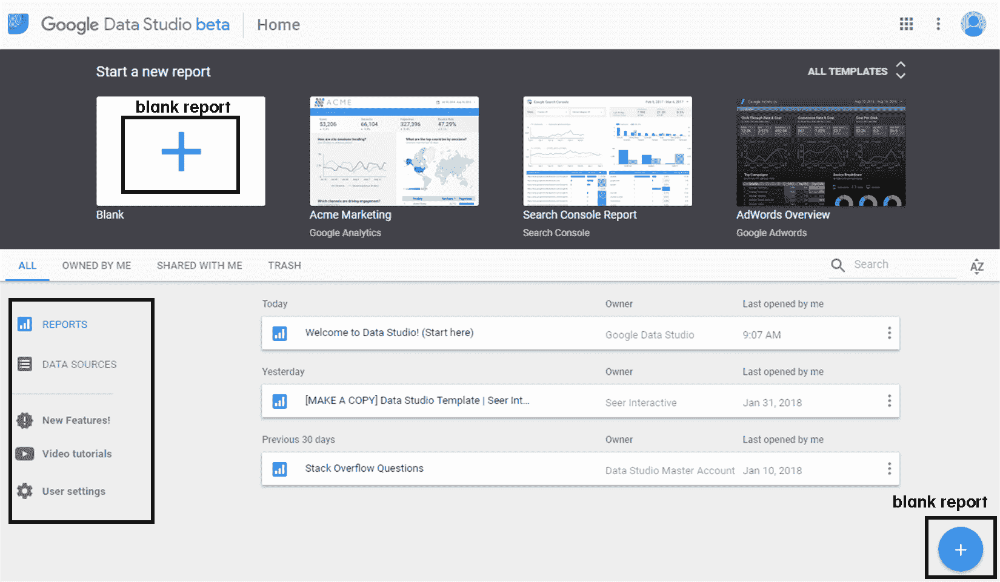

一旦您查看了 Data Studio 的主页，我们就可以确定一些有助于我们创建报告的部分(在前面的屏幕截图中，它们被突出显示)。为了开始熟悉 Data Studio 界面，我们可以参考一些已经可用的内置模板。您可以选择一个现有的模型并对其进行修改，或者直接从一个新的空白报表开始。

单击所有型号下拉菜单，显示所有内置模板。通过这种方式，我们可以选择任何符合我们需求的模型，并使用可用的编辑器对其进行修改，以使其适应我们的需求。预定义模板对于入门者或那些没有时间花在格式设置上的人来说很有用。事实上，在这些模型中，功能已经可以使用，因此节省了大量时间。

为了有效地理解如何使用 Data Studio，我们将从一个空报告开始，以便解释创建报告所需的所有步骤。创建新报告有两种方式:

*   单击水平标题上的空白加号(+)页面(空白)
*   单击右下角的(+)图标

在上图中，两个选项都被清楚地突出显示，并且在这两种情况下，都会显示如下屏幕所示的窗口:

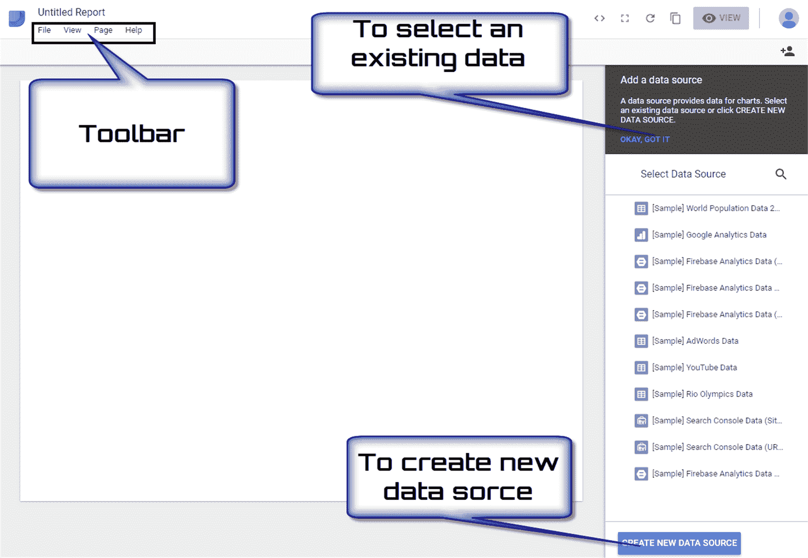

这将显示报表编辑器，其中包含添加图表和数据以及选择报表样式所需的所有控件和元素。最初，新报告在屏幕的左上角有一个默认名称(`Untitled Report`)，所以只需单击它，我们将为报告输入一个新名称(`First Report`)。

首先要做的是向报表添加一个数据源。为此，我们又有两个选择:

*   现有的数据源
*   创建新数据源

在前面的屏幕截图中，突出显示了可以激活选项的两个区域。您可能会注意到，练习所建议的数据源已经在数据源选择器的底部可用了。在这种情况下，我们将参考这些资源。例如，要选择引用`[Sample] World Population Data 2005-2014`的第一个项目，只需点击它。该数据集包含 2005 年至 2014 年的世界人口数据。在这种情况下，将显示如下屏幕截图所示的窗口:

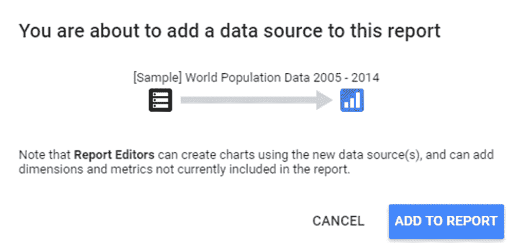

单击 ADD TO REPORT 按钮后，Data Studio 的主窗口中增加了新的组件:

*   **菜单栏**:这允许你通过右击一个组件来访问许多其他菜单功能。
*   **工具栏**:这允许你在各种工具、页面和控制选项中进行选择。该工具栏分为五个部分。
*   **布局和主题属性面板**:我们可以使用该面板中的选项控制您的报告在查看器屏幕上的显示方式。这是默认的属性面板；当没有选择其他组件时，它会出现。

在下面的屏幕截图中，您可以看到报告图的新方面:

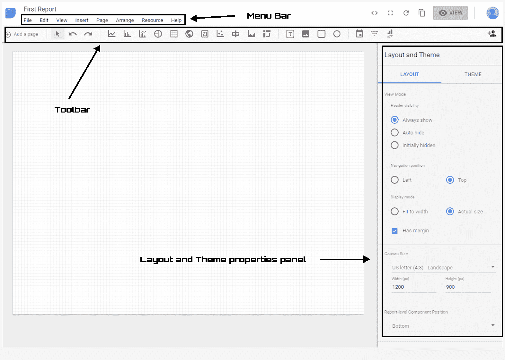

要在我们的空报告页面中添加图表，只需单击工具栏中的一个图标。例如，添加一个从 2005 年到 2014 年的世界人口条形图就足够了:

1.  单击工具栏(条形图)第三个区域中的第二个图标
2.  将取景器定位在页面上您希望显示图形的位置
3.  在标题下绘制图形，要移动它，只需单击并拖动它，或者选择它，并使用键盘上的箭头键

完成后，我们的数据的条形图将出现在主区域中，右侧的布局和主题属性面板将让位于条形图属性面板，如下面的屏幕截图所示:

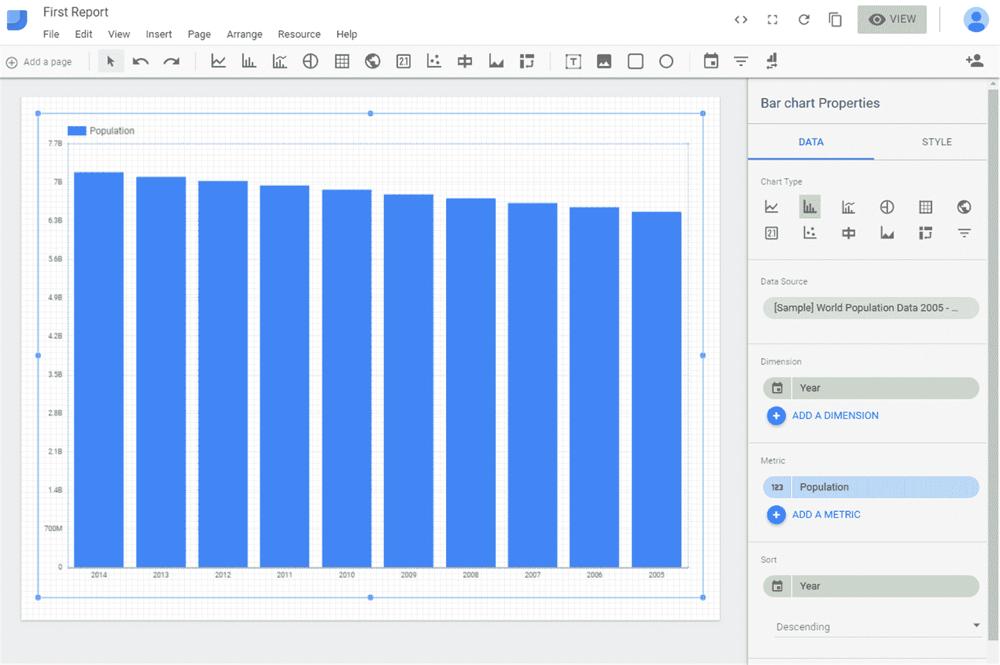

条形图属性面板对于更改刚刚添加到报告中的图表变得非常重要。事实上，我们可以更改图表的类型、更改数据源、添加另一个维度、添加新的指标，以及更改数据的排序。

Data Studio 不允许整个仪表板或多个报告采用`.pdf`或其他格式。尽管可以以 CSV 格式导出单个表格或图表。要导出图表或表格:

*   单击右上角的“查看”选项卡，以查看模式查看报告
*   将鼠标悬停在要导出的图表或报告上
*   右键单击并选择导出 CSV

要将整个仪表板导出为 PDF，还没有添加任何内部功能来帮助您将报告导出为`.pdf`。但是通过使用 chrome 扩展，你可以很容易地做到这一点(Google Data Studio PDF Export)。将报告导出为 PDF 的另一种方法是通过浏览器打印为 PDF。您必须对每个报告页面都这样做。


# 摘要

在本章中，将介绍 BigQuery 和 Data Studio 平台来管理和查看数据。首先，我们探讨了大数据以及与管理大量数据相关的问题。然后，我们分析了如何以结构化格式组织数据以正确查询数据库。

在这之后，您开始接触 SQL。SQL 是一种定义和操作数据的语言。作为一种操作语言，SQL 允许从数据库中选择感兴趣的数据并更新其内容。这些查询既用于数据定义的 SQL 结构，也用于更新数据库的 SQL 结构。

然后执行 Google BigQuery 介绍。BigQuery 是一个 web 服务，支持对大规模数据集进行交互式分析。BigQuery 使世界各地的公司和开发人员能够实时管理大量数据，而无需任何硬件或软件投资的支持。

最后，我们分析了如何使用 Google Data Studio 根据我们的数据创建报告。Google Data Studio 是一个免费的工具，它让我们能够快速、轻松地创建迷人的报告。使用 Data Studio，除了能够插入简单的表格之外，还可以使用易于理解的各种颜色和字体附加可定制的图形。

在下一章中，我们将介绍 Dataprep a 服务，用于预处理数据、提取特征和清理记录，以及 Dataflow a 服务，以实现流和批处理。