# 五、转换您的数据

真实世界的数据集是多种多样的:变量可以是文本的、数字的或分类的，观察值可以是缺失的、错误的或错误的(异常值)。为了执行正确的数据分析，我们将了解如何正确地解析数据，清理数据，并创建为机器学习分析而优化构建的输出矩阵。为了提取知识，读者必须能够使用不同的数据分析和清理技术创建一个观察矩阵。

在这一章中，我们将介绍 Cloud Dataprep，这是一个用于预处理数据、提取特征和清理记录的服务。我们还将介绍云数据流，这是一种实现流和批处理的服务。我们将通过现实生活中的例子来探讨一些实际的细节。我们将从发现转换数据的不同方法和清理数据的程度开始。我们将分析为分析和建模准备最合适数据的可用技术，包括缺失数据的插补、检测和消除异常值以及添加衍生变量。然后，我们将学习如何规范化数据，其中数据单元被消除，使我们能够轻松地比较来自不同位置的数据。

在本章中，我们将讨论以下主题:

*   不同的数据转换方式
*   如何组织数据
*   处理缺失数据
*   检测异常值
*   数据标准化

在本章的最后，我们将能够执行数据准备，以便其信息内容最好地暴露给回归工具。我们将学习如何将转换方法应用于我们自己的数据，以及这些技术是如何工作的。我们将发现如何清理数据、识别缺失数据以及处理异常值和缺失条目。我们还将学习如何使用标准化技术来比较来自不同位置的数据。


# 如何清理和准备数据

新手可能会认为，一旦我们完成了数据收集并将其导入到 Google Cloud 中，就终于到了开始分析过程的时候了。反过来，首先要进行数据的准备(数据扯皮)。

数据争论是数据转换和映射的过程，将原始数据转换为格式化数据，目的是使其更适合后续的分析操作。

这一过程可能需要很长时间，而且非常繁琐，在某些情况下会占用整个数据分析过程的 80%左右。

然而，它是数据分析工作流其余部分的基本先决条件；因此，获得这些技术的最佳实践是至关重要的。在将我们的数据提交给任何机器学习算法之前，我们必须能够评估我们观察的质量和准确性。如果我们不知道如何从原始数据转换到可以分析的数据，我们就无法前进。


# 谷歌云数据准备

为了正确准备我们的数据，有必要执行一系列涉及使用不同算法的操作。正如我们所预料的，这项工作可能需要很长时间，并使用许多资源。云服务中的 Google 提供了一种简单快捷的方式来完成这项工作:Google Cloud Dataprep。

这是一种智能数据服务，允许您直观地探索、清理和准备结构化和非结构化数据分析。Google Cloud Dataprep 是无服务器的，可以在任何规模上工作。没有必要分布或管理任何基础设施。

Google Cloud Dataprep 有助于快速准备数据，用于即时分析或训练机器学习模型。通常，必须手动清理数据；然而，Google Cloud Dataprep 通过自动检测模式、类型、连接和异常(如缺失值)使这个过程变得极其简单。关于机器学习，提出了不同的数据清理方式，这些方式可以使数据准备过程更快并且更不容易出错。

在 Google Cloud Dataprep 中，可以通过与数据样本进行交互来定义数据准备规则。该应用的使用是免费的。一旦定义了数据准备流，您可以免费导出样本，或者将该流作为云 Dataprep 作业运行，这将需要额外的成本。

使用 Google Cloud Dataprep，您可以执行以下操作:

*   从不同来源导入数据
*   识别并删除或修改丢失的数据
*   识别异常值(异常值)
*   从数据集中执行搜索
*   规范化数据集中字段的值
*   用连接合并数据集
*   通过合并操作将一个数据集添加到另一个数据集

这些操作可以在非常短的时间内完成，而不需要技术基础设施。


# 探索 Dataprep 控制台

首次登录 Google Cloud Dataprep 控制台时，系统会要求您接受服务条款，登录您的 Google 帐户，并选择一个云存储桶来使用 Cloud Dataprep。您还将被要求允许第三方应用主机 Trifacta 访问项目数据。完成这些步骤后，您将看到 Cloud Dataprep 主页，其中打开了流屏幕，如下面的屏幕截图所示:


现在，控制台看起来是空的，因为我们还没有执行任何操作；稍后将由我们的操作填充。在 Google Cloud Dataprep 控制台的顶部，您可以找到打开以下页面的三个链接:

*   **流**:该页面显示您有权访问的流，并允许您创建、查看和管理它们。流是允许我们收集和组织数据集以生成结果的对象。
*   **数据集**:在此页面中，我们可以查看我们有权访问的导入和引用数据集。
*   **作业**:在这个页面中，我们可以跟踪所有正在运行、已完成或失败的作业的状态。

默认情况下，流页面是打开的。要创建新的流，请单击“创建流”按钮。将打开以下窗口，我们可以在其中为新流设置名称和描述:

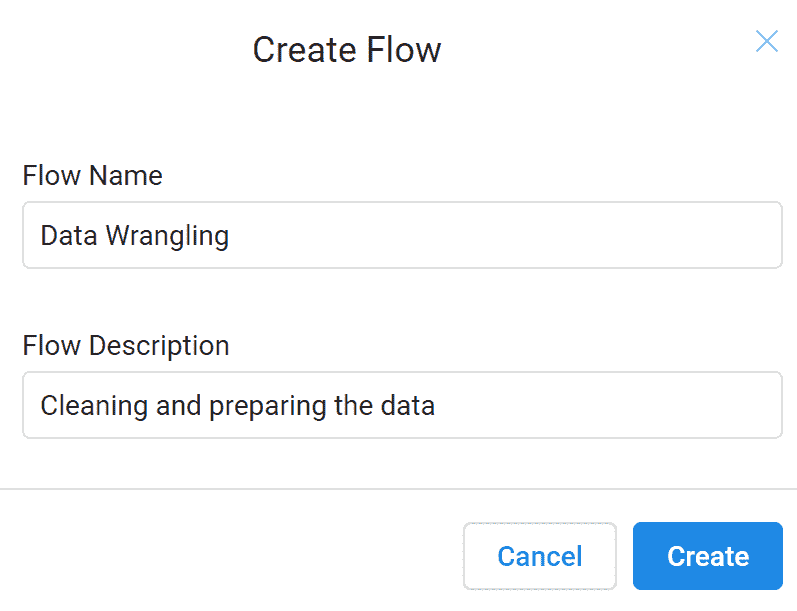

完成此操作后，在流页面上，刚刚创建的新流会出现，并建议可以将数据集添加到此流中，以便开始讨论。为了分析 Google Cloud Dataprep 示例是如何工作的，我们将使用一个特别设计的文件，该文件包含一个小观察样本的数据；它列出了测试的结果。我们将获取`CleaningData.csv`，一个包含我们刚刚列出的一些问题的电子表格。在我们的计算机上正确识别该文件并上传后，将显示以下窗口(transformer 页面):

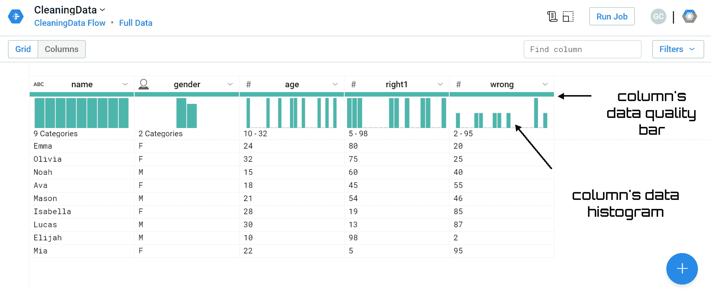

在此页面中，我们可以轻松识别已导入的数据。在这一点上，我们可以对我们想要应用于这些数据的转换进行编程。一旦我们确定了我们想要做的事情，我们就可以在对整个最终数据集进行更改之前立即预览结果。

在 Transformer 页面中，有两个面板可用:网格和列。默认情况下，Transformer 页面会显示“网格”面板，其中会显示列网格中各列的预览。在 columns 面板中，返回关于各个列的附加统计信息。此面板对于管理异常值、查看平均值、最小值和最大值特别有用。

从 transformer 页面的第一眼，您就可以了解我们已经导入的数据。事实上，我们可以查看所有字段和所有观察值。

在这里，我们上传了一个只有几个字段和观察值的文件。更一般地说，在左下部分，给出了行数、列数和数据类型的汇总。

从对返回窗口的分析中，我们可以提取有用的信息。从每列的名称开始，在每列的左侧会出现一个符号，用于标识自动归属于该列的数据类型。通过这种方式，我们可以验证 Dataprep 已经将变量编目如下:

*   `name`:名称(字符串)
*   `gender` : Sex(性别)
*   `age`:年龄(整数)
*   `right1`:正确答案的百分比(整数)
*   `wrong`:错误答案的百分比(整数)

看来数据类型的归属是正确的。使用光标将这些信息返回给我们。事实上，当您在页面上移动光标时，光标会在所选数据元素上发生变化。紧接着列标题，有有用的摘要图表。在列的数据质量栏中，显示了值的类别。有以下三种类型的值可用:

*   有效的
*   不匹配的
*   错过

然后，显示直方图，为我们提供每一列中包含的数据的统计信息。将光标移到它上面，进一步的信息就会返回给我们。

由于值很少，我们还可以预览所有数据。让我们看看如何直观地识别异常。我们已经可以看到年龄变量缺少一个值。任何类型变量的缺失值都由 NA 代码表示，这意味着不可用。另一方面，**不是数字** ( **南**)代码表示无效的数值，例如被零除的数值。如果变量包含缺失值，GCP 无法对其应用某些函数。因此，有必要提前处理丢失的值。

在 transformation 页面上，您可以看到当您将鼠标悬停在区域和相关面板上时，光标旁边会出现一个灯泡图标，表示建议是可用的。

在每个列标题的左侧，您可以看到一个下拉列菜单。在此菜单的帮助下，我们可以对列数据执行一些操作，如根据列数据类型更改其数据类型。以下是可用的操作:

*   重命名:重命名列
*   更改类型:更改列的数据类型
*   移动:将列移动到数据集中的开头或结尾，或者移动到指定的位置
*   编辑列:对列执行一系列编辑
*   列详细信息:浏览列详细信息的交互配置文件
*   显示相关步骤:突出显示配方面板中引用所选列的步骤
*   查找:查找并替换特定值，或者从列中提取模式值
*   Filter:根据列中的文字值或计算值筛选数据集的行
*   清除:清除列中不匹配或缺失的值，用固定值或计算值替换值，或者完全删除行
*   公式:生成一个新列，其中包含根据所选函数从源列计算出的值
*   汇总:基于跨组汇总的计算生成汇总表，或将汇总数据作为新列添加到当前表中
*   重构:根据列的值更改数据集的结构
*   Lookup:根据另一个数据集的另一列中的一组值来执行列值的查找
*   删除:从数据集中删除列

以下屏幕截图显示了性别列的列菜单:

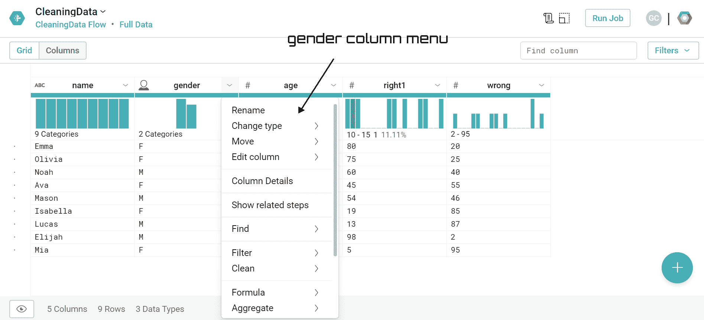

当选择一个列时，会在 Transformer 页面的右侧打开一个新的建议面板。该面板显示了与特定列中包含的数据类型相关的一系列建议。建议因所选数据而异。通过将鼠标悬停在任何建议上，您可以在数据网格中预览结果，以确保建议的转换适用于数据集。在下一节中，我们将能够扩展建议面板的用途。


# 删除空单元格

通过对导入数据的可视化分析，我们在第三行第二列检测到一个空单元格；这表明存在缺失值。在分析数据集之前，有必要消除这种异常。

在这种情况下，给定少量的数据，识别空单元特别容易；在大型数据集的情况下，可视化分析不起作用。因此，为了识别缺失值，我们可以分析数据质量棒。这里，丢失的值用黑色标识。

要预览丢失数据的数量，我们可以将光标移到数据质量栏的黑色部分；将返回缺失数据的数量，如下面的屏幕截图所示:

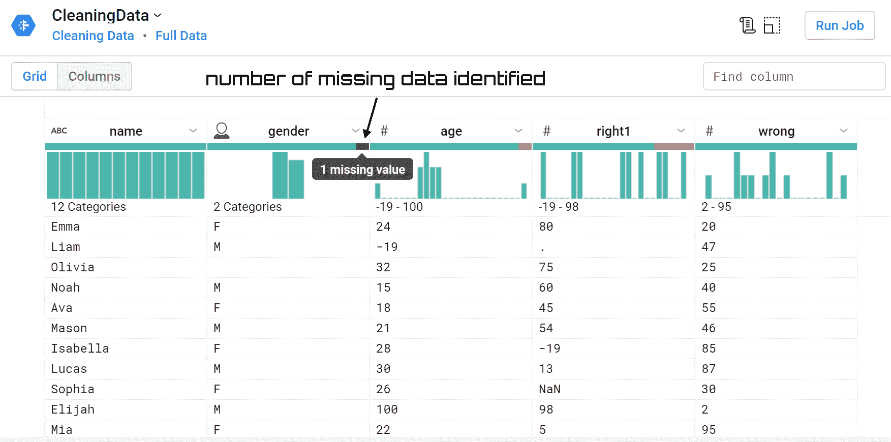

我们已经确认性别字段中存在缺失值。回想一下，缺失值是指不包含任何内容或不存在的值。这些缺失值可能是由一系列事件造成的:

*   创建数据集时出错；输入的值不正确，留下了空单元格
*   数据集包含由不包含值的单元格自动创建的字段
*   不可能计算的结果

现在，如果我们选择性别列，一个新的建议面板将在 Transformer 页面的右侧打开。如前一节所述，该面板显示了与特定列中包含的数据类型相关的一系列建议。提出了几项建议:

*   删除列
*   重新命名
*   聚合和分组数据
*   创建新列
*   一组
*   列的值

当我们将鼠标悬停在不同的建议上时，每个建议的左侧会出现一个小预览，如下面的屏幕截图所示:

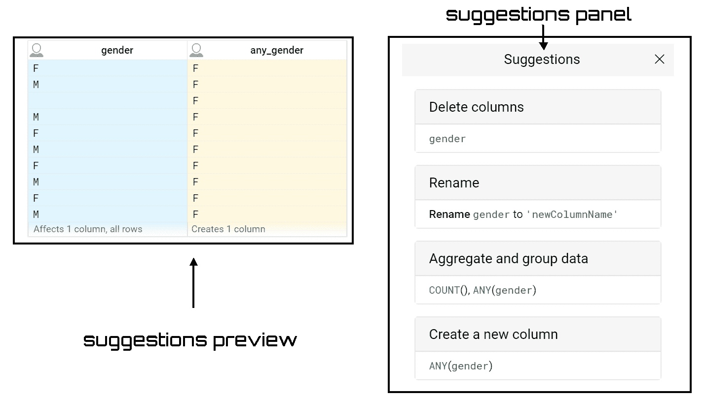

在“建议”面板中，会出现一个名为“缺少的值”的特定文本，这意味着该列中标识的缺少的值可以替换为其他值。点击器械包项目，会出现两个按钮:编辑和添加。点击编辑按钮，打开一个新的对话框；在此框中提出一个新公式如下:

```
ifmissing($col, '')
```

如果源值为 null 或缺少值，missing 函数将写出指定的值。在引号之间插入`NA`字符串后，每当在列中发现一个缺少的值时，它将被替换为`NA`值。在修改了公式之后，我们将能够看到由所应用的公式修改的列的实时预览；如下图所示:

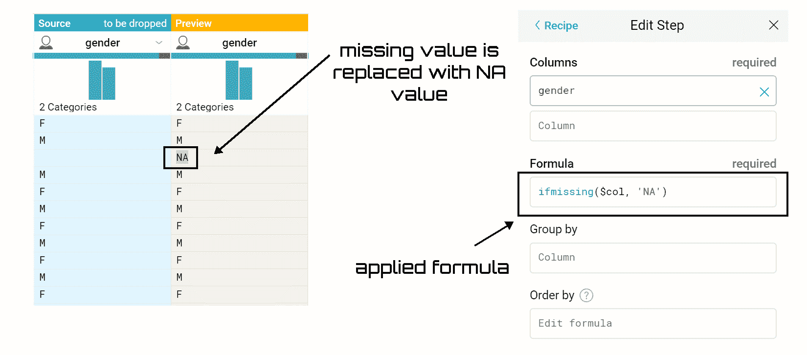

现在，要应用这个建议，只需点击建议面板中的添加按钮。这样，一个新的步骤将被添加到配方面板中。

请注意，Recipe 面板允许我们查看和修改到目前为止我们已经创建的配方的步骤，但同时，它也允许我们添加新的步骤。如果面板未显示，只需点击运行作业按钮左上方的图标(配方)即可使其出现。

要在不同的列上生成一组新的建议，请单击“取消”。然后，选择一组不同的列或列中的值。这样，将会打开一个新的建议面板。


# 替换不正确的值

下一步将允许我们更换不正确的值指示器。如果我们再次查看数据，我们会看到在 age 列中，显示了值`-19`。这显然是一个不正确的值，因为对于该变量，允许值大于零(这是一个年龄):

```
24 -19 32 15 18 21 28 30 26 100 22 NA
```

我们可以用缺失值指示器`NA`来替换这个值。为此，我们将在集合建议中编写以下公式:

```
IF($col<0, 'NA',$col)
```

在前一部分创建的步骤之后，一个新的步骤将立即添加到 Recipe 面板中。同时，我们可以预览对数据集所做的更改。不正确的值不再存在；在它的位置，有一个更进一步的`NA`值。

直接在配方面板中操作也可获得相同的结果:

1.  请记住，要打开配方面板，您只需点击运行作业按钮左上角的图标(配方)
2.  点击新建步骤按钮；将打开转换构建器
3.  在“转换”下拉菜单中，选择可用转换列表中的“应用公式”
4.  指定列(年龄)
5.  编辑公式框中所需的公式
6.  点击添加按钮
7.  配方面板中添加了一个新步骤

在下面的屏幕截图中，我们可以看到转换构建器:

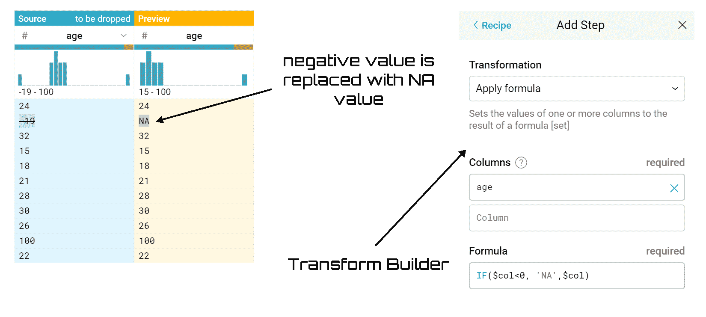

获得的结果与我们通过在集合建议中编写公式获得的结果相同；即使在这种情况下,“年龄”列中也不会再出现负值。


# 不匹配的值

不匹配的值是指与为该列指定的数据类型不同的任何值。在我们现在分析的数据库中，有几个值似乎偏离了列的类型。例如，右列中的单元格包含一个点；很明显，这是填充数据库阶段的一个错误。同样清楚的是，这样一个值在分析阶段会导致许多问题，这就是为什么它必须被适当地处理。

正如对于缺失值所看到的，不匹配的值也显示在每列顶部的数据质量栏中。在数据质量栏中，不匹配的值以红色标识，如以下屏幕截图所示:

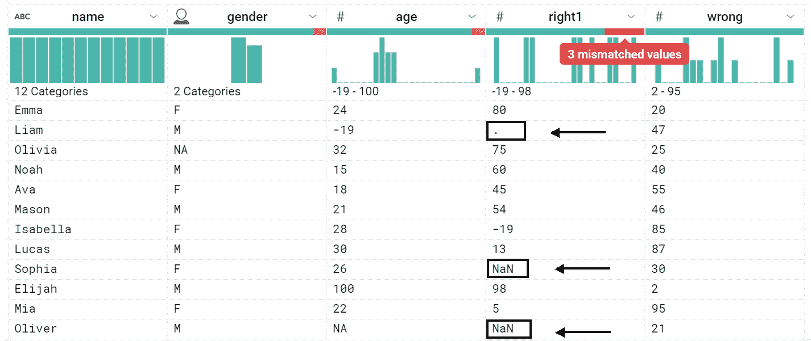

要修复不匹配的数据，有几个选项可用:

*   更改数据类型
*   用常数值替换这些值
*   用其他列的值设置这些值
*   用函数转换数据
*   删除行
*   暂时隐藏该列
*   删除该列

在这种情况下，由于所选的两行在其他列中也包含不匹配的数据，因此我们将删除所有三列。为此，只需在建议面板的删除行区域单击添加按钮。

分析数据集，我们可以看到不匹配的数据仍然存在。事实上，年龄列中的数据质量栏有一个红色区域。我们也试图解决这个问题。这一次，删除整行是不合适的。事实上，通过分析第一列，我们可以看到,`NA`值引用了一行，该行的名称显然是指一个女性(Olivia)。所以最合适的解决方案是用一个已知值替换这个值，在本例中是用`'F'`。

为此，我们将在“建议”面板的“设置”项中编写以下公式:

```
ifmismatched($col, ['Gender'], 'F')
```

一个新的步骤将被添加到配方面板。我们可以再次预览对数据集所做的更改。事实上，我们可以看到错误的值不再存在；在它的位置，有一个`'F'`。

我们到目前为止调整了几个东西，但是乍一看，还是有事情要做的。如果我们注意右 1 列，它代表提供的正确答案的百分比，我们注意到值的范围如下:-19 到 98。但是-19 显然是一个不正确的值，因为对于该变量，允许的值在 0 到 100 之间(这是一个百分比)。我们可以假设在创建数据集时错误地添加了一个减号。然后我们可以修改这个值，只留下值 19。

为此，我们执行以下步骤:

1.  打开制作方法面板。只需点击运行作业按钮左上角的图标(配方)。
2.  单击“新建步骤”按钮。将打开转换构建器。
3.  在转换下拉菜单中，选择可用转换列表中的应用公式。
4.  指定列(右侧)。
5.  在公式框中编辑以下公式:
6.  `IF($col==-19,19,$col)`
7.  点击添加按钮。
8.  配方面板中添加了一个新步骤。

我们添加到配方面板的操作有五个，如屏幕截图所示:

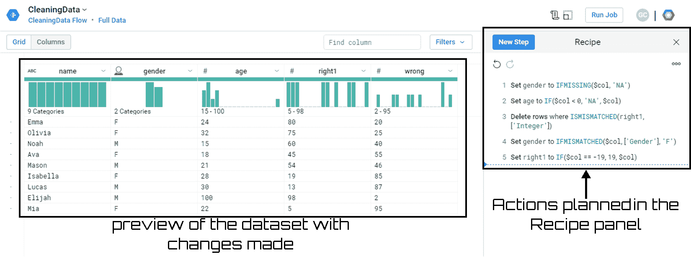

通过分析 Recipe 面板，我们可以对数据集上计划的操作进行总结。此外，对进行了更改的数据集预览的视觉分析没有显示任何要修复的异常。在每列顶部的数据质量栏中，没有突出显示红/黑区，尽管现在开派对还为时过早！数据准备工作远未完成。


# 发现数据中的异常值

异常值是指与其他值相比特别极端的值(明显远离其他可用观测值的值)。异常值的存在会造成障碍，因为它们往往会扭曲数据分析的结果，特别是在描述性统计和相关性中。理想的做法是在数据清理阶段识别这些异常值；然而，它们也可以在数据分析的下一步中处理。异常值可以是单变量的，当它们具有单个变量的极值时，或者是多变量的，当它们具有多个变量的值的异常组合时。

异常值是分布的极值，其特征是与分布的其余部分相比非常高或非常低，因此代表相对于分布的其余部分的孤立情况。

有不同的方法来检测异常值。Google Cloud Dataprep 使用 Tukey 的方法，该方法使用**四分位间距** ( **IQR** )方法。该方法不依赖于数据的分布，并且忽略了受异常值影响的平均值和标准偏差。

如前所述，要确定异常值，请参考第 25 个百分位数和第 75 个百分位数之差给出的 IQR，即其所在范围的幅度。这 50%的观察值占据了有序数据系列的中心位置。异常值是与第 75 百分位的正偏差大于两倍 IQR 的值，或者对称地，与第 25 百分位的负偏差(绝对值)大于两倍 IQR 的值。

实际上，异常值是以下两者之一:

```
< (25th percentile) - (2 * IQR)
> (75th percentile) + (2 * IQR)
```

为了识别单个列中的异常值，Google Cloud Dataprep 具有可视化功能和统计信息。


# 视觉功能

之前，我们已经讨论过每一列顶部的直方图。此图形显示列中检测到的每个值的计数(对于字符串数据)或数值范围内的值的计数(对于数值数据)。

Google Cloud Dataprep 提供的可视化功能正是指使用这些直方图来识别异常值或异常值，在对整个数据集执行任何分析之前，应该删除或纠正这些异常值或异常值。

返回的直方图类型取决于列中包含的数据类型。事实上，对于数字数据，每个条形都表示一个数值范围，并且条形按数字顺序排序。对于分类类型，每个竖线代表一个值，按出现频率最高的值排序。

将鼠标移动到直方图的某一条上，会返回一系列信息。通过这种方式，我们可以突出显示特定的值，获得某个值的计数以及该值在列中值的总计数中所占的百分比。我们也可以选择一个特定的酒吧；在这种情况下，包含这些值的行将被突出显示，并显示建议面板来管理这些值。

要同时选择不同的条形:

*   使用 *Ctrl* +单击选择多个条形
*   单击并拖动一系列条块

为了更好地理解这种可视化功能的有用性，让我们参考一个例子。特别是，我们将分析在前面章节中已经使用过的数据集，我们已经有机会对其进行修改。让我们来看一下年龄列，因为它目前显示在预览版中，更改已经生效。我们可以看到，柱状图左侧有四个柱，右侧只有一个孤立的柱。这种特殊形式的直方图识别异常值的存在，如下面的屏幕截图所示:

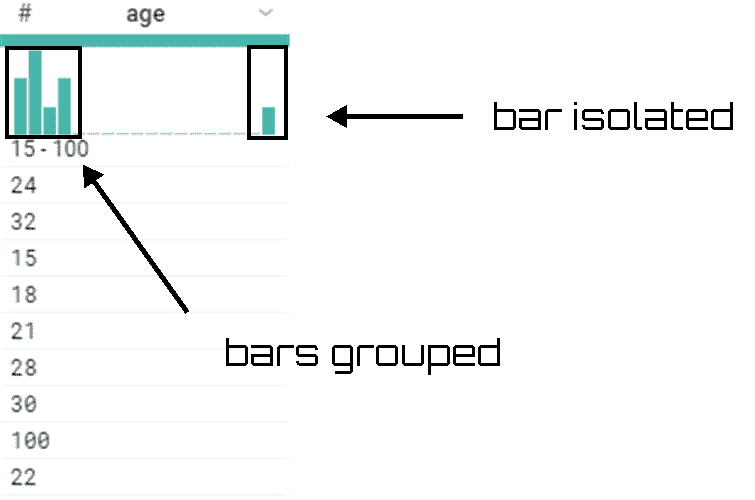

在这种情况下，异常值的存在是明显的；更一般地说，在图的两端出现孤立的柱线必须提醒我们。

如果数据集包含异常值的多个实例，则有必要进一步调查。通常，如果数据集包含大量异常值，则在执行修改或删除这些行的操作之前，有必要检查这些值及其在其他列中的数据，因为这些值的删除可能会变得具有统计意义。


# 统计信息

到目前为止，我们所做的可视化分析并不允许我们在某些情况下容易地识别异常值的存在。要获得更多信息，我们可以检查当前所选列中值的详细统计信息，包括列细节面板中的异常值数据。要打开列详细信息面板，只需从一列的下拉菜单中选择列详细信息；将打开以下面板:

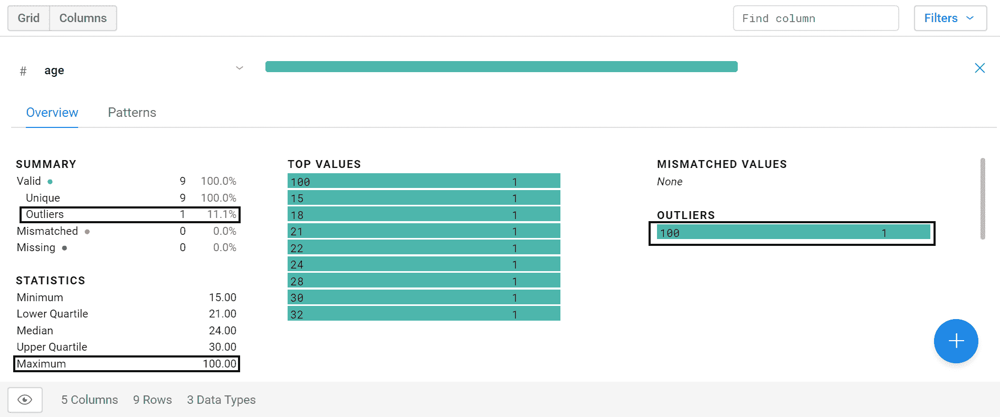

在该面板中，可以获得许多信息，其中一些如下:

*   Summary 统计有效值(唯一值和异常值)、不匹配值和缺失值的数量
*   统计学意味着你有很多选择，如最小值、最大值、平均值、最低和最高四分位数、中值和标准差
*   值直方图
*   最高值
*   极端值

在这种情况下，任何异常值都会被清楚地识别和指出。此外，直方图现在更加精确，清楚地显示了条形的排列。


# 移除异常值

到目前为止，我们已经看到了识别可能的异常值的不同技术。鉴定完之后我们该怎么做？在确定列中的异常值后，您需要确定这些值对于数据集是有效还是无效。

如果这些是由于数据集填充阶段的错误而导致的无效值，那么我们必须纠正它们。该操作可能涉及用一个可能有效的值替换该值，或者删除整行。在后一种情况下，我们必须注意这个操作对整个数据集的影响。

为了替换值`100`，它在我们看来在所有方面都是无效的值(也许它是`10`并且添加了一个额外的零)，我们可以插入以下公式:

```
IF(($col == 100),10, $col)
```

相反，如果删除该记录在统计上不重要，我们可以采用简单的擦除指令，如下所示:

```
DELETE row: age == 100
```

如果数据似乎有效(现实中，人类 100 岁是可能的)，我们可以让它保持原样。或者我们可以把它转换成一个在我们看来更有统计学意义的值。例如，我们可以决定用整列的平均值替换这个值，以便至少保留从其他列中得到的这个观察值的信息。要用列的平均值替换 100，请使用以下公式:

```
if($col > 80, average($col), $col)
```

最终我们选择了第一个选项，因此年龄列中的`100`将被替换为`10`。为此，我们在一个新步骤中插入(一如既往地)刚刚提出的公式，如下面的屏幕截图所示:

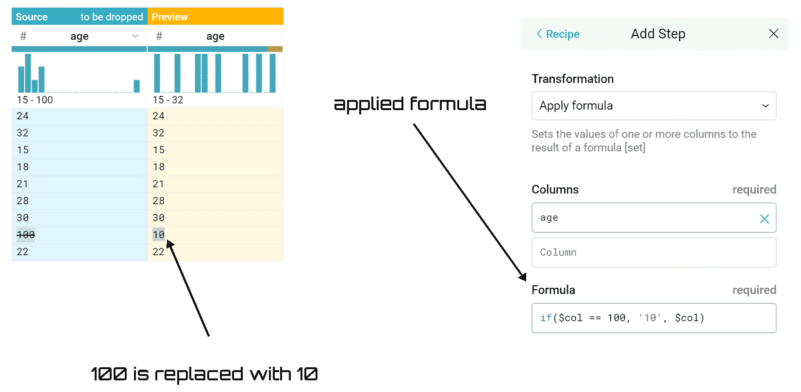

要查看所做更改的预览，请单击添加按钮，一个新步骤将被添加到我们的配方面板中。在屏幕截图中，我们还可以验证，现在值的范围已经明显缩小:10 到 32，而不是 15 到 100。不仅如此，直方图的末尾也不再有孤立的条形。


# 运行作业

我们已经计划了对数据库的几项操作:是时候进行这些更改了。为此，只需单击 Transformer 页面上的 Run Job。这样，将会打开“运行作业”页面，我们可以在其中为当前加载的数据集指定转换和分析作业。可用选项包括输出格式和输出目的地。

Profile Results 选项允许我们生成可视化的结果配置文件。可视化概要文件对于检查我们的配方和迭代的问题非常有用，即使这是一个需要大量资源的过程。如果我们正在处理的数据集很大，禁用结果分析可以提高作业的整体执行速度。

正确设置可用选项后，我们只需单击 Run Job，即可将指定的作业排队等待执行。完成后，作业将排队等待处理。在该过程结束时，您可以使用“数据集详细信息”页面查看成功运行的结果。

流处理时间取决于服务器的可用性和数据集的大小。在我们的例子中，数据集非常小，所以我们只需等待服务变得可用。单击“查看结果”在“作业结果”页面上打开作业，如以下屏幕截图所示:

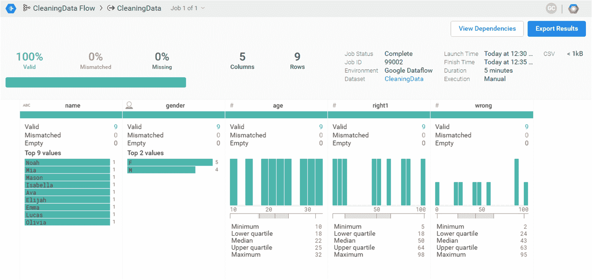

在前面的屏幕截图(作业结果页面)中，可以查看转换方案对整个数据集的影响。我们提供了统计数据和数据直方图，让您全面了解我们的转换配方的质量。

在左侧截图的顶部，您可以找到一系列关于生成的数据集中包含的数据的摘要信息。特别是，显示了有效值、不对应值和缺失值的计数。这些值在整个数据集内完整显示。

关于所执行工作的一系列摘要信息总是出现在屏幕截图的上半部分，但这次您可以在右侧找到它。

在屏幕截图的下半部分，我们可以看到对单个列进行转换的细节。根据列的数据类型，会显示有关变量的信息。

最后，在屏幕截图的上半部分，右侧，有两个按钮:

*   **查看依赖关系**:查看作业所依赖的配方和数据集
*   **导出结果**:导出结果


# 特征比例

数据缩放是通常在特征选择和分类之前采用的预处理技术。许多基于人工智能的系统使用由许多不同的特征提取算法产生的特征，这些特征具有不同种类的来源。这些特征可以具有不同的动态范围。常用的距离测量方法(如欧几里德距离)隐含地为范围较大的要素分配了比范围较小的要素更多的权重。因此，需要特征缩放来近似均衡特征的范围，并使它们在相似性计算中具有近似相同的效果。

此外，在具有大量具有大动态范围的特征的若干数据挖掘应用中，特征缩放可以提高拟合模型的性能。然而，恰当地选择这些技术是一个重要的问题。这是因为对输入应用缩放可能会改变数据的结构，从而影响数据挖掘中使用的多变量分析的结果。

到目前为止，我们已经对数据进行了处理，以纠正任何错误或遗漏。我们可以说，在这一点上，数据集中包含的所有变量都具有完整一致的数据。用不同范围和单位表征的不同变量呢？数据框中可能存在变量，其中一个要素的值范围为 1 到 10，另一个要素的值范围为 1 到 1，000。

在此类数据框中，由于数值范围较大，数值范围较大的特征对响应变量的影响可能大于数值范围较小的特征，这又会影响预测精度。我们的目标是提高预测的准确性，并且不允许某个特定的特征由于较大的数值范围而影响预测。因此，我们可能需要调整不同特性下的值，使它们落在一个共同的范围内。通过这种统计程序，可以比较属于不同分布的相同变量，也可以比较不同的变量，或者以不同单位表示的变量。两种方法通常是众所周知的重新调整数据:正常化和标准化。

请记住，在训练机器学习算法之前，重新调整数据是一种很好的做法。通过重新缩放，消除了数据单元，使您可以轻松比较不同位置的数据。


# 最小-最大标准化

最小-最大归一化(通常称为**特征缩放**)对原始数据进行线性变换。该技术获取范围(0，1)内的所有缩放数据。实现这一点的公式如下:


最小-最大归一化保留了原始数据值之间的关系。拥有这个有界范围的代价是，我们最终会得到更小的标准差，这可以抑制异常值的影响。

为了更好地理解如何执行最小-最大归一化，只需分析一个例子。我们将使用包含在`Airquality.csv`文件中的数据集。

该数据集可在 UCI 机器学习知识库(一个大型数据集合)中获得，链接如下:[https://archive.ics.uci.edu/ml/index.php](https://archive.ics.uci.edu/ml/index.php)。
S. De Vito，E. Massera，M. Piga，L. Martinotto，G. Di 法兰克王国，*关于城市污染监测场景中用于苯估计的电子鼻的现场校准*，传感器和执行器 B:化学，第 129 卷，第 2 期，2008 年 2 月 22 日，第 750-757 页，ISSN 0925-4005，网址:[https://www . science direct . com/science/article/pii/s 0925405](https://www.sciencedirect.com/science/article/pii/S0925400507007691)

以下是 1973 年 5 月 1 日(星期二)至 1973 年 9 月 30 日的每日空气质量读数:

*   臭氧:罗斯福岛 13:00 至 15:00 时的平均臭氧含量，单位为十亿分之一
*   **太阳能。R** :中央公园 0800 至 1200 时 4000–7700 埃波段的太阳辐射
*   **风**:拉瓜迪亚机场 0700 和 1000 时的平均风速，单位为英里/小时
*   **Temp** :拉瓜迪亚机场每日最高温度，单位为华氏度

数据来自纽约州自然保护部(臭氧数据)和国家气象局(T1)或 NWS T2(T3)(气象数据)。

一个数据帧由 6 个变量的 154 个观测值组成:

| **名称** | **类型** | **单位** |
| 臭氧 | 数字的 | (美)十亿分之一(Parts Per Billion) |
| 太阳的 | 数字的 | 语言 |
| 风 | 数字的 | 每小时英里数 |
| 临时雇员 | 数字的 | 华氏度 |
| 月 | 数字的 | 1 到 12 岁 |
| 一天 | 数字的 | 1 至 31 岁 |

可以看出，这六个变量以不同的测量单位为特征。正如我们在前面几节中所做的，即使在这种情况下，我们也通过从流屏幕创建一个新流来开始准备数据，然后我们将`.csv`文件导入到 Google Cloud Dataprep 中。将打开以下窗口:

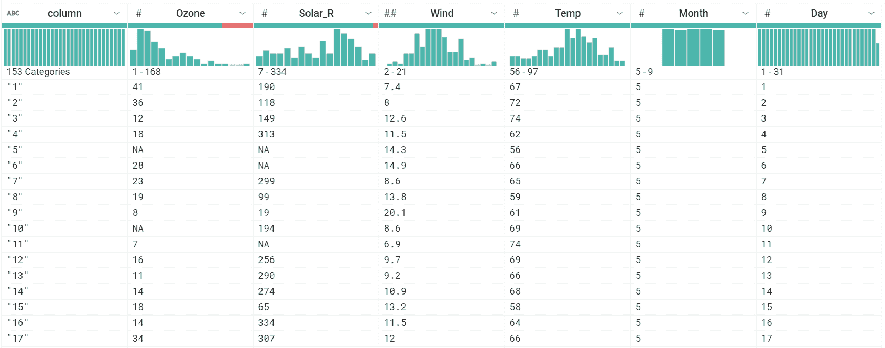

正如我们所预料的，四个变量有不同的测量单位，这意味着值的范围是非常不同的。事实上，通过分析前面截图中每一列的上部，我们可以获得以下范围:

*   **臭氧** : 1 到 168
*   **太阳能。R** : 7 到 334
*   **风** : 2 到 21
*   **温度** : 56 到 97

在进行标准化之前，我们消除了数据质量栏中突出显示的一些问题。已识别出不匹配的值。准确地说:

*   **臭氧** : 37 个不匹配值
*   **太阳能。R** : 7 个不匹配的值

首先，我们将尝试修复这些问题，就像我们在上一节中学到的那样。

我们从臭氧柱开始。我们继续点击数据质量栏的红色区域。这样，所有 37 个不匹配的值都会突出显示。同时，窗口右侧会打开建议面板。特别是，第一个建议建议我们删除臭氧中值不匹配的行。我们只需点击添加按钮。以下行将添加到配方面板中:

```
Delete rows where ISMISMATCHED(Ozone, ['Integer'])
```

我们对`Solar_R`列执行相同的操作；以下行将添加到配方面板中:

```
Delete rows where ISMISMATCHED(Solar_R, ['Integer'])
```

在这两种情况下，预览窗口显示数据中现在没有不匹配的值。在这一点上，我们可以考虑正常化。正如我们前面所指出的，变量的范围变化很大。我们希望通过最小-最大归一化来消除这一特征。如前所述，为了应用这个程序，我们必须计算每个变量的最小值和最大值。为此，我们可以应用 Google Cloud Dataprep 中可用的两个函数:`MIN`和`MAX`。

Google Cloud Dataprep 支持大多数桌面电子表格包中常见的功能。函数可用于创建操作列中数据的公式。

以前，我们已经提出了归一化的公式；为了将它应用到一个列，我们执行以下步骤:

1.  在配方面板中，点击新建步骤按钮。记得吗？要打开配方面板，只需点击运行作业按钮左上角的图标(配方)。
2.  从“转换”下拉菜单中，选择“应用公式项”(此项将一列或多列的值设置为公式的结果)。
3.  例如，从列框中选择臭氧列(相同的过程可应用于所有数据集变量)。
4.  在公式框中，编辑以下公式:`(Ozone-MIN(Ozone))/(MAX(Ozone)-MIN(Ozone))`
5.  只需点击添加按钮。

以下语句被添加到配方面板:

```
Set Ozone to (Ozone-MIN(Ozone))/(MAX(Ozone)-MIN(Ozone))
```

对于其他三个变量，我们遵循相同的过程:`Solar_R`、`Wind`和`Temp`。最后，我们将在配方面板中添加以下几行:

```
Set Solar_R to (Solar_R -MIN(Solar_R))/(MAX(Solar_R)-MIN(Solar_R))
Set Wind to (Wind -MIN(Wind))/(MAX(Wind)-MIN(Wind))
Set Temp to (Temp -MIN(Temp))/(MAX(Temp)-MIN(Temp))
```

转换器页面已更改如下:

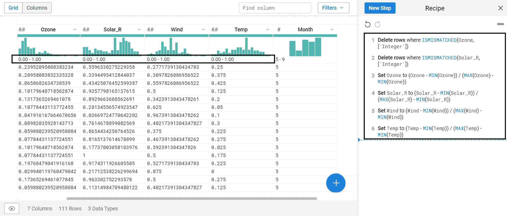

很明显，现在数据都在 0 和 1 之间；数据集的每一列都会发生这种情况，每个变量也会发生这种情况。因此，由于测量单位不同而产生的比例差异已被消除。


# z 分数标准化

该技术包括从列中的每个值中减去列的平均值，然后将结果除以列的标准偏差。实现这一点的公式如下:

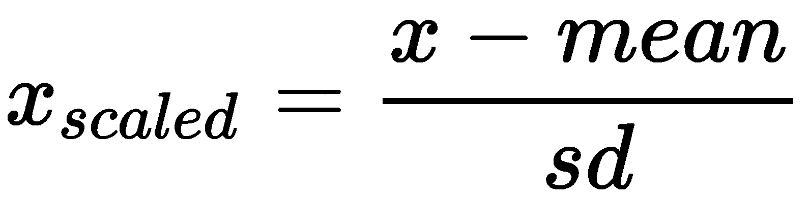

标准化的结果是要素将被重新缩放，从而具有标准正态分布的属性，如下所示:

*   *μ=0*
*   *σ=1*

μ是平均值， *σ* 是平均值的标准偏差。

简而言之，z 得分(也称为**标准得分**)代表观察点或数据的值与观察或测量的平均值不同的标准偏差的数量。大于平均值的值具有正的 z 分数，而小于平均值的值具有负的 z 分数。z 得分是一个无量纲的量，通过从单个粗略得分中减去总体平均值，然后将差值除以总体的标准差来获得。

同样，为了标准化数据，我们将使用用于最小-最大标准化的相同程序。这一次，这两个功能更改如下:

*   `AVERAGE`:计算每列的平均值
*   `STDEV`:计算每列的标准偏差

要执行 z 得分标准化，只需分析用于最小-最大归一化的相同数据集。我指的是名为 Airquality.csv 的数据集，它包含了从 1973 年 5 月 1 日(星期二)到 1973 年 9 月 30 日的以下空气质量值的每日读数。

要对数据集列应用 z 分数标准化，请执行以下步骤:

1.  在配方面板中，点击新建步骤按钮。同样，要打开配方面板，只需单击运行作业按钮左上角的图标(配方)。
2.  从转换下拉菜单中，选择应用公式(此项将一个或多个列的值设置为公式的结果)。
3.  从列框中，选择臭氧列(相同的程序可应用于所有数据集变量)。
4.  在“公式”框中，编辑以下公式:
5.  `(Ozone- AVERAGE(Ozone))/STDEV(Ozone)`
6.  只需点击添加按钮。

以下语句被添加到配方面板:

```
Set Ozone to (Ozone- AVERAGE(Ozone))/STDEV(Ozone)
```

对于其他三个变量，我们遵循相同的过程:`Solar_R`、`Wind`和`Temp`。最后，我们将在配方面板中添加以下几行:

```
Set Solar_R to (Solar_R - AVERAGE(Solar_R))/STDEV(Solar_R)
Set Wind to (Wind - AVERAGE(Wind))/STDEV(Wind)
Set Temp to (Temp - AVERAGE(Temp))/STDEV(Temp)
```

转换器页面已更改，如下所示:

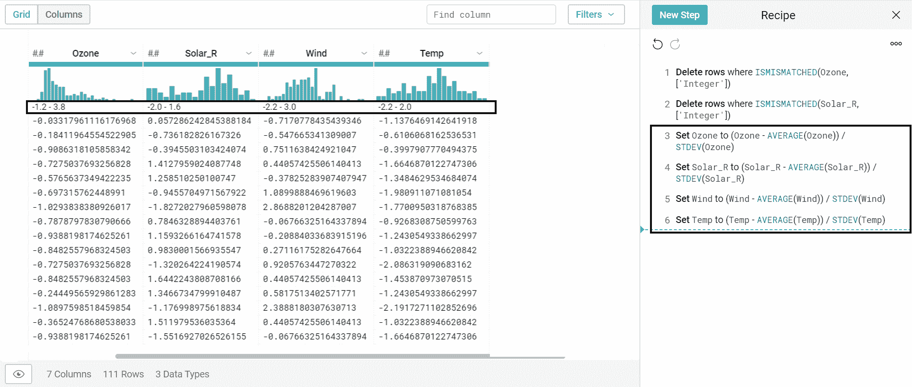

z 分数标准化所做的修改是显而易见的:数据范围非常相似。数据集的每一列都会发生这种情况，然后每个变量也会发生这种情况。因此，由于测量单位不同而产生的比例差异已被消除。

根据假设，所有变量都必须有`average= 0`和`stdev =1`。我们来验证一下。为此，只需使用 Column Details 面板中可用的统计信息，这些信息已经在前面的章节中使用过了。要打开列详细信息面板，请从列的下拉菜单中选择列详细信息。将打开以下面板:

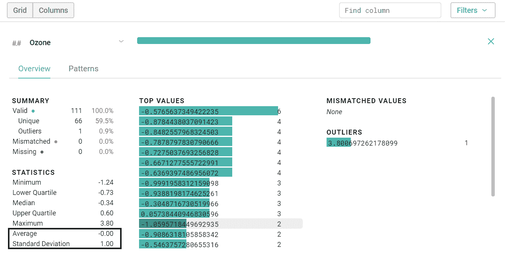

因此，我们已经验证了臭氧变量的平均值为 0，标准差为 1。可以对其他变量执行相同的检查。


# 谷歌云数据流

Google Cloud Dataflow 是一项完全托管的服务，用于创建数据管道，以批处理和流模式转换、丰富和分析数据。Google Cloud Dataflow 从数据中提取有用的信息，降低运营成本，而没有实现、维护或调整数据基础架构的麻烦。

流水线是一组串联的数据处理单元，其中一个单元的输出是下一个单元的输入。实现数据流水线以增加吞吐量，即在给定时间内执行的指令数量，从而并行化多个指令的处理流程。

通过适当地定义过程管理流，可以在从数据中提取知识的过程中节省大量资源。由于采用了无服务器的方法来提供和管理资源，Dataflow 提供了几乎无限的容量来解决最严重的数据处理问题，但您只需为您使用的资源付费。

Google Cloud Dataflow 自动供应和管理处理资源，以减少延迟时间并优化利用率。不再需要手动激活或保留实例。自动和优化的分区允许动态地重新分配挂起的作业。您不需要使用键盘快捷键或预处理您的输入数据。Cloud Dataflow 使用 Apache Beam SDK 中的富于表现力的 Java 和 Python APIs 支持快速简化的管道开发。

云数据流作业按每分钟计费，基于工人在批处理模式或云数据流中的实际使用。使用云存储或云发布/订阅等其他 GCP 资源的作业将根据相应服务的价格计费。


# 摘要

在这一章中，我们探索了 Google Cloud Dataprep，这是一个用于预处理数据、提取特征和清理记录的服务。我们用现实生活中的例子来探讨实际的细节。我们从查看云应用接口开始，以发现访问平台所需的一些初步信息。然后，我们分析了可用于准备最适合分析和建模的数据的技术，包括缺失数据的插补、异常值的检测和剔除以及错配值的处理。我们发现了不同的方法来转换数据和清理数据的程度。然后，我们学习了如何规范化我们的数据，其中数据单元被消除，使我们能够轻松地比较来自不同位置的数据。