# 六、基本机器学习

到目前为止，在前面的章节中，我们已经介绍了 GCP 的各种 ETL 过程。在本章中，我们将通过以下主题开始我们的机器学习和深度学习之旅:

*   机器学习的应用
*   监督和非监督机器学习
*   主要机器学习技术综述
*   数据分割
*   衡量模型的准确性
*   机器学习和深度学习的区别
*   深度学习的应用

# 机器学习的应用

机器学习包含一套从历史数据中学习的技术。基于从历史数据中学习到的模式，机器学习技术预测事件在未来数据集中发生的概率。鉴于机器学习的工作方式，这套技术有多种应用。让我们在接下来的章节中探索其中的一些。

# 金融服务

金融领域的一些应用如下:

*   识别贷款/信用卡申请人的风险
*   估计给定客户的信用额度
*   预测卡交易是否是欺诈交易
*   确定营销活动需要瞄准的客户群
*   预测客户在未来几个月内是否可能违约
*   推荐客户应该购买的合适的金融产品

# 零售业

以下是零售行业中不同机器学习技术的一些应用:

*   预测客户可能购买的下一件产品
*   估计给定产品的最佳价位
*   预测一段时间内产品的销售数量
*   通过捆绑促销产品来锁定客户
*   估算客户终身价值

# 电信行业

以下是机器学习在电信行业的几个应用:

*   在通话开始前预测掉话的可能性
*   预测客户是否可能在未来几个月内流失
*   确定可以销售给客户的每月使用的附加产品
*   识别不太可能为后付费服务付费的客户
*   提高现场工作效率的劳动力优化

# 监督和非监督机器学习

受监督的机器学习由一系列技术组成，这些技术致力于建立一个近似函数的模型。该函数接受一组输入变量(也称为自变量),并尝试将输入变量映射到输出变量(也称为因变量或标签)。

假设我们知道我们试图预测的标签(或值)，对于一组输入变量，该技术变成了监督学习问题。

类似地，在无监督学习问题中，我们没有需要预测的输出变量。然而，在无监督学习中，我们试图将数据点分组，以便它们形成逻辑组。

如下图所示，可以在高层次上区分监督学习和非监督学习:

在上图中，监督学习方法可以区分两个类，如下所示:

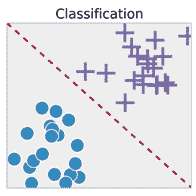

在监督学习中，有两个主要目标可以实现:

*   预测事件发生的概率—分类
*   估计连续因变量的值—回归

有助于分类的主要方法如下:

*   逻辑回归
*   决策图表
*   随机森林
*   梯度推进
*   神经网络

除了这些(除了逻辑回归)，线性回归也有助于估计一个连续变量(回归)。

虽然这些技术有助于估计连续变量或预测事件发生的概率(离散变量预测)，但无监督学习有助于分组。分组可以是行(这是一种典型的聚类技术)或列(一种降维技术)。行分组的主要方法有:

*   k 均值聚类
*   分层聚类
*   基于密度的聚类

列分组的主要方法有:

*   主成分分析
*   **t-分布式随机邻居嵌入** ( **t-SNE** )

行分组可以识别数据集中的客户细分(观察)。

列分组会减少列的数量。当自变量的数量很大时，这就很方便了。通常，在这种情况下，构建模型时可能会出现问题，因为需要估计的权重数量可能会很高。此外，在解释模型时可能会有问题，因为一些独立变量可能彼此高度相关。在这种情况下，主成分分析或 t-SNE 就派上了用场，在这种情况下，我们可以减少自变量的数量，而不会丢失数据集中的太多信息。

在下一节中，我们将概述所有主要的机器学习算法。

# 机器学习技术综述

在对主要的机器学习技术进行概述之前，让我们先来看看我们希望在回归技术或分类技术中进行优化的函数。

# 回归中的目标函数

在回归练习中，我们估计连续变量的值。在这样的情景中，我们的预测可以低于实际值，也可以高于实际值；也就是说，误差值可以是正的，也可以是负的。在这种情况下，目标函数转化为最小化数据集中每个观测值的实际值和预测值之间的差值的平方和。

用数学术语来说，前面写的如下:

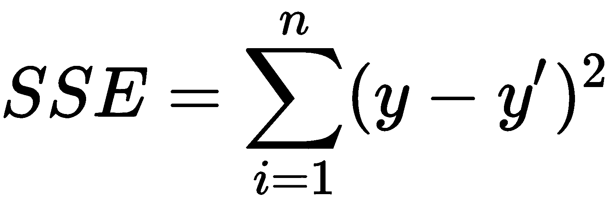

在给定的等式中:

*   *SSE* 代表*误差平方和*
*   *y* 指因变量的实际值
*   *y’*是因变量的估计值
*   ∑指数据集中所有观测值的误差平方和

给定目标函数，让我们了解线性回归在高层次上是如何工作的。

# 线性回归

在线性回归中，我们假设自变量和因变量之间存在线性关系。线性回归表示如下:

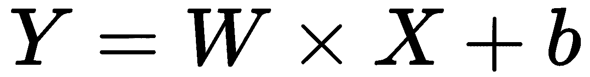

在给定的等式中:

*   *Y* 是因变量
*   *W* 是与自变量 *X* 相关的权重
*   *b* 是截距值

如果有多个自变量(假设有两个自变量， *x1* 和 *x2* ，等式如下:

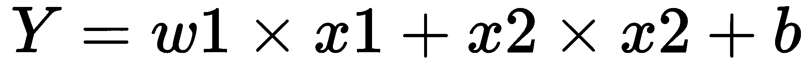

在给定的等式中:

*   *w1* 是与变量 *x1* 相关的权重
*   *w2* 是与变量 *x2* 相关的权重

典型的线性回归如下，其中 *x* 轴为自变量， *y* 轴为因变量:

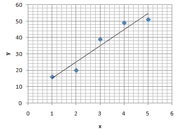

直线(有一定的斜率和截距)就是线性回归的方程。

请注意，图中的线是使总平方误差最小的线。

# 决策图表

决策树是一种帮助我们从数据中推导出规则的技术。基于规则的技术非常有助于解释模型在估计因变量值时应该如何工作。

典型的决策树如下所示:

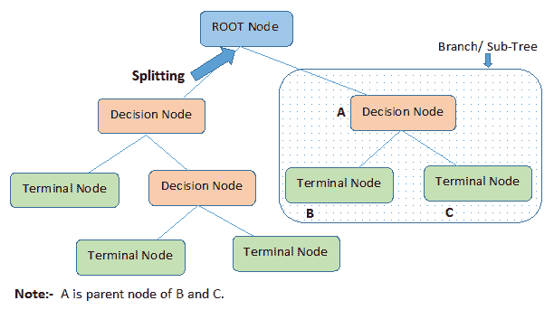

上图解释如下:

*   **根节点:**代表整个总体或样本，并进一步分为两个或更多的节点。
*   **拆分**:将一个节点按照一定的规则划分成两个或两个以上子节点的过程。
*   **决策节点:**当一个子节点分裂成更多的子节点时，称为**决策节点。**
*   **叶子/终端节点:**决策树中的最后一个节点是叶子或终端节点。
*   **剪枝:**当我们删除一个决策节点的子节点时，这个过程叫做**剪枝**。你可以说这是分裂的相反过程。
*   **分支/子树:**整棵树的一个子部分称为**分支**或**子树**。
*   **父节点和子节点:**被划分为子节点的节点被称为子节点的**父节点**，而子节点是父节点的子节点。

给定一个因变量和一个自变量的值，我们将使用以下数据集来了解决策树的工作原理:

| **var2** 中的一个 | **响应** |
| `0.1` | `1996` |
| `0.3` | `839` |
| `0.44` | `2229` |
| `0.51` | `2309` |
| `0.75` | `815` |
| `0.78` | `2295` |
| `0.84` | `1590` |

在前面的数据集中，变量`var2`是输入变量，变量`response`是因变量。

在决策树的第一步，我们将输入变量从最低到最高排序，并测试多个规则，一次一个。

在第一种情况下，数据集的所有具有小于`0.3`的`var2`值的观察值属于决策树的左节点，而其他观察值属于决策树的右节点。

在回归练习中，左节点的预测值是属于左节点的所有观察值的`response`变量的平均值。类似地，右节点的预测值是属于右节点的所有观察值的平均值`response`。

给定左节点的预测值和属于右节点的观测值的不同预测值，可以为左节点和右节点中的每一个计算平方误差。一个可能规则的总误差是左右节点的误差平方和。

所实现的决策规则是在所有可能的规则中具有最小平方误差的规则。

# 随机森林

随机森林是决策树的扩展。它是一个森林，因为它是多棵树的组合，并且是随机的，因为我们对每个决策树的不同观察进行随机采样。

随机森林的工作方式是平均每个决策树的预测(对原始数据集的样本进行处理)。

通常，随机森林比单个决策树工作得更好，因为离群值的影响在其中减少了(因为在一些样本中，离群值可能没有出现)，而在决策树中，离群值肯定会出现(如果原始数据集包含离群值)。

# 梯度推进

虽然随机森林在构建多个平行树的框架中工作，但梯度提升采用了不同的方法——构建深度框架。

梯度提升中的梯度指的是实际值和预测值之间的差异，提升指的是改善，即在不同的迭代上改善误差。

梯度推进还利用了决策树以下列方式工作的方式:

*   建立一个决策树来估计因变量
*   计算误差，即实际值和预测值之间的差异
*   构建另一个预测错误的决策树
*   通过考虑先前决策树的误差预测来更新预测

通过这种方式，梯度增强不断地构建决策树，该决策树预测先前决策树的误差，从而在梯度增强中构建基于深度的框架。

# 神经网络

神经网络提供了一种逼近非线性函数的方法。通过在加权输入变量的总和上应用激活函数来实现非线性。

神经网络看起来像这样:

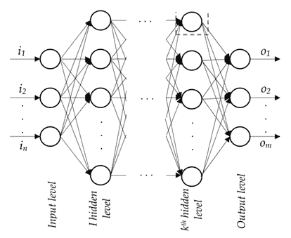

输入层包含输入，隐藏层包含加权输入值的总和，其中每个连接都与一个权重相关联。

非线性应用于隐藏层。典型的非线性激活函数可以是 sigmoid、tanh 或整流线性单位。

输出级别与和每个隐藏单元相关联的权重总和相关联。通过以最小化总平方误差值的方式调整权重，获得与每个连接相关的权重的最佳值。神经网络如何工作的更多细节将在后面的章节中提供。

# 逻辑回归

如前所述，逻辑回归用于根据输入数据集将预测分类到一个类别或另一个类别。逻辑回归使用 sigmoid 函数来获得事件发生的概率。

sigmoid 曲线看起来像这样:

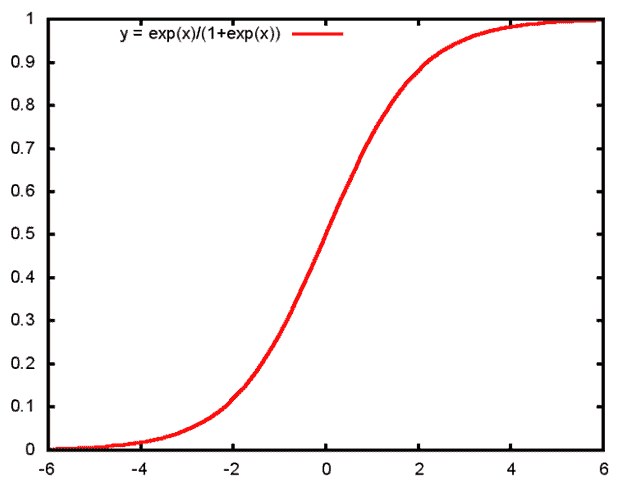

请注意，当 *x* 轴值大于 3 时，输出为高概率，当 *x* 轴值小于 3 时，输出为极低概率。

逻辑回归在激活函数的使用上不同于线性回归。线性回归方程是 *Y = a + b * X* ，逻辑回归方程是:

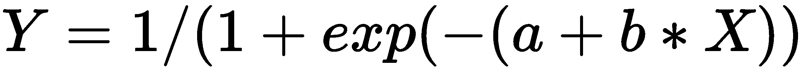

# 分类中的目标函数

在回归技术中，我们最小化总体平方误差。然而，在分类技术中，我们最小化总体交叉熵误差。

二元交叉熵误差如下:

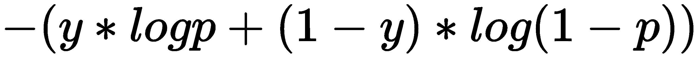

在给定的等式中:

*   y 是实际的因变量
*   p 是事件发生的概率

对于分类练习，所有前面的算法都有效；只是目标函数改为交叉熵误差最小化，而不是平方误差。

在决策树的情况下，属于根节点的变量是与所有其他独立变量相比提供最高信息增益的变量。信息增益被定义为当树被给定变量分裂时，与没有分裂相比，总熵的改善。

# 数据分割

在任何机器学习模型上工作时需要解决的一个关键问题是:*一旦在未来的数据集上实现生产，该模型能有多精确？*

不可能马上回答这个问题。然而，获得最终从模型构建中获益的商业团队的认可是非常重要的。在这种情况下，将数据集划分为训练数据集和测试数据集非常方便。

训练数据集是用于构建模型的数据。测试数据集是模型看不到的数据集；也就是说，数据点不用于构建模型。本质上，人们可以将测试数据集视为将来可能出现的数据集。因此，我们在测试数据集上看到的准确性很可能就是模型在未来数据集上的准确性。

典型地，在回归中，我们处理泛化/过拟合的问题。当模型非常复杂，以至于可以完美地拟合所有数据点时，就会出现过拟合问题，从而导致最小的错误率。过拟合数据集的典型示例如下:

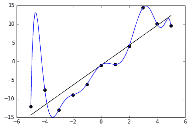

从图表数据集中，可以观察到线(黑色)并不完全符合所有的数据点，而曲线(蓝色)完全符合这些点，因此在它被训练的数据点上具有最小的误差。

但是，与新数据集中的曲线相比，该线更有可能具有更高的概化能力。因此，在实践中，回归/分类是模型的可推广性和复杂性之间的权衡。

模型的概化程度越低，看不见的数据点的错误率就越高。

这种现象可以在下图中观察到。随着模型复杂性的增加，看不见的数据点的错误率不断降低，直到某一点，之后又开始增加:

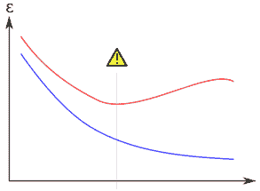

蓝色曲线是训练数据集的错误率，红色曲线是测试数据集的错误率。

验证数据集用于获得模型的最佳超参数。例如，在随机森林或 GBM 等技术中，需要构建的树的数量或树的深度是一个超参数。随着我们不断改变超参数，看不见的数据集的准确性也在改变。

然而，我们不能继续改变超参数，直到测试数据集的精度达到最高，因为我们在这种情况下会看到实际的未来数据集(测试数据集)。

在这种情况下，验证数据集很方便，我们不断改变训练数据集的超参数，直到我们看到验证数据集的精度最高。这将因此形成模型的最佳超参数组合。

# 衡量模型的准确性

评估模型准确性的方法在监督学习和非监督学习之间有所不同。

在典型的线性回归(预测连续值)中，有几种方法可以测量模型的误差。通常，在验证和测试数据集上测量误差，因为在训练数据集(用于建立模型的数据集)上测量误差会产生误导。因此，总是在不用于构建模型的数据集上测量误差。

# 绝对误差

绝对误差定义为预测值和实际值之间差值的绝对值。让我们想象一个如下的场景:

|  | **实际值** | **预测值** | **错误** | **绝对误差** |
| **数据点 1** | One hundred | One hundred and twenty | Twenty | Twenty |
| **数据点 2** | One hundred | Eighty | -20 | Twenty |
| **总体** | Two hundred | Two hundred | Zero | Forty |

在前面的场景中，我们看到总误差为 0(一个误差为+20，另一个误差为-20)。如果我们假设模型的总体误差为 0，我们就忽略了这样一个事实，即该模型在单个数据点上效果不佳。

因此，为了避免正误差和负误差相互抵消从而导致最小误差的问题，我们考虑模型的绝对误差，在这种情况下是 40；而绝对错误率是 40/200 = 20%。

# 均方根误差

解决误差符号不一致问题的另一种方法是求误差的平方(负数的平方是正数)。前面讨论的场景可以转换如下:

|  | **实际值** | **预测值** | **错误** | **平方误差** |
| **数据点 1** | One hundred | One hundred and twenty | Twenty | four hundred |
| **数据点 2** | One hundred | Eighty | -20 | four hundred |
| **总体** | Two hundred | Two hundred | Zero | eight hundred |

在这种情况下，总平方误差为 800，均方根误差为(800/2)的平方根，即 20。

在分类练习的情况下，精确度被测量如下:当预测连续变量时，绝对误差和 RMSE 是适用的。然而，预测具有离散结果的事件是一个不同的过程。离散事件预测是根据概率发生的；也就是说，模型的结果是某一事件发生的概率。在这种情况下，即使理论上可以使用绝对误差和 RMSE，也有其他相关的度量标准。

混淆矩阵计算模型预测事件结果的实例数量，并将其与实际值进行比较，如下所示:

|  | **预测欺诈** | **预测非欺诈** |
| **实际欺诈** | **真阳性** ( **TP** ) | **假阴性** ( **FN** ) |
| **实际无欺诈** | **假阳性** ( **FP** ) | **真阴性** ( **TN** ) |

*Sensitivity or TP rate or recall = TP/ (total positives) = TP/ (TP+FN)**Specificity or TN rate = TN/ (total negative) = TP/(FP + TN)**Precision or positive predicted value = TP/(TP + FP)**Accuracy = (TP + TN)/(TP + FN + FP + TN)**F1 score = 2TP/ (2TP + FP + FN)*

一条**受试者工作特性** ( **ROC** )曲线给出了各种截断点的真阳性率和假阳性率之间的关系。假设模型预测是> 0.8。我们假设应该将预测归类为正面。这里的 0.8 是分界点。临界值之所以出现在这里，是因为一个模型的预测总是一个概率值——一个介于 0 和 1 之间的值。因此，分析师需要运用他/她的判断来确定最佳截止点。

ROC 曲线是这样一条曲线，其中(1-特异性)在 *x* 轴上，灵敏度在 *y* 轴上。通过改变临界值，绘制灵敏度和(1-特异性)的各种组合来生成曲线，这决定了预测值应该是 1 还是 0。

在理想情况下，数据可以清楚地分离，准确率为 100%，存在一个概率截止点，在此之后，预测值属于一个类别；对于低于临界值的值，它属于另一类。在这种情况下，对于某些临界值，ROC 曲线将仅在 *y* 轴上，即特异性=1。对于剩余的长度，曲线将平行于 *x* 轴。

ROC 曲线的典型示例如下:

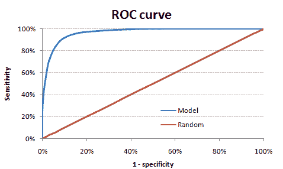

ROC 曲线是衡量模型性能比随机猜测好多少的指标。随机猜测是在客户流失 5%的情况下，随机猜测者猜测每 20 个客户中有一个会被标记为潜在的流失者。在这种情况下，随机猜测将在随机标记所有顾客的 20%之后捕获所有搅动者的 20%。

模型的预测能力在于能够尽可能接近 100%的准确性，也就是说，尽可能远离随机猜测。

**曲线下面积** ( **AUC** )是模型曲线和随机猜测曲线之间面积的度量。AUC 越高，模型的预测准确性越高。

# 机器学习和深度学习的区别

到目前为止，我们已经了解了各种机器学习算法在高层次上是如何工作的。在这一部分，我们将了解深度学习与机器学习的不同之处。

机器学习任务的一个关键属性是输入由分析师或数据科学家给出。通常，特征工程在提高模型的准确性方面起着关键作用。此外，如果输入数据集是非结构化数据集，特征工程会变得更加棘手。通常情况下，它归结为个人在获取相关特征以建立更准确的模型方面的知识。

例如，让我们想象一个场景，给定一个句子中的一组单词，我们试图预测下一个单词。在这种情况下，传统的机器学习算法如下工作:

*   对句子中的每个单词进行一次性编码
*   使用独热编码向量表示单词的输入序列
*   表示输出字，也使用一个独热编码向量
*   通过优化相关损失函数，建立模型以预测给定输入单词集的输出单词向量

虽然前面的方法可行，但我们在构建模型时面临三个主要挑战:

*   独热码编码向量的维数:
    *   一段文本可能有成百上千个独特的单词
    *   高维数据可能会导致多种问题，例如多重共线性和构建模型所需的时间
*   输入数据集中缺少单词顺序
*   两个单词之间的距离是相同的，不管这两个单词是否相似:
    *   例如，在一个独热编码向量场景中，国王和王子之间的距离与国王和奶酪之间的距离相同

在这种情况下，深度学习就派上了用场。使用深度学习中的一些技术(例如，Word2vec)，我们将能够解决刚才列出的问题中的以下问题:

*   以这样的方式在低维空间中表示每个单词:彼此相似的单词具有相似的单词向量，而彼此不相似的单词不具有相似的向量
*   此外，通过在低维空间(比如 100)中表示一个单词，我们将解决数据的高维度问题

Word2vec 技术有多种变体，比如连续词袋模型和连续跳格模型。

CBOW 模型的架构如下:

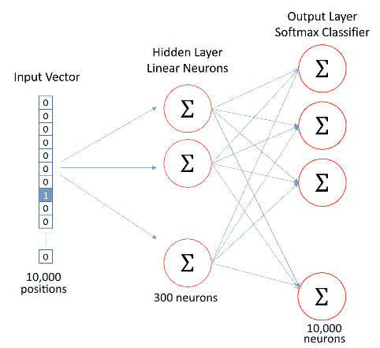

注意，输入向量是独热编码版本(正如我们在典型的机器学习模型中使用的)。隐藏层神经元确保我们在 300 维的单词向量中表示 10，000 维的输入向量。

输出层中的实际值表示周围单词(形成上下文)的一次性编码版本。

深度学习中另一种可以方便解决前面问题的技术是**循环神经网络** ( **RNN** )。RNN 致力于解决传统机器学习在之前的场景中面临的单词序列问题。

RNN 提供每个单词向量，以便预测序列中的下一个单词。RNN 如何工作的更多细节将在不同的章节中提供。RNN 技术的流行变体有**长短期记忆** ( **LSTM** )和**门控循环单元** ( **GRU** ):

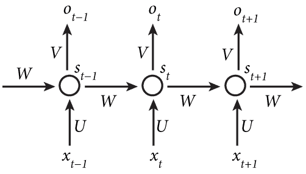

上图代表一个典型的 RNN，其中 *x [(t-1)]* ，*x[(t)]*和 *x [(t+1)]* 代表每个时间段内的单词， *W* 是预测下一个单词时与前一个单词相关联的权重， *O [(t)]* 是时间 *t 内的输出*

当需要与序列中更早出现的单词相关联的权重在预测下一个单词时，LSTM 就派上了用场。

神经网络的变体 Word2vec 和 RNN 的组合有助于避免给定文本数据的特征工程的挑战。

为了固化我们对机器学习和深度学习区别的理解，我们再来看一个例子:预测一个图像的标签。

我们将使用一个经典的例子——MNIST 数据集(在以后的章节中，我们将更多地使用 MNIST)。

MNIST 数据集包含从 0 到 9 的各种数字的图像。每个图像的大小为 28 x 28 像素。任务是通过分析各种像素值来预测图像的标签。MNIST 数据集中的样本图像如下所示:

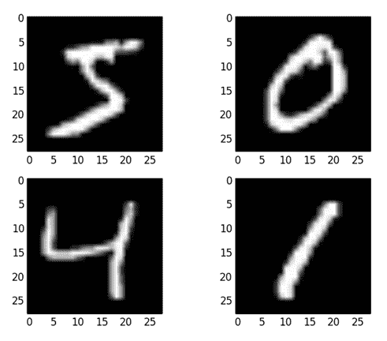

传统的机器学习解决前面的问题如下:

*   将每个像素视为一个单独的变量；也就是说，我们总共有 784 个变量
*   对标签列进行一次性编码
*   预测标签出现的概率

我们解决上述问题的方式面临的挑战如下:

*   该模型将不考虑像素邻接
*   该模型将不考虑图像的平移或旋转

例如，当图像适当移动时，零看起来可能像六，反之亦然。类似地，如果所有图像都是使用数据集训练的，该数据集的所有数字都位于图像的中心，但是测试数据集的图像稍微向右或向左偏移，则预测很可能不准确。这是因为模型会为每个像素设置一个权重。

为了解决前面的问题，一种名为**卷积神经网络** ( **CNN** )的深度学习技术派上了用场。CNN 的工作方式是在区域级别而不是像素级别分配权重。本质上，这形成了卷积神经网络的卷积部分。这样，通过使用深度学习来考虑像素邻接。

类似地，CNN 中使用的一种称为 **max pooling** 的技术可以解释图像的转换。

CNN 的典型结构如下，更多细节将在后面的章节中解释:

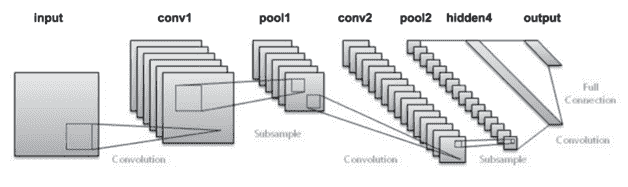

在上图中，输入是我们考虑的图像。 **conv1** 是滤波器和输入之间应用卷积时的输出。假设我们应用多个过滤器，我们将有多个卷积，并且**池 1** 是在卷积输出上应用池化的输出。卷积和汇集的过程被重复应用，直到我们获得最终的完全连接的单元，该单元然后被链接到输出。

# 深度学习的应用

在上一节中，我们了解了为什么深度学习在某些应用中比机器学习更有优势。让我们来看看深度学习的一些应用:

*   从一种语言到另一种语言的翻译
*   语音到文本转换
*   多个行业中的图像分析
*   识别图像中的文本
*   图像和音频合成
*   个性化以预测用户可能观看/购买的下一部电影/产品
*   时间序列分析
*   检测罕见事件

# 摘要

在这一章中，我们了解了监督学习和非监督学习之间的主要区别，并概述了主要的机器学习算法。通过文本和图像分析的例子，我们还了解了深度学习算法优于传统机器学习算法的领域。